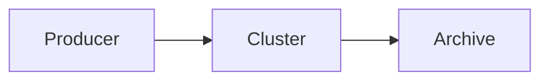

# Signal Grid 日常开发维护手册

这份文档用于维护新博客仓库 `signal-grid-blog`。旧博客 `lcha-reln.github.io` 与本项目相互独立，不要把两个仓库的分支或部署配置混用。

## 1. 项目固定信息

- 本地目录：`/Users/reln/signal-grid-blog`
- GitHub 仓库：<https://github.com/lcha-reln/signal-grid-blog>
- 主分支：`main`
- 生产地址：<https://lcha-reln.github.io/signal-grid-blog/>
- 内容后台：<https://app.pagescms.org>
- 技术栈：Astro、Pages CMS、GitHub Pages、Pagefind、Mermaid
- CI 运行时：Node 24、pnpm 10.30.3

本地也应使用 Node 24，开始工作前先核对：

```bash
cd /Users/reln/signal-grid-blog
node --version
pnpm --version
```

`pnpm --version` 应为 `10.30.3`。版本来源同时记录在 `package.json#packageManager` 和部署 workflow 中。

## 2. 每次开始工作的标准流程

```bash
cd /Users/reln/signal-grid-blog
git status --short --branch
git switch main
git pull --ff-only
pnpm install --frozen-lockfile
pnpm dev
```

浏览器打开：

```text
http://localhost:4321/signal-grid-blog/
```

注意：

- 如果 `git status` 显示有未提交修改，先提交到自己的分支或暂存，不要直接拉取远端。
- 使用 `--frozen-lockfile`，避免安装依赖时无意修改 `pnpm-lock.yaml`。
- 本项目是 GitHub Project Pages，开发地址和生产地址都带 `/signal-grid-blog/`，不是域名根路径。

## 3. 推荐的本地开发流程

不要在复杂改动期间长期占用 `main`，建议为每项工作创建分支：

```bash
git switch main
git pull --ff-only
git switch -c feature/short-description
pnpm dev
```

完成后运行：

```bash
pnpm check
pnpm build
git diff --check
git status --short
```

确认无误再提交：

```bash
git add <本次修改的文件>
git commit -m "feat: describe the change"
git push -u origin feature/short-description
```

然后在 GitHub 创建 PR，合并到 `main`。小型、明确且已经完整验证的维护改动也可以直接提交到 `main`，但推送前仍要运行完整构建。

常用提交前缀：

- `content:` 新增或更新文章
- `feat:` 新功能
- `fix:` 修复问题
- `style:` 纯视觉调整
- `docs:` 文档
- `chore:` 依赖、配置和例行维护

## 4. 用 Pages CMS 写文章

1. 打开 <https://app.pagescms.org>，登录 GitHub。
2. 确认仓库选择 `lcha-reln/signal-grid-blog`，分支选择 `main`。
3. 进入“文章”，创建或编辑内容。
4. 新文章先主动打开“草稿”开关；当前 CMS 默认值为 `false`，不要在半成品状态下误发布。
5. 完成后填写摘要、分类和标签，选择“学习路径”并设置“路径排序”，再将 `draft` 改为 `false` 保存。

Pages CMS 保存后会直接创建 Git commit，并触发 GitHub Pages 部署。它不是一个独立数据库，正文始终保存在仓库的 `src/content/posts/` 中。

写作时要遵守：

- `permalink` 是文章公开地址，只允许小写英文、数字和连字符，例如 `aeron-cluster-basics`。
- `permalink` 必须全站唯一，发布后尽量不要修改。
- 修改已发布文章时补充 `updated`。
- 日期使用带时区的 ISO 格式，例如 `2026-08-12T16:00:00+08:00`。
- 草稿不会进入首页、文章列表、搜索、RSS 或 sitemap。
- 不要同时在 Pages CMS 和本地修改同一篇文章；CMS 保存后，本地继续工作前先 `git pull --ff-only`。

如果 `main` 将来开启强制 PR 保护，需要同时确认 Pages CMS GitHub App 有写入权限，否则 CMS 会保存失败。

## 5. 在本地写文章

文章放在 `src/content/posts/`。建议文件名使用 `YYYY-MM-DD-short-name.md`，但公开 URL 由 `permalink` 决定，不由文件名决定。

最小模板：

```yaml
---
title: 文章标题
description: 用于首页、搜索和分享卡片的摘要
date: 2026-08-12T16:00:00+08:00
updated: 2026-08-12T16:00:00+08:00
categories:
  - Aeron
tags:
  - Aeron
  - Cluster
permalink: aeron-cluster-basics
series: aeron
seriesOrder: 1
featured: false
draft: true
---

从这里开始写正文。
```

本地预览也会过滤草稿。如果必须检查最终主题效果，可以只在本地工作分支暂时设置 `draft: false`；未完成时不要合入 `main`。

### 图片

- 图片文件放在 `public/images/posts/`。
- Markdown 地址必须写成 `/signal-grid-blog/images/posts/<文件名>`。
- 推荐使用压缩过的 WebP；图片需写有意义的替代文字。

```markdown

```

不要写 `/images/posts/...`，否则生产环境会绕过项目 base 路径并返回 404。

### 站内链接

```markdown
[阅读下一篇](/signal-grid-blog/posts/next-article/)
```

不要写 `/posts/...`。Astro 组件中的链接应调用 `sitePath()`，不要手工拼域名或根相对路径。

### Mermaid

使用标准 fenced code block：

````markdown

````

Mermaid 只在实际存在图表的页面加载。语法问题不一定让 Astro 构建失败，因此发布前要在浏览器中检查图表，并分别看一次深色和浅色主题。

### 学习路径归类

`series` 与 `seriesOrder` 是正式学习路径的唯一依据。`series` 可选：

- `aeron`
- `etcd`
- `zookeeper`
- `trading`
- `availability`
- `performance`
- `meta`

`seriesOrder` 只负责排序：数值越小越靠前，页面会自动显示连续的 Chapter 编号。通常从 1 递增；若预计会频繁插入章节，也可以使用 10、20、30 这样的间隔值。同一路径内不要重复。标签只用于搜索与文章说明，不决定专题归属。若增加新专题，需要同时修改站点配置、内容 schema、Pages CMS 选项和专题页面。

## 6. 构建、预览与验收

快速检查：

```bash
pnpm check
```

完整生产构建：

```bash
pnpm build
```

`pnpm build` 会依次执行：

1. `astro check`
2. `astro build`
3. `pagefind --site dist`

不要只运行 `astro build`，否则全文搜索索引不会刷新。

检查最终静态产物：

```bash
pnpm preview
```

至少检查：

- 首页桌面版和手机宽度
- 新文章详情页及 `EDIT ON GITHUB` 链接
- 明暗主题
- 图片、代码块、表格和 Mermaid
- 搜索结果能否进入 `/signal-grid-blog/posts/.../`
- RSS 与 sitemap

关键产物应存在：

```text
dist/index.html
dist/posts/<permalink>/index.html
dist/rss.xml
dist/sitemap-index.xml
dist/pagefind/pagefind.js
```

`dist/`、`.astro/` 和 `node_modules/` 都不应提交。

## 7. 发布与部署

任何进入 `main` 的 commit 都会触发 `.github/workflows/deploy.yml`，包括：

- 本地直接 push
- PR 合并
- Pages CMS 保存

查看部署：

```bash
gh run list --workflow deploy.yml --limit 5
gh run watch <RUN_ID>
```

手动重新触发当前 `main`：

```bash
gh workflow run deploy.yml --ref main
```

部署成功后检查：

- <https://lcha-reln.github.io/signal-grid-blog/>
- <https://lcha-reln.github.io/signal-grid-blog/rss.xml>
- <https://lcha-reln.github.io/signal-grid-blog/sitemap-index.xml>
- 本次新增或修改的文章 URL

短时间连续 push 时，旧的部署任务可能被最新任务取消。这是 workflow 的 `cancel-in-progress: true` 在工作，以最新 `main` 的 run 为准。

仓库 Settings → Pages → Source 必须保持为 **GitHub Actions**。

## 8. 依赖升级

Dependabot PR 不要看到绿色按钮就直接合并。每个 PR 单独验证：

```bash
gh pr checkout <PR_NUMBER>
pnpm install --frozen-lockfile
pnpm check
pnpm build
pnpm preview
```

重点回归：Markdown 渲染、搜索、Mermaid、明暗主题和带 base 的链接。

查看过期依赖：

```bash
pnpm outdated
```

小范围升级：

```bash
pnpm up <package>
pnpm build
```

Astro 主版本或 TypeScript 主版本升级必须单独开分支，先看迁移说明。不要一次执行 `pnpm up --latest` 升级全部依赖。升级后应同时提交 `package.json` 和 `pnpm-lock.yaml`。

如果升级 Node 或 pnpm，还要同步检查：

- `package.json#packageManager`
- `.github/workflows/deploy.yml`
- 本文档记录的版本

## 9. 安全回滚

如果构建失败，GitHub Pages 不会覆盖上一版成功部署，修复失败提交即可。

偶发 runner 或网络故障可以先重跑：

```bash
gh run rerun <RUN_ID> --failed
gh run watch <RUN_ID>
```

如果错误版本已经成功上线，在 `main` 创建一个 revert commit：

```bash
git switch main
git pull --ff-only
git log --oneline -10
git revert <BAD_COMMIT_SHA>
pnpm install --frozen-lockfile
pnpm build
git push origin main
```

坏改动是 merge commit 时：

```bash
git revert -m 1 <BAD_MERGE_SHA>
```

发生冲突时，解决后执行 `git revert --continue`，再构建和推送。

不要对共享的 `main` 使用 `git reset --hard` 加 force push。Pages CMS 误删文章或图片也应 revert 对应 Git commit，这样文件和历史都能恢复。

## 10. `/signal-grid-blog/` 路径不变量

当前站点是 GitHub Project Pages。以下配置必须保持一致：

- `astro.config.mjs`：`base: "/signal-grid-blog"`
- `src/config.ts`：生产 URL 包含 `/signal-grid-blog/`
- Astro 组件：使用 `sitePath()` 或 `import.meta.env.BASE_URL`
- `.pages.yml`：图片输出为 `/signal-grid-blog/images/posts`
- Markdown 图片和站内链接：显式带 `/signal-grid-blog/`
- `public/robots.txt`：sitemap URL 包含 `/signal-grid-blog/`

新增页面或组件后可以扫描可疑的根相对路径：

```bash
rg -n 'href="/|src="/|fetch\("/|\]\(/' src public
rg -n 'signal-grid-blog|lcha-reln.github.io' astro.config.mjs src public .pages.yml README.md MAINTENANCE.md
```

如果将来绑定自定义域名，需要成组修改 Astro `site/base`、`SITE.url`、Pages CMS 图片输出、robots、Markdown 中的硬编码内链，并重新执行完整构建。只改其中一处会产生双重 base 或 404。

## 11. 常见故障

### Pages CMS 看不到仓库或文章配置

- 检查 Pages CMS GitHub App 是否有 `signal-grid-blog` 的访问权限。
- 确认选中的是 `main`。
- 确认仓库根目录存在 `.pages.yml`。

### 新文章没有上线

- 检查 `draft` 是否仍为 `true`。
- 查看最新 GitHub Actions run。
- 核对 `permalink` 是否唯一且只含小写英文、数字、连字符。

### 图片 404

- 核对文件是否在 `public/images/posts/`。
- 核对正文 URL 是否以 `/signal-grid-blog/images/posts/` 开头。
- 注意文件名大小写；GitHub Pages 区分大小写。

### 页面或静态资源 404

通常是新代码写了不带 base 的 `/...` 根路径。使用第 10 节的 `rg` 命令扫描。

### 搜索不可用

- 确认运行了完整的 `pnpm build`。
- 确认 `dist/pagefind/pagefind.js` 存在。
- 开发服务器中的搜索体验不等于最终 Pagefind 索引，以 `pnpm preview` 为准。

### Mermaid 空白或报错

- 检查 fenced code block 的语言是否为 `mermaid`。
- 打开浏览器控制台查看语法错误。
- 在生产预览中复现，并检查深色与浅色主题。

### 本地通过、CI 失败

- 先确认本地是否使用 Node 24 和 pnpm 10.30.3。
- 使用 `pnpm install --frozen-lockfile` 后重新构建。
- 不要提交由其他 pnpm 大版本生成的锁文件。

### Actions 构建通过但部署失败

- 先重跑失败 job。
- 检查 Settings → Pages → Source 是否为 GitHub Actions。
- 检查 workflow permissions 与 `github-pages` environment。

## 12. 关键文件索引

```text
.pages.yml                         Pages CMS 表单与媒体配置
.github/workflows/deploy.yml       GitHub Pages 部署
astro.config.mjs                   Astro site/base、Markdown、sitemap
src/config.ts                      站点信息、base 路径工具、专题配置
src/content.config.ts              文章 frontmatter schema
src/content/posts/                 Markdown 文章
src/lib/content.ts                 URL、排序、摘要、专题归类
src/components/SignalHero.astro    首页信号拓扑
src/styles/global.css              全站与首页主题样式
src/styles/prose.css               文章正文样式
public/images/posts/               文章图片
```

维护时优先保持三件事：内容仍是可迁移的 Markdown、生产 URL 不丢 base、`main` 始终可以完整构建。
