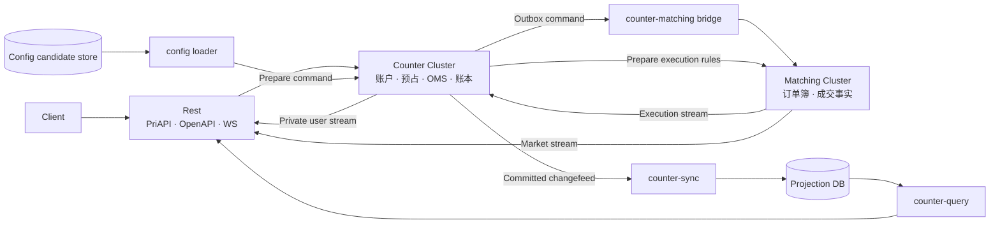
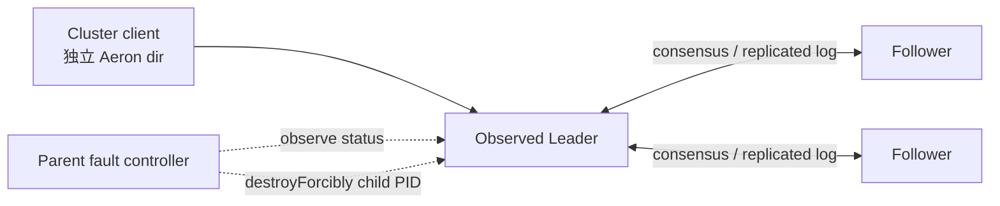

# 高可用 CEX 交易核心实战课程设计

> 状态：M00～M15 均为 `PUBLISHED`；Matching 已交付 `matching-1.0.1`，Counter/Rest 仍为候选。
>
> 规划日期：2026-08-26
>
> `planVersion`：`0.18`
>
> 当前最新签约单元合同 `planVersion`：`0.18`（M15）
>
> 当前推荐动作：从 `course/m15.1-complete` 复验固定制品、停服升级回滚、冷备恢复与 M15-O1 资格；本轮撮合任务在 `matching-1.0.1` 停止，不创建 Counter/Rest 仓库。
>
> 案例 slug：`high-availability-cex`
>
> 当前 Profile：`SPOT-CEX-1.0`
>
> 当前规划基线：`SPOT-CEX-1.0` 的 33 个候选交付单元（Matching 16 + Counter 10 + Rest 7），3 个按门禁顺序创建的代码仓库；M00–M15 已发布，Matching 达到 matching-1.0.1 停止点，Counter/Rest 仍候选且不创建仓库
>
> 保留的 M13 发布边界：annotated `course/m13-complete` 指向 clean commit `eb1b65d2ea2159ba607e3271f0bfd209ea4906ea`。干净普通 clone 的完整 `clean build m13Evidence` 通过；tag-bound fresh run 验证 10 个场景、seed 6313 的 64×64=4,096 个生成动作、6 个语义 mutant、两个独立三成员组及六个同时运行的 child JVM。`cex.lab-evidence.v2` manifest SHA-256 `7a1c5b677f088ccd46b9f4e523151496910aea8874683799b347d57be819ecd7` 绑定 1 项有限正确性 claim、9 条 limitation 与 204 个 artifact；五篇教程和公开 evidence 一起登记。M13 不登记 Lab 或产品 release，产品停止点仍为 `matching-0.8.0`。
>
> 保留的 M12 发布边界：M00～M12 均为 `PUBLISHED`。M12 的 annotated `course/m12-start` peeled 到 `43b0bbf853a1ffefeb1d5a87d791f4eb387b1cbf`，以 workload SHA-256 `20ed1e75cd3cd86dc15a7f1f64465524a5638757abe676eb51f20bc5423b89a1` 冻结结构化 RED；annotated `course/m12-complete` 与 annotated `matching-0.8.0` 均 peeled 到 clean commit `d8b1b1fbb36323502495a8bc0a60042db1e9e040`。tag-bound fresh run 以 `appointedLeaderId=-1` 自动选举，完成 14 个固定场景、85 次 invocation（84 accepted、82 ACK、2 UNKNOWN、1 NOT_SUBMITTED）、25 项 obligation、8 个 semantic mutant 与 3 个 `SYSTEM_ERROR` control；`cex.lab-evidence.v2` manifest SHA-256 `e25ff7069a831a56cc42b1ebd7d5aaf0cde39b6158caf1e68b8725b0f8862983` 绑定 10 项 claim、15 条 limitation 与 33 个 artifact，五篇教程已原子公开

## 1. 这份文档决定什么

这份文档是“高可用 CEX 交易核心”实战案例的范围、课程含义和治理规则单一事实源。它固定项目边界、演进顺序、候选能力地图、停止点、教学方法和验收制度，但不提前固定尚未进入实施窗口的类图、表结构、协议字段或依赖版本。

网站中的 [实战案例配置](../src/practice/config.ts) 是公开状态、当前规划数量和页面里程碑的机器可读来源，并携带 `planVersion`。范围或课程语义变化必须先在本文评审，同一次变更再同步配置并提高 `planVersion`；生命周期、仓库 URL 和证据链接等实施状态也要同步，但不制造新的计划版本。轻量一致性门禁属于 `signal-grid-blog` verifier，至少校验案例 slug、当前 SPOT Profile 三个项目的候选单元数和命名停止点；代码仓库只记录所对应的 `planVersion`，绝不反向 checkout 或解析博客源码。

本课程要解决的不是“怎样快速拼出一个能下单的 Demo”，也不是在首版里同时实现所有金融产品，而是：

> 怎样从一个可证明正确的限价单撮合内核开始，先交付边界清楚、可恢复、可运维、证据完整的高可用现货核心，再在每个前置 Profile 真正通过资格审查后，分别引入债务、持仓重估、到期结算和非线性风险？

路线图可以完整，实施级设计默认只覆盖当前和下一个单元；只有用户明确批准的连续批次可以预先签约，但代码窗口永远只有当前单元。M01～M10 已逐步完成输入验证、撮合语义、运行控制、本地 WAL、durable idempotency、Snapshot、有界恢复，以及单机持久运行时有界准入与环境绑定性能包络的 RED→GREEN→evidence→内容发布闭环。PLAN v0.14 已让 M11 以同样流程完成真实单节点 Aeron Cluster Adapter：core 保持无 Aeron，Cluster log/snapshot 成为唯一恢复真相，并用 application request/response/snapshot current2/minReadable1 codec、六份 Golden 与 Direct/Cluster/restart 规范化业务等价验收。PLAN v0.15 又在这个基线上完成 M12：单机、单分片、三个独立 voting-member child JVM，外部 controller 杀死观测到的 Leader，客户端以同一 durable identity 收敛 UNKNOWN；每个保留状态重启都实时读取 Aeron 1.52.2 Archive mark-file 活动时间戳，并仅在活动年龄严格大于 10,000 ms liveness timeout 后继续；former Leader 随后以 Follower 追赶，无 quorum 时拒绝确认。tag-bound fresh run 的初始 Leader 为 member 2/term 0，replacement 为 member 0/term 1；最终三个 member 的 identity count=66，semantic digest 与 identity/result digest 均匹配 Direct oracle。Backup、分区矩阵、性能、升级、多分片、下游输出、Counter/Rest/DB 与外部副作用继续排除。任何超出已签约单元合同的能力，必须删除等量范围、拆分单元或进入 backlog。

PLAN v0.16 根据用户“继续任务，将撮合这部分处理完”的授权评审剩余范围：只把 M13 静态权威路由与 shard 内多订单簿升级为合同；M14 继续聚焦可续接业务输出，不再承担产品 release；新增候选 M15，以 release operational qualification 承接受控 N/N-1 升级/回滚、cold backup/restore 和环境绑定集群容量与运行诊断。`matching-1.0.1` 移到 M15，保留其升级恢复与运行资格承诺。M00–M12 的冻结合同、ref、Golden 和历史 evidence 不回写，本轮不创建 Counter/Rest 仓库。

PLAN v0.17 在已发布 M13 后只签约 M14 可续接业务输出：显式 OutputGenesis、真实账户归属、per-shard Execution/Market 双流、同 apply 的可恢复 outbox、独立 durable cursor/publisher authority、whole-shard Market snapshot 与 Q1 有界积压共同构成一个连续消费合同。M13 的已发布合同、固定 ref 和原始 evidence 保留；M15 仍候选，33 单元及三个仓库门禁不变。签约时只冻结合同、输入与 RED 入口，当时不提前实现输出或创建文章；当前 M14 已完成固定身份、fresh 资格、五篇教程与公开 evidence 的发布登记，冻结语义保持不变。

PLAN v0.18 在 M14 代码、五篇教程、Pages 与全部公开 evidence 完整发布后签约 M15 发布制品运行资格。旧路线段落按各自合同时间点保留；当前 M15 状态与完整边界以 §8.17 为准。唯一新增维度为固定制品的运行资格：全停服 M14→N→M14 保留 N 新提交、完整 stopped backup 的新根恢复、环境绑定的真实 Cluster 到达/过载/资源与有限历史恢复。M15-O1、22 个 aggregate case 及全部变体、6250 个逻辑到达、五篇标题/地址与证据预算在不可移动 start 之前固定；签约时不提前实现或创建教程；当前不可移动起点已通过独立 GREEN/RED，matching-1.0.1 仍为目标。

## 2. 旧专题为何失败，以及本次怎样避免重演

旧专题的三个失败原因直接变成本课程的硬约束。

| 旧问题                                | 新约束                                                                                                                           |
| ------------------------------------- | -------------------------------------------------------------------------------------------------------------------------------- |
| 所有项目集中在一个 Git 仓库，持续膨胀 | Matching、Counter、Rest 是三个独立仓库，并且只在前一个项目通过 1.0 门禁后创建下一个仓库                                          |
| 试图第一天设计全部商用功能            | M00 只建立可执行规格，M01 只实现单交易对 GTC 限价单；每个单元只增加一个复杂度维度                                                |
| 没有分步大纲，一股脑向前推进          | 当前 SPOT Profile 的 33 个交付单元均有能力边界；只有进入窗口的单元才签订完整 `adds / delivers / excludes / gate / evidence` 合同 |
| 过早引入 Aeron Cluster                | Matching 先完成正确、可恢复、可度量的单机实现，M11 才接入 Aeron Cluster                                                          |
| 页面或代码声称未来能力已经存在        | 未发布单元不创建空 Markdown、空模块、空服务或虚假完成度                                                                          |

## 3. 商用 Profile 路线与当前范围

“商用”在这里不是把所有交易产品一次塞进同一个实现，而是每次选定一个可以完整验收的产品 Profile，把其功能、故障语义、容量边界和运维证据做全，再决定是否解锁下一个产品模型。

### 3.1 顶层产品 Profile 路线

**现货是第一份完整交付，不是专题终点**

只有当前 Profile 展开单元、仓库与实施设计；LOCKED 只冻结产品方向和解锁门禁，不代表已经创建单元、仓库或服务；后续优先复用已发布的 Matching、Counter 与 Rest 边界，具体仓库拓扑在解锁时评审。

| Profile                | 状态      | 标题                       | 相对前一 Profile 唯一新增的领域复杂度                               | 解锁门禁                                  |
| ---------------------- | --------- | -------------------------- | ------------------------------------------------------------------- | ----------------------------------------- |
| `SPOT-CEX-1.0`         | `CURRENT` | 单地域、高可用现货交易核心 | 现金资产交换在 Matching、Counter 与 Rest 之间形成可恢复闭环。       | 当前从 M00 开始，只展开 SPOT 单元与仓库   |
| `MARGIN-SPOT-1.0`      | `LOCKED`  | 杠杆现货                   | 以债务为核心，引入借贷、计息、抵押品、逐仓/全仓、风险率与强制减仓。 | SPOT-CEX-1.0 资格审查通过后再评审         |
| `PERP-CEX-1.0`         | `LOCKED`  | 永续合约                   | 无到期日持仓按标记价持续重估，并引入资金费率、保险基金与 ADL。      | MARGIN-SPOT-1.0 资格审查通过后再评审      |
| `DELIVERY-FUTURES-1.0` | `LOCKED`  | 交割合约                   | 到期时刻驱动交易停止、结算价、交割或现金结算与终局对账。            | PERP-CEX-1.0 资格审查通过后再评审         |
| `OPTIONS-CEX-1.0`      | `LOCKED`  | 期权                       | 非线性收益引入 Greeks、波动率、组合保证金、行权与指派。             | DELIVERY-FUTURES-1.0 资格审查通过后再评审 |

这五个 Profile 是产品教学顺序，不是五套已经承诺的实施大纲。后四个 Profile 目前没有单元、仓库、起点 tag 或发布日期；进入评审时必须重新建立自己的单元合同、停止点和商用资格证据。现货的 33 个单元和 3 个仓库也不能被解释成全路线总量。

`MARGIN-SPOT-1.0` 单独存在，是因为杠杆现货的首要难题是债务生命周期，不是合约仓位；永续、交割和期权则依次引入持续重估、到期事件和非线性风险。这个顺序使每个新 Profile 只改变一个主要领域心智模型。

### 3.2 `SPOT-CEX-1.0` 包含

- 单地域部署，Matching 和 Counter 均能在单节点故障后恢复服务；
- 多现货交易对，按版本化静态规则路由到 Matching shard；
- GTC、IOC、FOK、Post-only 和有价格保护的市价执行语义；
- 价格时间优先、部分成交、撤单、Mass Cancel、STP、市场状态和价格保护；
- 用户订单意图、可用资产、冻结资产、成交结算、maker/taker 手续费和双式账本；
- Matching 与 Counter 之间可重试、可去重、可检测缺口的命令和事件协议；
- Counter 的权威内存状态、Cluster snapshot/log 恢复，以及 Sync 异步数据库投影；
- PriAPI、OpenAPI、公共/私有 WebSocket、认证、签名、限流和协议兼容；
- 过载、备份恢复、升级回滚、对账、故障演练、容量报告和 Runbook。

### 3.3 `SPOT-CEX-1.0` 明确不做

- 充值、提现、钱包、链节点和托管侧对接；
- KYC、AML、法币、监管报送和运营后台；
- 杠杆现货的借贷、利息、抵押品、逐仓/全仓风险率与强制减仓；
- 永续、交割和期权的仓位、保证金、资金费率、到期结算、行权、强平和 ADL；
- 多地域 Active-Active、在线拆分活跃订单簿和自动再均衡；
- FIX、托管专线、撮合共址和做市商专属通道；
- 用户账号体系之外的完整 IAM 平台；
- 在线代码判题、远程 Java 沙箱、云端学习档案和证书系统。

用户债务、仓位、保证金和合约公共数据的最终权威仍属于 Counter，但它们进入对应的后续 Profile。当前 SPOT Profile 只冻结这个所有权决定，不预建 `Loan`、`Position`、`MarginSchedule`、强平服务或数据库表。这样既保留柜台的正确边界，也不让未来清算模型重新拖垮现货交付。

### 3.4 “完整”不等于“没有边界”

`SPOT-CEX-1.0` 完成时，读者交付的是一个完整的交易核心 Profile，而不是整个交易所公司：入口能接收请求，Counter 能做准入和冻结，Matching 能形成成交，Counter 能结算和记账，查询与推送能恢复，节点故障、数据库中断、重复消息和升级回滚均有可复核证据。被排除的业务不会用占位接口伪装完成。

### 3.5 读者前置与毕业能力

目标读者是具备 Java 后端开发经验、愿意在本地运行多进程和 Docker 实验的工程师。开始 M00 前应能阅读 Java、使用 Git 与 Gradle、编写单元测试，并理解基本的数据结构、数据库事务、Linux 进程和网络超时。Aeron、复制状态机、低延迟测量和交易领域知识按单元提供前置理论链接，不要求开课前一次性学完。

完成 `SPOT-CEX-1.0` 后，读者应能：

- 用不变量、参考模型、可重放历史和 semantic mutant 证明撮合语义；
- 区分单机 WAL、Cluster log、snapshot、业务幂等和外部副作用的不同保证；
- 设计 Matching 与 Counter 的状态所有权、Saga、gap recovery 和对账；
- 建立权威状态、Changefeed、Projection DB 和查询新鲜度之间的边界；
- 为 PriAPI、OpenAPI 和 WS 定义超时、重试、顺序、恢复与兼容契约；
- 通过故障、容量、升级和恢复证据判断一个 Profile 是否真的达到发布门禁。

## 4. 终局架构与状态所有权



这张图表达状态所有权，不规定第一天就部署这些进程。

| 状态或事实                                                      | 权威所有者                                | 非权威副本或消费者                       |
| --------------------------------------------------------------- | ----------------------------------------- | ---------------------------------------- |
| 订单簿、撮合顺序、成交事实、BBO、Depth                          | Matching                                  | Counter、Rest 行情投影                   |
| 用户下单意图、预占、OMS、资产、费用、账本                       | Counter                                   | Projection DB、Rest 私有推送             |
| 币种、现货品种目录、费率、准入和预占规则                        | Counter                                   | 配置候选库、Matching 兼容映射、Rest 缓存 |
| 在具体 execution sequence 生效的市场状态、STP、价格带和执行规则 | Matching                                  | Counter 保存兼容 RuleSet 映射，Rest 展示 |
| 历史订单、分页账本、查询视图                                    | Counter changefeed 可重建；数据库只是投影 | Rest 查询接口                            |
| API Key、权限策略和凭据生命周期                                 | Rest 的认证存储/KMS                       | Rest 实例缓存                            |
| HTTP 会话、限流桶、WS 连接                                      | Rest                                      | 可丢失并重建的普通微服务状态             |
| 借贷、利息、抵押品和风险率                                      | `MARGIN-SPOT-1.0` 中的 Counter            | 当前 SPOT Profile 不实现                 |
| 仓位、保证金、资金费率和强平状态                                | 对应合约 Profile 中的 Counter             | 当前 SPOT Profile 不实现                 |

### 4.1 Matching 的演进结论

Matching 不从 Aeron Cluster 脚手架开始。

```text
纯确定性内核
→ 正确的单机限价撮合
→ 可持久、可恢复、可度量的单机运行时
→ 单节点 Aeron Cluster Adapter
→ 三节点复制、切主与结果未知
→ 静态分片和可续接输出
→ 发布制品的升级、恢复与运行资格
```

M00–M10 不允许生产代码依赖 Aeron。M11 接入 Cluster 时，撮合算法保持不变，只替换命令排序、复制日志、snapshot 生命周期和对外响应适配。Cluster adapter 以不引用自研 WAL 为设计边界，避免两个恢复真相；发布证据只把它证明到完整 `ClusteredService` callback-reachable production source graph，不能把静态 source-reference count 解释成运行时写调用 counter。

### 4.2 Counter 的演进结论

Counter 是自己的复制状态机，不是“数据库前面的业务微服务”。当前 SPOT Profile 只有一个逻辑三节点 Counter Cluster group，maker/taker 双边账户在同一个状态机命令内结算；C09 只形成容量和未来分片证据，不实际分片。它仍先用纯 Java runner 证明账户、预占和账本内核的确定性，再在 C03 接入 Cluster runtime。

Counter 与 Matching 是两个权威边界，不能假装存在跨 Cluster 原子事务：

1. Counter 原子完成准入、资产预占和 Outbox 记录；
2. Bridge 使用稳定 `commandId` 向 Matching 至少一次投递；
3. Matching 对重复命令只产生一次业务效果；
4. Matching 以连续 sequence 输出成交和终态事件；
5. Counter Inbox 去重、检测 gap，并原子推进 OMS、资产、费用和账本；
6. 超时只表示 `UNKNOWN/PENDING`，不能擅自释放预占或声明订单失败；
7. 对账任务比较双方游标、订单终态和数量摘要，差异通过受审计命令修复，不能直接改权威数据库。

### 4.3 公共配置的启动与激活

“启动时从数据库加载到内存”的方向合理，但三节点不能各自读取数据库后自行决定当前规则，否则数据库瞬时状态、查询顺序或更新时间可能破坏复制状态机的确定性。

控制面候选规则和 Matching 实际执行规则有不同权威边界，激活必须按 fence 编排：

```text
配置候选库
→ config-loader 编译不可变 RuleSet artifact
→ schema + content hash 校验
→ Counter PREPARE 准入/费率规则和兼容映射
→ 所有受影响 Matching shard PREPARE 执行规则子集
→ 校验 RuleSet version + hash + route version
→ 在明确 execution fence 激活 Matching 规则
→ Counter 才允许使用对应版本接受新订单
```

- 全新空集群第一次 bootstrap 可以读取配置候选库并提交；
- 正常重启、切主和 replay 从 Cluster snapshot/log 恢复，不依赖配置数据库；
- 币种、交易品种、费率和 Matching 执行规则均有独立版本，并通过统一 artifact hash 建立兼容映射；
- 每张订单分别记录 `admissionRuleSetVersion`、Matching 返回的 `executionRuleSetVersion` 和结算使用的 `feeScheduleVersion`；
- 已经运行的集群在配置候选库不可用时仍能恢复现有激活版本；
- 更新采用 Prepare/Activate，不允许节点本地热刷新或半激活；
- 任一受影响 shard 未准备、hash 不匹配或 fence 不确定时，该交易对 fail closed；
- C01 用 test double 冻结协调合同，C04 接通真实传输，C09 完成跨 Cluster 故障门禁。

### 4.4 Sync 异步落库的评估结论

复制状态机中已 apply、随后驻留内存的权威实时状态异步投影到数据库是正确方向，但 `counter-sync` 不直接解析 Aeron Cluster 的内部原始日志。内部日志包含会话、计时器、snapshot 和实现细节，不是稳定的业务 CDC 契约。

Counter 在已提交并已 apply 的状态迁移中生成版本化领域 Changefeed，Sync 消费该权威有序流：

- canonical event batch 和 `domainSequence` 在 apply 时成为可恢复状态，snapshot 保存最后 applied sequence 与输出恢复位置；
- 外部发布允许重复，但从恢复位置 replay 后不能静默丢失；达到已验证的 Archive 持久化和 Projection Checkpoint 边界后才允许裁剪；
- 每条事件包含 `schemaVersion`、`domainSequence`、`accountVersion`、`clusterLogPosition`、`correlationId`、`causationId`、RuleSet version、aggregate type 和幂等事件 ID；
- Sync 在同一数据库事务中写查询表和推进消费游标；
- 重复事件不重复写，sequence gap 立即停止并触发 replay，而不是跳过；
- 投影恢复从已验证的 `ProjectionCheckpoint@S + Changefeed(S+1...)` 重建到相同摘要，不要求永久保留 genesis 后全部在线事件；
- 数据库不能反向覆盖 Counter，也不能作为 Counter 正常启动的恢复源；
- 查询响应暴露 `asOfVersion` 和 `projectionLag`，不把陈旧投影伪装成强一致状态；
- 数据库长时间不可用时，系统按积压与磁盘预算进入查询降级、`CANCEL_ONLY` 或 `HALTED` 等受控模式，而不是无限积压。

当前 SPOT Profile 的 Sync 是 Counter 仓库内的独立部署单元，不创建第四个 Git 仓库。

### 4.5 Rest 的边界

Rest 是独立普通微服务项目，不加入 Aeron Cluster，也不拥有交易事实。它维护 PriAPI、OpenAPI、WebSocket、认证、签名、限流、协议适配和连接状态；可以拥有认证凭据、权限策略和普通配置存储，但不能写 Counter 权威状态或 Counter Projection DB。

禁止以下调用：

- Rest 绕过 Counter 直接向 Matching 下单或撤单；
- Rest 读取或写入 Counter 的权威内部状态；
- Rest 消费原始 Raft/Aeron Cluster log；
- Rest 根据缓存自行决定余额、订单终态或成交结果；
- Matching、Counter、Rest 形成同步调用环。

Rest 初期是一个仓库和一个部署应用，内部划分 PriAPI、OpenAPI、WS 等逻辑模块。只有真实容量、安全边界或长期独立发布节奏得到证据后，才允许拆成多个部署服务。

## 5. 仓库、版本与创建门禁

本节的 3 个仓库、33 个交付单元和全部停止点只对应当前 `SPOT-CEX-1.0`。后续 Profile 解锁时优先复用已经稳定的 Matching、Counter 与 Rest 产品边界；只有领域所有权、容量隔离或独立发布节奏形成证据后才评审新仓或拆仓，不在这里预建空项目。

| 顺序 | 仓库                                                        | 创建条件                                                                                                               | 主要制品                                                             |
| ---: | ----------------------------------------------------------- | ---------------------------------------------------------------------------------------------------------------------- | -------------------------------------------------------------------- |
|    1 | [`cex-matching`](https://github.com/lcha-reln/cex-matching) | 已创建；M00～M12 均为 `PUBLISHED`，`matching-0.8.0` 已由 M12 clean commit、真实三成员 fault suite 与公开 evidence 发布 | Matching core、test-only reference、testkit、runtime、协议、故障实验 |
|    2 | `counter`                                                   | `matching-1.0.1` 发布并从干净环境复验                                                                                  | Counter core、Cluster runtime、bridge、sync、query                   |
|    3 | `rest`                                                      | `counter-1.0.0` 发布并从干净环境复验                                                                                   | PriAPI、OpenAPI、WS、system tests                                    |

不提前注册空仓库，不提前提交 README 骨架。下游仓库只消费上游已发布的版本化协议制品或容器镜像，不通过源码工程依赖重新形成巨型仓库。

每个单元使用不可移动的课程 tag：

```text
course/m00-start
course/m00-complete
course/m01-start
course/m01-complete
course/m02-start
course/m02-complete
course/m03-start
course/m03-complete
course/m04-start
course/m04-complete
course/m05-start
course/m05-complete
course/m06-start
course/m06-complete
course/m07-start
course/m07-complete
course/m08-start
course/m08-complete
course/m09-start
course/m09-complete
course/m10-start
course/m10-complete
course/m11-start
course/m11-complete
course/m12-start
course/m12-complete
```

发现错误时发布递增的补丁 tag，不移动旧 tag，例如 `course/m00.1-start`、`course/m00.2-start` 或 `course/m00.1-complete`。只有命名停止点才另外发布 `matching-0.1.0` 等产品 release；普通单元没有产品 release。

M00 bootstrap 连续暴露了两个必须诚实保留的起点缺陷：`course/m00-start` 因 `.gitignore` 误将 `buildSrc` 包目录识别为构建产物，表现为“bootstrap 任务源码未进入 Git”；`course/m00.1-start` 修复了任务源码，但仓内文档仍指向失败的原始起点。两者及其 CI 记录均不可移动或删除；当前由不改变 M00 业务语义、且代码与文档自洽的 `course/m00.2-start` 替代。教程和页面只引用当前补丁起点，不能把被替代 tag 伪装成通过。

M00 有一次 bootstrap 例外：先在 `main` 建立可正常构建但尚未完成 M00 目标的课程基线，再创建 `course/m00-start` 和 `unit/m00`。默认 `./gradlew build` 必须成功；单独运行 M00 课程验收命令时，应以结构化 `GOAL_NOT_IMPLEMENTED` 表示预期缺口，不能用编译错误、环境错误或整仓红 CI 充当教学起点。M00 完成后，`main` 才恢复为“最新完整通过单元”的常规含义。

### 5.1 命名停止点

| 停止点           | 对应单元 | 可独立交付的能力                                              |
| ---------------- | -------- | ------------------------------------------------------------- |
| `matching-0.1.0` | M03      | 正确、可证明的单交易对 GTC 限价撮合；不持久、不联网、不高可用 |
| `matching-0.5.0` | M10      | 可持久、可恢复、有容量证据的单机撮合                          |
| `matching-0.8.0` | M12      | 单机单分片三成员 Aeron Cluster，具备切主、重试和故障证据      |
| `matching-1.0.1` | M15      | 静态分片、可续接输出、升级恢复和环境绑定运行资格闭环          |
| `counter-0.1.0`  | C02      | 正确、可测试的单机账户和准入内核                              |
| `counter-0.5.0`  | C03      | 独立高可用 Counter，尚未连接 Matching                         |
| `counter-0.8.0`  | C06      | 下单、成交回报、资产和账本形成实时闭环                        |
| `counter-1.0.0`  | C09      | Sync、查询、对账、恢复和运维资格闭环                          |
| `rest-0.3.0`     | R02      | 第一方私有交易接口可用                                        |
| `rest-0.7.0`     | R04      | PriAPI、OpenAPI、公共/私有 WS 闭环                            |
| `rest-0.9.0`     | R05      | 普通微服务高可用和安全运行资格完成                            |
| `rest-1.0.0`     | R06      | 三项目组合通过最终 Profile 审查                               |

最终发布一个兼容版本集合，而不是跨仓库源码快照：

```text
SPOT-CEX-1.0
matching = matching-1.0.1
counter  = counter-1.0.0
rest     = rest-1.0.0
```

## 6. 教学与范围治理

### 6.1 滚动实施窗口

生命周期、设计深度和仓库门禁是三条独立轴，不能混成第二套状态机：

| 范围    | 生命周期    | 设计深度      | 仓库门禁               | 允许的工作                                                                                                                                                                                                                                                                                                                                                                                                                 |
| ------- | ----------- | ------------- | ---------------------- | -------------------------------------------------------------------------------------------------------------------------------------------------------------------------------------------------------------------------------------------------------------------------------------------------------------------------------------------------------------------------------------------------------------------------- |
| M00     | `PUBLISHED` | `CONTRACT`    | `CREATED`              | 代码、反例、四篇教程与持久 evidence 已验证并公开；停止在 VALID，不提前实现订单簿                                                                                                                                                                                                                                                                                                                                           |
| M01     | `PUBLISHED` | `CONTRACT`    | 随 `cex-matching` 仓库 | 单交易对 GTC 的价格时间优先、业务事件、固定历史、四篇教程、Matching Lab 与持久 evidence 已验证并公开                                                                                                                                                                                                                                                                                                                       |
| M02     | `PUBLISHED` | `CONTRACT`    | 随 `cex-matching` 仓库 | 可寻址撤单、不可逆终态、10/34 corpus、四篇教程、Matching Lab、语义变异体与 tag 绑定 evidence 已公开；停止在不持久的内存生命周期                                                                                                                                                                                                                                                                                            |
| M03     | `PUBLISHED` | `CONTRACT`    | 随 `cex-matching` 仓库 | 独立线性参考模型、SplitMix64 seed 6824、256×64 生成历史、四个 coverage lane、六项 mutant、反例缩小/持久化/重放、四篇教程、Matching Lab、持久 evidence 与 `matching-0.1.0` 已发布                                                                                                                                                                                                                                           |
| M04     | `PUBLISHED` | `CONTRACT`    | 随 `cex-matching` 仓库 | GTC/IOC/FOK/POST_ONLY 的 ExecutionPolicy、Accepted 后 IOC 余量取消、FOK 只读预检、POST_ONLY 原子准入、五篇教程、Matching Lab 与 tag-bound evidence 已公开；普通单元不创建产品 release                                                                                                                                                                                                                                      |
| M05     | `PUBLISHED` | `CONTRACT`    | 随 `cex-matching` 仓库 | content-addressed RuleSet、Prepare/Activate application fence、inclusive entry band、grandfathered attribution、五篇教程、Matching Lab 与 tag-bound evidence 已公开；普通单元不创建产品 release                                                                                                                                                                                                                            |
| M06     | `PUBLISHED` | `CONTRACT`    | 随 `cex-matching` 仓库 | market mode、mode fence、权限矩阵与 HALTED-only deterministic Mass Cancel 已由 15/64 fixed、160×64、26/26 coverage、10/10 mutant、五篇教程与 tag-bound evidence 闭环；无产品 release                                                                                                                                                                                                                                       |
| M07     | `PUBLISHED` | `CONTRACT`    | 随 `cex-matching` 仓库 | opaque participant group、taker-side `CANCEL_TAKER/CANCEL_MAKER/CANCEL_BOTH` 与四策略组合已由 16/72 fixed、160×64、24/24 coverage、8/8 mutant、五篇教程与 tag-bound evidence 闭环；无产品 release                                                                                                                                                                                                                          |
| M08     | `PUBLISHED` | `CONTRACT`    | 随 `cex-matching` 仓库 | 本地单写者 WAL、ACK 边界、durable identity/slot/epoch 与 genesis recovery 已由 20 fixed、96×48、24/24 coverage、10/10 mutant、三个 child JVM crash smoke、五篇教程与 tag-bound evidence 闭环；无产品 release                                                                                                                                                                                                               |
| M09     | `PUBLISHED` | `CONTRACT`    | 随 `cex-matching` 仓库 | 完整 state cut、连续 suffix、RecoveryBudget、whole-segment retirement 已由 22/88 fixed、96×40 generated + 65 budget prelude、32/32 obligation、9+3 candidate、五篇教程与 tag-bound evidence 闭环；无 Lab 或产品 release                                                                                                                                                                                                    |
| M10     | `PUBLISHED` | `CONTRACT`    | 随 `cex-matching` 仓库 | 有界准入、CI/release profile、open-loop/knee、M10Q2 降序长稳态晋级/final QOP 已由 20 fixed、64×256 generated、28/28 obligation、12/12 mutant、三次 1800 秒 attempt、五篇教程、tag-bound evidence 与 `matching-0.5.0` 闭环                                                                                                                                                                                                  |
| M11     | `PUBLISHED` | `CONTRACT`    | 随 `cex-matching` 仓库 | 真实单节点 Aeron Cluster Adapter、log-only apply、application request/response/snapshot current2/minReadable1 六份 Golden、Cluster snapshot/restart 与 Direct/Cluster 规范化业务等价，已由 22/22 fixed、28/28 obligation、32 条 assertion fact、10/10 production-derived candidate、3 个 SYSTEM_ERROR control、8,192 次真实 ingress、五篇教程与 tag-bound evidence 闭环；无产品 release、三节点故障或 Cluster 容量声明     |
| M12     | `PUBLISHED` | `CONTRACT`    | 随 `cex-matching` 仓库 | 单机三成员 child JVM、Leader fail-stop、UNKNOWN 同 identity 重试、Aeron 1.52.2 ArchiveMarkFile `age > 10000` 的三项保留状态重启 witness、former Leader 追赶、无 quorum 不 ACK 与 Direct identity/state 等价已由 tag-bound fresh run、五篇教程、33 个 artifact 与 `matching-0.8.0` 闭环                                                                                                                                     |
| M13     | `PUBLISHED` | `CONTRACT`    | 随 `cex-matching` 仓库 | 静态权威路由、多订单簿、两组六 JVM 故障隔离与恢复通过；10 场景、64×64 generated、6 mutant、204 artifact 与五篇教程公开，无产品 release                                                                                                                                                                                                                                                                                     |
| M14     | `PUBLISHED` | `IMPLEMENTED` | 随 `cex-matching` 仓库 | annotated `course/m14-complete` 指向 clean commit `56c4ec09ddf9fcf57f1cce763ae8b451ba7f394f`；[公开 manifest](https://lcha-reln.github.io/signal-grid-blog/practice/high-availability-cex/m14/evidence/manifest.json) 的 SHA-256 为 `7eb56335954e03a6792b8f9971b922e3bd45bf5dcbd60e47f1e5cedde3fb2081`；12 个本地场景、3840 个生成动作、8 项 mutant、3 项系统控制与七个真实进程 witness 通过，五篇与原始 evidence 一起登记 |
| M15     | `PUBLISHED` | `CONTRACT`    | 随 `cex-matching` 仓库 | 固定制品运行资格、两个完成标签、五篇教程与全部原始证据登记；6,250 个逻辑到达、2513 次实际尝试、802 条 Trade；正常全停服、保留 N 后缀的回滚、切点 A 冷备新根恢复、真实 leader 故障与完整历史重启通过。                                                                                                                                                                                                                      |
| C00–C09 | `CANDIDATE` | `RISK_MAP`    | `LOCKED`               | 记录权威边界和关键故障；Matching 1.0 前不创建仓库                                                                                                                                                                                                                                                                                                                                                                          |
| R00–R06 | `CANDIDATE` | `RISK_MAP`    | `LOCKED`               | 记录外部契约边界和关键故障；Counter 1.0 前不创建仓库                                                                                                                                                                                                                                                                                                                                                                       |

任何时刻全专题最多一个 `IN_PROGRESS`，最多一个下一单元处于 `READY`。规划总数 33（Matching 16 + Counter 10 + Rest 7）只是当前 SPOT Profile 的课程容量基线；未进入 `CONTRACTED` 的候选单元可以在评审时拆分、合并或调整 ID，已签约或已发布的单元不能静默改变。LOCKED Profile 不进入这个计数，也不占用实施窗口。M06–M08 是一次已完成的有界批次例外。M12 已完整发布；本次用户明确要求继续完成撮合部分，授权按门禁推进到 `matching-1.0.1`。PLAN v0.17 在 M13 代码、证据与五篇教程全部发布后签约 M14 可续接业务输出。当前 M14 已完成发布登记；不可移动起点 course/m14-start 的继承 GREEN 与新增结构化 RED 继续保留，完成身份 annotated `course/m14-complete` 指向 clean commit `56c4ec09ddf9fcf57f1cce763ae8b451ba7f394f`；[公开 manifest](https://lcha-reln.github.io/signal-grid-blog/practice/high-availability-cex/m14/evidence/manifest.json) 的 SHA-256 为 `7eb56335954e03a6792b8f9971b922e3bd45bf5dcbd60e47f1e5cedde3fb2081` 绑定本次通过的 fresh 资格。M15 已按 PLAN v0.18 完成发布登记。annotated `course/m15.1-complete` 与 `matching-1.0.1` 同指 clean commit `73cbc6524bb14adeb5639f97cb4dc1358f893961`；[公开 manifest](https://lcha-reln.github.io/signal-grid-blog/practice/high-availability-cex/m15/evidence/manifest.json) 的 SHA-256 为 `42e1c2d65bd8e11eb8f47a89c4ca01ad92e50b3bbb6821cd5c1b3e1ab40f8aab`。fresh 累计资格验证 22 个 case family、109 个变体、118 个无条件 probe 与 1 个实际条件 probe，包含新执行的 M14/M13 继承资格。正式导出绑定 363 个 artifact、226,753,110 bytes、1 项有限运行资格 claim 与 15 条 limitation，五篇教程一同登记。 当前没有 IN_PROGRESS 或 READY 单元，Counter/Rest 仍须另行经过创建门禁。

### 6.2 单元状态机

```text
CANDIDATE
→ CONTRACTED
→ READY
→ IN_PROGRESS
→ CODE_VERIFIED
→ CONTENT_VERIFIED
→ PUBLISHED
```

- `CANDIDATE`：路线图候选，只说明要解决的问题；
- `CONTRACTED`：`adds/freezes/excludes/gate/evidence` 已评审；
- `READY`：前置单元已发布，start tag 和预期失败测试已准备；
- `IN_PROGRESS`：全专题唯一允许编码和写作的单元；
- `CODE_VERIFIED`：代码、回归、反例和 evidence 通过；
- `CONTENT_VERIFIED`：教程、互动、命令和页面验证通过；
- `PUBLISHED`：complete tag、教程生产页和 evidence 已验证；如果本单元是命名停止点，还必须发布并验证产品 release。

代码发生语义变化会退回 `IN_PROGRESS`；教程引用的 tag、命令或证据变化会退回 `CONTENT_VERIFIED` 之前。

### 6.3 单元合同

每个单元都必须回答：

| 字段          | 含义                                     |
| ------------- | ---------------------------------------- |
| `objective`   | 本单元解决的一个核心问题                 |
| `adds`        | 唯一新增的复杂度维度                     |
| `delivers`    | 截止本单元累计可运行能力                 |
| `freezes`     | 发布后不能静默改变的语义                 |
| `excludes`    | 本单元明确禁止顺手实现的内容             |
| `gate`        | 阻止错误实现进入下一单元的自动或人工门禁 |
| `interaction` | 网页预测、模拟或回放的教学任务           |
| `evidence`    | 能独立复核结论的原始证据                 |
| `stopPoint`   | 此处停止时读者真正拥有的系统             |

如果不能用一句话回答“本单元唯一新增的复杂度是什么”，单元就必须继续拆分。

### 6.4 教学闭环

每个单元统一采用：

```text
预测 → 实现 → 反例 → 证据 → 复盘
```

1. 在展示代码前，先让读者判断下一事件、可能破坏的不变量或故障结果；
2. 实现依次采用完整示例、带缺口的补全练习、改变表面条件的独立变体；
3. 至少加入一个会击穿“看似正确实现”的可重放反例；
4. 本地测试保存 seed、最小失败历史、状态摘要和原始报告；
5. 复盘只回答新增机制保证什么、不保证什么、最危险错误是什么、证据在哪里。

理论文章只作为按需前置阅读，不在实战教程里复制一遍。实战文章围绕修改、运行、失败和验收展开。

### 6.5 网页与本地实验边界

| 层级                | 运行位置与承担者                                     | 不能宣称                  |
| ------------------- | ---------------------------------------------------- | ------------------------- |
| L0 阅读增强         | 预测、答案揭晓、任务勾选、继续上次                   | 证明生产代码正确          |
| L1 固定历史可视化   | Golden scenario、故障时间线、状态表回放              | 等同于真实工程运行        |
| L2 浏览器确定性实验 | 修改有界输入、运行教学参考模型、重放反例             | 真实 Aeron 行为或真实性能 |
| L3 本地工程实验     | Java、Gradle、Docker、三节点 Cluster、故障注入、基准 | 由网页动画替代            |

网站不连接外部 Judge，不上传源码，也不远程启动 Java 或 Aeron。M00 使用最小的 `./gradlew m00Check`；M03 的 Java 性质门禁与 evidence 也由读者在本地仓库运行：

```text
./gradlew m03Check --no-daemon
./gradlew m03Evidence \
  -Pm03.unitTag=course/m03-complete \
  -Pm03.productRelease=matching-0.1.0 \
  --no-daemon
```

后续故障单元只有在合同冻结实际 runner 后，才登记对应的 replay、故障注入和 export 命令，不提前展示不存在的 CLI。浏览器以后可以导入本地 evidence 并展示，但这只叫“本地证据已导入”，不叫服务器权威判题或防作弊认证。

M01–M05 已共享一个渐进增强的 `MatchingLab`：前四个单元加载 price-time、lifecycle、counterexample 与 execution-policy scenario pack，M05 在同一壳中增加规则 artifact、Prepare/Activate fence 与 governed Place 的静态 evidence 场景；不为每个单元复制 TypeScript 撮合器。浏览器 runtime 校验输入 Schema、计数和语义自检，但不把 manifest SHA-256 当作浏览器权威身份验证；manifest 与 artifact hash 由构建期 verifier 负责。

### 6.6 教学设计的研究依据

这些研究并未直接验证“CEX 工程课程”这一具体场景，下面是把认知科学结果迁移到本课程的教学设计推论，而不是对学习效果的无条件保证。

- 初学复杂技能时，先研究 worked example 比直接进行无支架问题求解更有利于建立问题图式，因此每个新机制先提供一个完整纵切示例。[Sweller 与 Cooper，1985](https://doi.org/10.1207/s1532690xci0201_3)
- 支架不应永久保留；worked example 之后逐步撤除步骤，并加入自我解释提示，再进入独立问题。因此每单元采用“完整示例 → 补全练习 → 独立变体”。[Atkinson、Renkl 与 Merrill，2003](https://doi.org/10.1037/0022-0663.95.4.774)
- 主动回忆比反复阅读更有利于延迟保持，因此读者必须在看到结果前预测事件、不变量或故障语义，并在单元结尾脱离正文完成迁移题。[Roediger 与 Karpicke，2006](https://pubmed.ncbi.nlm.nih.gov/16507066/)
- 测试题若不给反馈可能让错误选项留下错误知识，因此预测和小测必须给出针对机制的解释，不能只显示红绿结果。[Butler 与 Roediger，2008](https://pubmed.ncbi.nlm.nih.gov/18491500/)

“每单元只增加一个复杂度维度”是基于认知负荷原则作出的课程工程约束；它还必须由真实完成率、反例类型、复现失败和读者反馈持续校准。后续数据若显示某单元仍同时要求读者改变多个心智模型，就继续拆分，而不是用更多文字掩盖负荷。

## 7. Evidence 合同

每个 `course/<unit>-complete` 都必须生成版本化 evidence manifest。稳定外壳只描述来源、环境、claim 和限制；崩溃、HA、性能等字段只出现在相关 claim 的 `observations` 中：

```json
{
  "schemaVersion": "cex.lab-evidence.v1",
  "case": "high-availability-cex",
  "project": "matching",
  "unit": "M03",
  "unitTag": "course/m03-complete",
  "productRelease": "matching-0.1.0",
  "source": {
    "commit": "<git-sha>",
    "dirty": false
  },
  "environment": {
    "java": "<pinned-toolchain>",
    "os": "<os>",
    "arch": "<arch>"
  },
  "claims": [
    {
      "id": "deterministic-history",
      "category": "correctness",
      "statement": "相同历史产生相同规范化结果",
      "status": "pass",
      "command": "./gradlew m03Check",
      "observations": {},
      "artifacts": [{ "path": "reports/m03.json", "sha256": "<sha256>" }]
    }
  ],
  "limitations": [
    "仅支持单交易对 GTC 限价单和撤单",
    "单进程内存实现，无持久化、网络或高可用"
  ],
  "supersedes": null,
  "generatedAt": "<iso-8601>"
}
```

普通单元的 `productRelease` 为 `null`；只有命名停止点填写产品 release。

验收规则：

- manifest 通过 JSON Schema；
- unit、unitTag、可选 productRelease、commit 与教程完全一致，工作树不是 dirty；
- 每项结论都指向有 SHA-256 的原始 artifact；
- 随机测试在对应 claim 中保存 seed 和 shrink 后的最小反例；
- 崩溃实验保存 failpoint、ACK 边界和恢复摘要；
- HA 实验保存 member、term/epoch、log position、fence 和客户端观察；
- 性能报告保存硬件、JVM、负载模型、预热、样本和原始结果；
- `limitations` 不得为空，不能只展示通过项；
- 基础设施错误必须 fail closed，不能被统计为业务正确性通过。

Evidence 不覆盖。错误结论使用 patch tag 和新 manifest，通过新文件的 `supersedes: <old-manifest-sha256>` 或独立不可变 registry 声明替代关系；旧文件本身不回写。

## 8. Project M：Matching（16 个单元）

Matching 是唯一优先启动的项目。它先证明业务语义，再证明恢复，再证明性能，最后才证明高可用。

### 8.1 路线总览

| 单元                           | 渐进新增维度                                            | 累计停止能力                                                                                 | 生命周期 / 设计深度       |
| ------------------------------ | ------------------------------------------------------- | -------------------------------------------------------------------------------------------- | ------------------------- |
| M00 最小可执行规格             | 输入域、规范化和确定性验证合同                          | 能重放 fixture 并比较验证结果和 history digest                                               | `PUBLISHED / CONTRACT`    |
| M01 单交易对 GTC 限价撮合      | 价格时间优先撮合语义                                    | 正确处理挂单、部分成交和连续吃单                                                             | `PUBLISHED / CONTRACT`    |
| M02 可寻址订单生命周期         | 撤单和不可逆终态                                        | 能撤单并防止订单复活                                                                         | `PUBLISHED / CONTRACT`    |
| M03 独立参考模型与性质测试     | 自动寻找、缩小、持久化并重放反例                        | 已发布 `matching-0.1.0`                                                                      | `PUBLISHED / CONTRACT`    |
| M04 ExecutionPolicy 与原子准入 | 一条订单执行策略轴                                      | 五字段限价单支持 GTC、IOC、FOK、POST_ONLY，priceTicks 同时保护 aggressive IOC                | `PUBLISHED / CONTRACT`    |
| M05 版本化入场价格带           | content-addressed RuleSet 与 ApplicationSequence fence  | 支持 Prepare/Activate、inclusive order-entry band 与跨版本规则归因                           | `PUBLISHED / CONTRACT`    |
| M06 市场模式与 Mass Cancel     | 市场动作权限和确定性批量终止                            | 支持 OPEN/CANCEL_ONLY/HALTED、mode fence 与 HALTED-only operator Mass Cancel                 | `PUBLISHED / CONTRACT`    |
| M07 自成交保护                 | opaque participant group 与 taker-side 冲突 disposition | Matching 在不拥有账户资产的前提下以 CANCEL_TAKER/MAKER/BOTH 阻止 self trade                  | `PUBLISHED / CONTRACT`    |
| M08 WAL 与确认边界             | 单机持久确认和 durable idempotency                      | 单写者本地运行时在 append/force/apply 后 ACK，可从 genesis WAL 重建命令结果与幂等索引        | `PUBLISHED / CONTRACT`    |
| M09 Snapshot 检查点与有界恢复  | checkpointed bounded recovery                           | 完整已 apply Snapshot cut + 连续受限 WAL suffix 等价于全量重放，前缀只在可恢复集合持久后回收 | `PUBLISHED / CONTRACT`    |
| M10 性能与过载资格             | 容量和背压                                              | 已发布 `matching-0.5.0`                                                                      | `PUBLISHED / CONTRACT`    |
| M11 Aeron Cluster Adapter      | 单成员 Cluster 日志与 Snapshot 运行时适配               | 单节点 Cluster 与 direct runner 业务等价                                                     | `PUBLISHED / CONTRACT`    |
| M12 三成员 HA                  | 单机三成员 Leader 进程故障与结果未知                    | 已发布 `matching-0.8.0`：单分片三成员故障正确性停止点                                        | `PUBLISHED / CONTRACT`    |
| M13 多交易对静态分片           | instrument 到 shard 的权威路由                          | 两个独立三成员 shard、单 shard 多订单簿、错误路由拒绝和故障隔离                              | `PUBLISHED / CONTRACT`    |
| M14 可续接业务输出             | 下游连续消费                                            | 可恢复 Execution/Market stream、gap replay 与 publisher fence；无产品 release                | `PUBLISHED / IMPLEMENTED` |
| M15 发布制品运行资格           | release operational qualification                       | 全停服升级回滚、冷备新根恢复与环境绑定 Cluster 运行资格，交付 `matching-1.0.1`               | `PUBLISHED / CONTRACT`    |

### 8.2 M00：最小可执行规格

> M00 单元合同 `planVersion`：`0.1`

**目标**

把第一条限价单输入的数值域、规范化、错误模型和确定性 fixture 转换成可运行合同。本单元只验证命令，不把合法命令应用到订单簿，也不产生任何成交业务事实。

**Adds**

唯一新增复杂度是确定性输入规格与验证 harness。

**累计交付物**

- 第一个 `matching` Git 仓库，只包含当前需要的 Gradle 工程；
- fixture 固定一个 `instrumentId`，但尚不存在订单簿状态；
- 最小值对象：opaque `OrderId`、`Side`、`PriceTicks`、`QuantityLots`；`OrderId` 此时只有字段身份，没有 M02 的可寻址生命周期语义；
- 第一条命令 `PlaceLimitOrder` 的输入域和错误码；
- 验证结果只包含 `VALID` 或 `INVALID(code, field)`；`Accepted/Rested/Trade` 到 M01 才成为业务事件；
- 单进程 runner：读取冻结 fixture，输出 canonical normalized history、validation result 和 history digest；
- 整数 tick/lot 的单字段范围、规范化顺序和错误码目录；
- 本地 `./gradlew m00Check` 和最小 evidence 生成任务。

**Freezes**

- 热路径价格和数量不使用 `double`；
- 相同 fixture 必须产生字节级可比较的规范化命令、验证结果和 history digest；这里只冻结内部 semantic representation，不冻结 M11 的外部 wire codec；
- 撮合 core 不读取墙钟、随机源、网络、文件、数据库或线程调度结果；
- 非法命令失败关闭；M00 没有可被部分修改的业务订单簿状态。

**Excludes**

- 真正的挂单和成交算法；
- 撤单、改单、IOC、FOK、Post-only、市价单；
- 多交易对、WAL、数据库、线程池、Aeron、SBE 和 HTTP；
- 用户资产、手续费、Counter 数据和未来服务空接口。

**互动与练习**

- L0：先判断五组价格/数量输入应该接受还是拒绝；
- L1：观察同一 fixture 的 canonical representation 和 history digest 如何变化；
- 本地练习：故意改变字段规范化顺序或错误优先级，验证 replay gate 会失败。

**Gate 与 Evidence**

- 同一 fixture 重复运行 100 次，canonical bytes、validation result 与 history digest 一致；
- 价格和数量的最小值、最大值、零值、负值和超范围均有正反例；Matching 不计算 notional，价格乘数量的溢出留给 Counter；
- 非法输入不产生业务事件或业务状态；
- 静态架构门禁阻止 core 引用 I/O、Aeron 或数据库包；
- evidence 保存 fixture、规范化输出、验证结果、摘要、JDK toolchain 和 commit。

第一份完整 fixture 形如：

```text
输入：instrument=BTC-USDT, orderId=42, side=BUY, priceTicks=6500000, quantityLots=3
输出：VALID + canonical command bytes + historyDigest

输入：instrument=BTC-USDT, orderId=43, side=BUY, priceTicks=6500000, quantityLots=0
输出：INVALID_QUANTITY(quantityLots) + canonical validation result + historyDigest
```

实际哈希算法和字节值在 M00 bootstrap 时冻结。首个 mutant 让 `quantityLots=0` 错误通过，`m00Check` 必须把它识别为业务断言失败。

**建议教程顺序**

1. 第一版为什么只有一个固定交易品种和一种命令；
2. 用 tick、lot 和有界整数消灭金额歧义；
3. 命令规范化、验证结果、错误优先级和 history digest；
4. 构建第一份合法/非法 fixture 和 `m00Check`。

**停止说明**

到这里读者拥有的是一份可执行输入规格，不是“已经完成的简单撮合”；M00 对合法命令的结果只是 `VALID`，不会伪造 `Accepted`、`Rested` 或 `Trade`。

### 8.3 M01：单交易对 GTC 限价撮合

> M01 单元合同 `planVersion`：`0.3`
>
> 生命周期：`PUBLISHED`。M00 是已发布前置；`course/m01-start` 是唯一练习起点，annotated `course/m01-complete` 是完成坐标。四篇教程、Matching Lab 与 tag CI evidence 已按同一合同公开。

**Objective**

让一条通过 M00 验证的 GTC 限价命令第一次确定性改变 BTC-USDT 订单簿，并能解释每个业务事件和剩余数量。

**Adds**

唯一新增复杂度是：**单写者内存订单簿上的价格时间优先撮合状态迁移**。

本单元不借“订单簿”之名同时加入订单生命周期、请求幂等、资金准入、持久化或网络。四篇教程只是从价格、时间、成交循环和证据四个角度逐步建立同一项撮合语义，不是四个产品复杂度维度。

**Delivers**

- Bid 价格降序、Ask 价格升序；
- 同价格按单写者分配的 `acceptedSequence` FIFO；
- 买价大于等于最佳卖价、卖价小于等于最佳买价时成交，成交价使用 resting maker 订单价格；
- 一条命令可以连续吃掉多个 price level；
- maker/taker 的部分成交和完全成交；
- taker 未成交余量以原 `acceptedSequence` 进入订单簿；
- 首次引入 `Accepted`、`Rejected`、`Trade` 与 `Rested` 业务事件；
- 单写者撮合模型和完整、有序、可规范化的事件 batch、盘口摘要。

**Freezes**

- M00 验证失败只产生一条 `Rejected(code, field)`，不分配 `acceptedSequence` 且不修改订单簿；M01 不新增第二套拒绝规则；
- 合法命令才由单写者分配单调递增的 `acceptedSequence`；同价 FIFO 不使用时间戳或 `orderId` 排序；
- 合法命令的 event batch 固定为 `Accepted → Trade* → Rested?`；`Rejected` 不与其他业务事件混在同一 batch；
- 每笔 Trade 数量大于零，以当前 resting maker 的价格成交，并按价格优先、同价 FIFO 顺序输出；
- taker 余量只入队一次并保留原接受序列；完全成交订单和空 price level 必须删除；
- 每批结束后活动盘口不存在零余量订单、空价位或仍可成交的交叉状态；
- M01 场景只接受彼此不同的 `orderId`。重复 ID 的业务结果在本单元未定义，不能用临时 Map 偷渡订单索引、幂等或撤单能力。

**Excludes**

- 撤单、改单、订单索引、重复 `orderId` 处理和 command 级幂等；
- IOC、FOK、Post-only、市价单、STP、市场状态和价格带；
- 账户、资产、仓位、手续费、结算和交易前风控；
- WAL、Snapshot、数据库、网络、线程、时钟、随机数、性能内存布局和 Aeron；
- M03 才引入的独立参考模型、生成式测试、反例缩小和 `matching-0.1.0` release。

**Interaction**

- L2 订单簿 stepper：逐条输入限价单，先预测 event batch，再观察 BBO、价位 FIFO 和成交；
- Worked example：一笔 BUY taker 连续吃掉三个 Ask 价位；
- Completion problem：补全同价 FIFO 和部分成交余量；
- 独立变体：镜像 Bid/Ask，以 SELL taker 验证相同合同。

浏览器不得建立第二份漂移的课程语义。M01–M03 继续共享一个渐进增强的 `MatchingLab`；M01 stepper 使用 Java testkit 导出的同一版本化 scenario pack，教学模型必须先重放全部 golden case 自检，失败时关闭实验。网页结果只用于预测与解释，不叫 Java 裁判结果。

**Gate 与 Evidence**

- M00 的输入、验证、canonical history 与 digest 回归继续通过；M00 的完整 semantic mutant 与 no-order-book 架构证明只由冻结的 `course/m00-complete` evidence 保存，不在新增订单簿后伪装成当前 HEAD 的门禁；
- 黄金历史覆盖空盘口、单边盘口、恰好触价、多价位成交、maker 部分成交、taker 剩余挂单和同价三单 FIFO；
- 自动检查每笔成交量为正、双边数量守恒、maker price、价位/队列/聚合数量一致、无空价位和批末无交叉；这里不存在 M02 才会加入的 order index；
- “使用 taker 价格”“同价 LIFO”“跳过首个 maker”三个 semantic mutant 必须由业务断言分类为 `STUDENT_FAILURE`；候选或裁判异常必须为 `SYSTEM_ERROR` 并失败关闭；
- 相同 scenario pack 每次重新加载状态并 fresh replay，产生逐字节一致的 command、event batch、order-book history 与 digest；
- evidence 至少保存 M00 回归、scenario pack、price-time 与 event batch 结果、不变量、canonical history、mutant 和架构边界报告，每个 artifact 都绑定 SHA-256。

**教程实施顺序**

1. `price-priority-order-book`：让 VALID 命令第一次改变订单簿；
2. `fifo-acceptance-sequence`：同价 FIFO 由接受序列决定；
3. `maker-price-multi-level-matching`：按 maker price 连续吃穿多个价位；
4. `price-time-golden-evidence`：用黄金历史和 mutant 证明价格时间优先。

这四个 permalink 已在 `CONTENT_VERIFIED` 冻结为 `expectedLessons`，并在切换 `PUBLISHED` 时从 `draft: true` 原子公开；站点门禁拒绝缺篇、多篇、改序、改地址或残留草稿。Matching Lab 只读取同一公开 Golden corpus，浏览器模型必须先完成 8 场景、22 条命令的逐事件与逐盘口自检，失败时保持禁用。

**Stop Point**

到这里可以运行一个正确但不支持撤单、不持久、不联网、无性能与高可用保证的单交易对 GTC 内存撮合器。M01 是普通课程单元：完成时只创建 `course/m01-complete`，`productRelease` 仍为 `null`；`matching-0.1.0` 留给 M03。

### 8.4 M02：可寻址订单、撤单与终态闭合

> M02 单元合同 `planVersion`：`0.4`
>
> 当前 PLAN v0.17 只在已发布 M13 之后新增可续接业务输出合同；M02 可寻址生命周期、10/34 corpus、M02H1、complete tag 与 evidence 不回写，也不表示后续 Java event hierarchy、WAL/Snapshot record shape、queue、Cluster codec 或 runtime 与 M02 完成提交相同。PLAN v0.18 仅在 M14 完整发布后签约 M15 发布制品运行资格；以上路线背景保留原合同时间点，本单元业务、合同版本、refs、Golden 与已发布 evidence 不回写。
>
> 生命周期：`PUBLISHED`。M01 是已发布前置；权威起点为 annotated [`course/m02-start`](https://github.com/lcha-reln/cex-matching/tree/course/m02-start)，peeled commit 是 `fbaa744912147fdb1d802fb16cf4a9f9d62e8112`。权威完成身份为 annotated [`course/m02-complete`](https://github.com/lcha-reln/cex-matching/tree/course/m02-complete)，commit 是 `b54b4dfb51b61a5041d60c50dc1ff3404d73b27d`。完成门禁为 10 场景、34 命令、4 个状态化验证优先级探针、100 次 fresh replay、4 个 required mutant 与 `SYSTEM_ERROR` control；M02 不发布产品 release。

**Objective**

在不改变 M01 价格时间优先、maker price 和 event batch 语义的前提下，让每个已接受订单拥有可寻址且不可复活的内存生命周期，并稳定解释未知、迟到、重复撤单和重复 `orderId`。

**Adds**

唯一新增复杂度是：**可寻址订单生命周期——权威 lifecycle registry、精确撤单与不可逆 `FILLED/CANCELED` 终态**。

M02 不借“撤单”之名引入请求幂等、账户资产、Cancel/Replace、Mass Cancel、持久化或网络。订单簿和 lifecycle registry 不是两份可独立修改的订单数据：`RESTING` entry 必须与簿中节点指向同一个内部订单身份，`FILLED/CANCELED` entry 则只保留终态身份，所有变化仍由调用方串行化的一条命令原子完成。

**冻结的命令与 API**

M01 的 `place(PlaceLimitOrderInput)` 与 `snapshot()` 保持兼容；M02 只增加一条命令边界：

```text
CancelOrderInput(String instrumentId, BigInteger orderId)

SingleInstrumentMatchingEngine
├── ExecutionBatch place(PlaceLimitOrderInput input)
├── ExecutionBatch cancel(CancelOrderInput input)
└── OrderBookSnapshot snapshot()
```

`CancelOrderInput` 的 `instrumentId` 规范化与 `orderId` 数值域复用 M00 已冻结语义。非法 Place 或 Cancel 都只产生既有的 `Rejected(ValidationCode code, String field)`，不占用订单 ID、不分配 `acceptedSequence`、不创建终态记录且不修改盘口。

M02 在 `MatchingEvent` 中增加三类业务结果：

```text
PlaceRejected(OrderId orderId, PlaceRejectionCode code)
└── code = DUPLICATE_ORDER_ID

Canceled(AcceptanceSequence sequence, OrderId orderId, Side side,
         PriceTicks priceTicks, QuantityLots canceledQuantityLots)

CancelRejected(OrderId orderId, CancelRejectionCode code)
└── code = ORDER_NOT_FOUND | ORDER_ALREADY_FILLED | ORDER_ALREADY_CANCELED
```

`ExecutionBatch.bookAfter` 继续是命令完成后的完整不可变盘口。Place batch 只能是 `Rejected`、`PlaceRejected` 或 M01 已冻结的 `Accepted → Trade* → Rested?`；Cancel batch 只能是 `Rejected`、单条 `Canceled` 或单条 `CancelRejected`。Cancel 不产生 `Accepted`、`Trade` 或 `Rested`，也不消耗 `acceptedSequence`。

这些是 Matching 内部执行语义，不是面向用户的 OMS API。Counter 后续仍负责用户订单、资产、预占和查询状态；M02 不在 Matching 中复制账户订单表。

**冻结的生命周期状态矩阵**

`UNSEEN` 表示当前 engine 生命周期内从未成功接受该 ID；内部 registry 的持久状态严格是 `RESTING`、`FILLED` 与 `CANCELED`，命令应用过程还允许瞬时 `ACCEPTED`，但它不得逃出命令边界。未成交和仍有余量的部分成交订单都属于 `RESTING`；`FILLED` 与 `CANCELED` 是不可逆终态。M02 不新增公开生命周期查询 API。

| 当前状态              | 命令                 | 结果                                            | 状态和 sequence                                                          |
| --------------------- | -------------------- | ----------------------------------------------- | ------------------------------------------------------------------------ |
| `UNSEEN`              | 非法 Place           | `Rejected(code, field)`                         | 保持 `UNSEEN`；不消耗 sequence                                           |
| `UNSEEN`              | 合法 Place           | M01 Place batch                                 | 有余量则 `RESTING`，完全成交则 `FILLED`；消耗一次 sequence               |
| `RESTING`             | 相同 ID 的合法 Place | `PlaceRejected(DUPLICATE_ORDER_ID)`             | 原订单不变；不消耗 sequence                                              |
| `FILLED` / `CANCELED` | 相同 ID 的合法 Place | `PlaceRejected(DUPLICATE_ORDER_ID)`             | 终态不变；不消耗 sequence                                                |
| `UNSEEN`              | 非法 Cancel          | `Rejected(code, field)`                         | 保持 `UNSEEN`；不消耗 sequence                                           |
| `UNSEEN`              | 合法 Cancel          | `CancelRejected(ORDER_NOT_FOUND)`               | 不创建 tombstone；之后首次合法 Place 仍可接受                            |
| `RESTING`             | 合法 Cancel          | `Canceled(..., canceledQuantityLots=remaining)` | 原子移出订单簿，并让同一 registry entry 进入 `CANCELED`；不消耗 sequence |
| `FILLED`              | 合法 Cancel          | `CancelRejected(ORDER_ALREADY_FILLED)`          | `FILLED` 不变；不消耗 sequence                                           |
| `CANCELED`            | 合法 Cancel          | `CancelRejected(ORDER_ALREADY_CANCELED)`        | `CANCELED` 不变；不消耗 sequence                                         |

重复 Cancel 得到稳定的当前状态结果，但这不是 command 级幂等：系统不会识别某次网络重试，也不会重放第一次成功 Cancel 的原始 `Canceled` batch。重复 Place 同样返回业务拒绝，而不是重放旧 Place 结果。

**Delivers 与 Freezes**

- 已接受 `orderId` 在当前 engine 生命周期内只允许首次使用一次；非法输入和未知撤单不占用 ID；
- lifecycle registry 为每个已接受 ID 保留且只保留一个 entry；其中 `RESTING` 当且仅当恰好对应一个订单簿节点，两条访问路径的 ID、side、price、sequence 和 remaining 必须一致；
- 每个 registry entry 恰好处于 `RESTING`、`FILLED` 或 `CANCELED` 之一；`FILLED/CANCELED` 不得出现在订单簿，终态身份也不得从 registry 删除；
- fully-filled maker、fully-filled taker 和成功 Cancel 都必须在同一命令状态迁移中移出订单簿并把同一 registry entry 写成正确终态；
- 部分成交后仍有余量的订单保持 `RESTING`、原 `acceptedSequence` 和队列位置，Cancel 的 `canceledQuantityLots` 精确等于当时 remaining；
- 撤销同价队列任意位置只删除目标节点，幸存订单不重新编号且相对 FIFO 不变；仅在最后一笔活动订单离开时删除 price level；
- Cancel 成功后盘口数量只减少被撤订单的 remaining，不产生 Trade；失败 Cancel、重复 Place 和非法输入必须保持 event 前后的 book、registry 与 next acceptance sequence 完全不变；
- terminal tombstone 在 M02 内不回收。没有 durable command window、snapshot 或恢复边界前，禁止按墙钟猜测安全过期。

**Excludes**

- `commandId`、请求重放、durable idempotency、Cancel/Replace 和 Mass Cancel；
- IOC、FOK、Post-only、市价单、STP、市场状态、价格带和多交易对；
- 账户、资产、预占释放、仓位、手续费、结算和用户可见 OMS 查询；
- terminal tombstone 回收、墙钟过期、WAL、Snapshot、数据库、网络、线程、性能内存布局和 Aeron；
- M03 才引入的独立参考模型、生成式测试、反例缩小和 `matching-0.1.0` release。

**冻结的 Golden corpus**

M02 起点必须签入严格的 `matching.m02.scenario.v1` 命令联合，command type 只能是 `PLACE` 或 `CANCEL`。固定 corpus 恰好 10 个 scenario、34 条 command；每个 scenario 使用 fresh engine，Schema 负例另计，不可用增删业务命令掩盖失败：

| 顺序     | scenarioId                                           | 命令数 | 必须证明                                                                                             |
| -------- | ---------------------------------------------------- | -----: | ---------------------------------------------------------------------------------------------------- |
| 1        | `invalid-cancel-does-not-mutate-or-consume-sequence` |      4 | 多字段非法 Cancel 按 instrumentId → orderId 拒绝，不改变非空盘口或 next sequence                     |
| 2        | `cancel-only-resting-order-removes-level`            |      2 | 撤销价位唯一挂单时同时删除空价位                                                                     |
| 3        | `cancel-middle-preserves-fifo`                       |      5 | 同价 `#1 → #2 → #3` 撤销 `#2` 后，taker 仍按 `#1 → #3` 成交                                          |
| 4        | `cancel-partially-filled-remainder`                  |      3 | maker 部分成交后只撤精确 remaining，不撤原始 quantity                                                |
| 5        | `cancel-unknown-order`                               |      2 | 未知 Cancel 不建 tombstone，同 ID 随后首次 Place 可接受                                              |
| 6        | `late-cancel-filled-order`                           |      4 | 同一成交中的 fully-filled maker 与立即全成 taker 的迟到 Cancel 都为 `ORDER_ALREADY_FILLED`           |
| 7        | `repeat-cancel-stable`                               |      3 | 第二次 Cancel 为 `ORDER_ALREADY_CANCELED`，不再次产生成功事实                                        |
| 8        | `duplicate-active-order-id`                          |      3 | RESTING 重复 ID 被拒，下一合法订单取得连续 sequence                                                  |
| 9        | `duplicate-filled-order-id-does-not-resurrect`       |      4 | FILLED ID 不能复用，重复 Place 后仍保持 FILLED                                                       |
| 10       | `duplicate-canceled-order-id-does-not-resurrect`     |      4 | 与原 Place 完全相同的重复 payload 仍被拒；新 ID 取得 sequence 2，证明 Cancel 与 duplicate 均不耗序列 |
| **合计** |                                                      | **34** |                                                                                                      |

**教程实施顺序与 RED → GREEN 停止点**

1. `order-lifecycle-result-contract`：用状态矩阵冻结 Place/Cancel 结果代数。RED 是 unknown、duplicate、late 和 repeat 尚无稳定分类；GREEN 只完成命令、事件和表驱动合同，`m02Check` 仍保持未完成。
2. `addressable-index-middle-cancel`：证明 registry 不是第二本订单簿。RED 是同价三单无法可靠撤掉中间节点；GREEN 完成 `RESTING` 精确撤单、book/registry 双向一致和 `#1 → #3` FIFO，终态闭合测试仍保持 RED。
3. `irreversible-terminal-orders`：让 fully-filled maker/taker、成功 Cancel 和重复 ID 收敛到不可逆结果。RED 是终态 ID 可复活或迟到 Cancel 退化成 unknown；GREEN 完成 terminal registry 和全部状态矩阵，完整 Golden、mutant 与 evidence 仍未通过。
4. `lifecycle-golden-evidence`：用 10/34 Golden、M02H1 history、结构不变量和 semantic mutant 证明不存在幽灵订单。GREEN 终点是 `m02Check` 完整通过；clean-tree evidence、complete tag 和站点发布仍按后续生命周期门禁执行。

每篇只引入上述同一生命周期模型的一项证明义务，不增加新的产品维度。这四个 permalink 和顺序已随 v0.4 合同登记为 `expectedLessons`；教程文件仍必须以 `draft: true` 创建，`CONTENT_VERIFIED` 必须验证实际集合与合同完全一致，达到 `PUBLISHED` 时才原子公开。

**Matching Lab 合同**

M02 已在 `src/practice/labs.ts` 登记 Lab；M01～M03 现已共享同一个数据驱动 Matching Lab 壳。M03 在完成签约与发布门禁后接入第三组 counterexample 模式，没有复制新的 TypeScript 撮合器：

- `JAVA_GOLDEN_REPLAY` 只读加载 complete tag CI 固化并由本站托管的 M02 manifest、scenario pack、event batches 与 canonical history；
- `BROWSER_MODEL` 使用有界 BigInt、同源静态输入和隔离内存状态，让读者先预测 Place 或 Cancel disposition，再揭示事件、盘口、registry 中的活动/终态身份和生命周期；
- registry 以 `supportedCommands` 或等价的命令联合配置 M01 的 Place-only 与 M02 的 Place+Cancel，通用组件和 runtime 禁止 `unitCode === "M02"` 一类案例分支；
- 浏览器模型解锁前必须 fresh-state 重放全部 10/34 corpus，并逐命令与静态 Golden 比较 events、book 和 lifecycle observation；任一 Schema、目录、计数、hash 或语义不一致都保持禁用；
- 未识别 command/event/schema 必须失败关闭，不得显示 Unknown 后继续；不上传源码、不编译或执行 Java、不连接远程 Judge、账户或外部服务，也不输出课程裁判结论。

**Gate 与 Evidence**

- M00 输入、验证、canonical history 与 digest，以及 M01 的 8 场景、22 命令价格时间 Golden corpus 全部回归；
- 10/34 corpus 逐命令检查事件语法、盘口、lifecycle registry 和终态结果；`RESTING` entry 与 book 节点双向一一对应、terminal 不入簿、已接受 ID 不丢失且终态单调不可逆；
- Cancel 成功精确减少 remaining 并保持幸存 FIFO；失败 Cancel、非法输入和重复 Place 不改变任何状态或 next sequence；
- `M02-CANCEL-WRONG-FIFO-ORDER`、`M02-GHOST-RESTING-ORDER`、`M02-TERMINAL-ID-REUSE`、`M02-REPEATED-CANCEL-SUCCEEDS` 四个 required mutant 必须由共享业务断言分类为 `STUDENT_FAILURE`；异常 control 必须为 `SYSTEM_ERROR` 并失败关闭；
- 相同严格 scenario pack 经 100 次 fresh parse、fresh engine replay，生成逐字节一致的 `M02H1` command/input/event/book history 和唯一 SHA-256 digest；生命周期由同一命令序列的结果与结构不变量单独证明，内部 Map、对象身份、路径、主机、时间与 Git 元数据不得进入 semantic history；
- matching core 继续保持单写者、无 I/O、数据库、网络、线程、时钟、随机数和 Aeron 依赖；M02 不增加 runtime、protocol、storage 或 cluster 模块；
- evidence 已保存 M00/M01 回归、lifecycle scenario pack、event batches、book/index/terminal observations、canonical history、mutants 和 architecture report，并冻结完成身份、完整提交、manifest/artifact SHA-256、精确 limitations 与 `reportFacts`。

M02 manifest 的 claim ID 与顺序冻结为：

```text
m00-m01-regression
cancel-event-batches
addressable-order-cancellation
irreversible-terminal-states
order-registry-book-invariants
deterministic-lifecycle-history
semantic-mutants
architecture-boundary
```

M02 manifest 的 limitation 文本与顺序冻结为：

```text
Only one in-memory BTC-USDT GTC limit-order book with place and cancel is implemented.
Accepted order IDs are unique for the lifetime of one engine process; terminal identity records are retained without pruning.
A repeated place command is rejected as a duplicate order ID; command-level idempotency and prior-result replay are not implemented.
There is no Cancel/Replace, amendment, mass cancel, IOC, FOK, post-only, market order, STP, market state, or price band.
There is no account, asset, position, fee, settlement, reservation-release, or risk logic.
Fixed scenarios and semantic mutants are not the independent generated reference model or property proof deferred to M03.
The unit has no persistence, networking, database, threads, Aeron, or high availability.
The evidence makes no throughput, latency, recovery, durable-idempotency, or production-readiness claim.
```

**Stop Point**

到这里得到一个生命周期闭合的单交易对 GTC 内存撮合器：活动挂单和部分成交余量可以精确撤销，未知、迟到、重复命令有稳定业务结果，`FILLED/CANCELED` 订单不会复活。它仍不承诺请求重试幂等、tombstone 回收、持久化、网络、性能或高可用；M02 不是命名停止点，只创建 `course/m02-complete`，`matching-0.1.0` 继续留给 M03。

### 8.5 M03：独立参考模型与性质测试

> M03 单元合同 `planVersion`：`0.5`
>
> 当前 PLAN v0.17 只在已发布 M13 之后新增可续接业务输出合同；M03 冻结 tag、M03G1 command canonical 身份、`matching-0.1.0` 与 evidence 不回写。后续新增 event shape、WAL/Snapshot source、queue、Cluster codec 和 runtime 只由对应单元的架构门禁验收，不重绑 M03 证据。PLAN v0.18 仅在 M14 完整发布后签约 M15 发布制品运行资格；以上路线背景保留原合同时间点，本单元业务、合同版本、refs、Golden 与已发布 evidence 不回写。
>
> 生命周期：`PUBLISHED`。权威起点仍是 annotated [`course/m03-start`](https://github.com/lcha-reln/cex-matching/tree/course/m03-start)，tag peeled commit 为 `4bcf4e060e8bc596d3246f1b98cec346cc66221f`；annotated [`course/m03-complete`](https://github.com/lcha-reln/cex-matching/tree/course/m03-complete) 与 annotated [`matching-0.1.0`](https://github.com/lcha-reln/cex-matching/tree/matching-0.1.0) 均 peeled 到完成提交 `dab4a2a1dccf06d6b9769c979a6ae5af6d1d2bdc`。四篇教程、共享 Matching Lab 与[持久 evidence](https://lcha-reln.github.io/signal-grid-blog/practice/high-availability-cex/m03/evidence/manifest.json) 已原子公开；manifest SHA-256 为 `14ea367d5f08029679b22a5efd2a9c0a34b16f97bb28273771b3c5125c851b52`。

**Objective**

在不增加任何交易功能的前提下，让生产撮合器在每条确定性生成命令之后都与结构独立的参考模型精确一致，并让六类 plausible business fault 都能被发现、缩小、完整保存和严格重放。

**Adds**

只增加一个复杂度维度：独立可执行参考模型与确定性 generated-history judge。M03 不改变 M02 已冻结的 `PLACE | CANCEL` 命令、事件语法、价格时间优先、撤单和不可逆终态。

**Delivers**

- `matching-reference` 是 test-only module；其 `main`/runtime 只使用 JDK，不含 `matching-core`、`matching-testkit` 或其他项目/生产依赖，测试源码使用 JUnit；
- `LinearReferenceModel` 自己验证 raw input，以扁平订单列表保存状态，通过完整线性扫描按 `(best price, acceptanceSequence)` 选择 maker；不得复制生产 `TreeMap + per-level queue` 结构；
- `M03ProductionCandidate` 只把公开 `SingleInstrumentMatchingEngine` 结果适配为中立不可变值，不包含 expected-result 逻辑；
- `M03PropertyJudge` 维护第三条 event-derived ledger，先检查业务不变量，再逐命令比较 production 与 reference 的完整有序事件和 full-depth `bookAfter`；
- required mutant 的失败历史必须经过 fresh-state shrink、持久化、one-minimal 检查和 strict schema replay；
- 本单元已经形成命名停止点 `matching-0.1.0`。普通 `m03Check` 的 `releaseTarget` 只声明目标；clean-tree `m03Evidence` 才验证 complete/product 两个 annotated tag 与 HEAD 同一提交，并将其写为已验证 `productRelease`。

**三条独立观察路径**

| 路径                 | 责任                                               | 禁止共享                                                            |
| -------------------- | -------------------------------------------------- | ------------------------------------------------------------------- |
| Production candidate | 只执行生产公开命令并规范化公开结果                 | expected、reference transition、mutant-specific assertion           |
| Linear reference     | 独立验证输入、线性扫描 maker、维护独立 lifecycle   | production validator、book node、comparator、engine、M01/M02 oracle |
| Event ledger / judge | 从命令和事件独立推演数量、活动身份、终态与盘口约束 | 读取 candidate/reference 内部 Map 或对象身份                        |

严格 JSON、哈希、atomic report write 和中立 M03 command/result record 可以共享；生产状态迁移、验证代码、collection layout 和 expected outcome 不得共享。仅把相同算法复制到另一个 package 不算独立参考模型。

**冻结的生成套件**

权威配置是 `matching-testkit/src/test/resources/m03/fixtures/property-suite-v1.json`，Schema 为 `matching.m03.generator.v1`，起点冻结 UTF-8 SHA-256：

```text
3e051347b9bd42aac431d02949c0c1b72daa667d10a03cc8aeb09a6b5a74d24e
```

| 项目                  | 冻结值                                                           |
| --------------------- | ---------------------------------------------------------------- |
| PRNG                  | repository-owned `splitmix64-v1`                                 |
| base seed             | 十进制 `6824`                                                    |
| fresh histories       | 恰好 `256`                                                       |
| commands per history  | 恰好 `64`                                                        |
| command boundaries    | 恰好 `16,384`                                                    |
| lane 数               | `4`，每 lane 恰好 `64` 条 history                                |
| lane                  | `BEST_PRICE / SAME_PRICE_FIFO / MAKER_PRICE / CANCELED_IDENTITY` |
| suffix command weight | `PLACE 65% / CANCEL 35%`                                         |
| invalid branch        | 每个 raw field 确定性 `1 / 32`                                   |
| orderId domain        | `1..32`，有意制造 active 与 terminal duplicate                   |

每个 history seed 只能由 base seed 与 history index 派生；墙钟、环境、JDK Random、机器信息和无序集合迭代均不得进入生成。相同配置 fresh 生成两次必须得到逐字节相同的命令和一个 digest。四个 lane prefix 只是 edge-family 输入构造器，不携带手写 expected；全部 expected event/book 仍由独立 reference 计算。每条 history 都必须创建 fresh production candidate、reference 和 event ledger，不允许跨历史泄漏状态。

完成证据中，两次生成只有一个 `M03G1` digest：`sha256:1920d6b8a480998825c72636d446854d9e795e91b0ab29520f203b12186979ce`；canonical history 为 16,641 行、1,682,592 bytes。全部 256×64，即 16,384 个逐命令边界均完成 production/reference equality、ledger 与 book/lifecycle 检查。

**逐命令性质与失败分类**

裁判在每条 command 后按固定顺序检查：

1. event batch 对当前 `PLACE` 或 `CANCEL` 结构合法；
2. trade quantity 为正，并满足 per-order quantity partition；
3. book 中 resting identity 唯一且余量为正，价位有序、同价 sequence FIFO、无空 level、批末不交叉；
4. event-derived ledger 与 resting book 双向一致，FILLED/CANCELED 不入簿且保持终态；
5. production 的完整 ordered events 和 full-depth book 与 reference 完全相等。

业务值不一致分类为 `STUDENT_FAILURE`，并记录 history、seed、command index、property ID、command、expected 和 actual。candidate 异常、畸形结果、generator/parser/schema/文件系统错误或 judge 缺陷分类为 `SYSTEM_ERROR` 并失败关闭；throwing control 永远不能算杀死 mutant。

**Shrink、persist 与 replay**

每个 required mutant 先由完整生成套件确定性找到失败，再由 fresh-candidate predicate 保持同一 property fingerprint。shrinker 先对首次失败的完整因果前缀做 fresh-state 验证，再依次执行：

1. deterministic chunk deletion (`ddmin`)；
2. single-command deletion 到 fixed point；
3. 按 `instrumentId → orderId → side → priceTicks → quantityLots` 固定字段与候选顺序做 deterministic scalar simplification；每次接受 scalar 后回到 single-command deletion，直至两类操作共同到达 fixed point。

每次候选变化都必须从 fresh candidate/reference/ledger 重放完整保留历史，禁止在已经失败的 live engine 上原地删除，也禁止从错误文本推测反例。初始验证、缩小与 one-minimal 复验共享 `MAX_TRIALS = 50_000`，预算耗尽或任何 `SYSTEM_ERROR` 都立即失败关闭。`matching.m03.counterexamples.v1` 必须为每个 mutant 保存完整最小命令历史、每步 reference outcome、首次 actual mismatch、seed、原始/最小长度、property fingerprint 和 one-minimal 结果。只保存 seed 或 stack trace 不合格。

strict replay 必须重新经过 Schema 边界并为六项反例复现同一 `STUDENT_FAILURE` fingerprint。canonical 格式为 `M03X1`；路径、类名、时间、Git 元数据和对象 `toString()` 不得进入 canonical bytes。

**Required semantic mutants**

```text
M03-BEST-PRICE-LAST
M03-SAME-PRICE-LIFO
M03-TAKER-PRICE-TRADE
M03-TRADE-QUANTITY-OVERFLOW
M03-CANCEL-GHOST-BOOK
M03-CANCELED-ID-REUSE
```

六项都已由 generated suite 分类为 `STUDENT_FAILURE`，再从 64 条原始命令分别缩到 `3/3/2/2/2/3` 条；对应 shrink trial 数为 `246/243/132/72/69/148`。完整持久化反例的 `M03X1` 为 513 行、54,088 bytes，digest 是 `sha256:3c23c1f08975d9ad57260d8a16a8201710ee7f56671824648e4e32c477afcac1`。六次 strict replay 的 `referenceOutcomesExact`、`actualOutcomeExact`、`provenanceExact`、`oneMinimalReverified` 均为 `true`；throwing control 保持 `SYSTEM_ERROR`，没有被计为杀死 mutant。

**教程实施顺序与 RED → GREEN 停止点**

1. `independent-reference-model-boundary`：隔离 production candidate、线性 reference 与第三 ledger。GREEN 只证明依赖/结构边界和少量手算历史；完整 `m03Check` 仍保持 RED。
2. `generated-history-differential-testing`：实现 SplitMix64 256×64、四 lane 与逐命令 differential/property gate。GREEN 是 production candidate 在全部 16,384 边界与 reference 一致；shrink/persist/replay 仍保持 RED。
3. `shrink-replay-minimal-counterexamples`：实现 fresh-state ddmin、scalar simplification、完整 artifact 与 strict replay。GREEN 是最小反例可复现；完整 mutant/evidence/release 门禁仍保持 RED。
4. `property-mutants-release-evidence`：杀死六项 required mutant、保留 throwing `SYSTEM_ERROR` control，生成 clean-tree evidence，并最终让 annotated complete tag 与产品 tag 收敛到同一提交。

四篇 `expectedLessons` 已按 v0.5 合同冻结的 lessonOrder `10/20/30/40` 与上述 permalink，从草稿经过内容门禁后随 M03 原子公开。

**Interaction**

- L0 预测：先判断一个错误最先破坏 event grammar、quantity、book、lifecycle 还是 differential equality；
- Worked example：逐命令手工比较 production、linear reference 和第三 ledger 的 SAME_PRICE_FIFO lane；
- Completion problem：补全 chunk deletion，使每次尝试从 fresh state 重放并保持 fingerprint；
- Independent variant：镜像 CANCELED_IDENTITY 的方向和价格，验证 shrink 后仍暴露终态复活；
- [M03 Matching Lab](https://lcha-reln.github.io/signal-grid-blog/practice/high-availability-cex/m03/lab/) 已复用 M01～M03 的数据驱动壳，并从同一持久反例 artifact 加载六个场景；浏览器只做预测、逐步解释与有界重放，不运行 Java、shrinker 或权威裁判。

**Gate 与 Evidence**

- `./gradlew clean build --no-daemon` 与完成态 `matching.m03.check.v2` 均已通过：M00–M02 回归保持 GREEN，两次生成只有一个 digest，16,384 次 production/reference equality 和 16,384 次 ledger/book/lifecycle property check 全部通过；
- 六项 mutant 已全部经过 find → shrink → persist → one-minimal → replay；throwing control 为 `SYSTEM_ERROR`；
- 架构报告记录 reference source 7 个、core source 20 个、violation 0 个，并证明 `matching-reference` 不依赖 core/testkit 且采用线性扫描；`matching-core` 继续保持 M02 无 I/O、数据库、网络、线程、时钟、随机数和 Aeron 边界；
- runner 用逐文件临时写与原子替换生成报告，失败时清除固定输出并只保留最小失败 `check.json`；`M03EvidenceWriter` 另用目录 staging + publish 形成完整 bundle，不能把两层原子性混为一谈；
- `m03Check` 只声明 `releaseTarget`；clean-tree `m03Evidence` 已验证 annotated `course/m03-complete` 与 annotated `matching-0.1.0` 同 commit，生成 `build/lab-evidence/M03/manifest.json`，冻结八项 claim、八条 limitation、全部 artifact SHA-256 与关键 `reportFacts`。浏览器 runtime 只校验托管数据的 schema/语义边界，不把 manifest hash 当成浏览器权威认证。

**Excludes**

- commandId、durable idempotency、Cancel/Replace、Mass Cancel、IOC、FOK、Post-only、市价单、STP、市场状态和价格带；
- 第二交易对、账户、资产、仓位、手续费、结算、风控和 terminal tombstone 回收；
- WAL、Snapshot、数据库、网络、线程、performance layout、benchmark、SBE、Aeron 和高可用；
- 任何把教程、Lab 或 bounded generated suite 解释为远程 Java 执行、形式化证明、性能结论或 production-readiness 认证的声明。

**Stop Point**

已发布停止点是 annotated `matching-0.1.0`：一个经过独立线性参考模型和有界 generated-property gate 验证的单交易对 GTC 限价撮合器，支持可寻址撤单，仍为单进程内存实现，不持久、不联网、不高可用。256×64 套件强于固定样例，但不是穷尽式形式化证明、吞吐声明、崩溃恢复声明或 production-readiness 证明。

### 8.6 M04：ExecutionPolicy 与原子准入

> M04 单元合同 `planVersion`：`0.6`
>
> 当前生命周期：`PUBLISHED`；annotated `course/m04-complete` peeled 到提交 `9d1bca13da6b13aa97a8002baff37fbc2393abe4`，五篇教程、Matching Lab 与公开 evidence 已闭合；本单元 `productRelease=null`
>
> 当前 PLAN v0.17 只在已发布 M13 之后新增可续接业务输出合同；M04 的五字段 ExecutionPolicy、14/48 固定语料、M04F1/M04H1/M04X1、complete tag、产品停止点与 evidence 不回写，后续归因、STP 事件、WAL frame、Snapshot state、queue 或 Cluster codec 也不表示 M04 Java event shape/event bytes 曾被冻结。PLAN v0.18 仅在 M14 完整发布后签约 M15 发布制品运行资格；以上路线背景保留原合同时间点，本单元业务、合同版本、refs、Golden 与已发布 evidence 不回写。

**目标**

让同一份五字段限价单输入在 GTC、IOC、FOK 与 POST_ONLY 四种执行策略下产生确定、可证明且生命周期闭合的结果，同时保持 M00–M03 的价格时间、订单身份和失败关闭合同。

**Adds**

唯一新增复杂度是 `ExecutionPolicy`。它只回答一笔既有价格保护限价单是否允许成交、是否必须全成，以及未成交余量是否允许入簿。M04 不同时引入新的价格源、参与者身份、市场控制或持久化。

**命令边界与验证优先级**

- `PlaceLimitOrderInput(instrumentId, orderId, side, priceTicks, quantityLots)` 五字段保持冻结；新的 `PlaceLimitOrderRequest` 只组合该输入与必填 `ExecutionPolicy`，不复制字段，也不新增 `worstPriceTicks`；
- raw policy 只接受精确大写的 `GTC | IOC | FOK | POST_ONLY`；`gtc`、`Gtc`、` GTC`、`GTC ` 和其他值都以 `Rejected(INVALID_EXECUTION_POLICY, executionPolicy)` 失败，不做大小写折叠、`trim` 或未知值默认；
- `priceTicks` 对 GTC/FOK/POST_ONLY 仍是限价，对 aggressive IOC 同时就是最差可成交价格；匹配循环绝不能越过它，也不存在隐式无限价格；
- 验证与准入顺序固定为：按 `instrumentId → orderId → side → priceTicks → quantityLots` 执行 M00 五字段验证 → 以 `Rejected(INVALID_EXECUTION_POLICY, executionPolicy)` 验证 policy → 检查 `DUPLICATE_ORDER_ID` → 执行 `FOK_NOT_FILLABLE` 或 `POST_ONLY_WOULD_TAKE` 策略准入 → 分配 `acceptedSequence`、占用 orderId 并产生 `Accepted`；
- 更晚阶段不得遮蔽更早错误。五字段非法且 orderId 已存在时仍返回字段验证错误；policy 非法且 orderId 已存在时仍返回 policy 错误；只有前述验证通过后才能返回重复身份或策略拒绝；
- M00 验证失败、非法 policy、重复身份、FOK 不足或 POST_ONLY 会取单都发生在 `Accepted` 之前，不得推进 sequence，不得改变订单簿、lifecycle registry 或任一 maker 数量。

**四种策略的冻结结果**

| Policy      | 准入与 event batch                                                                                                                                                                       | 最终生命周期                           |
| ----------- | ---------------------------------------------------------------------------------------------------------------------------------------------------------------------------------------- | -------------------------------------- |
| `GTC`       | 完全继承 `Accepted → Trade* → Rested?`；未成交余量入簿                                                                                                                                   | `RESTING` 或 `FILLED`                  |
| `IOC`       | `Accepted → Trade* → RemainderCanceled?`；只吃不劣于 `priceTicks` 的 maker，零成交或部分成交余量以 `RemainderCanceled(..., canceledQuantityLots, IOC_REMAINDER)` 精确取消，绝不 `Rested` | 全成是 `FILLED`；存在余量是 `CANCELED` |
| `FOK`       | 先只读预检 `priceTicks` 内的真实可成交量；不足时以 `FOK_NOT_FILLABLE` 整体拒绝且无 `Accepted`，足够时 `Accepted → Trade+` 且恰好成交原始数量                                             | 拒绝时保持 `UNSEEN`；成功时 `FILLED`   |
| `POST_ONLY` | 命令开始时只要会 touch/cross 最佳对手价，就以 `POST_ONLY_WOULD_TAKE` 在 `Accepted` 前整体拒绝；不会成交时只能 `Accepted → Rested`                                                        | 拒绝时保持 `UNSEEN`；接受时 `RESTING`  |

IOC 数量分区冻结为 `original = traded + IOC_REMAINDER canceled`。FOK preflight 只能以读方式沿实际价格时间顺序累计可成交量，不能用“先成交、失败再回滚”模拟原子性。POST_ONLY 也不能先入簿再删除，或先成交再补一条拒绝事件。

**M00～M03 继承边界**

- 旧 `place(PlaceLimitOrderInput)` 与 `Accepted` 五参数构造仍可调用，并都显式补入 GTC；legacy GTC 重放只承诺业务 event 含义、book 和 lifecycle 语义等价；
- M03G1 冻结的是 command canonical lines/bytes/digest，这份命令身份不得因 M04 回写；它不是“所有事件对象逐字节不变”的承诺；
- `Accepted` record 已新增第六个 `executionPolicy` 组件，sealed `MatchingEvent` 也新增 `RemainderCanceled`。因此依赖 record 反射、Jackson 默认形状、`toString()`、sealed exhaustive switch 或旧 event bytes 的代码必须适配，不能宣称 Java event shape 或全部源码完全兼容；
- M11 前没有冻结对外 wire codec。M04 维护的是内部业务与课程证据合同，不能把这次 Java 类型演进解释成已经存在的协议兼容保证。

**订单身份与晚到 Cancel**

| 先前结果                                   | 同 orderId 晚到 Cancel   | 同 orderId 再次 Place      |
| ------------------------------------------ | ------------------------ | -------------------------- |
| IOC 零成交或部分成交，产生 `IOC_REMAINDER` | `ORDER_ALREADY_CANCELED` | `DUPLICATE_ORDER_ID`       |
| IOC/FOK 完全成交                           | `ORDER_ALREADY_FILLED`   | `DUPLICATE_ORDER_ID`       |
| POST_ONLY 已接受并挂单                     | 正常撤销精确余量         | `DUPLICATE_ORDER_ID`       |
| FOK/POST_ONLY 在 `Accepted` 前策略拒绝     | `ORDER_NOT_FOUND`        | 可作为该 ID 的首次合法接受 |

IOC 即使零成交也已经 `Accepted`，因此必须永久占用 orderId 并以 CANCELED 终态闭合；策略拒绝则从未创建生命周期身份。M02 的 FILLED/CANCELED 不可逆性继续成立，不增加第二套终态。

**Gate 与 Evidence 结果**

- M00～M03 累计业务回归保持 PASS：旧 `place(input)` 和五参数 `Accepted` 仍可调用，legacy GTC 的业务 events/book/lifecycle 语义等价，M03G1 command canonical lines/bytes/digest 不变；不把新增 `Accepted.executionPolicy` 与 `RemainderCanceled` 伪装成 Java event shape 或 event bytes 完全兼容；
- M03 已发布 evidence 保持不可变；M04 复跑 M03 语义证明，但以自己的架构门禁核对新增源码，不要求当前树伪装成 M03 当时的源码清单；
- 验证优先级矩阵覆盖非法五字段、非法 policy、active/terminal duplicate 与两类策略拒绝的组合，并比较失败前后的 sequence、book、registry 和 maker 数量；
- 固定/生成语料中的 `UNKNOWN` 负责证明业务拒绝、优先级、零状态变化和 unknown-default mutant；`gtc`、`Gtc`、` GTC`、`GTC ` 四个参数化边界值另行证明精确词法匹配，二者不能互相替代；
- IOC 覆盖零成交、部分成交、完全成交、多价位和恰好价格边界，逐命令证明无 Rested、数量分区和晚到 Cancel 结果；
- FOK 覆盖空簿、差一 lot、恰好满足和跨多价位满足；不足路径状态逐字段不变，成功路径全量成交；
- POST_ONLY 覆盖非交叉、touch 和 cross 的 BUY/SELL 镜像；拒绝路径状态不变，接受路径只允许 `Accepted → Rested`；
- `M04-IOC-REMAINDER-RESTS`、`M04-IOC-BEHAVES-LIKE-FOK`、`M04-FOK-PARTIAL-STATE-LEAK`、`M04-FOK-BEST-LEVEL-ONLY`、`M04-FOK-IGNORES-LIMIT-PRICE`、`M04-POST-ONLY-TOUCH-ACCEPTED`、`M04-POLICY-REJECT-CONSUMES-IDENTITY`、`M04-UNKNOWN-POLICY-DEFAULTS-GTC` 八项 required semantic mutant 必须以 `STUDENT_FAILURE` 被杀死；异常 control 必须保持 `SYSTEM_ERROR`；
- `matching-core` 继续保持单写者、无 I/O、数据库、网络、线程、时钟、随机数和 Aeron 依赖；M04 不预建 runtime、protocol 或 future-policy 空模块。

最终 clean-tree evidence 记录 14 个固定场景、48 条命令和 `M04F1` digest `sha256:68de35e41358ea72c9852fdf3fd652db116774964360f0b526f43612576bfa77`；192×64 共 12,288 个生成边界形成 `M04H1` digest `sha256:6005c674d0c42927989f1c8c4d1ddce224d06ceff0b95bf58615d23c4496ba51`，23/23 覆盖义务全部满足。八项 mutant 均以 `STUDENT_FAILURE` 被杀死，最小反例共 15 条命令，`M04X1` digest 为 `sha256:60076a395fe365ba9eaa6bf91ae148dc42120ddb95ad01cac988ab90dd8550cb`；throwing control 保持 `SYSTEM_ERROR`。

**冻结教程合同**

| Order | Permalink                            | 教学职责                                                       |
| ----: | ------------------------------------ | -------------------------------------------------------------- |
|    10 | `execution-policy-result-contract`   | 五字段输入、组合 request、四策略结果和验证优先级               |
|    20 | `ioc-protected-aggressive-remainder` | `priceTicks` 价格保护、Accepted 后余量取消与 CANCELED 生命周期 |
|    30 | `fok-read-only-liquidity-preflight`  | 只读可成交量预检、全成或零业务效果的原子边界                   |
|    40 | `post-only-maker-admission`          | maker-only 准入、touch/cross 边界和状态不变性                  |
|    50 | `execution-policy-property-evidence` | 累计性质、变异体、Golden history 和发布 evidence               |

五篇教程已按上述合同从草稿原子公开。M04 Lab 复用通用 Matching 壳，先 fresh-state 自检同一份 14/48 Java Golden corpus，再启用有界浏览器模型；网页只做预测、揭示和 corpus 自检，不编译 Java，也不把教学模型冒充课程裁判。

**Excludes**

- 新增 `worstPriceTicks`、无保护市价单、Stop/OCO、Iceberg、Pegged、Cancel/Replace 与 Mass Cancel；
- order-entry price band、绝对上下界、RuleSet Prepare/Activate、ApplicationSequence fence 与规则归因；这些属于 M05；
- `OPEN/CANCEL_ONLY/HALTED`、停市和 operator Mass Cancel；这些已拆到 M06；
- `stpGroupId`、账户或参与者身份、自成交检测与 STP disposition；STP 独立属于 M07；
- commandId、producer sequence、durable idempotency、WAL、Snapshot、数据库恢复和崩溃确认；持久化从 M08 开始；
- 第二交易对、账户、资产、仓位、手续费、结算、风控、网络、线程、性能布局、SBE、Aeron 与高可用；
- 把网页模型、固定语料或有界性质测试称为形式化证明、性能结论或 production-readiness 认证。

**Stop Point**

一个在 `matching-0.1.0` 正确性基线上增加 GTC、IOC、FOK 与 POST_ONLY 确定性执行策略的单交易对内存撮合器；仍无 price band、STP、持久化、网络、性能或高可用保证。M04 是普通课程单元，不创建新的产品 release。

从冻结起点重做并复核完整停止点的本地入口是：

```bash
git switch -c unit/m04 course/m04-start
./gradlew clean build --no-daemon
./gradlew m04Check --no-daemon
./gradlew m04Evidence -Pm04.unitTag=course/m04-complete --no-daemon
```

### 8.7 M05：版本化入场价格带

> M05 单元合同 `planVersion`：`0.7`
>
> 状态：`PUBLISHED`
>
> 权威起点：annotated `course/m05-start`，peeled commit `d66659a408514ba9091f3e882197ba692e2460e7`
>
> 完成边界：annotated `course/m05-complete` peeled 到 `e593c13292c0f97665f90239a4c8d4a1ca40f579`；`./gradlew clean build m05Evidence -Pm05.unitTag=course/m05-complete --no-daemon` 为 GREEN，[Matching Lab](https://lcha-reln.github.io/signal-grid-blog/practice/high-availability-cex/m05/lab/)与[公开 evidence](https://lcha-reln.github.io/signal-grid-blog/practice/high-availability-cex/m05/evidence/manifest.json)已发布，manifest SHA-256 为 `d5ee9a4c278d204bfbb8df90feae570302339fb8028849b7ab44f39fc090a69a`。本单元 `productRelease=null`
>
> PLAN v0.17 仅新增 M14 可续接业务输出合同，以下已发布单元的合同与证据继续保留。PLAN v0.15 曾在 M11 之后为 M12 冻结单机三投票成员、Leader 进程故障、UNKNOWN 同身份重试、旧 Leader 追赶与无 quorum 失败关闭；PLAN v0.16 再单独签约 M13 静态路由。M05 的 RuleSet/activation fence、12/54 fixed、160×64、20 项 coverage、8 项 mutant、五篇 permalink、complete tag 与公开 evidence 保持不变，不因 Snapshot、性能资格、Cluster adapter 或分片合同回写。PLAN v0.18 仅在 M14 完整发布后签约 M15 发布制品运行资格；以上路线背景保留原合同时间点，本单元业务、合同版本、refs、Golden 与已发布 evidence 不回写。

**Adds**

M05 只增加一个规则轴：一个绝对 tick 区间被编码为 immutable、content-addressed 的 `MarketRuleSetArtifact`，先 Prepare，再在精确 `ApplicationSequence` 边界 Activate，随后决定新 Place 的 limit price 能否入场。生命周期是交付这条规则的机制，不是顺带建设一套完整市场控制面。

权威 artifact 与身份是：

```text
MarketRuleSetArtifact(
  schemaVersion = "matching.market-rule-set.v1",
  instrumentId = "BTC-USDT",
  version,
  lowerInclusive,
  upperInclusive,
  contentHash
)

RuleSetIdentity(version, contentHash)
```

- `version` 取 `0..Long.MAX_VALUE`；上下界都是正 signed-long tick，且 `lowerInclusive <= upperInclusive`；
- `contentHash` 是 lowercase `sha256:<64 hex>`，覆盖仓库自有 `M05RS1` canonical UTF-8 bytes；Prepare 必须重算，不能相信 claimed hash；
- canonical 固定编码 schema、instrument、version、lower、upper，不依赖 locale、map iteration、平台换行、墙钟或 whitespace normalization；
- engine 引导到 version 0、`[1, Long.MAX_VALUE]` 的 content-addressed bootstrap band，因此 M04 legacy Place 的业务决定不变；
- 参考价、百分比、舍入和外部行情都不是 Matching 的输入。未来 control plane 可以把这些策略编译成绝对上下界，但 M05 不实现那个编译器。

**Prepare / Activate / Application Fence**

`prepareRuleSet` 携带完整 artifact 和 exact expected active identity。expected-active mismatch、hash 格式/内容错误、非递增版本、同版本不同内容与旧 candidate 全部零业务副作用；精确重复 prepared identity 返回 `ALREADY_PREPARED`，更高合法版本可以替代单一 prepared slot。Prepare 永远不改变当前订单准入。

`activateRuleSet` 同时携带 target prepared identity、exact expected active identity 与 expected application sequence。只有三者都命中且 prepared artifact 再次通过 hash 校验时，才在一个串行方法边界完成：

```text
active := prepared
prepared := empty
controlRevision := controlRevision + 1
activationFence := (
  appliedCommandSequence,
  controlRevision,
  firstAcceptanceSequence = nextAcceptanceSequence
)
```

每个返回确定性业务或控制结果的 core command 消耗一个正、单调的 `ApplicationSequence`，包括业务拒绝和控制拒绝；null、Schema 构造失败和 `SYSTEM_ERROR` 不消耗。Activate 必须声明自己将占用的下一个 application boundary；失败仍占用该边界，却保持 active、prepared、book、registry 与 acceptedSequence 逐字段不变。STP 与 WAL 虽已分别由 PLAN v0.9/v0.10 签约，但它们仍不属于 M05；M05 的内存序号不是持久日志位置。

**Governed Place 与价格带优先级**

M05 只在 M04 已冻结的前置判断之后插入两个检查：

```text
M00_FIELD_VALIDATION
→ EXECUTION_POLICY_VALIDATION
→ DUPLICATE_ORDER_ID
→ EXPECTED_ACTIVE_RULE_SET
→ ACTIVE_ORDER_ENTRY_PRICE_BAND
→ POLICY_STATE_PRECHECK
→ ACCEPTANCE_SEQUENCE_CAPACITY
→ ACCEPT_AND_EXECUTE
```

因此 duplicate 继续优先于 stale rule 或 band 观察；`placeGoverned` 的 expected identity 过期时返回 `RULE_SET_MISMATCH`，合法价格低于或高于 active inclusive interval 时返回 `PRICE_OUTSIDE_ACTIVE_BAND`。两种拒绝都是 singleton，不占 order identity/acceptedSequence，不成交 maker，也不修改 book、registry 或 market-control state。FOK 与 POST_ONLY 只有通过 venue band 后才读取盘口。

M04 的 `priceTicks` 与 M05 price band 不可互相替代：前者是该订单的最差成交价，后者是 venue 是否接受这个 limit price。上下边界 touch 有效，BUY/SELL 使用同一区间；通过 band 绝不允许订单越过自身 limit。

**Grandfather 与规则归因**

激活只改变之后的 order-entry 判断，不扫描、重定价、重排或撤销已经 RESTING 的订单。旧 band 外 maker 继续保留原 acceptedSequence，并可能按 maker price 与新版本 taker 成交。这是明确的 grandfather 语义，不是遗漏清理。

每个 accepted order 保存自己的 admission `RuleSetIdentity`；Accepted、Rested、Trade、RemainderCanceled、成功 Canceled、resting snapshot 与返回 batch 必须提供足够 attribution，区分 maker admission、taker admission、active execution identity 和 control revision。M04 compatibility projection 会忽略新增 attribution，继续复现 M03G1 与 M04F1/M04H1/M04X1；这不等于旧 Java record shape、event bytes 或 M11 外部 wire codec 已被冻结。

**Gate / Evidence**

- fixed `matching.m05.scenario.v1` 冻结 12 个场景、54 条命令：21 Place、3 Cancel、16 Prepare、14 Activate；M05F1 为 67 行 / 109,974 bytes / `sha256:45be63337da83103a45040f5f73e9b996018d76f6d91f77e27cd5b2d9dbb8f7b`；
- generated profile 使用 `splitmix64-v1`、base seed `5505`、160×64=10,240 个边界与五个 lane，每 lane 32 条历史；M05H1 为 10,401 行 / 2,553,580 bytes / `sha256:e742e53e1846730a0f242447b3065e23e352059807d8593dcc3e489498d453f5`；
- production、独立 flat-list reference 与第三份 event/state ledger 逐命令比较事件、订单生命周期、acceptance/application sequence、active/prepared identity、activation fence 与 book；
- 20/20 coverage obligation 已命中，覆盖 bootstrap、hash/version、Prepare 幂等与 supersession、激活失败原子性、stale Place、inclusive BUY/SELL、duplicate/band/policy 优先级、grandfathered maker 与跨版本成交；
- 八项 required mutant 均以 `STUDENT_FAILURE` 被杀死，8/8 fresh-engine 最小反例 strict replay 通过；M05X1 合计 57 条最小化命令、586 行 / 366,110 bytes / `sha256:ea4aa501053d8bf11d8c31a4ba2f2b590b7b69d2c68d7c06cfaa7bf2c7c85a25`。throwing candidate/reference/generator/parser/shrinker/filesystem 仍是 `SYSTEM_ERROR`；
- architecture gate 统计 core 39 类、reference 15 类、0 条 forbidden dependency；`matching-core` 继续无 I/O、数据库、网络、线程、时钟、随机数和 Aeron 依赖，production 不得依赖 reference/testkit。

上述完成事实由 `course/m05-complete` 与公开 manifest 共同冻结；起点的结构化 RED 只用于教学，不承载这些未来输出。

**教程合同**

| 顺序 | permalink                                   | 唯一论证任务                                                                                       |
| ---- | ------------------------------------------- | -------------------------------------------------------------------------------------------------- |
| 10   | `market-rule-set-artifact-hash`             | 绝对 tick artifact、M05RS1 canonical bytes、claimed/recomputed hash 与 version identity            |
| 20   | `prepare-activate-application-fence`        | Prepare 不生效、Activate 三重匹配、ApplicationSequence/controlRevision/acceptedSequence 三轴 fence |
| 30   | `order-entry-price-band-and-limit-price`    | venue inclusive entry band 与用户 limit price 分离，冻结优先级和四 policy 组合                     |
| 40   | `grandfathered-orders-and-rule-attribution` | 激活不回溯重验存量 maker，并跨版本解释 maker/taker/execution attribution                           |
| 50   | `versioned-price-band-property-evidence`    | independent reference、third ledger、生成式性质、八项 mutant 与发布 evidence 边界                  |

五篇教程已从草稿原子公开。[M05 Matching Lab](https://lcha-reln.github.io/signal-grid-blog/practice/high-availability-cex/m05/lab/)只允许“读取静态 Java Golden → 浏览器模型预测/揭示”；网页不上传源码、不编译 Java、不连接远程 Judge，也不把 corpus 自检称为课程通过。

**Excludes / Stop Point**

M05 不实现参考价源、percentage band、rounding、market mode、停市、Mass Cancel、STP、WAL、Snapshot、第二交易对、账户资产、网络、性能或 Aeron。`OPEN/CANCEL_ONLY/HALTED` 与 operator Mass Cancel 进入 M06，STP 进入 M07，WAL 进入 M08。

停止点是：一个具备 content-addressed、版本化、原子激活 order-entry price band 与历史规则归因的确定性单交易对内存撮合器；它仍不是可恢复、高可用或 production-ready 的交易所，也不创建新的 `matching-*` product release。

读者仍从历史结构化 RED 开始，再切到完成 tag 复核 GREEN 与 evidence：

```bash
git switch -c unit/m05 course/m05-start
./gradlew clean build --no-daemon
./gradlew m05Check --no-daemon
git switch --detach course/m05-complete
./gradlew clean build m05Evidence -Pm05.unitTag=course/m05-complete --no-daemon
```

### 8.8 M06：市场模式与 deterministic Mass Cancel

> M06 单元合同 `planVersion`：`0.8`
>
> 当前状态：`PUBLISHED`；annotated `course/m06-start` peeled 到 `b8e11a59c62b2c09fc0d418a8731e758f25be8ce`，annotated `course/m06-complete` peeled 到 `854dcf470a9ea8a2765982861b21026be1416258`
>
> 当前 PLAN v0.17 只在已发布 M13 之后新增可续接业务输出合同；M06 的 mode/Mass Cancel 语义、15/64 fixed、160×64、26 项 coverage、10 项 mutant、complete tag 与公开 evidence 不回写，Snapshot、负载或 Cluster 恢复路径也不能把状态默认为 OPEN。PLAN v0.18 仅在 M14 完整发布后签约 M15 发布制品运行资格；以上路线背景保留原合同时间点，本单元业务、合同版本、refs、Golden 与已发布 evidence 不回写。

**唯一新增轴**

M06 只增加“市场模式决定哪类命令可执行，以及在显式 HALTED 边界原子终止全部存量订单”。它不把停市、权限系统、管理后台、新规则激活和订单清理混为一个隐式副作用。

冻结值对象与入口：

```text
MarketMode { OPEN, CANCEL_ONLY, HALTED }
OperatorId                         // opaque audit identity，不是 core 内的授权引擎

ChangeMarketMode(
  expectedApplicationSequence,
  expectedMode,
  targetMode,
  operatorId
)

MassCancel(
  expectedApplicationSequence,
  expectedMode,
  operatorId
)

engine.changeMarketMode(...)
engine.massCancel(...)
```

engine 初始为 `OPEN`。成功变更单独推进 `modeRevision`，并生成包含 applied `ApplicationSequence`、新 revision 和 mode pair 的 `ModeTransitionFence`。所有操作员命令必须带 exact application boundary 和 expected mode；`OperatorId` 只进入确定性审计与事件归因，身份认证和权限判断由未来的外部控制面完成。

**模式转换与权限矩阵**

| 当前模式      | 允许转换                | 明确拒绝               |
| ------------- | ----------------------- | ---------------------- |
| `OPEN`        | `CANCEL_ONLY`、`HALTED` | same-mode              |
| `CANCEL_ONLY` | `OPEN`、`HALTED`        | same-mode              |
| `HALTED`      | `CANCEL_ONLY`           | same-mode、直接 `OPEN` |

`HALTED → OPEN` 必须经过一个可观测的 `CANCEL_ONLY` 边界，避免重启或失败路径把市场静默恢复为 OPEN。业务权限冻结为：

| 命令                     | `OPEN` | `CANCEL_ONLY` | `HALTED` |
| ------------------------ | ------ | ------------- | -------- |
| customer Place           | 允许   | 拒绝          | 拒绝     |
| customer Cancel          | 允许   | 允许          | 拒绝     |
| Prepare/Activate RuleSet | 允许   | 允许          | 允许     |
| operator Mass Cancel     | 拒绝   | 拒绝          | 允许     |
| detached query/snapshot  | 允许   | 允许          | 允许     |

Prepare/Activate 在三种模式均允许，是为了不回写 M05 已冻结的 rule lifecycle。激活仍不重验、重排或清理存量 maker。

Place 决策顺序冻结为：

```text
M00 field validation
→ ExecutionPolicy validation
→ duplicate orderId
→ expected active RuleSet
→ active order-entry price band
→ MarketMode admission
→ FOK/Post-only precheck
→ acceptance-sequence capacity
→ accept and execute
```

Cancel 顺序为 `field validation → MarketMode → lookup/lifecycle → apply`。因此 HALTED 下的 customer Cancel 不能从订单是否存在侧漏状态；Mass Cancel 是该模式唯一的订单终止入口。

**Mass Cancel 原子语义**

Mass Cancel 按 `expectedApplicationSequence → expectedMode → HALTED` 预检，全部通过后才变更簿和 lifecycle registry。成功事件语法为：

```text
MassCancelStarted
→ MassCancelOrderCanceled*   // 全局 AcceptanceSequence 严格升序
→ MassCancelCompleted(count)
```

空簿仍输出 `Started → Completed(0)`。顺序不依赖 BUY/SELL、价位遍历、`HashMap` 迭代或当前 BBO。成功后 mode 仍为 HALTED，订单 registry 保留 `CANCELED` 终态，每条终止事件保留 admission RuleSet、execution RuleSet、operator 和 mode fence attribution。任一预检失败只返回 singleton rejection，mode、revision、book、registry、acceptance sequence 和已终止数量逐字段不变，不允许半清簿。

**确定性证据合同**

- fixed corpus 冻结为 15 个 scenario / 64 条 command，覆盖转换图、权限矩阵、优先级、空簿、跨边/跨价位 Mass Cancel、stale fence、失败原子性与终态归因；
- generated suite 使用 repository-owned `splitmix64-v1`、base seed `6606`，160 条 fresh history × 64 条 command = 10,240 个边界，五个 lane 各 32 条；
- independent flat-list reference 与 third ledger 分别派生 mode/revision/fence、order lifecycle、book、终止顺序与 attribution；
- 26 项 coverage obligation 必须全部命中；结果 digest、行数、字节数和最小反例长度只能由完成态运行后固化，签约时不预写。

必杀死的十项 mutant：

```text
M06-CANCEL-ONLY-PLACE-ACCEPTED
M06-HALTED-CUSTOMER-CANCEL-ACCEPTED
M06-HALTED-DIRECTLY-REOPENED
M06-STALE-MODE-FENCE-ACCEPTED
M06-MODE-CHANGE-IMPLICITLY-CLEARS-BOOK
M06-FAILED-MODE-CHANGE-RESETS-OPEN
M06-MASS-CANCEL-WITHOUT-HALT
M06-MASS-CANCEL-NON-ACCEPTANCE-ORDER
M06-FAILED-MASS-CANCEL-PARTIALLY-CLEARS
M06-MASS-CANCEL-DROPS-TERMINAL-ATTRIBUTION
```

**教程合同**

| 顺序 | permalink                                        | 唯一论证任务                                                              |
| ---- | ------------------------------------------------ | ------------------------------------------------------------------------- |
| 10   | `market-operating-mode-contract`                 | 三态值域、operator audit identity 和不隐式清簿的市场状态机                |
| 20   | `mode-transition-fence-and-permission-matrix`    | exact application/mode fence、转换图、HALTED 不直接回 OPEN 与命令权限矩阵 |
| 30   | `deterministic-mass-cancel-order`                | HALTED-only 入口与跨边/跨价位全局 AcceptanceSequence 顺序                 |
| 40   | `mass-cancel-atomicity-and-terminal-attribution` | 失败零领域变更、成功不半清簿、CANCELED registry 与规则/mode/operator 归因 |
| 50   | `market-mode-property-evidence`                  | 15/64、160×64、26 项 obligation、十项 mutant 和可重放 evidence 边界       |

**治理、排除与停止点**

M06 已从 `course/m06-start` 的结构化 RED 演进到不可移动的 `course/m06-complete`。固定语料为 15 scenario / 64 command，M06F1 是 8,113 bytes / 65 lines / `sha256:2f9126e7100581020d2a56dd7da4736ab026a7f9533b051bde4490cda210855b`；M06H1 是 seed 6606 的 160×64、1,670,049 bytes / 10,241 lines / `sha256:b74dd3a6bad6048dcaaceaaeb8fe0c81d1e8d2272d352fe15ea921738f73e6c4`。26/26 coverage、10/10 STUDENT_FAILURE mutant、10/10 one-minimal strict replay 与架构门禁通过，manifest SHA-256 为 `f4a6f90ea5b92eddd8444e7bbe0764fbca963e2c598cb04c04f7c33db5cdd44d`。M06 不创建产品 release。

M06 明确不实现 STP、WAL、Snapshot、认证/授权系统、管理 UI、节点本地热刷新、外部 wire/runtime、Aeron、隐式清簿、规则激活时重验、HA 或性能承诺。停止点是一个具有可复制语义的 mode state 与 HALTED-only deterministic atomic Mass Cancel 的单交易对内存撮合器；它仍无持久化、恢复、网络和高可用保证。

### 8.9 M07：自成交保护

> M07 单元合同 `planVersion`：`0.9`
>
> 当前状态：`PUBLISHED`；annotated `course/m07-start` peeled 到 `7df44b40107847ae7e959d84ce0593fdf528e810`，annotated `course/m07-complete` peeled 到 `8e9c147b12bfb6b55e69ff04ecfe3aa4c510ed23`
>
> 当前 PLAN v0.17 只在已发布 M13 之后新增可续接业务输出合同；M07 的 opaque participant group、taker-owned STP disposition、16/72 fixed、160×64、24 项 coverage、8 项 mutant、complete tag 与公开 evidence 不回写，Snapshot、负载与 Cluster restart 都必须完整保存其可恢复结果。PLAN v0.18 仅在 M14 完整发布后签约 M15 发布制品运行资格；以上路线背景保留原合同时间点，本单元业务、合同版本、refs、Golden 与已发布 evidence 不回写。

**唯一新增轴**

M07 只消费命令已携带的 opaque participant group 和 taker-side STP disposition，在不查账户、不拥有母子账户关系、不访问资产的前提下保证同组 maker/taker 不产生 `Trade`。它不将 STP 做成节点本地可热切换的配置。

冻结组合入口：

```text
StpPlaceLimitOrderRequest(
  PlaceLimitOrderRequest orderRequest,
  long participantGroupId,
  String stpPolicy
)

GovernedStpPlaceLimitOrderRequest(
  StpPlaceLimitOrderRequest request,
  RuleSetIdentity expectedActive
)

engine.placeStp(...)
engine.placeGovernedStp(...)
```

旧 `place/placeRequest/placeGoverned` 入口等价映射为 `participantGroupId=0, stpPolicy=NONE`，因此不改变 M00–M06 的非 STP 业务结果。raw policy 只允许：

```text
NONE
CANCEL_TAKER
CANCEL_MAKER
CANCEL_BOTH
```

`participantGroupId < 0` 为 `INVALID_STP_GROUP_ID`，policy token 非法为 `INVALID_STP_POLICY`；只有 `groupId == 0 && policy == NONE` 或 `groupId > 0 && policy != NONE` 是合法 pair，否则为 `INVALID_STP_INSTRUCTION`。group `0` 永远不参与 self equality。Matching 不解释 group 的账户含义。

**决策优先级与事件**

```text
M00 field validation
→ ExecutionPolicy validation
→ STP group validation
→ STP policy validation
→ group/policy pair validation
→ duplicate orderId
→ expected active RuleSet
→ active order-entry price band
→ M06 MarketMode admission
→ POST_ONLY raw-book / FOK STP-aware precheck
→ accept and execute
```

M07 不重排 M06 已冻结的 mode 位置。每次真实扫描命中同组 maker 时输出 `SelfTradePrevented`，至少携带 maker/taker acceptance sequence 与 orderId、maker price、`wouldTradeQuantity`、group/disposition、maker/taker canceled quantity、双方 admission RuleSet 与 execution RuleSet。它可与已经发生的非同组 `Trade` 按真实价格时间扫描顺序交错，但同组 pair 绝不输出 Trade。

**三种 disposition**

- `CANCEL_TAKER`：maker 不变，取消 taker 全部未成交余量并立即停止扫描；
- `CANCEL_MAKER`：取消当前 maker 全部未成交余量，taker 继续扫描同价下一单和后续跨价位流动性；
- `CANCEL_BOTH`：同时取消 maker 和 taker 当前全部未成交余量，然后停止扫描。

`CANCEL_TAKER/CANCEL_BOTH` 取消的是 STP 冲突时 taker 的全部剩余量，不是只减去 `wouldTradeQuantity`。M07 不引入 `DECREMENT_AND_CANCEL`。`CANCEL_MAKER` 必须继续跨价位，不能只检查 best level。非同组扫描、maker price、FIFO 和数量分区保持 M01–M06 语义。

**GTC/IOC/FOK/POST_ONLY 组合**

- GTC 在 STP 后仍有正余量时只按 disposition 的终止/继续结果决定是否休眠；
- IOC 的非 STP 未成交余量继续使用 `IOC_REMAINDER`，STP 取消必须用独立原因并保留 disposition；
- FOK 在 Accepted 前做只读 STP-aware 预演：`CANCEL_TAKER/CANCEL_BOTH` 在凑满前命中 self maker 就返回 `FOK_NOT_FILLABLE`；`CANCEL_MAKER` 在预演中跳过 self maker，只有剩余非 self 流动性足额时才 Accepted，否则连 maker 也不变；
- POST_ONLY 永远先看原始对手簿，touch/cross 就以 `POST_ONLY_WOULD_TAKE` 在 Accepted 前拒绝，绝不允许先用 `CANCEL_MAKER` 删除对手盘再挂单。

**确定性证据合同**

- fixed corpus 冻结为 16 个 scenario / 72 条 command，覆盖 raw 校验、非同组回归、三种 disposition、同价 FIFO、跨价位、部分先成交后 STP、四种 ExecutionPolicy、RuleSet/mode attribution 与失败原子性；
- generated suite 使用 repository-owned `splitmix64-v1`、base seed `5707`，160 条 fresh history × 64 条 command = 10,240 个边界，五个 lane 各 32 条，分别聚焦 validation/legacy、CANCEL_TAKER、CANCEL_MAKER/cross-level、CANCEL_BOTH 与 policy/rule/mode mixed；
- independent reference 与 third ledger 不共享 production 的 matching/STP 决策代码，逐边界验证事件、簿、lifecycle、group 和不产生 self Trade 不变量；
- 24 项 coverage obligation 必须全部命中；输出 digest/字节数/行数只能由完成态发现后固化。

必杀死的八项 mutant：

```text
M07-SAME-GROUP-TRADE-ALLOWED
M07-DIFFERENT-GROUP-CANCELED
M07-CANCEL-TAKER-SKIPS-SELF
M07-CANCEL-MAKER-CANCELS-TAKER
M07-CANCEL-BOTH-LEAVES-MAKER
M07-FOK-COUNTS-RAW-SELF-LIQUIDITY
M07-POST-ONLY-RUNS-STP-FIRST
M07-CANCEL-MAKER-BEST-LEVEL-ONLY
```

**教程合同**

| 顺序 | permalink                                   | 唯一论证任务                                                                    |
| ---- | ------------------------------------------- | ------------------------------------------------------------------------------- |
| 10   | `stp-command-and-opaque-participant-group`  | Matching 为何只消费 opaque group/policy，旧入口 0/NONE 映射和 raw validation    |
| 20   | `cancel-taker-maker-both-state-machine`     | 三种 disposition 对 maker/taker 余量、终态和扫描终止的精确差异                  |
| 30   | `stp-price-time-scan-and-cross-level-cases` | 同价 FIFO、交错 Trade/STP 事件与 CANCEL_MAKER 跨价位继续                        |
| 40   | `stp-with-ioc-fok-post-only-and-rule-sets`  | IOC 余量、FOK STP-aware 预演、POST_ONLY raw-book 优先级与 rule/mode attribution |
| 50   | `stp-property-evidence-and-mutants`         | 16/72、160×64、24 项 obligation、八项 mutant 与不夸大证据的发布边界             |

**治理、排除与停止点**

M07 已在 M06 complete/evidence 独立审查通过后从 annotated `course/m07-start` 的结构化 RED 演进到不可移动的 `course/m07-complete`。M07F1 是 16 scenario / 72 command、10,128 bytes / 73 lines / `sha256:4c0675ee77458fb10b28e3c13d48767a653a41e922f42264f8d0f76aa5644176`；M07H1 是 seed 5707 的 160×64、1,709,692 bytes / 10,241 lines / `sha256:c2576f10a77c320ec4a9ad75e3dc3c03494f636feabdcc7157ee10e74812718f`。24/24 coverage、8/8 STUDENT_FAILURE mutant、8/8 proper-prefix-sensitive one-minimal strict replay 与架构门禁通过，manifest SHA-256 为 `32bd580d135bea58ea5e12c61639b8c0935be622df89cd8023c0bed39cf8b0a3`。M07 不创建产品 release。

M07 不实现账户/母子账户查询、资产风控、节点本地策略热切换、`DECREMENT_AND_CANCEL`、WAL、Snapshot、网络、性能或 Aeron。停止点是一个确定性单交易对内存撮合器：它在不拥有账户关系的前提下阻止同组 Trade，但仍无持久化、恢复、HA 或 production-ready 声明。

### 8.10 M08：本地 WAL、ACK 与 durable idempotency

> M08 单元合同 `planVersion`：`0.10`
>
> 当前 PLAN v0.17 只在已发布 M13 之后新增可续接业务输出合同；M08 的 M08C1/M08W1、append→force→apply→ACK、durable identity、genesis recovery、complete tag 与公开 evidence 均不回写，M09 Snapshot、M10 queue 与 M11 Cluster codec 也不能被声称为 M08 WAL 格式的一部分。PLAN v0.18 仅在 M14 完整发布后签约 M15 发布制品运行资格；以上路线背景保留原合同时间点，本单元业务、合同版本、refs、Golden 与已发布 evidence 不回写。
>
> 当前状态：`PUBLISHED`；annotated `course/m08-start` 保存结构化 RED，annotated `course/m08-complete`、完整提交、五篇教程与本站持久 evidence 共同定义完成身份

**唯一新增轴与模块边界**

M08 只增加“单进程、单 shard、caller-serialized 运行时在本地持久边界成功且 core 已 apply 后才 ACK，并能用稳定 command identity 恢复和去重”。新增 `matching-local-runtime`，它只依赖 `matching-core` 与 JDK；`matching-core` 继续无文件、网络、数据库、时钟、随机数、线程池或 Aeron。

WAL 必须记录所有会消耗 `ApplicationSequence` 的确定性命令：Place（包含 M07 STP fields）、Cancel、Prepare/Activate RuleSet、ChangeMarketMode 与 MassCancel。只记 Place/Cancel 无法恢复激活规则和 market mode，不合格。打开 runtime 后不允许绕过 WAL 直接修改其私有 engine。

**M08C1 canonical envelope**

```text
producerId
producerEpoch
shardId
producerSequence
commandId
payloadHash = sha256(M08C1 canonical command payload bytes)
commandPayload
```

`producerEpoch` 和 `producerSequence` 为正整数，sequence 从 `1` 开始；`commandId` 使用 canonical UUID identity；claimed payload hash 必须重算。decode 后必须重新 encode 并逐字节相等，非 canonical framing、超限 envelope、wrong shard 或 hash mismatch 在 WAL 前拒绝，不消耗 application sequence。结构合法但业务非法的命令必须先持久再由 core 返回可重建的拒绝。`M08C1` 是本地 journal ingress 与恢复格式，不声称已经冻结 Rest/Aeron 公网协议。

幂等双向绑定：

```text
Slot = (producerId, producerEpoch, shardId, producerSequence)

commandId -> Slot + payloadHash + original result
Slot      -> commandId + payloadHash + original result
```

决策顺序是 canonical/hash/shard 校验→exact known binding 重放→commandId/slot/payload conflict→epoch/sequence→新 append。因此切到更高 epoch 后，旧 epoch 已存在的 exact command 仍能返回 `DUPLICATE_REPLAYED`，而旧 epoch 中从未见过的命令为 `PRODUCER_EPOCH_FENCED`。更高 epoch 可跳号但第一条必须是 sequence 1；gap 不越过。当前合同同时冻结 strict continuous sequence、永久 slot binding 与无淘汰索引，所以 active epoch 中小于 next sequence 的 slot 必然已经存在：exact identity 命中 duplicate，不同 identity 命中 slot conflict。`PRODUCER_SEQUENCE_STALE` 仅保留为未来淘汰策略的协议码，M08 不伪造不可达 witness。冲突稳定分类为 `COMMAND_ID_PAYLOAD_CONFLICT`、`COMMAND_ID_SLOT_CONFLICT`、`SLOT_IDENTITY_CONFLICT`、`PRODUCER_SEQUENCE_GAP`、`PRODUCER_EPOCH_FENCED/MUST_START_AT_ONE`；保留的 `PRODUCER_SEQUENCE_STALE` 不计直接覆盖，全部实际拒绝都不 append、不 apply、不推进索引。

**Append → force → apply → ACK**

```text
validate + canonicalize
→ identity/slot preflight
→ append complete M08W1 record
→ FileChannel.force(true)
→ apply to matching-core
→ cache canonical original result
→ NEW_DURABLY_APPLIED
```

ACK 不得早于 record force，新 segment 的第一条 ACK 还必须晚于 header force、atomic rename 和 parent-directory force。业务拒绝仍是 `NEW_DURABLY_APPLIED`：它已占用命令槽位和 application sequence，只是业务结果为 Reject。exact duplicate 不再 append/force/apply，返回原始 WAL/application position 和原始 canonical result。结果索引保留原始事件/context/digest，不为每条命令保存整本 `bookAfter`。WAL 只持久 canonical command，不再双写一份业务状态或 result。

append/force 路径 I/O 错误后不能 ACK，runtime 进入 `FAILED_CLOSED`；因为局部字节可能已落入文件，结果是 `DURABILITY_UNKNOWN`，必须重新打开并恢复后判断。record 已 force 但 core apply 抛出未预期异常时同样不 ACK 并 fail closed；该 poison command 可能在修复代码前持续阻塞恢复。`SYSTEM_ERROR` 只属于课程裁判对意外 harness/reference/fixture 失败的分类，不是 runtime submission result。apply 后、ACK 返回前崩溃时，调用方只能使用原 commandId/slot/payload 重试。

**M08W1 segment、rollover 与 recovery**

Segment header 至少包含 magic/version、shardId、segmentId、first WAL sequence 与 CRC32C；record 固定 record length/version、WAL sequence、expected application sequence、M08C1 envelope bytes 和 CRC32C。segment/WAL/application sequence 必须正且连续，record 不跨 segment，单条有明确尺寸上限。payload SHA-256 证明 identity binding，CRC32C 检测 frame torn/corruption，两者不混用。

Rollover 固定为：

```text
create temp segment
→ write header
→ force segment
→ atomic rename to final
→ force parent directory
→ append first record
```

`.tmp` 永远不写业务 record，orphan temp 不是权威日志；header-only 的最后 segment 合法。部署方必须在首次打开前预创建并持久发布一个真实、非 symlink 的 WAL 目录；runtime 拒绝缺失路径和符号链接，也不替部署流程调用 `createDirectories`，因此首条 ACK 不暗中承担祖先目录项的持久化承诺。恢复先取得 WAL 目录独占锁，再验证 segment 链、frame、CRC、sequence、canonical bytes 和 identity binding，对 fresh engine 从 genesis 顺序 apply，重建业务拒绝、result 和全部幂等索引。M08 不截断旧 WAL，不做墙钟淘汰。

只有最后 segment 最后一条 record 的长度前缀不完整，或完整长度声明超过 EOF，才是可截断的 torn tail；截断后必须 force 才能继续接收命令。一条 frame 只要字节数完整，即使位于文件尾，CRC/hash/codec 不一致也是 corruption；非最后 segment 的不完整 frame、中段损坏、重复/断裂 sequence 全部 fail closed，绝不跳过坏记录、自动修复或默认回空状态。

**确定性与故障证据合同**

- fixed suite 冻结为 20 个 scenario，覆盖有效命令、业务拒绝、live/restart duplicate、三类 binding conflict、gap、stale slot 的 binding-precedence、epoch/shard、三个 ACK crash window、rollover/directory force、orphan temp、torn tail、完整尾部与中段 corruption、目录锁和 apply poison；
- generated suite 使用 repository-owned `splitmix64-v1`、base seed `5808`，96 条 fresh history × 48 个 submit/restart/rollover operation = 4,608 个边界，四个 lane 各 24 条；
- independent no-I/O reference model 与 third durability ledger 分别追踪 command binding、producer next/epoch、WAL/application sequence、apply count、result 与恢复 semantic digest，不共享 production WAL parser 或 index 代码；
- 24 项 coverage obligation 必须全部命中；
- deterministic injected I/O seam 在冻结的命名 hook 上覆盖 write/force/move/lock/apply 失败；完成报告另保存七个 BEFORE_OPERATION case，其中 typed ENOSPC/read-only 明确记录 `actualFilesystem=false`。child JVM `Runtime.halt` 只作真实文件 crash smoke，二者都不能写成真实磁盘耗尽、只读 mount 或断电证明。

必杀死的十项 mutant：

```text
M08-ACK-BEFORE-RECORD-FORCE
M08-ACK-BEFORE-DIRECTORY-FORCE
M08-DUPLICATE-REAPPLIES
M08-COMMAND-ID-PAYLOAD-CONFLICT-ACCEPTED
M08-SLOT-IDENTITY-CONFLICT-ACCEPTED
M08-GAP-ADVANCES-PRODUCER
M08-FENCED-EPOCH-ACCEPTED
M08-BUSINESS-REJECTION-NOT-JOURNALED
M08-TORN-TAIL-REPLAYED
M08-CORRUPTION-SKIPPED
```

每项反例必须 fresh runtime、deterministic shrink、one-minimal 并从完整 submit/crash/restart history strict replay 得到同一 property fingerprint；异常、reference 失败或文件控制故障是 `SYSTEM_ERROR`，不得充当 mutant kill。

**教程合同**

| 顺序 | permalink                                   | 唯一论证任务                                                                                                     |
| ---- | ------------------------------------------- | ---------------------------------------------------------------------------------------------------------------- |
| 10   | `canonical-command-envelope-and-identity`   | structural/canonical 校验、可重建业务拒绝、M08C1 与 payload hash                                                 |
| 20   | `append-force-apply-ack-boundary`           | append/force/apply/ACK 精确时序、三个 crash window 与 UNKNOWN/fail-closed                                        |
| 30   | `durable-idempotency-slot-and-epoch`        | commandId/slot/payload 双向绑定、duplicate/conflict、gap、stale slot 的 binding-precedence、保留码和 epoch fence |
| 40   | `segmented-wal-rollover-and-recovery`       | M08W1 segment/frame、目录项持久化、genesis replay、torn tail 与 corruption                                       |
| 50   | `wal-fault-injection-and-property-evidence` | 20 fixed、96×48、24 项 obligation、十项 mutant、真实/注入证据区分与 limitations                                  |

**治理、排除与停止点**

M08 已在 M07 `CODE_VERIFIED`、annotated complete ref/evidence 从干净树封存并通过独立审查后，从该不可移动完成点创建 annotated `course/m08-start`。起点 peeled 到 `a26b5776172d66ecc4865a6fbd6cfa73cb22aaf0`：累计 M00–M07 门禁保持 GREEN，M08 格式、fixture、20 fixed 输入、96×48 生成 profile、24 obligation、十项 mutant ID 与五篇 permalink 被验证后，以 `GOAL_NOT_IMPLEMENTED` 形成结构化 RED。完成点从干净树重建 fixed/generated/fault/crash/mutant 证据，并要求 annotated `course/m08-complete`、完整提交、manifest source 与全部 artifact hash 完全一致。M08 不创建产品 release。

完成裁判通过 20/20 fixed scenario、两次 byte-exact 的 96×48=4,608 operation history、24/24 obligation、10/10 `STUDENT_FAILURE` semantic mutant 和 one-minimal strict replay。三个 child JVM 在 `Runtime.halt(86)` 后由父进程从同一预配真实目录恢复；七个 BEFORE_OPERATION 故障以及 synthetic ENOSPC/read-only 都明确属于代码级注入，其中 typed 文件系统故障记录 `actualFilesystem=false`。架构门禁冻结为 54 个 core source、28 个 local-runtime source、0 violation。最终 complete commit 与 manifest SHA-256 由单元注册表和本站 evidence manifest 绑定，不在这段教学合同里另造第二份可漂移身份。

M08 不实现 Snapshot、有界恢复、WAL retention、复制、Aeron、leader/failover/quorum、网络 exactly-once、数据库恢复源、Outbox、WAL/数据库原子双写、多 shard、group commit、吞吐/延迟 SLA、N/N-1 升级、自动修复 corruption 或外部副作用幂等。`FileChannel.force(true)` 只表示已完成文档化的 JDK/OS durability barrier，不能扩大为所有文件系统、磁盘控制器或真实断电下的物理介质证明。

停止点是一个单进程、单 shard、caller-serialized 的本地撮合运行时：它只在持久屏障与 core apply 成功后 ACK，可从 genesis WAL 重建规则、mode、STP 结果、业务拒绝和 durable idempotency，但仍不是 Snapshot、Cluster 复制或高可用系统。

### 8.11 M09：Snapshot 检查点与有界恢复

> M09 单元合同 `planVersion`：`0.11`
>
> 当前状态：`PUBLISHED`；annotated `course/m09-start` peeled 到 `2e688ec725a4d83755fa3811988a7d65f13cd115` 并冻结 RED，annotated `course/m09-complete` peeled 到 `147a7e7dd2439764d4a5fe4d1048142645d26f2d`。五篇教程与同源静态 evidence 已公开，manifest SHA-256 为 `22b0d234e7257a74461e56feccfe6f859cc4f401dbae32fb11a8e966d9bf984a`；`productRelease=null`，没有浏览器 Lab
>
> 当前 PLAN v0.17 只在已发布 M13 之后新增可续接业务输出合同；M09 的 M09S1、RecoveryBudget、22/88 fixed、96×40 generated、32 项 obligation、12 个 candidate、complete tag 与公开 evidence 不回写，M10 queue、benchmark 或 M11 Cluster snapshot/codec 都不成为 M09 Snapshot/WAL 格式的一部分。PLAN v0.18 仅在 M14 完整发布后签约 M15 发布制品运行资格；以上路线背景保留原合同时间点，本单元业务、合同版本、refs、Golden 与已发布 evidence 不回写。

**唯一新增轴**

M09 只增加 checkpointed bounded recovery：在 M08 caller-serialized 本地运行时的完整已 apply 边界冻结 Snapshot cut，从精确下一 WAL sequence 重放连续 suffix，并且只有在一套后继 Snapshot+suffix 恢复集合已经持久可证时，才回收旧 WAL 前缀。通用格式演进、Aeron、复制、性能与后台 Snapshot 线程不进入本单元。

一句话合同是：

> `restore(completeSnapshot@S) + replay(continuousWalSuffixFromS+1)` 必须与 `genesisReplay` 得到同一 semantic state，且任一 prefix retirement crash 后仍至少存在一套没有越过 RecoveryBudget 的可证明恢复集合。

**完整已 apply state cut**

Snapshot 不能只是订单簿 dump。冻结 state contract 至少包含：

- 订单簿价格层级、同价 FIFO identity、resting order 剩余量和 AcceptanceSequence；
- order lifecycle/terminal registry，以及不能复活的已接受 orderId；
- next ApplicationSequence、next WAL sequence 与 snapshot last-included positions；
- prepared/active RuleSet、artifact identity、activation fence 与 attribution；
- `OPEN/CANCEL_ONLY/HALTED`、mode revision、transition fence 与 Mass Cancel attribution；
- M07 participant group/STP 对 resting/terminal result 的必要状态；
- producer current epoch/next sequence；
- `commandId ↔ Slot + payloadHash + original canonical result/positions` 的 durable 双向 binding，包括业务拒绝。

Snapshot cut 只能发生在 caller-serialized 维护边界：前一条 M08 command 已经 append、force、apply 并形成完整结果，下一条 command 尚未开始。Snapshot 动作本身不消费 ApplicationSequence，不与 apply 并发。当前业务模型没有“半完成确定性控制动作”；prepared RuleSet 是一份完整已 apply 状态，不得为了制造 in-flight 字段虚构异步状态机。

**原子 Snapshot 发布**

冻结的持久顺序是：

```text
capture complete applied state cut
→ write complete temporary snapshot
→ validate metadata + semantic/serialization digests
→ force snapshot file
→ atomic rename to final generation
→ force parent directory
```

M09 不创建独立 `latest` 或 recovery descriptor 文件。M09S1 final file 自带 generation、shard、last included WAL/Application sequence、完整 state 与 semantic/serialization integrity；final 目录项完成 parent-directory force 后，这一 generation 就已发布并成为恢复权威。`.tmp`、未 force 文件、rename 后未 force 的目录项、未知 version、wrong shard、generation/anchor mismatch、完整 bytes 的 CRC/hash/codec 失败都不能伪装成已发布 generation。

Snapshot 发布后，checkpoint 才在需要时 force rollover，形成 `firstWalSequence=cut+1` 的 durable active WAL header。这个 header 是删除旧 WAL 前缀的前置条件，不是 Snapshot 发布资格。若在 final directory force 后、rollover 前 crash，latest Snapshot 已经权威，recovery 必须能配合仍完整存在的 old/crossing WAL 验证 cut 并只重放 `> cut` 的连续 record；此时没有资格退休前缀，但不需要把已发布 Snapshot 降级成未发布。

Snapshot 的 semantic digest 描述业务与恢复语义；serialization digest/CRC 描述本次具体 bytes。两者必须分开：相同 semantic state 可以在未来拥有不同 serialization，字节校验成功也不能证明漏掉的业务字段不存在。本单元只冻结一个内部单版本格式，未知版本失败关闭，不承诺通用 N/N-1 迁移。

**Snapshot + suffix 恢复等价**

恢复取得 M08 目录独占锁后，必须：

```text
select the latest M09S1 final Snapshot generation
→ validate snapshot metadata, bytes, semantic state and anchor
→ validate the retained WAL chain reaches the cut
→ install the complete state into a fresh engine/runtime
→ ignore validated records through the cut without apply
→ require first replayed record = lastIncludedWalSequence + 1
→ replay every continuous suffix record exactly once
→ rebuild current semantic digest and durable result indexes
```

retained WAL 可以是从 cut 前开始、完整跨过 cut 的 old/crossing segment，也可以是从 `cut+1` 开始的 durable active header；empty suffix 合法。只有前缀已经退休时，恢复集合才必须依赖已经持久的 cut+1 起点。

Snapshot 已包含的 WAL record 不得再次 apply；suffix 不能出现 gap、duplicate、wrong expected ApplicationSequence 或跨 generation 偷换。恢复出的 `HALTED/CANCEL_ONLY`、prepared RuleSet、terminal identity、business rejection 与 original duplicate result 必须保持原样，不能回到默认 `OPEN`、空索引或按当前状态重算。

完成证据采用 retained-genesis-WAL runtime 与 M09 Snapshot+suffix candidate 做 3,840 次语义比较；两者共享 production WAL parser 和 inherited matching core。独立的 no-I/O storage ledger 不解析 production WAL，另外检查 4,225 个 budget、cut 与 exact whole-segment inventory 事实。因此裁判没有拿 Snapshot bytes 自比，却也没有虚构第三套完整的 M00～M08 业务模型。

**RecoveryBudget 与安全前缀回收**

M09 冻结 `RecoveryBudget(maxReplayRecords=64, maxReplayBytes=1048576)`。records 从 Snapshot cut 后第一条 suffix record 开始计数，bytes 按完整 M08W1 encoded record bytes 累加；等于上限仍合法，下一条新 record 会让任一维度越界时，runtime 必须在 WAL mutation 前返回 `CHECKPOINT_REQUIRED`。fresh recovery 还必须先扫描并计算完整 suffix；若既有 records/bytes 已越界，在 apply 任何 suffix record 前就 fail closed，不能因旧配置曾允许写入而绕过 hard bound。它们是 records+bytes 双重 safety bound，不是毫秒恢复 SLA。调用方只能在同一 caller-serialized 维护边界显式 checkpoint；若后继 Snapshot/rollover 无法完成，就不能 ACK 会扩大 suffix 的新命令。

旧 WAL 前缀只有在以下条件全部持久成立后才可删除：

```text
latest M09S1 final header identity durable
and final Snapshot directory entry durable
and cut + 1 active WAL header durable
and old WAL prefix remains present until all three facts hold
```

prefix unlink、segment namespace 变化与清理结果都需要 parent-directory force。crash 后残留的旧 prefix 只是经完整验证后可忽略的冗余，不构成自动回退旧 generation 的第二恢复真相。recovery 始终选择最新 M09S1 final；若其 bytes/identity 无效，或实际 retained WAL 不能验证 cut 并形成连续 suffix，就 fail closed，不能选择旧代、删除后回空或因预算耗尽继续无界重放。

**教程合同**

| 顺序 | permalink                                        | 唯一论证任务                                                                                                                                     |
| ---- | ------------------------------------------------ | ------------------------------------------------------------------------------------------------------------------------------------------------ |
| 10   | `snapshot-state-and-consistent-cut`              | 为什么 Snapshot 必须覆盖完整已 apply 状态，以及 caller-serialized cut 如何排除半完成动作                                                         |
| 20   | `atomic-snapshot-publication`                    | M09S1 temp/file force/rename/final-directory force 的发布资格，以及 cut+1 WAL header 只约束前缀退休的边界                                        |
| 30   | `snapshot-suffix-recovery-equivalence`           | Snapshot@S + WAL(S+1...) 与 genesis replay 的 semantic equivalence、sequence anchor 和 duplicate 结果                                            |
| 40   | `wal-prefix-retirement-and-replay-bound`         | RecoveryBudget、后继 M09S1 final、cut+1 active WAL header、前缀删除与 latest-final fail-closed                                                   |
| 50   | `snapshot-fault-injection-and-recovery-evidence` | retained-genesis runtime、独立 no-I/O storage ledger、故障窗口、9 个 storage/state mutant、3 个 invalid-latest candidate、证据层级和 limitations |

**门禁、证据与互动边界**

- annotated `course/m09-start` 从 M08 已发布身份冻结 Snapshot schema、RecoveryBudget、fixed/generated 输入、32 项 coverage obligation、9 个 storage/state mutant、3 个 invalid-latest candidate 与五篇 permalink；完成实现没有回写这个起点；
- 22 个 fixed scenario / 88 个 declared operation / 32 项 obligation 全部通过，fixed digest 为 `1636ed177f59347ec11b8e9ffe1fb6d872fd3de5225298381a161a0b7d755f43`；96×40=3,840 个声明生成操作另有 65 个 budget prelude，2,703 次预测精确分为 2,702 accept + 1 reject，generated digest 为 `9551ad7a3026964b57b366e39d6307510789cd83c750bf239098f9ba299354e5`；
- generated `CRASH` 是 apply 前 durable-unknown 后 fresh reopen 的受控操作，不是 process crash。七个 `Runtime.halt(86)` child 只证明声明 hook、namespace 与 reopen；八个 operation failure seam 只证明 declared pre-operation hook；实际 JDK 顺序由 fixed `StorageOperations` trace 观察，三类证据均不证明真实断电或物理持久性；
- 九个 storage/state mutant 与三个 invalid-latest candidate 均被杀。one-minimal 只表示没有单删仍复现相同 fingerprint；64 个 single-delete trial 全部为 `INVALID_HISTORY` 且不计 kill，`SYSTEM_ERROR` 同样不计 kill。counterexample digest 为 `0dd88e0ced4a35dab53f357a657c299484eabeeb6111cd70221603a971f0a3eb`；
- production budget 是 64 records / 1 MiB；fixed multi-segment 机制 fixture 为制造 crossing suffix 使用 test-only 4 MiB。retirement evidence 覆盖 runtime-created non-terminal gap 与 active/crossing segment retention，不声称检测 externally deleted final active segment；
- 本单元不登记浏览器 Lab。页面只提供教程与同源静态 evidence；浏览器不实现权威 Snapshot codec、不写用户文件、不执行 Java；
- clean annotated `course/m09-complete`、source commit `147a7e7dd2439764d4a5fe4d1048142645d26f2d`、non-dirty manifest、六项 claim、十三条 limitation、全部 artifact SHA-256 与架构报告已经闭合。M09 不是命名产品停止点，`productRelease=null`。

**明确排除与当前停止点**

M09 不实现通用 N/N-1 Snapshot/WAL 迁移、rolling upgrade、后台线程、copy-on-write、边恢复边接流量、group commit、Aeron/Cluster snapshot、复制、failover、多 shard、网络 exactly-once、数据库恢复源、压缩/加密/远程备份、性能或恢复毫秒 SLA。`FileChannel.force` 与有限故障语料仍不能扩大成真实断电、任意文件系统或 production-readiness 证明。

当前为 `PUBLISHED`：五篇教程、complete 身份和静态 evidence 已闭合。停止点仍是单进程、单 shard、caller-serialized 本地 runtime；它拥有 Snapshot 检查点与 records+bytes 双重有界恢复，但没有 Lab、产品 release、复制、Aeron、故障切换、性能或高可用资格。后续独立发布的 M10 不回写 M09 的完成身份或证据声明。

### 8.12 M10：单机性能包络与有界过载准入

> M10 单元合同 `planVersion`：`0.13`
>
> 当前 PLAN v0.17 只在已发布 M13 之后新增可续接业务输出合同；M10 的 M10Q2 workload、环境绑定 knee/QOP、降序长稳态晋级、matching-0.5.0、complete tag 与公开 evidence 不回写，M11/M12 也不继承或重命名单机容量数字。PLAN v0.18 仅在 M14 完整发布后签约 M15 发布制品运行资格；以上路线背景保留原合同时间点，本单元业务、合同版本、refs、Golden 与已发布 evidence 不回写。
>
> 当前生命周期：`PUBLISHED`。权威起点是 annotated `course/m10-start`；annotated `course/m10-complete` 与 annotated `matching-0.5.0` 共同指向 clean commit `77e80b0962cd6a74f6d8cd0ac203b3be5bdd6bdb`。`cex.lab-evidence.v2` manifest SHA-256 为 `03134fc4e80e6a29ba425a1e383d393af0cceeb1692b865e2c4c833b45bcc717`。本次完整 release qualification 的 published knee 为 `379`、70% candidate 为 `265`，三次 1800 秒 attempt 依次为 `231/SATURATED`、`165/SATURATED`、`82/QUALIFIED`，final QOP 为 `82`；这些数字只属于 manifest 记录的环境与单 producer、空簿 `BUY IOC@100×1` workload，不是跨环境 SLA。

**Objective**

为 M09 单进程、单 shard、可恢复本地运行时增加一个明确有界、不会把排队成功冒充 durable ACK 的异步准入边界，并在保留 WAL force、同步 checkpoint 和全部正确性检查的条件下，生成与具体环境绑定的 micro、open-loop、knee、降序长稳态晋级、资源和有限 soak 证据。

**Adds**

只增加一个复杂度维度：**单机持久运行时的性能包络与有界过载准入**。M10 不改撮合业务合同、终态保留语义、M08W1/M09S1、force/ACK 或恢复语义，也不提前引入 Aeron；`matching-core` 只允许把全量 retained-order audit 从逐命令热路径拆到既有 cold boundary，并以架构报告证明状态与终态身份不变，不能借机改撮合结果或引入基础设施。产品代码主要在 `matching-local-runtime` 增加一个拥有既有 `LocalMatchingRuntime` 的单 worker 服务；非生产的 `matching-benchmarks` 承载测量工具。

**生产边界**

- `matching-core` 业务合同零改动，继续无 I/O、线程、时钟、队列、随机数、WAL、JMH 与 Aeron；唯一允许的源码 delta 是 `M10_HOT_PATH_AUDIT_SPLIT_ONLY`：将全量 retained-order audit 保留在 cold boundary，并用 terminal-history growth 回归证明终态身份与业务结果不变；
- `LocalMatchingService.open(WalConfig, ServiceConfig)` 独占一个 `LocalMatchingRuntime` 和一条 owner worker，所有已准入任务按有界 FIFO 顺序进入既有 `submit`；
- `trySubmit(byte[])` 只做防御性 bytes 所有权转移和非阻塞准入，返回 `Enqueued(completion)` 或 `Rejected(OVERLOADED | NOT_ACCEPTING | FAILED_CLOSED)`；
- `Enqueued` 只说明任务进入有界内存队列，**不是 durable ACK**。completion 必须恰好一次终结：要么原样携带既有 `SubmissionResult`，要么在 service 无法调用/完成既有 runtime 边界时给出显式 service failure；只有 durable result variants 才是 ACK；
- `OVERLOADED` 必须在 decode、WAL append、identity binding 与 core apply 之前完成。调用方可以原样重试同一 command identity；拒绝不能占用 producer sequence、commandId 或订单身份；
- worker 对 `CheckpointRequired` 也必须像其他既有 `SubmissionResult` 一样原样完成，不能在服务内部吞掉中间结果。通用调用方可以显式执行既有 M09 checkpoint，并以同一 command identity 与同一 envelope 重试；确定性 service/judge 场景负责验证这条结果透明性与安全重试合同。M10Q2 qualification 本身不允许用它续跑：任一资格业务 completion 出现 `CheckpointRequired` 都是 `SYSTEM_ERROR` 并立即停止，不能用补救 checkpoint/retry 或候选降档生成 capacity point；
- runtime 一旦 failed closed，服务停止新准入；已成功入队但尚未 apply 的任务必须得到明确 failed-closed completion，不能静默丢失或继续越过失败点 apply；真实进程崩溃仍由客户端观察为 `UNKNOWN`，M10 不伪造本地回调；
- graceful close 的顺序是停止新准入、排空并完成已准入任务、关闭 runtime。固定 queue capacity 运行时不可扩缩；API 允许并发调用，但本单元只发布单 load-producer 容量数字。

**冻结 workload 与两类 profile**

权威输入为 `matching.m10.workload.v1`，seed `6010`，canonical SHA-256 为 `92300fe4580a99f7e8ece911bce2f68a41b945273c923ed484051a011be4fa9b`。结构化 RED 固定 20 个 admission/methodology scenario、64×256=16,384 个 admission-model action、四个 lane：`BELOW_CAPACITY / QUEUE_FULL / CHECKPOINT_PAUSE / FAIL_CLOSE_RETRY`，以及 28 个 obligation、12 个 executable mutant 和五篇 permalink。真实端到端 workload 固定为单 producer、空订单簿、递增 durable identity 的 `BTC-USDT BUY IOC @ 100 × 1`；它不预置 maker，因此 capacity envelope 只适用于这条无成交 IOC 持久路径，不代表 maker/taker 成交、深簿、多品种、多 producer 或任意服务流量的通用容量。相同输入必须 byte-exact 重生；环境测量值本身当然不要求跨机器相同。

| Profile                 | 用途                                                                                                                                                                                              | 允许的结论                                                |
| ----------------------- | ------------------------------------------------------------------------------------------------------------------------------------------------------------------------------------------------- | --------------------------------------------------------- |
| `CI_SMOKE`              | 普通 `m10Check` 先真实生成 `LocalMatchingService + WAL/Snapshot + checkpoint + raw + fresh reopen` 短 bundle，再由 Schema probe 与独立 release-bundle verifier 复核；deterministic model 只作诊断 | 只能写 `METHOD_SMOKE_ONLY`，不得成为产品容量或 soak 结论  |
| `RELEASE_QUALIFICATION` | 在明确记录硬件/JVM/文件系统的发布环境运行完整 profile，并进入 M10 evidence                                                                                                                        | 只形成该环境、该 workload、该 commit 的 capacity envelope |

起点继续以 `matching.m10.check.v1 / GOAL_NOT_IMPLEMENTED` 保存结构化 RED；完成态普通 `m10Check` 则输出并校验 `matching.m10.check.v2`，release qualification 使用 `matching.m10.qualification.v2 / M10Q2`，其中真实 `CI_SMOKE` 字段不能由 deterministic diagnostic 代填。历史 RED 与完成/资格 Schema 服务不同生命周期，不能互相倒灌或冒名。

**M10Q2 资格运行时**

M09 的生产默认 `RecoveryBudget(64 records, 1048576 bytes)` 保持不变，M10 不把它静默扩容后仍称为 M09 默认。完整资格运行使用单独命名的 `M10Q2`，继承 M10Q1 已冻结的有限 `maxSuffixRecords=1000000`、`maxSuffixBytes=1073741824` 与这份 workload 的 `plannedRecordCeilingBytes=1024`，但以新的 promotion identity 与 M10Q1 失败运行严格区分。每个 scheduled phase 开始后 `100000000 ns`，coordinator 把一次 proactive checkpoint 作为维护任务送入与业务命令相同的有界 owner-worker FIFO；它不能越过排队，也不能从 scheduled-arrival latency 中删除。它的 gate admission decision 相对计划时刻最多迟到 `10000000 ns`，否则以 `SYSTEM_ERROR` 终止整个 qualification，不能降档。

每个 phase 开始前必须独立通过两侧预算预检，不能把 checkpoint 前后工作相加成一个不存在 checkpoint 的总 suffix：

- prefix bound = phase 开始时实际 suffix + `ceil(offeredRate × 110 ms)` + queue capacity 64 + 一个 owner in-flight；`110 ms` 由 100 ms checkpoint offset 与 10 ms 最大 gate-admission lag 组成；
- post-checkpoint bound = 该 phase 全部 planned initial offers `N` + queue capacity 64 + 一个 owner in-flight；不减去事后观察到的 pre-offset 数，也不依赖 qualification 中被禁止的 retry；
- records 与按 1024-byte planning ceiling 推导的 bytes 分别核对；运行中任一 durable record 超过 ceiling 立即失败，不能让估算掩盖真实编码大小。

checkpoint owner 完成时还必须把 `CheckpointResult` 返回的 reset 前 suffix records/bytes 与 runner 逐条 durable-completion 累计值、上述 prefix plan 上界核对，reset 后两项必须归零。只写 preflight boolean 不够；若真实 prefix 超界、维护 admission 超时或资格流出现 `CheckpointRequired`，runner 与独立 verifier 都必须失败。

fresh reopen 必须继续使用 M10Q2 继承的有限预算并公开实际 suffix records、suffix bytes 与恢复耗时。actual suffix 要由三条真实路径一致证明：owner/coordinator 在最后一次成功 reset 后的累计；decompressed completion raw 按 `NEW_DURABLY_APPLIED.walRecordLength` 重建；fresh `LocalMatchingRuntime.open(...)` 后 `recoverySuffixStats()` 读取。accepted trace 的另一条 direct ordered replay 只允许使用 `M08_LEGACY_UNBOUNDED_NO_SNAPSHOT` 作为 fresh-apply 诊断，以避免第二次重复制造 M09 full snapshot；它与 live/fresh reopen 做 result/state digest 三方核对，但不是第二份 M10Q2 恢复证明，也不能替代 fresh reopen。

release profile 冻结：先执行 20 秒 unpaced calibration，仅用于缩放到达率而不作为容量数字；随后三个独立 sweep，rate ladder 是 calibration 的 `25/50/70/85/100/115/135/160%`，每个 rate 先 10 秒 warmup、再 30 秒 measure；有界 queue capacity 为 64。初始到达由独立线程按绝对 `nanoTime` schedule 驱动，不等待 completion，也不承担 checkpoint coordination、资源采样或 JSON/gzip I/O；异步 coordinator 处理 completion、proactive checkpoint 与 artifact。每个 phase 在预定 scheduled cut `T` 立即冻结 demand/service 切面；尚未得到 gate decision 的 scheduled demand 必须显式记入 cut backlog，initial-arrival thread 随后最多使用 250 ms closure grace 完成全部 initial decision。producer lag p99/max 分别必须 `<=50000000 ns` / `<=250000000 ns`；closure 后仍有未决策需求或 lag 越界属于 method/system failure。decision 晚于 `T` 本身不是失败，但 post-cut closure 不得回写或美化 cut。

正式 raw 只发布当前服务边界真正拥有的时钟与观察：`AdmissionResult.decisionNanos` 归一化写为 arrival raw `admissionDecisionNanos`，queue observation 标记为 `ADMISSION_GATE_DECISION` 并绑定 gate outcome 与 decision-time queue depth；`ServiceCompletion.ownerCompletedNanos` 归一化写为 admitted logical operation 的同名 raw 字段，来源标记为 `OWNER_COMPLETED_UNDER_GATE`，形成 `scheduled→owner-completion` 端到端延迟；checkpoint maintenance 同样记录 scheduled/gate-decision/owner-completion。raw 不虚构与 gate decision 分离的第二 observation、dequeue 时刻或 admission→dequeue/dequeue→completion 分段。`metricsCut()` 在 admission gate 内产生单调 `cutToken` 与 observed time，但当前 phase-cut raw 只持久化 observed time/账本，不宣称 bundle 含 token。logical scheduled→owner-completion 分布发布 count/min/max 与 p50/p95/p99/p99.9；producer lag、gate outcome/depth 和 maintenance timing 分开发布并可从 raw 对账。reject 仍进入 workload 总账，但不伪造 owner-completion latency。内部 queue wait 与 service-time 拆分留给后续有明确 owner 的单元。

**Knee、provisional candidates、长稳态晋级与 final QOP**

每个 measured rate 先在固定 scheduled cut `T` 冻结 `observationCut`。方法合同明确写作 `IMMUTABLE_SCHEDULED_WINDOW_END_RAW_RECONSTRUCTED_BEFORE_PRODUCER_CLOSURE_AND_TERMINAL_DRAIN`；也就是 `scheduler.scheduledObservationCutDoesNotMove=true`，cut 账本由 raw 按 `T` 重建，`observedNanos` 只记录 capture 时刻，`observationLagNanos<=10 ms`，不会把切面移到实际 capture 时刻。设 `D=plannedInitialOffers`、`U=scheduledDecisionBacklogAtCut`，已决策数必须满足 `D-U=A+O+X`，其中 `A/O/X` 分别是 admitted/overloaded/other-rejected at cut；若 cut 前 owner 完成 `C`，则 `P=servicePendingAtCut=A-C`，`B=endingBacklog=U+P`。以下前四项 saturation 输入只读取该 immutable cut：

- `OVERLOADED` 数量大于零；
- queue-depth p99 达到 capacity 的 80%；
- measure window 内 `completed / admitted < 99.5%`；
- cut 的 `endingBacklog B`——同时包含 scheduled-decision backlog 与 service pending——相对开头增长超过 capacity 的 10%。

decision closure 期间若 `postCutOverloaded>0`，再以第五项 `POST_CUT_PLANNED_OVERLOAD_REJECTION` 单向 fail closed：它只能把原本未饱和的 verdict 恶化为饱和，post-cut completion 或 queue 回落不得反向清除 cut reason。

cut 后先在有限 closure grace 内完成全部 initial decision，再由 `terminalDrain` 把全部已接纳逻辑 operation 推进到 zero pending，最后执行恢复与正确性检查。closure/drain 后完成的决策或任务不能反向改写 observation cut 的 `U`、completed/admitted 或 `B`，也不能把一个已饱和 rate 洗成未饱和。

单个 sweep 的 knee 是第一对连续 saturated rate 中较小的那个；没有连续对就失败关闭，不能挑一个好看的 rate。发布 knee 取三个 sweep 的最小值，`capacity.qualifiedOperatingPointCandidate = floor(70% × published knee)`；随后从所有不高于 candidate、且三个 sweep 都实际未饱和的**已测 rate**精确重建 `capacity.provisionalSoakCandidates`，数组必须完整、去重并严格降序。没有候选就失败关闭，不能把 70% candidate 当成凭空合成的测量，也不能把短窗口最高 eligible rate提前叫作 QOP。

`soak.promotionPolicyId=M10Q2_DESCENDING_FULL_DURATION_FIRST_PASS` 冻结降序首个长稳态 PASS 规则。runner 从 `provisionalSoakCandidates[0]` 开始，为每个候选创建唯一 point，完整运行 1800 秒并把 `soak.attempts[{attemptNumber,outcome,point}]` 写成候选数组的连续前缀。每个 attempt phase 在 `+100 ms` 只覆盖一次 same-FIFO proactive checkpoint，必须保留 admission/completion raw、真实停顿、资源时间序列、fixed cut、decision closure、terminal drain、finite fresh recovery、duplicate 与 M08 direct replay。若 point 被机械判为 `SATURATED`，只有上述 raw/recovery/replay 全部闭合后才能进入下一档；任何方法、环境、对账、持久化或恢复 `SYSTEM_ERROR` 都立即停止，不能伪装成饱和或降档理由。首个 `QUALIFIED` attempt 立即停止晋级，并由 `soak.qualifiedAttemptNumber`、`soak.qualifiedPointId` 与 `capacity.qualifiedOperatingPoint` 三方绑定；若全部候选饱和，则不得生成 release `PASS` 或 QOP。

PASS bundle 还必须证明：attemptNumber 从 1 连续递增；每个 attempt 的 offered rate 等于同下标 provisional candidate；qualified attempt 之前全为带非空 saturationReasons 的 `SATURATED`，qualified point 为未饱和且 reasons 为空的首个 `QUALIFIED`，其后没有额外 attempt。设 `k=soak.attempts.length`，release 的 phase-cut 数为 `48+k`，verified/reconstructed recovery point 与 recovery record 数均为 `24+k`；CI 对应为 `16+k` 与 `8+k`。这些是由实际 attempt 数重算的关系式，不能继续使用单个 `qop-soak` 导出的 `49/25` 或 `17/9` 固定计数。每个 1800 秒 attempt 都只是有限观察，不是长期稳定性证明。

**Micro 与资源证据**

micro suite 使用 JMH `SampleTime` 和独立 fork，只冻结两个诊断入口：`CoreMatchingBenchmark.restingMakerThenMatchingTaker` 与 `CoreMatchingBenchmark.canonicalEnvelopeDecode`。前者观察 core 撮合热路径，后者观察 canonical M08 envelope decode；二者都不执行完整 queue/WAL/force/checkpoint 端到端路径，不参与 capacity gate，不得与 runtime 结果合并或称为产品 TPS。release evidence 必须同时记录这两个入口的完整 raw histogram，并记录：

- 声明 source commit 等于现场 checked-out HEAD，release 工作树 clean，实际加载的 benchmark/local-runtime/core class-tree SHA-256 与 combined runtime SHA-256；
- commit/tag、Java runtime/vendor/version、显式 JVM input arguments、maximum heap 与实际 GC collector identity、OS/kernel/arch；
- CPU model、logical cores、RAM、operator supplied storage/filesystem label，以及实际 WAL root 的规范化绝对路径、FileStore name/type/total/usable/unallocated space；
- queue、WAL、Snapshot、workload hash/seed、rate/window/repetition 和计时器配置；
- resource raw 只记录 `totalThreadAllocatedBytes`、`garbageCollectionCount`、`garbageCollectionMillis`、`processCpuNanos`、`heapUsedBytes`、`committedVirtualMemoryBytes`、`systemMemoryUsedBytes` 与 `queueDepth`；
- `totalThreadAllocatedBytes` 是 all-thread 累计 counter，本次 JMH 未启用 allocation/GC profiler，不发布精确 allocation/op；可以从 phase 累计 delta 形成每 logical completion 的解释性比率，但不能归因到对象或单个 benchmark operation；
- `committedVirtualMemoryBytes` 是进程已承诺虚拟地址空间，不是 RSS；`systemMemoryUsedBytes` 是系统总内存减 free memory 的系统级 gauge，也不是进程 RSS。GC 只有累计 count/millis，没有单次 pause 事件或时长。

资源 sampler 从 scheduled window start 覆盖到 terminal drain，目标 cadence 为 `1 Hz`；相邻 scheduled gap、相邻真实 observed gap 与每条 `observed-scheduled` sampling lag 都不得超过 `2 s`，且不能在停顿后用 catch-up burst 伪造覆盖。all-thread allocation、GC count/millis 与 process CPU 累计 counter 必须单调不减；heap used、committed virtual memory、system memory used 与 queue depth gauge 必须非负，但不能伪装成累计 counter。缺少维度或任一采样时序门禁越界都是资格失败，不得填零冒充无消耗。

**冻结 28 项 obligation**

```text
POSITIVE_FINITE_CAPACITY
TRY_SUBMIT_NON_BLOCKING
CALLER_BYTES_OWNED
FULL_REJECTS_OVERLOADED
REJECTION_PRE_WAL
REJECTION_PRE_APPLY_IDENTITY
ENQUEUE_NOT_ACK
SINGLE_WORKER_FIFO
SUBMISSION_RESULT_UNCHANGED
CHECKPOINT_SAME_ENVELOPE_RETRY
CHECKPOINT_LATENCY_INCLUDED
FAILURE_CLOSES_ADMISSION
PENDING_EXPLICIT_FAILURE
QUIESCE_REJECTS_NEW
QUIESCE_DRAINS_ACCEPTED
QUEUE_BOUNDED
OFFER_RECONCILIATION
COMPLETION_RECONCILIATION
OPEN_LOOP_INDEPENDENT
SCHEDULED_ARRIVAL_ORIGIN
RAW_PERCENTILE_RECONCILIATION
ENVIRONMENT_FINGERPRINT
MICRO_E2E_SEPARATED
DETERMINISTIC_KNEE
ABOVE_KNEE_EXPLICIT_REJECTION
RESOURCE_DIMENSIONS_PRESENT
LOAD_REPLAY_RECOVERY_EXACT
SYSTEM_ERROR_NEVER_PASS
```

**冻结 12 个 executable mutant**

```text
M10-UNBOUNDED-QUEUE
M10-BLOCKING-PUT
M10-REJECT-AFTER-WAL
M10-REJECT-BINDS-IDENTITY
M10-ENQUEUE-AS-ACK
M10-DUAL-WORKER-REORDER
M10-DROPPED-COMPLETION
M10-METRICS-UNDERCOUNT
M10-CLOSED-LOOP-GENERATOR
M10-LATENCY-FROM-ACTUAL-SEND
M10-WRONG-PERCENTILE-KNEE
M10-SKIP-LOAD-RECOVERY-CHECK
```

只有同一冻结输入下可复现的 `STUDENT_FAILURE` 才能算 kill。异常、缺失工具、计时器失效、环境指纹不完整、文件系统错误或 judge 缺陷都是 `SYSTEM_ERROR`，不得把“跑不起来”冒充杀死错误实现。

**教程合同**

| Order | Permalink                                      | 教学职责                                                                                                                                                                                                     |
| ----: | ---------------------------------------------- | ------------------------------------------------------------------------------------------------------------------------------------------------------------------------------------------------------------ |
|    10 | `performance-contract-and-open-loop-workload`  | 区分 micro、end-to-end、closed/open loop、计划到达与 evidence 作用域                                                                                                                                         |
|    20 | `bounded-admission-and-overload-semantics`     | 有界 FIFO、非阻塞准入、enqueue≠ACK、pre-WAL reject、checkpoint 与关闭语义                                                                                                                                    |
|    30 | `percentiles-knee-point-and-capacity-envelope` | producer lag、gate outcome/depth、logical scheduled→owner-completion percentile、fixed-cut demand/service backlog、saturation、三次 sweep、knee、70% candidate、严格降序 provisional candidates 与 final QOP |
|    40 | `allocation-gc-resource-and-soak-evidence`     | 环境指纹、allocation/GC/CPU/memory/queue、一个或多个 1800 秒 candidate attempt、SATURATED 证据保留、首个 QUALIFIED 晋级与局限                                                                                |
|    50 | `matching-0-5-0-release-evidence`              | RED→GREEN、负载中正确性、reopen/duplicate、mutant、manifest 与产品 tag                                                                                                                                       |

本站不登记 M10 浏览器 Lab。浏览器无法权威复现 JVM JIT、WAL force、调度器、文件系统、JFR 或真实资源压力；所有编译、benchmark、soak 和裁判由读者本地运行，网站只发布同源静态 evidence。

**Gate 与 Evidence**

- annotated `course/m10-start` 必须保存 schema-valid `matching.m10.check.v1 / GOAL_NOT_IMPLEMENTED`，并与未来 complete/product tag 是否已经存在无关；历史 start workflow 不得因后来发布而变红；完成态普通 `m10Check` 必须输出并校验 `matching.m10.check.v2`；
- M00～M09 累计回归在负载前后保持 GREEN；`matching-core` 仅有架构报告列明的 `M10_HOT_PATH_AUDIT_SPLIT_ONLY` cold-boundary audit split，业务合同与 terminal identity retention 不变；production module 不依赖 JMH、testkit 或 benchmark module；
- 20 个 fixed scenario、64×256 admission model、28/28 obligation、12/12 `STUDENT_FAILURE` mutant 与 throwing `SYSTEM_ERROR` control 通过；
- 普通 `m10Check` 必须现场生成真实 `CI_SMOKE` bundle，执行实际 service/WAL/Snapshot/checkpoint/fresh-reopen 路径，再由 Schema probe 与独立 bundle verifier 复核；deterministic model 不能冒充 runner，smoke 仍只能声明 `METHOD_SMOKE_ONLY`；
- queue 任意时刻不超过 64；quiescent 后 `offered = enqueued + rejected`、`enqueued = completed`，所有 overload 均有 pre-WAL/pre-apply/identity 证据；
- 两个 JMH micro diagnostic 与 runtime end-to-end 分开发布，三个 sweep 的 raw offer/latency/queue/resource 数据和 percentile 汇总逐项对账；published knee 先产生 70% candidate，再精确重建不高于 candidate、且三个 sweep 都实际未饱和的完整严格降序 `provisionalSoakCandidates`，短 sweep 不直接生成 QOP；
- M09 默认 64 records / 1 MiB 与 M10Q2 继承的 1000000 records / 1 GiB 同时公开；每个 phase 的 prefix 以 actual start suffix `+ ceil(rate×110 ms) + capacity + 1` 预检，post-checkpoint 以 `N + capacity + 1` 预检；100 ms proactive checkpoint 进入同一 FIFO 且 admission lag 不超过 10 ms，owner 返回的真实 prefix 与 runner/plan 闭合，资格流 `CheckpointRequired=0`，1024-byte ceiling 运行时复核；
- 初始到达线程与异步 coordinator 相互独立；scheduled cut 不移动、capture lag 不超过 10 ms，cut 由 raw 按 `T` 重建并显式保留 planned/decided/undecided/service-pending 账本，闭合 `D-U=A+O+X`、`P=A-C`、`B=U+P`；最多 250 ms closure grace 后完成全部 initial decision，producer lag p99/max 分别不超过 50/250 ms，`postCutOverloaded` 只能以第五项单向恶化 saturation；cut、decision closure 与 terminal drain 分开保存且后两者不回写 cut，raw `admissionDecisionNanos`/`ADMISSION_GATE_DECISION` 与 `ownerCompletedNanos` 可对账，且不虚构 dequeue/四段时钟；资源采样保持 1 Hz 目标，scheduled gap、observed gap 与 sampling lag 各自不超过 2 s；
- release profile 按降序候选执行完整 1800 秒 attempts；attempts 必须是候选数组从第一项开始的连续前缀，前置 `SATURATED` point 只有在 checkpoint、fixed cut、closure、terminal drain、owner/decompressed raw/fresh reopen suffix 三方核对、duplicate 与 M08 direct replay 全部闭合后才允许降档，任何 `SYSTEM_ERROR` 立即停止，首个 `QUALIFIED` point 才绑定 final QOP；
- 设 `k=soak.attempts.length`，release phase-cut 数必须为 `48+k`，verified/reconstructed recovery point 与 recovery record 数必须为 `24+k`；CI 对应为 `16+k` 与 `8+k`，Schema、summary、raw recomputation 和 verifier 都不得使用单 soak 固定计数；
- clean evidence 必须绑定 annotated `course/m10-complete`、annotated `matching-0.5.0`、同一完整 source commit、checked-out HEAD、dirty=false、三组 loaded class-tree 与 combined runtime SHA-256、环境/workload 原始数据、全部 artifact SHA-256、claim 与 limitation；
- `matching-0.5.0` 只表示“可恢复单机撮合 + 有界准入 + 环境绑定容量证据”停止点，不表示任意硬件的 production-readiness 认证。

**Evidence claims**

```text
m00-m09-semantic-regression
bounded-admission-service
deterministic-admission-qualification
ci-smoke-method-boundary
executable-performance-candidates
release-open-loop-envelope
architecture-and-release-identity
```

这七项是 `M10EvidenceWriter.REQUIRED_CLAIMS` 与最终 manifest 的精确、有序 claim identity。它们把更多概念义务聚合进各自的 `observations` 与 artifact binding；不得再把上面的教学论证分组误写成“八项 manifest claim”。

至少公开 inherited/check、fixed/generated canonical、admission ledger、workload profile、environment、JMH raw 与 micro summary、rate-sweep raw/summary、knee、70% candidate、ordered provisional candidates、promotion policy、全部 attempted point/outcome/reasons、qualified attempt/point、分 point resource/phase-cut/maintenance/accepted-trace/replay/recovery、mutants/counterexamples、architecture、release 和 manifest。前置失败候选的 raw 与 hash 不能被最终 QUALIFIED point 覆盖；CI smoke artifact 不能替换 release evidence。

**Excludes**

- Aeron/Cluster、复制、leader、quorum、failover、Cluster Backup、三节点或 Cluster 性能；
- 网络协议、Rest、Counter、账户、资产、仓位、手续费、结算和风险；
- 多 shard、多 instrument 容量，以及多 producer scalability 声明；
- 新撮合策略、业务语义改动、WAL/Snapshot 格式迁移、异步 Snapshot、group commit 或持久语义重写；
- off-heap ring、kernel bypass、NUMA/绑核、特定 GC 调优与“优化大全”；
- 预写绝对 TPS/p99/RTO SLA、跨硬件直接比较、形式化证明或泛化 production-readiness；
- 真实断电、设备缓存认证、外部监控系统、浏览器 benchmark 或远程 Java 执行。

**Stop Point**

M10 已形成 `matching-0.5.0`：一个单进程、单 shard、可恢复的本地撮合服务，拥有显式有界准入、pre-WAL overload、环境绑定 capacity envelope、knee、降序候选长稳态晋级、final QOP、percentile/resource/有限 1800 秒 attempts 与负载中正确性证据；它仍不是复制或高可用系统。

### 8.13 M11：单节点 Aeron Cluster Adapter

> M11 单元合同 `planVersion`：`0.14`
>
> 当前 PLAN v0.17 只在已发布 M13 之后新增可续接业务输出合同；M11 的 application request/response/snapshot current2/minReadable1、六份 Golden、Direct/Cluster/restart 等价、complete tag 与公开 evidence 均保持不变，M12 不回写其协议 bytes 或单节点结论。PLAN v0.18 仅在 M14 完整发布后签约 M15 发布制品运行资格；以上路线背景保留原合同时间点，本单元业务、合同版本、refs、Golden 与已发布 evidence 不回写。
>
> 当前生命周期：`PUBLISHED`
>
> 唯一新增复杂度：真实单节点 Aeron Cluster 的日志与 Snapshot 运行时适配
>
> 当前边界：annotated `course/m11-start` peeled 到 `e80c786425dd5766b0e3568c87f01b366e44e8e6`，冻结结构化 RED 与 workload SHA-256 `f856c8dcf2e902add248a59cdb97525083bae469745682eed0ea7ae9169033b6`；annotated `course/m11-complete` 指向 clean commit `6997e05cea81cb93b883e882c8d75887d0622a22`。完成 evidence 证明 22/22 fixed、28/28 obligation、32 条 executed assertion fact、10/10 个从 production-component seam 产生的 production-derived candidate、3 个不计 kill 的 `SYSTEM_ERROR` control、六份 Golden 和两个 fresh Cluster run 共 8,192 次真实 ingress。公开 manifest SHA-256 为 `6785175b2e8657c054bc55d49c60293c5740f23770631037f51d4af6bb1caef2`，绑定 7 项 claim、8 条 limitation、27 个 artifact、12 个 child report 和约 1.27 MiB 紧凑证据；五篇教程已公开，无浏览器 Lab、产品 release、三节点故障或 Cluster 容量声明

M11 不是把 M10 的 `LocalMatchingService` 换一个启动类，也不是提前做一套缩水的三节点高可用。它只回答一个更窄但必须先回答的问题：同一个已经证明过的确定性业务状态机，怎样在真实单 member Aeron Cluster 的 ingress、Cluster log、`ClusteredService` apply 和 Cluster snapshot 生命周期里运行，同时不产生第二套业务语义或第二份恢复真相？单 member 没有冗余副本，M11 不宣称复制高可用。

#### 8.13.1 权威边界：Aeron 只能在 Adapter 外层

`matching-core` 继续拥有订单簿、订单生命周期、RuleSet、市场模式、Mass Cancel、STP 和 deterministic state transition，并且相对 `course/m10-complete` 保持 byte-identical。M11 已新增一个 `matching-cluster-runtime` production module，依赖基线固定为 Aeron `1.52.2`、Agrona `2.5.0` 与 Java 25；只有这个模块可以依赖 Aeron。Cluster runtime/codec 负责：

- 把包含 canonical M08C1 envelope 的 application request bytes 经 ingress 送入 Cluster；
- 只在 `ClusteredService` 收到按 Cluster log 排序的消息时 decode 和 apply；
- 把业务结果编码为 correlated response；
- 在 Cluster snapshot 回调中保存、在启动回调中恢复完整业务状态；
- 公开 runtime metadata 供诊断，但不让它进入业务身份或规范化等价键。

禁止 `matching-core` import Aeron 类型、读取 session、访问 Cluster clock、自己写文件或根据 leader role 改变业务结果。架构门禁必须证明 Aeron 依赖只存在于允许的 runtime/codec 模块，ClusteredService 不访问数据库、HTTP、Rest、Counter 或其他外部副作用。

#### 8.13.2 Cluster log 与 Snapshot 是唯一恢复真相

M08/M09 的 standalone WAL/Snapshot 已经证明本地运行时的持久语义；它们不是 Cluster runtime 的第二条保险。M11 运行在 Cluster 模式时：

```text
client ingress
  → Aeron Cluster log
  → ClusteredService apply
  → business result / event batch
  → correlated response

Cluster snapshot
  → full applied business state
  → restart load
  → continuous log suffix apply
```

Cluster adapter 不再写 M08W1，也不把 M09S1 作为 fallback。若同时维护 standalone WAL 与 Cluster log，一个 crash window 就可能留下“Cluster 已 apply、本地 WAL 未写”或相反状态，恢复时将无法回答哪一份才是权威。M11 的发布证据把这一边界限定为对完整 `ClusteredService` callback-reachable production source graph 的静态检查：该图中的 standalone-WAL 与 external-I/O reference 均为 0。报告里的 `standaloneWalWrites=0` 只是为兼容 schema 保留的 source-reference count，不是运行时写调用计数，不能据此声称完成了动态 I/O 追踪。

#### 8.13.3 Ingress、apply 与响应的顺序合同

成功 offer 到 ingress 只表示 Cluster 接受了本次传输尝试，不能解释为业务成功。规范路径固定为：

1. 客户端提交 canonical command envelope；
2. Cluster 将消息排序进入当前单 member 的 Cluster log；
3. `ClusteredService` 从 log callback decode；
4. adapter 用 stable command identity 调用既有 core；
5. core 返回业务 disposition 和有序 event batch；
6. adapter 在 apply 完成后产生响应，并用本次 session/correlation 把响应送回客户端。

`commandId + Slot + payloadHash` 与 original result binding 是可恢复业务状态；其中 `payloadHash = SHA-256(canonical M08 command-payload bytes)`，decoder 必须在 apply 前重算，它不覆盖外层 M11 request、correlation、requested response version 或完整 envelope。Aeron session id、correlation id、leadership term、log/apply position 和墙钟是 runtime metadata。会话关闭、重连或进程重启不能改变 duplicate 的 original business result，也不能让同一个 session 自动获得新的业务身份。

#### 8.13.4 Application Request、Response、Snapshot 的 current2/minReadable1 合同

M11 第一次冻结 Cluster application wire/snapshot codec，但只承诺 `currentVersion=2`、`minimumReadableVersion=1` 的受控单向兼容矩阵。Golden 恰好六份：version 1/2 各一份 application request、application response 与 Cluster snapshot。完整业务 events 仍只用于 Direct/Cluster 观察等价；M11 不建立供 Counter 消费的下游 event stream codec，那是 M14 的职责。

| artifact / input                                 | 当前 reader 行为                    | 当前 writer 行为  | 结果                             |
| ------------------------------------------------ | ----------------------------------- | ----------------- | -------------------------------- |
| request v2                                       | 接受；requested response 只能是 1/2 | request 默认写 v2 | 非法协商值在 apply 前失败关闭    |
| request v1                                       | 接受并固定选择 response v1          | 不再默认写 v1     | 没有隐含、可漂移的协商默认值     |
| response v1/v2                                   | 都接受                              | 按请求写 v1 或 v2 | 所有有效业务 outcome 均可降到 v1 |
| snapshot S1/S2                                   | 都接受                              | 只写 S2           | 两版都保留完整身份与原始结果     |
| version 0、version > 2 或 unknown version        | 拒绝                                | 不适用            | apply 前失败关闭                 |
| 非 canonical length、field、enum、trailing bytes | 拒绝                                | 不适用            | apply 前失败关闭                 |

这个矩阵不表示 version 1 程序能读取 version 2，也不表示三节点 rolling upgrade 已经通过。每份 Golden 记录版本、长度、bytes/hash、decode 结果和重新编码结果；request 与 Snapshot 的默认 writer 写 v2，response 则必须按协商显式输出 v1/v2。response v2 只增加可选 `commandId` echo 与 semantic digest，不含 Slot/payloadHash，不能把它称为完整 command identity。Snapshot S1/S2 Golden 均含两条 identity binding，并按 original `CanonicalResult.applicationSequence` 严格 `1..N` 编码；重复 commandId/Slot 或 producer epoch/sequence 不连续一律拒绝。兼容失败不得退回 Java serialization、忽略未知字段或使用默认 `OPEN/NONE/0` 继续运行。

#### 8.13.5 Direct、Cluster 与 restart 的等价命题

M11 比较三条路径：

```text
Direct:
  canonical command → direct adapter/core → normalized business observation

Cluster uninterrupted:
  canonical command → real single-node Cluster → log apply → normalized business observation

Cluster restart:
  prefix → Cluster snapshot → stop/fresh restart → load snapshot → suffix apply
         → normalized business observation
```

规范化观察必须保留 command disposition、original result、业务事件类型与顺序、订单/成交/规则归因、完整 semantic state digest；只排除 session、term、log position、timestamp、目录和端口等 runtime metadata。若为了让 digest 相等而删除业务字段，裁判必须把它视为缺失证明，而不是成功归一化。

restart 路径必须真实装载 Cluster snapshot，并从其后的连续 log suffix exactly-once apply。最终结果同时与 uninterrupted Cluster 和 Direct baseline 比较。这里验证的是单节点 adapter/recovery compatibility；没有 follower、election 或 failover，不能据此写“高可用已完成”。

#### 8.13.6 Gate 与 Evidence

- annotated `course/m11-start` 保存 schema-valid `matching.m11.check.v1 / GOAL_NOT_IMPLEMENTED`，且历史起点不查询未来 complete tag；
- 默认 build 与 M00～M10 累计回归保持 GREEN，M10 的环境绑定容量数字不复制到 Cluster；
- Aeron 1.52.2 / Agrona 2.5.0 / Java 25 下必须启动真实 localhost 单节点 Media Driver、Archive、Consensus Module 与 ClusteredService，member 0 成为 appointed Leader；使用 `build/tmp/m11` 独占目录、`maxWorkers=1`、有界 poll 与 error/counter capture，不能用 fake transport、直接调用 callback、固定 sleep 或普通内存队列冒充 Cluster；
- architecture 报告证明 core 无 Aeron、Aeron 依赖被限制在 adapter/codec，并对完整 `ClusteredService` callback-reachable production source graph 验证 standalone-WAL / external-I/O reference 均为 0（Aeron 自身仍拥有网络和文件 I/O）；该 source-graph 事实不是运行时写调用 counter；
- 22 个 fixed scenario 全部执行；seed 6111 生成一个连续的 32 segment × 128 action = 4,096 action corpus，不在 segment 间重置状态。32 段的顺序是冻结数据而不是由 lane 枚举顺序推导：`CURRENT_NEW[0..7] → DUPLICATE_REPLAY[0..3] → PREVIOUS_NEW[0..7] → DUPLICATE_REPLAY[4..7] → IDENTITY_CONFLICT[0..7]`。NEW 使用独立 `newOrdinal=1..2048`，application sequence 与 producer cursor 只随 NEW 连续推进；两次 fresh generation byte-exact；
- 同一份 4,096-action corpus 完整经过 Direct、独立 fresh uninterrupted Cluster 和第二个独立 fresh snapshot/restart Cluster；两个 Cluster 使用不同 owned root 与不重叠端口块，共产生 8,192 次真实 Cluster ingress；
- Direct/Cluster fresh-state 路径产生相同的规范化 disposition、完整 business events 和 semantic digest；runtime metadata 另行记录，不得通过删除业务字段制造假等价；
- application request/response/snapshot 的六份 version 1/2 Golden byte-exact，范围外版本、noncanonical 或 trailing bytes 在 apply 前失败关闭；
- 全局 generated action 2,048 后暂停新 ingress；此时前缀必须实际得到 1,536 个 NEW 与 512 个 duplicate，Snapshot 保存 `applicationSequence=1536`、`nextApplicationSequence=1537`。Admin snapshot `OK` 只证明请求被接受；关闭前还必须在有界期限内同时观察 snapshot counter 增量、control toggle 回到 `NEUTRAL`、Recording Log 新增 service ID `-1` 与 `0` 的同 term/同 log-position 且 recording ID 均为新值、以及 Service 记录的 application snapshot payload SHA。fresh reopen 后 `onStart` 必须消费 non-null snapshot Image，loaded digest 与 application sequence 精确匹配该已完成 Snapshot；第一条真实 suffix ingress 必须是 `PREVIOUS_NEW` 且返回 `NEW_APPLIED/applicationSequence=1537`，其后还要逐条核对 512 个跨 Snapshot duplicate 的完整 original result、1,024 个 conflict 的零状态变化、连续 cursor 与三路径一致；
- 28/28 obligation 由 32 条 executed assertion fact 覆盖；十个 executable candidate 从 production-component fault seam 产生 production-derived observation，只有 `STUDENT_FAILURE` 才计 kill 并保存 one-minimal replay。这不表示十条路径都在真实 Aeron 进程内注入故障；三个 `SYSTEM_ERROR` control、环境启动失败、端口冲突或超时均不冒充业务反例；
- 完成身份已经冻结：annotated `course/m11-complete` 指向 clean commit `6997e05cea81cb93b883e882c8d75887d0622a22`；7 项 claim、8 条 limitation、27 个 artifact 与全部 artifact hash 由 SHA-256 `6785175b2e8657c054bc55d49c60293c5740f23770631037f51d4af6bb1caef2` 的 manifest 绑定。

公开 evidence 使用紧凑导出，不复制 Aeron archive、term buffer、cluster-dir 或完整 driver 日志。实际导出约 1.27 MiB，包含 27 个 manifest-bound artifact 和 12 个 child report；它通过不超过 5 MiB 的目标以及 10 MiB、64 个文件、单文件 2 MiB 的硬门禁，并记录 `containsAeronArchive=false`。完整临时运行目录只存在于代码仓库 `build/`，不进入 Git。M10 的 460 MiB 性能 raw 是性能资格特例，不是 M11 模板。

完成态 `cex.lab-evidence.v2` manifest 的 claim 顺序已经冻结为：

```text
m00-m10-semantic-regression
single-node-clustered-service
correlated-apply-response
direct-cluster-business-equivalence
cluster-snapshot-restart
protocol-compatibility-and-mutants
architecture-and-unit-identity
```

这 7 项 claim 已全部以 `pass` 写入公开 manifest，并绑定实际 observation、comparison count、digest、complete source 与 artifact hash；8 条 limitation 同时保留有限语料、单节点、受控同机 restart、无性能结论、无三节点故障、无外部服务、仅 current/N-1 codec 和兼容 `walRoot` 字段等边界。

**冻结教程 permalink**

1. `aeron-cluster-adapter-and-single-recovery-truth`
2. `cluster-codec-golden-bytes-and-compatibility`
3. `cluster-ingress-log-apply-and-correlated-response`
4. `cluster-snapshot-restart-and-direct-equivalence`
5. `single-node-aeron-adapter-evidence`

五篇教程已从 `draft: true` 原子切换为公开状态。本站不登记 M11 浏览器 Lab；网页只解释合同、提供静态 Golden/evidence 和预测练习，真实 Java 编译、Aeron 进程与 restart 由读者在独立仓库本地运行。

**Excludes**

- 三节点 topology、quorum/election、leader kill、follower catch-up、网络分区、fencing、`UNKNOWN` 与 same-identity failover retry；
- Cluster Backup/restore、跨机器灾备、在线 rolling upgrade、N-2 migration、真实断电和物理介质证明；
- Cluster TPS/p99/RTO、M10 QOP 换算、Aeron 调优大全、多 shard、多 instrument 与外部输出；
- Rest、Counter、数据库、HTTP、WebSocket、认证、资产、仓位、手续费、结算和风险；
- 浏览器 Aeron 模拟、远程 Java 执行、形式化证明或 production-readiness 认证。

**Stop Point**

M11 已发布的停止点是一个真实但仅单节点的 Aeron Cluster Adapter：业务只在 log apply 时推进，Aeron log/Cluster snapshot 是唯一恢复真相，当前 reader 可读取冻结的 application request/response/snapshot version 1/2，Direct、连续 Cluster 与 snapshot/restart Cluster 的规范化业务结果等价；完整 events 仍只是观察数据，不是下游可续接流。它没有产品 release，仍无三节点 quorum、切主、fencing、`UNKNOWN`、Cluster Backup、Cluster 性能或高可用保证。

### 8.14 M12：三成员 Leader 故障与结果未知

> M12 单元合同 `planVersion`：`0.15`
>
> PLAN v0.17 仅新增 M14 可续接业务输出合同，以下已发布单元的合同与证据继续保留。PLAN v0.16 新签约 M13 静态分片，并将升级恢复与运行资格归入候选 M15；M12 的单机单分片 fail-stop 合同、refs 与 evidence 均保留原样。PLAN v0.18 仅在 M14 完整发布后签约 M15 发布制品运行资格；以上路线背景保留原合同时间点，本单元业务、合同版本、refs、Golden 与已发布 evidence 不回写。
>
> 状态：M12 当前 `PUBLISHED`
>
> 唯一新增复杂度：一个真实、静态、单机三投票成员 Aeron Cluster 内的 Leader 进程故障正确性
>
> 当前边界：annotated `course/m12-start` peeled 到 `43b0bbf853a1ffefeb1d5a87d791f4eb387b1cbf`，冻结 `matching.m12.check.v1 / GOAL_NOT_IMPLEMENTED` 与 workload SHA-256 `20ed1e75cd3cd86dc15a7f1f64465524a5638757abe676eb51f20bc5423b89a1`；annotated `course/m12-complete` 与 annotated `matching-0.8.0` 均 peeled 到 clean commit `d8b1b1fbb36323502495a8bc0a60042db1e9e040`。tag-bound fresh run 完成 14 个固定场景、25 项 obligation、8 个 semantic mutant、3 个 `SYSTEM_ERROR` control、66 个 distinct command 与 85 次 invocation；manifest SHA-256 `e25ff7069a831a56cc42b1ebd7d5aaf0cde39b6158caf1e68b8725b0f8862983` 已绑定公开 evidence 与五篇生产教程

| 单元 | 生命周期    | 目标停止点                                                                    |
| ---- | ----------- | ----------------------------------------------------------------------------- |
| M12  | `PUBLISHED` | `matching-0.8.0`，仅表示 single-shard three-member Leader-failure correctness |

M11 已证明同一业务状态机能够在真实单 member Cluster 中从 log callback apply，并用 Cluster snapshot/restart 保持业务等价。M12 不借机添加新撮合功能或新 wire 版本，只回答一个失败语义问题：当客户端的 offer 已被 ingress 接受、当前 Leader 随后失效，而客户端没有观察到可信的关联响应时，系统怎样既不把可能成功的命令谎报为失败，也不因重试制造第二个业务效果？

M12 的继承门禁只冻结 `matching-core`、M11 application request/response/snapshot wire 与六份 Golden，不声称整个 M11 adapter 源码 byte-identical。为了让已绑定的业务结果在 best-effort egress 无法交付时仍能通过同 identity 重放，M12 明确修正 `M11ClusteredMatchingService` 的 undelivered-egress 行为，并由 `M11BoundedProgressTest` 覆盖持续/短暂背压、关闭连接与重试原结果。该修正不改业务状态机、wire bytes 或 snapshot bytes。

#### 8.14.1 Invocation 状态不是撮合结果

M12 把客户端一次调用的知识状态固定成三类：

```text
offer 尚未被 ingress 接受                  → NOT_SUBMITTED
offer 已被接受，但没有观察到可信关联响应    → UNKNOWN
当前 client authority 收到正确 correlation → ACKNOWLEDGED
```

它们只描述调用方知道什么，不是 `NEW_APPLIED`、`DUPLICATE_REPLAYED`、业务拒绝等撮合 disposition，也不进入 M11 的 application request、response 或 snapshot codec。特别地，offer 返回非负位置只证明 transport 接纳尝试；它不是 commit、apply 或 ACK。offer 后 deadline、连接关闭或 Leader 退出都必须落入 `UNKNOWN`，不能捏造一条“超时拒单”。

每次 invocation 有自己的 correlation 和 client generation；业务命令则继续使用 M08 已冻结的 durable identity：

```text
durable identity = commandId + producer Slot(epoch, sequence) + payloadHash
```

`UNKNOWN` 的唯一恢复方法是换新 correlation 与新的 client generation，但 byte-exact 保留三段 durable identity 与 canonical payload。第一次 invocation 若已提交，重试返回 `DUPLICATE_REPLAYED` 与原 application sequence/result digest；若未提交，重试可以成为 `NEW_APPLIED`。这两个分支都合法，因为最终只形成一个 identity/result binding 和一个业务效果。

命令历史必须把 authority 观察准确命名。每个 attempt 的 `responseAcceptedUnderCurrentClientAuthority` 是客户端验收结论；每个 durable binding 的 `observedResponseAuthorityTerm` 是 client runtime 在观察响应时关联的 Aeron authority term。M11 response wire 没有 leadership/apply term，这两个字段都不能被改写成响应来源或 service apply term 的 wire 证明。

#### 8.14.2 三成员是三个真实进程，不是三个对象

完成目标在一台机器上启动 member `0/1/2` 三个独立 child JVM。每个 member 都拥有自己的 Media Driver、Archive、Consensus Module、ClusteredServiceContainer、PID、Aeron/Archive/Cluster 目录、五端口块、状态文件、诊断和生命周期句柄。三个 member 统一使用 Aeron 自动选举，初始与替代 Leader 都来自实际观察，不能把任一任 Leader ID 写死在测试里。

`course/m12-start` 中冻结的 `appointedInitialLeaderId=0` 是实现阶段发现的合同错误：Aeron 的非空 `appointedLeaderId` 会关闭自动选举，从而阻止 Leader 故障后的接管。完成态不回写 start tag 或 workload SHA，而是在 `matching.m12.contract-correction.v1` 中同时记录冻结值、实际 `appointedLeaderId=-1` 与本次自动初选结果。



外部 controller 先从 member status 观察恰好一个 Leader、两个 Follower，再在强杀前重新采样稳定 authority，记录 `faultTargetLeaderId` 与 `faultTargetLeadershipTermId`，最后强制终止对应进程。首次稳定拓扑的 `initialLeaderId`/`initialLeadershipTermId` 不能替代这次 kill 前观察：fault-target member 应与本次 initial Leader 相同，但其 term 可以更高；replacement 必须是另一 member，且 `replacementLeadershipTermId > faultTargetLeadershipTermId`。`ClusteredService` 不能自杀、选择故障目标或知道测试日程，否则被测系统就在操纵自己的故障。三进程仍共享一台主机和一个故障域，所以这不是 host/disk isolation，也不是灾备。

#### 8.14.3 冻结日程把两个 UNKNOWN 窗口分开

M12 使用 SplitMix64 seed `6120` 和不可重新排序的 14 个阶段：

1. 启动三个 member，观察唯一初始 Leader 和两个 Follower；
2. 提交 32 条新命令并收到 32 个关联 ACK；
3. 重试其中 8 个已确认 identity，要求完整 replay 原结果；
4. offer 第 33 条命令，等待三个 Service 都已 apply，但主动不消费响应，把本次 invocation 结束为 `UNKNOWN`；
5. 父进程重新采样当前稳定 Leader，把 ID/term 记录为 fault-target authority，再强杀对应 child；
6. 观察另一 member 在严格高于 `faultTargetLeadershipTermId` 的 term 成为唯一 Leader，客户端重新建立 authority；
7. 以相同 durable identity、新 correlation 重试第 33 条，必须 replay 原结果且不增加第二个 application sequence；
8. 切主后再提交 32 条新命令；
9. 重试其中 8 个已确认 identity；
10. 实时读取原 Leader 的 Aeron 1.52.2 `ArchiveMarkFile.activityTimestampVolatile()`；只在观察到的活动年龄严格大于 10,000 ms liveness timeout 后，才从保留的 Aeron-owned state 以 `freshStart=false` 重启它，并要求它作为 Follower 追赶；
11. 停止当前 Leader 之外的两个 Follower，使集群失去多数派；
12. offer 第 66 条命令，允许 transport 接纳，但在无可信响应时只记录 `UNKNOWN`；
13. 对一个已停止 Follower 执行相同的实时 Archive mark-file 活动年龄门禁后恢复它，重新形成 quorum，以同一 identity 重试第 66 条并收敛；
14. 对最后一个已停止 member 执行同一门禁后恢复它，要求三份最终状态相同。

起点合同冻结的是 66 个 distinct business command 和“至少 84 次”被 ingress 接受的 invocation；当前完成 judge 把这一日程收紧为 85 次 invocation，其中 1 次 `NOT_SUBMITTED`、恰好 84 次 accepted ingress，最终 `nextApplicationSequence=67`。最后一个 UNKNOWN 可能在丢失多数派前已进入可提交前缀，也可能要等 quorum 恢复后的重试首次提交；裁判不能预先规定 NEW 还是 DUP，只能要求最后是其中一个合法分支、结果与 Direct baseline 一致、业务效果恰好一次。

#### 8.14.4 Authority fencing 的设计合同与真实证据必须分层

member ID、leadership term、cluster session、client generation、correlation、timestamp 与 log position 用于判断“这条响应是否来自当前可信连接”。它们不属于订单含义，也不能进入 command identity、result digest、Snapshot 或 semantic digest。

客户端确认响应至少需要同时满足：

- response 可以由 M11 codec 严格解码；
- correlation 对应当前 invocation；
- client generation 与当前重连代一致；
- 当前 authority 已观察到替代 Leader，且 term 严格高于 kill 前 `faultTargetLeadershipTermId`；
- 结果中的 durable business binding 与发出的 canonical envelope 一致。

如果旧连接迟到一条 response，或 client 还没有见证新 Leader authority，设计合同要求它不能把 invocation 从 UNKNOWN 提升为 ACK。但证据必须分层：

- 真实 child-process fault schedule 只支持本次 fail-stop 运行中 `staleLeaderAcknowledgements=0`；
- `M12InvocationAttemptTest` 与 `M12-ACCEPT-STALE-LEADER-AUTHORITY` semantic mutant 支持跨 generation/authority 拒绝规则；
- 本次真实日程没有主动注入 delayed old-egress，因此不能称为真实网络 delayed-egress fencing 证明。

相应 history 只把通过验收的布尔结论写为 `responseAcceptedUnderCurrentClientAuthority`，把 binding 观察时的 client-side term 写为 `observedResponseAuthorityTerm`。二者都不在 M11 response bytes 中，不能被解释成 response wire 自证真实 apply term。

M12 没有数据库、HTTP、Counter 或其他外部副作用，也不声称已经解决跨系统 fencing。

#### 8.14.5 Catch-up 必须比较业务图像与复制进度

替代 Leader 可对外服务并不表示故障 member 已经恢复。M12 保留原 Leader 的 Aeron-owned state，但不能在强杀后立即复用目录，也不能用从 force-stop 观测起的固定等待猜测目录已安全。每次 `freshStart=false` 前，harness 都必须确认真实 mark file 存在并把依赖钉在 Aeron 1.52.2，映射 `ArchiveMarkFile`、实时读取 `activityTimestampVolatile()`，再以同一 epoch clock 计算 `ageMillis = observedAtMillis - lastActivityTimestampMillis`；只有 `ageMillis > 10000` 才允许用新 PID 重启。10,000 ms 是依赖固定的 mark-file liveness timeout，不是实际等待耗时、选举/catch-up readiness、failover 耗时或 RTO。轮询使用单调 deadline；若在外层 client-message deadline 内仍未满足严格大于谓词，就以 `SYSTEM_ERROR` 失败关闭。随后仍要求 former Leader 保持 Follower 身份、在 deadline 内追上：

每次成功门禁都产生一条 restart-safety witness，字段严格为 `ordinal`、`memberId`、`stoppedProcessId`、`archiveMarkFile`、`lastActivityTimestampMillis`、`observedAtMillis`、`ageMillis`、`livenessTimeoutMillis`、`probeCount`、`waitElapsedNanos`、`aeronVersion`、`predicate`、`activityTimestampPositive` 与 `ageStrictlyExceedsLivenessTimeout`。`topology.json` 必须声明 `archiveMarkFileLivenessTimeoutMillis=10000`、`restartSafetyPredicate=ARCHIVE_MARK_FILE_ACTIVITY_AGE_GT_LIVENESS_TIMEOUT`、`restartSafetyWitnessCount=3`，并保存三项 `restartSafetyWitnesses`；`catchup.json` 必须用 `firstReturnRestartSafetyWitnessOrdinal` 与完整 `firstReturnRestartSafetyWitness` 绑定 former Leader 首次回归的见证。路径、PID、时间戳、年龄、探测次数和实际等待耗时是运行观察，不能在 evidence 产生前预填。

| 维度                           | 必须相同                                              | 为什么不能只看它                                                      |
| ------------------------------ | ----------------------------------------------------- | --------------------------------------------------------------------- |
| `nextApplicationSequence`      | 是                                                    | 只证明命令数量，不能证明结果内容                                      |
| identity count / result digest | 三 member 均须等于 Direct oracle（当前语料 count=66） | 防止追赶时丢失 duplicate replay 所需原结果，或三副本一致地保留错误表  |
| semantic state digest          | 是                                                    | 覆盖订单簿、规则、市场模式和业务状态                                  |
| commit/log position            | 在规定稳定点一致                                      | 证明 follower 已消费同一复制前缀，但 runtime position 不是业务 digest |
| role / term                    | 不要求全相同                                          | Leader/Follower 是运行时角色；业务图像不应因角色不同而改变            |

最后还要把三 member 的业务摘要与 Direct M11 runtime 对比。只比较最终订单簿可能漏掉错误的 identity table；只比较 position 又可能让三个副本一致地执行了错误业务。因此复制收敛和业务等价是两项不同义务。

裁判写入证据的诊断必须失败关闭。对 pre-fault、pre-stop 与 final stable member-status snapshots，Aeron `WARN` 只接受完整匹配 `io.aeron.cluster.client.ClusterEvent: WARN - leader heartbeat timeout`、同前缀的 `inactive follower quorum`，或同前缀且 `leaderCommitPosition`/`quorumPosition` 都是十进制数字的 `quorum position went backwards`。这些证据快照里的 `diagnosticWarningCount` 可以是本次运行的非零观察，但其中未知 warning 或任何 `droppedDiagnosticWarnings` 都必须让 gate 得到 `SYSTEM_ERROR`；不能把 warning 队列溢出后的不完整诊断写成 PASS。这不是对进程整个 teardown 生命周期日志的 allowlist；正常 teardown 后的 `log recording stopped: eos=true` 不进入发布证据快照。

#### 8.14.6 无 quorum 时“没有 ACK”是正向保证

三投票成员的多数派为 2。停止两个 Follower 后，即使原 Leader 进程仍运行、客户端的 offer 暂时返回非负位置，它也不能越过多数派提交边界产生可信 ACK。M12 不要求这个单独 Leader 立即退出，也不把连接状态当作安全事实；它只要求在有界观察窗口中不出现当前 invocation 的可信关联响应。

恢复一个 Follower 后，客户端以相同 identity 重试。若先前尝试最终进入提交前缀，得到 DUP；若没有，则重试成为 NEW。两者都必须回到一个结果绑定。如果运行环境无法构造“offer 已接受但无 quorum ACK”的冻结窗口，必须分类为 `SYSTEM_ERROR`，不能用 NOT_SUBMITTED 代替 witness 后继续计 PASS。这里验证的是 fail-closed 与恢复可收敛，不是可用性数字：实验不发布选主耗时、停顿时长或 RTO。

#### 8.14.7 Gate、反例与完成身份

- 默认 build 与 M00～M11 全部回归必须保持 GREEN；`matching-core` 与 M11 六份 request/response/snapshot Golden 相对 `course/m11-complete` byte-identical；整个 adapter 不在 byte-identity 声明中，undelivered-egress 修正必须有独立行为测试；
- 三个 voting member 必须来自不同 child JVM/PID、不重叠端口和独立目录，统一 `appointedLeaderId=-1`；初始 Leader 可为任一 member。父进程在强杀前重新采样并记录 `faultTargetLeaderId`/`faultTargetLeadershipTermId`，replacement ID 必须不同且 term 严格高于该 kill 前最新值。父进程实际调用强制终止；每次 `freshStart=false` 都必须以 Aeron 1.52.2 ArchiveMarkFile 的实时活动年龄严格大于 10,000 ms 为门禁并产出独立 witness，不允许用固定 sleep 代替这项安全谓词或其他 readiness，更不允许 fake transport、直接 callback 或 Service 自控故障；
- coverage 必须恰好形成 25 个有序 assertion fact：前 24 个由 `M12HistoryJudge` 从真实 Cluster trace 重算，`SYSTEM_ERROR_NEVER_SEMANTIC` 这一项由 3 个 executable precondition/classifier probe 聚合，不能把后者冒充第 25 个真实 Cluster fault witness；8 个 required mutant 只在 deterministic semantic history model 上运行，只有产生 `STUDENT_FAILURE` 才算 kill，且永不充当 Cluster evidence；3 个 `SYSTEM_ERROR` probe 永不计 kill，并必须报告实际执行 seam；
- 语料中的 66 个 distinct identity、85 次 invocation、恰好 84 次 accepted ingress、两个 UNKNOWN 恢复和最终 67 的 next sequence 必须逐次可重放；attempt 的 `responseAcceptedUnderCurrentClientAuthority` 与 binding 的 `observedResponseAuthorityTerm` 必须按客户端验收/观察解释，不能宣称 response wire 证明实际 apply term；
- 初始 Leader、kill 前重新采样的 fault-target Leader/term、替代 Leader 及其严格更高 term、本次日程 stale-authority ACK=0、三项 restart-safety witness、former Leader Follower catch-up、无 quorum 无 ACK、quorum 恢复与三 member 最终等价都必须来自实际运行观察；`topology` 固定 timeout/predicate/count 并保存三项完整 witness，`catchup` 用 ordinal 与完整对象绑定 first-return witness；跨 generation delayed-egress 拒绝只记 unit/semantic-model evidence；不硬编码初始或第二任 member、term、position、mark-file 时间戳/年龄/探测次数/实际等待、选举耗时或 RTO；
- 最终每个 member 的 `identityResultCount` 必须等于 Direct oracle 的 66，每个 `identityResultDigest` 必须等于 Direct oracle expected digest；三副本彼此相同但不匹配 Direct 仍不得通过；
- 裁判写入 evidence 的 pre-fault、pre-stop 与 final stable member-status observations 中，component error 必须为 0，diagnostic warning 只允许三类完整 Aeron fail-stop 形状，且 `droppedDiagnosticWarnings=0`。这些快照中的任何未知 warning 或被丢弃的 warning 都是 `SYSTEM_ERROR`，不能计作安全或语义通过；正常 teardown 后日志不在这项断言内；
- topology、leadership、quorum、catch-up、state-equivalence、history 等关键 child report 在发布 evidence 前必须各自通过 strict JSON Schema；单靠顶层 hash binding 不足以证明子报告语义；
- 完成时 `unit/m12`、`main`、annotated `course/m12-complete` 与 annotated `matching-0.8.0` 必须指向同一 clean completion commit；`cex.lab-evidence.v2` 再绑定 claim、limitation、权威 JSON reportFacts 与全部 artifact SHA-256。

**冻结教程 permalink**

1. `three-node-quorum-commit-and-apply-boundary`
2. `unknown-outcome-and-same-identity-retry`
3. `leader-failover-and-stale-leader-fencing`
4. `follower-catch-up-and-replicated-state-equivalence`
5. `three-node-leader-failure-evidence`

五篇教程已从 `draft: true` 原子切换为公开，并固定指向 `course/m12-complete`、`matching-0.8.0`、source commit 与内容寻址 evidence。本站不登记 M12 浏览器 Aeron Lab；网页只负责讲解、预测和静态 evidence 展示，Java 编译、三个进程和故障注入由读者在本地仓库运行。

**Excludes**

- Cluster Backup/restore、host/disk loss、真实断电、跨主机或跨地域灾备；
- 任意网络分区、非对称延迟、时钟故障和完整 split-brain matrix；
- open-loop、TPS、percentile、failover-under-load、RTO、SLO 或 Cluster 容量；
- rolling/mixed-version upgrade、N-2 migration、rollback 或 M11 codec 新版本；
- 多 shard、多 instrument、shard movement、在线再均衡和跨 shard 原子命令；
- 可续接业务输出、Counter、Rest、数据库、HTTP、WebSocket、结算和外部 exactly-once side effects；
- 远程 Java/Aeron 执行、浏览器伪造故障环境、形式化完备或 production-readiness 认证。

**Stop Point**

M12 的目标停止点 `matching-0.8.0` 是一个真实但单机、单分片的静态三成员 Aeron Cluster：它在当前 Leader 进程故障和短暂无 quorum 后，以 UNKNOWN 同 durable identity 重试、旧 Leader 追赶和三份业务状态收敛证明每个 identity 只有一个业务效果。它不是性能、Backup、网络分区矩阵、升级、多分片、Counter、Rest、数据库或外部副作用资格。

### 8.15 M13：静态权威路由与 shard 内多订单簿

> M13 单元合同 `planVersion`：`0.16`

PLAN v0.17 在已发布 M13 之后签约 M14 可续接业务输出；M13 的静态权威路由、多订单簿、64×64 生成历史、两组六 JVM 故障证据、五篇教程、固定 refs 与公开 evidence 保留原样，不回写历史合同，也不把新增归属/outbox/cursor/fence 声称为 M13 已有能力。PLAN v0.18 仅在 M14 完整发布后签约 M15 发布制品运行资格；以上路线背景保留原合同时间点，本单元业务、合同版本、refs、Golden 与已发布 evidence 不回写。

**Objective 与 Adds**

M13 只增加一个复杂度维度：通过版本化静态权威路由，把 instrument 的命令交给唯一 shard 内的独立订单簿。撮合算法、价格时间优先、策略、规则激活、市场模式、STP 和 UNKNOWN 同 identity 重试语义继续继承已发布合同；不能用一个跨 shard 的共享状态机伪装两个故障域。

**Delivers 与 Freezes**

- 初始路由固定为 `BTC-USDT → shard 1`、`ETH-USDT → shard 1`、`SOL-USDT → shard 2`。每个 shard 是独立三成员 Aeron Cluster group；六个 voting member 各占一个 child JVM，有独立 PID、Aeron/Archive/Cluster 目录和无冲突的端口。单机六进程证明进程和 shard 隔离，不证明物理主机或磁盘隔离。
- 不可变 route artifact 带 owner、version 和 canonical content hash；owner 表示路由配置权威，version 表示该配置演进，hash 绑定规范化内容。所有 member 对相同 artifact 得到同一映射；配置来源不能在重启或 replay 时覆盖 Cluster 已应用状态。
- 进入业务 apply 前必须验证目标 shard、route identity 以及外层 instrument 与内层业务命令 instrument 一致。wrong shard、未知 instrument、route hash 不匹配和 outer/inner instrument 不一致都失败关闭；拒绝不得推进业务状态、identity binding、shard sequence 或任何 book sequence。
- durable command identity、幂等索引与连续 application sequence 的作用域是整个 shard，不能为每本订单簿建立互不相知的命令身份窗口。精确重复只重放原结果，冲突不产生第二次业务效果；一个 shard 的身份或序列不能被另一个 shard 的故障改变。
- 每本订单簿独立维护其订单、价格时间优先顺序和 book sequence。shard sequence 记录跨 instrument 的权威 apply 顺序；book sequence 只描述该订单簿自己的业务历史。不同 instrument 之间不能撮合，也不能用某一本订单簿的序列替代 shard sequence。
- 路由更新只能新增此前不存在的 instrument，不能删除、改写或迁移已有 instrument 的 shard 归属。已有 instrument 迁移、在线搬迁和自动再均衡均排除；不能把 HALT/清空订单簿当作本单元已实现的迁移流程。
- shard snapshot 必须保存 route identity/mapping、全部订单簿、shard 级 durable identity/result binding 与 next sequence，以及各 book 的恢复状态。正常重启从自己的 Cluster snapshot/log 恢复，不读另一个 shard 的状态，也不重新查询配置来源决定历史路由。

**Gate 与 Evidence**

1. 使用同一规范化命令历史，逐 shard 对比 Direct oracle 与三副本的 route、每本订单簿、identity/result 和序列摘要。BTC-USDT 与 ETH-USDT 必须真实共存于 shard 1，并出现彼此独立的业务状态迁移；SOL-USDT 独立运行于 shard 2。
2. wrong shard、route hash、outer/inner instrument mismatch、未知 instrument、身份冲突和禁止的路由改写均要有可执行负例；比较拒绝前后完整权威状态，不能只断言一个错误码。
3. 在六个真实 child JVM 同时运行时，对一个 shard 的观测 Leader 执行外部 fail-stop，并观察该 shard 的切主/UNKNOWN 收敛；另一个 shard 继续处理其业务，保持自己的 Leader authority、路由、identity 和订单簿正确性。不得以两个依次运行的单 shard 测试冒充故障隔离。
4. 每个 shard 分别形成完成 snapshot 的证据，并从保留的 Aeron 状态重启、恢复路由和全部订单簿；恢复摘要与对应 shard 的 Direct oracle 和完成前状态一致。继承 M12 保留状态重启的真实 ArchiveMarkFile liveness predicate，不用猜测 sleep。
5. 原始 evidence 保存 route artifact/hash、六个 PID/成员拓扑、故障目标与时间线、实际请求分类、拒绝前后状态、snapshot 完成/加载 witness 和各 shard/book 摘要。任何 harness、进程或基础设施失败属于 `SYSTEM_ERROR`，不能计为语义 mutant kill 或业务通过。

annotated `course/m13-start` 已固定到 `0c7af2d19353d6a22ccf30b335671e143194aa7d`。`workload-v1.json` 的 SHA-256 为 `1b958e3b51f922cc505a47d63090593a6aa69d80c23f2ef2365747cc96154dc3`，冻结 seed 6313、64 条各 64 action 的生成历史、10 项场景及 6 项语义 mutant。在未改动该提交的普通 clone 上，继承 `clean build` 已通过，`m13Check` 以退出码 1 产生 `GOAL_NOT_IMPLEMENTED`、`executed=false`、`childProcesses=0`。macOS 当前沙箱需要 `JAVA_TOOL_OPTIONS=-Daeron.socket.so_rcvbuf=0` 保留系统默认 UDP 接收缓冲区；这是环境配置，未改 MTU、workload 或起点代码，不是集群性能资格。annotated `course/m13-complete` 指向 clean commit `eb1b65d2ea2159ba607e3271f0bfd209ea4906ea`。干净普通 clone 的完整 `clean build m13Evidence` 通过；tag-bound fresh run 验证 10 个场景、seed 6313 的 64×64=4,096 个生成动作、6 个语义 mutant、两个独立三成员组及六个同时运行的 child JVM。`cex.lab-evidence.v2` manifest SHA-256 `7a1c5b677f088ccd46b9f4e523151496910aea8874683799b347d57be819ecd7` 绑定 1 项有限正确性 claim、9 条 limitation 与 204 个 artifact；五篇教程和公开 evidence 一起登记。M13 不登记 Lab 或产品 release，产品停止点仍为 `matching-0.8.0`。 真实集群历史包含 24 次命令尝试、12 个状态检查点、12 项 snapshot 完成/加载观察与 1 次 UNKNOWN 同身份收敛；两个组各自激活追加路由，不构成跨 shard 原子切版。身份与原结果历史尚未裁剪，恢复验证重放完整前缀，成本随保留历史增长。

**Interaction 与 Excludes**

采用 L0 本地 JVM 预测、运行和证据复核，browserModel 为 `NOT_APPLICABLE`，不登记 Lab。五篇已公开教程按冻结的路由、双层序列、多书恢复、两组故障隔离、证据运行手册依次组织，链接同一完成提交和公开原始证据；浏览器不替代六 JVM 验收。

M13 不实现下游 Execution/Market stream、outbox、publisher fence、Counter、Rest、数据库或外部副作用；不实现旧 instrument 迁移、跨 shard 原子命令、跨 instrument 撮合、在线拆分订单簿或自动再均衡。Cluster 容量/TPS/RTO/SLO、Backup/restore、升级/回滚和发布运行资格留给 M15；不得复用 M10 的单机性能数字作为分片 Cluster 数字。

**Stop Point**

完成 M13 时，读者拥有可在本机运行的两个独立三成员 shard，三个 instrument 按固定权威路由进入独立订单簿，错误路由无业务副作用，单 shard 故障与 snapshot/restart 可由原始证据复核。M13 是普通单元，`productRelease=null`；已发布产品停止点仍为 `matching-0.8.0`，不提前发布 `matching-1.0.1`。

### 8.16 M14 可续接业务输出

> M14 单元合同 `planVersion`：`0.17`

> PLAN v0.18 只在 M14 完整发布后新增 M15 发布制品运行资格；M14 的 Q1、业务/输出/恢复合同、0.17 合同版本、固定 refs、五篇教程与全部原始 evidence 保持原样。本节关于 M15 候选的路线描述保留 M14 发布时点，当前 M15 状态以 §8.17 为准。

M14 当前为 `PUBLISHED`。唯一新增维度是：**从显式 OutputGenesis 起，同一次 apply 形成归属明确的 Execution 与公开 Market 两条可恢复业务流；消费者按各自 durable cursor 续接，旧 publisher 受 fence 约束，有界积压触发确定性背压。** 前置身份为已发布 `course/m13-complete` / `eb1b65d2ea2159ba607e3271f0bfd209ea4906ea`。不可移动 `course/m14-start` 已发布并验证为 `96b749861292950749701e34a6f20796f239cd4b`；普通 clean clone 的继承 build GREEN 与完整 `m14Check` 结构化 RED 已通过。完成身份为 annotated `course/m14-complete` 指向 clean commit `56c4ec09ddf9fcf57f1cce763ae8b451ba7f394f`；[公开 manifest](https://lcha-reln.github.io/signal-grid-blog/practice/high-availability-cex/m14/evidence/manifest.json) 的 SHA-256 为 `7eb56335954e03a6792b8f9971b922e3bd45bf5dcbd60e47f1e5cedde3fb2081`。fresh 资格已通过，M14 无产品 release。

规范文件位于撮合仓库的 `docs/specs/m14.md`、`docs/specs/m14-process-protocol.md`、`matching-testkit/src/test/resources/m14/profile-q1.json` 、`matching-testkit/src/test/resources/m14/workload-v1.json`、`generated-corpus-v1.json` 与对应 schema；源码协议、canonical bytes 和具体测试输入由这些文件在 start 前唯一冻结，博客不维护第二套 Java 签名。计划语义、五篇 permalink 与下列停止点由本文维护。

#### 8.16.1 OutputGenesis 与账户归属划定历史覆盖

M13 的 producer、STP group 或 orderId 都不是账户归属。新 Place 必须带上游提供的 opaque `accountRef`（1–64 UTF-8 bytes，无控制字符），其他新命令不带它；同 commandId/slot 的归属变化是身份冲突。maker/taker 分别取原 maker 与被准入 taker 的归属；撤单、IOC/STP 终态和 MassCancel 取被影响订单的归属，operator 身份另行保存。归属进入请求身份、typed output 和可恢复订单状态，不引入账户、授权、余额、费用或结算服务。

OutputGenesis 绑定 deployment UUID、shard、canonical Q1 profile、导入 M13 snapshot hash/semantic/identity digest、原 nextShardSequence 和 active route。导入首先执行 M13 原有完整语义恢复，并要求所有 resting books 为空；保留原终态身份、规则/模式、路由与序号后，两条新流分别从 sequence 1、ACK 0、floor 1、epoch 0 未授权开始。带无归属存量订单的 snapshot 必须失败，不接受人工归属字典，也不补造历史输出。

旧 M13 身份通过 M14 wrapper 携带原 canonical payload/slot、缺省 accountRef 精确重试，先于当前 route/fence/容量检查。返回原 M13 完整语义响应并遵循原 replay/correlation 规则，两条 output reference 均缺省；若给旧身份附加 accountRef，返回 `LEGACY_ATTRIBUTION_FORBIDDEN`，若改原 payload/slot，保持身份冲突。未知身份缺 accountRef 的 Place 是非法新请求。新 M14 精确 retry 返回原结果与原 output identity，即使 retained batch 已淘汰也不再生成第二份输出。

#### 8.16.2 per-shard 双流与完整 batch 边界

两条流分别以 `(genesisId, shardId, EXECUTION | MARKET)` 定义身份，拥有独立 sequence、cursor、retention floor 和 grant。业务 shard/book sequence、output sequence、controlRevision、publisher epoch 和 transport correlation 不可互借。首版订阅完整 shard 流，instrument 过滤发生在验收连续流之后；不建立跨 shard 全局顺序或原子切点。

每个新准入的 business/route command 恰好形成一个 Execution batch，类型覆盖 Execution、MarketControl、MassCancel 或 RouteActivated；业务拒绝是无效果事实，不是虚构账户释放。typed 字段保留实际事件、ticks/lots、事件顺序、规则/模式和角色归属，不解析显示字符串。Market 仅在公共投影变化或有真实公共成交时新增一个 batch；白名单为公共 `Trade`、绝对剩余量 `LevelSet`、公开 mode/active rule 的 `BookStatus`。不含账户、producer/slot、commandId、operator、私有 orderId、STP group、Execution sequence 或私有结果 digest。batch identity/content hash 与 bytes 不随 publisher epoch 或重传改变。

Execution 只能逐完整 batch 精确 replay。落在 retained floor 之前返回 `EXECUTION_GAP_UNRECOVERABLE`，不能静默跳过或用盘口替代历史。Market 落后则返回 `MARKET_SNAPSHOT_REQUIRED`，通过所有 active book（包含空 book）的完整公共镜像、同一 Market cut 和 cut+1 起连续 suffix 重建当前视图；这不能恢复已淘汰的公共成交历史。snapshot 不得跨 genesis/shard 混装、部分安装、倒退 cut 或接错 suffix。`InstallMarketSnapshotCursor` 是 MARKET 专用控制，当前完整 snapshot 的 cut/digest 必须精确相同；并发推进时返回 `SNAPSHOT_CUT_CHANGED` 后重取，Execution 没有这条跳转路径。

#### 8.16.3 同 apply outbox、durable ACK 与发布 authority

新请求先在隔离 candidate 上运行真实 typed 撮合，计算两条 canonical batch、公共 snapshot 与精确 count/byte 成本。只有全部可安装时，一次状态转换才共同安装业务、归属、原响应/output binding、next positions 和 outbox。`OUTPUT_PROFILE_LIMIT` / `OUTPUT_BACKPRESSURED` 必须在 live 状态、producer fence、身份和序号改变前拒绝，且不绑定该请求；ACK 释放容量后，同一身份可首次成功。已成功 retry 在容量检查前返回。

service callback 只形成已提交并应用的完整不可变 view，外部 publisher 通过有界只读 adapter 获取它；callback 不等待 socket、外部 ACK、数据库或线程门闩。易失 queue 只是传输缓存。恢复 snapshot 保存 genesis/profile、导入前缀、新业务和控制的确切交错、每份原结果/输出、归属、grant/ACK/floor/tip 和保留 batch；重演并逐项校验后才安装。重算 checksum 不得掩盖早期输出、归属或控制顺序被改动。

控制采用独立 UUID、expected controlRevision 和 per-shard 递增 revision；只增加新的成功控制，不消耗 business/book/output sequence 或 outbox 配额。`GrantPublisher` 安装当前 publisher/epoch；`Acknowledge` 绑定固定 consumer、stream、当前 grant、完整 sequence/digest。ACK 是累计确认：接收器先将此前到该位置的连续完整验收记录与 cursor 一起持久保存，服务再验证已生成位置/hash 并经复制 apply 后回收。服务不能仅凭末批 hash 独立证明下游已经 fsync；真实 sink journal/故障证据承担这条义务。旧控制精确 retry 只返回历史结果，不再推进/回收；新 identity 下的旧 grant、超前/倒退、外来流或内容冲突不得改变状态。

可信 authority 安装顺序为 committed grant response → 所有 live replica 同 grant 观察 → controller 经仅其持有的 ADMIN stdin 传递确切身份 → sink force grant journal → `ADMIN_OK` → 新 publisher DATA。旧 publisher 拒绝断言发生在 `ADMIN_OK` 之后，不把 Cluster commit 说成跨进程原子撤销。DATA 的更大 epoch 不能自授权；sink 重启要与 committed grant 对账。它是本地受信资格控制面，不是密码学证明、生产认证服务或 Counter。

#### 8.16.4 M14-Q1 的规范化资源合同

canonical JSON `matching.m14.profile.v1` / `M14-Q1` 以排序字段、无空白、UTF-8 和一个末尾 LF 固定 bytes；profile SHA-256 `02ef0ee44900e1a472fea03ed5cb406215550994826b53f4b708e33815c6be9d` 绑定 genesis、workload、snapshot、每个进程与 evidence。所有实际影响准入/读取/传输/恢复的上限都在 profile 内，缺失、未知、同 id 不同内容或本地覆盖一律拒绝。

| 维度                 | 冻结值                                                                                                                                                                               |
| -------------------- | ------------------------------------------------------------------------------------------------------------------------------------------------------------------------------------ |
| 账户/新请求/业务投影 | accountRef 64 bytes；new request 65536 bytes；16 books/shard；128 resting orders/book；256 records/batch；batch 含 header/digest 最多 65536 bytes                                    |
| Execution 保留       | 32 pending batches / 262144 encoded bytes；只淘汰 replicated ACK 覆盖的完整 batch                                                                                                    |
| Market 保留/恢复     | 16 retained batches / 524288 bytes；whole-shard public snapshot 最多 1048576 bytes；当前图像不能冒充成交历史                                                                         |
| page/queue           | read 最多 4 batches / 262144 bytes；publisher batch queue 最多 4 batches / 262144 bytes；snapshot 独立一份最多 1 MiB image，不进入 batch queue                                       |
| 应用帧/连接/每轮工作 | frame 总长 4096 bytes，含 length prefix 的 header 512 bytes，payload 3584 bytes；adapter 2 connections，sink 4 connections，每连接 1 reassembly；每轮最多 16 frames                  |
| 协议 deadline        | fragment assembly 5000 ms、connection idle 2000 ms、protocol request 10000 ms；workload step 45 s / suite 360 s                                                                      |
| 旧格式与 envelope    | legacy request 2097152 bytes、response 16778240 bytes、snapshot 268435456 bytes；M14 command envelope 2097265 bytes、response 16778752 bytes；新请求准入限额不能截断 legacy 精确重试 |
| 控制/格式防御上限    | control request/response 8192 bytes，profile 8192 bytes，genesis 1024 bytes，read metadata 512 bytes，typed string 512 bytes，sink journal record 1049600 bytes                      |
| 完整恢复格式上限     | retained M14 operations 2000000；runtime snapshot 536870912 bytes；这些是明确失败关闭的格式 ceiling，不是长期容量、恢复时间或总状态有界资格                                          |

普通 page 返回独立 batch message 和有界 metadata，不产生未定义的大 envelope；assembly 先验证声明长度再分配受限空间。snapshot source image、receiver assembly、frame workspace、batch queue 和连接的实际 high-water marks 分开记录，不能把 256 KiB queue 说成全部传输内存。真实已应用 Execution batch 与 whole-shard Market snapshot 均须至少一份大于 4096 bytes，经至少两片应用 frame 完整重组；TCP 分包和填充数据不算。

必要 Execution consumer 永久停住可使所属 shard 停止新业务准入，不能丢未 ACK batch 维持假进展。独立 ACK/grant 控制仍能复制并解除积压，另一 shard 在同窗口真实应用业务。count32、pending byte 和 batch record256 拒绝必须有实际合法输入 witness，不能通过改小运行上限制造。record witness 用 128 个不同 ask 价位被一次 taker 全吃并余一手入簿，形成 128 trade + 128 ask 删除 + 1 bid 更新共 257 条候选 Market records，在安装前拒绝；其他防御性 ceiling 用明确分类的 decoder/candidate 拒绝与配置检查覆盖，不宣称所有上限都被真实业务饱和。原 M13 identity history、新归属/控制历史和 sink journal 仍未裁剪，完整前缀验证成本继续随保留历史增长。达到 2000000 个 retained M14 operations 的独立历史 guard 时，新 business/control 均以 `HISTORY_LIMIT` 零副作用停止，精确旧 retry 仍可读取；outbox 满时的控制 drain 保证只在该有限 guard 内成立。

#### 8.16.5 有限输入、真实进程与证据义务

冻结 **12 个本地场景、C01–C07 七个独立进程 witness、seed 6414 的 48×80=3840 个逻辑生成动作和 8 项语义 mutant**。这些冻结数量已由完成身份绑定的 fresh 资格逐项执行通过；一个逻辑动作可以按冻结规则展开多次 primitive business/control attempt，两者分别计数，不能把 primitive 扩展算成额外 generated action。fixed 覆盖账户与 public 投影、全部既有订单/控制结果、STP/MassCancel、legacy/new identity、genesis/profile import、count/byte 容量、Execution replay、whole-shard Market rebuild、grant/control identity、恢复 cut、语义篡改和 codec/work-budget。generated 八类动作包括 Place、Cancel、rule/mode/route、retry/conflict、grant/ACK、page read、Market rebuild、snapshot/restore；输入 schedule 与生成规则在 start 前固定，不在实现后换 seed 或省略失败 history。

独立 oracle 使用 linear reference book 和独立 typed output/account/public projection/cursor 模型，逐动作核对完整事实。八个 mutant 为 maker 归属取错、Market 私有泄漏、duplicate 增 batch、非法超前 ACK、Market cut 偏一、旧 publisher 接受、live apply 后才容量拒绝、snapshot 丢 output binding。每个候选须有同场景 production control PASS；只有可解释 `STUDENT_FAILURE` 计 kill，throwing control 必须是 `SYSTEM_ERROR`；另有 corrupt child report 与 missing bound artifact 两项基础设施分类 control。`matching-core` 的 Git tree 必须与 M13 predecessor 完全相同，所有旧协议 Golden 和输入保持原样。

真实拓扑至少同时有两组六 member JVM、两个 publisher JVM 和一个 durable protocol-test sink JVM；接管保留旧 publisher 并增 replacement，峰值至少十个子 JVM。只读 adapter 使用 member 十端口块的 `+6`；不同组、TCP/UDP、目录与 PID 必须独立。sink DATA TCP 不能安装 authority，ADMIN stdin 仅 controller 持有。

| Witness                                         | 必需故障与可复核结果                                                                                                                               |
| ----------------------------------------------- | -------------------------------------------------------------------------------------------------------------------------------------------------- |
| `M14-C01-APPLY-BEFORE-PUBLISH`                  | 已 committed/applied/outbox 但发布前杀 Leader；替代 Leader 读到同 identity/bytes，retry 无第二输出。                                               |
| `M14-C02-DURABLE-WRITE-BEFORE-ACK-LOSS`         | sink 完整 journal force 后、ACK 前崩溃；重启恢复 frontier，重送去重，服务 ACK 未提前推进。                                                         |
| `M14-C03-DURABLE-ACK-BEFORE-REPLICATION`        | publisher 收到 sink durable ACK 但尚未提交复制控制时崩溃；outbox 未提前回收，接管后对账/重送并有效 ACK。此窗口不声明已 offer 但未提交的共识故障。  |
| `M14-C04-LIVE-STALE-PUBLISHER`                  | 旧 JVM 活着且持有真实 bytes/ACK；新 grant 经 ADMIN_OK 生效后实际放行旧 DATA 和新 identity 的旧 grant ACK，二者均不推进/回收。                      |
| `M14-C05-EXECUTION-FULL-SHARD-ISOLATION`        | shard1 满后拒绝新业务且全状态不变；shard2 同窗口 apply/output/ACK，shard1 控制仍可复制；释放后原被拒身份首次成功。                                 |
| `M14-C06-SNAPSHOT-ALL-MEMBERS-AND-SINK-RESTART` | 两组六成员真实完成 snapshot，带 suffix 停止并保留目录重启；六份加载观察与 sink journal 恢复后，完整状态/输出/cursor 与 Direct uninterrupted 等价。 |
| `M14-C07-FRAGMENTED-BATCH-AND-MARKET-REBUILD`   | 真实大 batch/snapshot 经应用帧传输；Execution 无跳过，Market gap→snapshot cut→suffix 后投影等价，错误 stream/genesis 不被接受。                    |

可以用一次持续运行覆盖七个 witness，但报告逐一保留屏障、PID、原 bytes、精确 delta 与退出诊断。进程、协议、Schema、超时、原始文件变化、缺失清理都属于 `SYSTEM_ERROR`，不能计为业务反例被杀死。完成导出须在 clean annotated completion 上 fresh qualification，复用 M13 的生成阶段 artifact binding 与复制前后精确 inventory/hash 检查；不得在最后重新哈希接纳已变报告。`productRelease=null`，公开计数/hash 只从实际结果填入。

<!-- m14-completion-observations -->

本次 clean 完成资格实际执行 12 个固定场景、21276 次 primitive、341070 次断言；生成部分为 seed 6414 的 48×80=3840 个逻辑动作、另有 48 条 prelude，57549 次 primitive、1041767 次断言，78 条实际 Trade 与 72 次不同 maker/taker 账户断言，全部 15360 次随机抽取复核。8 项语义 mutant 均在 production control PASS 后以明确 STUDENT_FAILURE 被杀死，3 项 SYSTEM_ERROR control 均不计 kill；C01–C07 七个真实进程 witness 全部 PASS，完整 teardown 已核验。manifest 绑定 332 个 artifact 与 12 条 limitation；原始 gzip 的内容字典可重建完整请求、输出和 snapshot bytes，原始压缩 hash 在写入时捕获并在发布时复核。

<!-- /m14-completion-observations -->

#### 8.16.6 五篇课程合同与停止点

采用 L0 本地 JVM 预测、运行与原始 evidence 复核，browserModel 为 `NOT_APPLICABLE`，不登记 Lab 或创建占位教程。每篇按概念→机制→可反驳预测→实际运行事实→保证边界推进，第五篇承担有限复验流程，不能写成五份重复清单。

| lessonOrder | 固定标题                                           | 固定 permalink                                      |
| ----------- | -------------------------------------------------- | --------------------------------------------------- |
| 10          | M14·01：成交结果怎样成为可记账事实与公共行情       | `accountable-execution-and-public-market-contracts` |
| 20          | M14·02：apply 已完成，发布前崩溃会丢掉什么         | `same-apply-recoverable-outbox`                     |
| 30          | M14·03：Execution 缺口要补齐，Market 缺口怎样重建  | `execution-replay-and-market-snapshot-resume`       |
| 40          | M14·04：旧 publisher 还能发包时，谁有权推进 cursor | `durable-cursor-and-publisher-fencing`              |
| 50          | M14·05：用有界积压与固定标签复验连续输出           | `bounded-output-backpressure-and-resume-evidence`   |

五篇按上表固定标题、lessonOrder/permalink 在 `/signal-grid-blog/practice/high-availability-cex/m14/<permalink>/` 与公开 evidence 一起原子登记，源码身份为 annotated `course/m14-complete` 指向 clean commit `56c4ec09ddf9fcf57f1cce763ae8b451ba7f394f`；[公开 manifest](https://lcha-reln.github.io/signal-grid-blog/practice/high-availability-cex/m14/evidence/manifest.json) 的 SHA-256 为 `7eb56335954e03a6792b8f9971b922e3bd45bf5dcbd60e47f1e5cedde3fb2081`。经过 GREEN/RED 验证的 `startRef=course/m14-start` 与完整提交 `96b749861292950749701e34a6f20796f239cd4b` 继续保留。本地入口为 `./gradlew clean build` 与 `./gradlew m14Check`；完整博客 gate、代码 CI/Pages Actions 和生产 route/hash 仍是本次发布批次的核验项。M15 继续候选，只在 M14 完整发布后单独评审。

M14 停止在 Q1、显式 genesis、受信本地 controller、同主机有限进程故障条件下的输出恢复/续接/fencing/背压资格。它不实现 Counter/Rest、客户授权、余额/费用/结算、新交易业务、动态迁移、跨 shard 原子顺序、历史补造或外部 exactly-once；不声明总历史有界、生产吞吐/延迟/RTO/RPO/SLO、跨主机/磁盘/断电、cold backup 或混合版本升级回滚资格。产品停止点仍是 `matching-0.8.0`，`matching-1.0.1` 留到 M15。

### 8.17 M15 发布制品运行资格

> M15 单元合同 `planVersion`：`0.18`

> 状态：M15 当前 `PUBLISHED`

M15 当前为 `PUBLISHED / CONTRACT`。annotated `course/m15.1-complete` 与 `matching-1.0.1` 同指 clean commit `73cbc6524bb14adeb5639f97cb4dc1358f893961`；[公开 manifest](https://lcha-reln.github.io/signal-grid-blog/practice/high-availability-cex/m15/evidence/manifest.json) 的 SHA-256 为 `42e1c2d65bd8e11eb8f47a89c4ca01ad92e50b3bbb6821cd5c1b3e1ab40f8aab`。fresh 累计资格验证 22 个 case family、109 个变体、118 个无条件 probe 与 1 个实际条件 probe，包含新执行的 M14/M13 继承资格。正式导出绑定 363 个 artifact、226,753,110 bytes、1 项有限运行资格 claim 与 15 条 limitation，五篇教程一同登记。

唯一新增维度是：**以固定制品和明确环境完成可复验的全停服升级回滚、新根冷备恢复、真实 Cluster 容量/过载诊断与操作 runbook。** M00–M14 的业务语义、冻结合同、refs 与原始 evidence 保持不变；matching-core、matching-local-runtime、matching-cluster-runtime、matching-reference 的既有 production tree 与 M14 完成点字节相同，M15 只增加外部 operations 与资格工具。

代码分支为 `unit/m15`。annotated `course/m15-start` 指向 `a934a83b79132e70dfb3e172702bfea1ba88c626`；独立普通 clean clone 已通过 `clean build`、fresh `m14Check` GREEN 与 source clean，新增完整 `m15Check` 以 `executed=false`、实际进程计数 0、声明 22 case/6250 arrival 返回 exit 1 / `GOAL_NOT_IMPLEMENTED`，符合预期 RED。2026-09-08 因此登记 startRef，先通过 READY 一致性门禁，再进入 IN_PROGRESS。继承 check 原始 SHA-256 为 `d20efaa5286b138d6ee93a54768d91c4a6ce20d3245e963c6e769348fcfad4d4`，RED check 为 `8779c21b55bb5ffed523753c495962c45ab1ada6449221b00a48df20a0993011`；它们是起点证明，不能当作 M15 完成证据。远端同 tag CI 首轮的端口冲突记录保留；attempt 2 已于 2026-09-08T01:39:05Z 成功，最终完成发布仍须对应完成身份的 CI GREEN。该起点历史保持原样；当前完成身份与原始证据见本节发布记录。

源码规范为 `docs/specs/m15.md`、`m15-process-protocol.md`、`m15-bundle-backup-protocol.md`；`matching-testkit/src/test/resources/m15/` 的 `profile-o1.json`、`arrivals-v1.json`、`workload-v1.json`、N−1 fixture 与对应 Schema 在 start 前唯一冻结。具体字节、CLI 字段、命令序列、全部变体和防御上限以这些输入为准，博客不维护第二套 Java 签名或编码。

#### 8.17.1 固定制品身份与有方向的兼容矩阵

N−1 固定为已发布 `course/m14-complete` / `56c4ec09ddf9fcf57f1cce763ae8b451ba7f394f` 的完整 11-jar、6350332-byte fixture，保存原始业务类、Maven 依赖、来源及许可证归属。jar 的 `0.8.0` 文件名不是 M12 产品 tag `matching-0.8.0`，不能据文件名判断读取能力。N 是 clean M15 源码生成的实际 Gradle installDist `matching-operations` bundle，完成时绑定 source commit、有序完整 classpath、各角色 entrypoint 和每项原始 hash；允许业务组件相同，但 N 必须包含实际新增运维能力。

保持 appVersion `0x040000` 及全部 M14 wire/state/business/output/control 兼容域，不虚构迁移。矩阵必须实际执行 M14 写入→N 读取、N 兼容写入→原 M14 读取，以及明确 client/publisher/sink 的角色制品组合。旧 child 不得混入当前业务 jar；只读 preflight 核对完整顺序/文件集合与单独提供的 expected manifest SHA。允许独立、版本中立的 lifecycle observer 工具制品调用所选 `M14ClusterMember` API，须单独记录工具 hash、entrypoint 及实际业务类 code source；工具不能替换旧业务实现。原 M14 main 的 shutdown hook 存在本身不证明组件完成关闭。

新增外部 `matching-operations` application，由 `M15OperationsMain` 提供 `verify-bundle`、`member`、`publisher`、`sink`、`backup`、`restore`、`inspect` 操作；不强制再建整组服务管理器，允许 runbook/controller 显式拥有各角色。具体参数与输出 Schema 由源码合同在 start 前唯一冻结；实施页面不填造尚未验证的可用 CLI 或运行结果。

所有 bundle/config/backup 校验先于既有 member/sink 入口。安全路径不接受 symlink、外置 mark directory 或 `.lnk`；hardlink 复制成独立字节。角色使用前顺序为只读验证→有界隔离 staging→实际使用字节复验→启动；备份/恢复另经完整 staging 复验后原子安装，restore 本身不启动角色。备份/恢复/安装的非空目标拒绝；角色重开既有持久根允许非空，但不得隐式清空。staging 失败不覆盖 live roots。缺项、多项、顺序变化、同长度字节替换、错误来源/角色/app/profile/genesis/Java、`freshStart=true` 恢复和验证后替换均有实际拒绝变体，核对完整前后 inventory 与适用的零 child spawn。单独 expected hash 绑定受信清单，不声称密码学认证或对抗同权限持续竞态。

#### 8.17.2 全停服升级与保留 N 后缀的回滚

正常停止采用 owned EOF 驱动的 lifecycle observer，必须同时观察组件 close-completed、进程 exit 0 与 no-force。每 role 停止 deadline 30s，全角色 barrier 90s；角色启动 60s，每个场景 600s。超时后可以强杀本次 owned 进程清理，但资格先失败，不能靠最终无残留把正常关闭改成 PASS。切换 artifact vector 或复制前所有原角色必须已停止，Aeron mark inactivity 仍须实际观察，不能用固定延迟代替。

实际原制品的正常终止会写入 `activityTimestamp=-1`。这一解释修正单独冻结在 annotated `course/m15-errata-1` / `808ffb8bf016007187a7f0918cb3877813209b26`，不回写原 31 文件 inventory。v2 停止回执保留当前 PID 的正值 `lastLiveActivityTimestamp`：正值 stopped heartbeat 按自身计算严格超过 10,000ms 的年龄，`-1` 哨兵按已绑定的 lastLive 计算。18 项 mark 的两次完整原 header 必须一致、实际读取间隔至少 100ms，并与九角色正常关闭和双 inventory 一起通过。勘误的 47 文件 inventory 与原合同同时验证；勘误起点的 RED 不代表运行资格完成。

N−1 的双 shard 前缀必须具有非空 resting liquidity、每 shard 至少 16 笔真实跨账户 Trade、旧请求重试身份、一项业务配置变化、非零 ACK/grant、Market retention gap、snapshot 后 suffix，以及所选 cut 每 shard 8 个 pending Execution。业务、身份、归属、output 与 sink 状态形成显式 cut 向量，不发明跨 shard 原子时刻；原始 bootstrap route 与后来的 active route 分别绑定。

全停服后 N 从当前持久根恢复，每 shard 新写至少 4 笔 Trade，形成 snapshot，再追加 2 笔 suffix Trade。再次全停服，原 N−1 bundle 直接重开 **CURRENT N roots**，保留全部 N 新响应、身份、归属、输出及控制位置，并每 shard 再写至少 2 笔新 Trade。旧备份不能替代当前数据；精确重试旧及 N 新身份必须返回各自原结果/output identity，未 ACK 承诺按原 bytes 续接，已确认事实不重复应用。跨阶段同时使用独立业务/输出 oracle 与原始承诺比较，不能只看启动成功或最终盘口摘要。

停止前冻结到达停止、未定请求收敛、各 shard/sink 切点与角色顺序；保留原 UNKNOWN 分类及后续同身份解决证据。N 必须始终处于批准兼容域，禁止用丢弃 N 后缀方式获得所谓安全回滚。本合同只支持全停服切换，不支持滚动或混版本 voting members。

#### 8.17.3 完整冷备与原根不可用的新根恢复

备份绑定两个三 voting-member group 的六个 `(shard, cluster, member)` 身份。每个成员保留完整 `archive/`、`cluster/` 树，包括 catalog、全部 recording segments、recording.log、node-state 与持久 mark；另保留原始 route/profile/genesis/imported M13 snapshot、sink journal 与 sink 身份，以及独立捕获的业务/身份/归属/output cut。不得用诊断 snapshot 替代 Archive/catalog，也不得复制一个 member 树冒充多个身份。

| 冷备维度          | 冻结上限或规则                                                                                        |
| ----------------- | ----------------------------------------------------------------------------------------------------- |
| 逻辑文件          | 最多 512 项，每项最多 256 MiB，合计最多 16 GiB                                                        |
| 压缩封装          | 每逻辑文件 lossless gzip；每项最多 32 MiB，合计最多 128 MiB                                           |
| 复制/解压工作空间 | 65536-byte 流式 buffer，不用全 segment readAllBytes 冒充流式                                          |
| gzip 规范         | 单 member，严格 header/CRC/size/EOF；完整逻辑 bytes 还原后核对长度/hash                               |
| 信任与使用        | expected manifest SHA 单独提供，复制/安装/使用前后复验；完整 compressed bytes 随公开 evidence 保留    |
| 恢复布局          | 空的新绝对 root、相同 ports/IDs、`freshStart=false`；原运行 root rename quarantine 并禁止配置继续引用 |

`.rec` 的逻辑长度与实际磁盘分配量分别解释，不能以压缩较小宣称原始状态较小。原始输入路径要准确重绑，mark 中旧路径及恢复字段由真实 relocated restart 验证；临时 Aeron 目录与 publisher cache 可重建，但不能省掉 sink journal 后仍声称完整输出链恢复。

新根启动后先比较原 cut，之后才进行新 ADMIN/control 变化、真实输出 reconciliation 和新业务。原目录必须在本次恢复期间不可用；同根保留状态 restart 不能替代。缺失 catalog/segment/recording.log/journal/bootstrap、成员交换、另一备份 cut/profile 混入、额外/重复/越界路径、坏压缩或逻辑长度、staging/安装失败均需逐变体验收。正常停稳后的完整复制与恢复不证明 power-loss、磁盘失效、跨主机、改变端口、在线备份或任意 RPO/RTO。

#### 8.17.4 M15-O1 的真实 Cluster 到达、过载与资源

支持资格环境为单主机 macOS/aarch64 或 Linux/amd64、Java 25、至少 4 logical CPU 和 8 GiB RAM；实际 VM/provider、OS、文件系统、JDK、bundle/config 与存储条件入报告。每个 operational child 使用 `-Xms32m -Xmx512m` 和所需 Aeron opens；允许披露实际采用的 OS-default receive-buffer override，不削弱 MTU 或 Q1。保持完整状态诊断启用并披露成本，不裁剪身份、不改变 M14 history guard，也不宣称全进程常数内存。

拓扑为 shard 1 的 BTC-USDT、shard 2 的 SOL-USDT、六个 N member、两个独立 N publisher、一个 N sink 与独立 controller。一个 schedule producer 不等待响应，每 shard 一个 synchronous single-owner client worker；每队列 64 项外加一项 worker-held item。外部 publisher pump、输入与重组队列均有明确界限，不另设无界 arrival/retry 缓存。

maker prelude 在每个所选 instrument 以 price 100 提供 1000000 lots SELL 流动性；IOC BUY taker 使用不同 opaque account。seed 6515 的逻辑输入具有唯一、确定的 command/producer identity，producer epoch/sequence 为 1/1，orderId 为 `1000000 + ordinal`；每个新准入必须是真实跨账户成交，并与独立模型逐一比较完整 correlated response 与输出。

| 到达阶段     | 全局计划速率与窗口                                                    | 冻结逻辑到达数 |
| ------------ | --------------------------------------------------------------------- | -------------- |
| warmup       | 25/s，10s                                                             | 250            |
| measured 1   | 25/s，10s                                                             | 250            |
| measured 2   | 100/s，10s                                                            | 1000           |
| measured 3   | 250/s，10s                                                            | 2500           |
| burst        | 2000 项同计划时刻；worker gate 期间完成 schedule 后释放               | 2000           |
| leader fault | 50/s，5s；本阶段第 20 个 correlated 新业务响应后杀当前观察到的 Leader | 250            |
| 合计         | baseline 6000（含 warmup 250）+ fault 250                             | 6250           |

普通速率阶段的到达偏移为 `floor(i * 1e9 / rate)`，窗口 `[0, duration)`，全局 ordinal 交替分给两个 shard；记录实际 scheduler lateness，不根据响应移动计划。每阶段之后最多 120s drain/reconcile，每 UNKNOWN 最多 3 次同身份 reconciliation attempt；界限后仍未解决则失败。每个 measured nominal stage 每 shard 至少 10 个真实新跨账户 Trade 及 durable output；允许新容量拒绝但单独记账，没有 throughput 数值门槛。burst 必须实际观察 queue64 与至少一次 queue-full，不把“输入很多”当饱和证据。

独立 C03 暂停 publisher 1，实际填满 32 个 Execution batch，并使一个新身份得到全状态不变的 `OUTPUT_BACKPRESSURED`；同窗口 shard 2 至少 4 笔实际 Trade 与 durable output。恢复有界 pump 后排空，原被拒身份首次 APPLIED，再精确 replay。该前缀、控制、重试、过载输入单列实际 attempt，不属于 6250 个逻辑到达。

故障阶段 schedule producer 继续独立到达；controller 单调时钟记录 failure/recovery/首次 post-kill confirmed。实际 UNKNOWN 可以为零，必须如实报告且不声称新增 UNKNOWN coverage；继承 M14 的真实 UNKNOWN witness 另行保留。C05 在负载后保持全部身份/控制/业务历史，进行 snapshot 与真实 restart/cut 等价，记录有限历史增长和实际恢复耗时；故障阶段不能代替这项恢复。

两层原始账分别保存 logical ordinal 与实际 primitive attempt/outcome。计划位置唯一完整，offered 是过程计数；NOT_SUBMITTED、UNKNOWN、correlated ACK、业务拒绝、duplicate、profile/capacity refusal 与实际成交不得互混。每项调用前记录 ATTEMPT；原 UNKNOWN 与解决动作同时保留，validator 从原始 trace 重算平衡等式。主延迟为 planned arrival→correlated response，另列 dispatch/offer/response/sink durable/replicated ACK 的 controller 观察、样本定义与数量，不相减不同 JVM nanoTime。

每 child 在 callback 之外每 1s 采样，nominal load 每 role 至少 3 项实际样本，绑定 role/PID、heap used/committed/max、GC count/time、process CPU、direct buffers；FD 可明确 unavailable，不能填零。记录运行目录逻辑 bytes、diagnostics、sink journal、retained history 与 snapshot 增长，以及具体队列/重组水位。组件错误使流程失败，不能伪装为 overload；所有 owned PID、正常停服及 teardown receipt 进入证据。

#### 8.17.5 有限 case、原始证据与失败分类

冻结 V01–V04、B01–B06、R01–R06、C01–C06 共 **22 个 aggregate case ID**，每项全部声明变体在 start 前的 spec/workload 中固定，不用一个变体代替整类。V 覆盖制品身份、升级读取、保留 N 后缀回滚与支持窗口；B 覆盖 bundle/trust/path/config/使用前替换/安装失败；R 覆盖停稳冷备、新根恢复、输出恢复、缺失混装、归档边界与安装失败；C 覆盖真实到达资源、queue 满、Execution 背压隔离、Leader 故障、有限历史恢复及原始账负向。

所有正向角色使用真实进程；负向必须实际扰动 bundle/archive/ledger 并校验对应拒绝、原 root 前后 inventory 与适用的零 child spawn。UNKNOWN 改 NOT_SUBMITTED、删 ordinal/ATTEMPT、profile refusal 改成交、retry 改新逻辑输入、资源 role/PID 改动等，不能仅重算 JSON 总数就通过。业务不一致、明确预期拒绝与 SYSTEM_ERROR 严格分开；系统错误不算预期拒绝或 semantic mutant kill。

继承 fresh 当前源码 M14 qualification（含 fresh M13）、所有旧 frozen bytes 与 matching-core 相同证明；不把历史公开报告换标签当新执行。导出始终绑定最初产生的 bytes/hash，复制、安装后再核验原承诺与确切 inventory。M15 evidence 最多 512 个 artifact、384 MiB payload 总量、每项最多 32 MiB，manifest 单列；backup/release binary 原 bytes 可取得，不能只留不可用路径或 hash。只有 clean annotated `course/m15.1-complete` 与 `matching-1.0.1` 同指 HEAD、fresh 累计资格通过后才导出完成证据。

#### 8.17.6 五篇课程合同与停止点

五篇采用 L0 本地 JVM、操作与原始 evidence 复验，无 browserModel 或 Lab。按独立发布修订更新第五篇标题的产品号，前四篇标题、全部顺序与 permalink 保持不变；教程链接同一完成身份及原始证据，并区分冻结义务与本次实测结果。6,250 个逻辑到达、2513 次实际尝试、802 条 Trade；正常全停服、保留 N 后缀的回滚、切点 A 冷备新根恢复、真实 leader 故障与完整历史重启通过。

| lessonOrder | 固定标题                                             | 固定 permalink                                   |
| ----------- | ---------------------------------------------------- | ------------------------------------------------ |
| 10          | M15·01：文件名相同，运行的还是同一套撮合制品吗       | `release-bundle-identity-and-compatibility`      |
| 20          | M15·02：升级后已经成交，旧版本还能安全接回来吗       | `stopped-upgrade-and-suffix-preserving-rollback` |
| 30          | M15·03：原目录已经不可用，冷备还能够恢复什么         | `cold-backup-and-relocated-restore`              |
| 40          | M15·04：负载超过承受范围时，怎样知道系统没有假装成功 | `cluster-capacity-overload-and-diagnostics`      |
| 50          | M15·05：把部署、停止与恢复承诺交付为 matching-1.0.1  | `operational-runbook-and-matching-one-release`   |

完整发布同时核对固定源码与 N/N−1 binary、runbook、矩阵、fresh manifest/全部 payload、代码/产品 tag CI、五篇教程、博客门禁、Pages、生产 route/hash 与浏览器。命令、身份与结果同属本节绑定的实际通过制品；完整范围与限制随原始 manifest 发布。

M15 停止在批准版本组合、正常全停服、同主机同端口、M15-O1 有限工作负载内的运行资格。排除新撮合业务、Counter/Rest、在线迁移、自动再均衡、滚动混版本、跨主机/改端口/断电灾备、全历史常数内存、通用 TPS/RTO/RPO/SLO 和生产可用性保证。只有这些合同与累计门禁全部闭合后才发布 `matching-1.0.1`，并允许进入 Counter 仓库门禁；不缩小既有产品停止点承诺。

### 8.18 Matching 进入下一阶段的门禁

- M03 发布前不允许出现 WAL、Aeron 或多交易对实现；
- M04 发布前只允许 ExecutionPolicy 轴；M05 只允许 versioned order-entry price band；M06 只允许 mode/Mass Cancel；M07 只允许 opaque group + STP disposition；M08 只允许单写者本地 WAL/ACK/durable idempotency；
- M09 只允许完整已 apply Snapshot cut、连续受 RecoveryBudget 约束的 WAL suffix 与安全前缀回收；不允许通用格式迁移、后台 Snapshot、性能或 Aeron；
- M06–M08 批次已经按 M06 `CODE_VERIFIED` + immutable complete/evidence/review → M07 start、M07 同样封存 → M08 start 串行创建 ref 和实施，并在全部 `CONTENT_VERIFIED` 后统一推送部署；这段历史不授权未来单元跳过同样门禁。
- M10 已发布的单机性能数字不得当作 Cluster 性能数字；
- M11 以前不创建 Aeron module；M11 以后不为了 Aeron 重写 M03 已证明正确的算法；
- M12 必须区分业务历史的确定性与真实故障调度的可重复场景；
- M13 只允许静态权威路由和 shard 内多订单簿；M14 只允许连续业务输出；M15 冻结发布制品资格，不能用后续承诺补足当前单元 evidence；
- M15 与 `matching-1.0.1` 发布后，Counter 才能消费固定协议并创建自己的仓库。

## 9. Project C：Counter（10 个单元）

Counter 在 `matching-1.0.1` 通过后才创建。它不重复讲一遍完整的单机 WAL 演进，而是复用 Matching 已经建立的确定性内核、Aeron Cluster、故障注入和 evidence 方法，重点学习账户权威状态、跨 Cluster Saga、异步投影和对账。

### 9.1 Counter 不变量

- `available + reserved` 的变化必须能追溯到业务原因；
- 对外可见的成交结算中，OMS、资产、预占、费用和 Journal 在一个 Counter 状态机命令内原子变化；
- 交易准入失败不产生部分预占；
- 同一成交事实只结算一次；
- Journal 借贷平衡，查询余额可以由权威分录重建；
- Counter OMS 不自行创造成交，只按 Matching 权威事件推进；
- Outbox/Inbox 允许重复投递，但不允许重复业务效果或静默 gap；
- 数据库只是可重建投影，不能反向成为权威；
- 公共规则更新必须经过复制命令和版本 fence；
- 无法证明状态安全时 fail closed。

### 9.2 C00–C09 候选能力地图

Counter 仓库尚未创建，下表只冻结权威边界和依赖顺序。每行在进入 `CONTRACTED` 前仍可能因复杂度审查而拆分。

| 单元                             | Adds                               | Delivers                                                                                                                                                                                                                                                   | Excludes                                                                                              | Gate 与 Evidence                                                                                                                                                                           |
| -------------------------------- | ---------------------------------- | ---------------------------------------------------------------------------------------------------------------------------------------------------------------------------------------------------------------------------------------------------------- | ----------------------------------------------------------------------------------------------------- | ------------------------------------------------------------------------------------------------------------------------------------------------------------------------------------------ |
| C00 确定性柜台内核               | 无外部 I/O 的账户状态机            | `counter-core`、runner、账户/资产/订单意图/Journal 最小模型、整数金额、命令事件和 state digest                                                                                                                                                             | Aeron、数据库、网络、Matching、仓位/保证金、墙钟和随机数                                              | 相同历史产生相同事件和摘要；非法命令无部分修改；溢出 fail closed；架构测试阻止 I/O 依赖                                                                                                    |
| C01 版本化公共规则               | 公共配置的准备、激活和恢复生命周期 | Currency、Spot Instrument、FeeSchedule、准入 RuleSet、与 Matching execution RuleSet 的版本/hash/fence 映射；首次 bootstrap 和 Prepare/Activate/Retire 合同                                                                                                 | 三节点各自查库决定版本、自动热刷新、半激活、衍生品 Contract/MarginSchedule；真实跨 Cluster 传输到 C04 | Counter 副本 hash 一致；配置库不可用时从 snapshot/log 恢复；失败激活保留旧版本；用 test double 证明 Matching 未准备时 Counter 不接受新版本订单                                             |
| C02 交易准入与资产预占           | 原子交易前判断                     | `SubmitOrder`、clientOrderId 幂等、available/reserved、订单意图和明确拒因；只有能证明从未进入 Outbox 的 `ABORTED_BEFORE_ROUTE` 才允许本地释放                                                                                                              | 路由 Matching、成交、数据库投影、Rest API；`PENDING_ROUTE/CANCEL_PENDING/UNKNOWN` 下释放预占          | available 不为负；预占与活动意图一一对应；拒单无副作用；重复请求同结果，冲突 payload 拒绝；发布 `counter-0.1.0`                                                                            |
| C03 Counter Aeron Cluster        | 将纯内核放入复制执行环境           | 三节点 Cluster、版本化 client protocol、snapshot、复制结果表、强状态查询、Leader 切换                                                                                                                                                                      | 第二套权威 WAL、Matching bridge、Sync、分片、多地域                                                   | 仅提交后确认；Leader kill/pause 后已确认状态不丢；三副本摘要和 snapshot 恢复一致；发布 `counter-0.5.0`                                                                                     |
| C04 Matching 路由与规则协调 Saga | 跨 Cluster 可靠命令生命周期        | 复制 Outbox、`counter-matching-bridge`、stable exchangeOrderId/commandId、`routeVersion/shardId/orderCommandSequence/payloadHash`、`PENDING_ROUTE/CANCEL_PENDING`；RuleSet `PREPARE → ACTIVATE@fence → acknowledgement/query` 完整协调传输；重试与结果查询 | 同步双写事务、发送成功即 OPEN、超时释放预占、Rest                                                     | Bridge crash/drop/duplicate 和 Place/Cancel 重排后最多一次业务效果；规则半激活时对应 instrument fail closed 并可查询收敛；只有网络/quorum 恢复且历史仍在保留窗口内才自动收敛，否则进入对账 |
| C05 Execution Inbox 与待结算事实 | 按 Matching 权威顺序接收结果       | 每 shard cursor、Inbox 去重、gap 检测、事件合法性校验、持久化 `PendingExecutionBatch`、撤单/成交竞态分类；不推进用户可见 OMS 终态                                                                                                                          | 推测成交、跳 gap、数据库修正 OMS、资产/费用/账务结算                                                  | 重复/乱序/gap 可检测；无合法连续 batch 时用户状态不前进；保存双方 cursor、payload hash 和 pending 摘要                                                                                     |
| C06 原子结算、手续费与账本       | 成交事实到完整账户事实             | 对一个合法 PendingExecutionBatch 在同一状态机命令内原子推进 OMS、释放/消耗预占、买卖资产、maker/taker 费率、Journal 和余额摘要                                                                                                                             | 在 Sync 中计算手续费、浮点金额、仓位/保证金、重复入账、先更新 OMS 再补资产                            | 每笔成交分录平衡；资产和费用守恒；admission/execution/fee 三种规则版本可追溯；重复 Execution 不二次入账；发布 `counter-0.8.0`                                                              |
| C07 Changefeed 与 Sync 投影      | 权威状态到数据库的可重建异步输出   | apply 时进入可恢复状态的 canonical event batch/domainSequence、snapshot 输出位置、Archive retention、`ProjectionCheckpoint@S + Changefeed(S+1...)`、`counter-sync` 和事务游标                                                                              | 解析原始 Raft/Aeron log、宣传网络 exactly-once、DB 回写状态机、从 DB 恢复 Counter                     | apply 后发布前崩溃可 replay；重复无重复行；gap 停止；DB 中断后追赶；从 checkpoint 重建相同 row digest；保存 lag/cursor/retention 报告                                                      |
| C08 查询一致性、对账与降级       | 强读和最终一致读的显式合同         | `counter-query`、`asOfVersion`、`projectionLag`、`minVersion/readToken`、订单/资产/账本查询、状态摘要对账、受控模式                                                                                                                                        | Rest 认证/HTTP、把历史分页放 Cluster 热路径、把陈旧投影伪装最新、SQL 直改权威余额                     | Read-your-write 满足预算或明确超时；漂移可发现；所有修复走带审计和幂等键的管理命令；保存 freshness/对账证据                                                                                |
| C09 Counter 1.0 运行资格         | 生产容量、恢复和变更治理           | 单个三节点 group 的 SLO/open-loop 容量、snapshot/log/Archive/Projection Checkpoint 保留、Backup restore、N/N-1、升级回滚、跨 Cluster RuleSet 故障、DB 长中断 Runbook                                                                                       | 无证据分片、多地域、Rest、衍生品、只报平均延迟                                                        | soak、单节点故障、失去多数派、半激活防护、DB outage/catch-up、备份恢复、升级/回滚全部通过；发布 `counter-1.0.0`                                                                            |

### 9.3 Counter 停止点

```text
C02  counter-0.1.0  正确的单机账户、准入和预占内核
C03  counter-0.5.0  独立高可用 Counter，尚未连接 Matching
C06  counter-0.8.0  下单、撮合结果、资产、费用和账本闭环
C09  counter-1.0.0  Changefeed、Sync、查询、对账和运行资格闭环
```

### 9.4 查询和降级边界

```text
交易准入、幂等结果、紧急强读
  → Counter Cluster

历史订单、分页账本、报表查询
  → counter-query
  → Projection DB
```

数据库或 Sync 异常时采用显式状态，而不是“尽量返回”：

```text
NORMAL
→ PROJECTION_LAGGING
→ QUERY_DEGRADED
→ CANCEL_ONLY
→ HALTED
```

状态机不读取数据库健康状况。外部控制面根据版本差、积压、磁盘和恢复预算提交受审计的 `ChangeOperatingMode` 命令。是否进入下一状态必须在 C08/C09 用故障实验确定，不能凭感觉硬编码。

### 9.5 后续产品 Profile 的保留边界

完成 `SPOT-CEX-1.0` 后，如果按路线解锁后续产品，仍由 Counter 权威维护其用户实时状态和结算事实：

- `MARGIN-SPOT-1.0`：Loan、Borrow/Lend Journal、利息累积、抵押品、逐仓/全仓风险率和减仓事实；
- `PERP-CEX-1.0`：Contract、MarginSchedule、MarkPrice/Funding rule、Position、盈亏、保证金、强平、保险基金、ADL 和资金费率；
- `DELIVERY-FUTURES-1.0`：到期日历、结算价、停止交易、交割或现金结算与最终结算 Journal；
- `OPTIONS-CEX-1.0`：期权合约、Greeks/波动率输入、组合保证金、行权、指派和到期处理；
- 上述实时状态对应的 Changefeed、Sync 投影、查询新鲜度和对账。

Matching 仍只拥有订单排序、执行和成交事实，但每个 Profile 都要重新评审订单模型、市场状态和执行规则；Rest 仍只是外部协议与连接边界，但要按产品暴露经过版本化的 API 与推送。已有边界可以复用，不等于已有实现自动适用于新产品。

这些只是所有权和演进地图，不是当前实现计划。每个后续 Profile 必须在解锁时重新建立自己的单元、反例、容量模型、故障语义和停止点，不得把债务、持仓或期权风险单元插入现有 C00–C09，也不得修改已签约单元来偷偷承载新范围。

## 10. Project R：Rest（7 个单元）

Rest 在 `counter-1.0.0` 通过后才创建。它是普通、可水平扩展、可丢失实例的微服务项目，不使用 Aeron Cluster 复制业务状态。

### 10.1 R00–R06 候选能力地图

Rest 仓库同样尚未创建。下表固定“普通微服务且不拥有交易事实”的边界，具体模块和部署数到对应单元进入窗口时再签约。

| 单元                         | Adds               | Delivers                                                                                                                                                                                                 | Excludes                                                                                        | Gate 与 Evidence                                                                                              |
| ---------------------------- | ------------------ | -------------------------------------------------------------------------------------------------------------------------------------------------------------------------------------------------------- | ----------------------------------------------------------------------------------------------- | ------------------------------------------------------------------------------------------------------------- |
| R00 Rest 边界与模块化单体    | 外部协议适配层     | `rest-app`，内部 PriAPI/OpenAPI/WS/Auth/RateLimit/Upstream 模块，统一错误和 correlationId，上游 test double                                                                                              | 交易领域模型副本、写 Counter 权威状态或 Counter Projection DB、Cluster member、第一天拆多个服务 | 架构门禁禁止反向依赖；实例重启不丢交易事实；模块只经应用端口调用上游；保存 ADR 和依赖图                       |
| R01 身份、签名和流量边界     | 外部信任与滥用防护 | 第一方会话/API Key、HMAC 签名、timestamp/nonce、scope、凭据/KMS 或认证存储、密钥轮换、请求大小、限流、配额、幂等键透传                                                                                   | 下单规则、明文密钥、认证缓存成为交易真相、客户端自报权限                                        | Golden signature vectors；过期、重放、越权和撤销 fail closed；保存 threat model、权限矩阵和限流报告           |
| R02 PriAPI                   | 第一方私有交易契约 | 下单、撤单、批量撤单，资产、订单、成交和账本查询；请求结果 `RECEIVED/PENDING/UNKNOWN/REJECTED` 与订单状态 `PENDING_ROUTE/OPEN/PARTIALLY_FILLED/CANCEL_PENDING/FILLED/CANCELED/REJECTED` 分开；read token | OpenAPI 兼容、公共行情、WS、直接查内部表、直接调用 Matching                                     | 相同 clientOrderId 收敛；HTTP timeout 不伪装失败；read-your-write 成功或明确超时；发布 `rest-0.3.0`           |
| R03 OpenAPI                  | 外部开发者兼容契约 | 版本化 OpenAPI spec、公共品种/规则/time/ticker/depth/trades/candles、非权威行情投影、签名交易接口、分页、错误码、弃用策略                                                                                | 复制 PriAPI 业务逻辑、外部 DTO 绑死 Counter 内部协议、缓存成为权威                              | Golden request/response、Schema diff、N/N-1 客户端、未知字段和降级行为；保存兼容矩阵                          |
| R04 公共与私有 WebSocket     | 长连接恢复语义     | 认证、订阅、heartbeat；公共行情与私有用户流使用独立 sequence domain；resume、gap、snapshot+incremental、`RESET_REQUIRED` 和慢消费者策略                                                                  | 无限 replay 承诺、原始 Cluster log、无界队列、“已发送等于已收到”                                | 断线无静默缺口；cursor 过旧明确返回 RESET_REQUIRED；重复可去重；慢连接不阻塞上游；发布 `rest-0.7.0`           |
| R05 普通微服务 HA 与安全运行 | 水平扩展和过载治理 | 多实例/LB、连接排空、滚动发布、timeout/retry budget、熔断、load shedding、缓存降级、证书轮换、日志指标 trace                                                                                             | 给 Rest 引入 Raft、无界自动重试、无证据拆 Pri/Open/WS、多地域交易 Active-Active                 | kill 任意实例无权威数据损失；无重试风暴；滚动发布保持合同；保存开放负载、安全和 Chaos 证据；发布 `rest-0.9.0` |
| R06 全系统资格审查           | 三项目版本化组合   | `ReleaseSet`、端到端 system tests、故障矩阵、恢复/安全/性能/升级 Runbook 和 `SPOT-CEX-1.0` manifest                                                                                                      | 第四个 Gateway、源码 monorepo、钱包充提、用 Mock 代替最终证据                                   | 三个真实发布制品完成垂直切片、故障、混合版本和对账门禁；发布 `rest-1.0.0` 与 `SPOT-CEX-1.0`                   |

### 10.2 Rest 的拆分门禁

R00–R05 默认一个部署应用。只有同时满足以下条件，PriAPI、OpenAPI 或 WS 才允许拆进程：

- 已测得长期独立的容量瓶颈；
- 安全域或数据暴露边界确实不同；
- 发布节奏长期独立而非一次性需求；
- 新增网络超时、重试和观测成本已经评估；
- 拆分后的故障模型有对应自动门禁。

“以后可能扩容”不能作为拆分证据。

## 11. 三项目端到端资格审查

R06 不用 Mock 证明商用 Profile。它消费三个仓库的固定 release 制品，至少验证以下纵切面：

| 场景               | 必须证明                                                                                 |
| ------------------ | ---------------------------------------------------------------------------------------- |
| 被动挂单           | Rest 收到请求；Counter 原子预占；Matching 挂单；OMS 和私有 WS 收敛                       |
| 主动成交           | Matching 成交；Counter 只结算一次；费用和 Journal 平衡；公开行情与私有结果 sequence 连续 |
| 撤单               | 重复/迟到撤单语义稳定；剩余预占只释放一次；订单终态不复活                                |
| HTTP 超时与重试    | 客户端用同一 idempotency key 查询或重试，最终只出现一个业务效果                          |
| Matching 切主      | 客户端可能看到 `UNKNOWN`，但不能重复成交或由旧 Leader 发布权威结果                       |
| Counter 切主       | 已确认预占和账本不丢，Bridge/Inbox cursor 恢复后继续收敛                                 |
| Projection DB 中断 | 交易核心按合同运行或降级；恢复后 Sync 从游标追赶，查询暴露 freshness                     |
| WS gap             | 客户端检测 sequence 缺口，通过 resume 或 snapshot + incremental 重建                     |
| 规则激活           | Prepare/Activate fence 前后订单使用明确版本，部分失败不产生半激活                        |
| 过载               | 各层按预算背压或拒绝，不发生无界队列和重试风暴                                           |
| 混合版本升级       | N/N-1 协议、snapshot、事件和 API 组合通过；失败能安全回滚                                |
| 备份恢复           | 从 Archive/Backup 在新环境恢复，权威摘要、消费游标和对账结果一致                         |

最终报告必须同时给出：

- 正确性、不变量和 semantic mutant 结果；
- 崩溃恢复、切主、fencing、RPO/RTO 证据；
- open-loop 性能、尾延迟、容量 knee point 和过载行为；
- 协议、snapshot、Changefeed 和 API 的 N/N-1 兼容矩阵；
- 认证、权限、重放攻击、密钥轮换和私有频道隔离结果；
- 备份恢复、对账、升级、回滚和故障处理 Runbook；
- 明确的已知限制和没有获得的保证。

没有环境和负载证据前，本文不预写 TPS、p99、RTO 或 RPO 数字。M10、C09、R05 分别冻结各自的测试 Profile，R06 再形成系统级预算。

## 12. 网站内容组织

### 12.1 博客仓库承担什么

```text
signal-grid-blog
├── docs/HIGH_AVAILABILITY_CEX_PRACTICE_PLAN.md  范围、课程含义和治理来源
├── src/practice/config.ts                       planVersion、Profile 路线、公开状态和当前规划计数
├── src/practice/units.ts                        只登记已签约及之后的真实单元
├── src/content/practice/                        独立 practiceLessons collection
├── src/pages/practice/                          项目门户、单元页、实验页
└── public/...                                   Golden scenario 和已发布证据
```

- 实战章节使用独立 `practiceLessons` collection，不进入 `posts`、文章归档和主 RSS；
- `config.ts` 管案例与 Profile，`units.ts` 管已签约及之后的单元，Markdown 只管一篇教程；M00～M12 保留各自已发布 ref、完整提交、evidence 与教程，以及适用单元的 Matching Lab。M09 五篇教程已原子公开但没有登记 Lab 或产品 release；M10 五篇教程、`matching-0.5.0` 与环境绑定 release evidence 已原子登记；M11 五篇教程、`course/m11-complete` 与单节点 Aeron Adapter evidence 已原子登记，但没有 Lab 或产品 release；M12 五篇教程、`course/m12-complete`、`matching-0.8.0` 与真实三成员故障 evidence 已原子登记。M13 五篇教程、`course/m13-complete` 与静态分片原始 evidence 已原子登记，无 Lab 或产品 release；M14 的五篇教程、固定完成身份与可还原的原始 evidence 已按 PLAN v0.17 一起登记，无 Lab 或产品 release；M15 已按 PLAN v0.18 登记五篇教程、两个完成标签和全部原始 evidence，五篇 expectedLessons 的顺序与 permalink 保持冻结，第五篇标题按发布修订更新产品号；Counter/Rest 仍为候选；
- 教程用 `project / profileVersion / unitCode` 关联单元，同单元的 `lessonOrder` 和 `permalink` 必须唯一；路由为 `/practice/<project>/<unit>/<lesson>/`；
- 教程一律从 `draft: true` 开始。单元达到 `PUBLISHED` 前不得公开；草稿不生成生产路由，不进入搜索、sitemap、文章统计或主 RSS；`CONTENT_VERIFIED` 冻结预期教程的排序与 permalink，`PUBLISHED` 必须原子公开完整集合；`CODE_VERIFIED` 冻结 complete tag、完整提交 SHA、仓库内 evidence 路径和发布证据合同。M00～M12 的 evidence 都托管到 Signal Grid 的固定静态路径，由 verifier 复核 CI manifest SHA-256、来源、精确 claim/限制、全部 artifact hash，以及 `reportFacts` 中冻结的业务状态和关键报告字段；
- `pnpm verify:practice` 拒绝缺失或 `LOCKED` 单元、重复排序/地址、未 `PUBLISHED` 非草稿和 `main`、`unit/*` 等浮动 ref。它不联网读取课程仓；跨仓 tag/evidence 在发布前独立核验；
- 案例驾驶舱把 Profile 路线与项目路线分层展示，把“真实已发布数”、“已签约未实现数”和“当前 Profile 候选规划数”分开显示，并只给出一个当前推荐动作；
- `LOCKED` Profile 只展示能力增量和解锁门禁，不创建单元、仓库、起点 tag、空教程或虚假进度；
- 候选单元只显示风险地图，不创建 Markdown；正式 `CONTRACTED` 单元可以按冻结 `expectedLessons` 创建非空的草稿论证骨架，但在 `PUBLISHED` 前始终不生成生产路由；
- 每个单元通常 2–4 篇教程，超过 5 篇时优先审查是否应拆单元；
- 每个单元最多一个有语义价值的 L2 实验，其他内容使用 L0/L1；
- Java testkit 导出版本化 Golden scenario，浏览器教学模型必须运行同一语料，防止 TypeScript 与生产语义漂移；
- Pagefind 可以索引静态教程说明，但不索引运行时实验 DOM；
- 学习进度只保存在浏览器并可导入导出，不把本地勾选称为掌握或通过；
- evidence 导入必须校验 JSON Schema 和文件大小上限，所有本地字符串按文本转义，不能直接注入 HTML。

### 12.2 每个交付单元页面必须展示

- 当前状态和前置单元；
- `ADDS / DELIVERS / EXCLUDES / GATE / EVIDENCE`；
- `READY` 后的 start tag、`CODE_VERIFIED` 后的 complete tag，以及仅在命名停止点存在的 product release；未达到相应生命周期时明确显示等待门禁；
- `READY` 后冻结的本地运行、重放、故障实验和 evidence 导出命令；`CONTRACTED` 不填造尚不存在的 CLI；
- 浏览器预测或模拟入口；
- 本单元新增保证、仍不保证的内容；
- 从这里停止时真正得到的系统；
- 固定 unit tag 的源码和原始证据链接，而不是浮动 `main`。

## 13. 发布和展开下一单元的门禁

默认情况下，只有以下问题全部回答“是”，下一单元才能进入 `IN_PROGRESS`：

- 当前单元已经达到 `PUBLISHED`；
- 当前 complete unit tag 能从全新 clone 复现；如果是命名停止点，对应 product release 也能复现；
- 没有未解决的 P0/P1 正确性问题；
- 新增门禁和全部继承门禁均通过；
- evidence manifest 已校验，原始 artifact 可访问；
- 教程引用固定 tag，不引用浮动分支；
- 如果本单元存在 L1/L2 语义模型，浏览器实验与 Java Golden corpus 一致；L0-only 单元明确记录 `NOT_APPLICABLE`；
- stop point 描述和真实交付一致；
- 当前单元没有偷偷实现下一阶段能力；
- 下一单元仍是当前最高风险而非最吸引人的功能；
- 下一单元能用一句话说清唯一新增复杂度；
- 下一单元的明确非目标已经评审。

用户明确批准的连续批次可以把“公开发布”后移，但不能降低代码门禁。M06–M08 已按这个有界例外完成：前一单元先达到 `CODE_VERIFIED`，封存 annotated complete ref、干净树 evidence、limitations 和独立审查结论，才关闭该代码窗口并创建下一单元 start ref；三个单元全部达到 `CONTENT_VERIFIED` 后才统一发布。任一后续单元失败仍不能移动、修改或删除已封存的前置 complete ref/evidence，也不能让两个单元同时 `IN_PROGRESS`。

发布顺序固定为：

```text
冻结单元合同
→ 创建 start tag 和预期失败测试
→ 实现、反例和回归
→ 生成 evidence
→ 独立技术审查；没有第二位 reviewer 时运行独立 clean-room verifier 并记录工具与结论
→ 创建 complete tag；仅命名停止点创建 product release
→ 完成文章和互动
→ 从干净环境复现教程命令
→ 博客完整构建与浏览器验收
→ 发布并验证生产页面、unit tag、可选 product release 和 evidence
→ 当前单元标记 PUBLISHED
→ 评审下一单元
```

已批准批次仅将上面的推送/部署部分后移：每个单元仍按顺序完成 start→RED→implementation→evidence→review→immutable complete，关闭代码窗口后才开下一单元；最后在所有单元都达 `CONTENT_VERIFIED` 后一次推送所有新 refs/提交，再逐单元核验 CI、evidence 与线上路由，成功的单元才依次标记 `PUBLISHED`。

不得先发布描述未来完成形态的教程，再让代码慢慢追赶文章。

## 14. M00 已发布基线

M00 已在独立公开仓库 [`lcha-reln/cex-matching`](https://github.com/lcha-reln/cex-matching) 完成并发布。当前权威起点是不可移动的 [`course/m00.2-start`](https://github.com/lcha-reln/cex-matching/tree/course/m00.2-start)，完成点是 annotated tag [`course/m00-complete`](https://github.com/lcha-reln/cex-matching/tree/course/m00-complete)，两者之间的默认分支与 `unit/m00` 最终都收敛到提交 `2aa9f344cf1b57dd84b622362ecc0c6866121145`。原 [`course/m00-start`](https://github.com/lcha-reln/cex-matching/tree/course/m00-start) 与[失败 CI](https://github.com/lcha-reln/cex-matching/actions/runs/32951874121)证明干净环境发现了文件遗漏；[`course/m00.1-start`](https://github.com/lcha-reln/cex-matching/tree/course/m00.1-start) 则保留“代码已修复、仓内文档仍错误自指”的第二次审计记录。两个旧 tag 都不能删除或移动来美化历史；[当前起点 CI](https://github.com/lcha-reln/cex-matching/actions/runs/32954218080)、[完成分支 CI](https://github.com/lcha-reln/cex-matching/actions/runs/33032428721)、[完成 tag CI](https://github.com/lcha-reln/cex-matching/actions/runs/33032428741) 与[默认分支 CI](https://github.com/lcha-reln/cex-matching/actions/runs/33032644868) 均已通过。

生命周期现为 `PUBLISHED`：17 条固定记录、37 行/3199 字节 canonical history、100 次 fresh replay、必需 semantic mutant、架构边界和 evidence manifest 都已通过；M00·01～04 已按冻结顺序原子公开。tag CI 的原始 bundle 已固化为[持久 evidence](https://lcha-reln.github.io/signal-grid-blog/practice/high-availability-cex/m00/evidence/manifest.json)，manifest SHA-256 为 `a8962136833f185bee24fd45f22ea58b0db0ac1c837106f02dba7d2483f9deee`，站点 verifier 会继续复核来源、五项 claim、五条限制和全部 artifact hash。

当前 PLAN v0.17 只在已发布 M13 之后新增可续接业务输出合同；M00 输入、验证、canonical history、digest 与 evidence 合同不变。因此 M00 的 `course.properties` 与不可移动起点继续记录合同 `planVersion=0.1`，网站另行公开当前计划版本和这条兼容说明，不改 tag、不回写冻结证据，也不把后续 WAL、Snapshot、benchmark 或 Cluster wire bytes 声称为 M00 canonical format。PLAN v0.18 仅在 M14 完整发布后签约 M15 发布制品运行资格；以上路线背景保留原合同时间点，本单元业务、合同版本、refs、Golden 与已发布 evidence 不回写。

Bootstrap 已冻结这些维护选择：

- Adoptium Java 25 toolchain 与 Gradle Daemon JVM；
- 带 SHA-256 分发校验的 Gradle Wrapper 9.7.1；
- JUnit 6.1.3、Spotless 8.10.0 与 google-java-format 1.36.1；
- Apache-2.0 许可证、GitHub Actions 和公开仓库坐标；
- 完成态只包含 `matching-core` 与 `matching-testkit`；起点专用 `buildSrc` 已移除，不预建 runtime、protocol、cluster 或 Counter/Rest 模块。

精确输入域、错误优先级、canonical bytes、digest 与 fixture Schema 以 `course/m00.2-start` 中的 `docs/specs/m00.md`、`schemas/` 和 `course.properties` 为权威来源；本文只维护课程边界和索引，不复制第二份实现合同。

M00 只实现 `PlaceLimitOrder` 的输入规范、确定性验证、canonical history 与 SHA-256 digest，并让 `m00Check` 从 `GOAL_NOT_IMPLEMENTED` 变为能杀死指定 semantic mutant 的业务门禁。订单簿、挂单、成交、Aeron、WAL、数据库和未来服务接口仍明确禁止。M00 保持 `PUBLISHED`，它的冻结证据只作为 M01 的继承基线，不因后续代码和计划变化而重写。

## 15. M01 已发布基线

M01 已按 v0.3 合同完成并发布。不可移动练习起点是 annotated [`course/m01-start`](https://github.com/lcha-reln/cex-matching/tree/course/m01-start)，完成点是 annotated [`course/m01-complete`](https://github.com/lcha-reln/cex-matching/tree/course/m01-complete)；`unit/m01`、完成 tag peeled commit 与默认分支均收敛到 `be2e3b8e5db4959c5639d7aa3e7314dbac45d82b`。[完成分支 CI](https://github.com/lcha-reln/cex-matching/actions/runs/33050505968)、[完成 tag CI](https://github.com/lcha-reln/cex-matching/actions/runs/33050595109)和[默认分支 CI](https://github.com/lcha-reln/cex-matching/actions/runs/33050722993)依次成功；完成 tag CI 另外验证 annotated object、peeled commit、manifest source 与 `unitTag` 同一。

完成 core 仍只有 `matching-core` 与 `matching-testkit`：固定 `BTC-USDT`、单写者、GTC 限价单，按最佳价格与 `acceptedSequence` FIFO 连续撮合，使用 maker price，并输出 `Rejected` 或 `Accepted → Trade* → Rested?`。M01 没有预建 runtime、protocol、cluster、Counter 或 Rest 模块，也没有增加 Aeron、数据库、网络、线程、时钟和随机数依赖。完成态通过 `m00-input-regression` 保持 M00 的输入、验证、canonical history 与 digest；M00 的 no-order-book 架构证明继续只属于 `course/m00-complete`，不会在已经合法新增订单簿的 M01 HEAD 上被改写。

固定 corpus 为 8 个 scenario、22 条 command；M01H1 历史为 155 行、14256 字节，digest 是 `sha256:74585489c50e81cc3e6a10044263186ce66a7f1b20e1f45015fed68614c3e5a1`。100 次 fresh parse 与 fresh engine replay 只有一个 digest；同价 LIFO、taker price、跳过首个 maker 三个 mutant 都以业务 `STUDENT_FAILURE` 被杀死，异常 control 保持失败关闭。tag CI 原始 bundle 已固化为[持久 evidence](https://lcha-reln.github.io/signal-grid-blog/practice/high-availability-cex/m01/evidence/manifest.json)，manifest SHA-256 为 `a9cfe568883c02c9b4816095cf1bbc11fbd6166f19936141d7bdad46cd942dc2`，并由站点 verifier 精确复核七项 claim、七项 limitation 和全部 artifact hash。

M01·01～04 已按冻结 `expectedLessons` 原子公开；[Matching Lab](https://lcha-reln.github.io/signal-grid-blog/practice/high-availability-cex/m01/lab/)把 Java Golden 回放与有界浏览器模型分成两个模式。浏览器模型在解锁前必须 fresh-state 重放全部 8/22 corpus，逐事件和逐盘口与静态 evidence 一致；任何读取或语义差异都会保持禁用。它只用于预测和解释，不上传源码、不运行 Java，也不输出课程裁判结论。M01 不是命名停止点，因此 `productRelease` 仍为 `null`，`matching-0.1.0` 继续留给 M03。

当前 PLAN v0.17 只在已发布 M13 之后新增可续接业务输出合同；M01 价格时间优先业务语义、冻结 event batch、Golden corpus 与 evidence 不回写，也不表示后续 Java event hierarchy、WAL/Snapshot bytes、queue、Cluster codec 或恢复运行时与 M01 完成提交相同。因此 M01 的 `course.properties`、起点、完成 tag、教程与持久 evidence 继续保留合同 `planVersion=0.3`。PLAN v0.18 仅在 M14 完整发布后签约 M15 发布制品运行资格；以上路线背景保留原合同时间点，本单元业务、合同版本、refs、Golden 与已发布 evidence 不回写。

权威本地入口保持最小：

```bash
git switch -c unit/m01 course/m01-start
./gradlew clean build --no-daemon
./gradlew m01Check --no-daemon
./gradlew m01Evidence -Pm01.unitTag=course/m01-complete --no-daemon
```

本轮发布修订：`matching-1.0.0` 的同提交候选 CI 和本地导出曾通过，随后三次发布 CI 分别在继承重启、B05 启停和容量目录采样中失败，网站没有发布这一版。[发布修订契约](https://github.com/lcha-reln/cex-matching/blob/course/m15-errata-2/docs/operations/m15-publication-revision-1.md)单独冻结在 `course/m15-errata-2`，提交为 `02e083a31953aa983d893af2222f4fde1197ea96`。修订只调整资格工具，五个生产模块的源码树保持不变。原失败标签和 SYSTEM_ERROR 分类保留；本次 manifest 中的精选失败原件用于解释修订，不是旧运行的完整归档或本次通过结果。

## 16. 变更记录

### 16.1 课程计划版本

| 日期       | 版本  | 变更                                                                                                                                                                                                                                                                                                                                                                                                                                                                                                                                                                                                                                                                                                                                                                                                                                                                                                                                                                                                                                                                                                                                             |
| ---------- | ----- | ------------------------------------------------------------------------------------------------------------------------------------------------------------------------------------------------------------------------------------------------------------------------------------------------------------------------------------------------------------------------------------------------------------------------------------------------------------------------------------------------------------------------------------------------------------------------------------------------------------------------------------------------------------------------------------------------------------------------------------------------------------------------------------------------------------------------------------------------------------------------------------------------------------------------------------------------------------------------------------------------------------------------------------------------------------------------------------------------------------------------------------------------ |
| 2026-09-07 | v0.18 | M14 完整发布后签约 M15 发布制品运行资格：固定 N−1/N bundle、全停服升级与保留 N 后缀回滚、完整冷备的新根恢复、M15-O1 的 6250 个逻辑到达和真实资源/过载/恢复、22 个 aggregate case 与全部变体、512 artifact / 384 MiB evidence 上限及五篇固定标题/地址。M00–M14 业务合同、refs 和公开 evidence 保留；当前只到 CONTRACTED，等待 start GREEN/RED，不创建教程或宣称 matching-1.0.0 已发布。                                                                                                                                                                                                                                                                                                                                                                                                                                                                                                                                                                                                                                                                                                                                                           |
| 2026-09-07 | v0.17 | M13 全部发布后签约 M14 可续接业务输出：严格空 resting book 的 OutputGenesis import、opaque accountRef 与 typed/public 双流、同 apply outbox、per-shard 独立 cursor/fence、可信 ADMIN_OK 接管、canonical M14-Q1 限额、12+7 witness、seed 6414 的 48×80 输入义务、8 mutant 和五篇 permalink。M14 无产品 release，M15 继续候选运营资格，33 单元/三个仓库门禁与 M00–M13 已发布 refs/evidence 保持不变；当前只建立合同/RED 起点，不提前宣称实现或资格通过。                                                                                                                                                                                                                                                                                                                                                                                                                                                                                                                                                                                                                                                                                           |
| 2026-09-05 | v0.16 | 按用户继续完成撮合的授权评审剩余范围；M13 签约静态权威路由与 shard 内多订单簿，冻结 BTC-USDT/ETH-USDT 同属 shard 1、SOL-USDT 属于 shard 2、两组六个独立 child JVM、route owner/version/canonical hash、错误路由零副作用、shard 级 durable identity/application sequence、独立 book sequence、仅新增 instrument 的路由更新和六 JVM 故障隔离与 snapshot/restart 等价门禁。workload 数量、seed 和报告 identity 须在 start 前冻结，不预写通过数字。M14 保持候选连续业务输出且无产品 release；新增候选 M15 发布制品运行资格，承接受控 N/N-1 升级/回滚、cold backup/restore、环境绑定 Cluster capacity/运行诊断；matching-1.0.0 移到 M15。Matching 为 16 单元，SPOT 合计 33 单元，M00–M12 发布合同/ref/evidence 保留不变                                                                                                                                                                                                                                                                                                                                                                                                                               |
| 2026-09-03 | v0.15 | M12 从候选风险图升级为正式合同，唯一新增单机、单分片、静态三投票成员 Aeron Cluster 内的 Leader 进程故障正确性：冻结三个独立 child JVM/PID/目录/五端口块、外部 controller 强杀观测 Leader、NOT_SUBMITTED/UNKNOWN/ACKNOWLEDGED invocation 状态、UNKNOWN 以相同 commandId+producer Slot+payloadHash 和新 correlation/client generation 重试、替代 Leader term 严格高于 kill 前重新采样的 fault-target authority、`responseAcceptedUnderCurrentClientAuthority`/`observedResponseAuthorityTerm` 的客户端观察语义、evidence-captured pre-fault/pre-stop/final stable member-status snapshots 的三类 Aeron fail-stop WARN 白名单与 dropped-warning 失败关闭、旧 Leader Follower catch-up、丢失多数派不 ACK 与 quorum 恢复、三 member/Direct state equivalence、14 fixed、seed 6120、25 obligation、8 semantic mutant、3 SYSTEM_ERROR control、66 distinct command、至少 84 accepted ingress、最终 nextApplicationSequence=67、五篇 permalink 和 `matching-0.8.0` target。`matching-core` 与 M11 六份 Golden 必须 byte-identical；Backup、host/disk loss、网络分区矩阵、性能/RTO、rolling upgrade、多分片、下游输出、Counter/Rest/DB/外部副作用继续排除 |
| 2026-09-03 | v0.14 | M11 从候选风险图升级为正式合同，唯一新增真实单 member Aeron Cluster Adapter：冻结 Aeron 1.52.2、Agrona 2.5.0、Java 25、core 无 Aeron、Cluster log/snapshot 唯一恢复真相、完整 `ClusteredService` callback-reachable production source graph 不引用 standalone WAL / external I/O（不是 runtime write counter）、application request/response/snapshot current2/minReadable1 与六份 Golden、request v1→response v1 / v2 只协商 1/2 / 全部 outcome 可降 v1、optional commandId echo、payloadHash 精确 hash domain、两 binding Snapshot Golden 与严格 identity 顺序、ingress→log apply→result bind→correlated response、22 fixed、seed 6111 的连续 32 segment×128=4,096 action corpus、两个 fresh Cluster run 共 8,192 actual ingress、全局 action 2,048 后区分 Admin acceptance 与 counter/toggle/RecordingLog/written+loaded digest 完成证据、28 obligation、10 个来自 production-component seam 的 production-derived candidate、3 SYSTEM_ERROR control、七项 evidence claim 与五篇 permalink；三节点 quorum/failover/fencing/UNKNOWN/Backup、Cluster 性能、matching-0.8.0、Counter/Rest/DB/HTTP 继续排除                                        |
| 2026-09-03 | v0.13 | M10 资格合同升级为 `matching.m10.qualification.v2 / M10Q2`，保留 workload hash、三次 sweep、saturation 阈值、70% 上界、有限恢复预算与每次 1800 秒时长，但把短窗口共同未饱和实测档位改为严格降序 `provisionalSoakCandidates`：attempts 必须是其连续前缀；前置 `SATURATED` point 完成 fixed cut、closure、terminal drain、raw、finite reopen 与 direct replay 后才可降档；任何 `SYSTEM_ERROR` 立即停止；首个 `QUALIFIED` point 才绑定 final QOP；最终 evidence 保留全部失败候选，并按 k 动态核对 release `48+k/24+k`、CI `16+k/8+k` 计数。v0.12 的单 soak 合同作为历史记录保留，不回写为已通过结果                                                                                                                                                                                                                                                                                                                                                                                                                                                                                                                                                 |
| 2026-09-02 | v0.12 | M10 从候选风险图升级为正式合同，并收窄为“单机持久运行时的性能包络与有界过载准入”：冻结单 worker/固定 FIFO capacity、enqueue≠durable ACK、pre-WAL overload、所有既有 SubmissionResult 原样完成、通用 service/judge 的 CheckpointRequired same-envelope retry 与 qualification 的 CheckpointRequired=0；M09 默认 64 records/1 MiB 保持不变，资格显式使用 `M10Q1` 的 1000000 records/1 GiB、100 ms same-FIFO checkpoint、1024-byte ceiling 与 checkpoint 两侧独立预算；CI_SMOKE/RELEASE 分层、独立 initial-arrival thread/异步 coordinator、fixed scheduled RAW_RECONSTRUCTED cut/250 ms closure/terminal drain、producer lag 50/250 ms、资源 1 Hz/2 秒、三次 sweep saturation/knee、70% candidate 后选择三轮共同未饱和实测 QOP、soak 不得饱和、有限 M10Q1 reopen、M08 direct replay 诊断、两个无 allocation profiler 的 JMH SampleTime 入口、20 fixed、64×256 admission model、28 项 obligation、12 个 mutant、五篇 permalink 与 `matching-0.5.0`；撮合/WAL 语义优化、Aeron/Cluster、三节点性能和通用 SLA 继续排除                                                                                                                                 |
| 2026-09-01 | v0.11 | M09 从候选风险图升级为正式合同并收窄为唯一的 Snapshot 检查点与有界恢复轴：冻结完整已 apply state cut、caller-serialized 无半完成控制动作、原子 Snapshot 发布、Snapshot@S + 连续 WAL(S+1...) 与 genesis replay 的 semantic equivalence、RecoveryBudget(maxReplayRecords=64, maxReplayBytes=1048576)、安全前缀回收、失败关闭边界和五篇 permalink；通用 N/N-1 格式迁移、后台 Snapshot、Aeron、复制、性能与毫秒恢复 SLA 继续排除                                                                                                                                                                                                                                                                                                                                                                                                                                                                                                                                                                                                                                                                                                                     |
| 2026-08-31 | v0.10 | M08 从候选风险图升级为正式合同，唯一新增单进程、单 shard、caller-serialized 的本地 WAL/ACK/durable idempotency：冻结 `matching-local-runtime`、M08C1 command envelope、commandId/slot/payloadHash 双向绑定、producer epoch/continuous sequence、append→force→apply→ACK、M08W1 segment/rollover/directory force、genesis recovery、torn tail/corruption 失败关闭、20 fixed、SplitMix64 seed 5808 的 96×48 四 lane、24 项 coverage、10 项 mutant 与五篇 permalink；Snapshot/复制/数据库双写/性能/Aeron/HA 继续排除，且必须等 M07 `CODE_VERIFIED`、complete/evidence/review 封存后才能创建 start ref                                                                                                                                                                                                                                                                                                                                                                                                                                                                                                                                                |
| 2026-08-31 | v0.9  | M07 从候选风险图升级为正式合同，唯一新增 opaque participant group 与 taker-side STP disposition：冻结 0/NONE legacy 映射、raw group/policy 校验、CANCEL_TAKER/CANCEL_MAKER/CANCEL_BOTH、SelfTradePrevented attribution、cross-level 扫描、FOK STP-aware 预演、POST_ONLY raw-book 优先级、16/72 fixed、SplitMix64 seed 5707 的 160×64 五 lane、24 项 coverage、8 项 mutant 与五篇 permalink；账户查询、资产风控、DECREMENT_AND_CANCEL 与 WAL 继续排除，且必须等 M06 `CODE_VERIFIED`、complete/evidence/review 封存后才能创建 start ref                                                                                                                                                                                                                                                                                                                                                                                                                                                                                                                                                                                                            |
| 2026-08-31 | v0.8  | M06 从候选风险图升级为正式合同，唯一新增 market action permission 与 deterministic bulk termination：冻结 OPEN/CANCEL_ONLY/HALTED、modeRevision/transition fence、禁止 HALTED 直接回 OPEN、命令权限矩阵、HALTED-only Mass Cancel、全局 AcceptanceSequence 撤单顺序、失败零领域变更与终态 attribution、15/64 fixed、SplitMix64 seed 6606 的 160×64 五 lane、26 项 coverage、10 项 mutant 与五篇 permalink；STP/WAL/认证系统/管理 UI/Aeron 继续排除，签约时尚未创建 start/complete ref                                                                                                                                                                                                                                                                                                                                                                                                                                                                                                                                                                                                                                                             |
| 2026-08-31 | v0.7  | M05 从候选风险图升级为正式合同并收窄为唯一的版本化 order-entry price-band 轴：冻结 `MarketRuleSetArtifact`/`RuleSetIdentity`、M05RS1 content hash、单 prepared slot、Prepare/Activate、ApplicationSequence activation fence、inclusive band、grandfathered resting order、跨版本归因、12/54 fixed corpus、SplitMix64 seed 5505 的 160×64 五 lane、20 项 coverage、八项 mutant 与五篇 permalink；`OPEN/CANCEL_ONLY/HALTED` 和 operator Mass Cancel 拆到新 M06，STP/WAL/Snapshot/性能/Aeron/HA/分片/输出顺延到 M07–M14，Matching 调整为 15 个单元、SPOT 合计 32 个单元                                                                                                                                                                                                                                                                                                                                                                                                                                                                                                                                                                             |
| 2026-08-28 | v0.6  | M04 从候选地图升级为正式合同：只增加 GTC/IOC/FOK/POST_ONLY 的单一 ExecutionPolicy 轴，冻结五字段输入与组合 `PlaceLimitOrderRequest`、验证优先级、IOC 的 `RemainderCanceled(..., IOC_REMAINDER)` 与 CANCELED 生命周期、FOK 只读流动性预检、POST_ONLY maker 准入、八项 mutant 和五篇教程 permalink；price band、STP 与持久化分别后移到 M05、M06、M07，原后续输出顺延至 M13，Matching 调整为 14 个单元、SPOT 合计 31 个单元；签约时只有 start ref 与结构化 RED，随后创建的五篇教程当时仍为草稿且尚无 complete、Lab、公开 evidence 或 product release                                                                                                                                                                                                                                                                                                                                                                                                                                                                                                                                                                                                |
| 2026-08-28 | v0.5  | M03 从候选地图升级为正式合同：只新增 test-only 独立线性参考模型与确定性 generated-history judge，冻结 SplitMix64 seed 6824、256×64 命令边界、四 lane、六项 mutant、fresh-state shrink/persist/replay、四篇教程 permalink、`matching-0.1.0` release target 与明确非目标；M04 及以后保持候选                                                                                                                                                                                                                                                                                                                                                                                                                                                                                                                                                                                                                                                                                                                                                                                                                                                       |
| 2026-08-28 | v0.4  | M02 从候选地图升级为正式合同：唯一新增可寻址订单生命周期，冻结 Cancel API、事件语法、状态矩阵、10 场景 34 命令、四篇教程、Matching Lab、失败关闭门禁、limitations 与停止点；M03 及以后保持候选                                                                                                                                                                                                                                                                                                                                                                                                                                                                                                                                                                                                                                                                                                                                                                                                                                                                                                                                                   |
| 2026-08-27 | v0.3  | M01 从候选地图升级为正式合同：只新增单交易对 GTC 的价格时间优先状态迁移，冻结 acceptedSequence、maker price、event batch、数量/盘口不变量、互动和 evidence 边界；M02 及以后保持候选                                                                                                                                                                                                                                                                                                                                                                                                                                                                                                                                                                                                                                                                                                                                                                                                                                                                                                                                                              |
| 2026-08-26 | v0.2  | 新增 `SPOT → MARGIN SPOT → PERP → DELIVERY FUTURES → OPTIONS` 顶层 Profile 路线；后四个 Profile 保持 `LOCKED`，不改变当前 SPOT 的 30 单元、3 仓库和 M00 v0.1 合同                                                                                                                                                                                                                                                                                                                                                                                                                                                                                                                                                                                                                                                                                                                                                                                                                                                                                                                                                                                |
| 2026-08-26 | v0.1  | 建立 30 个候选单元、三仓库门禁、Matching 单机到 Aeron Cluster、Counter Changefeed/Sync、独立 Rest 和本地优先互动教学的课程基线                                                                                                                                                                                                                                                                                                                                                                                                                                                                                                                                                                                                                                                                                                                                                                                                                                                                                                                                                                                                                   |

### 16.2 实施状态记录（不改变 `planVersion`）

| 日期       | 单元 | 生命周期         | 记录                                                                                                                                                                                                                                                                                                                                                                                                                                                                                                                                                                                                                                                                                                                                                                                                                                                                                                                                                                                                                                                                                                                                                                                                                                              |
| ---------- | ---- | ---------------- | ------------------------------------------------------------------------------------------------------------------------------------------------------------------------------------------------------------------------------------------------------------------------------------------------------------------------------------------------------------------------------------------------------------------------------------------------------------------------------------------------------------------------------------------------------------------------------------------------------------------------------------------------------------------------------------------------------------------------------------------------------------------------------------------------------------------------------------------------------------------------------------------------------------------------------------------------------------------------------------------------------------------------------------------------------------------------------------------------------------------------------------------------------------------------------------------------------------------------------------------------- |
| 2026-09-08 | M15  | `PUBLISHED`      | annotated `course/m15.1-complete` 与 `matching-1.0.1` 同指 clean commit `73cbc6524bb14adeb5639f97cb4dc1358f893961`；[公开 manifest](https://lcha-reln.github.io/signal-grid-blog/practice/high-availability-cex/m15/evidence/manifest.json) 的 SHA-256 为 `42e1c2d65bd8e11eb8f47a89c4ca01ad92e50b3bbb6821cd5c1b3e1ab40f8aab`。fresh 累计资格验证 22 个 case family、109 个变体、118 个无条件 probe 与 1 个实际条件 probe，包含新执行的 M14/M13 继承资格。正式导出绑定 363 个 artifact、226,753,110 bytes、1 项有限运行资格 claim 与 15 条 limitation，五篇教程一同登记。 6,250 个逻辑到达、2513 次实际尝试、802 条 Trade；正常全停服、保留 N 后缀的回滚、切点 A 冷备新根恢复、真实 leader 故障与完整历史重启通过。 本轮撮合交付到此停止，Counter/Rest 未创建。                                                                                                                                                                                                                                                                                                                                                                                                                                                                                    |
| 2026-09-08 | M15  | `RELEASE_FAILED` | 原 `course/m15-complete` 与 `matching-1.0.0` 保留提交 `dc818a827a106e5d6117dcd50ef4ca8bcc268c6e`；本地资格曾通过，三次发布 CI 为 SYSTEM_ERROR，M15 网站未发布该版本。随后按独立 course/m15-errata-2 修订，原标签不移动。                                                                                                                                                                                                                                                                                                                                                                                                                                                                                                                                                                                                                                                                                                                                                                                                                                                                                                                                                                                                                          |
| 2026-09-08 | M15  | `IN_PROGRESS`    | 起点 GREEN/RED/source clean 已验证，READY 注册通过课程一致性门禁后开启唯一实施窗口；开始 external operations 与真实 B/R/V/C 资格。五篇正文等待实际代码与证据，没有 completeRef、完成 SHA、产品 release 或 public evidence。                                                                                                                                                                                                                                                                                                                                                                                                                                                                                                                                                                                                                                                                                                                                                                                                                                                                                                                                                                                                                       |
| 2026-09-08 | M15  | `IN_PROGRESS`    | production operations 与 testkit 首片编译通过后，五篇已按冻结标题/顺序/permalink 建立完整 draft 正文；实际业务进程资格、最终统计、完成提交与 manifest 仍待绑定，未公开教程或登记 matching-1.0.0。                                                                                                                                                                                                                                                                                                                                                                                                                                                                                                                                                                                                                                                                                                                                                                                                                                                                                                                                                                                                                                                 |
| 2026-09-08 | M15  | `READY`          | annotated `course/m15-start` 指向 `a934a83b79132e70dfb3e172702bfea1ba88c626`；独立 clean build、fresh M14 PASS、M15 预期 GOAL_NOT_IMPLEMENTED RED 与 source clean 已验证。继承 check SHA-256 `d20efaa5286b138d6ee93a54768d91c4a6ce20d3245e963c6e769348fcfad4d4`，RED check SHA-256 `8779c21b55bb5ffed523753c495962c45ab1ada6449221b00a48df20a0993011`；当前只授权实施，最终发布仍须 CI GREEN，没有完成身份或公开教程/evidence。                                                                                                                                                                                                                                                                                                                                                                                                                                                                                                                                                                                                                                                                                                                                                                                                                   |
| 2026-09-07 | M15  | `CONTRACTED`     | PLAN v0.18 冻结发布制品运行资格与 M15-O1：22 个 aggregate case、6250 个逻辑到达、完整 N−1 binary 与冷备字节、受控全停服回滚/新根恢复、实际资源与请求账。预期 course/m15-start 与 course/m15-complete；尚未完成起点 GREEN/RED，不登记 startRef、完成提交、matching-1.0.0 或公开教程/evidence。                                                                                                                                                                                                                                                                                                                                                                                                                                                                                                                                                                                                                                                                                                                                                                                                                                                                                                                                                     |
| 2026-09-07 | M14  | `PUBLISHED`      | annotated `course/m14-complete` 指向 clean commit `56c4ec09ddf9fcf57f1cce763ae8b451ba7f394f`；[公开 manifest](https://lcha-reln.github.io/signal-grid-blog/practice/high-availability-cex/m14/evidence/manifest.json) 的 SHA-256 为 `7eb56335954e03a6792b8f9971b922e3bd45bf5dcbd60e47f1e5cedde3fb2081`；12 个固定场景、21276 次 primitive、341070 次断言；seed 6414 的 48×80=3840 个逻辑动作、另有 48 条 prelude，57549 次 primitive、1041767 次断言，78 条实际 Trade 与 72 次不同 maker/taker 账户断言，全部 15360 次随机抽取复核；8/8 语义 mutant、3 系统分类 control 与七个真实进程 witness 通过。五篇教程与完整公开 evidence 同批登记，M15 继续候选，无产品 release。                                                                                                                                                                                                                                                                                                                                                                                                                                                                                                                                                                         |
| 2026-09-07 | M14  | `IN_PROGRESS`    | annotated `course/m14-start` 已发布并指向 `96b749861292950749701e34a6f20796f239cd4b`；普通 clean clone 的继承 clean build GREEN 与完整 m14Check 结构化 RED 已通过。登记固定 startRef 与本地命令，进入实现；尚无完成身份、公开教程或完成 evidence。                                                                                                                                                                                                                                                                                                                                                                                                                                                                                                                                                                                                                                                                                                                                                                                                                                                                                                                                                                                                |
| 2026-09-07 | M13  | `PUBLISHED`      | annotated `course/m13-complete` 指向 clean commit `eb1b65d2ea2159ba607e3271f0bfd209ea4906ea`。干净普通 clone 的完整 `clean build m13Evidence` 通过；tag-bound fresh run 验证 10 个场景、seed 6313 的 64×64=4,096 个生成动作、6 个语义 mutant、两个独立三成员组及六个同时运行的 child JVM。`cex.lab-evidence.v2` manifest SHA-256 `7a1c5b677f088ccd46b9f4e523151496910aea8874683799b347d57be819ecd7` 绑定 1 项有限正确性 claim、9 条 limitation 与 204 个 artifact；五篇教程和公开 evidence 一起登记。M13 不登记 Lab 或产品 release，产品停止点仍为 `matching-0.8.0`。 M14/M15 仍为候选，历史合同和 evidence 不回写。                                                                                                                                                                                                                                                                                                                                                                                                                                                                                                                                                                                                                              |
| 2026-09-03 | M12  | `PUBLISHED`      | PLAN v0.15 与 annotated `course/m12-start` 保留结构化 RED；annotated `course/m12-complete` 与 annotated `matching-0.8.0` 均 peeled 到 clean commit `d8b1b1fbb36323502495a8bc0a60042db1e9e040`。Aeron 1.52.2/Java 25 的 tag-bound fresh run 启动三个真实 child JVM，自动初选 member 2/term 0，外部强杀后由 member 0/term 1 接替；85 次 invocation 精确为 84 accepted、82 ACK、2 UNKNOWN、1 NOT_SUBMITTED，无 quorum attempt 84 保持 UNKNOWN，恢复 quorum 后 attempt 85 以 `DUPLICATE_REPLAYED` ACK。三项 ArchiveMarkFile witness 的 age 为 10001/10002/13078 ms，均严格大于 10,000 ms；former Leader 以 Follower 追赶，最终三 member 的 identity count=66、nextApplicationSequence=67，semantic digest `a94bccba4baee2339ddaf525c4251c051f7ad3e48021fd50ceb2ed59f4ffe4df` 与 identity/result digest `139efc2b815dc044a71ad05d40fea12c071943e6955f1f1702b29b80aa40e73e` 均匹配 Direct oracle。manifest SHA-256 `e25ff7069a831a56cc42b1ebd7d5aaf0cde39b6158caf1e68b8725b0f8862983` 绑定 10 claim、15 limitation、33 artifact 与严格 reportFacts，五篇教程已原子公开；仍无跨主机、Backup、分区矩阵、性能/RTO、升级、多分片或外部副作用资格                                                                                                            |
| 2026-09-03 | M11  | `PUBLISHED`      | annotated `course/m11-start` peeled 到 `e80c786425dd5766b0e3568c87f01b366e44e8e6`，冻结 PLAN v0.14、schema-valid `matching.m11.check.v1 / GOAL_NOT_IMPLEMENTED` 与 workload SHA-256 `f856c8dcf2e902add248a59cdb97525083bae469745682eed0ea7ae9169033b6`；annotated `course/m11-complete` 指向 clean commit `6997e05cea81cb93b883e882c8d75887d0622a22`。Aeron 1.52.2/Agrona 2.5.0/Java 25 下，22/22 fixed、连续 32 segment×128=4,096 action corpus、两个 fresh Cluster run 共 8,192 次 actual ingress、全局 action 2,048 的 Snapshot completion/load witness、28/28 obligation、32 条 executed assertion fact、10/10 个从 production-component seam 产生的 production-derived candidate 与 3 个不计 kill 的 SYSTEM_ERROR control 闭合；完整 `ClusteredService` callback-reachable production source graph 中 standalone-WAL / external-I/O reference 为 0，该事实不是 runtime write counter。`cex.lab-evidence.v2` manifest SHA-256 `6785175b2e8657c054bc55d49c60293c5740f23770631037f51d4af6bb1caef2` 绑定 7 项 claim、8 条 limitation、27 个 artifact、12 个 child report 与约 1.27 MiB 紧凑 evidence；五篇教程已原子公开。M11 无 Lab、product release、三节点故障、Cluster 容量或高可用声明；当前没有 `IN_PROGRESS` / `READY` 单元，M12 仍未签约 |
| 2026-09-03 | M10  | `PUBLISHED`      | annotated `course/m10-complete` 与 annotated `matching-0.5.0` 同指 clean commit `77e80b0962cd6a74f6d8cd0ac203b3be5bdd6bdb`。20 fixed、seed 6010 的 64×256=16,384 generated action、28/28 obligation、12/12 `STUDENT_FAILURE` mutant 和 M00～M09 当前 HEAD 累计回归通过；普通 check 的真实 `CI_SMOKE / METHOD_SMOKE_ONLY` 不提供 release throughput claim。完整 `matching.m10.qualification.v2 / M10Q2` 在 OpenJDK `25.0.4.1+1-LTS`、Apple M2/8 cores/8 GiB、macOS `26.0.1`、APFS `APPLE SSD AP0256Z` 与冻结 power policy/WAL FileStore 下得到 sweep knee `379/379/379`、published knee `379`、candidate `265`，依次保留 `231/SATURATED`、`165/SATURATED`、`82/QUALIFIED` 三个 1800 秒 attempt，final QOP=`82`；decompressed raw recomputation `PASS`，1,153,200 arrival、1,113,889 completion、6,401 resource、51 phase-cut 与 27 recovery trace 闭合。`cex.lab-evidence.v2` manifest 以七项 claim、十一条 limitation 和全部 artifact hash 绑定，SHA-256 为 `03134fc4e80e6a29ba425a1e383d393af0cceeb1692b865e2c4c833b45bcc717`；五篇教程完整登记。本次数字只适用于该环境与单 producer、空簿 `BUY IOC@100×1` workload，不是跨环境 SLA、复制或高可用声明。M11 后续已由自己的 complete tag 与 evidence 独立收口，不回写 M10 的性能资格结论           |
| 2026-09-03 | M10  | `IN_PROGRESS`    | PLAN v0.13 已冻结 M10Q2 降序长稳态晋级、失败候选完整保留、首个 QUALIFIED final QOP 与动态证据计数；五篇教程仍为 draft，当前记录不包含正式性能数字、release PASS、manifest 或线上 evidence                                                                                                                                                                                                                                                                                                                                                                                                                                                                                                                                                                                                                                                                                                                                                                                                                                                                                                                                                                                                                                                         |
| 2026-09-02 | M10  | `IN_PROGRESS`    | PLAN v0.12 已冻结有界准入、open-loop/knee/QOP、资源/soak、28 项 obligation、12 个 mutant、五篇 permalink 和 `matching-0.5.0` target；当前唯一代码窗口已打开，正在形成 annotated `course/m10-start` 的结构化 RED。此记录没有 complete/product tag、PASS、容量数字、manifest 或线上教程                                                                                                                                                                                                                                                                                                                                                                                                                                                                                                                                                                                                                                                                                                                                                                                                                                                                                                                                                             |
| 2026-09-02 | M10  | `CONTRACTED`     | 只增加单机持久运行时的性能包络与有界过载准入；明确 enqueue 不是 ACK、overload 在 WAL/identity/apply 前、CI smoke 不是 release qualification，Aeron/Cluster 与所有绝对通用 SLA 排除在外                                                                                                                                                                                                                                                                                                                                                                                                                                                                                                                                                                                                                                                                                                                                                                                                                                                                                                                                                                                                                                                            |
| 2026-09-01 | M09  | `PUBLISHED`      | annotated `course/m09-complete` peeled 到 `147a7e7dd2439764d4a5fe4d1048142645d26f2d`。22/88 fixed、32/32 obligation、seed 5909 的 96×40=3,840 个声明生成操作与另计 65 个 budget prelude 通过；2,703 次预算预测为 2,702 accept + 1 reject。fixed/generated/counterexample digest 分别为 `1636ed177f59347ec11b8e9ffe1fb6d872fd3de5225298381a161a0b7d755f43`、`9551ad7a3026964b57b366e39d6307510789cd83c750bf239098f9ba299354e5`、`0dd88e0ced4a35dab53f357a657c299484eabeeb6111cd70221603a971f0a3eb`；七个 child halt、八个 declared pre-hook seam、9+3 executable candidate、64 个不计 kill 的 `INVALID_HISTORY` single-delete trial 与 55 core / 39 local-runtime / 0 violation 架构报告闭环。manifest SHA-256 为 `22b0d234e7257a74461e56feccfe6f859cc4f401dbae32fb11a8e966d9bf984a`，五篇教程和 evidence 已公开；无 Lab、产品 release、Aeron、复制或高可用声明，M10 未开启                                                                                                                                                                                                                                                                                                                                                                        |
| 2026-09-01 | M09  | `IN_PROGRESS`    | annotated `course/m09-start` peeled 到 `2e688ec725a4d83755fa3811988a7d65f13cd115` 并冻结结构化 RED；`8f6a357` 加入主体 Snapshot/recovery，当前审查 HEAD `c26a613` 又补齐 recovery-scan hard budget，两者都不是 complete 身份。五篇 permalink 已扩写为完整 draft 教程并校准 publication/retirement 屏障；当前仍无 `course/m09-complete`、完成 judge/evidence、manifest、公开 lesson route、Lab、产品 release 或 PASS 数字                                                                                                                                                                                                                                                                                                                                                                                                                                                                                                                                                                                                                                                                                                                                                                                                                          |
| 2026-09-01 | M09  | `CONTRACTED`     | PLAN v0.11 冻结完整已 apply Snapshot cut、连续 WAL suffix、RecoveryBudget(64 records / 1,048,576 encoded bytes)、原子 generation 发布、安全前缀回收、独立等价裁判、失败关闭门禁与五篇 draft permalink；当前无 start/complete ref、实现、完成提交、公开 evidence、Lab、产品 release 或通过数字                                                                                                                                                                                                                                                                                                                                                                                                                                                                                                                                                                                                                                                                                                                                                                                                                                                                                                                                                     |
| 2026-09-01 | M08  | `PUBLISHED`      | annotated `course/m08-start` peeled 到 `a26b5776172d66ecc4865a6fbd6cfa73cb22aaf0`，annotated `course/m08-complete` peeled 到 `5c8d8f6a5356f6ebbdf87d83745d8e8bd0861199`。20/20 fixed scenario、两次 byte-exact 的 96×48=4,608 operation history、24/24 coverage、10/10 STUDENT_FAILURE mutant、10/10 one-minimal strict replay、七个 BEFORE_OPERATION fault 与三个 `Runtime.halt(86)` child crash smoke 通过；typed ENOSPC/read-only 明确 `actualFilesystem=false`，architecture 为 54 core / 28 local-runtime / 0 violation，manifest SHA-256 为 `19a5c93e618ef5d9430719b135ca95aa7db6513c7389e0cfb50eb80c430e2923`。五篇教程与 persistent evidence 已公开；无产品 release、Snapshot、Aeron、复制或高可用声明                                                                                                                                                                                                                                                                                                                                                                                                                                                                                                                                    |
| 2026-08-31 | M08  | `CONTRACTED`     | PLAN v0.10 冻结本地单写者 WAL/ACK/durable idempotency、M08C1/M08W1、identity/slot/epoch、rollover/recovery、20 fixed、96×48、24 项 coverage、10 项 mutant 与五篇 permalink；须等 M07 `CODE_VERIFIED`、complete/evidence/review 封存后才能创建 start ref，当前无 start/complete tag、commit、evidence、教程路由或产品 release                                                                                                                                                                                                                                                                                                                                                                                                                                                                                                                                                                                                                                                                                                                                                                                                                                                                                                                      |
| 2026-09-01 | M07  | `PUBLISHED`      | annotated `course/m07-start` peeled 到 `7df44b40107847ae7e959d84ce0593fdf528e810`，annotated `course/m07-complete` peeled 到 `8e9c147b12bfb6b55e69ff04ecfe3aa4c510ed23`。M07F1 为 16 scenario / 72 command、10,128 bytes / 73 lines / `sha256:4c0675ee77458fb10b28e3c13d48767a653a41e922f42264f8d0f76aa5644176`；M07H1 为 160×64、1,709,692 bytes / 10,241 lines / `sha256:c2576f10a77c320ec4a9ad75e3dc3c03494f636feabdcc7157ee10e74812718f`；24/24 coverage、8/8 mutant、8/8 one-minimal strict replay 与 54 core / 29 reference / 0 forbidden 架构门禁通过，manifest SHA-256 为 `32bd580d135bea58ea5e12c61639b8c0935be622df89cd8023c0bed39cf8b0a3`。五篇教程与 persistent evidence 已公开；无产品 release                                                                                                                                                                                                                                                                                                                                                                                                                                                                                                                                       |
| 2026-08-31 | M07  | `CONTRACTED`     | PLAN v0.9 冻结 opaque participant group、NONE/CANCEL_TAKER/CANCEL_MAKER/CANCEL_BOTH、FOK/Post-only 组合、16/72 fixed、160×64、24 项 coverage、8 项 mutant 与五篇 permalink；须等 M06 `CODE_VERIFIED`、complete/evidence/review 封存后才能创建 start ref，当前无 start/complete tag、commit、evidence、教程路由或产品 release                                                                                                                                                                                                                                                                                                                                                                                                                                                                                                                                                                                                                                                                                                                                                                                                                                                                                                                      |
| 2026-09-01 | M06  | `PUBLISHED`      | annotated `course/m06-start` peeled 到 `b8e11a59c62b2c09fc0d418a8731e758f25be8ce`，annotated `course/m06-complete` peeled 到 `854dcf470a9ea8a2765982861b21026be1416258`。M06F1 为 15 scenario / 64 command、8,113 bytes / 65 lines / `sha256:2f9126e7100581020d2a56dd7da4736ab026a7f9533b051bde4490cda210855b`；M06H1 为 160×64、1,670,049 bytes / 10,241 lines / `sha256:b74dd3a6bad6048dcaaceaaeb8fe0c81d1e8d2272d352fe15ea921738f73e6c4`；26/26 coverage、10/10 mutant、10/10 one-minimal strict replay 与 49 core / 23 reference / 0 forbidden 架构门禁通过，manifest SHA-256 为 `f4a6f90ea5b92eddd8444e7bbe0764fbca963e2c598cb04c04f7c33db5cdd44d`。五篇教程与 persistent evidence 已公开；无产品 release                                                                                                                                                                                                                                                                                                                                                                                                                                                                                                                                    |
| 2026-08-31 | M06  | `CONTRACTED`     | PLAN v0.8 冻结 OPEN/CANCEL_ONLY/HALTED、mode fence/权限矩阵、HALTED-only deterministic Mass Cancel、15/64 fixed、160×64、26 项 coverage、10 项 mutant 与五篇 permalink；下一步是从 M05 已发布基线创建结构化 RED，当前无 start/complete tag、commit、evidence、教程路由或产品 release                                                                                                                                                                                                                                                                                                                                                                                                                                                                                                                                                                                                                                                                                                                                                                                                                                                                                                                                                              |
| 2026-08-31 | M05  | `PUBLISHED`      | annotated `course/m05-complete` peeled 到 `e593c13292c0f97665f90239a4c8d4a1ca40f579`；五篇教程、Matching Lab 与 persistent evidence 原子公开。M05F1 为 12 场景 / 54 命令、67 行 / 109,974 bytes / `sha256:45be63337da83103a45040f5f73e9b996018d76f6d91f77e27cd5b2d9dbb8f7b`；M05H1 为 160×64=10,240 个边界、10,401 行 / 2,553,580 bytes / `sha256:e742e53e1846730a0f242447b3065e23e352059807d8593dcc3e489498d453f5`；20/20 coverage、8/8 mutant 与 8/8 最小反例 replay 通过，M05X1 合计 57 条命令、586 行 / 366,110 bytes / `sha256:ea4aa501053d8bf11d8c31a4ba2f2b590b7b69d2c68d7c06cfaa7bf2c7c85a25`；architecture 为 core 39 / reference 15 / forbidden 0；manifest SHA-256 为 `d5ee9a4c278d204bfbb8df90feae570302339fb8028849b7ab44f39fc090a69a`。本单元无产品 release，最新命名停止点仍为 `matching-0.1.0`；后续 PLAN v0.8–v0.10 只签约 M06–M08，下一实施动作是创建 M06 结构化 RED                                                                                                                                                                                                                                                                                                                                                            |
| 2026-08-31 | M05  | `IN_PROGRESS`    | 当时 annotated `course/m05-start` 已冻结并 peeled 到 `d66659a408514ba9091f3e882197ba692e2460e7`；唯一实现轴是 content-addressed、版本化的 order-entry price band，五篇冻结 permalink 对应的教程处于草稿，complete、Lab 与公开 evidence 尚未形成                                                                                                                                                                                                                                                                                                                                                                                                                                                                                                                                                                                                                                                                                                                                                                                                                                                                                                                                                                                                   |
| 2026-08-31 | M05  | `READY`          | 历史起点 `course/m05-start` 保存 matching.m05.check.v1 的结构化 RED：M04 累计门禁保持 GREEN，m05Check 验证 12/54 fixed input、seed 5505 的 160×64 generated profile、20 项 coverage 和八项 mutant 后以 `GOAL_NOT_IMPLEMENTED` 非零退出；该状态不是当前发布状态                                                                                                                                                                                                                                                                                                                                                                                                                                                                                                                                                                                                                                                                                                                                                                                                                                                                                                                                                                                    |
| 2026-08-31 | M05  | `CONTRACTED`     | PLAN v0.7 冻结绝对 tick `MarketRuleSetArtifact`、M05RS1 hash、Prepare/Activate ApplicationSequence fence、inclusive band、decision priority、grandfathered resting order、规则 attribution、八项 mutant 与五篇 permalink；market mode/Mass Cancel、STP、WAL 分别拆到 M06、M07、M08                                                                                                                                                                                                                                                                                                                                                                                                                                                                                                                                                                                                                                                                                                                                                                                                                                                                                                                                                                |
| 2026-08-28 | M04  | `PUBLISHED`      | annotated `course/m04-complete` peeled 到 `9d1bca13da6b13aa97a8002baff37fbc2393abe4`；五篇教程、Matching Lab 与 persistent evidence 原子公开。14/48 固定 Golden、12,288 个生成边界、23/23 覆盖义务和 8/8 mutant 通过；M04F1 为 `sha256:68de35e41358ea72c9852fdf3fd652db116774964360f0b526f43612576bfa77`，M04H1 为 `sha256:6005c674d0c42927989f1c8c4d1ddce224d06ceff0b95bf58615d23c4496ba51`，M04X1 为 `sha256:60076a395fe365ba9eaa6bf91ae148dc42120ddb95ad01cac988ab90dd8550cb`，manifest SHA-256 为 `d036782ccdaff6b13a8e3f7f86c9c6eb5f285aa79b296485899b1a711783b52d`；本单元无产品 release                                                                                                                                                                                                                                                                                                                                                                                                                                                                                                                                                                                                                                                    |
| 2026-08-28 | M04  | `IN_PROGRESS`    | annotated `course/m04-start` 已冻结并形成结构化 RED；当前唯一实施轴是 GTC/IOC/FOK/POST_ONLY 的 ExecutionPolicy，五篇冻结 permalink 对应的教程草稿已创建但未公开，尚无 Lab 登记、public evidence、complete tag 或 product release                                                                                                                                                                                                                                                                                                                                                                                                                                                                                                                                                                                                                                                                                                                                                                                                                                                                                                                                                                                                                  |
| 2026-08-28 | M04  | `CONTRACTED`     | PLAN v0.6 冻结五字段 `PlaceLimitOrderInput` 与组合 `PlaceLimitOrderRequest`、五字段后 policy 再 duplicate/策略准入的验证顺序、IOC 余量 `RemainderCanceled(..., IOC_REMAINDER)` 与 CANCELED 终态、FOK 只读预检、POST_ONLY maker 准入、晚到 Cancel 语义、八项 required mutant 和五篇 permalink；price band、STP 与持久化继续留给 M05、M06、M07                                                                                                                                                                                                                                                                                                                                                                                                                                                                                                                                                                                                                                                                                                                                                                                                                                                                                                      |
| 2026-08-28 | M03  | `PUBLISHED`      | annotated `course/m03-complete` 与 annotated `matching-0.1.0` 均 peeled 到 `dab4a2a1dccf06d6b9769c979a6ae5af6d1d2bdc`；四篇教程、Matching Lab 与 persistent evidence 原子公开。256×64 共 16,384 个边界全部通过；六项反例最小长度为 `3/3/2/2/2/3`，M03X1 digest 为 `sha256:3c23c1f08975d9ad57260d8a16a8201710ee7f56671824648e4e32c477afcac1`，manifest SHA-256 为 `14ea367d5f08029679b22a5efd2a9c0a34b16f97bb28273771b3c5125c851b52`                                                                                                                                                                                                                                                                                                                                                                                                                                                                                                                                                                                                                                                                                                                                                                                                               |
| 2026-08-28 | M03  | `IN_PROGRESS`    | annotated `course/m03-start` 已冻结，peeled commit 为 `4bcf4e060e8bc596d3246f1b98cec346cc66221f`；M00～M02 累计构建保持 GREEN，`m03Check` 校验 generator fixture、SplitMix64 seed 6824、256×64、四 lane 和六个负向 Schema probe 后以 `GOAL_NOT_IMPLEMENTED` 形成 RED。当前不创建教程正文、Lab、evidence、complete tag 或实际 `matching-0.1.0` release                                                                                                                                                                                                                                                                                                                                                                                                                                                                                                                                                                                                                                                                                                                                                                                                                                                                                             |
| 2026-08-28 | M03  | `CONTRACTED`     | PLAN v0.5 冻结独立 reference 边界、三条观察路径、16,384 个逐命令边界、六项 required mutant、fresh-state shrink/persist/replay、四篇 permalink 与 `matching-0.1.0` release target；M04 及以后保持候选                                                                                                                                                                                                                                                                                                                                                                                                                                                                                                                                                                                                                                                                                                                                                                                                                                                                                                                                                                                                                                              |
| 2026-08-28 | M02  | `PUBLISHED`      | `course/m02-complete`、commit `b54b4dfb51b61a5041d60c50dc1ff3404d73b27d`、四篇教程、Matching Lab 与 persistent evidence 原子公开；M02H1 为 181 行 / 17,160 bytes / `sha256:32054d63accba99b19db823c41f74bda73dc3b8a009b528f2834d2bc70839d16`，100/100 重放和 4/4 required mutants 通过                                                                                                                                                                                                                                                                                                                                                                                                                                                                                                                                                                                                                                                                                                                                                                                                                                                                                                                                                            |
| 2026-08-28 | M02  | `IN_PROGRESS`    | annotated `course/m02-start` 已冻结，peeled commit 为 `fbaa744912147fdb1d802fb16cf4a9f9d62e8112`；M00/M01 回归保持 GREEN，`m02Check` 以 `GOAL_NOT_IMPLEMENTED` 形成 RED 起点。当前只推进 core 与前三篇 draft 教程，不创建第 4 篇、Lab、evidence、完成身份或产品 release                                                                                                                                                                                                                                                                                                                                                                                                                                                                                                                                                                                                                                                                                                                                                                                                                                                                                                                                                                           |
| 2026-08-28 | M02  | `CONTRACTED`     | PLAN v0.4 冻结订单索引、Cancel API、不可逆终态、10 场景 34 命令、四篇教程、Matching Lab 与 evidence/limitation 边界；尚未创建 start ref、代码、教程、Lab、evidence 或产品 release                                                                                                                                                                                                                                                                                                                                                                                                                                                                                                                                                                                                                                                                                                                                                                                                                                                                                                                                                                                                                                                                 |
| 2026-08-27 | M01  | `PUBLISHED`      | M01·01～04、Matching Lab 与 tag CI evidence 原子公开；站点门禁绑定四篇教程、完成 SHA、manifest SHA、七项 claim/限制和全部 artifact hash                                                                                                                                                                                                                                                                                                                                                                                                                                                                                                                                                                                                                                                                                                                                                                                                                                                                                                                                                                                                                                                                                                           |
| 2026-08-27 | M01  | `CODE_VERIFIED`  | `unit/m01`、`main` 与 annotated `course/m01-complete` 收敛到 `be2e3b8`；分支、tag、默认分支 CI、54 项测试、独立场景重放和 evidence 安全反例均成功                                                                                                                                                                                                                                                                                                                                                                                                                                                                                                                                                                                                                                                                                                                                                                                                                                                                                                                                                                                                                                                                                                 |
| 2026-08-27 | M01  | `IN_PROGRESS`    | M00 已发布；M01 v0.3 合同与 `course/m01-start` 起点身份进入实施窗口，只允许价格时间优先、业务事件、固定历史和失败关闭裁判，不创建教程、evidence 或完成 tag                                                                                                                                                                                                                                                                                                                                                                                                                                                                                                                                                                                                                                                                                                                                                                                                                                                                                                                                                                                                                                                                                        |
| 2026-08-27 | M00  | `PUBLISHED`      | M00·01～04 原子公开；固定 complete tag、完整提交、CI manifest SHA-256 与全部 artifact hash；持久 evidence 由 Signal Grid 静态托管并纳入发布门禁                                                                                                                                                                                                                                                                                                                                                                                                                                                                                                                                                                                                                                                                                                                                                                                                                                                                                                                                                                                                                                                                                                   |
| 2026-08-27 | M00  | `CODE_VERIFIED`  | `unit/m00`、`main` 与 annotated `course/m00-complete` 收敛到 `2aa9f34`；分支、tag 与默认分支 CI 均成功，manifest 及全部 artifact hash 已复核；教程与持久公开 evidence 尚未发布                                                                                                                                                                                                                                                                                                                                                                                                                                                                                                                                                                                                                                                                                                                                                                                                                                                                                                                                                                                                                                                                    |
| 2026-08-26 | M00  | `IN_PROGRESS`    | 创建 `cex-matching`；保留 `course/m00-start` 的源码遗漏与 `course/m00.1-start` 的文档自指缺陷，以通过干净 CI 且自洽的 `course/m00.2-start` 作为权威起点；启动 `unit/m00`                                                                                                                                                                                                                                                                                                                                                                                                                                                                                                                                                                                                                                                                                                                                                                                                                                                                                                                                                                                                                                                                          |
