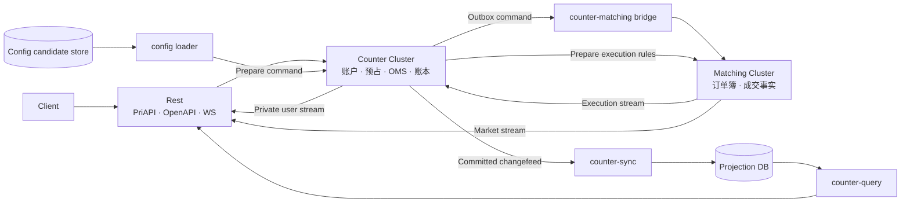

# 高可用 CEX 交易核心实战课程设计

> 状态：M02 当前 `PUBLISHED`（M00～M02 均已发布；M03 尚未签约）
>
> 规划日期：2026-08-26
>
> `planVersion`：`0.4`
>
> 当前单元合同 `planVersion`：`0.4`
>
> 下一单元：M03 仍为可调整候选，尚未签约
>
> 案例 slug：`high-availability-cex`
>
> 当前 Profile：`SPOT-CEX-1.0`
>
> 当前规划基线：`SPOT-CEX-1.0` 的 30 个候选交付单元，3 个按门禁顺序创建的代码仓库
>
> 当前实施窗口：M00～M02 保持 `PUBLISHED`；当前没有 `READY` 或 `IN_PROGRESS` 单元。M02 的权威完成身份为 `course/m02-complete`（commit `b54b4dfb51b61a5041d60c50dc1ff3404d73b27d`）；M03 及以后仍是可调整的候选课程地图

## 1. 这份文档决定什么

这份文档是“高可用 CEX 交易核心”实战案例的范围、课程含义和治理规则单一事实源。它固定项目边界、演进顺序、候选能力地图、停止点、教学方法和验收制度，但不提前固定尚未进入实施窗口的类图、表结构、协议字段或依赖版本。

网站中的 [实战案例配置](../src/practice/config.ts) 是公开状态、当前规划数量和页面里程碑的机器可读来源，并携带 `planVersion`。范围或课程语义变化必须先在本文评审，同一次变更再同步配置并提高 `planVersion`；生命周期、仓库 URL 和证据链接等实施状态也要同步，但不制造新的计划版本。轻量一致性门禁属于 `signal-grid-blog` verifier，至少校验案例 slug、当前 SPOT Profile 三个项目的候选单元数和命名停止点；代码仓库只记录所对应的 `planVersion`，绝不反向 checkout 或解析博客源码。

本课程要解决的不是“怎样快速拼出一个能下单的 Demo”，也不是在首版里同时实现所有金融产品，而是：

> 怎样从一个可证明正确的限价单撮合内核开始，先交付边界清楚、可恢复、可运维、证据完整的高可用现货核心，再在每个前置 Profile 真正通过资格审查后，分别引入债务、持仓重估、到期结算和非线性风险？

路线图可以完整，实施级设计只能覆盖当前和下一个单元；代码窗口永远只有当前单元。M01 的价格时间优先合同与交付证据已经冻结；M02 由 `course/m02-start` 的结构化 RED 演进到 `course/m02-complete`，可寻址撤单、不可逆终态、完整裁判、四篇教程、Matching Lab 与持久 evidence 已原子发布。当前没有开放代码窗口。M03 及以后的教学顺序仍只是候选课程地图，不代表实现字段已经冻结。任何超出已签约单元合同的能力，必须删除等量范围、拆分单元或进入 backlog。

## 2. 旧专题为何失败，以及本次怎样避免重演

旧专题的三个失败原因直接变成本课程的硬约束。

| 旧问题 | 新约束 |
| --- | --- |
| 所有项目集中在一个 Git 仓库，持续膨胀 | Matching、Counter、Rest 是三个独立仓库，并且只在前一个项目通过 1.0 门禁后创建下一个仓库 |
| 试图第一天设计全部商用功能 | M00 只建立可执行规格，M01 只实现单交易对 GTC 限价单；每个单元只增加一个复杂度维度 |
| 没有分步大纲，一股脑向前推进 | 当前 SPOT Profile 的 30 个候选单元均有能力边界；只有进入窗口的单元才签订完整 `adds / delivers / excludes / gate / evidence` 合同 |
| 过早引入 Aeron Cluster | Matching 先完成正确、可恢复、可度量的单机实现，M09 才接入 Aeron Cluster |
| 页面或代码声称未来能力已经存在 | 未发布单元不创建空 Markdown、空模块、空服务或虚假完成度 |

## 3. 商用 Profile 路线与当前范围

“商用”在这里不是把所有交易产品一次塞进同一个实现，而是每次选定一个可以完整验收的产品 Profile，把其功能、故障语义、容量边界和运维证据做全，再决定是否解锁下一个产品模型。

### 3.1 顶层产品 Profile 路线

**现货是第一份完整交付，不是专题终点**

只有当前 Profile 展开单元、仓库与实施设计；LOCKED 只冻结产品方向和解锁门禁，不代表已经创建单元、仓库或服务；后续优先复用已发布的 Matching、Counter 与 Rest 边界，具体仓库拓扑在解锁时评审。

| Profile | 状态 | 标题 | 相对前一 Profile 唯一新增的领域复杂度 | 解锁门禁 |
| --- | --- | --- | --- | --- |
| `SPOT-CEX-1.0` | `CURRENT` | 单地域、高可用现货交易核心 | 现金资产交换在 Matching、Counter 与 Rest 之间形成可恢复闭环。 | 当前从 M00 开始，只展开 SPOT 单元与仓库 |
| `MARGIN-SPOT-1.0` | `LOCKED` | 杠杆现货 | 以债务为核心，引入借贷、计息、抵押品、逐仓/全仓、风险率与强制减仓。 | SPOT-CEX-1.0 资格审查通过后再评审 |
| `PERP-CEX-1.0` | `LOCKED` | 永续合约 | 无到期日持仓按标记价持续重估，并引入资金费率、保险基金与 ADL。 | MARGIN-SPOT-1.0 资格审查通过后再评审 |
| `DELIVERY-FUTURES-1.0` | `LOCKED` | 交割合约 | 到期时刻驱动交易停止、结算价、交割或现金结算与终局对账。 | PERP-CEX-1.0 资格审查通过后再评审 |
| `OPTIONS-CEX-1.0` | `LOCKED` | 期权 | 非线性收益引入 Greeks、波动率、组合保证金、行权与指派。 | DELIVERY-FUTURES-1.0 资格审查通过后再评审 |

这五个 Profile 是产品教学顺序，不是五套已经承诺的实施大纲。后四个 Profile 目前没有单元、仓库、起点 tag 或发布日期；进入评审时必须重新建立自己的单元合同、停止点和商用资格证据。现货的 30 个单元和 3 个仓库也不能被解释成全路线总量。

`MARGIN-SPOT-1.0` 单独存在，是因为杠杆现货的首要难题是债务生命周期，不是合约仓位；永续、交割和期权则依次引入持续重估、到期事件和非线性风险。这个顺序使每个新 Profile 只改变一个主要领域心智模型。

### 3.2 `SPOT-CEX-1.0` 包含

- 单地域部署，Matching 和 Counter 均能在单节点故障后恢复服务；
- 多现货交易对，按版本化静态规则路由到 Matching shard；
- GTC、IOC、FOK、Post-only 和有价格保护的市价执行语义；
- 价格时间优先、部分成交、撤单、Mass Cancel、STP、市场状态和价格保护；
- 用户订单意图、可用资产、冻结资产、成交结算、maker/taker 手续费和双式账本；
- Matching 与 Counter 之间可重试、可去重、可检测缺口的命令和事件协议；
- Counter 的权威内存状态、Cluster snapshot/log 恢复，以及 Sync 异步数据库投影；
- PriAPI、OpenAPI、公共/私有 WebSocket、认证、签名、限流和协议兼容；
- 过载、备份恢复、升级回滚、对账、故障演练、容量报告和 Runbook。

### 3.3 `SPOT-CEX-1.0` 明确不做

- 充值、提现、钱包、链节点和托管侧对接；
- KYC、AML、法币、监管报送和运营后台；
- 杠杆现货的借贷、利息、抵押品、逐仓/全仓风险率与强制减仓；
- 永续、交割和期权的仓位、保证金、资金费率、到期结算、行权、强平和 ADL；
- 多地域 Active-Active、在线拆分活跃订单簿和自动再均衡；
- FIX、托管专线、撮合共址和做市商专属通道；
- 用户账号体系之外的完整 IAM 平台；
- 在线代码判题、远程 Java 沙箱、云端学习档案和证书系统。

用户债务、仓位、保证金和合约公共数据的最终权威仍属于 Counter，但它们进入对应的后续 Profile。当前 SPOT Profile 只冻结这个所有权决定，不预建 `Loan`、`Position`、`MarginSchedule`、强平服务或数据库表。这样既保留柜台的正确边界，也不让未来清算模型重新拖垮现货交付。

### 3.4 “完整”不等于“没有边界”

`SPOT-CEX-1.0` 完成时，读者交付的是一个完整的交易核心 Profile，而不是整个交易所公司：入口能接收请求，Counter 能做准入和冻结，Matching 能形成成交，Counter 能结算和记账，查询与推送能恢复，节点故障、数据库中断、重复消息和升级回滚均有可复核证据。被排除的业务不会用占位接口伪装完成。

### 3.5 读者前置与毕业能力

目标读者是具备 Java 后端开发经验、愿意在本地运行多进程和 Docker 实验的工程师。开始 M00 前应能阅读 Java、使用 Git 与 Gradle、编写单元测试，并理解基本的数据结构、数据库事务、Linux 进程和网络超时。Aeron、复制状态机、低延迟测量和交易领域知识按单元提供前置理论链接，不要求开课前一次性学完。

完成 `SPOT-CEX-1.0` 后，读者应能：

- 用不变量、参考模型、可重放历史和 semantic mutant 证明撮合语义；
- 区分单机 WAL、Cluster log、snapshot、业务幂等和外部副作用的不同保证；
- 设计 Matching 与 Counter 的状态所有权、Saga、gap recovery 和对账；
- 建立权威状态、Changefeed、Projection DB 和查询新鲜度之间的边界；
- 为 PriAPI、OpenAPI 和 WS 定义超时、重试、顺序、恢复与兼容契约；
- 通过故障、容量、升级和恢复证据判断一个 Profile 是否真的达到发布门禁。

## 4. 终局架构与状态所有权



这张图表达状态所有权，不规定第一天就部署这些进程。

| 状态或事实 | 权威所有者 | 非权威副本或消费者 |
| --- | --- | --- |
| 订单簿、撮合顺序、成交事实、BBO、Depth | Matching | Counter、Rest 行情投影 |
| 用户下单意图、预占、OMS、资产、费用、账本 | Counter | Projection DB、Rest 私有推送 |
| 币种、现货品种目录、费率、准入和预占规则 | Counter | 配置候选库、Matching 兼容映射、Rest 缓存 |
| 在具体 execution sequence 生效的市场状态、STP、价格带和执行规则 | Matching | Counter 保存兼容 RuleSet 映射，Rest 展示 |
| 历史订单、分页账本、查询视图 | Counter changefeed 可重建；数据库只是投影 | Rest 查询接口 |
| API Key、权限策略和凭据生命周期 | Rest 的认证存储/KMS | Rest 实例缓存 |
| HTTP 会话、限流桶、WS 连接 | Rest | 可丢失并重建的普通微服务状态 |
| 借贷、利息、抵押品和风险率 | `MARGIN-SPOT-1.0` 中的 Counter | 当前 SPOT Profile 不实现 |
| 仓位、保证金、资金费率和强平状态 | 对应合约 Profile 中的 Counter | 当前 SPOT Profile 不实现 |

### 4.1 Matching 的演进结论

Matching 不从 Aeron Cluster 脚手架开始。

```text
纯确定性内核
→ 正确的单机限价撮合
→ 可持久、可恢复、可度量的单机运行时
→ 单节点 Aeron Cluster Adapter
→ 三节点复制、切主与结果未知
→ 静态分片和可续接输出
```

M00–M08 不允许生产代码依赖 Aeron。M09 接入 Cluster 时，撮合算法保持不变，只替换命令排序、复制日志、snapshot 生命周期和对外响应适配。Aeron runtime 不再双写自研 WAL，避免两个恢复真相。

### 4.2 Counter 的演进结论

Counter 是自己的复制状态机，不是“数据库前面的业务微服务”。当前 SPOT Profile 只有一个逻辑三节点 Counter Cluster group，maker/taker 双边账户在同一个状态机命令内结算；C09 只形成容量和未来分片证据，不实际分片。它仍先用纯 Java runner 证明账户、预占和账本内核的确定性，再在 C03 接入 Cluster runtime。

Counter 与 Matching 是两个权威边界，不能假装存在跨 Cluster 原子事务：

1. Counter 原子完成准入、资产预占和 Outbox 记录；
2. Bridge 使用稳定 `commandId` 向 Matching 至少一次投递；
3. Matching 对重复命令只产生一次业务效果；
4. Matching 以连续 sequence 输出成交和终态事件；
5. Counter Inbox 去重、检测 gap，并原子推进 OMS、资产、费用和账本；
6. 超时只表示 `UNKNOWN/PENDING`，不能擅自释放预占或声明订单失败；
7. 对账任务比较双方游标、订单终态和数量摘要，差异通过受审计命令修复，不能直接改权威数据库。

### 4.3 公共配置的启动与激活

“启动时从数据库加载到内存”的方向合理，但三节点不能各自读取数据库后自行决定当前规则，否则数据库瞬时状态、查询顺序或更新时间可能破坏复制状态机的确定性。

控制面候选规则和 Matching 实际执行规则有不同权威边界，激活必须按 fence 编排：

```text
配置候选库
→ config-loader 编译不可变 RuleSet artifact
→ schema + content hash 校验
→ Counter PREPARE 准入/费率规则和兼容映射
→ 所有受影响 Matching shard PREPARE 执行规则子集
→ 校验 RuleSet version + hash + route version
→ 在明确 execution fence 激活 Matching 规则
→ Counter 才允许使用对应版本接受新订单
```

- 全新空集群第一次 bootstrap 可以读取配置候选库并提交；
- 正常重启、切主和 replay 从 Cluster snapshot/log 恢复，不依赖配置数据库；
- 币种、交易品种、费率和 Matching 执行规则均有独立版本，并通过统一 artifact hash 建立兼容映射；
- 每张订单分别记录 `admissionRuleSetVersion`、Matching 返回的 `executionRuleSetVersion` 和结算使用的 `feeScheduleVersion`；
- 已经运行的集群在配置候选库不可用时仍能恢复现有激活版本；
- 更新采用 Prepare/Activate，不允许节点本地热刷新或半激活；
- 任一受影响 shard 未准备、hash 不匹配或 fence 不确定时，该交易对 fail closed；
- C01 用 test double 冻结协调合同，C04 接通真实传输，C09 完成跨 Cluster 故障门禁。

### 4.4 Sync 异步落库的评估结论

复制状态机中已 apply、随后驻留内存的权威实时状态异步投影到数据库是正确方向，但 `counter-sync` 不直接解析 Aeron Cluster 的内部原始日志。内部日志包含会话、计时器、snapshot 和实现细节，不是稳定的业务 CDC 契约。

Counter 在已提交并已 apply 的状态迁移中生成版本化领域 Changefeed，Sync 消费该权威有序流：

- canonical event batch 和 `domainSequence` 在 apply 时成为可恢复状态，snapshot 保存最后 applied sequence 与输出恢复位置；
- 外部发布允许重复，但从恢复位置 replay 后不能静默丢失；达到已验证的 Archive 持久化和 Projection Checkpoint 边界后才允许裁剪；
- 每条事件包含 `schemaVersion`、`domainSequence`、`accountVersion`、`clusterLogPosition`、`correlationId`、`causationId`、RuleSet version、aggregate type 和幂等事件 ID；
- Sync 在同一数据库事务中写查询表和推进消费游标；
- 重复事件不重复写，sequence gap 立即停止并触发 replay，而不是跳过；
- 投影恢复从已验证的 `ProjectionCheckpoint@S + Changefeed(S+1...)` 重建到相同摘要，不要求永久保留 genesis 后全部在线事件；
- 数据库不能反向覆盖 Counter，也不能作为 Counter 正常启动的恢复源；
- 查询响应暴露 `asOfVersion` 和 `projectionLag`，不把陈旧投影伪装成强一致状态；
- 数据库长时间不可用时，系统按积压与磁盘预算进入查询降级、`CANCEL_ONLY` 或 `HALTED` 等受控模式，而不是无限积压。

当前 SPOT Profile 的 Sync 是 Counter 仓库内的独立部署单元，不创建第四个 Git 仓库。

### 4.5 Rest 的边界

Rest 是独立普通微服务项目，不加入 Aeron Cluster，也不拥有交易事实。它维护 PriAPI、OpenAPI、WebSocket、认证、签名、限流、协议适配和连接状态；可以拥有认证凭据、权限策略和普通配置存储，但不能写 Counter 权威状态或 Counter Projection DB。

禁止以下调用：

- Rest 绕过 Counter 直接向 Matching 下单或撤单；
- Rest 读取或写入 Counter 的权威内部状态；
- Rest 消费原始 Raft/Aeron Cluster log；
- Rest 根据缓存自行决定余额、订单终态或成交结果；
- Matching、Counter、Rest 形成同步调用环。

Rest 初期是一个仓库和一个部署应用，内部划分 PriAPI、OpenAPI、WS 等逻辑模块。只有真实容量、安全边界或长期独立发布节奏得到证据后，才允许拆成多个部署服务。

## 5. 仓库、版本与创建门禁

本节的 3 个仓库、30 个候选单元和全部停止点只对应当前 `SPOT-CEX-1.0`。后续 Profile 解锁时优先复用已经稳定的 Matching、Counter 与 Rest 产品边界；只有领域所有权、容量隔离或独立发布节奏形成证据后才评审新仓或拆仓，不在这里预建空项目。

| 顺序 | 仓库 | 创建条件 | 主要制品 |
| ---: | --- | --- | --- |
| 1 | [`cex-matching`](https://github.com/lcha-reln/cex-matching) | 已创建；M00～M02 均为 `PUBLISHED`，M03 尚未签约 | Matching core、testkit、runtime、协议、故障实验 |
| 2 | `counter` | `matching-1.0.0` 发布并从干净环境复验 | Counter core、Cluster runtime、bridge、sync、query |
| 3 | `rest` | `counter-1.0.0` 发布并从干净环境复验 | PriAPI、OpenAPI、WS、system tests |

不提前注册空仓库，不提前提交 README 骨架。下游仓库只消费上游已发布的版本化协议制品或容器镜像，不通过源码工程依赖重新形成巨型仓库。

每个单元使用不可移动的课程 tag：

```text
course/m00-start
course/m00-complete
course/m01-start
course/m01-complete
course/m02-start
course/m02-complete
```

发现错误时发布递增的补丁 tag，不移动旧 tag，例如 `course/m00.1-start`、`course/m00.2-start` 或 `course/m00.1-complete`。只有命名停止点才另外发布 `matching-0.1.0` 等产品 release；普通单元没有产品 release。

M00 bootstrap 连续暴露了两个必须诚实保留的起点缺陷：`course/m00-start` 因 `.gitignore` 误将 `buildSrc` 包目录识别为构建产物，表现为“bootstrap 任务源码未进入 Git”；`course/m00.1-start` 修复了任务源码，但仓内文档仍指向失败的原始起点。两者及其 CI 记录均不可移动或删除；当前由不改变 M00 业务语义、且代码与文档自洽的 `course/m00.2-start` 替代。教程和页面只引用当前补丁起点，不能把被替代 tag 伪装成通过。

M00 有一次 bootstrap 例外：先在 `main` 建立可正常构建但尚未完成 M00 目标的课程基线，再创建 `course/m00-start` 和 `unit/m00`。默认 `./gradlew build` 必须成功；单独运行 M00 课程验收命令时，应以结构化 `GOAL_NOT_IMPLEMENTED` 表示预期缺口，不能用编译错误、环境错误或整仓红 CI 充当教学起点。M00 完成后，`main` 才恢复为“最新完整通过单元”的常规含义。

### 5.1 命名停止点

| 停止点 | 对应单元 | 可独立交付的能力 |
| --- | --- | --- |
| `matching-0.1.0` | M03 | 正确、可证明的单交易对 GTC 限价撮合；不持久、不联网、不高可用 |
| `matching-0.5.0` | M08 | 可持久、可恢复、有容量证据的单机撮合 |
| `matching-0.8.0` | M10 | 单分片三节点 Aeron Cluster，具备切主、重试和故障证据 |
| `matching-1.0.0` | M12 | 静态分片、可续接输出、升级恢复和运行资格闭环 |
| `counter-0.1.0` | C02 | 正确、可测试的单机账户和准入内核 |
| `counter-0.5.0` | C03 | 独立高可用 Counter，尚未连接 Matching |
| `counter-0.8.0` | C06 | 下单、成交回报、资产和账本形成实时闭环 |
| `counter-1.0.0` | C09 | Sync、查询、对账、恢复和运维资格闭环 |
| `rest-0.3.0` | R02 | 第一方私有交易接口可用 |
| `rest-0.7.0` | R04 | PriAPI、OpenAPI、公共/私有 WS 闭环 |
| `rest-0.9.0` | R05 | 普通微服务高可用和安全运行资格完成 |
| `rest-1.0.0` | R06 | 三项目组合通过最终 Profile 审查 |

最终发布一个兼容版本集合，而不是跨仓库源码快照：

```text
SPOT-CEX-1.0
matching = matching-1.0.0
counter  = counter-1.0.0
rest     = rest-1.0.0
```

## 6. 教学与范围治理

### 6.1 滚动实施窗口

生命周期、设计深度和仓库门禁是三条独立轴，不能混成第二套状态机：

| 范围 | 生命周期 | 设计深度 | 仓库门禁 | 允许的工作 |
| --- | --- | --- | --- | --- |
| M00 | `PUBLISHED` | `CONTRACT` | `CREATED` | 代码、反例、四篇教程与持久 evidence 已验证并公开；停止在 VALID，不提前实现订单簿 |
| M01 | `PUBLISHED` | `CONTRACT` | 随 `cex-matching` 仓库 | 单交易对 GTC 的价格时间优先、业务事件、固定历史、四篇教程、Matching Lab 与持久 evidence 已验证并公开 |
| M02 | `PUBLISHED` | `CONTRACT` | 随 `cex-matching` 仓库 | 可寻址撤单、不可逆终态、10/34 corpus、四篇教程、Matching Lab、语义变异体与 tag 绑定 evidence 已公开；停止在不持久的内存生命周期 |
| M03–M12 | `CANDIDATE` | `RISK_MAP` | 随 `cex-matching` 仓库 | 记录能力、关键不变量和危险故障，不冻结类、Schema 字段编号、依赖版本或文章标题 |
| C00–C09 | `CANDIDATE` | `RISK_MAP` | `LOCKED` | 记录权威边界和关键故障；Matching 1.0 前不创建仓库 |
| R00–R06 | `CANDIDATE` | `RISK_MAP` | `LOCKED` | 记录外部契约边界和关键故障；Counter 1.0 前不创建仓库 |

任何时刻全专题最多一个 `IN_PROGRESS`，最多一个下一单元处于 `READY`。候选总数 30 只是当前 SPOT Profile 的课程容量基线；未进入 `CONTRACTED` 的候选单元可以在评审时拆分、合并或调整 ID，已签约或已发布的单元不能静默改变。LOCKED Profile 不进入这个计数，也不占用实施窗口。

### 6.2 单元状态机

```text
CANDIDATE
→ CONTRACTED
→ READY
→ IN_PROGRESS
→ CODE_VERIFIED
→ CONTENT_VERIFIED
→ PUBLISHED
```

- `CANDIDATE`：路线图候选，只说明要解决的问题；
- `CONTRACTED`：`adds/freezes/excludes/gate/evidence` 已评审；
- `READY`：前置单元已发布，start tag 和预期失败测试已准备；
- `IN_PROGRESS`：全专题唯一允许编码和写作的单元；
- `CODE_VERIFIED`：代码、回归、反例和 evidence 通过；
- `CONTENT_VERIFIED`：教程、互动、命令和页面验证通过；
- `PUBLISHED`：complete tag、教程生产页和 evidence 已验证；如果本单元是命名停止点，还必须发布并验证产品 release。

代码发生语义变化会退回 `IN_PROGRESS`；教程引用的 tag、命令或证据变化会退回 `CONTENT_VERIFIED` 之前。

### 6.3 单元合同

每个单元都必须回答：

| 字段 | 含义 |
| --- | --- |
| `objective` | 本单元解决的一个核心问题 |
| `adds` | 唯一新增的复杂度维度 |
| `delivers` | 截止本单元累计可运行能力 |
| `freezes` | 发布后不能静默改变的语义 |
| `excludes` | 本单元明确禁止顺手实现的内容 |
| `gate` | 阻止错误实现进入下一单元的自动或人工门禁 |
| `interaction` | 网页预测、模拟或回放的教学任务 |
| `evidence` | 能独立复核结论的原始证据 |
| `stopPoint` | 此处停止时读者真正拥有的系统 |

如果不能用一句话回答“本单元唯一新增的复杂度是什么”，单元就必须继续拆分。

### 6.4 教学闭环

每个单元统一采用：

```text
预测 → 实现 → 反例 → 证据 → 复盘
```

1. 在展示代码前，先让读者判断下一事件、可能破坏的不变量或故障结果；
2. 实现依次采用完整示例、带缺口的补全练习、改变表面条件的独立变体；
3. 至少加入一个会击穿“看似正确实现”的可重放反例；
4. 本地测试保存 seed、最小失败历史、状态摘要和原始报告；
5. 复盘只回答新增机制保证什么、不保证什么、最危险错误是什么、证据在哪里。

理论文章只作为按需前置阅读，不在实战教程里复制一遍。实战文章围绕修改、运行、失败和验收展开。

### 6.5 网页与本地实验边界

| 层级 | 运行位置与承担者 | 不能宣称 |
| --- | --- | --- |
| L0 阅读增强 | 预测、答案揭晓、任务勾选、继续上次 | 证明生产代码正确 |
| L1 固定历史可视化 | Golden scenario、故障时间线、状态表回放 | 等同于真实工程运行 |
| L2 浏览器确定性实验 | 修改有界输入、运行教学参考模型、重放反例 | 真实 Aeron 行为或真实性能 |
| L3 本地工程实验 | Java、Gradle、Docker、三节点 Cluster、故障注入、基准 | 由网页动画替代 |

网站不连接外部 Judge，不上传源码，也不远程启动 Java 或 Aeron。M00 使用最小的 `./gradlew m00Check`；需要重放、故障控制和证据编排后再引入仓库内的 Lab Runner，例如：

```text
./lab check M03
./lab replay M03 --seed 6824
./lab run M10-leader-failover
./lab export M10
```

浏览器后续可以导入 `build/lab-evidence/M10.json` 并在本地展示，但这只叫“本地证据已导入”，不叫服务器权威判题或防作弊认证。

M01–M03 共享一个渐进增强的 `MatchingLab`，分别加载 price-time、lifecycle 和 counterexample scenario pack；不创建三个独立 TypeScript 撮合器。Lab 壳、可视化和 Golden corpus adapter 只维护一份。

### 6.6 教学设计的研究依据

这些研究并未直接验证“CEX 工程课程”这一具体场景，下面是把认知科学结果迁移到本课程的教学设计推论，而不是对学习效果的无条件保证。

- 初学复杂技能时，先研究 worked example 比直接进行无支架问题求解更有利于建立问题图式，因此每个新机制先提供一个完整纵切示例。[Sweller 与 Cooper，1985](https://doi.org/10.1207/s1532690xci0201_3)
- 支架不应永久保留；worked example 之后逐步撤除步骤，并加入自我解释提示，再进入独立问题。因此每单元采用“完整示例 → 补全练习 → 独立变体”。[Atkinson、Renkl 与 Merrill，2003](https://doi.org/10.1037/0022-0663.95.4.774)
- 主动回忆比反复阅读更有利于延迟保持，因此读者必须在看到结果前预测事件、不变量或故障语义，并在单元结尾脱离正文完成迁移题。[Roediger 与 Karpicke，2006](https://pubmed.ncbi.nlm.nih.gov/16507066/)
- 测试题若不给反馈可能让错误选项留下错误知识，因此预测和小测必须给出针对机制的解释，不能只显示红绿结果。[Butler 与 Roediger，2008](https://pubmed.ncbi.nlm.nih.gov/18491500/)

“每单元只增加一个复杂度维度”是基于认知负荷原则作出的课程工程约束；它还必须由真实完成率、反例类型、复现失败和读者反馈持续校准。后续数据若显示某单元仍同时要求读者改变多个心智模型，就继续拆分，而不是用更多文字掩盖负荷。

## 7. Evidence 合同

每个 `course/<unit>-complete` 都必须生成版本化 evidence manifest。稳定外壳只描述来源、环境、claim 和限制；崩溃、HA、性能等字段只出现在相关 claim 的 `observations` 中：

```json
{
  "schemaVersion": "cex.lab-evidence.v1",
  "case": "high-availability-cex",
  "project": "matching",
  "unit": "M03",
  "unitTag": "course/m03-complete",
  "productRelease": "matching-0.1.0",
  "source": {
    "commit": "<git-sha>",
    "dirty": false
  },
  "environment": {
    "java": "<pinned-toolchain>",
    "os": "<os>",
    "arch": "<arch>"
  },
  "claims": [
    {
      "id": "deterministic-history",
      "category": "correctness",
      "statement": "相同历史产生相同规范化结果",
      "status": "pass",
      "command": "./gradlew m03Check",
      "observations": {},
      "artifacts": [
        { "path": "reports/m03.json", "sha256": "<sha256>" }
      ]
    }
  ],
  "limitations": [
    "仅支持单交易对 GTC 限价单和撤单",
    "单进程内存实现，无持久化、网络或高可用"
  ],
  "supersedes": null,
  "generatedAt": "<iso-8601>"
}
```

普通单元的 `productRelease` 为 `null`；只有命名停止点填写产品 release。

验收规则：

- manifest 通过 JSON Schema；
- unit、unitTag、可选 productRelease、commit 与教程完全一致，工作树不是 dirty；
- 每项结论都指向有 SHA-256 的原始 artifact；
- 随机测试在对应 claim 中保存 seed 和 shrink 后的最小反例；
- 崩溃实验保存 failpoint、ACK 边界和恢复摘要；
- HA 实验保存 member、term/epoch、log position、fence 和客户端观察；
- 性能报告保存硬件、JVM、负载模型、预热、样本和原始结果；
- `limitations` 不得为空，不能只展示通过项；
- 基础设施错误必须 fail closed，不能被统计为业务正确性通过。

Evidence 不覆盖。错误结论使用 patch tag 和新 manifest，通过新文件的 `supersedes: <old-manifest-sha256>` 或独立不可变 registry 声明替代关系；旧文件本身不回写。

## 8. Project M：Matching（13 个单元）

Matching 是唯一优先启动的项目。它先证明业务语义，再证明恢复，再证明性能，最后才证明高可用。

### 8.1 路线总览

| 单元 | 候选新增维度 | 累计停止能力 | 生命周期 / 设计深度 |
| --- | --- | --- | --- |
| M00 最小可执行规格 | 输入域、规范化和确定性验证合同 | 能重放 fixture 并比较验证结果和 history digest | `PUBLISHED / CONTRACT` |
| M01 单交易对 GTC 限价撮合 | 价格时间优先撮合语义 | 正确处理挂单、部分成交和连续吃单 | `PUBLISHED / CONTRACT` |
| M02 可寻址订单生命周期 | 撤单和不可逆终态 | 能撤单并防止订单复活 | `PUBLISHED / CONTRACT` |
| M03 参考模型与性质测试 | 自动寻找反例 | 发布 `matching-0.1.0` | `CANDIDATE / RISK_MAP` |
| M04 执行与准入策略 | TIF、请求保护和参与者策略 | 支持 IOC、FOK、Post-only、受保护 aggressive order、price band 和 STP | `CANDIDATE / RISK_MAP` |
| M05 版本化市场控制 | RuleSet fence 和 operating mode | 支持版本激活、停市和 Mass Cancel | `CANDIDATE / RISK_MAP` |
| M06 WAL 与确认边界 | 单机持久确认和 durable idempotency | 已确认命令可重放且不会重复执行 | `CANDIDATE / RISK_MAP` |
| M07 Snapshot 与恢复 | 有界恢复和格式演进 | snapshot + suffix 等价于全量重放 | `CANDIDATE / RISK_MAP` |
| M08 性能与过载资格 | 容量和背压 | 发布 `matching-0.5.0` | `CANDIDATE / RISK_MAP` |
| M09 Aeron Cluster Adapter | 复制运行时适配 | 单节点 Cluster 与 direct runner 业务等价 | `CANDIDATE / RISK_MAP` |
| M10 三节点 HA | 切主、fencing 和结果未知 | 发布 `matching-0.8.0` | `CANDIDATE / RISK_MAP` |
| M11 多交易对静态分片 | instrument 到 shard 的权威路由 | 多订单簿故障域和容量可解释 | `CANDIDATE / RISK_MAP` |
| M12 可续接业务输出 | 下游连续消费 | 发布 `matching-1.0.0` | `CANDIDATE / RISK_MAP` |

### 8.2 M00：最小可执行规格

> M00 单元合同 `planVersion`：`0.1`

**目标**

把第一条限价单输入的数值域、规范化、错误模型和确定性 fixture 转换成可运行合同。本单元只验证命令，不把合法命令应用到订单簿，也不产生任何成交业务事实。

**Adds**

唯一新增复杂度是确定性输入规格与验证 harness。

**累计交付物**

- 第一个 `matching` Git 仓库，只包含当前需要的 Gradle 工程；
- fixture 固定一个 `instrumentId`，但尚不存在订单簿状态；
- 最小值对象：opaque `OrderId`、`Side`、`PriceTicks`、`QuantityLots`；`OrderId` 此时只有字段身份，没有 M02 的可寻址生命周期语义；
- 第一条命令 `PlaceLimitOrder` 的输入域和错误码；
- 验证结果只包含 `VALID` 或 `INVALID(code, field)`；`Accepted/Rested/Trade` 到 M01 才成为业务事件；
- 单进程 runner：读取冻结 fixture，输出 canonical normalized history、validation result 和 history digest；
- 整数 tick/lot 的单字段范围、规范化顺序和错误码目录；
- 本地 `./gradlew m00Check` 和最小 evidence 生成任务。

**Freezes**

- 热路径价格和数量不使用 `double`；
- 相同 fixture 必须产生字节级可比较的规范化命令、验证结果和 history digest；这里只冻结内部 semantic representation，不冻结 M09 的外部 wire codec；
- 撮合 core 不读取墙钟、随机源、网络、文件、数据库或线程调度结果；
- 非法命令失败关闭；M00 没有可被部分修改的业务订单簿状态。

**Excludes**

- 真正的挂单和成交算法；
- 撤单、改单、IOC、FOK、Post-only、市价单；
- 多交易对、WAL、数据库、线程池、Aeron、SBE 和 HTTP；
- 用户资产、手续费、Counter 数据和未来服务空接口。

**互动与练习**

- L0：先判断五组价格/数量输入应该接受还是拒绝；
- L1：观察同一 fixture 的 canonical representation 和 history digest 如何变化；
- 本地练习：故意改变字段规范化顺序或错误优先级，验证 replay gate 会失败。

**Gate 与 Evidence**

- 同一 fixture 重复运行 100 次，canonical bytes、validation result 与 history digest 一致；
- 价格和数量的最小值、最大值、零值、负值和超范围均有正反例；Matching 不计算 notional，价格乘数量的溢出留给 Counter；
- 非法输入不产生业务事件或业务状态；
- 静态架构门禁阻止 core 引用 I/O、Aeron 或数据库包；
- evidence 保存 fixture、规范化输出、验证结果、摘要、JDK toolchain 和 commit。

第一份完整 fixture 形如：

```text
输入：instrument=BTC-USDT, orderId=42, side=BUY, priceTicks=6500000, quantityLots=3
输出：VALID + canonical command bytes + historyDigest

输入：instrument=BTC-USDT, orderId=43, side=BUY, priceTicks=6500000, quantityLots=0
输出：INVALID_QUANTITY(quantityLots) + canonical validation result + historyDigest
```

实际哈希算法和字节值在 M00 bootstrap 时冻结。首个 mutant 让 `quantityLots=0` 错误通过，`m00Check` 必须把它识别为业务断言失败。

**建议教程顺序**

1. 第一版为什么只有一个固定交易品种和一种命令；
2. 用 tick、lot 和有界整数消灭金额歧义；
3. 命令规范化、验证结果、错误优先级和 history digest；
4. 构建第一份合法/非法 fixture 和 `m00Check`。

**停止说明**

到这里读者拥有的是一份可执行输入规格，不是“已经完成的简单撮合”；M00 对合法命令的结果只是 `VALID`，不会伪造 `Accepted`、`Rested` 或 `Trade`。

### 8.3 M01：单交易对 GTC 限价撮合

> M01 单元合同 `planVersion`：`0.3`
>
> 生命周期：`PUBLISHED`。M00 是已发布前置；`course/m01-start` 是唯一练习起点，annotated `course/m01-complete` 是完成坐标。四篇教程、Matching Lab 与 tag CI evidence 已按同一合同公开。

**Objective**

让一条通过 M00 验证的 GTC 限价命令第一次确定性改变 BTC-USDT 订单簿，并能解释每个业务事件和剩余数量。

**Adds**

唯一新增复杂度是：**单写者内存订单簿上的价格时间优先撮合状态迁移**。

本单元不借“订单簿”之名同时加入订单生命周期、请求幂等、资金准入、持久化或网络。四篇教程只是从价格、时间、成交循环和证据四个角度逐步建立同一项撮合语义，不是四个产品复杂度维度。

**Delivers**

- Bid 价格降序、Ask 价格升序；
- 同价格按单写者分配的 `acceptedSequence` FIFO；
- 买价大于等于最佳卖价、卖价小于等于最佳买价时成交，成交价使用 resting maker 订单价格；
- 一条命令可以连续吃掉多个 price level；
- maker/taker 的部分成交和完全成交；
- taker 未成交余量以原 `acceptedSequence` 进入订单簿；
- 首次引入 `Accepted`、`Rejected`、`Trade` 与 `Rested` 业务事件；
- 单写者撮合模型和完整、有序、可规范化的事件 batch、盘口摘要。

**Freezes**

- M00 验证失败只产生一条 `Rejected(code, field)`，不分配 `acceptedSequence` 且不修改订单簿；M01 不新增第二套拒绝规则；
- 合法命令才由单写者分配单调递增的 `acceptedSequence`；同价 FIFO 不使用时间戳或 `orderId` 排序；
- 合法命令的 event batch 固定为 `Accepted → Trade* → Rested?`；`Rejected` 不与其他业务事件混在同一 batch；
- 每笔 Trade 数量大于零，以当前 resting maker 的价格成交，并按价格优先、同价 FIFO 顺序输出；
- taker 余量只入队一次并保留原接受序列；完全成交订单和空 price level 必须删除；
- 每批结束后活动盘口不存在零余量订单、空价位或仍可成交的交叉状态；
- M01 场景只接受彼此不同的 `orderId`。重复 ID 的业务结果在本单元未定义，不能用临时 Map 偷渡订单索引、幂等或撤单能力。

**Excludes**

- 撤单、改单、订单索引、重复 `orderId` 处理和 command 级幂等；
- IOC、FOK、Post-only、市价单、STP、市场状态和价格带；
- 账户、资产、仓位、手续费、结算和交易前风控；
- WAL、Snapshot、数据库、网络、线程、时钟、随机数、性能内存布局和 Aeron；
- M03 才引入的独立参考模型、生成式测试、反例缩小和 `matching-0.1.0` release。

**Interaction**

- L2 订单簿 stepper：逐条输入限价单，先预测 event batch，再观察 BBO、价位 FIFO 和成交；
- Worked example：一笔 BUY taker 连续吃掉三个 Ask 价位；
- Completion problem：补全同价 FIFO 和部分成交余量；
- 独立变体：镜像 Bid/Ask，以 SELL taker 验证相同合同。

浏览器不得建立第二份漂移的课程语义。M01–M03 继续共享一个渐进增强的 `MatchingLab`；M01 stepper 使用 Java testkit 导出的同一版本化 scenario pack，教学模型必须先重放全部 golden case 自检，失败时关闭实验。网页结果只用于预测与解释，不叫 Java 裁判结果。

**Gate 与 Evidence**

- M00 的输入、验证、canonical history 与 digest 回归继续通过；M00 的完整 semantic mutant 与 no-order-book 架构证明只由冻结的 `course/m00-complete` evidence 保存，不在新增订单簿后伪装成当前 HEAD 的门禁；
- 黄金历史覆盖空盘口、单边盘口、恰好触价、多价位成交、maker 部分成交、taker 剩余挂单和同价三单 FIFO；
- 自动检查每笔成交量为正、双边数量守恒、maker price、价位/队列/聚合数量一致、无空价位和批末无交叉；这里不存在 M02 才会加入的 order index；
- “使用 taker 价格”“同价 LIFO”“跳过首个 maker”三个 semantic mutant 必须由业务断言分类为 `STUDENT_FAILURE`；候选或裁判异常必须为 `SYSTEM_ERROR` 并失败关闭；
- 相同 scenario pack 每次重新加载状态并 fresh replay，产生逐字节一致的 command、event batch、order-book history 与 digest；
- evidence 至少保存 M00 回归、scenario pack、price-time 与 event batch 结果、不变量、canonical history、mutant 和架构边界报告，每个 artifact 都绑定 SHA-256。

**教程实施顺序**

1. `price-priority-order-book`：让 VALID 命令第一次改变订单簿；
2. `fifo-acceptance-sequence`：同价 FIFO 由接受序列决定；
3. `maker-price-multi-level-matching`：按 maker price 连续吃穿多个价位；
4. `price-time-golden-evidence`：用黄金历史和 mutant 证明价格时间优先。

这四个 permalink 已在 `CONTENT_VERIFIED` 冻结为 `expectedLessons`，并在切换 `PUBLISHED` 时从 `draft: true` 原子公开；站点门禁拒绝缺篇、多篇、改序、改地址或残留草稿。Matching Lab 只读取同一公开 Golden corpus，浏览器模型必须先完成 8 场景、22 条命令的逐事件与逐盘口自检，失败时保持禁用。

**Stop Point**

到这里可以运行一个正确但不支持撤单、不持久、不联网、无性能与高可用保证的单交易对 GTC 内存撮合器。M01 是普通课程单元：完成时只创建 `course/m01-complete`，`productRelease` 仍为 `null`；`matching-0.1.0` 留给 M03。

### 8.4 M02：可寻址订单、撤单与终态闭合

> M02 单元合同 `planVersion`：`0.4`
>
> 生命周期：`PUBLISHED`。M01 是已发布前置；权威起点为 annotated [`course/m02-start`](https://github.com/lcha-reln/cex-matching/tree/course/m02-start)，peeled commit 是 `fbaa744912147fdb1d802fb16cf4a9f9d62e8112`。权威完成身份为 annotated [`course/m02-complete`](https://github.com/lcha-reln/cex-matching/tree/course/m02-complete)，commit 是 `b54b4dfb51b61a5041d60c50dc1ff3404d73b27d`。完成门禁为 10 场景、34 命令、4 个状态化验证优先级探针、100 次 fresh replay、4 个 required mutant 与 `SYSTEM_ERROR` control；M02 不发布产品 release。

**Objective**

在不改变 M01 价格时间优先、maker price 和 event batch 语义的前提下，让每个已接受订单拥有可寻址且不可复活的内存生命周期，并稳定解释未知、迟到、重复撤单和重复 `orderId`。

**Adds**

唯一新增复杂度是：**可寻址订单生命周期——权威 lifecycle registry、精确撤单与不可逆 `FILLED/CANCELED` 终态**。

M02 不借“撤单”之名引入请求幂等、账户资产、Cancel/Replace、Mass Cancel、持久化或网络。订单簿和 lifecycle registry 不是两份可独立修改的订单数据：`RESTING` entry 必须与簿中节点指向同一个内部订单身份，`FILLED/CANCELED` entry 则只保留终态身份，所有变化仍由调用方串行化的一条命令原子完成。

**冻结的命令与 API**

M01 的 `place(PlaceLimitOrderInput)` 与 `snapshot()` 保持兼容；M02 只增加一条命令边界：

```text
CancelOrderInput(String instrumentId, BigInteger orderId)

SingleInstrumentMatchingEngine
├── ExecutionBatch place(PlaceLimitOrderInput input)
├── ExecutionBatch cancel(CancelOrderInput input)
└── OrderBookSnapshot snapshot()
```

`CancelOrderInput` 的 `instrumentId` 规范化与 `orderId` 数值域复用 M00 已冻结语义。非法 Place 或 Cancel 都只产生既有的 `Rejected(ValidationCode code, String field)`，不占用订单 ID、不分配 `acceptedSequence`、不创建终态记录且不修改盘口。

M02 在 `MatchingEvent` 中增加三类业务结果：

```text
PlaceRejected(OrderId orderId, PlaceRejectionCode code)
└── code = DUPLICATE_ORDER_ID

Canceled(AcceptanceSequence sequence, OrderId orderId, Side side,
         PriceTicks priceTicks, QuantityLots canceledQuantityLots)

CancelRejected(OrderId orderId, CancelRejectionCode code)
└── code = ORDER_NOT_FOUND | ORDER_ALREADY_FILLED | ORDER_ALREADY_CANCELED
```

`ExecutionBatch.bookAfter` 继续是命令完成后的完整不可变盘口。Place batch 只能是 `Rejected`、`PlaceRejected` 或 M01 已冻结的 `Accepted → Trade* → Rested?`；Cancel batch 只能是 `Rejected`、单条 `Canceled` 或单条 `CancelRejected`。Cancel 不产生 `Accepted`、`Trade` 或 `Rested`，也不消耗 `acceptedSequence`。

这些是 Matching 内部执行语义，不是面向用户的 OMS API。Counter 后续仍负责用户订单、资产、预占和查询状态；M02 不在 Matching 中复制账户订单表。

**冻结的生命周期状态矩阵**

`UNSEEN` 表示当前 engine 生命周期内从未成功接受该 ID；内部 registry 的持久状态严格是 `RESTING`、`FILLED` 与 `CANCELED`，命令应用过程还允许瞬时 `ACCEPTED`，但它不得逃出命令边界。未成交和仍有余量的部分成交订单都属于 `RESTING`；`FILLED` 与 `CANCELED` 是不可逆终态。M02 不新增公开生命周期查询 API。

| 当前状态 | 命令 | 结果 | 状态和 sequence |
| --- | --- | --- | --- |
| `UNSEEN` | 非法 Place | `Rejected(code, field)` | 保持 `UNSEEN`；不消耗 sequence |
| `UNSEEN` | 合法 Place | M01 Place batch | 有余量则 `RESTING`，完全成交则 `FILLED`；消耗一次 sequence |
| `RESTING` | 相同 ID 的合法 Place | `PlaceRejected(DUPLICATE_ORDER_ID)` | 原订单不变；不消耗 sequence |
| `FILLED` / `CANCELED` | 相同 ID 的合法 Place | `PlaceRejected(DUPLICATE_ORDER_ID)` | 终态不变；不消耗 sequence |
| `UNSEEN` | 非法 Cancel | `Rejected(code, field)` | 保持 `UNSEEN`；不消耗 sequence |
| `UNSEEN` | 合法 Cancel | `CancelRejected(ORDER_NOT_FOUND)` | 不创建 tombstone；之后首次合法 Place 仍可接受 |
| `RESTING` | 合法 Cancel | `Canceled(..., canceledQuantityLots=remaining)` | 原子移出订单簿，并让同一 registry entry 进入 `CANCELED`；不消耗 sequence |
| `FILLED` | 合法 Cancel | `CancelRejected(ORDER_ALREADY_FILLED)` | `FILLED` 不变；不消耗 sequence |
| `CANCELED` | 合法 Cancel | `CancelRejected(ORDER_ALREADY_CANCELED)` | `CANCELED` 不变；不消耗 sequence |

重复 Cancel 得到稳定的当前状态结果，但这不是 command 级幂等：系统不会识别某次网络重试，也不会重放第一次成功 Cancel 的原始 `Canceled` batch。重复 Place 同样返回业务拒绝，而不是重放旧 Place 结果。

**Delivers 与 Freezes**

- 已接受 `orderId` 在当前 engine 生命周期内只允许首次使用一次；非法输入和未知撤单不占用 ID；
- lifecycle registry 为每个已接受 ID 保留且只保留一个 entry；其中 `RESTING` 当且仅当恰好对应一个订单簿节点，两条访问路径的 ID、side、price、sequence 和 remaining 必须一致；
- 每个 registry entry 恰好处于 `RESTING`、`FILLED` 或 `CANCELED` 之一；`FILLED/CANCELED` 不得出现在订单簿，终态身份也不得从 registry 删除；
- fully-filled maker、fully-filled taker 和成功 Cancel 都必须在同一命令状态迁移中移出订单簿并把同一 registry entry 写成正确终态；
- 部分成交后仍有余量的订单保持 `RESTING`、原 `acceptedSequence` 和队列位置，Cancel 的 `canceledQuantityLots` 精确等于当时 remaining；
- 撤销同价队列任意位置只删除目标节点，幸存订单不重新编号且相对 FIFO 不变；仅在最后一笔活动订单离开时删除 price level；
- Cancel 成功后盘口数量只减少被撤订单的 remaining，不产生 Trade；失败 Cancel、重复 Place 和非法输入必须保持 event 前后的 book、registry 与 next acceptance sequence 完全不变；
- terminal tombstone 在 M02 内不回收。没有 durable command window、snapshot 或恢复边界前，禁止按墙钟猜测安全过期。

**Excludes**

- `commandId`、请求重放、durable idempotency、Cancel/Replace 和 Mass Cancel；
- IOC、FOK、Post-only、市价单、STP、市场状态、价格带和多交易对；
- 账户、资产、预占释放、仓位、手续费、结算和用户可见 OMS 查询；
- terminal tombstone 回收、墙钟过期、WAL、Snapshot、数据库、网络、线程、性能内存布局和 Aeron；
- M03 才引入的独立参考模型、生成式测试、反例缩小和 `matching-0.1.0` release。

**冻结的 Golden corpus**

M02 起点必须签入严格的 `matching.m02.scenario.v1` 命令联合，command type 只能是 `PLACE` 或 `CANCEL`。固定 corpus 恰好 10 个 scenario、34 条 command；每个 scenario 使用 fresh engine，Schema 负例另计，不可用增删业务命令掩盖失败：

| 顺序 | scenarioId | 命令数 | 必须证明 |
| --- | --- | ---: | --- |
| 1 | `invalid-cancel-does-not-mutate-or-consume-sequence` | 4 | 多字段非法 Cancel 按 instrumentId → orderId 拒绝，不改变非空盘口或 next sequence |
| 2 | `cancel-only-resting-order-removes-level` | 2 | 撤销价位唯一挂单时同时删除空价位 |
| 3 | `cancel-middle-preserves-fifo` | 5 | 同价 `#1 → #2 → #3` 撤销 `#2` 后，taker 仍按 `#1 → #3` 成交 |
| 4 | `cancel-partially-filled-remainder` | 3 | maker 部分成交后只撤精确 remaining，不撤原始 quantity |
| 5 | `cancel-unknown-order` | 2 | 未知 Cancel 不建 tombstone，同 ID 随后首次 Place 可接受 |
| 6 | `late-cancel-filled-order` | 4 | 同一成交中的 fully-filled maker 与立即全成 taker 的迟到 Cancel 都为 `ORDER_ALREADY_FILLED` |
| 7 | `repeat-cancel-stable` | 3 | 第二次 Cancel 为 `ORDER_ALREADY_CANCELED`，不再次产生成功事实 |
| 8 | `duplicate-active-order-id` | 3 | RESTING 重复 ID 被拒，下一合法订单取得连续 sequence |
| 9 | `duplicate-filled-order-id-does-not-resurrect` | 4 | FILLED ID 不能复用，重复 Place 后仍保持 FILLED |
| 10 | `duplicate-canceled-order-id-does-not-resurrect` | 4 | 与原 Place 完全相同的重复 payload 仍被拒；新 ID 取得 sequence 2，证明 Cancel 与 duplicate 均不耗序列 |
| **合计** |  | **34** |  |

**教程实施顺序与 RED → GREEN 停止点**

1. `order-lifecycle-result-contract`：用状态矩阵冻结 Place/Cancel 结果代数。RED 是 unknown、duplicate、late 和 repeat 尚无稳定分类；GREEN 只完成命令、事件和表驱动合同，`m02Check` 仍保持未完成。
2. `addressable-index-middle-cancel`：证明 registry 不是第二本订单簿。RED 是同价三单无法可靠撤掉中间节点；GREEN 完成 `RESTING` 精确撤单、book/registry 双向一致和 `#1 → #3` FIFO，终态闭合测试仍保持 RED。
3. `irreversible-terminal-orders`：让 fully-filled maker/taker、成功 Cancel 和重复 ID 收敛到不可逆结果。RED 是终态 ID 可复活或迟到 Cancel 退化成 unknown；GREEN 完成 terminal registry 和全部状态矩阵，完整 Golden、mutant 与 evidence 仍未通过。
4. `lifecycle-golden-evidence`：用 10/34 Golden、M02H1 history、结构不变量和 semantic mutant 证明不存在幽灵订单。GREEN 终点是 `m02Check` 完整通过；clean-tree evidence、complete tag 和站点发布仍按后续生命周期门禁执行。

每篇只引入上述同一生命周期模型的一项证明义务，不增加新的产品维度。这四个 permalink 和顺序已随 v0.4 合同登记为 `expectedLessons`；教程文件仍必须以 `draft: true` 创建，`CONTENT_VERIFIED` 必须验证实际集合与合同完全一致，达到 `PUBLISHED` 时才原子公开。

**Matching Lab 合同**

M02 已在 `src/practice/labs.ts` 登记 Lab；M01 与 M02 共享同一个数据驱动 Matching Lab 壳和两种模式，M03 只有签约并发布后才可接入：

- `JAVA_GOLDEN_REPLAY` 只读加载 complete tag CI 固化并由本站托管的 M02 manifest、scenario pack、event batches 与 canonical history；
- `BROWSER_MODEL` 使用有界 BigInt、同源静态输入和隔离内存状态，让读者先预测 Place 或 Cancel disposition，再揭示事件、盘口、registry 中的活动/终态身份和生命周期；
- registry 以 `supportedCommands` 或等价的命令联合配置 M01 的 Place-only 与 M02 的 Place+Cancel，通用组件和 runtime 禁止 `unitCode === "M02"` 一类案例分支；
- 浏览器模型解锁前必须 fresh-state 重放全部 10/34 corpus，并逐命令与静态 Golden 比较 events、book 和 lifecycle observation；任一 Schema、目录、计数、hash 或语义不一致都保持禁用；
- 未识别 command/event/schema 必须失败关闭，不得显示 Unknown 后继续；不上传源码、不编译或执行 Java、不连接远程 Judge、账户或外部服务，也不输出课程裁判结论。

**Gate 与 Evidence**

- M00 输入、验证、canonical history 与 digest，以及 M01 的 8 场景、22 命令价格时间 Golden corpus 全部回归；
- 10/34 corpus 逐命令检查事件语法、盘口、lifecycle registry 和终态结果；`RESTING` entry 与 book 节点双向一一对应、terminal 不入簿、已接受 ID 不丢失且终态单调不可逆；
- Cancel 成功精确减少 remaining 并保持幸存 FIFO；失败 Cancel、非法输入和重复 Place 不改变任何状态或 next sequence；
- `M02-CANCEL-WRONG-FIFO-ORDER`、`M02-GHOST-RESTING-ORDER`、`M02-TERMINAL-ID-REUSE`、`M02-REPEATED-CANCEL-SUCCEEDS` 四个 required mutant 必须由共享业务断言分类为 `STUDENT_FAILURE`；异常 control 必须为 `SYSTEM_ERROR` 并失败关闭；
- 相同严格 scenario pack 经 100 次 fresh parse、fresh engine replay，生成逐字节一致的 `M02H1` command/input/event/book history 和唯一 SHA-256 digest；生命周期由同一命令序列的结果与结构不变量单独证明，内部 Map、对象身份、路径、主机、时间与 Git 元数据不得进入 semantic history；
- matching core 继续保持单写者、无 I/O、数据库、网络、线程、时钟、随机数和 Aeron 依赖；M02 不增加 runtime、protocol、storage 或 cluster 模块；
- evidence 已保存 M00/M01 回归、lifecycle scenario pack、event batches、book/index/terminal observations、canonical history、mutants 和 architecture report，并冻结完成身份、完整提交、manifest/artifact SHA-256、精确 limitations 与 `reportFacts`。

M02 manifest 的 claim ID 与顺序冻结为：

```text
m00-m01-regression
cancel-event-batches
addressable-order-cancellation
irreversible-terminal-states
order-registry-book-invariants
deterministic-lifecycle-history
semantic-mutants
architecture-boundary
```

M02 manifest 的 limitation 文本与顺序冻结为：

```text
Only one in-memory BTC-USDT GTC limit-order book with place and cancel is implemented.
Accepted order IDs are unique for the lifetime of one engine process; terminal identity records are retained without pruning.
A repeated place command is rejected as a duplicate order ID; command-level idempotency and prior-result replay are not implemented.
There is no Cancel/Replace, amendment, mass cancel, IOC, FOK, post-only, market order, STP, market state, or price band.
There is no account, asset, position, fee, settlement, reservation-release, or risk logic.
Fixed scenarios and semantic mutants are not the independent generated reference model or property proof deferred to M03.
The unit has no persistence, networking, database, threads, Aeron, or high availability.
The evidence makes no throughput, latency, recovery, durable-idempotency, or production-readiness claim.
```

**Stop Point**

到这里得到一个生命周期闭合的单交易对 GTC 内存撮合器：活动挂单和部分成交余量可以精确撤销，未知、迟到、重复命令有稳定业务结果，`FILLED/CANCELED` 订单不会复活。它仍不承诺请求重试幂等、tombstone 回收、持久化、网络、性能或高可用；M02 不是命名停止点，只创建 `course/m02-complete`，`matching-0.1.0` 继续留给 M03。

### 8.5 M03：独立参考模型与性质测试

| 项目 | 候选内容 |
| --- | --- |
| 问题 | 作者选择的示例不能系统发现排序、守恒和生命周期反例 |
| 候选新增维度 | 独立参考模型与生成式正确性裁判 |
| 累计能力 | 逐命令比较生产实现与独立模型，失败历史可缩小、保存和重放，错误实现由业务断言而非基础设施故障识别 |
| 关键风险 | 参考模型复用生产逻辑形成共同错误；只保存随机 seed 而丢失最小失败历史 |
| 明确不做 | 性能基准、WAL、Snapshot、线程和 Aeron |
| 停止点 | 发布 `matching-0.1.0`：单交易对 GTC 限价单、支持撤单、单进程内存、无持久化、无网络、无 HA |

### 8.6 M04–M12 候选能力地图

这些行不是已冻结合同。任一行进入 `CONTRACTED` 前必须重新验证“一句话、一个复杂度维度”；必要时允许拆分或调整候选总数。

| 单元 | Adds | Delivers | Excludes | Gate 与 Evidence |
| --- | --- | --- | --- | --- |
| M04 执行与准入策略 | 订单执行指令和无状态参与者策略 | GTC/IOC/FOK/Post-only；带用户 `worstPriceTicks` 的 aggressive IOC；市场 price band；以 opaque `stpGroupId` 执行明确 STP 策略 | Stop/OCO、Iceberg、Pegged、无保护市价单、版本激活、WAL | FOK 原子；Post-only 在触价或穿价时整体拒绝；用户最差价与市场 price band 分开验证；IOC 余量不入簿；每种策略有 mutant |
| M05 版本化市场控制 | RuleSet 生命周期和 operating mode | Prepare/Activate artifact、content hash、execution fence、`OPEN/CANCEL_ONLY/HALTED`、operator Mass Cancel；已有 resting order 默认保留入簿语义，若新规则要求重新验证则先 HALT + Mass Cancel | 管理后台、节点本地热刷新、半激活、高级订单 | 激活失败保留旧版本；OPEN 允许下单撤单，CANCEL_ONLY 只允许客户撤单，HALTED 只允许受权 operator control/Mass Cancel；历史可追溯 execution rule version |
| M06 WAL、确认与 durable idempotency | 单机持久确认边界 | WAL 记录通过 wire 校验的 canonical business command；业务拒绝也可重建；producer epoch/id、shard 和连续 sequence 定义有序槽位，stable commandId 与 payload hash 永久一一绑定；gap 不越过，旧槽位绝不重新执行 | Snapshot、复制、数据库恢复源、WAL/状态双写事务、墙钟淘汰 | kill 窗口外还覆盖 fsync 错误、磁盘满、只读目录、rollover、目录项持久化、尾部 torn 与中段损坏；同身份异 payload 或异 sequence fail closed |
| M07 Snapshot 与格式演进 | 有界恢复 | 完整订单簿、索引、durable idempotency、RuleSet 的 prepared/active/pending activation 全生命周期、execution fence、当前 operating mode、未完成确定性控制动作和 last applied sequence；semantic 与 serialization digest 分开 | 边恢复边接流量、静默回空状态、Aeron snapshot | snapshot 前中后 kill、成功后 WAL retention 崩溃窗口、损坏和世代不匹配、N-1 fixture；恢复不能从 HALTED/CANCEL_ONLY 回到默认 OPEN；snapshot + suffix 与全量重放 semantic digest 一致 |
| M08 性能与过载资格 | 容量边界和背压 | micro/end-to-end 分离，open-loop 负载，p50/p95/p99/p99.9，分配/GC/CPU/内存/队列，过载策略，soak | 只报平均值、用 closed-loop 隐藏排队、关闭正确性换跑分、无环境数字承诺 | 保存硬件/JVM/负载和原始数据；找到 knee point；负载期间不变量仍开；发布 `matching-0.5.0` |
| M09 Aeron Cluster Adapter | 复制运行时适配 | core 保持无 Aeron；单节点 `ClusteredService` adapter、ingress、log apply、correlated response、Cluster snapshot、command/event/snapshot N/N-1 与 codec golden bytes | 三节点 HA、Aeron session 当业务 ID、ClusteredService 访问 DB/HTTP、双写 standalone WAL | Direct runner 与单节点 Cluster 比较规范化业务事件和 semantic digest，排除 runtime metadata；snapshot/restart 和 N/N-1 兼容通过 |
| M10 三节点 HA | Leader 故障下的唯一业务效果 | 三节点 Cluster、quorum/election/catch-up、复制结果表、`UNKNOWN` 使用同一 command identity 重试、epoch/fencing、Cluster Backup/restore、外部故障控制器 | 超时即失败、换身份重试、无 quorum 继续确认、跨地域 | 历史校验记录 invocation/response/command identity/term/log/apply position；只有 committed+applied 后成功；受控 hook 覆盖各窗口；三节点 open-loop、failover-under-load、catch-up/snapshot 压力有原始证据；发布 `matching-0.8.0` |
| M11 多交易对静态分片 | instrument 到 shard 的权威路由 | 每个 shard 是独立三节点 Cluster group；一个 shard 多订单簿；route artifact owner/hash、静态热点隔离、shard 容量和故障 Runbook | 一张订单簿跨 shard、在线迁移、自动再均衡、跨交易对原子命令 | shard 拒绝非本 shard instrument；路由变更只新增 instrument，已有 instrument 迁移必须 HALT、清空订单簿并离线验证；一个 shard 故障不改变其他 shard |
| M12 可续接业务输出 | 下游连续消费 | apply 时原子形成可恢复的 ExecutionBatch/outbox 和 next sequence；snapshot 保存输出恢复与发布位置；独立 Execution/Market sequence、cursor、gap 和 publisher fence；慢消费者脱离热路径且传输队列有界 | Counter/Rest 实现、原始 Cluster log 作为业务 API、只靠易失队列保存权威输出、网络 exactly-once、多地域、trade bust/correction、Cancel/Replace、opening auction | apply 后发布前崩溃仍可 replay 完整原子 batch；Execution gap 精确补齐且不能用盘口快照跳过；Market gap 可用 snapshot + incremental；累计重跑证据后发布 `matching-1.0.0` |

M12 的两条流不能混为一个恢复合同：

| 流 | 消费者 | 必需内容 | Gap 处理 |
| --- | --- | --- | --- |
| Execution stream | Counter | 原子 batch ID/boundary、stable command identity/order command sequence、route version、instrument、command disposition、order/cancel result；每笔 trade 必须包含 execution price、quantity，以及明确标注 maker/taker 的双方 order/account 关联；execution rule version、shard sequence 和 checksum | 停止消费并精确 replay 缺失区间；订单簿 snapshot 不能替代历史成交 |
| Market stream | Rest 和行情消费者 | trades、BBO、depth delta、market sequence 和 checksum | 允许从行情 snapshot + incremental 重建当前状态 |

权威 batch 必须先存在于复制、可 replay 的 output outbox；有界传输队列只是优化。外部持久化达到已验证边界后才能推进可裁剪位置，snapshot 必须包含 next batch sequence、last durable publication position 和未裁剪 batch。若 Execution retention 无法覆盖 Counter 的恢复窗口，系统必须 fail closed 或进入受控停市，而不能静默跳过历史。输出发布可重复，但旧 Leader 或 stale runtime 不能发布新的权威 sequence。

### 8.7 Matching 进入下一阶段的门禁

- M03 发布前不允许出现 WAL、Aeron 或多交易对实现；
- M08 发布前不允许把单机性能数字当作 Cluster 性能数字；
- M09 以前不创建 Aeron module；M09 以后不为了 Aeron 重写 M03 已证明正确的算法；
- M10 必须区分业务历史的确定性与真实故障调度的可重复场景；
- M12 发布后，Counter 才能消费固定协议并创建自己的仓库。

## 9. Project C：Counter（10 个单元）

Counter 在 `matching-1.0.0` 通过后才创建。它不重复讲一遍完整的单机 WAL 演进，而是复用 Matching 已经建立的确定性内核、Aeron Cluster、故障注入和 evidence 方法，重点学习账户权威状态、跨 Cluster Saga、异步投影和对账。

### 9.1 Counter 不变量

- `available + reserved` 的变化必须能追溯到业务原因；
- 对外可见的成交结算中，OMS、资产、预占、费用和 Journal 在一个 Counter 状态机命令内原子变化；
- 交易准入失败不产生部分预占；
- 同一成交事实只结算一次；
- Journal 借贷平衡，查询余额可以由权威分录重建；
- Counter OMS 不自行创造成交，只按 Matching 权威事件推进；
- Outbox/Inbox 允许重复投递，但不允许重复业务效果或静默 gap；
- 数据库只是可重建投影，不能反向成为权威；
- 公共规则更新必须经过复制命令和版本 fence；
- 无法证明状态安全时 fail closed。

### 9.2 C00–C09 候选能力地图

Counter 仓库尚未创建，下表只冻结权威边界和依赖顺序。每行在进入 `CONTRACTED` 前仍可能因复杂度审查而拆分。

| 单元 | Adds | Delivers | Excludes | Gate 与 Evidence |
| --- | --- | --- | --- | --- |
| C00 确定性柜台内核 | 无外部 I/O 的账户状态机 | `counter-core`、runner、账户/资产/订单意图/Journal 最小模型、整数金额、命令事件和 state digest | Aeron、数据库、网络、Matching、仓位/保证金、墙钟和随机数 | 相同历史产生相同事件和摘要；非法命令无部分修改；溢出 fail closed；架构测试阻止 I/O 依赖 |
| C01 版本化公共规则 | 公共配置的准备、激活和恢复生命周期 | Currency、Spot Instrument、FeeSchedule、准入 RuleSet、与 Matching execution RuleSet 的版本/hash/fence 映射；首次 bootstrap 和 Prepare/Activate/Retire 合同 | 三节点各自查库决定版本、自动热刷新、半激活、衍生品 Contract/MarginSchedule；真实跨 Cluster 传输到 C04 | Counter 副本 hash 一致；配置库不可用时从 snapshot/log 恢复；失败激活保留旧版本；用 test double 证明 Matching 未准备时 Counter 不接受新版本订单 |
| C02 交易准入与资产预占 | 原子交易前判断 | `SubmitOrder`、clientOrderId 幂等、available/reserved、订单意图和明确拒因；只有能证明从未进入 Outbox 的 `ABORTED_BEFORE_ROUTE` 才允许本地释放 | 路由 Matching、成交、数据库投影、Rest API；`PENDING_ROUTE/CANCEL_PENDING/UNKNOWN` 下释放预占 | available 不为负；预占与活动意图一一对应；拒单无副作用；重复请求同结果，冲突 payload 拒绝；发布 `counter-0.1.0` |
| C03 Counter Aeron Cluster | 将纯内核放入复制执行环境 | 三节点 Cluster、版本化 client protocol、snapshot、复制结果表、强状态查询、Leader 切换 | 第二套权威 WAL、Matching bridge、Sync、分片、多地域 | 仅提交后确认；Leader kill/pause 后已确认状态不丢；三副本摘要和 snapshot 恢复一致；发布 `counter-0.5.0` |
| C04 Matching 路由与规则协调 Saga | 跨 Cluster 可靠命令生命周期 | 复制 Outbox、`counter-matching-bridge`、stable exchangeOrderId/commandId、`routeVersion/shardId/orderCommandSequence/payloadHash`、`PENDING_ROUTE/CANCEL_PENDING`；RuleSet `PREPARE → ACTIVATE@fence → acknowledgement/query` 完整协调传输；重试与结果查询 | 同步双写事务、发送成功即 OPEN、超时释放预占、Rest | Bridge crash/drop/duplicate 和 Place/Cancel 重排后最多一次业务效果；规则半激活时对应 instrument fail closed 并可查询收敛；只有网络/quorum 恢复且历史仍在保留窗口内才自动收敛，否则进入对账 |
| C05 Execution Inbox 与待结算事实 | 按 Matching 权威顺序接收结果 | 每 shard cursor、Inbox 去重、gap 检测、事件合法性校验、持久化 `PendingExecutionBatch`、撤单/成交竞态分类；不推进用户可见 OMS 终态 | 推测成交、跳 gap、数据库修正 OMS、资产/费用/账务结算 | 重复/乱序/gap 可检测；无合法连续 batch 时用户状态不前进；保存双方 cursor、payload hash 和 pending 摘要 |
| C06 原子结算、手续费与账本 | 成交事实到完整账户事实 | 对一个合法 PendingExecutionBatch 在同一状态机命令内原子推进 OMS、释放/消耗预占、买卖资产、maker/taker 费率、Journal 和余额摘要 | 在 Sync 中计算手续费、浮点金额、仓位/保证金、重复入账、先更新 OMS 再补资产 | 每笔成交分录平衡；资产和费用守恒；admission/execution/fee 三种规则版本可追溯；重复 Execution 不二次入账；发布 `counter-0.8.0` |
| C07 Changefeed 与 Sync 投影 | 权威状态到数据库的可重建异步输出 | apply 时进入可恢复状态的 canonical event batch/domainSequence、snapshot 输出位置、Archive retention、`ProjectionCheckpoint@S + Changefeed(S+1...)`、`counter-sync` 和事务游标 | 解析原始 Raft/Aeron log、宣传网络 exactly-once、DB 回写状态机、从 DB 恢复 Counter | apply 后发布前崩溃可 replay；重复无重复行；gap 停止；DB 中断后追赶；从 checkpoint 重建相同 row digest；保存 lag/cursor/retention 报告 |
| C08 查询一致性、对账与降级 | 强读和最终一致读的显式合同 | `counter-query`、`asOfVersion`、`projectionLag`、`minVersion/readToken`、订单/资产/账本查询、状态摘要对账、受控模式 | Rest 认证/HTTP、把历史分页放 Cluster 热路径、把陈旧投影伪装最新、SQL 直改权威余额 | Read-your-write 满足预算或明确超时；漂移可发现；所有修复走带审计和幂等键的管理命令；保存 freshness/对账证据 |
| C09 Counter 1.0 运行资格 | 生产容量、恢复和变更治理 | 单个三节点 group 的 SLO/open-loop 容量、snapshot/log/Archive/Projection Checkpoint 保留、Backup restore、N/N-1、升级回滚、跨 Cluster RuleSet 故障、DB 长中断 Runbook | 无证据分片、多地域、Rest、衍生品、只报平均延迟 | soak、单节点故障、失去多数派、半激活防护、DB outage/catch-up、备份恢复、升级/回滚全部通过；发布 `counter-1.0.0` |

### 9.3 Counter 停止点

```text
C02  counter-0.1.0  正确的单机账户、准入和预占内核
C03  counter-0.5.0  独立高可用 Counter，尚未连接 Matching
C06  counter-0.8.0  下单、撮合结果、资产、费用和账本闭环
C09  counter-1.0.0  Changefeed、Sync、查询、对账和运行资格闭环
```

### 9.4 查询和降级边界

```text
交易准入、幂等结果、紧急强读
  → Counter Cluster

历史订单、分页账本、报表查询
  → counter-query
  → Projection DB
```

数据库或 Sync 异常时采用显式状态，而不是“尽量返回”：

```text
NORMAL
→ PROJECTION_LAGGING
→ QUERY_DEGRADED
→ CANCEL_ONLY
→ HALTED
```

状态机不读取数据库健康状况。外部控制面根据版本差、积压、磁盘和恢复预算提交受审计的 `ChangeOperatingMode` 命令。是否进入下一状态必须在 C08/C09 用故障实验确定，不能凭感觉硬编码。

### 9.5 后续产品 Profile 的保留边界

完成 `SPOT-CEX-1.0` 后，如果按路线解锁后续产品，仍由 Counter 权威维护其用户实时状态和结算事实：

- `MARGIN-SPOT-1.0`：Loan、Borrow/Lend Journal、利息累积、抵押品、逐仓/全仓风险率和减仓事实；
- `PERP-CEX-1.0`：Contract、MarginSchedule、MarkPrice/Funding rule、Position、盈亏、保证金、强平、保险基金、ADL 和资金费率；
- `DELIVERY-FUTURES-1.0`：到期日历、结算价、停止交易、交割或现金结算与最终结算 Journal；
- `OPTIONS-CEX-1.0`：期权合约、Greeks/波动率输入、组合保证金、行权、指派和到期处理；
- 上述实时状态对应的 Changefeed、Sync 投影、查询新鲜度和对账。

Matching 仍只拥有订单排序、执行和成交事实，但每个 Profile 都要重新评审订单模型、市场状态和执行规则；Rest 仍只是外部协议与连接边界，但要按产品暴露经过版本化的 API 与推送。已有边界可以复用，不等于已有实现自动适用于新产品。

这些只是所有权和演进地图，不是当前实现计划。每个后续 Profile 必须在解锁时重新建立自己的单元、反例、容量模型、故障语义和停止点，不得把债务、持仓或期权风险单元插入现有 C00–C09，也不得修改已签约单元来偷偷承载新范围。

## 10. Project R：Rest（7 个单元）

Rest 在 `counter-1.0.0` 通过后才创建。它是普通、可水平扩展、可丢失实例的微服务项目，不使用 Aeron Cluster 复制业务状态。

### 10.1 R00–R06 候选能力地图

Rest 仓库同样尚未创建。下表固定“普通微服务且不拥有交易事实”的边界，具体模块和部署数到对应单元进入窗口时再签约。

| 单元 | Adds | Delivers | Excludes | Gate 与 Evidence |
| --- | --- | --- | --- | --- |
| R00 Rest 边界与模块化单体 | 外部协议适配层 | `rest-app`，内部 PriAPI/OpenAPI/WS/Auth/RateLimit/Upstream 模块，统一错误和 correlationId，上游 test double | 交易领域模型副本、写 Counter 权威状态或 Counter Projection DB、Cluster member、第一天拆多个服务 | 架构门禁禁止反向依赖；实例重启不丢交易事实；模块只经应用端口调用上游；保存 ADR 和依赖图 |
| R01 身份、签名和流量边界 | 外部信任与滥用防护 | 第一方会话/API Key、HMAC 签名、timestamp/nonce、scope、凭据/KMS 或认证存储、密钥轮换、请求大小、限流、配额、幂等键透传 | 下单规则、明文密钥、认证缓存成为交易真相、客户端自报权限 | Golden signature vectors；过期、重放、越权和撤销 fail closed；保存 threat model、权限矩阵和限流报告 |
| R02 PriAPI | 第一方私有交易契约 | 下单、撤单、批量撤单，资产、订单、成交和账本查询；请求结果 `RECEIVED/PENDING/UNKNOWN/REJECTED` 与订单状态 `PENDING_ROUTE/OPEN/PARTIALLY_FILLED/CANCEL_PENDING/FILLED/CANCELED/REJECTED` 分开；read token | OpenAPI 兼容、公共行情、WS、直接查内部表、直接调用 Matching | 相同 clientOrderId 收敛；HTTP timeout 不伪装失败；read-your-write 成功或明确超时；发布 `rest-0.3.0` |
| R03 OpenAPI | 外部开发者兼容契约 | 版本化 OpenAPI spec、公共品种/规则/time/ticker/depth/trades/candles、非权威行情投影、签名交易接口、分页、错误码、弃用策略 | 复制 PriAPI 业务逻辑、外部 DTO 绑死 Counter 内部协议、缓存成为权威 | Golden request/response、Schema diff、N/N-1 客户端、未知字段和降级行为；保存兼容矩阵 |
| R04 公共与私有 WebSocket | 长连接恢复语义 | 认证、订阅、heartbeat；公共行情与私有用户流使用独立 sequence domain；resume、gap、snapshot+incremental、`RESET_REQUIRED` 和慢消费者策略 | 无限 replay 承诺、原始 Cluster log、无界队列、“已发送等于已收到” | 断线无静默缺口；cursor 过旧明确返回 RESET_REQUIRED；重复可去重；慢连接不阻塞上游；发布 `rest-0.7.0` |
| R05 普通微服务 HA 与安全运行 | 水平扩展和过载治理 | 多实例/LB、连接排空、滚动发布、timeout/retry budget、熔断、load shedding、缓存降级、证书轮换、日志指标 trace | 给 Rest 引入 Raft、无界自动重试、无证据拆 Pri/Open/WS、多地域交易 Active-Active | kill 任意实例无权威数据损失；无重试风暴；滚动发布保持合同；保存开放负载、安全和 Chaos 证据；发布 `rest-0.9.0` |
| R06 全系统资格审查 | 三项目版本化组合 | `ReleaseSet`、端到端 system tests、故障矩阵、恢复/安全/性能/升级 Runbook 和 `SPOT-CEX-1.0` manifest | 第四个 Gateway、源码 monorepo、钱包充提、用 Mock 代替最终证据 | 三个真实发布制品完成垂直切片、故障、混合版本和对账门禁；发布 `rest-1.0.0` 与 `SPOT-CEX-1.0` |

### 10.2 Rest 的拆分门禁

R00–R05 默认一个部署应用。只有同时满足以下条件，PriAPI、OpenAPI 或 WS 才允许拆进程：

- 已测得长期独立的容量瓶颈；
- 安全域或数据暴露边界确实不同；
- 发布节奏长期独立而非一次性需求；
- 新增网络超时、重试和观测成本已经评估；
- 拆分后的故障模型有对应自动门禁。

“以后可能扩容”不能作为拆分证据。

## 11. 三项目端到端资格审查

R06 不用 Mock 证明商用 Profile。它消费三个仓库的固定 release 制品，至少验证以下纵切面：

| 场景 | 必须证明 |
| --- | --- |
| 被动挂单 | Rest 收到请求；Counter 原子预占；Matching 挂单；OMS 和私有 WS 收敛 |
| 主动成交 | Matching 成交；Counter 只结算一次；费用和 Journal 平衡；公开行情与私有结果 sequence 连续 |
| 撤单 | 重复/迟到撤单语义稳定；剩余预占只释放一次；订单终态不复活 |
| HTTP 超时与重试 | 客户端用同一 idempotency key 查询或重试，最终只出现一个业务效果 |
| Matching 切主 | 客户端可能看到 `UNKNOWN`，但不能重复成交或由旧 Leader 发布权威结果 |
| Counter 切主 | 已确认预占和账本不丢，Bridge/Inbox cursor 恢复后继续收敛 |
| Projection DB 中断 | 交易核心按合同运行或降级；恢复后 Sync 从游标追赶，查询暴露 freshness |
| WS gap | 客户端检测 sequence 缺口，通过 resume 或 snapshot + incremental 重建 |
| 规则激活 | Prepare/Activate fence 前后订单使用明确版本，部分失败不产生半激活 |
| 过载 | 各层按预算背压或拒绝，不发生无界队列和重试风暴 |
| 混合版本升级 | N/N-1 协议、snapshot、事件和 API 组合通过；失败能安全回滚 |
| 备份恢复 | 从 Archive/Backup 在新环境恢复，权威摘要、消费游标和对账结果一致 |

最终报告必须同时给出：

- 正确性、不变量和 semantic mutant 结果；
- 崩溃恢复、切主、fencing、RPO/RTO 证据；
- open-loop 性能、尾延迟、容量 knee point 和过载行为；
- 协议、snapshot、Changefeed 和 API 的 N/N-1 兼容矩阵；
- 认证、权限、重放攻击、密钥轮换和私有频道隔离结果；
- 备份恢复、对账、升级、回滚和故障处理 Runbook；
- 明确的已知限制和没有获得的保证。

没有环境和负载证据前，本文不预写 TPS、p99、RTO 或 RPO 数字。M08、C09、R05 分别冻结各自的测试 Profile，R06 再形成系统级预算。

## 12. 网站内容组织

### 12.1 博客仓库承担什么

```text
signal-grid-blog
├── docs/HIGH_AVAILABILITY_CEX_PRACTICE_PLAN.md  范围、课程含义和治理来源
├── src/practice/config.ts                       planVersion、Profile 路线、公开状态和当前规划计数
├── src/practice/units.ts                        只登记已签约及之后的真实单元
├── src/content/practice/                        独立 practiceLessons collection
├── src/pages/practice/                          项目门户、单元页、实验页
└── public/...                                   Golden scenario 和已发布证据
```

- 实战章节使用独立 `practiceLessons` collection，不进入 `posts`、文章归档和主 RSS；
- `config.ts` 管案例与 Profile，`units.ts` 管已签约单元，Markdown 只管一篇教程；当前注册表包含已发布的 M00～M02，M02 的四篇教程、Lab、evidence 和完成信息一次公开，不为 M03 及其余候选地图创建空内容；
- 教程用 `project / profileVersion / unitCode` 关联单元，同单元的 `lessonOrder` 和 `permalink` 必须唯一；路由为 `/practice/<project>/<unit>/<lesson>/`；
- 教程一律从 `draft: true` 开始。单元达到 `PUBLISHED` 前不得公开；草稿不生成生产路由，不进入搜索、sitemap、文章统计或主 RSS；`CONTENT_VERIFIED` 冻结预期教程的排序与 permalink，`PUBLISHED` 必须原子公开完整集合；`CODE_VERIFIED` 冻结 complete tag、完整提交 SHA、仓库内 evidence 路径和发布证据合同。M00、M01 的 evidence 都托管到 Signal Grid 的固定静态路径，由 verifier 复核 CI manifest SHA-256、来源、精确 claim/限制、全部 artifact hash，以及 `reportFacts` 中冻结的业务状态和关键报告字段；
- `pnpm verify:practice` 拒绝缺失或 `LOCKED` 单元、重复排序/地址、未 `PUBLISHED` 非草稿和 `main`、`unit/*` 等浮动 ref。它不联网读取课程仓；跨仓 tag/evidence 在发布前独立核验；
- 案例驾驶舱把 Profile 路线与项目路线分层展示，把“真实已发布数”和“当前 Profile 候选规划数”分开显示，并只给出一个当前推荐动作；
- `LOCKED` Profile 只展示能力增量和解锁门禁，不创建单元、仓库、起点 tag、空教程或虚假进度；
- 未开始单元只显示候选能力摘要，不创建空教程；
- 每个单元通常 2–4 篇教程，超过 5 篇时优先审查是否应拆单元；
- 每个单元最多一个有语义价值的 L2 实验，其他内容使用 L0/L1；
- Java testkit 导出版本化 Golden scenario，浏览器教学模型必须运行同一语料，防止 TypeScript 与生产语义漂移；
- Pagefind 可以索引静态教程说明，但不索引运行时实验 DOM；
- 学习进度只保存在浏览器并可导入导出，不把本地勾选称为掌握或通过；
- evidence 导入必须校验 JSON Schema 和文件大小上限，所有本地字符串按文本转义，不能直接注入 HTML。

### 12.2 每个交付单元页面必须展示

- 当前状态和前置单元；
- `ADDS / DELIVERS / EXCLUDES / GATE / EVIDENCE`；
- start tag、complete tag，以及仅在命名停止点存在的 product release；
- 本地运行、重放、故障实验和 evidence 导出命令；
- 浏览器预测或模拟入口；
- 本单元新增保证、仍不保证的内容；
- 从这里停止时真正得到的系统；
- 固定 unit tag 的源码和原始证据链接，而不是浮动 `main`。

## 13. 发布和展开下一单元的门禁

只有以下问题全部回答“是”，下一单元才能进入 `IN_PROGRESS`：

- 当前单元已经达到 `PUBLISHED`；
- 当前 complete unit tag 能从全新 clone 复现；如果是命名停止点，对应 product release 也能复现；
- 没有未解决的 P0/P1 正确性问题；
- 新增门禁和全部继承门禁均通过；
- evidence manifest 已校验，原始 artifact 可访问；
- 教程引用固定 tag，不引用浮动分支；
- 如果本单元存在 L1/L2 语义模型，浏览器实验与 Java Golden corpus 一致；L0-only 单元明确记录 `NOT_APPLICABLE`；
- stop point 描述和真实交付一致；
- 当前单元没有偷偷实现下一阶段能力；
- 下一单元仍是当前最高风险而非最吸引人的功能；
- 下一单元能用一句话说清唯一新增复杂度；
- 下一单元的明确非目标已经评审。

发布顺序固定为：

```text
冻结单元合同
→ 创建 start tag 和预期失败测试
→ 实现、反例和回归
→ 生成 evidence
→ 独立技术审查；没有第二位 reviewer 时运行独立 clean-room verifier 并记录工具与结论
→ 创建 complete tag；仅命名停止点创建 product release
→ 完成文章和互动
→ 从干净环境复现教程命令
→ 博客完整构建与浏览器验收
→ 发布并验证生产页面、unit tag、可选 product release 和 evidence
→ 当前单元标记 PUBLISHED
→ 评审下一单元
```

不得先发布描述未来完成形态的教程，再让代码慢慢追赶文章。

## 14. M00 已发布基线

M00 已在独立公开仓库 [`lcha-reln/cex-matching`](https://github.com/lcha-reln/cex-matching) 完成并发布。当前权威起点是不可移动的 [`course/m00.2-start`](https://github.com/lcha-reln/cex-matching/tree/course/m00.2-start)，完成点是 annotated tag [`course/m00-complete`](https://github.com/lcha-reln/cex-matching/tree/course/m00-complete)，两者之间的默认分支与 `unit/m00` 最终都收敛到提交 `2aa9f344cf1b57dd84b622362ecc0c6866121145`。原 [`course/m00-start`](https://github.com/lcha-reln/cex-matching/tree/course/m00-start) 与[失败 CI](https://github.com/lcha-reln/cex-matching/actions/runs/32951874121)证明干净环境发现了文件遗漏；[`course/m00.1-start`](https://github.com/lcha-reln/cex-matching/tree/course/m00.1-start) 则保留“代码已修复、仓内文档仍错误自指”的第二次审计记录。两个旧 tag 都不能删除或移动来美化历史；[当前起点 CI](https://github.com/lcha-reln/cex-matching/actions/runs/32954218080)、[完成分支 CI](https://github.com/lcha-reln/cex-matching/actions/runs/33032428721)、[完成 tag CI](https://github.com/lcha-reln/cex-matching/actions/runs/33032428741) 与[默认分支 CI](https://github.com/lcha-reln/cex-matching/actions/runs/33032644868) 均已通过。

生命周期现为 `PUBLISHED`：17 条固定记录、37 行/3199 字节 canonical history、100 次 fresh replay、必需 semantic mutant、架构边界和 evidence manifest 都已通过；M00·01～04 已按冻结顺序原子公开。tag CI 的原始 bundle 已固化为[持久 evidence](https://lcha-reln.github.io/signal-grid-blog/practice/high-availability-cex/m00/evidence/manifest.json)，manifest SHA-256 为 `a8962136833f185bee24fd45f22ea58b0db0ac1c837106f02dba7d2483f9deee`，站点 verifier 会继续复核来源、五项 claim、五条限制和全部 artifact hash。

PLAN v0.4 冻结 M02 的可寻址订单生命周期合同；M00 输入、验证、canonical history、digest 与 evidence 合同不变。因此 M00 的 `course.properties` 与不可移动起点继续记录合同 `planVersion=0.1`，网站另行公开当前计划版本和这条兼容说明，不改 tag、不回写冻结证据。

Bootstrap 已冻结这些维护选择：

- Adoptium Java 25 toolchain 与 Gradle Daemon JVM；
- 带 SHA-256 分发校验的 Gradle Wrapper 9.7.1；
- JUnit 6.1.3、Spotless 8.10.0 与 google-java-format 1.36.1；
- Apache-2.0 许可证、GitHub Actions 和公开仓库坐标；
- 完成态只包含 `matching-core` 与 `matching-testkit`；起点专用 `buildSrc` 已移除，不预建 runtime、protocol、cluster 或 Counter/Rest 模块。

精确输入域、错误优先级、canonical bytes、digest 与 fixture Schema 以 `course/m00.2-start` 中的 `docs/specs/m00.md`、`schemas/` 和 `course.properties` 为权威来源；本文只维护课程边界和索引，不复制第二份实现合同。

M00 只实现 `PlaceLimitOrder` 的输入规范、确定性验证、canonical history 与 SHA-256 digest，并让 `m00Check` 从 `GOAL_NOT_IMPLEMENTED` 变为能杀死指定 semantic mutant 的业务门禁。订单簿、挂单、成交、Aeron、WAL、数据库和未来服务接口仍明确禁止。M00 保持 `PUBLISHED`，它的冻结证据只作为 M01 的继承基线，不因后续代码和计划变化而重写。

## 15. M01 已发布基线

M01 已按 v0.3 合同完成并发布。不可移动练习起点是 annotated [`course/m01-start`](https://github.com/lcha-reln/cex-matching/tree/course/m01-start)，完成点是 annotated [`course/m01-complete`](https://github.com/lcha-reln/cex-matching/tree/course/m01-complete)；`unit/m01`、完成 tag peeled commit 与默认分支均收敛到 `be2e3b8e5db4959c5639d7aa3e7314dbac45d82b`。[完成分支 CI](https://github.com/lcha-reln/cex-matching/actions/runs/33050505968)、[完成 tag CI](https://github.com/lcha-reln/cex-matching/actions/runs/33050595109)和[默认分支 CI](https://github.com/lcha-reln/cex-matching/actions/runs/33050722993)依次成功；完成 tag CI 另外验证 annotated object、peeled commit、manifest source 与 `unitTag` 同一。

完成 core 仍只有 `matching-core` 与 `matching-testkit`：固定 `BTC-USDT`、单写者、GTC 限价单，按最佳价格与 `acceptedSequence` FIFO 连续撮合，使用 maker price，并输出 `Rejected` 或 `Accepted → Trade* → Rested?`。M01 没有预建 runtime、protocol、cluster、Counter 或 Rest 模块，也没有增加 Aeron、数据库、网络、线程、时钟和随机数依赖。完成态通过 `m00-input-regression` 保持 M00 的输入、验证、canonical history 与 digest；M00 的 no-order-book 架构证明继续只属于 `course/m00-complete`，不会在已经合法新增订单簿的 M01 HEAD 上被改写。

固定 corpus 为 8 个 scenario、22 条 command；M01H1 历史为 155 行、14256 字节，digest 是 `sha256:74585489c50e81cc3e6a10044263186ce66a7f1b20e1f45015fed68614c3e5a1`。100 次 fresh parse 与 fresh engine replay 只有一个 digest；同价 LIFO、taker price、跳过首个 maker 三个 mutant 都以业务 `STUDENT_FAILURE` 被杀死，异常 control 保持失败关闭。tag CI 原始 bundle 已固化为[持久 evidence](https://lcha-reln.github.io/signal-grid-blog/practice/high-availability-cex/m01/evidence/manifest.json)，manifest SHA-256 为 `a9cfe568883c02c9b4816095cf1bbc11fbd6166f19936141d7bdad46cd942dc2`，并由站点 verifier 精确复核七项 claim、七项 limitation 和全部 artifact hash。

M01·01～04 已按冻结 `expectedLessons` 原子公开；[Matching Lab](https://lcha-reln.github.io/signal-grid-blog/practice/high-availability-cex/m01/lab/)把 Java Golden 回放与有界浏览器模型分成两个模式。浏览器模型在解锁前必须 fresh-state 重放全部 8/22 corpus，逐事件和逐盘口与静态 evidence 一致；任何读取或语义差异都会保持禁用。它只用于预测和解释，不上传源码、不运行 Java，也不输出课程裁判结论。M01 不是命名停止点，因此 `productRelease` 仍为 `null`，`matching-0.1.0` 继续留给 M03。

PLAN v0.4 冻结 M02 的订单索引、撤单与不可逆终态合同；M01 价格时间优先、事件 batch、Golden corpus 与 evidence 合同不变。因此 M01 的 `course.properties`、起点、完成 tag、教程与持久 evidence 继续保留合同 `planVersion=0.3`，不因 M02 签约而回写或重新生成。

权威本地入口保持最小：

```bash
git switch -c unit/m01 course/m01-start
./gradlew clean build --no-daemon
./gradlew m01Check --no-daemon
./gradlew m01Evidence -Pm01.unitTag=course/m01-complete --no-daemon
```

## 16. 变更记录

### 16.1 课程计划版本

| 日期 | 版本 | 变更 |
| --- | --- | --- |
| 2026-08-28 | v0.4 | M02 从候选地图升级为正式合同：唯一新增可寻址订单生命周期，冻结 Cancel API、事件语法、状态矩阵、10 场景 34 命令、四篇教程、Matching Lab、失败关闭门禁、limitations 与停止点；M03 及以后保持候选 |
| 2026-08-27 | v0.3 | M01 从候选地图升级为正式合同：只新增单交易对 GTC 的价格时间优先状态迁移，冻结 acceptedSequence、maker price、event batch、数量/盘口不变量、互动和 evidence 边界；M02 及以后保持候选 |
| 2026-08-26 | v0.2 | 新增 `SPOT → MARGIN SPOT → PERP → DELIVERY FUTURES → OPTIONS` 顶层 Profile 路线；后四个 Profile 保持 `LOCKED`，不改变当前 SPOT 的 30 单元、3 仓库和 M00 v0.1 合同 |
| 2026-08-26 | v0.1 | 建立 30 个候选单元、三仓库门禁、Matching 单机到 Aeron Cluster、Counter Changefeed/Sync、独立 Rest 和本地优先互动教学的课程基线 |

### 16.2 实施状态记录（不改变 `planVersion`）

| 日期 | 单元 | 生命周期 | 记录 |
| --- | --- | --- | --- |
| 2026-08-28 | M02 | `PUBLISHED` | `course/m02-complete`、commit `b54b4dfb51b61a5041d60c50dc1ff3404d73b27d`、四篇教程、Matching Lab 与 persistent evidence 原子公开；M02H1 为 181 行 / 17,160 bytes / `sha256:32054d63accba99b19db823c41f74bda73dc3b8a009b528f2834d2bc70839d16`，100/100 重放和 4/4 required mutants 通过 |
| 2026-08-28 | M02 | `IN_PROGRESS` | annotated `course/m02-start` 已冻结，peeled commit 为 `fbaa744912147fdb1d802fb16cf4a9f9d62e8112`；M00/M01 回归保持 GREEN，`m02Check` 以 `GOAL_NOT_IMPLEMENTED` 形成 RED 起点。当前只推进 core 与前三篇 draft 教程，不创建第 4 篇、Lab、evidence、完成身份或产品 release |
| 2026-08-28 | M02 | `CONTRACTED` | PLAN v0.4 冻结订单索引、Cancel API、不可逆终态、10 场景 34 命令、四篇教程、Matching Lab 与 evidence/limitation 边界；尚未创建 start ref、代码、教程、Lab、evidence 或产品 release |
| 2026-08-27 | M01 | `PUBLISHED` | M01·01～04、Matching Lab 与 tag CI evidence 原子公开；站点门禁绑定四篇教程、完成 SHA、manifest SHA、七项 claim/限制和全部 artifact hash |
| 2026-08-27 | M01 | `CODE_VERIFIED` | `unit/m01`、`main` 与 annotated `course/m01-complete` 收敛到 `be2e3b8`；分支、tag、默认分支 CI、54 项测试、独立场景重放和 evidence 安全反例均成功 |
| 2026-08-27 | M01 | `IN_PROGRESS` | M00 已发布；M01 v0.3 合同与 `course/m01-start` 起点身份进入实施窗口，只允许价格时间优先、业务事件、固定历史和失败关闭裁判，不创建教程、evidence 或完成 tag |
| 2026-08-27 | M00 | `PUBLISHED` | M00·01～04 原子公开；固定 complete tag、完整提交、CI manifest SHA-256 与全部 artifact hash；持久 evidence 由 Signal Grid 静态托管并纳入发布门禁 |
| 2026-08-27 | M00 | `CODE_VERIFIED` | `unit/m00`、`main` 与 annotated `course/m00-complete` 收敛到 `2aa9f34`；分支、tag 与默认分支 CI 均成功，manifest 及全部 artifact hash 已复核；教程与持久公开 evidence 尚未发布 |
| 2026-08-26 | M00 | `IN_PROGRESS` | 创建 `cex-matching`；保留 `course/m00-start` 的源码遗漏与 `course/m00.1-start` 的文档自指缺陷，以通过干净 CI 且自洽的 `course/m00.2-start` 作为权威起点；启动 `unit/m00` |
