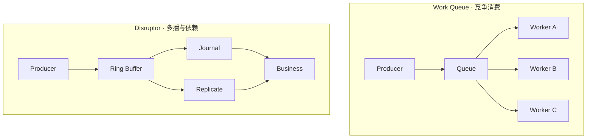
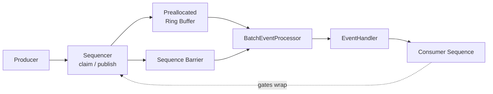
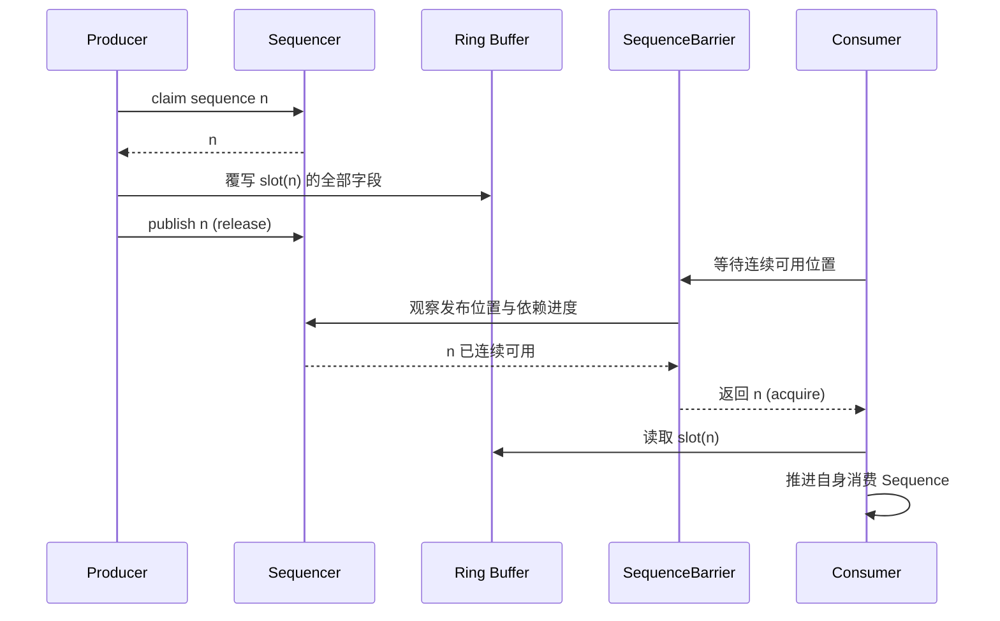
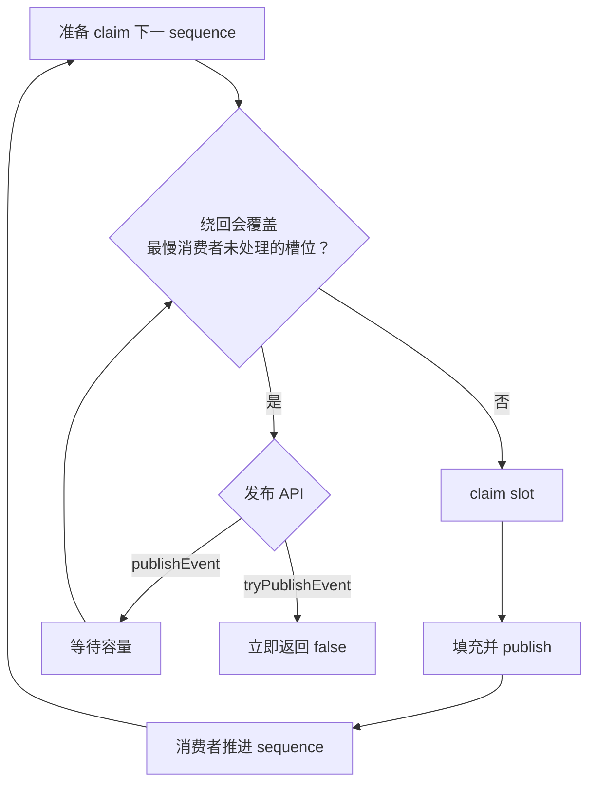
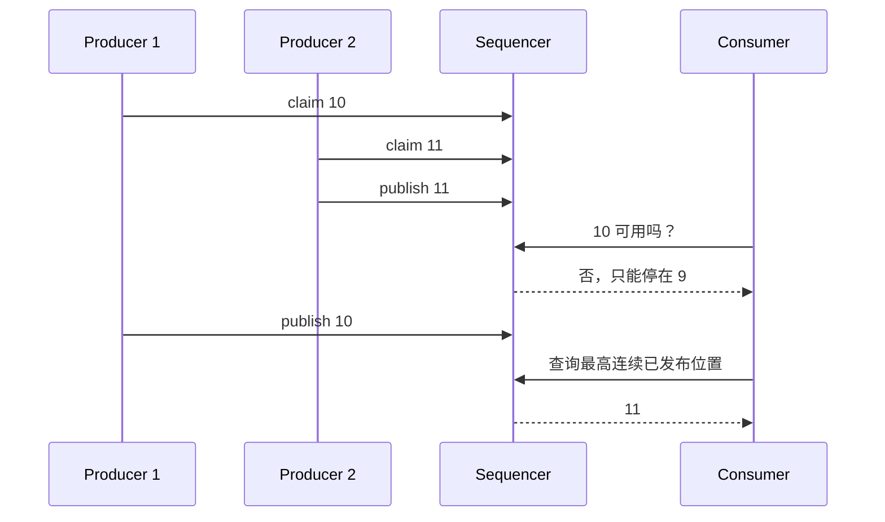
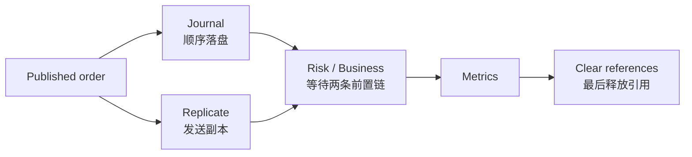
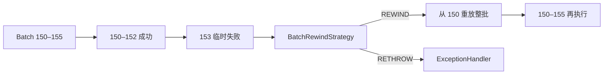

Disruptor 经常被介绍成“比 `BlockingQueue` 更快的队列”。这个说法抓住了性能，却丢掉了它真正有价值、也最容易用错的部分。

它更准确的定位是：**一个进程内、有界、预分配的线程间事件处理框架**。生产者把事件发布到 Ring Buffer，多组消费者可以同时观察同一事件，并通过依赖图表达“并行处理”和“必须先完成”的关系。性能来自更严格的约束，而不是来自一个可以无条件替换所有队列的魔法容器。

本文以截至 2026-08-13 仍由 GitHub 标记为 latest 的稳定版 **Disruptor 4.0.0** 为基线。4.0.0 最低要求 Java 11，并移除了旧版 WorkerPool、`Executor` 构造器等 API；本文的代码和结论不再沿用早期 JDK 7 时代的实现与基准。[4.0.0 Release Notes](https://github.com/LMAX-Exchange/disruptor/releases/tag/4.0.0) · [Maven Central](https://central.sonatype.com/artifact/com.lmax/disruptor/4.0.0)

这是“Java 低延迟工程”的 Chapter 09。前面的 [线程等待](/signal-grid-blog/posts/java-thread-contention-aqs-park-unpark-scheduling/) 与 [Linux 运行时](/signal-grid-blog/posts/linux-low-latency-runtime-cpu-affinity-numa-irq-rss-rps-xps-busy-poll/) 已说明不同 WaitStrategy 最终支付的是自旋、让出、停车、唤醒或调度成本；本文只讨论 Disruptor 如何把这些成本放进有界事件拓扑。下一章再由 [Agrona](/signal-grid-blog/posts/agrona-direct-buffer-queues-and-agents/) 比较二进制 Buffer、并发队列与 Agent 循环。

## 1. 它不是“更快的 Queue”

先区分两个完全不同的消费语义。

普通工作队列常用于**竞争消费**：一个任务最终只交给一个 worker。Disruptor DSL 中的多个 `EventHandler` 默认是**多播**：每个 handler 都会看到每一个事件，还可以建立消费依赖图。



| 维度             | 工作队列                  | Disruptor                                        |
| ---------------- | ------------------------- | ------------------------------------------------ |
| 单个事件的消费者 | 通常由一个 worker 取得    | 可多播给多个 handler                             |
| 消费关系         | 多为平级竞争              | 可表达并行、串行和菱形依赖                       |
| 容量             | 可有界，也可无界          | 固定容量，大小必须为 2 的幂                      |
| 数据对象         | 通常随任务创建            | Ring Buffer 槽位在启动时预分配并循环复用         |
| 背压             | 由队列 API 和应用策略决定 | 最慢的有效消费序列阻止生产者覆盖未处理槽位       |
| 持久化           | 队列自身通常也不保证      | 不提供；它不是 Kafka、Aeron Archive 或数据库日志 |
| 跨进程           | 取决于具体实现            | 不支持，定位是进程内线程间传递                   |

因此，下面两段代码语义完全不同：

```java
// 不是“两个 worker 平均分任务”——两个 handler 都会收到每个事件。
disruptor.handleEventsWith(handlerA, handlerB);

// A、B 并行处理；C 必须等 A、B 都处理完同一 sequence。
disruptor.handleEventsWith(handlerA, handlerB).then(handlerC);
```

Disruptor 4.0 已删除 `WorkerPool`、`WorkProcessor` 和 `handleEventsWithWorkerPool`。如果需求就是任务分片、动态 worker 池或每个任务只执行一次，应重新评估 `ExecutorService`、有界工作队列或语义明确的自定义 `EventProcessor`，不能把多个 `EventHandler` 当成 WorkerPool 的替代品。[官方 User Guide](https://lmax-exchange.github.io/disruptor/user-guide/index.html) · [Issue #323](https://github.com/LMAX-Exchange/disruptor/issues/323)

## 2. 七个核心构件

理解 Disruptor，不要只盯着 Ring Buffer。自 3.x 起，Ring Buffer 负责存储和访问事件，真正协调并发的是 `Sequencer`。



- **Event**：应用定义的数据载体。槽位对象会被反复覆盖，不是一次性消息对象。
- **RingBuffer**：固定大小的预分配事件数组，提供按 sequence 访问槽位的 API。
- **Sequence**：一个单调递增的位置值。Sequencer 与各个 `EventProcessor` 用它表达进度，Barrier 则观察并组合这些进度。
- **Sequencer**：负责生产者领取 sequence、发布可见性、容量判断和 gating；有单生产者与多生产者实现。
- **SequenceBarrier**：把“生产者已发布到哪里”和“我依赖的消费者处理到哪里”组合成当前可消费上界。
- **BatchEventProcessor**：等待一段连续可用的 sequence，再按顺序调用 `EventHandler`。
- **WaitStrategy**：消费者没有新事件时采用阻塞、让出 CPU 或忙等。它不决定 Ring Buffer 满时生产者怎么办。

### 2.1 sequence 不是数组下标

假设 Ring Buffer 容量为 `1024`：

```text
slot = sequence & (bufferSize - 1)
```

sequence `5`、`1029` 和 `2053` 都映射到 slot `5`，但属于不同的绕回周期。容量必须是 2 的幂，关键是让位掩码替代取模；不同绕回代际则由完整 sequence 与可用性标记区分。

### 2.2 预分配不等于“零分配”

`EventFactory` 在构造 Ring Buffer 时为每个槽位创建 Event，热路径发布时只覆写字段。这能消除**槽位对象**的反复创建，却不会自动消除：

- translator 或捕获 lambda 创建的对象；
- handler 内部的字符串、集合和日志参数；
- 数据库、网络客户端或序列化器产生的分配；
- Event 引用字段指向的大对象。

如果 Event 含引用字段，应在依赖链的最后一个 handler 清空它们。否则对象可能一直被槽位引用，直到 Ring Buffer 下一圈覆盖该位置。更重要的是，handler 不能把 Event 引用交给异步线程长期持有；槽位一旦被 gate 释放，生产者就可以改写同一个对象。

## 3. 发布协议：claim、填充、publish

发布不是一次普通的 `put`，而是一个两阶段协议：



消费者只有在 sequence 被 publish 后才能读取槽位。这个 publish/等待边界建立了跨线程的内存可见性；不能把“写进数组”本身当成发布完成。

这条边界背后的证明来自 Java Memory Model，而不是“Ring Buffer 位于同一块内存”这一事实：生产者的 payload 写入必须先于发布状态的 release，消费者也必须通过匹配的 acquire 观察发布完成，随后才可读取槽位。若还不熟悉这套推理，先阅读 [Java Memory Model 与 VarHandle：happens-before、内存顺序与安全发布](/signal-grid-blog/posts/java-memory-model-varhandle-memory-ordering/)。

官方更推荐 `publishEvent` 与 `EventTranslator`：

```java
private static final EventTranslatorOneArg<OrderEvent, ByteBuffer> TRANSLATOR =
    (event, sequence, input) -> event.readFrom(input);

ringBuffer.publishEvent(TRANSLATOR, input);
```

translator 最好是静态实例或不捕获外部变量的 lambda。它在发布线程内同步执行，应该只做简单、可预测且不会抛异常的字段复制；校验和可能失败的转换尽量在 claim 之前完成。

底层 `next()` / `get()` / `publish()` API 仍然存在，但它更容易写错：

```java
long sequence = ringBuffer.next();
try {
    OrderEvent event = ringBuffer.get(sequence);
    event.readFrom(input);
} finally {
    // claim 过的 sequence 必须发布。
    ringBuffer.publish(sequence);
}
```

在多生产者模式下，claim 后漏掉 `publish` 会留下无法跨越的空洞，消费者可能永久停住，直到进程重启。即使放在 `finally`，填充过程中抛异常也可能发布一个只写了一半的旧槽位，所以 Translator 不是输入校验器。[官方发布指南](https://lmax-exchange.github.io/disruptor/user-guide/index.html#_publishing_using_the_legacy_api)

## 4. 有界容量、gating 与背压

Ring Buffer 不会因为是环就覆盖仍未消费的数据。在 DSL 构建的依赖图中，终端叶子的 Sequence 通常会成为 gate；生产者准备绕回时，会检查这些 gate 中最慢的进度。使用底层 API 时，也可以显式注册其他 gating sequences：



这是一种**容量保护**，不是完整的可靠性协议：

- 一个崩溃或永久卡住、但仍作为 gate 的消费者，最终会让生产者在缓冲区填满后停止。
- `hasAvailableCapacity()` 只是并发快照，不是容量预留；多生产者下，检查成功后下一次 claim 仍可能失败或等待。
- `tryPublishEvent()` 返回 `false` 后，究竟拒绝、重试、降级还是写入另一条持久化路径，必须由应用明确决定。
- Disruptor 不替你保存消息、确认远端落盘或完成业务级重放。

容量可先用下面的关系估算，再通过真实流量校正：

```text
requiredCapacity ≳ initialBacklog
                 + max(0, peakArrivalRate - sustainableConsumerRate)
                   × burstOrPauseDuration
                 + safetyMargin
```

若估算的是消费者完全停顿，`sustainableConsumerRate` 就取 `0`。若长期输入率不低于可持续消费率，任何有限容量最终都会耗尽；加大 Ring Buffer 只能延后失败，不能修复系统不稳定。结果应向上取 2 的幂，同时核对 `capacity × eventFootprint` 的常驻内存、缓存局部性和启动预分配成本。只按平均吞吐选容量，会在 GC 停顿、磁盘抖动或突发流量时暴露问题。

### 4.1 单生产者与多生产者

`ProducerType.SINGLE` 不只是性能提示，而是正确性契约：整个生命周期只能有一个发布线程。它利用单写者约束减少协调；多个入口线程偶尔同时调用也不安全。

`ProducerType.MULTI` 允许多个线程领取 sequence，但“已领取”不等于“已经连续发布”。例如：



多生产者 Sequencer 需要记录每个槽位属于哪一圈以及是否已发布，消费者只能前进到**最高连续可用**的 sequence，不能因为 `11` 已发布就越过仍空缺的 `10`。

## 5. 消费依赖图与批处理

Disruptor 最有价值的能力往往不是环形数组，而是把线程拓扑直接编码为依赖图。



```java
EventHandler<OrderEvent> journal = this::appendJournal;
EventHandler<OrderEvent> replicate = this::sendReplica;
EventHandler<OrderEvent> risk = this::applyRisk;
EventHandler<OrderEvent> metrics = this::recordMetrics;
EventHandler<OrderEvent> clear = (event, sequence, endOfBatch) -> event.clear();

disruptor
    .handleEventsWith(journal, replicate)
    .then(risk)
    .then(metrics)
    .then(clear);
```

同一 sequence 先由 journal 与 replicate 并行处理，risk 等两者完成后再运行。任何仍需读取事件字段的指标处理器也必须先于 clear；只有依赖图的最后一个消费者才能安全释放引用。DSL 会把末端叶子消费者设为生产者的 gate；由于下游不可能领先其上游，只跟踪叶子便足以保护整条依赖链。

`BatchEventProcessor` 每次拿到一段连续可用的 sequence，并逐个调用：

```java
void onEvent(OrderEvent event, long sequence, boolean endOfBatch)
```

`endOfBatch` 的含义是“当前 processor 这批事件的最后一个”，不是永久队尾。适合在它为 `true` 时 flush 日志、批量提交或发送一次网络写，而不是每条事件都做昂贵 I/O。

在 4.0 中，原来的 `BatchStartAware`、`LifecycleAware` 和 `SequenceReportingEventHandler` 能力被收拢进 `EventHandler` 默认方法：

```java
default void onBatchStart(long batchSize, long queueDepth) {}
default void onStart() {}
default void onShutdown() {}
default void onTimeout(long sequence) throws Exception {}
default void setSequenceCallback(Sequence sequenceCallback) {}
```

其中 `batchSize` 是这次实际要处理的数量，`queueDepth` 是开始时累计待处理量。`BatchEventProcessorBuilder#setMaxBatchSize` 可以把巨大积压拆成较小批次，避免单批处理无限扩张；这是手工组装 processor 的高级选项，不是 DSL 中随手填写的吞吐旋钮。[EventHandler 4.0 源码](https://github.com/LMAX-Exchange/disruptor/blob/4.0.0/src/main/java/com/lmax/disruptor/EventHandlerBase.java) · [BatchEventProcessorBuilder](https://lmax-exchange.github.io/disruptor/javadoc/com.lmax.disruptor/com/lmax/disruptor/BatchEventProcessorBuilder.html)

## 6. 一个现代、可运行的 4.0 示例

Maven 依赖：

```xml
<dependency>
  <groupId>com.lmax</groupId>
  <artifactId>disruptor</artifactId>
  <version>4.0.0</version>
</dependency>
```

下面的示例模拟单线程网络入口，把已校验的订单字段复制到预分配 Event，然后让 journal 与 replica 并行，最后执行 risk。示例只使用 Java 11 API。

```java
import com.lmax.disruptor.BlockingWaitStrategy;
import com.lmax.disruptor.EventHandler;
import com.lmax.disruptor.EventTranslatorOneArg;
import com.lmax.disruptor.FatalExceptionHandler;
import com.lmax.disruptor.RingBuffer;
import com.lmax.disruptor.dsl.Disruptor;
import com.lmax.disruptor.dsl.ProducerType;

import java.nio.ByteBuffer;
import java.nio.ByteOrder;
import java.util.concurrent.RejectedExecutionException;
import java.util.concurrent.ThreadFactory;
import java.util.concurrent.TimeUnit;
import java.util.concurrent.atomic.AtomicInteger;

public final class OrderPipeline {
    private static final int BUFFER_SIZE = 1 << 16;

    private static final EventTranslatorOneArg<OrderEvent, ByteBuffer> TRANSLATOR =
        (event, sequence, input) -> event.readFrom(input);

    static final class OrderEvent {
        long orderId;
        long price;
        long quantity;
        byte side;

        void readFrom(ByteBuffer input) {
            // 绝对读取；每次覆盖全部字段，不依赖槽位的旧状态。
            orderId = input.getLong(0);
            price = input.getLong(8);
            quantity = input.getLong(16);
            side = input.get(24);
        }
    }

    public static void main(String[] args) throws Exception {
        AtomicInteger threadId = new AtomicInteger();
        ThreadFactory threadFactory = task -> {
            Thread thread = new Thread(task, "order-pipeline-" + threadId.incrementAndGet());
            thread.setDaemon(true);
            return thread;
        };

        Disruptor<OrderEvent> disruptor = new Disruptor<>(
            OrderEvent::new,
            BUFFER_SIZE,
            threadFactory,
            ProducerType.SINGLE,       // 只有 main 线程发布；多入口必须改为 MULTI 或先串行化。
            new BlockingWaitStrategy() // 安全的默认起点，压测后再换。
        );

        disruptor.setDefaultExceptionHandler(new FatalExceptionHandler());

        EventHandler<OrderEvent> journal =
            (event, sequence, endOfBatch) -> appendJournal(event, endOfBatch);
        EventHandler<OrderEvent> replica =
            (event, sequence, endOfBatch) -> sendReplica(event, endOfBatch);
        EventHandler<OrderEvent> risk =
            (event, sequence, endOfBatch) -> applyRisk(event);

        disruptor.handleEventsWith(journal, replica).then(risk);
        RingBuffer<OrderEvent> ringBuffer = disruptor.start();

        ByteBuffer input = ByteBuffer.allocate(25).order(ByteOrder.LITTLE_ENDIAN);
        input.putLong(0, 42L);
        input.putLong(8, 101_250L);
        input.putLong(16, 7L);
        input.put(24, (byte) 1);

        if (!ringBuffer.tryPublishEvent(TRANSLATOR, input)) {
            // 生产系统应计数，并明确选择拒绝、有限重试或持久化降级。
            throw new RejectedExecutionException("ring buffer is full");
        }

        // 先停止所有发布入口，再带超时排空并关闭消费者。
        disruptor.shutdown(5, TimeUnit.SECONDS);
    }

    private static void appendJournal(OrderEvent event, boolean endOfBatch) {
        // append；endOfBatch 时可统一 flush
    }

    private static void sendReplica(OrderEvent event, boolean endOfBatch) {
        // encode / send
    }

    private static void applyRisk(OrderEvent event) {
        // deterministic state transition
    }
}
```

这个例子刻意没有用 Busy Spin，也没有宣称“零 GC”。先把消费语义、容量失败和关闭顺序写对，再以真实 workload 调优。

## 7. WaitStrategy：用 CPU 换等待抖动

WaitStrategy 控制**消费者等待新 sequence** 的方式。4.0.0 的常用选择如下：

| 策略                        | 等待方式                       | 适用起点                       | 主要风险                         |
| --------------------------- | ------------------------------ | ------------------------------ | -------------------------------- |
| `BlockingWaitStrategy`      | 锁 + 条件变量                  | 通用服务、容器、共享 CPU       | 唤醒会增加延迟与抖动             |
| `SleepingWaitStrategy`      | 自旋 → yield → park            | 低 CPU 干扰的异步任务          | 从空闲恢复时延迟更高             |
| `YieldingWaitStrategy`      | 持续轮询并 `Thread.yield()`    | 有充足逻辑核的低延迟服务       | 仍会持续占用 CPU                 |
| `BusySpinWaitStrategy`      | 持续忙等                       | 有独占物理核、亲和性与压测证据 | 超卖或共享核心时会恶化全局尾延迟 |
| `PhasedBackoffWaitStrategy` | 分阶段 spin / yield / fallback | 需要自定义折中                 | 参数与环境强绑定                 |
| Timeout / Lite Blocking     | 阻塞并提供超时或减少信号开销   | 需要空闲检测的特殊路径         | 语义和调度更复杂                 |

选择顺序建议是：

1. 从默认 `BlockingWaitStrategy` 建立正确性与基准。
2. 在目标机器上测量 handler 的 p50、p99、p99.9、CPU 利用率和调度抖动。
3. 只有确认消费线程有稳定可用的核心，才尝试 Yielding 或 Busy Spin。
4. 容器配额、共享宿主或线程数超过可用核心时，忙等通常会让结果更差。

WaitStrategy 不是生产者容量不足时的策略。稳定版 4.0.0 中，生产者应通过 `publishEvent` 的等待语义或 `tryPublishEvent` 的立即失败，建立应用自己的背压规则。[WaitStrategy Javadoc](https://lmax-exchange.github.io/disruptor/javadoc/com.lmax.disruptor/com/lmax/disruptor/WaitStrategy.html)

## 8. 4.0 的变化与迁移陷阱

| 变化                            | 迁移时要做什么                                                       |
| ------------------------------- | -------------------------------------------------------------------- |
| 最低 Java 11                    | 升级运行时与构建链；不要再围绕 `Unsafe` 示例解释当前实现             |
| 删除接收 `Executor` 的构造器    | 直接提供 `ThreadFactory`，明确线程名、daemon、优先级与异常观测       |
| 删除 WorkerPool / WorkProcessor | 重新确认业务究竟要多播还是竞争消费；不存在一行代码的等价替换         |
| EventHandler 收拢扩展接口       | 把启动、关闭、批次开始、超时和 sequence callback 放到同一个 handler  |
| 新增最大批次大小                | 手工构造 `BatchEventProcessor` 时用 Builder 限制单批大小             |
| 新增 Batch Rewind               | 对可恢复的整批事务显式选择重放策略，并保证幂等或可回滚               |
| `handleExceptionsWith` 废弃     | 启动前用 `setDefaultExceptionHandler`，或为指定 handler 配置异常处理 |

### 8.1 Batch Rewind 不是 exactly-once

普通 `EventHandler` 抛异常后，`BatchEventProcessor` 会调用 `ExceptionHandler`。如果异常处理器正常返回，失败 sequence 会被推进，消费继续——也就是这条事件被跳过。异常处理器不是自动重试器。

4.0 新增的 Batch Rewind 允许 `RewindableEventHandler` 抛出 `RewindableException`，再由 `BatchRewindStrategy` 选择回到当前批次开头，或把异常交回普通异常处理器：



注意，150–152 的 handler 逻辑会再次执行。因此 Batch Rewind 适合“整批位于同一个可回滚数据库事务”这类场景；如果副作用已经不可逆，就必须依赖幂等键、去重或补偿，不能把 rewind 当成 exactly-once。

```java
disruptor.handleEventsWith(
    new EventuallyGiveUpBatchRewindStrategy(3),
    rewindableHandler
);
```

官方 User Guide 解释了整批回滚再执行的模型；稳定版 API 应在 DSL 或 `BatchEventProcessorBuilder` 构造时传入策略。[Batch Rewind Guide](https://lmax-exchange.github.io/disruptor/user-guide/index.html#_batch_rewind) · [4.0 Disruptor DSL 源码](https://github.com/LMAX-Exchange/disruptor/blob/4.0.0/src/main/java/com/lmax/disruptor/dsl/Disruptor.java)

## 9. 怎样证明 Disruptor 在你的拓扑上更合适

不要复用十多年前的“每秒多少操作”作为自己的容量结论。官方后来补充的现代吞吐测试使用 AMD EPYC 9374F、Linux 5.4.277 与 OpenJDK 11.0.24；在该环境里，结果仍明显依赖拓扑：

| 拓扑                         | ArrayBlockingQueue | Disruptor 3 | Disruptor 4 |
| ---------------------------- | -----------------: | ----------: | ----------: |
| 1 Producer → 1 Consumer      |       20.9 M ops/s |     134.6 M |     160.4 M |
| 3 Producers → 1 Consumer     |       18.8 M ops/s |      16.0 M |      29.7 M |
| 1 Producer → 3-way Multicast |        2.4 M ops/s |      68.2 M |      70.0 M |

这组数据说明 Disruptor 在对应微基准中有优势，也同时说明：多生产者竞争、版本与消费拓扑会改变结果，甚至旧版某个拓扑会落后于 `ArrayBlockingQueue`。它不是你的业务 SLA。[官方 Performance Testing](https://lmax-exchange.github.io/disruptor/disruptor.html#_throughput_performance_testing)

本节只保留 Disruptor 特有的实验矩阵。通用测量合同见 [Java 低延迟到底应该怎么测](/signal-grid-blog/posts/java-low-latency-measurement/)；前置的 [机器模型](/signal-grid-blog/posts/java-low-latency-machine-model-cache-locality-false-sharing-numa/)、[HotSpot](/signal-grid-blog/posts/hotspot-execution-tlab-escape-analysis-jit-deoptimization-safepoint/)、[GC](/signal-grid-blog/posts/java-low-latency-gc-allocation-live-set-g1-zgc-shenandoah/)、[线程等待](/signal-grid-blog/posts/java-thread-contention-aqs-park-unpark-scheduling/) 与 [Linux 运行时](/signal-grid-blog/posts/linux-low-latency-runtime-cpu-affinity-numa-irq-rss-rps-xps-busy-poll/) 则分别解释缓存拓扑、编译状态、回收压力、自旋/停车和线程/网卡布置为什么会改变 Ring Buffer 的真实结果。

可信的评估至少要包含：

- 使用 JMH 或等价 harness，包含多 fork、预热和防止 JIT 消除的消费；
- 运行真实的 handler、事件大小、生产者数量与依赖图；
- 同时测吞吐、p50、p99、p99.9/p99.99，而不是只看平均值；
- 记录 JVM、GC、CPU 型号、NUMA、频率策略、线程亲和性和容器配额；
- 注入突发、最慢消费者停顿、Ring Buffer 满、异常与 shutdown；
- 和**语义等价**的有界队列、单线程事件循环或批处理实现比较。

生产证据还要覆盖运行过程，而不是只留一张基准结果：关联观察 producer cursor、叶子 consumer sequence、lag、remaining capacity、拒绝数、batch size、rewind 和 handler 延迟。关闭时先停止发布，再使用带超时的 `shutdown` 排空；否则一次看似正常的部署切换也可能丢掉仍在 Ring Buffer 中的业务。

### 什么时候不要用

这些场景通常有更直接的工具：

- 需要跨进程传输：评估 Aeron 等传输方案；还需要持久化与重放时，应使用 Aeron Archive、Kafka、消息日志或数据库 outbox 等具备相应语义的方案。
- 每个任务只应交给一个动态 worker：使用有界 Executor/工作队列，或另建明确的分片模型。
- handler 以不可控的远程 I/O 为主，又没有隔离、超时和背压：Disruptor 只会更快地把慢点暴露出来。
- 部署在 CPU 严重超卖的共享环境，却希望依靠 Busy Spin 得到稳定微秒级尾延迟。
- 事件率很低、拓扑简单，普通单线程循环或 `ArrayBlockingQueue` 已经满足 SLA。
- 团队无法维护对象复用、sequence 生命周期、异常推进和容量失败这些额外约束。

Disruptor 的价值不是“永远更快”，而是让一个受控的进程内事件管线拥有明确的存储、顺序、依赖与容量边界。把这些边界设计正确，再用数据证明性能，才是它真正的使用方式。

## 参考资料

- [LMAX Disruptor 4.0.0 Release Notes](https://github.com/LMAX-Exchange/disruptor/releases/tag/4.0.0)
- [LMAX Disruptor User Guide](https://lmax-exchange.github.io/disruptor/user-guide/index.html)
- [LMAX Disruptor 4.0 Javadoc](https://lmax-exchange.github.io/disruptor/javadoc/com.lmax.disruptor/module-summary.html)
- [Disruptor 4.0 RingBuffer source](https://github.com/LMAX-Exchange/disruptor/blob/4.0.0/src/main/java/com/lmax/disruptor/RingBuffer.java)
- [SingleProducerSequencer source](https://github.com/LMAX-Exchange/disruptor/blob/4.0.0/src/main/java/com/lmax/disruptor/SingleProducerSequencer.java)
- [MultiProducerSequencer source](https://github.com/LMAX-Exchange/disruptor/blob/4.0.0/src/main/java/com/lmax/disruptor/MultiProducerSequencer.java)
- [BatchEventProcessor source](https://github.com/LMAX-Exchange/disruptor/blob/4.0.0/src/main/java/com/lmax/disruptor/BatchEventProcessor.java)
