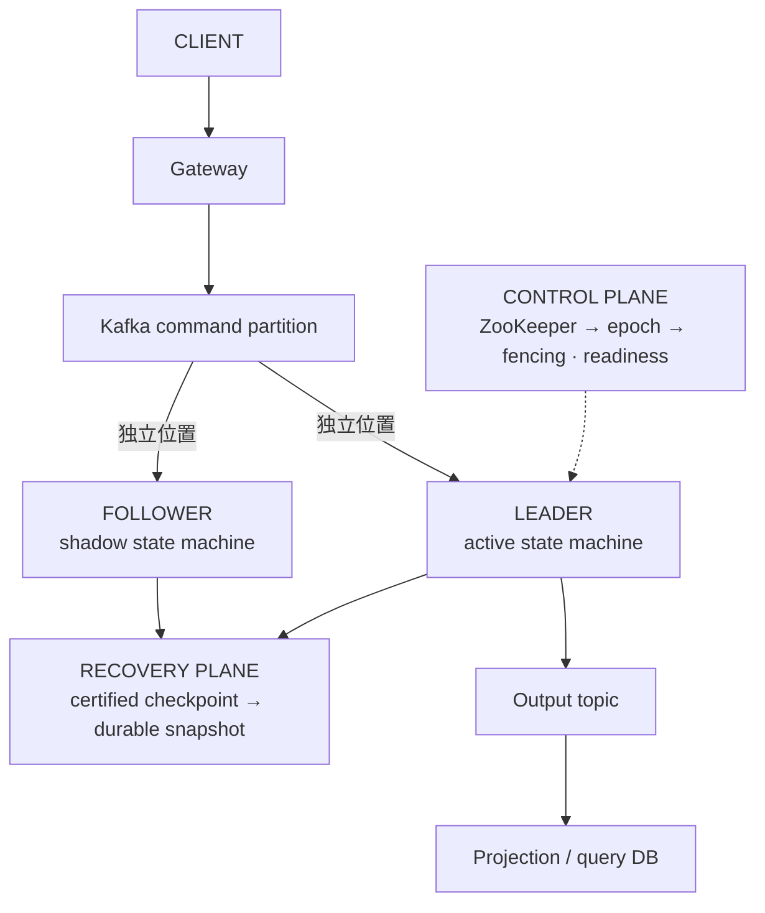
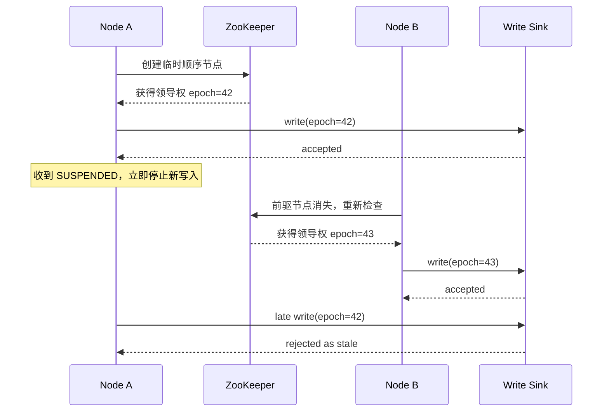
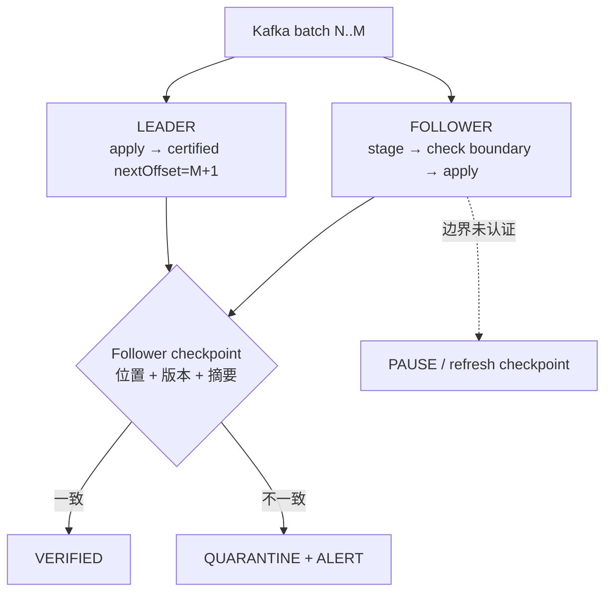
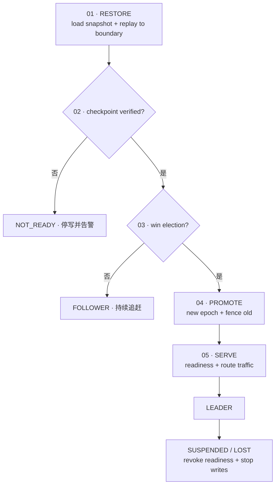
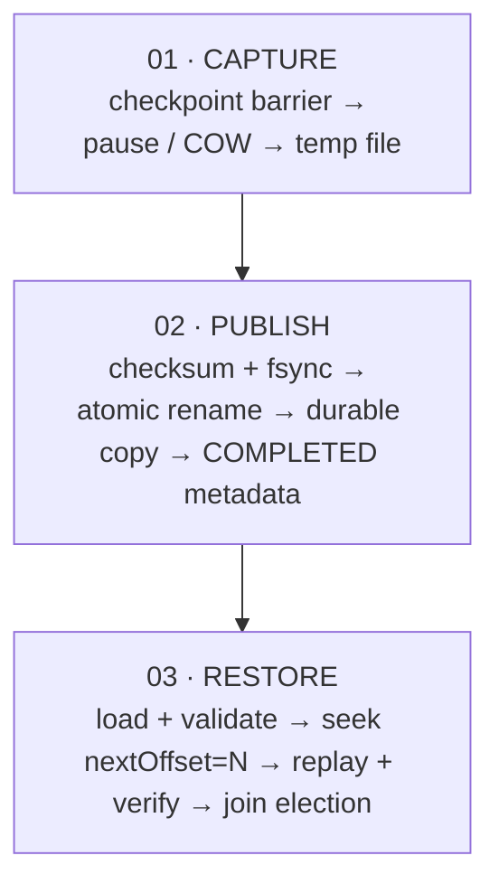

撮合、账户、风控这类服务把大量状态放在内存中，以单线程事件循环换取确定的顺序和较低的尾延迟。它们真正困难的地方并不是“再启动一个实例”，而是回答三个问题：新节点恢复到了哪一个确定状态，旧 Leader 是否已经失去写权限，以及故障期间是否可能丢失或重复外部副作用。

本文给出一种可落地的参考模型：**Kafka 分区日志 + 单写者状态机 + 热备 Follower + ZooKeeper 选主 + durable snapshot**。它偏向一致性；当节点无法证明自己仍是合法 Leader 时，正确行为是停止写入，而不是带着不确定性继续服务。

> 这不是仅靠几项中间件配置就能获得的“强一致方案”。一致性来自完整协议：确定性执行、按分区记录的恢复位点、Leader epoch、下游 fencing、原子快照，以及可重复验证的故障切换流程。

本文是学习路径的架构总览。下一章 [《WAL 到底保证什么》](/signal-grid-blog/posts/write-ahead-log-durability-and-crash-recovery/) 会先解释单机怎样用日志、持久化屏障和恢复算法建立可恢复前缀；Chapter 03 的 [《分布式时间》](/signal-grid-blog/posts/distributed-systems-time-clocks-ordering-and-leases/) 再拆开墙钟、因果顺序、超时与 Lease；Chapter 04 用 [operation history 精确定义一致性合同](/signal-grid-blog/posts/consistency-models-linearizability-serializability-and-real-time-order/)；Chapter 05 的[复制协议设计空间](/signal-grid-blog/posts/replication-protocol-design-space-primary-backup-quorum-chain-smr/)比较同步、异步、Quorum、Chain Replication 与状态机复制；随后 Chapter 06 的 [Raft 论文精读](/signal-grid-blog/posts/raft-consensus-leader-election-log-replication-and-safety/) 才深入一种多数派日志协议。本文的双节点热备参考模型本身不是 Raft 集群。

## 先定义故障边界和目标

在画架构图之前，应先写清楚系统承诺处理哪些故障：

- 单进程崩溃或 JVM 长暂停；
- 单机宕机或网络不可达；
- Leader 与协调服务之间发生网络分区；
- Follower 落后、状态摘要不一致或快照损坏；
- Kafka、数据库或外部 API 返回结果未知；
- 整块磁盘或整台机器永久丢失。

同时把三个目标分开：

- **RTO**：从故障发生到新的安全写路径恢复所需时间；
- **RPO**：恢复后最多允许丢失多少已确认业务操作；
- **降级语义**：无法确认唯一写者时，是停止写入、只读，还是返回明确的暂不可用。

“单节点故障无影响”和“10～30 秒完成接管”并不是同一个承诺。后者仍然存在写入不可用窗口。真实的 RTO 至少包含：

```text
故障检测 + Follower 追赶与校验 + 获取新 epoch + fencing + readiness + 路由收敛
```

这些时间必须通过故障演练测量，不能只由 ZooKeeper session timeout 推导。

## 架构模型：单写者与热备副本

下面的模型只有一个节点对外产生权威副作用。Follower 虽然持续执行相同输入、生成快照并计算校验信息，但不接受业务写流量，因此它是 **Active-Passive hot standby**，而不是 Active-Active。



Kafka 在同一个 consumer group 内会把一个 partition 同时分配给一个 consumer。若 Leader 和 Follower 都要读取该 partition 的完整日志，它们必须使用不同的 group，或者采用明确的手动 assignment，并分别维护自己的位置。Kafka offset 也只在某个 `topic-partition` 内有意义，不能把单个 `long` 当成整个系统的全局版本。分区日志、ISR、KRaft、消费位置与事务的完整边界见 [Kafka 4.3 深度指南](/signal-grid-blog/posts/kafka-distributed-log-kraft-consumers-and-transactions/)。

### Shard、partition 与状态所有权

一个清晰的映射通常是：

```text
routing key → shardId → Kafka partition → 一对状态机副本
```

例如按用户分片时，同一用户的全部命令必须进入同一 shard；否则跨 partition 的到达顺序无法直接构成该用户的总序。每个 shard 应独立维护：

- 输入 topic、partition 和 `nextOffset`；
- 当前 Leader epoch；
- Leader/Follower 的状态摘要与 readiness；
- 快照命名空间及保留策略；
- 输出事件的幂等键或业务序列号。

水平扩容意味着迁移状态所有权，不只是把取模数从 2 改成 4。生产方案还要定义再分片期间的双写禁止、流量冻结、状态搬迁和恢复点切换。

### 确定性执行的前提

双节点独立执行只有在状态转换函数确定时才有意义。至少要约束：

- 相同初始状态、相同有序输入和相同业务版本得到相同结果；
- 当前时间、随机数、ID 分配和外部查询结果不能在两个副本上各自生成；
- 配置变更也要进入有序日志，或绑定到可验证的配置版本；
- 金额和数量使用确定的整数或定点表示，避免环境相关的浮点差异；
- 遍历无序容器时，不得让迭代顺序影响输出或摘要。

如果业务逻辑需要读取数据库、调用第三方接口或取得当前时间，应先把其结果固化为输入事件，再由两个副本消费。

## 选主只是开始：epoch 与 fencing

ZooKeeper 的标准选举配方使用临时顺序节点：序号最小者成为 Leader，其余参与者监听各自的前驱节点。这可以避免所有参与者同时监听最小节点造成的 herd effect。

但“谁被选中”不等于“旧主已经无法写”。在网络分区或长时间 GC 暂停期间，旧进程可能仍在运行。每次领导权都必须携带单调递增的 **epoch/fencing token**，所有有副作用的下游都应拒绝旧 epoch。



epoch 不能只是 JVM 里的 `volatile boolean leader`。布尔值只能解决线程可见性，无法区分“第 42 任 Leader”和“第 43 任 Leader”，也无法拦截已经在途的旧请求。

### 正确处理连接状态

Curator 的 `LeaderLatch` 会报告领导权变化，但应用仍应注册连接状态监听器：

- `SUSPENDED`：立即暂停接入和一切有副作用的写入，把领导权视为暂时丢失；
- `LOST`：会话已不可再信任，进入 Follower/恢复状态；
- `RECONNECTED`：重新检查领导权、epoch 和本地状态，不能仅因连通就恢复写入。

`ExponentialBackoffRetry(1000, 100)` 表示最多重试 100 次，并不是无限重试。重试策略影响重新连接的节奏，但不能延长旧 Leader 的授权。

### 计划内切换

主动切换应是一个 drain 协议，而不仅是关闭 `LeaderLatch`：

1. 停止接收新命令，并等待在途批次完成；
2. 发布最终的 certified checkpoint；
3. 确认候选 Follower 已追到该位置且校验通过；
4. 撤销 readiness，再释放领导权；
5. 新 Leader 获得更高 epoch，完成 fencing 后才开放流量。

运维接口必须有鉴权、审计、幂等保护和超时处理。

### Follower 追赶与一致性校验

建议把恢复位置命名为 `nextOffset`：它表示下一条尚未包含在当前状态中的 Kafka record。这样，快照包含所有 `< nextOffset` 的输入，恢复时可直接 `seek(nextOffset)`，避免 `offset` 究竟指“最后已处理”还是“下一条待处理”的歧义。

一个 checkpoint 至少包含：

```text
{ shardId, topic, partition, nextOffset, leaderEpoch, codeVersion, configVersion, stateDigest }
```



检查必须发生在 Follower 修改状态之前。若 Follower 已经应用了尚未认证的输入，再发现自己超前，就需要回滚或重新恢复，不能简单等待几百毫秒后继续。

#### 摘要能做什么，不能做什么

“相同输入 + 相同输出”不能证明“内存状态完全相同”。两个状态可能暂时产生同一批输出；没有输出的命令也可能改变内部状态；若只按消息 key 排序，还可能抹掉本应被检测到的顺序差异。

更可靠的做法是组合使用：

- 对规范序列化后的分区状态计算周期性摘要；
- 在每批处理后记录业务不变量，例如资产守恒或订单索引一致；
- 把 code/config version 纳入 checkpoint；
- 对输出事件保留顺序和明确的批次边界；
- 摘要不一致时立即隔离，不允许该节点参与选举。

MD5 不适合需要碰撞抗性的设计。若摘要仅用于发现偶发实现偏差，可选经过基准测试的快速哈希；若还承担安全完整性，应使用 SHA-256 或 HMAC。无论使用哪种算法，摘要都是检测器，不是强一致性的证明。

### 安全的故障转移

Follower 不能在赢得选举的瞬间直接对外服务。它必须先拥有完整状态，再证明自己的日志位置、业务版本和摘要符合要求，最后用新 epoch fence 掉旧主。



#### 心跳、选主和 readiness 不应混为一谈

Redis 心跳适合监控“节点最近是否报告存活”，但不适合授予写权限。系统至少有三类不同信号：

| 信号                            | 用途                           | 能否决定写权限       |
| ------------------------------- | ------------------------------ | -------------------- |
| ZooKeeper connection/leadership | 判断协调状态                   | 只能作为协议的一部分 |
| Application readiness           | 判断状态、版本和依赖是否已就绪 | 路由准入依据         |
| Redis/Prometheus heartbeat      | 告警、容量和趋势观测           | 不能                 |

如果每 5 秒写一次心跳、TTL 为 120 秒，而检查任务每 120 秒才读取一次，最坏检测时间会接近 240 秒。任何阈值都应从目标检测时间、实际 GC 暂停、网络抖动和误报成本推导，并通过演练验证。

## 原子快照与可恢复日志窗口

快照的目的不是替代 Kafka，而是缩短从日志重放恢复的时间。快照必须同时描述状态内容和精确的 `nextOffset`，二者不可分开提交。



### 创建快照

实现可以选择短暂停顿或 Copy-on-Write，但两者都需要一个明确的 checkpoint barrier：

- 短暂停顿简单，代价是暂停时间与状态规模相关；
- COW 降低停顿，但需要额外内存，并要控制快照期间的修改放大；
- 文件先写临时路径，校验并 `fsync` 后再原子改名；文件内容、rename 与父目录持久化的精确边界见 [WAL 与崩溃恢复章节](/signal-grid-blog/posts/write-ahead-log-durability-and-crash-recovery/)；
- 只有对象上传和元数据提交都完成，状态才可标记为 `COMPLETED`。

CRC32 可以发现常见的意外损坏，但不是防篡改机制。快照还应记录格式版本、长度、创建节点、epoch、code/config version 和 checksum。

### 快照不能只放本地磁盘

本地文件可作为恢复缓存，却无法覆盖整机或磁盘永久损坏。至少一份完成快照应复制到对象存储、共享持久卷或其他独立故障域。元数据库中只有一个本地路径，并不能让另一台机器恢复数据。

### 保证仍可重放

Kafka 按 segment 执行保留和清理。时间保留默认值可以变化，生产系统也常有 topic override，因此不要把“7 天”写成协议常量。应持续监控：

```text
logStartOffset <= snapshot.nextOffset <= highWatermark
```

一旦最新可用快照落到 `logStartOffset` 之前，该副本就失去了完整恢复链。快照成功率、年龄和可回放余量都应告警。

## Kafka 输入、输出与外部副作用

下面这些配置方向合理，但不能替代端到端协议：

| 配置                                       | 正确理解                                                                          |
| ------------------------------------------ | --------------------------------------------------------------------------------- |
| `acks=all`                                 | 等待当前 ISR；还需为 topic 设置合适的 replication factor 与 `min.insync.replicas` |
| `enable.idempotence=true`                  | 避免 producer retry 在 Kafka log 内产生重复，不等于业务处理 exactly-once          |
| `max.in.flight.requests.per.connection<=5` | 开启幂等时可保持顺序；固定为 1 通常不是必需的                                     |
| `delivery.timeout.ms`                      | 给重试设置总时间边界；`retries=2147483647` 也不是无限等待                         |
| `enable.auto.commit=false`                 | 允许应用控制提交时机，但手动提交本身不提供原子处理                                |
| `auto.offset.reset=earliest`               | 只在没有有效 offset 或旧位置已被清理时生效，不是正常恢复策略                      |

`acks=all` 也不自动等于“多数副本确认”。例如 replication factor 为 3 时，通常还要设置 `min.insync.replicas=2`，并明确在 ISR 不足时宁可拒绝写入。

### Kafka 到 Kafka

若业务只消费 Kafka 并把结果写回 Kafka，可使用 transactional producer，把输出记录和消费位置放在同一事务中；下游使用 `read_committed`。这比“先发送、失败后补偿”更容易定义边界。

### Kafka 到数据库或外部系统

外部数据库无法自动加入 Kafka producer transaction。常见方案是：

1. 在数据库事务中同时写业务结果、幂等键和消费位置；或
2. 在权威状态转换时先写 transactional outbox，再由 publisher 发送；
3. 下游按稳定的业务 ID、shard sequence 和 epoch 实现幂等；
4. 发送结果未知时允许安全重试，而不是假定失败就一定没有写入。

“Kafka 发送失败后再插入补偿表”仍有一个窗口：Kafka 结果可能未知，补偿表写入本身也可能失败。由 Follower 执行补偿还必须确保它不能以旧 epoch 发布权威输出。

## 怎样证明故障转移闭环

建议至少暴露这些指标：

- 每个 shard 的 Leader epoch、角色和最近一次变化原因；
- Leader/Follower `nextOffset`、lag、摘要和 code/config version；
- 快照年龄、耗时、大小、校验结果和可回放余量；
- 选举、fencing、readiness 与路由收敛耗时；
- Kafka 发送结果未知、事务 abort、outbox backlog 和幂等冲突；
- 业务不变量检查失败次数。

上线前应自动演练：

- kill Leader 进程、断网、暂停 JVM 和隔离 ZooKeeper；
- 在旧 Leader 上制造延迟写，验证下游确实拒绝旧 epoch；
- 让 Follower 落后或摘要不一致，验证它不会获得流量；
- 破坏最新快照，验证可回退到上一份并完整重放；
- 缩短 Kafka 保留窗口，验证快照过旧告警；
- 在计划切换期间持续压测，记录真实 RTO、错误率和重复率。

## 这套参考模型何时成立

这套架构适合单个 shard 可由单线程状态机承载、输入可以形成确定有序日志、业务愿意在不确定时停止写入的系统。以下情况需要额外设计：

- 一个事务跨越多个 shard；
- 外部副作用不支持幂等或 fencing；
- 状态转换依赖不可重放的实时查询；
- 必须多地域同时写入；
- 单 shard 吞吐已经超过单状态机处理能力。

高可用不是“组件越多越安全”。更可靠的判断标准是：任意时刻能否证明唯一写者是谁、它处理到了哪个日志前缀，以及旧写者为什么无法再产生被接受的副作用。

## 官方参考

- [ZooKeeper：Leader Election recipe](https://zookeeper.apache.org/doc/current/recipes.html)
- [Apache Curator：LeaderLatch](https://curator.apache.org/docs/recipes-leader-latch/)
- [Apache Curator：连接中断与 session 处理建议](https://curator.apache.org/docs/tech-note-14/)
- [Apache Kafka 4.3：Design 与 delivery semantics](https://kafka.apache.org/43/design/design/)
- [Apache Kafka 4.3：Producer configs](https://kafka.apache.org/43/configuration/producer-configs/)
- [Apache Kafka 4.3：Consumer configs](https://kafka.apache.org/43/configuration/consumer-configs/)
- [Apache Kafka 4.3：Topic configs](https://kafka.apache.org/43/configuration/topic-configs/)
- [RFC 6151：MD5 的安全边界](https://www.rfc-editor.org/info/rfc6151/)
