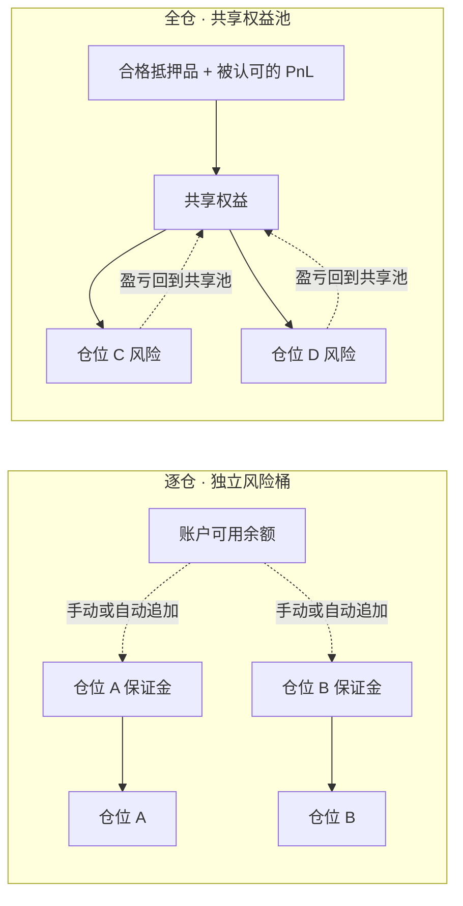
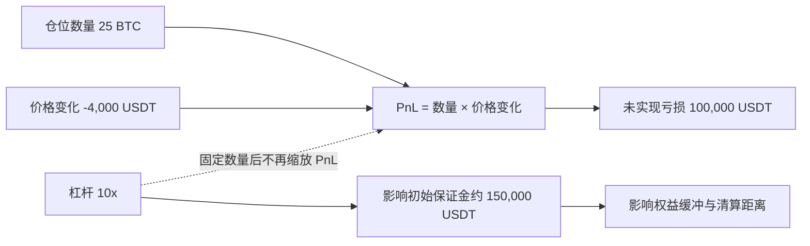
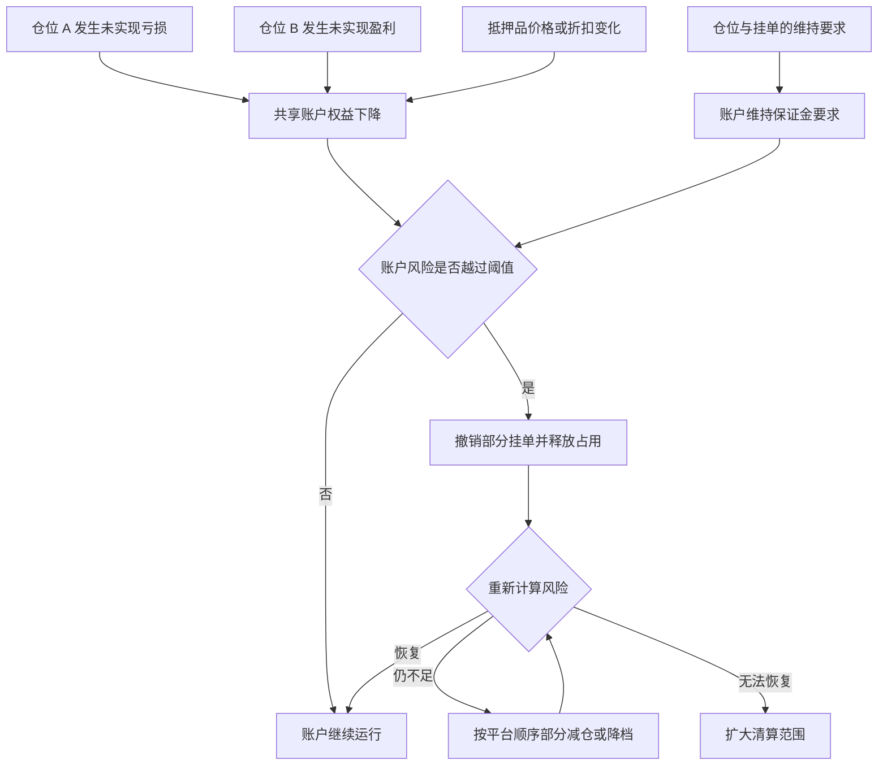

逐仓（Isolated Margin）和全仓（Cross Margin）的核心区别，不是界面上选择了哪个杠杆倍数，而是：**哪些权益可以支撑哪些风险，亏损会沿什么边界传播，清算引擎又会在哪个层级采取动作。**

本文是交易系统学习路径的 Chapter 12。建议先阅读 [Chapter 11：保证金风险引擎](/signal-grid-blog/posts/margin-metrics-and-mark-price/)，再把这里的保证金范围、账户权益和维持保证金要求连起来理解。

> 本文用于解释产品规则与系统设计，不构成投资、交易或风险承受能力建议。真实结果取决于交易场所、产品、账户模式、风险档位、费用和当时流动性；下文中的数字只用于校验计算关系。

## 1. 先画清保证金的所有权边界

在逐仓模式下，风险引擎为某个仓位或某个合约方向维护独立的保证金桶。其他可用余额通常不会自动进入这个桶，但“独立到什么程度”仍取决于平台：有的平台按仓位隔离，有的平台按交易对或结算币种隔离；若启用了自动追加保证金，账户余额还可能被转入逐仓桶。

全仓模式则把某个规则范围内的合格权益放进共享池。这个范围可能是单一结算币种，也可能是统一账户中的多币种折算权益。一个仓位的未实现亏损会消耗共享安全垫，一个仓位的未实现盈利也可能提高账户权益——前提是平台认可该盈利以及相关抵押品价值。



| 观察维度 | 逐仓 | 全仓 |
| --- | --- | --- |
| 风险判断层级 | 单仓位、单方向或平台定义的隔离单元 | 结算币种、账户或平台定义的共享单元 |
| 闲置余额 | 通常不自动支撑仓位 | 在合格范围内共同支撑仓位 |
| 盈亏传播 | 主要留在隔离单元 | 影响共享权益与其他仓位的安全垫 |
| 清算对象 | 通常先处理触发风险的隔离单元 | 按账户风险与平台清算顺序降低风险 |
| 关键例外 | 自动追加保证金、费用、资金费、模式切换 | 抵押品折扣、借贷负债、风险档位、部分清算 |

因此，“逐仓绝对隔离”和“全仓必然把所有仓位同时清掉”都太绝对。前者忽略了自动追加、费用和平台的隔离粒度，后者忽略了撤单释放保证金、风险档位下调、部分清算以及按风险贡献减仓等流程。

## 2. 固定仓位的盈亏不除以杠杆

以 USDT 线性合约为例，忽略费用和资金结算时：

```text
多头未实现盈亏 = 数量 × (标记价格 - 开仓均价)
空头未实现盈亏 = 数量 × (开仓均价 - 标记价格)

初始保证金约束 ≈ 开仓名义价值 ÷ 杠杆倍数
```

杠杆影响的是开仓所需的初始保证金和权益缓冲，不会在**仓位数量已经固定**后把盈亏再除一次。反向合约、期权和币本位结算使用不同公式，也不能直接套用上式。

假设一笔线性 BTC 多头为 25 BTC，开仓均价 60,000 USDT，标记价格降到 56,000 USDT：

```text
未实现盈亏 = 25 × (56,000 - 60,000)
           = -100,000 USDT
```

若开仓时使用 10 倍杠杆，1,500,000 USDT 名义价值对应的初始保证金约为 150,000 USDT。价格变化产生的仍是 100,000 USDT 亏损，而不是 `100,000 ÷ 10`。在暂不考虑维持保证金、手续费和资金结算的简化视图里，仓位权益约剩 50,000 USDT。



这也是为什么只看“收益率百分比”容易误解：许多界面用较小的初始保证金作分母，杠杆提高后 ROI 百分比会放大，但同样数量、同样价格变化对应的金额盈亏并未因此改变。

## 3. 逐仓是有限边界，不是数学上的绝对防火墙

一个可审计的逐仓模型至少要维护：

```text
positionEquity
  = allocatedMargin
  + unrealizedPnL
  - accruedFees
  - unsettledCharges

maintenanceRequirement
  = tieredMaintenanceMargin
  + estimatedCloseCost
  + productSpecificAddOns
```

当仓位权益不足以覆盖维持要求时，平台进入清算流程。公式中的项目和触发比率并不统一，名义价值还会随标记价格、风险档位和订单占用变化。因此，网上常见的“一行强平价公式”只能是带假设的近似，不能作为跨平台恒等式。

逐仓的边界还会被以下规则改变：

- **自动追加保证金**：触发时把可用余额转入仓位，风险边界随之扩大；
- **资金费与费用扣除位置**：可能先扣可用余额，也可能在余额不足时侵蚀仓位保证金；
- **双向持仓与合并规则**：同一合约的多空方向是否独立，要看持仓模式；
- **风险限额档位**：仓位名义价值上升后，维持保证金率可能阶梯式提高；
- **极端成交与负余额规则**：强平滑点、费用以及保险基金安排会影响最终结算。

所以更准确的表述是：逐仓把直接风险限制在平台定义的隔离单元内，且损失**通常**以已分配保证金为主要边界；它不保证任何市场状态下都恰好损失一个预设常数。

## 4. 全仓传播的是风险，不等于同时清空全部仓位

全仓账户可以抽象为一个持续重估的约束：

```text
可折算账户权益 > 账户维持保证金要求
```

左边会受到抵押品价格、折扣率、未实现盈亏、已实现费用和负债影响；右边由仓位、挂单、风险档位和附加项共同决定。一个仓位亏损既可能降低左边，也可能因名义价值或档位变化抬高右边。



清算范围不是由“全仓”两个字单独决定。某些系统先撤销开仓单，再对风险贡献较高或流动性较好的仓位逐级减仓；风险率恢复后便停止。也有产品在更窄的结算币种范围内共享保证金。盈利仓位可能为账户提供缓冲，也可能因抵押品折扣、基差或流动性变化无法完全抵消另一腿风险。

## 5. 从可比风险快照到系统模型

### 模式比较必须固定同一组条件

比较逐仓与全仓时，至少应固定以下变量，否则两个“强平价”并不具备可比性：

1. 合约类型与结算币种；
2. 仓位数量，而不只是杠杆倍数；
3. 开仓均价、标记价格与价格精度；
4. 初始保证金率、维持保证金档位和预估平仓费用；
5. 是否存在挂单占用、资金结算、借贷利息和其他仓位；
6. 逐仓是否启用自动追加，全仓认可哪些抵押品与未实现盈利；
7. 清算是一次性全平，还是撤单、降档、部分清算后反复重算。

一个实用的系统测试不是背出某个强平价，而是给定完整账户快照，验证风险引擎能否输出相同的：权益分解、维持要求、触发原因、待释放占用、减仓顺序和清算后余额。

### 交易系统怎样表达这两种模式

不要只在仓位表加一个 `marginMode` 字段。最小的审计模型还应记录：

- `marginScopeId`：该仓位属于哪个隔离桶或共享池；
- `collateralLedger`：抵押品数量、指数价格、折扣与负债；
- `positionRisk`：标记价格下的 PnL、IM、MM、档位和附加项；
- `orderReserve`：未成交订单占用的保证金与手续费缓冲；
- `riskSnapshotVersion`：本次计算使用的参数版本；
- `liquidationState`：正常、限制开仓、撤单、部分清算或全面接管；
- `transferJournal`：逐仓追加、释放保证金以及模式切换的资金流水。

模式切换必须是一次受风控约束的状态迁移：先按目标模式试算，再冻结相关订单和资金，原子地迁移保证金范围，最后发布新风险快照。否则在价格快速变化时，界面显示已切换而账本仍停留在旧范围，会产生难以重放的风险缺口。

## 6. 结论：模式定义风险边界，不定义盈亏倍率

- 逐仓和全仓定义的是**权益共享范围与风险传播边界**，不是收益放大公式。
- 固定数量的线性合约盈亏由数量和价格变化决定，不能再除以杠杆。
- 逐仓通常限制直接传播，但自动追加、费用与平台隔离粒度会改变边界。
- 全仓共享权益，却不必然一次性清空所有仓位；撤单、降档与部分清算十分常见。
- 任何强平价或最大损失结论都必须绑定产品、账户模式、参数版本与清算规则。

## 官方参考

- [OKX：多币种保证金模式下逐仓与全仓的差异](https://www.okx.com/en-us/help/what-are-the-advantages-of-the-cross-currency-margin-model-full-position-vs-position-by-position)
- [Bybit：统一交易账户下的逐仓、全仓与组合保证金模式](https://www.bybit.com/en/help-center/article/Differences-Between-the-Margin-Modes-Under-the-Unified-Trading-Account)
- [Bybit：逐仓与全仓保证金说明及固定仓位下的杠杆、PnL 关系](https://www.bybit.com/en/help-center/article/?id=000001053&language=en_US)
- [OKX：OTC 加密衍生品披露中的撤单、部分清算与全面清算流程](https://www.okx.com/en-us/help/product-disclosure-statement-otc-crypto-derivatives)
