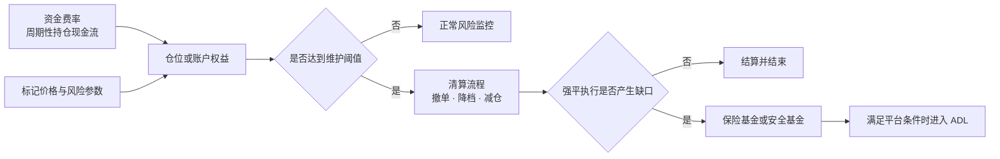
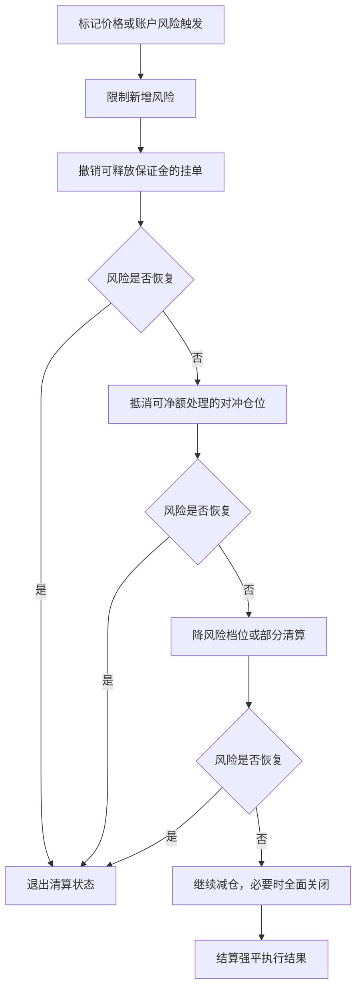
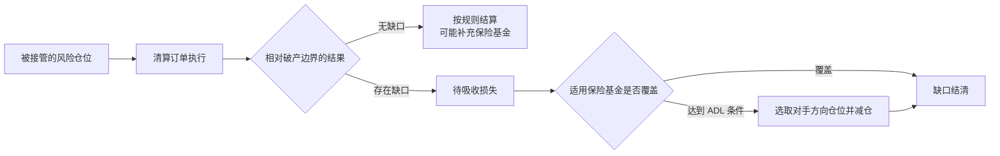

强平不是“价格碰到一条线，然后仓位瞬间归零”的单步动作。对交易系统而言，它是一条不断重算的风险处置链：先确认账户或仓位越过阈值，再释放可释放的占用、降低风险、处理强平订单的盈亏缺口，必要时才进入保险基金或自动减仓（ADL）。

本文是交易系统学习路径的 Chapter 13。建议先阅读 [Chapter 12：逐仓与全仓](/signal-grid-blog/posts/isolated-and-cross-margin/)，理解风险判断发生在仓位级还是账户级。

> 本文用于学习清算机制和系统边界，不构成投资或交易建议。不同平台会修改风险参数、处置顺序和 ADL 触发条件；本文只提供可验证的通用框架，具体行为应以对应产品当时生效的规则为准。

## 1. 四个概念不在同一层

资金费率、强平、保险基金和 ADL 经常被画成一座“风险金字塔”，但这种画法容易暗示它们按固定顺序承担同一种风险。实际上，它们解决的问题不同：

| 机制 | 何时发生 | 直接作用 | 在风险处置中的角色 |
| --- | --- | --- | --- |
| 资金费率 | 合约规定的结算时点或周期 | 在多空持仓之间转移费用，帮助永续价格机制运作 | 持仓现金流；会改变权益，但不是穿仓后的兜底 |
| 强平 | 仓位或账户风险越过维护阈值 | 撤单、接管、减仓或关闭风险敞口 | 主动降低风险的过程，而非资金池 |
| 保险基金 | 强平执行产生平台规则定义的盈余或缺口 | 在规则范围内吸收强平缺口 | 缺口资金后盾，覆盖范围因平台而异 |
| ADL | 达到平台公布的 ADL 条件 | 减少对手方向的选中仓位 | 紧急去杠杆后盾；不是直接从钱包扣一笔利润 |



资金费率可能让权益减少，从而使风险阈值更近，但它不是在穿仓后“兜底”的一层，更不能和保险基金、ADL 并列为固定的亏损瀑布步骤。

## 2. 触发条件是风险不等式，不只是一个显示价格

逐仓可以用下面的抽象关系表达：

```text
仓位权益 = 已分配保证金 + 未实现盈亏 - 费用与其他扣减
触发风险：仓位权益 <= 仓位维持要求
```

全仓或组合保证金通常在账户层判断：

```text
账户风险：折算后权益 <= 全部仓位、挂单、负债与附加项的维持要求
```

平台界面展示的“强平价”只是在其他输入不变时，把风险不等式投影到某一个价格轴上的估计。全仓账户有多个仓位、抵押品和挂单时，任何一项变化都可能移动这条线。因此有的平台明确把全仓强平价标为参考值，并以账户维持保证金率达到阈值作为真正触发条件。

### 追加保证金移动的是安全边界

以线性逐仓合约、其他条件不变为例：

- 多头追加保证金后，可以承受更大的向下价格变化，强平价通常**下移**；
- 空头追加保证金后，可以承受更大的向上价格变化，强平价通常**上移**。

“追加保证金提高多头强平价”把方向说反了。更稳妥的表达是：追加保证金增加权益缓冲，让触发价格远离当前仓位的不利方向。真实移动量仍取决于维持保证金档位、预估平仓费用、资金费用和平台公式。

## 3. 清算引擎应逐步降低风险

当风险阈值被触发后，直接一次性市价平掉全部仓位可能制造更大的冲击。许多平台会先执行低冲击动作，再逐步扩大处置范围。



这里的顺序只是通用骨架，不是所有平台的统一协议。例如：

- 有的系统先取消开仓方向挂单，释放订单保证金；
- 有的系统先处理同一合约的完全或部分对冲仓位；
- 有的系统按风险档位逐级减小仓位，每一步都重新计算风险率；
- 组合保证金系统可能优先处理能最大幅度降低组合风险的头寸；
- 流动性枯竭时，多级动作可能在极短时间内连续发生，用户观察上仍像一次清算。

因此，“全仓触发后所有仓位同时被强平”和“逐仓触发后一定损失全部保证金”都不是可跨平台成立的结论。清算的目标是把风险恢复到阈值之上；是否停在部分减仓，取决于每一步后的重算结果。

## 4. 强平价、破产价与执行缺口

**强平触发点**是风险引擎接管仓位的边界；**破产价**通常表示按平台模型计算、仓位或账户权益耗尽的理论价格。二者之间的缓冲用于承受费用和执行滑点，但它不是保证。

假设清算引擎接管一笔多头后需要卖出：

- 若实际成交结果优于平台定义的破产边界，规则可能把剩余价值的一部分计入保险基金；
- 若市场跳空、深度不足，成交结果劣于破产边界，就会产生需要处理的缺口；
- 实际如何计价、由哪个资金池承接以及是否收取清算费，均由产品规则决定。



传统清算所的 default waterfall 还可能包含违约会员资源、清算所自有资本、保证基金和追加摊派。加密衍生品平台常见的“保证金—保险基金—ADL”只是另一类产品结构，不能把两者的层级名称直接互换。

## 5. ADL 是减仓机制，不是固定比例没收盈利

ADL 的操作对象通常是与被清算仓位方向相反、仍在盈利或具有较高杠杆特征的仓位。平台根据自己的排名规则选择账户，在规定价格和数量上自动减少或关闭仓位。

这与“从盈利账户扣走 7,000 USDT 去填缺口”不同：

1. 系统执行的是**仓位减量或平仓**，不是从钱包直接扣除一个预先指定的利润金额；
2. 被减仓者会在平台规定的成交价格上实现对应 PnL，并失去后续继续持有该部分仓位的敞口；
3. 减仓数量可能只覆盖一部分仓位，也可能继续沿队列处理其他账户；
4. 排名通常考虑盈利与杠杆，但精确公式、合并范围、指示器和触发阈值并不统一；
5. 有的平台在保险基金尚未归零前，也可能依据基金回撤或流动性条件启动 ADL。

这正是为什么文章不应写成“保险基金用尽后，按盈利率乘杠杆排序，并没收固定盈利填窟窿”的唯一流程。以 Bybit 和 OKX 的公开规则为例，两者都可能使用保险基金状态和对手方向仓位，但已公布的触发条件、资金池范围、排序与停止条件存在差异，而且会更新。

## 6. 怎样证明清算过程可解释、可重放

清算系统至少应为每一步生成不可变事件：

```text
RiskThresholdBreached
OrdersCancelled
HedgeReduced
RiskTierReduced
PartialLiquidationSubmitted
LiquidationFilled
InsuranceFundDebitedOrCredited
AdlCandidateRanked
AdlPositionReduced
RiskStateRecovered
```

每个事件都应携带：账户或仓位 ID、标记价格版本、风险参数版本、权益与维持要求分解、清算前后数量、订单成交信息、基金池标识以及因果事件 ID。这样才能回答“为什么触发”“为什么处理这笔仓位”“为何到这一层才停止”，也能在规则变更后复现历史结果。

测试重点应覆盖：

- 标记价格与最新成交价短暂偏离时，触发源是否正确；
- 撤单释放保证金后，风险恢复是否立即停止后续清算；
- 部分成交、拒单和行情继续跳动时，是否按新快照重算；
- 多个保险基金池是否发生错误串用；
- ADL 排名并列、仓位不足和重复消息时，处理是否确定且幂等；
- 参数在清算过程中升级时，事件能否明确绑定旧版本或新版本。

## 7. 结论：清算是一条持续重算的风险状态机

- 资金费率会影响权益，但不是清算亏损瀑布的一层。
- 追加保证金让触发边界远离不利方向：线性逐仓多头通常下移强平价，空头通常上移。
- 清算常由撤单、对冲净额、降档和部分减仓组成，不必然一次性全平。
- 保险基金处理强平执行缺口；覆盖范围、资金池与触发规则必须绑定平台。
- ADL 减少被选中对手方的仓位，不等于按固定金额没收其盈利。

## 官方参考

- [Bybit：订单执行与强平 FAQ](https://www.bybit.com/en/help-center/article/FAQ-Order-Execution-and-Liquidation)
- [Bybit：自动减仓（ADL）机制](https://www.bybit.com/en/help-center/article/Auto-Deleveraging-ADL)
- [OKX：OTC 加密衍生品披露中的部分清算流程](https://www.okx.com/en-us/help/product-disclosure-statement-otc-crypto-derivatives)
- [OKX：Security Fund 的用途与边界](https://www.okx.com/help/understanding-okxs-security-fund)
- [CME Clearing：Financial Safeguards Waterfall 概览](https://www.cmegroup.com/articles/brochures-and-handbooks/101-overview-cme-clearing-financial-safeguards-waterfalls.html)
