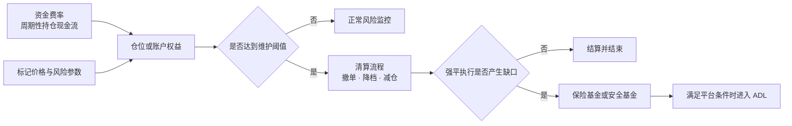
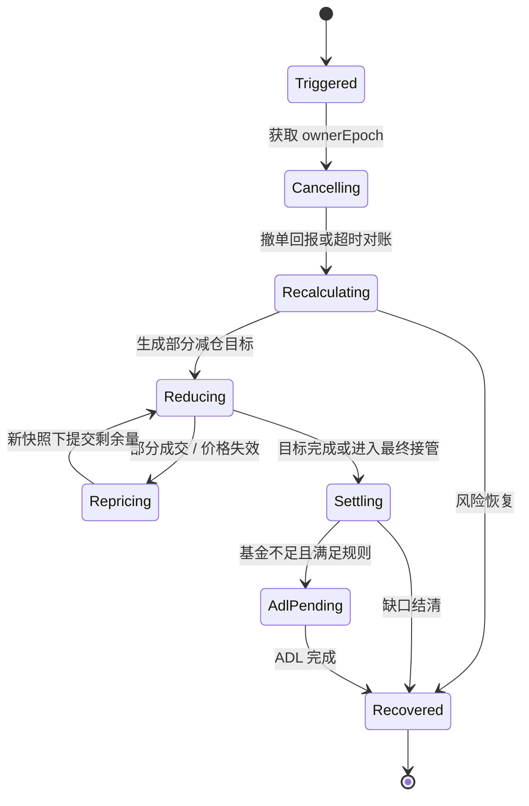
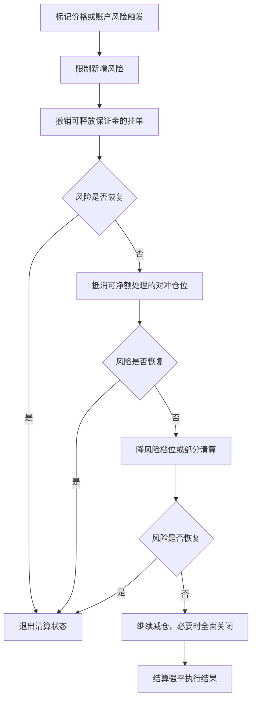
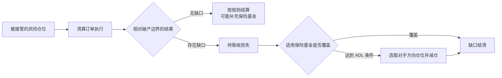

强平不是“价格碰到一条线，然后仓位瞬间归零”的单步动作。对交易系统而言，它是一条不断重算、可能跨越多次成交和服务重启的风险处置链：先确认账户或仓位越过阈值，再释放可释放的占用、降低风险、处理强平订单的盈亏缺口，必要时才进入保险基金或自动减仓（ADL）。每次处置必须有唯一身份、单一所有者和可重放的资金分录，否则“成功重试”本身就可能造成重复卖出或重复扣减基金。

本文是交易系统学习路径的 Chapter 23。建议先阅读 [Chapter 22：逐仓与全仓](/signal-grid-blog/posts/isolated-and-cross-margin/)，理解风险判断发生在仓位级还是账户级。

> 本文用于学习清算机制和系统边界，不构成投资或交易建议。不同平台会修改风险参数、处置顺序和 ADL 触发条件；本文只提供可验证的通用框架，具体行为应以对应产品当时生效的规则为准。

## 1. 四个概念不在同一层

资金费率、强平、保险基金和 ADL 经常被画成一座“风险金字塔”，但这种画法容易暗示它们按固定顺序承担同一种风险。实际上，它们解决的问题不同：

| 机制     | 何时发生                             | 直接作用                                     | 在风险处置中的角色                         |
| -------- | ------------------------------------ | -------------------------------------------- | ------------------------------------------ |
| 资金费率 | 合约规定的结算时点或周期             | 在多空持仓之间转移费用，帮助永续价格机制运作 | 持仓现金流；会改变权益，但不是穿仓后的兜底 |
| 强平     | 仓位或账户风险越过维护阈值           | 撤单、接管、减仓或关闭风险敞口               | 主动降低风险的过程，而非资金池             |
| 保险基金 | 强平执行产生平台规则定义的盈余或缺口 | 在规则范围内吸收强平缺口                     | 缺口资金后盾，覆盖范围因平台而异           |
| ADL      | 达到平台公布的 ADL 条件              | 减少对手方向的选中仓位                       | 紧急去杠杆后盾；不是直接从钱包扣一笔利润   |



资金费率可能让权益减少，从而使风险阈值更近，但它不是在穿仓后“兜底”的一层，更不能和保险基金、ADL 并列为固定的亏损瀑布步骤。

## 2. 触发条件是风险不等式，不只是一个显示价格

逐仓可以用下面的抽象关系表达：

```text
仓位权益 = 已分配保证金 + 未实现盈亏 - 费用与其他扣减
触发风险：仓位权益 <= 仓位维持要求
```

全仓或组合保证金通常在账户层判断：

```text
账户风险：折算后权益 <= 全部仓位、挂单、负债与附加项的维持要求
```

平台界面展示的“强平价”只是在其他输入不变时，把风险不等式投影到某一个价格轴上的估计。全仓账户有多个仓位、抵押品和挂单时，任何一项变化都可能移动这条线。因此有的平台明确把全仓强平价标为参考值，并以账户维持保证金率达到阈值作为真正触发条件。

### 追加保证金移动的是安全边界

以线性逐仓合约、其他条件不变为例：

- 多头追加保证金后，可以承受更大的向下价格变化，强平价通常**下移**；
- 空头追加保证金后，可以承受更大的向上价格变化，强平价通常**上移**。

“追加保证金提高多头强平价”把方向说反了。更稳妥的表达是：追加保证金增加权益缓冲，让触发价格远离当前仓位的不利方向。真实移动量仍取决于维持保证金档位、预估平仓费用、资金费用和平台公式。

## 3. Liquidation ID 把一次触发变成可恢复流程

风险阈值被越过只是观察事实，不能直接拿账户 ID 当作所有后续命令的幂等键。一次独立清算 episode 应在权威账户序列上原子创建：

```text
LiquidationCase {
  liquidationId,
  accountOrRiskUnitId,
  triggerRiskCut,
  ownerEpoch,
  policyVersion,
  state,
  actionOrdinal,
  remainingTargetRisk,
  lastAppliedExecutionSequence
}
```

`liquidationId` 在重试和重启后保持不变；同一账户风险恢复、随后又再次跌破阈值时，则创建新的 ID。`ownerEpoch` 用来 fencing 旧清算实例，`actionOrdinal` 区分撤单、第一轮部分减仓和后续重新定价等动作。发往 OMS 或撮合通道的命令使用稳定键：

```text
commandKey = liquidationId + actionOrdinal + commandType
```

服务超时后可以用这个键查询既有结果，却不能因为“不知道是否成功”就生成一个全新市价单。`ownerEpoch` 不应拼进这个稳定业务键；接管后仍用原键恢复原动作，只把更高 epoch 作为独立权限字段，并由 OMS、撮合或账本等最终接收端原子拒绝旧 epoch。只有清算进程本地比较 epoch，无法 fence 暂停后复活的旧实例。关于结果未知、幂等键和副作用对账的完整边界，参见[跨系统副作用](/signal-grid-blog/posts/cross-system-side-effects-idempotency-outbox-inbox-2pc-saga/)。



状态机不允许从 `Triggered` 跳过所有回报直接写成 `Recovered`。每一步都要说明：前置 RiskCut、已知成交前缀、资金分录位置和下一次可以安全重试的命令键。

## 4. 清算引擎应逐步降低风险

当风险阈值被触发后，直接一次性市价平掉全部仓位可能制造更大的冲击。许多平台会先执行低冲击动作，再逐步扩大处置范围。



这里的顺序只是通用骨架，不是所有平台的统一协议。例如：

- 有的系统先取消开仓方向挂单，释放订单保证金；
- 有的系统先处理同一合约的完全或部分对冲仓位；
- 有的系统按风险档位逐级减小仓位，每一步都重新计算风险率；
- 组合保证金系统可能优先处理能最大幅度降低组合风险的头寸；
- 流动性枯竭时，多级动作可能在极短时间内连续发生，用户观察上仍像一次清算。

因此，“全仓触发后所有仓位同时被强平”和“逐仓触发后一定损失全部保证金”都不是可跨平台成立的结论。清算的目标是把风险恢复到阈值之上；是否停在部分减仓，取决于每一步后的重算结果。

### 部分成交后必须按已成交前缀重新求解

假设本轮目标卖出 100 张，只成交 37 张。系统不能简单把剩余命令改成 63 张然后继续：这 37 张成交已经改变仓位、权益、维持保证金档位和预计费用，期间 mark、其他仓位及账户资金也可能变化。正确循环是：

1. 按 `executionId` 和私有回报序列幂等应用已成交的 37 张；
2. 从新的账户序列与价格快照形成 RiskCut；
3. 重新计算当前缺口和最小必要减仓量；
4. 若风险已恢复则取消余单，否则用下一 `actionOrdinal` 提交新目标；
5. 对上一订单的最终状态仍未知时，先通过私有流、Drop Copy 或查询对账，不与新订单并行暴露重复卖出风险。

“部分清算”描述的是每轮风险目标，不是某张订单的固定剩余数量。成交回报才改变权威仓位；本地发送成功、网关接受和市场成交必须保持为三个不同状态。

### 重新定价是决策，不是无限追价

清算订单也会遇到价格带、最小价格步长、无深度、拒单和限流。每轮定价要绑定新的 mark/order-book snapshot、最大冲击、允许的订单类型和截止时间。到期后进入 `Repricing`，先裁决旧订单是否仍可成交，再 cancel/replace；不能一边保留陈旧订单，一边无界扩大新单价格。

协议还要规定“执行速度”和“市场冲击”之间由谁裁决。正常阶段可以分片、被动或限价减仓；风险缺口持续扩大时，策略会逐步提高紧迫度；超过最终截止时间才进入产品规则允许的接管路径。每次升级紧迫度都必须是事件，事故后才能解释为何跨过某个价格或冲击边界。

## 5. 强平价、破产价与执行缺口

**强平触发点**是风险引擎接管仓位的边界；**破产价**通常表示按平台模型计算、仓位或账户权益耗尽的理论价格。二者之间的缓冲用于承受费用和执行滑点，但它不是保证。

假设清算引擎接管一笔多头后需要卖出：

- 若实际成交结果优于平台定义的破产边界，规则可能把剩余价值的一部分计入保险基金；
- 若市场跳空、深度不足，成交结果劣于破产边界，就会产生需要处理的缺口；
- 实际如何计价、由哪个资金池承接以及是否收取清算费，均由产品规则决定。



传统清算所的 default waterfall 还可能包含违约会员资源、清算所自有资本、保证基金和追加摊派。加密衍生品平台常见的“保证金—保险基金—ADL”只是另一类产品结构，不能把两者的层级名称直接互换。

## 6. 保险基金必须表现为账本分录，而不是可改余额

清算服务可以提出“按规则从某基金池吸收 2,000 USDT 缺口”的业务意图，但不应直接更新一个 `insuranceFundBalance` 字段。资金移动要进入双重记账系统，例如：

```text
Debit   InsuranceFundReserve:ProductPool-A  2,000 USDT  # credit-normal reserve decreases
Credit  LiquidationDeficit:case-8f31        2,000 USDT  # debit-normal clearing balance decreases
```

这只是固定账户类型后的教学模板；真实借贷方向必须服从平台科目表，不能把 Debit/Credit 当成加减号。若强平执行优于规则定义的边界，应先确认可归属盈余，再用对应的盈余 journal 增加基金储备。每个 journal entry 至少绑定 `liquidationId`、`executionId`、`poolId`、`policyVersion`、币种和唯一 `postingKey`。相同 posting key 重放时必须返回原分录，不能再次扣款。

这里要分开三个时间点：执行结果被确认、缺口按规则被认定、账本分录完成过账。任一步骤结果未知，都由 Outbox/Inbox 和账本查询恢复；基金余额不足则是业务状态，不能通过重试把余额重试成正数。资金池按产品、结算币或法律实体隔离时，跨池借用必须由另一条明确授权的分录表达，不能由清算代码静默兜底。

这个分录模型带来一个可核对不变量：

```text
grossLiquidationLoss
  = userCollateralApplied
  + insuranceFundApplied
  + adlOrOtherApplied
  + unresolvedAmount
```

这里的 `grossLiquidationLoss` 是执行后需要分配的总损失，不能和扣除用户抵押品后的剩余 deficit 混用。等式两边都来自不可变事实，而不是从当前余额反推历史。账本结构和外部对账边界可回看[交易账本与双重记账](/signal-grid-blog/posts/trading-ledger-double-entry-accounting-and-reconciliation/)。

## 7. ADL 是基于版本化快照的减仓机制

ADL 的操作对象通常是与被清算仓位方向相反、仍在盈利或具有较高杠杆特征的仓位。平台根据自己的排名规则选择账户，在规定价格和数量上自动减少或关闭仓位。

这与“从盈利账户扣走 7,000 USDT 去填缺口”不同：

1. 系统执行的是**仓位减量或平仓**，不是从钱包直接扣除一个预先指定的利润金额；
2. 被减仓者会在平台规定的成交价格上实现对应 PnL，并失去后续继续持有该部分仓位的敞口；
3. 减仓数量可能只覆盖一部分仓位，也可能继续沿队列处理其他账户；
4. 排名通常考虑盈利与杠杆，但精确公式、合并范围、指示器和触发阈值并不统一；
5. 有的平台在保险基金尚未归零前，也可能依据基金回撤或流动性条件启动 ADL。

这正是为什么文章不应写成“保险基金用尽后，按盈利率乘杠杆排序，并没收固定盈利填窟窿”的唯一流程。以 Bybit 和 OKX 的公开规则为例，两者都可能使用保险基金状态和对手方向仓位，但已公布的触发条件、资金池范围、排序与停止条件存在差异，而且会更新。

排名不能每取一个候选人就读取一次不断变化的账户表，否则并列项、并发成交和资金转移会使同一事件在重放时选出不同对象。一次 ADL 批次应固定：

```text
AdlSnapshot {
  adlBatchId,
  sourceLiquidationIds,
  deficitAmountAndAsset,
  candidateAccountWatermark,
  markPriceSnapshotId,
  rankingPolicyVersion,
  tieBreakRule,
  excludedAccountsAndReasons
}
```

排序结果是这个快照上的确定性投影。执行过程中候选仓位已被其他事件减少时，按规则跳过、缩量或生成下一批快照；不能悄悄拿“当前榜单”替换原榜单。每笔 ADL 减仓还要拥有 execution identity，并回写仓位、实现 PnL 和 deficit 分录，直到 `unresolvedAmount` 为零或进入人工处置状态。

## 8. 并发资金变化必须进入同一恢复次序

清算系统至少应为每一步生成不可变事件：

```text
RiskThresholdBreached
OrdersCancelled
HedgeReduced
RiskTierReduced
PartialLiquidationSubmitted
LiquidationFilled
InsuranceFundDebitedOrCredited
AdlCandidateRanked
AdlPositionReduced
RiskStateRecovered
```

每个事件都应携带：`liquidationId`、账户或仓位 ID、RiskCut、owner epoch、权益与维持要求分解、清算前后数量、订单成交信息、基金分录位置以及因果事件 ID。这样才能回答“为什么触发”“为什么处理这笔仓位”“为何到这一层才停止”，也能在规则变更后复现历史结果。

强平期间仍可能到达充值过账、提现完成、funding、手续费、普通成交和人工追加保证金。系统需要先定义业务策略：风险增加命令通常被 fence；撤单和减仓继续允许；新到账资金是否可以终止清算、在哪个状态之前生效，则由产品规则决定。无论策略如何，所有变化都必须进入同一个账户事件序列，不能让清算线程直接读取一个异步更新的余额。

例如 `MarginPosted(seq=921)` 到达时，reducer 先应用它，再形成新 RiskCut。如果风险恢复，产生 `RiskStateRecovered` 并取消尚未生效的减仓命令；如果旧命令的执行结果未知，则必须先对账，已成交部分仍不可回滚。反之，到账事实只停留在外部支付系统、尚未 posted 到交易账本时，不能提前把它算入权益。

checkpoint 必须同时覆盖 LiquidationCase、账户事件位置、未决订单身份、已应用 execution 前缀、账本 posting 前缀和 ADL batch。恢复顺序是先加载该切点，再依序重放外部回报和账户事件，最后重新取得更高 owner epoch；旧实例即使复活，也无法继续提交动作。

恢复证据应把故障与通过条件放在一起：

| 故障点                      | 必须证明的结果                                           |
| --------------------------- | -------------------------------------------------------- |
| 减仓命令发出后、ACK 前崩溃  | 查询或私有流裁决原命令；累计成交不超过协议目标           |
| 部分成交后重启              | 已成交 execution 只应用一次，并按新 RiskCut 重算剩余目标 |
| 基金 debit 已过账、回执丢失 | 同 posting key 返回原分录，基金不重复扣减                |
| ADL 榜单生成后候选仓位变化  | 依据固定快照执行明确的跳过/缩量规则，重放选择一致        |
| 追加保证金与成交并发        | 以账户序列确定先后，最终仓位和权益等于合法串行历史       |
| 新实例接管时旧实例复活      | owner epoch 拒绝旧命令，不出现双重清算                   |

## 9. 结论：清算是一条持续重算的风险状态机

- 资金费率会影响权益，但不是清算亏损瀑布的一层。
- 追加保证金让触发边界远离不利方向：线性逐仓多头通常下移强平价，空头通常上移。
- 清算常由撤单、对冲净额、降档和部分减仓组成；每次成交后都要在新 RiskCut 上重新求解剩余目标。
- Liquidation ID、稳定命令键与 owner epoch 共同保证重试不会变成重复卖出，旧所有者不会在恢复后继续操作。
- 保险基金通过绑定清算身份的双重记账分录处理缺口；当前余额不能替代历史证据。
- ADL 减少版本化候选快照中的对手方仓位，不等于按固定金额没收其盈利。

## 官方参考

- [Bybit：订单执行与强平 FAQ](https://www.bybit.com/en/help-center/article/FAQ-Order-Execution-and-Liquidation)
- [Bybit：自动减仓（ADL）机制](https://www.bybit.com/en/help-center/article/Auto-Deleveraging-ADL)
- [OKX：OTC 加密衍生品披露中的部分清算流程](https://www.okx.com/en-us/help/product-disclosure-statement-otc-crypto-derivatives)
- [OKX：Security Fund 的用途与边界](https://www.okx.com/help/understanding-okxs-security-fund)
- [CME Clearing：Financial Safeguards Waterfall 概览](https://www.cmegroup.com/articles/brochures-and-handbooks/101-overview-cme-clearing-financial-safeguards-waterfalls.html)
