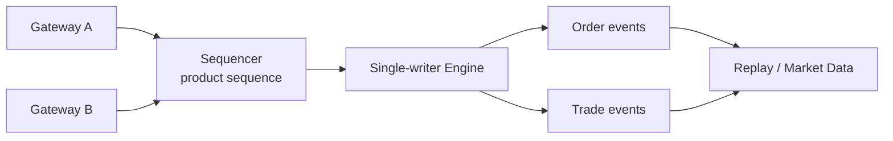
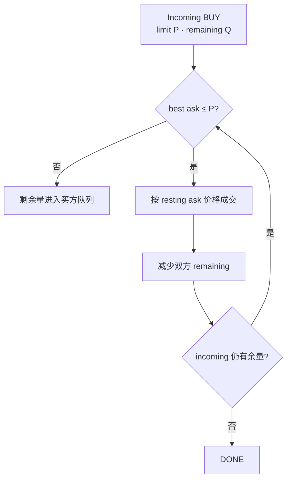
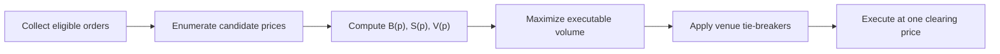

撮合引擎解决的是一个严格受规则约束的问题：给定一串已经通过交易前检查的命令，按确定顺序更新订单簿，并产生完全可重放的订单事件与成交事件。

它不负责预测“公平价格”，也不应该用买一卖一的中间价替双方决定成交。连续竞价和集合竞价都从订单中发现价格，但使用的是两套不同算法。

> 本文讨论系统规则与实现，不构成交易或投资建议。价格优先级、隐藏量、最小变动单位、价格保护和拍卖平局规则均可能因交易所及产品而异。

## 撮合首先需要一条权威顺序

网络到达不是天然的业务总序。不同网关、线程和连接会并发收到新单、改单和撤单；撮合核心必须为它负责的产品或分片建立唯一处理顺序。



同一个输入序列与同一个规则版本应产生同样的输出。为此，撮合路径不能临时读取当前时间、随机数或外部数据库来决定优先级；时间戳、订单 ID、产品版本和风控结果应在命令进入权威序列之前固化。

订单状态也不是随意修改的一行记录。一个简化状态机可以是：

```text
RECEIVED → OPEN → PARTIALLY_FILLED → FILLED
   │         └──────────────────→ CANCELED
   ├────────────────────────────→ FILLED
   ├────────────────────────────→ CANCELED
   └────────────────────────────→ REJECTED
```

实际输出常是事件而非单一状态：一张订单可以连续产生多笔 fill，最后才进入 `FILLED` 或带剩余量的 `CANCELED`。

## 价格时间优先是什么

在典型中央限价订单簿（CLOB）中：

1. 买单价格越高，优先级越高；卖单价格越低，优先级越高；
2. 同一价格内，较早取得队列位置的订单先成交；
3. 订单修改是否保留时间优先级由平台规则决定，增加数量或改变价格通常不能默认保留原位置。

这只是常见规则，不是所有市场的宇宙定律。有些衍生品市场使用比例分配、规模优先或混合算法；冰山单显示量补充后是否重新排队，也由具体规则决定。

## 连续竞价：到一条，处理一条

连续竞价期间，每条新命令按权威顺序立即与订单簿比较。以新买入限价单为例：



市价买单没有可挂入订单簿的限价。它会消费当前可用卖盘，直到目标量完成、深度耗尽，或触发平台的价格/名义金额保护；未成交余量如何处理依产品规则而定。

### 成交价来自 resting order，而不是中间价

假设卖方订单簿为：

| 卖价 | 剩余量 | 队列顺序 |
| ---: | ---: | --- |
| 100 | 2 | S1 |
| 101 | 3 | S2 |

现在收到 `BUY 4 @ 102`。在采用 Coinbase 所公开规则的价格时间优先订单簿上，结果是：

```text
2 @ 100  与 S1 成交
2 @ 101  与 S2 成交
```

成交价分别是两张簿上卖单的价格，因为它们先进入引擎并成为 resting orders。既不是买方限价 `102`，也不是买一卖一的中间价。买方限价表达的是“最高愿付价格”，不是指定实际成交价。

如果收到的是不能立即成交的 `BUY 4 @ 99`，它才会以 99 进入买方价格队列。是否允许它进入订单簿，还要先满足 TIF、Post-Only、自成交保护和价格保护等指令。

## 集合竞价：先收集，再用一个价格同时成交

集合竞价不会按订单到达顺序逐笔算出一串价格，再拿“最后一笔”当开盘价。它在订单收集窗口结束时，对候选价格计算可成交量，并选择一个清算价。

对候选价 `p` 定义：

```text
B(p) = 所有限价 ≥ p 的买量 + 可参与拍卖的市价买量
S(p) = 所有限价 ≤ p 的卖量 + 可参与拍卖的市价卖量
V(p) = min(B(p), S(p))
```

首要目标通常是选择使 `V(p)` 最大的价格。若多个价格并列，再按平台规则依次比较不平衡量、价格压力、参考价距离或其他约束。



### 一个单一清算价示例

拍卖簿中有以下数量：

```text
买：Market 2，101 × 3，100 × 4
卖：Market 1， 99 × 2，100 × 4，101 × 3
```

| 候选价 `p` | `B(p)` | `S(p)` | `V(p)` | 未匹配方向与数量 |
| ---: | ---: | ---: | ---: | --- |
| 99 | 9 | 3 | 3 | 买 6 |
| 100 | 9 | 7 | **7** | 买 2 |
| 101 | 5 | 10 | 5 | 卖 5 |

因此清算价为 100，可成交量为 7。参与成交的订单全部按 100 成交；剩余的 2 单位买量如何分配或转入连续簿，要继续应用平台的订单类别与分配优先级。

这个例子只有唯一最大值。若多个价格都能成交 7，不能自行选择平均价或最后成交价。以 Nasdaq Opening Cross 为例，其现行 Equity 4 Rule 4752 首先最大化可执行股数；若并列，再最小化不平衡量，之后还有剩余订单价格等平局规则。NYSE、期权交易所和数字资产平台的平局规则可能不同。

## 连续与集合模式如何切换

系统通常在开盘、收盘、IPO 或停牌恢复等时点使用拍卖，但不是每个市场都具有相同阶段。状态切换必须是明确的产品规则：

```text
CLOSED → AUCTION_COLLECT → AUCTION_MATCH → CONTINUOUS → HALTED
```

进入拍卖后，哪些普通限价单可参与、是否接受 Market-on-Open/Limit-on-Open、能否撤单、是否发布指示性价格和不平衡量，都要由状态机验证。拍卖完成后还需定义未成交订单是取消、重新定价，还是原样转入连续订单簿。

## 撮合实现的正确性清单

- 每个产品的输入序列单调且可检测缺口；
- 数量使用整数最小单位，价格符合 tick size，不使用二进制浮点保存金额；
- 同价队列的进入、退出和修改规则确定；
- 一笔成交的 Maker 数量与 Taker 数量完全相等；
- 订单剩余量永不为负，累计成交量不超过原始有效数量；
- 事件携带规则版本、产品版本和序列号，可从快照加事件日志重建；
- 集合竞价只产生一个清算价，并在平局时执行版本化的 venue 规则；
- 回放测试覆盖部分成交、撤单竞争、深度耗尽、拍卖平局和故障切换。

撮合算法依赖的订单簿结构与自成交边界，可回看[订单簿队列与自成交保护](/signal-grid-blog/posts/order-book-and-self-trade-prevention/)。

## 官方参考

- [Coinbase Exchange：Matching Engine](https://docs.cdp.coinbase.com/exchange/concepts/matching-engine)——价格时间优先、resting-order price、订单生命周期及一个平台的 STP 实现。
- [Coinbase Exchange：Systems & Operations](https://docs.cdp.coinbase.com/exchange/introduction/systems-operations)——产品级 FIFO 与网关请求可能乱序之间的边界。
- [Nasdaq Equity 4 Rule 4752](https://listingcenter.nasdaq.com/rulebook/nasdaq/rules/Nasdaq%20Equity%204)——Opening Cross 最大成交量及后续平局规则。
- [Nasdaq Trader：Opening and Closing Crosses](https://www.nasdaqtrader.com/Trader.aspx?id=OpenClose)——拍卖时段、订单类型和不平衡信息。
- [NYSE：Auctions](https://www.nyse.com/trade/auctions)——另一个市场关于最大可成交量与参考价约束的实现示例。
