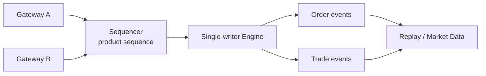
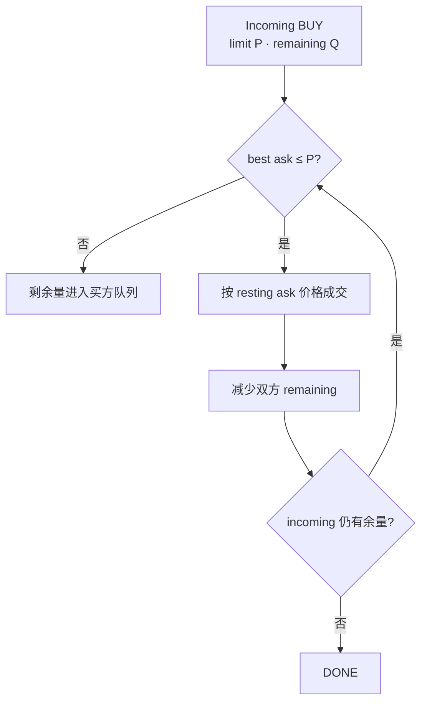
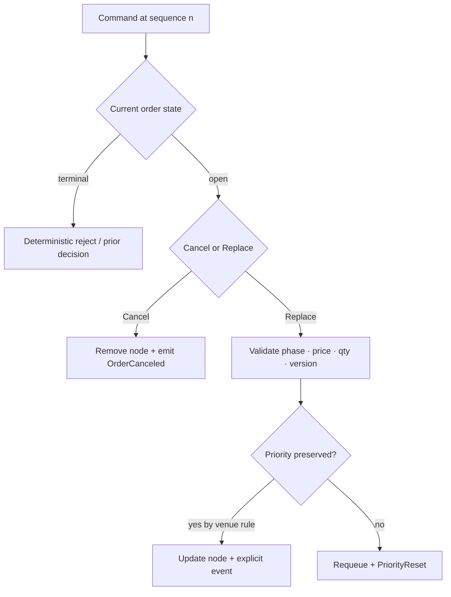
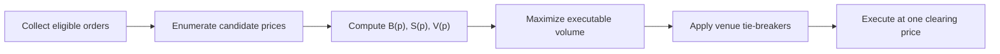
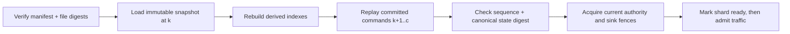
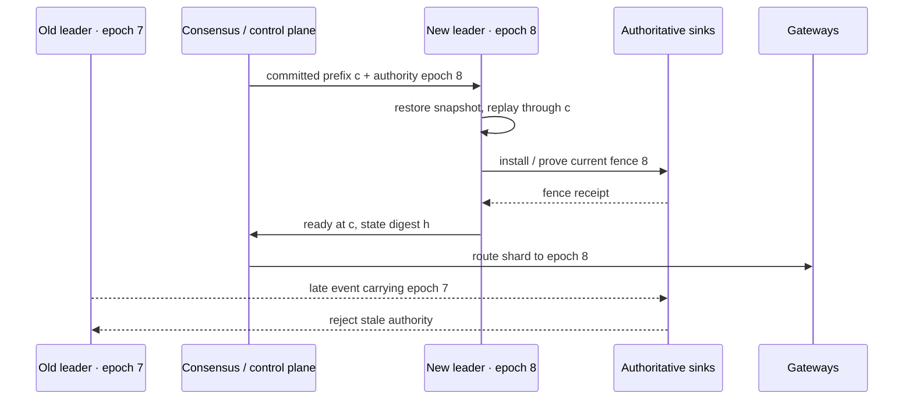

撮合引擎解决的是一个严格受规则约束的问题：给定一串已经通过交易前检查的命令，按确定顺序更新订单簿，并产生完全可重放的订单事件与成交事件。它的核心不是某棵树或某个低延迟队列，而是一个可证明的状态转换合同：**相同初始状态、相同命令序列和相同规则版本，必须得到相同终态与逐字节可识别的业务事件。**

它不负责预测“公平价格”，也不应该用买一卖一的中间价替双方决定成交。连续竞价和集合竞价都从订单中发现价格，但使用的是两套不同算法。

> 本文讨论系统规则与实现，不构成交易或投资建议。价格优先级、隐藏量、最小变动单位、价格保护和拍卖平局规则均可能因交易所及产品而异。

## 确定性撮合始于一条权威顺序和一份规则合同

网络到达不是天然的业务总序。不同网关、线程和连接会并发收到新单、改单和撤单；撮合核心必须为它负责的产品或分片建立唯一处理顺序。



这个合同可以写成一个状态转移函数：

```text
(state[n + 1], events[n], response[n])
  = reduce(state[n], command[n], rules[version])
```

`n` 是撮合分片内的权威输入序号，不是客户端时间，也不必是全交易所共享的全局序号。只要某个产品只由一个分片处理，产品内的严格顺序已经足以裁决“成交先发生还是撤单先发生”；跨产品是否共用一个序列，取决于跨产品原子命令是否真的存在。

为使 `reduce` 可重放，撮合路径不能临时读取当前时间、随机数或外部数据库来决定优先级。订单 ID、接收时间、产品与规则版本、风控裁决，以及任何拍卖参考值，都应在命令进入权威序列之前固化，或作为序列中的显式控制命令输入。若限价和数量来自整数 tick/lot，回放也不能再用另一套浮点舍入重新解释它们。

订单状态也不是随意修改的一行记录。一个简化状态机可以是：

```text
RECEIVED → OPEN → PARTIALLY_FILLED → FILLED
   │         └──────────────────→ CANCELED
   ├────────────────────────────→ FILLED
   ├────────────────────────────→ CANCELED
   └────────────────────────────→ REJECTED
```

实际输出常是事件批次而非单一状态：一张订单可以连续产生多笔 fill，最后才进入 `FILLED` 或带剩余量的 `CANCELED`。状态机图只是允许到达的结果集合；究竟由哪条命令触发、事件按什么顺序发布、失败后从哪里恢复，还需要 Command/Event 协议和 reducer 共同定义。

## Command 与 Event schema 把意图和已发生事实分开

`NewOrder`、`CancelOrder` 和 `ReplaceOrder` 是请求状态转换的 **Command**；`OrderAccepted`、`OrderCanceled`、`PriorityReset` 和 `TradeCreated` 是 reducer 已经裁决的 **Event**。下游仓位、账本和行情只能消费 Event，不能把“客户端发过 Cancel”当成“订单已经撤销”。

一组简化但足以恢复的 Command envelope 可以包含：

```text
CommandEnvelope {
  schemaVersion
  sequenceNamespace, shardId, inputSequence, authorityEpoch
  commandNamespace, commandId, commandType
  environment, venue, accountId, productId, productRuleVersion
  payload
}

NewOrderPayload {
  orderId, side, orderType
  priceTicks?, quantityLots
  timeInForce, postOnly
  stpScope?, stpPolicy?
}
```

这里有三类不能混用的身份：

| 身份                                                | 作用域与所有者                      | 正确用途                               |
| --------------------------------------------------- | ----------------------------------- | -------------------------------------- |
| `(commandNamespace, commandId)`                     | 客户/网关声明且覆盖完整重试生命周期 | 识别同一业务命令重试，命中后返回原裁决 |
| `(sequenceNamespace, shardId, inputSequence)`       | sequencer 的不可复用输入位置        | 决定 reducer 的唯一应用顺序并检测缺口  |
| `(environment, venue, declaredOrderScope, orderId)` | venue 声明的订单身份域              | 定位订单实体及后续 Cancel/Replace 目标 |

若 sequencer 重建后可能从较小序号重新开始，就必须生成新的 `sequenceNamespace`；不能让新代际复用旧 Event identity。`commandNamespace` 同样不能只取短连接 ID，否则重连后的另一客户可能误命中旧裁决。实现可以把这些组合编码成一个全局 ID，但协议仍要保留它的作用域合同。

Event 同样需要稳定身份。一个输入命令可能产生多个 trade、order update 和 auction allocation，因此可用 `(environment, venue, sequenceNamespace, shardId, inputSequence, eventOrdinal)` 标识输出事件，并让 `tradeId` 从这组稳定事实确定性派生或由命令显式携带。重放不能重新取数据库序列或随机 UUID，否则经济结果相同，消息身份却全部变化，下游去重就会失效。

```text
EventEnvelope {
  schemaVersion
  environment, venue
  sequenceNamespace, shardId, inputSequence, eventOrdinal
  decisionEpoch, productRuleVersion
  eventType, causationCommandNamespace, causationCommandId
  payload
}

PublicationEnvelope {
  eventId, payloadDigest
  publisherAuthorityEpoch
}
```

`decisionEpoch` 是 Command 当时由哪一代权威裁决的历史事实，重放时不改变；`publisherAuthorityEpoch` 则是当前哪个进程有权把同一稳定 Event 交给 Sink 的传输 fencing 信息，故障切换后可以提高。把两者分开，才能既保持业务 Event 身份与 payload 稳定，又让新 Leader 重投未确认 Event 时通过当前 fence。

Event payload 应保存下游无法从终态反推的事实，例如成交双方、resting 与 incoming 角色、成交价量、STP 原因、队列优先级是否重置，以及订单变化前后的 `cumQty/leavesQty`。反过来，内存节点地址、哈希桶编号和线程时间不属于业务 schema；把它们写进事件只会让实现细节伪装成协议。

Schema 演进必须与规则演进分开：schema version 说明字节怎样解码，`productRuleVersion` 说明解码后的命令按哪套 tick、优先级、STP 和拍卖规则裁决。旧命令在历史回放时仍使用当时规则，不能因为当前配置已经更新就被重新解释。

## Reducer 是唯一状态所有者，不是回调函数的集合

本文采用一种通用的单分片模型：**已提交 Command log 是引擎恢复的权威输入，订单 Event 是其确定性输出。** 也可以设计以 Event log 恢复的系统，但不能让两条日志各自声称权威、在故障后靠“最后写入获胜”拼接。

Reducer 的状态至少包含交易阶段、买卖两侧价格队列、scoped order key 索引、已裁决 command key 的去重窗口、拍卖累计状态和下一输出身份。处理框架可以简化成：

```text
step(state, command):
  require command.inputPosition follows state.lastAppliedInputPosition
  require command.productRuleVersion is installed

  if command.commandKey already decided:
      next = advanceInputCursorOnly(state, command.inputPosition)
      return next, [], originalCommandResponse(command.commandKey)

  events, response = dispatchByPhaseAndType(state, command)
  next   = applyAllOrNone(state, events)
  next.lastAppliedInputPosition = command.inputPosition
  next.remember(command.commandKey, response, eventIds(events))
  return next, events, response
```

重复命令如果已经取得新的输入位置，仍必须推进 `lastAppliedInputPosition`，但不能用这个新位置再生成一组经济 Event；原 Event 的补发由稳定 event ID 和 outbox/publisher 负责。否则 reducer 会卡在重复命令前，或把同一业务裁决制造成两组不同身份的成交。

这段伪代码表达的是事务边界，不要求生产实现真的先构造完整 Event 再复制一次状态。原地修改可以更快，但在一个 Command 的边界内必须呈现 **all-or-none**：不能先从订单簿删除 maker，崩溃后却没有生成对应成交或取消事件；也不能先向外发布 trade，随后才发现订单剩余量更新失败。

`reduce` 内部还应禁止任意 I/O。账户资料、风控结果和动态产品参数若会影响裁决，必须先变成版本化输入；磁盘、网络和行情发布位于状态转换之外。这样，性能优化可以改变树、数组、对象池与批处理方式，却不能改变 Command 到 Event 的可观察映射。

## 连续竞价把价格优先级逐命令兑现

### 价格时间优先是什么

在典型中央限价订单簿（CLOB）中：

1. 买单价格越高，优先级越高；卖单价格越低，优先级越高；
2. 同一价格内，较早取得队列位置的订单先成交；
3. 订单修改是否保留时间优先级由平台规则决定，增加数量或改变价格通常不能默认保留原位置。

这只是常见规则，不是所有市场的宇宙定律。有些衍生品市场使用比例分配、规模优先或混合算法；冰山单显示量补充后是否重新排队，也由具体规则决定。

### 到一条，处理一条

连续竞价期间，每条新命令按权威顺序立即与订单簿比较。以新买入限价单为例：



市价买单没有可挂入订单簿的限价。它会消费当前可用卖盘，直到目标量完成、深度耗尽，或触发平台的价格/名义金额保护；未成交余量如何处理依产品规则而定。

### 成交价来自 resting order，而不是中间价

假设卖方订单簿为：

| 卖价 | 剩余量 | 队列顺序 |
| ---: | -----: | -------- |
|  100 |      2 | S1       |
|  101 |      3 | S2       |

现在收到 `BUY 4 @ 102`。在采用 Coinbase 所公开规则的价格时间优先订单簿上，结果是：

```text
2 @ 100  与 S1 成交
2 @ 101  与 S2 成交
```

成交价分别是两张簿上卖单的价格，因为它们先进入引擎并成为 resting orders。既不是买方限价 `102`，也不是买一卖一的中间价。买方限价表达的是“最高愿付价格”，不是指定实际成交价。

如果收到的是不能立即成交的 `BUY 4 @ 99`，它才会以 99 进入买方价格队列。是否允许它进入订单簿，还要先满足 TIF、Post-Only、自成交保护和价格保护等指令。

## Cancel、Replace 与 STP 都必须成为显式状态转移

所谓“成交和撤单竞争”，进入 reducer 后不再是线程竞态，而是顺序裁决。若 fill 所在命令是 `inputSequence=41`，Cancel 是 42，则先成交再处理撤单；若顺序相反，就先移除订单，后来的对手单不能再与它成交。网关可以显示 `PENDING_CANCEL`，但那是 OMS 尚未得知裁决的状态，不是撮合核心里一个可以越过权威顺序的中间态。

一组通用转移可写成下表。最后一列必须由 venue profile 版本化，不能从表中抄成所有交易所的共同规则。

| 当前事实                         | 输入或匹配条件          | reducer 必须原子产生                                      | venue-specific 分支            |
| -------------------------------- | ----------------------- | --------------------------------------------------------- | ------------------------------ |
| `OPEN/PARTIALLY_FILLED`          | Cancel 命中当前订单版本 | 从队列和 ID 索引移除；发出取消量与最终 `cumQty/leavesQty` | 原因码、是否允许阶段内撤单     |
| 已 `FILLED/CANCELED/EXPIRED`     | 新 Cancel 到达          | 不改变经济状态；返回可重放的 reject 或已终结裁决          | 幂等成功还是显式 reject        |
| resting order                    | Replace 改价格          | 从旧队列移除，校验后进入新价位；明确发出 `PriorityReset`  | 新旧 `orderId`、是否保留订单链 |
| resting order                    | Replace 增加数量        | 更新有效总量并通常重置优先级                              | 有些市场可能采用更细规则       |
| resting order                    | Replace 仅减少未成交量  | 不得低于 `cumQty`；可能保留原队列位置                     | 是否保留优先级                 |
| incoming 与 resting 同 STP scope | 价格本可成交            | 先执行一个 STP policy，发出 cancel/decrement 事实         | 处理哪一侧、是否继续向后匹配   |

Replace 不是把一行订单“就地改几个字段”。如果协议支持 `expectedOrderVersion`，reducer 可以把它当作 CAS 前置条件，拒绝针对旧版本的迟到改单；如果协议没有这个字段，就只能依靠 sequencer 顺序和 venue 定义的订单链语义。无论哪种方式，价格改变、数量改变和优先级改变都应分别出现在事件中，市场数据与 OMS 才能重建相同队列。



STP 则位于“价格可成交”和“生成 Trade”之间。冲突双方、scope、policy 和规则版本必须进入事件；被 decrement 或 cancel 的量不能再进入成交量、手续费、仓位或账本。Cancel maker 后 incoming 是否继续匹配下一张订单，也是规则的一部分。各种策略及 self-match 与 wash trade 的边界，详见[订单簿与自成交保护](/signal-grid-blog/posts/order-book-and-self-trade-prevention/)；撮合 reducer 在这里的责任只是执行确定的技术策略，而不是输出法律结论。

状态转移被显式建模还有一个恢复收益：重放不需要猜“这个数量减少究竟来自 fill、改单还是 STP”。每一种原因都有稳定 Event，且同一个 Command 重试命中原始裁决，不会再执行第二次队列变更。

## 集合竞价：先收集，再用一个价格同时成交

集合竞价不会按订单到达顺序逐笔算出一串价格，再拿“最后一笔”当开盘价。它在订单收集窗口结束时，对候选价格计算可成交量，并选择一个清算价。

对候选价 `p` 定义：

```text
B(p) = 所有限价 ≥ p 的买量 + 可参与拍卖的市价买量
S(p) = 所有限价 ≤ p 的卖量 + 可参与拍卖的市价卖量
V(p) = min(B(p), S(p))
```

首要目标通常是选择使 `V(p)` 最大的价格。若多个价格并列，再按平台规则依次比较不平衡量、价格压力、参考价距离或其他约束。



### 一个单一清算价示例

拍卖簿中有以下数量：

```text
买：Market 2，101 × 3，100 × 4
卖：Market 1， 99 × 2，100 × 4，101 × 3
```

| 候选价 `p` | `B(p)` | `S(p)` | `V(p)` | 未匹配方向与数量 |
| ---------: | -----: | -----: | -----: | ---------------- |
|         99 |      9 |      3 |      3 | 买 6             |
|        100 |      9 |      7 |  **7** | 买 2             |
|        101 |      5 |     10 |      5 | 卖 5             |

因此清算价为 100，可成交量为 7。参与成交的订单全部按 100 成交；剩余的 2 单位买量如何分配或转入连续簿，要继续应用平台的订单类别与分配优先级。

这个例子只有唯一最大值。若多个价格都能成交 7，不能自行选择平均价或最后成交价。以 Nasdaq Opening Cross 为例，其现行 Equity 4 Rule 4752 首先最大化可执行股数；若并列，再最小化不平衡量，之后还有剩余订单价格等平局规则。NYSE、期权交易所和数字资产平台的平局规则可能不同。

### 连续与集合模式如何切换

系统通常在开盘、收盘、IPO 或停牌恢复等时点使用拍卖，但不是每个市场都具有相同阶段。状态切换必须是明确的产品规则：

```text
CLOSED → AUCTION_COLLECT → AUCTION_MATCH → CONTINUOUS → HALTED
```

进入拍卖后，哪些普通限价单可参与、是否接受 Market-on-Open/Limit-on-Open、能否撤单、是否发布指示性价格和不平衡量，都要由状态机验证。拍卖完成后还需定义未成交订单是取消、重新定价，还是原样转入连续订单簿。

## 快照只有绑定输入切点，才能缩短恢复而不改变历史

每次从第一条 Command 重放当然最容易解释，却会让恢复时间随历史无限增长。快照可以冻结某个已提交前缀后的 reducer 状态，但它不是单独复制一份订单表。一个最小 manifest 应把状态、输入位置与解释版本绑在一起：

```text
MatchingSnapshotManifest {
  environment, venue
  sequenceNamespace
  shardId
  snapshotFormatVersion
  lastAppliedInputSequence
  committedInputTermOrEpoch
  productRuleVersionsDigest
  commandEventSchemaVersions
  tradingPhase
  stateFileDigest
  canonicalStateDigest
}
```

状态文件必须覆盖在该切点继续执行所需的全部事实：每个价位的订单顺序、订单剩余量与版本、scoped order key 索引可重建信息、拍卖阶段和累计量、输出序列、仍在有效期内的 scoped command key 去重裁决，以及动态规则版本引用。只保存 L2 聚合量无法恢复同价 FIFO；只保存订单行却丢失 phase，会让重启节点在拍卖中误开连续撮合。

恢复顺序应当是：



`lastAppliedInputSequence` 与快照状态必须原子发布。状态包含到 1000、manifest 却写 990，会重复应用 991–1000；manifest 写 1000、状态只到 990，则永久跳过十条命令。大快照可以异步写临时文件，但只有文件 digest、规则材料和输入 cut 全部闭合后，该 generation 才能发布为可恢复。

重放还要处理已发布 Event。稳定的 `(environment, venue, sequenceNamespace, shardId, inputSequence, eventOrdinal)` 使下游能够吸收重复；若系统选择在恢复时不重发历史 Event，则必须证明 Event outbox 或持久发布位点已经覆盖同一已提交前缀。不能一边从 Command log 恢复内存，一边根据本地猜测跳过结果未知的外部发布。

快照 generation、Event outbox、日志保留和去重历史何时可删，最终受同一个 Recovery Frontier 约束，可结合[历史安全回收](/signal-grid-blog/posts/history-retention-recovery-frontier-log-truncation-dedup-gc/)理解。文件存在只证明有字节，定期执行“快照 + 尾部日志 + 规则包”的真实恢复，才能证明它是恢复材料。

## Leader fencing 保护的是写权限，不是 Leader 这个称呼

单写者线程消除了进程内竞争，却不能消除故障切换时的双写：旧 Leader 可能经历长暂停，新 Leader 已完成恢复并开始服务，旧进程随后恢复网络继续发布成交。选主服务里的 `isLeader=true` 不能让交易网关、行情发布器或账本自动拒绝旧写者。

一条安全接管链需要把权威代际送到最终接收写入的一侧：



如果 Sink 维护数值 high-watermark，新 fencing token 必须在稳定的 `(environment, venue, shardId)` 权限域内单调递增；跨权限域比较两个裸 epoch 没有意义。这个权限域必须跨 `sequenceNamespace` 延续，否则 sequencer 换代会让旧写者在旧 namespace 下重新通过校验。若采用不可复用 token 与当前值相等校验，也必须由权威控制面原子替换。无论实现是哪一种，Sink 都要同时校验 PublicationEnvelope 中的当前 `publisherAuthorityEpoch`，并用稳定 Event identity 吸收重投；业务 Event 中不可变的 `decisionEpoch` 不能代替当前写权限。IP、连接或进程 PID 也都不是可靠 fence。

Fence 还必须覆盖 Command 的权威提交与客户端响应路径。若旧 Leader 能绕过当前 sequencer 在本地 apply 后向客户端返回成功，即使账本最终拒绝旧 Event，系统仍制造了一个无法兑现的成功裁决；网关应校验响应 epoch，或只转发已经由当前权威提交路径证明的 response。

新 Leader 也不能“被选中就开流量”。它必须先证明已恢复到允许服务的 committed cut、装载相同规则、校验状态，再取得下游 fence，最后由路由层开放该 generation。快照中的旧 epoch 只是历史元数据，不会自行授予新进程写权。这个边界可继续阅读[复制协议设计空间](/signal-grid-blog/posts/replication-protocol-design-space-primary-backup-quorum-chain-smr/)和[状态所有权迁移](/signal-grid-blog/posts/state-ownership-migration-shard-catchup-handoff-fencing/)。

## 参考模型和属性测试把“看起来对”变成可重复证据

生产订单簿会使用侵入式链表、对象池、价格数组、位图和批处理来降低延迟，这些优化让逐例审查很困难。参考模型应刻意慢而直白：用有序 map、不可变订单记录和普通列表表达 venue 规则，以同一 Command schema 输出同一 Event schema。它不是备用生产引擎，而是生产 reducer 的可执行规格。

属性测试生成有偏的 Command traces，例如同价排队、部分成交后撤单、针对旧版本的 Replace、STP 冲突、拍卖平局、重复 scoped command key、阶段切换和非法 tick。每处理一条命令，就比较参考模型与生产实现的有序 Event 批次和规范化状态，而不是只比较最终最优价。

| 性质             | 生成方式                                         | 通过证据                                                            |
| ---------------- | ------------------------------------------------ | ------------------------------------------------------------------- |
| 确定性           | 同一 seed、初态、规则包和 Command trace 重跑多次 | Event 身份、顺序、payload 与最终 canonical digest 一致              |
| 参考模型等价     | 同一 trace 同步驱动简单模型与优化实现            | 每一步裁决和可见订单状态等价                                        |
| 数量守恒         | 生成部分成交、撤单、改单和 STP decrement         | 每个订单版本的有效量分解为 filled、remaining 与明确终结量，均不为负 |
| 优先级合同       | 集中生成同价订单和合法/非法 Replace              | 实际 maker 顺序等于 venue profile 规定的队列顺序                    |
| STP 先于成交     | 生成相同与不同 scope 的交叉订单                  | 受保护组合没有 Trade，取消或减少事件与策略完全一致                  |
| 拍卖唯一裁决     | 构造最大量与多级 tie-break                       | 一个 auction generation 只有一个清算价，结果匹配版本化参考算法      |
| 前缀恢复等价     | 随机选择 `k` 快照，再重放 `k+1..n`               | 与从初态完整重放到 `n` 的状态和 Event 后缀一致                      |
| 故障切换 fencing | 在发布前后各故障点暂停旧 Leader                  | 只有当前 epoch 的稳定 Event 被 Sink 接受，业务事实不丢不重          |

数量守恒需要按 Event 类型精确定义，不能用一个含糊公式把 Replace 新增量和 STP decrement 混在一起。Canonical digest 也必须按稳定字段和固定排序编码，不能依赖 hash map 迭代顺序；它能快速定位分歧，但不能替代逐事件语义比较。

重复测试必须复用完整的 scoped command key，并断言新输入位置只推进 cursor、不会产生新的业务 Event identity。除随机 traces 外，还应保留最小反例语料库。属性测试一旦发现失败，就把 seed、规则版本、初始快照、Command 序列和首次分歧 Event 固化为回归样例。恢复与 fencing 再通过 failpoint 在“应用状态后、发布前”“发布后、记录位点前”“新 Leader fencing 前”等边界系统注入故障，并以 committed-prefix 等价和旧代际被拒绝作为通过标准。更通用的证据方法见[恢复协议验证](/signal-grid-blog/posts/recovery-protocol-verification-failpoints-simulation-history-checking/)。

## 撮合正确性来自可重放裁决，而不是低延迟本身

权威序列只裁决先后，Command/Event schema 固化意图与事实，reducer 才把两者变成确定状态转移。连续竞价、Cancel/Replace、STP 和集合竞价都必须落在同一版本化规则边界内；否则正常路径看似正确，历史重放仍可能分叉。

快照保证的是缩短重放距离，不是授予写权限；Leader 身份保证的是控制面选择，不是旧进程已被最终 Sink 拒绝。只有前缀恢复等价、稳定事件身份、下游 fencing、参考模型差分和故障注入同时成立，系统才能声称一次已提交撮合裁决在恢复后仍是同一个事实。

撮合算法依赖的订单簿结构与自成交边界，可回看[订单簿队列与自成交保护](/signal-grid-blog/posts/order-book-and-self-trade-prevention/)。下一章进入 [OMS 与私有执行回报](/signal-grid-blog/posts/oms-private-execution-reports-and-reconciliation/)，先说明客户端怎样用订单身份、累计成交量、私有流和查询恢复订单事实；随后 [行情数据管线与订单簿重建](/signal-grid-blog/posts/market-data-pipeline-and-order-book-reconstruction/) 再解释同一撮合输出怎样形成可验证、可恢复的公开行情。

## 官方参考

- [Coinbase Exchange：Matching Engine](https://docs.cdp.coinbase.com/exchange/concepts/matching-engine)——价格时间优先、resting-order price、订单生命周期及一个平台的 STP 实现。
- [Coinbase Exchange：Systems & Operations](https://docs.cdp.coinbase.com/exchange/introduction/systems-operations)——产品级 FIFO 与网关请求可能乱序之间的边界。
- [Nasdaq Equity 4 Rule 4752](https://listingcenter.nasdaq.com/rulebook/nasdaq/rules/Nasdaq%20Equity%204)——Opening Cross 最大成交量及后续平局规则。
- [Nasdaq Trader：Opening and Closing Crosses](https://www.nasdaqtrader.com/Trader.aspx?id=OpenClose)——拍卖时段、订单类型和不平衡信息。
- [NYSE：Auctions](https://www.nyse.com/trade/auctions)——另一个市场关于最大可成交量与参考价约束的实现示例。
