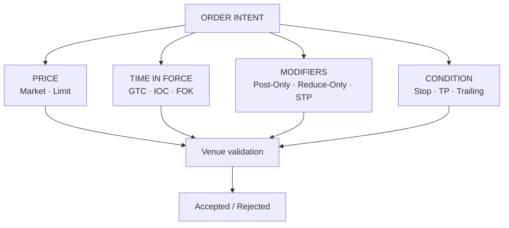
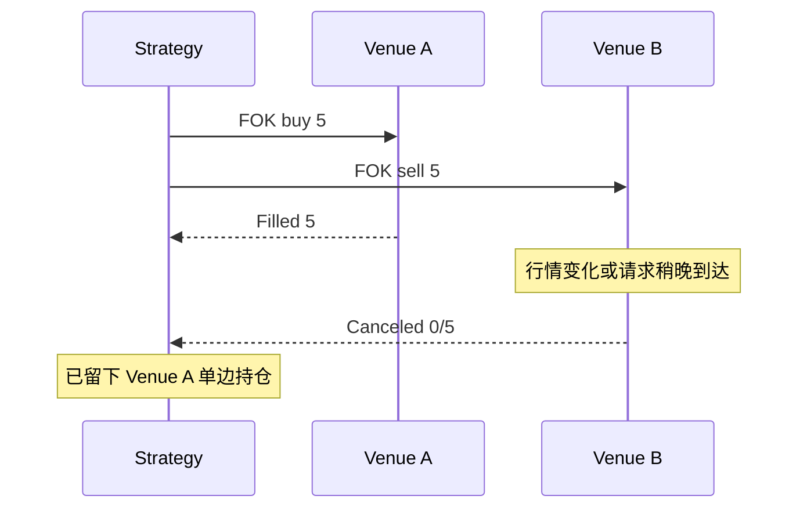
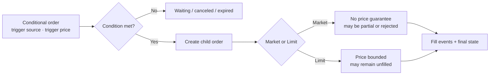
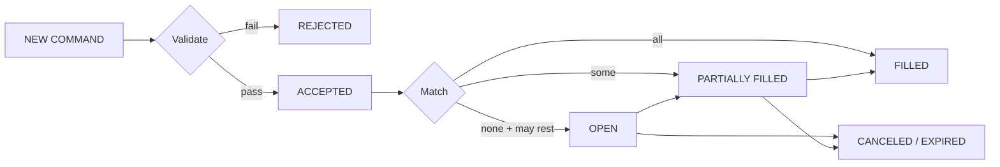

交易界面常把“市价”“IOC”“只挂单”“止损”放在同一个下拉框里，但它们并不是同一层概念。市价与限价描述**价格约束**，GTC、IOC、FOK 描述**订单能存活多久**，Post-Only 与 Reduce-Only 是**执行限制**，Stop 和 Trailing Stop 则是在满足条件后才提交真实订单的**触发器**。

如果把这些维度混在一起，系统很容易出现两个危险误解：市价单或止损单“一定成交”，以及分别在两家交易所提交 FOK 就能让两条腿“同时成功或同时失败”。前者忽略流动性、价格保护和风控拒绝，后者忽略两个撮合引擎之间根本没有共同事务。

本文是交易系统学习路径的 Chapter 05。建议先阅读 [交易品种主数据和市场状态](/signal-grid-blog/posts/trading-instrument-master-market-state-and-rule-versioning/) 与 [期权合约生命周期](/signal-grid-blog/posts/options-contract-lifecycle-exercise-assignment-expiration-settlement/)，再把订单契约绑定到明确的产品权利、规则版本、交易状态、撮合与账本链路上。

> 本文讨论订单和系统语义，不构成交易建议。平台会按产品、地区、账户模式和版本调整参数；接入时应以目标平台当期 API schema、产品规则和返回码为准。

## 用正交维度描述订单

一张订单至少要回答四类问题：

| 维度 | 典型取值 | 回答的问题 |
| --- | --- | --- |
| 价格约束 | Market、Limit | 可以接受什么成交价格 |
| 有效期 TIF | GTC、IOC、FOK、平台特有值 | 未立即成交的数量如何处理 |
| 执行限制 | Post-Only、Reduce-Only、STP | 哪些成交不允许发生 |
| 触发条件 | Stop、Take Profit、Trailing | 什么时候才把子订单送入撮合 |

并不是所有组合都合法。某平台可能禁止 Post-Only 与 IOC 同时使用，Reduce-Only 只在特定持仓模式生效，条件单也可能由独立服务托管而不是立即进入订单簿。因此 API 不应只传一个含糊的 `orderType` 字符串，而应把各维度及其约束显式建模。

## Market 与 Limit：价格优先还是执行机会优先

### Market 没有价格保证，也没有全量成交保证

市价单表达的是“按当前可用对手盘尽快执行”，而不是“以屏幕显示的最新价全部成交”。它可能：

- 穿过多个价格档位，产生滑点；
- 在订单簿深度耗尽后只成交一部分；
- 因价格保护、最大名义价值或账户风控而取消余量或被拒绝；
- 在请求传输期间行情变化，最终成交价与下单时所见不同。

因此，系统契约应返回每一笔 fill、累计成交量和明确的终态，不能只返回一个“成功”。如果业务要求限制最坏价格，通常应表达为带保护价的 marketable limit，而不是假定市价单天然有保护。

### Limit 也不等于 Maker

买入限价单只允许在限价或更低价格成交，卖出限价单只允许在限价或更高价格成交。它是否成为 Maker，取决于到达撮合引擎时是否立即与簿上订单交叉：

- 未交叉的剩余量进入订单簿，后续成交时通常是 Maker；
- 已交叉的部分立即吃掉 resting order，属于 Taker；
- 同一张大订单可以先产生 Taker fills，再把余量作为 Maker 挂入。

典型连续订单簿按簿上 resting order 的价格成交，而不是取买一、卖一中间价。Coinbase 的公开撮合文档就明确说明，incoming taker 与已有 maker 订单按簿上订单价格成交。

## TIF：只约束这一张订单的生命周期

### GTC、IOC 与 FOK

| TIF | 核心语义 | 允许部分成交 | 未成交余量 |
| --- | --- | --- | --- |
| GTC | 保持有效，直到完成或被终止 | 是 | 继续挂单，直到撤单、到期、下架或平台终止 |
| IOC | 立即执行可成交部分 | 是 | 立即取消 |
| FOK | 必须立即全量执行 | 否 | 整单取消 |

GTC 不是“永久存在”。交易对下架、合约到期、风控接管、系统迁移和交易所规则都可能终止订单。IOC 的已成交部分通常是主动吃单；把它描述成“既可能 Maker 也可能 Taker”会掩盖其立即执行语义。

FOK 的 all-or-none 边界只覆盖**一个撮合引擎接受的一张订单**。它不会替调用方撤销另一家交易所已经完成的订单，也不会回滚先完成的一条腿。

即便两个请求并发发出，网络、风控、排队和撮合位置仍各自独立。要真正获得跨场所原子性，需要两个场所共同参与的原子协议或单一可原子执行的组合订单；普通 REST/FIX/API 调用加两张 FOK 不具备这个性质。生产系统必须把 leg risk 当作一等状态，记录每条腿的已知结果、超时后的所有权和补偿动作。

## 执行限制：约束成交角色与持仓变化

### Post-Only：约束流动性角色

Post-Only 的目标是阻止订单在进入时立即成为 Taker。常见实现是在订单会交叉时拒绝或取消它；少数产品可能有改价逻辑，但调用方不能自行假定“系统会自动退一档”。

它仍然不能保证经济上一定赚取 maker rebate：

- 费率由账户等级、产品和地区决定；
- 订单挂入后可能一直不成交；
- 被动成交仍有逆向选择和库存风险；
- amend 或 replace 是否丢失时间优先级依平台规则。

正确的 API 处理方式是读取明确的 accepted/rejected/canceled 结果，并把 Post-Only 作为限制条件，而不是把它当作成交保证。

### Reduce-Only：约束持仓变化

Reduce-Only 表达“这张订单只能缩小已有风险敞口，不能扩大或反向建立仓位”。例如净持仓为 long 1 BTC 时，一张 reduce-only sell 最多只能消耗仍可减少的 long 数量；若仓位已被其他订单平掉，平台可能取消或缩量这张挂单。

它尤其重要，因为普通反向订单并不天然等于平仓：

- 在 one-way / net 模式中，超出原持仓的反向成交可能把 long 翻成 short；
- 在 hedge / dual-side 模式中，多头和空头可并存，`positionSide` 等字段决定操作哪一侧；
- 多张 Reduce-Only 订单会竞争同一个“可减少数量”，平台对优先级、缩量和取消的处理并不统一。

Coinbase International Derivatives 将 Reduce-Only 定义为只减少已有仓位、避免意外反向；OKX API 则明确它只适用于特定产品与持仓模式。这正说明业务代码必须按 venue capability 校验，而不是假设字段跨平台同义。

## 条件单：触发成功不等于成交成功

Stop、Take Profit 和 Trailing Stop 通常先存放在条件单系统。只有参考价格满足条件后，系统才创建或激活一个 market/limit 子订单。

需要分别定义：

- **触发源**：last、mark、index 或其他平台价格；
- **触发方向**：高于、低于或穿越阈值；
- **子订单类型**：market 还是 limit；
- **触发后的保护**：价格带、最大滑点、Reduce-Only；
- **故障语义**：触发服务重启、价格源中断和重复触发如何处理。

Stop-Market 提高了执行机会，但仍可能因无流动性、价格保护或风控失败而未完全成交。Stop-Limit 控制可接受价格，却可能在跳空后留在簿上。Trailing Stop 的“只上不下”只描述 long exit 的跟踪极值；short exit 的方向相反，而且 callback、activation 和价格源都由平台定义。

## 订单状态机比按钮名称更可靠

客户端应围绕交易所确认的状态和累计成交量建模。撤单请求与成交会并发：发出 cancel 并不代表订单已停止成交，只有收到带剩余量的最终确认后，调用方才知道真实结果。

一个简化状态机如下：

生产事件至少应包含交易所原始 `orderId` / `fillId`、账户作用域内稳定的 `clientOrderId`、订单版本、累计成交量、剩余量、状态原因和撮合序列。消费者应以稳定身份和累计成交量处理重复、乱序回报；客户端重试应复用同一个 `clientOrderId`，并通过查询或事件流消解超时后的未知结果。只有最终撤单确认到达后，系统才能释放剩余数量对应的本地占用。

### 执行算法与交易策略另属一层

TWAP、VWAP 和参与率算法会把母订单拆成多张子订单；Iceberg 可能是交易所原生的显示数量修饰符，也可能由客户端算法模拟。它们都建立在底层 Market、Limit、TIF 和 modifier 之上。

网格、跨场所价差、复制交易和 Martingale 则是更上层的交易策略，不能作为撮合引擎的“订单类型”。这种分层有两个好处：

1. 订单网关只验证可执行契约，不承担策略收益假设；
2. 策略服务可以明确处理部分成交、费用、限频、leg risk 和重试，而不会把失败掩盖成“订单未触发”。

## 结论：订单是一组正交约束加一条可恢复状态机

Market、Limit、TIF、modifier 与 trigger 分别约束不同问题，不能压缩成一个含糊的按钮名称。它们还必须和产品能力、持仓模式、费率、价格保护及规则版本一起校验；跨场所的两张订单则始终是两个独立结果，不会因为同时提交或都使用 FOK 就获得原子性。

接入系统最终应相信稳定的订单与成交身份、累计成交量和权威终态，而不是一次 HTTP 返回。这样，部分成交、撤单竞争、重复回报和超时未知才能被同一条状态机解释。

下一章进入 [交易接入网关与会话恢复](/signal-grid-blog/posts/trading-access-gateway-session-recovery/)：先把传输连接、会话连续性与业务受理裁决分开；随后 [交易前风控与订单准入](/signal-grid-blog/posts/pre-trade-risk-and-order-admission/) 再把订单契约绑定到账户、产品、客户限额和原子资金预占。

## 官方参考

- [Coinbase Exchange：Matching Engine](https://docs.cdp.coinbase.com/exchange/concepts/matching-engine)——价时优先、resting order 成交价、STP 与订单生命周期。
- [Coinbase Exchange API：Create a new order](https://docs.cdp.coinbase.com/api-reference/exchange-api/rest-api/orders/create-new-order)——Limit、Market、GTC/GTT、IOC、FOK 和 Post-Only 参数。
- [OKX：Basic order types](https://www.okx.com/en-us/help/x-basic-order-types)——GTC、IOC、FOK 与 Post-Only 的当前产品说明。
- [OKX API v5](https://www.okx.com/docs-v5/)——`ordType`、`reduceOnly`、持仓模式及产品适用范围。
- [Coinbase International Derivatives：Reduce only](https://help.coinbase.com/en/coinbase/derivatives/intx-derivatives-reduce-only)——只减仓、防止反向开仓和仓位消失后的订单处理。
