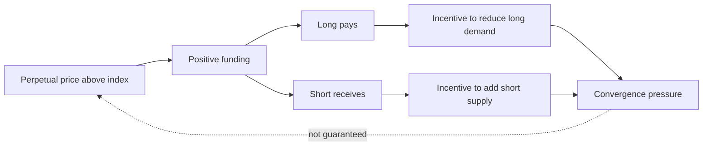
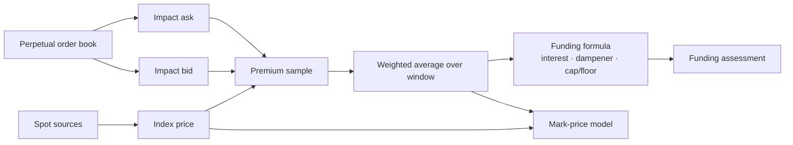
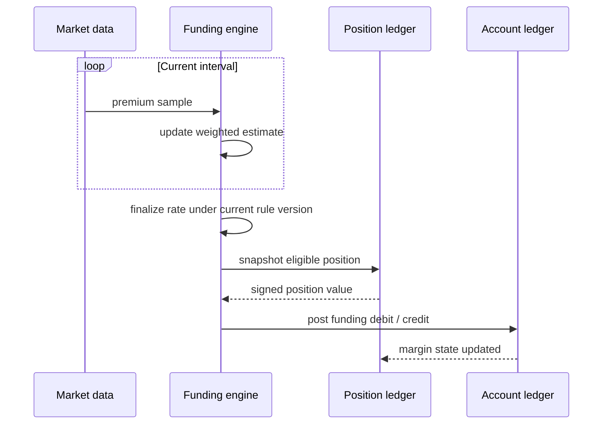

永续合约没有固定到期日，无法依靠到期交割自然收敛到某个结算基准。资金费率通过多空之间的周期性现金流改变持仓成本：永续价格相对指数偏高时，正费率通常让 long 向 short 支付；偏低时，负费率通常让 short 向 long 支付。

这是一个**激励反馈机制**，不是价格必然回归的数学保证。流动性枯竭、仓位拥挤、抵押品约束和平台风险控制都可能让偏离持续存在。

本文是交易系统学习路径的 Chapter 12。[Chapter 10：仓位生命周期与 PnL](/signal-grid-blog/posts/position-lifecycle-and-pnl/) 已说明成交如何形成仓位，[Chapter 11：期货结算与交割](/signal-grid-blog/posts/futures-settlement-variation-margin-and-delivery/) 则处理有到期日合约的每日盯市和最终履约；这里再把 funding 作为永续合约独立于成交价损益的周期现金流处理。

> 本文用于解释产品与系统规则，不构成交易建议。资金费率公式、采样窗口、上下限、评估时间和扣款账户都可能按平台、合约和地区变化。

## 资金费率如何形成反馈

以正费率为例，long 的持仓成本上升、short 获得资金收入，经济激励倾向于减少 long 或增加 short，从而给过高的永续价格施加回归压力。负费率的方向相反。



资金支付通常不是交易所的普通交易手续费。平台在规则中定义付款方、收款方、扣款账户和资金不足时的处理；不能仅凭“多空名义数量应相等”推断实现中每一分钱都实时一一配对。

## 不要从 Mark Price 反推 Premium

常见误写是：

```text
premium = (markPrice - indexPrice) / indexPrice
```

许多平台恰恰先从指数价格和订单簿冲击价格得到 premium，再让 mark price 使用 premium 或 basis 进行估值。如果又用 mark price 定义 premium，就形成循环依赖。

更常见的数据流是：



例如 OKX 与 Bybit 当前公开文档都用 impact bid/ask 构造 premium，大意为：

```text
premium =
  [max(0, impactBid - index)
   - max(0, index - impactAsk)]
  / index
```

Impact price 不是买一或卖一。它表示按平台定义的 impact notional 穿过若干档位后的平均执行价格，因此同时反映价差和一定深度。Impact notional、指数成分、异常源剔除和采样权重仍由产品规则决定。采样管线还必须显式处理缺失样本、异常来源和时钟漂移，不能用一条静默补值把数据质量问题藏进最终费率。

## 没有跨平台统一的固定公式

资金费率常包含四类输入：

1. 一个时间窗口内的 premium samples；
2. 平台定义的 interest component；
3. 对 premium 与 interest 差值的 dampener / inner clamp；
4. 合约级 cap 与 floor。

但“常见”不代表“协议统一”。截至本文更新日，OKX 的公开规则为：

```text
fundingRate =
  clamp(
    [averagePremium
     + clamp(interest - averagePremium, -0.05%, +0.05%)]
    / (8 / intervalHours),
    floor,
    cap
  )
```

其 `intervalHours` 支持 1、2、4、8。Bybit 当前文档也采用 interest、加权 average premium 和内外两层限制，但其采样、上限计算、特殊合约和动态调整规则应以 Bybit 自身参数为准。

这里列出公式是为了展示依赖关系，不应把其中的 `0.05%`、interest 或 interval 复制成所有平台的常量。平台曾经更换过 funding 公式，也可以针对单个产品动态调整频率和上下限。生产接入应从公开接口或版本化配置读取：

- 当前 interval 与下一评估时间；
- 本期估算费率和最终结算费率；
- cap、floor、interest 与 impact notional；
- 规则生效时间和产品标识；
- 计算精度、舍入方向与结算币种。

结算完成后应保存带 `productId`、规则版本和生效区间的最终费率，而不是日后拿“当前公式”重算历史。面向用户的实时 estimate 也必须与最终 settled rate 分开命名和记录；频率、cap/floor、interest 等规则变化应通过版本化配置生效，而不是散落在代码常量中。

## 结算时点不是“每 8 小时一次”的行业常量

8 小时是常见默认值，但不是永续合约的定义。OKX 当前明确支持 1、2、4、8 小时；Bybit 也说明频率和上下限可随产品与市场状态调整。

参与本次 funding 的关键，是平台在**实际评估窗口**内认定账户持有多少仓位：



“结算前一秒开仓不参与”是错误结论。若仓位在平台评估时仍然存在，通常就会参与；而 OKX 当前规则还说明实际评估可能持续到一分钟，甚至在名义时间之后开仓也可能落入尚未结束的评估。相反，在评估完成前已完全平仓，通常不参与本期。调用方必须读取目标平台的具体时间语义，不能用本地时钟猜测。

系统层还要处理：

- 仓位事件与 funding snapshot 的一致性边界；
- 评估期间部分成交或部分平仓；
- 重试时避免重复扣款；
- 费率版本、仓位快照和账本分录之间的因果关联；
- 资金不足后是先扣款再触发风险流程，还是采用其他顺序。

## 从仓位价值到账本与风险

### Funding Fee 取决于仓位价值，不直接取决于杠杆

定义带符号仓位价值 `V`：long 为正、short 为负；定义正费率表示 long 支付。则可以用一个统一方向表达式：

```text
accountCashFlow = -V × fundingRate
```

实际绝对金额取决于合约如何定义 position value。以 OKX 当前文档的示例模型：

```text
Linear:
positionValue = contracts × contractSize × multiplier × markPrice

Inverse:
positionValue = contracts × contractSize × multiplier / markPrice
```

结算币种也不同。公式中的 price source、contract size 和 multiplier 必须从 instrument metadata 读取。

对于**相同名义仓位**，把杠杆从 5x 调到 10x 不会直接把 funding fee 翻倍。杠杆降低了所需初始保证金，所以同一笔 funding 相对于 margin 的比例和账户风险会变大；如果交易者因更高杠杆而建立了更大名义仓位，绝对 fee 才随 position value 增加。

### Funding 会改变风险状态

资金费用不是只在“平仓时结算”的备注。它在每次评估后形成独立账本分录，并可能改变：

- wallet / cash balance；
- isolated position margin；
- cross 或 portfolio margin equity；
- available balance；
- maintenance-margin buffer。

OKX 当前说明中，isolated 模式从该仓位的 margin balance 收取；特定跨保证金模式从相应账户权益收取。若扣款后保证金不足，可能随后发生部分或全部清算。系统设计必须让带稳定幂等键的 funding ledger entry 进入风险引擎的权威输入，并让结算后的账户状态立即参与风险重算与告警，而不是由前端临时从显示 PnL 中相减。

## 基差交易不是无风险收益

“持有现货 long，同时持有等名义永续 short”可以降低 BTC 价格的一阶方向敞口，并在正费率期间尝试接收 funding。但最终结果不只由 funding 决定：

```text
netResult
  = fundingCashFlows
  + entryBasisChange
  - exitBasisChange
  - spotAndDerivativeFees
  - borrowAndFinancingCost
  - transferAndCustodyCost
  - executionLoss
  - otherRiskLosses
```

主要风险包括：

- **Funding risk**：下一周期费率可能降低、变号或改变频率；
- **Leg risk**：两条腿不是原子成交，一边成功时另一边可能失败；
- **Basis risk**：永续与现货的价差可先扩大，衍生品腿可能在最终回归前触发保证金压力；
- **Margin segregation**：现货盈利不一定能实时补充另一账户的衍生品保证金；
- **Borrow/custody risk**：借贷利率、资产冻结、提现和平台信用会改变现金流；
- **Model risk**：合约乘数、指数、标记价和清算规则可能被误读或更新。

把某一次 `0.05%` 费率直接线性年化，也只能得到“若未来每一期完全相同”的情景数值，不能表示可实现收益。历史费率不是未来现金流承诺。

## 结论：Funding 是版本化现金流，不是固定利率收益

资金费率从行情样本、产品规则和评估窗口得到最终结算率，再与同一边界上的仓位快照结合，形成可幂等入账的现金流。公式、频率、仓位价值和扣款范围中的任何一项变化，都会改变结算与风险结果，因此都必须绑定明确版本并保留最终事实。

它能够对永续价格施加回归激励，却不保证价格必然收敛，更不承诺历史费率可以持续。交易和系统实现都应围绕可审计的结算批次推理，而不是围绕一个界面上的年化数字推理。

下一章先进入 [交易账本与双重记账](/signal-grid-blog/posts/trading-ledger-double-entry-accounting-and-reconciliation/)，把 funding、手续费和已实现 PnL 变成可幂等重放、可冲正、可对账的分录；随后再由保证金风险引擎区分 equity、margin balance、available balance 和 maintenance margin。

## 官方参考

- [OKX：Perpetual funding fee mechanism](https://www.okx.com/en-us/help/perps-funding-fee-mechanism)——当前 premium、加权平均、1/2/4/8 小时间隔、cap/floor 与评估窗口说明。
- [OKX：Funding fee mechanism](https://www.okx.com/en-gb/help/funding-fee-mechanism-eea)——linear/inverse position value、扣款账户和 funding 后风险处理。
- [OKX：2025 funding formula change](https://www.okx.com/en-sg/help/okx-to-change-the-funding-rate-formula-for-perpetual-futures)——证明平台公式会版本化调整。
- [Bybit：Introduction to Funding Rate](https://www.bybit.com/en/help-center/article/Introduction-to-Funding-Rate)——interest、impact price、加权 premium、动态 cap/floor 与频率。
- [Bybit：P&L Calculation FAQ](https://www.bybit.com/en/help-center/article/FAQ-Profit-Loss-Calculation)——linear/inverse PnL、费用与杠杆关系。
