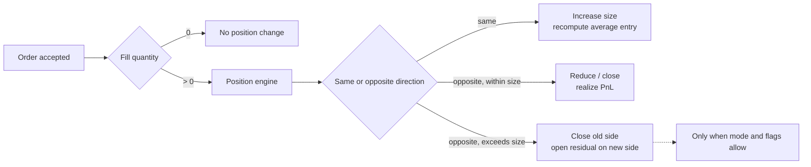
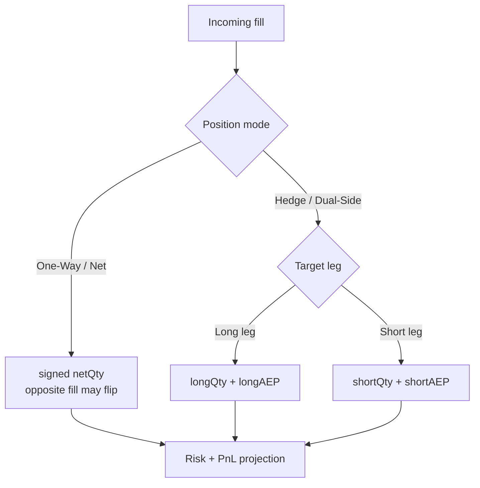
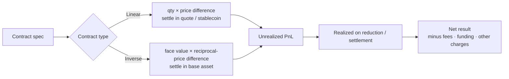

仓位不是“提交开仓订单”后凭空出现的一行数据，而是成交事件按产品规则累积出的状态。订单可以没有成交、部分成交或分多笔成交；只有 fill 才会改变数量、平均入场价和已实现盈亏。

这一点也解释了为什么“卖出”不总是“做空”，反向订单也不总是“平仓”。行为取决于产品类型、当前仓位、持仓模式和 Reduce-Only 等约束。建议先阅读 [Chapter 05：交易订单语义](/signal-grid-blog/posts/order-types-and-execution-strategies/)，再进入仓位层。

> 本文讨论合约与系统记账语义，不构成交易建议。公式必须与具体合约的 multiplier、quantity unit、quote currency、settlement currency 和账户模式一起使用。

## 先区分现货借贷与合约方向

“做空就是先借来卖出”只适用于现货保证金或证券融券等借贷模型。在期货或永续合约中，交易者通常不需要借入标的资产；卖出成交会建立或增加负方向的合约敞口。

| 场景 | 卖出发生了什么 | 主要状态 |
| --- | --- | --- |
| 普通现货 | 交付已持有资产 | 资产余额、冻结余额 |
| 现货保证金 | 可能借入资产后卖出 | 资产、负债、利息 |
| 期货 / 永续 | 建立或减少合约方向敞口 | 仓位、保证金、盈亏 |

因此，系统不能只用 `BUY` 和 `SELL` 推导经济意图。它还需要产品类型、持仓模式、position side 和 reduce-only 等字段。

## 仓位由成交驱动

一张新订单先进入订单状态机。每个 fill 再被仓位引擎解释为加仓、减仓、平仓或反向开仓。



这条链路有几个重要后果：

- `accepted` 不等于有仓位，`filledQuantity` 才是仓位输入；
- 部分成交只按实际 fill 数量改变仓位；
- 撤单只能取消剩余量，不能撤销已经形成的 fill；
- 多次成交可能有不同价格，仓位必须维护定义清楚的平均入场价；
- 同一 fill 重放时不得再次加仓，仓位处理需要以 `tradeId` 或权威序列幂等。

### 开仓、加仓、减仓和平仓

以同一结算周期内的单向净持仓为例：

- 从 0 到 +q：建立 long；
- +q 再收到同方向 buy fill：增加 long 并重算平均入场价；
- +q 收到较小 sell fill：减少 long，并对减少部分确认已实现盈亏；
- +q 收到相同数量 sell fill：仓位归零；
- +q 收到更大 sell fill：先平掉 long，剩余部分是否建立 short 由模式和订单限制决定。

Reduce-Only 用来禁止最后一种意外翻仓。它不是 UI 装饰，而是进入风险检查与仓位变更函数的不变量。

## One-Way 与 Hedge 是不同状态模型

### One-Way / Net 模式

同一产品和账户通常只有一个带符号的净数量：

```text
positionQty > 0  → long
positionQty = 0  → flat
positionQty < 0  → short
```

反向 fill 会先抵消已有数量，超过的部分可能翻转方向。这个模型便于计算净风险，但不能同时保留两条独立方向的入场价。

### Hedge / Dual-Side 模式

系统分别维护 long leg 与 short leg。买卖方向本身不足以确定操作哪一侧，还需要 `positionSide`、`posSide` 或平台等价字段。



“同时有 long 和 short 就没有风险”也不成立。即使某个价格因子上的净 Delta 接近零，两侧仍可能有不同的保证金、资金费用、成交成本、强平规则和结算币种。平台是否允许双向仓位互抵，同样属于账户模式规则。

## 先读合约规格，再写 PnL 公式

仓位数量 `q` 可能代表基础资产数量、合约张数或某个名义金额。必须先读取：

- `contractSize` / `contractValue`；
- multiplier；
- 价格报价方式；
- 结算币种；
- 最小数量与数量步长；
- 是否有周期性结算或平均价重置。

不能看到“1 BTC 合约”就假定它等于 1 BTC 现货，也不能把线性公式套到币本位反向合约。

### 线性合约

若 `q` 已换算为基础资产数量，价格以结算币计价，则忽略费用时：

```text
Long PnL  = q × (exitPrice - entryPrice)
Short PnL = q × (entryPrice - exitPrice)
```

例如 long 0.1 BTC，入场价 60,000 USDT，退出价 61,500 USDT：

```text
PnL = 0.1 × (61,500 - 60,000) = 150 USDT
```

如果 API 的 quantity 是“张”，还要乘合约面值和 multiplier，不能省略规格转换。

### 反向合约

反向合约通常用 USD 等法币单位报价，却以 BTC 等标的资产结算。若每张面值为 `C`、张数为 `n`，忽略费用时：

```text
Long PnL  = C × n × (1 / entryPrice - 1 / exitPrice)
Short PnL = C × n × (1 / exitPrice - 1 / entryPrice)
```

结果以基础资产计价。倒数价格使 PnL 关于美元价格变化呈非线性；“上涨 10% 就赚固定 10% 的 BTC”不是正确推导。



Bybit 的当前 PnL 文档明确区分这两种模型，并指出在相同仓位规模和价格变化下，调整杠杆不会改变实际 PnL，只会改变所需初始保证金和显示的 ROI。这个结论也适合系统建模：**杠杆不是 PnL 公式中的乘数**。

## 平均入场价不是一个通用平均数

线性同向仓位常按基础数量做加权平均：

```text
newAEP = (oldQty × oldAEP + fillQty × fillPrice)
         / (oldQty + fillQty)
```

反向合约则可能按合约价值计算调和形式的平均价：

```text
newAEP = totalContractFaceValue
         / Σ(contractFaceValue / fillPrice)
```

但这些仍不是跨平台协议。某些产品会在周期性结算后把平均入场价更新为结算价格；费用如何按部分平仓分摊也不同。生产实现应从版本化产品规格选择算法，并为每次平均价变化保留输入 fill 和结算原因。

## 未实现、已实现与净结果

### 未实现 PnL

未实现 PnL 是“如果按某个参考价格估值，当前仓位的价格损益是多少”。参考价格可能是 last、mark 或 UI 可切换值，所以不同页面显示的数字可能不同。

它不是可直接审计的最终现金结果，也不应与可用余额画等号。跨保证金和组合保证金模式可能允许部分未实现盈利参与风险计算，但抵押折价、订单占用和产品规则仍会影响可用额度。

### 已实现 PnL

当仓位被减少、到期结算或执行周期性结算时，相应价格损益进入已实现状态。全流程净结果通常还包含：

```text
netResult
  = realizedPositionPnL
  - openingFees
  - closingFees
  - fundingPaid
  + fundingReceived
  - otherApplicableCharges
```

平台对 `realized PnL`、`closed PnL`、`session PnL` 的命名和归集窗口可能不同。接口消费方应保留分项，不要只抓一个 UI 汇总数字回写账本。

## 平仓不是“必定成交的反向订单”

主动平仓仍要经过订单和撮合语义：

- Market Reduce-Only 提高执行机会，但无价格和全量成交保证；
- Limit Reduce-Only 限制价格，却可能只成交一部分或一直挂单；
- Stop 触发后才生成子订单，触发不等于成交；
- 清算是风险引擎接管后的强制减仓流程，不是普通用户平仓的同义词。

对系统而言，仓位只有在最终 fill 或结算事件到达后才改变。客户端点击“全部平仓”但请求超时，应把结果视为 unknown，通过订单查询、私有事件流和持仓对账恢复事实，而不是直接把本地仓位置零。

## 生产仓位引擎的最小不变量

- 同一个 `tradeId` 最多应用一次；
- 仓位数量变化等于权威 fills 的有符号数量之和；
- 部分减仓只对被关闭数量确认 PnL；
- 平仓和翻仓在一个 fill 内也要拆出两个经济动作；
- Reduce-Only 不能让目标 leg 的绝对数量增加；
- 每个计算都绑定 `productVersion` 和 account mode；
- 金额、价格和数量使用明确精度的整数或定点数；
- 仓位投影可从成交、资金费用和结算事件重建；
- 账本分录能追溯到对应仓位事件，仓位本身不直接“改余额”。

下一章将继续讨论 [永续合约资金费率](/signal-grid-blog/posts/perpetual-funding-rate/)：它为什么是独立于价格 PnL 的周期现金流，以及为何不能假定固定每 8 小时结算。

## 官方参考

- [CFTC：Futures Market Basics](https://www.cftc.gov/LearnAndProtect/EducationCenter/FuturesMarketBasics/index2.htm)——期货的双边义务、交割/现金结算与风险边界。
- [Bybit：FAQ — P&L Calculation](https://www.bybit.com/en/help-center/article/FAQ-Profit-Loss-Calculation)——线性与反向合约公式、实际 PnL 与杠杆的关系。
- [Bybit：P&L Calculations for Inverse Contracts](https://www.bybit.com/en/help-center/article/Profit-Loss-calculations-Inverse-Contracts?category=b27e229eb2032c267f)——反向合约平均入场价、倒数价格 PnL 与费用归集。
- [Coinbase International Derivatives：Reduce only](https://help.coinbase.com/en/coinbase/derivatives/intx-derivatives-reduce-only)——只减仓与防止意外翻仓。
- [OKX API v5](https://www.okx.com/docs-v5/)——`reduceOnly`、`posSide` 与不同持仓模式的产品约束。
