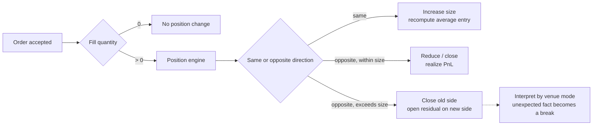
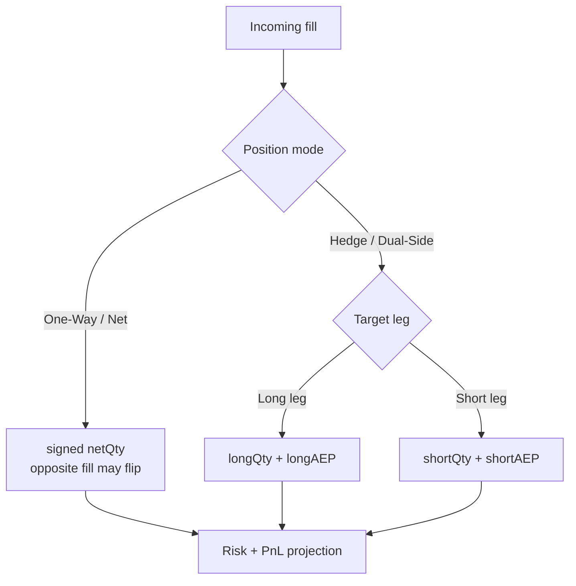
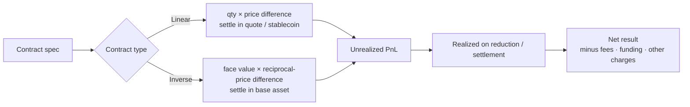
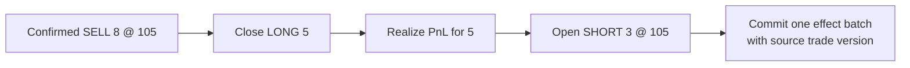
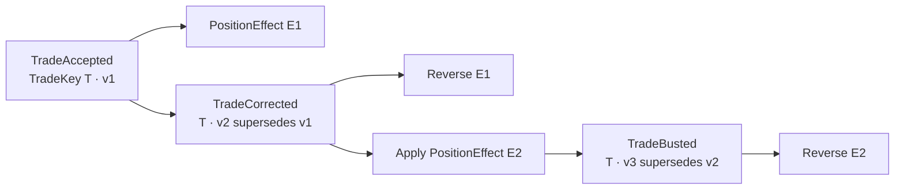
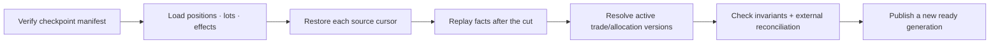

仓位不是“提交开仓订单”后凭空出现的一行数据，而是当前有效成交、账户归属和结算事实按版本化规则累积出的投影。订单可以没有成交、部分成交或分多笔成交；只有被接受的 fill、trade correction、settlement 等权威事实才能改变数量、成本基础和已实现盈亏。

这一点也解释了为什么“卖出”不总是“做空”，反向订单也不总是“平仓”。行为取决于产品类型、Position Key、成本模型、持仓模式和 Reduce-Only 等约束。本文的中心论点是：**仓位正确性不来自一行当前数量，而来自输入事实身份、成本消耗规则、原子状态转移与恢复切点共同闭合。** 本文是交易系统学习路径的 Chapter 13；建议先阅读 [Chapter 05：交易订单语义](/signal-grid-blog/posts/order-types-and-execution-strategies/) 与 [Chapter 12：成交后的清算链](/signal-grid-blog/posts/post-trade-clearing-chain-trade-capture-novation-settlement/)，再进入仓位层。

> 本文讨论合约与系统记账语义，不构成交易建议。公式必须与具体合约的 multiplier、quantity unit、quote currency、settlement currency 和账户模式一起使用。

## 先区分现货借贷与合约方向

“做空就是先借来卖出”只适用于现货保证金或证券融券等借贷模型。在期货或永续合约中，交易者通常不需要借入标的资产；卖出成交会建立或增加负方向的合约敞口。

| 场景        | 卖出发生了什么         | 主要状态           |
| ----------- | ---------------------- | ------------------ |
| 普通现货    | 交付已持有资产         | 资产余额、冻结余额 |
| 现货保证金  | 可能借入资产后卖出     | 资产、负债、利息   |
| 期货 / 永续 | 建立或减少合约方向敞口 | 仓位、保证金、盈亏 |

因此，系统不能只用 `BUY` 和 `SELL` 推导经济意图。它还需要产品类型、持仓模式、position side 和 reduce-only 等字段。

## Position Key 先决定哪些成交能进入同一个状态

在应用 fill 之前，仓位引擎必须先回答“它属于哪一个仓位”。只按 `accountId + symbol` 聚合，会把测试与生产、不同 venue、清算账户或双向持仓 leg 混在一起。一个通用但需要按产品 profile 裁剪的身份可表达为：

```text
PositionKey {
  environment
  legalEntityOrMember
  accountId
  venueOrClearingDomain
  productId
  positionMode
  positionSide?          // Hedge 模式才需要 LONG / SHORT leg
  marginOrCostBucket?    // 只有 venue 把它定义为独立仓位时才进入 key
}
```

`productId` 应唯一标识具体合约系列、到期或永续产品；会随时间变化的 mark price、杠杆显示值和当前产品规则版本不应塞进 key。规则版本属于 Position state/effect 的解释元数据，否则一次正常参数升级会凭空产生另一条仓位。相反，如果某 venue 的 isolated margin bucket 真正拥有独立强平和成本状态，它就必须成为身份的一部分，不能只做 UI 标签。

不同系统还可能需要不同聚合键：

| 视图          | 典型键                                    | 回答的问题                       |
| ------------- | ----------------------------------------- | -------------------------------- |
| 执行仓位      | 完整 `PositionKey`                        | 这笔 fill 改哪条数量与成本状态？ |
| 风险单元      | 多个 Position Key + 风险因子集合          | 哪些敞口按模型可净额或相关抵消？ |
| 账本账户      | legal entity + currency + account purpose | 经济变化如何借贷平衡？           |
| 清算/结算义务 | member + account + product/netting set    | 外部最终要交付什么？             |

这些键可以映射，却不能互相替代。组合保证金把多个仓位放进同一风险单元，不会抹掉每条执行仓位的身份；账本借贷平衡，也不能证明本地 Position Key 与清算方账户归属一致。

Allocation、give-up 或账户迁移改变归属时，不应原地改旧行的 key。应保存版本化归属事实，撤销旧 key 上由原版本产生的 Position Effect，再把当前有效版本应用到新 key。这样才能解释“这笔仓位为什么从 A 转到 B”，并在迟到 correction 到达时找到正确 lineage。

## 仓位由成交驱动

一张新订单先进入订单状态机。每个 fill 再被仓位引擎解释为加仓、减仓、平仓或反向开仓。



这条链路有几个重要后果：

- `accepted` 不等于有仓位，`filledQuantity` 才是仓位输入；
- 部分成交只按实际 fill 数量改变仓位；
- 撤单只能取消剩余量，不能撤销已经形成的 fill；
- 多次成交可能有不同价格，仓位必须维护定义清楚的平均入场价；
- 同一 fill 重放时不得再次加仓，仓位处理需要以带作用域的 trade version 或权威事件身份幂等。

仓位输入不能只有 `side/price/qty`。至少要保留 `(source, tradeKey, tradeVersion)`、消息去重身份、权威 source cursor、Position Key、价格数量、产品规则版本、账户归属版本，以及该版本是 accept、correct 还是 bust。`tradeId` 裸值可能在不同 venue、业务日或环境重复；同一 trade 的 correction 也不能被去重成“已经看过”。

所有会修改同一个 Position Key 的有效事实还必须进入一条可重放的投影顺序。最简单的做法是按 Position Key 路由到单一有序分区；若 fill、allocation、settlement 和 correction 来自多个 source，则需在应用前持久分配 `(projectionOrderNamespace, projectionSequence)`。一组 `sourceCursors` 只能证明各来源读到了哪里，不能说明跨来源的两个事实先应用谁；而 Average Cost、Lot 消耗和 realized PnL 都可能随顺序改变。

```text
(positionState[n + 1], effectBatch[n])
  = project(positionState[n], orderedPositionFact[n], rules[version])
```

`effectBatch` 是一次原子投影的可审计结果，可包含 `OpenQuantity`、`CloseQuantity`、`RealizePnL`、`CreateLot`、`ConsumeLot` 或 `ReversePriorEffect`。实现可以把它们压缩在一条数据库记录里，但必须保留 source lineage；否则 Trade Bust 只能根据当前仓位猜怎样反向。

### 开仓、加仓、减仓和平仓

以同一结算周期内的单向净持仓为例：

- 从 0 到 +q：建立 long；
- +q 再收到同方向 buy fill：增加 long 并重算平均入场价；
- +q 收到较小 sell fill：减少 long，并对减少部分确认已实现盈亏；
- +q 收到相同数量 sell fill：仓位归零；
- +q 收到更大 sell fill：One-Way 模式通常先平掉 long 再让残量建立 short；Hedge 模式则按目标 leg 和 venue 已裁决语义解释。

Reduce-Only 用来在订单准入与撮合阶段禁止意外翻仓。它不是 UI 装饰；仓位投影负责验证成交事实是否符合该裁决，但不能篡改已经确认的 fill 来假装约束成立。

## One-Way 与 Hedge 是不同状态模型

### One-Way / Net 模式

同一产品和账户通常只有一个带符号的净数量：

```text
positionQty > 0  → long
positionQty = 0  → flat
positionQty < 0  → short
```

反向 fill 会先抵消已有数量，超过的部分可能翻转方向。这个模型便于计算净风险，但不能同时保留两条独立方向的入场价。

### Hedge / Dual-Side 模式

系统分别维护 long leg 与 short leg。买卖方向本身不足以确定操作哪一侧，还需要 `positionSide`、`posSide` 或平台等价字段。



“同时有 long 和 short 就没有风险”也不成立。即使某个价格因子上的净 Delta 接近零，两侧仍可能有不同的保证金、资金费用、成交成本、强平规则和结算币种。平台是否允许双向仓位互抵，同样属于账户模式规则。

## 先读合约规格，再写 PnL 公式

仓位数量 `q` 可能代表基础资产数量、合约张数或某个名义金额。必须先读取：

- `contractSize` / `contractValue`；
- multiplier；
- 价格报价方式；
- 结算币种；
- 最小数量与数量步长；
- 是否有周期性结算或平均价重置。

不能看到“1 BTC 合约”就假定它等于 1 BTC 现货，也不能把线性公式套到币本位反向合约。

### 线性合约

若 `q` 已换算为基础资产数量，价格以结算币计价，则忽略费用时：

```text
Long PnL  = q × (exitPrice - entryPrice)
Short PnL = q × (entryPrice - exitPrice)
```

例如 long 0.1 BTC，入场价 60,000 USDT，退出价 61,500 USDT：

```text
PnL = 0.1 × (61,500 - 60,000) = 150 USDT
```

如果 API 的 quantity 是“张”，还要乘合约面值和 multiplier，不能省略规格转换。

### 反向合约

反向合约通常用 USD 等法币单位报价，却以 BTC 等标的资产结算。若每张面值为 `C`、张数为 `n`，忽略费用时：

```text
Long PnL  = C × n × (1 / entryPrice - 1 / exitPrice)
Short PnL = C × n × (1 / exitPrice - 1 / entryPrice)
```

结果以基础资产计价。倒数价格使 PnL 关于美元价格变化呈非线性；“上涨 10% 就赚固定 10% 的 BTC”不是正确推导。



Bybit 的当前 PnL 文档明确区分这两种模型，并指出在相同仓位规模和价格变化下，调整杠杆不会改变实际 PnL，只会改变所需初始保证金和显示的 ROI。这个结论也适合系统建模：**杠杆不是 PnL 公式中的乘数**。

### Average Cost 是一种成本模型，不是一个通用平均数

线性同向仓位常按基础数量做加权平均：

```text
newAEP = (oldQty × oldAEP + fillQty × fillPrice)
         / (oldQty + fillQty)
```

反向合约则可能按合约价值计算调和形式的平均价：

```text
newAEP = totalContractFaceValue
         / Σ(contractFaceValue / fillPrice)
```

但这些仍不是跨平台协议。某些产品会在周期性结算后把平均入场价更新为结算价格；费用如何按部分平仓分摊也不同。生产实现应从版本化产品规格选择算法，并为每次平均价变化保留输入 fill 和结算原因。

Average Cost 把同一个 Position Key 的同向开放数量压缩成 `(qty, averageEntry)`。减仓时，被关闭数量统一使用减仓前的 average entry 计算已实现 PnL；剩余仓位的 average entry 通常不变，直到同向增加、翻仓、结算重置或 correction 触发重新投影。它节省状态，却不能回答“具体消费了哪一笔 opening fill”。

### Lot 模型保留开仓来源和确定的消耗顺序

Lot 模型为开放数量保留来源，例如：

```text
OpenLot {
  positionKey
  lotId
  sourceTradeKey, sourceTradeVersion
  openPrice, openQuantity, remainingQuantity
  productRuleVersion, allocationVersion
}
```

反向 fill 到来时，引擎按版本化 policy 消耗 lots：可能是 FIFO、LIFO、specific identification，或清算机构定义的账户规则。选择哪一 lot 会改变已实现/未实现 PnL 的时间分布和 correction lineage，因此不能依赖数据库“碰巧返回”的行顺序。

以线性 long 为例，依次买入 `1 @ 100`、`1 @ 120`，再卖出 `1 @ 130`：

| 成本模型     |       已实现 PnL | 剩余开放成本 | 在 mark=125 时的未实现 PnL |
| ------------ | ---------------: | -----------: | -------------------------: |
| Average Cost | `130 - 110 = 20` |    `1 @ 110` |                       `15` |
| FIFO Lots    | `130 - 100 = 30` |    `1 @ 120` |                        `5` |

忽略费用和结算重置，两者在同一 mark 下的总经济 PnL 都是 35，但 realized/unrealized 分解不同。若账本、税务、客户报表或清算对账依赖该分解，成本模型就是业务合同，不是可随意替换的实现细节。

| 维度                 | Average Cost                       | Lot                                      |
| -------------------- | ---------------------------------- | ---------------------------------------- |
| 状态规模             | 每个 Position Key 近似常量         | 随开放 lot 数增长                        |
| 部分减仓             | 使用聚合平均成本                   | 按明确 policy 消耗 lots                  |
| Bust/Correct lineage | 需要保存 effect 或重放才能精确反向 | 可定位受影响 lot，但仍可能影响后续消费链 |
| 适用场景             | venue 原生净仓、实时风险聚合       | 税务/清算/客户级成本归属、specific lot   |

可以同时维护两种投影，但必须给它们不同的 projection name、version 和校验规则。不能让“风险 Average Cost”覆盖“清算 FIFO Lot”，再声称两边只是显示差异。

## 减仓与翻仓必须在同一个 fill 内原子分解

在 One-Way 模式下，反向 fill 需要先关闭旧方向，再判断是否有残量打开新方向。设旧仓位为 long 5，收到已经确认的 `SELL 8 @ 105`，经济上应分解为：

```text
Close long 5 @ 105  -> realize PnL against old cost
Open  short 3 @ 105 -> new short cost basis starts at 105
```

这不是两个可以独立提交的业务请求。若系统先把 long 置零、崩溃后却没有建立 short 3，权威 fill 的 3 单位消失；若恢复时整笔 fill 再来一次，又可能把已平部分重复确认 PnL。Reducer 应在一个 source trade version 下生成一个原子 `PositionEffectBatch`：



对带符号净仓 `q` 和带符号 fill `f`，可先计算：

```text
closedQty = min(abs(q), abs(f))   when sign(q) != sign(f)
openQty   = abs(f) - closedQty
```

`closedQty` 使用旧方向成本确认 PnL；只有 `openQty > 0` 时才建立反向成本。Average Cost 模型为残量创建新的 average entry，Lot 模型则先按 policy 消耗旧 lots，再为残量创建新 lot。手续费如何在 close/open 两段分摊属于版本化产品或报表规则，不能通过整数除法随意切一半。

Reduce-Only 应在订单准入和撮合阶段阻止会增加目标 leg 绝对数量的成交。不同 venue 可能拒绝整单、裁剪可执行量或动态取消超额剩余量。仓位投影收到一笔已经由权威来源确认、却违反本地 Reduce-Only 预期的 fill 时，不能静默把 8 改成 5；它必须保存外部事实并进入 break/对账流程，否则本地仓位会与 venue 永久分叉。

## 未实现、已实现与净结果

### 未实现 PnL

未实现 PnL 是“如果按某个参考价格估值，当前仓位的价格损益是多少”。参考价格可能是 last、mark 或 UI 可切换值，所以不同页面显示的数字可能不同。

它不是可直接审计的最终现金结果，也不应与可用余额画等号。跨保证金和组合保证金模式可能允许部分未实现盈利参与风险计算，但抵押折价、订单占用和产品规则仍会影响可用额度。

### 已实现 PnL

当仓位被减少、到期结算或执行周期性结算时，相应价格损益进入已实现状态。全流程净结果通常还包含：

```text
netResult
  = realizedPositionPnL
  - openingFees
  - closingFees
  - fundingPaid
  + fundingReceived
  - otherApplicableCharges
```

平台对 `realized PnL`、`closed PnL`、`session PnL` 的命名和归集窗口可能不同。接口消费方应保留分项，不要只抓一个 UI 汇总数字回写账本。

## Trade Bust 与 Correct 改写有效历史，不能覆盖旧成交

成交可能在仓位已经更新、后续减仓甚至结算之后被 bust 或 correct。正确输入不是“把旧 trade 行改成 canceled”，而是一条引用先前版本的权威事实：



对同一个 scoped `TradeKey`，任一业务 cut 最多只能有一个 active economic version。重复传输同一 `TradeCorrected(v2)` 只返回原裁决；新的 `v3` 必须明确引用它要替代的 active version。收到未知 trade、跳版本或已经被另一 correction 取代的引用时，系统应进入 pending/break 并查询权威来源，不能按价格数量“找一笔像的”来撤销。

Correction 必须在一个原子 effect batch 中撤销当前 active effect 并应用替代版本；Bust 则只撤销它明确引用的 active version。两者都不能在 reverse 与 apply 之间暴露半个仓位状态。

仓位层有两种通用恢复策略：

1. **可逆 effect**：初次应用时保存精确 `PositionEffectBatch` 和 lot lineage；Bust 原子写入 `ReversePriorEffect`，并对后续受影响的 PnL/lot 链做确定性重算。
2. **回到受影响前缀再重放**：选择 correction 所引用事实之前的合法 checkpoint，按原权威顺序只应用当前有效 trade/allocation versions，生成新的 projection generation。

两者可以结合，但“在当前仓位上追加一笔相反方向 fill”不是一般解。假设后来已有部分平仓，Lot 模型中的原 lot 可能已被消费；随意生成反向 fill 会创建一条新的平仓或开仓路径，而不是复原原先 lineage。Average Cost 也可能因为中间加减仓、翻仓和结算重置而具有路径依赖，必须使用保存的 effect 或从合法前缀重算。

Correction 同时影响仓位、费用、已实现 PnL 和账本。仓位引擎可以发布带原 effect 身份的 reverse/apply 事实，但不能直接覆盖余额；账本应以同一 lineage 生成冲正分录。完整的 Trade version graph、allocation 和清算责任边界见[成交后的清算链](/signal-grid-blog/posts/post-trade-clearing-chain-trade-capture-novation-settlement/)。

## 平仓不是“必定成交的反向订单”

主动平仓仍要经过订单和撮合语义：

- Market Reduce-Only 提高执行机会，但无价格和全量成交保证；
- Limit Reduce-Only 限制价格，却可能只成交一部分或一直挂单；
- Stop 触发后才生成子订单，触发不等于成交；
- 清算是风险引擎接管后的强制减仓流程，不是普通用户平仓的同义词。

对系统而言，仓位只有在最终 fill 或结算事件到达后才改变。客户端点击“全部平仓”但请求超时，应把结果视为 unknown，通过订单查询、私有事件流和持仓对账恢复事实，而不是直接把本地仓位置零。

## Checkpoint 必须把仓位状态与事实游标冻结在同一个 cut

仓位历史会持续增长，Checkpoint 用于缩短重放，不是把当前表导出成 CSV。它必须说明“这些状态已经消费了哪些权威事实，以及用哪套解释规则得到”。一个教学化 manifest 可以包含：

```text
PositionCheckpointManifest {
  projectionGeneration
  projectionSchemaVersion
  projectionOrderNamespace, lastAppliedProjectionSequence
  positionRuleAndCostModelVersions
  sourceCursors[]
  activeTradeAndAllocationVersionDigest
  positionStatesFileDigest
  openLotsFileDigest?
  effectAndDedupFrontier
  ledgerPublicationCursor?
}
```

若输入来自多个有序分区，`sourceCursors[]` 必须分别保存各自的完整 cursor identity，不能取一个最大的裸序号；它们还要与 `lastAppliedProjectionSequence` 一起冻结，才能恢复跨来源的实际应用顺序。Checkpoint state 与 cursors 必须原子发布：状态含到 1000 而 cursor 只到 990 会重复投影，cursor 到 1000 而状态只到 990 会永久漏仓。账本 publication cursor 即使一起记录，也只说明本地发布进度；它不能把跨系统提交自动变成原子事务，重复仍需要稳定 Position Effect 身份吸收。



恢复不能只重放普通 fills。规则包、周期性结算、allocation、funding、Bust/Correct 和产品生命周期事件都必须进入可重放事实集；否则相同 fill 序列在不同成本模型或结算重置下会生成不同结果。旧 checkpoint 的 schema 或规则不兼容时，应显式迁移到新 projection generation，不能让新代码悄悄按当前默认值读取旧字段。

Late correction 还约束历史删除：只要权威来源仍可能纠正 checkpoint 之前的 trade，就要保留 version graph、原 effect/lot lineage，或保留能回到 correction 前的 checkpoint 与原始事实。何时可删除由 Recovery Frontier 决定，而不是由文件年龄决定；可继续阅读[历史安全回收](/signal-grid-blog/posts/history-retention-recovery-frontier-log-truncation-dedup-gc/)。

恢复完成也不等于仓位已被外部证明。新 generation 应在同一 cut 上与 venue、clearing broker 或 CCP 的持仓/交易声明对账；无法解释的差异进入 break，不能用外部总数直接覆盖本地 lots 和 lineage。

## 不变量和前缀等价证明仓位确实来自有效事实

下面不是脱离机制的上线清单，而是每个 reducer 与恢复实现必须持续满足的证明义务：

| 不变量              | 精确含义                                                                             | 主要反例                        |
| ------------------- | ------------------------------------------------------------------------------------ | ------------------------------- |
| Active-version 唯一 | 同一 scoped TradeKey 在一个 cut 最多一个经济版本生效                                 | 原 fill 与 correction 同时加仓  |
| 数量投影守恒        | Position Key 的净数量等于当前有效 trade、allocation 与生命周期事实按模式映射后的结果 | 重复消息、漏分区、错误归属      |
| Flip 原子性         | 同一 fill 的 close + realize + residual open 全部发生或全部不发生                    | 崩溃在平旧仓与开新仓之间        |
| Cost lineage 完整   | Average effect 或每个 lot 都可追溯到 source version，lot 不会被重复消费              | Bust 后用伪造反向 fill 修补     |
| PnL 分项可归因      | realized、unrealized、费用、funding 与结算现金流分别绑定事实和规则，净结果可对账     | 把杠杆当 PnL 乘数、费用重复扣减 |
| Checkpoint 前缀等价 | checkpoint at `k` + suffix replay 与从事实起点完整重放得到同一 generation            | state/cursor 错位、规则包缺失   |
| Ledger 可追溯       | 每个仓位经济 effect 有稳定身份，账本以其记账或冲正                                   | 仓位代码直接覆盖余额            |

属性测试可生成同向加仓、部分减仓、精确平仓、跨零翻仓、重复消息、交错 correction、结算重置及 One-Way/Hedge 两种模式。对每条 trace，同时运行一个使用任意精度数和简单 lot 列表的参考投影，与生产定点数实现逐步比较数量、成本、realized PnL、lots 和 effect identities。随机选取 `k` 创建 checkpoint，再重放后缀，是检查恢复等价最直接的变形性质。

故障注入应落在 effect batch 提交前后、checkpoint 文件发布与 cursor 提交之间、账本发布结果未知、Bust 反向一半以及新 projection generation 切换前后。通过标准不是“任务最终又跑起来”，而是 active versions、Position Keys、lots、PnL 分项、账本 effect 集合与 break 集合在相同 cut 上完全一致。

## 仓位的保证边界最终落在事实 lineage 上

Position Key 确定聚合边界，成本模型确定减少数量如何消耗旧成本，原子 effect batch 确保一次 flip 不会被崩溃撕开，Trade version graph 则让 Bust/Correct 可以显式反向。Checkpoint 只缩短这些事实的重放距离；它既不会让订单自动成交，也不能证明外部清算方持有相同仓位。

因此，可信仓位不是一个“最新值”，而是一份能回答来源、版本、成本、切点和差异的可重放投影。只有完整重放、checkpoint 后缀重放和外部对账在同一 cut 收敛，当前数量与 PnL 才具有可审计含义。

下一章进入 [期货结算与交割](/signal-grid-blog/posts/futures-settlement-variation-margin-and-delivery/)：把期货仓位接到每日盯市、Variation Margin、最终现金结算或实物交割状态机。随后 [永续合约资金费率](/signal-grid-blog/posts/perpetual-funding-rate/) 再解释无固定到期日产品的周期现金流。

## 官方参考

- [CFTC：Futures Market Basics](https://www.cftc.gov/LearnAndProtect/EducationCenter/FuturesMarketBasics/index2.htm)——期货的双边义务、交割/现金结算与风险边界。
- [Bybit：FAQ — P&L Calculation](https://www.bybit.com/en/help-center/article/FAQ-Profit-Loss-Calculation)——线性与反向合约公式、实际 PnL 与杠杆的关系。
- [Bybit：P&L Calculations for Inverse Contracts](https://www.bybit.com/en/help-center/article/Profit-Loss-calculations-Inverse-Contracts?category=b27e229eb2032c267f)——反向合约平均入场价、倒数价格 PnL 与费用归集。
- [Coinbase International Derivatives：Reduce only](https://help.coinbase.com/en/coinbase/derivatives/intx-derivatives-reduce-only)——只减仓与防止意外翻仓。
- [OKX API v5](https://www.okx.com/docs-v5/)——`reduceOnly`、`posSide` 与不同持仓模式的产品约束。
