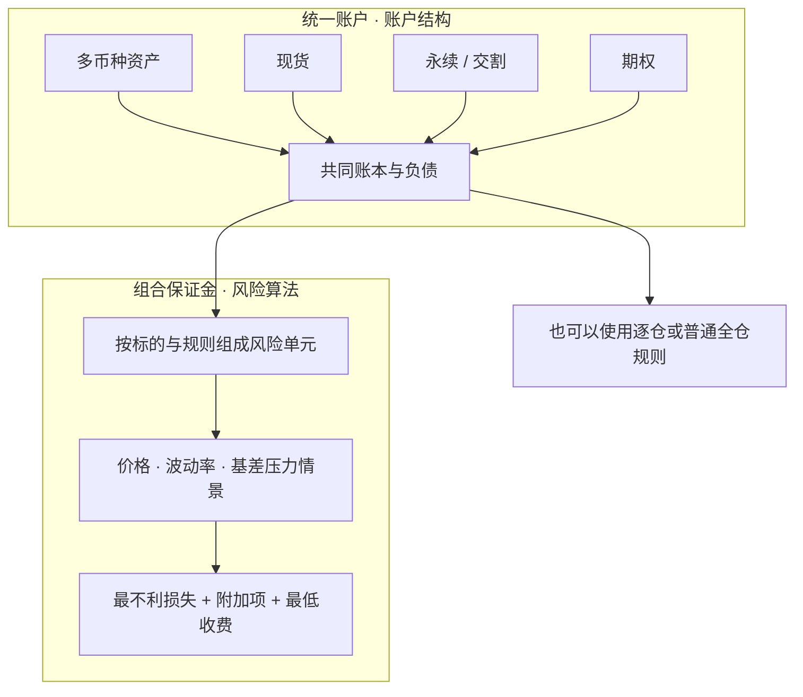
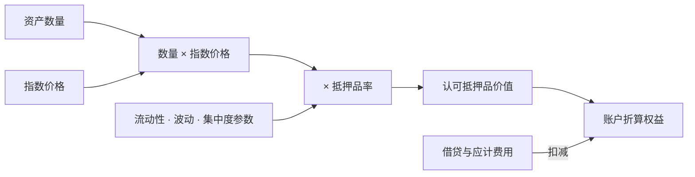
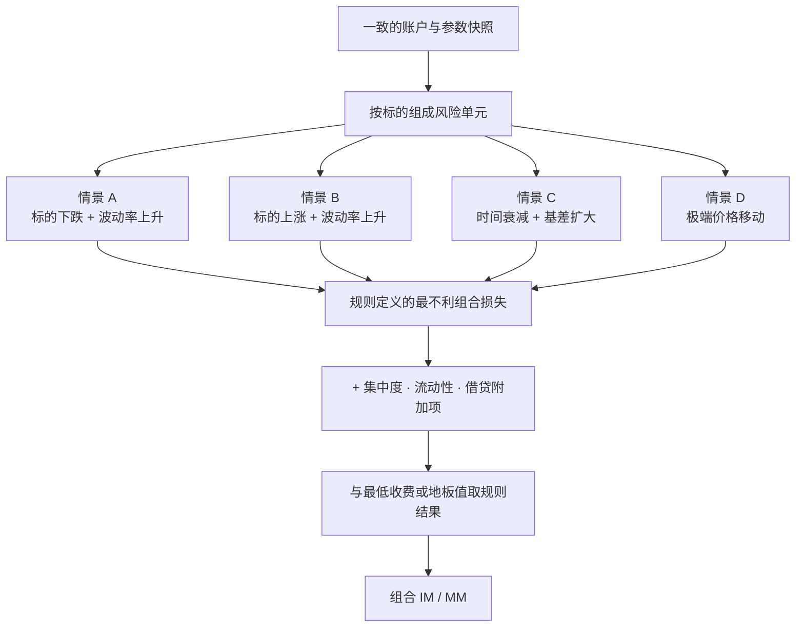

“统一账户”和“组合保证金”经常同时出现，容易被当成同一个功能。实际上，前者首先回答**资产、负债、订单和仓位放在哪个账户里结算**，后者回答**这些头寸合在一起需要多少保证金**。一个账户可以统一，却仍采用逐仓或普通全仓计算；采用组合保证金时，也必须先明确可纳入哪个风险单元。

本文是交易系统学习路径的 Chapter 12，承接 [Chapter 11：强平风险瀑布](/signal-grid-blog/posts/liquidation-and-adl/)，把单仓和账户级风险进一步扩展到多资产、多产品组合。

> 本文用于解释账户与风险模型，不构成投资、交易或平台选择建议。文中情景均为教学抽象；抵押品率、压力幅度、净额规则和清算顺序会随平台、产品与时间变化。

## 1. 两个正交维度：账户结构与风险算法

统一账户（Unified Account）通常提供一套共同的资产与结算视图，让现货、保证金、永续、交割合约和期权在规则允许时共享抵押品、处理负债并结算盈亏。它减少了子账户之间的手工划转，但也扩大了风险传播范围。

组合保证金（Portfolio Margin, PM）是一种风险计量方式。它在明确的风险单元内把相关头寸放进同一组价格、波动率和基差情景，识别可验证的对冲关系，再以最不利结果和附加项确定保证金。



| 问题 | 统一账户 | 组合保证金 |
| --- | --- | --- |
| 核心对象 | 余额、抵押品、负债、订单、结算 | 风险单元、情景损益、净额与附加项 |
| 主要价值 | 减少资金搬运，形成统一资产视图 | 识别组合对冲，按净风险而非简单相加计量 |
| 主要风险 | 一个产品的亏损或借贷可能传播到更大账户范围 | 模型、相关性、基差、流动性和集中度风险 |
| 是否必然同时启用 | 否 | 否；具体准入和账户承载方式由平台决定 |

因此，不应声称某个平台“首创了统一账户”，也不应把“统一账户 = 组合保证金”写进数据模型。产品演进和命名会变化，可验证的是当前账户规则与风险算法，而不是营销标签的先后顺序。

## 2. 账户余额不等于可用抵押品价值

统一账户需要把不同资产折算到共同计价单位。最简单的正余额模型是：

```text
认可抵押品价值
  = Σ(资产数量 × 指数价格 × 抵押品率)
```

抵押品率（Collateral Value Ratio，也常被称为 haircut 后的认可比例）反映流动性、价格波动和集中度等约束。它不是固定汇率，也不是对资产价格设置止损。

例如，某资产有 10 个单位，教学用指数价格为 2,000 USD，平台参数把抵押品率设为 80%：

```text
市场名义价值 = 10 × 2,000 = 20,000 USD
认可抵押品价值 = 20,000 × 80% = 16,000 USD
```

这 4,000 USD 差额是风险折扣，不代表资产被出售或发生了已实现损失。指数价格或抵押品率变化时，认可价值会同步变化，从而影响账户风险率。



实现时还必须区分正余额与负债。部分平台只对正抵押品应用折扣，而负余额按更严格比例计入；还可能设置单币种上限、阶梯折扣、借贷限额和稳定币脱锚附加项。把所有币种简单乘一个固定折扣后相加，会低估账户风险。

## 3. 净额只发生在明确的风险单元内

组合保证金不会因为两笔资产“历史上相关”就无限抵消。风险引擎先定义风险单元，例如同一底层资产下的现货、永续、不同到期日合约与期权，再规定哪些 Delta、Vega 或基差风险可以净额。

一个 BTC 风险单元可能包含：

- BTC 现货或被认可的现货订单；
- BTC-USDT、BTC-USDC 等永续与交割合约；
- 不同行权价、不同到期日的 BTC 期权；
- 平台明确允许纳入的抵押品或借贷暴露。

ETH 仓位通常进入另一个风险单元。即使 BTC 与 ETH 在某段历史里高度相关，也不代表两个单元能获得一比一抵扣。跨标的抵扣若存在，必须由明确参数和上限约束。

净额也不是“多头名义价值减空头名义价值”这么简单：

- 现货与永续可能有基差和资金费风险；
- 不同到期日合约有期限基差；
- 期权 Delta 会随价格变化，Gamma 和 Vega 不能被静态 Delta 覆盖；
- 抵押品自身可能和仓位在压力情景中同时下跌；
- 大仓位清算需要考虑市场深度和冲击成本。

## 4. 压力测试决定的是情景损失，不是历史相关性的承诺

一个教学化的组合保证金流程如下：

1. 取得一致时点的账户、价格和风险参数快照；
2. 按底层资产把头寸映射到风险单元；
3. 对价格、隐含波动率、时间衰减和基差施加离散压力；
4. 在每个情景下对全部头寸重估，得到组合净损益；
5. 取规则定义的最不利损失，再叠加集中度、流动性、借贷和最低收费；
6. 汇总各风险单元与不可净额项目，形成 IM、MM 与账户风险率。



假设某风险单元在四个教学情景下分别得到 `-12,000`、`-8,000`、`-1,000` 和 `-25,000 USD` 的组合损益，那么情景扫描暴露的是 25,000 USD 最不利损失。真实引擎可能把不同风险项相加、取最大值或应用权重，并继续加上最低收费；不能仅凭这个数字宣称最终保证金恰好是 25,000 USD。

### SPAN 是参照系，不是所有 PM 的同义词

CME SPAN 是重要的组合保证金方法论。经典 SPAN 在 combined commodity 层面使用 risk array 评估扫描风险，并处理跨月价差、交割风险和跨品种抵扣。它很好地展示了“以情景损失计量组合，而不是逐腿保证金相加”的思想。

还要区分经典 SPAN 与正在分阶段落地的 SPAN 2。CME 当前公开的 SPAN 2 框架以历史 VaR 和压力风险为市场风险主体，再加入流动性与集中度费用；迁移期内，不同产品仍可能分别使用 SPAN 或 SPAN 2，并通过明确规则提供跨模型抵扣。于是，“SPAN 永远等于固定 16 个情景”和“CME 所有产品已经切到同一新模型”都不准确。

但加密交易平台的 PM 可能使用自己的风险单元、价格与波动率冲击、极端移动、稳定币脱锚、借贷和最低收费模块。文章可以把 SPAN 作为方法论参照，不能把任一平台的实现直接称为 SPAN，也不能拿一组自设情景算出“节省 78%”后当作平台承诺。

## 5. 保证金降低不等于风险消失

组合保证金识别对冲后，要求可能低于逐腿简单相加。这表示模型认为在给定压力集合中，部分损失可以被其他头寸抵消；它不表示组合没有风险。

风险仍可能来自：

- **对冲漂移**：期权 Delta 随价格和时间变化；
- **基差扩张**：现货、永续和交割合约不再同步；
- **相关性破裂**：跨资产抵扣在极端行情中失效；
- **波动率曲面变化**：不同期限和行权价的 Vega 不能完全抵消；
- **抵押品共振**：抵押品和风险仓位同时贬值；
- **流动性缺口**：模型价格可得，但真实减仓深度不足；
- **参数跳变**：平台调整折扣率、压力幅度、档位或借贷上限。

这也是为什么成熟实现同时需要情景保证金、集中度附加、最低收费、实时风险率、参数版本和独立压力测试，而不是只展示一个“节省保证金”百分比。

## 6. 系统实现的关键数据边界

统一账户与 PM 最容易出错的地方，是不同服务在不同时间看到不同资产、价格和参数版本。一次风险计算应绑定：

```text
accountSnapshotId
valuationTimestamp
priceIndexVersion
collateralPolicyVersion
portfolioModelVersion
riskUnitDefinitions
openOrdersAndPositions
borrowingsAndAccruals
```

输出不仅要有总 IM、MM，还要给出可解释分解：每个资产的名义与认可价值、每个风险单元的情景损益、使用的净额、各项附加收费，以及哪个情景成为约束。订单预检查和清算判断必须使用兼容的模型版本，否则“下单时通过、落账即越线”会成为系统性竞态。

参数更新也应当事件化：先以影子计算评估影响，再发布带生效时间的新版本，最后让订单网关、风险引擎和清算服务在同一边界切换。历史重放必须仍能取到当时版本。

## 7. 核心结论

- 统一账户是资产、负债与结算的组织方式；组合保证金是风险计量方法。
- 资产市值要经过指数价格、抵押品率、上限和负债规则后，才成为认可权益。
- 净额只在规则定义的风险单元和上限内发生，不能由历史相关性随意推导。
- PM 的核心是情景重估、最不利损失与附加项；保证金减少不代表风险消失。
- SPAN 是重要参照，但不能代替平台自己的模型说明与参数版本。

## 官方参考

- [Bybit：Unified Trading Account 概览](https://www.bybit.com/en/help-center/article/Introduction-to-Bybit-Unified-Trading-Account?category=dc8a1e795293636335)
- [Bybit：统一账户中的抵押品价值率](https://www.bybit.com/en/help-center/article/?id=000001879&language=en_US)
- [OKX：Portfolio Margin 的 Risk Unit Merge 与压力项](https://www.okx.com/en-us/help/portfolio-margin-mode-cross-margin-trading-risk-unit-merge)
- [CME Group：SPAN Methodology Overview](https://www.cmegroup.com/solutions/risk-management/performance-bonds-margins/span-methodology-overview.html)
- [CME Group：SPAN 2 Methodology](https://www.cmegroup.com/clearing/risk-management/span-overview/span-2-methodology.html)
- [CME Group：SPAN 2 分阶段迁移范围](https://www.cmegroup.com/solutions/risk-management/performance-bonds-margins/span-methodology-overview/launching-span-2.html)
