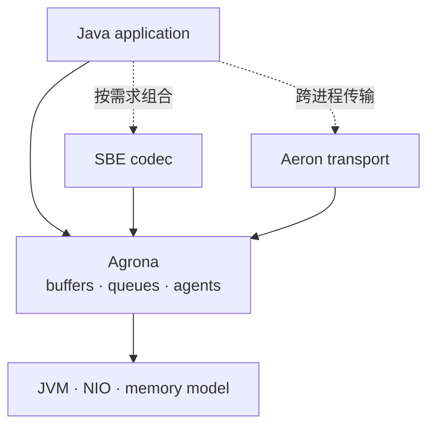
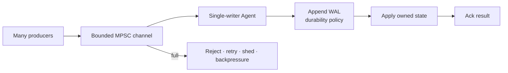
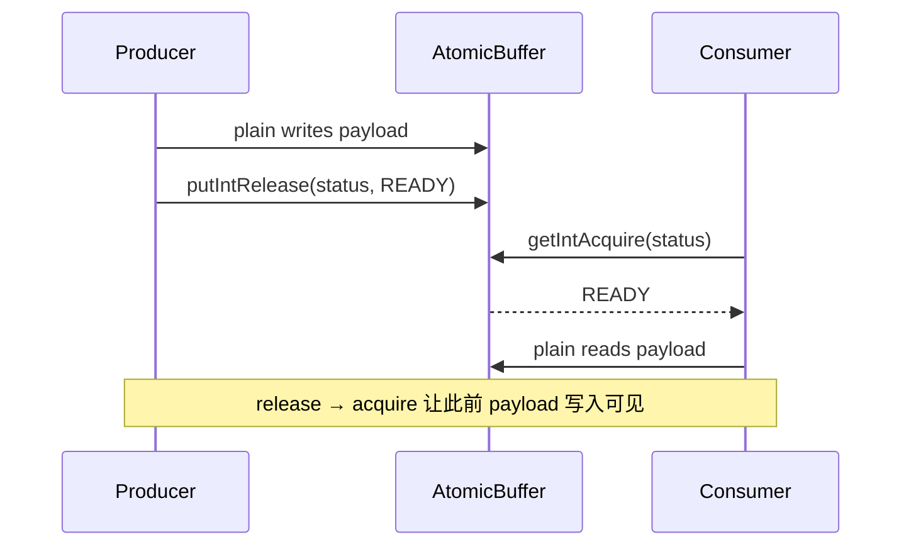
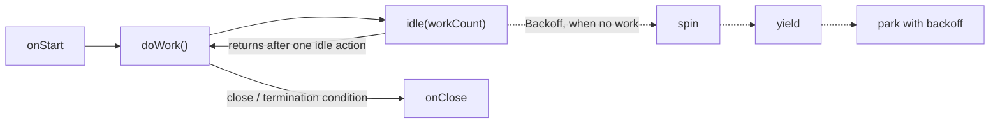

Agrona 常被介绍成“高性能 Java 工具箱”，然后话题很快滑向 `Unsafe`、堆外内存、无锁队列和一组脱离环境的纳秒数字。这种介绍很容易让人得到一个错误结论：只要把 JDK 容器替换成 Agrona，系统就会自动变成“零 GC、零拷贝、低延迟”。

更准确的理解是：**Agrona 提供了一组约束明确的底层积木，用来构建进程内或共享内存上的低延迟数据通路。** 它替你实现了 Buffer、并发队列、二进制 Ring Buffer、Agent 循环、原始类型集合、计数器与运维工具；但数据所有权、线程拓扑、背压、持久化和故障恢复仍由应用设计。

本文以 **Agrona 2.5.0** 为基线。旧版 1.21.1 之后，Agrona 已把运行基线提升到 JDK 17，2.0 移除了 `UnsafeAccess`、`MemoryAccess` 与 `SigIntBarrier`，2.1 补齐 plain / opaque / acquire-release / compare-and-exchange API，2.3 调整了 `ShutdownSignalBarrier` 生命周期，2.5 又改变了 `AgentRunner.close()` 的中断语义。继续照搬旧示例，轻则概念过时，重则关闭流程卡住。[官方 Releases](https://github.com/aeron-io/agrona/releases) · [2.5.0 Changelog](https://github.com/aeron-io/agrona/blob/2.5.0/CHANGELOG.adoc)

## 1. 它在系统里的正确位置

Agrona 不是网络传输、持久化日志、消息协议或业务框架。Aeron 和 SBE 使用 Agrona，但这不意味着应用必须按“Agrona → SBE → Aeron → Archive → Cluster”的固定链条搭建。



可以把 Agrona 的能力分成五组：

| 能力 | 代表组件 | 它解决什么 | 它不保证什么 |
| --- | --- | --- | --- |
| 内存视图 | `DirectBuffer`、`UnsafeBuffer`、`AtomicBuffer` | 统一访问 heap、direct 或映射内存 | 所有权、生命周期、协议兼容 |
| 线程间通路 | SPSC/MPSC/MPMC Queue、Ring Buffer、Broadcast | 有界、低开销地交接对象或二进制记录 | 持久化、重放、跨主机可靠性 |
| 执行循环 | `Agent`、`AgentRunner`、`IdleStrategy` | 把非阻塞工作与空闲策略组合起来 | 自动隔离阻塞、合理的 CPU 预算 |
| 低分配结构 | primitive map/set/list、缓存、timer wheel | 避免部分装箱和短命对象 | “完全零分配”、线程安全 |
| 运维原语 | counters、`MarkFile`、`DistinctErrorLog` | 进度、存活与重复错误观测 | 业务账本、事务、灾难恢复 |

### 1.1 它与 Aeron 学习路径怎样衔接

Aeron 1.52.2 使用 Agrona 2.5.0，但这是一条**实现依赖**，不是要求读者先背完整个 Agrona API 的课程依赖。进入 [Aeron Transport 第一章](/signal-grid-blog/posts/aeron-transport-channel-stream-session-image/) 前，只需要先掌握三件事：

1. `DirectBuffer` 是回调期内的字节视图，不代表数据所有权；
2. Agent 的 `doWork → idle(workCount)` 是 Media Driver 与客户端执行循环的基础形态；
3. release/acquire、队列容量与背压都是协议的一部分，不是“性能开关”。

后续遇到 `UnsafeBuffer`、`IdleStrategy`、counters 或 mark file 时，可以回到本文相应章节查底层语义；Aeron 专题只讲这些原语如何参与 Transport、Archive 和 Cluster，不会重复整篇 Agrona。反过来，本文提到的跨进程可靠传输、流录制和复制状态机，也会分别在 Aeron 的三个阶段中展开。

依赖很简单：

```xml
<dependency>
  <groupId>org.agrona</groupId>
  <artifactId>agrona</artifactId>
  <version>2.5.0</version>
</dependency>
```

Agrona 2.x 运行时使用 `UnsafeApi` 时需要打开 JDK 内部模块：

```text
--add-opens java.base/jdk.internal.misc=ALL-UNNAMED
```

若使用 Agrona 的 `Crc32` / `Crc32c`，还需要 `--add-opens java.base/java.util.zip=ALL-UNNAMED`。这些参数应进入启动脚本、容器镜像和测试环境，不能只在开发机 IDE 里配置。[2.0.0 迁移说明](https://github.com/aeron-io/agrona/blob/2.5.0/CHANGELOG.adoc#200-2024-12-17)

## 2. 先画约束，再选类

性能组件最危险的用法，是先选一个看起来最快的容器，再让业务语义迁就它。正确顺序是先回答六个问题：

1. **谁拥有数据？** 生产者发布后还能修改吗？消费者能否跨回调持有引用？
2. **线程基数是什么？** 单生产者还是多生产者，单消费者还是竞争消费？这个约束以后会不会改变？
3. **消息语义是什么？** 一个任务只给一个 worker，还是每个订阅者都必须看到？
4. **容量满怎么办？** 拒绝、重试、降级、丢弃还是把压力传回入口？
5. **失败后怎么办？** 当前消息重试、跳过、进程退出，还是从持久化日志恢复？
6. **需要跨什么边界？** 线程、进程、主机，还是重启？



这一拓扑很常见：多个 I/O 线程只负责编码命令，单个 Agent 按顺序修改状态。这样可以把复杂的共享状态同步，收敛为入口处的一次消息交接。如果命令需要跨重启恢复，单写者应按明确协议执行“追加 WAL 并满足约定的落盘条件 → 修改状态 → 确认结果”；内存环本身不是 durability boundary。若系统本来就使用 Aeron stream，才可以另外用 Aeron Archive 记录和回放该 stream；Archive 不是任意本地 Ring Buffer 的通用 WAL。

## 3. Buffer 是视图，不是所有权

Agrona 的 Buffer 层次可以这样理解：

- `DirectBuffer`：只读的字节区间视图；
- `MutableDirectBuffer`：增加普通读写与批量复制；
- `AtomicBuffer`：增加带内存顺序的原子访问；
- `UnsafeBuffer`：最常用实现，可包装 `byte[]`、heap/direct `ByteBuffer`、其他 `DirectBuffer` 或原始地址；
- `ExpandableArrayBuffer` / `ExpandableDirectByteBuffer`：写越界时可增长，增长意味着重新分配和复制。

“DirectBuffer”这个名字不代表数据一定在 off-heap；`UnsafeBuffer` 也不会替你管理一段原始地址的存活期。它只是附着在现有内存上的视图。底层对象被释放、unmap 或复用后，旧视图不能继续访问。

`UnsafeBuffer` 成功 wrap 后可以被多个线程访问，但这只说明视图本身不再变化；普通读写仍必须遵守应用的并发协议。`wrap(...)` 会改变视图指向，本身不是线程安全操作，不能和读写并发发生。

### 3.1 字节序必须写进协议

Agrona 不会采用被包装 `ByteBuffer` 的 `order()`。不带 `ByteOrder` 参数的多字节访问使用本机字节序。因此，只要数据会落盘、过 IPC 或被另一种实现读取，就应显式指定协议字节序：

```java
import static java.nio.ByteOrder.LITTLE_ENDIAN;

AtomicBuffer buffer = new UnsafeBuffer(ByteBuffer.allocateDirect(64));
buffer.verifyAlignment();

buffer.putLong(0, 42L, LITTLE_ENDIAN);
buffer.putInt(8, 7, LITTLE_ENDIAN);

long orderId = buffer.getLong(0, LITTLE_ENDIAN);
int quantity = buffer.getInt(8, LITTLE_ENDIAN);
```

`putStringAscii`、`getStringAscii` 很方便，但“Buffer 无对象”不等于“调用链无分配”：`getStringAscii` 返回的 `String` 会分配，`putStringUtf8` 会通过 UTF-8 `byte[]` 编码。热路径中更常见的做法是使用固定字段、预编码枚举值，或让 SBE 之类的 schema codec 管理版本与布局。

另一个常见误会是 `wrap(ByteBuffer)`：它默认包装 `0..capacity`，而不是 `position..limit`。只想包装剩余区间时，应写成 `wrap(byteBuffer, byteBuffer.position(), byteBuffer.remaining())`；被包装 `ByteBuffer` 自己设置的字节序同样不会被继承。

### 3.2 内存顺序是协议的一部分

`AtomicBuffer` 2.1 起把不同访问强度明确到方法名。选择它们不是“越弱越快”的猜谜，而是要建立可证明的发布协议。

这里直接应用了 [Java Memory Model 与 VarHandle](/signal-grid-blog/posts/java-memory-model-varhandle-memory-ordering/) 的结论：plain 访问需要外部所有权，opaque 只约束同一位置，release/acquire 用于单向发布，volatile 则提供更强的同步顺序。`AtomicBuffer` 把这些语义映射到 Buffer 索引，并不意味着整块 Buffer 或多字段业务状态自动成为原子事务。



| 配对 | 适用含义 | 不应该拿它做什么 |
| --- | --- | --- |
| plain / plain | 同线程或已有外部同步的普通访问 | 跨线程发布消息 |
| opaque / opaque | 单一位置的原子性、相干性，顺序约束很弱 | 发布多个字段组成的 payload |
| release / acquire | 发布者先写数据再发布状态，消费者先读状态再读数据 | 需要更强顺序约束的协议 |
| volatile / volatile | 对该内存位置提供更强的同步顺序 | 把多字段变成事务或自动获得业务事件全序 |
| CAS / compare-and-exchange | 对单个状态做条件更新并取得竞争结果 | 把多字段业务事务变成“原子” |

原子访问还要求自然对齐：`int` 索引按 4 字节对齐，`long` 按 8 字节对齐。x86 对部分未对齐访问比较宽容，不代表 ARM 同样安全；当前 Javadoc 明确警告未对齐原子访问可能性能恶化，甚至在某些架构触发 JVM 崩溃。构造共享 `AtomicBuffer` 后调用 `verifyAlignment()`；测试阶段还可用与 core 同版本的独立 `org.agrona:agrona-agent` 构件，通过 `-javaagent:/path/agrona-agent-2.5.0.jar` 捕获未对齐索引。agent 有显著开销，只用于测试或诊断。[AtomicBuffer 2.5.0](https://javadoc.io/doc/org.agrona/agrona/2.5.0/org/agrona/concurrent/AtomicBuffer.html)

### 3.3 “零拷贝”要说明边界

`RingBuffer.write(...)` 会把消息从源 Buffer 复制进环；`tryClaim(...)` 允许生产者直接写入环中已领取的 payload 区域，因此可以省掉这一次中间复制。但它不表示整条业务链路零拷贝：网卡、协议解码、日志、跨进程传输和下游客户端仍可能复制。

同样，Expandable Buffer 只适合容量难以预估的控制面或冷路径；放在热路径上却不预估上限，会把扩容分配和复制重新引入尾延迟。`ExpandableDirectByteBuffer` 扩容时会分配新的 direct `ByteBuffer` 并复制旧内容；它和 `ExpandableArrayBuffer` 都不是 `AtomicBuffer`，不能直接承担并发发布协议。

映射文件也不要继续使用旧文 API：`MappedResizeableBuffer` 已在 1.23.0 删除。当前做法是通过 `IoUtil.mapExistingFile` / `mapNewFile` 得到 `MappedByteBuffer`，再用 Buffer 视图访问；映射成功不等于数据已经 crash-durable，强制落盘、文件格式、恢复和截断仍要由应用协议定义。

## 4. Queue、Ring Buffer 与 Broadcast 不是一回事

先按语义选通路，再比较实现：

| 需求 | Agrona 组件 | 载荷 | 满载或落后语义 |
| --- | --- | --- | --- |
| 单生产者 → 单消费者 | `OneToOneConcurrentArrayQueue` | 对象引用 | `offer` 返回 `false` |
| 多生产者 → 单消费者 | `ManyToOneConcurrentArrayQueue` | 对象引用 | `offer` 返回 `false` |
| 多生产者 ↔ 多消费者 | `ManyToManyConcurrentArrayQueue` | 对象引用 | relaxed 观察，满时 `false` |
| 单/多生产者 → 单消费者二进制命令 | `OneToOneRingBuffer` / `ManyToOneRingBuffer` | Buffer 内记录 | `write=false` / `tryClaim=-2` |
| 单发送者 → 多个独立观察者 | `BroadcastTransmitter` + Receiver | Buffer 内记录 | 慢接收者会被绕过并丢消息 |

这些结构都是**有界**的。Array Queue 会把请求容量向上取整到 2 的幂；Ring/Broadcast Buffer 的数据区容量必须是 2 的幂，并额外预留各自的 trailer。容量不是“峰值吞吐量乘 2”这样的固定经验数，而要由积压模型计算：

若确实需要无界的 MPSC 对象队列，Agrona 另有 `ManyToOneConcurrentLinkedQueue`；它会在每次 `offer` 时创建链表节点，把分配和无界积压重新带回来，因此不能和上述预分配有界通路混为一谈。

```text
requiredCapacity ≥ initialBacklog
                 + max(0, peakArrivalRate - sustainableDrainRate) × burstDuration
                 + safetyMargin
```

若持续到达速率大于可持续消费速率，任何有限容量最终都会满。更大的环只能推迟故障，不能修复不稳定系统。

### 4.1 Array Queue：对象所有权仍然重要

Queue 只传递对象引用，并不会复制或冻结对象。生产者 `offer(order)` 成功后继续修改 `order`，会制造数据竞争。可靠的约束通常是“成功发布即移交所有权，生产者不再触碰”；若对象会被池化复用，则必须在消费者明确归还后才能重用。

`ManyToManyConcurrentArrayQueue` 还特意采用 relaxed 语义：当某个 offer 正进行到一半时，`poll()` 可以暂时返回 `null`，即使 `size()` 看起来大于 0。判断空队列应使用 `isEmpty()`，不能把 `size() == 0` 当成并发一致快照。[ManyToManyConcurrentArrayQueue Javadoc](https://javadoc.io/doc/org.agrona/agrona/2.5.0/org/agrona/concurrent/ManyToManyConcurrentArrayQueue.html)

### 4.2 Ring Buffer：claim 必须结束

`tryClaim` 成功后，生产者直接写入 `ringBuffer.buffer()`，最后只能二选一：

- `commit(index)`：完整消息对消费者可见；
- `abort(index)`：把已领取空间转成 padding，让消费者可以继续前进。

漏掉二者会在消息流中留下未完成记录，单消费者无法跨过去。多生产者进程中某个 producer 领取后死亡，`ManyToOneRingBuffer.unblock()` 能扫描并解除这类阻塞，但它应被视作故障恢复动作，不是正常发布流程。

读取端也有一个容易忽略的语义：普通 `read(handler)` 在回调抛异常时，`finally` 仍会推进已扫描字节，所以当前消息可能已经从环中消费。若需要“处理失败则不要前移”，应使用 `controlledRead`，在业务回调内部捕获失败并返回 `ABORT`；直接抛异常不会自动转换成 `ABORT`。真正的跨进程重试仍需要独立的持久化协议。[RingBuffer 2.5.0 源码](https://github.com/aeron-io/agrona/blob/2.5.0/agrona/src/main/java/org/agrona/concurrent/ringbuffer/RingBuffer.java)

回调拿到的 `buffer/index/length` 只在该次处理协议内有效。消费位置推进后，槽位就可被后续记录复用；`ManyToOneRingBuffer` 还会清零已扫描字节，而 `OneToOneRingBuffer` 主要推进 head。无论哪种实现，都不要把这段视图交给异步线程长期持有。

### 4.3 Broadcast：允许丢失才叫广播

Broadcast Buffer 是单发送者、多接收者。每个接收者独立跟踪位置，发送者不会被最慢接收者背压；慢接收者被绕一圈时，旧记录会被覆盖，**丢失不是传输错误，而是这个结构的设计语义**。

`CopyBroadcastReceiver` 先把记录复制进 scratch buffer，再调用 handler，可以避免 handler 读取期间底层记录被覆盖；它检测到被绕过时会抛异常。但复制不能找回已经丢失的数据。完整、自包含的配置快照和可丢遥测适合广播；依赖前序增量的通知、订单、账本和必须逐条处理的命令不适合。

## 5. Agent：把执行模型写出来

`Agent` 把一个长期运行的服务压缩成三个生命周期回调：

- `onStart()`：在 Agent 线程上初始化；
- `doWork()`：执行一次非阻塞 duty cycle，返回本轮完成的工作数量；
- `onClose()`：在循环结束后清理资源。

`AgentRunner` 在单独线程中反复调用 `doWork()`，并把返回值交给 `IdleStrategy`。正数表示做了工作，应重置退避状态；`0` 表示当前无工作；负数按 IdleStrategy 契约同样视为无工作。



图中的实线才是 Runner 的实际循环：每次 `idle(workCount)` 都会返回，然后 Runner 再调用 `doWork()` 检测工作。虚线只表示 `BackoffIdleStrategy` 在连续无工作时如何跨多次 idle 调用推进内部状态，不代表所有 IdleStrategy 都经过 spin、yield、park。

这套模型的价值不是“创建线程更方便”，而是把三个关键决策暴露出来：

1. 一轮工作最多做多少，避免一个 Agent 永久霸占线程；
2. 没有工作时愿意用多少 CPU 换响应时间；
3. 阻塞、异常和关闭分别如何传播。

### 5.1 IdleStrategy 是预算，不是排名

| 策略 | 空闲行为 | 适合场景 | 主要代价 |
| --- | --- | --- | --- |
| `BusySpinIdleStrategy` | 持续自旋 | 已隔离的专用核心、严格测量后确有收益 | 常驻占用核心、功耗与邻居干扰 |
| `YieldingIdleStrategy` | 无工作时调用 `Thread.yield()` | 低延迟但无法独占全部核心 | 受调度器影响、抖动不可预测 |
| `BackoffIdleStrategy` | spin → yield → 指数 park | 延迟与 CPU 的通用折中 | park 阶段唤醒更慢，受 OS timer slack 影响 |
| sleeping / parking 类 | 直接等待一段时间 | 控制面、后台维护 | 尾延迟更高 |

IdleStrategy 可能有内部状态。`BackoffIdleStrategy` 等带可变退避状态的实例不能并发共享；官方提供 `INSTANCE` 的 `BusySpinIdleStrategy`、`NoOpIdleStrategy` 和 `YieldingIdleStrategy` 是无状态例外。`BusySpin` 也不是“最快”的同义词：如果线程没有独立 CPU、容器 quota 很紧或同核还有关键线程，持续自旋反而会放大尾延迟。应在目标 CPU、内核参数、容器配额和真实负载下测量。

### 5.2 `doWork()` 必须能返回

Agent 的核心假设是短小、非阻塞的 duty cycle。数据库调用、无超时 socket read、等待锁或一次处理无限 backlog，都会同时破坏空闲策略、关闭流程和同线程上的其他 Agent。

Agrona 2.5.0 起，`AgentRunner.close()` **不再因调用者线程被中断就提前返回**；它会继续等待 Agent 线程真正终止。`close()` 先把 Runner 的 `isRunning` 设为 `false`，超时后还可以用 interrupt 辅助唤醒；但一个持续返回正数、从不阻塞也从不检查中断的 `doWork()`，不会仅因外部 raw interrupt 自动停止。如果 `doWork()` 卡在不响应中断的阻塞调用中，`close()` 仍可能一直等待。因此，阻塞 I/O 应移出 Agent，或至少有明确超时并正确处理中断。[AgentRunner 2.5.0](https://github.com/aeron-io/agrona/blob/2.5.0/agrona/src/main/java/org/agrona/concurrent/AgentRunner.java)

异常也需要显式策略。Runner 会把异常交给 `ErrorHandler`，普通运行时异常处理后循环通常还会继续；`Error` 会重新抛出，`AgentTerminationException`、`InterruptedException` 与 `ClosedByInterruptException` 会结束循环。普通中断标志只有在 `doWork()` 返回 `<= 0` 或异常路径观察到它时才会据此停止。生产代码不能只写 `Throwable::printStackTrace`，而应记录错误计数、区分可继续与必须停机的状态，并让 supervisor 看见失败。

## 6. 一个可运行的 MPSC 命令管线

下面的示例把多个生产者可调用的 `publishOrder` 汇入 `ManyToOneRingBuffer`，再由单个 Agent 处理。它使用 `tryClaim` 直接写 payload、显式字节序、有限批次和 `BackoffIdleStrategy`；代码已使用 Agrona 2.5.0 JAR 编译运行。

```java
import java.nio.ByteBuffer;
import java.nio.ByteOrder;

import org.agrona.MutableDirectBuffer;
import org.agrona.concurrent.Agent;
import org.agrona.concurrent.AgentRunner;
import org.agrona.concurrent.AtomicBuffer;
import org.agrona.concurrent.BackoffIdleStrategy;
import org.agrona.concurrent.UnsafeBuffer;
import org.agrona.concurrent.ringbuffer.ManyToOneRingBuffer;
import org.agrona.concurrent.ringbuffer.RingBuffer;
import org.agrona.concurrent.ringbuffer.RingBufferDescriptor;

public final class AgronaOrderPipeline
{
    private static final int CAPACITY = 64 * 1024;
    private static final int ORDER_MESSAGE = 1;
    private static final int ORDER_ID_OFFSET = 0;
    private static final int PRICE_OFFSET = 8;
    private static final int QUANTITY_OFFSET = 16;
    private static final int MESSAGE_LENGTH = 20;
    private static final ByteOrder WIRE_ORDER = ByteOrder.LITTLE_ENDIAN;

    public static void main(final String[] args)
    {
        final AtomicBuffer storage = new UnsafeBuffer(ByteBuffer.allocateDirect(
            CAPACITY + RingBufferDescriptor.TRAILER_LENGTH));
        final RingBuffer commands = new ManyToOneRingBuffer(storage);
        final Agent consumer = new OrderAgent(commands);

        try (AgentRunner runner = new AgentRunner(
            new BackoffIdleStrategy(100, 20, 1_000, 1_000_000),
            Throwable::printStackTrace,
            null,
            consumer))
        {
            AgentRunner.startOnThread(runner);

            if (!publishOrder(commands, 42L, 10_025L, 3))
            {
                throw new IllegalStateException("command ring is full");
            }

            // 仅用于让示例等待消费完成；生产系统应使用响应/确认和超时协议。
            while (commands.consumerPosition() < commands.producerPosition())
            {
                Thread.onSpinWait();
            }
        }
    }

    static boolean publishOrder(
        final RingBuffer ringBuffer,
        final long orderId,
        final long priceInCents,
        final int quantity)
    {
        final int index = ringBuffer.tryClaim(ORDER_MESSAGE, MESSAGE_LENGTH);
        if (RingBuffer.INSUFFICIENT_CAPACITY == index)
        {
            return false;
        }

        try
        {
            final AtomicBuffer buffer = ringBuffer.buffer();
            buffer.putLong(index + ORDER_ID_OFFSET, orderId, WIRE_ORDER);
            buffer.putLong(index + PRICE_OFFSET, priceInCents, WIRE_ORDER);
            buffer.putInt(index + QUANTITY_OFFSET, quantity, WIRE_ORDER);
            ringBuffer.commit(index);
        }
        catch (final Throwable error)
        {
            ringBuffer.abort(index);
            throw error;
        }

        return true;
    }

    private static final class OrderAgent implements Agent
    {
        private final RingBuffer ringBuffer;

        private OrderAgent(final RingBuffer ringBuffer)
        {
            this.ringBuffer = ringBuffer;
        }

        public int doWork()
        {
            return ringBuffer.read(this::onMessage, 32);
        }

        private void onMessage(
            final int msgTypeId,
            final MutableDirectBuffer buffer,
            final int index,
            final int length)
        {
            if (ORDER_MESSAGE != msgTypeId || MESSAGE_LENGTH != length)
            {
                throw new IllegalArgumentException("unexpected message");
            }

            final long orderId = buffer.getLong(index + ORDER_ID_OFFSET, WIRE_ORDER);
            final long priceInCents = buffer.getLong(index + PRICE_OFFSET, WIRE_ORDER);
            final int quantity = buffer.getInt(index + QUANTITY_OFFSET, WIRE_ORDER);

            System.out.printf(
                "order=%d price=%d quantity=%d%n", orderId, priceInCents, quantity);
        }

        public String roleName()
        {
            return "order-command-consumer";
        }
    }
}
```

运行时记得带模块参数：

```bash
java \
  --add-opens java.base/jdk.internal.misc=ALL-UNNAMED \
  -cp agrona-2.5.0.jar:. \
  AgronaOrderPipeline
```

这个示例有意把关键边界留在代码里：

- `CAPACITY` 是数据区，trailer 必须额外分配；
- 多个线程可以调用 `publishOrder`，但只有一个线程读取 `ManyToOneRingBuffer`；
- 满载立即返回 `false`，调用者必须选择重试、拒绝或降级，不能静默丢弃；
- 编码失败必须 `abort`，成功才 `commit`；
- `MESSAGE_LENGTH` 和 `msgTypeId` 都要校验，避免协议漂移；
- handler 在 Agent 线程内执行，阻塞它就等于阻塞整个命令状态机；
- 消费位置不是业务确认；需要 end-to-end 成功语义时，应返回 correlation id 对应的响应。

真实订单系统还应在进入内存环之前完成鉴权、请求幂等键与可恢复日志，或在单写者内以明确顺序落 WAL。否则进程在“调用者收到成功”和“状态真正持久化”之间崩溃时，无法仅靠 Ring Buffer 判定命令是否生效。

## 7. 低分配集合与工具类的边界

### 7.1 Primitive collection 只消除一部分装箱

`Int2ObjectHashMap<V>` 用原始 `int` 保存 key，避免 `Integer` key 装箱，并通过开放寻址与线性探测改善局部性。但它仍然保存对象 value，扩容仍会分配新数组，用户的 lambda、value 和业务字符串也可能分配。

默认 `shouldAvoidAllocation=true` 时，集合会缓存 iterator；`EntryIterator` 甚至复用自身作为返回的 entry。收益是减少迭代对象，约束是：

- 不能把 entry 保存到循环外，下一次迭代会改写它；
- 不能在同一视图上嵌套迭代，第二个 `iterator()` 会 reset 同一个实例；
- 容器默认不因此获得线程安全；
- 热路径前应按稳定基数预估容量，避免运行中 rehash。

如果需要普通 Java Collection 语义、嵌套迭代或调试器友好性，可以把 `shouldAvoidAllocation` 设为 `false`。正确性优先于少创建几个 iterator。

### 7.2 Timer wheel 不会自己“按时触发”

`DeadlineTimerWheel` 是非线程安全、数组支持的 deadline 索引。取消是 O(1)，同一 tick 内的 timer 没有排序保证，timer 只保证在 deadline **或之后**过期；真正何时回调，取决于拥有它的 Agent 何时调用 `poll(now, handler, limit)`。

因此它适合单写者 event loop 中的大量超时，不适合作为墙上时钟精确定时器。`tickResolution`、每轮 `poll` 上限与 Agent 最坏 duty-cycle 时间共同决定延迟。

### 7.3 Snowflake、Counters 和 MarkFile 不是业务真相

- `SnowflakeIdGenerator` 依赖 node id 不冲突、epoch 配置一致与时钟约束；它提供唯一 ID 的一种实现，不自动提供跨节点业务顺序。
- off-heap counters 适合进度、位置和遥测；读到的并发值仍可能只是瞬时观测，不是多字段一致快照。
- `MarkFile` 可记录进程活动时间、版本和状态，但不是锁服务或事务日志。2.3.1/2.3.2 专门修复了并发激活竞争，并提醒激活失败时要重置 sentinel。
- `DistinctErrorLog` 合并重复错误以避免日志洪泛；它不应替代原始错误计数、告警和关键故障上下文。

## 8. 从 1.21.1 升级到 2.5.0

旧项目不能只改 Maven 版本。至少逐项检查：

| 版本 | 关键变化 | 迁移动作 |
| --- | --- | --- |
| 1.23.0 | 编译和运行最低 JDK 17；移除 `MappedResizeableBuffer`、`RecordBuffer` 与旧 NIO selector hack | 升级运行时，替换已删除类型 |
| 2.0.0 | 移除 `UnsafeAccess`、`MemoryAccess`、`SigIntBarrier`；新增 CRC32/CRC32C | 改用 `UnsafeApi` / `VarHandle` / `ShutdownSignalBarrier`，配置 `--add-opens` |
| 2.1.0 | `AtomicBuffer`、Counter、Position 增加 plain / opaque / acquire-release；新增 compare-and-exchange | 用成对内存序表达协议，清理旧 ordered 命名 |
| 2.3.0 | `ShutdownSignalBarrier` 改用 shutdown hook，并要求显式 close | 使用 try-with-resources；避免残留 hook 阻止 JVM 退出 |
| 2.4.0 | 删除 `SigInt`；修复 timer、Buffer、MarkFile 与 BroadcastReceiver 细节 | 删除 JVM signal hack，回归共享内存与计时路径 |
| 2.5.0 | `AgentRunner.close()` 不再可中断地提前返回 | 保证 `doWork()` 有界、可响应关闭，并给卡死线程留诊断动作 |

最值得借升级重构的，不是类名，而是协议：

1. 找出所有共享 Buffer 字段，给每一对 writer / reader 标注 plain、release-acquire 或 volatile 的理由；
2. 找出所有 `offer=false`、`write=false` 和 `INSUFFICIENT_CAPACITY`，确认没有忽略返回值；
3. 找出所有 Agent 内的阻塞调用和无限批处理；
4. 找出持有回调 Buffer、复用 iterator entry 或发布后继续修改对象的代码；
5. 在 ARM64 与生产 JDK 上运行并发测试，而不是只依赖 x86 开发机。

## 9. 不再引用“200M ops/s”

没有硬件、JDK、GC、线程基数、消息大小、满载策略和分位数定义的性能数字，几乎没有迁移价值。比较 Agrona 与 JDK/Disruptor 时，至少要保证语义相同：SPSC 不能拿来代表 MPMC，多播事件管线不能和竞争消费队列只比一个平均吞吐量。

微基准建议使用 JMH，并明确：

- fork、warmup 与 measurement 数量；
- 生产者/消费者线程数及 CPU 放置；
- payload 大小、heap/direct、字节序与批次；
- 空环、稳态、突发和满载四种状态；
- 平均吞吐之外的 p50 / p99 / p99.9 / max 延迟；
- `gc.alloc.rate`、pause、CPU cycles、cache miss 与上下文切换；
- 失败或拒绝是否被计入结果。

生产环境则至少暴露：

| 指标 | 说明 |
| --- | --- |
| offered / accepted / rejected | 入口压力与丢弃/背压是否失控 |
| producerPosition - consumerPosition | Ring Buffer 字节积压，仅作为并发快照 |
| batch size / work count | 批处理效率与空转比例 |
| duty-cycle duration | Agent 是否被阻塞或一次处理过多 |
| error count / last error | 循环是否在异常后继续带病运行 |
| broadcast lapped count | 检测到的绕圈次数；每次至少意味着约一整个 buffer 的数据损失，不等于精确丢失消息数 |
| process CPU / throttling / safepoint | Busy spin 与容器、JVM 的相互影响 |

最后在同一机器、同一启动参数和接近生产的流量分布下做 A/B。若优化只提高空环平均吞吐，却让满载拒绝率或 p99.9 变差，它不是成功的低延迟优化。

## 10. Agrona、Disruptor 和 JDK 怎么选

上一章的 [LMAX Disruptor 4](/signal-grid-blog/posts/lmax-disruptor-ring-buffer-and-sequencing/) 聚焦预分配对象事件、多播消费者与依赖图；Agrona 的 Array Queue 和 Ring Buffer 更接近有界交接通道，Agent 则提供 duty-cycle 执行模型。它们不是同一 API 的快慢版本。

| 场景 | 优先考虑 |
| --- | --- |
| 普通后台任务、动态 worker pool、可维护性优先 | `ExecutorService`、JDK 有界队列 |
| SPSC/MPSC 对象所有权交接 | Agrona concurrent array queue |
| MPSC 二进制命令交给单写者 | `ManyToOneRingBuffer` + Agent |
| 同一事件被多个阶段消费，且有依赖图 | Disruptor |
| 进程间/主机间低延迟传输 | Aeron；需要重放再结合 Aeron Archive |
| 持久化流、消费者重启追赶、长时间保留 | Kafka、数据库日志或专用 WAL |
| 允许慢观察者错过旧数据，且每条消息都是完整自包含快照 | Agrona Broadcast Buffer |

不该使用 Agrona 的典型信号包括：

- 当前系统没有测到分配、锁竞争或调度造成的瓶颈；
- 团队无法长期维护二进制布局、内存序和 `--add-opens`；
- 需要无界突发吸收，却没有明确拒绝或降级协议；
- 需要消息落盘、跨主机确认、重放或 exactly-once 业务效果；
- 为了“低延迟”准备全局关闭 bounds check，却没有先证明收益和建立隔离测试。

尤其不要把 `-Dagrona.disable.bounds.checks=true` 当通用优化开关。它把越界错误从可诊断异常变成数据破坏甚至进程崩溃风险。只有在协议和索引经过充分验证、基准确认检查确为瓶颈，并且生产具备内存破坏隔离手段时才值得单独评估。

## 11. 上线前检查表

- [ ] 生产者和消费者基数与所选容器一致，未来扩容不会偷偷破坏约束；
- [ ] 发布成功后对象/Buffer 所有权明确，不跨回调持有可复用视图；
- [ ] 每个满载返回值都进入可观测的重试、拒绝、降级或背压分支；
- [ ] 每个 `tryClaim` 都保证 `commit` 或 `abort`；
- [ ] 共享字段的内存序成对出现，并有并发测试覆盖；
- [ ] 原子字段自然对齐，目标 ARM64/JDK 版本已验证；
- [ ] Agent 单轮工作有上限，不包含无超时阻塞；
- [ ] IdleStrategy 每个 Runner 独享，并按 CPU 预算选择；
- [ ] 关闭流程在空闲、满载、异常和线程中断下均能结束；
- [ ] 可恢复性不依赖内存环，WAL/响应/幂等边界写清楚；
- [ ] JMH 与生产指标同时证明吞吐、尾延迟和分配率改善。

Agrona 真正教会我们的，不是“Unsafe 更快”，而是低延迟系统必须把**所有权、容量、内存可见性和执行预算**写成显式协议。库可以提供锋利的工具，正确性与可恢复性仍然属于系统设计。

## 参考资料

- [Agrona 官方仓库与组件清单](https://github.com/aeron-io/agrona)
- [Agrona 2.5.0 Javadoc](https://javadoc.io/doc/org.agrona/agrona/2.5.0/index.html)
- [Agrona 2.5.0 Changelog](https://github.com/aeron-io/agrona/blob/2.5.0/CHANGELOG.adoc)
- [AtomicBuffer 内存顺序说明](https://github.com/aeron-io/agrona/blob/2.5.0/agrona/src/main/java/org/agrona/concurrent/AtomicBuffer.java)
- [RingBuffer 发布与读取协议](https://github.com/aeron-io/agrona/blob/2.5.0/agrona/src/main/java/org/agrona/concurrent/ringbuffer/RingBuffer.java)
- [Agent 与 AgentRunner 生命周期](https://github.com/aeron-io/agrona/tree/2.5.0/agrona/src/main/java/org/agrona/concurrent)
- [BroadcastReceiver 丢失语义](https://github.com/aeron-io/agrona/blob/2.5.0/agrona/src/main/java/org/agrona/concurrent/broadcast/BroadcastReceiver.java)
- [DeadlineTimerWheel 约束](https://github.com/aeron-io/agrona/blob/2.5.0/agrona/src/main/java/org/agrona/DeadlineTimerWheel.java)
- [Aeron 1.52.2 Release](https://github.com/aeron-io/aeron/releases/tag/1.52.2)
- [Aeron 官方文档入口](https://aeron.io/docs/)
