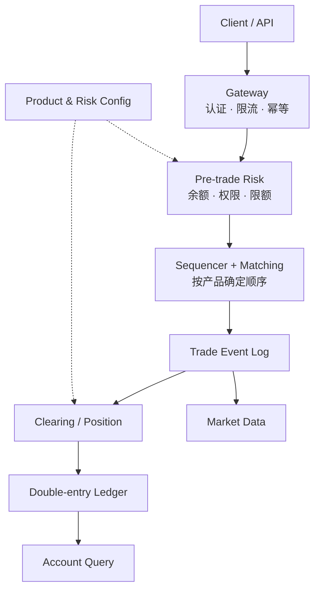
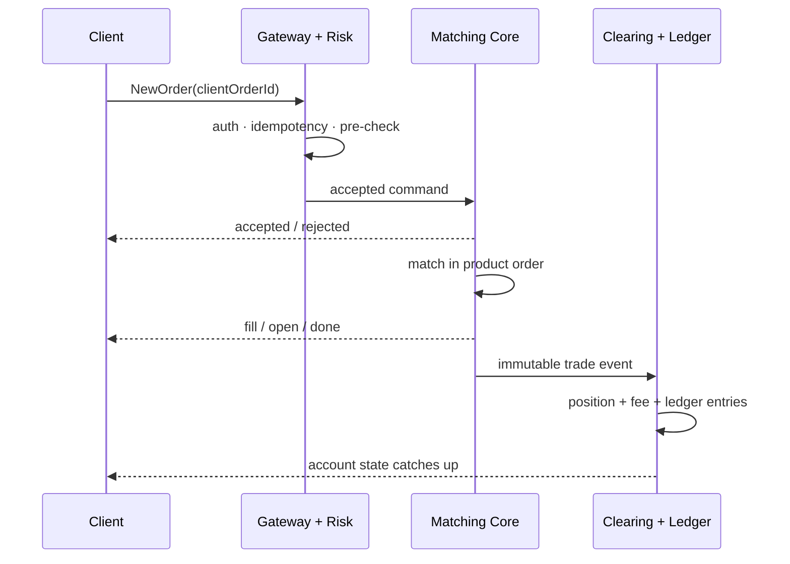
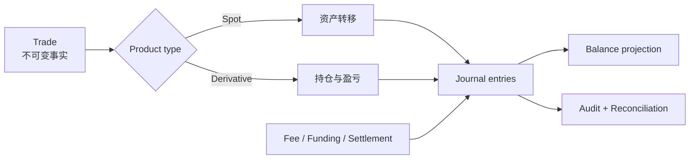

中心化交易所（CEX）不是一个“大号撮合引擎”。撮合只负责按确定规则把可成交订单配对；用户能否下单、成交后持有什么、资产如何转移，以及系统故障后如何证明余额正确，分别属于接入、风险、清算和账本领域。

本文只建立全景地图和端到端边界。下一章先把 [交易品种主数据与市场状态](/signal-grid-blog/posts/trading-instrument-master-market-state-and-rule-versioning/) 做成订单、风控、撮合、行情与清算共同消费的版本化事实；订单类型、撮合算法、保证金公式与强平流程再在后续章节展开。

> 本文讨论系统建模，不构成交易或投资建议。不同交易所、司法辖区和产品的规则并不相同；实现时应以目标平台当期公布的产品说明、API 文档和规则手册为准。

## 先把产品建模清楚

同一个交易界面背后可能是完全不同的权利、义务和结算过程。

| 产品 | 系统中的核心状态 | 成交后的结果 | 常见附加机制 |
| --- | --- | --- | --- |
| 现货 | 可用余额、冻结余额、订单 | 一种资产与另一种资产在内部账本中交换 | 充值确认、提现审核、手续费 |
| 到期期货 | 合约持仓、保证金、到期日 | 到期交割或按参考价现金结算 | 每日结算、到期结算、展期 |
| 永续合约 | 合约持仓、保证金 | 持仓没有固定到期日 | 标记价格、资金费用、强平 |

“币本位”“稳定币保证金”“组合保证金”不是换一个字段名即可完成的产品变体。它们会改变合约乘数、盈亏计价币种、抵押品规则和清算公式。产品定义应版本化，并成为订单、风险、清算和账本共同使用的唯一事实源。


图中每一层都应输出带版本的业务事件，而不是让下游猜测上游内存里的当前状态。

## 系统地图：三条平面而不是一条调用链

一个便于推理的 CEX 可以分成三条平面：

- **交易平面**：接收命令、执行交易前检查、排序并撮合；
- **清算平面**：把成交解释为资产、持仓、费用和保证金的变化；
- **控制与查询平面**：管理产品配置、权限、限额、行情和用户查询。



这是一种参考分层，不是行业统一部署图。例如 Coinbase 公布的 Exchange 组件把 REST/FIX 网关、实时风险入口、按产品保证 FIFO 的 Trade Engine 和行情分发明确分开；其他平台可能把排序与撮合合并，或把现货清算和衍生品清算拆成独立集群。可移植的是边界和不变量，不是服务数量。

## 一笔订单经历了什么

系统需要明确区分三个经常被混用的时刻：

1. **受理（accepted）**：请求通过协议和交易前检查，被纳入权威处理序列；
2. **成交（matched）**：订单与对手订单形成一个或多个 fill；
3. **结算入账（posted/settled）**：成交已转换为持仓或资产分录，并进入可恢复账本。



`accepted` 不能被描述为“已经成交”，`fill` 也不能被描述为“查询库已经更新”。在异步架构中，行情和账户查询短暂落后于撮合事件是可以定义的现象，但账本必须能够通过事件位置说明自己落后到哪里。

客户端重试同样不能依赖“HTTP 是否超时”判断订单是否存在。网关应把账户作用域内唯一的 `clientOrderId` 映射到同一业务结果；内部命令、订单、成交和账本分录则应有各自稳定的标识和因果关系。

## 撮合、清算与账本的边界

撮合核心最重要的输出不是“把两张余额表改掉”，而是一条不可歧义的成交事实，例如：

```text
Trade {
  productId, tradeId, sequence,
  makerOrderId, takerOrderId,
  price, quantity, makerSide,
  productVersion
}
```

清算根据 `productVersion` 和账户模式解释这条成交：现货产生资产转移；期货产生持仓和已实现盈亏变化；手续费、资金费用和到期结算又是不同的记账原因。账本记录原因，而不仅记录结果余额。



采用数据库事务、事件日志、outbox 或其他复制协议属于实现选择，但至少要满足：

- 一个成交只能清算一次，重复投递不会重复记账；
- 一组会计分录要么全部生效，要么全部不生效；
- 任何余额都能追溯到分录，任何分录都能追溯到业务原因；
- 撮合和清算的恢复位置可比较，不能悄悄跳过成交；
- 重新计算查询投影不会改变权威账本。

## 把系统边界固化为可验证契约

### 故障恢复时真正要证明什么

“消息放进 Kafka”本身不能证明订单不会丢。端到端正确性取决于确认点：系统在向客户端返回 `accepted` 之前，命令是否已经进入可恢复的权威序列；在返回最终账户结果之前，成交是否已经进入可恢复账本。

恢复和切换至少要检查：

- 每个产品的输入序列号是否连续；
- 订单状态机是否只允许合法转换；
- 成交事件与 Maker、Taker 两侧数量是否守恒；
- 清算消费位置是否落后，以及能否安全重放；
- 账本借贷是否平衡，资产/负债与托管侧是否可对账；
- 新 Leader 是否用 epoch 或 fencing token 阻止旧主继续写入。

这些不变量比“用了微服务、Kafka 和数据库”更接近交易系统的真实架构。

### 实现差异必须写进契约

以下内容不能从本文的参考图直接推断：

- 某平台是否允许市价单耗尽订单簿，还是使用价格保护后取消余量；
- 订单进入网关、风险和撮合的顺序保证覆盖到产品、会话还是账户；
- 衍生品采用逐笔清算、周期性结算还是两者组合；
- 资金费用的公式、时间和扣款账户；
- 现货成交何时可以提现，以及链上确认如何映射为内部可用余额；
- 账本采用何种数据库或复制协议。

例如 Coinbase 的公开系统说明指出 FIX 网关中的多个请求可能并行在途，客户端提交顺序和返回确认顺序都不一定相同，因此客户端必须使用 `ClOrdID` 关联响应；其 Trade Engine 才在产品级提供 FIFO。不要把某一层的顺序承诺扩大成全系统承诺。

这张全景图的价值，不是规定系统必须拆成多少个服务，而是让每一次确认、状态变化和资金结果都有明确负责的边界，也有能够在故障后重新证明的事实。

## 官方参考

- [Coinbase Exchange：Systems & Operations](https://docs.cdp.coinbase.com/exchange/introduction/systems-operations)——公开的网关、风险入口、Trade Engine 与行情组件边界。
- [Coinbase Exchange：Matching Engine](https://docs.cdp.coinbase.com/exchange/concepts/matching-engine)——价格时间优先、成交价和订单生命周期的具体实现。
- [Coinbase Exchange：WebSocket Channels](https://docs.cdp.coinbase.com/exchange/websocket-feed/channels)——快照、增量序列及 `received/open/match/done` 事件语义。
- [CME Group：Mark-to-Market](https://www.cmegroup.com/education/courses/introduction-to-futures/mark-to-market)——到期期货每日结算的官方入门说明。
