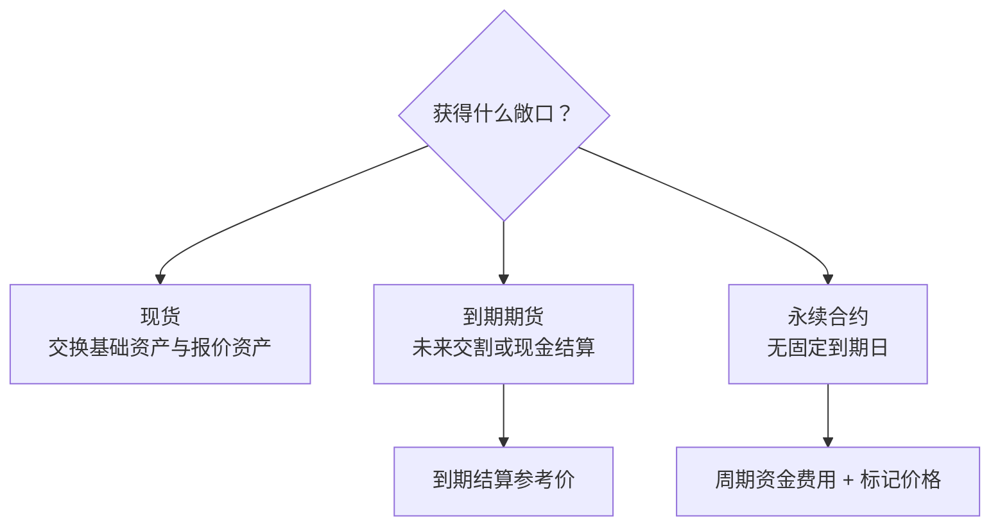
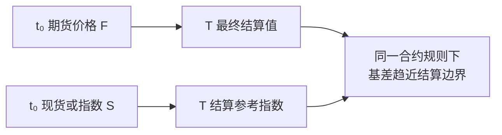
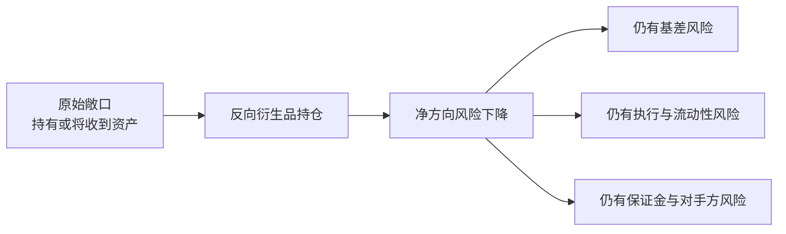

现货、期货和永续合约可以引用同一种资产，却不是同一笔生意。现货交换资产所有权；到期期货约定未来按规则交割或现金结算；永续合约没有固定到期日，通常用资金费用和标记价格让合约价格受到现货指数约束。

理解它们的关键不是背诵“做多、做空、几倍杠杆”，而是先写清楚四件事：合约单位、盈亏计价、抵押品，以及最终结算依据。

本文是交易系统学习路径的 Chapter 03。上一章 [交易品种主数据与市场状态](/signal-grid-blog/posts/trading-instrument-master-market-state-and-rule-versioning/) 已说明这些规则为什么必须绑定到稳定 instrument identity、effective time 与 rule version；这里进一步解释各产品版本实际表达的现金流。

> 本文用于解释产品与系统模型，不构成交易或投资建议。合约乘数、参考指数、资金费用、保证金和结算方式均以具体平台及合约当期规则为准。

## 三类产品对应三种现金流



| 维度 | 现货 | 到期期货 | 永续合约 |
| --- | --- | --- | --- |
| 到期日 | 无 | 有 | 无固定到期日 |
| 核心状态 | 资产余额 | 合约持仓 | 合约持仓 |
| 锚定机制 | 资产本身的交易 | 到期交割或现金结算 | 资金费用、指数与标记价格 |
| 做空来源 | 借入资产后卖出，或其他信用安排 | 建立空头合约 | 建立空头合约 |
| 主要额外现金流 | 借贷利息、交易费 | 逐日结算、到期结算、交易费 | 资金费用、交易费、强平相关费用 |

“现货只能做多”并不准确：保证金融资或借币可以形成现货空头。“期货一定交付实物”也不准确：许多金融和加密资产期货采用现金结算。例如 CME 的 BTC 期货按 CME CF Bitcoin Reference Rate 现金结算，并不交付比特币。

## 盈亏由价格与合约单位决定，杠杆不参与除法

先看报价币计价的线性合约。设：

- `q`：合约数量；
- `m`：每张合约代表的基础资产数量；
- `P_open`、`P_close`：开仓与平仓价格；
- `side`：多头为 `+1`，空头为 `-1`。

忽略费用时：

```text
PnL = side × q × m × (P_close - P_open)
```

杠杆不会把这个绝对盈亏再除一次。杠杆改变的是初始占用保证金、资本收益率和距离强平边界的缓冲，而不是固定持仓数量在相同价格变化下产生的损益。

反向合约常以基础资产计价，盈亏通常包含 `1 / price` 项；quanto 合约还可能使用不同的结算币和乘数。不能把上面的线性公式直接套到所有产品。风险与清算服务必须读取版本化的合约规格，而不是根据交易对名称猜公式。

## 基差是什么

本文明确采用：

```text
B(t, T) = F(t, T) - S(t)
```

其中 `F(t,T)` 是时刻 `t`、到期日为 `T` 的期货价格，`S(t)` 是可比较的现货或指数价格。部分市场把基差定义为 `S-F`，所以接口、报告和风控公式必须写明符号约定。

期货价格不是市场对未来现货价格的纯粹投票。融资利率、持有收益、存储或借币成本、股息、可交割品选择、市场分割和信用约束都会进入基差。一个常见的理论框架是持有成本模型，但具体资产未必满足可无摩擦复制的假设。

### 为什么到期时会收敛

对于现金结算合约，最终结算价由规则指定的参考指数或定盘价决定；对于实物交割合约，交割选择和地点质量也属于规则的一部分。因此更精确的说法是：**期货向其最终结算或可交割关系收敛**，而不是无条件向任意一家交易所的最新现货价收敛。



若到期仍存在可无成本获取的巨大价差，交割或现金结算会使一侧承担确定损失，这通常吸引基差交易并促使价格靠近。但现实中的持仓限制、融资、交易成本和结算风险会让收敛路径并不平滑。

## 永续合约没有到期，如何保持锚定

永续合约通常以现货指数为参考构造标记价格，并周期性地在多空持仓者之间转移资金费用。当合约相对指数处于溢价时，常见设计会让多头向空头支付；折价时方向可能相反，以给偏离的一侧增加持有成本。

这只是机制方向，不是跨平台通用公式：

- 资金费率可能由溢价指数、利率项、时间加权和上下限共同决定；
- 结算间隔可能按产品或市场状态变化，并不总是 8 小时；
- 线性与反向合约的名义价值和支付币种不同；
- 有的平台由用户间转移，有的平台规则可能包含额外调整。

OKX 当前公开规则就是一个具体例子：线性与币本位永续使用不同的仓位价值公式，且结算频率可在特定条件下从默认周期调整为 4、2 或 1 小时。因此系统不能把“每 8 小时、固定公式”写死在业务代码中。

## 对冲降低某类风险，不会让交易变成无风险

假设企业未来要收到某资产，担心其报价币价值下降，可以建立方向相反的期货敞口。理想化情况下，现货价值损失被期货收益部分抵消：



正确的对冲数量取决于合约乘数、报价方向、币种、到期日和风险因子。简单地“现货 1 BTC 对冲 1 张合约”只有在那一张合约的 delta 和名义价值恰好匹配时才成立。

同样，“买现货、卖期货”或“跨平台一买一卖”不应被描述成无风险套利。至少存在：

- **基差风险**：两条腿可能在退出前继续分离；
- **执行风险**：两笔订单不是原子事务，一边成交、另一边失败；
- **流动性风险**：深度不足、滑点或无法及时平仓；
- **融资与借币风险**：利率、可借数量和提前召回会变化；
- **保证金风险**：经济敞口接近中性，单个平台的账户仍可能被强平；
- **资金费用风险**：历史费率不能保证未来支付方向和幅度；
- **运营与对手方风险**：提现暂停、系统故障、托管或清算机构违约；
- **费用与税务**：交易费、结算费及税务处理可能吞掉名义价差。

特别是跨平台对冲：A 平台的现货盈利不会自动成为 B 平台衍生品账户的保证金。若没有预先分配足够抵押品或可靠的资金调度，组合层面“对冲”仍可能在单腿层面被强制平仓。

## 系统实现应保存哪些事实

产品服务至少应为每个合约版本保存：

```text
instrumentType, underlying, quoteCurrency, settlementCurrency,
contractMultiplier, linearOrInverse, expiry,
settlementIndex, marginModelVersion, fundingRuleVersion
```

清算不能只保存一个“当前仓位”。它还要区分交易成交、已实现盈亏、资金费用、手续费、每日结算和最终到期结算等变动原因。这样才能回答“余额为什么变化”，并在规则升级后重放历史，而不拿新公式改写旧交易。

## 官方参考

- [CME Group：Reconciling FX Spot Futures Prices](https://www.cmegroup.com/education/whitepapers/reconciling-fx-spot-futures-prices)——持有成本、基差及临近交割时的收敛。
- [CME Group Glossary：Basis 与 Convergence](https://www.cmegroup.com/education/glossary)——同时提醒不同市场可能采用相反的基差符号约定。
- [CME Group：What are Bitcoin Futures?](https://www.cmegroup.com/education/courses/event-contracts-underlying-markets/what-are-bitcoin-futures)——BTC 期货的现金结算与参考率。
- [OKX：Perpetual funding fee mechanism](https://www.okx.com/en-us/help/perps-funding-fee-mechanism)——一个具体平台的仓位价值、资金费用与可调整结算频率实现。
