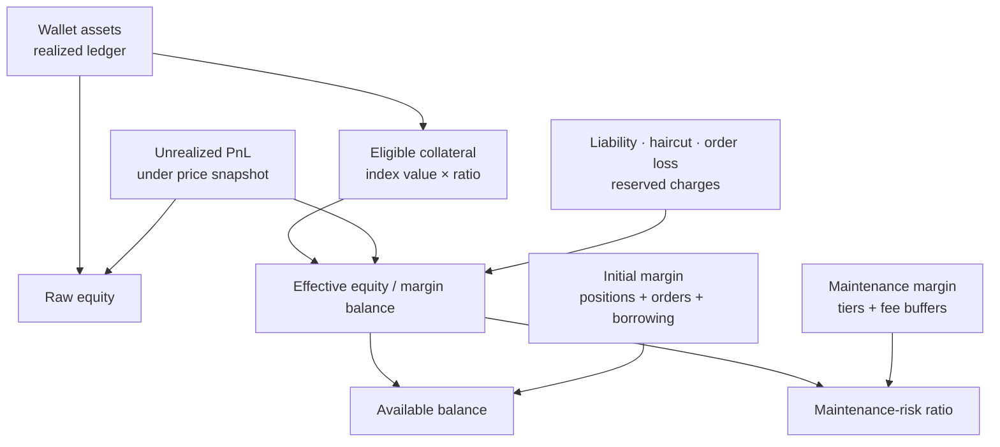
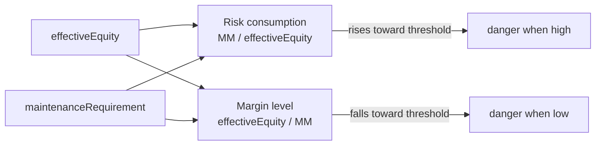
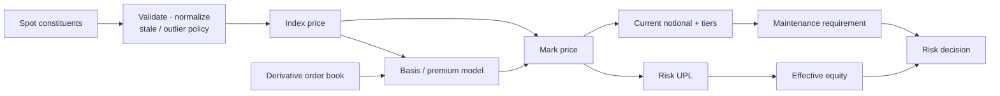
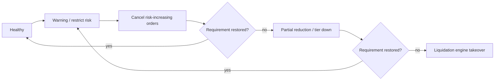

保证金风险最容易在术语层出错。同一个“保证金率”，有的平台用 `maintenance requirement / effective equity`，数值上升到 100% 触发清算；另一些资料用相反的 `effective equity / maintenance requirement`，数值下降到 100% 才触发。钱包余额、权益、保证金余额和可用保证金也不是可互换的名字。

因此，风险引擎不能先背一个公式再套所有产品。它必须先确定**账户作用域、抵押品规则、价格快照、持仓模式和比率方向**，再计算当前规则版本下的 IM、MM 与风险动作。

本文是交易系统学习路径的 Chapter 14。[Chapter 12：永续资金费用](/signal-grid-blog/posts/perpetual-funding-rate/) 会改变账户现金与风险缓冲，[Chapter 13：交易账本与双重记账](/signal-grid-blog/posts/trading-ledger-double-entry-accounting-and-reconciliation/) 已把这些现金流拆成 posted、pending 与 available 等可审计状态；这里再把账本余额和仓位估值接入同一风险快照。

> 本文讨论风险模型和实现边界，不构成交易建议。所有公式中的费率、档位、价格源和清算步骤都必须以目标平台当期规则为准。

## 任何风险数字都必须绑定同一个快照

在计算任何指标前，应把上下文写成一个版本化输入：

```text
RiskSnapshot {
  accountId,
  accountMode,
  marginMode,
  productVersions,
  collateralRuleVersion,
  positionAndOrderSequence,
  priceSnapshotId,
  calculatedAt
}
```

同一用户可能同时有 isolated position、按结算币分组的 cross margin，以及跨产品的 portfolio margin。把这些余额全部相加后再套一个公式，会破坏真实的清算边界。

至少要明确：

- 风险是按单仓位、结算币、underlying risk unit 还是全账户计算；
- 哪些资产是合格抵押品，各自 haircut / collateral ratio 是多少；
- 未实现盈亏是否、何时可以计入可开仓额度；
- 活动订单占用多少 IM，是否还产生 order loss；
- 借贷负债、利息、费用和期权价值如何进入分母；
- IM/MM 档位由入场名义还是当前 mark notional 决定。

快照还要固定金额、数量、价格和比率的精度及舍入规则。只有输入位置、价格版本、规则版本与数值口径同时可追溯，重启后的风险引擎才可能从同一输入恢复出同一判断。

## 五个常被混用的量

下面先用一个简化记号建立概念。平台字段名可能不同，不能把示例公式当作 API 标准。

### Wallet Balance

钱包余额 `B` 是已入账现金流的累计结果，例如充值、成交已实现 PnL、手续费和 funding。它通常不包含当前开放仓位随价格变化的未实现 PnL。

### Unrealized PnL

未实现盈亏 `U(P)` 是用指定参考价格 `P` 对开放仓位估值的结果。它可能按 last 显示、按 mark 进入风险，或由 UI 允许切换。

### Equity

在简单单币合约账户中，可先理解为：

```text
equity = walletBalance + unrealizedPnL
```

多资产和期权账户还会加入期权价值、负债与其他调整。重点是：如果 `equity` 已经包含未实现亏损，就不能在“保证金余额”公式里再次减去同一笔亏损。

### Margin Balance / Effective Equity

这是平台认定可以支撑风险的调整后权益。多抵押品账户常见思路是：

```text
adjustedCollateral
  = Σ(assetQuantity × assetIndexPrice × collateralRatio)

effectiveEquity
  = adjustedCollateral
  + eligibleDerivativeValue
  - liabilities
  - haircutLoss
  - orderLoss
  - reservedCharges
```

究竟哪些项已包含在 `marginBalance` 字段中要看平台定义。例如 Bybit UTA 当前将 equity、margin balance、haircut loss、order loss 分开定义，并为 cross 与 portfolio 模式给出不同分母。

### Available Balance

可用保证金回答“还能为新订单占用多少”，而不是“账户总价值是多少”。简化形式可能是：

```text
available = effectiveEquity - totalInitialMargin - frozenOrReserved
```

活动订单、借贷 IM、价格偏离造成的 order loss、手续费缓冲和风控限额都可能继续减少可用值。钱包里看到 1,000 USDT，不代表 1,000 USDT 全都能下单。



## IM 与 MM 回答不同问题

### Initial Margin

初始保证金 IM 用于限制新风险的建立。最简单的线性仓位近似为：

```text
positionIM ≈ currentNotional × initialMarginRate
```

但生产计算还可能包含开/平仓费用、活动订单、风险档位和已有对冲。IM 降低到 `notional / leverage` 只在明确的产品假设下成立。

### Maintenance Margin

维持保证金 MM 是维持既有风险所需的最低资源。常见结构是：

```text
totalMM
  = Σ(positionNotional × tierMMR)
  + orderMM
  + borrowingMM
  + liquidationOrCloseFeeBuffer
  + platformAddOns
```

“维持保证金率为 0.5%”通常表示某档位按名义价值计算 0.5% 的维持要求，不表示仓位“最多只能承受 0.5% 的价格波动”或“0.5% 的保证金损耗”。实际缓冲还取决于初始保证金、方向、价格、费用和账户中可共享的权益。

## 先写比率方向，再写 100%

两类常见展示方式互为倒数：



若平台定义：

```text
riskRatio = totalMM / effectiveEquity
```

那么比率越高越危险，达到或超过 100% 可能触发清算。若定义为：

```text
marginLevel = effectiveEquity / totalMM
```

则越低越危险，达到或低于 100% 可能触发清算。

接口、监控和文章都应同时记录 numerator、denominator、单位与 comparator。只保存字段名 `MMR=80%`，换平台后几乎必然产生歧义。

## Index、Mark 与 Last 是三种事实

### Last Price

Last 是本交易场所最近一笔成交价。它适合描述刚刚发生的交易，却可能因单笔小额成交、流动性不足或局部异常快速跳动。

### Index Price

Index 尝试表示外部现货市场中的基础资产价格。一个稳健指数通常需要：

- 明确的成分交易对和权重；
- 报价币换算；
- stale source 检测；
- outlier bounding 或剔除；
- 数据源不足时的降级规则；
- 成分与方法变更的版本记录。

指数不必然“按成交量加权”。OKX 当前公开说明通常使用指定来源的加权价格，并会排除维护或超时来源；其精确成分和算法按指数页面为准。

### Mark Price

Mark 是衍生品风险估值使用的参考价格，目标是减少单个场所短暂异常成交直接触发大规模清算的概率。它不是 index 的别名，也不等于买一卖一中间价。

OKX 当前对期货和永续的公开模型可概括为：

```text
markPrice = indexPrice + movingAverageBasis

movingAverageBasis
  = MA(contractMidPrice - indexPrice)
```

其他平台可能使用不同的 fair-basis、funding basis、边界和取中值算法。不能仅凭算法名称给交易所贴“更安全”或“更危险”的标签；需要按具体产品检验异常源、响应速度、边界和历史变更。价格源 stale、outlier 或不足时，系统也必须进入确定的降级状态，不能静默沿用旧价格继续作出权威清算决定。



Bybit 当前还明确区分 UI 默认按 last 展示的未实现 PnL 与悬停时按 mark 查看、并以 mark 参与清算判断的数值。这再次说明“未实现盈亏使用什么价格”也必须标注用途。

## 简化强平价公式只适用于窄场景

考虑一个 isolated、线性、单向 long：

- 基础数量固定为 `q`；
- 入场价为 `P0`；
- 独立保证金为 `M`；
- 维持保证金率 `m` 固定；
- 没有 funding、费用、额外保证金、活动订单和档位变化；
- 清算条件简化为 position equity 等于 maintenance margin。

则：

```text
M + q × (Pliq - P0) = q × Pliq × m

Pliq = (P0 - M / q) / (1 - m)
```

若再假设 `M = q × P0 / L`：

```text
Pliq = P0 × (1 - 1/L) / (1 - m)
```

对同样假设下的 short：

```text
Pliq = (P0 + M / q) / (1 + m)
```

这些公式用于展示变量关系，不应用来复刻任何平台的生产清算价。真实计算会加入：

- mark notional 随价格变化；
- 分档 MMR 和档位切换；
- 预计平仓费或清算费；
- funding 与已实现账本变化；
- 追加或自动追加保证金；
- 交叉抵押品价格和 haircut；
- cross/portfolio 中其他仓位、订单与期权风险。

在 cross 或 portfolio 模式下，显示的“某仓位强平价”往往只是保持其他变量不变的估算。其他资产和仓位变化后，它会立即失效。

## 风险动作通常是状态机，不是一刀切

达到风险阈值不必然意味着“所有仓位同时全部强平”。平台可能先限制新增风险、撤销占用保证金的订单，再按风险档位部分减仓，最后才接管剩余仓位。



OKX 当前公开清算说明就包含先撤活动订单、较高档位先部分减仓的路径。其他平台的先后顺序、触发阈值、清算价格和保险基金处理可能不同，所以这张图只能作为参考状态机。

每一次状态迁移都应以风险快照 ID 和动作 ID 幂等执行；服务重启后，必须能从同一 position/order sequence、price snapshot 和 rule version 恢复到相同阶段。验证时应重点覆盖边界值、档位跃迁、价格跳空、多资产联动，以及 equity、haircut、liability、order loss 和费用缓冲是否各只应用一次。UI 展示的估算值可以使用不同刷新节奏，但必须与权威 liquidation decision 明确分开。

## 结论：风险判断是绑定版本的快照决策

保证金风险不是某一个百分比，而是对明确账户作用域、账本余额、仓位与订单位置、价格快照和规则版本的一次联合判断。Equity、available balance、IM、MM 和风险比率各自回答不同问题，任何重复计入或口径混用都会改变清算边界。

风险动作也不是由一个显示价格直接触发的一刀切操作。系统必须在每一步重新计算同一个可解释约束，并把估算、权威决定和恢复位置分别记录下来。

## 官方参考

- [OKX：Mark price and Last price](https://www.okx.com/help/ii-mark-price-and-last-price)——Mark/Last 用途及 `index + moving-average basis` 模型。
- [OKX：Index Prices](https://www.okx.com/en-gb/help/i-spot-index-prices)——指数来源、异常数据与计算规则。
- [OKX：Liquidation in futures trading](https://www.okx.com/en-eu/help/frequently-issues-of-contracts-for-compulsory-liquidation)——风险比率、Mark 触发、撤单和分档减仓流程。
- [Bybit：Key Terms and Formulas in UTA](https://www.bybit.com/en/help-center/article/?id=000001912)——Equity、Margin Balance、Available Balance、IM/MM、haircut 与 order loss 的当前字段关系。
- [Bybit：FAQ — Unified Trading Account](https://www.bybit.com/en/help-center/article/?id=000001901)——MMR 方向、抵押品折价和清算边界。
- [Bybit：Margin calculation adjustment](https://www.bybit.com/en/help-center/article/Understanding-the-Adjustment-and-Impact-of-the-New-Margin-Calculation?category=cd60af6303161fd598)——证明 IM/MM 的价格基准与档位逻辑会版本化更新。
