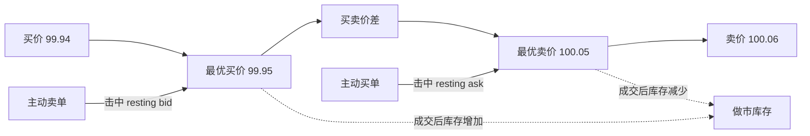
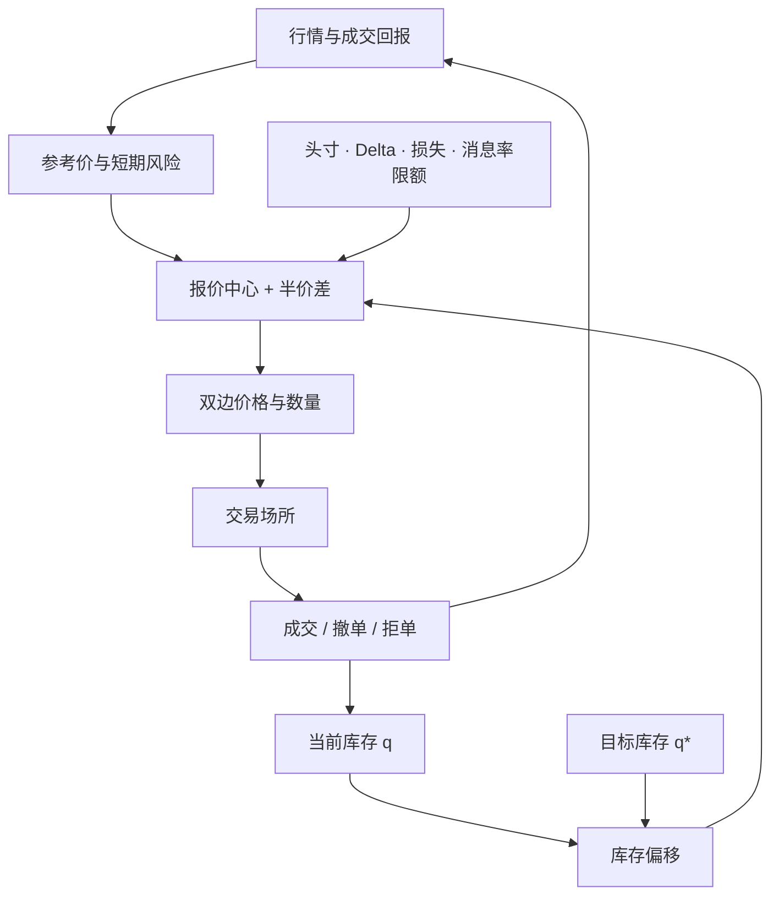
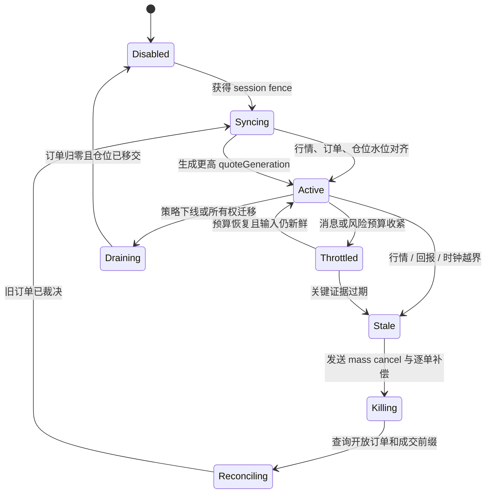
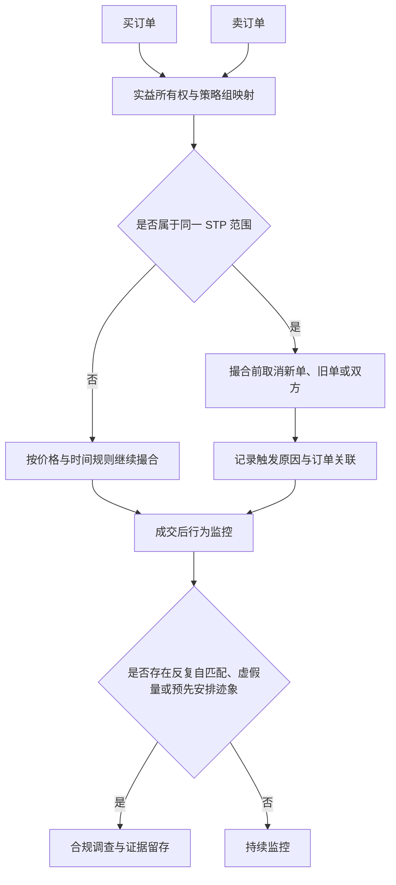

订单簿做市不是“同时挂一个买单和一个卖单，就稳定赚到中间价差”。报价成交后，做市商获得库存；在下一次对冲或反向成交前，库存会暴露在价格、基差、波动率、延迟和流动性风险中。主动吃单者还可能比报价方更早知道价格即将变化，这就是逆向选择。

所以生产做市的中心对象不是某条定价公式，而是一台有所有权、输入水位和撤改单预算的报价状态机：它持续把行情、库存和回报变成 quote intent，在证据陈旧时快速撤销风险，并把最终 PnL 分解回可验证的决策与执行事实。

本文是交易系统学习路径的 Chapter 27，也是系统综合章。它会用到 [订单簿与自成交保护](/signal-grid-blog/posts/order-book-and-self-trade-prevention/)、[行情数据管线与订单簿重建](/signal-grid-blog/posts/market-data-pipeline-and-order-book-reconstruction/)、[仓位生命周期与盈亏](/signal-grid-blog/posts/position-lifecycle-and-pnl/) 以及上一章 [智能订单路由与执行算法](/signal-grid-blog/posts/smart-order-routing-execution-algorithms/) 中的概念。

> 本文讨论市场结构、系统控制与合规边界，不构成投资、交易、收益或策略建议。任何做市安排都必须服从适用法律、交易场所规则、客户授权和内部风险限额。

## 1. 先区分“Maker 角色”和注册做市商

在连续限价订单簿中，预先挂在簿上的限价单是 resting order；后来到达并与其成交的订单是 aggressor。前者在这笔成交里扮演 maker，后者扮演 taker。这个撮合角色不等于法律或交易所规则中的“注册做市商”。

注册做市商可能承担持续双边报价、最小数量、最大报价距离或异常状态报告等义务。义务由市场和产品规则决定。普通参与者偶尔提供流动性，并不会自动获得做市商身份或同样的权利义务。



在价格—时间优先的订单簿里，成交价通常是簿上 resting order 的价格，而不是最优买卖价的中点。做市系统首先要正确维护订单状态、队列位置和成交回报，之后才能谈报价策略。

## 2. 价差是毛收入来源，不是无风险利润

一次完整的买低卖高可以获得实现价差，但真实 PnL 更接近：

```text
做市 PnL
  = 已实现价差
  + 手续费返还
  + 库存盯市盈亏
  - 交易费用
  - 逆向选择损失
  - 对冲与融资成本
  - 滑点和运行损失
```

如果买单成交后价格立刻继续下跌，账面上的半个价差可能远小于库存损失。反过来，库存也可能因价格有利变动产生收益，但那是方向暴露的结果，不能全部归因于做市能力。

报价宽度通常需要覆盖：短期波动、订单到达强度、撤改单延迟、对冲成本、手续费、库存容量以及知情交易概率。市场压力上升时扩大价差、缩小数量或暂停某些层级，是风险响应；是否允许暂停以及持续报价比例，则受做市协议约束。

## 3. 库存 skew：报价中心应朝减仓方向移动

设参考中间价为 `m`，目标库存为 `q*`，当前库存为 `q`。一个教学化的报价中心可以写成：

```text
reservationPrice = m - k × (q - q*)
bid = reservationPrice - halfSpread
ask = reservationPrice + halfSpread
```

其中 `k > 0` 表示库存惩罚强度。这个式子不是生产策略，却能清楚说明 skew 的方向：

- `q > q*`，库存偏多：报价中心下移。Bid 变低，降低继续买入的吸引力；Ask 也变低，更积极地卖出库存。
- `q < q*`，库存偏空：报价中心上移。Bid 变高，更积极地买回库存；Ask 也变高，降低继续卖出的概率。

例如中间价 100.00、半价差 0.05：中性报价是 `99.95 / 100.05`。若库存偏多使 reservation price 下移到 99.98，报价变为 `99.93 / 100.03`——两边都下移，而不是一边提高、一边降低。真实系统还会分别改变两侧数量、价差和层数。



库存控制必须使用**已确认成交后的真实仓位**，不能只根据本地挂单推测。断线重连、部分成交和重复回报都可能让本地库存漂移，所以订单、成交与仓位需要可重放的状态机。

## 4. 报价状态机把决策意图和交易所订单分开

同一个 instrument 上可以同时存在“策略想报什么”和“交易所实际上还有什么订单”。把二者压进一个 `currentQuote` 对象，会在 cancel/replace、部分成交和断线时丢失中间状态。一个 quote intent 可以建模为：

```text
QuoteIntent {
  strategyInstanceId,
  instrumentId,
  quoteGeneration,
  marketDataWatermark,
  positionSequence,
  modelVersion,
  bidLevels,
  askLevels,
  reasonCodes,
  validUntil
}
```

`quoteGeneration` 只表示策略决策代次，不等于 orderId。每一层订单仍有自己的 clientOrderId、venue orderId、cumQty、leavesQty 和状态机；旧 generation 的成交在 kill 后仍要正常进入仓位，只是不能让旧策略重新补单。



恢复到 `Active` 需要同时证明行情序列连续、私有回报无 Gap、本地开放订单与交易所一致、仓位 sequence 已包含全部成交，并持有当前 session/strategy fencing token。这个 token 只有在订单网关或 venue session authority 会拒绝旧 owner 时才有效；若 venue 不理解业务 epoch，就必须由独占凭据与连接的网关执行单写者和代际校验。网络重新连接只满足了其中一个条件。

### Cancel/Replace 预算决定系统能否在危险时刻撤掉单

报价每移动一个 tick 就全量 cancel/replace，会耗尽 venue 消息率、丢失队列位置，并可能在最需要撤单时被限流。预算模型应至少区分：

- **风险撤单预算**：为行情 stale、限额越界和 kill switch 预留，不被普通改善报价消耗；
- **策略修改预算**：由 token bucket 或滑动窗口控制，按产品、session 和账户计量；
- **in-flight 上限**：限制同时 pending cancel/replace 的订单，防止回报延迟导致命令堆积；
- **优先级**：先撤会扩大库存的一侧和离 fair value 最远的 stale level，再改善低风险层级；
- **滞回与最小变化**：只有新旧价格或数量差异超过阈值才修改，避免在边界来回抖动。

“最小挂单时间”或持续报价义务不能凌驾于风险撤单；具体义务应由市场规则配置。若 venue 共用同一个消息桶且无法保证撤单优先，系统要在发送新单时为最坏撤单路径保留容量，而不是等到预算耗尽才触发 kill。

## 5. 逆向选择解释收益，Stale Quote Kill 保护生存

当主动买方在价格即将上涨前击中 Ask，或主动卖方在价格即将下跌前击中 Bid，做市商虽然获得名义价差，却在随后价格变化中处于不利一侧。这种成交后的不利价格移动可用于衡量 adverse selection。

系统可按固定时间窗记录 markout：

```text
买入成交 markout(Δt) = referencePrice(t + Δt) - buyFillPrice
卖出成交 markout(Δt) = sellFillPrice - referencePrice(t + Δt)
```

正负号定义可以调整，但必须全系统一致，并区分 100 毫秒、1 秒、10 秒等不同时间窗。单看成交时的 spread capture，会把稍后发生的逆向选择损失藏起来。

延迟风险来自行情到达、策略计算、订单发送、撮合排队和撤单生效之间的时间差。行情陈旧时，最危险的动作往往不是“没抢到队列”，而是旧报价仍可被别人执行。

Stale Quote Kill 的触发条件应是状态机输入，而不是散落的 `if`：行情 sequence gap、市场数据年龄超过产品阈值、外部参考偏离、本地时钟不确定度过大、私有成交回报 Gap、仓位序列停滞、风控服务失联、session 被 fence 或 cancel latency 超标，任何关键条件都可以使 quote generation 失效。

触发 kill 后，系统先停止新单和 replace，再发送带 kill generation 的 mass cancel；不支持可靠 mass cancel 的场所还要逐单补偿。Fencing 只能阻止旧 owner 继续发命令，不能撤销已经 resting 在 venue 的订单。收到“cancel request accepted”不能宣告安全，只有开放订单查询、私有回报与本地订单 reducer 在同一水位收敛，才知道哪些订单已撤、哪些已经成交。超时后保持 `Reconciling` 并升级人工处置，不能因行情恢复就自动重新挂单。

## 6. Delta 为零不等于无风险，VaR 也不是最大损失

Delta 描述组合价值对标的价格小幅变化的一阶敏感度。期权组合在某一时刻 `Delta ≈ 0`，只表示局部一阶方向暴露较小，并不消除：

- Gamma：价格变化后 Delta 自身改变；
- Vega 与波动率曲面风险；
- Theta 与持有成本；
- 跳跃、基差与相关性风险；
- 离散对冲、滑点和流动性不足；
- 模型、行情、执行和操作风险。

VaR（Value at Risk）也不应定义为“一天内最大潜在损失”。它是在给定持有期、置信水平和模型假设下的损失分位数。例如“一日 99% VaR 为 100 万”表示模型估计约有 1% 的情形损失会超过 100 万，并不表示损失上限是 100 万。

因此，做市风险面板至少要同时观察：

| 指标                 | 回答的问题                         | 不能替代什么       |
| -------------------- | ---------------------------------- | ------------------ |
| 净库存与名义价值     | 当前方向敞口有多大                 | 期权非线性风险     |
| Delta / Gamma / Vega | 局部敏感度如何变化                 | 跳跃和流动性压力   |
| 实现价差与 markout   | 成交质量和逆向选择如何             | 极端尾部损失       |
| VaR                  | 模型分布下的损失分位数             | 最大损失与压力测试 |
| 压力情景             | 价格跳跃、基差和流动性枯竭下会怎样 | 日常限额与实时阻断 |

生产限额应包含硬头寸上限、单边成交速率、累计损失、行情新鲜度、订单消息率和 kill switch；VaR 只是其中一个聚合视角。

## 7. 自成交、洗售交易与交叉交易不是同义词

三个术语的交集很大，但法律和系统含义不同：

| 概念                   | 核心事实                                                             | 是否当然违法                                                     | 系统控制                                   |
| ---------------------- | -------------------------------------------------------------------- | ---------------------------------------------------------------- | ------------------------------------------ |
| 自成交 / self-match    | 同一实益所有人或同一识别组的买卖订单相互成交                         | 不应只靠一次机械匹配下结论；意图、频率与市场规则重要             | STP ID、账户所有权映射、撤单策略、监控     |
| 洗售交易 / wash trade  | 缺乏真实市场头寸或价格竞争意图，制造交易外观；常伴随实益所有权未变化 | 在适用的证券、期货和交易所规则下通常被禁止                       | 行为监控、关联账户分析、调查与审计证据     |
| 交叉交易 / cross trade | 经纪商或场所在买卖客户订单之间直接匹配                               | 不当然等于洗售；可能受定价、优先权、最佳执行、报告与授权规则约束 | 合规工作流、价格校验、客户与订单隔离、报告 |



STP 是撮合前的机械保护，不是完整的合规结论。若不同账户、不同通道或不同清算关系没有映射到共同所有权，STP 可能漏掉关联订单；反过来，独立决策者的偶发自匹配也需要结合规则和事实判断。系统必须同时保留订单意图、操作者、策略实例、所有权映射版本和成交上下文。

## 8. PnL Attribution 把策略收益和偶然方向暴露拆开

最小生产闭环至少包含：

1. **行情状态机**：从快照和增量恢复可验证的订单簿，检测序列缺口与陈旧行情；
2. **参考价模块**：组合盘口、外部参考和质量标记，不在输入缺失时静默沿用旧值；
3. **报价引擎**：计算价格、数量、层级、库存 skew 和撤改优先级；
4. **订单状态机**：以交易所回报为准处理 pending、open、partial fill、cancel 和 reject；
5. **实时风控**：在报价前和成交后检查库存、Greek、损失、消息率及信用限额；
6. **对冲执行**：把对冲成本、基差和失败状态反馈给报价，而不是假设立即无成本成交；
7. **合规监控**：STP、关联账户、异常撤单、虚假量和 cross-trade 工作流；
8. **审计与回放**：保留输入行情、模型版本、决策原因、订单因果链和人工操作。

但闭环是否赚钱，不能只看账户日终 PnL。一个可解释分解可以写成：

```text
totalPnL
  = spreadCapture
  + inventoryRevaluation
  + hedgeExecutionPnL
  + feeAndRebate
  + fundingAndBorrow
  + residual
```

`spreadCapture` 必须指定成交时参考价；`inventoryRevaluation` 必须指定持仓区间和 mark；`hedgeExecutionPnL` 要包含对冲滑点与跨场所基差；fee、rebate、funding 则来自账本事实。选择 arrival mid、短窗 mid 或模型 fair value 会改变归因，但不应改变总账 PnL。

归因本质上有路径依赖：先把一笔成交归为库存、再对冲，与直接把买卖配对成 round trip，可能得到不同的 spread/inventory 划分。因此系统要固定匹配规则和版本，并保留 `fillId → quoteGeneration → marketDataWatermark → hedgeOrderIds` 的因果链。`residual` 不是可以长期忽略的“其他”，它应被调节为：

```text
ledgerPnL - attributedPnL = residual
```

这里的 `attributedPnL` 是前五个具名分量之和，`totalPnL` 的权威值来自账本。residual 超过阈值时应阻止策略绩效结论，优先检查漏单、币种换算、费用、公司行动、舍入和时间切点。markout 是逆向选择证据，PnL Attribution 是经济结果分解，两者相关但不能互相替代。

## 9. 可验证实验必须承认队列和成交反事实

做市参数不能凭一次回测收益上线。实验首先写出可证伪主张，例如“当 inventory 超过阈值时扩大风险侧 spread，可降低尾部库存而不使有效 spread capture 恶化超过边界”，再规定处理变量、主要指标、风险护栏和停止条件。

证据分层各自回答不同问题：

| 证据           | 能证明什么                                        | 主要缺口                                   |
| -------------- | ------------------------------------------------- | ------------------------------------------ |
| 历史事件重放   | reducer、状态机和归因在相同事实下是否确定         | 新报价会改变队列和成交，不能证明策略反事实 |
| 撮合仿真       | 在明确延迟、队列与订单流模型下比较候选策略        | 模型可能低估知情流和撤单竞争               |
| 影子报价       | 用实时输入观察候选 quote intent、预算和 kill 行为 | 没有真实队列位置与成交反馈                 |
| 小流量受限实验 | 观察真实成交、markout、库存和系统延迟             | 需要严格风险上限，且市场时段不可直接互换   |

仿真不能假设“历史价格碰到我的报价就全部成交”。至少要建模前方队列、同价位撤单、部分成交、网络与撮合延迟、消息限流，以及自己的订单对市场的影响。线上比较则按市场状态、产品和时段分层，使用 fill-adjusted markout、库存分布、kill 次数、cancel latency、hedge cost 和账本 PnL，而不是只比较成交量。

系统正确性与策略效果也要分开证明：随机交错 fill/cancel/reject 后，订单与仓位 reducer 必须保持守恒；Stale Quote Kill 必须立即停止旧 generation 补单，在 venue 可达时于截止时间内完成裁决，venue 不可达时则保持 fencing、量化最坏剩余敞口且不得恢复 `Active`；PnL 分解必须与账本调节为零。只有这些不变量成立，策略收益差异才有资格被解释成实验结果。

## 10. 结论：做市赚的是受控风险后的净价差

- Maker 是一笔成交中的流动性角色，注册做市商则可能承担市场规则义务。
- 价差只是毛收入来源；库存、逆向选择、费用和对冲成本决定最终 PnL，归因结果还必须与账本调节一致。
- 库存偏多时报价中心下移，库存偏空时上移；不能用相反方向同时“吸引买卖双方”。
- `Delta = 0` 只是局部一阶中性，VaR 是给定持有期和置信水平下的分位数，都不代表无风险或最大损失。
- 自成交是机械事实，wash trade 涉及非真实交易意图，cross trade 可以是受规则约束的合法撮合；三者不能混用。
- quote intent 与 venue order 是两层状态；撤改单预算、Stale Quote Kill 和 session fencing 决定旧报价能否被及时、可证明地清除。
- 回放、仿真、影子报价和受限线上实验提供不同强度的证据，任何一个都不能单独证明完整策略反事实。

下一章进入 [市场监控与交易审计](/signal-grid-blog/posts/market-surveillance-trading-audit-alert-case-evidence/)：做市与路由系统产生订单、撤单和成交事实，监控系统只能据此生成可调查信号，不能跳过证据链直接输出法律结论。

## 官方参考

- [Coinbase Exchange：价格—时间优先、resting order 成交价与 STP](https://docs.cdp.coinbase.com/exchange/concepts/matching-engine)
- [Nasdaq Rulebook：注册股票做市商的双边报价义务](https://listingcenter.nasdaq.com/rulebook/nasdaq/rules/Nasdaq%20Equity%202)
- [CME Group：Rule 534 Wash Trade FAQ 与自成交判断](https://www.cmegroup.com/tools-information/lookups/advisories/market-regulation/CMEGroup_RA1308-5.html)
- [CME Group：Globex Self-Match Prevention FAQ](https://www.cmegroup.com/solutions/market-access/globex/trade-on-globex/faq-self-match.html)
- [SEC：Investment Company Cross Trading 的规则边界](https://www.sec.gov/newsroom/speeches-statements/investment-management-statement-investment-company-cross-trading-031121)
- [Federal Reserve：Value-at-Risk 的监管定义](https://www.federalreserve.gov/frrs/regulations/section-217202-definitions.htm)
