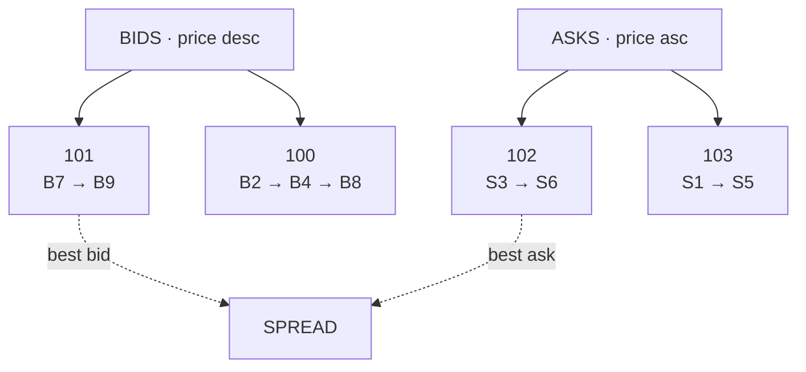
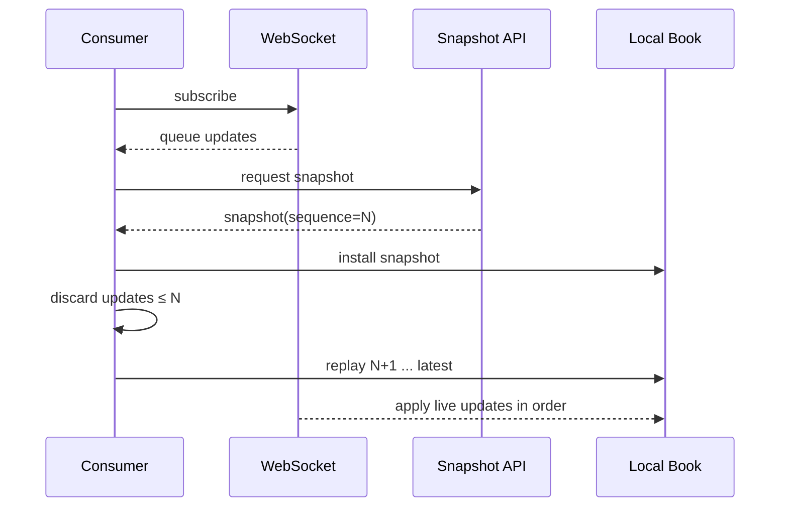
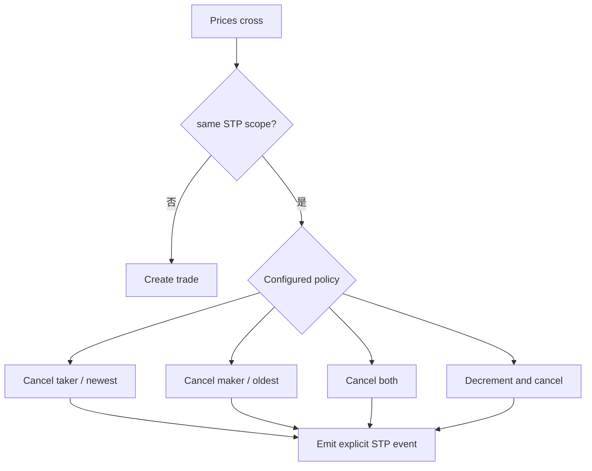

订单簿不是一张按价格排序的静态表，而是撮合引擎状态的一个索引：先找到最优价格，再在该价格内找到下一张有资格成交的订单。自成交保护（Self-Trade Prevention，STP）则在两侧订单属于同一保护范围时，阻止它们形成成交，并按预先选择的策略处理订单。

STP 是交易系统功能，不是法律结论。一次 self-match 可能来自并行策略、撤单竞争或配置错误；wash trade 则涉及虚假成交结果以及意图、明知或应知等事实判断。两者不能画等号。

> 本文用于解释系统机制，不构成交易、投资或法律建议。市场参与者应以适用法律、监管规则和交易所当期规则为准。

## 订单簿的两级索引

对于采用价格时间优先的产品，一种常见内存结构是：

- 买方价格从高到低，卖方价格从低到高；
- 每个价格对应一条同价 FIFO 队列；
- `orderId` 额外映射到队列节点，以便撤单和合法修改；
- 数量、价格都使用整数最小单位，避免浮点比较。

查找最优价可以使用有序树、跳表、价格数组或分段位图；同价队列通常要求 O(1) 头部成交与已知节点撤销。选择何种结构取决于价格范围、tick 数量、稀疏程度和快照要求，不能只看某个操作的理论复杂度。

### L1、L2 和 L3 不是三个不同订单簿

它们是同一状态的不同公开粒度：

| 粒度 | 典型内容 | 能否看到同价订单队列 |
| --- | --- | --- |
| L1 | 最优买卖价及聚合量 | 否 |
| L2 | 多个价格档位的聚合量 | 否 |
| L3 | 单笔公开订单及顺序信息 | 视平台字段而定 |

撮合引擎内部通常需要比公开 L2 更细的订单状态，但不代表所有内部字段都应该对外发布。隐藏订单、冰山单未显示量、账户标识和 STP 分组属于规则或隐私边界。

### 队列位置如何变化

新限价单不能立即完全成交时，剩余量进入对应价格队列尾部。之后可能发生：

- 对手订单到来，队首被部分或全部成交；
- 用户撤单，节点从队列中删除；
- 减少数量，平台可能允许保留优先级；
- 增加数量或修改价格，通常会失去原队列位置，但必须以 venue 规则为准；
- 冰山显示量耗尽后补充，可能重新取得时间戳，也可能采用专门优先级。

因此“改单”不能简单实现为原地覆盖。命令必须输出明确事件，例如 `ORDER_REPLACED`、`SIZE_DECREASED` 或 `PRIORITY_RESET`，行情消费者才能重建相同的公开订单簿。

### 从权威订单簿到快照与增量副本

行情连接可能在客户端取得 REST 快照期间继续收到增量。正确做法不是先下载快照、再开始订阅，而是缓存并按序衔接：

Coinbase Exchange 的官方 Full Channel 文档采用这一流程，并提醒：并非所有 `done` 或 `change` 消息都代表公开订单簿发生变化。通用实现还必须：

- 检测序列缺口、重复和乱序；
- 缺口时停止发布“完整订单簿”声明并重新同步；
- 原子替换旧快照，避免查询读到半本新簿；
- 定期用交易所快照或校验和验证本地状态。

不同平台的序列字段覆盖范围不同：可能是全连接、全市场、单产品或单频道；也可能只保证某个 WebSocket 分片内有序。消费端必须按平台契约实现，不能把一个整数序列号想象成全交易所总序。

本节只建立快照与增量的基本心智模型。完整的多平台协议差异、原子批次、Gap 恢复、checksum、断线重连和扇出背压，请继续阅读 [Chapter 07：行情数据管线与订单簿重建](/signal-grid-blog/posts/market-data-pipeline-and-order-book-reconstruction/)。

## 什么时候触发 STP

一张 incoming order 与最优 resting order 价格可成交后，撮合引擎还要判断它们是否落在同一 STP 保护范围。范围可能是用户、账户、profile、主子账户组、beneficial owner 标识或交易所注册的 SMP ID。

STP 检查发生在生成成交之前。被 STP 阻止的数量不应进入成交量、手续费、持仓或账本；订单状态与行情事件仍要明确说明取消或减少的原因。

### 常见策略不是统一标准

| 通用称呼 | 可能行为 | 需要定义的细节 |
| --- | --- | --- |
| Cancel newest / taker | 取消 incoming 剩余量 | 是整单取消还是仅阻止冲突部分 |
| Cancel oldest / maker | 删除 resting order 后继续处理 incoming | 是否继续匹配下一档 |
| Cancel both | 两侧冲突订单都取消 | 部分成交后的剩余量如何处理 |
| Decrement and cancel | 两侧按冲突量减少，并取消耗尽一侧 | 市价单按数量还是资金金额减少 |

Coinbase Exchange 当前公开了 `dc/co/cn/cb` 四种模式，并规定 taker order 上的 STP 指令优先；其 `decrement & cancel` 对以 `funds` 或 `size` 表达的市价单还有不同处理。这是一个平台的实现，不应当作通用枚举复制到所有交易所。

CME Globex 则使用注册的 SMP ID 与 Firm ID，且其官方资料将该功能描述为可选。保护标识的申请、覆盖账户和在开盘拍卖中的行为，都与 Coinbase 模型不同。

## Self-match 不等于 wash trade

需要把三个层次分开：

1. **Self-match event**：同一保护或所有权范围的买卖订单实际彼此成交；
2. **STP/SMP control**：系统在成交前识别冲突并取消或减少订单；
3. **Wash trade judgment**：依据适用规则审查交易结果、共同受益所有权，以及是否意在规避真实市场风险或价格竞争。

CME Rule 534 的公开监管通告明确区分了偶发、非故意的自成交和带有相应意图的 wash trade；但它也指出，反复发生的自成交会受到额外审查，参与者有责任采取控制措施。这说明：

- STP 触发本身不能证明用户有违法意图；
- 没有发生实际成交，也不意味着下单行为在所有规则下都一定合规；
- 未开启 STP 不会免除参与者的监控与合规义务；
- 交易所的技术字段不能替代 beneficial ownership 与跨账户监控。

系统日志应保存 STP scope、策略版本、冲突双方订单、减少或取消数量和原因码，但不要由撮合引擎输出“wash trade 已成立”这样的法律结论。合规系统可以结合账户关系、历史模式和调查证据生成告警，再由适用流程处置。

## 怎样证明订单簿与 STP 行为确定

- STP 检查先于成交事件、手续费和账本变动；
- 一次冲突只能执行一个确定策略，重放得到相同结果；
- decrement 后两侧数量非负，总减少量符合策略定义；
- 取消 maker 后，incoming 是否继续匹配下一张订单有明确规则；
- STP 事件不会被行情层误报为 trade；
- 在相同可见性口径下，L2 聚合量等于公开 L3 剩余量之和；
- 快照位置与第一条增量连续，缺口会显式失败；
- 多策略、多账户和主子账户并发场景纳入测试；
- 拍卖、连续交易和停牌阶段分别测试 STP/SMP 行为。

这些规则应绑定版本。交易所改变 STP 模式、保护范围或订单修改优先级时，历史事件仍必须按当时规则重放。

## 官方参考

- [Coinbase Exchange：Matching Engine](https://docs.cdp.coinbase.com/exchange/concepts/matching-engine)——`dc/co/cn/cb`、taker 指令优先和 price improvement 的具体规则。
- [Coinbase Exchange：WebSocket Channels](https://docs.cdp.coinbase.com/exchange/websocket-feed/channels)——L3 快照加增量的重建流程及订单事件语义。
- [Coinbase Exchange：FIX Market Data](https://docs.cdp.coinbase.com/exchange/fix-api/market-data)——L3 单订单更新及引擎确认信息。
- [CME Group：Register for Self-Match Prevention](https://www.cmegroup.com/tools-information/webhelp/fadb/Content/self-match.html)——基于 SMP ID 与 GFID 的另一种平台实现。
- [CME Group Market Regulation Advisory RA0913-5R](https://www.cmegroup.com/tools-information/lookups/advisories/market-regulation/CMEGroup_RA0913-5R.html)——Rule 534 关于共同受益所有权、意图与 wash trade 的官方说明。
