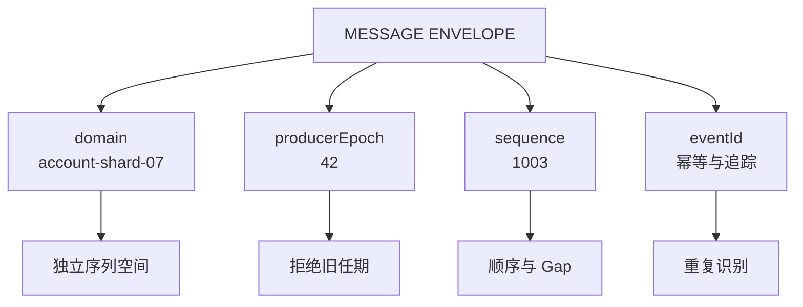
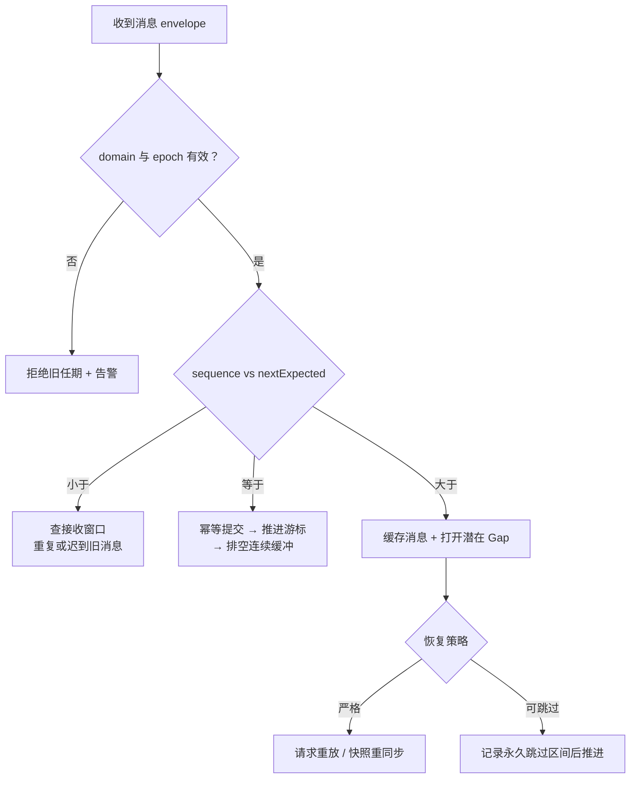
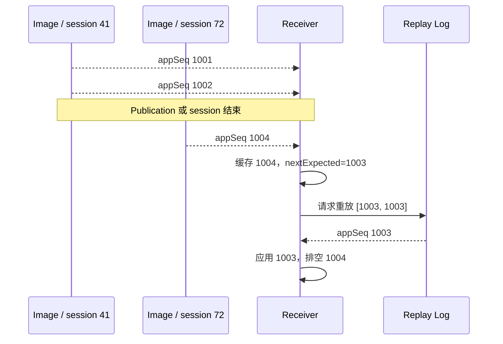
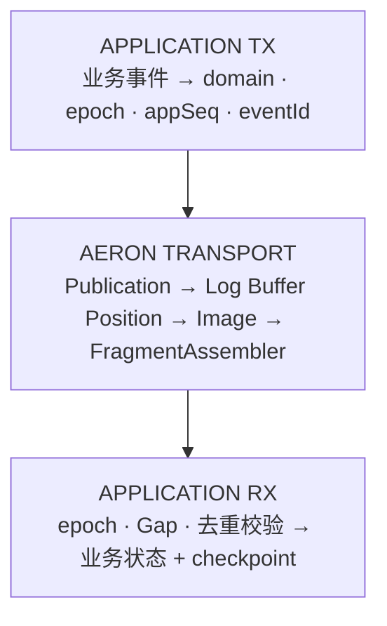
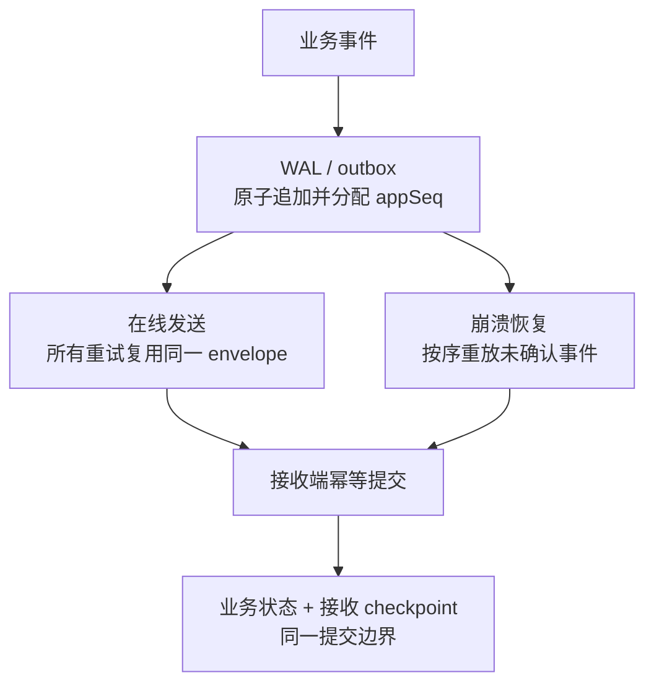

在有状态服务中，消息顺序并不是一个孤立的传输问题。主节点切换、进程重启、发送重试和并行消费，都可能让接收端遇到重复、缺口或来自旧任期的消息。

本文是“有状态系统可靠性”学习路径的 Chapter 07。建议先阅读 [Chapter 01：有状态服务的高可用架构](/signal-grid-blog/posts/high-availability-stateful-service/) 建立全景，由 [Chapter 02：WAL](/signal-grid-blog/posts/write-ahead-log-durability-and-crash-recovery/) 理解本地持久前缀，通过 [Chapter 03：分布式时间](/signal-grid-blog/posts/distributed-systems-time-clocks-ordering-and-leases/) 区分时间戳、因果顺序和权威序列，再由 [Chapter 04：Raft](/signal-grid-blog/posts/raft-consensus-leader-election-log-replication-and-safety/) 理解任期、提交与结果未知，经 [Chapter 05：ZooKeeper](/signal-grid-blog/posts/zookeeper-coordination-consistency-and-recipes/) 建立 Session、选主和 fencing 边界，并通过 [Chapter 06：Kafka](/signal-grid-blog/posts/kafka-distributed-log-kraft-consumers-and-transactions/) 理解 offset、复制和恢复位置，最后进入应用级序列号协议。

序列号能以很低的成本暴露消息流的不连续，但它不会自动提供可靠投递、恢复、幂等或 exactly-once。生产系统真正需要设计的是：**序列号属于哪个域、由哪个任期的生产者生成、发现缺口后如何恢复，以及业务状态和消费位置如何一起提交。**

## 1. 序列号能判断什么

假设接收端下一条期望消息为 `nextExpected`：

- `sequence == nextExpected`：当前消息连续，可以尝试处理。
- `sequence > nextExpected`：发现一个**潜在 Gap**。缺失范围是 `[nextExpected, sequence - 1]`。
- `sequence < nextExpected`：收到旧序列号。它可能是重复消息，也可能是第一次迟到的乱序消息；只有一个游标时无法精确区分。

“潜在 Gap”这个措辞很重要。前跳可能源于永久丢失，也可能只是允许乱序的多路入口先送到了后续消息。系统只有在恢复超时、上游确认不可重放，或业务主动选择跳过后，才能把它记为永久缺失。



### 1.1 不要只发送一个 long

生产协议通常至少需要以下字段：

| 字段 | 作用 |
| --- | --- |
| `domain` | 标识独立序列空间，例如账户分片、撮合分区或业务流 |
| `producerEpoch` | 标识生产者任期，用来 fencing 已失效的旧主节点 |
| `sequence` | 域和任期内的顺序、连续性与 Gap 范围 |
| `eventId` | 端到端幂等、审计和追踪 |
| `schemaVersion` | 支持消息格式演进 |

`sequence` 解决“位置”问题，`eventId` 解决“这是不是同一个业务事件”问题，两者不能相互替代。新任期也不能只把 `sequence` 清零；接收端必须先通过控制面确认新的 `producerEpoch` 合法，再拒绝旧任期继续写入。

### 1.2 每个 shard 独占一个序列域

最简单、也最容易验证的模型是：

1. 相同业务键总是路由到同一个 shard。
2. 每个 shard 只有一个线程负责分配序列号和发送。
3. 接收端也由单线程拥有该 shard 的 `nextExpected`、乱序窗口和业务状态。

`volatile long` 只能提供可见性，不能让“比较序列号—处理业务—推进游标”成为原子操作。如果多个线程共享同一序列域，就必须引入完整的同步、排序和提交协议，复杂度会迅速上升。

## 2. 接收端应是一台状态机

接收端不应在一个 `if/else` 里把旧消息统称为“重复或乱序”，也不应发现 Gap 后立即处理后续消息并推进游标。更安全的模型是用 `nextExpected`、有界接收窗口和恢复状态共同决策。



### 2.1 三种 Gap 策略

| 策略 | 处理方式 | 典型场景 |
| --- | --- | --- |
| 严格有序 | 缓存后续消息，恢复缺口后按序排空 | 订单、账户、风控状态变更 |
| 有限重排 | 在大小和时间均受限的窗口内等待，超限后转恢复流程 | 多路并行采集、跨链路聚合 |
| 明确跳过 | 记录丢失范围，接受后续状态，并丢弃迟到补包 | 可由新快照覆盖的行情或遥测 |

严格模式下，收到 `1004` 而期望 `1003` 时，不能先应用 `1004` 并把游标推进到 `1005`。否则后来恢复的 `1003` 只会落入“旧消息”分支，业务状态已经无法按原顺序重建。



### 2.2 一个有界接收窗口骨架

下面的代码只展示状态边界。`applyIdempotently` 还需要与业务状态和接收 checkpoint 组成原子提交，`PendingMessage` 也必须限制总数量、总字节数和最大 Gap 距离。

```java
final class ReceiveSequencer {
    private long nextExpected;
    private final NavigableMap<Long, PendingMessage> buffered = new TreeMap<>();
    private final MessageHandler handler;
    private final GapRecovery recovery;
    private final int maxBufferedMessages;

    ReceiveSequencer(
            long nextExpected,
            MessageHandler handler,
            GapRecovery recovery,
            int maxBufferedMessages) {
        this.nextExpected = nextExpected;
        this.handler = handler;
        this.recovery = recovery;
        this.maxBufferedMessages = maxBufferedMessages;
    }

    void onMessage(PendingMessage message) {
        final long sequence = message.sequence();

        if (sequence < nextExpected) {
            handler.onOldSequence(message, nextExpected);
            return;
        }

        if (sequence > nextExpected) {
            if (buffered.size() >= maxBufferedMessages) {
                recovery.requireSnapshot(nextExpected, sequence);
                return;
            }

            buffered.putIfAbsent(sequence, message);
            recovery.openGap(nextExpected, sequence - 1);
            return;
        }

        applyContiguous(message);
        while (true) {
            final PendingMessage next = buffered.remove(nextExpected);
            if (next == null) {
                break;
            }
            applyContiguous(next);
        }
    }

    private void applyContiguous(PendingMessage message) {
        // 业务处理、eventId 去重和 checkpoint 应在同一提交边界内。
        handler.applyIdempotently(message);
        nextExpected++;
    }
}
```

如果 `applyIdempotently` 失败，`nextExpected` 不得推进。若业务存储和 checkpoint 无法放进同一事务，则需要 outbox/inbox、WAL 或可重放的状态机协议来封住崩溃窗口。

## 3. Aeron Position 不是业务序列号

Aeron Transport 会把同一 Publication 对应的 Log Buffer 复制到接收端 Image。UDP 数据报可以乱序到达，但 Media Driver 会先把它们放回正确位置；只有连续位置推进后，Subscription 才会向应用交付同一 Image 中的新 fragment。

因此，同一 Image 内的网络乱序通常不会直接表现为应用先收到 `appSeq=1004`、再收到 `appSeq=1003`。应用可见的 Gap 更常出现在发送失败、进程或 session 切换、跨 Image 聚合、应用主动丢弃，或数据已经超出可恢复窗口时。



### 3.1 两种位置的边界

| 维度 | 应用序列号 | Aeron Position |
| --- | --- | --- |
| 作用域 | 由业务定义，可跨进程和 session | channel + streamId + sessionId/Image |
| 单位 | 通常是一条业务消息 | Log Buffer 中的字节位置 |
| 内容影响 | 每个事件按协议推进 | Aeron header、对齐和 padding 都会影响 |
| 生命周期 | 可由 WAL、Archive 或数据库恢复 | 跟随 Publication/Image 配置与生命周期 |
| 主要用途 | 业务连续性、重放范围、审计 | 传输进度、流控、Archive 位置 |

Position 不是简单的“第几条消息”，也不应被跨 Image 直接比较。ExclusivePublication 支持配置初始 position，这也意味着“进程重启后一定从 0 开始”并不是普遍规则。

### 3.2 大消息必须先重组

Aeron 会自动分片超过 `maxPayloadLength()` 的应用消息，但 Subscription 不会自动重组。若序列号位于应用消息头，直接把普通 `FragmentHandler` 当成整条消息处理，会把中间 fragment 的前几个字节误读为序列号。

```java
final class SequencedSubscriber {
    private static final int FRAGMENT_LIMIT = 50;

    private final Subscription subscription;
    private final FragmentAssembler assembler =
            new FragmentAssembler(this::onCompleteMessage);

    int poll() {
        return subscription.poll(assembler, FRAGMENT_LIMIT);
    }

    private void onCompleteMessage(
            DirectBuffer buffer, int offset, int length, Header aeronHeader) {
        if (length < EnvelopeCodec.HEADER_LENGTH) {
            throw new IllegalArgumentException("truncated application envelope");
        }

        final Envelope envelope = EnvelopeCodec.decode(
                buffer, offset, ByteOrder.LITTLE_ENDIAN);

        epochGate.requireCurrent(envelope.domain(), envelope.producerEpoch());

        // FragmentHandler 返回后底层 buffer 可能被复用。
        // 若消息要进入异步队列或 Gap 缓冲区，必须在这里复制所需数据。
        sequencerFor(envelope.domain()).onMessage(copyMessage(buffer, offset, length, envelope));
    }
}
```

字节序和 `schemaVersion` 应写进协议，而不是依赖机器原生字节序。若协议保证消息永远不超过 `maxPayloadLength()`，可以省掉重组复制，但必须在发送端明确校验这个约束。

## 4. 发送成功与业务成功不是一回事

`Publication.offer(...) > 0` 表示消息已经写入本地 Log Buffer，并返回新的流位置；Media Driver 随后异步发送。它不表示远端业务已经处理，更不表示业务状态已经持久化。

Aeron 的负返回值也不能被静默忽略：

- `BACK_PRESSURED`、`ADMIN_ACTION`：通常可以按策略重试。
- `NOT_CONNECTED`：是否等待订阅端取决于业务语义。
- `CLOSED`、`MAX_POSITION_EXCEEDED`：当前 Publication 无法继续发送，应停止并重建或升级恢复路径。

### 4.1 生产发送骨架

一个安全的方向是先把事件追加到持久化 outbox/WAL，由它原子分配 `sequence`；[Chapter 02](/signal-grid-blog/posts/write-ahead-log-durability-and-crash-recovery/) 解释了这里的 append、force、ACK、坏尾恢复和 outbox 幂等边界。此后所有 offer 重试和进程恢复都复用同一个 envelope。这样即使 offer 成功后、`markOffered` 前发生崩溃，重放也只是产生可被 `eventId` 和 `sequence` 识别的重复，而不会生成新编号。

```java
final class SequencedPublisher {
    private final Publication publication;
    private final DurableOutbox outbox;
    private final IdleStrategy idleStrategy;
    private final NanoClock clock;
    private final long offerTimeoutNs;

    long publish(SequenceDomain domain, UUID eventId, DirectBuffer payload) {
        // append 返回前必须保证 envelope 和 payload 已达到约定的持久化级别。
        final StoredMessage stored = outbox.append(domain, eventId, payload);
        final long deadline = clock.nanoTime() + offerTimeoutNs;
        idleStrategy.reset();

        while (true) {
            final long result = publication.offer(
                    stored.buffer(), stored.offset(), stored.length());

            if (result > 0) {
                outbox.markOffered(stored.sequence(), result);
                return stored.sequence();
            }

            if (result == Publication.CLOSED ||
                    result == Publication.MAX_POSITION_EXCEEDED) {
                throw new IllegalStateException("publication cannot continue: " + result);
            }

            if (clock.nanoTime() >= deadline) {
                throw new OfferTimeoutException(stored.sequence(), result);
            }

            if (result != Publication.BACK_PRESSURED &&
                    result != Publication.ADMIN_ACTION &&
                    result != Publication.NOT_CONNECTED) {
                throw new IllegalStateException("unknown offer result: " + result);
            }

            idleStrategy.idle();
        }
    }
}
```

这仍然只是生产实现骨架：真实系统还要定义取消、超时后的所有权、Publication 重建、进程退出、磁盘满、WAL 截断，以及 payload buffer 的生命周期。低延迟实现可以复用预分配 buffer 或评估 `tryClaim`，但不能以减少一次复制为由牺牲失败语义。

## 5. 崩溃安全的序号分配

仅每秒把“当前最大序列号”写入文件并不安全。假设已经发出 1000，但磁盘 checkpoint 仍是 990；进程崩溃后从 990 恢复，会复用 991–1000。



常见方案有：

1. **WAL/outbox 分配**：序列号和事件一起落盘，重启后重放。
2. **持久化预留号段**：先原子持久化高水位，例如预留 `[1001, 2000]`，再在内存分配；崩溃后从 2001 开始。它允许留下未使用的洞，但不会复用已经发出的编号。
3. **epoch + sequence**：每次合法主节点任期分配更大的 epoch，任期内 sequence 从约定值开始。接收端拒绝旧 epoch，切换新 epoch 时通过控制面和恢复点校准状态。

普通的 write-then-rename 只解决“看到旧文件还是新文件”的原子替换问题，不自动保证掉电持久性。[WAL 章节](/signal-grid-blog/posts/write-ahead-log-durability-and-crash-recovery/) 已展开 `FileChannel.force(...)`、目录元数据、`ATOMIC_MOVE`、坏尾和断电测试。对关键业务，优先使用已经具备 WAL 和事务语义的存储，而不是自行拼装一个 checkpoint 文件。

64 位序列号虽然很难在系统寿命内耗尽，但协议仍应声明回绕策略。要允许回绕，就必须采用明确定义的序列空间算法，而不是普通的有符号 `<` 和 `>` 比较。

## 6. Kafka offset 也不是全局业务序列

在 [Chapter 01](/signal-grid-blog/posts/high-availability-stateful-service/) 的消息驱动架构里，Kafka offset 可以作为恢复锚点；[Chapter 06](/signal-grid-blog/posts/kafka-distributed-log-kraft-consumers-and-transactions/) 已从日志压缩、事务和消费恢复的角度展开其边界。完整身份至少是 `(topic, partition, offset)`：

- offset 只在一个 partition 内标识位置，不能跨 partition 直接比较。
- Kafka 官方客户端文档明确说明 offset 不保证连续，例如日志压缩和事务控制记录都可能让 consumer position 跳跃。
- 因此不能用 `offset + 1` 是否存在来判断业务消息丢失。

如果业务需要跨 partition 的总顺序，应建立独立的 sequencer、确定性合并协议或共识日志，而不是把多个 partition 的 offset 拼成一个伪全局序列。

## 7. 监控应该围绕恢复闭环

不要直接套用一个“通用丢失率阈值”。应先按序列域和业务 SLO 观察：

| 指标 | 要回答的问题 |
| --- | --- |
| `open_gap_count`、`gap_size` | 当前有多少缺口，影响范围多大 |
| `oldest_gap_age` | 最老缺口是否已经超过恢复目标 |
| `gap_recovered_total` | 恢复机制是否真正闭环 |
| `gap_abandoned_total` | 有多少缺口被业务明确跳过 |
| `duplicate_total` | 重试或崩溃窗口是否异常扩大 |
| `stale_epoch_total` | 是否有旧主节点仍在发送 |
| `reorder_buffer_bytes` | 接收窗口是否接近内存上限 |
| `offer_back_pressure_total` | 发送端是否持续被流控 |
| `replay_failed_total` | WAL、Archive 或上游重放是否失效 |

告警条件应同时包含持续时间、流量基线、序列域重要性和自动恢复结果。例如，行情快照流允许短暂 Gap，而账户扣款流的任意未恢复 Gap 都可能需要停止该 shard。

## 8. 发布前测试清单

至少覆盖以下故障注入：

1. 正常连续消息与边界起始值。
2. 同一消息重复一次和重复多次。
3. 前跳一条、前跳多条，以及缺口最终补回。
4. 接收窗口达到消息数、字节数和超时上限。
5. 业务处理抛异常时游标不推进。
6. offer 遭遇全部负返回值和超时。
7. 大消息经过 FragmentAssembler 后只处理一次。
8. offer 成功后、outbox 标记前崩溃。
9. checkpoint/WAL 写入中途掉电。
10. 旧 leader 在新 epoch 生效后继续发送。
11. sequence 接近回绕边界。
12. Kafka 多 partition 和非连续 offset。

## 9. 结论

序列号机制最有价值的地方，不是那一次整数比较，而是把消息流的隐性错误变成可定位、可恢复、可审计的状态：

- 先定义 `domain + producerEpoch + sequence + eventId`。
- 用 `nextExpected` 和有界窗口区分连续、前跳和旧消息。
- 严格业务在 Gap 恢复前不应用后续消息。
- Aeron Position 用于传输进度，应用序列号用于业务连续性。
- 发送端从持久化日志或安全号段分配序列，所有重试复用原编号。
- 接收游标必须和业务状态处于同一提交边界。

回到 [有状态系统可靠性总览](/signal-grid-blog/posts/high-availability-stateful-service/) 看，这套协议正好连接了主从切换、快照、重放、幂等和 fencing：只有这些环节共同闭环，“发现 Gap”才会真正变成“恢复正确状态”。

## 官方参考

- [Aeron Distributed Systems Basics：Sequences](https://aeron.io/docs/distributed-systems-basics/common-techniques/)
- [Aeron Publications & Subscriptions](https://aeron.io/docs/aeron/publications-subscriptions/)
- [Aeron Log Buffers & Images](https://aeron.io/docs/aeron/log-buffers-images/)
- [Aeron Position](https://aeron.io/docs/aeron/aeron-understanding-position/)
- [Aeron Channels, Streams and Sessions](https://aeron.io/docs/aeron/aeron-channel-stream-session/)
- [Aeron Archive Overview](https://aeron.io/docs/aeron-archive/overview/)
- [Apache Kafka 4.1 KafkaConsumer：Offsets and Consumer Position](https://kafka.apache.org/41/javadoc/org/apache/kafka/clients/consumer/KafkaConsumer.html)
- [Java 24 Files API](https://docs.oracle.com/en/java/javase/24/docs/api/java.base/java/nio/file/Files.html)
- [Java 24 FileChannel API](https://docs.oracle.com/en/java/javase/24/docs/api/java.base/java/nio/channels/FileChannel.html)
- [RFC 1982：Serial Number Arithmetic](https://www.rfc-editor.org/info/rfc1982/)
