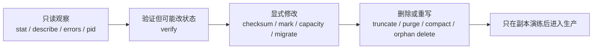
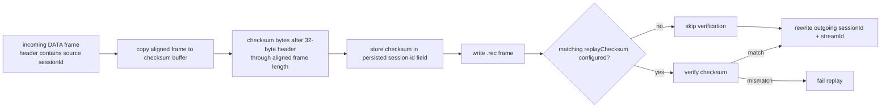
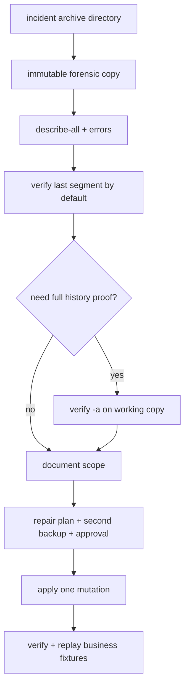
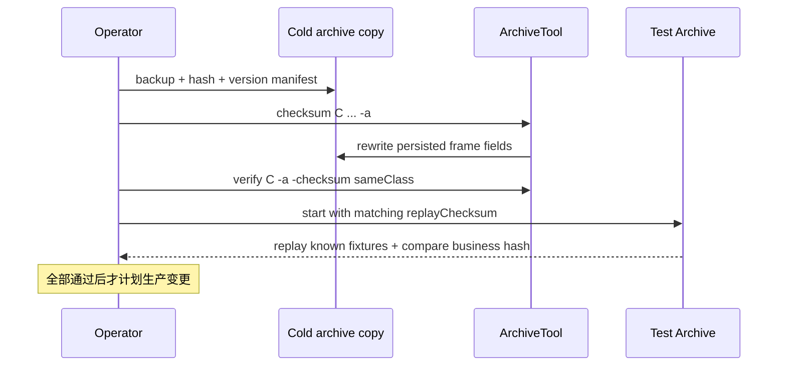
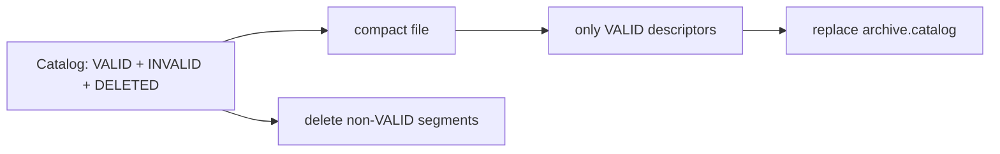
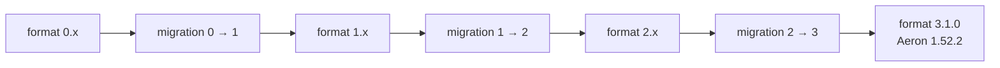
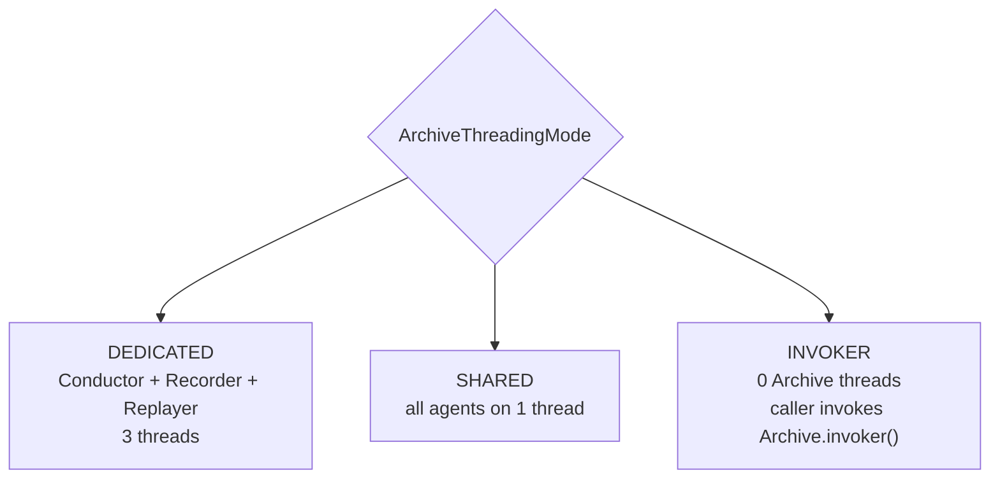
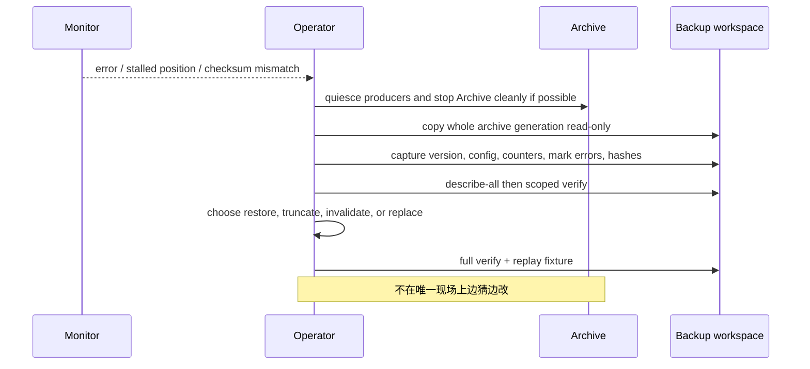

Archive 上线后，最危险的时刻往往不是正常录制，而是磁盘告警、尾部损坏、版本升级或人工清理。此时一个看似只读的 `verify` 可能把 descriptor 标成 INVALID，一次 `compact` 会永久删除所有非 VALID 项及其 segment。

运维目标不应只是“进程活着”，而是同时证明：控制循环能按时运行、Recorder 能跟上、Replayer 没有异常 I/O、Catalog 与 segment 一致、磁盘有足够余量、灾备副本覆盖恢复 checkpoint。

本文以 **Aeron 1.52.2** 为基线，给出一份可执行的监控与离线工具手册。

## 先定义不可逆操作的安全边界

### 运维动作必须先分级



建议给 runbook 的每条命令标记：

- 是否要求 Archive 停止；
- 是否写 Catalog / mark / segment；
- 是否可能截断尾部；
- 是否可回滚；
- 前置备份与审批；
- 成功后的验证动作。

不要仅按命令名判断风险。`verify` 会打开 Catalog 读写，坏项会被标记 INVALID；遇到 page-straddling 尾部还可能询问是否截断。因此对故障现场，第一步永远是保全副本。

### Checksum 改变了持久 frame 格式

Archive 支持 recording checksum 与 replay checksum：

```text
aeron.archive.record.checksum=io.aeron.archive.checksum.Crc32c
aeron.archive.replay.checksum=io.aeron.archive.checksum.Crc32c
```

也可通过 `Archive.Context.recordChecksum(...)` / `replayChecksum(...)` 配置。内置实现包括 CRC-32 与 CRC-32C。

它不是在 segment 尾部另建一份校验表，而是改写每个持久 DATA frame：



PAD frame 只保存 header，不计算同样的数据 checksum。Catalog descriptor 仍保存原 source sessionId；但 `.rec` DATA frame 的 session-id 字段已经装的是 checksum。

这有一个很实际的后果：自研离线 `.rec` reader 若不知道 checksum 配置，会把 CRC 数值误读为 source sessionId。正确 source 身份来自 Catalog，frame 校验和算法来自部署配置/descriptor 约定。

#### record 与 replay 必须一致

录制时计算 checksum，replay 时只有配置了匹配的 `replayChecksum` 才会验证，再把 replay Publication 的 sessionId / streamId 写回 outgoing frame。`replayChecksum == null` 会**跳过校验**，即使录制文件里保存了 checksum；这不是“自动识别”。只开 record 却未启用 replay 校验、配置了错误算法，或算法更换后不记录代际，都会让恢复验证失去预期语义。

自定义 `Checksum` 实现应是无状态或线程安全的，因为 Archive agents 会长期复用；更重要的是把实现 class、版本与恢复镜像一起保存。

#### Checksum 不是 durability

CRC 能发现某些位翻转或错误内容，不能让未 `force` 的页缓存跨断电，也不能抵抗恶意篡改。它还有可测的 CPU / copy 成本：Recorder 先复制到 checksum buffer，再计算并写盘；Replay 也要校验。

应在真实 MTU、消息大小、sync level、并发 recordings / replays 下测吞吐与尾延迟，而不是只跑内存 microbenchmark。

## 离线工具怎样改变持久状态

### ArchiveTool 命令地图

入口形式：

```text
ArchiveTool <archive-dir> <command> [...]
```

1.52.2 主要命令：

| 命令 | 作用 | 风险等级 |
| --- | --- | --- |
| `pid` | 读取 Archive PID | 只读 |
| `errors` | 打印 Archive 与 Media Driver distinct errors | 只读 |
| `describe` / `describe <id>` | 描述 VALID recording(s) | 只读 |
| `describe-all` | 包括非 VALID descriptor | 只读 |
| `count-entries` | 统计 VALID entries | 只读 |
| `dump [fragmentLimit]` | 描述并输出录制数据 | 只读但可能很重 |
| `capacity [bytes]` | 查询或增加 Catalog 容量 | 写元数据；只增不减 |
| `verify [id] [-a] [-checksum class]` | 校验 descriptor / segments | 可能标 INVALID、截尾 |
| `checksum class [id] [-a]` | 向现有 frames 持久化 checksum | 改写 segment |
| `mark-invalid <id>` / `mark-valid <id>` | 人工改变 descriptor state | 高风险元数据修改 |
| `delete-orphaned-segments [id]` | 删除有效范围之外的 detached files | 不可恢复 |
| `compact` | 重写 Catalog，删除非 VALID entries 与 segments | 不可恢复 |
| `migrate` | 迁移 mark、Catalog、recordings 到当前格式 | 全目录修改 |

`max-entries` 已废弃，使用 `capacity`。



### verify：默认只查最后一个 segment

```text
verify
verify <recordingId>
verify -a
verify <recordingId> -a
verify -a -checksum io.aeron.archive.checksum.Crc32c
```

默认只验证每条 recording 的最后 segment，适合启动尾部问题，但不是全历史介质巡检。`-a` 才覆盖所有 segments；`-checksum` 还会按指定算法校验每个 DATA frame。

verify 会检查 descriptor、文件存在、frame 长度 / alignment / term 结构、position 与可选 checksum。发现 faulty entry 会把它标记为 INVALID。对跨页的可疑尾 frame，命令行流程可能请求截断。

所以：

1. Archive 停止；
2. 复制完整目录；
3. 先在副本执行相同版本的工具；
4. 保存 stdout/stderr 与目录 hash；
5. 决定是否允许截断；
6. 修复后再 full verify 和 replay。

不要在仍运行的 production Archive 目录上把 verify 当 Prometheus health check。

### checksum：给旧历史就地加 CRC

```text
checksum io.aeron.archive.checksum.Crc32c
checksum io.aeron.archive.checksum.Crc32c -a
checksum io.aeron.archive.checksum.Crc32c <recordingId> -a
```

默认只处理最后 segment，`-a` 才处理全部。命令会改写 DATA frame 的 session-id 字段；执行后运行 Archive 必须配置匹配 replay checksum，离线工具也必须知道新格式。



不能一边让 Archive 写 segment，一边离线改同一文件的 checksum。算法变更也不是普通配置 reload，而是数据格式迁移项目。

### compact 与 orphan deletion

`compact` 创建临时 compact Catalog，仅复制 VALID descriptors，替换原 Catalog，并删除所有非 VALID recording 对应 segment。官方工具警告它是 non-recoverable operation。

用途是 purge / invalid 积累后回收 Catalog；它不压缩 VALID `.rec` payload，也不降低 active recording 的 segment 大小。



`delete-orphaned-segments` 删除 descriptor start / stop 有效范围之外、通常由 detach 遗留的 segment。先 `describe-all`、列目录、确认 detached 策略与冷却期；文件名“看起来旧”不是删除依据。

compact / orphan delete 前最低要求：Archive 停止、两份独立备份、恢复测试、变更窗口、明确的 recordingId 清单和空间回收预估。

### mark-valid / mark-invalid 不是修复内容

把 descriptor 标 INVALID 可以隔离坏 recording；把它重新标 VALID 只改变 Catalog state，**不会修复缺失 segment、错误 frame 或 checksum mismatch**。

正确流程是先确定故障原因并修复/恢复文件，再 verify，最后才考虑 mark-valid。否则只是让 Archive 再次相信一份未证明正确的数据。

同样，purge 在 1.52.2 实现里把 descriptor 置 DELETED；不要用 mark-valid 试图把已经删除 segment 的 recording“复活”。

### 格式迁移：二进制升级不等于目录可直接启动

1.52.2 的 Archive stored format 是 **3.1.0**。Major 改变要求迁移；当前 source 提供 0→1、1→2、2→3 的逐步迁移计划。



标准升级 runbook：

1. 阅读目标版本 release notes 与 migration code；
2. 停止新写入、stop recordings、正常关闭 Archive；
3. 记录旧版本、mark/Catalog version、目录大小与 hashes；
4. 做不可变全目录备份；
5. 在副本上运行目标 **1.52.2** `ArchiveTool migrate`；
6. full verify，并按原 checksum 算法检查；
7. 用目标二进制启动隔离实例；
8. replay 关键 recording，对比业务 message count / state hash；
9. 演练回滚必须恢复整个旧目录，不能让旧二进制打开已迁移目录；
10. 最后才在生产窗口执行。

工具本身也会警告：确认 Archive 未运行并已备份。Major 不匹配时 mark file 校验会拒绝启动；不要绕过 version check。

## 运行态怎样证明 Archive 健康

### Archive 线程模式



| 模式 | 优势 | 风险 / 适用边界 |
| --- | --- | --- |
| DEDICATED（默认） | 控制、写盘、读盘互相隔离 | 多线程与 CPU 核预算更高 |
| SHARED | 线程少、简单负载开销低 | 慢磁盘写或 replay 可拖住控制循环 |
| INVOKER | 与自定义调度整合 | 外部不 invoke 就完全停摆 |

若 Media Driver 使用 invoker，Archive Context 也必须配置 `ArchiveThreadingMode.INVOKER`。在 DEDICATED 模式下才分别应用 recorder / replayer idle strategy 与 thread factory。

线程模式不是单纯性能开关。SHARED 下一个慢 `force` 会放大控制延迟；INVOKER 下调用频率成为协议 liveness 的一部分。

### 版本化运行信号：1.52.2 Counters、阈值与告警

| Type ID | Counter | 应怎样使用 |
| ---: | --- | --- |
| 100 | recording position | 活跃 recording 绝对进度，按 archiveId / recordingId 匹配 |
| 101 | Archive error count | 单调增长即需关联 distinct error log |
| 102 | concurrent control sessions | 容量、泄漏与异常客户端峰值 |
| 103 | max Archive agent cycle time | duty cycle 尾延迟 |
| 104 | cycle threshold exceeded count | 调度 / I/O stall 次数 |
| 105 | recorder max write time | 慢盘、force 尾延迟 |
| 106 | recorder total write bytes | 录制吞吐累计 |
| 107 | recorder total write time | 计算平均写耗时，结合 max 看尾部 |
| 108 | replayer max read time | replay / replication 读尾延迟 |
| 109 | replayer total read bytes | 历史读取吞吐 |
| 110 | replayer total read time | 读 I/O 成本累计 |
| 111 | active recording sessions | 对比 configured max 20 |
| 112 | active replay sessions | 对比 configured max 20 |
| 113 | named client control session | 从 1.49 起定位具体 Archive client |
| 114 | PersistentSubscription state | 当前状态机阶段 |
| 115 | PersistentSubscription join difference | replay / live position 差 |
| 116 | PersistentSubscription live-left count | 断开 / 被流控踢出的累计次数 |
| 117 | PersistentSubscription live-joined count | 成功回到 live 的累计次数 |

注意 116 是 left、117 是 joined，不能只按数字顺序猜名字。

Type 103 / 104 也不是“每个 Archive 各一条”的全局标量。DEDICATED 模式下 conductor、recorder、replayer 会分别分配同 type ID 的 counter；采集器必须按 label 中的 `archiveId` 与 agent role 分组，不能按 type ID 覆盖成一个值。

#### 指标是采样，不是状态数据库

RecordingPos 只在 recording 活跃时存在；counter ID 也可能被回收。持久历史要查 Catalog。监控标签至少包含 archiveId、recordingId、sessionId 与 source identity，不能用“当前唯一 type 100”这种假设。

总量 counter 适合算区间速率：

```text
recorderThroughput = delta(totalWriteBytes) / delta(time)
averageWriteCost   = delta(totalWriteTime) / delta(writeOperationsOrBytes)
```

只有 bytes 与 total time 时，可算单位字节成本，但不要伪造不存在的 operation count。max counter 负责尾部，threshold exceeded count 负责频率。

#### 默认容量与阈值

1.52.2 常见默认：

| 配置 | 默认 |
| --- | ---: |
| segment file length | 128 MiB |
| file I/O max length | 1 MiB |
| low storage space threshold | 128 MiB |
| max concurrent recordings | 20 |
| max concurrent replays | 20 |
| file sync level | 0 |
| catalog file sync level | 0 |
| conductor / recorder / replayer cycle threshold | 各 100 ms |

默认是启动点，不是容量建议。20 个同步写 recordings 对普通云盘与 20 个只读 replay 对 NVMe 的表现完全不同。并发上限应结合设备 IOPS、page cache、最大 segment 预分配、复制峰值和恢复窗口压测。


low storage threshold 是拒绝新 recording 的安全边界。监控要在阈值之上再留出告警提前量，至少覆盖突发写入、一个或多个预分配 segment、detach 冷却与 operator 响应时间。

#### 推荐告警集合

**P0 / 立即处理**

- Archive error count 增长且错误为存储、Catalog、checksum、control failure；
- 磁盘 free space 接近 low-storage threshold；
- active recording 的 position 在 source 明显前进时长时间不动；
- replication destination position 低于恢复 checkpoint；
- mark file heartbeat 过期、进程与 PID 不一致；
- verify / startup 报 page-straddling 或 missing segment。

**P1 / 容量或退化**

- recording / replay sessions 接近 20 或自定义上限；
- cycle threshold exceeded 在短窗持续增长；
- recorder max write / replayer max read 超过 SLO；
- control sessions 异常上升或长期不释放；
- PersistentSubscription live-left 增长、长时间 replaying；
- replication lag 的秒数估算越过 RPO 预算。

告警必须带 runbook 链接和 archiveId。单独看到一个 `rec-pos` 数字，operator 无法判断是哪条业务流。

#### 官方观测工具怎样组合

- `AeronStat`：查看 counters 与 labels；
- `BacklogStat`：观察 publisher / sender / receiver / subscriber 的 position 差；
- `LossStat`：查看 Aeron UDP loss observations；
- `ErrorStat`：读取 distinct error log；
- `ArchiveTool errors`：打印 Archive 与 Media Driver errors；
- Aeron Agent：按事件类型追踪 driver / archive / cluster 事件。

`LossStat` 没有条目只说明 Aeron 没观察到网络丢包事件，不证明业务没有缺消息，也不证明 recording 已 durable。

1.52.2 使用独立 `-javaagent:aeron-agent-...jar` 方式启用 Aeron Agent；Archive 事件通过 `aeron.event.archive.log` 选择。`all` 会非常详细，应限制时间、文件与事件集合。1.52.0 已增加 event log 文件长度 / rotation 支持，仍要防止故障时日志反过来打满磁盘。

## 事故与升级怎样收敛为可验证结果

### 事故 Runbook：从“不要继续写”到恢复证据



一个推荐决策顺序：

1. 能从健康 replica 恢复，就优先替换而不是手修唯一副本；
2. 只有尾部未确认且业务 checkpoint 更早，才评估截尾；
3. 缺历史影响审计或状态重建时，停止自动 retention；
4. mark-invalid 用于隔离，mark-valid 必须有内容修复证据；
5. compact 永远放在恢复确认之后，不在事故取证阶段执行。

### 发布升级的进入条件与退出证据

#### 进入条件

- Aeron binary 与 stored format 版本是否记录？
- release notes 是否涉及 Archive protocol、Catalog、checksum、truncate 或 counters？
- 完整冷备是否可恢复？
- migration 是否在生产数据副本跑通？
- rollback 是恢复旧目录，不是让旧进程打开新格式吗？

#### 退出证据

- mark heartbeat、Archive errors、control sessions 正常吗？
- 每条关键 recording 的 position 是否前进？
- 有限 replay 的消息数 / state hash 是否一致？
- replication signals 与 lag 是否恢复？
- PersistentSubscription 是否能 live → replay → live 演练？

任一进入条件没有证据时不得开始原地迁移；任一退出证据失败时停止继续清理旧目录，并以整代备份恢复或回到隔离诊断。升级完成的定义是历史可验证、关键 replay 可解释且复制链重新达到预算，不是新进程成功打印启动日志。

## 结论：Archive 运维必须先保全、再验证、最后删除

Archive 运维的核心纪律是：**先保全整代目录，再验证；先理解命令是否写状态，再执行；先用 replay 证明业务可读，再删除历史。**

Checksum 会改写持久 DATA frame 的 session-id 字段；verify 并非绝对只读；compact 永久移除非 VALID 历史；migration 必须以完整冷备和恢复测试为前提。生产健康也不能只看 PID，要把 counters、agent cycle、I/O 尾延迟、position lag、磁盘余量与灾备 checkpoint 放在同一张图上。

至此，Archive 五篇完成了组件主线：录制身份与生命周期、磁盘与持久性、历史到实时消费、跨主机复制与恢复，以及生产运维。它们都围绕同一原则：把 position 当事实坐标，把异步终态与业务承诺分开。

下一篇进入 [Aeron 可恢复服务实战](/signal-grid-blog/posts/aeron-recoverable-service-request-response-archive-checkpoint-catchup/)：把 Request/Response、Archive 录制、业务 Checkpoint、重启 replay、追到 live 和请求去重放进同一个故障模型，回答“没有 Cluster 时，怎样把这些能力组合成可恢复服务”。

## 官方资料与版本基线

- [Aeron Archive Tooling](https://aeron.io/docs/aeron-archive/aeron-archive-tooling/)
- [Aeron Monitoring and Debugging Wiki](https://github.com/aeron-io/aeron/wiki/Monitoring-and-Debugging)
- [Aeron Thread Utilisation Wiki](https://github.com/aeron-io/aeron/wiki/Thread-Utilisation)
- [Aeron Configuration Options Wiki](https://github.com/aeron-io/aeron/wiki/Configuration-Options)
- [Aeron Cookbook：Aeron Tools](https://aeron.io/docs/cookbook-content/aeron-tools/)
- [Aeron Cookbook：LossStat](https://aeron.io/docs/cookbook-content/aeron-loss-stat/)
- [Aeron 1.52.2：ArchiveTool.java](https://github.com/aeron-io/aeron/blob/1.52.2/aeron-archive/src/main/java/io/aeron/archive/ArchiveTool.java)
- [Aeron 1.52.2：RecordingWriter.java](https://github.com/aeron-io/aeron/blob/1.52.2/aeron-archive/src/main/java/io/aeron/archive/RecordingWriter.java)
- [Aeron 1.52.2：ReplaySession.java](https://github.com/aeron-io/aeron/blob/1.52.2/aeron-archive/src/main/java/io/aeron/archive/ReplaySession.java)
- [Aeron 1.52.2：ArchiveMarkFile.java](https://github.com/aeron-io/aeron/blob/1.52.2/aeron-archive/src/main/java/io/aeron/archive/ArchiveMarkFile.java)
- [Aeron 1.52.2：AeronCounters.java](https://github.com/aeron-io/aeron/blob/1.52.2/aeron-client/src/main/java/io/aeron/AeronCounters.java)
- [Aeron 1.52.2 Javadoc](https://javadoc.io/doc/io.aeron/aeron-all/1.52.2/index.html)
