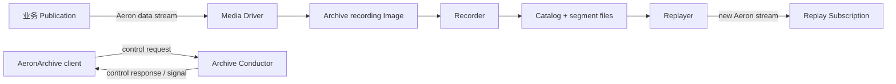
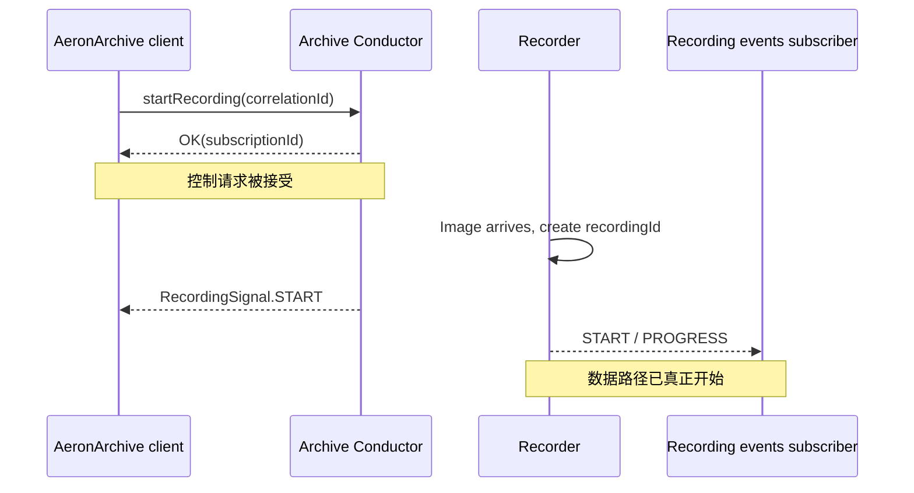
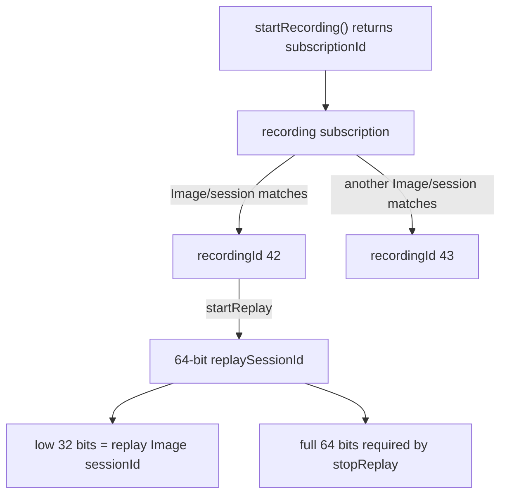
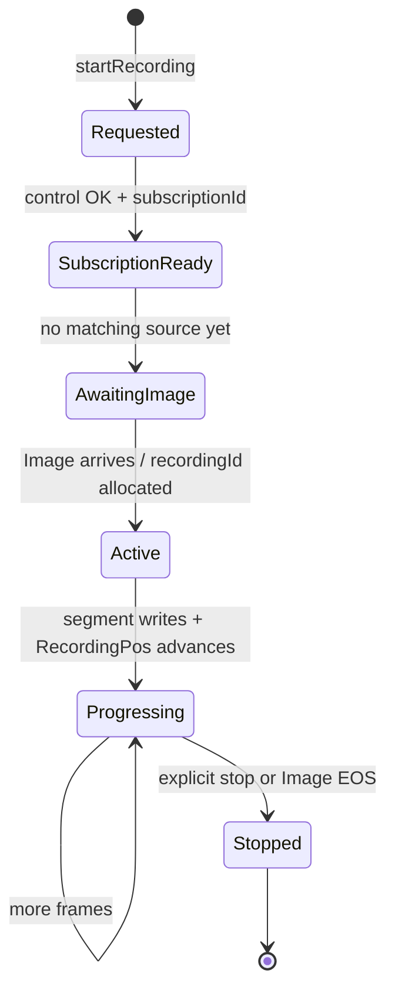
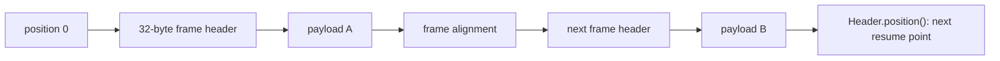
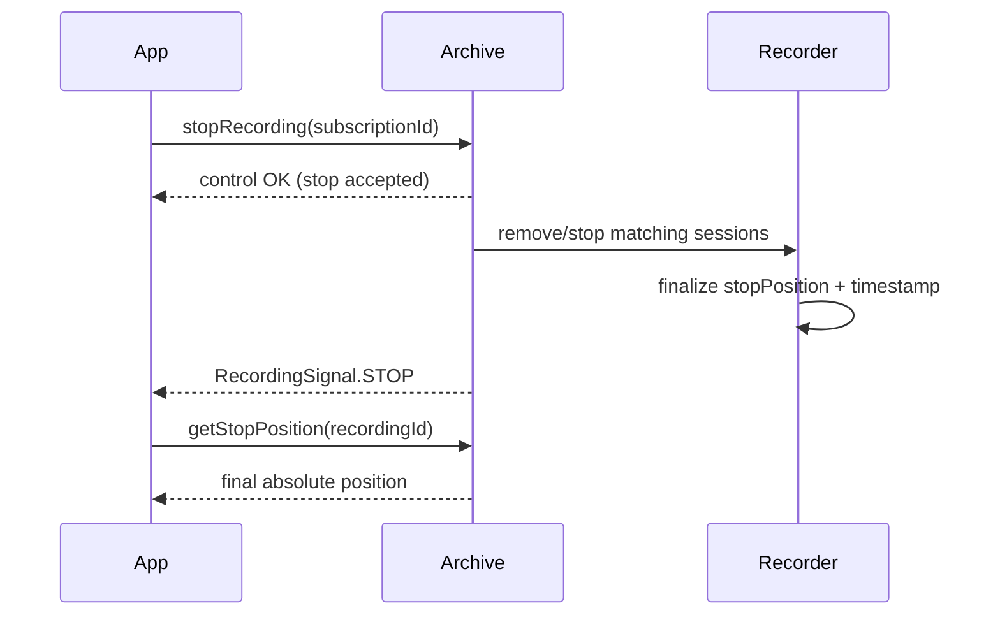
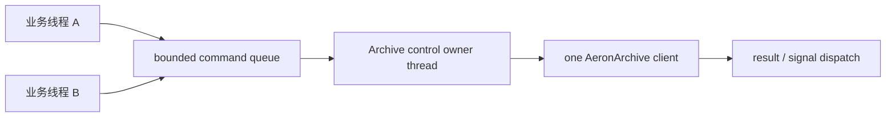

Aeron Transport 解决的是“现在怎样把帧送过去”；Aeron Archive 解决的是另一件事：**把某条 Aeron stream 已经出现过的帧保存下来，并在以后从精确位置重新发成一条 Aeron stream。**

这句话有三个边界。

1. Archive 保存的是 Aeron 帧，不是任意对象数据库，也不是通用文件备份；
2. Archive 的录制、重放仍通过 Aeron channel / stream / session 工作；
3. “请求已接受”“帧已写入页缓存”“断电后仍可恢复”“业务已处理”是四个不同的完成点。

本文以 **Aeron 1.52.2** 为基线。先建立 Archive 的坐标系和生命周期；磁盘格式、Replay、Replication 与运维分别留给后续章节。

## 1. Archive 在系统里增加了什么

一个最小 Archive 系统至少有三类角色：发布业务流的应用、Media Driver，以及 Archive 进程中的 Recorder / Replayer。应用侧的 `AeronArchive` 不是存储引擎，它是控制客户端。



Recorder 订阅目标 stream，并把收到的帧复制到 segment 文件；Replayer 从文件读取帧，再建立 Publication 发给订阅者。控制客户端只负责发命令、等应答、收事件。

因此下面两种理解都不准确：

- “Archive 嵌在 Publication 后面，发布一次就同步落盘”；
- “读取 Archive 等于随机读取一个日志文件”。

录制和重放都有独立的 Aeron 数据路径，也都有连接建立、流控、线程调度和超时。

## 2. 四条通信路径必须分别配置

一次完整交互不是只有一个 `controlChannel`。逻辑上至少有四条路径：

| 路径 | 方向 | 承载内容 | 常见配置点 |
| --- | --- | --- | --- |
| 控制请求 | Client → Archive | start / stop / list / replay 等命令 | control request channel + stream |
| 控制响应 | Archive → Client | correlation result、错误、signals | control response channel + stream |
| 录制事件 | Archive → observers | recording start / progress / stop | recording events channel + stream |
| Replay 数据 | Archive → consumer | 从文件重建的 Aeron 数据流 | replay channel + stream |



跨主机时要逐条检查 URI：控制请求能到 Archive，控制响应能回 Client，Replay Publication 能到目标 Subscription。`aeron:ipc` 只在共享同一个 Media Driver 的进程之间成立；把远端 replay channel 配成 IPC 不会神奇地穿过网络。

录制事件若要动态增加多个观察者，应使用适合的 MDC 或 multicast 设计，而不是假设一个静态 unicast channel 会自动广播。

## 3. 先分清六种 ID

Archive API 中最危险的错误，通常不是算法，而是把一个 `long` 当成了另一个 `long`。

| 名称 | 由谁创建 | 生命周期 | 用在哪里 |
| --- | --- | --- | --- |
| `registrationId` / recording subscription ID | Aeron Subscription | 录制订阅存在期间 | `startRecording` 的返回值；`stopRecording(subscriptionId)` |
| `recordingId` | Archive Catalog | 跨重启持久存在 | 查询、replay、extend、truncate、purge |
| source `sessionId` | Aeron Publication / Image | 一次传输会话 | 精确匹配某个 source Image |
| `controlSessionId` | Archive connect | 一次控制连接 | 关联客户端会话、超时与授权 |
| `correlationId` | Client Aeron | 一次请求 | 请求与响应配对 |
| `replaySessionId` | Archive | 一次 replay | 停止 replay；低 32 位才是 replay Image session ID |



最需要纠正的一句旧笔记是：

> `startRecording(...)` 返回的不是 `recordingId`，而是 Archive 创建的 recording Subscription 的 `registrationId`。

一个不带 `session-id` 的 recording subscription 可以先后匹配多个 Image；每个 Image 都会得到独立 `recordingId`。所以它们本来就不可能是同一个值。

### 3.1 怎样从 subscription 找到 recordingId

控制应答返回 subscription ID 后，真正的 Image 可能还没出现。生产代码应等待 `RecordingSignal.START`，或在 counters 中找到匹配的 `RecordingPos`：

```java
final long recordingSubscriptionId = archive.startRecording(
    recordingChannel,
    streamId,
    SourceLocation.LOCAL,
    true);

// 返回只代表 recording subscription 已创建。
// recordingId 要从 START signal、recording events 或 RecordingPos counter 获得。
```

如果 Publication 还没连接，立即调用 `listRecordings` 并假定最后一个就是自己的 recording，会产生竞态。并发启动多个录制时，这种“取最大 ID”尤其危险。

## 4. Channel、stream 与 session 怎样决定录谁

Archive 的 recording subscription 仍遵守 Aeron 的匹配规则。

### 4.1 wildcard 与 session-specific

不带 `session-id` 的 channel 相当于“录制这个 channel / stream 上匹配的每个 Image”。后来的新 session 也可能被录下，并形成新的 recording。

带 `session-id` 则只匹配一个具体 Publication 会话。对账、状态机输入、基准测试通常更适合 session-specific 录制，因为归属更明确。

还有一个容易制造双份数据的组合：

1. 已有一个不带 session 的 recording subscription；
2. 又为同一个 Publication 建了带 session 的 recording subscription；
3. 两个 subscription 都匹配这个 Image；
4. Archive 于是建立两个 recording。

这不是去重失败，而是两次明确订阅。

### 4.2 LOCAL 与 REMOTE 不是“机器距离”标签

`SourceLocation.LOCAL` 对 UDP channel 使用 spy subscription，从同一 Media Driver 的网络 Publication 本地旁路读取；`REMOTE` 使用普通 Subscription。IPC 不需要 spy 前缀。

```java
try (ExclusivePublication publication =
         archive.addRecordedExclusivePublication(channel, streamId))
{
    // helper 会创建 publication，并按它的 sessionId 建立本地录制。
    // 只有返回后才持有 publication；仍需等待连接和 RecordingPos。
}
```

`addRecordedPublication` / `addRecordedExclusivePublication` 是便捷 API：它们先创建 Publication，再为其 session-specific channel 启动录制。前者只接受该 channel / stream 的第一个 original Publication；想明确单写者语义，通常直接选 ExclusivePublication。

### 4.3 spy 连接语义

本地 UDP Publication 只有 spy 而没有网络订阅者时，是否视为 connected 取决于 Media Driver 的 `spiesSimulateConnection`。示例常设置为 `true`，这是拓扑选择，不是 Archive 的持久化保证。

IPC Publication 被 Archive 的 IPC Subscription 匹配后即可连接，不受这个 UDP spy 选项控制。

## 5. 一次录制从请求到真正写入

把启动过程拆成状态机，就不会把控制成功当成录制成功。



重要完成点如下：

1. `startRecording` 返回：控制命令成功，recording subscription 已创建；
2. START signal / `RecordingPos` 出现：匹配 Image 已创建 recording；
3. `RecordingPos` 达到目标：Recorder 已处理到该绝对位置；
4. stop position 写入 Catalog：该 recording 已停止；
5. 文件系统在故障后可恢复：取决于 sync 策略、硬件与操作系统，不等于第 3 点；
6. 业务消费者持久化 checkpoint：这是应用自己的边界。

### 5.1 autoStop 的真实含义

`autoStop=true` 时，匹配 Image 到 EOS 或关闭后，Archive 不但停止 recording，还移除对应 recording subscription。因此这个订阅不会等下一次同 channel / stream 的 session。

`autoStop=false` 时，Image 结束只停止当前 recording；subscription 可以保留，等待下一 Image，并为它创建新的 recordingId。

所以 autoStop 不是“异常时帮我停止”，而是决定 subscription 是否跨 Image 存活。

## 6. Position 是字节坐标，不是消息序号

Aeron position 是 stream 中的绝对字节位置，包含 frame header、对齐和 padding。它不是 payload 字节累计，也不是“第 N 条消息”。



`Header.position()` 表示当前消息/片段处理之后的下一位置。若业务已经安全处理到 header position `1280`，恢复 replay 应从 `1280` 开始，而不是从这条消息的起点再读一次。

消息可能被 Aeron 分片。直接处理 fragments 时，checkpoint 必须服从 fragment 边界和业务原子性；使用 assembler 后，也要理解回调给出的 assembled header 语义。不能用业务 payload 长度自己推算下一个 position。

## 7. 用 RecordingPos 观察主动录制

`RecordingPos` 是 Aeron counters 中的 Archive recording position，counter type ID 为 `100`，标签通常以 `rec-pos` 开头。key 中包含 recordingId、source sessionId、source identity 与 archiveId。

它只在 recording 活跃时存在：停止后 counter 会消失或被回收。因此不能把 counter 当长期 Catalog。

常用查询语义：

| API | 活跃 recording | 已停止 recording |
| --- | --- | --- |
| `getRecordingPosition(id)` | 当前位置 | `NULL_POSITION` (`-1`) |
| `getStartPosition(id)` | 起点 | 起点 |
| `getStopPosition(id)` | `NULL_POSITION` | 最终 stop position |
| `getMaxRecordedPosition(id)` | 当前位置 | stop position |

`getMaxRecordedPosition` 很适合“不关心当前是否活跃，只要最新可读上界”的控制逻辑。它从 1.44.0 起可用；跨 Archive 共用 counters 时，还应使用带 archiveId 的 `RecordingPos.findCounterIdByRecording(...)` 变体，避免命中别的 Archive。

### 7.1 RecordingPos 到底证明了什么

Recorder 完成 block write 后才推进 counter；如果 `fileSyncLevel > 0`，相应 `force(...)` 发生在 position 更新前。但默认 sync level 为 0，此时 position 只说明数据已复制到操作系统页缓存附近的边界，**不说明掉电后一定存在于稳定介质**。

这条区别会在下一章详细展开。应用若用 RecordingPos 决定向上游确认，必须先写出自己的故障模型：只防进程崩溃，还是也防主机断电、控制器缓存丢失和存储损坏。

## 8. 停止录制：停止哪个对象

同一 API 提供多种停止方式，因为调用者掌握的身份不同：

```java
archive.stopRecording(recordingSubscriptionId);
archive.stopRecording(channel, streamId);
archive.stopRecording(publication);

final boolean stopped = archive.tryStopRecordingByIdentity(recordingId);
```

`stopRecording(long)` 接收的是 `startRecording` 返回的 subscription ID，不是 recordingId。若你只有持久化的 recordingId，使用 `tryStopRecordingByIdentity`。

`tryStop...` 适合幂等关闭：目标不存在或已停止时返回 false，而不是把正常竞态升级成故障。停止仍是控制操作；确认终态应观察 STOP signal、stop position 或 catalog descriptor。



## 9. Catalog 查询不是“数组下标分页”

Archive 提供：

- `listRecording(recordingId, consumer)`：精确描述一条；
- `listRecordings(fromRecordingId, count, consumer)`：从下界向后列出；
- `listRecordingsForUri(...)`：按 stream 与 channel 片段匹配；
- `findLastMatchingRecording(...)`：反向找最近匹配；
- `listRecordingSubscriptions(...)`：列出当前主动 recording subscriptions。

`fromRecordingId` 应当作为 **ID 下界游标**。正确翻页方式是记录本页最后实际返回的 recordingId，再从 `lastId + 1` 继续；不要假设下一页永远是 `from + pageSize`。删除、无效项与 compact 会让“连续数组下标”的心智模型失效。

```java
long cursor = 0;
while (true)
{
    final MutableLong lastSeen = new MutableLong(Aeron.NULL_VALUE);
    final int found = archive.listRecordings(cursor, 100,
        (controlSessionId, correlationId, recordingId,
         startTimestamp, stopTimestamp, startPosition, stopPosition,
         initialTermId, segmentFileLength, termBufferLength, mtuLength,
         sessionId, streamId, strippedChannel, originalChannel, sourceIdentity) ->
            lastSeen.set(recordingId));

    if (0 == found)
    {
        break;
    }
    cursor = lastSeen.get() + 1;
}
```

Listing consumer 在 `AeronArchive` 的同步调用内部执行。**不要从 consumer 回调重入同一个 `AeronArchive` 实例。** 先收集必要字段，退出回调后再发下一条控制请求。

## 10. Client 的线程与存活约束

`AeronArchive` 默认用 `ReentrantLock`，因此公开调用可由多线程串行进入；这不意味着所有组合都适合任意并发，也不允许回调重入。只有确定单线程所有权时才可配置 `NoOpLock`。

更稳健的生产模型是：



这样 correlation、signals、超时与关闭都在单一 owner 上推进。`AeronArchive.asyncConnect()` 只把**建连阶段**变成可轮询，并不把后续所有高层 API 变成异步 future。

客户端连接有 `CONNECTED`、`DISCONNECTED`、`CLOSED` 等状态。一旦确认连接丢失，可依赖的恢复路径是关闭旧实例并新建连接，不要继续复用一个已断开的控制会话。

从 1.47.0 起，Archive 会检查控制会话活性。Archive 会经 control-response Publication 发出 `PING`；如果响应 Publication 长时间无法发送，达到连接超时后会关闭该会话。它不是“客户端定时主动 ping Archive”的模型。控制 owner 必须持续推进响应流和连接维护，把客户端扔进一个永远不运行的线程并不等于“长连接已保活”。

从 1.49.0 起，命名 Archive client 会得到 type ID `113` 的 per-client control-session counter，有助于把一个控制会话对应到具体服务实例。

## 11. 最小可用的录制闭环

下面不是可直接复制的完整服务，而是一条正确的控制顺序：

```java
final AeronArchive.Context archiveCtx = new AeronArchive.Context()
    .controlRequestChannel("aeron:udp?endpoint=archive:8010")
    .controlResponseChannel("aeron:udp?endpoint=client:0");

try (AeronArchive archive = AeronArchive.connect(archiveCtx))
{
    final String recordedChannel =
        "aeron:udp?endpoint=239.20.0.1:40456|interface=10.0.0.0/24|session-id=777";

    final long subscriptionId = archive.startRecording(
        recordedChannel, 1001, SourceLocation.REMOTE, true);

    // 1. 保留 subscriptionId，用于提前停止。
    // 2. 通过 signal/events/counter 得到 recordingId。
    // 3. 等 RecordingPos 达到应用定义的安全位置。
    // 4. 停止后确认 stopPosition，再进入 replay/retention 流程。
}
```

Context 在没有传入现成 `Aeron` 时会自己创建并拥有它；传入共享实例时，所有权与关闭顺序必须显式设计。不要让 Archive client 关闭仍被业务 Publication 使用的 Aeron client。

## 12. 生产前的录制审查表

### 身份与匹配

- 是否把 `startRecording` 返回值命名成 `recordingSubscriptionId`？
- recordingId 从哪个确定事件获得？
- channel 是否需要锁定 `session-id`？
- 是否存在 wildcard 与 session-specific 双重匹配？
- LOCAL spy 与 REMOTE Subscription 是否符合实际拓扑？

### 完成与持久性

- 控制 OK、START、RecordingPos、STOP、业务 checkpoint 分别由谁确认？
- sync level 为 0 时，系统承诺是否只覆盖进程崩溃？
- stop 后是否持久化 recordingId、start/stop position 与业务 schema 版本？

### 线程与运维

- 谁独占或串行化 `AeronArchive` client？
- callbacks 是否避免重入？
- 是否持续消费 control signals / errors？
- 是否监控 RecordingPos 停滞、Archive error counter 与磁盘余量？

## 13. 本章结论

Archive 的核心不是“把 UDP 包写进文件”，而是建立三个可连接的坐标系：

1. **传输坐标**：channel、streamId、source sessionId；
2. **控制坐标**：controlSessionId、correlationId、subscriptionId；
3. **历史坐标**：recordingId 与绝对 position。

只有把三者分开，才能正确回答“录的是谁”“命令完成到哪一步”“故障后从哪里继续”。下一章进入磁盘：Catalog 如何描述 recording，segment 文件为什么预分配，以及 position 推进究竟跨过了怎样的持久性边界。

## 官方资料与版本基线

- [Aeron Archive Overview](https://aeron.io/docs/aeron-archive/overview/)
- [Aeron Archive Basic Sample](https://aeron.io/docs/aeron-archive/basic-sample/)
- [Working with Recordings](https://aeron.io/docs/aeron-archive/working-with-recordings/)
- [Aeron Archive Wiki](https://github.com/aeron-io/aeron/wiki/Aeron-Archive)
- [Aeron Cookbook：Archive 实践入口](https://aeron.io/docs/cookbook/aeron/)
- [Aeron 1.52.2：AeronArchive.java](https://github.com/aeron-io/aeron/blob/1.52.2/aeron-archive/src/main/java/io/aeron/archive/client/AeronArchive.java)
- [Aeron 1.52.2：RecordingPos.java](https://github.com/aeron-io/aeron/blob/1.52.2/aeron-archive/src/main/java/io/aeron/archive/status/RecordingPos.java)
- [Aeron 1.52.2：Archive.java](https://github.com/aeron-io/aeron/blob/1.52.2/aeron-archive/src/main/java/io/aeron/archive/Archive.java)
- [Aeron 1.52.2 Javadoc](https://javadoc.io/doc/io.aeron/aeron-all/1.52.2/index.html)
