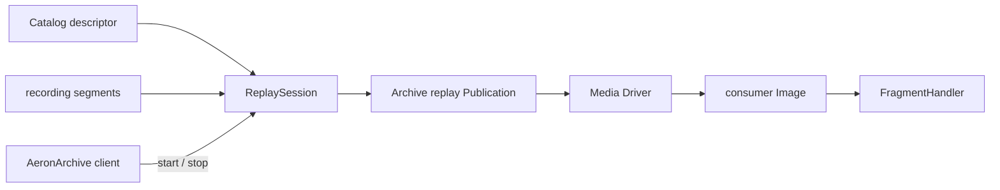
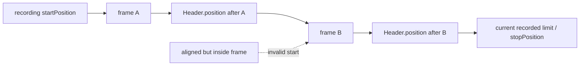
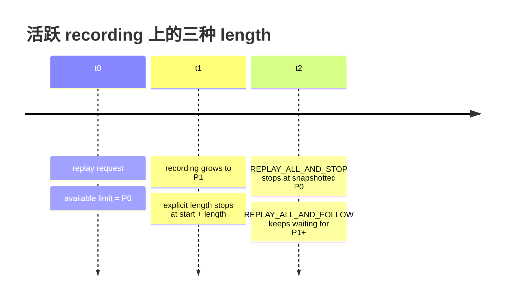
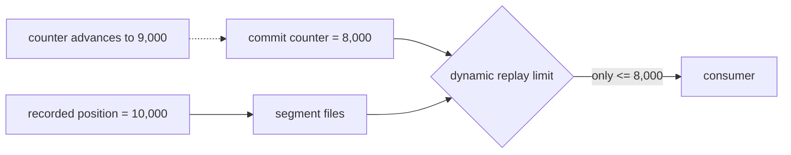
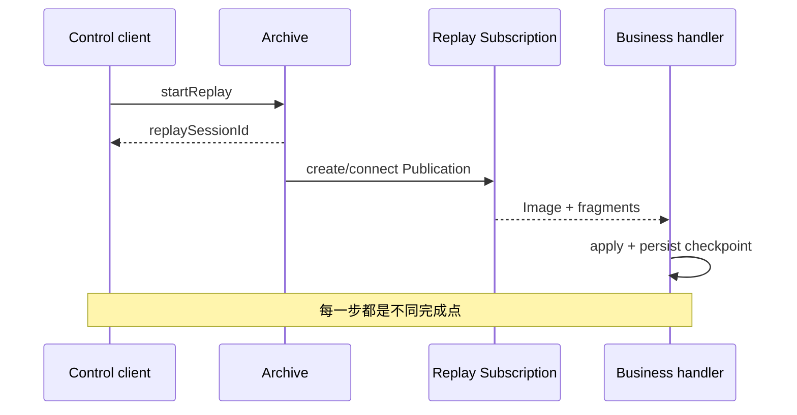
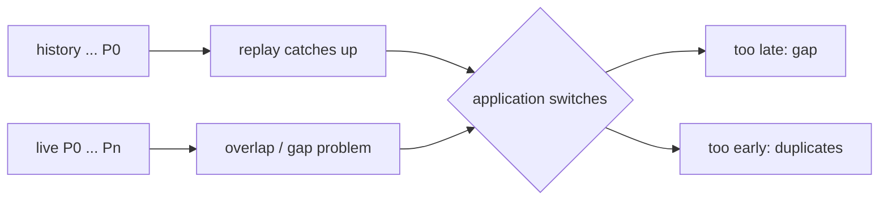
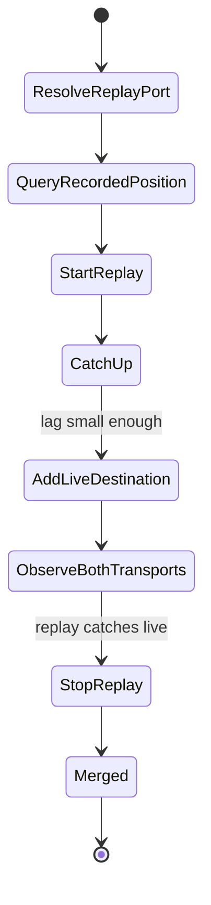
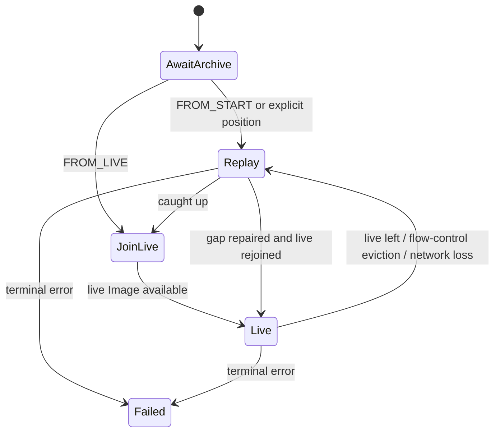
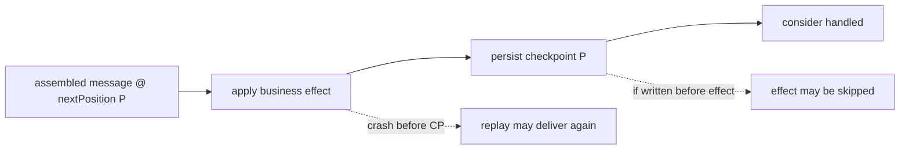

Archive 的 replay 不是“打开文件并回调每条消息”。它让 Archive 成为一个 Publication：从 segment 读取 frame，按照指定 position 和 length 建立一条新的 Aeron stream，消费者仍用 Subscription / Image 接收。

这一层抽象带来两个好处：历史和实时复用同一传输语义；远端消费者也可以重放。代价是 replay 同样需要连接、流控、轮询与停止，而且 position 必须严格落在 Aeron frame 边界。

本文以 **Aeron 1.52.2** 为基线，依次讨论有限重放、follow、动态边界、ReplayMerge，以及 1.51.0 新增的 `PersistentSubscription`。

## 1. Replay 是一条新 Aeron stream



因此 replay 设计要分别回答：

1. 从哪个 `recordingId` 读？
2. 从哪个绝对 position 起？
3. 最多读多少字节，或跟到哪里？
4. Archive 把 replay Publication 发往哪个 channel / stream？
5. 谁创建匹配 Subscription，怎样关联 Image？
6. 谁持续 poll，谁负责 stop / close？

远端 replay 必须用可达的 UDP channel。只有目标进程与 Archive 共用同一个 Media Driver 时，`aeron:ipc` 才能成立。

## 2. Position 的合法范围

`AeronArchive.NULL_POSITION` 是 `-1`，作为 replay 起点表示“从 recording 当前 start position 开始”。显式 position 则必须满足：

- 不小于当前 recording start position；
- 对停止的 recording，不应越过 stop position；
- 32-byte frame aligned；
- 落在真实 fragment 边界；
- 与期望的消息恢复语义一致。



最安全的恢复点是业务在处理完成后持久化的 `Header.position()`。它代表下一条可读位置。不要用 payload 长度累加 position，也不要把消息序号传给 replay API。

分片消息需要更谨慎：若业务只在完整 assembled message 后提交 checkpoint，就要使用与 assembler 语义一致的 header position；如果直接消费 fragments，则 checkpoint 和副作用也必须按 fragment 模型设计。

## 3. Length 的三种模式

Replay 的 `length` 单位也是 Aeron position-space 字节，不是消息条数。

| 值 | 常量 | 语义 |
| ---: | --- | --- |
| 正整数 | — | 最多 replay 指定字节范围 |
| `-1` | `REPLAY_ALL_AND_FOLLOW` / `NULL_LENGTH` | 读完现有内容后继续跟随活跃 recording |
| `-2` | `REPLAY_ALL_AND_STOP` | 在请求时拍下当前可用上界，读到那里后停止 |
| `Long.MAX_VALUE` | — | 也可表达 follow live |

`REPLAY_ALL_AND_STOP` 是 1.49.0 加入的重要边界。它与先调用 `getMaxRecordedPosition` 再传 `limit - start` 不完全相同：前者由 Archive 在处理 replay 请求时确定可用上界，少一次客户端观察窗口。



follow replay 不会因为“暂时追到头”自动结束。必须由 recording 停止、显式长度到达、连接故障或客户端 `stopReplay` 结束。

## 4. 正确建立一个普通 replay

低层 `startReplay` 返回 64-bit replay session ID：

```java
try (Subscription subscription = aeron.addSubscription(replayChannel, replayStreamId))
{
    final long replaySessionId = archive.startReplay(
        recordingId,
        resumePosition,
        AeronArchive.REPLAY_ALL_AND_STOP,
        replayChannel,
        replayStreamId);

    final int replayImageSessionId = (int)replaySessionId;

    // 等待 subscription.imageBySessionId(replayImageSessionId)，然后持续 poll。
    // 停止时必须保留完整 64 bit：
    archive.stopReplay(replaySessionId);
}
```

低 32 位与接收端 `Image.sessionId()` 对应，便于在同 channel / stream 上找到正确 Image；`stopReplay` 要完整 64 位，不能把强转后的 int 再传回去。

`archive.replay(...)` 便捷方法可以创建并返回 Subscription。无论哪种方式，Replay Publication 都需要等目标 Subscription 连接；目标永远不出现时，Archive 会在超时后报告错误。

### 4.1 不要把 live 和 replay 随意塞进一个拥塞域

若不是专门做 merge，建议 replay 使用独立 channel / stream。历史追赶会以尽可能快的速度发送，和低延迟 live 共用 endpoint、receiver window 或消费循环，可能让补历史影响实时流。

## 5. ReplayParams：把高级参数集中起来

`ReplayParams` 可表达：

- position；
- length；
- bounding limit counter ID；
- request-level file I/O max length；
- replay token；
- response-channel 模式下的 subscription registration ID。

```java
final ReplayParams params = new ReplayParams()
    .position(resumePosition)
    .length(AeronArchive.REPLAY_ALL_AND_STOP)
    .fileIoMaxLength(256 * 1024);

final long replaySessionId = archive.startReplay(
    recordingId,
    replayChannel,
    replayStreamId,
    params);
```

这个对象不是线程安全 builder；调用返回后才能安全复用。把一个可变 `ReplayParams` 共享给并发请求，会把 position、counter 和 token 串台。

`fileIoMaxLength` 只是一次 replay 文件读取工作的最大块；它不能突破 Archive Context 上限，也不改变 recording segment 布局。

## 6. Bounded Replay：上界随 counter 移动

普通 explicit length 是静态范围。Bounded Replay 则把可发送上界绑定到一个 Aeron counter：

```java
final long replaySessionId = archive.startBoundedReplay(
    recordingId,
    startPosition,
    AeronArchive.REPLAY_ALL_AND_FOLLOW,
    commitPositionCounterId,
    replayChannel,
    replayStreamId);
```



典型用途是复制状态机：Archive 已录到 10,000，但 consensus commit counter 只到 8,000，客户端只能看到已提交部分。counter 推进后，replay 上界随之推进。

这不是“启动时复制 counter 值”的有限 replay。要管理 counter 的所有权和关闭顺序；边界 counter 被关闭时，ReplaySession 会按实现终止/收尾，不能假设它仍永久停在最后观测值。

## 7. Replay 的异步终态

`startReplay` 的同步返回表示 Archive 接受并创建了 replay session，不表示：

- replay Publication 已连接；
- consumer 已拿到 Image；
- 历史已经发送完；
- consumer 已处理完；
- 业务 checkpoint 已提交。



有限 replay 的业务完成，应由消费者观察 Image EOS / position 到达预期 limit，并完成自己的 handler drain 与 checkpoint；不能以 control response 为准。

## 8. 从 replay 追到 live 为什么难

最粗糙做法是：先 replay 到某个 position，关闭它，再订阅 live。切换窗口中 live 仍增长，于是可能丢数据；先订阅 live 再 replay，又会收到重叠区间，需要去重、缓存与排序。



Aeron 提供两套解决思路：传统 `ReplayMerge` 在一个 manual MDC Subscription 内切换 destination；新 `PersistentSubscription` 把“live 离开就 replay、追上再回 live”封装成持久订阅状态机。

## 9. ReplayMerge：同一个 Subscription 内换数据源

ReplayMerge 要求 UDP Subscription 使用 `control-mode=manual`。它先把 replay destination 加入 Subscription，让 replay Image 追赶；接近 live 时加入 live destination；确认已经追上且存在两个 active transports 后，停止并移除 replay destination，保留 live。



1.52.2 中尝试加入 live 的 lag 阈值取 `min(termBufferLength / 4, 32 MiB)`。只有 replay 真正追上，并且 Subscription 观察到至少两个 active transports，才移除 replay；这减少切换缝隙。

Replay URI 会使用 `linger=0`、`eos=false` 等适合切换的参数。merge 完成后关闭 `ReplayMerge`，它会清理 replay destination，但故意保留 live destination；随后继续 poll 原 Subscription / Image。

### 9.1 ReplayMerge 的硬约束

- **只支持 UDP，不支持 IPC**；
- Subscription 必须 manual MDC；
- `ReplayMerge` 不是线程安全对象；
- duty cycle 必须持续调用 `poll()` 或 `doWork()`；
- 不要与业务共享同一个 `AeronArchive` client，因为它直接轮询 control responses；
- 默认 progress timeout 约 5 秒，拓扑和 idle strategy 必须能及时推进。

这不是“两条 stream 在应用层 dedupe”。merge 的关键价值，是让 replay 与 live 进入同一个 Subscription / Image position space 后完成 destination 切换。

## 10. PersistentSubscription：历史与实时的长期状态机

`PersistentSubscription` 在 **Aeron 1.51.0** 引入。它面向“live Publication 同时被 Archive 录制，订阅者希望有序无缺口消费；live 中断时自动从 recording 补齐，恢复后再回 live”的场景。

与 ReplayMerge 相比：

| 能力 | ReplayMerge | PersistentSubscription |
| --- | --- | --- |
| 一次历史追 live | 是 | 是 |
| live 离开后自动 fallback replay | 否 | 是 |
| IPC / spy live channel | 否，仅 UDP | 支持 |
| 内部完整消息重组 | 交给调用方 | 是 |
| 长期状态与观测 counters | 有限 | 专门提供 |
| log buffers | 通常 1 组 merge | 通常同时需要 2 组，内存更高 |

新项目需要持续断线恢复时，通常优先评估 PersistentSubscription；已有稳定 ReplayMerge 系统无需仅为“新”而盲目替换。

## 11. 创建 PersistentSubscription

```java
final PersistentSubscription.Context ctx = new PersistentSubscription.Context()
    .aeron(aeronArchive.context().aeron())
    .aeronArchiveContext(archiveContext.clone())
    .recordingId(recordingId)
    .startPosition(PersistentSubscription.FROM_START)
    .liveChannel(liveChannel)
    .liveStreamId(liveStreamId)
    .replayChannel(replayChannel)
    .replayStreamId(replayStreamId)
    .listener(listener);

try (PersistentSubscription subscription = PersistentSubscription.create(ctx))
{
    while (running)
    {
        final int workCount = subscription.poll(handler, 20);
        if (subscription.hasFailed())
        {
            throw new IllegalStateException(
                "persistent subscription failed", subscription.failureReason());
        }
        idleStrategy.idle(workCount);
    }
}
```

起点可选：

- `FROM_START` (`-1`)：从 recording 当前起点补全部历史；
- `FROM_LIVE` (`-2`)：不要求旧历史，先接 live；
- 显式 position：从业务 checkpoint 继续。

对象不是线程安全的，必须由一个 duty-cycle owner 持续 `poll` 或 `controlledPoll`。它内部也用异步 Archive 控制状态机；不 poll 就不会建连、replay 或切流。

### 11.1 不要再包 FragmentAssembler

PersistentSubscription 内部已经重组 fragments，handler 收到的是完整 assembled message。再套 `FragmentAssembler` 会重复处理协议边界。`controlledPoll` 返回的 `Action` 也作用于完整消息，而不是原始 fragment。

## 12. PersistentSubscription 的运行状态

它会：等待 Archive 连接、查询 descriptor、发 replay、建立 replay Image、追赶、尝试 live、在 live 与 replay 间切换。瞬时网络问题可被状态机重试；终态错误则进入 failed，需要调用方关闭并重新初始化。



应用应同时使用：

- `isLive()` / `isReplaying()`；
- `hasFailed()` / `failureReason()`；
- listener 的 `onLiveJoined`、`onLiveLeft`、`onError`；
- Aeron counters type `114–117`：state、join difference、live-left count、live-joined count。

“暂时 replaying”不是故障；“hasFailed=true”才是需要重建的终态。listener 的 error 也不应只打印一次后继续假装健康。

## 13. 有序无缺口不等于业务 exactly-once

PersistentSubscription 的目标是 transport / recording position 上有序无缺口地交付。当业务 handler 成功后进程崩溃、但 checkpoint 尚未持久化，重启仍可能重放最后消息；若先写 checkpoint 再做不可回滚副作用，则可能跳过副作用。



可选策略包括幂等业务键、状态与 checkpoint 同事务、outbox / inbox、或由单写状态机按 position 去重。Archive 提供确定的恢复坐标，不替应用提交跨系统事务。

## 14. 怎样选择四种读取方式

| 需求 | 建议 |
| --- | --- |
| 导出一段已经停止的历史 | explicit position + length |
| 读取请求时已有全部内容，然后结束 | `REPLAY_ALL_AND_STOP` |
| 跟随活跃 recording，不需要原 live stream | `REPLAY_ALL_AND_FOLLOW` |
| 只读到动态 commit position | bounded replay |
| 一次从历史平滑切入 UDP live | ReplayMerge |
| 长期消费，live 断线自动回放补齐 | PersistentSubscription |

不要因为 PersistentSubscription 能 fallback，就把 replay 和 live channel 配成同一个未隔离的拥塞域；也不要在只需离线导出的场景引入复杂 merge 状态机。

## 15. 上线前的 Replay 审查表

### 边界

- start position 是否来自可靠的 header / descriptor / checkpoint？
- length 是字节范围、snapshot-and-stop 还是 follow？
- consumer 如何判断有限 replay 业务完成？
- replaySessionId 是否完整保留为 long？

### 连接与线程

- replay channel 对目标主机可达吗？
- 谁创建匹配 Subscription，谁处理连接超时？
- duty cycle 在 idle 时仍会持续推进吗？
- ReplayMerge 是否独占自己的 Archive client？

### 恢复

- PersistentSubscription terminal failure 如何重建？
- checkpoint 与业务副作用怎样原子化或幂等？
- recording retention 是否可能删除最慢消费者所需历史？
- live left / replaying 是否进入指标与告警？

## 16. 本章结论

Replay 的本质是“把历史重新发布成 Aeron stream”。正确使用它，需要同时守住 position 边界、length 语义、控制终态和消费 checkpoint。

ReplayMerge 解决一次追赶后的 UDP destination 切换；PersistentSubscription 则把断线、fallback replay、再入 live 变成长时间运行的状态机。二者都依赖持续 duty cycle，而不是一次 control API 调用。

下一篇把视角扩展到另一台 Archive：怎样复制 recording、怎样判断 replication 已完成，以及灾备恢复为什么仍需要应用 checkpoint 和恢复演练。

## 官方资料与版本基线

- [Working with Recordings](https://aeron.io/docs/aeron-archive/working-with-recordings/)
- [Aeron Archive Overview](https://aeron.io/docs/aeron-archive/overview/)
- [Persistent Subscriptions Wiki](https://github.com/aeron-io/aeron/wiki/Persistent-Subscriptions)
- [Aeron Archive Multi-Host Sample](https://aeron.io/docs/aeron-archive/multi-host-sample/)
- [Aeron 1.52.2：AeronArchive.java](https://github.com/aeron-io/aeron/blob/1.52.2/aeron-archive/src/main/java/io/aeron/archive/client/AeronArchive.java)
- [Aeron 1.52.2：ReplayParams.java](https://github.com/aeron-io/aeron/blob/1.52.2/aeron-archive/src/main/java/io/aeron/archive/client/ReplayParams.java)
- [Aeron 1.52.2：ReplayMerge.java](https://github.com/aeron-io/aeron/blob/1.52.2/aeron-archive/src/main/java/io/aeron/archive/client/ReplayMerge.java)
- [Aeron 1.52.2：PersistentSubscription.java](https://github.com/aeron-io/aeron/blob/1.52.2/aeron-archive/src/main/java/io/aeron/archive/client/PersistentSubscription.java)
- [Aeron 1.52.2：ReplaySession.java](https://github.com/aeron-io/aeron/blob/1.52.2/aeron-archive/src/main/java/io/aeron/archive/ReplaySession.java)
- [Aeron 1.52.2 Javadoc](https://javadoc.io/doc/io.aeron/aeron-all/1.52.2/index.html)
