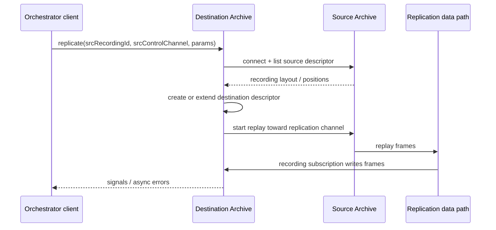
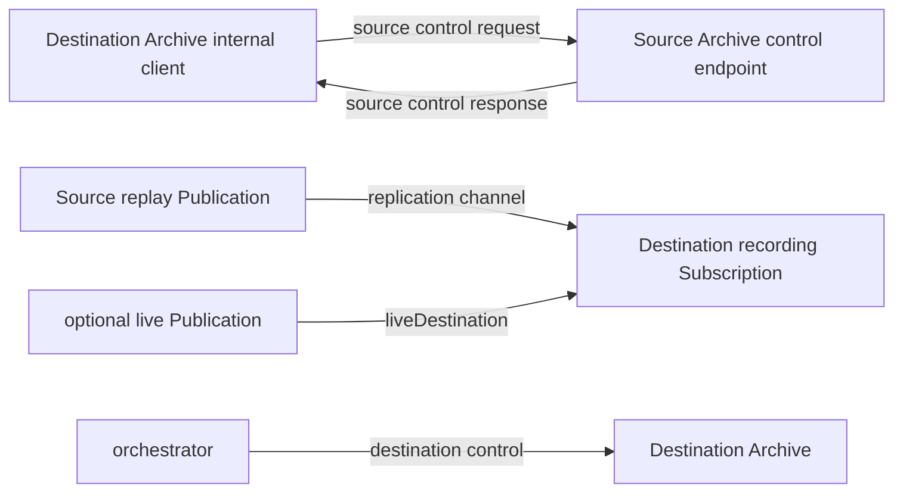
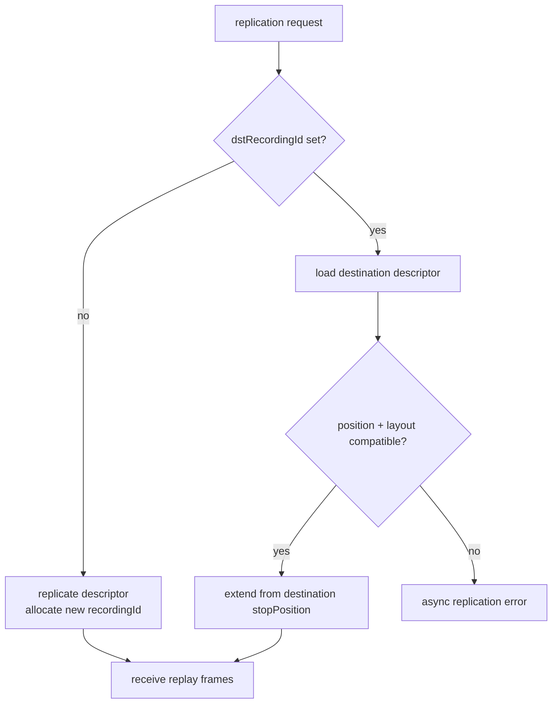
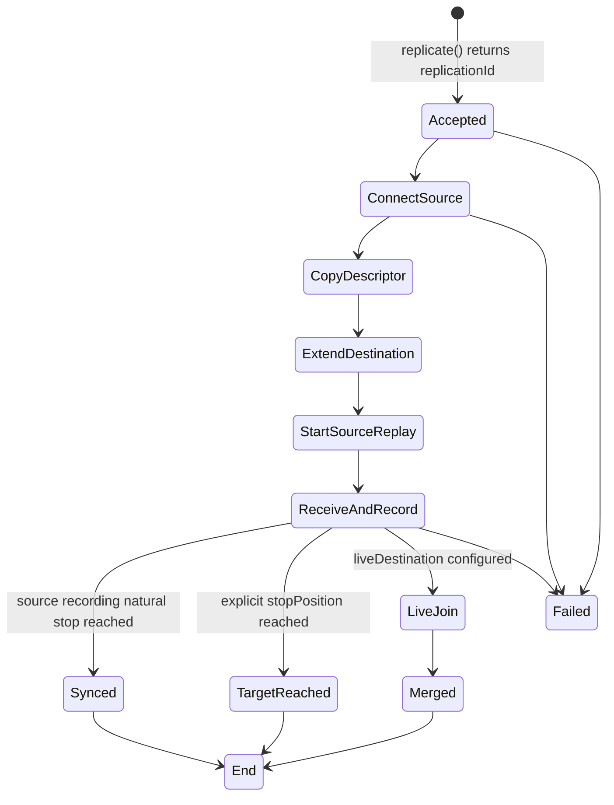
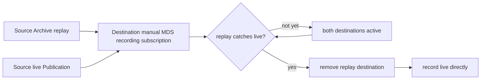
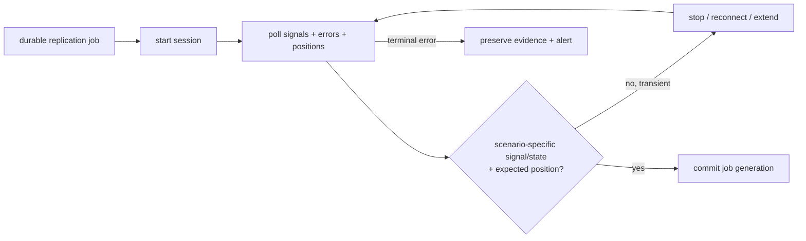
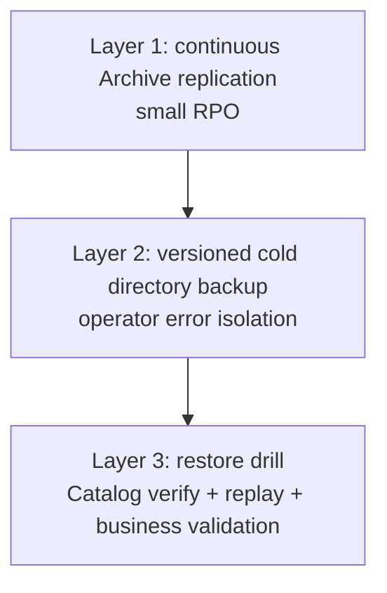
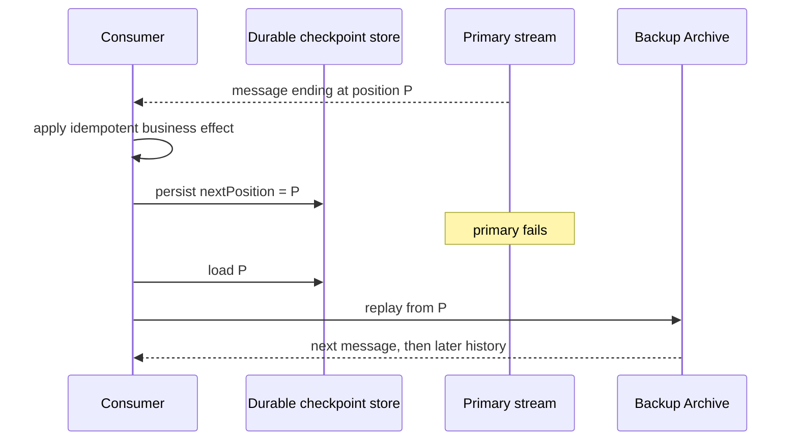

单机 Archive 把实时流变成可重放历史，但它仍可能连同主机、磁盘或机房一起消失。Aeron Archive Replication 允许另一台 Archive 把 source recording 复制成自己的 recording，继续同步活跃尾部，甚至在追上后合入 live stream。

Replication 不是自动选主、共识协议或完整备份产品。它解决的是**两座 Archive 之间怎样复制一条 recording 的 descriptor 与 frame 历史**。谁决定复制对象、RPO、保留期、切流与业务恢复，仍由上层系统负责。

本文以 **Aeron 1.52.2** 为基线，把控制响应、RecordingSignal、数据 position 和业务终态分开说明。

## 复制任务怎样建立源与目标的位置合同

### 复制由目标 Archive 发起

调用 `replicate(...)` 的客户端连接的是 **destination Archive**。destination 再建立内部 `AeronArchive` client 连接 source，请 source replay，自己建立 recording subscription 接收并落盘。



这条方向很重要：

- source 不需要“推送备份任务”到 destination；
- destination 控制 source 的 replay；
- `replicate` 返回的是 destination 上的 replication session ID；
- destination recordingId 可能新建，也可能由参数指定后 extend。

### 控制平面与数据平面

跨主机复制至少有两组网络关系：



配置 source control request channel 可达还不够。source 的响应必须回到 destination 内部 client；destination 的 `Archive.Context.archiveClientContext()` 要使用正确 Aeron directory 与 response channel。

destination `Archive.Context.replicationChannel()` 提供默认数据 channel；单次 `ReplicationParams.replicationChannel(...)` 可以覆盖。endpoint、interface、MDC、tags 与防火墙应分别核对。

#### 本机测试为什么经常掩盖问题

同一台机器用共享 Media Driver、localhost 和固定端口，很容易让错误配置“刚好可达”。上线前至少用两台主机或隔离 network namespace 验证：

1. destination → source 控制请求；
2. source → destination 控制响应；
3. source replay → destination replication endpoint；
4. 可选 live destination；
5. NAT / wildcard port / response-channel 组合。

### ReplicationParams 的边界

1.52.2 的主要参数：

| 参数 | 默认 | 作用 |
| --- | --- | --- |
| `stopPosition` | `NULL_POSITION` | 不给静态停止点，按 source 状态持续/复制到结束 |
| `dstRecordingId` | `Aeron.NULL_VALUE` | 新建 destination recording；否则 extend 指定 recording |
| `liveDestination` | `null` | 是否在追上后合入活跃 source live stream |
| `replicationChannel` | Context 默认 | source replay 到 destination 的数据 channel |
| `channelTagId` / `subscriptionTagId` | NULL | tagged MDS 组合 |
| `fileIoMaxLength` | Context 默认 | source replay 单次文件 I/O 上限 |
| `replicationSessionId` | NULL | 指定接收 recording 的 session ID |
| `encodedCredentials` | 空凭据 | 连接 source 的简单认证凭据 |
| `srcResponseChannel` | Context / 推导 | source 控制响应 channel |

```java
final ReplicationParams params = new ReplicationParams()
    .dstRecordingId(Aeron.NULL_VALUE)
    .stopPosition(expectedStopPosition)
    .replicationChannel("aeron:udp?endpoint=backup-host:9010")
    .fileIoMaxLength(256 * 1024);

final long replicationId = destinationArchive.replicate(
    sourceRecordingId,
    sourceControlStreamId,
    "aeron:udp?endpoint=source-host:8010",
    params);
```

`ReplicationParams` 调用返回后可 reset / 复用，但它是可变对象，不应被并发请求共享。`fileIoMaxLength` 小于 source recording 的 MTU 会异步失败；配得比 Context 上限更大也不会提高上限。

以下是 1.52.2 会直接拒绝的硬约束，不是“建议少组合参数”：

- `liveDestination` 与 `replicationSessionId` 不能同时设置；
- control-mode response 的 replication channel 不能与 `liveDestination` 同用；
- control-mode response channel 不能与 tagged replication 同用。

认证目前只支持把简单 encoded credentials 传给 source，不支持 replication challenge/response。需要更强身份与传输保护时，要在网络、部署与应用控制层补充。

### 新建还是续接 destination recording



新建时 destination 会复制 source descriptor 的 start position、initial term ID、segment / term / MTU、stream、channel 与 source identity 等布局，并为本地分配新的 recordingId。

指定 `dstRecordingId` 时，不是覆盖任意旧 recording，而是从它的 stop position 继续。destination 的 layout 和 source position space 必须兼容。若灾备任务多阶段执行，希望接收端沿用特定 Aeron session，可用 `replicationSessionId`，但这不替代 descriptor / position 验证。

## 复制状态怎样推进并报告终态

### `replicate()` 返回不等于复制完成

调用返回只说明 destination 接受请求并创建 replication session。它甚至可能尚未连上 source、尚未拿到 descriptor、尚未建立 replay Image。



错误由后续 control response 异步报告。Cookbook / demo 中“调用后立即 `pollForErrorResponse()` 一次”的写法只能碰巧抓到已经到达的错误，不能证明未来不会失败。

生产 owner loop 应持续排空**同一条** control-response Subscription。不要先调用 `pollForRecordingSignals()`、再调用 `pollForErrorResponse()`：两者会竞争消费同一响应流，前者可能已经拿走 ERROR。可以只用 `pollForErrorResponse()` 这一条 drain 路径；非错误响应（包括 recording signals）仍会分派给 Context 中配置的 consumer：

```java
while (!terminal)
{
    final String error = destinationArchive.pollForErrorResponse();
    if (null != error)
    {
        markFailed(replicationId, error);
        terminal = true;
    }

    final boolean progressed = observeSignalsAndExpectedPosition(replicationId);
    terminal |= observeExpectedTerminalState(replicationId);
    idleStrategy.idle(progressed ? 1 : 0);
}
```

实际工程还应匹配 control session / correlation ID，处理 client reconnect，并给每个阶段设置业务 timeout。

### RecordingSignal 怎样解释

Replication 通过 destination control session 发 signals。常见顺序与含义：

| Signal | 说明 | 是否业务成功终态 |
| --- | --- | --- |
| `REPLICATE` | 新 destination descriptor 已建立/开始复制身份 | 否；extend 既有 recording 时未必出现 |
| `EXTEND` | destination recording session 真正开始接收 | 否 |
| `SYNC` | destination 已追到 source descriptor 自身的自然 stop position | 对“复制完整个已停止 source recording”是达标证据之一；指定更早的 stopPosition 不保证出现 |
| `MERGE` | replay 已移除，destination recording 已切到 live | 表示 merge 完成，不表示永久无故障 |
| `REPLICATE_END` | replication session 关闭时总会发送 | **只表示 session 结束，可能成功也可能失败/被停止** |

```mermaid
sequenceDiagram
  participant D as Destination Archive
  participant O as Orchestrator
  D-->>O: REPLICATE(recordingId, startPosition)
  D-->>O: EXTEND(subscriptionId, joinPosition)
  loop copy frames
    D->>D: destination RecordingPos advances
  end
  alt reaches source descriptor stopPosition
    D-->>O: SYNC(position)
  else reaches an earlier explicit stopPosition
    Note over D,O: no SYNC required; verify target position + no error
  else live merge
    D-->>O: MERGE(position)
  end
  D-->>O: REPLICATE_END
  Note over O: 同时检查 async errors 和预期 position
```

不能只等待 `REPLICATE_END` 就标成功，终态条件必须按场景定义：

- **复制到 source 自然终点**：无异步错误，收到 `SYNC`，destination 达到 source stop position，随后正常 `REPLICATE_END`；
- **指定更早的 explicit stopPosition**：无异步错误，destination 达到该目标并正常 `REPLICATE_END`；这条路径可直接结束，不要求 `SYNC`；
- **live merge**：无异步错误，收到 `MERGE`，并继续监控 live recording，而不是把 session 一结束就当永久成功。

### 有限复制与持续复制

#### 停止的 source recording

source descriptor 有 stop position 时，destination 从自身 stop（或 source start）replay 到 source stop。达到后发 `SYNC`，session 随后结束并发 `REPLICATE_END`。

#### 活跃 recording，不配置 liveDestination

默认 `stopPosition=NULL_POSITION` 可让 source replay follow 活跃 recording。它是一个持续任务，不能期待马上出现业务完成终态；运维需要监控 destination position 与 source position 的 lag。

若指定 explicit stopPosition，达到该点后会直接完成并发 `REPLICATE_END`；当该目标早于 source descriptor 的自然 stop 时，不会先发 `SYNC`。stop 必须处于可复制范围和合法 position 边界。

#### 主动停止

```java
destinationArchive.stopReplication(replicationId);
// 或 tryStopReplication(...) 做幂等控制。
```

停止请求也不是“数据已达某位置”的替代品。先记录最后确认的 destination max position，再决定下一次 extend 的起点。

### Replication Live Merge

对仍活跃的 source recording，可提供 `liveDestination`。destination 先通过 source replay 追赶，接近 source 当前 recording position 后，把 live destination 加到同一个 recording subscription；追平后移除 replay destination，继续直接录 live。



前提：

- source recording 必须仍活跃，descriptor stop position 为 NULL；
- live destination 必须是可用的 multicast 或合适 MDC destination；
- replay / live session 与 tags 必须兼容；
- destination duty cycle、网络与存储能赶上；
- 不得同时指定 `liveDestination` 与 `replicationSessionId`；
- control-mode response replication channel 不得与 live destination 或 tagged replication 组合。

这些是 1.52.2 的参数校验约束。不要把所有高级 URI 参数叠加后才靠运行时试错。

收到 `MERGE` 表明这个 replication session 已切走 source Archive replay，destination 正在从 live destination 继续录制；它不意味着 source 主机以后宕机时 live 路径会自动切到另一套业务 Publication。

### 一个可审计的复制任务状态表

持久化任务表至少应包含：

| 字段 | 用途 |
| --- | --- |
| source archive identity / recordingId | 确定复制来源 |
| destination archive identity / recordingId | 确定本地历史 |
| replicationId | 关联当前运行 session，不能跨重启当永久 ID |
| requested stop position | 本轮目标 |
| observed destination position | 已验证进度 |
| last signal + timestamp | 诊断卡在哪一阶段 |
| async error code / message | 终态失败证据 |
| retry generation | 防止重复 orchestrator 误判 |
| source/destination Archive version | 恢复与迁移依据 |



这样 Archive client 断开时，orchestrator 可以重新查询 destination Catalog，从事实 position 继续，而不是盲信内存里的 replicationId。

## 备份恢复怎样承接业务承诺

### Replication 不是完整备份策略

单条 recording 的近实时副本仍可能同时遭遇：

- 应用误发 purge/truncate 到两边；
- retention bug 同步删除所需历史；
- source 数据在复制前已损坏；
- Catalog / mark / 配置没有同代冷备；
- 凭据、schema、业务 checkpoint 缺失；
- 备份从未做过恢复演练。

成熟方案通常有三层：



standalone Archive 没有一个“拍全局事务快照并自动恢复所有外部状态”的通用 API。冷备应在 Archive 正常停止后复制 Catalog、segments、mark/link 的同一代目录，并在隔离环境 verify 与启动。

### 恢复时怎样避免消息重复或缺口

假设业务消费者在 primary 上最后安全处理的 `Header.position()` 为 `P`。它切到 backup recording 时应从 `P` replay，因为这是下一条起点。



这成立的前提是 backup recording 已覆盖 `P`。切换前要比较：

```text
backupMaxRecordedPosition >= durableConsumerCheckpoint
```

如果小于，RPO 已经影响业务，不能假装无损切换。

#### exactly-once 的真正边界

Archive position 能提供确定恢复点，但业务 side effect 与 checkpoint 若不在同一事务，崩溃窗口仍会造成：

- effect 已完成、checkpoint 未写：恢复后重复；
- checkpoint 先写、effect 未完成：恢复后缺失。

解决办法是幂等键、业务状态与 checkpoint 同事务、inbox/outbox 或可重建状态机。Replication 复制 transport history，不复制外部数据库事务。

### RPO、RTO 与 lag

定义：

```text
replicationLag = sourceMaxRecordedPosition - destinationMaxRecordedPosition
```

这是字节 lag，不直接等于时间。要用 source 的近期字节速率估算秒数，并结合最坏突发、网络抖动和 destination 写盘延迟。

RPO 还受到 source 持久化边界影响：若 source `fileSyncLevel=0`，一个掉电故障可能让 source 页缓存尾部消失；若 destination 已收到并按更强策略 force，它反而可能持有更多可恢复帧。恢复决策应以两个 Catalog / segments 的实际 verify 和 position 为准，而不是角色名称。

RTO 包含：发现故障、冻结写入、确认 backup 覆盖、启动消费者 replay、追赶、重新接 live、验证业务状态。只测 Archive 进程启动时间没有意义。

### 重试与幂等

Replication session 失败后可重新请求，并指定已有 destination recordingId 续接。重试前必须查询 destination stop / max position，确认它与 source position space 兼容。

避免：

- 每次重试都用 NULL destination，制造多条部分副本；
- 看不到 error 就假设成功并再次全量复制；
- 不保存目标 recordingId，只能靠“最后一条 Catalog entry”猜；
- 并发两个任务 extend 同一 destination；
- 先 truncate destination 再确认 source 可用。

若业务确实要“用 source 完全替换 destination”，官方 sample 会先列 descriptor、truncate 到 start、等待 DELETE signal，再复制。这是破坏性工作流，不应成为普通重试默认路径。

## 用故障演练证明 RPO 与 RTO

### 恢复演练：故障注入与验收证据

1. 断开 source 控制 channel，destination 是否报告异步错误；
2. 断开 replication 数据 channel，position lag 是否告警；
3. source Archive 进程退出，持续 replay / live merge 怎样收尾；
4. destination 重启后是否能从 Catalog stop position extend；
5. backup 是否覆盖最新 durable consumer checkpoint；
6. 从 checkpoint replay 后，业务 hash / state 是否一致；
7. 恢复期间是否产生重复副作用；
8. retention 是否保留恢复所需 segment；
9. 恢复后如何重新建立 primary / backup 角色，而不双写。

演练开始前必须证明 source control request/response、replication channel 和可选 live destination 分别双向可达，且没有把跨主机路径误配成 IPC；credentials 与网络隔离也属于同一前提。执行 owner 要持续 poll signals 和 errors，并分别为 source natural stop、explicit stop 与 live merge 定义终态，不能只等一个 `REPLICATE_END`。

演练只有在以下证据同时成立时才退出：destination Catalog 在重连后能重建任务事实；backup max position 覆盖“下一条消息”的业务 checkpoint；冷备包含 Catalog、segments、mark/link 与版本配置；restore、replay 和业务 state hash 全部通过；primary/backup 角色重新建立后没有双写。session timeout、业务 timeout 和最终 RPO/RTO 要分别记录，不能合并成一个“复制成功”。

## 结论：复制完成必须由位置、信号与业务恢复共同证明

Aeron Archive Replication 是由 destination 发起的一条异步复制状态机：它连接 source、复制 descriptor、请求 replay、extend 本地 recording，并通过 signals 报告同步或 merge 进度。

`replicate()` 返回只是起点；`REPLICATE_END` 也只是 session 关闭。只有持续消费异步错误，按场景解释 `SYNC` / `MERGE` / explicit target，验证 destination position，并把业务 checkpoint 纳入恢复，才能把“有副本”升级成“真的可恢复”。

下一篇进入运维：校验和怎样改变 `.rec` frame、ArchiveTool 哪些命令会修改现场、format migration 如何做，以及生产指标应围绕哪些 counters 和线程延迟建立。

## 官方资料与版本基线

- [Aeron Archive Replication Sample](https://aeron.io/docs/aeron-archive/replication-sample/)
- [Aeron Archive Multi-Host Sample](https://aeron.io/docs/aeron-archive/multi-host-sample/)
- [Aeron Archive Overview](https://aeron.io/docs/aeron-archive/overview/)
- [Aeron Cookbook：Archive Error Polling](https://aeron.io/docs/cookbook-content/aeron-archive-error-polling/)
- [Aeron 1.52.2：ReplicationParams.java](https://github.com/aeron-io/aeron/blob/1.52.2/aeron-archive/src/main/java/io/aeron/archive/client/ReplicationParams.java)
- [Aeron 1.52.2：ReplicationSession.java](https://github.com/aeron-io/aeron/blob/1.52.2/aeron-archive/src/main/java/io/aeron/archive/ReplicationSession.java)
- [Aeron 1.52.2：RecordingSignalCapture Sample](https://github.com/aeron-io/aeron/blob/1.52.2/aeron-samples/src/main/java/io/aeron/samples/archive/RecordingSignalCapture.java)
- [Aeron 1.52.2：RecordingReplicator Sample](https://github.com/aeron-io/aeron/blob/1.52.2/aeron-samples/src/main/java/io/aeron/samples/archive/RecordingReplicator.java)
- [Aeron 1.52.2 Javadoc](https://javadoc.io/doc/io.aeron/aeron-all/1.52.2/index.html)
