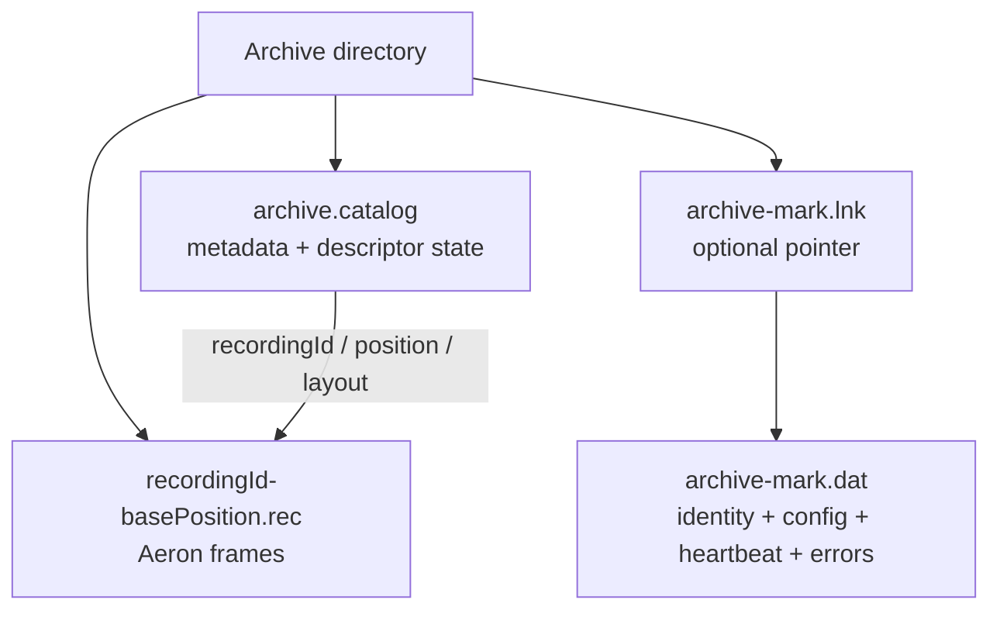
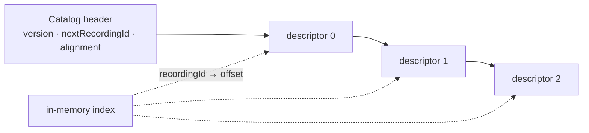
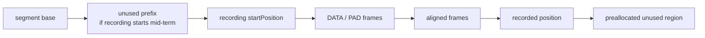
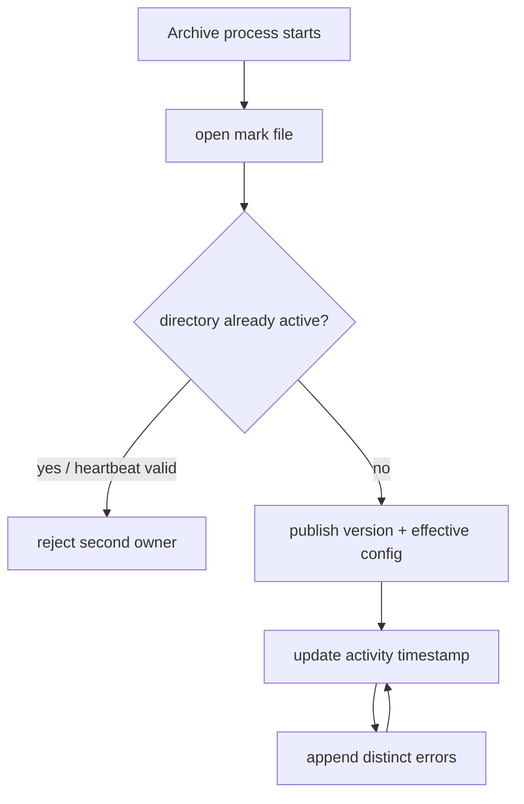
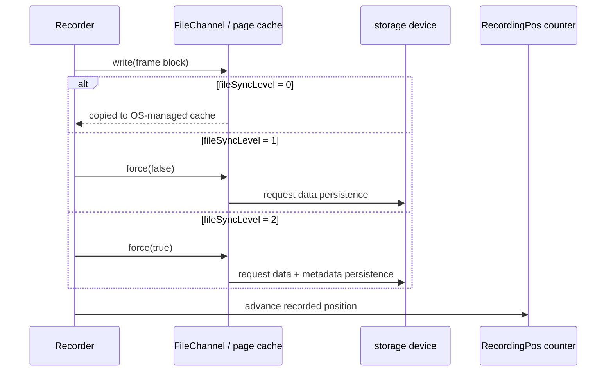
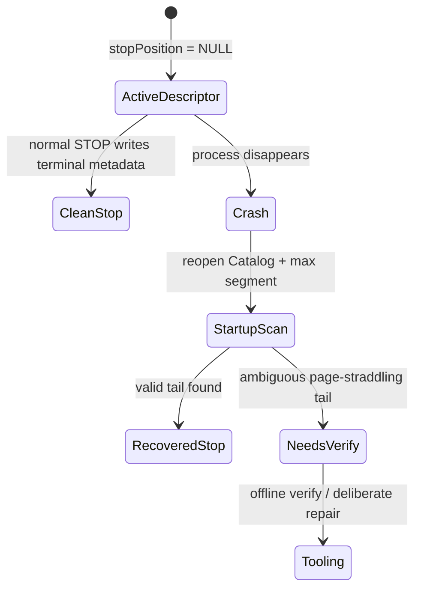
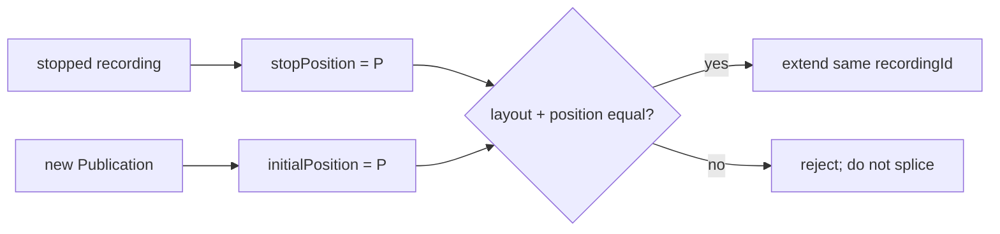
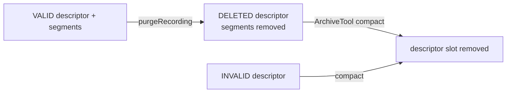
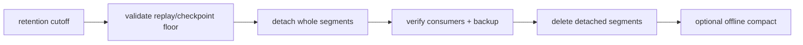

知道 `recordingId` 和 position 之后，下一步不是立刻写 replay 代码，而是回答一个更朴素的问题：**Archive 目录里到底有哪些状态，哪一步已经持久，哪些文件可以移动或删除？**

Aeron Archive 不是一个带事务日志和后台 compaction 的关系数据库。它用一份 Catalog 描述录制，用预分配 segment 文件保存 Aeron 帧，再用 mark file 暴露进程身份、配置、心跳与错误。三个部分共同构成可恢复的 Archive。

本文仍以 **Aeron 1.52.2** 为基线。所有修改录制历史的操作都应先在备份副本演练；“API 返回成功”不等于数据仍可找回。

## 1. Archive 目录的三层结构

一个典型目录可以抽象成：

```text
archive/
├── archive.catalog
├── archive-mark.dat
├── 42-0.rec
├── 42-134217728.rec
├── 43-0.rec
└── ...
```

如果 mark file 配在别处，Archive 目录还可能有 `archive-mark.lnk` 指向它。



它们承担不同职责：

| 文件 | 是什么 | 不是什么 |
| --- | --- | --- |
| `archive.catalog` | recording descriptor 的索引与持久状态 | 消息 payload 数据文件 |
| `*.rec` | 按绝对 position 排列的 Aeron frame | 按业务消息组织的 JSON / WAL |
| `archive-mark.dat` | 运行实例的 mark、版本、配置、心跳、distinct errors | 完整 Catalog 备份 |

只复制 `.rec` 而丢掉 Catalog，Archive 不知道怎样解释这些 segment；只复制 Catalog 而漏 segment，则 descriptor 指向缺失历史。mark/link 也必须与恢复目录和启动配置一致。

## 2. Catalog：recordingId 的事实来源

`archive.catalog` 是 memory-mapped、可增长的 descriptor 文件。Catalog header 记录格式版本、下一个 recordingId、对齐和容量信息；进程启动时再建立 recordingId 到 descriptor offset 的内存索引。

每条 descriptor 至少包含：

- start / stop timestamp；
- start / stop position；
- initial term ID；
- segment file length、term buffer length、MTU；
- source sessionId、streamId；
- stripped channel、original channel、source identity；
- descriptor state，以及当前格式中的 checksum 字段。



默认 Catalog 容量是 1 MiB，并会增长到实现允许的上界。`ArchiveTool capacity` 只用于扩容，不是压缩或缩容；删除 descriptor 后要通过 compact 才能回收 Catalog 空间，而 compact 又是不可逆操作。

### 2.1 VALID、INVALID、DELETED

1.52.2 的 Catalog descriptor state 有三种：

| 状态 | 数值 | 含义 |
| --- | ---: | --- |
| `INVALID` | 0 | descriptor 不应作为有效 recording 使用 |
| `VALID` | 1 | 正常可见 recording |
| `DELETED` | 2 | 已经被 purge 的 recording |

这里有一个值得显式记录的版本事实：`AeronArchive.purgeRecording` 的 Javadoc 仍写着“mark as INVALID”，但 1.52.2 的 `ArchiveConductor` 实际调用 `catalog.changeState(recordingId, DELETED)`。因此应用层不要依赖模糊的“失效”文字；对 1.52.2 而言，purge 后 descriptor 为 **DELETED / 非 VALID**，真正回收 Catalog 槽位仍要 compact。

## 3. Segment 文件：保存的是 Aeron frame

文件名形如：

```text
<recordingId>-<segmentBasePosition>.rec
```

segment base position 是绝对流位置的一个布局基点。若 recording 从 term 中间开始，首个 segment 的 base 可能早于 `startPosition`，数据则从对应 offset 写入。不要根据“文件名是 0”推断 recording 一定从 position 0 开始。



Archive 写入 DATA 和 PAD frame，保留 Aeron 的 frame 对齐与 term 结构。segment 通常在创建时预分配完整长度，所以 `ls -l` 看到的大文件大小不等于已经录制的有效字节数；有效范围由 Catalog position 和 frame 校验决定。

默认配置的 segment length 是 128 MiB。实际 descriptor 保存当前 recording 的 segment length，并要求它是 2 的幂、处于合法 term 范围且与 term length 兼容；segment length 是 term length 的整数倍。后续 attach、migrate 或 extend 都必须尊重 descriptor 中的真实布局，不能拿“当前默认值”覆盖历史事实。

### 3.1 fileIoMaxLength 不是 segment 大小

`fileIoMaxLength` 控制一次文件 I/O 工作块的最大长度，默认约 1 MiB；它必须是 2 的幂，至少覆盖实现要求的最小 term，并且不能小于 MTU。请求级 Replay / Replication 参数可以选择更小的块，避免一个 session 长时间独占 I/O；配得比 Archive Context 上限更大不会突破服务端上限。

segment length 决定文件轮转布局，file I/O max length 决定一次 duty cycle 处理多少，两者不要混用。

## 4. Mark file：谁在使用这个 Archive

`archive-mark.dat` 包含：

- Archive semantic version；
- archiveId；
- Aeron directory；
- control、local control、recording events 等 channel / stream 配置；
- 进程 PID 与 activity timestamp / heartbeat；
- distinct error log。



它的一个核心用途，是阻止两个 Archive 实例同时把同一目录当成自己的工作目录。把 mark file 放到单独监控盘时，`archive-mark.lnk` 连接数据目录与 mark 位置；迁移或冷恢复不能只搬一端。

1.52.2 当前 mark format 是 **3.1.0**。Major 版本不兼容时必须先迁移，不能靠强行启动“碰碰运气”。

## 5. RecordingPos 与 durable position 的距离

写入路径可以分成四层：



`fileSyncLevel` 的语义：

| 值 | RecordingPos 推进前做什么 | 仍需理解的风险 |
| ---: | --- | --- |
| 0 | 不调用 `force` | 数据可能只在页缓存；断电可丢 |
| 1 | `force(false)` | 请求刷新文件数据；硬件缓存策略仍重要 |
| 2 | `force(true)` | 同时请求元数据 | 延迟更高；并非跨机器副本 |

`catalogFileSyncLevel` 负责 Catalog；实现要求它不能低于 `fileSyncLevel`。两者默认都是 0。把 recording 数据强制落盘、却让 stop position 等元数据停留在不更强的边界，会产生难以说明的恢复语义，因此实现直接约束了组合。

### 5.1 “force 完成”也不是宇宙级保证

`FileChannel.force` 把请求交给操作系统和存储栈。电池缓存、虚拟化层、文件系统挂载与云盘 durability 仍要纳入故障模型。Archive 无法替业务完成跨可用区复制，也无法把外部数据库 side effect 与 recording position 放进同一个事务。

应该把 SLO 写成可验证语言，例如：

- 只要求单进程崩溃后恢复，允许主机断电丢最后一段；
- 要求单机断电后 Catalog 与已确认 frame 恢复；
- 要求单机损毁后从远端 Archive 继续，RPO 小于 X 秒。

三种承诺需要不同 sync、replication 与业务确认策略。

## 6. 非正常退出时，Archive 怎样收尾

主动 recording 的 descriptor 在运行中 stop position 为 `NULL_POSITION`。若进程未正常停止，重启时 Catalog 会识别 VALID 且 stop position 为空的 descriptor，并扫描最后 segment，计算可确认的最终 stop position 与 timestamp。



这是**崩溃尾部恢复**，不是任意文件损坏的自动修复。如果最后一个 fragment 跨内存页，Archive 无法安全判断尾部 frame 是否完整，启动会报错并要求运行 ArchiveTool verify / 修复流程。此时不要反复重启覆盖现场，先复制整个目录，再在副本上检查。

## 7. Extend：继续同一条 recording，不是拼接任意流

`extendRecording` 只能用于已经停止、当前不活跃的 recording。新 Publication / Image 必须从旧 `stopPosition` 精确起步，并保持布局兼容。

所需关键字段来自 descriptor：

- stop position；
- initial term ID；
- term buffer length；
- MTU；
- stream ID；
- channel 语义。

```java
final String extendChannel = new ChannelUriStringBuilder()
    .media("udp")
    .endpoint("239.20.0.1:40456")
    .initialPosition(stopPosition, initialTermId, termBufferLength)
    .mtu(mtuLength)
    .build();

final long extensionSubscriptionId = archive.extendRecording(
    recordingId,
    extendChannel,
    streamId,
    SourceLocation.REMOTE);
```

source sessionId 可以改变，但 joined Image 的 position 必须与 Catalog stop position 完全相等；initial term ID、term length、MTU 和 stream 要兼容。否则 Archive 不能把两段解释为同一 position space。



`extendRecording` 的返回值与 `startRecording` 一样，是新的 recording subscription ID，不是 recordingId；recordingId 仍是原来那一个。等待 `RecordingSignal.EXTEND` 或 active `RecordingPos` 后，才算 extension 真正开始。

## 8. 六种历史修改操作

保留期管理不是一个 `delete()`。不同 API 改变的数据范围和可恢复性不同。

| 操作 | 主要效果 | 是否保留 descriptor | 是否立即删除 segment |
| --- | --- | --- | --- |
| `truncateRecording` | 把 stop position 向前截短 | 是 | 删除/截断目标后的数据 |
| `purgeRecording` | 删除整条 recording 的数据并置非 VALID | 留下 DELETED 项到 compact | 是 |
| `detachSegments` | 从起点分离完整旧 segments | 是，并前移 start | 否 |
| `deleteDetachedSegments` | 删除已分离 segments | 是 | 是 |
| `purgeSegments` | detach + delete | 是，并前移 start | 是 |
| `attachSegments` | 把精确匹配的旧 segments 接回前端 | 是，并前移 start | 否 |
| `migrateSegments` | 在两条 recording 间移动兼容 segment | 两边都变 | 文件被移动 |

### 8.1 truncateRecording

target position 必须：

- 在 start 与 stop 范围内；
- 32-byte frame aligned；
- 落在真实 fragment 边界；
- recording 已停止。

1.52.2 会在 truncate 前停止该 recording 上的并发 replay。把 position 截到 start position 会删除全部录制内容，效果极具破坏性。

“32 字节对齐”只是必要条件，不是充分条件；随机找一个对齐数字可能仍在一个 frame 内部。应从已验证 frame / descriptor / 消费 checkpoint 得到位置。

### 8.2 purgeRecording 与 compact

purge 删除 segment，并把 descriptor 置 `DELETED`；Catalog 槽位还在。compact 会重写 Catalog，仅保留 VALID entries，并删除非 VALID 对应的残余 segment。官方工具明确把 compact 视为不可恢复操作。



因此 purge 成功后不要宣称“Catalog 已腾出空间”；也不要把 compact 当普通在线 housekeeping。

### 8.3 detach、delete、attach

detach 只允许在 segment 边界工作，新 start position 必须是下一个 segment 的第一个字节。它把旧 segment 从 recording 的有效历史中分离，但暂不删除文件；这给了短暂的回退窗口。

`deleteDetachedSegments` 才真正删除。`purgeSegments` 把两步合并，省事但没有中间恢复点。

attach 只能接回与 recording 精确连续、布局匹配的 detached segments。它不是把任意 `.rec` 文件导入 Catalog 的工具。

### 8.4 migrateSegments

migrate 可把 source recording 的 segments 移到 destination recording 的头部或尾部，要求两者 segment length、term length、MTU、stream 与 position / term 连续性兼容。source 必须停止；追加到 destination 尾部时 destination 也必须停止。

迁移后 source 会被相应截短。它是文件所有权转移，不是复制备份。

## 9. 设计保留策略：先分“逻辑可读”与“物理删除”

更安全的保留流程分三阶段：



第一阶段计算最小必须保留 position：所有消费者 checkpoint、灾备 replication position、审计窗口与法律保留期取最小值。第二阶段只 detach 完整 segments 并验证 replay。第三阶段经过冷却窗口后删除，再在维护窗中决定是否 compact。

不要按文件修改时间直接 `rm *.rec`。Archive 的有效起点、Catalog descriptor 与 segment base 必须一起演进。

## 10. 容量规划不能只看平均吞吐

粗略原始数据量：

```text
bytes_per_day ≈ aligned_aeron_bytes_per_second × 86,400
```

这里要用包含 frame header、alignment、PAD 的 Aeron 字节，而不是业务 payload。再加上：

- 预分配 segment 的瞬时空间；
- 同时活跃 recordings；
- detached 但尚未删除的冷却窗口；
- replication / replay 的读放大；
- 文件系统预留与 Archive low-storage threshold。

默认 low storage threshold 为 128 MiB，恰好约一个默认 segment。跌破阈值时新 recording 会被拒绝；把阈值调到极低只会把可预期拒绝变成磁盘耗尽故障。

## 11. 备份目录的正确粒度

对 standalone Archive，冷备的安全思路是：

1. 停止写入并让 recordings 进入 stopped；
2. 正常关闭 Archive；
3. 把 Catalog、全部相关 segments、mark/link 作为同一代目录复制；
4. 对副本运行描述与 verify；
5. 记录二进制版本、Archive format、配置与校验和算法；
6. 实际启动一次隔离恢复并 replay 验证。

这是根据持久格式推导出的运维流程，而不是“在线快照 API”。在线逐个复制活跃文件可能得到跨时刻的 Catalog 与 segment，不能称为一致备份。近实时备份应使用下一章之后介绍的 Archive replication，再叠加周期性冷备和恢复演练。

## 12. 危险配置与示例陷阱

官方 basic sample 为了每次运行干净，常见：

```java
new MediaDriver.Context().dirDeleteOnStart(true);
new Archive.Context().deleteArchiveOnStart(true);
```

这两项只适合测试或一次性 demo。生产环境设置它们，会在启动时删除驱动目录或 Archive 历史。配置审计应该明确禁止，而不是依靠“大家记得不要开”。

Cookbook 示例适合观察工具和运行路径，但只要涉及 sync、删除、verify、migration，就应回到 1.52.2 source / Javadoc 核对终态和默认值。

## 13. 上线前的存储契约

### 格式与所有权

- archiveDir 与 markFileDir 分别在哪里？link 是否随备份保存？
- 谁保证同一目录只有一个 Archive owner？
- 当前 Archive format / Aeron version 是否随备份记录？
- 是否禁止手工移动单个 `.rec`？

### 持久性

- file / catalog sync level 各是什么？
- `RecordingPos` 被业务解释成哪一级确认？
- 存储设备对 `force` 的保证是什么？
- 单机丢失时 RPO / RTO 如何满足？

### 保留与恢复

- cutoff 是否考虑所有 consumer 和 replication checkpoints？
- detach 到 delete 是否有冷却期？
- truncate / purge / compact 是否有审批、备份和 dry-run？
- 最近一次完整恢复演练何时成功？

## 14. 本章结论

Archive 的磁盘模型并不神秘，但必须整体看：

- Catalog 解释 recording 的身份、布局和有效范围；
- segment 保存按 position 排列的 Aeron frames；
- mark file 说明谁在运行、用什么配置，并保存心跳与错误；
- sync level 决定 RecordingPos 前的本地持久化动作；
- extend 和 retention 操作都受 position、term 与 segment 边界约束。

一旦历史有了可靠边界，就可以讨论读取。下一章会区分有限 replay、follow replay、bounded replay，并解释怎样从历史无缝追到 live，而不在应用层粗暴拼两条流。

## 官方资料与版本基线

- [Working with Recordings](https://aeron.io/docs/aeron-archive/working-with-recordings/)
- [Purging and Truncation](https://aeron.io/docs/aeron-archive/purging-and-truncation/)
- [Aeron Archive Tooling](https://aeron.io/docs/aeron-archive/aeron-archive-tooling/)
- [Aeron Archive Overview](https://aeron.io/docs/aeron-archive/overview/)
- [Aeron Cookbook：Archive Mark File](https://aeron.io/docs/cookbook-content/aeron-archive-markfile/)
- [Aeron 1.52.2：Catalog.java](https://github.com/aeron-io/aeron/blob/1.52.2/aeron-archive/src/main/java/io/aeron/archive/Catalog.java)
- [Aeron 1.52.2：RecordingWriter.java](https://github.com/aeron-io/aeron/blob/1.52.2/aeron-archive/src/main/java/io/aeron/archive/RecordingWriter.java)
- [Aeron 1.52.2：ArchiveMarkFile.java](https://github.com/aeron-io/aeron/blob/1.52.2/aeron-archive/src/main/java/io/aeron/archive/ArchiveMarkFile.java)
- [Aeron 1.52.2：ArchiveConductor.java](https://github.com/aeron-io/aeron/blob/1.52.2/aeron-archive/src/main/java/io/aeron/archive/ArchiveConductor.java)
- [Aeron 1.52.2 Javadoc](https://javadoc.io/doc/io.aeron/aeron-all/1.52.2/index.html)
