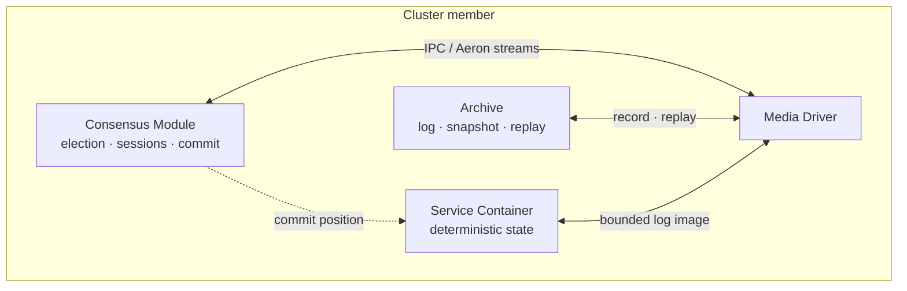
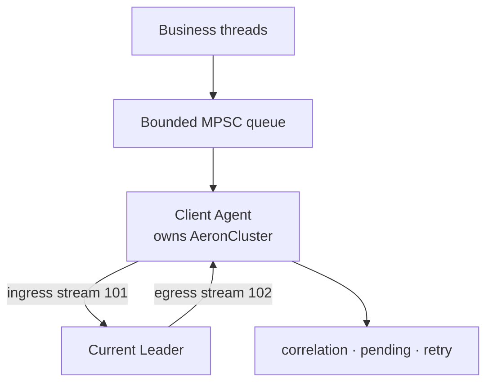
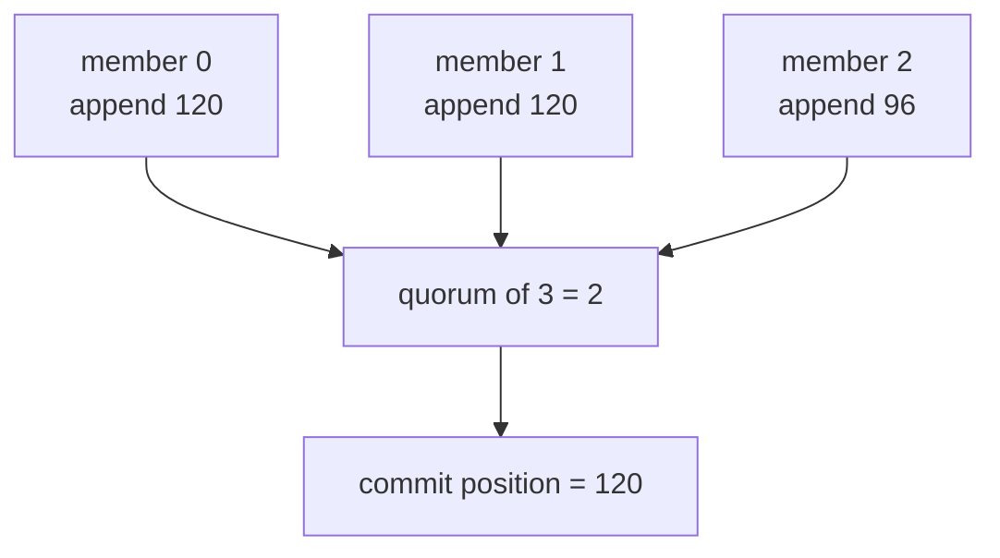
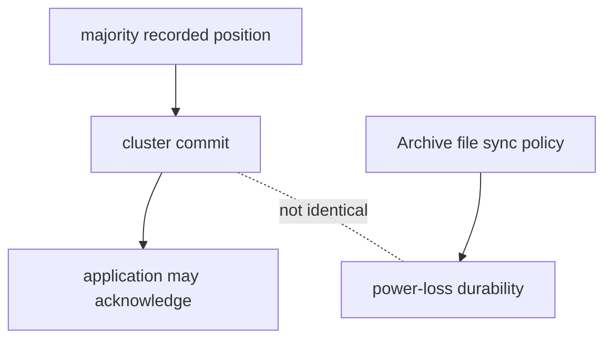
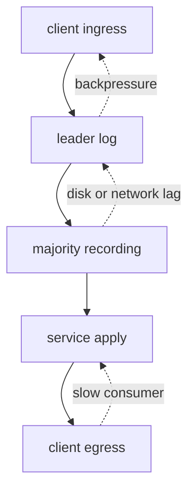

Aeron Cluster 不是“给 Aeron 加一个 Leader”这么简单，也不是把 Raft 论文中的 RPC 名称换成 UDP channel。它把 **Aeron Transport 的有序流、Aeron Archive 的录制与回放、Raft 风格的多数派共识，以及确定性的业务状态机**组合成一套运行时。

理解它最有效的方法，不是先背配置，而是追踪一条命令：它从客户端进入哪个流，Leader 在何时追加日志，Follower 汇报的是什么位置，多数派如何形成提交位置，业务代码为什么只能看到已经提交的输入，响应又为什么只从 Leader 发出。

本文以开源 **Aeron 1.52.2** 的官方文档和对应 tag 源码为基线。早期教程中的部分图只描述旧版本；本文在概念上借用 Raft，但涉及状态名、计数器和执行路径时，以 1.52.2 为准。

## 先把 Cluster 的保证落实到组件与边界

### 先回答：Cluster 到底保证什么

Aeron Cluster 的核心目标是：只要仍有足够成员可以形成多数派，就让多个节点对同一条已提交日志按相同顺序执行，从而维护同一份应用状态。

可以把安全性所依赖的链条写成：

```text
有序命令
  → Leader 追加 Cluster Log
  → 多数成员记录到相同位置
  → 形成 Commit Position
  → 每个服务只执行到 Commit Position
  → 确定性状态转换得到相同状态
```

这条链上的每一环都不可省略：

- 只有 Leader 收到命令，不代表命令已经提交；
- Leader 本机 Archive 已经录制，不代表多数派已经录制；
- 多数派已经形成提交位置，不代表外部数据库副作用也获得了 exactly-once；
- 节点执行了相同输入，不代表会自然得到相同状态，业务逻辑还必须确定；
- 客户端的 `Publication.offer` 成功，只代表 Transport 接受了消息，不代表业务完成。

因此，“强一致”必须说明边界。Cluster 能对 **进入其复制日志并由 Clustered Service 管理的状态转换**提供一致顺序；它不会自动把任意数据库、HTTP 调用或客户端缓存纳入同一个原子提交。

### 一台成员节点里有什么

一个典型成员由四类组件组成：

1. **Media Driver**：负责 Aeron 的传输、共享内存和网络 I/O；
2. **Archive**：把 Cluster Log 和 Snapshot 作为 Aeron stream 录制，并支持复制、回放；
3. **Consensus Module**：维护成员角色、term、会话、选举、提交位置和集群控制协议；
4. **Clustered Service Container**：承载一个或多个确定性的业务服务。



这些组件可以在同一 JVM 中用不同 Agent 运行，也可以拆成进程。逻辑关系不变：节点内通常用 IPC 通道连接，节点间通过 UDP 通道复制。

#### 为什么 Archive 不是旁路备份

Archive 在 Cluster 中不是“偶尔拷贝一下日志”的运维附件。它位于正常提交与恢复路径上：

- Leader Archive 录制 Leader 发布的 Cluster Log；
- Follower Archive 录制从 Leader 接收的日志；
- Follower 根据本地录制进度报告 append position；
- 重启时用 Snapshot 加后续日志 replay 恢复状态；
- 落后节点通过复制和 replay 追赶；
- Cluster Backup 也依靠 Archive 的录制复制能力。

但要避免另一种误解：**Archive 录制的是 Aeron stream，不是任意 Java 队列或对象图的通用 WAL。** 业务状态仍需由服务快照保存，业务事件仍需有可演进的二进制协议。

#### Consensus Module 不运行你的业务规则

Consensus Module 决定哪些输入可以进入权威顺序，并维护 Cluster 层元数据；业务状态由 Clustered Service 持有。这样可以把两个问题分开：

- 共识层：成员、term、日志位置、会话、timer、snapshot 控制；
- 应用层：订单、账户、风控规则、请求去重、业务响应。

这种分层也解释了为什么 Cluster Snapshot 是一组快照，而不是单个业务文件：Consensus Module 和每个服务都必须在同一 log position 上保存各自状态。

### 客户端看到的入口和出口

Java 客户端通常通过 `AeronCluster` 连接。它内部持有：

- 指向 Leader ingress endpoint 的 Publication；
- 接收 egress 消息、会话事件和新 Leader 事件的 Subscription；
- 当前 cluster session、leader member 与 correlation 信息。

`AeronCluster` **不是线程安全类**。最清晰的拓扑是由一个 Agent 或一个明确的线程拥有它；多个业务线程通过有界队列把请求交给该所有者。若在外部加锁共享，不仅要保护 `offer`，还要保护 egress polling、重连和关闭整个生命周期。



这里的 stream id 是默认值，不是协议常量：Cluster Log 默认 100，ingress 默认 101，egress 默认 102。生产系统应把 channel、stream id 和 endpoint 当作显式部署配置管理，而不是散落在业务代码中。

## 一条命令怎样从入口推进到提交与执行

### 一条命令怎样成为已提交输入

下面从稳定 Leader 期间的一条普通 session message 开始。

```mermaid
sequenceDiagram
  participant C as Client
  participant CM as Leader CM
  participant MD as Media Drivers / Cluster Log stream
  participant LA as Leader Archive
  participant FA as Follower Archives
  participant S as Services
  C->>CM: ingress command
  CM->>MD: LogPublisher appends Cluster Log
  MD->>LA: Leader Archive records local stream
  MD->>FA: Aeron transports live log; Followers record
  FA-->>CM: AppendPosition
  CM->>CM: compute quorum position
  CM-->>S: advance CommitPosition
  S->>S: apply committed command
  S-->>C: leader sends egress
```

实际实现中，入口由 `IngressAdapter` 轮询，`ConsensusModuleAgent` 校验当前角色和会话后，由 `LogPublisher` 把消息写入 Cluster Log。日志经 Aeron stream 传输，Leader 和 Follower 的 Archive 各自录制。

#### Append Position 是字节位置

Follower 周期性向 Leader 报告本地 Archive 已记录到的 **append position**。这里的位置是 Aeron recording/log 的字节位置，而不是 Raft 论文里抽象的“第 N 条 entry index”。

这一区别会影响排障语言：

- `append position = 8 MiB` 表示录制进度，不表示恰有多少条业务命令；
- 一条日志记录可能包括协议 header、会话事件、timer 或集群控制事件；
- 不同业务消息长度不同，不能用 position 差直接换算消息数；
- position 必须结合 recording、term 和日志语义解释。

#### 多数派怎样计算

成员数为 `n` 时，多数派阈值是：

```text
quorum = floor(n / 2) + 1
```

Leader 收集成员的 append position，并找出至少 `quorum` 个成员都已达到的位置。这个候选值还受 Leader 本地 Archive 的 append position 约束，不能宣布提交自己尚未录制的位置。

| 成员数 | 多数派 | 可同时容忍的成员故障 |
| ---: | ---: | ---: |
| 1 | 1 | 0 |
| 2 | 2 | 0 |
| 3 | 2 | 1 |
| 4 | 3 | 1 |
| 5 | 3 | 2 |

两节点配置经常被误称为“一主一备高可用”。它需要两票才能提交，丢失任意一台便不再有提交能力。Aeron README 也提示，若只剩一名成员，需要通过人工重配置把它变成单节点集群。多数生产部署选择 3 或 5 个投票成员，原因是故障容忍，而不是奇数本身具有魔法。



图中只是说明排序思想；实际位置推进还要遵守 leadership term、日志边界和 Leader 本地录制进度等约束。

#### Commit Position 是服务的执行上界

Leader 形成新的 commit position 后，把它传播给 Follower。每个 Service Container 通过本地 spy subscription 读取同一条日志 Image，并由 `BoundedLogAdapter` 以共享的 Commit Position counter 为上界轮询。

因此服务不会因为“网络已经收到更多字节”就越过提交边界执行。Follower 可能已接收到尚未提交的尾部；这段尾部在新一轮领导期中可能被保留、追平或被权威日志覆盖，不能提前产生业务状态。

三个位置必须分开观察：

| 位置 | 回答的问题 | 不能据此推断 |
| --- | --- | --- |
| Archive append position | 本节点录制到了哪里 | 多数派是否同意 |
| Commit Position | 多数派确认到了哪里 | 某个服务是否已经执行完 |
| Service position | 服务应用到了哪里 | 客户端是否收到响应 |

这里的 Commit Position 还要区分观察节点：Leader counter 表示当前权威 quorum commit；Follower 收到 commit 通知后，只能推进到 `min(notified commit, local append)`，其同名 counter 表示**本地已消费的已通知提交前缀**，可以合法落后于 Leader。集群权威 commit 应从 Leader 读取。

当“服务没有响应”时，只盯 Commit Position 不够。服务线程被长任务、GC 或无限 egress 重试阻塞时，提交仍可能继续，但 service position 会落后。

### 提交以后谁来执行、谁来响应

所有健康成员上的服务都按相同顺序执行已提交输入。这样 Follower 才能保持可接管状态。角色差异主要体现在外部输出：

- Leader 上的 `ClientSession.offer(...)` 真正向客户端 egress Publication 发送；
- Follower 上同一调用返回 `MOCKED_OFFER`，不物理发送重复响应；
- 业务状态转换不能依赖返回值在 Leader 与 Follower 上不同；
- 外部副作用不应直接放在每个副本都会执行的回调中。

这也意味着“只让 Leader 执行业务代码”是错误模型。正确模型是 **所有副本执行同一确定性状态转换，只有被授权的出口产生物理输出**。

若配置多个 Clustered Service，它们都消费同一条 Cluster Log，框架会把每条 session message 按相同顺序交给每个 Service Container；它**不会**根据 service id 自动路由或过滤客户端 payload。应用若只希望某个服务处理一类消息，必须把目标、来源或消息类型编码进业务协议，再由各服务确定地处理或忽略。service-originated message 到达其他服务时没有对应的 `ClientSession`，回调的 session 参数为 `null`，来源/目标同样要由 payload 协议表达。1.52.2 源码限制最多 10 个服务，service id 必须从 0 连续编号。多个服务都保留响应能力时还可能产生重复 egress，所以只应让真正负责响应的服务开启 response channel。

## Raft 类比在哪些位置成立或失效

### 与 Raft 相同的地方

Aeron Cluster 官方材料把其共识描述为受 Raft 启发的实现。可以安全类比的部分包括：

- 任一时刻以单个 Leader 组织写入；
- 成员处于 Leader、Follower、Candidate 等角色；
- leadership term 单调演进；
- Leader 通过多数派确认推进提交；
- 已提交日志按统一顺序应用于复制状态机；
- Leader 故障后通过选举恢复服务；
- 少数派不能继续提交，优先保证一致性而非写可用性。

这些相同点足以帮助我们用 Raft 的安全性问题审视系统：

1. 新 Leader 是否拥有足够新的日志？
2. 未提交尾部如何处理？
3. 何时允许服务越过某个位置执行？
4. 客户端在 Leader 切换时如何处理结果未知？

### 不能直接照搬 Raft 论文的地方

把 Aeron Cluster 说成“标准 Raft Java 库”会掩盖关键实现事实。

| 维度 | Raft 论文抽象 | Aeron Cluster 1.52.2 的具体机制 |
| --- | --- | --- |
| 日志传输 | AppendEntries RPC | Aeron stream、Image、Publication/Subscription |
| 日志存储 | 持久化 log | Archive recording 与 recording position |
| 复制进度 | matchIndex / nextIndex | append position、recording/catch-up position |
| 应用边界 | commitIndex | Commit Position counter 限制日志 Image |
| 应用容器 | state machine 抽象 | ClusteredServiceContainer 生命周期 |
| 客户端 | 通常只讨论请求重定向 | session、ingress、egress、新 Leader 事件 |
| 时间事件 | 非核心协议 | Timer 到期也先进入复制日志 |
| 快照 | 压缩日志的抽象机制 | CM 与各服务的 Archive snapshot recordings |
| 灾备 | 论文外 | 非投票 Cluster Backup 与恢复工具 |

特别要注意：Aeron 的 position 是字节位置，状态推进依靠 counters 和录制位置；不要在代码、监控和文档中随意把它改名成 `commitIndex`，否则会把 entry 边界、byte position 和业务序号混在一起。

### “已录制”不自动等于“断电不丢”

共识与介质落盘策略是两层问题。Aeron Archive 的 `aeron.archive.file.sync.level` 默认值为 0；普通文件写入可能仍停留在操作系统页缓存。多数成员报告 recording position，说明各自 Archive 已经写到对应位置，并不自动证明每块磁盘都执行了满足你要求的 `fsync`。



这不是说 Raft 已提交数据会随意丢失，而是提醒部署者明确故障模型：

- 只考虑单进程或单机故障，还是考虑机房同时断电？
- 操作系统页缓存是否可以作为确认边界？
- Archive 文件和存储控制器提供什么持久化语义？
- 提高 sync level 的吞吐与尾延迟成本能否接受？
- 是否通过跨故障域副本、UPS、持久盘和备份降低相关失效风险？

不能只写“3 副本强一致”便跳过这些问题。业务确认语义必须与实际 durability policy 对齐，并通过断电级别的故障演练验证。

### 三类顺序不要混为一谈

Cluster 系统中至少存在三种序列：

1. **Transport 顺序**：某个 Aeron session/stream 上的帧顺序；
2. **Cluster Log 顺序**：Leader 把 session、timer 和控制事件编排出的全序；
3. **业务顺序**：订单版本、账户流水号、request id 等领域序列。

Transport 的 session id 不能替代业务 ID；Cluster Log position 也不应直接成为对外订单版本。业务协议最好显式携带：

```text
clientId / businessIdentity
requestId / correlationId
aggregateId
expectedVersion
commandType + schemaVersion
```

这样可以在重连、重试、归档重放和跨系统对账时维持稳定语义。

## 背压与部署怎样守住提交链

### 背压会沿提交链传播

Aeron 的 `offer` 返回负值不是异常细节，而是容量协议。可能的压力来源包括：

- 客户端入口 Publication 没有连接或被背压；
- Leader 无法及时把新日志复制给足够 Follower；
- Archive 录制受磁盘或 I/O 限制；
- Service Container 处理过慢；
- Leader egress 被慢客户端拖住；
- Agent duty cycle 被 CPU 抢占或长 GC 暂停。



应用不能在 Clustered Service 的关键回调里无限自旋等待 egress。那会阻止整个复制状态机继续消费，包括其他会话和 timer。应事先选择有界策略：小次数重试、断开慢客户端、丢弃可重建通知、将大结果放入独立查询通道，或对入口施加背压。

### 最小部署拓扑

一个三成员拓扑至少包含：

```text
member 0: Media Driver + Archive + Consensus Module + Services
member 1: Media Driver + Archive + Consensus Module + Services
member 2: Media Driver + Archive + Consensus Module + Services
clients : ingress endpoints for every member + egress channel
```

`clusterMembers` 中每个成员的典型 entry 结构为：

```text
memberId,ingress,consensus,log,catchup,archive
```

各 endpoint 有不同职责：

- ingress：客户端向当前 Leader 发命令；
- consensus：成员间心跳、投票和控制消息；
- log：Follower 接收 live Cluster Log；
- catchup：落后成员追赶；
- archive：远程 Archive 控制和复制。

本地 Consensus Module 通常通过 IPC 控制同节点 Archive。`replicationChannel` 则是本地 Archive 接收其他节点复制数据的网络入口，生产配置不能偷懒写成只有本机可达的 `localhost`。

#### 启动成功不等于业务 Ready

节点从进程启动到可参与稳定服务，可能经历：

```text
Media Driver ready
→ Archive catalog/recordings ready
→ Consensus Module 读取 Recording Log
→ 加载 Snapshot set
→ replay 后续 Cluster Log
→ Election / catch-up
→ Service Container 到达恢复位置
→ role 与会话入口稳定
```

因此健康检查不能只看 Java 进程、端口或 mark file 是否存在。一个正在 replay 的节点可能完全健康，却还不应接流量；一个进程仍存活但 Election State 反复变化的 Leader 也不应被 Gateway 当作稳定入口。

至少组合判断：

- Consensus Module state 和 node role；
- Election State 是否已经 `CLOSED`；
- 本节点 append/service position 与 Commit Position；
- Archive 和 Service error counter；
- 对 Leader 而言，ingress/egress channel 是否已连接；
- 对 Follower 而言，是否已经 ready 且 lag 在预算内。

Readiness 是协议状态，不是进程状态。这个原则在 Kubernetes probe、服务发现和发布脚本中同样适用。

由此可以把 Cluster 设计压缩成一份可验证合同：成员数由故障域和多数派推导；Archive sync policy 与业务确认语义一致；权威状态只由 Cluster Log 驱动；外部副作用拥有独立幂等和对账协议；`offer`、append、commit、apply、egress 分别可观察；慢 Follower、慢服务和慢客户端各有有界背压策略。业务 ID、request id 与 cluster session id 必须分离，Snapshot、Backup、RPO/RTO 和选举期间的入口策略则共同说明这条提交链在故障后如何恢复。

## 结论：Cluster 的一致性来自可观察的多数派提交链

Aeron Cluster 的一致性不是由某个“Raft 开关”产生的，而是由一条可观察的提交链产生：Leader 编排日志，Archive 在各节点录制，Follower 报告 append position，多数派决定 commit position，服务以该位置为硬上界按序执行。

它与 Raft 共享强 Leader、多数派、term、选举和复制状态机这些原则；但它用 Aeron stream、Archive recording、byte position、counters、session、timer 与 Clustered Service 把原则落到了具体系统中。后续理解客户端语义、快照恢复和选举故障，都应回到这些真实机制，而不是只套论文中的名词。

下一章将进入最容易破坏安全性的应用层：如何写一个真正确定的 Clustered Service，如何区分 session 与业务身份，以及 gateway、请求去重和外部副作用应放在哪里。

## 一手资料

- [Aeron Cluster Overview](https://aeron.io/docs/aeron-cluster/overview/)
- [Cluster Quickstart：Replicated State Machines](https://aeron.io/docs/cluster-quickstart/replicated-state-machines/)
- [Cluster Quickstart：Raft Consensus](https://aeron.io/docs/cluster-quickstart/raft-consensus/)
- [Aeron Cluster Component Model](https://github.com/aeron-io/aeron/wiki/Cluster-Component-Model)
- [Aeron Cluster Tutorial](https://github.com/aeron-io/aeron/wiki/Cluster-Tutorial)
- [Aeron 1.52.2 源码](https://github.com/aeron-io/aeron/tree/1.52.2)
- [ConsensusModuleAgent 1.52.2](https://github.com/aeron-io/aeron/blob/1.52.2/aeron-cluster/src/main/java/io/aeron/cluster/ConsensusModuleAgent.java)
- [ConsensusPublisher 1.52.2](https://github.com/aeron-io/aeron/blob/1.52.2/aeron-cluster/src/main/java/io/aeron/cluster/ConsensusPublisher.java)
- [BoundedLogAdapter 1.52.2](https://github.com/aeron-io/aeron/blob/1.52.2/aeron-cluster/src/main/java/io/aeron/cluster/service/BoundedLogAdapter.java)
- [Aeron Archive Configuration](https://github.com/aeron-io/aeron/wiki/Configuration-Options)
