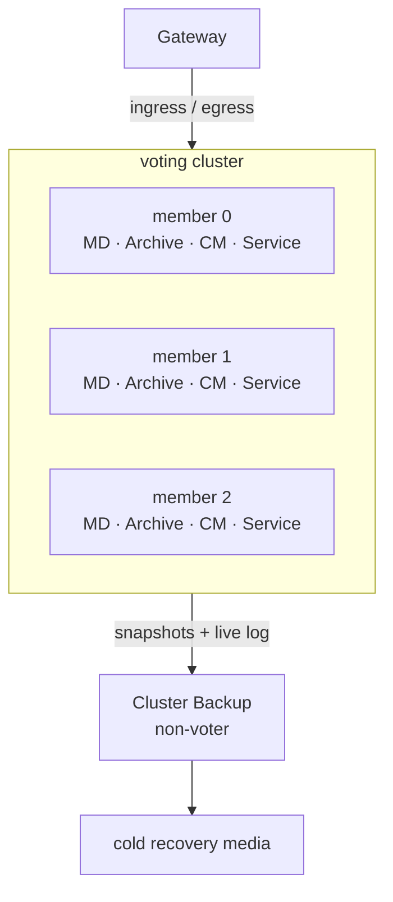
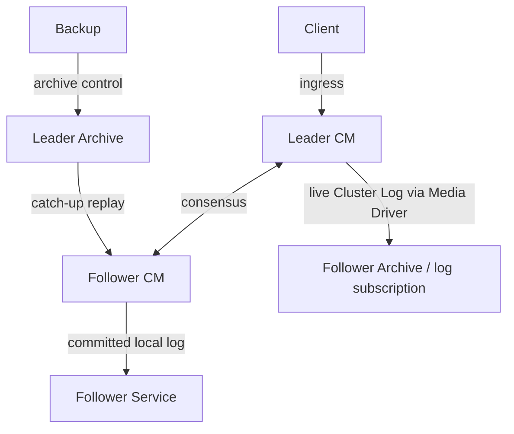
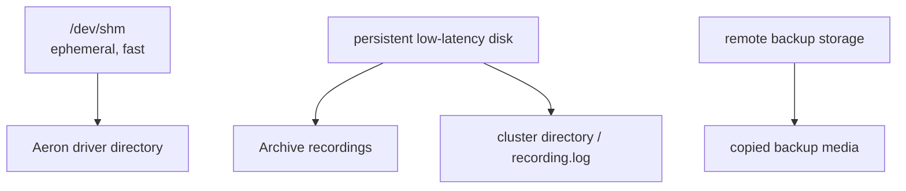
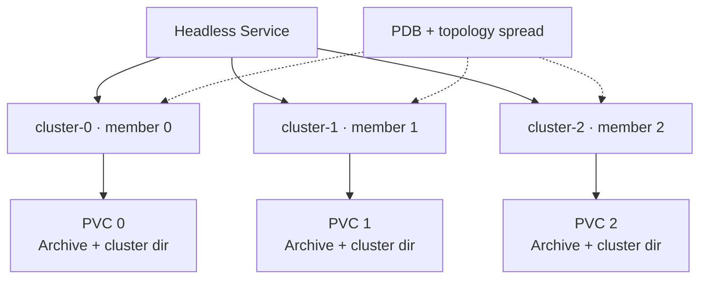
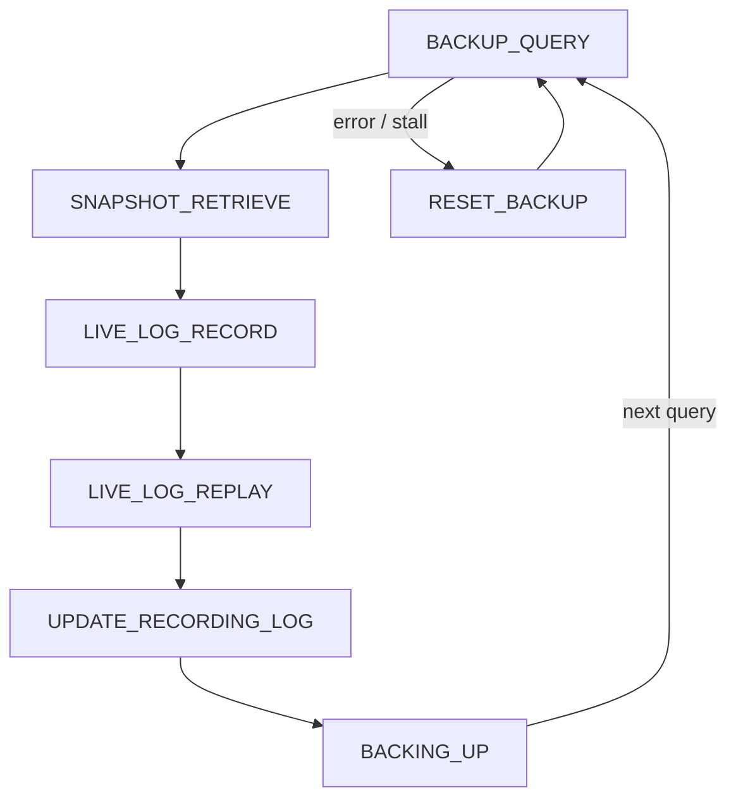
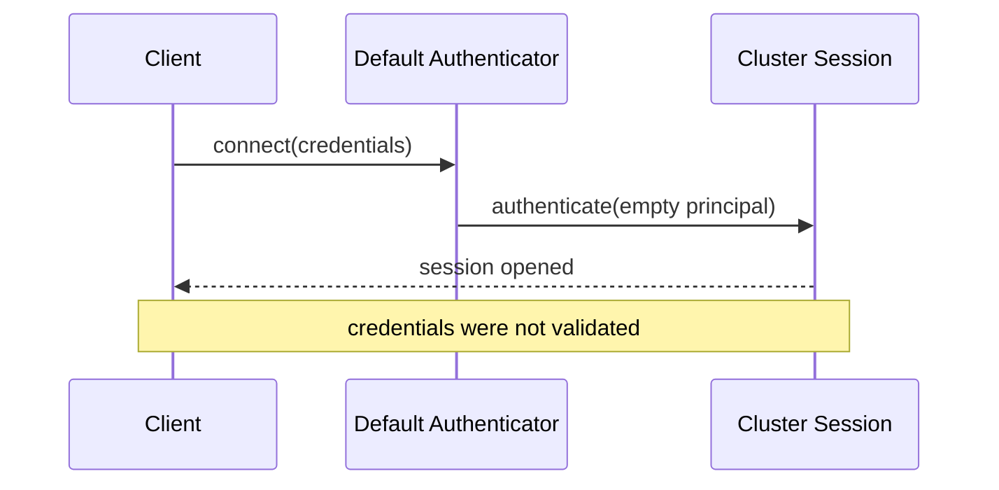
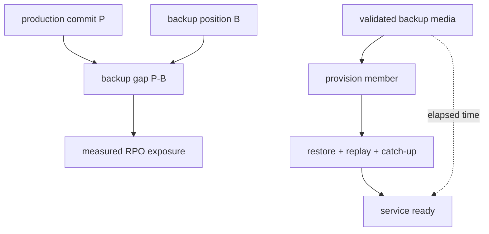

一个 Aeron Cluster sample 在三台笔记本上跑起来，并不等于获得了生产级高可用。真实部署必须同时处理多数派故障域、UDP 网络、Archive 持久盘、节点身份、认证授权、备份恢复和可测量的 RPO/RTO。

这一章不会给出一份可以原样复制的万能配置。它提供的是配置之间的因果关系：哪个 endpoint 服务哪条路径，哪些目录必须持久化，Backup 为什么不能投票，Kubernetes 的 `/dev/shm` 应放什么，以及默认安全实现究竟允许了什么。

## 从故障模型推出成员与运行拓扑

### 先定义你要容忍的故障

部署拓扑应从故障模型反推：

- 单个 JVM 崩溃或长暂停；
- 单台主机宕机；
- 单块磁盘永久损坏；
- 交换机、网卡或网络分区；
- 单个机架/可用区失效；
- 整个集群站点灾难；
- 操作员误删、错误升级或状态污染；
- 凭证泄露或未授权管理请求。

多数派复制主要覆盖前几类在线故障；Cluster Backup 面向冷恢复；备份不能替代网络隔离、访问控制、不可变副本和恢复演练。

### 三成员与五成员怎样布置

三成员需要两票，可容忍一名成员不可用；五成员需要三票，可容忍两名成员不可用。生产常在 3 和 5 之间选择，而不是使用没有故障余量的 2。



成员应落在独立故障域，但不能忽略 quorum 延迟。把一个投票成员放到高延迟远端机房，可能让多数派 commit 受 WAN 抖动和丢包影响。若目标是同城低延迟高可用，通常让投票成员位于低延迟网络内，再用 Backup/Standby 解决站点级灾备。

#### “分散”必须具体

三台虚拟机若共享同一物理宿主、同一电源或同一网络设备，仍可能同失效。部署记录应明确：

- host / rack / zone；
- NIC 与交换路径；
- 持久盘与控制器；
- CPU NUMA 节点和核分配；
- JVM、Media Driver、Archive、CM、Service 的线程拓扑；
- 网络和存储容量上限。

高可用不是实例数，而是独立故障域与可验证恢复路径。

### `clusterMembers` 的六个 endpoint

静态成员字符串的典型 entry 是：

```text
memberId,ingress,consensus,log,catchup,archive
```

成员之间用 `|` 分隔。六个字段职责不同：

| 字段 | 流量 | 主要参与者 |
| --- | --- | --- |
| `memberId` | 稳定整数身份 | 配置、recording metadata、选举 |
| `ingress` | 客户端命令入口 | client/gateway → Leader |
| `consensus` | 心跳、投票、成员控制 | Consensus Module ↔ CM |
| `log` | live Cluster Log | Leader → Follower |
| `catchup` | 落后成员追赶 | Archive/replay → Follower |
| `archive` | 远程 Archive 控制 | Cluster/Backup → Archive |



不要因为开发机只有一个网卡就把所有 endpoint 永久合并成一个端口。生产可按风险隔离客户端入口、成员共识、日志复制和 Archive 控制流量，并为每类流量设置防火墙规则和独立观测。

#### 本地 IPC 与网络复制

Consensus Module 应与它控制的本地 Archive 共置，并通过 IPC control channel 交互。Service Container 通常通过 IPC/spy 读取本地 live log。

但 `replicationChannel` 是本地 Archive **接收其他节点复制数据**的 endpoint，必须被远端成员访问。把它配置成 `localhost` 可能在单机 sample 中工作，在多机恢复和 Backup 时失败。

#### 节点身份必须稳定

成员重启后应以原来的 member id、endpoint entry 和持久目录回来。不要让 Auto Scaling Group 随意给它一个新 id，再把旧 Archive PVC 挂上去。身份、录制和成员配置不匹配会破坏恢复假设。

### 哪些目录可以丢，哪些不能

典型节点有：

- Aeron driver directory：客户端与 Media Driver 共享的运行时文件；
- Archive directory：Cluster Log、snapshot 和录制目录；
- cluster directory：`recording.log`、mark file 等 Cluster 元数据；
- 应用日志、诊断文件和 core dump 目录。



`/dev/shm` 很适合临时 Aeron driver directory，因为它是内存文件系统；**不能把 Archive recordings 或 cluster durable state 放在只存在于 Pod 生命周期内的 `/dev/shm`**。

Archive 和 cluster directory 应位于低延迟、容量可预测的持久盘。两者需作为一致恢复材料管理；只保留 `.logbuffer` 文件而丢失 `recording.log`，或只保留元数据而丢失 recording，都不是完整备份。

#### 磁盘策略属于确认语义

需要明确：

- Archive `fileSyncLevel`；
- 存储是否真正兑现 flush/fsync；
- page cache、控制器缓存和断电保护；
- snapshot 与历史 log 的保留；
- 最低剩余空间和自动报警；
- 磁盘满时是停止入口、停节点还是让写失败。

默认 sync level 为 0，不能把“多数派 recording position”自动解释成所有磁盘已做强制持久化。提高 sync level 会增加延迟，应以故障模型和压测决定。

### CPU、Agent 与线程模式

每个节点至少有 Media Driver、Archive、Consensus Module 和 Service 的 duty cycle。不同 threading mode 会合并或拆分 Agent；生产选择需要平衡：

- 更少线程：核数占用低，但一个慢 Agent 影响更多组件；
- 更多专用线程：故障隔离和尾延迟更好，但需要更多物理核；
- busy-spin idle：延迟低但持续占核；
- backoff/sleep：节省 CPU 但增加唤醒延迟。

容器 CPU limit 若小于 busy-spin Agent 需求，调度节流可能表现成网络超时和 election churn。CPU affinity、NUMA、IRQ、GC 和日志线程都要纳入容量测试，不能只测业务方法耗时。

### Kubernetes：StatefulSet，而不是随意 Deployment

Cookbook 展示了在 Kubernetes 中运行 Cluster 的基础思路。生产化需要把 sample 中隐含的假设补齐。

推荐拓扑：

- StatefulSet 提供稳定 ordinal；
- Headless Service 提供每个 Pod 的稳定 DNS；
- 从 ordinal 确定 member id，但成员表仍是受版本控制的明确配置；
- init/startup 阶段等待自身和其他必要 DNS 可解析；
- 为 Archive 与 cluster directory 挂持久 PVC；
- 用 memory-backed `emptyDir` 只承载 Aeron driver directory；
- PodDisruptionBudget 避免计划维护同时拿走多数成员；
- anti-affinity/topology spread 把成员分散到故障域；
- termination grace period 足够完成受控关闭。



#### Readiness 不能只检查进程端口

Pod Java 进程存活不表示成员可接收业务。Readiness 至少要结合：

- Consensus Module/Service 已成功启动；
- 节点不是持续 Election/Recovery 状态；
- Leader 对外 ingress 已就绪，或 Gateway 能正确重定向；
- Archive/磁盘没有致命错误；
- 配置、appVersion 和 snapshot 已验证。

Liveness 也不能因短暂选举就重启所有 Pod。错误的探针会把一次可恢复 Election 放大成滚动崩溃。

### 当前开源版本的成员边界

1.52.2 的生产设计应按 **静态成员**理解。Backup 文档的替换流程要求复用已有成员 entry；当前 `ClusterTool` CLI 也没有添加/移除投票成员的命令。

源码中仍能看到 `AddPassiveMember`、`RemoveMember`、`JoinCluster` 等旧 codec，以及明确标注 “Unused” 的 Dynamic Join 事件。它们的存在不等于当前发行版提供可支持的在线扩容功能。

因此替换永久损坏成员时，通常需要：

1. 停止/隔离旧成员，保留证据；
2. 用相同 member id 和成员 entry 准备新实例；
3. 从 Cluster Backup 或受信任成员复制恢复材料；
4. 验证 Archive/recording log；
5. 启动并让它 catch up；
6. 观察 ready、append lag 和 Election 稳定性。

不要根据 Operating 文档里泛化的“changing membership”措辞，推导出未验证的在线成员变更能力。

## Backup 怎样形成可恢复材料

### Cluster Backup 到底是什么

开源 `ClusterBackup` 是一个独立 Agent：定期向 Cluster 查询状态、复制最新 snapshot，在 Backup Archive 建立本地 recording subscription，然后向源 Cluster Archive 请求一条以 **Leader commit-position counter 为动态上界**的 bounded replay。本地 Archive 持续录制这条 replay、追随移动的提交上界，并更新本地 `RecordingLog`。它不是把业务 Service 接入 live log，也不是普通 `ReplayMerge`。

1.52.2 的状态是：

| code | Backup State | 含义 |
| ---: | --- | --- |
| 0 | `BACKUP_QUERY` | 查询 Leader 的备份元数据 |
| 1 | `SNAPSHOT_RETRIEVE` | 取回最新 snapshot set |
| 2 | `LIVE_LOG_RECORD` | 在 Backup Archive 建立 Cluster Log 的本地录制 |
| 3 | `LIVE_LOG_REPLAY` | 从已知位置发起 commit-bounded replay，并追随 Leader commit 上界 |
| 4 | `UPDATE_RECORDING_LOG` | 更新备份侧恢复元数据 |
| 5 | `BACKING_UP` | 观察本地 recording position，持续追随移动上界并等待下次 query deadline |
| 6 | `RESET_BACKUP` | 错误或停滞后重置流程 |
| 7 | `CLOSED` | 已关闭 |



#### Backup 明确不是什么

Cluster Backup：

- **不是投票成员**，不增加 quorum；
- **不是自动故障转移节点**；
- **不是已经执行实时业务状态的热备服务**；
- **不保证零 RPO**，最后一段尚未复制的数据可能丢失；
- **不保证零 RTO**，恢复需要供应节点、复制介质、验证和 catch-up；
- **不能替代异地不可变备份**，它自身也可能被误操作或同站点故障影响。

它更接近持续准备恢复材料的冷灾备。RPO 应以 `Leader commit position - backup recording position` 和 snapshot 新鲜度测量；RTO 应通过从 Backup 真正重建节点的演练测量。

#### 典型成员重建流程

官方 Backup 文档给出的要点是：先让 Cluster 拍 snapshot，等待 Backup 接近当前状态，停止 Backup，在新成员主机复制备份的 Archive 数据和 cluster `recording.log`，但不要复制运行时 mark file，然后以现有成员 entry 启动并追赶。

恢复材料在复制期间必须保持一致；最好先停止 Backup 或制作文件系统一致性快照，而不是边写边用普通文件复制赌完整性。

### Standby 与 Backup 不要混称

Aeron Cluster Standby 是 Premium 能力，与开源 Cluster Backup 不同。Standby 可在远端处理复制状态，手动激活时更接近热灾备；但它仍不是同步 WAN quorum，也可能丢失尚在传输或未到达 Standby 的数据。

架构评审中应明确写：

```text
voting member / open-source ClusterBackup / premium Cluster Standby
```

不要统称“备用节点”，否则团队会对自动接管、RPO、是否执行服务、许可和运维动作形成不同理解。

## 哪些安全边界必须由部署者补齐

### 默认认证其实是放行

1.52.2 的 `DefaultAuthenticatorSupplier` 会立即认证每一个连接，并使用空字节数组作为 encoded principal。它是为了开箱运行的默认实现，**不是安全认证**。



生产应实现 `AuthenticatorSupplier` / `Authenticator`，支持 connect request、可选 challenge/response、凭证校验和 principal 编码。认证产生的 principal 可通过 `ClientSession.encodedPrincipal()` 交给业务服务。

要分清三种身份：

- authenticator 内部的 authentication session id；
- Aeron transport session id；
- 长期业务主体 client/account/tenant id。

它们不能互相替代。业务主体与 principal 的绑定应由协议和服务状态明确验证。

### 默认 AuthorisationService 的真实范围

`AuthorisationService` 接收：

```java
isAuthorised(protocolId, actionId, optionalType, encodedPrincipal)
```

Consensus Module 默认 supplier 返回 `AllowBackupAndStandbyAuthorisationService`。当前源码只允许 Cluster schema 中的：

- `BackupQuery`；
- `HeartbeatRequest`；
- `StandbySnapshot`。

这主要保护 Backup/Standby 等 Cluster 管理控制动作。不能据此声称“Cluster 已自动为每条业务命令调用统一授权”。普通应用 ingress payload 的 action 语义由你自己的 codec 和服务定义，业务授权必须在 Gateway/Clustered Service 中根据 principal、tenant、命令类型和当前状态实现。

建议分层：

1. 网络 ACL 限制谁能到达 ingress、consensus、archive endpoint；
2. Authenticator 验证连接凭证并产生 principal；
3. Cluster AuthorisationService 限制受支持的管理协议动作；
4. Gateway 做限流、协议与粗粒度权限检查；
5. Clustered Service 做权威业务授权并把决定纳入确定状态。

### 认证不等于加密

Authenticator 和 AuthorisationService 不会自动加密 UDP payload，也不提供通用 TLS 通道。机密性、链路完整性和抗流量窃听需要独立设计：

- 隔离网络、VPC/VLAN 和最小化防火墙规则；
- 受控 Gateway 作为唯一业务入口；
- 跨不可信网络使用经过验证的 VPN/加密隧道或对应商业安全传输能力；
- 密钥由专用 secret 管理系统轮换；
- 不在 error log、mark file 或启动参数中泄露凭证；
- 对高敏业务 payload 做应用层加密时仍保留可验证版本和密钥 id。

Archive recordings 和 snapshot 包含完整业务历史与 principal，也必须做磁盘加密、访问控制、备份加密和保留期管理。

### 管理面是高权限入口

`ClusterTool`、Archive control、mark file 和 cluster directory 都应视为高权限资产。能执行 `snapshot`、`shutdown`、`abort` 或 invalidate snapshot 的操作者，可以影响可用性与恢复链。

生产控制要求：

- 管理命令只从堡垒机/受控 sidecar 发起；
- 文件系统权限按服务账户最小化；
- 命令、操作者、目标 cluster id、时间和结果进入审计；
- 操作前检查当前 Leader、term、recovery plan 和备份新鲜度；
- 高风险恢复命令执行前复制元数据和 Archive；
- 自动化脚本对路径、cluster id 和目标成员做硬校验。

## 用恢复与安全证据决定是否准入

### 灾备 SLO 怎样落到测量

至少记录：

```text
Online availability:
  quorum size, tolerated failures, election RTO

Backup RPO:
  commitPosition - backupLiveLogPosition
  age of latest complete snapshot set

Recovery RTO:
  provision + copy + validate + replay + catch-up + readiness
```



每季度至少做一次隔离恢复演练：从实际 Backup 介质启动新环境、运行 `validate-recording-log` 和 `recovery-plan`、加载服务、比对业务摘要，并记录完整耗时。只有“备份 Agent 是 BACKING_UP”不能证明可恢复。

### 部署验收：故障、恢复与安全证据

这里保留验收项，是因为每一项都对应一个可观察的部署事实或一次必须完成的恢复演练，而不是对正文的泛化复述：

- 3/5 个投票成员是否跨独立故障域且网络延迟可接受？
- `clusterMembers` 在所有节点是否逐字一致？
- 每个 endpoint、stream id 和端口是否有清晰所有者？
- `replicationChannel` 是否真正可被远端访问？
- Archive/cluster directory 是否在持久低延迟盘？
- `/dev/shm` 是否只承载可重建的 driver 文件？
- sync level、确认语义和断电测试是否一致？
- CPU limit、Agent 数量与 IdleStrategy 是否经过压力测试？
- Kubernetes 是否使用 StatefulSet、PVC、PDB 和反亲和？
- 是否替换默认放行的 Authenticator？
- 业务 authorization 是否在服务内做权威检查？
- 网络和静态数据是否加密/隔离？
- Backup 是否独立故障域、持续监控 lag，并做过重建演练？
- 团队是否明确 Backup 非 voter、非自动 failover？

只有拓扑配置、介质持久性、安全边界和 Backup 恢复同时留下证据，部署才可进入生产。任一项依赖“默认应该可以”或尚未做过真实恢复时，应停止发布或明确降级可用性承诺。

## 结论：生产可靠性来自可验证的故障隔离与恢复边界

Cluster 的生产可靠性来自具体资源：低延迟多数派网络、稳定成员身份、可持久化且可验证的 Archive/cluster 目录、足够 CPU，以及明确的认证与业务授权。Kubernetes 只能编排这些资源，不能替你创造状态一致性。

开源 Cluster Backup 持续复制 snapshot 和 live log，但不投票、不自动接管，也不提供零 RPO。默认 Authenticator 会立即放行空 principal，默认 AuthorisationService 的允许范围主要是 Backup/Standby 控制动作；业务命令授权和链路加密仍由部署者负责。

最后一章将把这些资源变成可操作的观测系统：应该看哪些 counters，ClusterTool 当前有哪些真实命令，如何从位置、状态、CPU、磁盘和 UDP 指标建立排障 Runbook。

## 一手资料

- [Aeron Cluster Backup](https://aeron.io/docs/aeron-cluster/cluster-backup/)
- [Operating Aeron Cluster](https://aeron.io/docs/aeron-cluster/operating-aeron-cluster/)
- [Aeron Configuration Options](https://github.com/aeron-io/aeron/wiki/Configuration-Options)
- [Cookbook：Running Aeron Cluster on Kubernetes](https://aeron.io/docs/cookbook-content/aeron-cluster-running-on-k8s/)
- [ClusterBackup 1.52.2 源码](https://github.com/aeron-io/aeron/blob/1.52.2/aeron-cluster/src/main/java/io/aeron/cluster/ClusterBackup.java)
- [ClusterBackupAgent 1.52.2 源码](https://github.com/aeron-io/aeron/blob/1.52.2/aeron-cluster/src/main/java/io/aeron/cluster/ClusterBackupAgent.java)
- [DefaultAuthenticatorSupplier 1.52.2](https://github.com/aeron-io/aeron/blob/1.52.2/aeron-client/src/main/java/io/aeron/security/DefaultAuthenticatorSupplier.java)
- [Authenticator 1.52.2](https://github.com/aeron-io/aeron/blob/1.52.2/aeron-client/src/main/java/io/aeron/security/Authenticator.java)
- [AuthorisationService 1.52.2](https://github.com/aeron-io/aeron/blob/1.52.2/aeron-client/src/main/java/io/aeron/security/AuthorisationService.java)
- [AllowBackupAndStandbyAuthorisationService 1.52.2](https://github.com/aeron-io/aeron/blob/1.52.2/aeron-cluster/src/main/java/io/aeron/cluster/AllowBackupAndStandbyAuthorisationService.java)
- [Cluster Standby](https://aeron.io/docs/cluster-quickstart/high-availability/#cluster-standby)
