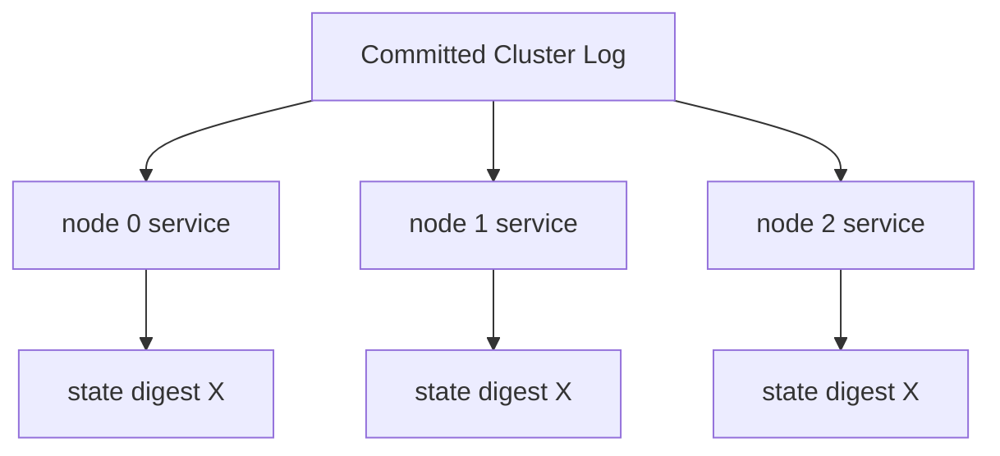
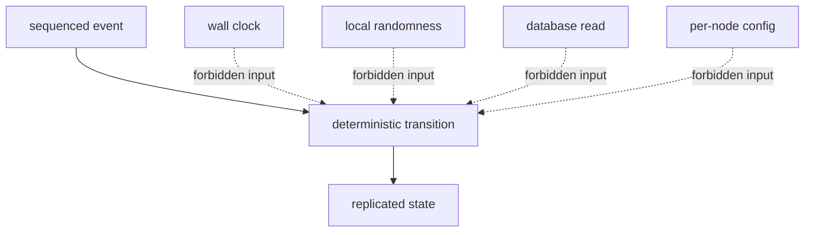
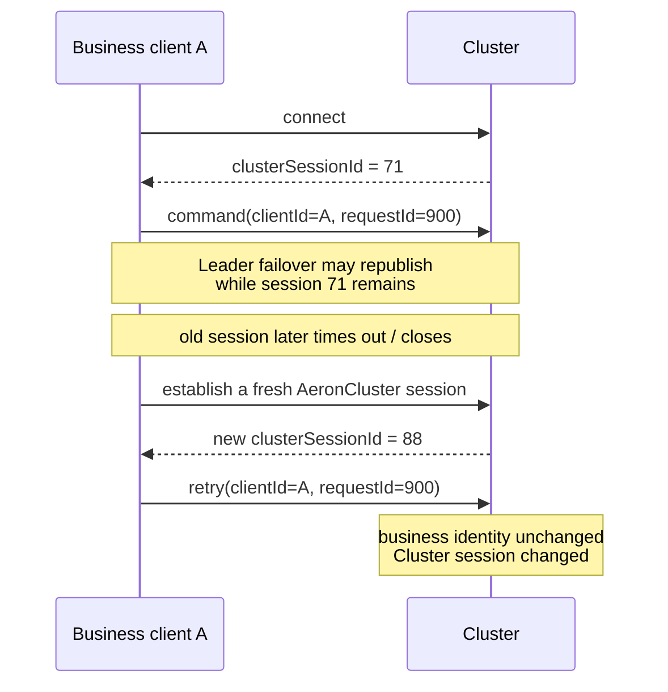
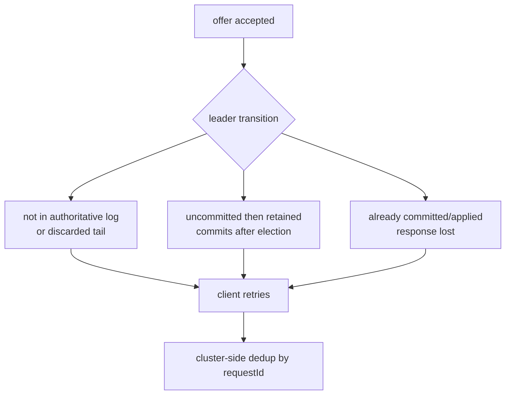
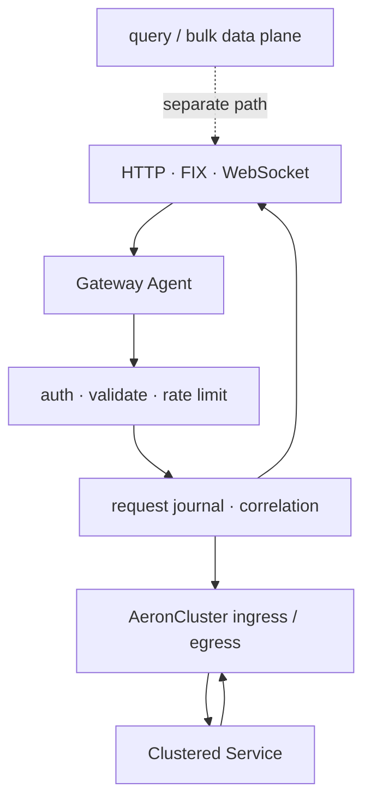
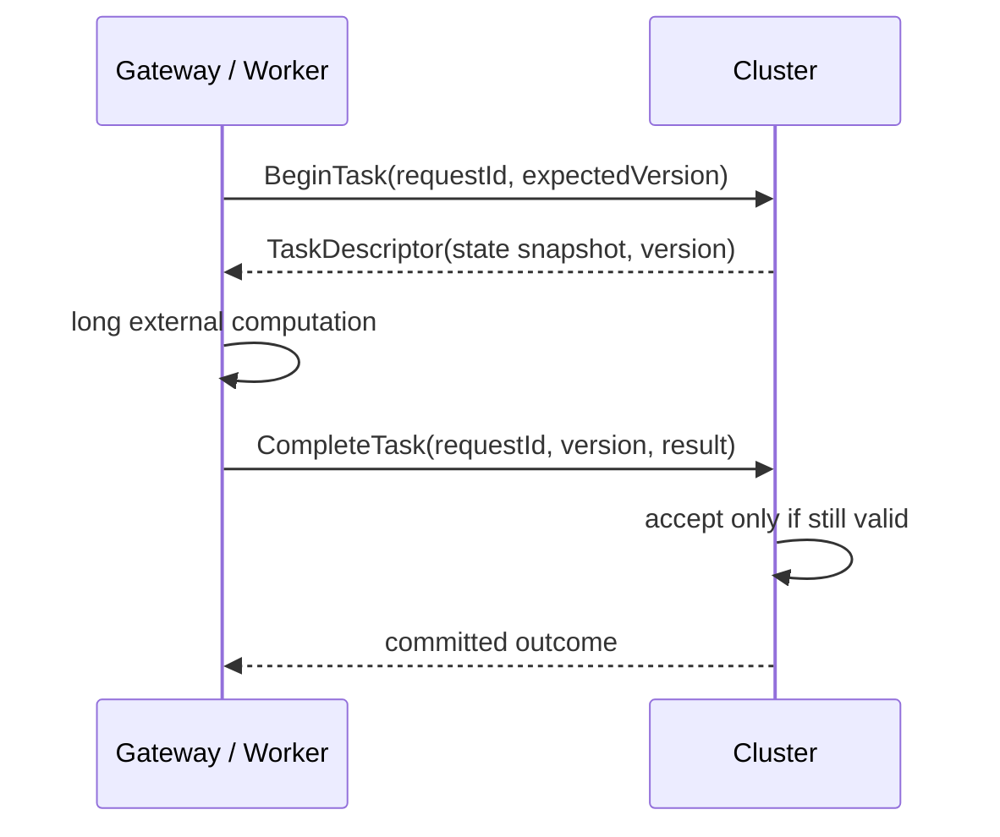
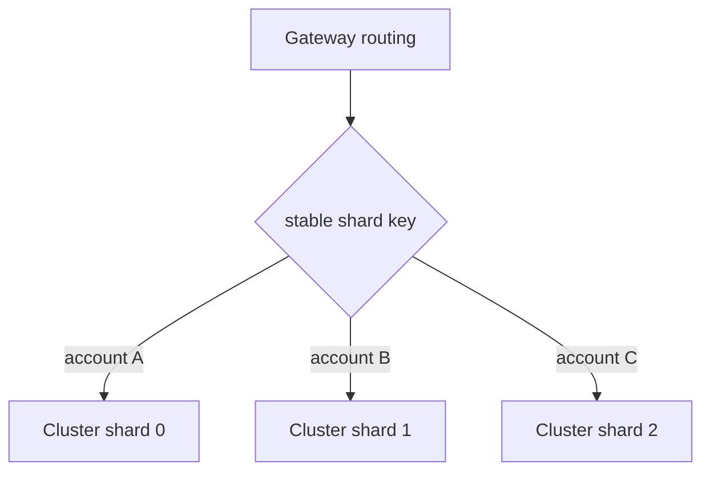

复制一份日志并不难，难的是让每个副本在任何时刻重放这份日志，都得到完全相同的业务状态。Aeron Cluster 把已提交输入按顺序交给 `ClusteredService`，但它无法替应用识别隐藏在代码里的时钟、随机数、无序遍历、数据库读取和重复请求。

这一章关注 Cluster 最关键的应用契约：**状态只能由已排序输入决定。** 我们会同时处理客户端侧的另一个现实：网络故障后，“请求是否已经提交”常常不可知。确定性解决副本之间的一致，幂等与对账解决客户端和外部系统之间的不确定。

## 确定性状态机怎样约束代码与输入

### 把业务写成状态转换函数

理想模型可以写成：

```text
newState, effects = apply(oldState, orderedEvent)
```

同一版本的服务，只要拥有同一初始状态并按同一顺序收到事件，就必须生成同一 `newState` 和同一逻辑效果描述。



注意“逻辑效果”和“物理副作用”的区别。所有节点都可以确定地算出“应向客户返回成交结果”，但只有 Leader 真正发 egress；所有节点都可以记录“应提交清算”，但不能让每个副本各自调用一次支付或数据库接口。

### ClusteredService 的回调边界

1.52.2 的主要生命周期如下：

```java
void onStart(Cluster cluster, Image snapshotImage);
void onSessionOpen(ClientSession session, long timestamp);
void onSessionClose(ClientSession session, long timestamp, CloseReason reason);
void onSessionMessage(
    ClientSession session,
    long timestamp,
    DirectBuffer buffer,
    int offset,
    int length,
    Header header);
void onTimerEvent(long correlationId, long timestamp);
void onTakeSnapshot(ExclusivePublication publication);
void onRoleChange(Cluster.Role newRole);
void onTerminate(Cluster cluster);
int doBackgroundWork(long nowNs);
```

还有 `onNewLeadershipTermEvent(...)`，用于观察新 leadership term、log position、leader member、time unit 与 app version。

这些回调不是同一种语义：

| 回调类别 | 典型方法 | 能否确定地修改业务状态 | 能否追加 Cluster Log |
| --- | --- | --- | --- |
| 已排序核心事件 | session open/close/message、timer | 可以 | 可按 API 契约发送 service message 或 timer 请求 |
| 新 leadership term | `onNewLeadershipTermEvent` | 可以 | `Cluster.offer` 可用；不要在此调度或取消 timer |
| 恢复与快照 | `onStart`、`onTakeSnapshot` | 加载/序列化现有状态 | 不应发送消息或调度 timer |
| 角色与终止 | `onRoleChange`、`onTerminate` | 不应改变复制业务状态 | 不应追加日志 |
| 本地后台工作 | `doBackgroundWork` | **禁止** | **禁止**调用会更新日志的 Cluster API |

官方接口注释明确规定：`Cluster` 对象应只在已排序事件的响应中用于发送消息；不能从 `onStart`、`onRoleChange`、`onTakeSnapshot`、`onTerminate` 等生命周期回调发起这些动作。`onSessionOpen`、`onSessionClose` 和 `onNewLeadershipTermEvent` 是 `Cluster.offer` 顶层契约明确列出的例外，它们来自日志序列，仍必须保持确定性。Timer 的方法级契约更窄：`scheduleTimer` / `cancelTimer` 只保证能从 `onSessionMessage`、`onTimerEvent`、`onSessionOpen` 和 `onSessionClose` 使用；不要把 `onNewLeadershipTermEvent` 对 `offer` 的例外扩大成 timer 保证。

#### `doBackgroundWork` 不是第二条业务线程

`doBackgroundWork(nowNs)` 适合短小、常量时间的本地维护，例如保持一个外部连接活跃。它不能直接或间接修改服务状态，也不能调用 `Cluster.scheduleTimer(...)` 或 `Cluster.offer(...)` 等更新日志的 API。

`nowNs` 只适合测量本地经过时间，语义类似 `System.nanoTime()`；它不是 `Cluster.time()`，不能进入复制业务决策。

错误示例：

```java
public int doBackgroundWork(long nowNs)
{
    if (priceFeed.hasUpdate())
    {
        state.markPrice = priceFeed.read(); // 副本会分叉
        return 1;
    }
    return 0;
}
```

正确方向是让外部价格先经过授权的 gateway，编码成带版本的命令进入 ingress；每个副本再在 `onSessionMessage` 中处理相同价格事件。

### 隐蔽的非确定性来源

很多非确定性代码在单节点测试里完全正常：

- `System.currentTimeMillis()`、`Instant.now()`；
- `UUID.randomUUID()`、`SecureRandom`、未固定种子的 PRNG；
- 直接读取数据库、文件、HTTP、DNS 或环境变量；
- 每个节点读取不同的动态配置；
- 使用 `HashMap` / `HashSet` 的遍历顺序生成结果；
- 依赖线程调度、并行 stream、异步回调先后；
- 使用环境相关的浮点计算、默认时区或 locale；
- 在 Leader 与 Follower 上走不同业务分支；
- 把对象地址、线程 id 或本地自增量写进状态。



替代方法不是“避免所有时间和随机”，而是让它们成为有序协议的一部分：

- 时间使用回调提供的 cluster timestamp，或通过 Cluster Timer 生成已排序事件；
- ID 从状态机内的确定计数器生成，或由客户端携带稳定 request id；
- 随机决策在 gateway 生成结果后作为命令输入，或者使用由日志事件确定的种子；
- 配置和 reference data 以版本化命令进入日志；
- 遍历前按稳定业务键排序；
- 金额和数量使用有清晰舍入规则的整数或定点表示。

#### 先验证，再修改

状态机没有数据库事务替你 rollback。一条命令应先完成结构、权限、版本和业务约束检查，再修改任何持久状态：

```text
decode → validate envelope → authenticate identity
       → authorize action → validate expected version
       → calculate complete transition
       → mutate state → record dedup result → respond
```

如果在更新余额后才发现订单字段非法，抛异常不会自动把所有副本回滚。服务异常还可能终止 Agent，触发集群不可用或选举，而不是安全地把这一条命令标成失败。

## 客户端未知结果怎样由协议吸收

### Session 不是业务身份

`ClientSession` 表示客户端与 Cluster 的复制会话。正常 Leader failover 时，同一个 `AeronCluster` 客户端会处理 `NewLeaderEvent`、重建 ingress Publication，原 `clusterSessionId` 可以继续保持；只有旧 session 已 timeout / close，或应用重新建立全新的 AeronCluster session，才会得到新的 id。它适合路由响应、观察 open/close、读取认证 principal；无论是否跨一次选举保持，都不适合作为长期用户、设备或业务账户主键。



建议在连接认证 principal 或每个命令 envelope 中携带稳定身份：

```text
tenantId
clientId / accountId
requestId
protocolVersion
messageType
payloadLength
payload
```

Cluster 默认最大并发 session 数是 10。生产配置应基于实际连接规模设置 `aeron.cluster.max.sessions`，并为断线期间新旧 session 短暂重叠留余量。达到上限不是“业务用户满了”，而是 Cluster 会话容量满了。

### `offer` 成功不等于业务成功

客户端调用 `AeronCluster.offer(...)` 得到正值，只说明消息被当前 Aeron Publication 接受。之后仍可能经历：

1. 未到达 Leader；
2. 到达 Leader但尚未写入有效日志；
3. 已追加但没有形成多数派提交；
4. 已提交但服务尚未执行；
5. 已执行但响应尚未发送；
6. 响应已发送但客户端没有收到。

因此业务完成必须由关联的 egress 响应、后续状态查询或对账确认，而不能把 `offer > 0` 当作成交或入账成功。

#### Leader 切换时的四种结果

假设客户端发送 `requestId=900` 后连接中断：

| 情形 | Cluster 事实 | 客户端观察 | 重试风险 |
| --- | --- | --- | --- |
| A | 命令未进入最终权威日志 | 没有响应 | 重试可能是第一次执行 |
| B | 当时未提交，旧尾部在 Election 中被权威日志覆盖 | 没有响应 | 重试可能是第一次提交执行 |
| C | 故障瞬间尚未提交，但该尾部由胜选日志保留，Election 追齐 quorum 后才提交、执行 | 没有响应 | 重试可能与稍后完成的原请求重复 |
| D | 故障前已提交并执行，只是 egress 丢失 | 没有响应 | 重试会重复执行，除非去重 |

客户端从“没有响应”无法区分四种情形。尤其不能把“Leader 崩溃时还没 commit”直接等同于“以后绝不会 commit”：Election 会选择权威日志，保留下来的尾部可以在新领导期追齐多数派后提交。这是 **delivery ambiguity**，不是 Raft 已提交数据丢失。



#### 一个实用的幂等协议

服务按稳定业务身份维护一个有界去重表：

```text
(clientId, requestId) → {status, responseDigest, responsePayload or resultRef}
```

处理命令时：

1. 若 request id 已完成，返回相同结果，不重复修改状态；
2. 若未出现，验证并执行状态转换；
3. 将业务状态与去重结果一起纳入同一次确定性更新；
4. 在 snapshot 中保存仍处于重试窗口内的去重记录；
5. 用协议定义去重窗口、过期条件和超窗行为；
6. 客户端保留 pending journal，直到收到确认或查询到确定结果。

“服务端去重表无限增长”不是完整方案。可以按每个 client 的单调序号保留高水位与有限结果窗口，也可以使用带明确过期规则的 request id；过期必须由日志时间/事件驱动，不能各节点看本地墙钟清理。

#### 业务协议如何承接状态机边界

命令 envelope 必须在任何状态修改前完成长度、schema id、template id、版本和枚举校验；价格、数量等定点字段还要固定单位、范围与溢出规则。稳定业务身份与认证 principal 的关系不能由 cluster session id 代替。

每条命令携带 request/correlation id、aggregate id 和需要时的 expected version。协议同时定义幂等窗口、响应丢失后的状态查询，以及“可重试、永久失败、结果未知”三类终态；Snapshot 则保存仍在有效窗口内的去重和协议版本状态。

未知消息、旧版本和额外字段必须走确定且可观察的路径。Decoder 先证明消息边界，再读取字段；非法输入在修改状态前拒绝并增加 invalid-request counter。这样协议不是字段目录，而是客户端不确定性与复制状态机之间的合同。

### 响应为什么只由 Leader 发出

所有副本都执行 `session.offer(...)` 这行代码，但 `ClientSession` 的契约规定：Leader 实际向 egress Publication 提交，Follower 返回 `MOCKED_OFFER`。

业务逻辑不能写成：

```java
if (session.offer(buffer, offset, length) > 0)
{
    state.responseCount++; // Leader 与 Follower 的物理结果不同
}
```

应该先确定地更新 `responseCount`，再把发送视为派生输出。还要处理 Leader 上真实的负返回值，例如 back pressure、not connected、closed 或 max position。

Cookbook 的 slow-client 示例给出几种策略：丢弃、断开客户端、退出 Cluster、持续重试。它们都不是普适答案：

- 丢弃只适合可重建通知，不能悄悄丢命令结果；
- 断开可保护集群，但客户端必须支持查询和重连；
- 退出集群会扩大故障，通常只适合把无法投递视为致命契约违约；
- 无限重试会卡住单线程状态机，可能拖住所有 session 和 timer。

生产实现应有明确的有界预算，并监控 egress stream 102 的背压。

### Gateway 是一致性边界，不只是反向代理

官方 Gateway 设计把外部协议和 Cluster 会话管理从业务状态机分离。一个合格 Gateway 可以负责：

- 维护 `AeronCluster` 连接和新 Leader 更新；
- 把 HTTP、FIX、WebSocket 或内部 RPC 转成版本化二进制命令；
- 身份认证、格式校验、限流与粗粒度授权；
- 生成或验证稳定 request id；
- 维护 pending request 与 egress correlation；
- 将大查询、reference data 或批量结果从命令路径分流；
- 在 Leader 切换后重试和对账。



#### Active-passive 与 active-active

一个 active Gateway 加一个 passive 备用通常更容易证明：只有一个入口拥有客户端连接和 pending 状态，切换后按 request id 恢复。

Active-active Gateway 并非不能做，但必须解决：

- 同一客户可能从两个入口重复发送；
- 两个入口看到的 reference data 和权限版本必须一致；
- correlation 与 egress 分发必须可路由；
- Cluster 侧必须以业务 request id 去重，不能信任 gateway 本地状态；
- 入口切换不能改变命令顺序的业务含义。

如果这些问题没有实际容量或可用性收益，不要仅为了“无单点”引入 active-active。

## 外部工作与数据怎样回到有序输入

### 外部慢任务怎样离开状态机

数据库查询、复杂定价、文件生成和远程 API 调用不应阻塞 `onSessionMessage`。推荐把它们拆成两阶段协议：



Cluster 在第一阶段记录任务、状态版本和 deadline；Worker 在外部执行；完成命令重新进入 Cluster，服务检查任务仍存在、版本未改变、结果格式和权限仍有效，才更新状态。Timer 可以驱动超时，但 timeout 也必须是已排序事件。

这正是官方 RFQ 示例值得学习的部分：把报价请求、外部报价者和 Cluster 内的确定性状态分开。不要照抄示例的业务字段，而应提炼协议边界和超时/重复结果处理。

### 数据库与 reference data

Clustered Service 不应同步访问数据库。否则每个副本可能在不同时间读到不同值，数据库慢查询还会阻塞整个服务 Agent。

可选模式：

- 小型 reference data：由管理员或 gateway 以带版本的命令推入 Cluster；
- 大型数据：用分块、序号、校验和、ACK 与恢复协议逐步导入；
- 查询模型：从已提交事件异步构建外部 projection，允许重放；
- 对外 durable sink：记录输出高水位和幂等键，失败后从 Archive stream 或业务 outbox 恢复；
- 初始状态：通过已验证 snapshot 或确定的 bootstrap command 导入。

大文件不要作为一个超大 ingress 消息赌网络和缓冲区。使用 pull-driven 分块协议：Cluster 明确请求下一块，发送方只在收到 ACK 后推进，Cluster 保存已确认块号和总体摘要。

## 扩展与读取语义怎样保持一致性边界

### 扩展通常依赖业务分片

单个复制状态机必须按一个总序执行，增加同一 Cluster 的成员数主要提升容错，不会让 Leader 上的业务逻辑并行变快。容量超出一个状态机上限时，通常要按业务所有权拆成多个独立 Cluster shard。



分片键必须把需要同一顺序和原子约束的状态放在一起，例如账户、市场或订单簿。分片之后：

- 每个 shard 有独立成员、日志、snapshot、Backup 和 RPO/RTO；
- Gateway 维护版本化路由，重试必须回到相同 shard；
- 跨 shard 不再自动拥有单一 Cluster Log 顺序；
- 跨 shard 事务需要 saga、预留/确认或显式协调协议；
- 扩缩容是状态所有权迁移，不能只改变 hash 取模；
- 迁移要防止旧、新 shard 同时接受同一实体的命令。

在能够证明单 shard 确实到达业务处理上限前，不要过早分片。分片换来吞吐，也把路由、跨分片一致性、运维和灾备成本乘开。

### 多服务不是微服务替代品

Aeron Cluster 可在同一个 consensus log 下运行多个服务。1.52.2 的约束包括：

- service id 从 0 开始连续编号；
- 最大 service count 为 10；
- 每个服务都读取同一条日志；所有 session message 都会进入各容器，是否处理由业务 payload 协议确定；
- Snapshot 集必须包含每个服务；
- 一个慢服务可能影响 snapshot、恢复和运维节奏；
- `aeron.cluster.service.responder` 默认是 `true`。

最后一点尤其容易踩坑：若多个服务都保持 responder，可能对同一 session 产生不期望的物理响应。应明确哪一个服务拥有会话响应职责，其余服务关闭 responder，并通过 service message 或协议事件协作。

不要把十个服务名额理解成“在一个 Cluster 中塞十个微服务”。共享一条全序日志会把独立伸缩、故障隔离和发布节奏耦合在一起。只有确实需要相同顺序和原子观察边界的状态，才适合共处。

### 顺序读取与缓存一致性

Cluster 内状态线性化，不意味着 Gateway 的本地缓存自动是线性一致读。若写命令刚提交，客户端立即读一个异步 projection，仍可能看到旧值。

两种常见语义：

- **最终一致读**：直接读本地 cache，快但可能落后；
- **顺序屏障读**：把 read barrier 作为命令排进 Cluster，返回一个位置/版本，等待 projection 至少应用到该点后再读。

协议必须告诉调用者拿到哪一种语义。不要把“Cluster 是强一致”扩展成“所有 HTTP GET 都线性一致”。

## 用故障与差分测试证明确定性

### 测试确定性，而不只是测试业务结果

推荐建立三层测试：

1. **纯状态机测试**：同一输入序列重复执行，最终 state digest 完全相同；
2. **多实例差分测试**：不同 JVM/节点用相同事件流，逐位置比较摘要；
3. **故障测试**：在 offer、commit、apply、egress 各边界注入崩溃和重连，验证去重与查询协议。

还应把以下变种加入回归：

- HashMap 插入顺序不同；
- locale、timezone 和 CPU 架构不同；
- snapshot 后恢复与从头 replay 得到相同摘要；
- 同一 request id 在不同 cluster session 上重试；
- Worker 结果晚于 timer、重复到达或版本过期；
- egress 长时间背压但其他会话仍受策略保护。

## 结论：确定性解决副本一致，幂等协议吸收外部未知结果

Clustered Service 的价值不在于给普通 Java 对象自动加副本，而在于提供一条严格的已排序回调通道。只有进入这条通道的时间、配置、外部结果和业务命令，才能安全地影响复制状态。

客户端一侧则必须接受现实：`offer` 成功不是提交确认，Leader 切换可能让结果处于未知状态。稳定业务身份、request id、Cluster 内去重、pending journal、状态查询和外部 sink 幂等共同构成交付协议。

下一章会处理状态机的另两个基础设施：Timer 如何变成可重放的日志事件，Snapshot 如何与业务状态、会话、去重表和版本演进共同形成可验证的恢复点。

## 一手资料

- [Efficient Business Logic](https://aeron.io/docs/aeron-cluster/efficient-business-logic/)
- [Aeron Cluster Clients](https://aeron.io/docs/aeron-cluster/cluster-clients/)
- [Gateway Design](https://aeron.io/docs/aeron-cluster/gateway-design/)
- [Cluster Gateway Patterns](https://aeron.io/docs/aeron-cluster/cluster-gateway-patterns/)
- [Client Consistency](https://aeron.io/docs/aeron-cluster/client-consistency/)
- [On Sharding](https://aeron.io/docs/aeron-cluster/on-sharding/)
- [Databases](https://aeron.io/docs/aeron-cluster/databases/)
- [Reference Data](https://aeron.io/docs/aeron-cluster/reference-data/)
- [Application Protocols](https://aeron.io/docs/cluster-quickstart/application-protocols/)
- [Cookbook：RFQ Server](https://aeron.io/docs/step-by-step-rfq-server/requirements-overview/)
- [Cookbook：Slow Clients](https://aeron.io/docs/cookbook-content/aeron-cluster-slow-clients/)
- [ClusteredService 1.52.2 源码](https://github.com/aeron-io/aeron/blob/1.52.2/aeron-cluster/src/main/java/io/aeron/cluster/service/ClusteredService.java)
- [ClientSession 1.52.2 源码](https://github.com/aeron-io/aeron/blob/1.52.2/aeron-cluster/src/main/java/io/aeron/cluster/service/ClientSession.java)
- [ClusteredServiceContainer 1.52.2 源码](https://github.com/aeron-io/aeron/blob/1.52.2/aeron-cluster/src/main/java/io/aeron/cluster/service/ClusteredServiceContainer.java)
