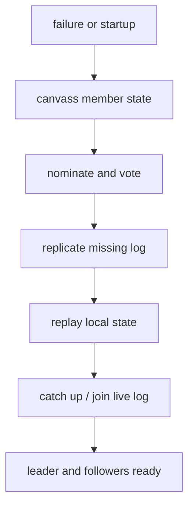
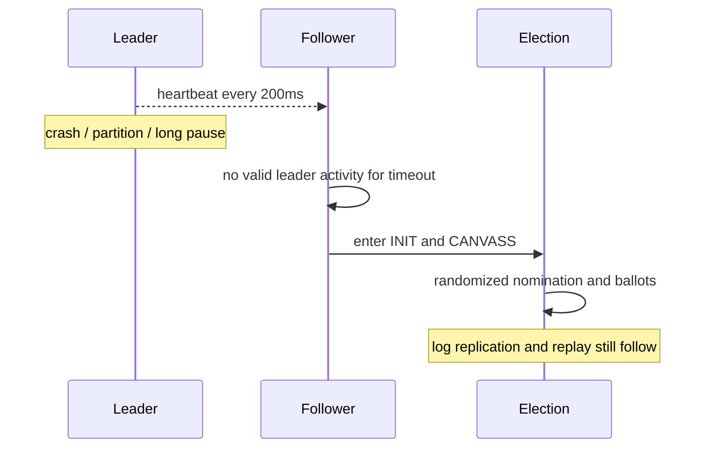
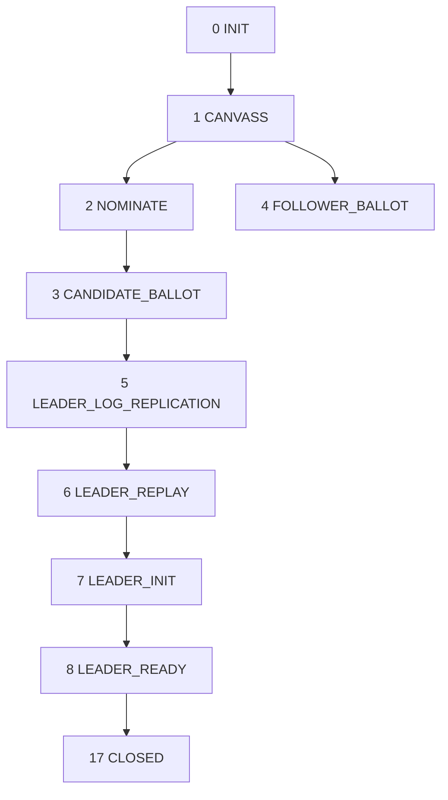
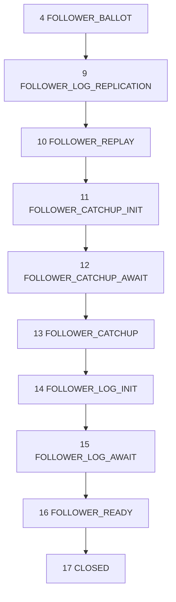
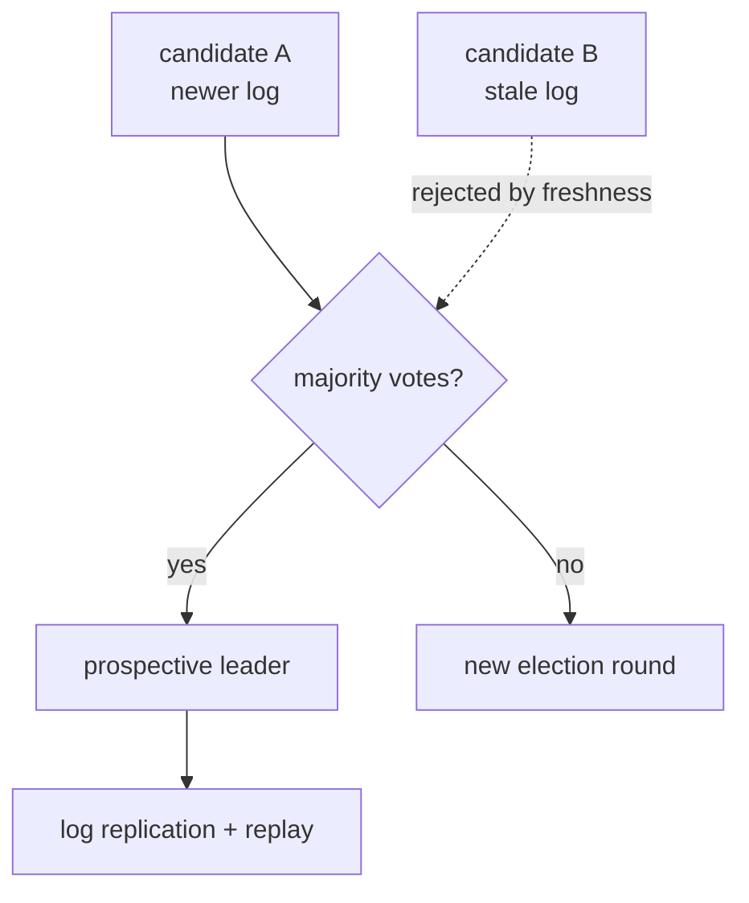
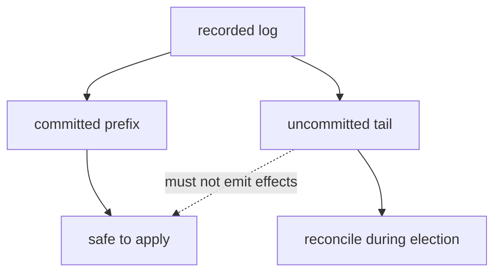
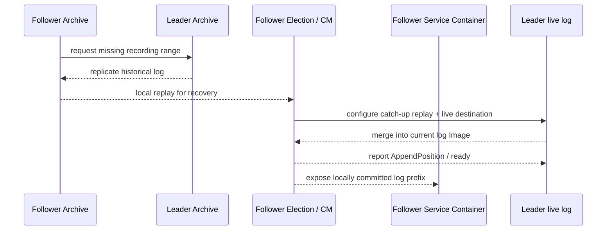
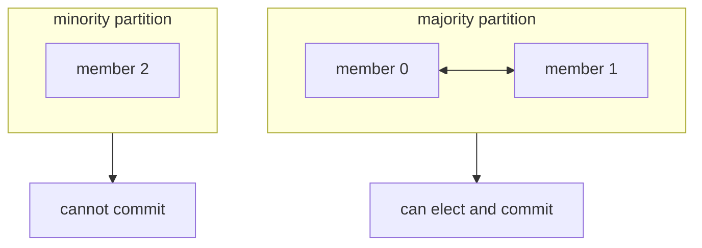
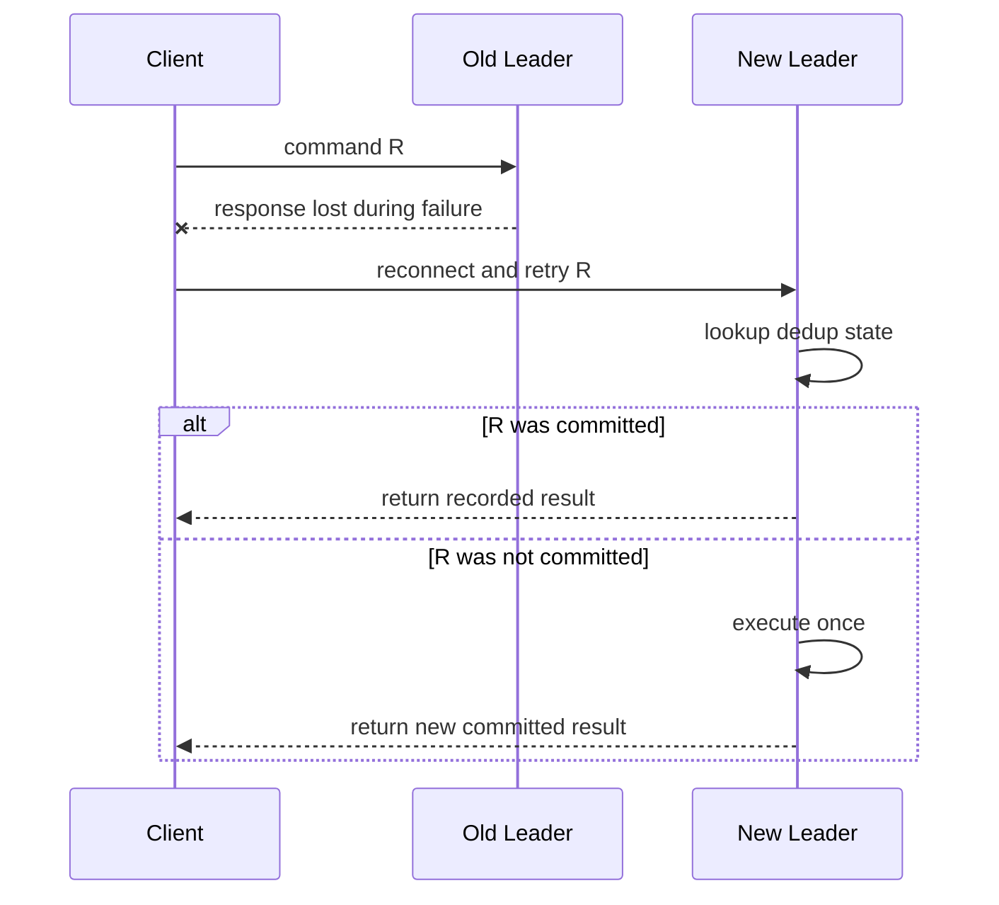

“Leader 挂了就重新选一个”只描述了故障转移最显眼的一小段。新 Leader 在接受写入之前，还要证明自己拥有足够新的日志、补齐必要记录、replay 本地状态、发布新 leadership term，并等待 Follower 重新加入。落后 Follower 也要先复制历史，再从 replay 合并到 live log。

Aeron 1.52.2 用 **18 个 Election State** 把这段过程暴露为 counter。理解这些状态不仅有助于读源码，更直接决定排障方法：集群停在投票、日志复制、replay、catch-up 还是 ready，根因完全不同。

官方 `Election State` 页面中的完整状态图明确标注只对 1.37.0 正确。本文不复用那张旧图，而以 1.52.2 `ElectionState` enum 和 `Election` 实现为准。

## 1. 选举同时解决三个问题

一次 Election 不只是“数票”：

1. **权威性**：谁获得当前 term 的多数派支持；
2. **日志完整性**：候选者是否足够新，缺失日志如何复制；
3. **执行就绪**：Consensus Module 和各服务是否 replay 到可安全加入 live log 的位置。



如果只看 `CANDIDATE_BALLOT → Leader`，会错误估计 RTO，也会忽略磁盘、Archive 和服务 replay 对恢复的影响。

## 2. 故障是怎样被发现的

稳定 Leader 周期性发送心跳，Follower 观察最后一次有效 Leader 活动。1.52.2 的默认值是：

| 配置 | 默认值 | 真实用途 |
| --- | ---: | --- |
| leader heartbeat interval | 200 ms | Leader 发送心跳/状态的节奏 |
| leader heartbeat timeout | 10 s | Follower 判定 Leader 失联的窗口 |
| election timeout | 1 s | 候选/选举阶段的超时基数 |
| startup canvass timeout | 60 s | 启动时等待成员状态汇聚 |
| election status interval | 100 ms | 选举状态消息间隔 |

关键纠正：`electionTimeoutNs` **不是 Leader 故障检测时间**。Leader 失联主要由 `leaderHeartbeatTimeoutNs` 判断。官方 Cluster Errors 页面有一处把设置 heartbeat timeout 的方法写成 `leaderHeartbeatIntervalNs`；1.52.2 的正确配置/API 名是 `leaderHeartbeatTimeoutNs`。

候选 nomination 还会引入随机延迟。当前源码使用：

```java
random.nextDouble() * (electionTimeoutNs >> 1)
```

默认 election timeout 为 1 秒，因此 nomination delay 在 `[0, 500ms)`。它用于减少多个候选者同时竞选；不能把它与 10 秒 Leader timeout 相加后就宣称得到精确 RTO。



## 3. 18 个状态的完整导航

`ElectionState.code()` 与 enum ordinal 相同，并存入 Election State counter。

| code | 状态 | 节点正在完成什么 |
| ---: | --- | --- |
| 0 | `INIT` | 汇总本地状态，准备新一轮领导期 |
| 1 | `CANVASS` | 向成员询问当前 term、log 与状态，判断能否竞选 |
| 2 | `NOMINATE` | 在随机延迟后提名自己并请求投票 |
| 3 | `CANDIDATE_BALLOT` | 候选者等待选票结果 |
| 4 | `FOLLOWER_BALLOT` | 已投票成员等待候选结果 |
| 5 | `LEADER_LOG_REPLICATION` | 新 Leader 等待 Follower 补齐缺失日志到提交边界 |
| 6 | `LEADER_REPLAY` | 新 Leader replay 本地日志，恢复服务状态 |
| 7 | `LEADER_INIT` | 初始化新 leadership term 的发布与状态 |
| 8 | `LEADER_READY` | 发布新 term/commit position，等待 Follower ready |
| 9 | `FOLLOWER_LOG_REPLICATION` | Follower 从新 Leader 复制缺失日志 |
| 10 | `FOLLOWER_REPLAY` | Follower replay 本地日志以准备跟随 |
| 11 | `FOLLOWER_CATCHUP_INIT` | 初始化当前 term 的 catch-up replay |
| 12 | `FOLLOWER_CATCHUP_AWAIT` | 等待加入 Leader 提供的 replay |
| 13 | `FOLLOWER_CATCHUP` | 消费 replay，追到可与 live log 合并的位置 |
| 14 | `FOLLOWER_LOG_INIT` | 初始化加入 live log |
| 15 | `FOLLOWER_LOG_AWAIT` | 等待 live log Image/连接就绪 |
| 16 | `FOLLOWER_READY` | 向 Leader 发布 append position，声明新 term 就绪 |
| 17 | `CLOSED` | Election 结束，进入稳定运行 |

这些状态不是每次都机械地走完所有分支。节点角色、本地日志新旧、是否需要 catch-up、启动还是稳定期故障，会决定具体路径。

## 4. 三条主要状态路径

为了避免一张横向巨图挤进文章侧栏，可以把状态机拆成三条纵向路径。





第一张强调候选者成为 Leader 后仍要复制、replay 和等待就绪；第二张强调 Follower 从投票到 live 状态的完整链路。

## 5. Canvass：先比较日志，再决定谁能竞选

`CANVASS` 让成员交换 leadership term、log term 与 position 等信息。目标不是简单发现“谁在线”，而是判断哪一个成员拥有足够新的日志，可以安全发起 leadership attempt。

一个磁盘较慢但进程仍在线的节点，可能在心跳层面健康，却因为日志落后而不是合适候选者。一个刚重启的节点也不能只凭较高 member id 宣布领导权。

这一阶段常因以下问题拖长：

- 成员 endpoint/DNS 配置不一致；
- Archive recording 或 `recording.log` 缺失/不匹配；
- 某成员仍认为旧 Leader 有效；
- UDP 控制消息丢失或网络 ACL 拦截；
- Agent 被 CPU starvation 或 GC 暂停；
- 节点时钟/timeout 参数差异过大。

排障时应同时查看所有成员的 role、Election State、leadership term、append/commit position 和 error log，而不是只重启“看起来卡住”的节点。

## 6. 投票：多数派与日志新旧共同约束

候选者在 `NOMINATE` 后进入 `CANDIDATE_BALLOT`，其他成员进入 `FOLLOWER_BALLOT`。获得多数票是必要条件，但不是唯一条件；成员还会依据日志信息拒绝不合格候选者。



所谓“多数派保证一致性”必须与日志约束一起理解。若投票只按“先到先得”，较旧节点就可能覆盖已经提交的历史；Raft 风格的选举安全性正是要阻止这种情况。

## 7. 为什么选出票还不能服务

潜在 Leader 进入 `LEADER_LOG_REPLICATION`，等待 Follower 复制必要的缺失记录以跟踪 commit position。随后在 `LEADER_REPLAY` 中重放本地日志，让 Consensus Module 和业务服务恢复到新 term 所需状态。

只有完成 `LEADER_INIT` 并进入 `LEADER_READY`，它才发布新 leadership term 和 commit position，并等待 Follower 报告 ready。

### 7.1 未提交尾部不是业务事实

旧 Leader 在故障前可能发布了超过 Commit Position 的日志尾部。Follower Archive 甚至可能已经录制其中一部分，但只要它没有形成多数派提交，Service Container 就不能把它当作权威业务状态。

新 leadership term 建立时，成员会依据权威日志和位置对齐。应用不能绕过 Commit Position 去扫描 Archive 尾部并补发业务效果，否则会把“收到/录制”和“提交”重新混为一谈。



这也是为什么客户端在切换后不能仅凭旧 Leader 的本地发送记录判断成功：权威结果来自新集群可证明的已提交状态和去重表。

### 7.2 新 term 事件不是普通业务命令

服务会收到 `onNewLeadershipTermEvent(...)`，其中包含 leadership term id、当前 log position、term base position、Leader member id、log session id、time unit 和 app version。这个事件由 `BoundedLogAdapter` 从日志中按序交付；`Cluster.offer` 的顶层契约把它列为可以发送 Cluster 消息的生命周期例外。不要据此在该回调中调度或取消 timer：`scheduleTimer` / `cancelTimer` 的方法级契约只保证 `onSessionMessage`、`onTimerEvent`、`onSessionOpen` 和 `onSessionClose`。

因此它可以参与确定性状态协议，但仍不能根据“本机现在是 Leader”走不同的业务状态分支。若要实现“每个新 term 只执行一次”，应把已处理 term、相关 request id 与 timer generation 纳入可 snapshot 状态；物理外部副作用仍通过可 fence、可去重的出口完成。

RTO 可以分解为：

```text
failure detection
+ canvass and nomination delay
+ ballot exchanges
+ missing log replication
+ Archive replay and service state recovery
+ catch-up / live log join
+ client leader update and reconnect
```

因此压低 heartbeat timeout 只优化第一项，却可能增加误选举；如果 snapshot 很旧、日志很长或磁盘很慢，总 RTO 仍可能很大。

## 8. Follower 的三种“追赶”

文档中经常都叫 catch-up，但实际上可区分：

1. **历史录制复制**：Follower 缺少 Archive 记录，先从 Leader/可用 Archive 复制；
2. **本地 replay**：从 snapshot/log 恢复 Consensus Module 和服务状态；
3. **当前 term catch-up**：消费 Leader 提供的 replay，再与 live log 合并。



磁盘空间不足会卡在复制；业务 snapshot 解码错误会卡在 replay；网络 endpoint 配错会卡在 catch-up await 或 log await。Election State 是第一层定位，随后要看对应 Archive recording 和 channel 状态。

## 9. 网络分区：安全优先于两边都能写

三节点集群被切成 2+1 时，包含两名成员的一侧可以形成多数派并继续提交；孤立成员不能形成多数派，必须停止权威写入。



这意味着系统选择一致性时，网络分区下少数侧写入不可用。不要在 Gateway 看到 Cluster 不可用后绕过它直接写数据库，那会把单一顺序拆成两个权威源。

两节点配置的分区是 1+1，两边都没有 2 票，因此都不能继续提交。它不会自动变成“任一台活着就服务”。

## 10. 长暂停与进程崩溃看起来可能相同

Follower 无法从网络上直接区分：

- Leader 进程已经崩溃；
- JVM 正在长时间 Stop-the-World GC；
- CPU 完全被抢占；
- 网络单向丢包；
- Archive/Agent duty cycle 被 I/O 阻塞。

超过 heartbeat timeout 后都可能触发 Election。旧 Leader 恢复运行时，必须服从更高 leadership term，不能继续作为权威入口。

业务外部系统仍需自己的 fencing/幂等协议。Cluster 能阻止旧 Leader继续在 Cluster Log 中形成多数派提交，却无法回收已经发往一个不校验 epoch/request id 的外部 HTTP 请求。

## 11. 客户端在切换期间看到什么

客户端可能收到 new leader event，更新 ingress endpoint 并重连；也可能先经历 back pressure、not connected、timeout 或 session close。

不要承诺“选举对客户端透明且零失败”。正确契约是：

- 暂时无法提交时返回可识别的 unavailable/timeout；
- 对未确认命令保留 request id 和 pending journal；
- 重连后先查询或安全重试；
- Cluster 服务按稳定业务身份去重；
- 对已提交但响应丢失的请求返回原结果；
- 对过期幂等窗口给出明确 reconciliation 流程。



## 12. 调 timeout 之前先定义故障预算

更短的 leader heartbeat timeout 可以更快发现故障，也更容易把瞬时 GC、CPU starvation 或网络抖动判成 Leader 丢失，造成 election churn。更长 timeout 降低误判，却增加真正崩溃后的写入停顿。

选择参数前应测量：

- 正常与压力下 Agent duty cycle 最大间隔；
- JVM GC pause 的 p99.9 和最大值；
- 跨成员网络 RTT、抖动和丢包；
- Archive 录制/flush 的尾延迟；
- snapshot 加 replay 的恢复时间；
- 客户端重连和路由收敛时间。

然后明确 SLO：允许多快故障转移、允许多高误选举率、切换期间客户端如何重试。不能从示例默认值直接推导生产参数。

### 12.1 故障检测时间与业务超时要分开

客户端业务 timeout 往往比 Leader heartbeat timeout 更短。客户端在 2 秒没有响应时可以停止等待，但不能据此断言 Leader 已被集群判死；它应保留 request id 并进入结果未知流程。相反，Cluster 完成 10 秒级故障检测后选出新 Leader，也不保证所有客户端的 DNS、连接和 pending 请求已经收敛。

建议分别度量：

```text
client response timeout
cluster leader-failure detection
election and recovery time
gateway reconnect time
ambiguous-request reconciliation time
```

把它们压成一个“failover timeout”会让 SLO 无法验证，也容易引发过早重试风暴。

## 13. Election 排障 Runbook

### 13.1 先冻结证据

在反复重启前收集每个节点：

- `ClusterTool describe`、`list-members`、`is-leader`；
- role、Consensus Module state、Election State counters；
- leadership term、append position、Commit Position；
- Consensus Module、Service、Archive error logs；
- AeronStat 的 publication/subscription/image 与 flow-control 状态；
- GC log、线程 dump、CPU、磁盘、UDP 错误和短发送；
- `recording-log` 与 `recovery-plan`。

### 13.2 按状态分类

| 长期停留状态 | 优先检查 |
| --- | --- |
| `CANVASS` | 成员可达性、term/recording 元数据、timeout 不一致 |
| `CANDIDATE_BALLOT` / `FOLLOWER_BALLOT` | 多数派、选票通信、日志新旧 |
| `*_LOG_REPLICATION` | Archive recording、磁盘、replication endpoint |
| `*_REPLAY` | snapshot 解码、Archive replay、服务异常 |
| `FOLLOWER_CATCHUP_*` | replay channel、catch-up position、live merge |
| `*_READY` | append/commit position、Follower ack、服务位置 |

状态在快速循环而不是停住时，优先怀疑持续网络问题、长暂停、超时过紧或节点配置不一致。单次 Election 是容错行为；持续 churn 才是系统性故障信号。

## 14. 常见误解纠正

**误解：Leader 有最新的本地日志，就可以单独确认。**

事实：正常多成员配置仍需多数派位置推进 Commit Position。

**误解：投票结束即恢复业务。**

事实：日志复制、replay、catch-up 和 ready 仍可能占据主要 RTO。

**误解：把 election timeout 调到 100ms 就能 100ms 切换。**

事实：Leader failure detection 使用 heartbeat timeout，完整恢复还有多段工作。

**误解：Follower 不执行业务，所以接管时才加载状态。**

事实：健康 Follower 持续执行已提交日志；落后或重启时才通过 snapshot/replay/catch-up 恢复。

**误解：没有响应代表命令没有提交。**

事实：命令可能已提交并执行，只是 egress 丢失，必须用 request id 去重与查询。

**误解：Cluster 选举能 fence 所有外部副作用。**

事实：Cluster 内日志受 term/多数派保护，外部 sink 仍需幂等键、epoch 或单写者 gateway。

## 15. 本章结论

Aeron Election 是“选择 Leader + 对齐日志 + 恢复执行 + 加入 live log”的完整协议。1.52.2 的 18 个状态正是对这条链路的可观察拆分，而不是内部无关细节。

故障检测由 heartbeat timeout 主导；election timeout 主要约束选举阶段。投票成功后仍需 Archive 复制、snapshot/log replay、Follower catch-up 和 ready。网络分区中只有多数侧能提交，客户端则必须处理请求结果未知。

真正的故障转移 SLO，应覆盖从失联检测一直到客户端不确定请求完成对账的全链路。

下一章会从算法进入生产环境：投票成员怎样布置，channel、磁盘和 Kubernetes 如何配置，默认认证/授权边界是什么，以及非投票 Cluster Backup 到底能做什么、不能做什么。

## 一手资料

- [Election State](https://aeron.io/docs/aeron-cluster/election-state/)
- [High Availability](https://aeron.io/docs/cluster-quickstart/high-availability/)
- [Raft Consensus](https://aeron.io/docs/cluster-quickstart/raft-consensus/)
- [Cluster Troubleshooting](https://aeron.io/docs/aeron-cluster/cluster-troubleshooting/)
- [Cluster Errors](https://aeron.io/docs/aeron-cluster/cluster-errors/)
- [ElectionState 1.52.2 源码](https://github.com/aeron-io/aeron/blob/1.52.2/aeron-cluster/src/main/java/io/aeron/cluster/ElectionState.java)
- [Election 1.52.2 源码](https://github.com/aeron-io/aeron/blob/1.52.2/aeron-cluster/src/main/java/io/aeron/cluster/Election.java)
- [ConsensusModule 配置 1.52.2](https://github.com/aeron-io/aeron/blob/1.52.2/aeron-cluster/src/main/java/io/aeron/cluster/ConsensusModule.java)
- [Aeron Cluster Client 1.52.2](https://github.com/aeron-io/aeron/blob/1.52.2/aeron-cluster/src/main/java/io/aeron/cluster/client/AeronCluster.java)
