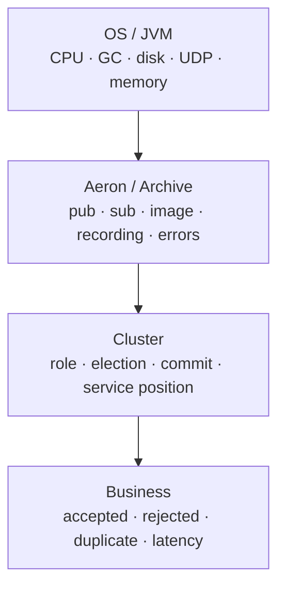
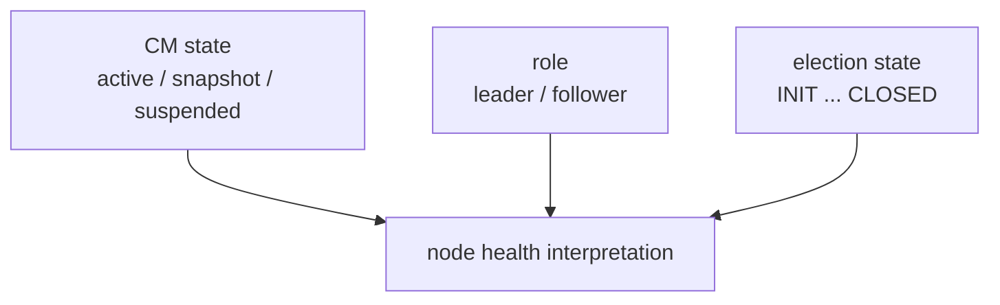
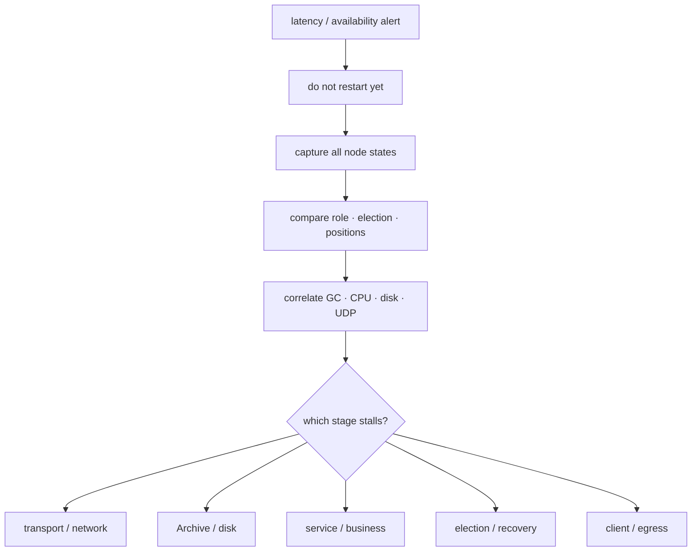
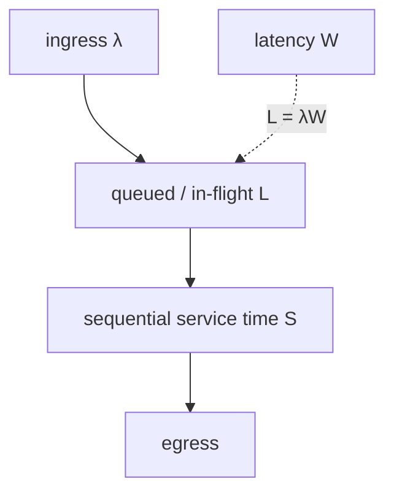
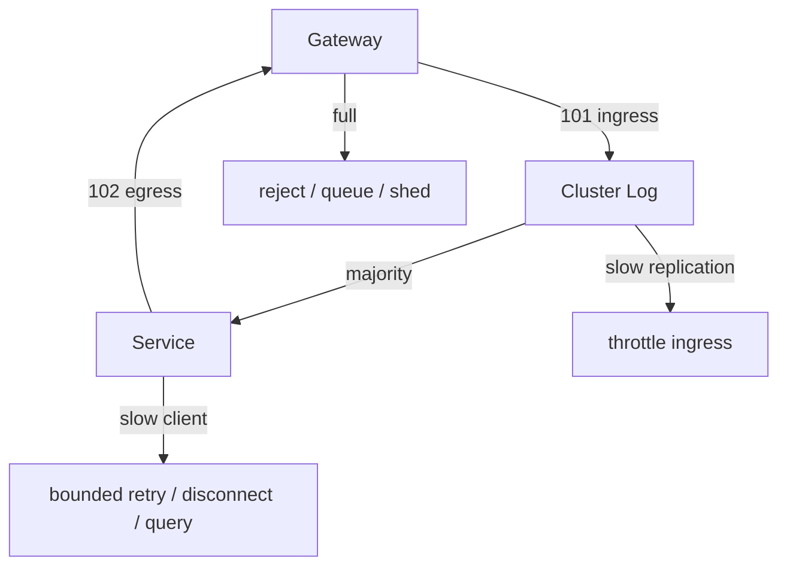

Aeron Cluster 的好处之一，是很多内部进度都作为 Aeron counter 暴露；危险也在这里：counter 很多，单独看一个数字很容易得出错误结论。Commit Position 不动，可能是网络、Follower Archive 或 Leader 本地录制；Commit 在动但响应不出，可能是 Service position、业务耗时或慢客户端。

可靠运维的核心是把指标还原成提交链：**入口 → Leader log → 多数派 append → commit → service apply → egress**。再把 Election、Archive、Backup、CPU、GC、磁盘和 UDP 叠加到相应阶段。

本文以 1.52.2 当前源码注册的 counters 和 `ClusterTool` 命令为准，并把性能讨论建立在容量模型和实测上，不复用脱离硬件/消息大小的固定吞吐数字。

## 先用位置和状态建立观测系统

### 先建立四层观测模型



任何报警都应能落到其中一层，并通过相邻层证据解释：

- 业务 p99 上升，但 Cluster positions 正常：看业务 codec、计算和 egress；
- Commit Position 停止，Follower append lag 增大：看网络和 Archive；
- Election churn，同时 GC pause 超过 heartbeat timeout：先解决运行时暂停；
- Backup lag 增大，在线 Cluster 正常：看 Backup Archive、复制网络和 query deadline。

“Aeron 很慢”不是可操作诊断。

### Cluster 的关键 counters

官方 Understanding Cluster Counters 页面给出主要类别，1.52.2 还可从 `AeronCounters` 与组件源码核对 type id。常用观察项包括：

- Consensus Module state；
- Election state；
- node role；
- Commit Position；
- Clustered Service position；
- snapshot count；
- timed-out client count；
- invalid request count；
- Consensus Module error count；
- Clustered Service error count；
- Cluster Backup state；
- Backup live log position；
- Backup next query deadline；
- Backup error count。

#### State、Role、Election 是三件事

Consensus Module 的稳定/控制状态包括 initializing、active、suspended、snapshot、quitting、terminating、closed 等；Role 表示 Leader/Follower；Election State 表示是否处于 18 状态选举恢复链。



一个节点可以角色仍显示 Follower，却正在 `FOLLOWER_CATCHUP`；也可能 CM state 为 `SNAPSHOT` 而 Cluster 完全健康。不能把任何非 `ACTIVE` 字符串都当故障。

#### 位置要成组看

最有价值的差值：

```text
replication lag = leader append position - follower append position
local apply lag = local commit position - local service position
backup lag      = leader commit position - backup live log position
```

| 现象 | 更可能的瓶颈 |
| --- | --- |
| Leader append 不进 | ingress、Leader Archive、出版/录制路径 |
| Leader 进，Follower append 落后 | 网络、flow control、Follower Archive/磁盘 |
| append 多数够，Commit 不进 | term/成员状态、Leader CM duty cycle |
| Commit 进，Service 落后 | 业务 callback、snapshot、Service Agent、GC |
| Service 进，客户端无响应 | egress、session、Gateway、慢客户端 |
| 在线正常，Backup 落后 | Backup Archive、复制 channel、query/reset loop |

Position 是字节位置。把 20 MB lag 直接说成“落后 20 万条”没有依据；需要结合真实消息大小和 log frame 结构。

这里的权威 Commit Position 来自 Leader。Follower 的同名 counter 受本地 append / log adapter 进度限制，表示本地已消费的已通知提交前缀，合法情况下也可能落后于 Leader；监控不要把任意节点的 counter 混成一个集群标量。

### 默认 stream id 是排障地图

1.52.2 常见默认 stream id：

| 功能 | 默认 stream id |
| --- | ---: |
| Archive control request | 10 |
| Archive control response | 20 |
| Cluster Log | 100 |
| client ingress | 101 |
| client egress | 102 |
| snapshot replay | 103 |
| service control | 104 |
| Consensus Module control | 105 |
| service snapshot | 106 |
| Consensus Module snapshot | 107 |
| inter-node consensus | 108 |

这些是默认值，不是必须照抄的保留端口。若生产覆盖了 stream id，Dashboard、抓包和 Runbook 必须从部署配置生成映射。

一个实用经验：

- 101 被背压：client → Cluster 入口慢；
- 102 被背压：Cluster → client/Gateway 出口慢；
- 100/成员 log channel 落后：复制或录制慢；
- 108 异常：成员控制/选举通信可能受影响。

只看业务端口会错过成员间 channel。

### ClusterTool 1.52.2 的真实命令

`ClusterTool` 通过 cluster directory 的 mark file/counters 观察或控制节点。当前 `COMMANDS` 表实际注册：

| 命令 | 用途 | 风险级别 |
| --- | --- | --- |
| `describe` | 打印 mark file descriptors | 只读 |
| `pid` | 打印组件 PID | 只读 |
| `recovery-plan <service count>` | 打印恢复计划 | 只读 |
| `recording-log` | 打印 Recording Log | 只读 |
| `sort-recording-log` | 重排 recording log entries | 高风险修改 |
| `seed-recording-log-from-snapshot` | 从最新有效 snapshot 建新 Recording Log | 高风险恢复 |
| `errors` | 打印 Aeron/Cluster error logs | 只读 |
| `list-members` | 打印 Leader 与 active members | 只读 |
| `backup-query [delay]` | 查看/设置下一次 Backup query | 读或控制 |
| `invalidate-latest-snapshot` | 使最新 snapshot 失效 | 高风险恢复 |
| `is-leader` | Leader 时退出码为 0 | 只读/自动化 |
| `snapshot` | 请求 Leader 拍 snapshot | 控制 |
| `suspend` | 暂停向 Cluster Log 追加 | 高影响控制 |
| `resume` | 恢复追加 | 控制 |
| `shutdown` | 拍 snapshot 后有序关闭 | 高影响控制 |
| `abort` | 不拍 snapshot 直接停止 | 高影响控制 |
| `describe-latest-cm-snapshot` | 描述最新 CM snapshot | 只读 |
| `validate-recording-log` | 让节点对 Archive 验证 Recording Log | 诊断/控制 |

类级 Javadoc 还写着 `standby-snapshot`，但 1.52.2 当前 `COMMANDS` map **没有注册它**。不能仅凭注释把它写进可执行 Runbook。

#### 调用形状

```text
java ... io.aeron.cluster.ClusterTool <cluster-dir> <command> [options]
```

应使用与运行 Cluster 完全相同的 1.52.2 构件，避免 mark file、codec 或命令集合版本不匹配。`recovery-plan` 当前实现要求显式提供 service count，少参数会打印帮助并返回错误。

#### `shutdown` 与 `abort`

`shutdown` 发起有序关闭并拍 snapshot；`abort` 不拍 snapshot 即停止。两者都不是普通健康检查。执行前确认：

- 目标路径和 cluster id；
- 当前节点是不是 Leader；
- 其他成员/Backup 状态；
- 最近 snapshot 和剩余磁盘；
- 客户端 drain 与维护窗口；
- 操作是否有审计和回滚计划。

#### `suspend` 的边界

`suspend` 暂停向 Cluster Log 追加，常用于受控维护/诊断。它会影响新 ingress 和 timer 等需要追加日志的活动，不能当作“只暂停某个业务”。使用前后要观察 CM state、Commit Position、session 和 Gateway 行为，并通过 `resume` 明确恢复。

### 一次值班的安全起手式



第一轮证据：

```text
ClusterTool describe / list-members / errors
ClusterTool recording-log / recovery-plan (if recovery-related)
AeronStat counters and labels
thread dumps for MD, Archive, CM, Service and Gateway
GC log and JVM pause metrics
vmstat, mpstat, pidstat, iostat, free
UDP errors, packet loss, short sends, interface drops
disk capacity and filesystem/kernel errors
```

在证据未冻结前重启可能清除 counters、错误日志和线程现场，还会触发新 Election，掩盖初始原因。

### Error Log 的正确读法

Aeron 的 Distinct Error Log 会聚合相同错误，保留首次/最近时间和 observation count。`ClusterTool errors` 可以读取 Aeron 与 Cluster 组件错误。

不要看到任意 exception 就重启：

- 历史错误可能已恢复；先看最后发生时间；
- observation count 增长表示仍在发生；
- 同一根因可能在 Leader、Follower、Archive 各产生连锁错误；
- warning/timeout 要与 role、position 和系统指标关联；
- error log 容量有限，长期运行要外部采集。

建议把错误聚合键、首末时间、节点、组件、term 和关联 position 发往集中监控，同时保留原始 mark/error 文件供事后分析。

`ClusterException` 还带有 Category，不能只看 Java 类型：

| Category | 含义 | 处置重点 |
| --- | --- | --- |
| `WARN` | 可恢复或值得关注的协议/成员异常 | 结合次数、角色和 position 判断是否持续恶化 |
| `ERROR` | 当前操作或成员状态已失败 | 保留现场，判断是否已触发 Election、catch-up 或 client 重连 |
| `FATAL` | 继续运行会破坏安全或恢复契约 | 让组件退出并按 runbook 恢复，不要无限吞掉异常 |

几个常见 Cluster 错误要按触发条件读：

| 事件 | 它在说什么 | 常见后续 |
| --- | --- | --- |
| leader heartbeat timeout | Follower 在期限内未观察到 Leader 活性 | 进入或推动 Election |
| no catch-up progress | Follower catch-up 的 append progress 超过 leader heartbeat timeout 没有推进 | 放弃本轮追赶或重启选举流程 |
| inactive follower quorum | 活跃成员不足以维持期望 quorum | Leader 无法继续安全推进，需结合成员状态处置 |
| unexpected vote request | 当前 term/state 收到符合更高 term 条件、但不在预期流程中的投票请求 | 记录协议异常并进入 Election |
| unexpected new leadership term | 收到符合更高 term 条件、但与当前状态不相容的新领导期 | 记录协议异常并进入 Election / recovery |

`ClusterTerminationException` 常见于无法安全继续的边界，例如 time unit / app version 不兼容、Archive 存储耗尽、Aeron client 已关闭，或 Consensus Module 的 Archive subscription 断开。它们不是“打印后继续”的普通业务异常。配置文档有时会把 heartbeat setter 名写错；1.52.2 实际配置项是 `leaderHeartbeatTimeoutNs`。详见 [Cluster Errors](https://aeron.io/docs/aeron-cluster/cluster-errors/) 与固定版本源码。

## 再证明容量与背压边界

### 性能上限首先在业务状态机

一个 Clustered Service 的权威状态转换是顺序执行的。若每条命令平均占用服务线程 `S` 秒，单服务理论处理上限大致受 `1/S` 约束；实际还要扣除日志轮询、codec、响应、timer、snapshot 和 GC。

Little’s Law：

```text
L = λ × W
```

若稳定吞吐 `λ = 50,000 msg/s`，端到端驻留时间 `W = 20 ms`，系统平均有约 `1,000` 个在途请求。队列、session pending 和内存预算都必须容纳它；这不是通过换一个 BusySpin 就能消失的。

这里要区分两个观察边界：在权威状态机执行段，并发度按设计是 `L = 1`，所以业务处理上限近似 `λ = 1 / W_service`；在包含网络、排队、复制与响应的端到端系统中，可以同时存在大量在途请求，上例的 `L = 1000` 描述的是整个流水线，而不是 1000 条命令并行修改服务状态。



#### 不要把示例 benchmark 当容量承诺

官方性能页面中 JSON、SBE、single/multiple service 的数字适合说明 codec 和业务成本会影响上限，但它们依赖：

- CPU、核绑定、频率与 NUMA；
- Media Driver/Archive/Cluster threading mode；
- IdleStrategy；
- 消息长度和批量；
- sync level 与存储；
- 网络 MTU、socket buffer 和拓扑；
- service 逻辑、分配率与响应大小；
- JVM/JDK、GC 与 warm-up。

引用数字时必须连同环境；规划时必须在自己的硬件和协议上压测。

### 容量测试必须覆盖整条提交链

至少分五类：

1. **单节点基线**：测 codec/service 上限，但不称为 HA 性能；
2. **三节点稳定态**：测正常 quorum commit 与端到端延迟；
3. **慢 Follower**：限制网络/磁盘，观察 append/commit 和 flow control；
4. **Leader 故障**：在不同负载下测 detection、Election、重连和结果未知；
5. **恢复/Backup**：一边处理 live 流量，一边 catch-up、snapshot 或 Backup 复制。

每次记录：

- accepted/committed/applied/responded 各阶段吞吐；
- p50/p95/p99/p99.9/max 延迟；
- negative offer/backpressure 计数；
- append、commit、service、backup positions；
- CPU per Agent、GC pause/alloc rate；
- Archive write/replay throughput 和磁盘尾延迟；
- packet loss/retransmit/short send；
- Election 次数与恢复 RTO。

只给平均延迟会隐藏 Cluster 最重要的长尾和暂停。

### Codec、分配与日志

业务热路径常见成本：

- JSON 解析与对象图分配；
- 字符串、BigDecimal、临时集合；
- 每条消息同步日志和格式化；
- 复制 callback buffer 后仍保留大对象；
- 无界 dedup map；
- response 编码时扩容；
- snapshot 期间一次性分配完整 byte array。

SBE/Agrona buffer 可降低部分成本，但必须先保证 schema、边界检查和所有权正确。DirectBuffer callback 数据通常只在回调期间有效；需要长期保存时要复制到服务拥有的结构，不能持有 offset 引用等待底层复用。

生产日志应采样或聚合，错误路径保留足够 correlation。不要在每条已提交命令上做同步字符串日志，那会把状态机吞吐变成日志磁盘吞吐。

### 背压策略必须逐边界定义



每条边界都要回答：

- 队列容量多少；
- 谁拥有重试；
- 重试 deadline 和 backoff；
- 可否丢弃；
- 丢弃后如何重建；
- 是否断开 session；
- 何时熔断入口；
- 哪个 counter/指标证明压力发生。

无界 Gateway queue 会把 Aeron backpressure 变成 JVM OOM；服务内无限 `session.offer` 循环会把一个慢客户端变成整个 RSM 停顿。

## 从症状定位失败层

### 分层故障模式

#### CPU / JVM

症状：心跳 timeout、Election churn、所有 position 间歇停顿。检查：

- Agent 是否共享被阻塞的线程；
- CPU quota/throttling、steal 和 run queue；
- GC pause、allocation burst、safepoint；
- 频率降档、NUMA 远端内存；
- 业务 callback 或 snapshot 是否耗时过长。

#### 网络 / UDP

症状：Follower append lag、Image 断连、retransmit/NAK、canvass 或 catch-up await。检查：

- DNS 与 endpoint 是否解析为预期地址；
- MTU、socket buffer、防火墙、组播/单播配置；
- 网卡 drop、UDP receive errors、short sends；
- flow control 和接收者是否过慢；
- consensus/log/catch-up channel 是否被错误共用或限速。

#### Archive / 磁盘

症状：Leader/Follower append 停顿、snapshot 很慢、Backup reset、recovery replay 慢。检查：

- iostat 延迟、队列深度和吞吐；
- 磁盘满、inode、文件系统错误；
- page cache 和内存压力；
- sync level 与硬件能力；
- recording id、stop position 和 Recording Log 一致性。

#### Service / 业务

症状：Commit 继续、Service position 落后。检查：

- `onSessionMessage`、`onTimerEvent`、snapshot 的耗时；
- 外部 I/O 是否误入状态机；
- egress 无限重试；
- 数据结构退化、无界扫描；
- decode 异常、服务 error counter；
- 多服务中是哪一个 service id 落后。

#### Client / Gateway

症状：Cluster positions 正常，客户超时。检查：

- AeronCluster 是否被单线程正确 poll；
- egress 102 是否背压；
- pending correlation 是否泄漏；
- session 是否超上限或频繁重连；
- new leader event 是否更新 endpoint；
- 下游 WebSocket/HTTP 客户端是否过慢。

### 报警设计

建议报警而非仅展示：

- 没有唯一 Leader，或 role 频繁变化；
- Election State 长时间不为 `CLOSED`；
- Commit Position 在有入口流量时停止；
- 任一 Follower append lag 持续超过时间/容量预算；
- Service apply lag 增长；
- CM/Service/Backup error count 增加；
- timed-out session 或 invalid request 激增；
- ingress/egress negative offer/backpressure 超阈值；
- snapshot 失败、过旧或持续时间异常；
- Backup 不在预期状态、lag/RPO 超预算、query deadline 异常；
- Archive 磁盘空间和 I/O latency 超阈值；
- GC pause/Agent duty cycle 接近 heartbeat timeout；
- UDP short send、receive error 或 interface drop 增长。

报警应有持续窗口和多信号关联。例如单个 Follower 短暂 lag 可自动恢复；若同时出现 Commit 停顿、磁盘 p99 上升和 Archive error，才需要升级响应。

## 让变更和维护留下退出证据

### 变更与发布 Runbook：进入、推进与退出证据

#### 进入条件

- 记录当前版本、appVersion、配置 hash 和成员表；
- `list-members`、`recording-log`、`recovery-plan` 留档；
- 确认最新 snapshot 完整且 Backup lag 在预算内；
- 在隔离环境用生产 snapshot/log 验证新版本恢复；
- 明确是否支持当前版本组合的滚动升级；
- 准备回滚版本、兼容 snapshot 和停止条件。

#### 推进条件

- 一次只处理一个成员，始终保留多数派；
- 等待该成员完成 replay/catch-up、Election CLOSED、append lag 归零；
- 观察服务摘要、错误和尾延迟；
- 未稳定前不要继续下一个成员；
- 若触发持续 Election 或 recording 验证失败，停止发布并保存证据。

#### 退出证据

- 触发并验证新 snapshot；
- 确认 Backup 可以读取新 snapshot/schema；
- 对账关键业务状态和 request dedup；
- 进行一次受控 Leader 切换或计划内故障验证；
- 更新基准、Runbook 和配置清单。

只要成员未完成 catch-up、Election 反复、恢复介质不可验证或业务摘要不一致，发布就必须停在当前多数派，不得继续处理下一个成员。变更完成不是所有进程都换了版本，而是提交链、恢复链和客户端未知结果处理都重新回到预算。

### 每日、每周与每季度维护

**每日**：角色/选举、position lag、error count、磁盘、Backup RPO、session/backpressure。

**每周**：snapshot duration/size 趋势、GC/CPU/UDP 尾部、容量增长、恢复介质完整性、告警噪声。

**每季度**：从 Backup 独立恢复、Leader 故障注入、慢 Follower/慢客户端演练、权限审计、依赖与版本升级演练。

恢复演练的完成标准不是“Java 进程启动”，而是：

```text
recording validated
→ recovery plan correct
→ services loaded and caught up
→ state digest / business reconciliation passed
→ clients reconnect and ambiguous requests resolved
→ measured RPO and RTO within SLO
```

## 结论：可运维性来自可定位的提交链与可退出的变更

Aeron Cluster 可运维的关键，不是收集更多指标，而是把 counters 放回提交链。Role/Election 告诉我们权威状态，append/commit/service position 定位复制与执行阶段，Backup counters 衡量灾备缺口；JVM、磁盘和 UDP 指标解释为什么这些位置停止。

`ClusterTool` 很强，也有直接改变恢复和可用性的命令。1.52.2 当前真实命令集应从 `COMMANDS` 注册表核对，不能依赖旧文档注释。所有高风险命令都需要路径校验、证据备份、审计和离线演练。

性能工程则应覆盖三节点提交、慢副本、选举、snapshot、replay 和 Backup，而不是只跑单节点平均吞吐。最终目标是把“快”和“能恢复”都变成可重复测量的 SLO。

## 一手资料

- [Understanding Cluster Counters](https://aeron.io/docs/aeron-cluster/understanding-cluster-counters/)
- [Operating Aeron Cluster](https://aeron.io/docs/aeron-cluster/operating-aeron-cluster/)
- [Cluster Troubleshooting](https://aeron.io/docs/aeron-cluster/cluster-troubleshooting/)
- [Cluster Errors](https://aeron.io/docs/aeron-cluster/cluster-errors/)
- [Aeron Cluster Performance Limits](https://aeron.io/docs/aeron-cluster/performance-limits/)
- [Aeron Cluster Performance](https://aeron.io/docs/cluster-quickstart/aeron-cluster-performance/)
- [AeronStat](https://github.com/aeron-io/aeron/wiki/Monitoring-and-Debugging)
- [ClusterTool 1.52.2 源码](https://github.com/aeron-io/aeron/blob/1.52.2/aeron-cluster/src/main/java/io/aeron/cluster/ClusterTool.java)
- [AeronCounters 1.52.2 源码](https://github.com/aeron-io/aeron/blob/1.52.2/aeron-client/src/main/java/io/aeron/AeronCounters.java)
- [ClusterBackup 1.52.2 源码](https://github.com/aeron-io/aeron/blob/1.52.2/aeron-cluster/src/main/java/io/aeron/cluster/ClusterBackup.java)
- [ConsensusModule 1.52.2 源码](https://github.com/aeron-io/aeron/blob/1.52.2/aeron-cluster/src/main/java/io/aeron/cluster/ConsensusModule.java)
