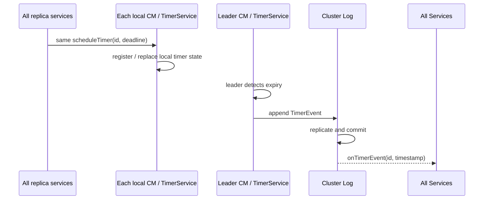
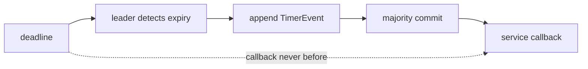
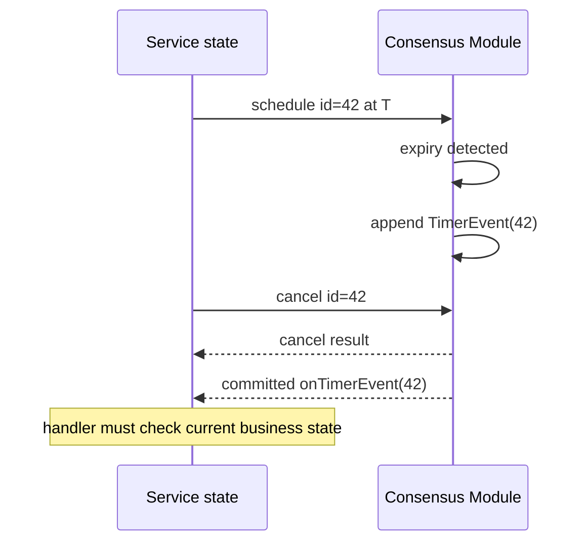
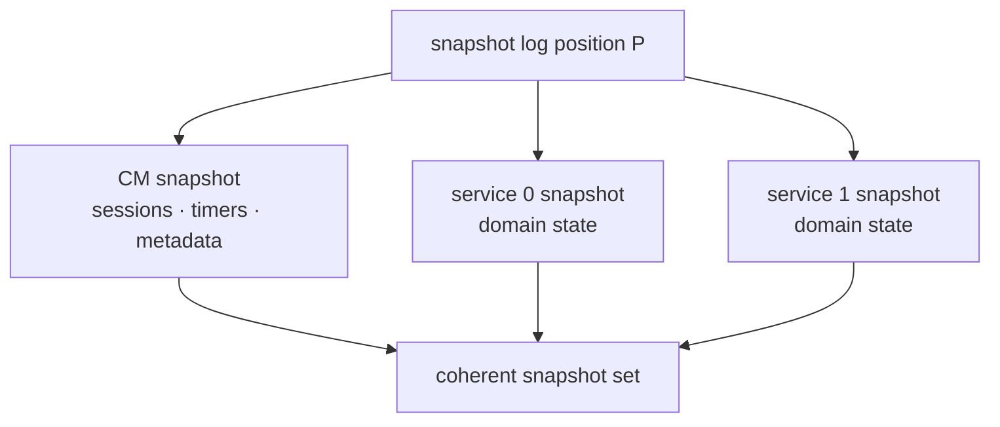
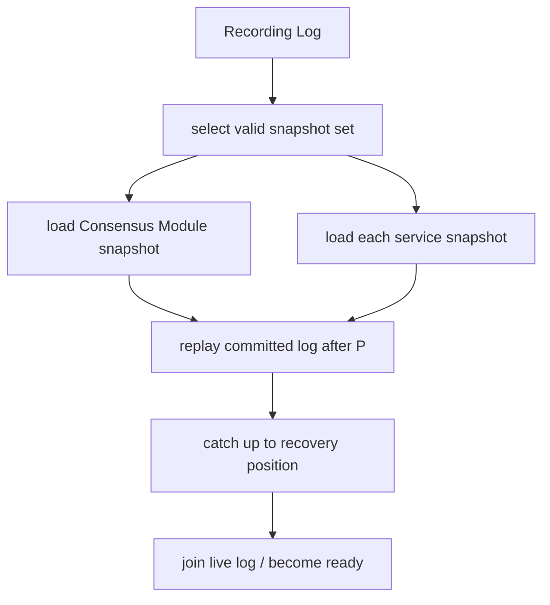
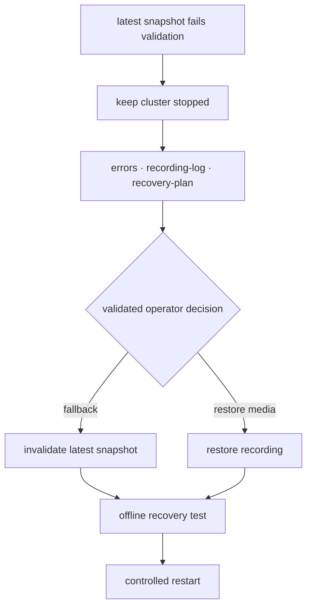

确定性状态机最容易被时间破坏。三个节点各自调用 `System.currentTimeMillis()`，即使只差一毫秒，也可能让订单在一个节点过期、在另一个节点继续有效。普通线程池 timer 同样危险：调度顺序、暂停时间和重启后的行为都不一致。

Aeron Cluster 的解决方案不是让所有机器“时钟绝对相同”，而是让 **Timer 到期本身成为 Cluster Log 中的已排序事件**。同理，Snapshot 也不是随手序列化一个 Map；它必须与 Consensus Module 的会话、timer 和日志位置共同组成一致恢复点。

本章把 Timer、Snapshot、Replay 和版本演进放在一起，因为它们共同回答一个问题：节点在任意时间崩溃后，如何重新得到与其他成员一致、且能继续演进的状态。

## 1. Cluster 时间不等于墙钟

服务在已排序回调中会收到 `timestamp`。它代表 Cluster 为该事件确定的时间，单位由配置的 `clusterTimeUnit` 决定。业务过期、超时、租约等状态转换应使用该时间，而不是节点本地墙钟。

应区分三种时间：

| 时间 | 用途 | 能否进入复制状态 |
| --- | --- | --- |
| callback `timestamp` / `Cluster.time()` | 确定性的业务时间 | 可以 |
| `doBackgroundWork(nowNs)` | 本地经过时间、连接维护 | 不可以 |
| `System.currentTimeMillis()` / `Instant.now()` | 进程墙钟、日志观测 | 不可以直接驱动业务状态 |

Cluster 时间仍可能跳跃、停顿或晚于真实世界。它提供的是 **所有副本观察到同一已排序时间语义**，不是高精度计时器或全球原子钟。

## 2. Timer 的真实提交路径

服务在一个已排序回调中调用 `cluster.scheduleTimer(correlationId, deadline)` 时，各副本会执行相同调用，并经 IPC 把请求交给**各自本地** Consensus Module；因此每个成员都维护可恢复的 timer 状态。区别在于：只有 Leader 轮询自己的 TimerService、判断到期并把 `TimerEvent` 追加进 Cluster Log。



只有 Leader 把本地 Cluster clock 与 TimerService 的到期结果变成日志事件。`TimerEvent` 经多数派提交后，各节点服务才收到 `onTimerEvent`；恢复 replay 也会在相同日志位置重放这个事件。Follower 上的 timer 状态用于复制状态一致性与接任 Leader，不会各自直接触发业务 callback。

这条路径有两个重要结论：

1. timer callback 是至少在 deadline 之后发生，不保证准点；
2. callback 的全序由 Cluster Log 决定，不由节点线程调度决定。

### 2.1 Deadline 是“不得早于”，不是预约 CPU

Timer 可能因为以下原因晚触发：

- Leader duty cycle 尚未再次轮询 timer；
- Cluster 正在处理先前的 ingress 或控制事件；
- 日志复制尚未形成多数派提交；
- Service Container 尚未执行到 TimerEvent 位置；
- CPU 抢占、GC、磁盘或网络压力拖慢整个流水线。

因此它适合“订单至少存活 5 秒”“会话超过 deadline 后才过期”这类逻辑，不适合微秒精度调度或硬实时控制。



## 3. Schedule、Cancel 与重试协议

`scheduleTimer` 和 `cancelTimer` 都可能因 Cluster 内部 publication 背压而返回 `false`。官方契约要求调用者在允许发送 Cluster 消息的已排序回调中循环，直到成功，并在重试之间调用 `cluster.idleStrategy().idle()`，以便容器关闭能够推进。不能在某个副本上看到 `false` 后静默退出，否则副本间 timer 状态会分叉；若业务确实需要等待上限，超预算必须 fail / terminate，而不能当作已经成功。

同一个 `correlationId` 再次 schedule 会替换/重调该 timer。这个特性适合延长 deadline，但也带来竞态：旧 timer 可能已到期并进入日志，而 cancel 或 reschedule 仍在途。

### 3.1 Cancel 不能撤销已经排序的到期事件

考虑下列顺序：



即使 cancel 返回成功，业务 handler 也不应无条件执行。安全写法是让 timer id 对应一份业务状态和 generation：

```text
timerCorrelationId → {aggregateId, generation, expectedState, deadline}
```

`onTimerEvent` 收到 id 后重新检查：聚合是否仍存在、generation 是否匹配、状态是否仍等待超时。若任务已完成或被新一代 timer 替代，就把旧到期事件当作 no-op。

### 3.2 ID 必须确定且可命名空间化

Timer correlation id 由应用管理。推荐：

- 使用状态机内的单调计数器；
- 多服务时用高位编码 service namespace；
- 不复用仍可能存在于日志或 snapshot 中的 id；
- 把 id 与业务对象的映射纳入 snapshot；
- 避免 `Long.MAX_VALUE`，官方 Timer API 不支持该值。

若 correlation id 用本地随机数生成，各节点会分叉；若只保存 id 而不保存对应业务 generation，恢复后可能把旧 timer 作用到新对象。

## 4. WheelTimer 与 PriorityHeapTimer 的选择

1.52.2 默认使用 `WheelTimerService`。它用时间轮取得较低调度成本，但有一个必须写入业务设计的顺序语义：

- 同一 tick 内多个 timer 的触发顺序不保证；
- 重启恢复后，已经过期的 timer 不保证按原 deadline 排列；
- 如果业务依赖两个 deadline 的严格先后，不能靠“它们通常按注册顺序触发”。

`PriorityHeapTimerService` 可在不同 deadline 间保留优先顺序，包括重启后处理已经到期的 timer；但 deadline 完全相同的 timer 仍没有业务顺序保证。

最稳妥的协议是：**不要让正确性依赖同 deadline timer 的相对顺序。** 若必须排序，在一个 TimerEvent 到来后，由状态机按稳定业务键批量检查待办项。

### 4.1 避免零延迟自我饥饿

一个 handler 反复把 timer 调度到当前时间，可能让 Cluster 持续生成 timer 日志，挤压外部 ingress。官方文档建议至少给出约 1ms 的间隔，或用 service message 表达“下一轮继续处理”。

这类增量任务还应有每次处理预算：

```text
onTimerEvent:
  process at most N items
  if work remains:
    schedule next slice after small delay
```

Timer 是公平调度工具，不是绕过单线程执行预算的递归调用。

## 5. Snapshot 为什么是一组录制

一次 Cluster snapshot 至少包含：

- 一个 Consensus Module snapshot，service id 为 `-1`；
- service 0 的 snapshot；
- 若有更多服务，则每个 service 各一个 snapshot；
- 所有快照对应同一个 Cluster Log position。



Consensus Module snapshot 会保存 Cluster 自己管理的状态，包括 session manager、客户端会话及 encoded principal、active timer、pending service message 等。每个 Service Container 还会保存自己的 session 元数据，然后调用业务 `onTakeSnapshot(...)`，让应用写入领域状态。

只备份业务 Map、不保存 CM snapshot，会丢失会话和 timer 语义；只保存 CM snapshot、不保存去重表和订单状态，也无法恢复业务。

## 6. `onTakeSnapshot` 的职责

`onTakeSnapshot(ExclusivePublication)` 收到的是一个会被 Archive 录制的 Aeron publication。应用需要把当前完整恢复状态编码为消息。

至少考虑保存：

- 所有权威领域实体及其版本；
- 决定查询和命令结果的索引、队列和聚合；
- 业务 ID 生成器；
- request 去重表与仍需重发的结果；
- 外部 sink 的高水位或 outbox 状态；
- timer id 到业务对象/generation 的映射；
- reference data 与配置版本；
- snapshot schema/version 和校验信息。

不必保存可由上述权威数据确定重建的临时 cache；但恢复时的重建算法也必须确定，并计入 RTO。

### 6.1 快照需要自己的记录协议

教程常把小状态编码成一个 fragment，这只适合演示。真实 snapshot 可能超过单条 Aeron 消息，需要分块并能检测不完整录制。

```text
SnapshotBegin {
  magic, schemaVersion, appVersion,
  logPosition, recordCount, createdClusterTime
}

SnapshotRecord { type, keyLength, valueLength, payload, checksum }

SnapshotEnd { recordCount, aggregateChecksum }
```

写 service snapshot 时，容器先写自己的 `BEGIN → client sessions → END` 区段，随后才调用应用的 `service.onTakeSnapshot(publication)`。因此内部 BEGIN/END **并没有包住业务 payload**；应用区段仍必须自带 framing、版本、完成标志和完整性校验。加载时必须检查：

- begin/end 都存在；
- 记录数、长度和 checksum 一致；
- 没有未知的必需 record type；
- schema/app version 兼容；
- key 唯一性和业务不变量成立。

发现截断或损坏应让恢复失败，并由运维选择前一个 snapshot；不能悄悄加载一半状态继续服务。

### 6.2 确定的序列化顺序

若状态保存在 `HashMap` 中，直接遍历写 snapshot 可能让不同节点生成字节顺序不同的录制。虽然每个节点加载自己的快照仍可能得到相同逻辑状态，但这会妨碍 byte-level digest、备份比对和问题诊断。

建议按稳定业务 key 排序，或使用本身具有稳定顺序的结构。序列化还应显式指定字节序、单位、字符串编码和枚举值，避免依赖 Java 默认行为。

## 7. 恢复 = Snapshot + 后续已提交日志

节点恢复不是“加载最新 snapshot 就结束”。完整过程是：



快照把状态恢复到位置 `P`；Archive replay 再执行 `P` 之后直到 recovery position 的已提交日志。因为业务逻辑确定，最终状态应与从头 replay 相同。

这一过程解释了 snapshot 周期的真实权衡：

- snapshot 越频繁，录制和序列化开销越高；
- snapshot 越少，重启时 replay 的日志越长，RTO 越大；
- 大 snapshot 本身可能加载很慢；
- 业务 schema 演进会增加旧 snapshot 的兼容成本。

不要采用“每小时一次”这种无上下文规则。应按事件速率、snapshot 大小、实测 replay throughput、目标 RTO 和保留策略反推周期。

## 8. Snapshot 不会自动物理删除旧日志

常见资料把 snapshot 描述为“拍完就截断 Cluster Log”。在 1.52.2 的核心路径中，拍摄 snapshot 会建立新的恢复点并记录到 `recording.log`，**不会自动把 Archive 中的旧 log recording 物理删除或截短**。

这一区别非常重要：

- snapshot 解决恢复起点，不自动解决磁盘保留；
- 清理 Archive recording 是独立且危险的运维动作；
- 删除前必须确认所有成员、Backup 和灾备流程不再依赖该段；
- Recording Log 元数据与真实 Archive recording 必须保持一致；
- 不应依据旧 Cookbook 的一句“truncate”自动写清理脚本。

磁盘容量规划必须同时考虑 live log、历史 term、多个 snapshot、备份复制和故障期间的额外保留。

## 9. 版本演进有三条轴

至少要分别管理：

1. **命令/事件协议版本**：ingress、service message、egress 的 schema；
2. **Snapshot schema 版本**：持久业务状态的布局；
3. **Cluster appVersion**：节点能否共同启动/加入并加载状态的应用兼容标记。

把三者压成一个 `version=2` 会让升级和回滚含义模糊。

### 9.1 appVersion 与时间单位

Consensus Module 会把 `appVersion` 和 Cluster time unit 编码进 snapshot/leadership 元数据并在恢复时验证。默认 `AppVersionValidator` 检查 major version 兼容性。

这不是自动 schema migration。即使 major appVersion 被视为兼容，服务仍必须能读取旧 snapshot 和旧日志消息。反过来，某次只增加可选字段的协议升级，也未必需要改变所有状态结构。

### 9.2 推荐的兼容策略

- 新 reader 至少能读取一个明确支持窗口内的旧 snapshot；
- 旧 reader 是否能读取新 snapshot 必须明确，不能默认；
- 命令 decoder 根据 SBE schema/template/version 选择兼容路径；
- 新状态字段有确定默认值；
- 枚举未知值不得越界或悄悄映射成另一业务动作；
- 升级前在复制的生产 snapshot 与日志上做离线恢复演练；
- 滚动升级是否受支持，以当前版本官方说明和实际兼容测试为准。

## 10. 失败快照与回退工具

`ClusterTool` 提供与恢复相关的诊断/控制命令：

- `recovery-plan [service count]`：显示将使用的 snapshot 和 log；
- `recording-log`：查看 Cluster recording log；
- `validate-recording-log`：验证元数据和录制关系；
- `describe-latest-cm-snapshot`：描述最新 CM snapshot；
- `invalidate-latest-snapshot`：使最新 snapshot 失效，允许回退到前一个恢复点；
- `seed-recording-log-from-snapshot`：特定恢复/迁移流程中从 snapshot 建立 recording log。



这些命令直接改变恢复行为，不应在运行中的生产目录上试错。先复制 Archive/cluster 目录，记录原始 recording ids 和 position，在隔离环境验证 recovery plan，再执行受审计的生产操作。

### 10.1 触发 Snapshot 也有协议状态

Snapshot 请求不会把每个组件在任意瞬间各拍一份文件。Consensus Module 先把 Cluster 带入 snapshot 状态，在确定的 log position 上协调 CM 与所有 service 输出录制，完成后再把这一组条目写入 Recording Log。

因此运维不能仅以“命令返回成功”判断 snapshot 可恢复，还要确认：

- snapshot counter 已按预期推进；
- CM 与所有 service 都有同一位置的有效 snapshot entry；
- Archive recording 已停止在合理位置且无错误；
- `recovery-plan` 确实选择新 snapshot set；
- 在副本环境中加载和 replay 成功；
- Backup 已经取得这组 snapshot，或 RPO 策略允许尚未复制。

多服务配置中，只要一个 service snapshot 缺失或失败，这就不是可用的完整恢复点。不要把“service 0 文件存在”当成 Cluster snapshot 成功。

## 11. 启动任务不能偷偷成为业务事件

Cookbook 的 startup task 场景提醒了一个边界：`onStart` 用于初始化资源和从 snapshot 恢复，不应在每个节点各自执行“如果启动就发一笔业务命令”。

需要确定性的一次性启动动作，可以选择：

- 由受认证的 admin client 发送显式命令；
- 在首个会话事件中检查一个已 snapshot 的 `initialized` 标志；
- 发送确定的 service message；
- 调度一个 Cluster Timer，并把任务 generation 存入状态。

无论哪种方式，都要让“是否执行过”成为复制状态，而不是本地 marker file。否则重启某一个 Follower 可能重复运行任务，或者新 Leader 从未运行。

## 12. 恢复测试矩阵

至少覆盖：

| 场景 | 应验证的事实 |
| --- | --- |
| 无 snapshot，从完整日志恢复 | 最终 state digest 正确 |
| 最新 snapshot + 短日志 | 与完整 replay 相同 |
| 前一个 snapshot + 更长日志 | 仍得到相同状态 |
| snapshot 中途截断 | 启动失败，不接受部分状态 |
| appVersion 不兼容 | 在写入/服务前明确失败 |
| 多服务缺少一个 snapshot | 整组不可作为恢复点 |
| timer 在 snapshot 前后到期 | 只产生协议允许的效果 |
| cancel 与 expiry 竞态 | generation guard 防止错误执行 |
| egress 已执行但未收到 | 去重结果随 snapshot 恢复 |
| 外部 projection 落后 | 从高水位重放并幂等追平 |

每次升级都应使用真实大小的数据，而不是十条示例消息。记录 snapshot duration、字节数、加载时间、replay rate、追到 live 的总 RTO 和恢复后的摘要。

## 13. 运维指标

围绕 Timer 与 Snapshot 建议观察：

- snapshot count、最新成功时间、持续时间和字节数；
- Snapshot counter 是否长期不推进；
- Archive recording error 与剩余磁盘；
- 恢复计划选择的 snapshot/log position；
- replay position 与 recovery target 的差；
- Timer 队列规模、业务 timeout 延迟分布；
- service position 与 Commit Position 的差；
- invalid timer/cancel 请求和重复到期 no-op 数量；
- 当前 appVersion、snapshot schema 与部署版本。

Timer “晚了”时不要只调 tick resolution。先分解检测、追加、提交和服务执行各段延迟，再判断是 duty cycle、复制、磁盘还是业务回调阻塞。

## 14. 本章结论

Aeron Cluster Timer 的可靠性来自排序，而不是来自本地计时器精度：只有 Leader 判断到期，到期事件先进入日志，提交后所有服务才执行。Schedule/cancel 是异步协议，handler 必须用业务状态和 generation 防御竞态。

Snapshot 则是一组位于相同 log position 的 Archive 录制：Consensus Module 保存会话、timer 和集群元数据，服务保存完整领域状态。恢复先加载整组快照，再 replay 后续已提交日志。快照不会自动物理清理旧日志，保留和 purge 必须另行设计。

下一章会沿恢复路径继续向前：当 Leader 消失或成员落后时，Aeron 1.52.2 的 18 个 Election State 如何完成投票、日志复制、replay、catch-up 和重新就绪。

## 一手资料

- [Cluster Timers](https://aeron.io/docs/aeron-cluster/cluster-timers/)
- [Aeron Cluster Basic Sample](https://aeron.io/docs/aeron-cluster/basic-sample/)
- [Operating Aeron Cluster](https://aeron.io/docs/aeron-cluster/operating-aeron-cluster/)
- [Cookbook：Cluster Startup Tasks](https://aeron.io/docs/cookbook-content/aeron-cluster-startup-tasks/)
- [Aeron Cluster Tutorial](https://github.com/aeron-io/aeron/wiki/Cluster-Tutorial)
- [ClusteredService 1.52.2](https://github.com/aeron-io/aeron/blob/1.52.2/aeron-cluster/src/main/java/io/aeron/cluster/service/ClusteredService.java)
- [TimerService 1.52.2](https://github.com/aeron-io/aeron/blob/1.52.2/aeron-cluster/src/main/java/io/aeron/cluster/TimerService.java)
- [WheelTimerService 1.52.2](https://github.com/aeron-io/aeron/blob/1.52.2/aeron-cluster/src/main/java/io/aeron/cluster/WheelTimerService.java)
- [PriorityHeapTimerService 1.52.2](https://github.com/aeron-io/aeron/blob/1.52.2/aeron-cluster/src/main/java/io/aeron/cluster/PriorityHeapTimerService.java)
- [RecordingLog 1.52.2](https://github.com/aeron-io/aeron/blob/1.52.2/aeron-cluster/src/main/java/io/aeron/cluster/RecordingLog.java)
- [ClusterTool 1.52.2](https://github.com/aeron-io/aeron/blob/1.52.2/aeron-cluster/src/main/java/io/aeron/cluster/ClusterTool.java)
