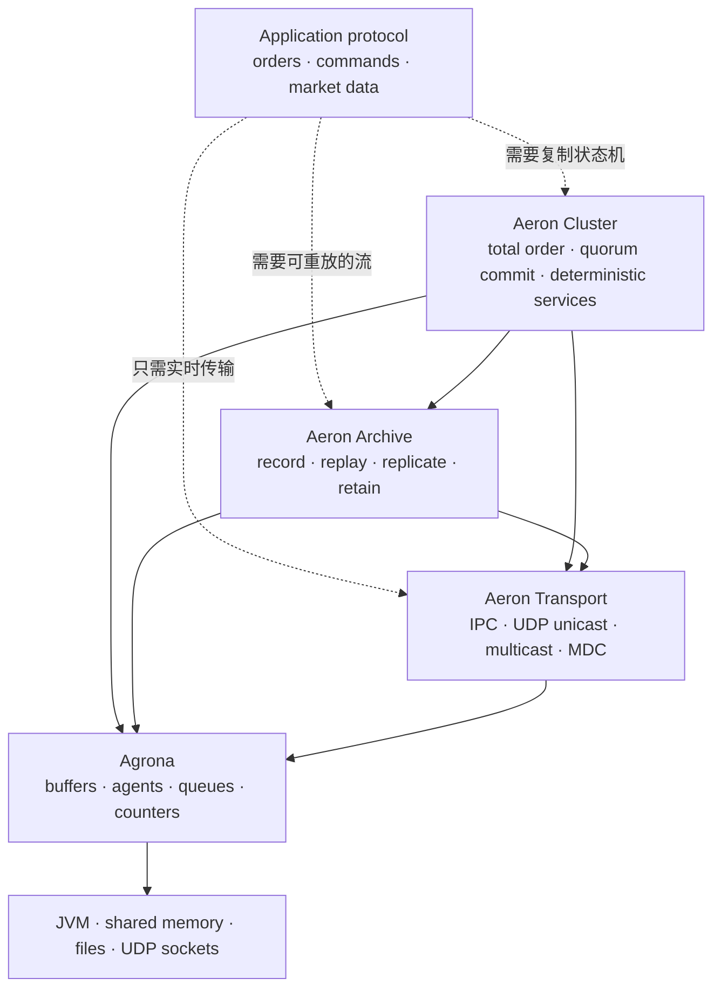
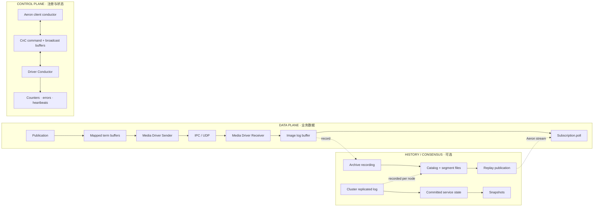
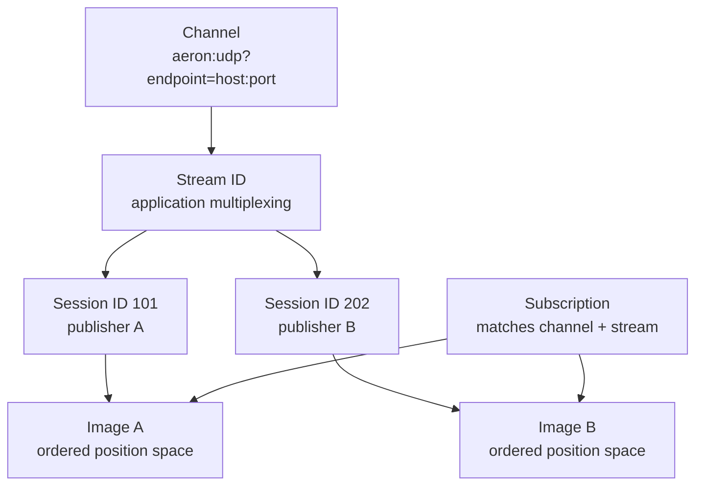
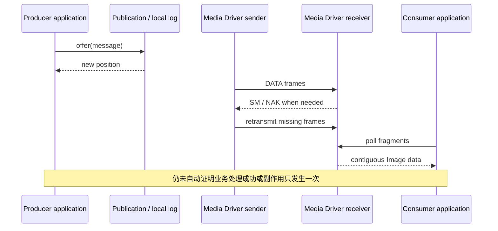

Aeron 经常被一句话概括成“高性能消息中间件”。这句话既太宽，也容易把系统带向错误设计：有人把 `Publication` 当成永远成功的队列，把 Archive 当成 Kafka 式 broker，把 Cluster 当成给任意业务自动套上的 exactly-once 层，最后才在背压、重启追赶或主从切换时发现语义根本不同。

更准确的说法是：**Aeron 是一组可以分层组合的通信、持久化与复制状态机组件。**

- **Aeron Transport** 在进程内或 UDP 网络上提供低开销、流控、可靠并保持单个 Image 顺序的消息传输；
- **Aeron Archive** 记录和回放 Aeron stream，让字节位置可以跨进程重启继续存在；
- **Aeron Cluster** 把多路客户端输入排成一条经多数派提交的日志，并让每个节点上的确定性业务状态机以相同顺序执行；
- **Agrona** 提供 Buffer、队列、Agent、IdleStrategy、counter、mark file 等底层原语，但不替代上述三层中的任何一层。

本文以 **Aeron 1.52.2** 为稳定版本基线；该版本对应 Agrona 2.5.0，Java 侧以 JDK 17 为最低运行基线。官方文档会持续更新，因此后续文章会同时引用固定版本源码或 Javadoc，避免把 master 分支的新 API 错写成 1.52.2 已有能力。[Aeron 1.52.2 Release](https://github.com/aeron-io/aeron/releases/tag/1.52.2) · [Aeron 1.52.2 源码](https://github.com/aeron-io/aeron/tree/1.52.2)

## 1. 先把四个名字放到正确位置

四层不是一条“每个系统都必须全选”的流水线。应用可以只使用 Transport；可以用 Transport 加 Archive；只有需要经共识复制的有状态服务时，才需要 Cluster。



### 1.1 Transport：活着的流

Transport 处理的是**当前仍在推进的通信会话**。发布者把消息写入 log buffer，Media Driver 负责发送、接收、流控、丢包检测与重传；订阅者从与某个发送会话对应的 `Image` 中 poll 数据。

它没有服务器端消息队列，也不会替离线订阅者长期保存历史。订阅者晚到时，通常从它加入连接时可用的位置开始，而不是自动从“第一条业务消息”开始。若发送端和所有接收端都已经消失，单靠 Transport 无法让一个稍后启动的消费者追溯过去。

### 1.2 Archive：可定位的历史流

Archive 作为 Aeron stream 的订阅者，将收到的 Aeron frame 记录到 segment 文件和 catalog；需要回放时，它再充当发布者，把指定 `recordingId`、起始 position 和长度对应的数据发到 replay channel。

它提供 durability building block，但不会理解“订单是否已入账”“命令是否只执行一次”。Archive 记录的是流及其位置，不是业务事务。写入到操作系统页缓存、文件同步到稳定介质、远端副本完成、业务响应发出，是四个不同的边界。

### 1.3 Cluster：经共识提交的输入顺序

Cluster 让一个 leader 接收客户端 ingress，把事件写入复制日志；多数派确认到相应位置后，提交位置推进，各节点的 `ClusteredService` 才按相同顺序处理已提交事件。节点通过 snapshot 加后续日志 replay 恢复状态。

这解决的是复制状态机的**总序与故障切换**，不是自动给外部数据库、第三方 HTTP 调用或客户端重试提供 exactly-once。服务代码必须保持确定性，外部副作用必须通过明确的网关、outbox、幂等键或对账协议处理。

### 1.4 Agrona：底层积木

Aeron 的 Client Conductor、Media Driver agents、counter 和 Buffer 都大量使用 Agrona。理解 `DirectBuffer` 的生命周期、Agent duty cycle 和 `IdleStrategy` 能显著降低学习成本，但 Agrona 的 MPSC Ring Buffer 不是 Aeron UDP stream，`MarkFile` 也不是 Archive catalog。

需要补底层原语时，可阅读 [Agrona 2：DirectBuffer、并发队列与 Agent 执行模型](/signal-grid-blog/posts/agrona-direct-buffer-queues-and-agents/)；本专题只在它们参与 Aeron 协议时继续展开。

## 2. 一条消息实际经过哪些平面

不要把所有箭头都叫“发送”。一个典型系统至少有三条不同的平面：



数据平面上的 Publication 与 Subscription 不是通过 socket API 彼此直接调用。客户端与 Media Driver 通过共享目录中的 CnC、log buffer 和 counters 协作；UDP socket 主要由 Driver 的 Sender/Receiver 管理。这个结构解释了三个常见现象：

1. `offer()` 成功通常表示消息已写入本地发布 log，并返回新的 position，不等于远端业务已经处理；
2. 注册 Publication/Subscription 是控制面操作，连接建立是异步过程；
3. 应用能以低开销读取共享 log，但也必须遵守回调 Buffer 复用、线程归属与关闭生命周期。

Archive 与 Cluster 不是绕过 Transport 的独立网络栈。Archive 的录制、回放、控制请求与响应仍通过 Aeron channel；Cluster 的 ingress、egress、复制日志、snapshot 和成员间通信也建立在 Transport/Archive 能力之上。

## 3. 最重要的身份模型：不要只写一个“topic”

在传统 broker 心智模型里，人们习惯用一个 topic 名称定位流。Aeron 的匹配和隔离更细：



- **Channel** 描述媒介和端点，例如 `aeron:ipc` 或 `aeron:udp?endpoint=10.0.0.2:40123`；
- **Stream ID** 是应用定义的整数复用标识；
- **Session ID** 区分同一 channel/stream 上的发布会话；
- **Image** 是 Subscription 看到的某个 session 的接收视图，并拥有自己的位置推进；
- **Correlation / registration ID** 用来跟踪本地资源或异步注册，不应被拿来当业务主键。

Aeron 保证的是**一个 Image 内**按位置交付连续数据。若一个 Subscription 同时拥有多个 Image，`poll()` 会轮询它们，但不会凭空产生一个跨 session 的业务全序。需要全局顺序时，要由单 sequencer、明确的应用序列号或 Aeron Cluster 的共识日志建立。

## 4. Position 是字节位置，不是消息编号

Position 是贯穿 Transport、Archive 与 Cluster 的核心坐标，但它最容易被误用。

一个 Aeron log 通常由轮换使用的 term buffer 构成。每个 data frame 有 header，frame length 会按 `FRAME_ALIGNMENT` 对齐；一条大消息还可能拆成多个 fragment。因此 position 表示**对齐后的日志字节进度**，不是 payload 字节数，也不是“第 N 条消息”。

概念上可以写成：

```text
termCount  = activeTermId - initialTermId
position   = termCount × termLength + termOffset
```

实际代码应使用 Aeron 提供的 position 和计算工具，不要靠业务层重新推导。以下概念必须分开：

| 坐标 | 作用域 | 可以回答 | 不能回答 |
| --- | --- | --- | --- |
| Publication position | 某个发布 log/session | 本地发布进度、剩余容量 | 远端是否处理、业务第几条 |
| Image / Subscription position | 某个接收 Image | 消费到哪个日志字节 | 多个 session 的统一顺序 |
| Recording position | 某个 recording | Archive 持久化/记录到哪里 | 对应业务事务是否提交 |
| Cluster append position | 某成员接收到的复制日志 | follower 追到哪里 | 是否已经多数派提交 |
| Cluster commit position | Cluster 共识日志 | 可交给状态机的已提交边界 | 外部副作用是否 exactly-once |

如果业务需要去重、缺口检测或跨系统对账，应在消息协议里设计独立的 `commandId`、`eventId`、`aggregateVersion` 或业务 sequence。Aeron position 可以成为恢复锚点，但不应替代业务身份。

## 5. “可靠”究竟保证到哪里

Transport 在正常连接生命周期内，通过状态消息、接收窗口、NAK 与重传恢复 UDP 丢包，并在 Image 中只向应用暴露连续数据。不过“可靠传输”不等于无限保留，也不等于端到端业务成功。



把交付语义拆成五层更安全：

1. **本地接纳**：`offer()` 返回正 position，只说明写入发布路径成功；负值必须逐类处理；
2. **网络交付**：Driver 在窗口与连接有效期内传输和重传；
3. **应用读取**：Subscription poll 到 fragment，回调 Buffer 通常只在回调期间有效；
4. **业务处理**：应用是否验证、去重、落账、更新状态；
5. **结果确认**：响应是否送达，超时后客户端如何判断“没执行”还是“执行了但响应丢失”。

Archive 能把第 2/3 层的数据变成可回放历史；Cluster 能让多数派对输入顺序达成一致并驱动第 4 层的确定性状态。但第 5 层仍存在经典的结果未知窗口，协议必须支持重试、状态查询或幂等结果缓存。

## 6. 背压不是异常，而是正常控制信号

Aeron 有意不在 `offer()` 内替应用无限排队。返回 `BACK_PRESSURED`、`NOT_CONNECTED`、`ADMIN_ACTION`、`CLOSED`、`MAX_POSITION_EXCEEDED` 等结果，是在要求调用方根据业务等级做决定。

不能使用这种循环：

```java
while (publication.offer(buffer) < 0)
{
    // 无条件忙等：可能永久占满核心，也没有关闭和超时路径
}
```

正确设计至少要写出：

- 谁拥有重试队列，队列是否有界；
- 哪些返回值可短暂重试，哪些必须重建资源或停止服务；
- 重试的 deadline、idle strategy 和取消信号；
- 持续背压是拒绝入口、降低采样、合并状态更新，还是触发故障切换；
- 指标如何区分连接未建立、接收者过慢、网络丢包和磁盘/业务处理滞后。

Cluster ingress、egress、Archive 控制请求和 replay publication 同样会遇到背压。把返回值丢掉，等于把系统最重要的容量信号静默删除。

## 7. 线程与所有权比 API 名称更重要

Aeron/Agrona 的低分配路径大量复用内存与对象。每使用一个 API，都应先标出线程归属和所有权转移：

| 对象/动作 | 典型并发边界 | 关键规则 |
| --- | --- | --- |
| `Publication` | concurrent 版本支持多线程 offer | `ExclusivePublication` 由单线程拥有，换取更直接的热路径 |
| `Subscription` | 通常由单 poller 线程拥有 | 不要让多个线程并发 poll；Image 回调同样属于该 duty cycle |
| Fragment 回调 Buffer | Driver/log buffer 的临时视图 | 回调返回后若要异步使用，先复制或完成解码 |
| `AeronArchive` client | 不应被任意线程并发调用 | 同步控制调用与回调重入需要隔离；复杂系统常设专用控制 Agent |
| `ClusteredService` | 由 Cluster service duty cycle 调用 | 不得阻塞，不得读取不确定外部状态来决定复制状态 |
| `IdleStrategy` | 可能带可变退避状态 | 有状态实例不要跨不同 AgentRunner 并发共享 |

“零拷贝”也不是绝对目标。`tryClaim()` 可以避免一次从源 Buffer 到 publication term 的复制，但它要求严格的 `commit()` / `abort()` 生命周期，而且大消息、并发发布和编码失败都可能让普通 `offer()` 更安全。Subscription 收到 fragment 后，为了跨线程或跨回调保存数据，复制往往是正确的所有权边界。

## 8. 三种典型部署形态

### 8.1 单机 IPC

应用进程连接同一 Media Driver，以 `aeron:ipc` 传输。数据通过共享 log buffer 交接，不经过 UDP。它适合拆分 Agent/进程又追求低开销的本机通路，但仍要处理容量、生命周期和进程崩溃。

```text
aeron:ipc
```

### 8.2 跨主机 UDP

发布者和订阅者连接各自主机的 Driver，通过 unicast、IP multicast 或 Multi-Destination-Cast 传输。

```text
aeron:udp?endpoint=10.20.0.12:40123
```

端口、网卡、控制地址、流控策略、socket buffer、MTU、term length 和 DNS 重解析都属于 channel/Driver 的显式配置；不能把“UDP 无连接”误解为无需管理连接状态。

### 8.3 每节点 Cluster 组合

生产集群通常在每个成员上组合 Media Driver、Archive、Consensus Module 与一个或多个 Clustered Service Container。进程可以合并或拆分，但目录、端口、磁盘、CPU 与 Agent threading mode 必须形成一致部署模型。

三节点集群能容忍一个投票成员故障；两节点虽然能形成多数派规则，却在任一节点失效后无法继续取得多数，因此通常不满足“坏一台仍可用”的目标。Cluster Backup 是非投票冷备份来源，不应被画成自动接替 leader 的第四个成员。

## 9. 什么时候选择哪一层

| 需求 | 选择 | 仍需自行设计 |
| --- | --- | --- |
| 同机线程/进程间低延迟消息 | Transport IPC | 容量、重试、业务 ACK、重启恢复 |
| 跨主机实时单播/组播 | Transport UDP | 拓扑、安全、慢接收者策略、业务幂等 |
| 保存并按 position 重放流 | Transport + Archive | 保留策略、fsync、校验、灾备、业务索引 |
| 新订阅者先追历史再接实时 | Archive replay merge 或 persistent subscription | 追赶窗口、慢消费者、去重边界 |
| 多节点复制同一有状态服务 | Cluster | 确定性、客户端协议、外部副作用、运维演练 |
| 长期事件分析、广泛生态消费 | 可能是 Kafka/对象存储/数据库 | 不应为了“性能”强行只用 Aeron |
| 普通任务队列与动态 worker pool | JDK executor/有界队列 | Aeron 不是所有并发问题的答案 |

一个常见的组合是：Aeron 承担实时控制或行情通路，Archive 提供短期精确回放，长期分析数据异步落到对象存储或分析平台；强一致核心状态再由 Cluster 管理。是否组合取决于故障模型与 SLA，而不是产品清单。

## 10. 安全、持久性和时间都不是默认魔法

开始编码前先记住几个明确的“没有自动提供”：

- Transport 可靠 UDP 不等于加密传输；网络隔离、认证、授权和加密要按部署能力单独设计；
- Archive 的 file sync level 是 durability/延迟取舍，不代表所有文件系统、虚拟磁盘和云盘都提供相同掉电语义；
- Cluster 的默认认证/授权实现不等于完整安全方案，成员网络和管理端点必须隔离；
- wall-clock、随机数、外部数据库结果和无序集合遍历不能直接进入 ClusteredService 的状态转移；
- 低平均延迟不代表可预测的 p99.9，CPU 调度、GC、page fault、socket buffer、磁盘同步和慢客户端都可能成为尾延迟来源。

因此生产验收不应只有 throughput benchmark，还要包含断网、丢包、背压、磁盘接近满、leader kill、慢 follower、坏 snapshot、客户端重试、Archive 修复与冷备恢复演练。

## 11. 本专题怎样阅读

后续 18 章按真实依赖分为三段：

### 阶段一：Aeron Transport

先用身份和位置模型回答“我到底在连接哪条流”，再用 SBE 把字节流收敛成可演进的应用协议，随后分别拆发送热路径、接收与 fragmentation、可靠 UDP 协议、复杂拓扑和 Media Driver 运维。完成后，应能从 schema、counters 和返回值解释一条消息为什么无法解码或没有前进。

### 阶段二：Aeron Archive

从录制控制会话进入磁盘布局与持久性，再讲 replay、历史追实时、跨主机复制和破坏性运维。完成后，应能区分 recording subscription id、recordingId、source sessionId、replay session id 与 replication id，并能写出恢复 runbook。

### 阶段三：Aeron Cluster

先沿一条 ingress 消息走过复制与 commit，再把确定性服务、timer、snapshot、election、catch-up、部署安全、Cluster Backup 和 ClusterTool 串起来。完成后，应能说明 leader 在任意时刻死亡时：哪些输入已提交、哪些结果未知、状态从哪里恢复、客户端该如何重试。

Cookbook 中的端口、fragment、timeout、Wireshark、慢客户端、startup task 与 Kubernetes 等问题，会放进对应原理章节，不另做一组脱离上下文的“问答摘抄”。

有了这张地图，后面每个 API 就不再是孤立技巧：Channel 决定匹配与拓扑，Image 给出顺序作用域，Position 连接 live log 与 recording，Archive 连接历史与实时，Cluster 则只把**已经提交的总序事件**交给确定性状态机。Aeron 的价值不只在“快”，更在于它把容量、位置、线程和恢复边界暴露成可以测量和推理的协议。

## 参考资料

- [Aeron 官方文档总入口](https://aeron.io/docs/)
- [Aeron Transport Overview](https://aeron.io/docs/aeron/overview/)
- [Aeron Archive Overview](https://aeron.io/docs/aeron-archive/overview/)
- [Aeron Cluster Overview](https://aeron.io/docs/aeron-cluster/overview/)
- [Aeron & Archive Cookbook](https://aeron.io/docs/cookbook/aeron/)
- [Aeron Cluster Cookbook](https://aeron.io/docs/cookbook/aeron-cluster/)
- [Aeron 1.52.2 Release](https://github.com/aeron-io/aeron/releases/tag/1.52.2)
- [Aeron 1.52.2 固定版本源码](https://github.com/aeron-io/aeron/tree/1.52.2)
- [Agrona 2.5.0 Release](https://github.com/aeron-io/agrona/releases/tag/2.5.0)
