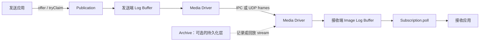
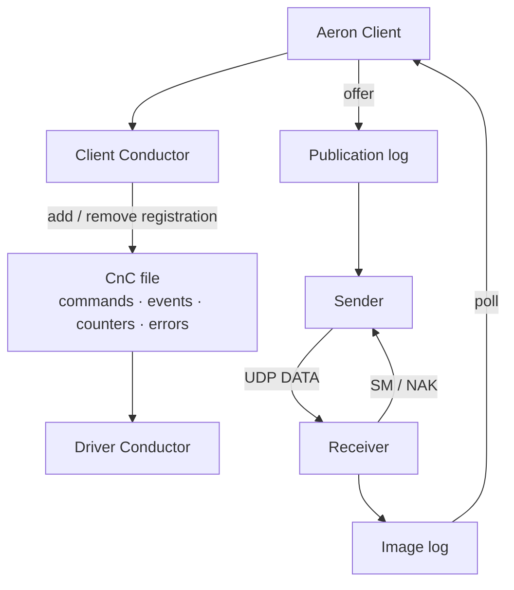
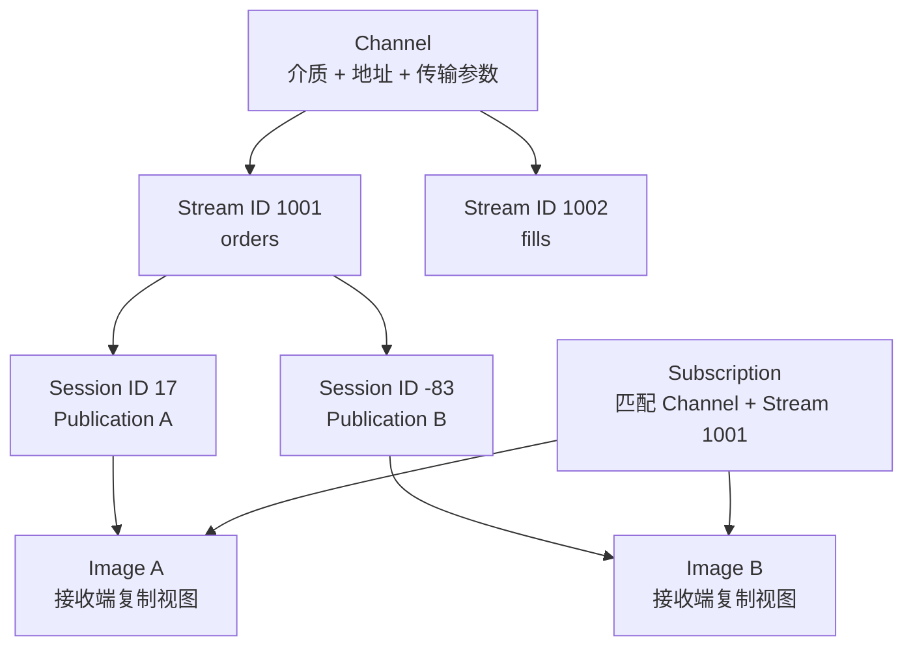
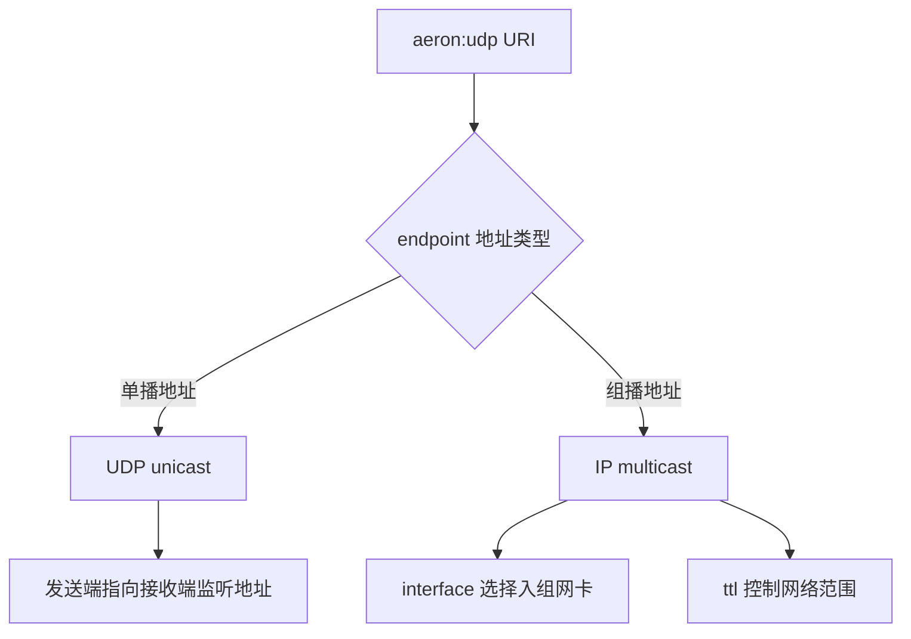
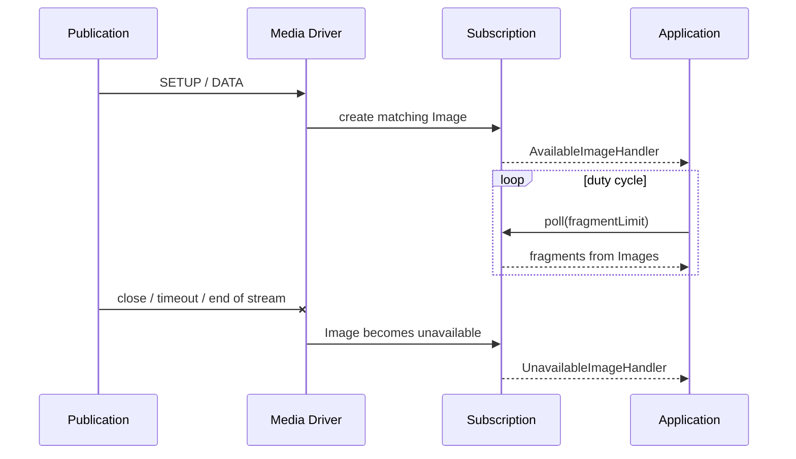
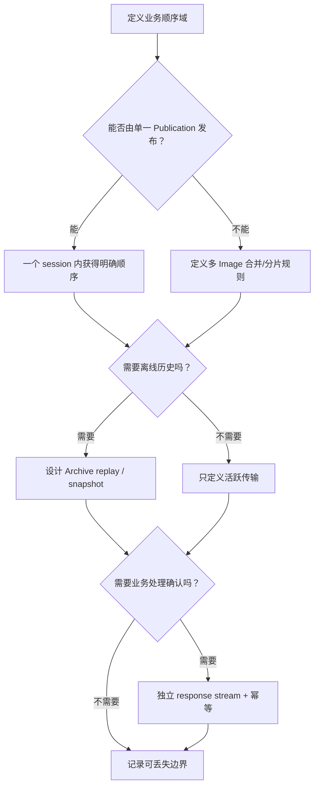

Aeron Transport 常被简称为“高性能消息系统”，但这个叫法会把最重要的边界藏起来：它不是带持久化队列、消费组和离线堆积能力的 broker，而是一套把**有序日志缓冲区从一个进程复制到另一个进程或主机**的传输协议与运行时。

只要先抓住“复制日志”这条主线，后面的概念就会自然归位：

- `Publication` 是应用写入发送端日志的入口；
- Media Driver 把日志中的 frame 经 IPC 或 UDP 搬到接收端；
- 接收端每发现一个独立发送会话，就建立一个 `Image`；
- `Subscription` 聚合匹配的 Image，再由应用持续 `poll`；
- `Channel + Stream ID + Session ID` 共同界定一条有序消息序列。

本文以 **Aeron 1.52.2** 为版本基线。官方核心文档、1.52.2 源码和 Javadoc 是事实依据；Cookbook 只用于补充实战注意事项。Java 示例默认运行在 Java 17 及以上。

## 1. 先划边界：Transport 做什么，不做什么

Aeron Transport 的核心能力可以压缩为三点：

1. 在同机进程间通过共享内存传输，或在主机间通过 UDP 传输；
2. 在一个活跃会话内按位置检测缺口、请求重传，并向应用呈现连续的有序片段；
3. 用固定上限的缓冲区和显式背压，把“消费者跟不上”变成可观测的程序状态。

它本身不承诺：

- 接收者离线期间替它保存消息；
- 应用回调已经处理或持久化了消息；
- 多个发送者之间存在全局顺序；
- 业务效果 exactly-once；
- 网络内容经过认证或加密。



图中的 Archive 不是 Transport 自动附带的“消息历史”。只有显式启动录制，历史才会进入磁盘；Cluster 又在 Transport 与 Archive 之上增加共识日志、确定性状态机和故障恢复。三者不能互相代称。

### 1.1 推模型，而不是接收者拉取 broker

UDP channel 使用推模型：Publication 的 `endpoint` 指向**远端 Subscription 监听的地址**；Subscription 的 `endpoint` 是**本机要绑定的地址**。这是最常见的配置误解之一。

```text
sender Publication:
  aeron:udp?endpoint=receiver.example.com:40123

receiver Subscription:
  aeron:udp?endpoint=0.0.0.0:40123
```

Subscription 不会去 Publication 所在主机“拉消息”。接收端通过 Status Message 把接收位置和窗口反馈给发送端，发送端据此决定还能推进多远。

### 1.2 活跃传输不等于离线堆积

假设接收进程在 10:00 退出，10:05 重新订阅：Transport 不会把这五分钟内已经离开可重传窗口的数据重新送来。新 Image 通常从发送端当前可加入的位置开始。若业务需要历史补齐，应设计 Archive replay、快照或自己的持久化协议，而不是把“reliable UDP”理解成 broker 的 store-and-forward。

## 2. 一条消息经过哪些组件

Aeron 应用并不直接操作 socket 或共享内存文件。客户端库和 Media Driver 通过 driver directory 中的 CnC 文件交换命令、事件与 counters；数据则进入 Publication 和 Image 各自的 log buffer。



Media Driver 可以：

- 作为独立进程运行，由多个客户端连接；
- 嵌入单个应用进程；
- 使用 Java driver；
- 使用 C driver，并让 Java/C/C++ 客户端通过兼容的目录和协议连接。

嵌入方式改变部署与生命周期所有权，不改变 Channel、Stream、Session 和 Image 的身份语义。Java 与 C driver 的配置项、默认值和功能发布时间也并非永远完全一致，升级时仍要查所用实现的当前配置。

## 3. 身份模型：三维坐标，不是一串 topic 名

一条 Aeron 消息流至少有三层身份：



### 3.1 Channel：怎样传、从哪来、到哪去

Channel 是 URI，描述传输介质与连接参数。最小形式包括：

```text
aeron:ipc
aeron:udp?endpoint=10.10.1.20:40123
```

Channel 不是业务 topic。两个 URI 文本看起来略有差别，也可能在 driver 归一化后映射到同一底层传输；反之，参数不同也可能导致无法匹配或共享。不要依赖手写字符串比较判断 channel 身份，应使用 Aeron 返回的 canonical channel 和 registration/correlation 信息排障。

### 3.2 Stream ID：在同一 Channel 上复用逻辑流

`streamId` 是有符号 32 位整数，由应用约定。相同 channel 上可以复用多个 stream：

```java
final int ordersStreamId = 1001;
final int fillsStreamId = 1002;

final Publication orders = aeron.addPublication(channel, ordersStreamId);
final Publication fills = aeron.addPublication(channel, fillsStreamId);
```

Stream ID 没有内建名称注册、ACL 或 schema。`1001` 代表订单还是行情，必须由配置、协议注册表或代码常量保持一致。误用相同数字不会被 Aeron 识别为业务错误。

### 3.3 Session ID：区分同一 Channel + Stream 上的发送会话

多个 Publication 可以同时向同一 channel 和 stream 发送。Media Driver 给每个独立发送会话分配 `sessionId`，接收端据此区分来源与顺序域。

Session ID 也是有符号 32 位整数，日志里出现负数完全正常。它不是：

- 稳定的业务生产者 ID；
- 跨重启永久不变的身份；
- 用户登录会话；
- 多个 Publication 的全局排序号。

若业务必须识别生产者任期或跨重启连续性，应把 `producerId`、`epoch`、业务序列号等放进自己的消息 envelope，不能借用 Aeron Session ID 代替。

### 3.4 Image：一个发送会话在接收端的复制日志

`Subscription` 不是单条线性日志。它会聚合零个、一个或多个 `Image`；每个 Image 对应一个匹配的 Publication session，并拥有独立位置。

这带来一个关键结论：

> Aeron 保证单个 Image 内按 position 交付；它不为同一 Subscription 下不同 Image 建立全局顺序。

如果两个生产者 A、B 同时向同一 stream 发送，Subscription 的轮询可以在两幅 Image 间公平前进，但 `A1, B1, A2, B2` 不是协议承诺。需要全局序列时，应让一个单写者发布、在业务层排序，或由更高层的共识日志决定顺序。

## 4. Channel URI 应怎样读

Channel URI 的一般结构是：

```text
[aeron-spy:]aeron:<media>?<key>=<value>|<key>=<value>|...
```

典型示例：

```text
aeron:udp?endpoint=239.10.10.10:40123|interface=10.10.1.0/24|ttl=4
aeron:udp?endpoint=receiver-a:40123|term-length=16m|mtu=1408
aeron-spy:aeron:udp?endpoint=receiver-a:40123
aeron:ipc?term-length=64m
```

建议用 `ChannelUriStringBuilder` 生成 URI，避免分隔符、大小单位、IPv6 方括号和可选参数拼错：

```java
final String channel = new ChannelUriStringBuilder()
    .media(CommonContext.UDP_MEDIA)
    .endpoint("receiver-a.example.com:40123")
    .termLength(16 * 1024 * 1024)
    .mtu(1408)
    .build();
```

### 4.1 配置的通常优先级

同一能力可能出现在三处：

1. Channel URI：最具体，作用于这一条 channel；
2. Client 或 Media Driver `Context`：作用于当前实例；
3. system property / environment：进程级默认。

通常 URI 覆盖 Context，Context 覆盖系统默认，但不是每个选项都支持三种位置。遇到参数不生效，应先查 1.52.2 的 Configuration Options 与对应实现，不能把这条概括当成所有属性的反射规则。

### 4.2 endpoint 与 interface 不是同一件事

对 UDP Publication：

- `endpoint` 通常是目标地址；
- `interface` 选择本地发送网卡或源地址。

对 UDP Subscription：

- `endpoint` 是本地接收 socket 要绑定的地址；
- 多播时 `interface` 选择加入组播组的网卡。

在 Aeron 1.50.0 以后，interface 可以用 `{eth0}` 这样的接口名形式。若一个接口匹配多个地址，具体选中哪一个不应被当作稳定协议；生产配置最好给出明确地址或 CIDR，并在启动检查中打印实际 socket 地址。

### 4.3 单播与组播由地址决定

基础 UDP URI 都写作 `aeron:udp`。`endpoint` 是单播地址时走单播，是合法组播地址时走 IP multicast；没有单独的 `aeron:multicast` media。



IP multicast 是否能跨网段取决于交换机、路由器、IGMP 和网络策略。URI 正确不代表基础设施允许组播。

### 4.4 通配端口必须读取解析结果

Subscription 可以绑定 `endpoint=host:0`，让操作系统选择端口。创建完成后必须通过 `localSocketAddresses()` 或 `tryResolveChannelEndpointPort()` 获取实际端口，再把它交给对端；不能继续广播带 `:0` 的原字符串。

这一能力很适合测试和动态服务发现，但不等于外部防火墙、NAT 或负载均衡器会自动感知端口。

## 5. IPC 与 UDP：同一 API，不同故障边界

### 5.1 IPC 是同一 Media Driver 内的共享内存路径

`aeron:ipc` 让连接到同一个 Media Driver directory 的客户端通过共享内存交换数据。它省去 UDP socket 和网络协议处理，通常也能提供更高吞吐与更低开销。

它并不是通用操作系统 IPC 总线：

- 两个进程必须连接同一个存活的 Media Driver；
- driver directory 与权限必须匹配；
- 跨主机不能使用 IPC；
- 仍然有 Publication、Subscription、Image、position 和背压；
- Media Driver 退出仍是共同故障点。

### 5.2 UDP 把日志复制到另一个 driver

UDP 模式下，发送端 Sender 读取 Publication log 并发送 DATA frame；接收端 Receiver 写入 Image log，通过 Status Message 汇报窗口，并用 NAK 请求缺失数据。应用 API 看起来相似，但需要面对 MTU、socket buffer、路由、丢包、乱序和防火墙。

| 维度 | IPC | UDP |
| --- | --- | --- |
| 边界 | 同一 Media Driver | 同机或跨主机 driver |
| 数据路径 | 共享内存 | UDP socket + 接收端 Image |
| 网络丢包 | 无 | 可能，可靠模式可 NAK 重传 |
| `reliable=false` | 不适用，始终可靠 | 可配置为跳过缺口 |
| MTU | 不走网络 MTU | 必须尊重路径 MTU |
| 典型用途 | 同机进程解耦 | 服务间低延迟传输 |

不要因为 API 一样就假设性能参数也能照搬。IPC 默认 term length、socket 配置、receiver window 与 UDP 不同；生产基准必须按真实拓扑测量。

## 6. Publication 与 Subscription 怎样匹配

最小 Java 生命周期如下：

```java
final MediaDriver.Context driverContext = new MediaDriver.Context();

try (MediaDriver driver = MediaDriver.launchEmbedded(driverContext);
     Aeron aeron = Aeron.connect(
         new Aeron.Context().aeronDirectoryName(driver.aeronDirectoryName()));
     Subscription subscription = aeron.addSubscription("aeron:ipc", 1001);
     Publication publication = aeron.addPublication("aeron:ipc", 1001))
{
    while (!publication.isConnected())
    {
        Thread.onSpinWait();
    }

    // offer 与 poll 在后续章节展开。
}
```

这个示例只展示资源关系，不是完整生产循环。实际代码需要：

- 给连接等待设置 deadline，而不是永久自旋；
- 为 agent 选择与 CPU 预算匹配的 `IdleStrategy`；
- 区分 `offer` 的各类负返回码；
- 在独占线程中 `poll` Subscription；
- 用 try-with-resources 或显式关闭回收 registration。

### 6.1 `isConnected` 的含义是“当前存在匹配接收者”

Publication 的连接状态不是永久握手凭证。接收者可以出现、离开、超时或重新建立 Image。业务不能在启动时检查一次 `isConnected()`，随后假定链路永远存在。

对 multicast/MDC，连接判定还会受 flow-control strategy、group minimum size 和 spy 配置影响。Transport 第 6 篇会单独讲这些拓扑语义。

### 6.2 Image 可用性回调是资源事件

Subscription 可注册 `AvailableImageHandler` 与 `UnavailableImageHandler`：

```java
final AvailableImageHandler onAvailable = image ->
    System.out.printf(
        "available session=%d source=%s position=%d%n",
        image.sessionId(), image.sourceIdentity(), image.position());

final UnavailableImageHandler onUnavailable = image ->
    System.out.printf(
        "unavailable session=%d finalPosition=%d%n",
        image.sessionId(), image.position());

try (Subscription subscription = aeron.addSubscription(
    channel, streamId, onAvailable, onUnavailable))
{
    // polling loop
}
```

回调适合建立或清理“按 session 分配”的状态，例如 `FragmentAssembler` 的重组缓冲、业务序列窗口和监控标签。不要在回调里执行长时间阻塞的网络请求；它会阻塞负责客户端管理工作的线程。

1.48+ 的显式拒绝还会改变 unavailable 原因：`Image.reject(reason)` 会向发送侧发 ERR，并关闭共享该 driver Image 的订阅视图；接收方可用 `Image.isPublicationRevoked()` 判断对端是否通过 Publication revoke 快速撤销。`reject` 不是永久封禁，liveness timeout 后同一来源仍可能重新连接，因此安全策略不能只靠一次 reject 保存于内存。



### 6.3 late join 从当前位置加入

新 Subscription 建立 Image 时，起始 position 取决于当前发送端/接收端状态。Transport 不会自动从 position 0 回放。于是“先启动谁”不是纯部署细节：

- 先启动 Subscription，等待 Publication 连接，可避免错过开头；
- 先启动 Publication 且持续发送，新 Subscription 只能加入仍可用的当前窗口；
- 要求从已知历史位置开始，应使用 Archive replay 或受控的 initial position 配置，而不是依赖启动时序碰巧正确。

## 7. 顺序与投递保证应逐层表达

下面这张表比一句“可靠有序”更接近真实契约：

| 层次 | Aeron Transport 提供什么 | 应用还要做什么 |
| --- | --- | --- |
| frame | 检测同一 session 的缺口，可靠模式请求重传 | 配置窗口与超时，监控损失 |
| message | 用 begin/end flags 标记 fragmentation | 用 assembler 重组大消息 |
| Image | 只把连续 position 暴露给 poll | 保证单线程消费和处理时限 |
| 多 Image | Subscription 公平轮询 | 若要全序，在业务层合并 |
| 处理结果 | `poll` 调用 handler | 幂等、事务、失败策略 |
| 重启后历史 | Transport 不保存完整历史 | Archive、快照或业务日志 |

### 7.1 “收到”至少有四种不同含义

讨论故障时必须说清是哪一个时刻：

1. `offer` 返回正数：消息已进入本地 Publication log；
2. Sender 已把 frame 交给 socket；
3. Receiver 已写入 Image 并推进连续位置；
4. 应用 handler 已产生并持久化业务效果。

第一步不蕴含后面三步。Aeron Transport 也不会替应用在第四步回 ACK。需要端到端确认时，应建立单独的响应 stream，并定义 correlation、超时、重试与幂等协议。

### 7.2 exactly-once 不是传输属性

网络重传处理的是 frame 缺失；应用重试处理的是业务确认缺失。两层的“重复”不是同一问题。即使 Transport 对应用只交付一遍，应用也可能在业务提交后、响应发出前崩溃，导致调用方重试。

可靠业务流程通常需要：

- 稳定的 `eventId` 或请求 ID；
- 接收端幂等表或状态机序列；
- 业务状态与消费位置的原子提交边界；
- 可重放历史或快照；
- 明确的超时和未知结果处理。

## 8. 身份设计的常见错误

### 8.1 把 Stream ID 当成安全边界

Stream ID 只是匹配和复用字段。知道 channel 的进程可以发送同一 stream；它不会鉴权。应通过主机权限、网络 ACL、独立 driver directory、ATS 或应用层认证建立安全边界。

### 8.2 用 Session ID 当永久生产者编号

Session 会随 Publication 生命周期变化，也可能显式配置或共享。审计日志需要稳定业务身份时，把它编码进消息并纳入签名/校验，而不是只记 `sessionId()`。

### 8.3 假设 Subscription 等价于竞争消费者

两个 Subscription 匹配同一 Publication 时，它们各自获得消息，是 broadcast 语义，不会自动“一条任务只给一个 worker”。如果需要工作队列，应在上游分片、单独 stream 路由，或在应用层实现竞争与所有权协议。

### 8.4 只看 URI，不看实际 Image

真正的数据顺序和位置属于 Image。排障时至少记录：

- canonical channel；
- stream ID；
- session ID；
- source identity；
- subscription registration ID；
- Image correlation ID；
- Image position 与对应 counters。

### 8.5 把 Image 暂时不可用当成永久业务失败

Image 可以因发送端关闭、超时、重建或 destination 变化而消失。它是传输资源生命周期事件。业务层是否切主、补历史或拒绝请求，要结合生产者 epoch、Archive position 和控制面状态判断。

## 9. 从身份模型推导可验证的路由合同

身份模型只有写成系统合同，才能在重启、扩容和故障切换时继续成立。合同至少覆盖四类声明：

- **拓扑与分配**：明确使用 IPC、unicast、multicast、MDC 还是组合拓扑，并指定 channel、stream 和 session 策略的权威分配者；
- **顺序与合并**：说明一个业务顺序域对应哪个 Publication session，以及多 Image 到达时采用分片、拒绝还是业务合并；
- **确认与恢复**：分别定义 local-log accepted、传输到达、业务处理和持久化确认，并说明晚加入或重启从哪个 Archive position、snapshot 或业务 checkpoint 恢复；
- **生命周期与证据**：写明 URI 启动校验、Image available/unavailable 时的资源动作，以及同时包含 channel、stream、session、source identity 和 position 的观测标签。

端到端 ACK 必须携带稳定业务请求 ID，并与传输 position 分离；否则即使连接坐标完全正确，应用仍无法证明重试是在恢复同一请求还是制造第二次副作用。



## 10. 小结：先认清坐标，再谈性能

这一章最重要的不是背 URI，而是形成四个稳定判断：

- Aeron Transport 复制的是有限窗口内的有序日志，不是离线消息仓库；
- Channel + Stream 决定匹配，Session 决定独立顺序域，Image 是接收端的会话视图；
- Publication 和 Subscription 的连接是动态资源关系，不是一次建立后永久有效；
- 传输确认、应用处理、持久化和 exactly-once 属于不同层次。

下一篇先进入 [Aeron 与 SBE](/signal-grid-blog/posts/aeron-sbe-schema-flyweight-and-compatibility-testing/)：把这里传输的字节收敛为有 schema、template、version 和兼容性证据的应用协议；随后再沿发送热路径深入 Publication、三段 term log、position、`offer` 与 `tryClaim`，并把每个返回码变成明确的控制流，而不是一个无限重试循环。

## 官方资料

- [Aeron Documentation](https://aeron.io/docs/)
- [Aeron Transport Overview](https://aeron.io/docs/aeron/overview/)
- [Channels, Streams and Sessions](https://aeron.io/docs/aeron/aeron-channel-stream-session/)
- [Publications and Subscriptions](https://aeron.io/docs/aeron/publications-subscriptions/)
- [Media Driver](https://aeron.io/docs/aeron/media-driver/)
- [Basic Sample](https://aeron.io/docs/aeron/basic-sample/)
- [Two Agent IPC Sample](https://aeron.io/docs/aeron/two-agent-ipc-sample/)
- [Channel Configuration](https://github.com/aeron-io/aeron/wiki/Channel-Configuration)
- [Java Programming Guide](https://github.com/aeron-io/aeron/wiki/Java-Programming-Guide)
- [Message Delivery Assurances](https://github.com/aeron-io/aeron/wiki/Message-Delivery-Assurances)
- [Transport Protocol Specification](https://github.com/aeron-io/aeron/wiki/Transport-Protocol-Specification)
- [Aeron 1.52.2 Release](https://github.com/aeron-io/aeron/releases/tag/1.52.2)
- [Aeron 1.52.2 `Aeron.java`](https://github.com/aeron-io/aeron/blob/1.52.2/aeron-client/src/main/java/io/aeron/Aeron.java)
- [Aeron 1.52.2 `Subscription.java`](https://github.com/aeron-io/aeron/blob/1.52.2/aeron-client/src/main/java/io/aeron/Subscription.java)
- [Aeron 1.52.2 `Image.java`](https://github.com/aeron-io/aeron/blob/1.52.2/aeron-client/src/main/java/io/aeron/Image.java)
- [Aeron 1.52.2 Javadoc](https://javadoc.io/doc/io.aeron/aeron-all/1.52.2/index.html)
- [Cookbook: Channel Configuration](https://aeron.io/docs/cookbook-content/aeron-channel-configuration/)
- [Cookbook: What is the Media Driver?](https://aeron.io/docs/cookbook-content/aeron-what-is-media-driver/)
