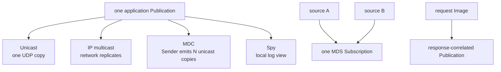
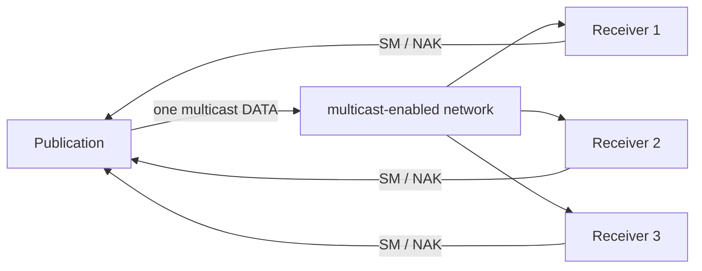
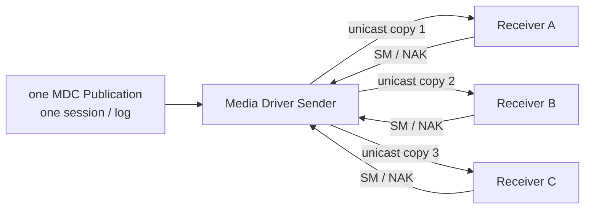
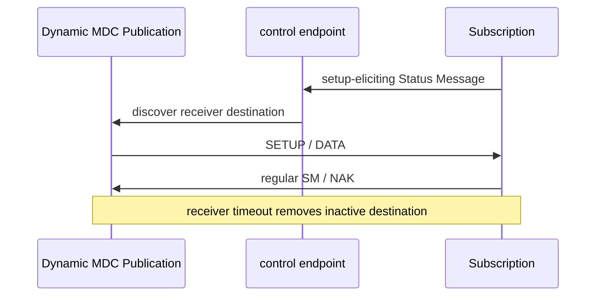
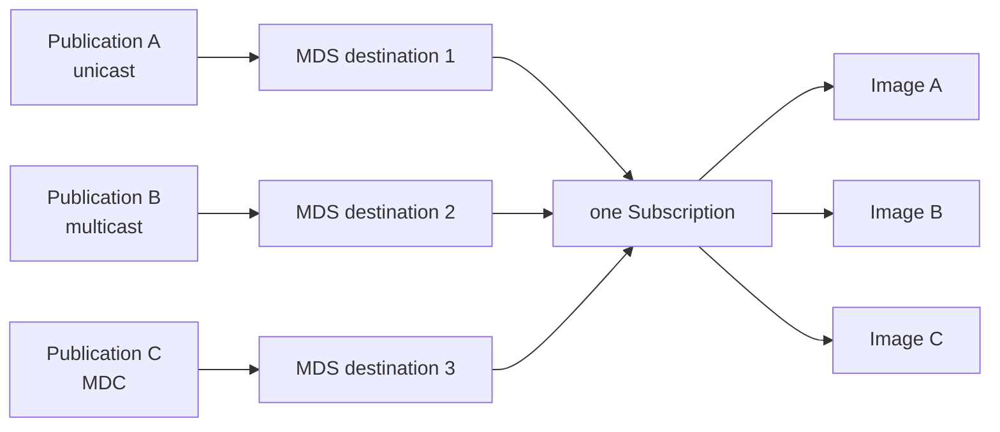
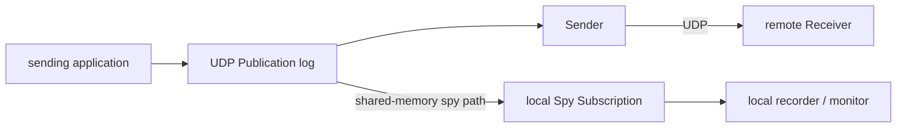
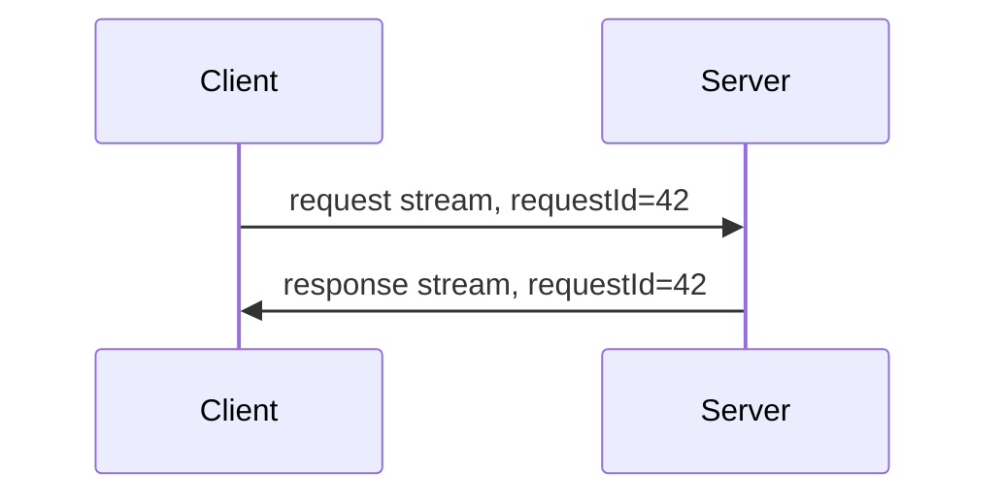
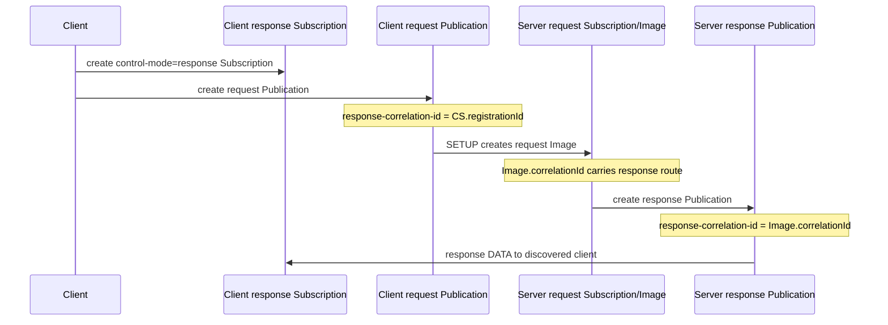
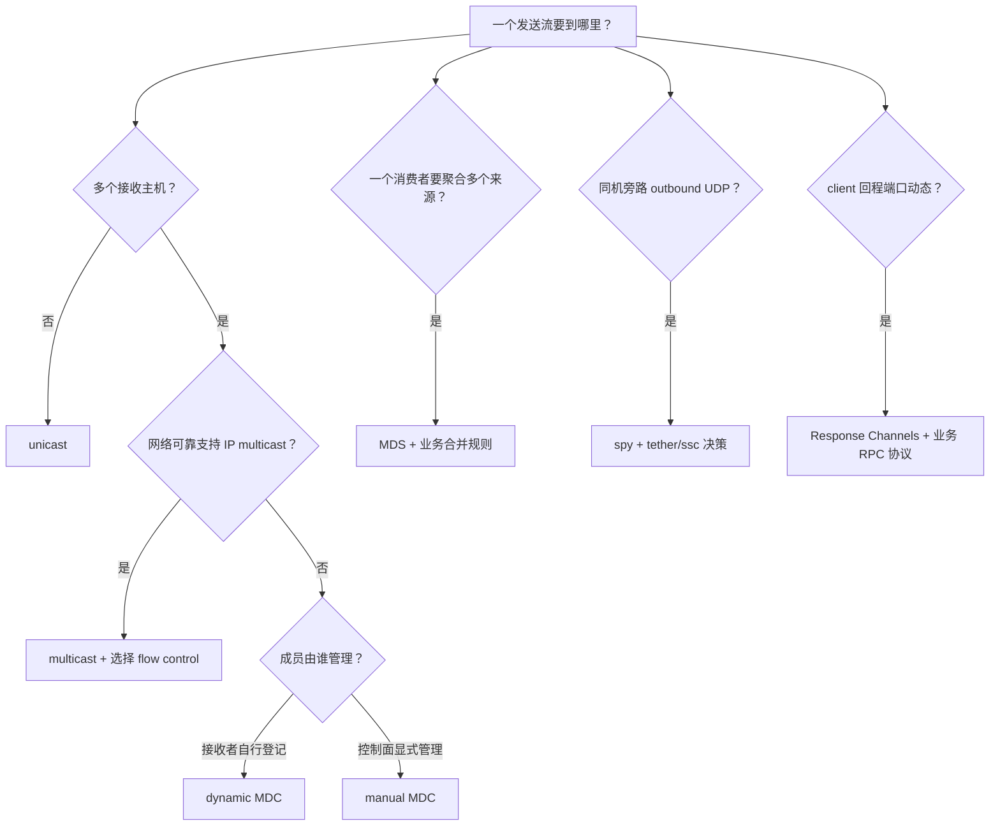

Aeron 的拓扑不止“一个 Publication 对一个 Subscription”。同一套单向 stream 抽象可以组合出：

- UDP unicast；
- IP multicast；
- 一个 Publication 主动或动态管理多个单播目的地的 MDC；
- 一个 Subscription 聚合多个接收 destination 的 MDS；
- 本机旁路读取 UDP Publication log 的 spy；
- 让请求 Image 自动携带回程地址的 Response Channels。

这些能力都通过 Channel URI 和 destination registration 表达，但它们解决的问题不同。选错时最常见的症状不是“无法连接”，而是数据复制份数、慢接收者背压、端口发现或安全边界与预期不同。

本篇以 **Aeron 1.52.2** 为基线，先建立拓扑比较，再给出当前 API 与生命周期。流控策略的 `max/min/tagged` 细节见 [可靠 UDP、流控与丢包恢复](/signal-grid-blog/posts/aeron-transport-reliable-udp-flow-congestion-loss/)。

## 1. 一张表先分清六种模式

| 模式 | 数据复制发生在哪里 | destination 谁管理 | 典型用途 | 关键边界 |
| --- | --- | --- | --- | --- |
| unicast | Sender 发一份 UDP | 静态 URI | 一对一数据流 | 一条固定远端地址 |
| IP multicast | 网络设备复制 datagram | 组播基础设施 | 同网段/组播域广播 | 依赖 IGMP、路由、网络权限 |
| MDC | Aeron Sender 对每个地址发单播 | dynamic 或 manual | 云网络、一对多 | 发送带宽随 destination 数增长 |
| MDS | Receiver 聚合多个 destination | manual API；tags 只用于复用/共享 driver Subscription | 多来源汇聚、迁移 | 多 Image 仍无全局顺序 |
| spy | 本机直接读发送 log | spy URI | 本机录制、监控、旁路 | 不走 UDP，不等于 IPC |
| response | Image correlation 建回程路由 | 协议自动关联 | NAT/动态端口 request-response | 仍是两条单向 stream |



## 2. 普通 unicast：最小、最明确的基线

固定服务地址的请求流：

```text
client publication:  aeron:udp?endpoint=server.example.com:40123
server subscription: aeron:udp?endpoint=0.0.0.0:40123
```

这个模式最容易解释：一个 Sender socket 向一个远端 endpoint 发 DATA，接收端 SM/NAK 反馈。若服务器也要返回业务消息，应再建立反方向 stream：

```text
server publication:  aeron:udp?endpoint=client.example.com:40124
client subscription: aeron:udp?endpoint=0.0.0.0:40124
```

它的问题是服务器必须知道 client 可达地址。在 NAT、临时端口或大量客户端场景，静态回程 URI 很难管理，Response Channels 正是为此而来。

## 3. IP multicast：让网络复制

当 endpoint 是组播地址时，同一个 datagram 由网络基础设施分发给组成员：

```text
publication:
aeron:udp?endpoint=239.20.30.40:40123|interface=10.10.1.0/24|ttl=4

subscription:
aeron:udp?endpoint=239.20.30.40:40123|interface=10.10.2.0/24
```



优势是 sender 不按 receiver 数线性发送 payload。代价是：

- 网络必须允许 multicast；
- `interface`、TTL、组播路由和 IGMP snooping 要正确；
- 多 Receiver 的 SM/NAK 需要 suppression；
- max/min/tagged flow control 决定谁能拖慢发送者；
- 云和跨地域网络通常不原生支持或运维成本高。

不能因为本机 loopback 测试成功，就假设生产交换机也会转发。

## 4. MDC：一份 Publication，多个单播 destination

Multi-Destination-Cast 不是 IP multicast。Publication 只有一份 session/log，Media Driver Sender 针对每个 destination 发送 UDP unicast。



它保留 group flow-control 语义，却不需要网络组播支持。发送主机的 NIC 带宽、CPU 和重传流量会随 destination 数量增长。

### 4.1 Dynamic MDC：Subscription 主动登记

Publication 监听一个 control endpoint：

```text
aeron:udp?control=publisher.example.com:40456|control-mode=dynamic
```

每个 Subscription 使用自己的 endpoint，并向相同 control 地址登记：

```text
aeron:udp?endpoint=receiver-a.example.com:0|control=publisher.example.com:40456|control-mode=dynamic
```

流程如下：



若 Subscription 绑定 `:0`，driver 会解析实际端口并在控制帧中告知发送端。这适合弹性成员，但控制 endpoint 必须双向可达，NAT/firewall 规则也要允许返回路径。

### 4.2 Manual MDC：应用显式增删 destination

先创建 manual Publication：

```java
final String channel = new ChannelUriStringBuilder()
    .media(CommonContext.UDP_MEDIA)
    .controlMode(CommonContext.MDC_CONTROL_MODE_MANUAL)
    .build();

final Publication publication = aeron.addPublication(channel, streamId);

final String destinationA = "aeron:udp?endpoint=10.20.1.11:40123";
final String destinationB = "aeron:udp?endpoint=10.20.1.12:40123";

publication.addDestination(destinationA);
publication.addDestination(destinationB);
```

移除时使用相同 URI，或 destination registration ID：

```java
publication.removeDestination(destinationA);
```

同步方法会经 Client Conductor 与 driver 协调，不适合直接塞进 latency-critical handler。1.52.2 也提供：

```java
final long correlationId = publication.asyncAddDestination(destinationA);

while (aeron.isCommandActive(correlationId))
{
    // 在正常 duty cycle 中继续推进其他工作，并设置自己的 deadline。
}
```

异步错误由 `Aeron.Context.errorHandler()` 交付；“command 不再 active”应结合 error path 和实际 counters/连接状态判断，不能只当成业务 destination 已健康。

### 4.3 destination URI 只描述目的地

Manual destination 通常只包含 `endpoint` 及与该路径直接相关的网络参数。stream ID 属于 Publication registration，不放在 destination URI；session、term 等公共实体配置也不应在每个 destination 上制造冲突。

### 4.4 MDC 仍必须选流控策略

MDC 使用 multicast-like group semantics：

- `fc=max`：最快 receiver 定速，慢节点可掉队；
- `fc=min`：最慢 receiver 定速；
- `fc=tagged`：核心 tagged receiver 定速；
- min/tagged 可设置 group minimum 决定 Publication 是否 connected。

“动态发现所有订阅者”不等于“等待所有订阅者”。成员发现和发送定速是两层配置。

## 5. MDS：一个 Subscription 聚合多个 destination

Multi-Destination Subscription 从接收侧组合来源。先创建 manual Subscription：

```java
final String channel = new ChannelUriStringBuilder()
    .media(CommonContext.UDP_MEDIA)
    .controlMode(CommonContext.MDC_CONTROL_MODE_MANUAL)
    .build();

final Subscription subscription = aeron.addSubscription(channel, streamId);

subscription.addDestination("aeron:udp?endpoint=0.0.0.0:40131");
subscription.addDestination("aeron:udp?endpoint=239.20.30.41:40132|interface=10.10.2.0/24");
```

它可以把多个 unicast、multicast 或 MDC 接收 endpoint 归入一个 Subscription，由各自 session 建立 Image。



### 5.1 聚合不等于合并顺序

每个 Image 保持自己的 session order。Subscription round-robin poll，不会按 wall clock、业务 sequence 或 source priority 合并。若 MDS 用于主备同时接入，业务层必须定义：

- 哪个 producer epoch 当前有效；
- 重复消息怎样去重；
- 切换时 position/sequence 怎样衔接；
- 两边同时活跃时谁有写权。

MDS 只是接收拓扑，不是 leader election 或 fencing。

### 5.2 session-id 放在 parent Subscription

若只希望匹配特定 `session-id`，参数应放在 parent MDS Subscription URI；destination URI 上的 session-id 会被忽略。这个边界很容易在手写配置时弄反。

### 5.3 destination 生命周期也要等待异步结果

Subscription 同样提供同步和异步的 add/remove destination。目的地加入后还要等待 socket 建立、SETUP 和 Image available；API command 完成不等于数据链路已可用。

## 6. Channel tags：复用 transport 配置，不是业务标签

Channel URI 支持 64 位 tags：

```text
tags=<channelTag>[,<entityTag>]
```

channel tag 可让另一个 URI 引用既有 channel transport，减少复杂动态配置重复；entity tag 可标识特定 Publication/Subscription 实体。它们主要参与 driver 内资源匹配和配置复用，不是：

- 面向最终用户的分类标签；
- 安全 ACL；
- 自动服务发现系统；
- 跨 driver 的全局注册中心。

为避免碰撞，tag 分配也要集中管理，并把 canonical channel/counters 打进诊断信息。对 MDS，共享 channel tag 时仍要把 session filter 放在 parent，而不是 destination。

## 7. Spy Subscription：绕过本机 UDP 回环

Spy URI 在普通 UDP URI 前加前缀：

```text
aeron-spy:aeron:udp?endpoint=receiver.example.com:40123
```

如果 spy 与 outbound Publication 连接同一个 Media Driver，并匹配其 channel/stream/session，spy 可直接读取 Publication log，不必等 DATA 经过本机 UDP stack。



### 7.1 Spy 不是 IPC

IPC channel 表示同一 driver 内专门的共享内存 stream；spy 则旁观一条本来就要向 UDP endpoint 发送的 Publication。两者：

- URI 不同；
- counters 与连接关系不同；
- spy 可与远端 receivers 同时存在；
- spy 必须匹配 outbound UDP channel。

### 7.2 Spy 默认不让 Publication 变 connected

默认情况下，只有本机 spy、没有真实网络 receiver 时，Publication 不应被误认为远端已连接。可以用 Publication URI `ssc=true` 或 driver 的 spies-simulate-connection 配置改变这一点。

启用前必须明确后果：应用可能在没有任何远端 receiver 时持续发送，只因为本机 recorder/monitor 正在 spy。

### 7.3 Spy 怎样参与背压

Spy 不作为独立网络 receiver 进入 max/min/tagged group 计算，但它是本地 subscriber，会参与 tether/untethered 和 Publication 的本地消费限制。一个停止 poll 的 tethered spy 可能让发送路径背压。

常见用途是本机 Archive recording；这时“录制是否允许拖慢 live stream”必须作为产品选择，而不是偶然默认。

## 8. 普通双通道 request/response 的成本

固定地址时，两条 unicast channel 足够：



应用仍要处理：

- request ID 与 response correlation；
- timeout 后结果未知；
- client retry 的幂等；
- response Publication 的生命周期；
- client 地址/端口发现；
- 一个 client 断开后的资源回收。

Response Channels 只优化“如何找到正确回程地址和关联 Image”这部分，不自动实现 RPC 框架。

## 9. Response Channels：从 request Image 派生回程

Response Channels 在 Aeron 1.44 引入 Transport/Archive 支持；1.49 扩展到 IPC，并加入 prototype response publication 能力。1.52.2 的核心关联链是：



注意仍然是两条单向 stream：request stream 有自己的 session/position，response stream 也有自己的 session/position。所谓 response 是建立回程 destination 的关联方式，不是让一条 Publication 突然可双向读写。

### 9.1 Client 创建顺序

先创建 response Subscription，再把它的 registration ID 放进 request Publication：

```java
final String responseChannel = new ChannelUriStringBuilder()
    .media(CommonContext.UDP_MEDIA)
    .controlMode(CommonContext.CONTROL_MODE_RESPONSE)
    .controlEndpoint("server.example.com:10001")
    .build();

final Subscription responses =
    aeron.addSubscription(responseChannel, responseStreamId);

final String requestChannel = new ChannelUriStringBuilder()
    .media(CommonContext.UDP_MEDIA)
    .endpoint("server.example.com:10000")
    .responseCorrelationId(responses.registrationId())
    .build();

final ExclusivePublication requests =
    aeron.addExclusivePublication(requestChannel, requestStreamId);
```

这里的 `control` 是 **server 的 response control endpoint**，不是 client 自己挑出的回程地址；这正是让 driver 穿过 NAT 协商返回路径的关键。client 若因防火墙要求固定本地端口，可另外设置 `endpoint`，大多数场景无需设置。用 builder 也能避免把 `response-correlation-id` 拼错。官方 wiki 的一处旧示例曾把 `server.host.name:10000` 写成等号形式；当前源码 sample/tests 使用正常的 `host:port` endpoint，应以 1.52.2 源码为准。

### 9.2 Server 为每幅 request Image 建 response Publication

Server request Subscription 注册 available/unavailable image handler。对每幅新 Image：

```java
final Publication responsePublication = aeron.addPublication(
    new ChannelUriStringBuilder(responsePublicationBaseChannel)
        .responseCorrelationId(image.correlationId())
        .build(),
    responseStreamId);
```

Server 应以 `image.correlationId()` 管理 session map，并在 Image unavailable 时关闭对应 Publication、handler 和 assembler buffer。

不要使用 `image.sessionId()` 替代 correlation ID：session 区分数据顺序域，correlation ID 才承载 response registration 关联。

### 9.3 Server 的 response control endpoint

当前官方 `ResponseServer` sample 在 request Subscription channel 上设置 `response-endpoint`，并为 response Publication 设置：

```text
control-mode=response
control=<server response control address>
response-correlation-id=<request Image correlation id>
```

这些参数让 driver 协商 client 的实际 response destination。不要只复制一半 URI；应整体参考同版本 `ResponseClient`/`ResponseServer` 源码，并确认防火墙允许控制和数据回程。

### 9.4 Prototype response Publication

1.49 起可用：

```text
response-correlation-id=prototype
```

先建立 prototype 可以预留/共享 response transport 与端口，减少首个 client 到来时的资源创建抖动。它是高级优化：实际 per-Image Publication 仍需要正确 correlation、关闭和失败处理。

### 9.5 IPC response channel 不写网络 control 地址

1.49 起 IPC 支持 response semantics。因为数据不走 UDP endpoint，IPC response channel 不应照抄网络示例的 `control=host:port`。使用同版本 builder/sample/Javadoc 创建关联，并保证两端连接同一个 Media Driver。

## 10. Response Channels 不提供 RPC 语义

下面这些仍由应用负责：

| 问题 | Response Channels 是否解决 | 应用方案 |
| --- | --- | --- |
| 找到 client 回程地址 | 是 | driver correlation |
| request/response ID | 否 | payload correlation ID |
| timeout | 否 | timer + pending map |
| retry | 否 | 明确可重试操作 |
| 幂等 | 否 | request ID / state machine |
| 流式多响应 | 否，只有传输能力 | 协议 flags / end marker |
| 权限认证 | 否 | ATS / 网络 / 应用安全 |
| server 故障恢复 | 否 | Archive/Cluster/业务恢复 |

官方 sample 说明其简单 handler 只适合处理非常短的请求；大规模数据库查询不能在 Subscription poller 里阻塞。需要线程池时，应复制请求数据到有界队列，并让 response Publication 由明确线程安全模型使用。

## 11. 动态 topology 的生命周期规则

### 11.1 registration 完成不等于 Image 健康

至少区分：

1. add/remove destination command 已被 driver 接受；
2. socket/control 地址已解析；
3. SETUP/SM 完成；
4. Publication `isConnected` 满足当前 group 规则；
5. Subscription 收到 available Image；
6. 数据 position 正在推进。

运维面板应展示这些阶段，而不是一个模糊的绿色“connected”。

### 11.2 删除 destination 不撤回已发数据

`removeDestination` 只改变后续发送/接收拓扑。此前已经被远端接收、进入 socket 或进入 Image 的数据不会撤销。业务成员变更要配合 epoch、配置版本和 drain/cutover 协议。

### 11.3 DNS 与 wildcard port 是动态状态

host name 会被异步解析并在无数据时按配置重新解析；`:0` 会变成 OS 分配端口。记录原始 URI 不够，还要观测：

- resolved endpoint；
- local socket addresses；
- resolution-change counters；
- destination registration ID；
- Image source identity。

## 12. 拓扑选择决策树



## 13. 生产检查清单

### 13.1 MDC/MDS

- 明确 dynamic 或 manual 的成员权威来源；
- destination add/remove 有 deadline、错误与审计；
- `fc=max/min/tagged` 与业务完整性一致；
- group minimum 与发布 connected 语义一致；
- 发送 NIC 容量按 MDC destination 数估算；
- MDS 多 Image 有 epoch、去重与顺序协议。

### 13.2 Spy

- 明确它是否允许模拟 connection；
- recorder/monitor 是 tethered 还是可脱队；
- 不把 spy 成功当远端接收成功；
- 同 driver directory 与 channel 匹配经过启动校验。

### 13.3 Response

- response Subscription 先于 request Publication 创建；
- registration ID 与 Image correlation ID 使用位置正确；
- per-client Publication 在 Image unavailable 时关闭；
- 若短生命周期响应优先快速释放，可像官方 ResponseClient 一样审慎使用 `revokeOnClose()`；必须接受未 drain 尾部可能丢失；
- request ID、timeout、retry、幂等另有协议；
- poller 不执行无界阻塞请求；
- UDP 与 IPC 的 control 参数不混用。

## 14. 小结

这些模式的共同底座仍是 Channel、Stream、Session、Image 与 position，但复制和发现位置不同：

1. multicast 让网络复制；MDC 让 Sender 复制；
2. MDS 在接收侧聚合来源，却不提供全局顺序；
3. spy 共享 outbound Publication log，不代表远端连接；
4. Response Channels 用 registration/Image correlation 建回程，不提供完整 RPC 语义；
5. 动态增删 destination 是资源命令，数据健康还要看 Image 与 position。

下一篇进入 Media Driver 的生产运行：目录与 CnC、1.52 新增的 Native Resource Agent、四种 threading mode、idle strategy、counters、AeronStat/ErrorStat/LossStat、故障 runbook 与 ATS 安全边界。

## 官方资料

- [Multi-Destination-Cast](https://aeron.io/docs/aeron/multi-destination-cast/)
- [Multiple Destinations](https://github.com/aeron-io/aeron/wiki/Multiple-Destinations)
- [Response Channels](https://github.com/aeron-io/aeron/wiki/Response-Channels)
- [Channel Configuration](https://github.com/aeron-io/aeron/wiki/Channel-Configuration)
- [Flow and Congestion Control](https://github.com/aeron-io/aeron/wiki/Flow-and-Congestion-Control)
- [Name Resolution](https://github.com/aeron-io/aeron/wiki/Name-Resolution)
- [Aeron 1.52.2 `Publication.java`](https://github.com/aeron-io/aeron/blob/1.52.2/aeron-client/src/main/java/io/aeron/Publication.java)
- [Aeron 1.52.2 `Subscription.java`](https://github.com/aeron-io/aeron/blob/1.52.2/aeron-client/src/main/java/io/aeron/Subscription.java)
- [Aeron 1.52.2 `ChannelUriStringBuilder.java`](https://github.com/aeron-io/aeron/blob/1.52.2/aeron-client/src/main/java/io/aeron/ChannelUriStringBuilder.java)
- [Aeron 1.52.2 `ResponseClient.java`](https://github.com/aeron-io/aeron/blob/1.52.2/aeron-samples/src/main/java/io/aeron/response/ResponseClient.java)
- [Aeron 1.52.2 `ResponseServer.java`](https://github.com/aeron-io/aeron/blob/1.52.2/aeron-samples/src/main/java/io/aeron/response/ResponseServer.java)
- [Aeron 1.52.2 Javadoc](https://javadoc.io/doc/io.aeron/aeron-all/1.52.2/index.html)
- [Step-by-step RPC Server](https://aeron.io/docs/step-by-step-rpc-server/requirements-overview/)
- [Cookbook: Port manager](https://aeron.io/docs/cookbook-content/aeron-port-manager/)
