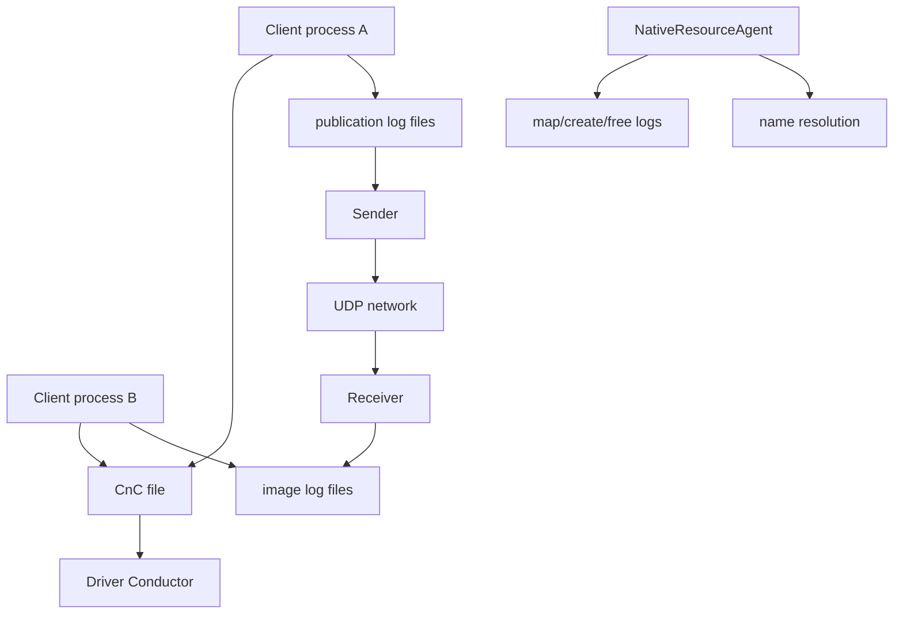
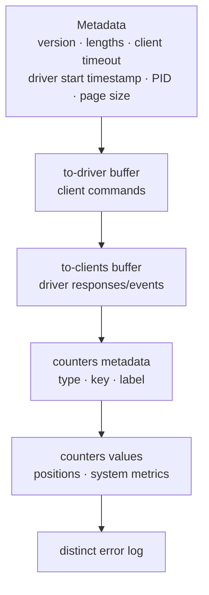
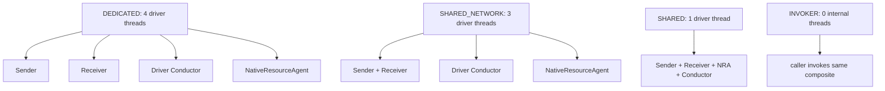
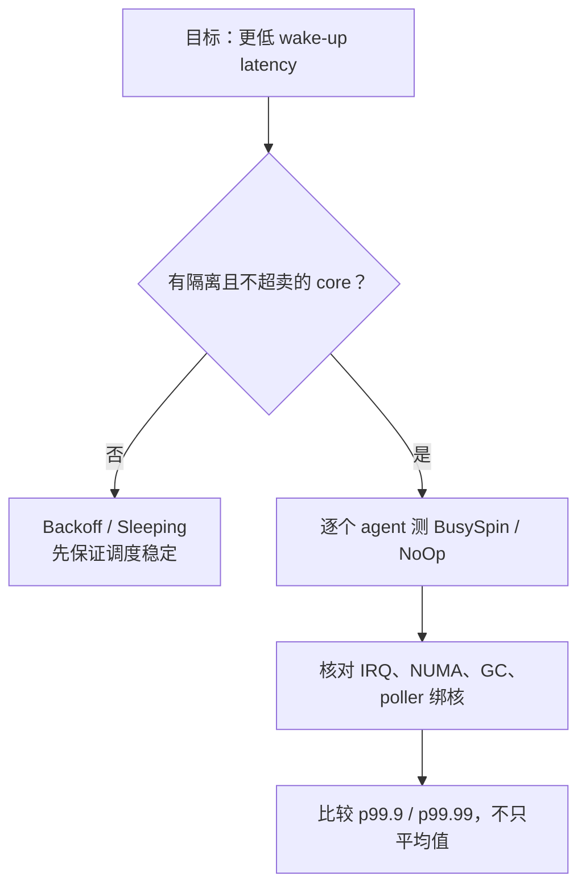
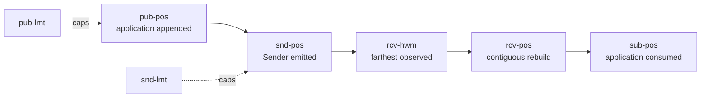
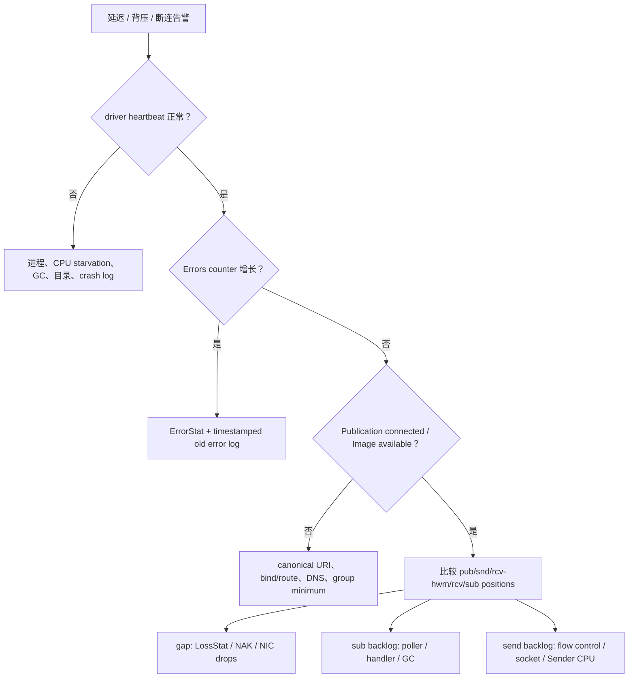

Aeron 的生产性能不是只由 `offer` 和 `poll` 决定。真正维持数据路径的是 Media Driver：它管理 UDP socket、Log Buffer、客户端命令、Image 生命周期、流控、重传、counters、错误日志与名称解析。线程被抢占、目录落在慢盘、页错误突然出现、socket buffer 太小或控制队列受压，都会表现成“业务消息偶尔延迟”。

本篇以 **Aeron 1.52.2** 为版本基线，把 Transport 的部署与诊断收束成一份可执行手册。这里尤其需要版本意识：1.52 把 log 创建/删除和 name resolution 等原生资源工作移入 `NativeResourceAgent`，所以仍写“DEDICATED 只有三个 driver 线程”的旧文档已经不完整。

## 1. Media Driver 是数据面与控制面的共同运行时

客户端只通过共享内存与 Media Driver 交互：



主要组件职责：

| 组件 | 热路径职责 | 不能放进去的工作 |
| --- | --- | --- |
| Sender | 扫 Publication、发 DATA、收 SM/NAK、重传 | 业务编码、阻塞 I/O |
| Receiver | 收 UDP、写 Image、gap 检测、发 SM/NAK | 业务 handler |
| Driver Conductor | registration、资源状态、超时、counters | 长时间文件分配/解析 |
| NativeResourceAgent | 创建/删除 log、解析地址、释放原生资源 | 业务请求处理 |
| Client Conductor | 客户端命令/回调、driver heartbeat | 业务主循环阻塞 |

应用的 Subscription poller 不属于 Media Driver 线程。即使 driver 完全健康，poller 被 GC、锁或数据库阻塞仍会让 `sub-pos` 停止并最终背压发送端。

## 2. Embedded 还是 standalone

### 2.1 Standalone driver

一个独立 Media Driver 可以服务多个本机客户端，让应用重启不必重启 transport，也便于单独绑核、调优、监控和复用 UDP/log 资源。相应地，目录权限、启动顺序与 client/driver 协议兼容要集中治理；它是共享基础设施，一次停机会影响所有连接的客户端。

### 2.2 Embedded driver

```java
final MediaDriver.Context driverContext = new MediaDriver.Context()
    .threadingMode(ThreadingMode.DEDICATED);

try (MediaDriver driver = MediaDriver.launchEmbedded(driverContext);
     Aeron aeron = Aeron.connect(
         new Aeron.Context().aeronDirectoryName(driver.aeronDirectoryName())))
{
    // application lifecycle owns both resources
}
```

`launchEmbedded` 在使用默认目录名时生成隔离目录，避免与另一个 driver 冲突。它的生命周期简单、测试隔离方便；进程故障却同时失去应用和 transport，每个实例也消耗自己的 threads/logs/sockets。选择标准是故障域、共享需求、升级方式与 CPU 预算，不是笼统的“embedded 更快”。

## 3. Driver directory：运行时协议，不是普通缓存目录

Linux 上默认目录基名是 `/dev/shm/aeron-<user>`；其他系统通常在临时目录下。生产部署应显式配置并保证：

- 位于可预测、低延迟的本机文件系统；
- Media Driver 与所有 client 使用同一路径；
- 容器内 `/dev/shm` 容量足够且 namespace 一致；
- 只有受信进程/用户可读写；
- 不被防病毒、备份或文件索引器扫描；
- 不把它当持久化消息目录备份。

典型内容：

```text
aeron-prod/
├── cnc.dat
├── loss-report.dat
├── publications/
│   └── <registration-id>.logbuffer
└── images/
    └── <correlation-id>.logbuffer
```

实际文件名和辅助文件可能随实现/版本变化，不要让业务依赖目录枚举；使用官方 counters/tools。

### 3.1 为什么优先 `/dev/shm`

Log Buffer 是 memory-mapped file。Linux `tmpfs` 避免普通磁盘 I/O 路径，适合共享内存数据面。但它仍受：

- tmpfs 容量；
- 容器 `--shm-size`；
- page fault 与首次触页；
- cgroup memory；
- NUMA placement；
- 文件权限。

“在 `/dev/shm`”不等于自动锁页或永不缺页。低尾延迟环境要用真实启动/峰值负载验证。

### 3.2 不要随意删除活跃目录

启动时发现已有、仍有 heartbeat 的 driver，Aeron 会抛 `ActiveDriverException`，避免两个 driver 共享并破坏同一目录。

不要为绕过它直接 `rm -rf`。正确流程是：

1. 确认目录解析到的 PID、driver heartbeat 与进程状态；
2. 判断是活跃 driver 还是异常退出遗留；
3. 先优雅停止真实进程；
4. 只有确认无人使用后才由启动策略重建目录；
5. 保留旧 error log 与现场证据。

`dirDeleteOnStart` 适合受控测试或强所有权部署，不适合作为“无条件抢目录”的生产修复。

## 4. `cnc.dat`：命令、事件、计数器与错误日志

1.52.2 `CncFileDescriptor` 定义的内存布局：



它不是只读状态文件：to-driver ring buffer 和 to-clients broadcast buffer 是客户端控制协议的一部分。访问目录的本机进程可能观察 counters/errors，也能尝试作为 client 连接，因此 OS 权限就是安全边界之一。

### 4.1 Heartbeat 的两种方向

- Driver heartbeat：client 用它判断 Media Driver 是否还在推进；默认 client-side driver timeout 是 10 秒；
- Client heartbeat：driver 用 client liveness timeout 判断客户端是否失联，默认也是 10 秒量级。

两者不是网络 Receiver heartbeat。线程长时间停顿、debugger、GC 或 CPU starvation 都可能触发误判。

开发调试可用 `aeron.debug.timeout` 在检测到 debugger 时放宽相关 timeout，但它不是生产稳定性修复。Cookbook 的“一小时 debug timeout”只应留在本机调试启动配置。

## 5. 1.52 的关键变化：NativeResourceAgent

大 term log 的创建/删除可能耗时数百毫秒。1.52 之前这些工作可能阻塞 Driver Conductor，使 counters/registration 更新停顿并污染端到端延迟。1.52 将其移到 `NativeResourceAgent`（NRA）。

NRA 当前负责：

- Publication/Image raw log 创建；
- raw log 释放与失败重试；
- Channel URI 中地址解析与重新解析；
- NameResolver 的 `doWork()`；
- 其他 native/resource task queue 工作。

### 5.1 旧配置迁移

1.52 changelog 明确：

- `AsyncExecutor` 改名为 `NativeResourceAgent`；
- 线程名从 `aeron-executor` 改为 `aeron-md-nra`；
- `aeron.driver.async.executor.idle.strategy` 改为 `aeron.driver.native.resource.agent.idle.strategy`；
- `aeron.driver.async.executor.enabled` 被移除；
- NRA 是否独立运行由 threading mode 决定，不能单独关闭。

升级时若旧 property 静默留在配置文件，会让运维以为已生效。应打印最终配置并删除废弃项。

## 6. 四种 threading mode 的 1.52.2 实际线程图

一些官方概览仍写 DEDICATED 三线程、SHARED_NETWORK 两线程；这没有纳入 1.52 NRA。以稳定源码为准：



| Mode | 内部线程 | 优势 | 风险/用途 |
| --- | ---: | --- | --- |
| `DEDICATED` | 4 | 隔离网络、控制与慢资源任务 | 需要足够 cores，默认模式 |
| `SHARED_NETWORK` | 3 | sender/receiver 共享一核 | 双向高负载互相影响 |
| `SHARED` | 1 | 资源最省、部署简单 | 任一 agent 慢会拖住全部 |
| `INVOKER` | 0 | 外部调度完全控制 | 调用者必须高频、可靠地 invoke |

“线程数”不等于“需要几颗 100% 忙等核心”。默认 idle strategy 会退避；NRA 默认使用约 1 ms sleep 的策略。但低延迟示例会让 Sender/Receiver/Conductor 紧轮询，需要真正独占 CPU。

### 6.1 INVOKER 是调度责任转移

INVOKER 不会自动推进 driver。拥有者必须持续调用 `sharedAgentInvoker().invoke()`；一旦外层事件循环阻塞：

- 网络收发停止；
- SM/heartbeat/NAK 停止；
- client registration 和 timeout 停止；
- name resolution 与 log resource task 停止。

它适合确定性测试或高度受控的集成循环，不是“免费少线程”。

## 7. IdleStrategy：延迟、吞吐与 CPU 的预算

默认 driver agents 使用 `BackoffIdleStrategy`：先 spin、再 yield、再逐步 park，平衡活跃响应和空闲 CPU。低延迟 sample 的 DEDICATED 配置则使用：

- Conductor：`BusySpinIdleStrategy`；
- Sender / Receiver：`NoOpIdleStrategy`；
- term sparse file：`false`；
- Windows high-resolution timer：`true`。

这不是可复制到任意容器的“最佳配置”。若三个热线程共享两颗 vCPU，忙等会抢占彼此和应用 poller，尾延迟反而更差。



### 7.1 应用 poller 也要预算一颗执行资源

Driver 有专核，Subscription handler 却和 GC 重任务或 HTTP server 共用线程，仍会在 `rcv-pos - sub-pos` 形成 backlog。完整拓扑要同时预算：

- sender；
- receiver；
- conductor；
- NRA；
- application Publication owner；
- each latency-critical Subscription owner；
- Archive recorder/replayer（后续专题）；
- JVM GC、OS IRQ 和其他服务。

## 8. Log Buffer 与页面调优

### 8.1 Sparse 默认与旧文档冲突

1.52.2 Java 与 C driver 的实际运行时默认 `termBufferSparseFile=true`。旧 Cookbook 页面以及 Java 源码的一处 `@Config(defaultBoolean=false)` 注解与实际 getter/default 不一致；应以稳定运行时代码为准。

对低延迟，显式 `false` 可在创建时分配/触达更多页面，把缺页成本移出热路径；代价是创建更慢、物理内存压力更高。1.52 NRA 降低了创建对 Conductor 的直接阻塞，但没有消除内存和页错误成本。

### 8.2 容量估算

每个 log 的逻辑映射约为：

```text
3 × termLength + 4 KiB metadata，再按 file page size 对齐
```

要同时统计：

- active Publication logs；
- 每个接收 session 的 Image logs；
- IPC logs；
- Archive replay/recording 产生的 transport logs；
- `cnc.dat` 与 loss report；
- sparse=false 的物理页；
- 生命周期 linger 期间尚未释放的 logs。

用 `Bytes currently mapped` counter 观测真实映射趋势，并为成员抖动/重连留峰值余量。

### 8.3 Term、MTU、window 不能单独改

变更前校验：

- term length 是 64 KiB–1 GiB 的 2 次幂；
- max message = `min(term/8, 16 MiB)`；
- receiver/publication window 被 cap 到半个 term；
- MTU 双端一致并通过真实 path MTU；
- `SO_RCVBUF` 足以覆盖 receiver window；
- Archive 录制/回放 channel 与 live stream 的 MTU/term 兼容。

## 9. 名称解析与动态地址

1.52 中 URI parse、endpoint resolve/re-resolve 通过 NRA 执行；DEDICATED/SHARED_NETWORK 下不会再直接卡住 Conductor 线程，SHARED/INVOKER 下 NRA 仍在同一 composite duty cycle。

当前 `aeron.driver.reresolution.check.interval` 默认每秒检查一次，设为 0 可禁用检查；真正重新解析还取决于 endpoint 长时间无状态消息/活动等条件。不要把 DNS TTL 当作唯一刷新时钟。

运维应观察：

- NameResolver 最大耗时与阈值超限 counter；
- resolution changes；
- 原始 host、resolved IP 与 local socket address；
- DNS 失败的 DistinctErrorLog；
- macOS 等环境的本机 hostname/DNS 延迟。

Cookbook 记录过 Media Driver 在 macOS 启动慢由 hostname resolution 引起的案例；它说明要测解析链路，而不是建议把所有地址永久写死。

## 10. Counters：先用位置定位层次

最有价值的诊断不是“消息慢了”，而是比较位置：



| 差值/现象 | 主要层次 | 下一步 |
| --- | --- | --- |
| `pub-pos - snd-pos` 持续大 | Sender/socket/flow-control | 查 snd-lmt、SM、short sends、CPU |
| `rcv-hwm - rcv-pos` 持续大 | gap、乱序、丢包 | 查 NAK、retransmit、LossStat、NIC |
| `rcv-pos - sub-pos` 持续大 | poller/handler 慢 | 查 duty cycle、GC、锁、业务 I/O |
| `pub-pos` 贴 `pub-lmt` | 应用被本地窗口背压 | 沿上述三段继续定位 |
| position 全不动 | 未连接/错误 URI/driver stall | 查 Image、endpoint、heartbeat/errors |

Counters 并发更新，跨 counter 读取不是原子快照。短暂反常值不一定是协议错误；连续采样并关联 timestamp、session、stream 和 channel 才有意义。

## 11. System counters：看趋势，不只设一个 errors 告警

1.52.2 重要类别：

### 11.1 数据与控制流量

- Bytes sent / received；
- Status Messages sent / received / rejected；
- NAKs sent / received；
- heartbeats sent / received；
- retransmits sent 与 retransmitted bytes。

MDC retransmitted bytes 只计一次同一重传，是实际多 destination 发送量的**下界**；它也不包含在普通 Bytes sent 内。

### 11.2 过载与异常

- Receiver/Sender/Conductor/NativeResourceAgent proxy fails；
- flow-control under-runs / over-runs；
- sender flow-control limits；
- invalid packets；
- short sends；
- retransmit pool overflow；
- free fails；
- unblocked publications/control commands。

Proxy fail 通常说明 driver 内部 agent 间有界命令队列受压；持续增长不是普通业务 backpressure，应检查相应线程是否停顿。

### 11.3 生命周期与健康

- errors；
- client liveness timeouts；
- conductor/sender/receiver max cycle time 与 threshold exceed；
- NameResolver max time 与 threshold exceed；
- bytes currently mapped；
- resolution changes；
- error frames sent/received；
- publications/images revoked；
- images rejected；
- Aeron version 与 control protocol version。

这里混合了不同语义，采集器不能全部做 delta：

- errors、timeout、resolution change、error frame、revoked / rejected 等**事件计数**通常看区间 delta；
- max cycle / resolver time 是**高水位**，看当前绝对值并标注重启代际；threshold-exceeded count 才看增量；
- bytes currently mapped 是**当前 gauge**，应直接采样绝对值；
- Aeron version 与 control protocol version 是**身份/兼容性元数据**，不属于单调指标。

driver 重启会重建 counters，所以任何时序都要同时记录 driver 代际，避免把 reset 误判为负流量。

## 12. 官方诊断工具各看什么

| 工具 | 数据源 | 适合回答 | 易错点 |
| --- | --- | --- | --- |
| `AeronStat` | CnC counters | driver 是否活着、系统/stream counters | 单次快照不能证明趋势 |
| `StreamStat` | stream positions | channel/stream/session 的位置关系 | 多 Image 要分别看 |
| `BacklogStat` | position counters | publisher/subscriber backlog | backlog 原因仍需结合系统 counters |
| `ErrorStat` | CnC distinct error log | 出现过哪些异常、次数与时间 | errors counter 只是提示，详情在这里 |
| `LossStat` | `loss-report.dat` | Receiver 观察到的网络 gap | 不包含 IPC，也不等于业务永久丢失 |
| `LogInspector` | raw log | term/frame/position 现场检查 | 低层工具，避免对活跃文件做破坏操作 |

所有工具必须指向与目标 driver 相同的 `aeron.dir`。容器里“路径文字一样”但不共享 mount namespace，也会读到错误或空目录。

### 12.1 ErrorStat 与 DistinctErrorLog

DistinctErrorLog 对相同异常聚合：记录 observation count、首次/最后时间和错误内容，而不是每次都写完整 stack trace。它位于 CnC 固定区域；区域满时新错误无法完整记录，fallback 会到标准错误流。

Media Driver 启动时若旧 CnC 中有 errors，会把它们保存成带时间戳的 `*-error.log`，然后创建新的 CnC/error region。重启前后排障时两个位置都要看，不能只查当前 ErrorStat。

### 12.2 LossStat 的正确解释

Loss report 记录 driver 在网络 Image 上观察到的 gap，包括首次/最后观察、总字节和 channel/source。可靠模式中这些 gap 可能已成功 NAK 重传，业务没有永久缺消息。

因此：

- LossStat 上升 = 网络或调度曾造成缺口；
- 不等于 handler 少处理了同样数量消息；
- 没有 LossStat 记录也不排除应用 slow、sender drop 前错误、业务解码失败；
- IPC 不会出现在 UDP loss report。

## 13. Aeron Agent：临时、定向地打开事件日志

Aeron Agent 是 Java agent，可记录 driver/client/archive/cluster 的事件，用于还原注册、frame、状态变化和错误时序。它不是默认常开 tracing：

- event rate 高，编码和 I/O 会改变被测系统；
- 只开启问题相关 categories/events；
- 设定采集时长与文件空间上限；
- 采集结束后关闭并保留版本/配置；
- 谨慎处理可能包含 endpoint、身份或协议元数据的日志。

1.52 为写文件的 event log 增加按最大文件长度 rollover；默认最大长度仍是 unlimited，即不自动 rollover。生产启用前必须显式容量策略。

## 14. 一份从症状到根因的 Runbook



### 14.1 Publication 一直 `NOT_CONNECTED`

依次检查：

1. 双端 `aeron.dir` 与 driver heartbeat；
2. channel media、stream ID、session filter；
3. Publication endpoint 是否指向接收端；Subscription 是否绑定本机地址；
4. `localSocketAddresses()` 的真实 wildcard port；
5. DNS resolved IP、防火墙、路由和容器网络；
6. multicast interface/TTL/IGMP；
7. MDC control endpoint 与 receiver group minimum；
8. ErrorStat 中 Image rejection / invalid MTU/term。

### 14.2 `Cannot assign requested address`

通常是 Subscription endpoint 或 `interface` 使用了本机不存在的 IP。接收端要绑定本地地址，不能把远端发送主机地址照抄过来。容器只拥有 namespace 内的接口，也不能绑定宿主机未映射 IP。

### 14.3 背压但网络没有 loss

看 `rcv-pos - sub-pos`。若持续增大，根因多半是：

- poll 调用频率不足；
- handler 阻塞或分配过多；
- fragment limit 太小且 duty cycle 还有其他重工作；
- tethered spy/第二个 Subscription 没有消费；
- JVM safepoint/GC/CPU steal。

继续加 socket buffer 不会提高业务 handler 的处理率。

### 14.4 NAK/retransmit 持续增长

关联：

- LossStat channel/source；
- OS/NIC receive drops；
- receiver duty-cycle max；
- `SO_RCVBUF` 与 receiver window；
- MTU/path fragmentation；
- CPU affinity、IRQ、虚拟机 steal；
- burst 是否超过链路和交换机 buffer。

先定位丢在 host、kernel 还是 network，再调整窗口。单纯增大 term 可能只延迟暴露。

### 14.5 Unblocked Publications 增长

说明应用成功 claim/开始 offer 后没有及时完成，driver 为避免日志永久卡住而修复。常见根因：

- `tryClaim` 后漏 `commit/abort`；
- claim 内编码发生长停顿；
- 发送线程崩溃或被暂停；
- 错误跨线程传递 BufferClaim。

它是严重 correctness signal，不应当作正常流控计数。

### 14.6 Counter/资源耗尽

频繁创建 Publication、Subscription、Counter 或 destination 而不 close，会让 driver registration、counter metadata 和映射不断增长。排查：

- registration 创建/关闭速率；
- Bytes currently mapped；
- Free fails；
- client timeout 与异常退出；
- 是否把“每条请求建一个 Publication”误当正常模式。

不要依赖旧文章中的固定 counter 个数；buffer lengths 可以配置，容量也随版本变化。根本修复是资源复用与完整关闭。

## 15. 配置发布流程：把“调优”变成可回滚变更

### 15.1 启动时固化证据

每次部署记录：

- Aeron 版本、Git SHA、control protocol version；
- Java/C driver 类型与 Java runtime；
- 完整最终配置，而不只记录 override；
- driver directory、file page size、sparse setting；
- threading mode 与每个 idle strategy；
- term/MTU/window/socket buffer；
- resolved endpoints 与 local socket addresses；
- CPU/cgroup/NUMA 与 `/dev/shm` 容量。

`aeron.print.configuration` 可帮助输出当前配置，但也要防止日志泄露敏感 endpoint，并验证 Java property 与 C environment variable 的命名差异。Cookbook 中把点分隔 Java property 写成“环境变量”的旧说法不可直接照搬。

### 15.2 一次只改变可解释的一组参数

调 receiver window 时同步满足 socket/term 下限属于一组；若同时再换 BusySpin、MTU 和 CPU topology，就无法定位尾延迟变化。发布门槛至少覆盖真实消息尺寸与 burst、p99.9/p99.99、CPU/GC/page fault/NIC drop、NAK/retransmit/short send/proxy fail，以及重连、driver/client crash、资源回收和回滚兼容测试。

## 16. Security：Transport reliability 不是安全性

开源 Aeron Transport 默认不提供应用身份认证、机密性或防篡改安全通道。攻击者若能注入网络或访问 driver directory，可靠/有序协议本身不会阻止它。

基础防线：

- driver directory 最小 OS 权限；
- client/driver 使用独立系统用户与容器权限；
- 网络分段、ACL、防火墙与最小开放端口；
- 不暴露 dynamic MDC control endpoint 到不受信网络；
- 消息 envelope 做授权、epoch/fencing 与 replay protection；
- secrets 不进入 URI、counter label 或 event log；
- 需要时使用应用层认证加密。

CRC/reserved value 只能检测部分意外损坏，不是加密 MAC，不能证明发送者身份。

### 16.1 Aeron Transport Security（ATS）

官方 ATS 是 Premium 功能，当前边界包括：

- 仅支持 **C Media Driver**；Java Media Driver 遇到 `ats` channel 参数会报错；
- 依赖 OpenSSL 3.0 及以上；
- 支持 unicast、multicast 与 MDC；
- 使用 RSA 身份/签名、ECDHE 与 HKDF 建立会话密钥，数据用 AES-256-GCM；
- 为每个 Aeron session 建立加密材料；
- ATS 加载后 transport 默认受保护，特定 channel 可用 `ats=false` 明确例外。

同一个共享底层 channel 不能一部分 registration 要 ATS、另一部分关闭而期待同时成立；配置冲突应在部署前消除。

ATS 解决线路认证/机密性，不替代业务用户授权、request replay/idempotency、Archive 静态数据加密、Cluster 成员管理或操作系统目录权限。

## 17. 升级到 1.52.2 的专项检查

升级时删除旧 AsyncExecutor enable/idle/thread 配置；按 DEDICATED 4 线程、SHARED_NETWORK 3 线程重新规划资源，并让监控/绑核识别 `aeron-md-nra`。同时验证 log 创建删除延迟、NRA proxy fails、sparse 实际值和 event-file rollover。

新代码不要再使用已 deprecated 的 `Image.controlledPeek` / `position(long)`；Java/C driver 要分别核对属性或 env 名与功能支持，并保留旧 CnC error log、position/counter 基线做前后对比。

## 18. Transport 生产就绪门槛

上线前应同时通过四类审查：架构上明确 Transport/Archive/Cluster 边界、多 Image/重启历史/端到端 ACK；资源上验证 directory、权限、容量、thread/core/idle 与 term/MTU/window/socket；可观测性上外部采集 system/position counters 并保留 ErrorStat/LossStat；故障上演练 driver/client crash、GC stall、network loss、DNS 变更和资源回收。安全威胁模型、ATS 或替代防线也必须是发布条件。

## 19. 小结

Media Driver 的正确生产心智模型，是一个由共享目录连接客户端、由多个 agent 推进数据/控制状态、由 position 和 counters 对外暴露进度的实时运行时。

完成 Transport 六篇后，应能从一个症状逆推层次：

- `offer` 背压看 publication/sender/receiver/subscriber positions；
- gap 看 HWM、rebuild、NAK 与 LossStat；
- 断连看 Image、SM、URI、DNS 与 group rule；
- 长尾看 duty cycle、idle/core、page fault 与 GC；
- 资源问题看 registration、mapped bytes、free fails 与目录；
- 安全问题看 directory/network/ATS/业务授权，而不是“UDP 是否可靠”。

接下来的 Aeron Archive 专题会在这套 position 与 Media Driver 基础上加入持久化：录制什么时候真正 durable、Catalog/segment 怎样组织、Replay 如何从指定位置开始，以及 live replay/replication 如何在不混淆传输与存储保证的前提下工作。

## 官方资料

- [Media Driver](https://aeron.io/docs/aeron/media-driver/)
- [Aeron Tooling](https://aeron.io/docs/aeron/aeron-tooling/)
- [Aeron Agent](https://aeron.io/docs/aeron/aeron-agent/)
- [Dealing with Common Errors](https://aeron.io/docs/aeron/dealing-with-common-errors/)
- [Monitoring and Debugging](https://github.com/aeron-io/aeron/wiki/Monitoring-and-Debugging)
- [Thread Utilisation](https://github.com/aeron-io/aeron/wiki/Thread-Utilisation)
- [Configuration Options](https://github.com/aeron-io/aeron/wiki/Configuration-Options)
- [Best Practices Guide](https://github.com/aeron-io/aeron/wiki/Best-Practices-Guide)
- [Name Resolution](https://github.com/aeron-io/aeron/wiki/Name-Resolution)
- [Aeron Transport Security Overview](https://aeron.io/premium-docs/aeron-transport-security/ats-overview.html)
- [Aeron 1.52.2 Release](https://github.com/aeron-io/aeron/releases/tag/1.52.2)
- [Aeron 1.52.2 Changelog](https://github.com/aeron-io/aeron/blob/1.52.2/CHANGELOG.adoc)
- [Aeron 1.52.2 `MediaDriver.java`](https://github.com/aeron-io/aeron/blob/1.52.2/aeron-driver/src/main/java/io/aeron/driver/MediaDriver.java)
- [Aeron 1.52.2 `NativeResourceAgent.java`](https://github.com/aeron-io/aeron/blob/1.52.2/aeron-driver/src/main/java/io/aeron/driver/NativeResourceAgent.java)
- [Aeron 1.52.2 `Configuration.java`](https://github.com/aeron-io/aeron/blob/1.52.2/aeron-driver/src/main/java/io/aeron/driver/Configuration.java)
- [Aeron 1.52.2 `CncFileDescriptor.java`](https://github.com/aeron-io/aeron/blob/1.52.2/aeron-client/src/main/java/io/aeron/CncFileDescriptor.java)
- [Aeron 1.52.2 `SystemCounterDescriptor.java`](https://github.com/aeron-io/aeron/blob/1.52.2/aeron-driver/src/main/java/io/aeron/driver/status/SystemCounterDescriptor.java)
- [Aeron 1.52.2 Javadoc](https://javadoc.io/doc/io.aeron/aeron-all/1.52.2/index.html)
- [Cookbook: Threading modes](https://aeron.io/docs/cookbook-content/aeron-threading-modes/)
- [Cookbook: Increase performance](https://aeron.io/docs/cookbook-content/aeron-increase-performance/)
- [Cookbook: Read counters](https://aeron.io/docs/cookbook-content/aeron-read-counters/)
- [Cookbook: Media Driver timeout](https://aeron.io/docs/cookbook-content/aeron-media-driver-timeout/)
- [Cookbook: Aeron tools](https://aeron.io/docs/cookbook-content/aeron-tools/)
- [Cookbook: Debugging](https://aeron.io/docs/cookbook-content/aeron-debugging/)
- [Cookbook: Slow Media Driver after launch on macOS](https://aeron.io/docs/cookbook-content/aeron-slow-media-driver-after-launch-mac/)
