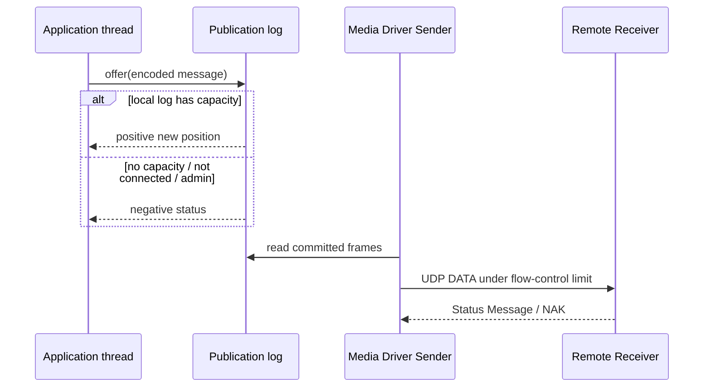
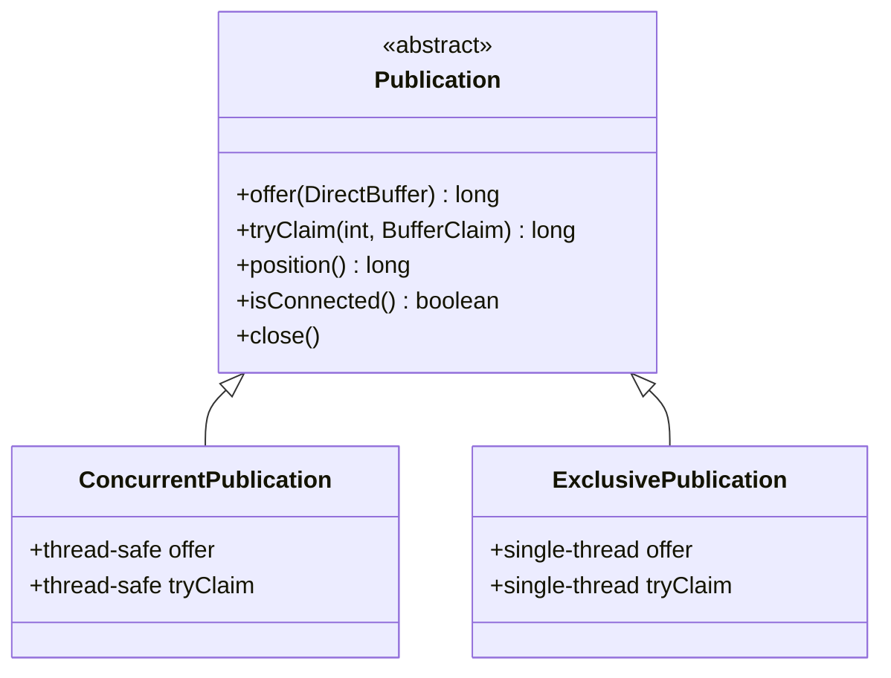
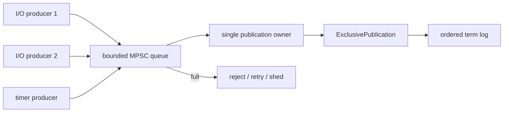
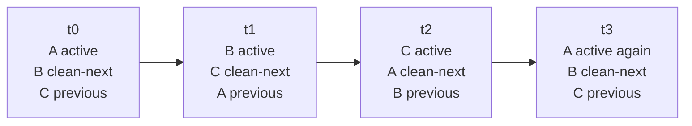
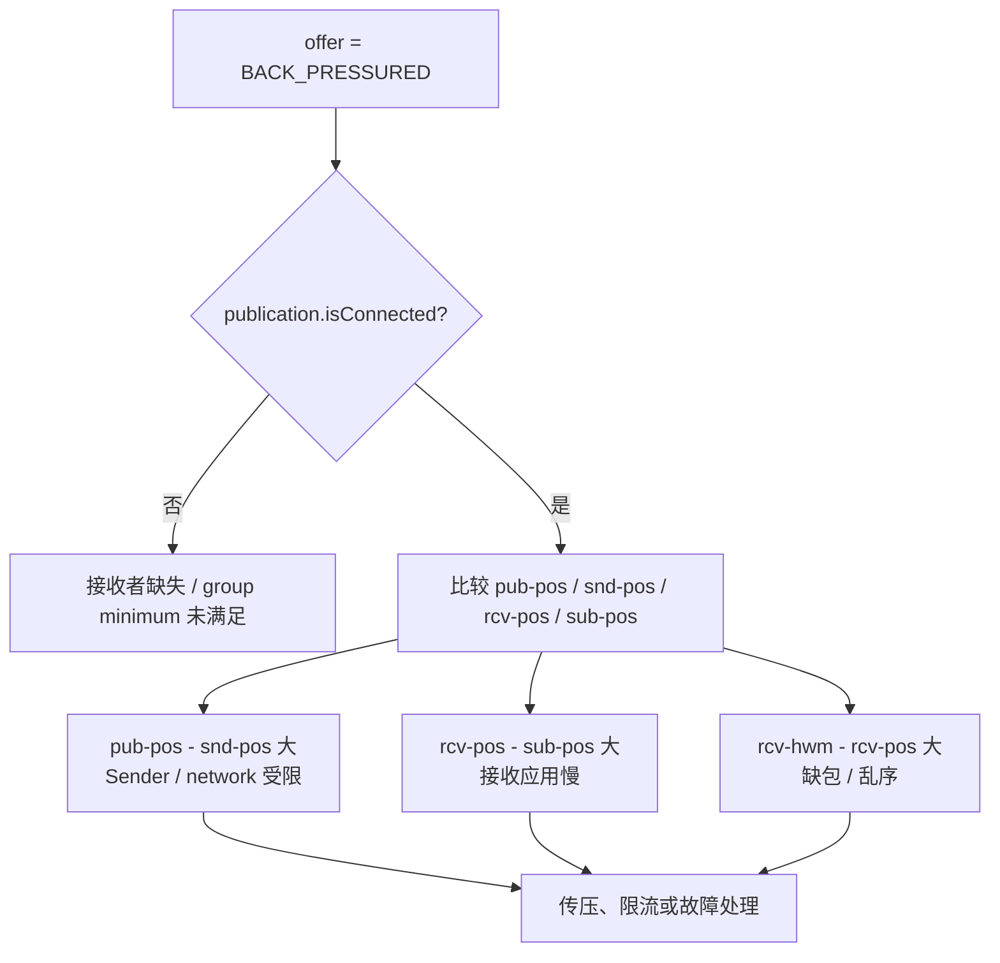
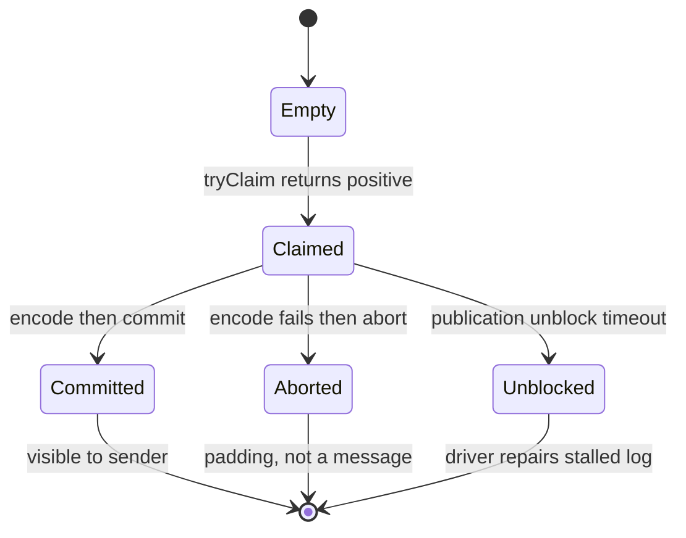

`Publication.offer()` 看起来只是一次发送调用，实际上它并不把消息直接交给网卡，更不代表接收应用已经处理。它先把编码后的 frame 追加进**本地 Publication Log Buffer**；Media Driver 的 Sender 稍后独立读取这段日志，受接收窗口约束地向外发送。

这条解耦路径是 Aeron 可预测性能与显式背压的基础，也是误用最集中的地方。本章以 **Aeron 1.52.2** 为基线，回答六个问题：

1. `ConcurrentPublication` 与 `ExclusivePublication` 的并发边界是什么？
2. 为什么一个 log 有三个 term，它们怎样轮转？
3. position 究竟在数什么？
4. `offer` 的每个返回值应该怎样处理？
5. `tryClaim` 为什么不是一句“零拷贝更快”就能概括？
6. term、MTU、消息上限和资源占用怎样联系起来？

建议先读 [Channel、Stream、Session 与 Image](/signal-grid-blog/posts/aeron-transport-channel-stream-session-image/)，确认 Publication session 是一个独立顺序域；再读 [Aeron 与 SBE](/signal-grid-blog/posts/aeron-sbe-schema-flyweight-and-compatibility-testing/)，明确本文写入 log 的字节怎样形成完整、可演进的应用消息。

## 1. Publication 是本地日志写入口

发送应用、Publication 和 Media Driver Sender 的关系是两个异步阶段：



因此一次 `offer` 正返回只说明：

- 消息已完整写入并发布到本地 term log；
- 后续 Publication position 已推进到返回值；
- Sender 现在有机会读取它。

它不说明：

- socket 已成功发送；
- 对端 Receiver 已收到；
- Subscription 已 poll；
- handler 已提交业务事务；
- Archive 已把对应位置持久化。

需要更强语义时，应通过响应 stream、业务 ACK、Archive recording position 或 Cluster commit position建立相应协议。

## 2. 两类 Publication：并发承诺不同

Aeron 1.52.2 的公共类型关系是：



### 2.1 `addPublication` 返回 `ConcurrentPublication`

```java
final ConcurrentPublication publication =
    aeron.addPublication(channel, streamId);
```

它允许多个应用线程并发调用 `offer` 和 `tryClaim`。内部需要用原子方式竞争 term 中的空间，换来安全的多生产者追加。

同一 driver 内对兼容 channel + stream 重复 `addPublication`，还可能让多个 client registration 共享底层 network publication、log 与 session；各 Java 对象不是天然独立的线路会话。必须获得独立 session/log 时使用 ExclusivePublication 或经过校验的显式 session 配置。

“Publication 线程安全”不等于整个发送协议线程安全：

- 编码器和源 `DirectBuffer` 不能被另一个线程同时修改；
- `BufferClaim` 不能跨线程共享使用；
- 消息之间的业务顺序仍由调用竞争结果决定；
- close 与生命周期控制仍应有明确所有者。

若业务要求账户 A 的命令严格按入口序号发布，最好先路由到单写者，而不是让多个线程竞争后再猜测顺序。

### 2.2 `addExclusivePublication` 返回 `ExclusivePublication`

```java
final ExclusivePublication publication =
    aeron.addExclusivePublication(channel, streamId);
```

`ExclusivePublication` 假设 `offer` / `tryClaim` 只有一个调用线程。它可以缓存和直接推进本地 term 状态，减少并发协调，并获得独立 session。代价是违反单线程所有权会产生未定义结果，不能靠压力测试“看起来没坏”证明安全。

1.48+ 还提供 `revoke()` / `revokeOnClose()`：它会跳过正常 draining，让两端更快释放资源，但尚未 drain 的尾部数据可能丢失。它适合已明确接受“快速撤销优先于尾部送达”的协议，例如官方 Response client 关闭短生命周期请求 Publication；普通可靠发送不要把 revoke 当成更快的 `close()`。

适合它的拓扑通常是：



这不仅可能更快，更重要的是把编码、sequence 分配和发布顺序统一到一个线程。

### 2.3 initial position 是高级恢复能力

`ExclusivePublication` 还可通过 channel URI 的 `initial-term-id`、`term-id`、`term-offset` 和 `term-length` 从指定位置开始。它用于回放、恢复或替换 publisher，不是普通应用随意设置的“起始编号”。

这些参数必须彼此一致，且接收端、Archive recording 与协议 position 都要对齐。错误的初始位置可能造成无法连接、位置跳变或错误续接。除非正在实现明确的恢复协议，否则让 driver 分配初始 term/session 更安全。

## 3. Log Buffer：三个 term 加一段 metadata

每个 Publication log file 包含三个等长 term partition 和一段 log metadata。1.52.2 源码的文件长度计算是：

```text
align(3 × termLength + 4096-byte metadata, filePageSize)
```

三个 term 的**物理分区**按时间 A → B → C → A 轮流成为 active；“previous / clean-next”是相对当前时刻的角色，不是每个分区的固定身份：



物理文件不会随着消息无限增长。term 被反复清理和复用；逻辑 position 则继续单调增加，直到达到 Publication 的最大可能位置。

### 3.1 为什么不是一个环形 byte array

三段设计让这些工作可以重叠：

- 应用在 active term 追加；
- Sender 从 active/previous term 发送；
- previous term 暂时保留，供 NAK 重传；
- 更老的一段异步清理，准备下一次轮转。

因此 term 轮转不是“文件又扩容一次”。在轮转边界，`offer` 可能短暂返回 `ADMIN_ACTION`，调用方应让出执行机会后重试。

### 3.2 term 文件有限，不代表所有慢消费者都能被保留

发送端能领先到哪里由 publication limit 和流控决定。若某接收者不参与限制或长期落后，它可能错过已轮转的数据，并重建/重新加入到当前窗口。增大 term 只是扩大突发容量和位置跨度，不会解决永久处理能力不足。

## 4. Position 数的是对齐后的 frame 字节

Position 是 Aeron 连接发送、接收、流控、录制和回放的共同坐标。它不是业务消息编号，也不只累计 payload。

frame 包含：

- 32 字节 DATA header；
- payload；
- 为下一个 frame 做 32 字节对齐的 padding；
- 大消息可能被拆成多个 frame，每个 fragment 都有 header。

所以发送 100 字节业务数据，position 增量不是简单的 100。


逻辑 position 可概括为：

```text
termCount = activeTermId - initialTermId
position  = termCount × termLength + termOffset
```

因为 term length 是 2 的幂，源码用左移完成乘法，并让有符号 term ID 的回绕仍可计算正确的 termCount。

### 4.1 最大位置是 `termLength × 2^31`

Aeron 1.52.2 `Publication` 源码明确计算：

```text
maxPossiblePosition = termBufferLength × (1L << 31)
```

官方 Publications 页面仍有一处把上限描述成 `term length × 3`，那混淆了三个物理 partition 与逻辑位置空间。三个 term 是循环复用的物理结构，不是 position 只能推进三个 term。

达到上限后 `offer` 返回 `MAX_POSITION_EXCEEDED`。这不是可通过重试消除的瞬时背压；需要以新 Publication/session 继续，并让业务协议处理切换。

## 5. term、MTU 与消息大小的约束

1.52.2 的稳定源码给出这些关键边界：

| 参数 | 默认或公式 | 作用 |
| --- | --- | --- |
| UDP term length | 16 MiB | 发送/接收日志 partition |
| IPC term length | 64 MiB | 同 driver IPC 日志 partition |
| term 合法范围 | 64 KiB 至 1 GiB，2 的幂 | 位置、窗口、消息上限 |
| UDP MTU 默认 | 1408 bytes | 单个 DATA frame 最大长度 |
| DATA header | 32 bytes | 每个 fragment 的协议头 |
| max payload 默认 | `1408 - 32 = 1376` bytes | 不分片消息 payload 上限 |
| max message | `min(termLength / 8, 16 MiB)` | 自动分片后的单消息上限 |
| max position | `termLength × 2^31` | 单 Publication 生命周期上限 |

这些值应从实际 Publication 查询，而不是在业务代码硬编码：

```java
final int maxPayload = publication.maxPayloadLength();
final int maxMessage = publication.maxMessageLength();
final int termLength = publication.termBufferLength();
final long maxPosition = publication.maxPossiblePosition();
```

增大 MTU 可以减少大消息的 fragment/header 数，但若超过路径 MTU，IP fragmentation 或丢包代价会更高；所有 endpoint、Archive replay 与网络设备也必须兼容。默认 1408 是保守起点，不是所有网络的最优答案。

### 5.1 sparse file 的当前默认需要按源码判断

Aeron 1.52.2 Java 与 C driver 的稳定运行时源码都把 term buffer sparse file 默认设为 `true`。部分旧 Cookbook 文字和 Java `@Config` 注解仍暗示“默认完整分配”或 `false`，两者存在冲突。

当前基线应以实际读取配置的运行时代码为准：

- sparse `true`：逻辑文件大小仍约为三倍 term，但物理页按触达分配；
- sparse `false`：启动时付出分配/触页成本，换取运行中更少的首次缺页风险。

官方 performance 配置常显式关闭 sparse 以追求可预测延迟。选择时同时核对磁盘/`/dev/shm` 容量、页错误和启动时间，不能只看 `ls` 显示的逻辑大小。

## 6. `offer`：把每个返回值写成控制流

最常用重载是：

```java
final long result = publication.offer(buffer, offset, length);
```

也可以传两个 buffer、`DirectBufferVector[]` 或 `ReservedValueSupplier`，减少业务层先拼接连续 buffer 的需要。无论重载如何，返回语义一致。

| 返回值 | 常量 | 含义 | 典型策略 |
| ---: | --- | --- | --- |
| `> 0` | — | 本地日志接受，值为新 position | 记录/继续 |
| `-1` | `NOT_CONNECTED` | 当前无满足连接条件的接收者 | 等待、降级或按 SLA 失败 |
| `-2` | `BACK_PRESSURED` | publication limit 阻止继续追加 | idle 后重试或向上游传压 |
| `-3` | `ADMIN_ACTION` | term rotation 等管理动作 | 短暂 idle 后重试 |
| `-4` | `CLOSED` | Publication 已关闭 | 立即停止，修复生命周期 |
| `-5` | `MAX_POSITION_EXCEEDED` | 达到 session 最大位置 | 切换新 Publication/session |

### 6.1 不要把所有负数写成永久自旋

错误示例：

```java
while (publication.offer(buffer) < 0)
{
    // 永久空转：closed/max-position 也永远重试。
}
```

一个有限 deadline、可响应关闭信号的同步发送骨架可以这样写：

```java
static long offerUntil(
    final Publication publication,
    final DirectBuffer buffer,
    final int offset,
    final int length,
    final long deadlineNs,
    final BooleanSupplier keepRunning,
    final IdleStrategy idleStrategy)
{
    idleStrategy.reset();

    while (keepRunning.getAsBoolean())
    {
        final long result = publication.offer(buffer, offset, length);

        if (result > 0)
        {
            return result;
        }

        if (result == Publication.CLOSED)
        {
            throw new IllegalStateException("publication closed");
        }

        if (result == Publication.MAX_POSITION_EXCEEDED)
        {
            throw new IllegalStateException("publication max position exceeded");
        }

        if (System.nanoTime() >= deadlineNs)
        {
            throw new IllegalStateException(
                "offer timed out: " + Publication.errorString(result));
        }

        // NOT_CONNECTED、BACK_PRESSURED、ADMIN_ACTION 都等待下一次 duty cycle，
        // 但生产系统通常要分别计数和选择不同 SLA。
        idleStrategy.idle();
    }

    throw new IllegalStateException("sender shutting down");
}
```

这个骨架仍不是所有系统的正确策略：同步等待会把背压停留在当前线程。事件循环更常见的做法是把待发状态保留到下一次 `doWork()`，让 agent 继续处理连接、超时和控制消息。

### 6.2 `NOT_CONNECTED` 是产品策略，不只是技术重试

对于交易命令，“没有下游”可能必须拒绝入口；对于可丢遥测，可能允许丢弃；对于批量任务，可以暂存到有界队列。无界重试会把传输故障转换成内存爆炸或线程永久占用。

MDC 的连接判定还可能要求 receiver group 达到最小规模；spy 也可能通过 `spiesSimulateConnection` 影响连接语义。不能只看常量名猜测拓扑状态。

### 6.3 `BACK_PRESSURED` 是容量事实

背压通常意味着 Publication 已推进到 driver 允许的 publication limit。根因可能在不同位置：

这个返回码的概念责任到此为止：它揭示局部容量不足，却不替整个系统决定排队、拒绝、降级或丢弃。跨越入口、重试与多个下游的 queue buildup、deadline propagation、Retry Budget、优先级和 Load Shedding，应回到[过载、Admission Control、Retry Budget 与 Load Shedding](/signal-grid-blog/posts/overload-backpressure-admission-control-retry-budget-load-shedding/)；本章继续负责怎样从 Aeron positions 与 counters 定位压力来自哪一段。



只增加 term length 可能延迟背压出现，却不能提高消费者的稳定处理速率。

## 7. `tryClaim`：直接写日志的借用协议

当消息长度不超过 `maxPayloadLength()` 时，`tryClaim` 可以先在 Publication log 中认领 frame payload，再由编码器直接写入：

```java
final BufferClaim claim = new BufferClaim();
final long result = publication.tryClaim(messageLength, claim);

if (result > 0)
{
    try
    {
        encoder.encode(claim.buffer(), claim.offset());
        claim.commit();
    }
    catch (final Throwable ex)
    {
        claim.abort();
        throw ex;
    }
}
```

这里“零拷贝”的准确含义是：应用不必先在自己的 buffer 编码，再由 `offer` 复制进 term log。Media Driver 后续仍要读取这些字节，UDP 接收端也仍会写自己的 Image log；它不是整个网络路径零复制。

### 7.1 claim 是短暂、排他的可写借用

成功认领后：

- `claim.buffer()` 指向共享 log 的底层内存；
- 只能在 `[claim.offset(), claim.offset() + claimedLength)` 写 payload；
- 完成后必须恰好调用一次 `commit()` 或 `abort()`；
- commit 后不能继续改写；
- 不能把 claim 交给异步线程长期占用。



若进程或线程在 claim 后卡住，后续 publisher/Sender 不能越过这个未完成 frame。Media Driver 会在 publication unblock timeout 后把它解除阻塞，默认量级为 15 秒；这是一条恢复机制，不是允许应用把 claim 当长期 buffer 的许可。

### 7.2 `tryClaim` 不能发送自动分片的大消息

`tryClaim(length, claim)` 要求 `length <= maxPayloadLength()`。超过时不会像 `offer` 那样自动分片。大消息需要：

- 用 `offer` 让 Aeron fragment；或
- 在业务层定义自己的 chunk 协议，并处理 chunk ID、总长度、校验和、超时与内存上限。

对多数消息，先保证正确所有权和可恢复失败，再基准测试 `tryClaim` 是否值得增加编码复杂度。

### 7.3 ConcurrentPublication 的 BufferClaim 应按线程持有

ConcurrentPublication 允许多个线程 claim，但同一个 `BufferClaim` 实例只是可变的认领视图，不能共享。可用 `ThreadLocal<BufferClaim>`，或让每个发送线程独占实例。ExclusivePublication 则连 Publication 本身都必须只有一个发送线程。

## 8. Reserved value：协议扩展位，不是安全层

每个 DATA frame 有一个 64 位 reserved value。`offer` 的相关重载允许在 frame 提交前由 `ReservedValueSupplier` 写入，例如 CRC 或追踪标记。

重要边界：

- 大消息每个 fragment 都会调用 supplier；
- reserved value 属于 frame，而非自动属于完整业务消息；
- 字段在线路上按协议字节序解释；
- CRC 能发现部分损坏，但不能提供发送者认证、防篡改或加密；
- UDP/IP 自己已有校验机制，是否再做应用校验要由故障模型决定。

安全需求应使用 Aeron Transport Security（适用版本/实现受限）、受信网络或应用层认证加密，不能把 CRC 当 MAC。

## 9. 同步与异步注册 API

`aeron.addPublication(...)` 是同步资源注册：客户端向 driver 发命令，并等待 registration 完成或超时。这适合启动路径，不应在低延迟热循环里频繁调用。

Aeron 还提供异步注册模式：先 `asyncAddPublication` 获得 registration ID，再在后续 duty cycle 调 `getPublication(registrationId)`。核心价值不是让 `offer` 变异步，而是避免资源创建阻塞事件循环。

生命周期规则仍然相同：

- 每个成功 registration 最终都要 close；
- 多个引用可能共享底层 publication，引用计数由 client/driver 管理；
- 关闭最后一个 registration 后资源才逐步清理；
- 重复创建/泄漏 publication 会消耗 counters、文件映射和 driver 状态。

## 10. 小结

Publication 的性能不是靠“一个特别快的 send 方法”得到的，而是靠清晰分离：应用只竞争有界本地日志，Sender 独立负责网络，position 把每层进度连起来，背压则在覆盖旧数据前阻止继续推进。

把它用对需要记住五点：

1. Concurrent 与 Exclusive 的差别首先是并发契约；
2. 三个 term 是轮转的物理缓冲，不是逻辑 position 上限；
3. position 包含 header、fragment 与对齐，不等于业务字节数；
4. `offer` 的负返回值是控制流，不能统一死循环；
5. `tryClaim` 是必须及时 commit/abort 的写借用，不是无条件“零拷贝魔法”。

下一篇转向接收侧，讲清 `Subscription.poll` 的 fragment 计数、回调 buffer 生命周期、大消息重组，以及 `controlledPoll` 的 ABORT/BREAK/COMMIT/CONTINUE 到底推进了什么。

## 官方资料

- [Log Buffers and Images](https://aeron.io/docs/aeron/log-buffers-images/)
- [Publications and Subscriptions](https://aeron.io/docs/aeron/publications-subscriptions/)
- [Understanding Position](https://aeron.io/docs/aeron/aeron-understanding-position/)
- [Configuration Options](https://github.com/aeron-io/aeron/wiki/Configuration-Options)
- [Flow and Congestion Control](https://github.com/aeron-io/aeron/wiki/Flow-and-Congestion-Control)
- [Aeron 1.52.2 `Publication.java`](https://github.com/aeron-io/aeron/blob/1.52.2/aeron-client/src/main/java/io/aeron/Publication.java)
- [Aeron 1.52.2 `ConcurrentPublication.java`](https://github.com/aeron-io/aeron/blob/1.52.2/aeron-client/src/main/java/io/aeron/ConcurrentPublication.java)
- [Aeron 1.52.2 `ExclusivePublication.java`](https://github.com/aeron-io/aeron/blob/1.52.2/aeron-client/src/main/java/io/aeron/ExclusivePublication.java)
- [Aeron 1.52.2 `LogBufferDescriptor.java`](https://github.com/aeron-io/aeron/blob/1.52.2/aeron-client/src/main/java/io/aeron/logbuffer/LogBufferDescriptor.java)
- [Aeron 1.52.2 `FrameDescriptor.java`](https://github.com/aeron-io/aeron/blob/1.52.2/aeron-client/src/main/java/io/aeron/logbuffer/FrameDescriptor.java)
- [Aeron 1.52.2 Javadoc](https://javadoc.io/doc/io.aeron/aeron-all/1.52.2/index.html)
- [Cookbook: `tryClaim`](https://aeron.io/docs/cookbook-content/aeron-try-claim/)
- [Cookbook: Publication connection blocking](https://aeron.io/docs/cookbook-content/aeron-publication-connect-block/)
- [Cookbook: Blocking API](https://aeron.io/docs/cookbook-content/aeron-blocking-api/)
- [Cookbook: Term length and message size](https://aeron.io/docs/cookbook-content/aeron-term-length-msg-size/)
- [Cookbook: Application checksum](https://aeron.io/docs/cookbook-content/aeron-app-checksum/)
