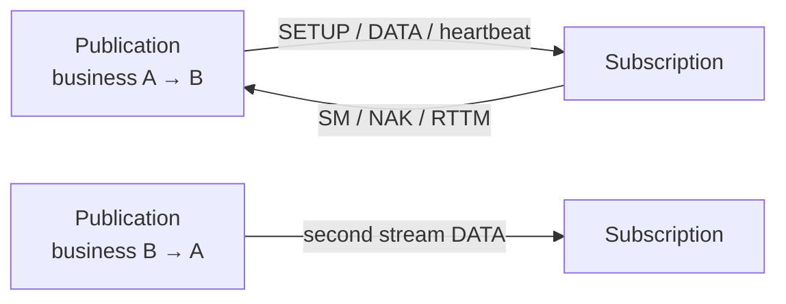
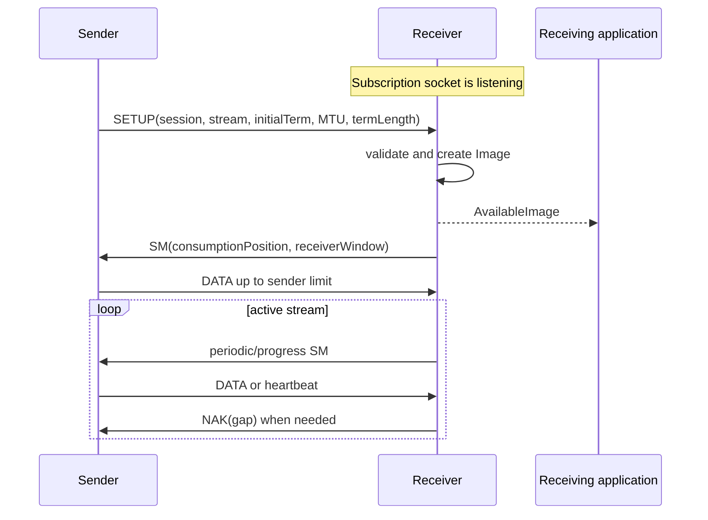
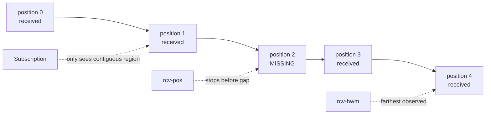
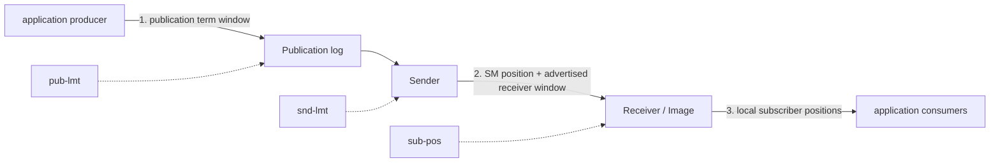
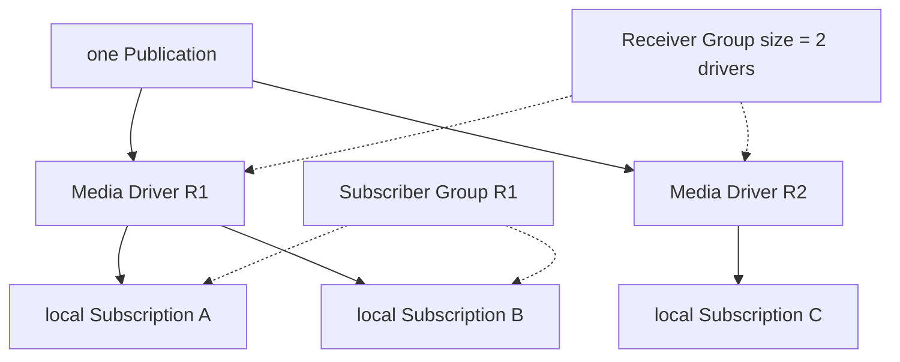
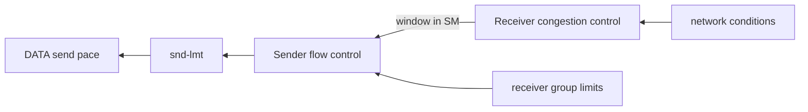
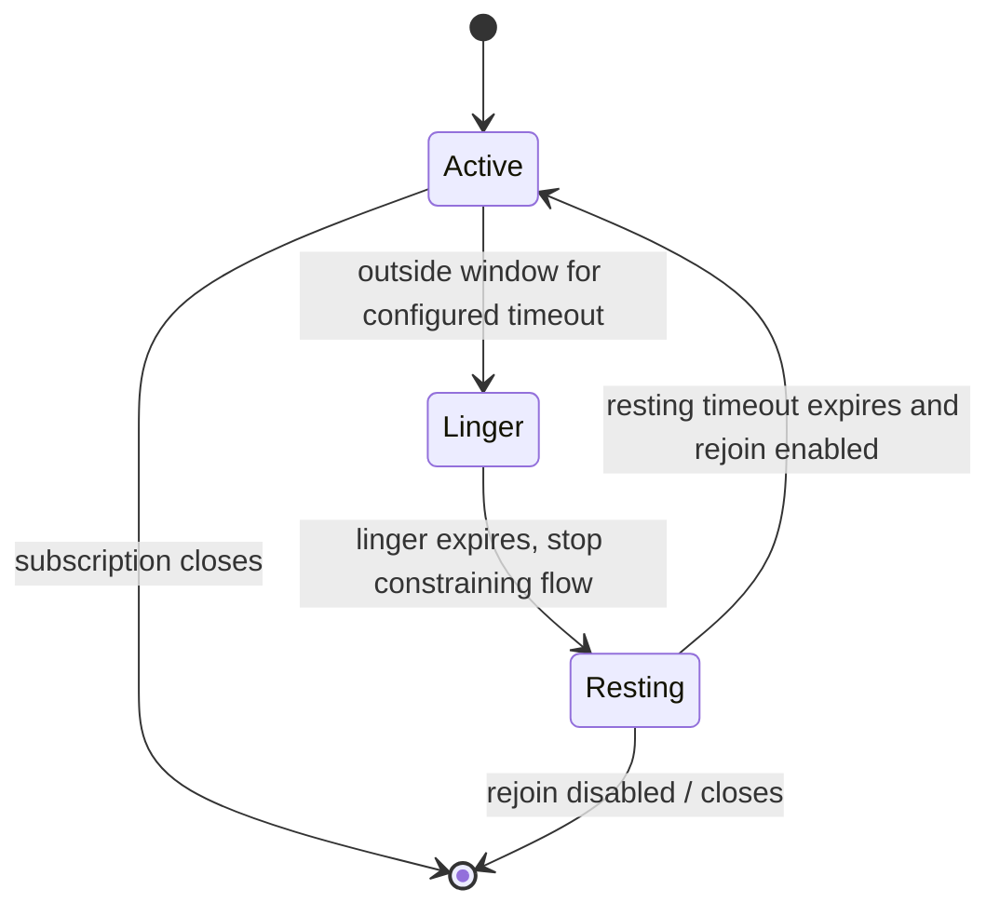
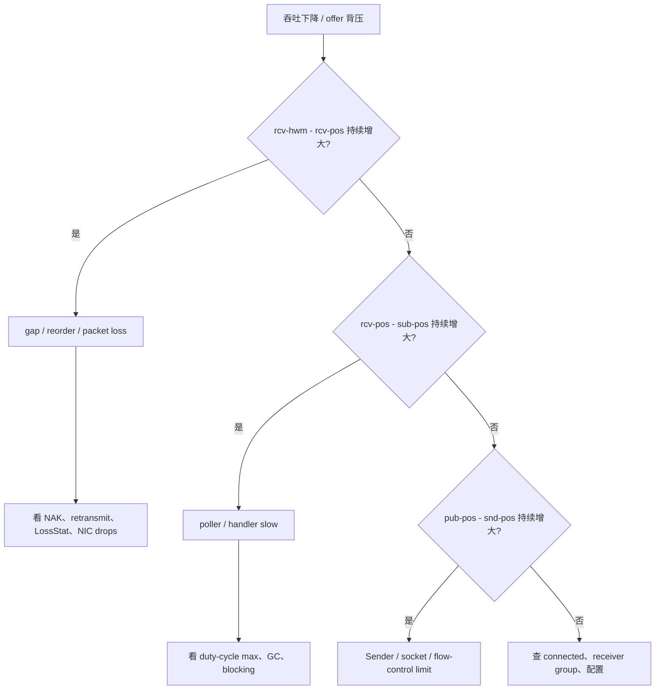

“Aeron 是可靠 UDP”这句话方向没错，却容易让人误以为它像 TCP 一样只有一套连接、一扇窗口和一个顺序。实际上 Aeron 把机制拆得更清楚：

- 协议 frame 用 `sessionId + streamId + termId + termOffset` 定位；
- Receiver 用 Status Message 报告消费位置和接收窗口；
- Sender 根据 flow-control strategy 合并一个或多个 Receiver 的窗口；
- Receiver 用 high-water mark 与 rebuild position 发现 gap，并发 NAK；
- congestion control 决定 Receiver 当前要广告多大的窗口；
- 本机多个 Subscription 又通过自己的 position 参与 local flow control。

本章以 **Aeron 1.52.2** 为基线，把这些层次分开。理解前提是 [发送端 position](/signal-grid-blog/posts/aeron-transport-publication-log-buffer-offer-try-claim/) 与 [接收端 Image position](/signal-grid-blog/posts/aeron-transport-subscription-poll-fragmentation/)。

## 可靠传输先把 UDP 还原成连续 Image

### Aeron UDP stream 是单向的

一个 Publication → Subscription 数据流只有一个方向。控制 frame 会反向返回，但那不等于业务双向通道。



若要请求/响应，必须建立第二条 Publication/Subscription 方向，并定义 correlation、超时与幂等；[MDC、MDS、Spy 与 Response Channels](/signal-grid-blog/posts/aeron-transport-mdc-mds-spy-response-channels/) 会继续展开回程协商。

#### 协议 frame 类型

当前 Transport Protocol Specification 定义的主要 frame：

| 类型 | 方向 | 作用 |
| --- | --- | --- |
| `SETUP` | Sender → Receiver | 宣告 stream/session、initial term、MTU、term length、TTL |
| `DATA` | Sender → Receiver | 携带 payload、fragment flags 与 term offset |
| `PAD` | Sender → Receiver / 本地日志 | 跨过 term 尾部或修复不可用区域 |
| `SM` | Receiver → Sender | Status Message：消费位置、receiver window、flags |
| `NAK` | Receiver → Sender | 请求重传缺失 term 区间 |
| `RTTM` | 双向控制 | 往返时间测量 |
| `ERR` | Receiver → Sender | 拒绝 Image/stream 等错误反馈 |
| `RES` | Name Resolver 控制面 | 携带名称解析 Resolution Entry |
| `RSP_SETUP` | Response Channels 控制面 | Response Setup，协商请求 Image 对应的回程 Publication |
| `EXT` | 扩展 | 扩展 frame，按当前 type/spec 解析 |

这张表聚焦开源基础数据路径；Premium ATS 还定义 ATS DATA / SM / SETUP 类型。DATA header 是 32 字节，frame 在 term 中按 32 字节对齐。frame length 不把对齐 padding 算进线路 payload，但 position 会跨过对齐后的区域。

### 建链不是 TCP handshake，而是状态互相发现

标准单播初始化可画成：



Receiver 也可发送带 setup-eliciting flag 的 SM，请 Sender 重发 SETUP。这对 multicast 和动态拓扑尤其重要。

#### zero-length DATA 是 heartbeat，不是空业务消息

DATA frame 只有 header、payload 长度为 0 时可作为 heartbeat，用来维持活性与暴露发送 position。应用不会把它当普通零长度业务消息交付。设计协议时不要依赖“发送一个零字节 payload”表达业务事件。

#### `isConnected` 是随时间变化的判断

Publication 只有在收到满足当前 flow-control/connectivity 条件的接收反馈后才连接。SM 超时、receiver group 低于最小规模或 Image 离开都会改变连接状态；业务要持续观察，而不是启动时检查一次。

### Receiver 怎样把乱序 UDP 还原成连续 Image

UDP datagram 可能丢失、重复或乱序。Aeron Receiver 不是“收到一个就立刻交一个”，而是按 frame 中的 term 坐标写入 Image log。

两个位置最关键：

- `rcv-hwm`（receiver high-water mark）：已经观察到的最远位置；
- `rcv-pos`（rebuild position）：从此前位置开始已经连续重建到哪里。



此时 `rcv-hwm - rcv-pos > 0`。后面的 frame 已在 buffer，但 Subscription 看不到，因为暴露它们会破坏单 Image 顺序。缺失区间修复后 rebuild position 才能跨过去。

#### NAK 与重传

Loss Detector 扫描 `rcv-pos` 到 `rcv-hwm` 之间的 term，发现 gap 后调度 NAK，携带 term ID、offset 和长度。Sender 仍保留对应 dirty term 时就重发。

单播与 group 语义的策略不同：

- 单播可快速发 NAK；
- multicast/MDC 中多个 Receiver 可能发现同一缺口，使用随机延迟与 NAK suppression 避免一起请求；
- Sender 对同一区间设置 retransmit linger，避免重复 NAK 引发重传风暴；
- 重传长度受缺口、term 末尾与估算 receiver window 限制。

如果 Sender 已轮转并清理所需数据，Transport 无法凭空恢复历史。这再次说明可靠性只覆盖活跃的有界窗口。

#### 可靠模式的边界

默认 UDP Subscription 使用可靠模式：对 active Image 检测缺口并 NAK，向应用保持 session 内有序连续交付。

它仍不保证：

- 永久网络分区后一定恢复；
- 接收进程离线期间保存数据；
- sender 崩溃前未持久化的数据可重建；
- handler 成功或业务结果 exactly-once。

可靠性陈述必须带上“active session、可重传窗口、Transport position”这些限定。

## 三层窗口怎样形成端到端背压

### 三层窗口：背压不是一根线

最容易混淆的地方，是把所有限制都叫“receiver window”。完整数据路径至少有三段：



#### 应用生产者 → Sender：publication term window

Publication limit 控制应用能领先 Sender/消费者多远。默认窗口为 term length 的一半；若配置显式值，也会被 cap 到半个 term。

当 `pub-pos` 接近 `pub-lmt`，`offer` 返回 BACK_PRESSURED。这个本地窗口确保应用不会覆盖 Sender 仍需读取或重传的数据。

#### Sender → Receiver：Status Message 窗口

Receiver 发送的 SM 包含 consumption position 与 receiver window length。单个 Receiver 对 Sender 表达：

```text
receiverLimit = consumptionPosition + advertisedReceiverWindow
```

Sender 的 flow-control strategy 再把一个或多个 Receiver limit 合成为 `snd-lmt`。`snd-pos` 不能越过它。

#### Receiver → 本机 Subscription：local flow control

同一 Image 下可能有多个本机 subscriber position。tethered 模式通常取最慢的 position 作为 consumption point，再加 receiver window 反馈给 Sender。

默认 initial receiver window 为 128 KiB，并被 cap 到半个 term。它既要容纳在途数据，又要与 OS receive buffer 协调。

#### 总领先量不是一个窗口

发送应用可能先领先 Sender 一个 publication term window，Sender 又能领先 Receiver consumption 一个 advertised window。因此估算端到端未消费数据时，至少考虑两段之和，以及多 destination、socket buffer 与 term 映射。

### Status Message 为什么会不断发送

SM 不是一次性的 ACK。1.52.2 Receiver 会在这些情况下调度更新：

- consumption position 前进超过 receiver window 的 1/4；
- congestion-control window 发生变化；
- 算法要求强制反馈；
- 周期性状态消息超时到期；
- term/Image 生命周期事件需要反馈。

默认 status-message timeout 是 200 ms，但生产环境不应把当前默认硬编码成协议。调得过长会让 Sender 不能及时获得新窗口；调得过短会增加控制流量与 CPU。

### Receiver Group 与 Subscriber Group 不是一回事

官方 Flow and Congestion Control 文档区分两个群体：

- **Receiver Group**：位于不同 Media Driver 上、通过网络各自发 SM 的 receivers；
- **Subscriber Group**：同一个 driver 内，共享某幅 Image log 的 Subscriptions/spy/IPC subscribers。



在同一个 driver 上再加十个本地 Subscription，不会让网络 flow control 认为有十个 receivers；它们先在本地合成 consumption position，再由 driver 发一份 SM。

## 多接收者流控与网络拥塞如何分工

### multicast/MDC 的三种 flow-control strategy

IP multicast 和 Multi-Destination-Cast 都可能有多个 Receiver，因此 Publication URI 可用 `fc` 选择谁来定速。

#### `max`：最快 Receiver 定速

```text
aeron:udp?endpoint=239.10.10.10:40123|fc=max
```

Sender 采用 receivers 中最大的 limit，最快者可以持续前进。慢 receiver 不会拖住全组，但可能落出 term/window，Image unavailable 后再从当前点加入，产生数据缺口。

适合：低延迟分发、允许个别消费者脱队并从其他来源恢复。

#### `min`：最慢 Receiver 定速

```text
aeron:udp?endpoint=239.10.10.10:40123|fc=min,t:5s,g:/3
```

Sender 使用被跟踪 receivers 中最小 limit。任何一个参与者慢都可能让所有人背压；receiver timeout 后才从组中移除。`g:/3` 表示至少观察到 3 个 receivers 才满足连接要求。

适合：所有成员都必须在线接收，且最慢成员拖慢整体是可接受产品语义。

#### `tagged`：只有指定 group tag 的 Receiver 定速

Publication：

```text
aeron:udp?endpoint=239.10.10.10:40123|fc=tagged,g:1001/2,t:5s
```

参与流控的 Subscription：

```text
aeron:udp?endpoint=239.10.10.10:40123|gtag=1001
```

只有匹配 `gtag` 的 receivers 进入 min 计算；`/2` 要求至少两个 tagged receivers。其他观察者可以接收，但不会决定发送速度。

适合：两个核心副本必须完整跟随，旁路监控/分析允许掉队。

#### `max` 默认值不是“所有接收者可靠”

当前 multicast 默认 strategy 是 `max`。它让主数据流不被最慢 receiver 拖住，也意味着“默认 reliable=true”只对每个仍在窗口内的 active Image成立，不能推导出所有 multicast receivers 永远无丢失。

| 策略 | 谁决定 sender limit | 支持 group minimum | 慢成员结果 |
| --- | --- | --- | --- |
| `max` | 最快 receiver | 否 | 可能掉队 |
| `min` | 最慢被跟踪 receiver | 是 | 全组背压 |
| `tagged` | 最慢匹配 tag receiver | 是 | 非 tag 观察者可掉队 |

### Flow control 与 congestion control 的职责不同

**Flow control** 在 Sender 侧回答：“多个 Receiver 给出的 limit，应该采信谁？”

**Congestion control** 在 Receiver 侧回答：“我现在应该在 SM 中广告多大的 receiver window？”



#### 默认 `static` 并不会自适应网络拥塞

1.52.2 默认 `StaticWindowCongestionControl` 取：

```text
min(configured initial receiver window, termLength / 2)
```

它始终广告固定窗口，等价于没有基于 RTT/丢包动态收缩增长。名称里有 congestion control interface，不代表默认已经像 TCP 那样自适应。

#### `cc=cubic` 是可选算法

Subscription URI 可以请求：

```text
aeron:udp?endpoint=0.0.0.0:40123|cc=cubic|rcv-wnd=2m
```

CUBIC 实现在 driver `ext` 包中，利用 RTT 与 loss 调整 receiver window。它不是所有环境的自动最优项：

- 需要真实 RTT/loss 基准；
- 与 term length、MTU、socket buffer 一起验证；
- 多 receiver 时每个 Receiver 独立计算，再由 sender flow control 合并；
- Java/C 版本与供应器配置应按当前实现核对。

不要把 `fc=min` 与 `cc=cubic` 当二选一：一个选择 receivers，一个计算每个 receiver 的 window。

### Bandwidth-delay product 决定窗口下限

一条链路若带宽为 `B bytes/s`、往返延迟为 `RTT seconds`，在途数据量近似：

```text
BDP = B × RTT
```

receiver window 明显小于 BDP 时，Sender 会在反馈回来前耗尽窗口，吞吐无法跑满。例如 1 Gbit/s 约为 125 MB/s，RTT 10 ms，则 BDP 约 1.25 MB；默认 128 KiB 明显偏小。

但把窗口盲目调成很大也有代价：

- 每个 Image 需要更大有效缓冲跨度；
- 大突发会增加队列和尾延迟；
- 慢应用更晚感知背压；
- OS `SO_RCVBUF` 若小于需求，kernel 会先丢包；
- term length 会把 receiver window cap 到一半。

官方 Best Practices 给出的数 MiB socket buffer 只能作为常见起点。正确流程是测 RTT/目标吞吐、计算 BDP、核对 OS 上限，再用 LossStat 和 counters 验证。

## 放弃可靠性或慢消费者意味着什么

### `reliable=false`：用 padding 跨过缺口

对允许丢失的 UDP Subscription，可配置：

```text
aeron:udp?endpoint=0.0.0.0:40123|reliable=false
```

Receiver 发现 gap 后不要求把它永久补齐，而会在适当时机以 padding 填充，使 rebuild position 继续前进。应用看到的是后续消息，中间 position 有洞；它不会收到一个虚构的空业务消息。

适合：

- 可由新值覆盖的行情快照；
- 遥测；
- 允许应用层检测业务 sequence 后刷新全量状态的 feed。

不适合：订单、账务、复制状态机等每条变更都不可缺的日志。

#### IPC 与 spy 始终可靠

`reliable=false` 是网络 Image 的丢包策略。IPC 与 local spy 共享本地日志，不用这套 NAK/gap-fill 语义，按可靠方式处理。

同一 driver 内，针对同一 channel/stream 建立相互冲突的 reliable 配置会被拒绝；不能指望同一底层 Image 同时给一个 Subscription 可靠、另一个不可靠的视图。

### `tether=false`：允许本地慢 Subscription 暂时脱队

默认 tethered Subscription 会参与本机最慢位置计算。若某个观察者允许丢数据，可配置：

```text
aeron:udp?endpoint=0.0.0.0:40123|tether=false
```

当它持续落在窗口限制之外，1.52.2 生命周期大致是：



当前默认 window-limit timeout 为 5 秒；未显式设置的 linger 默认继承它；resting 默认 10 秒。它们都是版本化配置，不应变成业务协议常量。

untethered 的后果必须被应用接受：

- 收到 Image unavailable/available 事件；
- rejoin 时从较新 position 开始；
- 中间数据可能永久缺失；
- 需要用业务 sequence、快照或 Archive 补齐时自行触发。

Spy 也参与本地 tether/backpressure 规则，即使它不作为远端 Receiver 进入网络 max/min/tagged 计算。

## 参数与 counters 怎样证明故障位置

### MTU、socket 与 term 的联合调优

#### MTU

默认 Aeron MTU 1408 bytes，默认 max payload 1376 bytes。增大后：

- 每字节 header 开销下降；
- 大消息 fragment 数减少；
- 单次丢包重传块可能更大；
- 超过路径 MTU 会触发 IP fragmentation 或直接丢弃。

必须在真实 VLAN、隧道、云网络和跨区路径验证。两端 MTU 参数不一致也会导致 Image 拒绝或异常。

#### OS socket buffers

至少保证接收 socket buffer 能容纳计划的 receiver window 和突发。Linux 还可能把应用请求值加倍显示，并受 `net.core.rmem_max/wmem_max` 限制；容器 namespace 也可能有不同上限。Aeron 配置成功不代表 kernel 实际给到了请求容量，应从启动日志/系统工具核验。

#### term length

更大 term：

- 允许更大的 max message 与最大 position；
- publication/receiver window 上限更高；
- 每个 Publication/Image 的虚拟映射和潜在物理内存更大；
- 清理、触页与故障恢复成本改变。

它不是网络拥塞算法，也不是慢消费者修复器。

### 用 counters 区分丢包、拥塞和应用慢



相关系统 counters 包括：

- NAK sent/received；
- retransmits 与 retransmitted bytes；
- status messages sent/received/rejected；
- flow-control overruns/underruns；
- sender flow-control back-pressure events；
- invalid packets、short sends、errors；
- sender/receiver duty-cycle max 与 threshold exceed；
- per-Image loss/rebuild/position counters。

MDC 下 retransmitted bytes 可能只是下界：同一重传数据要发向多个 destination。采样 counters 也不是原子事务快照，应看趋势与相互关系。

### 设计选择表

| 需求 | 建议起点 | 必须接受的边界 |
| --- | --- | --- |
| 单接收者完整活跃流 | unicast + reliable | 离线历史另做持久化 |
| 所有组成员必须跟上 | multicast/MDC + `fc=min` | 最慢成员背压全组 |
| 核心副本完整、旁路可掉 | `fc=tagged` + group minimum | 正确管理 gtag/member 生命周期 |
| 最快消费优先 | `fc=max` | 慢 receiver 可能出现 gap |
| 可丢最新值 feed | `reliable=false` 或 untethered | 业务能检测并刷新缺口 |
| 长 RTT 高吞吐 | receiver window ≥ 经验证的 BDP | socket/term/内存一起扩大 |
| 动态网络拥塞 | 基准验证 `cc=cubic` | 算法不是容量与应用慢的替代品 |

## 结论：可靠 UDP 来自可观察的反馈闭环，而不是一个开关

Aeron 的“可靠 UDP”不是一个神秘开关，而是一条可观察的闭环：

1. term 坐标让 Receiver 把乱序 frame 放回正确位置；
2. `rcv-hwm` 与 `rcv-pos` 暴露 gap；
3. NAK 与有界重传修复 active window 内的缺失；
4. Status Message 把 consumption position 和窗口反馈给 Sender；
5. flow control 决定多个 Receiver 谁定速；
6. congestion control 决定单个 Receiver 广告多大窗口；
7. local subscriber positions 再把应用速度传回整个系统。

只有把这七层和业务持久化/幂等分开，才能准确选择 reliable、untethered、max/min/tagged 与 CUBIC，而不是靠增加 buffer 掩盖问题。

下一篇将比较 unicast、IP multicast、MDC、MDS、spy 与 Response Channels，重点不是 URI 花样，而是每种拓扑到底复制几份数据、谁发现谁、谁参与流控，以及双向关联怎样建立。

## 官方资料

- [Transport Protocol Specification](https://github.com/aeron-io/aeron/wiki/Transport-Protocol-Specification)
- [Flow and Congestion Control](https://github.com/aeron-io/aeron/wiki/Flow-and-Congestion-Control)
- [Message Delivery Assurances](https://github.com/aeron-io/aeron/wiki/Message-Delivery-Assurances)
- [Channel Configuration](https://github.com/aeron-io/aeron/wiki/Channel-Configuration)
- [Configuration Options](https://github.com/aeron-io/aeron/wiki/Configuration-Options)
- [Best Practices Guide](https://github.com/aeron-io/aeron/wiki/Best-Practices-Guide)
- [Understanding Position](https://aeron.io/docs/aeron/aeron-understanding-position/)
- [Aeron 1.52.2 `PublicationImage.java`](https://github.com/aeron-io/aeron/blob/1.52.2/aeron-driver/src/main/java/io/aeron/driver/PublicationImage.java)
- [Aeron 1.52.2 `NetworkPublication.java`](https://github.com/aeron-io/aeron/blob/1.52.2/aeron-driver/src/main/java/io/aeron/driver/NetworkPublication.java)
- [Aeron 1.52.2 `FlowControl.java`](https://github.com/aeron-io/aeron/blob/1.52.2/aeron-driver/src/main/java/io/aeron/driver/FlowControl.java)
- [Aeron 1.52.2 `StaticWindowCongestionControl.java`](https://github.com/aeron-io/aeron/blob/1.52.2/aeron-driver/src/main/java/io/aeron/driver/StaticWindowCongestionControl.java)
- [Aeron 1.52.2 `CubicCongestionControl.java`](https://github.com/aeron-io/aeron/blob/1.52.2/aeron-driver/src/main/java/io/aeron/driver/ext/CubicCongestionControl.java)
- [Aeron 1.52.2 `Configuration.java`](https://github.com/aeron-io/aeron/blob/1.52.2/aeron-driver/src/main/java/io/aeron/driver/Configuration.java)
- [Aeron 1.52.2 Javadoc](https://javadoc.io/doc/io.aeron/aeron-all/1.52.2/index.html)
- [Cookbook: Increase performance](https://aeron.io/docs/cookbook-content/aeron-increase-performance/)
- [Cookbook: LossStat](https://aeron.io/docs/cookbook-content/aeron-loss-stat/)
- [Cookbook: Wireshark](https://aeron.io/docs/cookbook-content/aeron-wireshark/)
