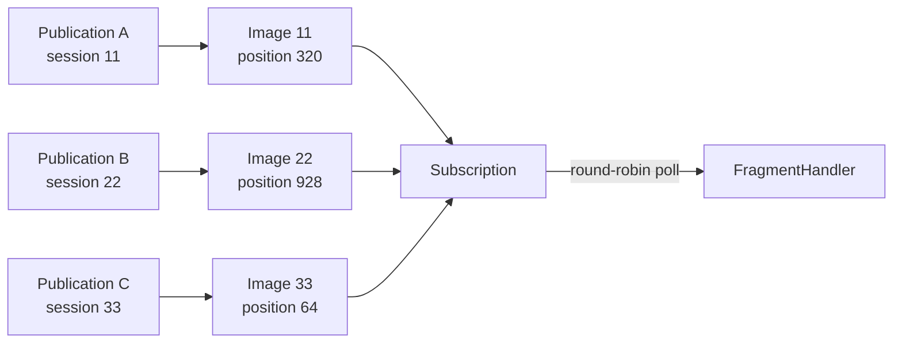
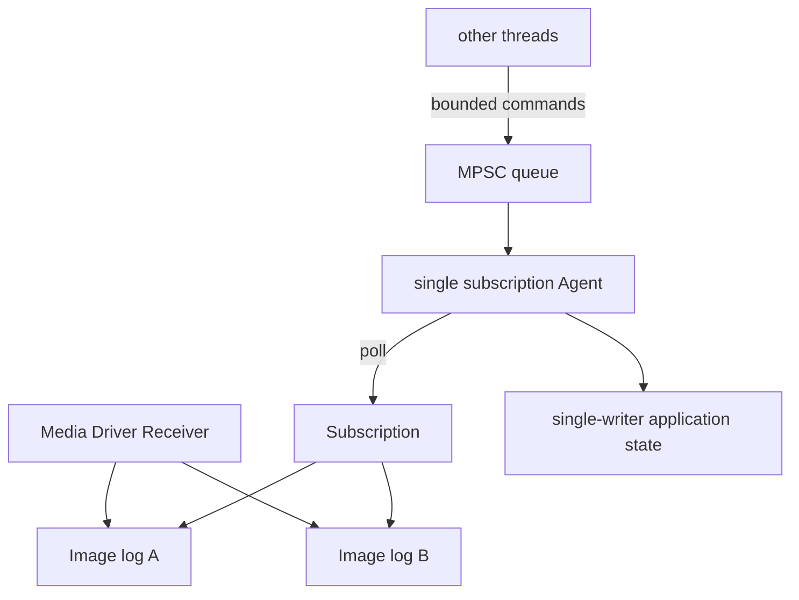
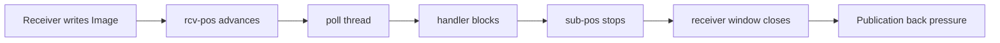
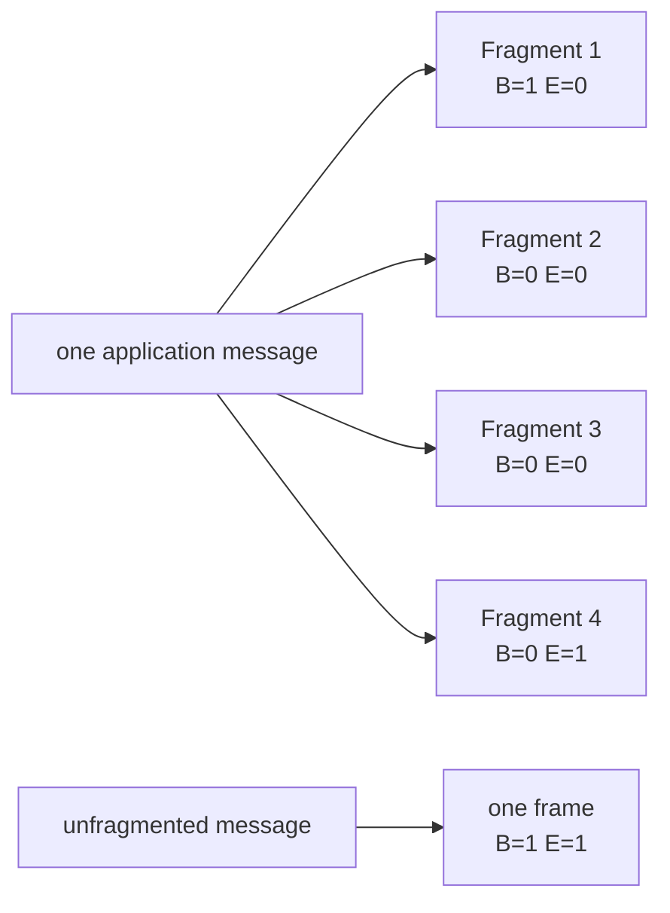
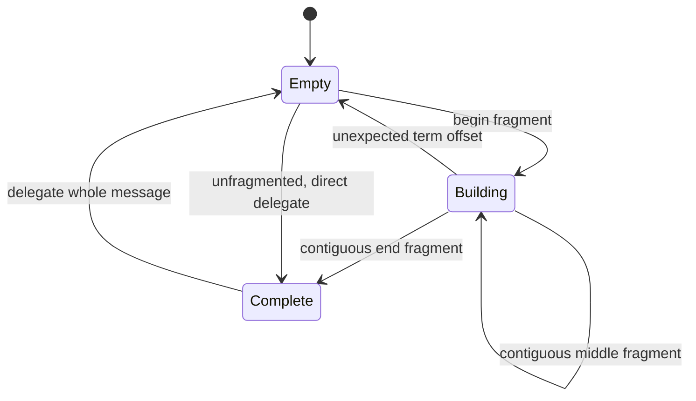
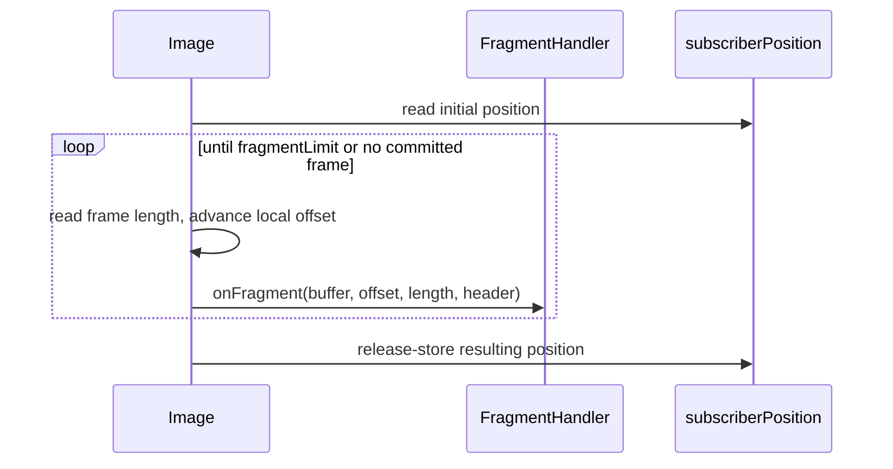
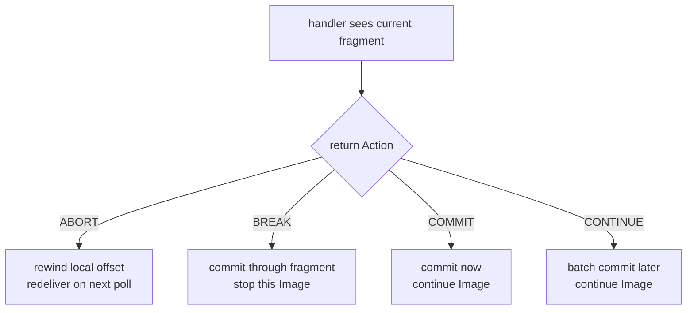
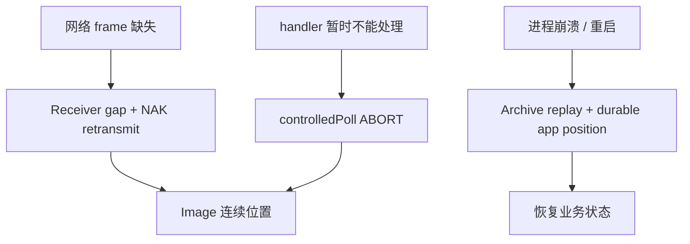

Aeron 接收 API 最短只要一行：

```java
subscription.poll(fragmentHandler, fragmentLimit);
```

但要把它写成可靠的生产代码，必须回答一串隐藏问题：谁拥有 Subscription？`fragmentLimit` 限制的是消息还是 frame？handler 收到的 buffer 能保存多久？大消息怎样重组？业务失败后 `ABORT` 会不会撤销副作用？回调抛异常时 position 到底推进没有？

本文以 **Aeron 1.52.2** 源码与 Javadoc 为基线，从 Image 的 position 推进机制解释这些边界。发送侧的 term、MTU 和 `offer` 见 [Transport 第 3 篇：Publication、Log Buffer 与发送热路径](/signal-grid-blog/posts/aeron-transport-publication-log-buffer-offer-try-claim/)。

## Subscription 的所有权从主动轮询开始

### Subscription 聚合 Image，不拥有一条全局日志

一个 Subscription 匹配 channel + stream，下方可以同时有多幅 Image：



每幅 Image 有自己的：

- session ID 与 source identity；
- term buffers；
- subscriber position；
- end-of-stream 状态；
- available/unavailable 生命周期。

Subscription 的 `poll` 会从一个轮转起点遍历 Image，尽量避免每次总从第一幅开始。它提供跨 Image 的轮询公平性，不提供跨 session 全局顺序。

#### Subscription 和 Image 都不是线程安全对象

Aeron 1.52.2 Javadoc 对 `Subscription` 和 `Image` 的并发契约很明确：它们不应由多个线程并发 poll。典型所有权是：



如果多个 worker 都要处理数据，可让一个 poller 解码后分片到有界队列；但这会引入复制、重新排序、队列背压与生命周期管理。不能让多个线程同时 poll 同一个 Subscription，指望它自动成为竞争消费者。

#### 多个 Subscription 是广播，不是抢任务

同一个 driver 内创建两个匹配的 Subscription，它们各有自己的 subscriber position，都能看到 Publication 的消息。较慢的 tethered Subscription 还可能限制接收窗口，从而把背压传回发送端。

若希望“一条任务只由一个 worker 执行”，应：

- 在发送侧按 key 路由到不同 stream/channel；
- 每个分区由一个 Subscription owner 消费；或
- 在应用层建立任务所有权、重试和故障转移协议。

Aeron 不提供 broker 式 consumer group rebalancing。

### `poll` 是 duty cycle，不是阻塞读取

`poll` 立即检查当前可读 fragment，最多处理 `fragmentLimit` 个，然后返回实际 fragment 数。没有数据时返回 0，不会等待下一条消息。

标准 agent 循环可以写成：

```java
final FragmentHandler fragmentHandler = this::onFragment;
final int fragmentLimit = 20;
final IdleStrategy idleStrategy = new BackoffIdleStrategy();

while (running)
{
    final int fragmentsRead = subscription.poll(fragmentHandler, fragmentLimit);
    idleStrategy.idle(fragmentsRead);
}
```

或者把它放进 Agrona `Agent.doWork()`：

```java
public int doWork()
{
    return subscription.poll(fragmentHandler, fragmentLimit);
}
```

只在启动时调用一次 `poll`，或者每秒由定时器调用一次，都会让接收窗口停止前进并快速把背压传给 Publication。Cookbook 一再强调 polling loop，原因就在这里。

#### `fragmentLimit` 不是 message limit

官方核心页面有时把这个参数宽泛写成“消息数”，但 1.52.2 Javadoc 与源码都以 **message fragments** 计数：

- 小于等于 max payload 的未分片消息占 1；
- 一个拆成 5 个 frame 的大消息占 5；
- padding frame 不调用 handler，也不计入返回数；
- Subscription 在所有 Image 间共享本次剩余 limit。

所以 `poll(...) == 20` 不代表业务处理了 20 条完整消息。使用 assembler 后，delegate 收到的完整消息数可能更少。

#### fragment limit 是公平性与批处理旋钮

过小：

- 方法调用和 idle 判断更频繁；
- 吞吐可能下降；
- 但单次 duty cycle 更短，其他 agent 工作不易饥饿。

过大：

- 更容易形成批处理；
- 但 handler 较重时，会延迟同线程的 timers、发送重试或控制任务；
- 单幅繁忙 Image 可能在当前调用消耗大部分预算。

应以 duty-cycle 时长、接收 backlog 和尾延迟测量选择，而不是照抄示例里的 10、20 或 100。

### 回调 buffer 是借来的只读视图

`FragmentHandler` 的参数：

```java
void onFragment(DirectBuffer buffer, int offset, int length, Header header)
```

其中 `buffer` 通常直接指向 Image 的 term buffer。它具有三个约束：

1. 应视为只读；
2. 数据只保证在当前回调/当前 poll duty cycle 的契约内有效；
3. 后续 term 轮转会复用底层内存。

错误做法：

```java
void onFragment(final DirectBuffer buffer, final int offset, final int length, final Header header)
{
    executor.submit(() -> decodeLater(buffer, offset, length));
}
```

异步任务运行时，底层区域可能已经被复用，`Header` 本身也由 Image 重复设置 offset。若要越过回调保存，必须复制或立即解码成由应用拥有的对象：

```java
void onFragment(final DirectBuffer buffer, final int offset, final int length, final Header header)
{
    final byte[] owned = new byte[length];
    buffer.getBytes(offset, owned);
    handOffOwnedBytes(owned, header.sessionId());
}
```

复制会增加带宽和分配，生产实现常用对象池或有界 slab，但“谁拥有、何时可复用”的协议必须比优化更先确定。

#### handler 应保持短小且有界

普通 `poll` 会在调用线程同步执行 handler。数据库请求、阻塞 I/O、锁等待或不可控日志格式化都会直接停止 subscriber position：



若业务处理本来就可能阻塞，要么接受并配置这种端到端传压，要么在 poller 与 worker 间建立**有界**交接；无界线程池/队列只会把可控背压变成不可控内存。

## 分片消息怎样重组并推进 position

### Fragmentation：一条消息如何跨多个 DATA frame

当 `offer` 的消息长度大于 `maxPayloadLength()`、但不超过 `maxMessageLength()` 时，Aeron 自动拆分。每个 fragment 都有 DATA header，并用 flags 表达边界：



同一 session 内，Receiver 先修复缺口并推进连续位置，因此正常 poll 会按 term offset 看见连续 fragments。但 FragmentHandler 本身不替业务重组；直接解码每个回调会把一条大消息误当成多条。

#### `FragmentAssembler` 的两条路径

最简单的接法：

```java
final FragmentHandler wholeMessageHandler = this::onWholeMessage;
final FragmentAssembler assembler = new FragmentAssembler(wholeMessageHandler);

final int fragmentsRead = subscription.poll(assembler, fragmentLimit);
```

1.52.2 `FragmentAssembler` 的实现边界：

- 未分片消息直接委托，不复制；
- 分片消息复制进按 session ID 保存的 `BufferBuilder`；
- buffer 按需要增长；
- 收到 end fragment 后把完整连续 buffer 交给 delegate；
- assembled `Header` 先复制 begin fragment 的 header，再用 end fragment 补齐 context / flags，并重算 frame length 与 fragmented frame length；它不是简单“拿最后一片 header”；
- term offset 不连续时丢弃当前不完整重组状态。



#### 按 session 清理重组 buffer

Assembler 为每个出现过大消息的 session 保留可增长 buffer。若 session 数量动态变化而从不清理，内存会长期保留。应在 unavailable image 回调中释放：

```java
final FragmentAssembler assembler = new FragmentAssembler(this::onWholeMessage);

final UnavailableImageHandler unavailable = image ->
    assembler.freeSessionBuffer(image.sessionId());

try (Subscription subscription = aeron.addSubscription(
    channel, streamId, image -> {}, unavailable))
{
    // poll assembler
}
```

如果 session ID 可能被重用，这一步也避免旧的半包状态污染新 Image。

还有一个更隐蔽的并发边界：`FragmentAssembler` 的重组 map **只用 sessionId 作 key**，不是 Image correlation ID。若一个聚合型 Subscription / MDS 同时存在两个 sessionId 相同的 Image，分片状态可能互相污染；某个 Image unavailable 时按 session 清理，也可能清掉另一个 Image 的状态。应保证同一 Subscription 内并存 Image 的 sessionId 唯一，或分别 poll 每幅 `Image`，并为每幅 Image 使用独立的 `ImageFragmentAssembler`。

#### 大消息会改变内存与延迟形状

把 max message 调大不是免费的：

- 更多 frame header 与 poll 次数；
- assembler 复制完整 payload；
- 每个并发 session 可能拥有一个大重组 buffer；
- 丢一个 fragment 会阻止后续连续位置推进；
- handler 只有收到最后一片后才得到完整消息。

对多 MiB payload，Archive、对象存储引用、应用层 chunking 或另一个传输可能更合适。选择应由原子消息语义、恢复需求和内存上限共同决定。

### 普通 `poll` 怎样推进 position

`Image.poll` 从当前 subscriber position 找到 active term 和 offset，依次读取已提交 frame。每处理一个 frame，内部 offset 先按 32 字节对齐推进；在 `finally` 中把本次已经跨过的区域发布为新 subscriber position。



这里有一个经常被误解的失败边界：**handler 抛出异常不会自动重投当前 fragment。** 1.52.2 的 `Image.poll` 会捕获 `Exception`，交给 Aeron client error handler，然后在 `finally` 里推进到已经跨过的位置。

因此：

- 不要靠抛异常实现消息重试；
- error handler 可能记录错误，但当前 fragment 已可能被消费；
- 业务需要原地重试时，考虑 `controlledPoll` 并显式返回 `ABORT`；
- 无论哪种 API，外部副作用仍需幂等或事务。

## Controlled Poll 怎样定义应用提交边界

### `controlledPoll`：控制的是 Image position

`ControlledFragmentHandler` 返回四种 Action：

| Action | 当前 fragment 是否计数 | 当前 Image position | 本幅 Image 是否继续 |
| --- | --- | --- | --- |
| `ABORT` | 否 | 不越过当前 fragment | 停止本幅 Image |
| `BREAK` | 是 | 提交到当前 fragment 末尾 | 停止本幅 Image |
| `COMMIT` | 是 | 立即提交到当前 fragment 末尾 | 继续 |
| `CONTINUE` | 是 | 通常在本次 poll 末尾批量提交 | 继续 |



#### ABORT 是“别推进这幅 Image”，不是事务回滚

典型用法是先尝试写入一个有界下游队列：

```java
final ControlledFragmentHandler handler = (buffer, offset, length, header) ->
{
    if (!downstream.tryAccept(buffer, offset, length, header.sessionId()))
    {
        return ControlledFragmentHandler.Action.ABORT;
    }

    return ControlledFragmentHandler.Action.CONTINUE;
};
```

但是 `downstream.tryAccept` 必须满足失败时没有留下半成副作用。若代码已经扣款、发 HTTP 请求或部分写数据库，再返回 ABORT，下一次 poll 会再次交付同一 fragment，副作用不会被 Aeron 撤销。

`ABORT` 只控制 subscriber position。exactly-once 仍需要幂等请求 ID、事务 outbox/inbox、单写者状态机或其他应用协议。

#### Subscription 可能继续轮询别的 Image

`Subscription.controlledPoll` 的 Javadoc 特别说明：某幅 Image 返回 BREAK 或 ABORT 后，Subscription 仍可以继续读取其他 Image，只要总 fragment limit 未耗尽。

因此 ABORT 不是“冻结整个 Subscription”。若业务必须在所有 session 上全局停住，应让外层停止下一次 poll，或直接对特定 `Image.controlledPoll` 建立更精细的调度；不要依赖一个 Action 隐式实现全局屏障。

#### handler 抛异常不等于 ABORT

1.52.2 `Image.controlledPoll` 同样捕获异常并调用 error handler；因为 local offset 已经越过当前 frame，`finally` 可能提交它。需要 ABORT 时必须在业务 handler 内捕获可恢复失败并显式返回：

```java
final ControlledFragmentHandler handler = (buffer, offset, length, header) ->
{
    try
    {
        return tryProcess(buffer, offset, length) ?
            ControlledFragmentHandler.Action.CONTINUE :
            ControlledFragmentHandler.Action.ABORT;
    }
    catch (final RetryableBusinessException ex)
    {
        return ControlledFragmentHandler.Action.ABORT;
    }
};
```

不可恢复异常则应进入明确的停机/隔离流程；悄悄记录后继续可能推进位置并造成业务缺口。

#### 回调内禁止重入 Aeron client

`FragmentHandler` 与 `ControlledFragmentHandler` Javadoc 都明确禁止在回调中对 Aeron client 做 reentrant call，否则行为未定义。不要在 handler 内同步 add/close Publication、Subscription，或发起其他需要 Client Conductor 协调的资源操作。

更稳妥的做法是把控制请求写进当前 agent 的状态，在 handler 返回后处理。

### `ControlledFragmentAssembler`：整条消息决定 Action

大消息与 controlled poll 必须配套使用 `ControlledFragmentAssembler`：

```java
final ControlledFragmentHandler wholeMessageHandler = this::onWholeMessage;
final ControlledFragmentAssembler assembler =
    new ControlledFragmentAssembler(wholeMessageHandler);

final int fragmentsRead = subscription.controlledPoll(assembler, fragmentLimit);
```

不能把普通 `FragmentAssembler` 强行塞进 controlled handler，也不能对每个 fragment 独立返回业务提交结果。

其关键实现语义是：

- begin/middle fragment 先进入 assembler buffer，并返回 CONTINUE；
- 收到 end fragment 后才调用完整消息 delegate；
- delegate 返回 ABORT 时，assembler 保留此前累计内容，并撤回最后一片的 buffer limit；
- 下一次 end fragment 重投后可以再次组装并调用 delegate；
- 非分片消息直接把 delegate Action 传回。

这仍然只对当前进程内 Image position 有意义。进程崩溃后若要从相同消息恢复，需要 Archive replay 与持久化消费 position，而不是依赖内存 assembler。

### `BREAK`、`COMMIT` 何时有用

#### BREAK：达到应用批次边界

例如一条完整业务消息让本次时间预算耗尽，返回 BREAK 可以提交它并结束当前 Image 的 poll。与 ABORT 的区别是当前消息不会重投。

#### COMMIT：缩小一批消息的重投/进度边界

CONTINUE 会在 poll 结束时批量发布 position；COMMIT 则在当前 fragment 后立即 release-store position，再继续处理。它可以让 flow control 更快看到进度，或在长批次内建立阶段边界，但会增加 position 写入。

COMMIT 依然不是持久化提交。如果业务数据库尚未提交，subscriber position 前进只代表这次运行时不会再次从 Image 交付这些 fragment。

#### 不要用 deprecated Image 定位 API 搭新协议

Aeron 1.52 在 `Image` 上把 `controlledPeek(...)` 和直接 `position(long)` 标记为 deprecated，计划在 1.53 移除。旧文章用它们实现“窥探后手动提交”的模式不适合新代码。

新设计优先使用 `controlledPoll`、Archive replay session 或明确的业务缓冲；升级前也应查 1.52.2 Javadoc 的 deprecated 清单。

## 底层批量读取与失败模型如何选择

### `blockPoll` 与 `rawPoll` 是批量底层接口

Subscription/Image 还提供面向连续块的读取方式：

- `blockPoll`：交付一段包含一个或多个完整 frame 的 term block；
- `rawPoll`：同时暴露 raw block 与文件通道等底层信息。

它们适合：

- Archive 一类批量录制；
- 消息索引；
- 原始日志复制或检查工具。

它们不适合直接取代普通业务 handler，因为调用方必须正确理解 frame、padding、term 边界、文件生命周期和 position。若目标只是得到完整业务消息，用 assembler 更安全。

### 三种失败模型不要混为一谈



1. 网络缺包：Media Driver 的可靠协议处理，应用通常看不到乱序 frame；
2. 当前进程临时处理失败：controlledPoll 可以不推进当前 Image；
3. 进程重启后恢复：Transport 内存位置不够，需要持久化历史和业务 checkpoint。

把第三种问题只用 ABORT 解决，会在崩溃时失去恢复点；把第一种问题在业务 payload 里重新造一套 NAK，又会重复底层协议。

## 用热路径指标证明接收循环健康

### 接收热路径监控

至少观察：

- `rcv-hwm`：Receiver 见过的最远位置；
- `rcv-pos`：已连续重建的位置；
- `sub-pos`：应用 Subscription 已消费位置；
- poll 返回 0/非 0 的分布；
- 单次 duty cycle 最大耗时；
- handler 失败、ABORT、BREAK 次数；
- assembler 活跃 session 数与 buffer 容量；
- Image available/unavailable 事件。

三个差值能快速定位层次：

```text
rcv-hwm - rcv-pos  = 网络缺口或乱序积压
rcv-pos - sub-pos  = 应用 poll / handler 积压
pub-pos - snd-pos  = 发送侧待发送积压
```

这些 counters 是并发更新的采样，不构成原子快照。单次出现负值或不一致可能只是读取时序；应看连续趋势和相关事件。

## 结论：接收正确性取决于轮询所有权、重组边界与位置提交

Aeron 的接收性能来自应用主动、连续、有限地消费共享日志；它不会用阻塞 `receive()` 隐藏线程调度，也不会替 handler 决定事务边界。

正确使用的核心是：

1. Subscription 与 Image 坚持单线程所有权；
2. `poll` 返回的是 fragments，回调拿到的是短暂只读视图；
3. 大消息通过 FragmentAssembler 按 session 重组；
4. `controlledPoll` 控制 Image position，不回滚外部世界；
5. handler 异常、进程崩溃和网络丢包是三种不同失败。

下一篇将进入线路协议，解释 SETUP、Status Message、DATA、NAK、三个流控窗口、receiver group、CUBIC congestion control，以及“可靠 UDP”真正保证到哪一层。

## 官方资料

- [Publications and Subscriptions](https://aeron.io/docs/aeron/publications-subscriptions/)
- [Log Buffers and Images](https://aeron.io/docs/aeron/log-buffers-images/)
- [Understanding Position](https://aeron.io/docs/aeron/aeron-understanding-position/)
- [Java Programming Guide](https://github.com/aeron-io/aeron/wiki/Java-Programming-Guide)
- [Client Concurrency Model](https://github.com/aeron-io/aeron/wiki/Client-Concurrency-Model)
- [Aeron 1.52.2 `Subscription.java`](https://github.com/aeron-io/aeron/blob/1.52.2/aeron-client/src/main/java/io/aeron/Subscription.java)
- [Aeron 1.52.2 `Image.java`](https://github.com/aeron-io/aeron/blob/1.52.2/aeron-client/src/main/java/io/aeron/Image.java)
- [Aeron 1.52.2 `FragmentAssembler.java`](https://github.com/aeron-io/aeron/blob/1.52.2/aeron-client/src/main/java/io/aeron/FragmentAssembler.java)
- [Aeron 1.52.2 `ControlledFragmentAssembler.java`](https://github.com/aeron-io/aeron/blob/1.52.2/aeron-client/src/main/java/io/aeron/ControlledFragmentAssembler.java)
- [Aeron 1.52.2 `ControlledFragmentHandler.java`](https://github.com/aeron-io/aeron/blob/1.52.2/aeron-client/src/main/java/io/aeron/logbuffer/ControlledFragmentHandler.java)
- [Aeron 1.52.2 Javadoc](https://javadoc.io/doc/io.aeron/aeron-all/1.52.2/index.html)
- [Cookbook: Subscription polling](https://aeron.io/docs/cookbook-content/aeron-subscription-polling/)
- [Cookbook: Fragment assembler](https://aeron.io/docs/cookbook-content/aeron-fragment-assembler/)
- [Cookbook: Cancel read from subscription](https://aeron.io/docs/cookbook-content/aeron-cancel-read-from-subscription/)
