很多 Kafka 教程从“启动一个 broker、创建 topic、运行 console producer”开始，随后给出一串参数表。命令并不难，真正难的是把这些参数背后的因果关系连起来：一条记录为什么属于某个 partition，`acks=all` 究竟在等谁，ISR、High Watermark 与事务的 LSO 有什么区别，消费者提交的 offset 为什么是“下一条”，再均衡为何可能造成重复，KRaft controller quorum 又为什么不能替代数据副本。

本文以 **Apache Kafka 4.3.1** 为版本基线。Kafka 4.x 已完全移除 ZooKeeper 模式，元数据控制面由 KRaft 管理；4.3.1 是 2026 年 6 月发布的维护版本，除常规修复外，还修复了 Kafka Streams 的关键 RocksDB native memory leak。本文不会把旧版 ZooKeeper-era 教程中的命令和参数直接平移到 4.3。[官方 Downloads](https://kafka.apache.org/community/downloads/) · [4.3.1 Release Announcement](https://kafka.apache.org/blog/2026/06/25/apache-kafka-4.3.1-release-announcement/) · [4.3 Upgrade Guide](https://kafka.apache.org/43/getting-started/upgrade/)

本文是“有状态系统可靠性”学习路径的 Chapter 07。建议先阅读 [Chapter 01：有状态服务的高可用架构](/signal-grid-blog/posts/high-availability-stateful-service/) 建立全景，由 [Chapter 02：WAL 到底保证什么](/signal-grid-blog/posts/write-ahead-log-durability-and-crash-recovery/) 区分 page cache、本地持久与恢复前缀，通过 [Chapter 03：分布式时间](/signal-grid-blog/posts/distributed-systems-time-clocks-ordering-and-leases/) 理解物理时间戳、逻辑顺序和超时的边界，用 [Chapter 04：一致性模型](/signal-grid-blog/posts/consistency-models-linearizability-serializability-and-real-time-order/) 区分日志顺序、事务顺序与客户端观察，再由 [Chapter 05：Raft 论文精读](/signal-grid-blog/posts/raft-consensus-leader-election-log-replication-and-safety/) 理解多数派提交，并由 [Chapter 06：ZooKeeper 协调、一致性与工程配方](/signal-grid-blog/posts/zookeeper-coordination-consistency-and-recipes/) 理解协调服务的控制面接口。要特别说明：**现代 Kafka 不依赖 ZooKeeper，KRaft 也不能被当成标准 Raft 的同义实现**；这里是知识依赖，不是 Kafka 4.x 的部署依赖。下一章会进一步讨论 [Chapter 08：应用级消息序列号、Gap 检测与恢复](/signal-grid-blog/posts/distributed-message-sequencing/)。

## 1. 先给 Kafka 一个准确定位

Kafka 最有用的心智模型不是“一个更快的消息队列”，而是：

> 一个按 topic 划分、按 partition 排序、可复制并可长期保留的追加日志系统，生产者把 record batch 追加到日志，消费者用自己的位置反复读取。

这个定义解释了很多与传统队列不同的行为：

- 消费成功后，记录不会因为某个消费者确认就立刻从日志删除；
- 多个 consumer group 可以独立读取同一份历史；
- consumer 可以回退 offset 重新计算；
- 顺序只在单个 partition 内成立；
- 并行度、状态所有权和 key 的分区策略绑在一起；
- 保留、压缩和分层存储决定历史能保留多久，而不是单条 ACK 决定删除。

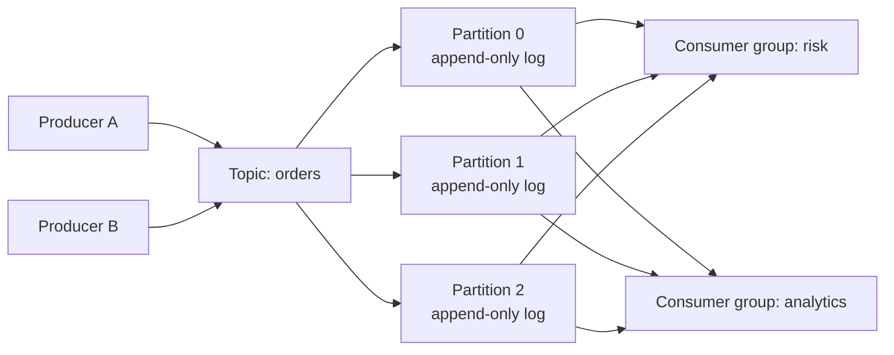

Kafka 适合：

- 事件流、日志汇聚和数据管道；
- 需要多路独立消费的业务事实；
- 以 partition 为状态所有权边界的流处理；
- 需要重放、回溯和审计的数据链路；
- Kafka-to-Kafka 的事务式流处理。

Kafka 不是：

- 跨 partition 自动提供全局总序的数据库日志；
- 任意外部数据库副作用的 exactly-once 魔法层；
- 无需 schema、幂等和容量治理的“消息黑洞”；
- 低延迟 RPC、分布式锁或协调服务；
- 只靠副本数就能替代备份和跨区域灾备的系统。

## 2. Topic、Partition、Key 与 Offset

### 2.1 Partition 同时是顺序、复制和并行的基本单元

一个 topic 被切分成多个 partition。每个 partition 是独立的有序日志，拥有自己的 Leader、副本集合和 offset 空间。

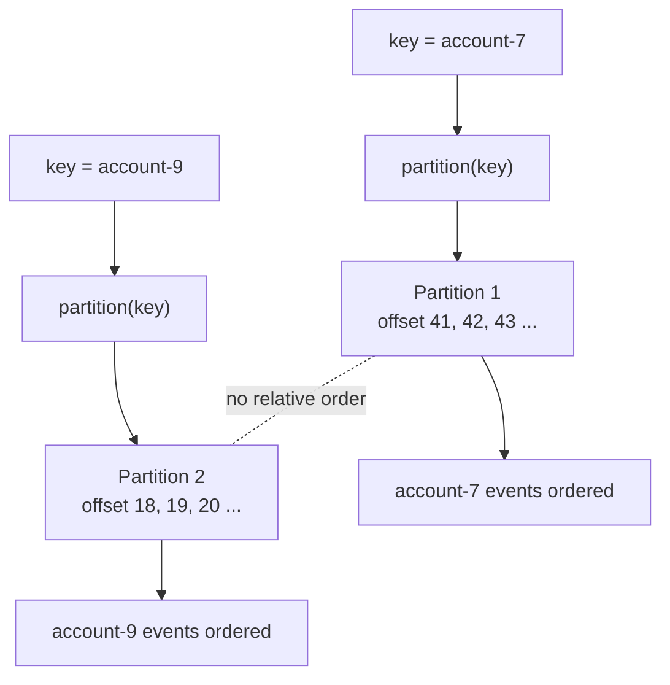

这带来三个必须同时考虑的设计决定：

1. **顺序边界**：同一个业务实体需要顺序时，应稳定进入同一个 partition。
2. **并行上限**：普通 consumer group 中，一个 partition 同一时刻只由一个成员负责，因此活跃消费者数量通常受 partition 数限制。
3. **故障与迁移成本**：partition 是副本、Leader 选举、重分配、tiered storage 和 lag 监控的单位。

不要先拍脑袋创建 500 个 partition，再问 key 应该如何路由。正确顺序是：先定义业务顺序域和峰值吞吐，再决定 partition 数、key schema 与扩容路径。

### 2.2 Key 不是普通标签，而是状态所有权协议

未显式指定 partition 时，有 key 的 record 通常按 key 选择 partition。这样相同 key 在 partition 数不变、分区逻辑不变的条件下会落到同一 partition。

```text
topic + serialized key + partitioning rule + partition count
                    ↓
              selected partition
```

这里有几个常见陷阱：

- 增加 partition 会改变许多 key 的映射，不能假设同一 key 永远留在旧 partition；
- 修改 key serializer、字符编码或自定义 partitioner，同样会改变映射；
- `null` key 更适合无状态、无需 key locality 的流量，不能依赖它构建实体顺序；
- 热 key 会把一个 partition 打满，即使 topic 总体还有大量空闲能力；
- 只把 tenantId 当 key，可能让大租户成为热点；随意加随机后缀又会破坏单实体顺序。

业务应把“同一 key 的先后关系”“是否允许迁移”“扩 partition 后如何过渡”写进 topic contract，而不是留给 producer 默认值决定。

### 2.3 Offset 是位置，不是业务序号

offset 只在 `(topic, partition)` 内有意义。下面三个值完全不同：

```text
orders-0@42
orders-1@42
payments-0@42
```

它也不应被当成连续的业务事件号。日志压缩会删除旧 key 的 record，事务控制记录也会占用日志位置，所以 consumer 看到的 offset 可以跳跃。正确用途是：

- 标识 partition 内的日志位置；
- 保存 consumer 恢复点；
- 对重放范围做定位；
- 与 leader epoch 等信息一起辅助故障诊断。

如果业务必须验证“每个订单事件 1001、1002、1003 一个都不能缺”，仍要在 payload 中维护业务序列域，并使用下一章的 Gap 恢复协议。Kafka offset 无法替代它。

## 3. Broker 磁盘里不是“一条消息一个文件”

### 3.1 Record Batch 是端到端效率的核心

Producer 会把同一 partition 的多条 record 聚合成 batch。batch 在客户端压缩后，经 broker 校验并以批次形式写入日志，再以批次形式被 consumer 拉取和解压。

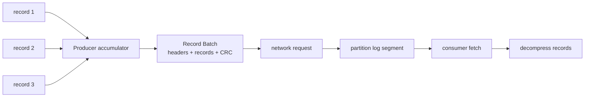

批处理同时降低网络往返、系统调用、磁盘小写入和压缩冗余。它解释了为什么下列参数不能孤立调：

| 参数 | 主要作用 | 代价与边界 |
| --- | --- | --- |
| `batch.size` | 单 partition batch 的目标容量 | 太小降低吞吐；不是“必须攒满才发送” |
| `linger.ms` | 给 batch 留出聚合时间 | 增加少量排队延迟以换吞吐 |
| `compression.type` | gzip/snappy/lz4/zstd 等批次压缩 | 节省网络与磁盘，但消耗 CPU |
| `buffer.memory` | producer 待发送缓存总量近似上限 | 下游变慢时可能阻塞 send |
| `delivery.timeout.ms` | 一条 record 从 send 到成功/失败的总时间预算 | 应覆盖 linger、请求等待和重试 |
| `max.request.size` | producer 单请求大小边界 | 还必须与 broker/topic 的消息大小限制协调 |

不要通过把 `linger.ms` 调大来掩盖 broker 过载，也不要在没有压测的情况下把 batch 和 request 上限扩大十倍。大 batch 会增加尾延迟、内存占用和失败重试成本。

### 3.2 Segment、索引与 Page Cache

partition 日志由多个 segment 组成，活跃 segment 追加写，旧 segment 在滚动后成为保留、压缩和远程上传的处理单位。每个 segment 有日志文件和稀疏索引；查找 offset 时先定位 segment，再通过索引缩小扫描范围。

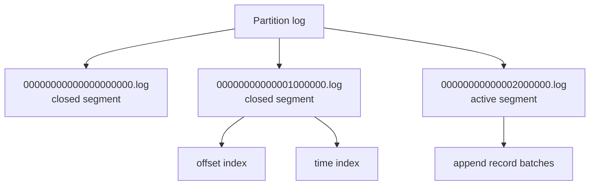

Kafka 大量利用顺序 I/O 和操作系统 page cache。被频繁读取的热数据通常直接从 page cache 服务；非 TLS 路径还可以利用 `sendfile` 减少文件到 socket 的用户态复制。TLS 需要在用户态处理加密，不能把“Kafka 零拷贝”理解为所有配置下都没有复制。[官方 Design](https://kafka.apache.org/43/design/design/) · [Log Implementation](https://kafka.apache.org/43/implementation/log/)

### 3.3 写入 page cache 不等于任意硬件故障下都已落盘

Kafka 的耐久模型依赖复制，而不是每条消息都在响应前对 Leader 磁盘做一次同步 `fsync`。[WAL 章节](/signal-grid-blog/posts/write-ahead-log-durability-and-crash-recovery/) 解释的是通用本地持久边界；这里必须再叠加 Kafka 的 ISR 与 ACK 协议。所以：

- `acks` 与 ISR 决定 producer 观察到的复制确认；
- replica 所在 rack、磁盘和故障域决定“多个副本”是否真的独立；
- 操作系统、磁盘控制器和云盘语义仍影响节点级持久性；
- 复制保护的是在线副本故障，不是误删 topic、错误程序写坏数据或跨区域灾难。

## 4. Producer 发送热路径

### 4.1 `send()` 通常只是把 record 放入客户端管线

`KafkaProducer` 是线程安全的，通常应跨业务线程共享一个实例。`send()` 会序列化 key/value、选择 partition、进入 accumulator，并由后台 Sender 线程获取 metadata、建立连接、发送批次与处理响应。

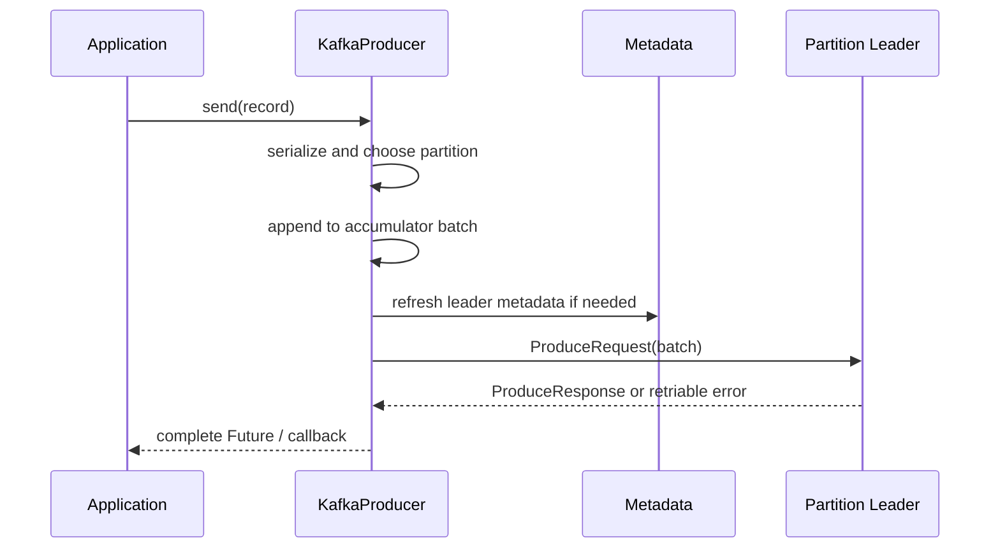

这意味着：

- `send()` 返回不等于 broker 已确认；
- callback 不应执行阻塞 I/O；
- `Future.get()` 每条都等待会把异步批处理退化为串行 RPC；
- 进程退出前应有界地 `flush()` / `close()`，但不能无限等待；
- callback 的成功只证明 Kafka 写入协议成功，不证明外部数据库事务也成功。

一个保守的生产基线示例：

```java
Properties props = new Properties();
props.put(ProducerConfig.BOOTSTRAP_SERVERS_CONFIG, "kafka-a:9093,kafka-b:9093");
props.put(ProducerConfig.KEY_SERIALIZER_CLASS_CONFIG, StringSerializer.class);
props.put(ProducerConfig.VALUE_SERIALIZER_CLASS_CONFIG, ByteArraySerializer.class);

props.put(ProducerConfig.ACKS_CONFIG, "all");
props.put(ProducerConfig.ENABLE_IDEMPOTENCE_CONFIG, true);
props.put(ProducerConfig.COMPRESSION_TYPE_CONFIG, "zstd");
props.put(ProducerConfig.LINGER_MS_CONFIG, 5);
props.put(ProducerConfig.DELIVERY_TIMEOUT_MS_CONFIG, 120_000);

try (KafkaProducer<String, byte[]> producer = new KafkaProducer<>(props)) {
    ProducerRecord<String, byte[]> record =
        new ProducerRecord<>("orders", order.accountId(), encode(order));

    producer.send(record, (metadata, error) -> {
        if (error != null) {
            deliveryFailures.record(record, error);
        }
    });
}
```

这些参数仍必须与 topic 的 replication factor、`min.insync.replicas`、消息上限和业务超时共同评审。

### 4.2 `acks=0 / 1 / all` 到底在确认什么

| `acks` | Leader 行为 | 主要风险 |
| --- | --- | --- |
| `0` | producer 不等待 broker 响应 | 甚至无法确认 broker 是否收到，自动重试也缺少可靠反馈 |
| `1` | Leader 本地追加后响应，不等待 follower | Leader 在复制前故障可能丢失已确认记录 |
| `all` | 等待当前 ISR 的全部副本确认 | ISR 过小仍可能只有一个副本；需要 `min.insync.replicas` 共同约束 |

最容易写错的一句话是：`acks=all` 等于“多数副本确认”。它实际等待的是**当时 ISR 中的全部副本**。如果 replication factor 是 3、ISR 只剩 Leader 一个，且 `min.insync.replicas=1`，写入仍可能成功。

常见耐久配置是：

```text
replication.factor = 3
min.insync.replicas = 2
producer acks = all
unclean leader election = disabled
replicas placed across independent racks / zones
```

此时可容忍一个副本暂时离开而继续写；若 ISR 低于 2，系统宁可拒绝写入，也不把单副本写入伪装成高耐久成功。这个选择牺牲一部分可用性来保护已确认数据。

### 4.3 幂等 Producer 的能力边界

Kafka 4.3 中 `enable.idempotence` 在没有冲突配置时默认启用，并要求：

- `acks=all`；
- `retries > 0`；
- `max.in.flight.requests.per.connection <= 5`。

broker 通过 producer ID、producer epoch 和 partition 内 batch sequence 去除 producer 自动重试造成的重复，并在允许的 in-flight 范围内保持顺序。[官方 Producer Configs](https://kafka.apache.org/43/configuration/producer-configs/)

生产配置仍建议显式写出 `enable.idempotence=true`，并在启动期校验组合参数。若未显式开启，却又设置了与幂等冲突的参数，客户端可能禁用幂等；显式开启而参数冲突时才会直接抛出 `ConfigException`。另外，Kafka 4.x 的 `linger.ms` 默认值已不是许多旧教程中的 0，而是 5 ms，迁移压测时应以实际客户端版本配置为准。

但它不保证：

- 应用收到超时后创建一条新业务命令重发不会重复；
- producer 重启并使用全新身份后仍识别旧业务事件；
- 同一业务同时由两个不同 producer 发送只保留一份；
- Kafka 记录和数据库写入自动成为一个事务；
- 消费者的副作用 exactly-once。

因此 payload 仍应携带稳定的 `eventId` / `commandId`，下游仍需要业务幂等键。

## 5. 数据副本：Leader、Follower、ISR、HW 与 Leader Epoch

### 5.1 一个 partition 的副本链路

每个 partition 在任一时刻有一个数据 Leader。Producer 和普通 consumer 与 Leader 交互；Follower 持续向 Leader fetch 数据并追赶日志。

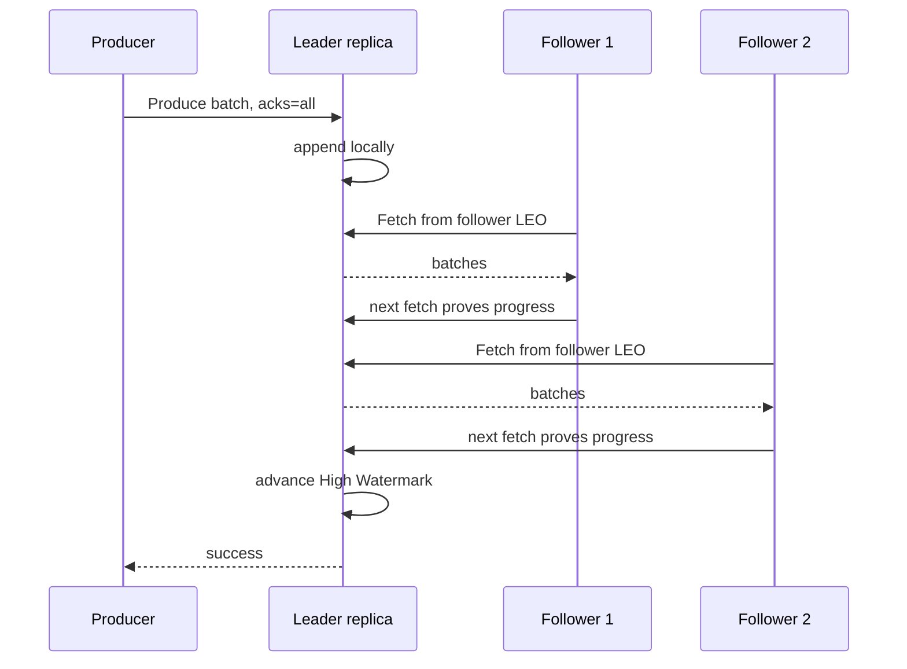

Follower 不是由 Leader 主动 push；它通过 fetch 复制。Leader 根据副本进度维护 ISR，并推进可见边界。

### 5.2 四个位置不要混用

| 位置 | 含义 | 读法 |
| --- | --- | --- |
| LEO / log end offset | 本地日志下一条可追加位置 | 每个副本各有自己的值 |
| High Watermark / HW | 已被所有 ISR 覆盖的稳定前缀边界 | 普通 consumer 只读取 offset `< HW` |
| LSO / last stable offset | 第一个未完成事务的位置边界 | `read_committed` 只读取 offset `< LSO` |
| committed consumer offset | consumer group 下次恢复应读取的位置 | 应提交“下一条待处理 offset” |

LSO 通常不高于 HW。若前面存在长时间未完成的事务，后面的已写记录即使已复制到 HW，也会暂时对 `read_committed` consumer 不可见。

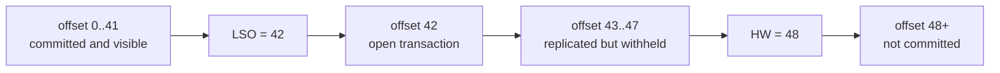

### 5.3 ISR 不是“所有配置副本”

ISR 是当前保持同步资格的副本集合，包含 Leader。Follower 若在时间窗口内无法持续追赶，会被移出 ISR；恢复并追上后可重新加入。

因此必须区分：

```text
replication factor = 配置了多少副本
ISR size          = 现在有多少副本保持同步
min ISR           = acks=all 写入允许成功所需的同步副本下限
```

只看 replication factor=3 而不看 ISR，是典型的虚假安全感。一个长期卡在 ISR=1 的三副本 topic，本质上已接近单副本运行。

### 5.4 Leader Epoch 防止旧历史被当成新历史

每次 Leader 变更都会关联新的 leader epoch。Follower 追赶或 consumer 恢复时，可以用 epoch 信息判断某个 offset 是否仍属于当前权威历史，并在需要时截断分叉尾部。

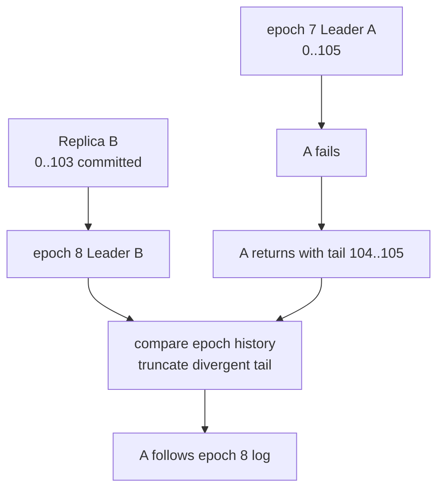

这也解释了为什么只保存一个裸 offset 不够完成所有一致性判断。对需要长期恢复的工具或外部 checkpoint，最好同时保存 topic ID / partition、offset、leader epoch 和业务 schema 版本。

### 5.5 Unclean Leader Election 是明确的数据取舍

若所有 ISR 都不可用，让落后的非 ISR replica 成为 Leader 可以更快恢复可用，但它可能缺少已经确认的记录。默认应保持 unclean leader election 禁用；如果某个极端场景明确选择可用性优先，必须把潜在数据丢失写入业务 SLO，而不是把开关当普通故障恢复参数。

### 5.6 Eligible Leader Replicas 不是把所有落后副本都变安全

Kafka 4.0 引入 Eligible Leader Replicas（ELR），新集群从 4.1 起默认启用。它在严格 `min.insync.replicas` 规则下追踪一组虽然不在当前 ISR、但仍可能安全接任的副本；Controller 选 Leader 时依次考虑 ISR、ELR，再在特定边界考虑最后已知 Leader。

ELR 改善了某些 ISR 收缩后的恢复能力，但并没有取消 RF、min ISR、rack awareness、磁盘可靠性和 unclean election 的设计责任。启用后，`min.insync.replicas` 的集群级管理也有额外约束，升级和修改前应按官方 runbook 验证。[官方 Eligible Leader Replicas](https://kafka.apache.org/43/operations/eligible-leader-replicas/)

## 6. KRaft：元数据 Quorum 与数据副本是两套协议

Kafka 4.3 只支持 KRaft。KRaft Controller 通过独立的 metadata quorum 管理：

- broker 注册、存活与 fencing；
- topic、partition 和 replica assignment；
- partition Leader 与 ISR/ELR 变化；
- 配置、ACL 和 feature level 等元数据；
- controller membership。

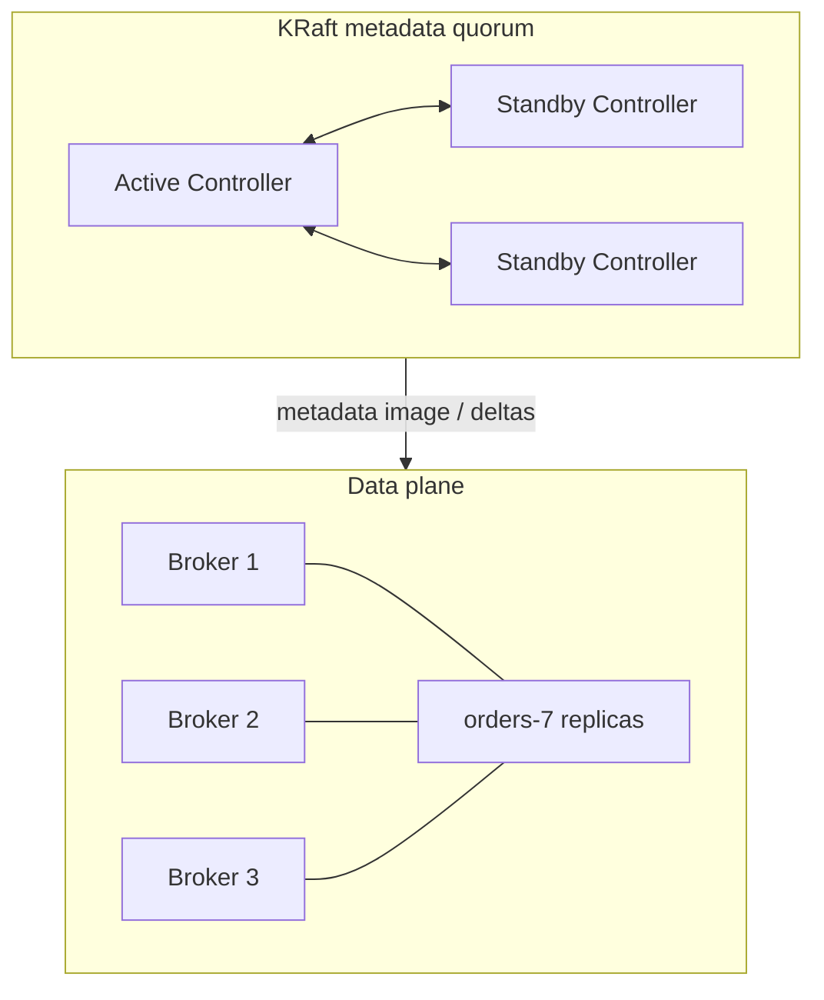

不要混淆两个 quorum：

| Quorum / 集合 | 决定什么 | 故障影响 |
| --- | --- | --- |
| KRaft controller majority | 集群元数据能否继续变更、故障能否选出 Active Controller | 失去多数后控制面不能正常推进 |
| partition ISR / ELR | 某个数据 partition 的复制、可见性和 Leader 候选 | 只影响相应 partition 的写入与选主 |

三个 controller 能容忍一个 controller 故障，不代表所有 topic 自动拥有三个数据副本；反过来，topic RF=3 也不能替代 controller majority。

### 6.1 生产环境分离 Controller 与 Broker

KRaft 用 `process.roles` 指定 `broker`、`controller` 或组合模式。组合进程便于开发环境，但官方不建议关键生产部署使用，因为 controller 无法与数据流量独立扩缩、滚动和隔离资源。

```properties
# controller node
process.roles=controller
node.id=1
listeners=CONTROLLER://controller-1:9093
controller.listener.names=CONTROLLER
controller.quorum.bootstrap.servers=controller-1:9093,controller-2:9093,controller-3:9093
```

Kafka 4.1+ 支持 dynamic controller quorum（KRaft feature level 1）；它使用 `controller.quorum.bootstrap.servers` 发现 quorum，并可通过工具安全增删 controller。旧 static quorum 仍使用 `controller.quorum.voters`。两种模式不能凭配置片段猜，应先用 `kafka-features.sh --bootstrap-controller ... describe` 确认 `kraft.version`。[官方 KRaft Operations](https://kafka.apache.org/43/operations/kraft/)

### 6.2 Metadata Snapshot 不是业务数据备份

KRaft metadata log 与 snapshot 保存的是集群元数据状态，不包含所有 topic record。即使 metadata quorum 健康，broker 数据盘误删仍会丢业务记录；即使 topic 副本健康，误删 topic 的元数据操作也会传播到集群。

生产恢复计划至少要分别覆盖：

- controller quorum 的元数据故障；
- broker / disk / rack 故障；
- 操作员误删与错误配置；
- 应用发布错误写入大量坏事件；
- 区域级故障和跨集群恢复。

## 7. Consumer：位置、拉取与处理循环

### 7.1 Consumer 是 Pull 模型

Consumer 向 partition Leader 发 FetchRequest，并携带希望从哪个 offset 开始读取。Broker 可以长轮询等待更多数据，以避免无数据时忙循环，同时利用批量传输提高效率。

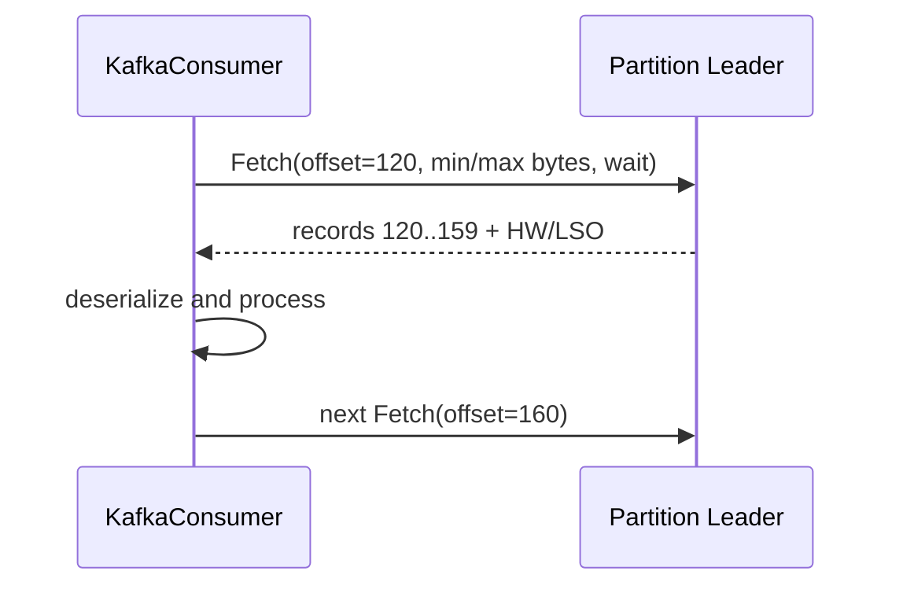

Consumer 拥有两种容易混淆的位置：

- **position**：当前实例下一次 fetch / poll 将继续的位置；poll 后会前进；
- **committed offset**：group coordinator 保存的恢复点，重启或重新分配时使用。

如果已经处理 offset 41，正确提交值通常是 42：

```text
processed record offset = 41
next record to process   = 42
committed offset         = 42
```

### 7.2 `KafkaConsumer` 不是多线程共享对象

除 `wakeup()` 等明确例外外，`KafkaConsumer` 不是线程安全的。常见安全模型有两种：

1. poll 与处理在同一线程，批次有界，逻辑简单；
2. poll 线程把任务交给 worker，但按 partition 维护有界队列、完成游标、pause/resume 和 revoke 协议。

第二种绝不能“poll 后随手丢线程池，再按最高返回 offset commit”。worker 完成顺序可能不同，提交越过未完成记录会造成永久跳过。

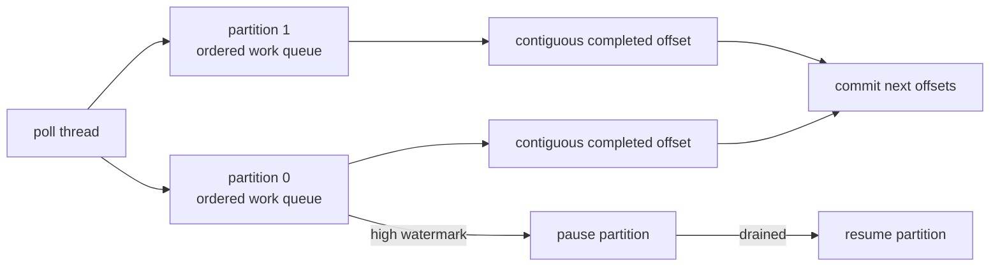

### 7.3 手动提交的最小安全循环

同步处理、at-least-once 的基础写法：

```java
consumer.subscribe(List.of("orders"));

while (running) {
    ConsumerRecords<String, byte[]> records = consumer.poll(Duration.ofMillis(500));

    for (TopicPartition partition : records.partitions()) {
        List<ConsumerRecord<String, byte[]>> partitionRecords = records.records(partition);

        for (ConsumerRecord<String, byte[]> record : partitionRecords) {
            processIdempotently(record);
        }

    }

    // nextOffsets 保存各 partition 的下一条位置，并携带可用的 leader epoch。
    consumer.commitSync(records.nextOffsets());
}
```

它仍有一个明确窗口：业务已处理、offset 尚未提交时进程崩溃，重启后会重复处理。因此 `processIdempotently` 不是装饰词；若副作用在数据库，应使用唯一业务键、inbox 表或同库事务把处理结果和消费 checkpoint 一起提交。这个循环还要求 `enable.auto.commit=false`，否则自动提交会建立另一条与业务完成无关的 checkpoint 路径。

### 7.4 Auto Commit 不是自动 exactly-once

`enable.auto.commit=true` 只让客户端周期性提交消费位置。它不知道：

- 业务线程是否处理完成；
- 数据库事务是否成功；
- 异步任务是否仍在排队；
- 某个 partition 是否已被 pause；
- revoke 前是否已完成最后一批副作用。

简单日志打印可以接受 auto commit；有状态或有副作用的 consumer 应显式定义提交边界。

## 8. Consumer Group 与再均衡

### 8.1 Group 在做的是 Partition Ownership 转移

同一 consumer group 内，每个 partition 同一时刻分配给一个普通 consumer。不同 group 彼此独立。

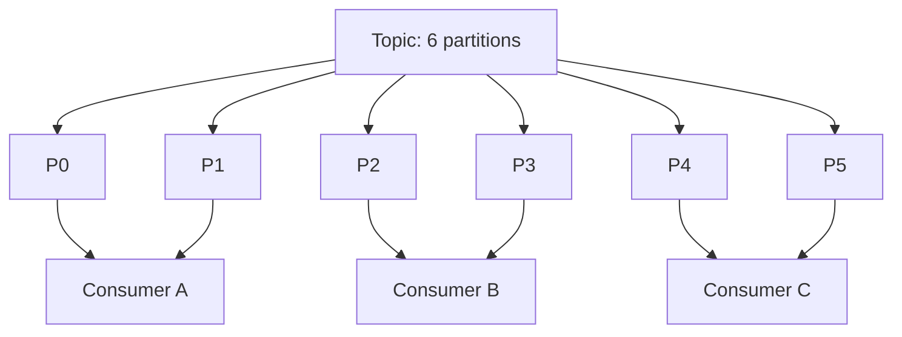

当成员加入、离开、超时，订阅 topic 的 partition 变化，或 group 协议需要更新 assignment 时，会发生再均衡。再均衡不是纯粹的负载均衡动画，而是有状态所有权转移：旧 owner 必须停止、提交安全位置、交出分区；新 owner 从 committed offset 恢复。

### 8.2 Classic 与新 Consumer Protocol

Kafka 4.0 起，KIP-848 新一代 Consumer Rebalance Protocol 已 GA。Broker 端默认具备能力，但 Kafka 4.3 client 仍需显式设置：

```properties
group.protocol=consumer
```

两种协议的关键差异：

| 维度 | Classic protocol | Consumer protocol |
| --- | --- | --- |
| 默认状态 | Kafka 4.3 client 默认 | 需 `group.protocol=consumer` |
| assignment 计算 | 成员侧 leader / assignor 参与 | broker-side assignor |
| 再均衡方式 | 可能依赖全局同步阶段 | fully incremental，无全局同步屏障 |
| heartbeat / session timeout | 主要由 client 配置 | 由 broker group configs 控制 |
| 自定义 client assignor | 可用 | 当前不支持自定义 client-side assignor |
| 正则订阅 | client 侧 pattern 模型 | 新 API 可在 server 侧用 RE2J 评估 |

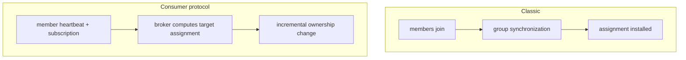

升级可以停组后切换，也可以在满足限制时滚动迁移；不能只在一台 consumer 上改配置就假设所有旧自定义 metadata 与 assignor 都兼容。应先在非关键 group 验证 assignment、rebalance latency、lag 和 revoke 行为。[官方 Consumer Rebalance Protocol](https://kafka.apache.org/43/operations/consumer-rebalance-protocol/)

Classic 也不等于永远“全停式”再均衡：它可以使用 `CooperativeStickyAssignor` 做增量式迁移。Kafka 4.3 的 classic 默认 assignor 列表仍把 `RangeAssignor` 放在前面，实际默认行为不会仅因列表里同时存在 cooperative assignor 就自动变成 cooperative；迁移时需要按官方方式滚动调整 assignor。新 Consumer protocol 的 fully incremental 模型则是协议本身的能力，二者不要混为一谈。

### 8.3 Static Membership 只减少无谓迁移，不是永久租约

配置稳定唯一的 `group.instance.id` 可以让短暂重启保留成员身份，减少大量 state 迁移。但它不意味着：

- 同一个 ID 可以同时启动两个实例；
- 进程失联后永不被回收；
- 新 owner 不需要恢复状态；
- 外部副作用不需要 fencing。

部署系统必须确保 instance ID 与实例身份稳定绑定，并处理重复实例被 fence 的错误。

### 8.4 `max.poll.interval.ms` 保护的是应用活性

若应用过久不调用 `poll()`，coordinator 会认为它无法继续可靠处理 assignment，并触发所有权转移。简单把 `max.poll.interval.ms` 调成一小时，只是让故障发现变慢。

更好的设计是：

- 限制 `max.poll.records`；
- 把单条任务拆成可检查进度的小步骤；
- 对异步 worker 使用 pause/resume 和有界队列；
- 在 revoke 时停止接收新任务、等待有界 drain、提交连续完成位置；
- 超过 drain 预算就放弃未完成任务，让新 owner 重放。

## 9. 从 Offset 提交推导投递语义

Kafka 的 producer 耐久性和 consumer 处理语义是两个问题。不能因为 producer 幂等，就宣布整个链路 exactly-once。

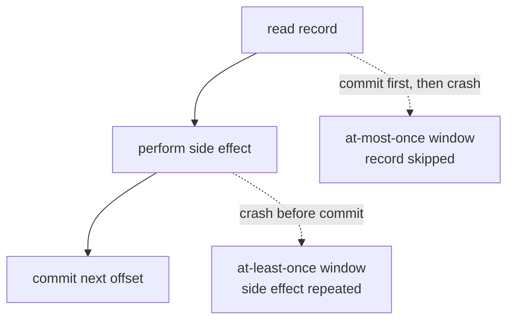

| 模式 | 典型顺序 | 结果 |
| --- | --- | --- |
| at-most-once | 先 commit offset，再处理 | 处理失败时可能丢业务效果，不会因该窗口重放 |
| at-least-once | 先处理，再 commit offset | 不轻易漏，但崩溃窗口会重复 |
| Kafka EOS | 输出记录与输入 offset 在同一个 Kafka transaction 中提交 | Kafka-to-Kafka 原子；下游需 `read_committed` |
| 外部幂等 | 业务 effect 按 eventId / commandId 去重 | 可把重复投递变成“效果一次” |
| 外部原子 checkpoint | 数据库 effect 与 next offset 在同一数据库事务 | 恢复时从该 checkpoint seek；不使用 group offset 作为唯一真相 |

网络超时还有“结果未知”：producer 或 consumer 发出请求后连接断开，不能仅凭客户端没收到响应推断服务端没执行。重试必须是协议的一部分。

## 10. Kafka Transaction 与 Exactly-Once 的真实边界

### 10.1 Idempotence 与 Transaction 不是一回事

幂等 producer 解决单 producer session 内自动重试的重复批次；transaction 则把多个 partition 的输出和消费 offset 组成一个原子提交单元。

配置稳定、唯一的 `transactional.id` 后，producer 获得跨 session 的事务身份。新实例初始化相同 transactional ID 时会 fence 旧 producer，防止两个实例同时提交同一身份的事务。

### 10.2 Consume → Transform → Produce 的原子链路

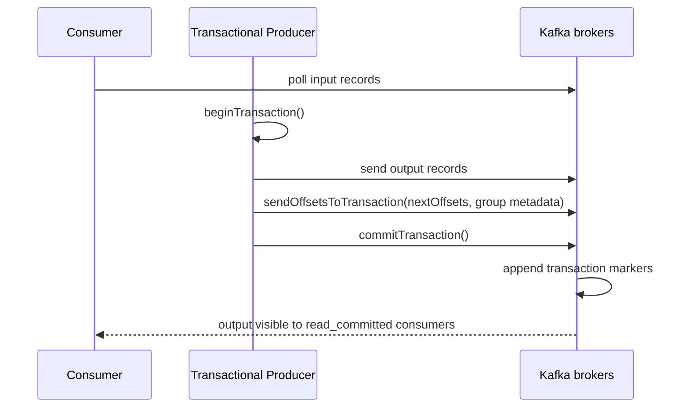

```java
producer.initTransactions();

while (running) {
    ConsumerRecords<String, byte[]> records = consumer.poll(Duration.ofMillis(500));
    if (records.isEmpty()) {
        continue;
    }

    producer.beginTransaction();
    try {
        for (ConsumerRecord<String, byte[]> record : records) {
            for (ProducerRecord<String, byte[]> output : transform(record)) {
                producer.send(output);
            }
        }

        producer.sendOffsetsToTransaction(
            records.nextOffsets(),
            consumer.groupMetadata());
        producer.commitTransaction();
    } catch (RuntimeException failure) {
        producer.abortTransaction();
        throw failure;
    }
}
```

`abortTransaction()` 不会自动把 consumer 已被 `poll()` 推进的内存 position 倒回 committed offset。上例抛出异常并重建处理循环；若应用选择在原进程继续运行，就必须在 abort 后显式恢复各 partition 的读取位置。遇到 producer fencing 或其他致命事务错误时，应关闭并重建 producer，而不是无限重试同一实例。

输出 consumer 必须设置：

```properties
isolation.level=read_committed
```

否则 `read_uncommitted` consumer 仍会看到被 abort 的事务记录。

### 10.3 LSO 与长事务

`read_committed` 按 offset 顺序返回。若 offset 42 属于未完成事务，即使 43–100 的其他记录已经复制，consumer 也不能越过它；LSO 会停在第一个 open transaction 位置。这会让“复制正常但 read_committed lag 上升”。

所以要监控：

- transaction start 到 commit/abort 的延迟；
- transaction coordinator 错误；
- producer fencing；
- open transaction 导致的 LSO-HW gap；
- transaction timeout 与处理批次时间。

不要用超长 transaction 包住几分钟的外部 HTTP 调用。

### 10.4 Exactly-Once 只覆盖 Kafka 管理的原子边界

Kafka transaction 可以原子地：

- 向多个 Kafka partition 写记录；
- 同时提交 consumer group 的输入 offsets。

它不能自动原子地包含：

- MySQL / PostgreSQL 更新；
- Redis、对象存储或搜索索引；
- HTTP、支付、邮件或链上交易；
- 任意另一个 Kafka cluster。

常见解决方式：

1. **Transactional Outbox**：数据库业务变更与 outbox 行同库提交，再由 CDC/relay 发 Kafka。
2. **Idempotent Inbox**：consumer 在业务数据库用唯一 eventId 记录已处理事件，与业务更新同事务。
3. **Kafka-first State**：把权威变换保持在 Kafka Streams / Kafka transaction 内，外部投影允许重建。
4. **业务 Saga / 补偿**：显式建模不可原子外部步骤及其结果未知。

Kafka 4.0 起的 Transactions Server-Side Defense 会强化 producer epoch 与事务边界，但它仍不会把外部数据库拉入 Kafka transaction。[官方 Transaction Protocol](https://kafka.apache.org/43/operations/transaction-protocol/) · [官方 Design：Using Transactions](https://kafka.apache.org/43/design/design/#using-transactions)

## 11. Retention 与 Log Compaction 是两种不同问题

### 11.1 Delete Policy：按时间或空间回收历史

`cleanup.policy=delete` 根据保留时间或空间预算让旧 segment 进入删除流程。要注意：

- 删除以 segment 为粒度，不保证某条记录到点即删；
- active segment 不会立刻被删；
- consumer 是否已读完不会阻止 retention；
- 落后超过保留窗口会遇到 offset out of range；
- retention 是容量策略，不是合规级不可恢复删除证明。

### 11.2 Compaction：按 Key 保留较新的状态

`cleanup.policy=compact` 让后台 cleaner 删除同一 key 的旧值，但保持剩余记录的相对顺序与原 offset。

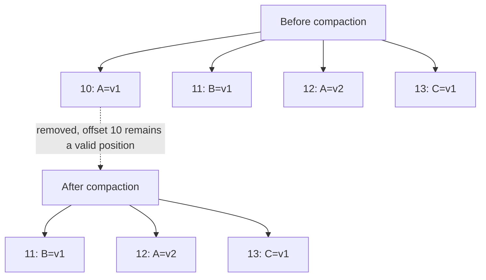

压缩不会把 offset 重新编号。consumer 从 offset 10 读取时，可能直接拿到 11 或更高位置，因此 offset 不能假设连续。

### 11.3 Tombstone 与删除语义

key 非空、value 为 `null` 的 record 是 tombstone。Cleaner 会删除该 key 的旧值，tombstone 自身在 `delete.retention.ms` 后也可被清理。

这意味着重建完整状态的 consumer 必须在 tombstone 保留窗口内追到日志头，否则它可能只看到“没有这个 key”，却不知道这是从未存在还是已经删除。对长时间离线的缓存重建，需评估 tombstone 保留、快照和 bootstrap 方案。

### 11.4 `compact,delete` 是组合策略

组合策略同时按 key 压缩、按整体保留预算删除旧 segment。它不是“永远保留每个 key 的最终值”；delete retention 仍可能把整段历史移除。

官方保证的核心是：compaction 不重排剩余记录、不改变 offset，且及时跟上 head 的 consumer 能看到写入流；它不是立即发生，也不是数据库唯一约束。[官方 Log Compaction](https://kafka.apache.org/43/design/design/#log_compaction)

## 12. Tiered Storage：本地热层与远程历史层

Tiered Storage 将已关闭 segment 上传到远程存储，使 broker 本地磁盘主要保留热数据，历史 fetch 可从远程层读取。

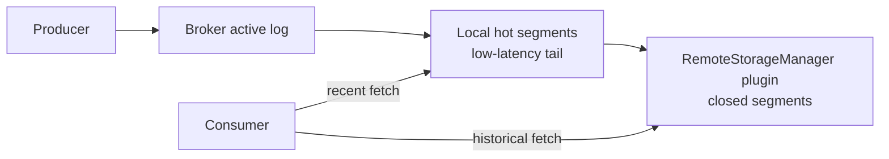

Kafka 4.3 的重要边界：

- broker 级 `remote.log.storage.system.enable` 默认关闭；
- topic 还要设置 `remote.storage.enable=true`；
- Kafka 提供 SPI，但**不内置可直接使用的远程存储后端实现**，需要部署 `RemoteStorageManager` 插件；
- 本地 retention 与总 retention 是不同预算；
- 目前不支持 compacted topic；
- 在 broker 级关闭前，必须先对所有启用 topic 正确停用；
- 远程读取延迟、对象存储限流、请求成本和插件兼容性都要进入 SLO。

Tiered Storage 减少本地历史容量压力，但不是备份：删除 topic、错误 retention 或控制面操作仍可能驱动远程对象被删除。灾备必须独立设计。[官方 Tiered Storage](https://kafka.apache.org/43/operations/tiered-storage/)

## 13. Share Group：Kafka 4.3 的工作队列式消费模型

传统 consumer group 以 partition 为所有权单位，适合需要 partition 顺序和状态局部性的处理。Share Group 则允许同一 partition 的 record 被多个 share consumer 协作处理，消费者数可以超过 partition 数。

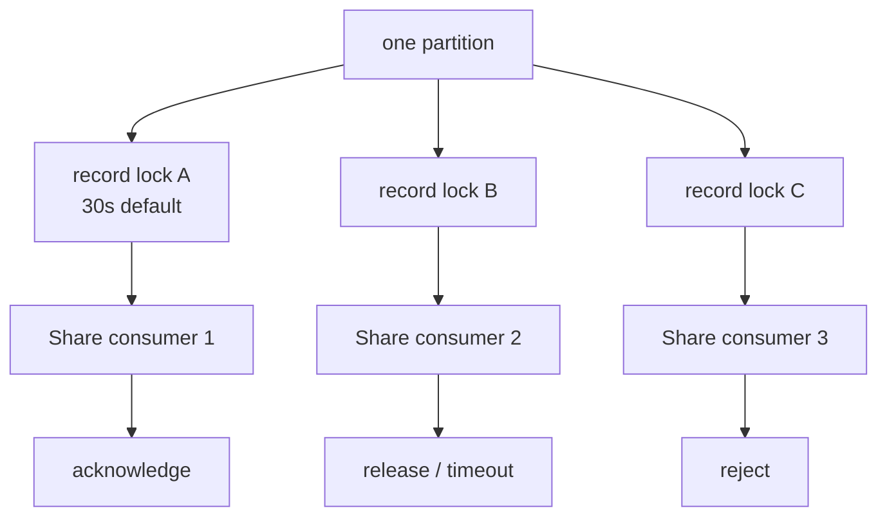

Share consumer 对已获得的 record 可以：

- acknowledge：处理成功；
- release：主动释放，允许再次投递；
- reject：标记不可处理，停止继续投递；
- renew：延长 acquisition lock；
- 什么也不做：锁到期后自动释放。

Broker 会记录 delivery attempt，并用每 partition 的 record lock 上限控制在途数量。这更接近共享工作池，但代价是：

- 不能再把 partition 当成单 consumer 独占状态机；
- record 的完成顺序可能不同于日志顺序；
- 业务仍要处理重复、超时和 reject 策略；
- 需要独立的 `__share_group_state` 内部状态与运维监控；
- 不能把普通 `KafkaConsumer` 的 offset 直觉原样套用。

选择规则很简单：需要同 key 顺序、状态 store 或连续 offset 处理，优先普通 consumer group；任务彼此独立、单条耗时差异大且希望消费者数超过 partition 数时，再评估 Share Group。[官方 Design：Share Consumer](https://kafka.apache.org/43/design/design/#the-share-consumer) · [Group Configs](https://kafka.apache.org/43/configuration/group-configs/)

还要明确三条限制：Share Group 不提供普通 consumer group 的严格 partition 独占与完成顺序；它不支持把 record acknowledgement 放进 producer transaction，因此不能直接套用 Kafka EOS；它也不提供 static membership。Share Group 的 `read_committed` / `read_uncommitted` 是 group 级读取选择，默认仍是 `read_uncommitted`，open transaction 同样可能压住可见边界。

## 14. Schema、Topic Contract 与可演进性

Kafka 只保存 bytes 和少量 record metadata，不知道 JSON 字段是否兼容。一个可运维 topic 至少应明确：

| 契约项 | 必须回答的问题 |
| --- | --- |
| 业务语义 | 这是命令、事实事件、状态快照还是 CDC 变更？ |
| key | 顺序域和分区域是什么？允许 null 吗？ |
| value schema | 使用 Avro/Protobuf/JSON Schema 还是自定义 codec？ |
| compatibility | producer 与 consumer 如何滚动升级？ |
| timestamp | event time 还是 broker append time？时钟异常如何处理？ |
| headers | trace、tenant、schema hint 是否只是辅助元数据？ |
| retention | 最慢 consumer、重放和合规需要多久历史？ |
| cleanup policy | delete、compact 还是组合？tombstone 语义是什么？ |
| reliability | RF、min ISR、acks、幂等与 transaction 要求？ |
| ownership | 谁能创建、扩 partition、修改配置和删除 topic？ |

演进时应遵循“先让 reader 能读新旧格式，再让 writer 发送新格式”的兼容顺序。删除字段、改变 key 序列化或重解释枚举值，都可能比加字段危险得多。

不要把 schema version 只放在一个会被中间系统丢弃的 header 中；权威 decoder 应能从 payload envelope 或注册中心 ID 判断格式。

## 15. 容量与性能：从瓶颈方程开始

### 15.1 Partition 数不是越多越好

粗略下限可以从吞吐与并行度估算：

```text
partitions >= max(
  peak ingress bytes/s ÷ sustainable bytes/s per partition,
  required active consumer parallelism,
  independent ordering domains after sharding
)
```

再加增长余量，但也要计入 partition 的成本：

- 更多 Leader/Follower fetcher 与文件；
- 更大的 metadata、选举和重分配工作量；
- 更多 consumer assignment 和 checkpoint；
- 更长的故障恢复与运维操作时间；
- 更难均匀的热点分布。

### 15.2 磁盘和网络不是只算 Producer 流量

假设入口压缩后为 `W` bytes/s、RF 为 `R`、有 `G` 个全量 consumer group，粗略集群流量至少包含：

```text
leader append              ≈ W
replication network        ≈ W × (R - 1)
consumer egress            ≈ W × G
retention storage per day  ≈ W × 86400 × R
```

还未包含重新分配、落后副本追赶、远程上传/回读、压缩重写和协议开销。容量规划应使用压测后的压缩比、峰值系数与恢复带宽，而不是平均业务 payload 大小。

### 15.3 Consumer Lag 要换算成时间和恢复能力

`lag=1,000,000` 单独没有意义。100 万条每条 100B 与每条 1MB 完全不同。应至少同时看：

```text
record lag
byte lag
time lag = now - event/append time at committed position
catch-up rate = consume rate - produce rate
estimated recovery time = backlog bytes ÷ positive catch-up bytes/s
```

如果持续消费能力不高于持续入口速率，任何有限 backlog 最终都会增长，扩大 retention 只能推迟故障。

### 15.4 调优顺序

建议按以下证据链调优：

1. 检查 key / partition 是否热点；
2. 检查 broker 磁盘延迟、page cache、网络和请求队列；
3. 检查 batch、compression 和 request 大小分布；
4. 检查 follower lag、ISR 变化与重分配流量；
5. 检查 consumer 单条处理、GC、外部依赖和 pause/resume；
6. 最后再增加 partition、broker 或调整线程与缓存。

## 16. 安全与多租户不是一个 `SASL_SSL` 就结束

Kafka 安全要分三层：

1. **传输加密**：TLS 保护 client-broker、broker-broker 与 controller 链路。
2. **身份认证**：mTLS 或 SASL 机制识别 principal。
3. **授权**：ACL 决定 principal 能否 Read、Write、Create、Alter、Describe 等。

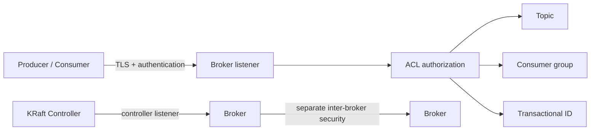

几个常见漏洞：

- 只开 SASL/PLAIN 却不用 TLS，凭据仍可能暴露；
- client listener、inter-broker listener 与 controller listener 共用错误的暴露范围；
- 只授权 topic，不授权 consumer group 或 transactional ID；
- 给应用 `Create` / `Alter` / `Delete` 集群级能力；
- 在日志、JMX、配置仓库和命令历史中泄露密码；
- 对公网开放未加固的 JMX remote；
- 没有 quota，单个 tenant 就能耗尽网络、请求线程或存储。

Kafka 支持带宽和 request-rate quota。多租户集群应按 user/client-id 设计配额、topic namespace、ACL 模板和紧急限流，而不是等事故发生再全局降速。[官方 Security Overview](https://kafka.apache.org/43/security/security-overview/) · [Quotas Design](https://kafka.apache.org/43/design/design/#quotas)

## 17. 生产监控：从“服务活着”升级到“日志仍可恢复”

### 17.1 Cluster 与 Controller

至少监控：

- 当前 active controller 与 controller 变化；
- KRaft metadata log end / high watermark 与 follower lag；
- metadata loader lag、event queue 延迟；
- broker fenced / unfenced 数量；
- offline partition、leader election、unclean election；
- controller quorum 是否仍有多数。

### 17.2 Data Replication

至少监控：

- under-replicated partitions；
- under-min-ISR partitions；
- ISR shrink / expand rate；
- replica fetch lag 与停滞；
- Leader 分布与 preferred replica imbalance；
- log directory failure、磁盘空间和磁盘延迟；
- reassignment 进度与 throttle 是否低于入口流量。

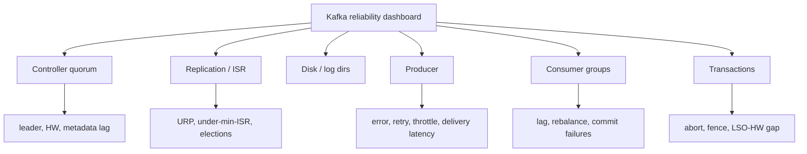

### 17.3 Producer 与 Consumer

Producer：

- record error / retry rate；
- request latency 与 delivery latency；
- batch size、records per request、compression ratio；
- buffer available bytes、buffer exhaustion；
- throttle time、metadata age 和 authentication errors。

Consumer：

- records/bytes consumed rate；
- fetch latency 与 throttle time；
- partition lag、time lag；
- commit latency / failure；
- assigned partition 数；
- rebalance 次数与耗时；
- poll 间隔、处理队列深度和 pause 时间。

官方 JMX remote 默认未启用；若通过环境变量启用，不能沿用无认证的开发配置暴露到不可信网络。[官方 Monitoring](https://kafka.apache.org/43/operations/monitoring/)

## 18. 故障诊断：按症状追因果

### 18.1 Producer 出现超时

检查顺序：

1. 是 metadata / DNS / TLS / authentication 失败，还是 ProduceRequest 超时？
2. 目标 partition 是否无 Leader、ISR 低于 min ISR？
3. broker request queue、磁盘或网络是否饱和？
4. batch 是否过大、消息上限是否不一致？
5. 是否处于 reassignment、磁盘故障或滚动升级？
6. delivery timeout 后，业务如何处理结果未知和重试幂等？

不要看到 timeout 就无限重试。无限重试会把 broker 故障变成 producer 内存和上游线程池故障。

### 18.2 Consumer Lag 只在部分 Partition 增长

优先怀疑：

- 热 key / 分区流量倾斜；
- 对应 worker 卡在慢外部依赖；
- poison record 重试无上限；
- partition Leader 所在 broker / disk 异常；
- 异步处理只按全局队列限流，没有按 partition pause；
- transaction LSO 被 open transaction 卡住。

### 18.3 ISR 反复 Shrink / Expand

可能原因包括：

- follower 磁盘或网络尾延迟；
- broker GC / CPU 饥饿；
- replication throttle 低于入口速率；
- 单 broker 承担过多 Leader；
- 机架或 AZ 网络抖动；
- 大规模 reassignment 与线上写入争抢资源。

先找无法持续追赶的资源瓶颈，不要第一时间放宽 replica lag 阈值把问题隐藏在 ISR 里。

## 19. 变更、扩容与升级 Runbook

### 19.1 Topic 变更

增加 partition 前必须回答：

- key 映射变化是否会破坏实体顺序？
- 旧状态 store 如何迁移？
- consumer 是否能处理同一 key 暂时跨 partition？
- compacted topic 的 bootstrap 和 repartition 计划是什么？

replication factor 和 replica placement 变更要用 reassignment 工具，并设置合理 throttle。完成后及时验证并移除 throttle；若 throttle 低于持续写入速率，迁移可能永远追不上。

### 19.2 Broker 滚动升级

Kafka 4.3 的基本顺序是：

```mermaid
flowchart LR
  A["确认已是 KRaft<br/>并满足来源版本要求"] --> B["备份配置与恢复信息"]
  B --> C["逐 broker 升级二进制"]
  C --> D["观察 controller, ISR, latency, clients"]
  D --> E["验证业务行为与性能"]
  E --> F["finalize feature level<br/>release-version 4.3"]
  F --> G["再次验证；确认降级边界"]
```

4.3 只支持 KRaft，ZooKeeper-mode cluster 必须先迁移。滚动升级二进制后，不要立即 finalize feature level；先验证控制面、生产消费、事务、Connect/Streams 和第三方 client。4.3 的 metadata 变更意味着 finalize 后不能简单假设可降级。[官方 Upgrade Guide](https://kafka.apache.org/43/getting-started/upgrade/)

### 19.3 Java 版本

Kafka 4.3 对 Java 17、21、25 有完整支持，Java 11 仅适用于部分 client/Streams 场景；broker/controller 不应继续按旧教程停留在 Java 11。升级 JDK 要单独观察 TLS provider、GC、direct/native memory 和 startup flags。[官方 Java Version](https://kafka.apache.org/43/operations/java-version/)

## 20. 跨集群灾备：复制不是备份

MirrorMaker 2 等跨集群复制可以异步镜像 topic、配置和消费位点映射，适合区域灾备和数据分发。但它通常不是同步共识：

- 故障时存在复制 lag，因此 RPO 可能大于 0；
- failover 时 topic 名、offset 映射和 consumer 切换要演练；
- 双向复制必须防循环；
- 目标集群容量、ACL、schema 和依赖服务要提前准备；
- 源端误删、坏事件和错误配置也可能被快速复制过去。

```mermaid
flowchart LR
  A["Region A Kafka"] -->|"async replication<br/>measured lag"| B["Region B Kafka"]
  APP["Consumer checkpoint"] --> MAP["offset translation / sync"] --> B
  OPS["Failover decision"] --> FENCE["fence Region A writers"] --> SWITCH["switch producers and consumers"]
```

真正的恢复设计应定义：

- RPO：最多允许丢多少时间或多少记录；
- RTO：多久恢复生产、消费和外部依赖；
- writer fencing：防止两个 region 同时成为权威；
- consumer recovery point：从哪里恢复，如何对账；
- 不可变备份或审计源：如何应对逻辑删除和污染；
- 定期演练：不是只看 MirrorMaker lag 为 0。

[官方 Geo-Replication](https://kafka.apache.org/43/operations/geo-replication-cross-cluster-data-mirroring/)

## 21. 一套可落地的设计检查表

### 数据与顺序

- [ ] 每个 topic 的业务语义、owner 和 schema 明确；
- [ ] key 与 partition 是按业务顺序域设计，而不是随手选字段；
- [ ] 明确没有跨 partition 总序；
- [ ] 业务连续性需要时，payload 有独立 sequence 与 epoch；
- [ ] 增加 partition 的迁移方案经过演练。

### 生产与复制

- [ ] RF、min ISR、acks、idempotence 与 rack placement 联合评审；
- [ ] 业务重试携带稳定 eventId；
- [ ] unclean leader election 的取舍明确；
- [ ] ISR、under-min-ISR 和磁盘故障有告警；
- [ ] 结果未知有幂等与对账流程。

### 消费与副作用

- [ ] 提交的是下一条待处理 offset；
- [ ] poll、worker、pause/resume 和 revoke 有明确协议；
- [ ] 选择 classic 或 consumer protocol，并验证迁移；
- [ ] 数据库等外部副作用有 inbox/outbox/幂等；
- [ ] poison record 有有界重试、隔离和人工恢复流程。

### 保留与恢复

- [ ] retention 大于最坏停机与重放时间；
- [ ] compacted topic 定义 tombstone 和 bootstrap；
- [ ] Tiered Storage 插件、远程成本和限制已验证；
- [ ] 跨集群 RPO/RTO、fencing、offset 切换经过演练；
- [ ] 复制与备份被当成两个不同能力。

### 运维与安全

- [ ] controller 与 broker 在生产隔离角色；
- [ ] TLS、认证、ACL、quota 分层配置；
- [ ] JMX 与管理工具只在受控网络开放；
- [ ] upgrade 在 finalize feature level 前有观察窗口；
- [ ] 恢复演练覆盖 broker、disk、controller、AZ、误删和坏发布。

## 22. 最后把整条因果链串起来

```mermaid
flowchart LR
  KEY["Business key"] --> PART["Partition<br/>order + ownership"]
  PART --> BATCH["Producer batch<br/>idempotent retry"]
  BATCH --> ISR["Leader + ISR<br/>HW commit boundary"]
  ISR --> LOG["Retained log<br/>segments / compaction / tier"]
  LOG --> GROUP["Consumer group<br/>assignment + position"]
  GROUP --> EFFECT["Idempotent or transactional effect"]
  EFFECT --> CHECK["Committed next offset<br/>replay + recovery"]
  KRAFT["KRaft metadata quorum"] --> PART
  KRAFT --> ISR
```

Kafka 的可靠性不来自某一个参数，而来自整条链：

1. key 把业务顺序域稳定映射到 partition；
2. producer batch、幂等重试和 `acks=all` 管理发送；
3. RF、ISR、min ISR、HW、leader epoch 和 ELR 管理复制边界；
4. KRaft 管理元数据任期与集群控制面；
5. consumer group 管理 partition 所有权，committed offset 管理恢复点；
6. transaction 只在 Kafka 管理的边界内提供原子性；
7. 外部副作用仍需要幂等、outbox/inbox、fencing 和对账；
8. retention、compaction、tiered storage 和跨集群灾备决定能否真正恢复。

理解这条链后，参数不再是需要背诵的清单：每个参数都在回答一个具体问题——谁拥有顺序，谁确认持久，谁能成为新 Leader，消费者从哪里恢复，失败后允许重复还是允许丢失，以及历史还能不能被重放。

下一章 [《分布式消息序列号：Gap 检测、乱序处理与 Aeron 实战》](/signal-grid-blog/posts/distributed-message-sequencing/) 会把 Kafka offset 之外的应用级连续性补齐：什么时候前跳只是潜在 Gap，为什么旧序列号无法自动区分重复和迟到，以及发现缺口后如何暂停、重放、校验与恢复。

## 官方资料

- [Apache Kafka 4.3 Documentation](https://kafka.apache.org/43/)
- [Design：Producer、Consumer、Delivery、Replication 与 Compaction](https://kafka.apache.org/43/design/design/)
- [Log Implementation](https://kafka.apache.org/43/implementation/log/)
- [Distribution Implementation](https://kafka.apache.org/43/implementation/distribution/)
- [KRaft Operations](https://kafka.apache.org/43/operations/kraft/)
- [Producer Configs](https://kafka.apache.org/43/configuration/producer-configs/)
- [Consumer and Share Consumer Configs](https://kafka.apache.org/43/configuration/consumer-configs/)
- [Topic Configs](https://kafka.apache.org/43/configuration/topic-configs/)
- [Consumer Rebalance Protocol](https://kafka.apache.org/43/operations/consumer-rebalance-protocol/)
- [Transaction Protocol](https://kafka.apache.org/43/operations/transaction-protocol/)
- [Eligible Leader Replicas](https://kafka.apache.org/43/operations/eligible-leader-replicas/)
- [Tiered Storage](https://kafka.apache.org/43/operations/tiered-storage/)
- [Monitoring](https://kafka.apache.org/43/operations/monitoring/)
- [Security Overview](https://kafka.apache.org/43/security/security-overview/)
- [Upgrade Guide](https://kafka.apache.org/43/getting-started/upgrade/)
- [KafkaProducer 4.3.1 Javadoc](https://kafka.apache.org/43/javadoc/org/apache/kafka/clients/producer/KafkaProducer.html)
- [KafkaConsumer 4.3.1 Javadoc](https://kafka.apache.org/43/javadoc/org/apache/kafka/clients/consumer/KafkaConsumer.html)
