Raft 经常被概括成一句话：**选出 Leader，把日志复制到多数节点，然后提交。** 这句话没有错，却省略了真正决定正确性的部分：什么样的节点才有资格当选，为什么日志相同的前缀不会再改变，旧任期条目为何不能仅凭“已经存在于多数副本”就宣告提交，客户端超时后为什么仍可能重复执行，以及成员变更为何不能直接替换配置文件。

本文以 Diego Ongaro 与 John Ousterhout 的 [Raft 扩展版论文](https://raft.github.io/raft.pdf) 为主要依据，按论文的因果链重写，而不是逐段翻译。配图均为重新设计的教学图；文中的 Java 伪代码只表达协议约束，不对应任何特定开源实现。

这是“有状态系统可靠性”学习路径的 Chapter 03。建议先阅读 [Chapter 01：有状态服务的高可用架构](/signal-grid-blog/posts/high-availability-stateful-service/) 建立工程全景，再由 [Chapter 02：WAL 到底保证什么](/signal-grid-blog/posts/write-ahead-log-durability-and-crash-recovery/) 理解本地持久前缀、ACK 与崩溃恢复；本文给出“多数副本如何对一条有序日志达成一致”的标准模型。下一章会转向 [Chapter 04：ZooKeeper 与 ZAB](/signal-grid-blog/posts/zookeeper-coordination-consistency-and-recipes/)，比较共识算法与协调服务对应用暴露的不同接口。

> **版本边界**：本文解释的是 2014 年扩展版论文中的基础 Raft，包括 Leader 选举、日志复制、安全性、joint consensus、快照和客户端语义。Pre-Vote、CheckQuorum、ReadIndex、Leadership Transfer、每次只改一个成员（one-server-at-a-time reconfiguration）等常见能力来自后续论文、博士论文或工程实现，不能倒过来写成原论文协议的一部分。

## 1. Raft 到底在解决什么问题

Raft 管理的不是“一份自动同步的内存”，而是一个**复制状态机**：多台服务器先对命令的顺序达成一致，再让确定性状态机按相同顺序执行这些命令。

假设状态机是一张账户余额表。客户端发来的不是“把最终内存复制给其他节点”，而是命令：

```text
index=41: credit(account-7, 100)
index=42: debit(account-7, 30)
```

只要每个副本最终在 index 41、42 执行相同命令，它们就会得到相同余额。共识模块的职责是保证：**如果某个副本在 index 42 应用了 `debit 30`，其他副本永远不会在 index 42 应用另一条命令。**

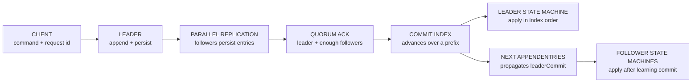

这一定义包含三层容易混淆的东西：

| 层次 | 回答的问题 | Raft 是否直接解决 |
| --- | --- | --- |
| 日志共识 | 每个 index 最终是哪条命令 | 是 |
| 状态机执行 | 相同命令是否产生相同状态 | 要求应用保持确定性 |
| 外部副作用 | 邮件、支付、数据库写是否只发生一次 | 否，需要幂等、事务或 fencing |

### 1.1 故障模型不是“任何故障都能扛”

论文讨论的是**非拜占庭、崩溃恢复**模型：节点可能停止、重启，网络可能延迟、分区、丢包、重复或乱序；节点不会恶意伪造日志、串通投票或任意篡改协议消息。

Raft 的主要承诺是：

- 只要协议和持久化约束被遵守，网络再慢也不能让两个状态机对同一 index 应用不同命令；
- 多数节点存活并能互相通信时，系统通常可以继续推进；
- 少数慢节点不应阻塞正常写入；
- 安全性不依赖时钟准确，时间参数主要影响选举和可用性。

因此，Raft 不是：

- 拜占庭容错协议；
- 跨系统 exactly-once 方案；
- 自动修复磁盘静默损坏的校验系统；
- 在失去多数派时仍允许安全写入的高可用魔法；
- 把任意非确定性程序直接复制后就能保持一致的运行时。

### 1.2 为什么必须是多数派

一个 `N` 节点固定配置需要 `floor(N / 2) + 1` 个投票成员形成多数派。任意两个多数派必有交集，这个交集把“上一条已经做出的决定”带进下一次选举或提交判断。

| 投票节点 | 多数派 | 可同时容忍的节点故障 |
| ---: | ---: | ---: |
| 1 | 1 | 0 |
| 3 | 2 | 1 |
| 5 | 3 | 2 |
| 7 | 4 | 3 |

偶数节点通常不会提升故障容忍数：4 节点仍需 3 票，只能容忍 1 个故障，却增加了复制成本。生产中常见 3 或 5 个投票成员，但真正选择还要考虑故障域、跨机房延迟与维护窗口。

## 2. Raft 为什么比一句“多数派”复杂

只说“写到多数派”不能保证安全。假设一个旧 Leader 只把未提交条目写到少数节点，随后不同节点依次成为 Leader，日志就可能留下互相冲突的尾部。Raft 必须同时解决：

1. **谁可以成为 Leader**；
2. **Leader 如何把其他日志收敛到自己的日志**；
3. **什么时候一个条目不可再被未来 Leader 覆盖**；
4. **配置变化时，哪个集合的多数派有决定权**。

论文刻意用两种方法降低理解难度：

- **问题分解**：把选举、复制、安全性和成员变更分别说明；
- **状态空间收缩**：采用强 Leader，日志只从 Leader 流向 Follower，Leader 自己只追加、不覆盖。

这里的“强 Leader”不代表 Leader 永远正确，而是把日志决策集中到一个角色：客户端命令先进入当前 Leader，新 Leader 通过选举限制继承已提交前缀，再用自己的日志修复 Follower。

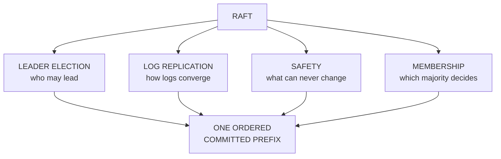

## 3. 任期、角色与服务器状态

### 3.1 三种角色

Raft 节点在任一时刻处于三种角色之一：

- **Follower**：被动响应 Leader 和 Candidate 的 RPC；
- **Candidate**：选举超时后发起某一任期的竞选；
- **Leader**：接收客户端命令、复制日志并推进提交位置。

节点启动时是 Follower。Follower 长时间没收到合法 Leader 通信，也没有给候选人投票，就进入 Candidate；Candidate 获得同一任期的多数票后成为 Leader；任何 Candidate 或 Leader 看到更高任期，都必须更新任期并退回 Follower。

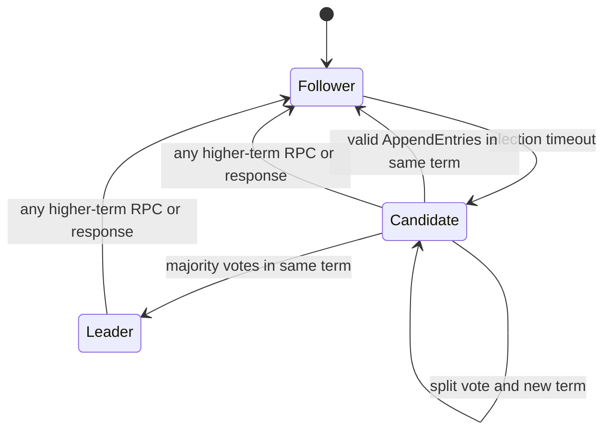

### 3.2 Term 是逻辑时代，不是墙上时间

任期 `term` 是单调递增的逻辑时钟。每个任期最多有一个 Leader，也可能因为分票而没有 Leader。不同节点可以在不同时间得知新任期，甚至完全错过若干任期。

任期让节点快速识别过期信息。在基础算法的普通 RPC 处理路径中：

- 收到比自己小的 term：拒绝该 RPC；
- 收到比自己大的 term：先更新并持久化 `currentTerm`，清空本任期投票，再按 Follower 处理；
- Leader 发现更高 term：立即失去 Leader 身份。

成员移除一节会介绍论文为抑制已移除节点干扰而增加的一个窄例外：刚与当前 Leader 通信过的节点可以在一个最小 election timeout 内忽略 `RequestVote`，连对方更高的 term 也不采纳。不要把这个可用性补丁扩展到其他 RPC。

但是，“term 更大”只说明对方看到了更新的选举时代，不说明它的业务状态一定更新。候选人是否有资格获票，还要比较日志新旧。

### 3.3 哪些状态必须先落稳定存储

论文把状态分成三组：

| 状态 | 归属 | 是否必须持久化 | 作用 |
| --- | --- | --- | --- |
| `currentTerm` | 所有节点 | 是 | 拒绝旧任期、避免任期倒退 |
| `votedFor` | 所有节点 | 是 | 保证一个任期最多投一位候选人 |
| `log[]` | 所有节点 | 是 | 保存已经接受的有序命令 |
| `commitIndex` | 所有节点 | 否，论文算法中可重新获知 | 已知提交前缀末端 |
| `lastApplied` | 所有节点 | 取决于状态机；持久状态机必须同等持久，易失状态机可易失 | 已应用前缀末端 |
| `nextIndex[]` | Leader | 否，每次当选重建 | 下次给每个 Follower 发送的位置 |
| `matchIndex[]` | Leader | 否，每次当选重建 | 已知各 Follower 复制到的位置 |

关键约束不是“最终会写盘”，而是：**节点必须在发送任何依赖新持久状态的 RPC 响应之前，先把 `currentTerm`、`votedFor` 与日志的相关变化可靠保存。** 这也包括“收到更高 term，更新任期后又因日志落后而拒绝”的响应；拒绝投票不等于可以忘记已经观察到的新任期。

论文 Figure 2 把 `lastApplied` 列为易失状态；作者随后在博士论文勘误中补充了一个重要边界：如果状态机本身跨重启持久保存，`lastApplied` 也必须具备与状态机相同的持久性，否则重启后可能把已经反映在持久状态中的命令再次应用。另一种实现是让状态机与应用位置共同从同一快照恢复，随后只重放快照之后的日志。

例如，节点给 Candidate 投票前必须先持久化新的 `currentTerm` 与 `votedFor`。否则它可能投票、崩溃、忘记投过票，重启后在同一任期再投另一人，直接破坏 Election Safety。

同理，Follower 对包含新日志的 `AppendEntries` 返回成功前，必须先把条目稳定保存。Raft 论文中的一次 RPC 成功通常包含存储延迟，不能把它当纯内存 ACK。

## 4. Leader 选举：不是“谁先超时谁就赢”

### 4.1 一次选举的完整过程

Follower 的 election timeout 到期后：

1. `currentTerm += 1`；
2. 转为 Candidate；
3. 给自己投票并持久化；
4. 重置为新的随机选举超时；
5. 并行向其他投票成员发送 `RequestVote(term, candidateId, lastLogIndex, lastLogTerm)`；
6. 收到同一任期的多数票后成为 Leader；
7. 立即发送空 `AppendEntries`，建立权威并抑制其他节点超时。

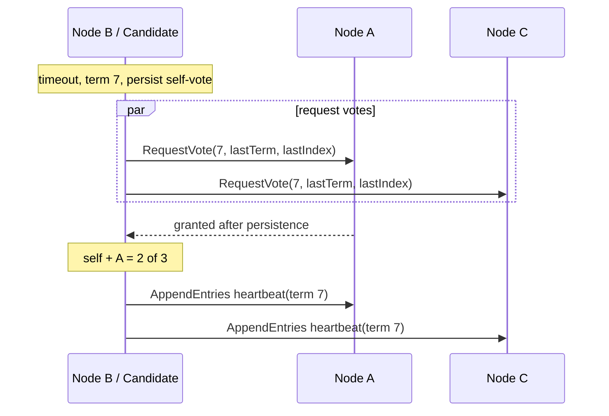

“随机超时”不是为了保证安全。即使时钟很差、RPC 无限延迟，投票规则仍要保证同一任期不能选出两个 Leader。随机化的作用是降低同时参选和持续分票的概率，从而改善活性。

### 4.2 一任期一票为什么必须持久化

每个节点在一个 term 内最多给一个 Candidate 投票，且先到先得只是第一层条件。由于两个多数派一定相交，如果同一节点不能在同一 term 重复投票，就不可能有两个 Candidate 同时获得多数票。

这个推导依赖完整配置的多数票，而不是“当前在线节点中的多数”。5 节点集群即使只剩 2 台在线，也不能把阈值降成 2；否则网络分区的另一边也可能自行降低阈值，出现两个多数派世界。

### 4.3 日志不够新的 Candidate 不能获票

只有一任期一票仍不够。一个落后节点可能因超时较早而参选，然后覆盖已经提交的日志。Raft 因此在 `RequestVote` 中加入日志新旧比较。

比较规则是字典序：

1. 先比较最后一条日志的 `term`，term 较大者更新；
2. 最后 term 相同，再比较 `lastLogIndex`，日志较长者更新。

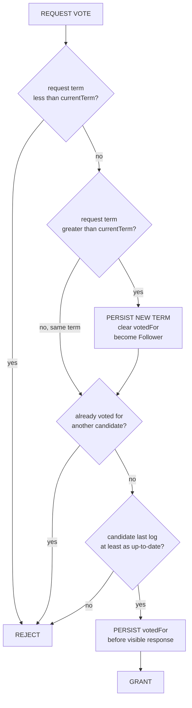

不要比较日志条数总和，也不要逐项“数谁匹配得更多”。一个更高 last term 的短日志，会被认为比低 last term 的长日志更新；这个规则与多数派交集共同保证已提交条目不会从未来 Leader 中消失。

### 4.4 计时约束影响可用性，不决定正确性

论文给出一个直觉关系：

```text
broadcastTime << electionTimeout << MTBF
```

- `broadcastTime` 包含并行 RPC 及必要持久化的往返时间；
- `electionTimeout` 要明显更长，Leader 才能稳定维持心跳；
- `electionTimeout` 又应远小于平均故障间隔，故障后才能及时恢复服务。

论文实验使用过 150–300 ms 的随机区间，但那不是适用于所有系统的标准配置。跨可用区网络、磁盘 fsync、GC 暂停、CPU 饥饿都会改变广播时间。实际系统应根据尾延迟与故障演练定值，而不是复制论文样例。

## 5. 日志复制：Leader 怎样修复分叉

### 5.1 日志条目的身份是 `(index, term)`

每条日志至少包含：

- `index`：在日志中的连续位置；
- `term`：最初接收该命令的 Leader 任期；
- `command`：交给状态机的确定性命令。

如果两个日志在相同 index 存在相同 term 的条目，Raft 保证那条命令相同，并且该位置之前的整个前缀也相同。这就是 **Log Matching Property**。

它成立的原因是：

1. 同一 Leader 在某任期的同一 index 最多创建一个条目；
2. `AppendEntries` 每次都验证新条目前一个位置的 index 与 term；
3. Follower 只有在前缀匹配后才接受后续条目。

### 5.2 `AppendEntries` 同时承担复制和心跳

Leader 发送：

```text
AppendEntries(
  term,
  leaderId,
  prevLogIndex,
  prevLogTerm,
  entries[],
  leaderCommit
)
```

Follower 依次处理：

1. RPC term 落后则拒绝；
2. 本地 `prevLogIndex` 不存在，或该位置 term 不等于 `prevLogTerm`，拒绝；
3. 新条目与本地同 index 条目 term 冲突时，删除冲突位置及其整个尾部；
4. 追加本地还没有的新条目并稳定保存；
5. 若 `leaderCommit > commitIndex`，令 `commitIndex = min(leaderCommit, prevLogIndex + entries.length)`，也就是不超过本次成功 RPC 已证明与 Leader 匹配的末端；空心跳时末端就是 `prevLogIndex`，不能采用 Follower 自己可能带冲突尾部的 `lastLogIndex`；
6. 返回成功。

空 `entries[]` 就是心跳，但心跳仍会执行前缀一致性与任期检查。一个常见实现 bug 是“收到空心跳就清掉多余尾部”。论文规则不是这样：**只有与实际发送的新条目发生冲突时，Follower 才删除冲突尾部。**

### 5.3 `nextIndex` 与 `matchIndex`

Leader 为每个 Follower 维护：

- `nextIndex[f]`：下一次准备发送的日志 index；
- `matchIndex[f]`：已知该 Follower 与 Leader 一致的最高 index。

新 Leader 最初把 `nextIndex` 设为自己末尾后一位。Follower 拒绝时，Leader 向前回退，直到找到双方最后一个共同 `(index, term)`；成功后再把 Leader 的后缀复制过去。

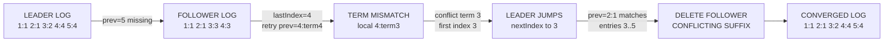

论文基础算法可以每失败一次把 `nextIndex` 减一。工程实现常让 Follower 返回冲突 term 和该 term 的首 index，一次跳过整段冲突；这是兼容安全规则的加速，不改变协议含义。

### 5.4 为什么只能由 Leader 覆盖 Follower

Follower 的冲突尾部可能来自以前的 Leader，却尚未提交。新 Leader 不会从 Follower 把这些尾部“合并回来”，而是强制 Follower 匹配自己的日志。

这只有在选举限制成立时才安全：合法新 Leader 从当选时起就包含所有已提交条目，所以被它覆盖的只能是未提交分叉。**先证明 Leader Completeness，才能接受“Leader 覆盖 Follower”这条强规则。**

## 6. 提交规则：Raft 最容易写错的一页

### 6.1 已复制、已提交、已应用是三个状态

| 状态 | 含义 |
| --- | --- |
| replicated | 某个副本已经持久化该条目 |
| committed | 该条目已不会被未来合法 Leader 换成另一条命令 |
| applied | 状态机已经按序执行该条目 |

Leader 只能按连续前缀推进 `commitIndex`，所有节点只能按 index 顺序把 `commitIndex` 之前尚未应用的条目交给状态机。不能先应用 index 42 再等待 41，也不能把“写到本地 WAL”直接称作 committed；本地 `writtenLSN`、`durableLSN` 与复制提交前缀的差别见 [Chapter 02](/signal-grid-blog/posts/write-ahead-log-durability-and-crash-recovery/)。

### 6.2 当前任期条目可以用多数副本直接提交

若当前 Leader 在 term `T` 创建的条目 `N` 已经稳定存在于多数节点，并且 `N > commitIndex`，Leader 可以把 `commitIndex` 推进到 `N`。Log Matching 使 `N` 之前的整个 Leader 前缀同时得到间接提交。

论文浓缩规则可以写成：

```text
exists N:
  N > commitIndex
  majority(matchIndex[i] >= N)
  log[N].term == currentTerm
```

最后一行绝不能漏。

### 6.3 旧任期条目即使落到多数副本，也未必已经提交

考虑 5 个节点：

1. term 2 的 Leader S1 在 index 2 写入 `x`，只复制给 S2 后崩溃；
2. term 3 的 S5 依靠 S3、S4、S5 当选，在 index 2 写入 `y`；
3. S5 崩溃，S1 再次成为 term 4 Leader，把旧条目 `x(term 2)` 复制到 S3；
4. 此时 `x` 已存在于 S1、S2、S3，表面上是多数，但若 S1 马上崩溃，S5 仍可能依靠 S3、S4、S5 的日志比较重新当选并覆盖 `x`。

因此，Leader 不能仅按副本数直接提交旧任期条目。它必须先让**当前任期的一条新条目**落到多数派；这条新条目一旦提交，它之前的旧任期前缀才被间接提交。

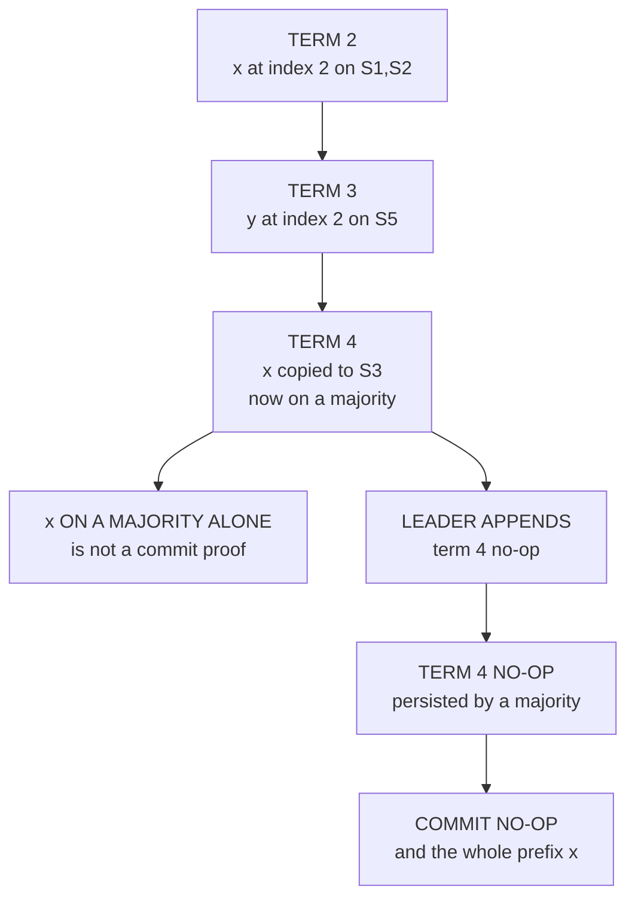

这条规则看起来保守，却让条目始终保留最初创建时的 term，简化了推理。新 Leader 通常会先追加一条 no-op；一旦 no-op 在当前任期提交，继承来的旧条目也随之前缀一起确定。

### 6.4 Leader 何时回复客户端

论文算法写的是：Leader 收到命令后先追加本地日志，复制并提交，然后按序应用到自己的状态机，最后把执行结果返回客户端。

工程实现有时会在“提交”与“应用”之间设计异步边界，但如果响应包含业务执行结果，就必须等本地状态机实际应用。无论实现细节如何，响应之前还必须保证用于重复请求识别的状态与业务状态遵守同一恢复边界。

## 7. 五条性质怎样连成安全性证明

论文把 Raft 的安全性浓缩为五条性质：

| 性质 | 直观含义 |
| --- | --- |
| Election Safety | 一个 term 最多一位 Leader |
| Leader Append-Only | Leader 不覆盖或删除自己的日志，只追加 |
| Log Matching | 相同 `(index, term)` 意味着此前缀完全相同 |
| Leader Completeness | 已提交条目存在于所有更高任期 Leader 中 |
| State Machine Safety | 同一 index 永远不会应用两条不同命令 |

它们不是五句互不相关的口号，而是一条依赖链：

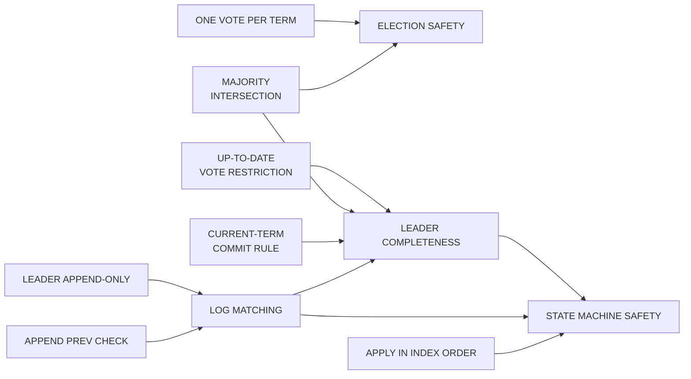

### 7.1 Leader Completeness 的反证直觉

假设 term `T` 的 Leader 把本任期条目 `e` 提交了，但后来最早出现一个不含 `e` 的 term `U` Leader。

- `e` 在 term T 已复制到多数派；
- term U 的 Leader 也必须从多数派拿到选票；
- 两个多数派必然有一个交点节点 `voter`；
- `voter` 在投票时仍拥有 `e`；
- `voter` 只会投给日志至少和自己一样新的 Candidate；
- 若 Candidate 最后 term 相同，它必须至少一样长，因此包含 `e`；
- 若 Candidate 最后 term 更高，创造那段更高 term 日志的中间 Leader 按“U 是第一个缺失任期”的假设也包含 `e`，Log Matching 又迫使 Candidate 包含 `e`。

两条分支都会导出 Candidate 应包含 `e`，与假设矛盾。因此，当前任期提交的条目不会从未来 Leader 中消失。

旧任期条目则通过“当前任期条目提交时，整个前缀间接提交”纳入同一结论。

### 7.2 安全不等于随时可用

网络分区后，少数派中的旧 Leader 可能暂时还以为自己是 Leader，但它无法从多数派获得复制确认，因此不能提交新条目。多数派一侧可以选出更高 term Leader继续推进。

旧 Leader 恢复通信后看到更高 term 会退位，它的未提交尾部会被新 Leader 覆盖。Raft 通过停止少数派进展保住安全，而不是让两个分区都写完再尝试业务合并。

## 8. RPC 重试、崩溃恢复与“结果未知”

### 8.1 协议 RPC 设计为可重复处理

Follower 或 Candidate 崩溃时，Leader/Candidate 可以持续重试 RPC。节点可能已经完成操作，却在响应发出前崩溃；重启后会再次收到同一个请求。

Raft 的基础 RPC 必须幂等：

- 已存在的相同日志条目不重复追加；
- 同一 term 给同一 Candidate 重复返回投票结果不会产生第二票；
- 旧 term 请求始终被拒绝；
- 快照分片按 offset 写入并可重试。

但“Raft RPC 幂等”不等于“客户端业务命令幂等”。后者需要单独的 request identity 与结果缓存。

### 8.2 客户端超时后的四种真实状态

一次写请求超时，客户端无法仅从超时判断：

1. 请求从未到达 Leader；
2. 只进入 Leader 未提交尾部，后来被覆盖；
3. 已提交但尚未应用；
4. 已应用，响应在途中丢失。

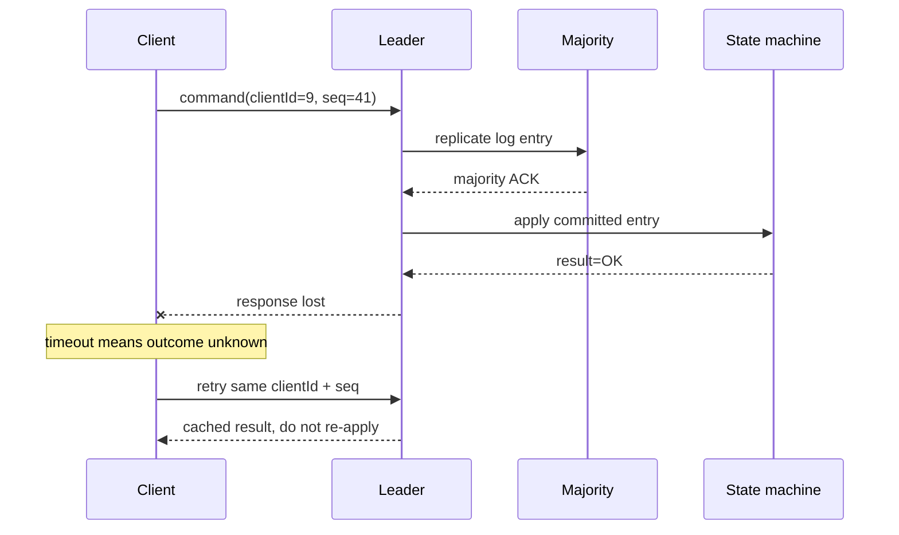

论文建议每个客户端给命令分配唯一、单调序列号；状态机持久维护每个客户端最后处理的序列号及响应。重复命令直接返回缓存结果，不再执行。

这意味着去重表是**复制状态机状态的一部分**，必须随快照一起保存。只在 Leader 内存中放一个临时缓存，Leader 切换后仍会重复执行。

### 8.3 客户端身份也有生命周期

论文用“每客户端最后序列号”解释核心思想，生产协议还要定义：

- `clientId` 是否可能重用；
- 客户端重装或状态丢失后如何获得新 incarnation/epoch；
- 去重响应保留多久；
- 大量短连接的去重状态如何回收；
- 同一客户端是否允许并行未完成请求。

若只保存“最大 seq”，并行请求 41、42 乱序到达时可能误删合法请求。要么约束每个 session 同时最多一个未完成请求，要么维护更完整的完成窗口和结果映射。

## 9. 线性一致读：Leader 本地读也可能过期

“写走 Raft，读 Leader 内存”仍不自动得到线性一致性。旧 Leader 被网络隔离后，可能不知道多数派已经选出新 Leader；它的本地状态虽然自洽，却已经过期。

论文给出不写日志的线性一致读需要两个前提：

1. **新 Leader 先追加并提交本任期的空 no-op**。新 Leader 天生包含所有已提交日志，却可能还不知道此前的确切提交边界；本任期 no-op 提交后，前缀边界才被确定；
2. **每次读前确认自己仍是 Leader**。Leader 与多数派交换一轮心跳，再从已经应用到相应提交位置的状态机读取。

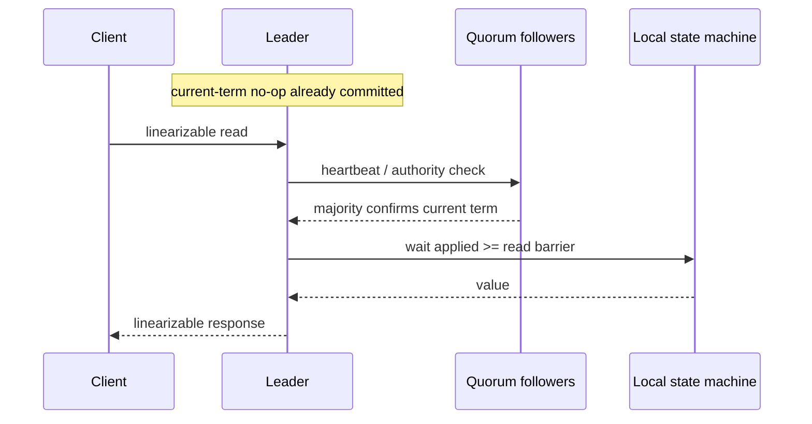

现代实现常把类似流程称作 read barrier 或 ReadIndex，但 `ReadIndex` 这个具体 API/术语不是原论文算法的一部分。Follower 本地读、没有多数派确认的 Leader 读通常只能提供较弱的一致性，必须在 API 中明确标注。

论文也提到基于心跳 lease 的替代方案，但 lease 把时钟漂移上界带进安全假设。除非实现能证明单调时钟、最大漂移、暂停与 lease 持有关系，否则不能把“心跳最近成功过”无限外推为当前仍有领导权。

## 10. Snapshot：压缩日志，不是另一个共识协议

日志不能无限增长。论文采用快照压缩：每个节点独立把**已经提交并应用**的状态写入快照，再删除被快照覆盖的旧日志。

快照至少包含：

- 状态机完整状态；
- `lastIncludedIndex`；
- `lastIncludedTerm`；
- 该位置对应的最新集群配置；
- 应用层去重、session 或其他恢复正确性所需元数据。

`lastIncludedIndex/Term` 把快照当成日志前缀的一个虚拟末端，使快照之后第一条日志仍能执行 `prevLogIndex/prevLogTerm` 一致性检查。

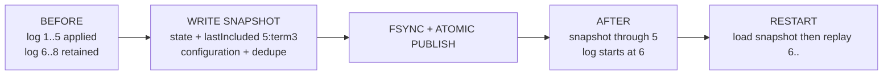

### 10.1 快照发布必须抗崩溃

论文描述协议语义，具体实现还必须保证：

- 不把半写快照当成有效恢复点；
- 快照内容与 `lastIncludedIndex/Term` 原子对应；
- 新快照完成并持久化后才能删除旧日志和旧快照；
- 状态机在生成快照期间仍可安全处理后续命令，常用 copy-on-write 或不可变视图；
- 恢复后 `lastApplied` 与快照覆盖位置一致。

### 10.2 落后太远时发送 `InstallSnapshot`

如果 Follower 所需的 `nextIndex` 已被 Leader 压缩，Leader 不能再发普通日志，只能分片发送 `InstallSnapshot`。

Follower 收完并完整持久化快照后要区分两条路径：

- 若本地在 `lastIncludedIndex` 存在同 term 条目，说明快照覆盖的是本地日志前缀；保留该位置之后的后缀并返回，不用这份可能较旧的快照回滚已经应用得更远的状态机；
- 否则丢弃整个旧日志，因为它可能与快照代表的已提交历史冲突；用快照原子重置状态机并加载其中配置，再从快照位置之后继续复制。

实现还应拒绝或幂等忽略已经被本地更新快照覆盖的旧 `InstallSnapshot`，并保证快照安装与并行 `AppendEntries` 不会相互倒退状态。

每个节点独立生成快照看似偏离强 Leader，但快照只重组已经达成共识的状态，不创造新决策，因此不破坏安全。

## 11. 成员变更：不能把 3 台配置直接改成 5 台

### 11.1 直接切换为什么不安全

从旧配置 `C_old={A,B,C}` 切到 `C_new={A,B,C,D,E}` 时，各节点不可能在同一物理瞬间看到新配置。

- 仍使用旧配置的 A、B 可以形成 2/3 多数；
- 已使用新配置的 C、D、E 可以形成 3/5 多数；
- 两组没有交集，可能在同一 term 选出不同 Leader。

问题不是“操作慢一点”，而是两个配置的多数派集合在过渡期可能不再相交。

### 11.2 Joint consensus 使用双重多数派

论文方案先进入联合配置 `C_old,new`，再进入 `C_new`：

1. Leader 追加联合配置日志；
2. 联合阶段的选举和提交都必须分别得到 `C_old` 多数与 `C_new` 多数；
3. 联合配置提交后，Leader 追加纯 `C_new` 配置；
4. `C_new` 配置按新配置多数提交后，旧成员才可退出。

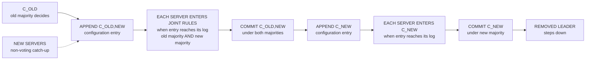

联合配置中的日志仍复制到两个配置的所有成员；任一集合的节点都可能成为 Leader，但任何决定都不能绕过另一集合的多数。

### 11.3 配置何时生效是协议语义

原论文中，服务器一旦把新配置条目追加到本地日志，就使用自己日志中最新配置做后续决策，不等待该配置提交。这样不同节点虽然在不同时间切换规则，joint consensus 仍保证没有两个独立多数派。

这是一处非常容易被“配置提交后才生效”的直觉改坏的地方。具体实现若采用其他成员变更算法，必须依据自己的正式协议证明，不能把论文 joint consensus 与后续 one-at-a-time 方案拼接。

### 11.4 新成员先作为非投票成员追赶

空日志新节点直接加入投票集合，可能长期拖住新配置多数派。论文因此建议先把新节点作为 non-voting member 接入，让 Leader 复制日志和快照；追平后再进入正式 joint consensus。

这和把 Observer/Learner 永久当成投票成员是两回事。追赶阶段不计入多数派，也不提高容错票数。

### 11.5 移除当前 Leader 与干扰选举

如果当前 Leader 不属于 `C_new`，它要继续完成 `C_new` 条目的复制，并在该配置提交后退位。退得太早可能让仍需旧配置同意的过渡过程失去可用 Leader。

被移除节点收不到心跳后还可能不断增加 term 并发起投票，干扰当前集群。论文的处理是：节点在最近一个最小 election timeout 内听到当前 Leader 时，忽略 RequestVote，不更新 term 也不投票。这个规则针对成员移除的可用性问题，和后来的 Pre-Vote 不是同一机制。

## 12. 把论文规则落进代码

Raft 的伪代码很短，真正危险的是并发、持久化与回调顺序。一个实现应先建立清晰的单线程协议所有权，或证明所有状态转换在锁下原子完成。

### 12.1 推荐的事件循环边界

```text
while (running) {
    collectInboundRpcAndTimerEvents();
    for (event : newEvents) {
        validateTermRoleAndGeneration(event);
        decideAndSubmitRequiredDurableChange(event);
    }
    for (completion : durableWriteCompletions) {
        revalidateTermRoleAndGeneration(completion);
        publishOnlyTheResponsesAndReplicationItUnlocks();
    }
    advanceCommitIndexUsingCurrentTermRule();
    applyCommittedEntriesInOrder();
    completeClientResponsesAfterApply();
}
```

这不是要求所有磁盘和网络 I/O 都同步阻塞在一个线程，而是要求：改变 `currentTerm/votedFor/log/commitIndex/role` 的协议决策必须有一个可推理的线性顺序。异步 I/O 完成事件回到 owner thread 后，仍要重新验证 term、role 和请求 generation，避免过期回调污染新任期。

### 12.2 三条持久化栅栏

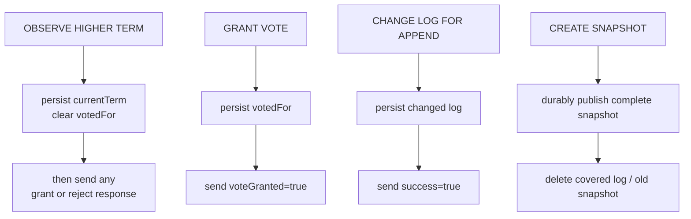

实现中“写入文件”不一定等于崩溃后持久。[WAL 章节](/signal-grid-blog/posts/write-ahead-log-durability-and-crash-recovery/) 已完整区分 page cache、`force`/`fsync`、目录 rename、设备缓存与本地 durable prefix；Raft 实现必须在此基础上再定义每个副本何时响应成功，并用断电恢复测试验证，而不是只测进程 `kill -9`。

### 12.3 容易出现的竞态

- 收到更高 term 响应后，只更新 `currentTerm` 却没有立刻退为 Follower；
- 投票成功响应先发出，`votedFor` 还没落盘；
- 异步 AppendEntries 回调来自旧 term，却更新了新 Leader 的 `matchIndex`；
- commit 计算遗漏 `log[N].term == currentTerm`；
- Follower 对空 heartbeat 无条件截断日志；
- reset election timer 的条件太宽，任何过期 RequestVote 都能压住合法选举；
- 状态机在 commit 之前执行，或多线程跨过未完成 index；
- 快照只保存业务 map，忘了保存去重表和配置；
- 安装快照与并行 AppendEntries 相互覆盖；
- 重启后先对外服务，再完成日志/快照恢复和角色初始化。

## 13. 生产设计：论文之外还必须回答什么

论文给出共识核心，但生产系统仍要定义协议外壳。

### 13.1 入口与 Leader 发现

客户端可以随机连接节点，由 Follower 返回最近知道的 Leader，再由客户端重试。工程上要防止：

- Follower 缓存的是过期 Leader 地址；
- Leader 切换时所有客户端同步重连；
- 重定向循环；
- 没有 request identity 的自动重试造成重复；
- 代理层把旧 Leader 当健康节点继续转发写请求。

Leader hint 只是加速，不能充当领导权证明。真正的写权限来自任期、日志复制和多数派提交。

### 13.2 外部副作用

Raft 状态机应尽量只产生确定性内部状态和可重放输出。若应用日志命令直接调用支付、邮件或外部数据库，Leader 崩溃后日志重放会再次调用。

常见选择：

- 把副作用意图写入状态机内的 durable outbox；
- 下游按 `(clusterId, logIndex)` 或业务 operation ID 幂等；
- 对唯一写资源携带 fencing epoch，拒绝旧 Leader；
- 将响应先持久化为状态，再由可重试投递器发送。

Raft 保证命令顺序，不会自动让另一个系统参与同一原子提交。

### 13.3 容量与延迟

一次正常写入的关键路径通常包括：

```text
client -> leader local stable append
       -> parallel follower stable append
       -> majority ACK
       -> leader commit and state-machine apply
       -> client response
```

因此尾延迟受多数派中的存储和网络尾延迟支配，而不是最慢的所有节点。一个慢 Follower 可以落后，但若多数派中的多个节点同时变慢，写延迟会迅速上升；失去多数时应拒绝或悬停写入，而不是降级成单机提交。

### 13.4 至少监控这些位置

| 维度 | 指标或事件 | 解释 |
| --- | --- | --- |
| 角色 | current term、Leader changes、election duration | 频繁选举通常是网络、存储或暂停问题 |
| 复制 | per-follower match/next、append reject、snapshot install | 判断落后与分叉修复成本 |
| 提交 | leader last index、commit index、last applied | 区分复制 lag、commit lag、apply lag |
| 存储 | WAL append/fsync、snapshot duration/size、replay time | 验证耐久边界和 RTO |
| 客户端 | timeout、retry、dedupe hit、unknown outcome | 判断业务重复与可见故障 |
| 配置 | active config、joint phase、learner lag | 避免成员变更卡死 |

不要只监控“有没有 Leader”。一个 Leader 可能没有多数派、无法提交，或者本地状态机严重落后。

## 14. 用故障时间线验收实现

单元测试 happy path 远远不够。至少需要可复现地注入：

| 场景 | 必须验证的性质 |
| --- | --- |
| 两位 Candidate 同时超时 | 同一 term 最多一位 Leader；分票后能进入新 term |
| 授票持久化与响应之间逐点崩溃 | 持久化前不得发成功响应；持久化后即使响应丢失，也只能给同一 Candidate 重复授票；成功响应一旦可见，重启后不得在同一 term 投给别人 |
| Follower 写日志后丢响应 | 重试不重复追加，内容保持一致 |
| Leader 本地追加后立即崩溃 | 未提交尾部可被合法新 Leader 覆盖 |
| 旧 term 条目落到多数后崩溃 | 未有 current-term commit 时不能错误应用 |
| Leader 提交后响应丢失 | 客户端重试只返回缓存结果，不重复执行 |
| Follower 落后到日志已压缩 | InstallSnapshot 后从正确 index 继续追赶 |
| 快照写一半断电 | 重启拒绝半快照，仍可从旧恢复点恢复 |
| 3→5 成员变更期间逐点崩溃 | old/new 不能分别独立决定 |
| 旧 Leader 网络隔离后读请求 | 无多数派确认时不得返回线性一致读 |

最有价值的测试不是随机 `sleep`，而是可控制时钟、网络、稳定存储和崩溃点的确定性模拟：记录随机 seed、消息投递顺序、持久化完成点与角色转换，失败后能够逐事件重放。

## 15. 常见误区速查

| 误区 | 正确边界 |
| --- | --- |
| “写到多数副本就是提交” | 直接按副本数提交时，目标条目必须来自当前 term |
| “term 最大的节点日志最新” | 任期状态与日志新旧不同；投票比较 lastLogTerm，再比较 lastLogIndex |
| “选举超时最短者一定当选” | 还必须日志足够新并获得完整配置多数票 |
| “心跳只是保活空包” | 它也是 AppendEntries，携带 term、前缀检查和 leaderCommit |
| “新 Leader 合并所有节点日志” | Raft 让合法 Leader 的日志覆盖 Follower 未提交分叉 |
| “Follower 多出的尾部一看到心跳就删” | 只有与实际新条目冲突时才截断 |
| “commitIndex 等于最后日志 index” | Leader 可能有尚未多数复制的尾部 |
| “Leader 本地读天然线性一致” | 需 current-term 提交与多数派权威确认，还要等状态机应用到屏障 |
| “Raft RPC 幂等，所以业务 exactly-once” | 客户端命令需要持久化去重；外部副作用另需协议 |
| “Snapshot 就是一份业务 JSON” | 还要有 lastIncluded index/term、配置、去重状态和原子发布 |
| “配置条目提交后才生效” | 原论文 joint consensus 使用日志中最新配置，即追加后生效 |
| “Raft 能扛恶意节点” | 基础论文只覆盖非拜占庭崩溃与网络故障 |

## 16. Raft、ZAB、KRaft 与 Aeron Cluster 不要混写

Raft 提供一套复制日志共识模型，但产品名字里出现 Leader、term、log、quorum，不代表它们就是同一协议。

- **ZooKeeper / ZAB**：向应用暴露 znode、Session、Watch、ACL 与 recipe；应按 ZooKeeper 的真实读写保证设计，不能把 Raft 的线性一致读流程直接套给普通 ZooKeeper read。
- **Kafka / KRaft**：Controller quorum 复制集群元数据，topic partition 另有 ISR/HW/ELR 数据复制机制；KRaft quorum 不是每个业务 topic 的数据多数派。
- **Aeron Cluster**：借助 Aeron Transport、Archive 与确定性 Clustered Service 建立复制状态机，日志位置以字节 position 表达，选举、catch-up 与客户端接口都有自己的具体契约。

理解 Raft 的价值，是获得一套分析工具：看到任何“Leader + 日志 + 多数派”系统时，继续追问投票资格、提交边界、旧主退位、持久化栅栏、客户端歧义和成员变更，而不是把产品术语强行翻译成 Raft 字段。

## 17. 读论文时最值得反复看的部分

如果准备实现或审查 Raft，建议至少反复核对：

1. **Figure 2**：持久/易失状态、两个基础 RPC 与服务器规则；
2. **Figure 3**：五条安全性质及依赖关系；
3. **Figure 7**：新 Leader 面对的六类 Follower 分叉；
4. **Figure 8**：旧 term 条目已在多数副本仍可能被覆盖；
5. **Figure 9**：Leader Completeness 的多数派交点；
6. **Figure 10–11**：直接配置切换为何危险、joint consensus 如何消除双多数派；
7. **Figure 12–13**：Snapshot 与 InstallSnapshot 的日志衔接。

真正掌握 Raft 的标准不是记住两种 RPC，而是能回答：

- Candidate 为什么有资格成为 Leader？
- 某个 index 此刻只是 replicated，还是已经 committed？
- 当前判断能否在下一任 Leader 下仍成立？
- 崩溃发生在持久化、响应、应用的哪两个动作之间？
- 客户端看到超时时，哪些结果仍然可能？
- 配置变更期间，到底哪一个多数派集合有决定权？

这些问题能回答清楚，Raft 才从一张流程图变成了可以审查、实现和运维的协议。

## 参考资料

- [Raft 官方站点](https://raft.github.io/)
- [In Search of an Understandable Consensus Algorithm — Extended Version](https://raft.github.io/raft.pdf)
- [USENIX ATC 2014 论文页面与演讲](https://www.usenix.org/conference/atc14/technical-sessions/presentation/ongaro)
- [Diego Ongaro 博士论文：Consensus — Bridging Theory and Practice](https://github.com/ongardie/dissertation)
- [Raft TLA+ specification](https://github.com/ongardie/raft.tla)
- [RaftScope 官方交互可视化](https://raft.github.io/raftscope/)
