很多 ZooKeeper 教程从 `create /app`、`get /app` 开始，然后迅速跳到“临时节点做注册中心、顺序节点做分布式锁”。这些命令并不难，难的是理解命令背后的边界：一次断线是否等于 Session 失效，Watch 到底通知了什么，本地读取是否一定最新，赢得选举为何仍不能阻止旧 Leader 写数据，以及 `ConnectionLoss` 后能否直接重试。

本文以 **Apache ZooKeeper 3.9.5 current release** 为行为基线，同时注明官方仍将 **3.8.6** 标记为 latest stable release。3.9.5 和 3.8.6 都修复了 2026 年披露的敏感配置日志泄露问题；生产选型不能只看功能，也要确认所用维护线和安全补丁。[官方 Releases](https://zookeeper.apache.org/releases/) · [3.9.5 Release Notes](https://zookeeper.apache.org/doc/r3.9.5/releasenotes.html) · [Security](https://zookeeper.apache.org/security/)

文章会使用原生 API 解释语义，再用 **Apache Curator 5.9.0** 展示工程写法。ZooKeeper 3.9 的源码仍维持 Java 8 字节码兼容基线；为让示例更清晰，本文代码采用 Java 17 的语法表达，生产环境应选择仍受维护的 LTS JDK。Curator 能替我们处理连接、重试和成熟 recipe，但它不能替业务定义 fencing、幂等、结果未知和降级策略。

## 1. ZooKeeper 解决的不是“存数据”，而是“协调决定”

ZooKeeper 是一个复制的分布式协调服务。它把一小份需要严格排序、条件更新和变化通知的状态放在一个层级命名空间里，让应用构造：

- 服务成员与存活状态；
- 配置版本和动态刷新；
- Leader 选举与所有权声明；
- 分布式锁、屏障和队列；
- 主从切换所需的 epoch 或 fencing token；
- 需要原子检查与更新的控制面元数据。

它不适合承担：

- 大对象、日志正文或海量历史记录；
- 高频业务事件流和通用消息队列；
- 关系查询、聚合和全文搜索；
- 仅靠一个临时节点就实现业务 exactly-once；
- 跨数据中心高延迟链路上的大规模写入数据库。

ZooKeeper 的数据树整体保存在内存中，并通过事务日志和快照恢复。官方对单个 znode 有小于 1 MiB 的保护，但同时明确建议协调数据应远小于这个上限，通常只是字节到 KB 级。大内容应放在对象存储、数据库或日志系统中，ZooKeeper 只保存版本、摘要和位置指针。[官方 Overview](https://zookeeper.apache.org/doc/current/zookeeperOver.html) · [Programmer's Guide](https://zookeeper.apache.org/doc/current/zookeeperProgrammers.html)

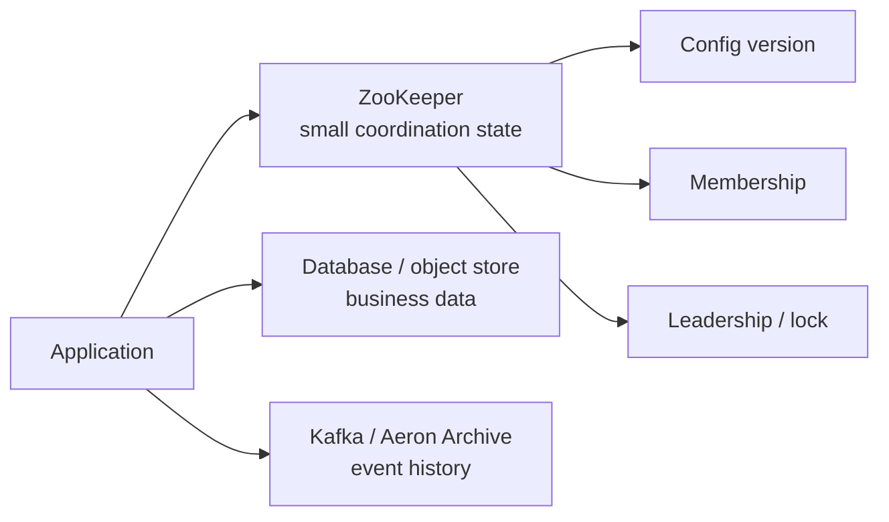

一个很实用的判断方式是：**如果状态丢失会让多个进程对“谁有权做什么”产生分歧，它可能属于 ZooKeeper；如果状态本身就是业务事实或历史，它通常不属于 ZooKeeper。**

## 2. 第一心智模型：一棵带版本的 znode 树

ZooKeeper 的命名空间类似文件系统，但每个 znode 可以同时拥有数据和子节点。路径必须是绝对路径，没有相对路径。

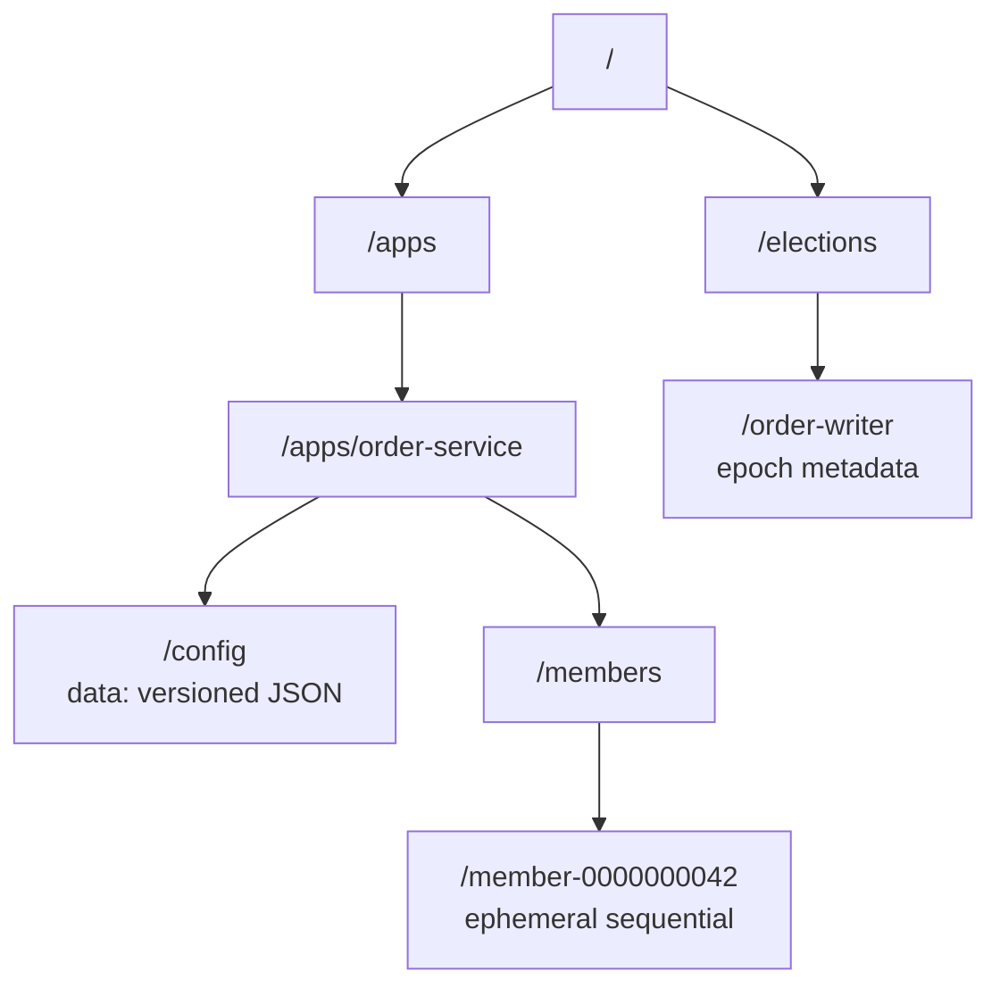

### 2.1 数据是完整替换，不是字段级更新

`getData()` 返回完整 `byte[]` 与 `Stat`；`setData()` 会完整替换 `byte[]`。ZooKeeper 不理解 JSON 字段，也不会替你合并两个并发修改。要避免覆盖，必须把 `Stat.version` 带回写操作：

```java
Stat stat = new Stat();
byte[] current = zooKeeper.getData("/apps/order-service/config", false, stat);

byte[] next = updateConfig(current);
zooKeeper.setData("/apps/order-service/config", next, stat.getVersion());
```

若期间已有其他客户端更新，服务端会返回 `BadVersionException`。这就是 znode 上的 compare-and-set；传 `-1` 会跳过版本检查，只有明确接受 last-writer-wins 时才应使用。

还要防一个容易忽略的 ABA：节点被删除再以同一路径创建后，`version` 会从头开始。`czxid` 能帮助读取方识别“这已是另一次创建”，但 `setData(version)` 和 `Op.check` 不能直接把 `czxid` 当服务端比较条件，先读后比较仍有竞态。需要原子身份时，应保留一个永不删除重建的 generation/epoch znode，在它的 `version` 上 CAS，并把相关更新放进同一个 `multi`；另一种办法是每一代使用不可变的唯一子路径。

### 2.2 `Stat` 是理解并发和历史的钥匙

常用字段不是装饰信息：

| 字段 | 含义 | 常见用途 |
| --- | --- | --- |
| `czxid` | 创建该 znode 的事务 zxid | 判断创建顺序、审计 |
| `mzxid` | 最后修改数据的事务 zxid | 比较数据快照新旧 |
| `pzxid` | 最后修改子节点集合的事务 zxid | 判断成员列表是否变化 |
| `version` | 数据修改次数 | `setData` / `delete` 条件更新 |
| `cversion` | 子节点集合修改次数 | 检测目录结构变化 |
| `aversion` | ACL 修改次数 | 条件化权限维护 |
| `ephemeralOwner` | 普通临时节点通常是 Session ID；扩展节点类型可能使用特殊标记 | 追踪生命周期类型与临时所有权 |
| `dataLength` / `numChildren` | 数据长度与直接子节点数 | 容量与异常检查 |

`zxid` 是 ZooKeeper 全局写入顺序；`version` 只在单个 znode 内递增。不要把 `/a` 的 version 7 与 `/b` 的 version 9 当成全局先后关系。

### 2.3 生命周期与顺序命名是两个维度

`CreateMode` 有 7 个可选组合，不宜把 `SEQUENTIAL` 误解成与 persistent、ephemeral 并列的一种生命周期：

| 创建模式 | 生命周期 | 适合 | 边界 |
| --- | --- | --- | --- |
| `PERSISTENT` | 显式删除 | 配置、命名空间、元数据 | 不会因客户端退出自动清理 |
| `EPHEMERAL` | 所属 Session 结束后删除 | 成员、存活声明 | 不能拥有子节点 |
| `PERSISTENT_SEQUENTIAL` | 显式删除，名称带父节点内序号 | 低频有序任务、审计条目 | 失败恢复和积压清理必须另行设计 |
| `EPHEMERAL_SEQUENTIAL` | Session 结束后删除，名称带序号 | 选举、锁的候选队列 | 不能拥有子节点；不是持久任务 |
| `CONTAINER` | 最后一个子节点删除后，未来可能被服务端清理 | recipe 的父路径 | 清理不是即时承诺，创建子节点要处理 `NoNode` |
| `PERSISTENT_WITH_TTL` | 无子节点且一段时间未修改后成为清理候选 | 低频租约式元数据 | 默认禁用，清理也不是精确计时器 |
| `PERSISTENT_SEQUENTIAL_WITH_TTL` | 持久顺序节点满足 TTL 条件后成为清理候选 | 有时限的低频有序元数据 | 同时继承顺序号与 TTL 的全部边界 |

顺序节点后缀是父节点局部的十位补零计数，例如 `lock-0000000042`。它适合构造队列顺序，不等于永不重复的全局业务 ID：同一父目录下其他子节点的创建也会推进计数，已创建节点随后删除会让现存列表出现空洞；`getChildren()` 的返回顺序也没有保证，客户端必须解析完整后缀再排序。父路径重建或 32 位计数溢出还会破坏“永远递增”的假设。TTL 节点依赖 `zookeeper.extendedTypesEnabled=true`，默认关闭；“到 TTL 时刻立即删除”也不是其保证。

## 3. Ensemble：读走本地，写走 Leader 与多数派

生产 ZooKeeper 通常由 3 或 5 个投票成员组成。客户端只连接其中一个 server；断开后，客户端库可带着同一个 Session 自动切换到其他 server。

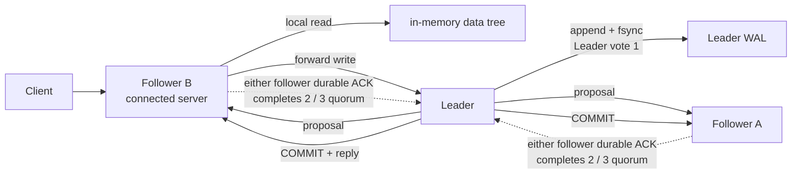

- **读请求**通常由连接到的 server 直接从本地内存副本回答，因此快，但可能落后于刚刚在别处完成的写；
- **写请求**会被转发到 Leader，Leader 排序并生成 proposal；
- proposal 获得一个相交 quorum 的 ACK 后才能提交；
- ACK 表示参与者已把 proposal 记录到持久存储；
- commit 再按统一顺序应用到各副本的数据树。

3 个投票成员需要 2 个形成 quorum，可容忍 1 个失效；5 个需要 3 个，可容忍 2 个。4 个成员仍需要 3 个，只能容忍 1 个，因此偶数规模通常增加写入与运维成本，却没有增加故障容忍数。

### 3.1 ZAB 不是一句“类似 Raft”就能带过

ZooKeeper 使用 ZAB（ZooKeeper Atomic Broadcast）维护全序事务流。可以把它理解为两个主要阶段：

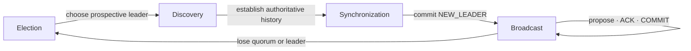

Leader 激活时，集群先选出包含权威历史的候选者，再让 followers 追平或丢弃未提交尾部，提交 `NEW_LEADER` 后才接受新 proposal。旧 Leader 最后几个未提交 proposal 可能被丢弃；已经提交的事务不能被新任期回滚。

`zxid` 是 64 位值，高 32 位表示 epoch，低 32 位表示该 epoch 内的计数。Leader 更换会进入新 epoch。它提供 ZooKeeper 事务的全序，不应直接当业务 fencing token 使用：外部数据库未必理解 zxid，应用也可能需要按资源或 shard 分配自己的 epoch。

ZAB、Raft 都使用 Leader、日志顺序和多数派交集保证安全，但二者的协议接口、术语、恢复细节和对应用暴露的模型不同。工程上应基于 ZooKeeper 的真实 API 和保证设计，而不是把某个 Raft 结论直接套上来。[ZooKeeper Internals](https://zookeeper.apache.org/doc/current/zookeeperInternals.html)

## 4. 一致性：写线性化，普通读可能旧

网上最常见的错误是：“ZooKeeper 是 CP，所以每次读都是强一致。”CAP 分类无法替代操作级语义。

| 操作 | 核心保证 | 容易误解的地方 |
| --- | --- | --- |
| 写 | 线性化、全序、原子应用 | 连接失败时客户端可能不知道是否成功 |
| 同一 Session 的操作 | 保持程序顺序，切换 server 不倒退到更旧视图 | 不代表不同客户端同时看到同一版本 |
| 普通读 | 本地副本回答，顺序一致但可能陈旧 | 不是 quorum read |
| `sync` 后读 | 把连接 server 的视图推进到 Leader 已知前缀 | 当前实现仍不是严格 quorum barrier |
| 成功的条件写 | 对指定 version 原子比较并更新 | 只覆盖该事务涉及的 ZooKeeper 状态 |

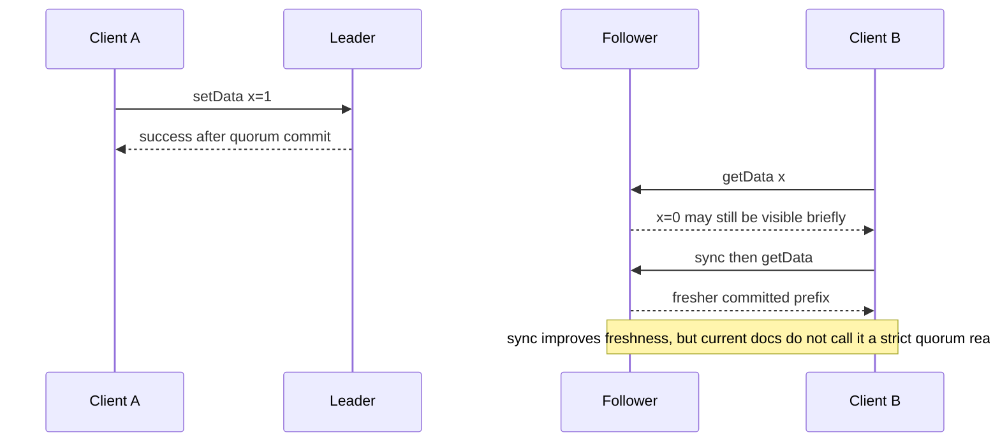

官方 3.9 Internals 明确给出更精确的描述：写是 linearizable；读不是 linearizable，而是 sequentially consistent；总体模型是 ordered sequential consistency。若业务真的要求“读一定发生在某个已完成写之后”，最稳妥的协议通常是让读依赖该写的成功结果、版本或业务回执，而不是把任意 follower 本地读当成线性化读。

另外，不同客户端不会在每一个真实时间点拥有完全相同的视图。Watch 也不会把这个事实改造成同步广播。

## 5. Session：连接可以恢复，过期不可复活

Session 是 ZooKeeper 客户端身份和临时所有权的基础。它不是某一条 TCP 连接：连接断开后，只要 Session 尚未被 ensemble 判定过期，客户端可以连接到另一台 server，携带 Session ID 和密码继续使用。

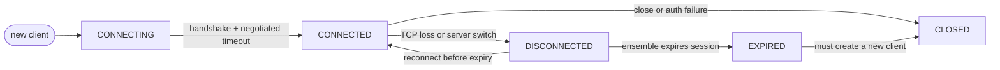

服务端会协商最终 Session timeout。默认下限是 `2 × tickTime`，上限是 `20 × tickTime`；应用传入的值不一定就是最终值，应读取客户端实际协商结果。

### 5.1 `Disconnected`、`Expired` 和进程暂停是三件事

- `Disconnected`：当前没有 server 连接，Session **可能仍有效**；期间收不到远端 Watch；
- `Expired`：ensemble 已结束 Session，临时节点会被删除，原 Session 永远不能恢复；
- 长 GC 或线程饥饿：进程可能仍在运行，却没能及时发送心跳，最终也会导致 Session 过期。

这会产生典型的旧主问题：进程 A 暂停，Session 过期；B 看到 A 的临时节点删除并成为新 Leader；A 恢复后仍可能持有数据库连接并继续写。**所以临时节点证明的是 ZooKeeper Session 所有权，不是对外部资源的物理隔离。**

正确策略是：

1. 一收到连接中断，就停止新的权威副作用或进入保守模式；
2. Session 丢失后销毁本地领导状态，重新参与选举；
3. 每次领导权分配单调递增 token；
4. 数据库、网关或下游写入口拒绝旧 token。

### 5.2 不要手工“接管”别人的 Session

Session ID 和密码允许另一个客户端恢复 Session。二者应视作一组敏感凭据；把它们复制给两个同时运行的进程，会产生互相踢连接、共享临时节点所有权和难以推理的行为。Session 恢复只适合受控的单实例迁移，不是高可用的双活捷径。客户端使用的 chroot 只改变路径视图，也不是认证或租户隔离边界。

## 6. Watch：它是失效提示，不是变化日志

标准 Watch 的正确使用模型是：**原子地读取一个快照并登记一次通知；通知到来后重新读取完整状态。**

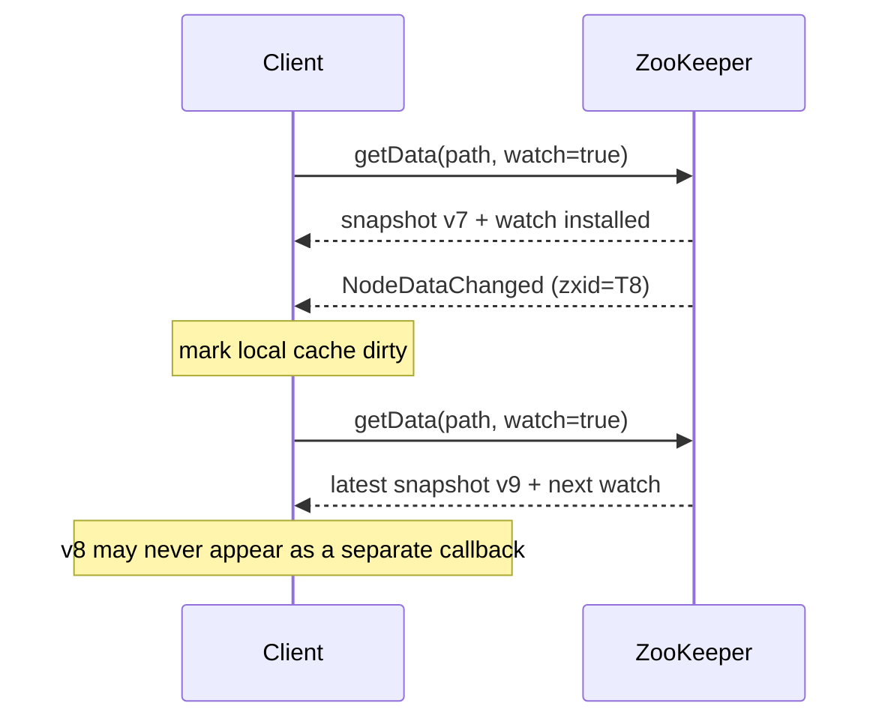

标准 Watch 有四个关键事实：

1. **一次性**：触发后要在下一次 read 中重新登记；
2. **只表示可能变化**：事件不携带完整新值，应重新读取；
3. **可能合并多个变化**：从 v7 到 v9 只收到一次通知是合法的；
4. **断线期间没有实时通知**：重连会自动恢复大部分 Watch，但“未存在节点在断线期间创建又删除”可能完全看不到。

Watch 仍提供有价值的顺序保证：对同一客户端，Watch、异步回复和其他事件按 ZooKeeper 观察到的顺序交付；客户端不会先读到新数据，再收到对应的旧通知。正因为这些回调在客户端事件线程上串行交付，回调必须迅速完成：只标记缓存失效或把工作移交给业务执行器，不能在里面做阻塞 I/O。3.9 的 `WatchedEvent` 可以携带事件 zxid；连接旧 server 时该值可能是 `-1`，不能把它当成始终可用的业务游标。

### 6.1 data watch 与 child watch 不相同

- `exists()` / `getData()` 产生 data watch；
- `getChildren()` 产生 child watch；
- 修改节点数据不会等同于修改父节点的 children；
- 创建或删除子节点会触发父节点的 child watch；
- 删除一个节点会影响该节点的数据 Watch 以及父节点的 children Watch。

把所有变化都挂在一个父目录的 `getChildren` 上，很容易漏掉子节点数据更新。

### 6.2 Persistent 与 Recursive Watch

3.6 起可以用 `addWatch()` 建立不会在触发后移除的 persistent watch，并可选 recursive：

```java
zooKeeper.addWatch(
    "/apps/order-service",
    this::onWatchEvent,
    AddWatchMode.PERSISTENT_RECURSIVE);
```

它减少重新登记窗口，但仍不是事件存储：消费者停机时不能靠 Watch 回放所有历史。persistent recursive watch 会触发节点创建、删除和数据变化；不会额外发 `NodeChildrenChanged`，因为具体子节点事件已覆盖该信息。大树上的递归 Watch 还会增加服务端路径匹配和客户端处理压力。

对于配置缓存，推荐状态机是：

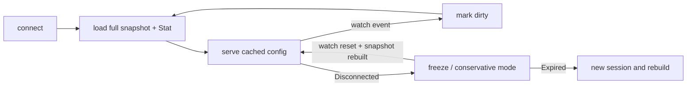

Apache Curator 的 `CuratorCache` 和 `PersistentWatcher` 能管理重连与恢复，但应用仍要定义“缓存尚未完成初始同步时是否可服务”。[Curator Cache](https://curator.apache.org/docs/recipes-curator-cache/) · [Persistent Watcher](https://curator.apache.org/docs/recipes-persistent-watcher/)

## 7. 失败语义：超时不等于失败，重试不等于安全

ZooKeeper 写操作可能已经在服务端提交，但响应在网络中丢失。客户端看到 `ConnectionLoss` 或超时，只能得到一个结论：**结果未知**。

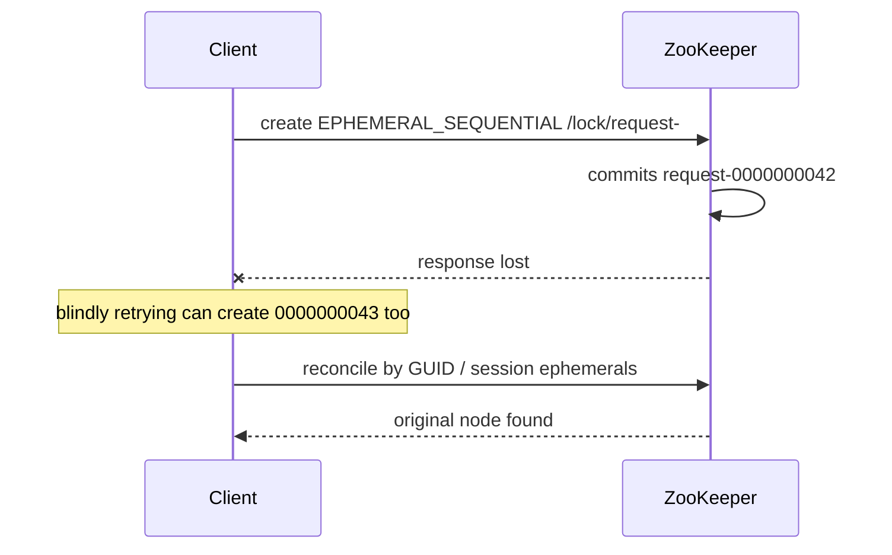

不同操作的恢复方式不同：

| 操作 | 结果未知后怎样收敛 |
| --- | --- |
| 固定路径 `create` | `exists/getData` 检查是否已是期望内容与请求 ID |
| `setData(version)` | 读取新值和 version；判断原写是否已发生，不能只重复旧 version |
| `delete(version)` | `NoNode` 可能表示原删除已成功，也可能是别人删除，需业务身份 |
| 顺序节点 `create` | 在节点数据/前缀中写 GUID，枚举并找回属于本请求的节点；Curator recipe 可用 protection 模式封装这一步 |
| `multi` | 读取所有受影响状态，使用事务 ID 或版本条件判断整组是否提交 |

成熟库可以封装 recipe 的恢复，但不能凭空推导业务意图。请求中最好携带稳定的 operation ID，而不是依赖“重试三次大概率成功”。

### 7.1 原子多操作与版本检查

`multi` 可以把多项写操作作为一个 ZooKeeper 事务：全部成功，或全部不生效。

```java
List<Op> ops = List.of(
    Op.check("/shards/42/epoch", expectedVersion),
    Op.setData("/shards/42/epoch", encode(nextEpoch), expectedVersion),
    Op.create("/shards/42/owners/owner-", ownerBytes,
        ZooDefs.Ids.CREATOR_ALL_ACL, CreateMode.EPHEMERAL_SEQUENTIAL)
);

List<OpResult> results = zooKeeper.multi(ops);
```

`CREATOR_ALL_ACL` 只允许创建者身份访问，但前提是客户端已经成功认证；未认证连接没有可用于生成 creator ACL 的身份，示例会失败。生产代码还应由统一 `ACLProvider` 建立命名空间策略，避免每个调用点随意选择权限。

这保证的是 **ZooKeeper 内部这些操作的原子性**，不包含数据库更新、消息发布或 HTTP 调用。跨系统原子性仍需要 outbox、幂等、补偿或 fencing 等独立协议。

读操作也可以放入 multi-read，但读组与写组属于不同的 operation kind，不能把任意读写混成一个“数据库事务”。需要 read-modify-write 时，先读版本，再以 `Op.check` 约束写事务。

## 8. 配方一：服务发现与成员关系

一个简单成员目录可以让每个实例创建临时节点：

```text
/services/pricing/members/
  member-0000000107 -> {host, port, zone, build, startedAt}
  member-0000000108 -> {host, port, zone, build, startedAt}
```

消费者监听成员目录，收到通知后重新读取全部 children 与数据，再构建路由快照。

“列 children，再逐个 `getData`”不是一个原子快照：读取过程中成员可能加入或退出，`getData` 可能返回 `NoNode`，已有成员数据也可能换了 version。实现应容忍这些竞态，遇到缺失或版本变化就丢弃本轮并在同一串行刷新循环里重新校准。只挂父目录的 child watch 看不到存量成员的数据更新，因此可以规定成员 payload 创建后不可变、变更时重建节点；若允许原地更新，则用 CuratorCache 或 persistent-recursive watch 覆盖整棵成员子树并维护最终一致投影。不能因为某一次循环缺了一条数据就宣布集群损坏。

但这里有几个边界：

- 临时节点消失表示 Session 已结束，不是精确的进程崩溃时间；
- 网络抖动可能让成员暂时无法服务，却尚未过期；
- 新 Session 会创建新节点，实例身份与 Session 身份要分开；
- 节点数据应包含稳定 instance ID、可观测 endpoint 和兼容版本；
- 客户端必须有无成员、成员快速抖动和缓存过期时的降级策略。

ZooKeeper 是成员事实源，不应让每个业务请求都同步读取 ZooKeeper。读取成员快照、建立本地负载均衡并通过 Watch 失效缓存，才是常见热路径。

## 9. 配方二：Leader 选举与惊群控制

标准公平选举使用 `EPHEMERAL_SEQUENTIAL`：

1. 每个参与者在选举目录创建临时顺序节点；
2. 列出并按完整序号排序；
3. 最小节点获得领导权；
4. 其他节点只 Watch 自己的直接前驱；
5. 如果“读取前驱”和“登记 Watch”之间前驱已经消失，立即重新列举，而不是等待一个不会来的事件；
6. 前驱删除后，重新读取列表并判断，而不是直接宣布自己获胜。

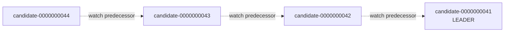

如果所有候选者都 Watch 最小节点，Leader 离开时所有客户端同时醒来并读取 children，形成 herd effect。监听直接前驱使每次只唤醒一个候选者。

### 9.1 获胜不是授权完成

领导权要转化成单调 epoch，再由下游执行 fencing：

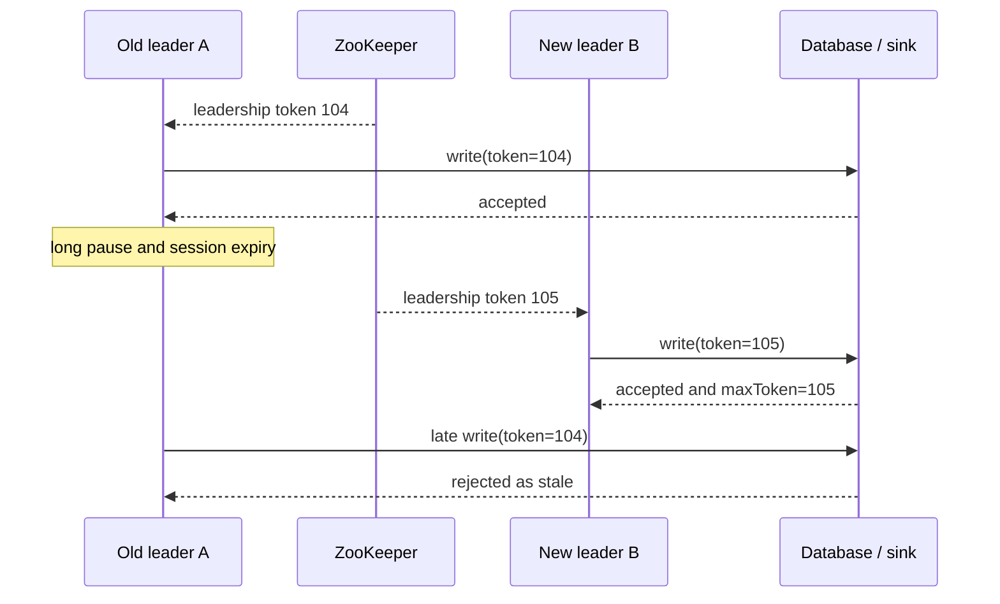

长寿命系统应优先在专用 epoch znode 中，以 CAS 或 `multi` 分配一个不会随 Session 复用的 64 位业务任期。顺序节点后缀适合解释算法或有明确寿命上界的目录，但它受父路径作用域、删除重建和 32 位溢出约束，不应直接当永久 fencing token；Session ID、`ephemeralOwner` 和本地 `hasLeadership` 布尔值也都不是 token。无论 token 由 ZooKeeper 还是业务控制面分配，都必须满足：

- 对同一资源严格单调；
- 每个权威写请求都携带；
- 下游持久记录已接受的最大 token；
- 小 token 在所有入口都被拒绝。

这正是 [有状态服务高可用架构](/signal-grid-blog/posts/high-availability-stateful-service/) 中“选主只是开始”的具体实现基础。

## 10. 配方三：锁、队列与屏障

### 10.1 分布式锁

锁和选举使用相同的临时顺序队列。获得最小序号的客户端进入临界区，其余 Watch 前驱。公平性是按 ZooKeeper 看到的创建顺序，而不是墙上时钟或线程启动时间。

但是分布式锁不能单独解决：

- 持锁进程长暂停后恢复造成的旧写；
- 临界区中的跨系统事务；
- 连接结果未知导致的重复候选节点；
- 不合作客户端绕过锁直接写资源。

所以“锁 + fencing”通常比单独的锁更完整。使用 Curator `InterProcessMutex` 时也要监听连接状态：`SUSPENDED` 时无法确定仍持锁，`LOST` 时可以确定已经失去锁。锁 recipe 自己使用的路径也应独占，不能与应用数据节点混用。[Curator Shared Reentrant Lock](https://curator.apache.org/docs/recipes-shared-reentrant-lock/)

### 10.2 队列

持久顺序节点可以表示按 ZooKeeper 顺序排列的任务。但它不是高吞吐消息队列：每条任务都是数据树写入、Watch 与删除，积压会占用 ensemble 内存、快照和日志。官方 recipes 更适合解释排序原理，生产任务流通常应优先选择 Kafka、Pulsar 或专用队列。

如果确实使用：

- 用单消费者才能得到明确的全局 FIFO 消费顺序；
- 多消费者要设计 claim/ack 与失败恢复；
- 连接失败后要找回可能已创建的任务节点；
- 队列无限增长不是容量策略。

### 10.3 屏障

Barrier 节点存在表示阻塞，删除表示放行；double barrier 还会用成员子节点统计进入与离开数量。它适合低频协调，不适合每批业务请求都走一次全局同步。

## 11. Java 工程实践：原理看原生 API，生产优先 Curator

ZooKeeper 原生 Java client 暴露最直接的语义，但连接管理、重试、Watch 重建和 recipe 错误处理很容易重复造轮子。Apache Curator 5.9.0 提供成熟封装。[Curator Getting Started](https://curator.apache.org/docs/getting-started/) · [Curator Recipes](https://curator.apache.org/docs/recipes/)

```xml
<!-- 直接固定安全基线；不要只接受 Curator 传递进来的 ZooKeeper 版本。 -->
<dependency>
  <groupId>org.apache.zookeeper</groupId>
  <artifactId>zookeeper</artifactId>
  <version>3.9.5</version>
</dependency>
<dependency>
  <groupId>org.apache.curator</groupId>
  <artifactId>curator-framework</artifactId>
  <version>5.9.0</version>
</dependency>
<dependency>
  <groupId>org.apache.curator</groupId>
  <artifactId>curator-recipes</artifactId>
  <version>5.9.0</version>
</dependency>
```

Curator 5.9.0 自己的 parent POM 仍把传递 ZooKeeper 版本设为 3.9.3，因此只写 Curator 依赖会偏离本文的 3.9.5 安全基线。实际工程应在 dependency management 或直接依赖中固定 3.9.5，并用 `mvn dependency:tree`、Maven Enforcer 或 Gradle dependency insight 确认最终解析版本，而不是相信源码中写过一个版本号就一定生效。

### 11.1 连接和状态监听

```java
RetryPolicy retryPolicy = new ExponentialBackoffRetry(1_000, 3);

CuratorFramework client = CuratorFrameworkFactory.builder()
    .connectString("zk1:2181,zk2:2181,zk3:2181/app/order-service")
    .sessionTimeoutMs(20_000)
    .connectionTimeoutMs(5_000)
    .retryPolicy(retryPolicy)
    .build();

client.getConnectionStateListenable().addListener((c, state) -> {
    switch (state) {
        case SUSPENDED -> authority.pauseWrites();
        case LOST -> authority.dropLeadershipAndRebuild();
        case RECONNECTED -> authority.revalidateBeforeServing();
        default -> { }
    }
});

client.start();
if (!client.blockUntilConnected(10, TimeUnit.SECONDS)) {
    client.close();
    throw new IllegalStateException("ZooKeeper connection was not established");
}
```

`start()` 只发起异步连接，不等于客户端已经可用；示例用有界等待建立启动门禁，真实服务还要把连接状态纳入 readiness。重试策略决定请求何时再次尝试，不会让非幂等操作自动变得幂等，也不能延长服务端已经过期的 Session。

### 11.2 配置缓存

```java
CuratorCache cache = CuratorCache.build(client, "/config");

ExecutorService configExecutor = Executors.newSingleThreadExecutor(runnable -> {
    Thread thread = new Thread(runnable, "config-refresh");
    thread.setDaemon(true);
    return thread;
});

CuratorCacheListener listener = CuratorCacheListener.builder()
    .forAll((type, oldData, data) -> configExecutor.execute(() ->
        activeConfig.set(reloadAndValidate(client, "/config"))))
    .forInitialized(() -> configExecutor.execute(() -> {
        activeConfig.set(reloadAndValidate(client, "/config"));
        readiness.markReady();
    }))
    .build();

cache.listenable().addListener(listener);
cache.start();
```

回调里不要执行长时间阻塞工作。上例把所有重建放进同一个串行执行器，并等 `initialized` 事件后的全量读取完成才打开 readiness；若换成多线程执行器，旧 reload 可能后完成并覆盖新值。也不要用“整棵树最大的 `mzxid`”判断快照新旧：删除最大 zxid 节点会让它倒退，多节点逐个读取本身也不是原子快照。需要整组配置原子发布时，应写入不可变版本目录，再用一个带 64 位业务 generation 的 pointer znode 原子切换。事件只触发“重建快照”，不直接按回调顺序增量修改关键配置。

### 11.3 Leader recipe

Curator 提供 `LeaderLatch` 和 `LeaderSelector`。若需要一个长期持有、显式关闭的 Leader 身份，`LeaderLatch` 简单；若希望在 `takeLeadership` 回调返回时主动交棒，`LeaderSelector` 更贴近轮换式工作。要让当前实例继续参与下一轮，必须显式调用 `leaderSelector.autoRequeue()`；它不是默认行为。

无论选哪一个，都应把“拥有 recipe 的本地布尔值”和“具备业务写权限”分开：只有状态恢复、版本校验、token 分配、下游 fencing 和 readiness 全部通过后，才开放业务入口。

## 12. 生产部署：3 个投票成员起步，5 个要有理由

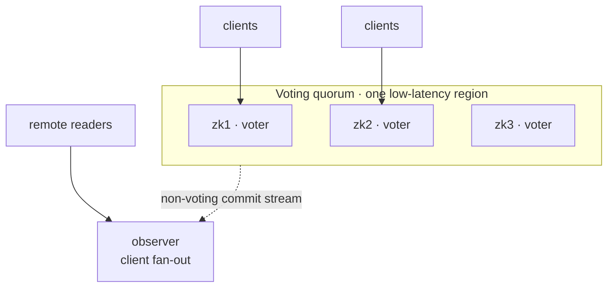

### 12.1 成员数与故障域

- 3 voters 是常见最小生产规模，放在独立机器或故障域；
- 5 voters 允许同时损失 2 个，但每次写要等待更大的 quorum；
- 不要为了“看起来更冗余”随意加到 4 或 6；
- voters 之间需要稳定、低延迟网络，跨高延迟地域部署会放大写延迟和误判风险；
- Observer 不投票，可以扩展客户端连接和本地读，也可隔离远端接入，但不增加 quorum 容错。

对 `N` 个投票成员，提交多数派是 `floor(N / 2) + 1`，能同时容忍的 voter 故障数是 `floor((N - 1) / 2)`。因此 4 个 voter 与 3 个 voter 都只能容忍 1 个故障，却让正常提交多等一个 ACK；扩容应从 3 走到 5，而不是简单加一台。

Observer 的写请求仍会转发给 Leader，读仍是 Observer 本地副本读。它不是异步只读备份，也不提供更强读取一致性。[Observers Guide](https://zookeeper.apache.org/doc/current/zookeeperObservers.html)

### 12.2 磁盘和延迟

事务日志是写入确认路径的一部分，存储抖动会直接进入尾延迟和 quorum 健康：

- `dataLogDir` 最好使用独立、稳定低延迟设备；
- `dataDir` 保存快照，避免与 WAL 抢同一繁忙磁盘；
- 不要在同一主机上用多个 ZooKeeper 进程伪装故障隔离；
- 关注 fsync、磁盘空间、I/O await、GC pause 和网络重传；
- 不要用平均延迟掩盖 p99/p999 和偶发 fsync 长尾。

`forceSync=true` 是默认的持久性边界：服务端在确认事务前要求日志同步到稳定存储。关闭它也许能让错误基准更漂亮，却可能在电源或内核故障后丢失已经确认的事务，不应作为常规调优手段。客户端连接还要关注 `maxClientCnxns`：默认按“单个客户端 IP 到单台 server”限制为 60，NAT 或四层负载均衡会把大量实例汇聚到一个源 IP，必须结合真实拓扑评估，而不是盲目调大。

### 12.3 Session timeout 不是越短越好

短 timeout 提升故障发现速度，却更容易把 GC、CPU 饥饿或网络抖动变成 Session 过期；长 timeout 降低误判，却增加成员移除和接管延迟。应基于真实暂停分布、网络故障和 RTO 目标测量，不要从博客复制一个固定秒数。

### 12.4 动态成员变更

Dynamic Reconfiguration 默认 `reconfigEnabled=false`。启用后必须给 `reconfig` 操作配置严格 ACL、认证和审计，因为它能改变 quorum 组成。滚动扩缩容还要避免一次替换过多成员，确保旧配置 quorum 与新配置的过渡保持安全。`reconfig` 返回新配置并不等于被移除进程已经可以立刻停机；仍要确认新成员完成同步、ensemble 稳定且客户端地址更新，再按 runbook 下线旧成员。[Dynamic Reconfiguration](https://zookeeper.apache.org/doc/current/zookeeperReconfig.html)

## 13. 安全：默认安装不是生产安全基线

Apache 官方安全页明确说明：ZooKeeper 面向受信网络，默认没有传输加密、peer 身份认证，常见节点还会以 `OPEN_ACL_UNSAFE` 创建。安全能力是 opt-in。

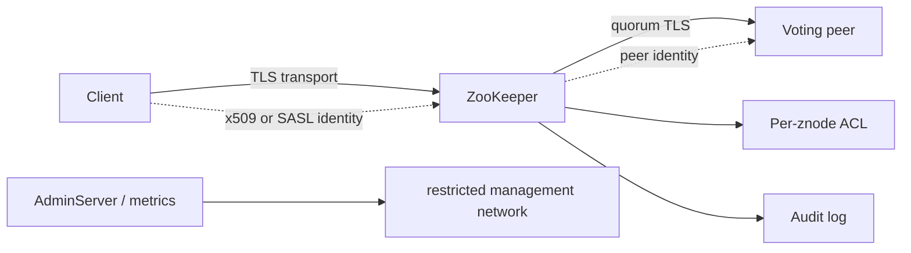

生产至少需要逐项决定：

1. **网络隔离**：client、quorum、election、AdminServer 和 metrics 端口只向必要网络开放；
2. **传输加密**：客户端使用 `secureClientPort`；成员间按官方滚动步骤启用 `sslQuorum`；
3. **身份认证**：优先 SASL/Kerberos 或 x509/mTLS；digest 会传输密码并保存无盐 SHA-1，不适合高安全凭据；
4. **ACL**：按 znode 设置最小 `CREATE/READ/WRITE/DELETE/ADMIN` 权限；创建和删除检查父节点的 `CREATE/DELETE`，读取、改数据和改 ACL 检查目标节点的 `READ/WRITE/ADMIN`；父节点 ACL 不会递归保护 children；
5. **强制认证**：根据环境设置 `enforce.auth.enabled` 与允许 scheme；
6. **审计**：`audit.enable=true`，并为审计日志单独配置轮转、采集与告警；
7. **管理面**：优先 AdminServer 与认证保护，不要把危险 four-letter commands 全量白名单暴露出去。

这里的“限制管理面”必须落成配置，而不是网络图上的愿望。3.9.5 的 AdminServer 默认启用、监听 `0.0.0.0:8080`、默认使用 HTTP，`admin.needClientAuth=false`，snapshot/restore 命令也默认可用。不使用就关闭 AdminServer 或分别关闭危险命令；需要使用时至少限定 bind address、管理网、防火墙、HTTPS 与 client auth，再审计访问。

`ruok` 只有显式放入 four-letter command whitelist 后才可调用，而默认 whitelist 只有 `srvr`。即使 `ruok` 返回 `imok`，也只表示进程在 client port 上响应，不证明它已经加入 quorum、能够提交写入或磁盘健康。健康检查至少要结合角色、zxid/同步状态、延迟和一次受控的业务级探针。

## 14. 持久化、快照与灾难恢复

每个 server 维护内存数据树、事务日志和周期快照。快照不是“某一时刻之后不需要日志”的单文件备份；恢复通常要加载快照，再重放后续 WAL。

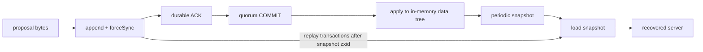

### 14.1 清理不是删除最新几个文件那么简单

`autopurge.snapRetainCount` 默认保留 3 份，`autopurge.purgeInterval` 默认 0，意味着自动清理默认没有启用。事务日志与快照有恢复依赖，应用应使用官方 purge 机制，不要按文件时间自行 `rm`。

### 14.2 Snapshot/Restore 的角色

3.9 文档提供 AdminServer 的在线 snapshot stream 和 restore 流程，用于 quorum 灾难性丢失或建立带种子数据的新集群。恢复时所有成员应使用同一份 snapshot，先阻断客户端流量，移走原 data/log 目录，再逐节点 restore；不能在仍接受业务写入时随意把不同时间点快照混在一个 ensemble 中。[Snapshot and Restore Guide](https://zookeeper.apache.org/doc/current/zookeeperSnapshotAndRestore.html)

备份是否可用必须靠定期恢复演练验证，至少检查：

- 选取快照的 zxid 和来源；
- ACL、配额、持久节点和关键配置是否完整；
- 临时节点不会作为长期业务事实被错误依赖；
- 恢复后的 `myid` 与 `server.<id>` 映射、动态配置版本、客户端连接串和 chroot 正确；
- 客户端重新建立 Session 后能重建成员、Watch 与本地缓存。

### 14.3 升级

ZooKeeper 官方目前同时维护 3.8 与 3.9 两条线。升级前应阅读目标补丁版 release notes 和 Upgrade FAQ，先升级到各分支最新补丁，再按官方支持路径滚动推进。客户端与服务端兼容不等于新 API 可以在旧 server 上使用；persistent watch、同步 `sync()` 等能力仍要按最老 server 版本判断。

## 15. 可观测性：从“进程活着”走到“协议健康”

3.6 起的新 Metrics System 可以通过内置 Prometheus provider 导出。不要原样照搬官方示例阈值；应为自己的基线建立以下仪表盘：

| 维度 | 观察什么 | 常见含义 |
| --- | --- | --- |
| 请求 | 吞吐、p50/p95/p99、outstanding、throttle | 入口压力或处理器拥塞 |
| 磁盘 | fsync 延迟、snapshot 时间、WAL/快照大小、剩余空间 | 写长尾、恢复风险 |
| quorum | Leader 变化、follower sync、zxid 差距、ZAB phase | 网络分区或落后副本 |
| Session | 连接数、过期数、认证失败、revalidation | 客户端抖动或配置错误 |
| Watch | Watch 总数、触发率、递归 Watch 覆盖 | 内存压力、惊群 |
| JVM | GC pause、heap、direct memory、线程和 fd | Session 误过期或进程失稳 |

Prometheus provider 示例：

```properties
metricsProvider.className=org.apache.zookeeper.metrics.prometheus.PrometheusMetricsProvider
metricsProvider.httpHost=127.0.0.1
metricsProvider.httpPort=7000
metricsProvider.exportJvmInfo=true
```

不要把 metrics 端口默认绑定到全网并裸露出去。官方 Monitor Guide 中的 `znode_count > 1000000`、`watch_count > 10000` 等只是示例，不是普适安全线；阈值要来自内存模型、容量测试和历史分位数。[Monitor Guide](https://zookeeper.apache.org/doc/current/zookeeperMonitor.html)

### 15.1 症状到证据的排查路径

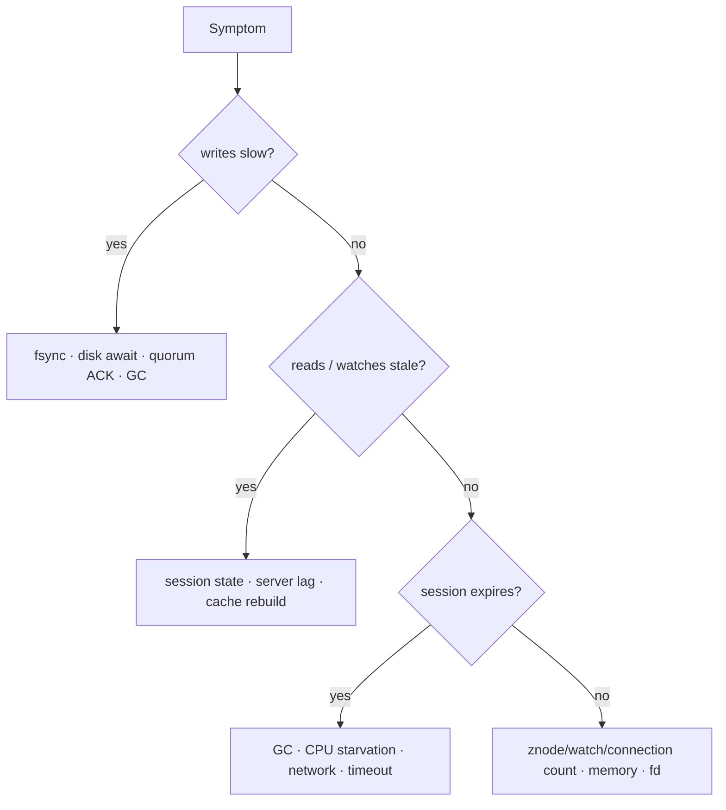

常见 runbook：

- **写延迟升高**：先找慢 fsync 和 quorum ACK，不要先调大线程池；
- **频繁选举**：查网络、GC、磁盘卡顿和 `initLimit/syncLimit`，不要只加 timeout 掩盖；
- **Follower 反复追赶**：查 txn log 保留、snapshot 大小、网络带宽与同步限流；
- **Session 大量过期**：同时看客户端暂停和 server 端拥塞；
- **Watch 暴涨**：按 Session 和路径定位递归覆盖范围，避免每个请求新建客户端；
- **磁盘将满**：先确认可恢复的 purge 范围并扩容，禁止边运行边手删未知 WAL；
- **ACL 错误**：用 `whoami`、审计日志和具体 znode ACL 排查，不要临时改成 world:anyone。

## 16. 最容易踩的十二个坑

1. 把 ZooKeeper 当成强一致的通用 KV 数据库；
2. 认为 CAP 的 CP 标签等于所有普通读都线性化；
3. 把 Watch 当成每次变化都不丢的事件流；
4. 在 Watch 回调里直接按增量修改关键状态，而不重新读快照；
5. 把 TCP 断开等同于 Session 过期；
6. 把临时节点或 Curator `hasLeadership()` 当成外部写权限；
7. 选主后没有 fencing token，旧主恢复仍可写；
8. 对 `ConnectionLoss` 无脑重试顺序节点创建；
9. 所有候选者都 Watch Leader，制造 herd effect；
10. 使用 `OPEN_ACL_UNSAFE`，误以为父 ACL 会保护所有孩子；
11. 把大配置、任务积压或业务日志塞进 znode；
12. 只备份文件但从不执行完整 restore 演练。

## 17. 一条可执行的设计清单

在引入 ZooKeeper 前，把以下答案写进设计文档：

- ZooKeeper 中每条路径保存的协调事实是什么，最大大小和基数是多少？
- 哪些数据是 persistent，哪些身份必须绑定 Session？
- 普通读允许多旧；需要 read-after-write 时使用什么协议？
- Watch 触发后怎样重建完整状态；断线期间如何降级？
- `ConnectionLoss` 后每一种写怎样判定是否已经成功？
- Leader/lock 的 token 怎样生成，下游在哪里拒绝旧 token？
- 3 个还是 5 个 voters，故障域和网络延迟依据是什么？
- Session timeout 如何从 GC、网络和 RTO 数据推导？
- TLS、认证、ACL、管理面、审计分别怎样配置？
- WAL、快照、purge、异地备份和恢复演练怎样闭环？
- 哪些指标定义“可提交写入”，而不只是“进程活着”？

如果这些问题没有答案，换成 Curator 也只是把 API 写得更短，并没有让分布式协议变正确。

## 参考资料

- [Apache ZooKeeper Releases](https://zookeeper.apache.org/releases/)
- [ZooKeeper Overview](https://zookeeper.apache.org/doc/current/zookeeperOver.html)
- [Programmer's Guide](https://zookeeper.apache.org/doc/current/zookeeperProgrammers.html)
- [ZooKeeper Internals](https://zookeeper.apache.org/doc/current/zookeeperInternals.html)
- [Recipes and Solutions](https://zookeeper.apache.org/doc/current/recipes.html)
- [Administrator's Guide](https://zookeeper.apache.org/doc/current/zookeeperAdmin.html)
- [Observers Guide](https://zookeeper.apache.org/doc/current/zookeeperObservers.html)
- [Dynamic Reconfiguration](https://zookeeper.apache.org/doc/current/zookeeperReconfig.html)
- [Snapshot and Restore Guide](https://zookeeper.apache.org/doc/current/zookeeperSnapshotAndRestore.html)
- [Monitor Guide](https://zookeeper.apache.org/doc/current/zookeeperMonitor.html)
- [ZooKeeper Security](https://zookeeper.apache.org/security/)
- [Apache Curator 5.9.0](https://curator.apache.org/download/)
- [Curator Recipes](https://curator.apache.org/docs/recipes/)
