“这个 Java 组件平均只要 800 ns，所以它是低延迟的。”

这句话几乎没有可验证的信息。800 ns 测的是一个方法、一次队列交接，还是请求从网卡进入到响应离开？是在空载、稳定流量还是队列已满时测得？平均值背后有没有 20 ms 的停顿？失败、超时和被拒绝的请求是否从样本里消失了？JVM 是否完成编译？测试机是否正被别的容器抢走 CPU？

**低延迟不是某个数字，而是一条证据链。** 正确的测试要把业务承诺、测量边界、到达模型、JVM 生命周期、硬件环境、统计方法和生产验证连起来。少掉其中一环，就很容易把“测试工具跑出了一个数”误当成“系统满足了延迟目标”。

这是“Java 低延迟工程”的 Chapter 02。上一章 [Java Memory Model 与 VarHandle](/signal-grid-blog/posts/java-memory-model-varhandle-memory-ordering/) 解决的是“程序是否正确”；本章解决“正确实现是否真的更快，以及代价是什么”。下一章会先把证据放回 [Cache、局部性、伪共享与 NUMA 的机器模型](/signal-grid-blog/posts/java-low-latency-machine-model-cache-locality-false-sharing-numa/)，后续的 [Disruptor](/signal-grid-blog/posts/lmax-disruptor-ring-buffer-and-sequencing/) 与 [Agrona](/signal-grid-blog/posts/agrona-direct-buffer-queues-and-agents/) 再把三层基础用于具体组件。

本文以 **JDK 25** 与 **JMH 1.37** 为示例基线。工具版本会变化，测量原则不会：先写清问题，再选择实验层级；先保证负载与样本没有撒谎，再解释结果。

## 1. 先别启动 JMH：你究竟要证明什么

一次性能实验至少要写出下面六项，缺一项就无法复现。

| 项目 | 必须明确的内容 | 错误示例 |
| --- | --- | --- |
| 对象 | 哪段代码、哪个组件、哪条业务链路 | “测 Java 性能” |
| 人群 | 哪类请求、消息大小、命中率、读写比 | 把所有接口混成一个分布 |
| 边界 | 从哪个时刻开始，到哪个时刻结束 | 只写“接口耗时” |
| 负载 | 到达率、并发数、突发形状、持续时间 | 只写“100 个线程” |
| 目标 | 吞吐、p99.9、超时率、CPU 或成本上限 | 只追求平均延迟最低 |
| 约束 | 数据一致性、背压、可靠性、资源预算 | 通过丢请求换取低延迟 |

一个可以执行的目标应像这样：

> 在 16 核生产规格主机上，订单校验链路处理 800 字节请求；持续到达 80,000 次/秒，另叠加每 30 秒一次、持续 500 ms 的 1.5 倍突发。预热 15 分钟后连续测 60 分钟。成功请求的端到端 p99.9 不超过 2 ms，p99.99 不超过 8 ms；超时与拒绝合计不超过 0.01%；单实例 CPU 不超过 12 核，且不降低原有一致性语义。

这里每个数字都能被测试程序检查。它也明确告诉我们：单独测一个 `offer()` 的纳秒数远远不够。


### 1.1 延迟、吞吐与可靠性必须一起看

低延迟系统至少同时报告：

- **offered rate**：测试端计划送入多少工作；
- **accepted rate**：系统实际接受多少工作；
- **completed rate**：最终观察到业务正确结果的工作量，不论是否越过延迟目标；
- **goodput**：业务正确、并且在 SLO 截止时间内完成的工作量；
- **rejected / timeout / error / drop**：其他外部结果，以及超时后又完成的迟到结果；
- **延迟分布**：p50、p90、p99、p99.9、p99.99 与最大值；
- **资源与积压**：CPU、分配率、GC、队列深度、线程阻塞和容器 throttling。

如果系统在压力下拒绝了一半请求，剩下一半的 p99 当然可能很好看。只报告“成功样本延迟”会把容量不足伪装成低延迟。

### 1.2 先固定语义，再比较实现

两个实现只有在业务语义相同时才可以比较：

- SPSC 队列不能代表 MPMC 队列；
- 丢弃模式不能直接对比可靠重试模式；
- 只写页缓存不能冒充同步落盘；
- 异步提交不能和等待副本确认只比响应时间；
- 空 payload 不能代表真实的序列化、校验与状态更新。

先把输入、输出、失败策略和持久性边界写成测试断言，再谈快慢。**正确性是性能比较的准入条件，不是结果表里的一列。**

## 2. 四层证据：每层回答不同问题

低延迟测试不是在 JMH 与压测工具之间二选一。可靠结论通常来自四层实验。

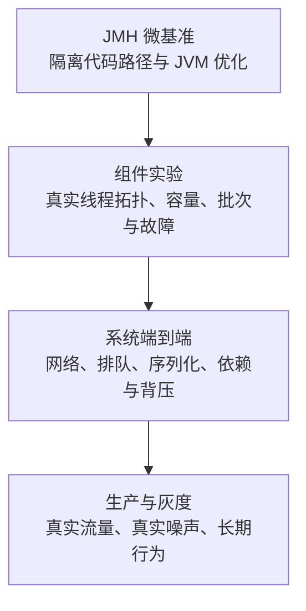

| 层级 | 适合回答 | 不能单独回答 |
| --- | --- | --- |
| JMH 微基准 | 某个方法、编码器、内存序或数据结构的单位成本 | 线上端到端 SLA |
| 组件实验 | 队列、事件循环、连接池在真实线程拓扑下的饱和点 | 网络和上下游依赖造成的总延迟 |
| 系统压测 | 一条完整业务链在指定流量下的响应与失败分布 | 所有生产噪声和长期漂移 |
| 生产验证 | 真实租户、数据与运维事件下是否仍满足 SLO | 单靠观察很难证明某项代码改动的因果 |

四层之间不是“越上层越准确”。微基准控制力强，但代表性窄；生产数据代表性强，但混杂因素多。最好的证据是：微基准解释机制，组件与系统实验验证外推，生产灰度确认真实收益。

## 3. 量的到底是哪段时间

先固定一条不重叠的时间线。对于独立外部到达，最完整的客户端观测是：

```text
scheduledEndToEnd
    = generatorDelay
    + requestTransport
    + serverQueue
    + handlerElapsed
    + responseTransport

handlerElapsed = applicationCompute + dependencyWait
```

- **scheduled end-to-end latency**：从计划到达，到客户端观察到最终结果；
- **generator delay**：计划时刻到客户端真正开始发送，包含生成器调度与本地排队；
- **server queue**：服务端已经收到请求，但 handler 尚未开始；
- **handler elapsed**：handler 入口到出口的墙钟时间，包含业务计算和下游等待；
- **application compute**：排除明确依赖等待后的应用执行区间，仍可能包含线程被操作系统抢占的墙钟时间；
- **CPU service time**：线程实际消耗的 CPU 时间，是另一项诊断指标，不能与 handler 墙钟耗时混用。

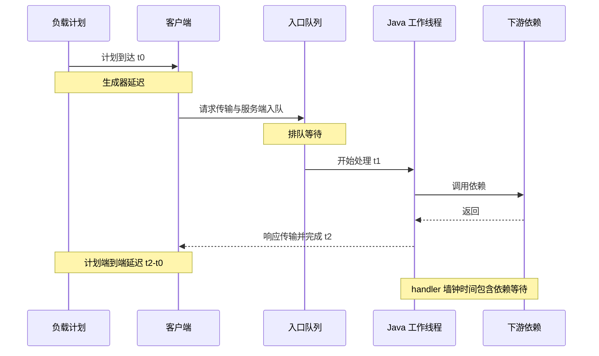

如果只在 handler 入口与出口打点，得到的是 handler elapsed；用户感受到的却是 scheduled end-to-end latency。系统接近饱和时，业务计算可能仍只需 50 μs，但入口已经排队 30 ms。

有时也会报告从“客户端实际发送”到“客户端完成”的 ingress latency，或从“服务端接收”到“服务端响应”的 server latency。它们都可以使用，但必须换名字并明确起点；不能和从计划到达起算的结果混为同一分布。

### 3.1 `System.nanoTime()` 的正确边界

Java 的 `System.nanoTime()` 用于计算**同一个 JVM 内**两个读数的差值。它与 UTC、日期或其他 JVM 的时钟原点无关；“纳秒”是返回值单位，不承诺时钟每纳秒更新一次。

```java
long start = System.nanoTime();
try {
    handle(request);
} finally {
    long elapsedNanos = System.nanoTime() - start;
    recorder.recordValue(elapsedNanos);
}
```

不要用 `currentTimeMillis()` 测短耗时：它是墙上时间，可能受时钟校正影响，粒度也不等于 1 ms。也不要把不同 JVM 各自的 `nanoTime()` 直接相减。

跨主机单向延迟只有在时钟同步误差远小于目标精度、并且你持续监控同步质量时才有意义。否则优先测同一时钟域内的 RTT，或在每个进程分别记录阶段耗时。PTP、硬件时间戳可以收紧误差，但不能靠一句“机器都开了 NTP”消除不确定性。

### 3.2 测量代码本身也有成本

时钟读取、埋点、原子计数、日志和直方图写入都会改变被测系统。目标路径只有几十纳秒时，在每次调用前后读时钟，很可能测到的主要是计时器成本。

处理办法不是把埋点全部删掉，而是分层：

1. 用 JMH 单独估计测量与空 harness 成本；
2. 微小操作按批次测量，并用 JMH 的 operation accounting 归一化；
3. 生产只采必要的低开销事件或按比例采样；
4. 比较“无诊断、轻量诊断、完整诊断”三种运行的开销；
5. 正式计分与深度 profiling 分开执行。

## 4. 平均值为何会掩盖故障

假设 99,800 个请求耗时 1 ms，200 个请求耗时 1 s。平均延迟约 3 ms，看起来仍很漂亮；但 p99.9 已经落在 1 s 的故障带里。对于会串行调用多个依赖的用户请求，尾部风险还会叠加。

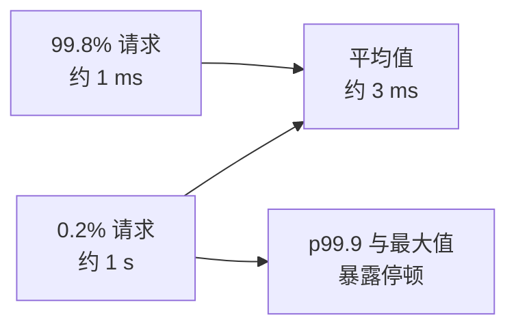

### 4.1 百分位是位置，不是概率保证

p99 = 2 ms 表示本次样本中约 99% 的观察值不超过 2 ms。它不表示“下一次请求有 99% 概率低于 2 ms”，也不自动证明未来分布稳定。

尾部分位数必须和这些信息一起发布：

- 总样本数与有效样本数；
- 实验持续时间与时间窗口；
- offered / accepted / completed / error 数；
- payload、接口和租户分组；
- 直方图精度与最大可记录值；
- 每个分位点的值，而不只是一张截图；
- 原始直方图或可合并的区间日志。

对于 p99.99，样本数为 `N` 时，理论上只有约 `N × 0.0001` 个样本位于它之后。100,000 个样本只留下约 10 个更尾部观察，结论会非常不稳。这个算式不是“最低样本数定律”，却能提醒你：分位数的小数位不能超过数据支持的精度。

### 4.2 `max` 也不能脱离时间比较

最大值随样本数和运行时间增长而更容易遇到极端事件。10 秒实验的 max 与 24 小时实验的 max 不能直接排名。报告 max 时至少同时写运行时长、样本数、异常事件和时间戳；长期运维还应保存时间切片直方图，定位 max 发生时的 GC、调度和依赖状态。

### 4.3 不要平均百分位数

两台机器的 p99 不能通过 `(p99A + p99B) / 2` 得到集群 p99。百分位是完整分布的函数，正确做法是合并精度、单位和范围兼容的直方图，再重新计算；或者保留原始样本。相同道理也适用于“把每分钟 p99 平均成一天 p99”。

## 5. JMH：测一小段 Java 代码的正确方式

JMH 是 OpenJDK 的 JVM 基准 harness，当前稳定版为 1.37。它负责 fork、预热、计量、并发状态和结果汇总，能规避很多手写循环的错误；它不是 JUnit，也不会自动替你选择有业务意义的 workload。官方建议建立独立 benchmark 工程并通过命令行运行，确保注解处理器生成 harness。

### 5.1 手写循环为什么容易骗人

下面的“基准”没有可信度：

```java
long start = System.nanoTime();
for (int i = 0; i < 1_000_000; i++) {
    codec.encode(order); // 结果没有被观察，可能被消除
}
long elapsed = System.nanoTime() - start;
System.out.println(elapsed / 1_000_000.0);
```

问题包括：

- 测试过程同时经历解释执行、分层编译与优化；
- 编译器可能证明结果无用并删除代码；
- 常量输入可能在测量前被折叠；
- 只有一个 JVM 进程，偶然布局会左右结果；
- 循环展开与跨调用优化改变被测边界；
- GC、类加载和系统噪声没有分离；
- 最终只得到一个总时间，没有方差和分布。

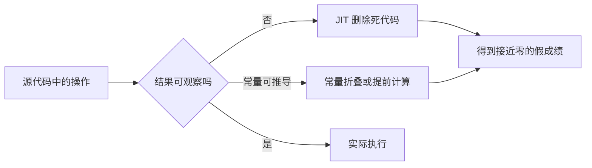

### 5.2 一个完整、可复核的 JMH 示例

下面测量两个真实 byte 数组的比较。输入在 trial 初始化，参数由 JMH 注入，返回结果被 harness 消费；fork、预热和计量全部显式写出。

```java
package benchmark;

import java.util.Arrays;
import java.util.concurrent.TimeUnit;
import org.openjdk.jmh.annotations.Benchmark;
import org.openjdk.jmh.annotations.BenchmarkMode;
import org.openjdk.jmh.annotations.Fork;
import org.openjdk.jmh.annotations.Level;
import org.openjdk.jmh.annotations.Measurement;
import org.openjdk.jmh.annotations.Mode;
import org.openjdk.jmh.annotations.OutputTimeUnit;
import org.openjdk.jmh.annotations.Param;
import org.openjdk.jmh.annotations.Scope;
import org.openjdk.jmh.annotations.Setup;
import org.openjdk.jmh.annotations.State;
import org.openjdk.jmh.annotations.Warmup;

@BenchmarkMode(Mode.SampleTime)
@OutputTimeUnit(TimeUnit.NANOSECONDS)
@Warmup(iterations = 5, time = 1)
@Measurement(iterations = 8, time = 1)
@Fork(value = 3, jvmArgsAppend = {"-Xms2g", "-Xmx2g"})
public class ByteArrayEqualsBenchmark {

    @State(Scope.Thread)
    public static class Inputs {
        @Param({"64", "1024", "8192"})
        int length;

        byte[] left;
        byte[] right;

        @Setup(Level.Trial)
        public void setup() {
            left = new byte[length];
            right = new byte[length];
            Arrays.fill(left, (byte) 7);
            Arrays.fill(right, (byte) 7);
            right[length - 1] = 8;
        }
    }

    @Benchmark
    public boolean differentAtEnd(Inputs input) {
        return Arrays.equals(input.left, input.right);
    }
}
```

建议把 JMH 放在独立模块。下面用官方 archetype 生成包含注解处理器和可执行 JAR 配置的工程；目标目录不能已经是另一个 Maven 项目：

```bash
mvn archetype:generate \
  -DinteractiveMode=false \
  -DarchetypeGroupId=org.openjdk.jmh \
  -DarchetypeArtifactId=jmh-java-benchmark-archetype \
  -DarchetypeVersion=1.37 \
  -DgroupId=org.sample \
  -DartifactId=latency-benchmarks \
  -Dversion=1.0

cd latency-benchmarks
mvn clean verify
```

把基准类放进生成工程，重新构建 fat JAR 后再从命令行运行：

```bash
java -jar target/benchmarks.jar \
  '.*ByteArrayEqualsBenchmark.*' \
  -rf json -rff results.json
```

输出文件、完整命令、Git SHA、JDK 与环境清单都应作为实验产物保存。不要只把终端中的一行 `Score` 复制进评审文档。

### 5.3 JMH 的几个关键旋钮

| 配置 | 含义 | 常见误用 |
| --- | --- | --- |
| `@Fork` | 使用新的 JVM 进程重复实验 | `fork = 0` 后把当前 IDE JVM 当正式结果 |
| `@Warmup` | 让编译、类加载与缓存逐步进入目标状态 | 看到曲线变平就宣称代表生产长期稳态 |
| `@Measurement` | 真正计入结果的迭代 | 迭代太短，只测到定时与调度噪声 |
| `Mode.Throughput` | 单位时间完成的操作数 | 把高吞吐直接翻译成低尾延迟 |
| `Mode.AverageTime` | 平均单位操作时间 | 用平均数掩盖长尾 |
| `Mode.SampleTime` | 随机采样部分操作并给出分布，可能漏掉某些 pause | 误认为等价于端到端开放负载 |
| `Mode.SingleShotTime` | 测一次 invocation，常用于冷启动或批次 | 没有独立设计 warmup 与 fork |
| `@State` | 定义状态的共享范围 | 把 `Scope.Thread` 的无竞争结果外推到共享对象 |
| `@Param` | 扫描输入维度 | 只测一个刚好命中缓存的尺寸 |

不同问题应使用不同模式。编码器吞吐可用 Throughput；单次操作分布可用 SampleTime；冷启动、反序列化大批次可考虑 SingleShotTime。最终 SLA 仍要在系统负载实验中验证。

### 5.4 状态范围就是并发模型

- `Scope.Thread`：每个 benchmark 线程独享状态，适合无竞争路径；
- `Scope.Benchmark`：所有线程共享同一个状态，适合测真实竞争；
- `Scope.Group`：同一线程组共享状态，可构造生产者与消费者角色。

如果生产中 16 个线程争用一个队列，基准却让每个线程拥有独立队列，那么它只证明无竞争快。并发基准应同时报告线程数、角色比例、CPU 放置、成功率以及满载行为。

### 5.5 防止死代码消除与常量折叠

优先返回计算结果；需要消费多个值或无法返回时再用 `Blackhole.consume()`。输入应来自 `@State` 与 `@Param`，不要把所有数据写成编译期常量。

`Blackhole` 不是“让任何基准自动正确”的魔法。若输入本身在测量方法里构造，可能把准备成本混入目标；若把准备工作全挪到 `@Setup(Level.Invocation)`，setup 的调用和同步又可能干扰纳秒级路径。要先定义你究竟希望包含哪些成本。

### 5.6 一次 invocation 内循环的陷阱

批量执行可以摊薄时钟与 harness 成本，但循环会改变优化边界、缓存局部性和分支预测。若一个 invocation 固定完成 `N` 个逻辑操作，应使用 `@OperationsPerInvocation(N)` 或等价 accounting，并在报告里说明批次；不要手工除法后隐瞒循环。

更重要的是，批次平均只能回答稳定热路径的单位成本，不能恢复单次操作的尾部延迟。

### 5.7 fork、预热与“稳态”

JVM 运行会经历类加载、解释执行、C1/C2 编译、代码缓存变化、分配与 GC。预热的目标不是机械地跑 5 次，而是让被测代码进入你要研究的状态。

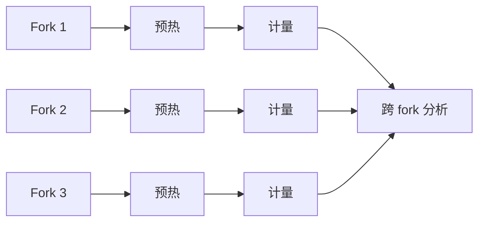

检查每个 iteration 的趋势。如果计量阶段仍持续改善或突然退化，说明编译、GC、热状态或系统噪声还在变化。此时应延长实验、检查 JIT/JFR 证据，而不是把所有 iteration 强行平均。

同时保留两类测试：

- **热稳态测试**：回答常驻服务在成熟代码路径上的成本；
- **冷路径或阶段测试**：回答启动、扩容、新租户、新类型首次执行时的延迟。

只测热路径会遗漏生产中的类加载和首次编译，只测冷启动又不能代表全天大多数请求。

## 6. JMH 能证明什么，不能证明什么

JMH 可以有力支持下面的结论：

> 在给定 JDK、硬件、状态范围和输入集合下，实现 B 在这个被隔离的代码路径中，比实现 A 少分配多少、吞吐高多少，或采样延迟分布如何。

它不能自动支持：

> 把生产系统换成 B 后，端到端 p99.99 一定下降，容量翻倍，并且没有新故障模式。

微基准没有真实入口排队、网络、NUMA 跨节点访问、下游依赖、突发、超时、背压和长时间 GC。JMH 的 `SampleTime` 也不是开放负载发生器；benchmark 线程通常完成一次操作后才开始下一次，系统变慢时请求生成也会随之变慢。

因此，JMH 通过后要把候选实现放进语义等价的组件实验，再进入端到端压力曲线。若微基准变快而系统不变，它仍然有价值：它帮助排除一个错误假设。

## 7. 开放负载、封闭负载与协调遗漏

这是低延迟测试中最容易把坏系统测成好系统的地方。

### 7.1 封闭负载什么时候是对的

封闭模型中的每个虚拟用户完成一个请求后，才发下一个请求：

```text
send -> wait response -> think time -> send again
```

它适合真实业务本来就有这个反馈关系的场景，例如一个人在页面返回后才点击下一步，或协议严格规定同一连接只能串行一个请求。

问题在于：系统一变慢，负载端也自动变慢。服务暂停 1 秒时，一个连接通常只记录到一个 1 秒样本；暂停期间本来应到达的其他工作根本没有被发出。延迟分布因系统变慢而主动减少坏样本，这就是 **coordinated omission，协调遗漏**。

### 7.2 开放负载描述外部到达

交易行情、设备事件、定时任务和大量服务流量不会等上一条完成才到来。此时应先生成独立的到达计划，再异步发送：

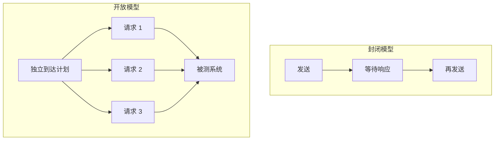

开放模型中的延迟应从**计划到达时间**开始：

```text
latency = completionAt - scheduledArrivalAt
```

若只从实际发送时间计算，负载生成器自身晚了 20 ms 才发出的请求会把这 20 ms 从结果中抹掉。生成器的 scheduler lag、无法发送、客户端排队、连接池等待都必须计入或作为独立失败指标报告。

### 7.3 一个开放到达循环的骨架

下面代码只展示关键语义，不是完整压测框架。`client.sendAsync` 必须真正异步，生成线程不能等待响应；生产工具还要限制在途请求、处理取消并把所有失败计数。

```java
long intervalNanos = 20_000; // 50,000 次/秒
long nextScheduledAt = System.nanoTime() + intervalNanos;

while (running) {
    waitUntil(nextScheduledAt);
    long scheduledAt = nextScheduledAt;
    nextScheduledAt += intervalNanos; // 不要重置为 now + interval

    long dispatchedAt = System.nanoTime();
    generatorLagNanos.recordValue(dispatchedAt - scheduledAt);

    offered.increment();
    if (!inFlight.tryAcquire()) {
        rejectedByGenerator.increment();
        continue;
    }

    try {
        client.sendAsync(newRequest()).whenComplete((response, error) -> {
            long completedAt = System.nanoTime();
            long latencyNanos = completedAt - scheduledAt;
            inFlight.release();
            allTerminalOutcomesNanos.recordValue(latencyNanos);

            if (error != null) {
                transportFailed.increment();
            } else if (!isBusinessSuccess(response)) {
                businessFailed.increment();
            } else {
                completed.increment();
                successfulEndToEndNanos.recordValue(latencyNanos);
                if (latencyNanos <= sloDeadlineNanos) {
                    goodput.increment();
                } else {
                    lateCompletion.increment();
                }
            }
        });
    } catch (RuntimeException dispatchError) {
        inFlight.release();
        dispatchFailed.increment();
        allTerminalOutcomesNanos.recordValue(System.nanoTime() - scheduledAt);
    }
}
```

`isBusinessSuccess` 不能只检查“future 没抛异常”，还要验证协议状态和业务结果。真实实现还应把服务端拒绝、客户端 timeout、取消和迟到响应拆开计数；如果一次请求可能在客户端超时后仍于服务端完成，两种观察都要保留，不能强行塞进互斥的单一状态。

`waitUntil` 可以组合 park 与短自旋，但它同样需要测量；不能假定调度精度无限。若生成器追不上计划，可以有限度追赶并记录 scheduler lag，或者把错过的到达计为 generator drop。**绝不能悄悄把 `nextScheduledAt` 重置成当前时间，然后仍声称保持目标 offered rate。**

更稳妥的做法是让负载生成器与被测服务分进程、最好分主机，并先做 generator-only 容量校验。生成器 CPU、网卡、端口、连接和客户端事件循环必须有充分余量。

### 7.4 修正不等于真实观察

HdrHistogram 的 `recordValueWithExpectedInterval(value, interval)` 可以根据已知期望间隔补入模型化样本。例如期望每 1 ms 观察一次，却只观察到一次 10 ms，它会补出下降序列的若干值。

这在无法重做负载模型时很有帮助，但要守住边界：

- 它补的是**模型值**，不是实际请求日志；
- 只有期望间隔有明确含义时才使用；
- 记录时修正与事后修正只能选一种；
- 应同时保存 raw 与 corrected 结果并标注；
- 如果已经按 `completionAt - scheduledArrivalAt` 正确计时，就不能再做一次协调遗漏修正。

优先修正负载生成与计时模型，而不是依赖事后补值。

## 8. 用 HdrHistogram 保存尾延迟

普通平均数、固定宽度桶或每次把样本塞进 `List<Long>`，都不适合持续记录宽动态范围延迟。HdrHistogram 在预先定义的范围内提供可配置的相对精度，能够合并、编码和输出百分位分布。

### 8.1 先选择单位、范围与有效数字

假设要以微秒记录最高 60 秒的延迟，并保留 3 位有效数字：

```java
import java.util.concurrent.TimeUnit;
import org.HdrHistogram.Histogram;
import org.HdrHistogram.Recorder;

long highestTrackableMicros = TimeUnit.SECONDS.toMicros(60);
Recorder recorder = new Recorder(highestTrackableMicros, 3);
```

3 位有效数字大约对应 0.1% 量级的相对精度，但内存开销会随精度与动态范围增加。单位选微秒意味着亚微秒差异被量化；若目标在纳秒级，可以使用纳秒，但最大值也必须使用相同单位。

不要让热路径在遇到更大值时自动扩容。最大值应覆盖业务 timeout 与诊断余量；越界是一次测试设计错误或需要单独报告的 overflow，不能静默截成最大桶。

### 8.2 并发写入与区间快照

`Recorder` 支持并发记录，并让报告线程取得自上次读取以来的一致区间直方图：

```java
// 请求完成线程
long micros = TimeUnit.NANOSECONDS.toMicros(latencyNanos);
recorder.recordValue(micros);

// 单独的报告线程，每 10 秒执行一次
Histogram reusable = null;
Histogram aggregate = new Histogram(highestTrackableMicros, 3);

while (reporting) {
    sleepUntilNextWindow();
    reusable = recorder.getIntervalHistogram(reusable);
    aggregate.add(reusable);

    System.out.printf(
        "count=%d p50=%dus p99=%dus p99.9=%dus max=%dus%n",
        reusable.getTotalCount(),
        reusable.getValueAtPercentile(50.0),
        reusable.getValueAtPercentile(99.0),
        reusable.getValueAtPercentile(99.9),
        reusable.getMaxValue()
    );
}
```

真实系统还应把每个 interval histogram 以 HdrHistogram 日志格式持久化。最终汇总前检查单位、范围和有效数字兼容，然后合并 histogram；不要合并已经算出的 p99。

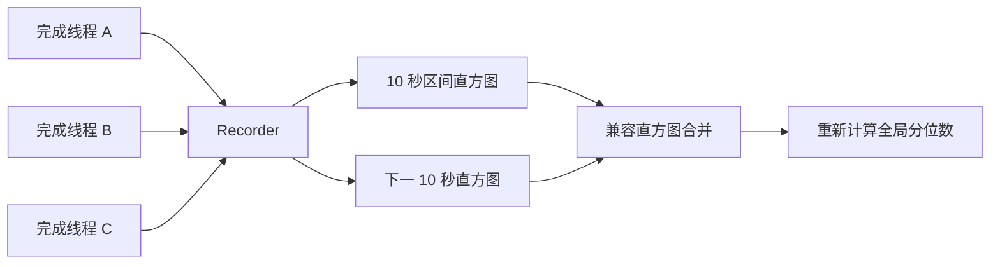

### 8.3 不要把阶段 p99 相加

请求经过 A、B、C 三个阶段，并不意味着：

```text
endToEndP99 = p99(A) + p99(B) + p99(C)
```

三个阶段的慢请求可能不是同一批，相关性也会随队列和负载改变。阶段 histogram 用于诊断，端到端 SLO 必须由端到端计时直接得到。

## 9. 一条饱和曲线比单点成绩更重要

只在 20% 负载下比较两个实现，经常得出“都很快”；只在过载点比较，又可能只是在比较谁更早开始丢请求。正确方式是扫描 offered load。

例如从预计容量的 20% 开始，逐级增加到 120% 或直到保护机制触发。每一级都要经历稳定预热与固定测量窗口，记录：

- offered、accepted、completed 与 goodput；
- p50、p99、p99.9、p99.99、max；
- timeout、error、reject 与 drop；
- 当前和最大队列深度、最老任务队龄；
- CPU、分配、GC、调度和依赖延迟。


**可持续容量**是在 backlog 不持续增长、并且延迟与错误 SLO 都满足时的最高 offered load。它没有通用的“CPU 70%”或“容量 80%”答案。

### 9.1 比较必须在同一负载上进行

实现 A 完成 100k/s、实现 B 完成 120k/s 时，各自“满载 p99”对应的 offered load 不同，不能直接解释为 B 的尾延迟更好。至少画两组视图：

1. 在相同 offered load 下比较延迟、错误和资源；
2. 比较各自在 SLO 约束下的最大可持续 goodput。

### 9.2 给突发和停顿一个真实形状

平均 50k/s 可能来自平滑到达，也可能是每 10 ms 集中到达 500 个请求。生产 trace 应先按业务窗口分析，再构造：

- 稳定流量；
- 周期性微突发；
- 突然升高后保持；
- 上游重试风暴；
- 单消费者或依赖停顿；
- 队列满、连接耗尽与磁盘抖动。

不能只把均匀速率调到同一个平均值。低延迟架构往往不是被平均负载击穿，而是被突发期间形成的队列拖垮。

### 9.3 背压也是结果

容量满时必须有明确语义：等待、返回拒绝、有限重试、降级、丢弃还是写入持久化缓冲。测试要验证每条路径，并把等待时间与最终结果计入。

如果入口在队列满时无限阻塞，低吞吐阶段的 p99 可能仍正常，调用线程池却已全部耗尽。若入口立即拒绝，延迟很低但 goodput 下降。没有一种策略天然最好，只有是否符合业务约束。

## 10. JVM 不是静态机器

同一份 bytecode 在运行中会经历不同机器码、堆布局和运行状态。低延迟实验必须说明测的是哪一个阶段。

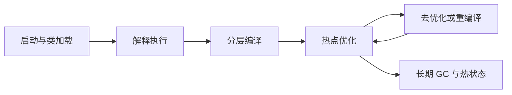

### 10.1 预热不是固定秒数

判断预热是否充分，要结合证据：

- JMH iteration 分数是否仍有趋势；
- measurement 阶段是否仍频繁编译；
- 目标方法是否达到预期编译层级；
- 类加载、代码缓存与 profile 是否稳定；
- 堆占用、晋升和 GC 周期是否进入代表性状态；
- 缓存、连接池和数据集是否达到目标热度。

短 JMH 预热无法代表数小时后的老年代、内存碎片、code cache、定时任务或温度降频。因此还需要长时间 soak test。

### 10.2 固定堆不代表问题消失

`-Xms` 与 `-Xmx` 设为相同值可以避免堆伸缩成为变量，但不能消除分配、GC 或页错误。`-XX:+AlwaysPreTouch` 会在启动时触碰堆页，把部分首次触页成本前移，同时显著增加启动时间和初始内存提交；它不是所有服务的默认答案。

每次实验至少保存：

- JDK vendor、完整 build 与 JVM 参数；
- collector、堆大小、region/page 相关配置；
- `gc.alloc.rate.norm` 或业务单位分配；
- pause 的原因、持续时间与发生时负载；
- safepoint、线程 park、monitor 与 native allocation 证据。

### 10.3 GC 选择要在目标 workload 上比较

G1、ZGC 等 collector 的设计取舍不同，暂停、吞吐、内存余量和 CPU 成本也不同。不要写“低延迟一律用 ZGC”，也不要因一个空载微基准选择 collector。

比较时应固定业务负载和内存预算，分别观察延迟分布、可持续 goodput、CPU 与内存占用、分配尖峰和 live set，以及满堆或 allocation stall 等边界。collector 是实验维度，不是信仰。

## 11. 把机器与操作系统写进实验合同

低延迟差异经常来自代码之外：线程从一个核心迁到另一个核心、跨 NUMA 读内存、容器被 throttled、IRQ 抢占、频率或温度变化、透明大页整理、首次缺页，都会形成长尾。

### 11.1 必须记录的环境

| 层次 | 至少记录 |
| --- | --- |
| CPU | 型号、微码、socket、NUMA、物理核、SMT、频率策略与 turbo |
| 内存 | 容量、NUMA 放置、page size、THP 状态、是否预触页 |
| OS | 内核、调度策略、C-state、IRQ/RSS/RPS、主要 sysctl |
| 容器 | image digest、CPU quota、cpuset、memory limit、throttling |
| JVM | vendor/build、GC、heap、全部非默认 flag |
| 进程 | affinity、线程角色、优先级、文件与网络限制 |
| 数据 | payload 分布、热点 key、命中率、数据集冷热程度 |

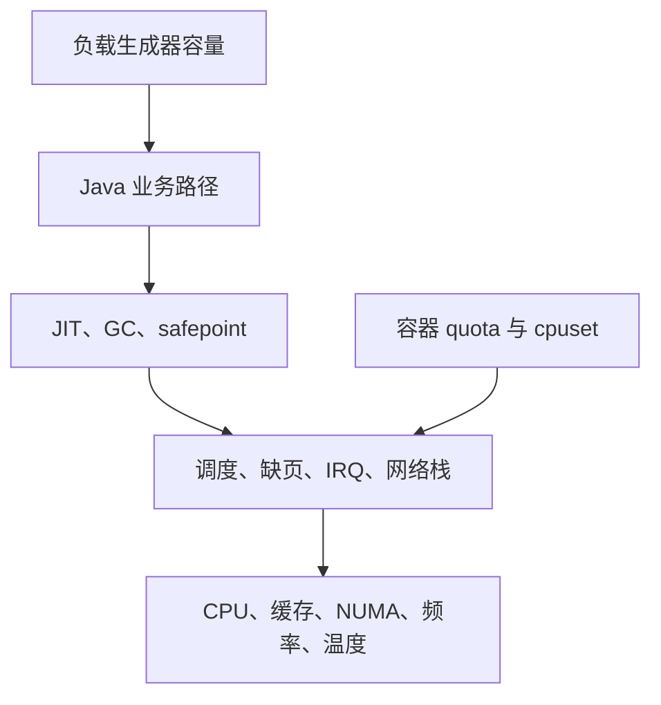

### 11.2 降噪配置和生产同构是两种实验

绑定核心、隔离 IRQ、固定 governor、关闭 SMT、turbo 或 THP，都可能降低某些实验的方差，也可能让环境脱离生产或损失容量。不要把它们写成通用优化清单。

更有解释力的是做两组实验：

1. **低噪声机制实验**：尽量隔离变量，判断代码改动本身；
2. **生产同构实验**：恢复实际容器、调度、NUMA、网络和监控配置，判断收益能否落地。

如果改动只在特殊绑核实验中成立，生产没有相同部署约束，就不能宣称已经改善线上延迟。

### 11.3 先证明生成器不是瓶颈

负载机也会出现 CPU 满、端口耗尽、连接池排队、GC、网卡丢包和协调遗漏。至少监控 generator 的：

- scheduler lag 与计划/实际发送差；
- CPU、GC 与事件循环延迟；
- 在途请求和客户端连接队列；
- socket error、重传、丢包和端口使用；
- offered、actual sent 与 generator drop。

负载发生器达不到计划速率时，实验应失败或显式标记无效，不能按较低实际速率继续生成“优秀结果”。

## 12. 用 JFR、async-profiler 与 perf 解释原因

延迟直方图告诉你“什么时候、多少请求慢了”，profiler 和事件记录才帮助回答“为什么”。正式计分与诊断运行要分开保存，因为 profiler 会改变系统。

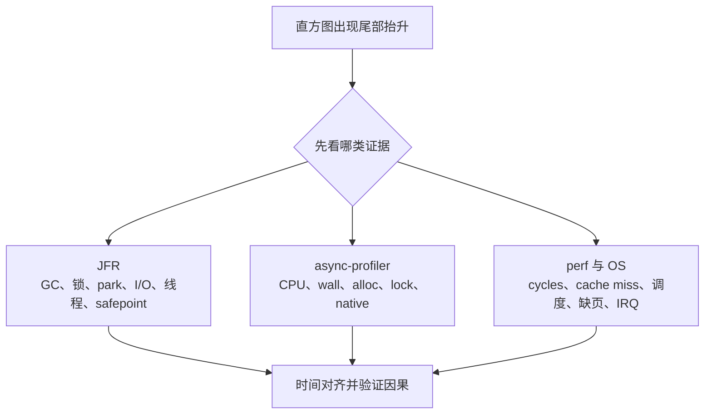

### 12.1 JFR：先建立时间线

JDK Flight Recorder 适合长时间、低开销地关联 JVM 与应用事件。JDK 25 可以直接启动记录：

```bash
java \
  -XX:StartFlightRecording=filename=service.jfr,settings=profile,duration=20m \
  -jar service.jar

jfr summary service.jfr
jfr view hot-methods service.jfr
jfr print --events jdk.GCPhasePause,jdk.JavaMonitorEnter service.jfr
```

重点观察：

- GC pause、allocation pressure 与 old-object 行为；
- Java monitor、thread park、sleep 与阻塞 I/O；
- execution sample、线程状态与 safepoint；
- socket/file I/O 和异常；
- 类加载、编译、code cache 与去优化线索；
- 应用自定义阶段事件。

默认配置中的许多 duration event 有阈值；“JFR 没看到 20 μs 的 park”不表示它不存在。启用更低阈值或高成本事件前先估算开销，并做开启/关闭 A/B。

JDK 25 加入了几个值得辨别的新工具：

- **JDK 25 / JEP 509**：`jdk.CPUTimeSample` 是 Linux 上实验性的 CPU-time 采样事件，默认关闭，可帮助区分“真正在用 CPU”和“墙钟上等待很久”；
- **JDK 25 / JEP 518**：Cooperative Sampling 改善栈采样稳定性，但不代表所有 native/intrinsic 偏差消失；
- **JDK 25 / JEP 520**：Method Timing & Tracing 会插桩选定方法，应该精确筛选少量目标，不能把插桩后的延迟直接当最终成绩。

### 12.2 自定义 JFR 事件连接业务阶段

如果只有 JVM 事件，没有业务 correlation id，就很难知道某次 GC 影响了哪条订单链。可以为低频或慢路径加入自定义事件：

```java
import jdk.jfr.Category;
import jdk.jfr.Event;
import jdk.jfr.Label;
import jdk.jfr.Name;

@Name("signalgrid.OrderStage")
@Label("订单处理阶段")
@Category({"Signal Grid", "Trading"})
class OrderStageEvent extends Event {
    @Label("阶段") String stage;
    @Label("队列深度") int queueDepth;
    @Label("业务关联号") long correlationId;
}

OrderStageEvent event = new OrderStageEvent();
event.stage = "risk-check";
event.correlationId = command.correlationId();
event.begin();
try {
    riskCheck(command);
} finally {
    event.queueDepth = queueDepth();
    event.end();
    if (event.shouldCommit()) {
        event.commit();
    }
}
```

事件字段要克制，不要把敏感 payload 或高基数字符串塞进记录。自定义事件也要做开销评估，尤其在亚微秒热路径上。

### 12.3 async-profiler：看 Java、native 与 wall time

async-profiler 能采样 CPU、wall-clock、allocation、锁以及部分硬件/系统事件，并把 Java、native 和内核栈放在同一视图。它特别适合发现：

- CPU 热点并不在预想的方法；
- 线程大部分墙钟时间在 park、I/O 或下游；
- 某个“零分配”路径仍在分配；
- native codec、TLS、系统调用或页错误成为尾部来源；
- 锁竞争与线程调度吞掉收益。

截至本文，async-profiler 当前稳定版为 4.4。版本号不是重点：采样结果有偏差和开销，应通过多次运行、其他证据与业务时间线交叉验证。

### 12.4 `perf` 与硬件计数器：解释机器行为

Linux `perf stat` / `perf record` 可以观察 cycles、instructions、IPC、cache miss、branch miss、context switch、migration 与 page fault。硬件事件是否可用取决于 CPU、内核、权限与虚拟化环境。

不要把 cache-miss 数字直接当根因。一次 miss 是否伤害延迟取决于层级、并行度、访问模式和 stall；应把它与生成代码、flame graph、NUMA 和实验改动关联起来。

JMH 的 `-prof gc`、`-prof comp`、`-prof jfr`、`-prof perfnorm`、`-prof perfasm` 可以快速进入这些诊断，但正式无 profiler 分数和 profiler 运行结果应分开展示。强制 `-gc true` 也不是标准动作：它可能减少某种噪声，也可能改变 GC ergonomics。

### 12.5 推荐的诊断顺序

1. 先确认 benchmark 没被优化掉，输入与状态范围正确；
2. 用 `-prof gc` 看每业务操作分配；
3. 用编译/JFR 证据确认计量阶段是否仍在编译或去优化；
4. 用 JFR 对齐 GC、锁、park、I/O、safepoint 与尾延迟窗口；
5. 用 async-profiler 区分 CPU、wall、allocation 与 native；
6. 必要时用 perf/perfasm 检查硬件事件和最终机器码；
7. 改一个变量，重新执行完整 A/B，而不是在同一坏运行里继续堆 profiler。

## 13. 实验设计：让差异归因于代码

一次 A 跑完再跑一次 B，很容易把温度、后台任务、机器漂移或时间段差异误判为代码差异。

### 13.1 随机化与重复

推荐把独立运行作为实验单位，使用多个 fork/进程，在同一机器上随机或交错顺序：

```text
A B B A | B A A B | ...
```

每个运行都重新创建干净进程，保留完整元数据。不要把同一长运行中的百万个请求当成百万次独立重复：它们共享 JVM、温度、队列与系统状态，通常存在强自相关。

报告可以包含：

- 每个独立运行的结果与散点；
- 中位数、范围和适当的置信区间；
- A/B 的配对差值，而不是只报各自均值；
- 是否存在运行顺序、时间或机器效应；
- 实际效应大小，而不只说“统计显著”。

### 13.2 一次只改变一个解释变量

升级 JDK、换 GC、改堆、重写算法、改 payload 并换机器后，不能把全部差异归因于新算法。先建立基线，再按实验矩阵改变一个主要变量；需要研究交互作用时，显式设计多因素实验。

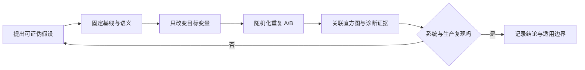

### 13.3 负结果也要保存

“没有显著改善”“只改善空载平均值”“吞吐提高但 p99.99 变差”都是重要结论。删除失败运行会产生幸存者偏差，也让后来的人重复同一错误假设。

## 14. 从实验室走向生产

上线前的端到端压测仍无法覆盖真实租户、数据偏斜、共享基础设施、部署事件和长期资源漂移。最终要通过小流量 canary 或受控 A/B 验证。

### 14.1 生产延迟要按可行动维度切分

至少保留：

- endpoint / operation；
- payload 或 batch 大小区间；
- region / zone / instance type；
- success、timeout、reject 与具体 error；
- cold / warm、cache hit / miss；
- 租户等级或流量类别，但避免不可控高基数；
- 版本、JDK、GC 与部署批次。

如果把不同 SLA、不同 payload 和不同路径混进一个 histogram，全局 p99 往往无法指导优化。

### 14.2 结果指标与原因指标要对齐时间

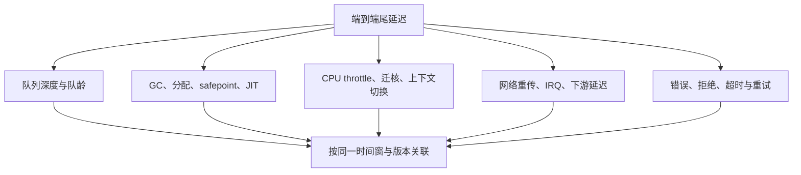

尾延迟图只能证明症状同时发生，不能单靠相关性证明因果。需要故障注入、配置回滚或可重复实验验证假设。

### 14.3 灰度比较的最低要求

- 两组承接可比的请求人群与到达分布；
- 明确排除 warmup、流量爬坡与部署不稳定窗口；
- 同时比较延迟、goodput、错误、资源和成本；
- 版本与配置可精确追溯；
- 自动回滚门槛覆盖 p99.9、错误和容量，不只看平均值；
- 观察足够长，覆盖 GC 周期、峰谷、定时任务和依赖抖动。

如果只有一个实例启用新实现，刚好它在更空闲的可用区，结论没有因果价值。

## 15. 一个可落地的测试流程

### 阶段 1：定义合同

- [ ] 写清业务对象、输入分布、语义和失败策略；
- [ ] 写清计时起止点与时钟域；
- [ ] 定义 offered load、突发和运行时长；
- [ ] 定义延迟、goodput、错误和资源目标；
- [ ] 决定哪些结果会使实验无效。

### 阶段 2：微基准隔离机制

- [ ] 使用独立 JMH 工程与命令行构建；
- [ ] 多 fork，检查 warmup 与 measurement 趋势；
- [ ] 输入来自 `@State` / `@Param`，结果可观察；
- [ ] 状态 scope 和生产线程拓扑一致；
- [ ] 扫描 payload、竞争、命中率和成功/失败路径；
- [ ] 保存 JSON、命令、Git SHA 与环境元数据。

### 阶段 3：组件与端到端负载

- [ ] 生产是外部到达时使用开放模型；
- [ ] 从 scheduled arrival 计时，记录 generator lag；
- [ ] 扫描饱和曲线，而不是只跑一个并发数；
- [ ] 所有 reject、timeout、drop 都进入结果；
- [ ] 使用区间直方图，保留 raw 数据；
- [ ] 加入突发、停顿、背压与恢复测试。

### 阶段 4：诊断而不是猜测

- [ ] 时间对齐 JFR、GC、队列、OS 与业务事件；
- [ ] 单独运行 profiler，量化其开销；
- [ ] 用生成代码和硬件事件验证关键机制；
- [ ] 改一个变量后重新执行 A/B；
- [ ] 将不符合假设的结果也保留。

### 阶段 5：生产验证

- [ ] canary 人群可比，版本和配置可追溯；
- [ ] 同时观察延迟、goodput、错误、资源与成本；
- [ ] 覆盖足够长的业务和 JVM 周期；
- [ ] 回滚门槛在发布前定义；
- [ ] 把结果写回容量模型与回归门禁。

## 16. 基准报告应该长什么样

下面是一份最小模板。没有这些字段，团队很难复现或解释结果。

```yaml
experiment:
  question: "MPSC queue B 能否在相同可靠语义下降低尾延迟"
  git_sha: "<commit>"
  baseline: "implementation-a"
  candidate: "implementation-b"

workload:
  payload_bytes: [64, 1024, 8192]
  producers: 3
  consumers: 1
  arrival_model: "open-loop"
  offered_rate_per_sec: [20000, 40000, 60000, 80000]
  burst: "每 30 秒持续 500 ms 的 1.5 倍流量"
  duration: "每档预热 10 分钟，测量 30 分钟"

latency:
  boundary: "scheduled arrival -> completion callback"
  clock: "同一负载进程 System.nanoTime"
  histogram: "微秒，最高 60 秒，3 位有效数字"

environment:
  cpu: "<model, sockets, NUMA, SMT, governor>"
  os: "<kernel and relevant settings>"
  container: "<image digest, cpuset, quota>"
  jdk: "<vendor and full build>"
  jvm_args: ["-Xms...", "-Xmx...", "-XX:+Use..."]

validity:
  max_generator_lag: "<threshold>"
  allowed_generator_drop: 0
  required_sample_count: "<per load point>"
  profiler_runs_separate: true

artifacts:
  - "jmh-results.json"
  - "latency.hlog"
  - "service.jfr"
  - "environment.txt"
  - "run-order.csv"
```

最终结果表至少包含每个负载档位的 offered / completed / goodput、p50 / p99 / p99.9 / p99.99 / max、错误/拒绝/超时、CPU、分配率、GC 和最大队列深度。结论应写适用边界：在哪种硬件、JDK、payload、拓扑与负载范围内成立。

## 17. 常见反模式

| 反模式 | 为什么错 | 正确动作 |
| --- | --- | --- |
| 在 IDE 里跑一次 JMH | 当前 JVM、agent、编译和环境污染 | 独立 benchmark JAR，多 fork，命令行运行 |
| `@Fork(0)` 结果最好 | 放弃进程隔离，profile 污染 | 保留多 fork，解释跨 fork 方差 |
| Blackhole 保证基准正确 | 只解决一类结果可观察问题 | 同时检查输入、常量折叠与被测边界 |
| 手写大循环再除次数 | JIT 可展开、提升或合并 | 让 JMH 控制调用；批次必须声明 accounting |
| SampleTime p99 就是线上 p99 | 闭环、抽样且可能漏掉 pause | 开放端到端负载与完整直方图验证 |
| 服务变慢时发生器也变慢 | 协调遗漏减少坏样本 | 按计划到达异步发送，从 scheduled time 计时 |
| 只报告成功延迟 | 丢弃和拒绝被隐藏 | 同报 offered、goodput 与所有失败 |
| 平均实例 p99 | 百分位不可线性平均 | 合并兼容 histogram 后重算 |
| 把阶段 p99 相加 | 忽略阶段相关性 | 直接测端到端分布 |
| 强制每轮 Full GC | 改变真实 GC ergonomics | 默认不强制；将 GC 作为实验变量 |
| profiler 开着跑最终分数 | 诊断工具改变系统 | 无 profiler 计分，独立 profiler 解释 |
| 固定 CPU 70% 当容量 | workload 与排队模型不同 | 以 SLO 和 backlog 稳定性定义容量 |
| 只测平均均匀流量 | 看不到微突发与恢复 | 回放或建模真实 burst shape |
| 关闭 turbo/SMT/THP 就更科学 | 可能脱离生产并改变容量 | 低噪声与生产同构各做一组 |
| 一次 A 后一次 B | 时间、温度和背景任务混杂 | 随机化、交错、多个独立运行 |

## 18. 回到 Disruptor 与 Agrona

有了这套测量方法，后续文章中的“快”就可以被拆成可验证问题。

对 [Disruptor](/signal-grid-blog/posts/lmax-disruptor-ring-buffer-and-sequencing/)：

- 是单生产者还是多生产者？
- handler 是多播、依赖图还是竞争消费？
- Ring Buffer 满时等待、拒绝还是降级？
- 最慢 gating consumer 停顿后，p99.99 和恢复时间怎样？
- BusySpin 提高了哪个负载区间的延迟，又花掉多少核心？

对 [Agrona](/signal-grid-blog/posts/agrona-direct-buffer-queues-and-agents/)：

- SPSC、MPSC 与 MPMC 是否语义等价？
- direct buffer 的收益是否超过分配、复制和回收代价？
- Agent 的 duty cycle 在空载、稳态、突发和阻塞依赖下怎样变化？
- relaxed poll 的短暂 `null` 是否被误算为空队列？
- Broadcast lapped、队列 offer failure 和 Ring Buffer 容量不足是否都计数？

JMM 告诉我们实现为何正确；本章告诉我们如何证明它在目标条件下值得采用。下一章进入 [Java 低延迟的机器模型](/signal-grid-blog/posts/java-low-latency-machine-model-cache-locality-false-sharing-numa/)，把硬件计数器背后的 Cache、局部性、伪共享、TLB、SMT 与 NUMA 关系讲清，再由 Disruptor 把这些约束落到发布协议、消费拓扑、背压与 Batch Rewind。

## 19. 官方资料与继续阅读

### Java、JMH 与 JFR

- [OpenJDK JMH 项目与推荐用法](https://github.com/openjdk/jmh)
- [JMH 1.37 Releases / Tags](https://github.com/openjdk/jmh/tags)
- [JMH 官方 Samples](https://github.com/openjdk/jmh/tree/1.37/jmh-samples/src/main/java/org/openjdk/jmh/samples)
- [JDK 25 `System.nanoTime()`](https://docs.oracle.com/en/java/javase/25/docs/api/java.base/java/lang/System.html#nanoTime())
- [JDK 25：使用 JFR 排查性能问题](https://docs.oracle.com/en/java/javase/25/troubleshoot/troubleshoot-performance-issues-using-jfr.html)
- [JDK 25 `jfr` 命令](https://docs.oracle.com/en/java/javase/25/docs/specs/man/jfr.html)
- [JDK 25 JFR API](https://docs.oracle.com/en/java/javase/25/docs/api/jdk.jfr/jdk/jfr/package-summary.html)
- [JEP 509：JFR CPU-Time Profiling](https://openjdk.org/jeps/509)
- [JEP 518：JDK 25 JFR Cooperative Sampling](https://openjdk.org/jeps/518)
- [JEP 520：JDK 25 JFR Method Timing & Tracing](https://openjdk.org/jeps/520)
- [JDK 25 Garbage Collection Tuning Guide](https://docs.oracle.com/en/java/javase/25/gctuning/)

### 延迟分布、负载与诊断

- [HdrHistogram Java 项目](https://github.com/HdrHistogram/HdrHistogram)
- [HdrHistogram JavaDoc：Recorder](https://hdrhistogram.github.io/HdrHistogram/JavaDoc/org/HdrHistogram/Recorder.html)
- [wrk2：开放速率与 Coordinated Omission 说明](https://github.com/giltene/wrk2)
- [async-profiler 官方项目](https://github.com/async-profiler/async-profiler)
- [Linux perf Wiki](https://perf.wiki.kernel.org/)

这些工具不会替你定义问题。真正可迁移的能力，是看到任何“降低了 30% 延迟”的结论时，都能继续问：**哪条边界、哪种到达、哪个分位、多少样本、什么失败、什么环境，以及哪条因果证据？**
