Java 并发最危险的误区，不是忘记某个 API，而是把单线程直觉直接搬到多线程：

> “代码明明先写 `payload`，再写 `ready`；另一个线程既然看见 `ready`，当然也该看见新的 `payload`。”

这句话在没有同步关系时并不成立。编译器、JIT、处理器和缓存层次都可能改变另一线程能够观察到的结果；更重要的是，Java 规范本来就允许未正确同步的程序出现许多反直觉结果。

Java Memory Model（JMM）解决的正是这个问题：**给定一段程序和一次候选执行，哪些读取结果属于 Java 规范允许的行为？** `VarHandle` 则把 plain、opaque、acquire-release、volatile 和原子更新等访问语义显式交给程序员，让底层并发协议不必依赖 `sun.misc.Unsafe` 或模糊的“内存屏障直觉”。

本文以 **Java SE 25 / JLS 25** 为规范基线，示例主体保持 Java 17 可运行。VarHandle 从 JDK 9 起就是标准 API；JDK 23 已将 `sun.misc.Unsafe` 的内存访问方法标记为待移除，JDK 24 起默认在运行期告警，因此新代码应优先使用 VarHandle、并发工具类或 Foreign Function & Memory API。[JLS 25 第 17 章](https://docs.oracle.com/javase/specs/jls/se25/html/jls-17.html) · [VarHandle JDK 25](https://docs.oracle.com/en/java/javase/25/docs/api/java.base/java/lang/invoke/VarHandle.html) · [JEP 193](https://openjdk.org/jeps/193) · [JEP 471](https://openjdk.org/jeps/471)

这是“Java 低延迟工程”的 Chapter 01。读完本文后，先进入 [Java 低延迟到底应该怎么测](/signal-grid-blog/posts/java-low-latency-measurement/)，学会为吞吐、尾延迟与生产收益建立可信证据；再进入 [Disruptor 的发布协议与消费拓扑](/signal-grid-blog/posts/lmax-disruptor-ring-buffer-and-sequencing/) 和 [Agrona 的 Buffer、队列与 Agent](/signal-grid-blog/posts/agrona-direct-buffer-queues-and-agents/)，就能同时解释 release/acquire 为什么成立、优化是否真的值得。

## 1. 先看一个“偶尔正常”的错误程序

下面的代码希望生产者发布一份数据，消费者等到 `ready` 后读取：

```java
public final class BrokenPublication {
    private int payload;
    private boolean ready;

    public void publish() {
        payload = 42;
        ready = true;
    }

    public int await() {
        while (!ready) {
            Thread.onSpinWait();
        }
        return payload;
    }
}
```

单线程阅读源码，会自然得到：

```text
payload = 42 → ready = true → 观察到 ready → 读取 payload
```

但程序里没有任何跨线程同步边。规范不保证消费者及时看见 `ready`，循环可能不退出；即使观察到某次写入，也不能仅凭源码顺序推导其他普通字段的发布关系。

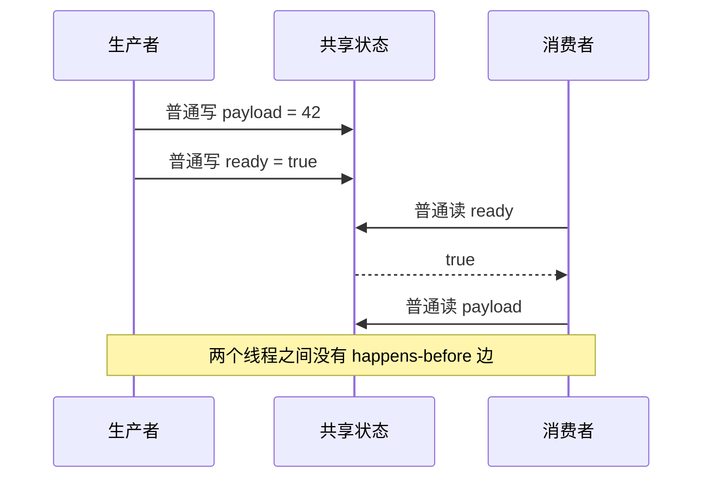

`Thread.onSpinWait()` 只是给运行时一个“我正在自旋”的性能提示，没有同步语义。换成 `sleep()` 或 `yield()` 同样不能修复：JLS 明确允许编译器只读一次普通 `ready`，然后在循环中重复使用这个值。

最简单的正确版本，是把 `ready` 声明为 `volatile`：

```java
private int payload;
private volatile boolean ready;
```

生产者对 `ready` 的 volatile 写，与消费者随后观察到它的 volatile 读建立同步关系；再结合各线程内部的程序顺序，可以证明 `payload = 42` 对消费者可见。重点不是“volatile 会刷新缓存”，而是**规范提供了一条可以传递的顺序证明**。

## 2. JMM 是合法行为规范，不是 CPU 缓存说明书

JMM 不规定 HotSpot 必须生成哪条指令，也不要求每一次源码重排都真的发生。它只约束可观察结果：JVM 可以采用任何执行策略，只要产生的行为属于规范允许的集合。

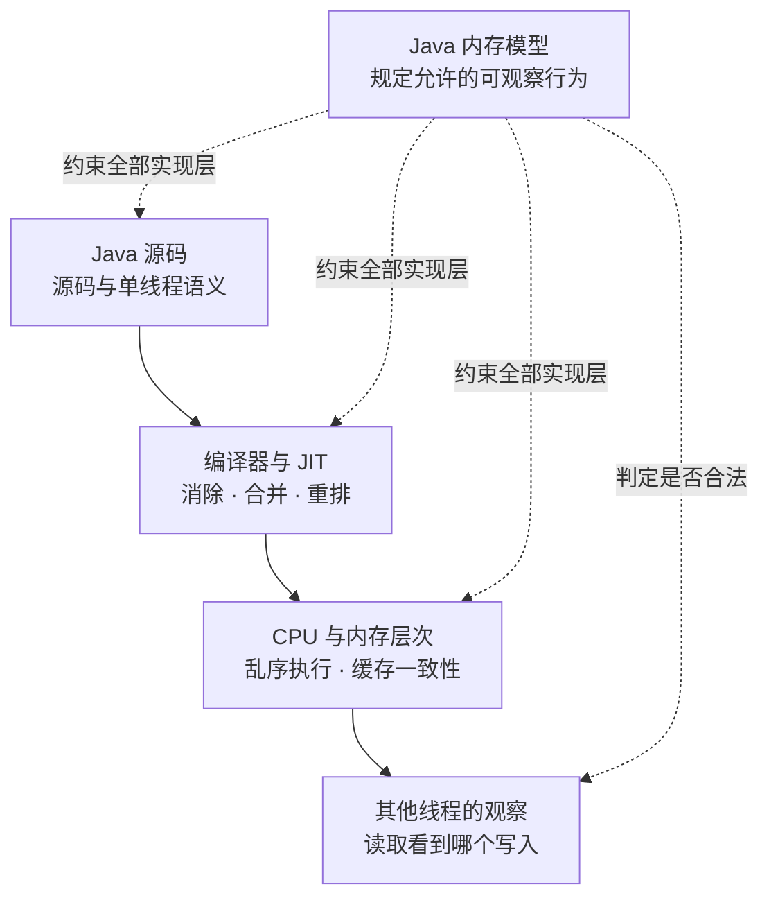

因此，分析并发程序时要分清四层：

| 层次 | 关注的问题 | 不能直接推出什么 |
| --- | --- | --- |
| Java 源码 | 每个线程想执行哪些操作 | 另一线程按源码顺序观察 |
| JMM | 哪些执行结果合法 | 固定的机器指令与屏障 |
| JVM/JIT | 如何在特定平台实现这些语义 | 所有 JVM 都生成同样代码 |
| CPU/缓存 | 指令和缓存一致性怎样工作 | Java 层 API 的完整语义 |

把 JMM 解释成“线程把工作内存刷回主内存”会掩盖两个事实：

1. 反直觉结果既可能来自 CPU，也可能来自编译器优化、寄存器复用、循环外提或读消除；
2. Java 正确性应由规范关系证明，而不是靠猜测某代 x86 或 ARM CPU 会不会“碰巧工作”。

### 2.1 哪些变量属于共享内存

JLS 中的共享变量包括：

- 实例字段；
- `static` 字段；
- 数组元素。

局部变量、方法参数和异常参数本身不会被其他线程直接访问，因此不属于 JMM 的共享变量；但局部变量里的引用完全可以指向共享对象。不同数组元素是不同变量，所以一个线程写 `array[0]`、另一个线程写 `array[1]`，不是同一变量上的 data race——它们仍可能因为 false sharing 产生性能竞争，稍后会区分。

### 2.2 跨线程动作（Inter-thread action）

JMM 关心能够被其他线程检测或影响的动作：

- 普通读、普通写；
- volatile 读、volatile 写；
- monitor lock、unlock；
- 启动线程、线程首尾动作、检测线程终止；
- interrupt 与检测 interrupt；
- 外部动作，例如受执行环境影响的 I/O。

每次读到底能看见哪个写，不是由墙上时间单独决定，而要满足执行良构、happens-before 一致性与因果性等规则。

## 3. 原子性、可见性、有序性是三类问题

“线程安全”经常被简化成三个词，但它们不是三档开关：

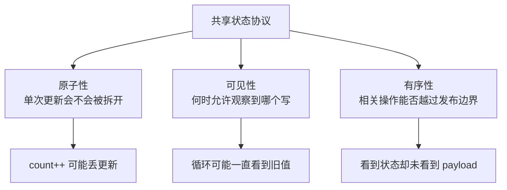

- **原子性**：一个动作是否不可分割，或一组动作是否作为整体提交。
- **可见性**：一个线程的写入，另一个线程在什么条件下必须能观察到。
- **有序性**：跨线程推理时，哪些动作必须保持在发布点之前或观察点之后。

单次原子访问不等于复合操作原子。例如 `volatile int count` 的读写都是原子的，但 `count++` 仍包含读、加一、写三个步骤，两个线程可能同时读到同一个旧值并覆盖结果。

```java
private volatile int count;

public void increment() {
    count++; // 不是原子 read-modify-write
}
```

同样，CAS 只能原子地改变一个变量；它不会自动把余额、冻结额和订单状态组成多字段事务。正确方案可能是锁、不可变快照、单写者状态机，或者把多个字段编码进一个可原子替换的状态对象。

## 4. 三种“顺序”不要混为一谈

### 4.1 程序顺序（Program order）

每个线程都有自己的 program order：线程内 inter-thread actions 的全序，符合 Java 单线程语义。它不等于处理器真实发射指令的时间线，只要求单线程观察不到不合法的差异。

### 4.2 顺序一致性（Sequential consistency）

一次 sequentially consistent（SC）执行可以把所有线程的动作排成一个全序：

1. 全序与每个线程的 program order 一致；
2. 每次读看到全序中它之前最近的同变量写入。

可以把它想象成所有线程的操作交错写入同一卷轴。它很适合推理，但仍不意味着多条操作自动成为事务。

### 4.3 同步顺序（Synchronization order）

每次执行还存在覆盖全部 synchronization actions 的概念性全序，并与各线程内程序顺序一致。同步动作包括 volatile 访问、monitor lock/unlock、线程启动和终止检测等。

这个顺序只覆盖同步动作，不是“所有普通内存访问的全局真实顺序”。它会产生 `synchronizes-with` 边：

- 同一 monitor 的 unlock → 后续 lock；
- 同一 volatile 变量的写 → 后续读；
- `Thread.start()` → 被启动线程的第一个动作；
- 线程最后动作 → 另一个线程成功检测到它已经终止；
- `interrupt()` → 其他线程检测到中断；
- 每个变量的默认值写入 → 每个线程的第一个动作。

同步边的起点称为 release，终点称为 acquire。这套术语也解释了 VarHandle 为什么提供单独的 Release 写和 Acquire 读。[JLS 25 §17.4.4](https://docs.oracle.com/javase/specs/jls/se25/html/jls-17.html#jls-17.4.4)

## 5. 先行发生（happens-before）是一张证明图

happens-before（HB）可以概括为：

```text
program order + synchronizes-with，再取传递闭包
```

JLS 还单列了一条与终结机制有关的历史规则：对象构造完成 happens-before 该对象 finalizer 的开始。它不改变日常并发协议的设计方法；现代代码也不应依赖 finalization 做资源回收，但完整定义不能把这条边抹掉。

如果 `hb(x, y)`，那么对需要这条关系的线程而言，`x` 的效果对 `y` 可见，并且按规范顺序位于 `y` 之前。但 HB 不是物理时间：实现仍然可以重排，只要任何观察结果都等价于一个合法执行。

以 `volatile ready` 的发布为例：

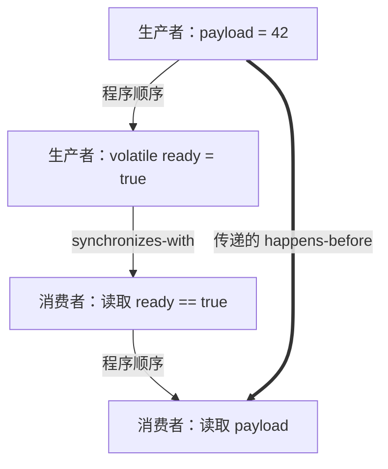

证明过程是：

1. `payload = 42` 在生产者程序顺序中先于 volatile 写；
2. 该 volatile 写 synchronizes-with synchronization order 中对同一变量的后续 volatile 读；本例读到 `true` 同时表明消费者已经越过发布点；
3. volatile 读在消费者程序顺序中先于读取 `payload`；
4. HB 可传递，所以 `payload` 写 HB `payload` 读。

### 5.1 常用 HB 规则

| 规则 | 可以证明什么 | 常见误用 |
| --- | --- | --- |
| 同线程 program order | 本线程前序动作 HB 后序动作 | 推导另一线程也按源码顺序观察 |
| monitor unlock → 后续 lock | 锁内写入对后续同锁临界区可见 | 使用不同锁也能传递 |
| volatile write → 后续 read | 发布写之前的动作可传到观察之后 | `volatile++` 变成原子 |
| `start()` → 子线程动作 | 启动前写入可被新线程看到 | 子线程写入自动返回父线程 |
| 线程动作 → 成功 `join()` | 终止前写入可被 join 方看到 | timed join 超时也算成功检测终止 |
| interrupt → 检测中断 | 中断前动作可传到检测点 | interrupt 等于强制终止线程 |

`Thread.join(Duration)` 返回 `false`，或者带超时的 `join` 仍然发现线程存活时，不能使用“线程终止 → join 方”的 HB 保证。

### 5.2 HB 不是完整 JMM

Happens-before consistency 仍不是全部规则。JLS 还用 causality requirements 排除循环自证的“凭空造值”执行：不能让两个读取先凭空得到某个值，再以这些读取为理由证明产生该值的写入应该发生。

工程代码通常不直接推导完整因果性规则；更实际的做法是消除 data race，并用规范同步原语建立明确的 HB 图。但文章不能把 JMM 简化为“只有 happens-before 一条规则”。[JLS 25 §17.4.8](https://docs.oracle.com/javase/specs/jls/se25/html/jls-17.html#jls-17.4.8)

## 6. 数据竞争、竞态条件与 DRF-SC

两个访问如果：

1. 访问同一个变量；
2. 至少一个是写；

它们就是 conflicting accesses。如果冲突访问没有 HB 顺序，执行中就存在 data race。

Java 的 data race 不等于 C/C++ 里一句“完全 undefined behavior”。类型安全、每次读允许观察的写和因果性仍受到 Java 规范约束；但反直觉结果足以让程序失去工程可用性。

### 6.1 DRF-SC 的精确定义

JLS 所说的 correctly synchronized program，是指：**该程序所有 sequentially consistent executions 都没有 data race。** 满足这个前提后，规范保证程序的全部执行都表现得像某个 SC 执行。

这就是常说的 DRF-SC，但它不等于“逻辑正确”：

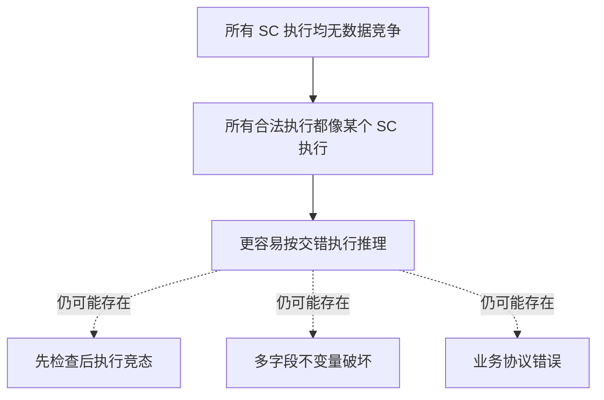

下面的代码没有“字段看不见”的问题，却仍可能超卖：

```java
synchronized boolean hasEnough() {
    return available >= quantity;
}

synchronized void reserve() {
    available -= quantity;
}
```

如果调用方把检查与扣减分成两次独立加锁，中间就可能插入另一个线程。互斥边界必须覆盖整个不变量转换。

## 7. `final` 字段：冻结构造状态，不是万能发布器

JMM 给 final 字段特殊语义。构造器退出时——无论正常返回还是异常退出——都会发生与 final 字段有关的 freeze action；真正可供其他线程使用的对象仍必须满足“正确构造且没有在构造完成前逃逸”。在这个前提下，即使另一个线程通过存在数据竞争的引用拿到它，一旦看见对象，final 字段仍有特殊可见性保证。

```java
public final class QuoteConfig {
    private final int depth;
    private final int[] bands;

    public QuoteConfig(int depth, int[] bands) {
        this.depth = depth;
        this.bands = bands.clone();
    }
}
```

freeze 还能保护构造期间经 final 引用可达的数组状态。但边界必须写清楚：

- 构造器结束前不能让 `this` 逃逸；
- `final List<?>` 只固定引用，不会让 List 变成不可变；
- 构造后对可变数组、集合或对象的修改，不属于构造期 freeze；
- 普通非 final 字段没有同样的特殊保证；
- 反射修改 final 字段不应成为并发设计手段。

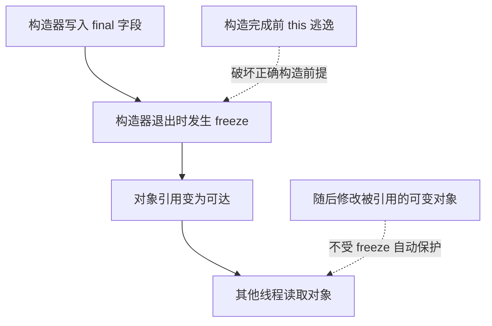

典型的 `this` 逃逸包括：构造器里注册监听器、把 `this` 放进全局集合、启动捕获 `this` 的线程；构造器调用可覆盖方法本身并不必然逃逸，但如果子类实现把尚未完成构造的 `this` 发布出去，同样会破坏正确构造前提。

## 8. `volatile`、锁和原子类各自解决什么

| 工具 | 核心能力 | 适合 | 不适合 |
| --- | --- | --- | --- |
| `final` | 构造期特殊可见性 | 不可变配置、值对象 | 后续可变状态同步 |
| `volatile` | 单变量原子访问、可见性与顺序 | 状态标志、不可变快照引用、发布点 | 多字段不变量、复合更新 |
| `synchronized` / 排他 Lock | 互斥 + lock/unlock 内存同步 | 多字段状态转换、条件等待 | 极端热路径里不经测量就滥用 |
| Atomic 类 | 单变量原子 RMW | 计数、状态指针、无锁结构节点 | 多变量业务事务 |
| VarHandle | 在字段/数组/视图上选择访问语义 | 底层库、定制内存协议 | 普通业务代码的默认首选 |

优先使用更高层抽象。`BlockingQueue`、`ConcurrentHashMap`、`CompletableFuture`、锁和并发集合已经定义了内存一致性属性；只有当数据布局、对象开销或访问模式确实需要定制时，才应该直接使用 VarHandle。

“lock-free”也不等于 wait-free、公平或永远更快：CAS 循环可能持续失败，缓存行会在核心间来回迁移，高争用时锁的阻塞策略反而可能更稳定。

## 9. VarHandle 到底是什么

VarHandle 是一个**动态强类型、不可变的变量引用能力**。它描述：

- 变量类型 `varType()`；
- 定位变量所需的坐标类型 `coordinateTypes()`；
- 该变量支持哪些访问模式。

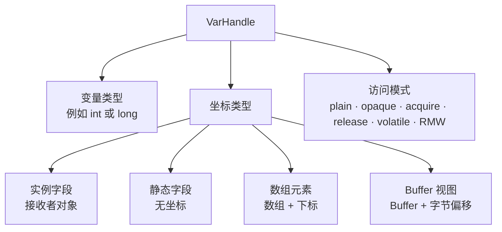

### 9.1 实例字段句柄

```java
import java.lang.invoke.MethodHandles;
import java.lang.invoke.VarHandle;

public final class StateHolder {
    private int state;

    private static final VarHandle STATE;

    static {
        try {
            STATE = MethodHandles.lookup()
                    .findVarHandle(StateHolder.class, "state", int.class);
        } catch (ReflectiveOperationException e) {
            throw new ExceptionInInitializerError(e);
        }
    }
}
```

这个句柄的变量类型是 `int`，坐标类型是 `StateHolder`：调用时先给 receiver，再给期望值、新值等访问模式参数。

VarHandle 的方法在源码中看起来是 `Object...`，实际属于 signature-polymorphic 调用。JVM 会按调用点类型检查并生成相应描述符，原始类型不会因此必然装箱或打包成数组。默认句柄使用 invoke behavior，允许 Javadoc 规定的部分引用转换、装箱/拆箱和 primitive widening；调用 `withInvokeExactBehavior()` 后，参数与返回类型必须和 access mode type 精确匹配。参数形状错误可能在运行时抛 `WrongMethodTypeException` 或 `ClassCastException`。

### 9.2 创建时完成权限检查

`MethodHandles.Lookup` 在创建句柄时执行字段访问检查。拿到非 public 字段句柄的代码之后可以直接使用它，因此这种句柄本身是一项 capability，不应泄漏给不可信代码。

实例字段、静态字段和数组的工厂不同。下面只展示调用形状，省略了 `GlobalState` 定义以及创建字段句柄所需的 checked-exception 处理；完整类应像上一节一样在静态初始化块中捕获 `ReflectiveOperationException`：

```java
VarHandle instance = MethodHandles.lookup()
        .findVarHandle(StateHolder.class, "state", int.class);

VarHandle staticField = MethodHandles.lookup()
        .findStaticVarHandle(GlobalState.class, "epoch", long.class);

VarHandle element = MethodHandles.arrayElementVarHandle(long[].class);
```

静态字段句柄没有 receiver 坐标；数组句柄的坐标是 `(long[], int)`。

### 9.3 `final` 字段句柄是只读能力

VarHandle 遵守字段完整性。即使 Lookup 有权限创建 final 字段的句柄，写访问模式仍不受支持并抛 `UnsupportedOperationException`。VarHandle 不是绕过 Java 类型和 final 规则的后门。

### 9.4 访问模式覆盖字段声明

这是最容易被忽略的陷阱：**VarHandle access mode 会覆盖字段声明处的内存语义。**

即使字段写成：

```java
private volatile int state;
```

通过 `STATE.get(this)` 仍然是 plain read；要得到 volatile 语义，必须调用 `getVolatile(this)`。混用直接字段访问和不同 VarHandle 模式时，应逐条画出协议，而不是假设 `volatile` 修饰符会自动兜底。

## 10. 四级访问模式

VarHandle 的内存访问强度可以按下面理解：

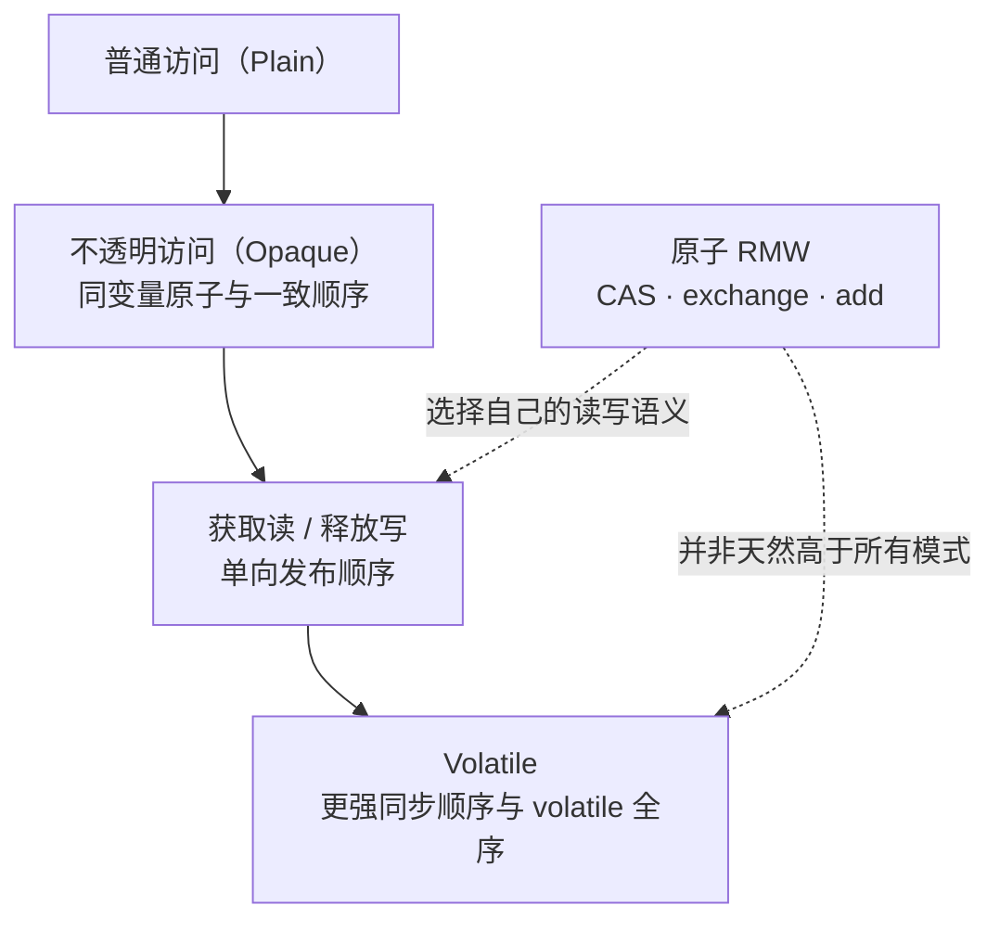

这不是“越往下就永远越好”的性能排行榜，而是协议约束越来越强。

### 10.1 普通访问（Plain）：只有普通字段语义

`get` / `set` 类似访问非 volatile、非 final 普通字段，对其他线程没有可观察排序保证。VarHandle 类级契约给出的最低保证覆盖引用和不超过 32 位的 primitive；对于本文使用的标准字段、数组句柄，如果具体工厂没有进一步削弱，plain `get` / `set` 对所有类型提供原子访问，例外是 32 位平台上的 `long` / `double`。这条 API 保证不要和 JLS 对普通 non-volatile `long` / `double` 仍允许撕裂的语言级规则混为一谈；跨实现协议仍应使用明确的同步模式。

适用场景：

- 线程封闭状态；
- 已经由锁、队列所有权转移或其他协议保护的 payload；
- 初始化阶段尚未并发访问的数据。

Plain 不是“性能版 volatile”，而是要求外部已经存在正确同步。

### 10.2 不透明访问（Opaque）：只管同一变量，不发布旁边的数据

`getOpaque` / `setOpaque` 提供位级原子访问，并对同一变量保持 coherent ordering；它不保证把其他普通字段一起发布。

适合近似遥测或只依赖单一位置演进的特殊协议，例如监控线程读取一个可能滞后的进度值。它不适合把 `payload + ready` 中的 release/acquire 直接替换掉。

```java
// 只把 progress 当近似观测值，不依赖它发布其他字段。
PROGRESS.setOpaque(this, nextPosition);
long observed = (long) PROGRESS.getOpaque(this);
```

Opaque 没有线程调度或“多久一定看见”的进度保证，不能靠它实现超时、租约或安全切换。

### 10.3 获取 / 释放（Acquire / Release）：方向性发布

`setRelease` 保证它之前的 load/store 不会越过发布写跑到后面；`getAcquire` 保证它之后的 load/store 不会越过观察读跑到前面。

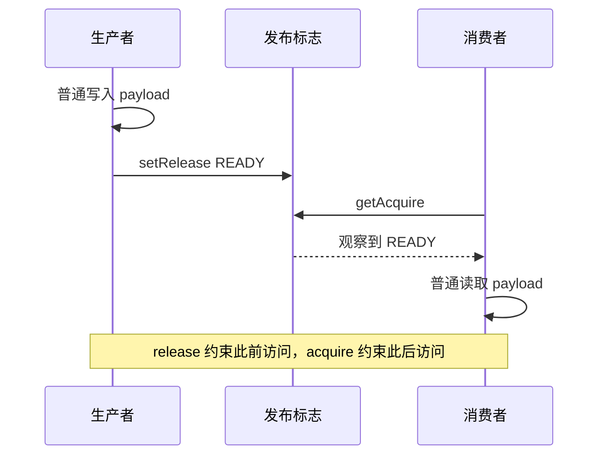

方向性意味着：

- Release 不约束它之后的普通动作；
- Acquire 不约束它之前的普通动作；
- 消费者必须真的观察到对应发布状态，才能使用这条通信保证；
- 两端仅仅各调用一次带相应名字的方法，不会自动建立业务关联。

### 10.4 易变访问（Volatile）：更强且更容易推理

`getVolatile` / `setVolatile` 等价于对 volatile 字段的访问：在 acquire/release 属性之外，volatile 操作之间还处于同步全序。

当协议没有充分证据证明弱模式必要，优先选择 volatile、锁或更高层工具。把所有访问削弱成 acquire/release，可能没有可测收益，却增加了证明和维护成本。

## 11. 用释放 / 获取语义写一个安全发布协议

下面是一个一次性 mailbox。生产者先写 payload，再发布 ready；消费者先观察 ready，再读取 payload：

```java
import java.lang.invoke.MethodHandles;
import java.lang.invoke.VarHandle;

public final class ReleaseAcquireMailbox {
    static final class Mailbox {
        int payload;
        int ready;
    }

    private static final VarHandle READY;

    static {
        try {
            READY = MethodHandles.lookup()
                    .findVarHandle(Mailbox.class, "ready", int.class);
        } catch (ReflectiveOperationException e) {
            throw new ExceptionInInitializerError(e);
        }
    }

    public static void main(String[] args) throws InterruptedException {
        Mailbox box = new Mailbox();

        Thread consumer = new Thread(() -> {
            while ((int) READY.getAcquire(box) == 0) {
                Thread.onSpinWait();
            }

            if (box.payload != 42) {
                throw new AssertionError("观察到了未完整发布的数据");
            }
            System.out.println(box.payload);
        });

        consumer.start();

        box.payload = 42;
        READY.setRelease(box, 1);

        consumer.join();
    }
}
```

正确性证明：

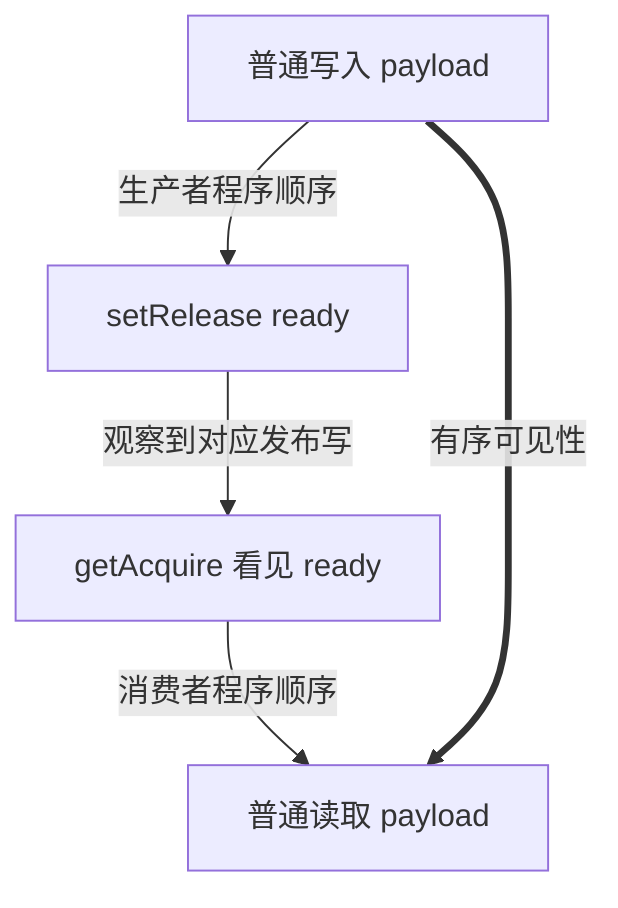

如果把两端改成 opaque，`ready` 自身仍有 coherent 访问，但 `payload` 的跨变量发布保证消失。

这个示例故意是**一次性、单 payload、一个消费者**。若要循环复用槽位，需要定义 EMPTY / WRITING / READY / CONSUMING 等代际状态，防止生产者覆盖未消费数据和消费者把下一轮状态误认成上一轮；如果有多个生产者，还要增加原子 claim。不能因为一次性示例正确，就直接扩成通用 Ring Buffer。

## 12. CAS 与 compare-and-exchange

### 12.1 `compareAndSet` 与见证值（witness）

`compareAndSet(expected, update)` 返回 boolean；`compareAndExchange(expected, update)` 返回操作时实际看到的 witness value。witness 等于 expected 才表示交换成功。

```java
import java.lang.invoke.MethodHandles;
import java.lang.invoke.VarHandle;

public final class CompareExchangeCounter {
    private int value;

    private static final VarHandle VALUE;

    static {
        try {
            VALUE = MethodHandles.lookup()
                    .findVarHandle(CompareExchangeCounter.class, "value", int.class);
        } catch (ReflectiveOperationException e) {
            throw new ExceptionInInitializerError(e);
        }
    }

    public int increment() {
        int expected = (int) VALUE.getVolatile(this);

        for (;;) {
            int witness = (int) VALUE.compareAndExchange(
                    this, expected, expected + 1);

            if (witness == expected) {
                return expected + 1;
            }

            expected = witness;
            Thread.onSpinWait();
        }
    }
}
```

失败时直接把 witness 作为下一轮 expected，可以省掉一次独立读取。但若只是整数加一，应先考虑 `getAndAdd`；手写 CAS 循环更容易在副作用、退避和溢出上犯错。

### 12.2 弱 CAS 可以伪失败

`weakCompareAndSet*` 即使当前值等于 expected，也允许伪失败，因此只能用于算法允许重试的地方：

```java
public int incrementWeak() {
    for (;;) {
        int current = (int) VALUE.getVolatile(this);
        if (VALUE.weakCompareAndSet(this, current, current + 1)) {
            return current + 1;
        }
        Thread.onSpinWait();
    }
}
```

失败既可能来自真实竞争，也可能是允许的伪失败，不能把一次 `false` 直接解释成“别的线程一定改过”。

### 12.3 获取 / 释放 RMW 是非对称的

下面是常用 RMW 模式的完整语义家族；Acquire / Release 后缀只强化相应一侧，并不会自动把另一侧也升级为 volatile：

| 方法族 | 读取侧 | 成功写入侧 | 是否允许伪失败 |
| --- | --- | --- | --- |
| `compareAndSet` / `compareAndExchange` | volatile | volatile | 否 |
| `compareAndExchangeAcquire` | acquire | plain | 否 |
| `compareAndExchangeRelease` | plain | release | 否 |
| `weakCompareAndSetPlain` | plain | plain | 是 |
| `weakCompareAndSet` | volatile | volatile | 是 |
| `weakCompareAndSetAcquire` | acquire | plain | 是 |
| `weakCompareAndSetRelease` | plain | release | 是 |
| `getAndSet` / `getAndAdd` / bitwise RMW | volatile | volatile | 否 |
| 上述 RMW 的 `Acquire` 变体 | acquire | plain | 否 |
| 上述 RMW 的 `Release` 变体 | plain | release | 否 |

失败的 Release CAS 没有发生 release write，因此不能声称“发布已经完成”。选择弱化模式前，必须分别证明成功路径和失败路径。

### 12.4 CAS 状态机与副作用

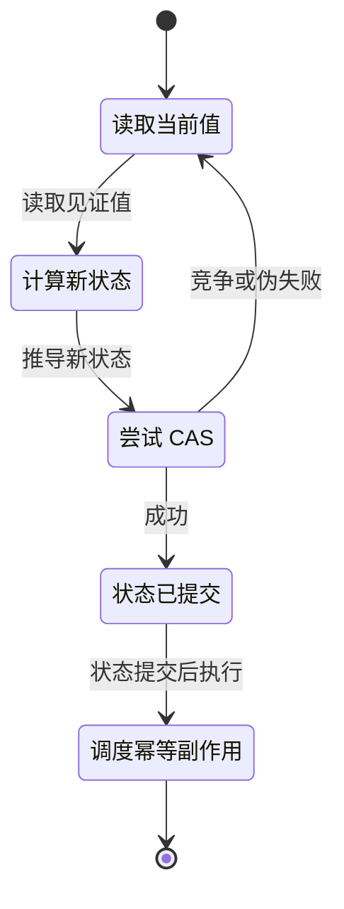

把数据库写、网络发送或计费放进 CAS 重试函数里非常危险：函数可能执行多次。应先通过 CAS 取得状态所有权，再执行允许的副作用；若进程崩溃会留下“状态已变、副作用未完成”的窗口，还需要日志、幂等键或恢复协议。

### 12.5 ABA 没有被 CAS 自动解决

CAS 只比较当前值：引用按 identity，浮点数按原始位表示。状态从 A 变成 B 又回到 A，CAS 可能认为“一直没变”。常见解法包括：

- 把版本号与引用组合进同一原子状态；
- 使用 `AtomicStampedReference`；
- 单写者所有权；
- 不复用节点，配合安全内存回收策略。

引用类型 CAS 使用 `==`，不是 `.equals()`；浮点值按原始位表示比较，`+0.0`、`-0.0` 和不同 NaN payload 也要谨慎。

## 13. 数组与 ByteBuffer 视图

### 13.1 数组元素

数组 VarHandle 的坐标是“数组 + 元素下标”，可以直接对某个 lane 做原子更新：

```java
import java.lang.invoke.MethodHandles;
import java.lang.invoke.VarHandle;

public final class ArraySequencer {
    private static final VarHandle ELEMENT =
            MethodHandles.arrayElementVarHandle(long[].class);

    public static void main(String[] args) {
        long[] lanes = new long[4];

        long previous = (long) ELEMENT.getAndAdd(lanes, 2, 1L);
        long current = (long) ELEMENT.getVolatile(lanes, 2);

        System.out.println(previous); // 0
        System.out.println(current);  // 1
        assert ELEMENT.coordinateTypes()
                .equals(java.util.List.of(long[].class, int.class));
    }
}
```

不同数组元素是不同 JMM 变量，但多个热点 lane 仍可能落在同一硬件 cache line，产生 false sharing。

### 13.2 字节视图的 JDK 25 边界

`MethodHandles.byteArrayViewVarHandle` 和 `byteBufferViewVarHandle` 可以用指定字节序把字节区解释成 `int`、`long` 等类型。坐标中的 `int` 是**字节偏移**，不是“第几个 int”。

JDK 25 的限制比很多旧教程更严格：

| 载体 | Plain | 非 Plain / 原子模式 |
| --- | --- | --- |
| `byte[]` 视图 | 支持 | 不支持，抛 `UnsupportedOperationException` |
| heap `ByteBuffer` | 支持 | 不支持，抛 `IllegalStateException` |
| 未对齐 direct `ByteBuffer` | 支持 | 不支持，抛 `IllegalStateException` |
| 对齐 direct `ByteBuffer` | 支持 | 按视图类型支持相应原子模式 |

原因不是“Java 不支持原子 int”，而是 byte 数组或 heap buffer 的基地址不保证满足更宽类型原子访问的自然对齐。JDK 23 已收紧这类行为，JDK 25 延续了该规则。[JDK-8320247](https://bugs.openjdk.org/browse/JDK-8320247) · [MethodHandles JDK 25](https://docs.oracle.com/en/java/javase/25/docs/api/java.base/java/lang/invoke/MethodHandles.html)

对齐 direct `ByteBuffer` 也不是“所有类型、所有 RMW 都支持”。JDK 25 的能力矩阵是：

| 模式 | 可用的视图类型 |
| --- | --- |
| read / write | `short`、`char`、`int`、`long`、`float`、`double` |
| CAS、exchange、get-and-set | `int`、`long`、`float`、`double` |
| get-and-add | `int`、`long` |
| bitwise RMW | `int`、`long` |

plain `long` / `double` 虽可访问，Javadoc 仍不提供无条件的原子性保证；浮点 CAS / exchange 比较的是原始位表示，不是按 `==` 的数值语义比较。

```java
import java.lang.invoke.MethodHandles;
import java.lang.invoke.VarHandle;
import java.nio.ByteBuffer;
import java.nio.ByteOrder;

public final class DirectBufferView {
    private static final VarHandle INT_BE =
            MethodHandles.byteBufferViewVarHandle(
                    int[].class, ByteOrder.BIG_ENDIAN);

    public static void main(String[] args) {
        ByteBuffer buffer = ByteBuffer.allocateDirect(32)
                .alignedSlice(Integer.BYTES);

        // 工厂参数 BIG_ENDIAN 决定视图字节序，不读取也不受 buffer.order() 影响。
        buffer.order(ByteOrder.LITTLE_ENDIAN);

        INT_BE.setVolatile(buffer, 0, 0x01020304);
        int value = (int) INT_BE.getVolatile(buffer, 0);

        System.out.printf("%08x%n", value);          // 01020304
        System.out.printf("%02x%n", buffer.get(0)); // 01
    }
}
```

`isAccessModeSupported()` 只能回答“这个句柄的变量类型是否具备某种模式”，不能证明某个具体 ByteBuffer 坐标可用。非 plain 访问还要确认 `buffer.isDirect()`，并用 `buffer.alignmentOffset(index, valueSize) == 0` 验证该字节偏移自然对齐；JDK 25 的 heap buffer 只能使用 plain 模式。不要靠热路径里的异常探测能力。

常见失败可以按两个阶段区分：

| 阶段 | 异常 | 含义 |
| --- | --- | --- |
| 创建字段句柄 | `NoSuchFieldException`、`IllegalAccessException` | 字段描述或 Lookup 权限不匹配 |
| 调用点类型适配 | `WrongMethodTypeException`、`ClassCastException` | 坐标、变量或返回类型不匹配 |
| 模式选择 | `UnsupportedOperationException` | 句柄、变量类型或 final 字段不支持该模式 |
| Buffer 载体 / 对齐 | `IllegalStateException` | heap buffer 或具体偏移不能执行非 plain 访问 |
| 只读 Buffer 写入 | `ReadOnlyBufferException` | 载体不允许修改 |
| 坐标范围 | `NullPointerException`、数组越界或 Buffer `IndexOutOfBoundsException` | receiver、数组下标或字节范围无效 |

## 14. 内存栅栏（Fence）为什么通常不是首选

VarHandle 还提供：

- `fullFence()`；
- `acquireFence()`；
- `releaseFence()`；
- `loadLoadFence()`；
- `storeStoreFence()`。

Fence 只约束当前线程操作的可观察重排，不携带“哪个状态代表发布完成”的信息，也不会把普通复合操作变成原子事务。

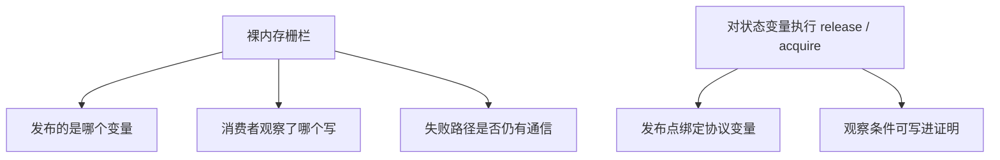

除非实现成熟的并发算法并能写出完整证明，否则优先使用绑定到具体变量的 acquire/release、volatile、CAS，或更高层同步工具。单独插入一个 fence 不能凭空修复 data race。

## 15. 字撕裂、64 位撕裂与伪共享

这三个名词经常被混成一个问题：

| 问题 | 语义 | 正确性还是性能 |
| --- | --- | --- |
| Word tearing | 写一个字段或数组元素破坏相邻变量 | JLS 禁止 |
| 普通 64 位撕裂 | non-volatile `long` / `double` 的单次普通写可表现为两次 32 位写，读取可能拼接不同写入的两半 | 正确性风险 |
| False sharing | 独立热点变量共享 cache line，引发一致性流量 | 性能问题 |

JLS 要求每个字段和数组元素独立，禁止因为写 `byte[0]` 而破坏 `byte[1]`。但语言规范仍允许普通 non-volatile `long` / `double` 的一次写表现为两个 32 位写，读取因而可能看到来自不同写入的高低两半；volatile 64 位访问必须原子。现代 HotSpot 常常原子实现普通 64 位访问，不应把实现习惯升级成跨 JVM 语言保证。

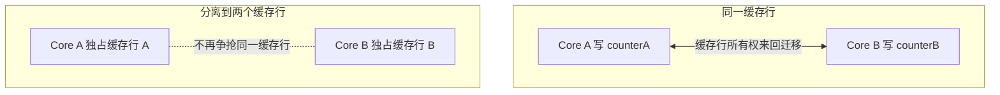

False sharing 不会改变 JMM 的变量值语义，却可能显著抬高尾延迟。解决它需要测量真实布局、写入频率与核心放置；不要假设某个固定填充字节数在所有 JVM、对象布局和硬件上都成立。

## 16. 怎样验证并发协议

并发正确性不能靠“循环跑一百万次没出错”证明。一次测试只探索了 JVM、JIT、硬件和调度器允许空间中的极小部分。

### 16.1 jcstress 检查允许结果

OpenJDK jcstress 是并发语义测试工具。测试应先声明状态与多个 actor，再把结果分成：

- `ACCEPTABLE`：规范允许且算法接受；
- `ACCEPTABLE_INTERESTING`：允许但值得关注；
- `FORBIDDEN`：如果出现就说明协议或实现有错。

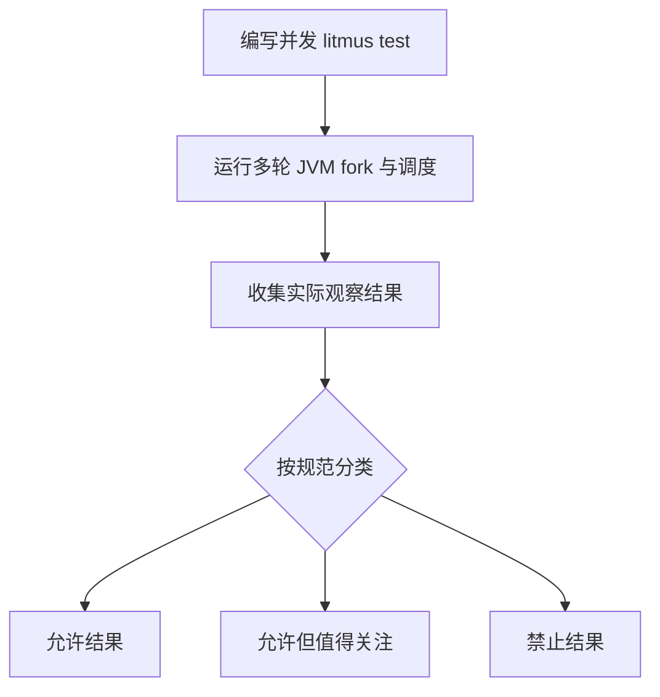

jcstress 可以发现反例，但有限测试仍不是形式证明。协议设计要先有 HB / VarHandle 语义推导，再用测试验证实现没有偏离。[OpenJDK jcstress](https://openjdk.org/projects/code-tools/jcstress/)

### 16.2 JMH 只测性能，不证明正确

JMH 用于构建和运行 JVM 微基准。它能帮助控制 warmup、fork、measurement 和死代码消除，但无法证明并发算法正确。基准至少应报告：

- JDK、JVM 参数、CPU、操作系统；
- 线程数、共享范围、竞争程度；
- fork / warmup / measurement；
- 成功、失败和重试是否都计入结果；
- 吞吐以外的延迟分布与分配率。

同一个模式在 x86 上“更快”，不代表它在 ARM 上同样生成代码，也不代表削弱内存顺序后的维护成本值得。[OpenJDK JMH](https://openjdk.org/projects/code-tools/jmh/)

完整的实验方法——包括开放负载、协调遗漏、HdrHistogram、JIT/GC 稳态和生产灰度——放在 [下一章：Java 低延迟到底应该怎么测](/signal-grid-blog/posts/java-low-latency-measurement/)。

### 16.3 评审时要求一张证明表

| 项目 | 必须回答 |
| --- | --- |
| 所有权 | 哪个线程可以写，何时转移 |
| 发布变量 | 消费者观察哪个状态才可读 payload |
| 成功路径 | 哪条 release/acquire 或 volatile 边成立 |
| 失败路径 | CAS 失败、超时、关闭时是否错误推进 |
| 复用 | 槽位、节点或版本会不会产生 ABA |
| 进度 | 自旋是否有超时、退避与关闭响应 |
| 测试 | 哪些结果允许，哪些结果必须禁止 |

如果这些问题只能用“x86 一般不会”“压测没见过”回答，协议还没有完成。

## 17. 回到 Disruptor、Agrona 与 Aeron

本文的价值不是多认识一个 API，而是能重新解释后续组件：

| 组件 | 表面动作 | JMM / VarHandle 视角 |
| --- | --- | --- |
| Disruptor | claim → 填槽 → publish | payload plain writes 先于发布状态，消费者通过 barrier 观察连续可用位置 |
| Agrona `AtomicBuffer` | `putIntRelease` / `getIntAcquire` | 把同样的发布协议放进 Buffer 字节位置 |
| Agrona Queue | `offer` / `poll` | 成功交接对象所有权，并由内部协议建立可见性 |
| Aeron Publication | 填 log buffer → frame length 发布 | 以发布字段使完整 frame 对 Media Driver 可见 |
| Aeron counters | plain / opaque / release / volatile 位置读写 | 监控快照与控制协议需要不同强度，不能混用 |

因此：[后续的 Disruptor 章节](/signal-grid-blog/posts/lmax-disruptor-ring-buffer-and-sequencing/) 不再只是“Ring Buffer 很快”，而是一套领取、填充、release 发布、acquire 观察与 gating 防覆盖的协议；[Agrona 章节](/signal-grid-blog/posts/agrona-direct-buffer-queues-and-agents/) 则把这些语义扩展到 Buffer、队列、Agent 和跨进程共享内存的底层积木。进入它们之前，[下一章](/signal-grid-blog/posts/java-low-latency-measurement/) 会先建立判断“快”是否可信的测量方法。

## 18. 选型检查表

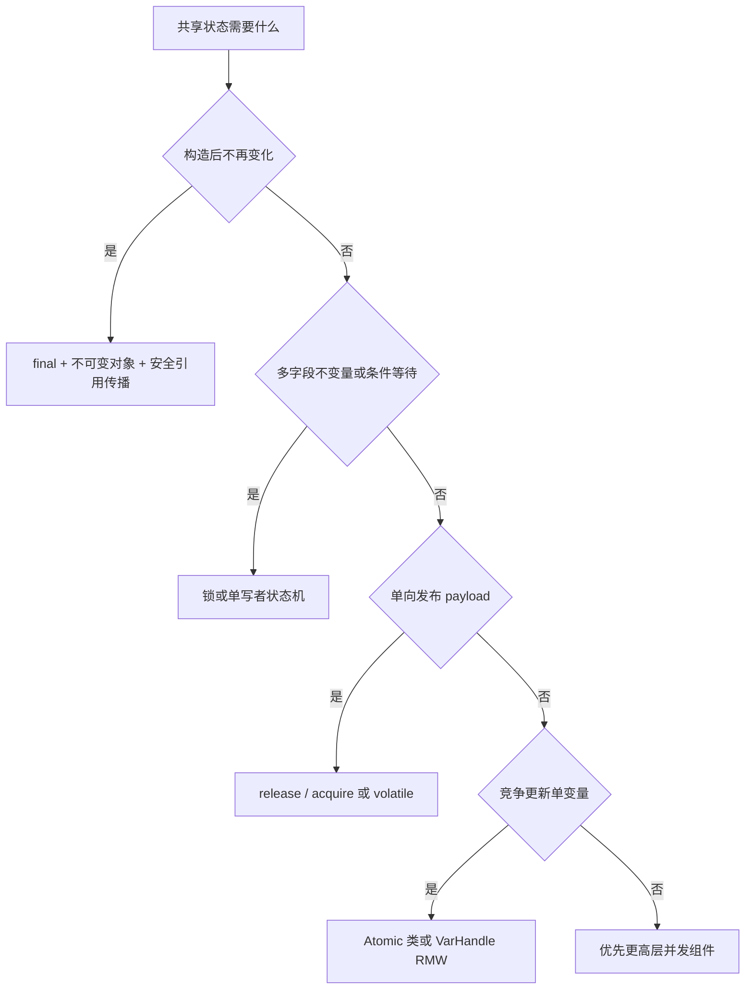

提交底层并发代码前，逐项确认：

1. 共享变量和冲突访问是否已全部列出；
2. 每个冲突访问之间是否有 HB 或 VarHandle 协议；
3. 是否把“可见”误当成“复合操作原子”；
4. release/acquire 是否通过同一协议变量形成真实通信；
5. 是否有人用 plain VarHandle 访问覆盖了字段声明的 volatile；
6. weak CAS 是否在允许重试的循环中；
7. CAS 重试体是否包含可能重复执行的副作用；
8. 是否处理 ABA、溢出、关闭和永久自旋；
9. Buffer 原子访问是否满足 JDK 版本、direct 与对齐条件；
10. 是否先用 jcstress 验证结果集合，再用 JMH 测性能。

## 19. 自测问题

1. 生产者普通写 `payload`，再 `setRelease(ready, 1)`；消费者 `getOpaque(ready)` 读到 `1` 后读取 payload。为什么这仍不是完整的 release/acquire 发布协议？
2. 一个字段声明为 `volatile`，但通过 VarHandle `get()` 读取。这个读取是什么语义？
3. `compareAndExchangeRelease` 失败时，是否已经执行 release 写？为什么失败路径不能宣称发布完成？
4. 两个线程分别更新 `long[]` 的相邻元素，没有 data race，却出现严重吞吐下降。更可能是哪类问题？
5. `volatile int balance` 能否让“检查余额并扣减”成为原子事务？应该怎样重新划定同步边界？

一个完整的情境题：设计一个可循环复用的 SPSC mailbox，至少定义 EMPTY、READY 两个代际状态，写出生产者与消费者各自的访问模式、满载策略、关闭路径，并证明生产者不会覆盖未消费 payload、消费者不会把旧一轮 READY 当成新消息。只有当这张证明图成立后，才讨论能否把 volatile 削弱为 release/acquire。

## 20. 官方资料

- [Java Language Specification 25：Threads and Locks](https://docs.oracle.com/javase/specs/jls/se25/html/jls-17.html)
- [JLS 25 §17.4：Memory Model](https://docs.oracle.com/javase/specs/jls/se25/html/jls-17.html#jls-17.4)
- [JLS 25 §17.5：final Field Semantics](https://docs.oracle.com/javase/specs/jls/se25/html/jls-17.html#jls-17.5)
- [VarHandle：Java SE 25 Javadoc](https://docs.oracle.com/en/java/javase/25/docs/api/java.base/java/lang/invoke/VarHandle.html)
- [MethodHandles：Java SE 25 Javadoc](https://docs.oracle.com/en/java/javase/25/docs/api/java.base/java/lang/invoke/MethodHandles.html)
- [JEP 193：Variable Handles](https://openjdk.org/jeps/193)
- [JEP 471：Deprecate the Memory-Access Methods in sun.misc.Unsafe](https://openjdk.org/jeps/471)
- [JEP 498：Warn upon Use of Memory-Access Methods in sun.misc.Unsafe](https://openjdk.org/jeps/498)
- [OpenJDK jcstress](https://openjdk.org/projects/code-tools/jcstress/)
- [OpenJDK JMH](https://openjdk.org/projects/code-tools/jmh/)
- [java.util.concurrent：Memory Consistency Properties](https://docs.oracle.com/en/java/javase/25/docs/api/java.base/java/util/concurrent/package-summary.html#MemoryConsistencyProperties)
- [JDK-8320247：byte array 与 heap ByteBuffer 原子访问对齐规则](https://bugs.openjdk.org/browse/JDK-8320247)
