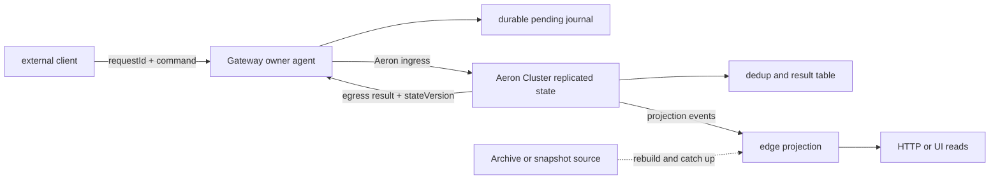
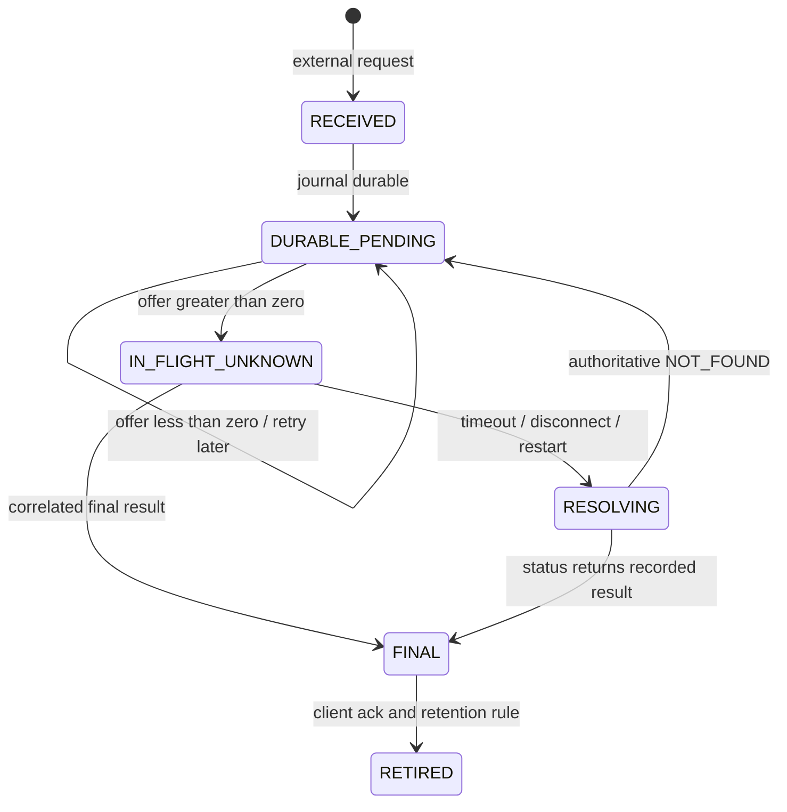
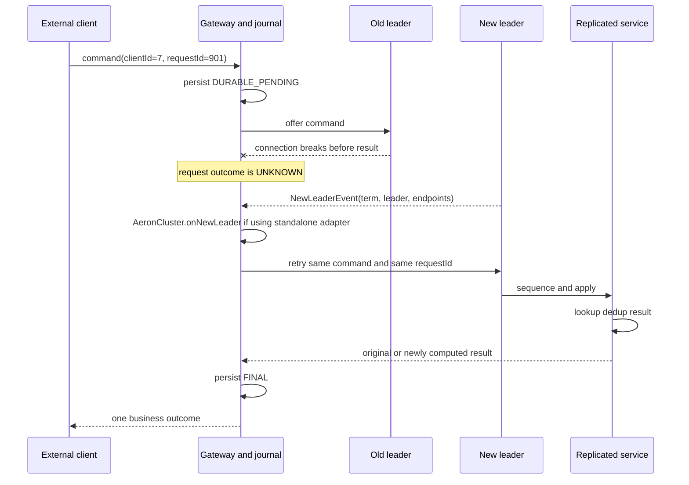
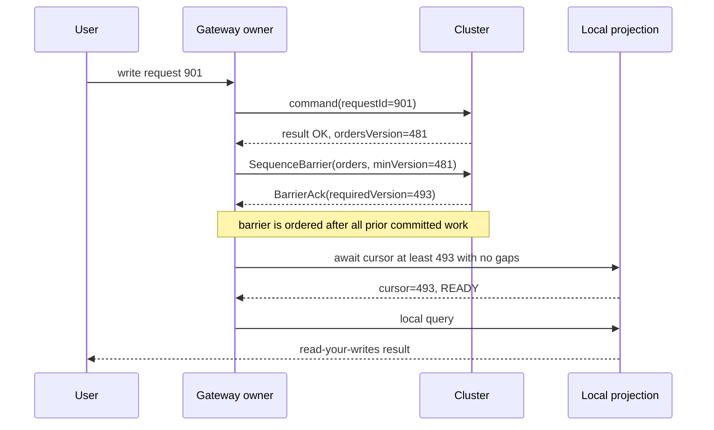
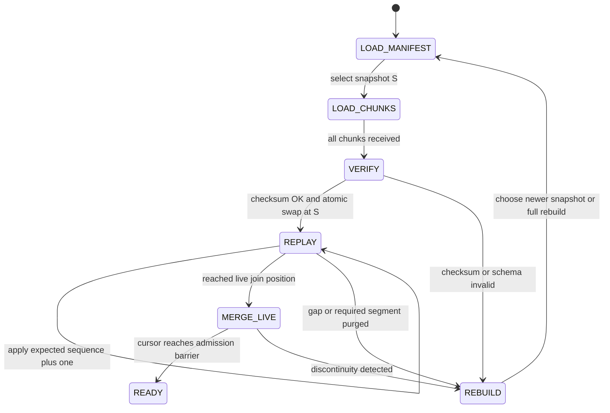

在 [上一章](/signal-grid-blog/posts/aeron-cluster-deterministic-services-and-clients/) 中，我们已经把请求去重放进了确定性状态机。但真实系统不会在 `ClusteredService` 的回调处结束：外部连接先到 Gateway，响应还要穿过 egress、协议适配和下游 socket；Gateway 往往又保存一份可直接查询的 projection。任何一段超时，调用方看到的都只是同一句话——“我不知道刚才那次请求成功没有”。

本章要证明的结论是：**Aeron Cluster 线性化的是复制状态机，端到端的边缘一致性则要由应用协议把同一个稳定请求身份和同一个单调状态版本，贯穿 Gateway journal、Cluster 内结果表、Read Barrier 与 Projection 恢复。** 少掉其中任意一环，选举仍然可能正确，用户却会看到重复下单、写后读旧值或恢复后的视图缺口。

本文讨论 Aeron `1.52.2`。Aeron 客户端切换、方法返回值等实现事实以该版本固定 tag 的源码为准；pending journal、`requestId`、业务状态版本和 projection 协议是本文给出的应用层设计，不是 Aeron 内置功能。

## Cluster 的一致性边界没有延伸到浏览器和本地 Projection

[Aeron 官方 Gateway 设计](https://aeron.io/docs/aeron-cluster/gateway-design/) 建议用 Gateway 隔离外部协议与 Cluster：FIX、HTTP、WebSocket 或数据库连接不必理解 Leader 发现和重新连接，校验、编码与扇出也不会挤进单线程业务内核。这是一条很有价值的进程边界，但它不会自动成为一致性边界。

一次请求实际上跨过三种权威程度不同的状态：

| 状态平面 | 典型内容 | 谁能给出最终业务事实 |
| --- | --- | --- |
| Gateway 持久意图 | 外部请求、稳定 `requestId`、发送与响应状态 | 只能证明 Gateway 收到过什么，不能证明 Cluster 执行过什么 |
| Cluster 复制状态 | 账户、订单、结果表、业务版本 | 唯一权威；由已提交 Cluster Log 驱动 |
| 边缘 Projection | 订单列表、余额视图、查询索引、缓存 | 只能证明自己已经应用到哪个可验证版本 |



图中只有 Cluster 内状态是业务真相。journal 是恢复发送意图的依据，projection 是有版本的派生物，Archive 只是记录与回放介质。把这几层都叫“持久化”会掩盖最重要的问题：它们持久化的事实并不相同。

因此需要先确定两条不变量：

- 同一个业务请求在重连、Gateway 切换和 Leader 切换后仍使用同一个 `(clientId, requestId)`；
- Gateway 只有在拿到 Cluster 生成的最终结果，或在 projection 已追到 Cluster 给出的目标版本后，才向外声称完成或可见。

后面所有机制都只是在不同故障窗口里维持这两条不变量。

## Pending Journal 把“结果未知”保存成可恢复状态

最危险的 Gateway 不是会返回错误的 Gateway，而是崩溃重启后忘记自己曾经发过什么的 Gateway。它可能给同一笔业务生成新 ID，也可能把 `offer > 0` 的请求误记为成功。正确的 pending journal 不负责裁决业务结果；它负责确保 Gateway 丢失进程内存后，仍能用**相同身份**继续查询或重试。

这不是凭空增加的一层复杂度。官方 [Application Level Protocols](https://aeron.io/docs/cluster-quickstart/application-protocols/) 也建议 Cluster client 为消息保留状态、使用 GUID 或 Snowflake 一类唯一关联标识并跟踪消息，特别点出了“发送时恰逢 Leader 丢失”这个窗口。本文的 journal 是把该要求延伸到进程崩溃之后。

### 先持久化身份，再尝试发送

一个命令 envelope 至少应包含：

| 字段 | 作用 |
| --- | --- |
| `tenantId / clientId` | 跨 Aeron session、Gateway 实例保持的业务主体 |
| `requestId` | 主体范围内稳定且唯一的幂等键 |
| `payloadFingerprint` | 防止同一个键被用于两份不同命令 |
| `protocolVersion / commandType` | 让恢复进程能按原协议解释 payload |
| 原始或规范化 payload | 保证重试发送的业务含义不变 |

最好由外部调用方生成并持久化 idempotency key。若由 Gateway 生成，Gateway 必须先把 ID 返回并得到调用方认可，或把“外部请求身份到内部 `requestId`”的映射纳入同一个持久化边界；否则它在返回 ID 前崩溃，调用方仍只能制造第二个请求。

如果恢复目标包含进程或主机崩溃，顺序应是：journal append 达到约定的 durability boundary（例如 WAL 的 `fdatasync` 或一次 group commit）之后，才把请求交给 `AeronCluster.offer(...)`。只写进页缓存却对外承诺“已受理”，断电后仍会丢失受理事实。批量提交可以降低同步写成本，但相应地，批次提交前不能提前确认持久受理。



这里刻意没有 `OFFERED -> SUCCESS`。在 1.52.2 中，`AeronCluster.offer(...)` 的返回约定直接继承 `Publication.offer(...)`：正值是 Publication 接受消息后得到的新 stream position，负值表示 `NOT_CONNECTED`、`BACK_PRESSURED`、`ADMIN_ACTION` 等发送状态。固定 tag 的 [`AeronCluster.offer` 源码](https://github.com/aeron-io/aeron/blob/1.52.2/aeron-cluster/src/main/java/io/aeron/cluster/client/AeronCluster.java) 也只负责补 ingress session header、offer 并跟踪 publication 结果。正值既不是 Cluster Log position，也不是多数派提交证明，更不是业务响应。

以下是精简的 Gateway 所有权模型。它不是可直接复制的存储实现，而是用代码把关键顺序写清楚：

```java
record RequestKey(long clientId, long requestId) {}
record PendingCommand(
    RequestKey key,
    long payloadFingerprint,
    byte[] encodedCommand,
    State state) {}

enum State { DURABLE_PENDING, IN_FLIGHT_UNKNOWN, RESOLVING, FINAL, RETIRED }

void onExternalCommand(PendingCommand command)
{
    journal.appendAndCommit(command);           // intake/durability lane
    ingressQueue.offer(command.key());          // publish only after durable
}

int ownerDutyCycle()
{
    int workCount = aeronCluster.pollEgress();  // exactly one Aeron owner
    final RequestKey key = ingressQueue.poll();
    if (key != null)
    {
        tryOffer(journal.load(key));
        workCount++;
    }
    return workCount;
}

void tryOffer(PendingCommand command)
{
    final long result = aeronCluster.offer(
        new UnsafeBuffer(command.encodedCommand()), 0, command.encodedCommand().length);

    if (result > 0)
    {
        journal.transition(command.key(), State.IN_FLIGHT_UNKNOWN);
        // Accepted by Publication; wait for result or query Cluster state.
    }
    else if (result == Publication.BACK_PRESSURED ||
             result == Publication.ADMIN_ACTION ||
             result == Publication.NOT_CONNECTED)
    {
        retryQueue.offer(command.key());        // same key, same bytes
    }
    else if (result == Publication.CLOSED ||
             result == Publication.MAX_POSITION_EXCEEDED)
    {
        journal.transition(command.key(), State.RESOLVING);
        reconnectQueue.offer(command.key());    // retain pending; retry same ID later
    }
    else
    {
        throw new IllegalStateException("unexpected offer result=" + result);
    }
}
```

`CLOSED` 与 `MAX_POSITION_EXCEEDED` 同样没有接受本次消息；区别是客户端连接或 Publication 已不能在原路径继续。journal 仍要保留 pending，owner 让 `AeronCluster` 状态机完成 Leader 切换/关闭，或重建 client 后再用同一 ID 解析结果，不能把 transport 终态变成业务失败并丢掉请求。

`IN_FLIGHT_UNKNOWN` 是正常协议状态，不是可直接翻译成“失败”的异常。Gateway 可能在命令提交后、egress 到达前崩溃；也可能在 journal 记录最终结果后、HTTP 响应发出前崩溃。重启后它应先查本地 `FINAL`，查不到再向 Cluster 查询权威结果，必要时以相同 ID 重发。网络超时只改变 Gateway 的知识，不改变 Cluster 的事实。

### Journal 不是第二份业务数据库

journal 中可以缓存最终结果以便快速回答重复 HTTP 请求，但裁决权仍在 Cluster 内的结果表。尤其在 active/active Gateway 中，本地 journal 只看到经由本实例的请求；两个实例必须共享外部稳定 ID，并最终向同一份 Cluster 结果表收敛。官方 [Gateway Patterns](https://aeron.io/docs/aeron-cluster/cluster-gateway-patterns/) 同样把 active/active inbound 的关键约束落在确定性与单调 sequence 去重上。若改用“每个 Gateway 独立的本地自增序号”作为业务 ID，就还需要租约与 fencing，否则并发活动实例会碰撞；若多个 Gateway 确实处理同一输入，则必须按协议生成同一标识，而不是各自发明一个。

## NewLeaderEvent 只恢复路由，不能裁定旧请求

Leader 变化会同时影响两件事：客户端该往哪里发，以及先前请求到底走到了哪一步。`NewLeaderEvent` 只回答第一件事。

1.52.2 的 [`pollEgress()` / `controlledPollEgress()`](https://github.com/aeron-io/aeron/blob/1.52.2/aeron-cluster/src/main/java/io/aeron/cluster/client/AeronCluster.java) 文档明确要求频繁调用，以发现 leadership change；它们除了轮询 egress，还会推进客户端自己的状态变化。内置轮询路径解码到新 Leader 后，会调用 `AeronCluster.onNewLeader(...)`。后者会校验 `clusterSessionId`，进入 `AWAIT_NEW_LEADER_CONNECTION`，更新 term 和 leader，关闭旧 ingress Publication，并创建新 Publication 或更新 ingress endpoints，随后再通知应用 listener。

如果应用绕开 `pollEgress()`，单独使用 `EgressAdapter` 或 `EgressPoller`，则必须在识别事件后把参数传给 `AeronCluster.onNewLeader(...)`；方法注释专门说明了这一点。单独的 [`EgressAdapter`](https://github.com/aeron-io/aeron/blob/1.52.2/aeron-cluster/src/main/java/io/aeron/cluster/client/EgressAdapter.java) 只是把事件派发给 listener，并不会替另一个 `AeronCluster` 对象重建 ingress。应用还必须在每个 duty cycle 调用 [`AeronCluster.pollStateChanges()`](https://github.com/aeron-io/aeron/blob/1.52.2/aeron-cluster/src/main/java/io/aeron/cluster/client/AeronCluster.java#L641-L659)，让等待新 Leader、等待 ingress 重连与 pending close 的 deadline 真正推进。反过来，使用内置 `pollEgress()` 时，这两步已由它完成，不要再重复调用。



Gateway 在 `AWAIT_NEW_LEADER_CONNECTION` 期间可以继续接收外部请求并写 journal，但不应把临时 `NOT_CONNECTED` 翻译成业务拒绝，也不应为重试换 ID。即便 `sendKeepAlive()` 在切换期失败，官方源码注释要求应用继续 poll egress，让新 Leader 连接得以前进。

若直接取得 `ingressPublication()` 自己 `offer` 或 `tryClaim`，它只是一个 raw Publication。消息必须先经 `IngressSessionDecorator`，或手工前置正确的 `SessionMessageHeader`；每次返回值还必须交给 [`trackIngressPublicationResult(...)`](https://github.com/aeron-io/aeron/blob/1.52.2/aeron-cluster/src/main/java/io/aeron/cluster/client/AeronCluster.java#L713-L725)。Leader 切换后，`onNewLeader(...)` 会关闭并替换 `AeronCluster` 内部 Publication，之前缓存的 raw Publication 不会自动指向新对象；外置 decorator 保存的 `leadershipTermId` 也不会自动更新。恢复发送前必须重新取得 `ingressPublication()`，并用新 term 更新或重建 decorator。常规 `AeronCluster.offer` 已自动完成 header、Publication 替换与状态跟踪；缺少其中任一步都会让手写路径在切换后持续向旧 Publication 发送，或携带旧 term header。

但无论切换代码多正确，`leadershipTermId` 都只能说明 Leader epoch，不能说明 `requestId=901` 是否在权威日志里。旧 Leader 可能没收到请求，也可能已经提交而响应丢失。路由恢复后仍要查询或重试同一个请求，让业务结果表裁决。

## 幂等结果表把所有重试折叠为同一条业务事实

去重集合只能回答“见过”，却不能回答“上次得到什么结果”。对 Gateway 而言，真正有用的是一张复制、可快照、可查询的**幂等结果表**：

```text
(clientId, requestId) -> {
    payloadFingerprint,
    outcomeCode,
    resultPayload,
    stateVersion,
    requiredProjectionVersions,
    completedAtClusterTime
}
```

这是本文第二个应用层机制。它必须属于 `ClusteredService` 的确定性状态，随 domain state 一起修改、一起进入 snapshot、一起在日志 replay 后重建，而不是只存于 Leader 内存或某个 Gateway。

### 先查表，再进行不可重复的状态转换

对每条命令，状态机只有三条合法路径：

1. key 不存在：先完整校验；通过则执行一次 domain transition、递增相应业务版本并保存成功结果；拒绝则保存稳定拒绝与当时版本，通常不修改领域状态或推进 projection version，除非协议明确把拒绝也定义为一个有序版本事件；
2. key 存在且 fingerprint 相同：不再修改 domain state，原样返回已保存结果和版本；
3. key 存在但 fingerprint 不同：返回稳定的 `IDEMPOTENCY_KEY_REUSE` 协议错误，绝不把第二份 payload 当成重试。

业务拒绝也必须保存。否则“余额不足”第一次的拒绝结果没有落表，第二次因余额变化又成功，同一个请求就得到两个事实。结果表写入要发生在响应之前；egress 遇到背压或客户端断线时，权威结果仍然可查询。1.52.2 的 `ClientSession.offer` 在 Leader 上返回普通 Publication offer 结果、在 Follower 上返回 mocked result，这也是为什么响应发送状态不能被写成复制业务结果；可从该版本的 [`ClientSession` 源码](https://github.com/aeron-io/aeron/blob/1.52.2/aeron-cluster/src/main/java/io/aeron/cluster/service/ClientSession.java) 核对角色边界。

“一起修改”并不意味着 Java 对象天然有事务。实现应在 mutation 前完成解码、鉴权、版本与业务约束验证，预先构造不会再失败的结果；mutation 之后避免会抛出的 I/O 或分配路径。若服务仍在 domain state 已变、结果表未写时抛异常，当前进程内状态已经不满足不变量，只能让容器失败并从合法 snapshot + log prefix 恢复，不能吞掉异常继续服务。

### 状态查询必须区分“未见过”和“已经退役”

Gateway 恢复时可以发送 `GetRequestStatus(clientId, requestId, fingerprint)`。它同样经过 Cluster 排序，并返回：

| 状态 | 含义 | Gateway 动作 |
| --- | --- | --- |
| `FOUND` | 已有最终结果 | 持久化 `FINAL`，向调用方返回同一结果 |
| `NOT_FOUND` | 在该查询排序点尚无该 key | 串行化本 key 后，以相同 envelope 重发 |
| `MISMATCH` | key 相同、payload 不同 | 停止重试并报告协议错误 |
| `RETIRED` | key 已在明确的保留协议下清理 | 不得当作新请求重新执行，转人工对账或历史查询 |

最后一行解决了常见的保留期漏洞：若旧结果直接 TTL 删除，迟到重试会看起来像从未执行，随后再次扣款。使用单调递增的 per-client request sequence 时，可以在客户端确认一段**连续前缀**后推进 replicated low watermark；水位以下即使没有逐条结果，也返回 `RETIRED`。使用随机 UUID 时，则需 tombstone、外部不可重放契约，或让结果保留期严格覆盖最大重试与灾备恢复窗口。

结果表最多保证复制状态机内部的一次业务转换。调用支付、交易所、邮件或数据库仍是 Cluster 之外的副作用；正确做法是把稳定 effect ID / outbox intent 放进复制状态，再由外部执行器以同一 ID 幂等提交和对账。把副作用调用包在 `onSessionMessage` 里，不会因 request 去重就自动获得 exactly-once。

## Read Barrier 必须穿过权威顺序，而不是等待一个固定毫秒数

写请求已经有稳定结果后，Gateway 仍可能从落后的本地 projection 读取旧值。sleep 10 ms、看到新 Leader、收到 keepalive，甚至看到某个 Aeron position 前进，都不能证明目标业务状态已进入这份 projection。

[官方 Client Consistency 文档](https://aeron.io/docs/aeron-cluster/client-consistency/) 明确说 Aeron Cluster 不替 client-held data 选择一致性模型。它给出的 strong-consistency 模式是：Cluster client 把外部读取封装成类似 `sequenceThis` 的消息交给 Cluster 排序，只在收到 `sequenced` 响应后回答；同时，状态更新必须经 Cluster client communications 传播，不能走一条无关且无法建立顺序的旁路。

工程上有两种正确落点。

### 让 Cluster 在已排序点直接计算查询

Gateway 把 `GetOrder` 当作 ingress command。服务在该消息的日志位置读取权威状态并返回结果。它天然排在此前已确认的写之后；若写的响应未知，则发送一个 `EnsureCommandAndQuery` 更直接：先按 `(clientId, requestId)` 查结果表，缺失时执行同一原始命令，存在时复用原结果，然后在同一个已排序回调中读取目标状态。

这种方式给出最清晰的线性化点，但每次强读都进入 Cluster 的串行路径。它适合低频的账户确认、风控决策和管理操作，不适合把所有 UI 列表翻页都压进共识吞吐预算。

### 让 Cluster 签发版本，再等本地 Projection 追上

若读必须在 Gateway 本地完成，写结果或后续 barrier 响应需要携带该 projection 的 `requiredVersion`。Gateway 只有在 `projectionCursor >= requiredVersion` 且中间无缺口后才能读取。



为什么 barrier ack 可能返回 `493` 而不是 `481`？因为其他客户端的命令可以排在写与 barrier 之间。只要版本坐标相同，等待更大的已排序点仍满足 read-your-writes。

如果一份 projection 只接收与自己有关的事件，不能简单等待全局版本：全局 `481 -> 493` 之间可能没有任何 orders event，cursor 永远不会到 `493`。协议必须二选一：

- 每个 projection 使用自己的连续 sequence，写结果携带对应的 `requiredProjectionVersion`；
- 使用全局 sequence，但给每份 projection 发送可验证的 watermark/no-op，使它能证明已经越过无关事件。

同一 Aeron egress 上先收到 update、再收到 barrier ack，也只证明 callback 顺序。若 update 被投递到另一个异步线程，ack callback 不能越过 projection apply；仍要等待该线程提交 cursor。

### 哪些数字不能偷偷充当业务版本

| 观察值 | 它真正描述什么 | 为什么不能直接作为 barrier |
| --- | --- | --- |
| ingress `offer` 正值 | 客户端 Publication stream position | 尚未证明 Cluster 提交或执行 |
| egress `Header.position()` | egress Image/stream 的传输位置 | 不是 Cluster Log 中的业务顺序 |
| egress callback `timestamp` | 相关 ingress 被排序时的 Cluster 时间 | 时间值不保证是连续、唯一的业务版本 |
| `leadershipTermId` | Leader epoch | term 内还有大量请求，没有逐请求顺序 |
| 节点 commit-position counter | 节点运维观测的 Cluster Log 提交进度 | Gateway 未拥有请求到该坐标、projection 到该坐标的语义映射 |

这些坐标不是“永远不能用”。如果应用明确把某个 Cluster log position 编码进权威响应，并保证 projection 每条事件都在同一坐标系中可连续验证，它可以成为 cursor。危险在于把两个恰好都叫 position 的值直接比较。最稳妥的接口仍是由状态机签发应用层 `stateVersion / projectionVersion`。

Read Barrier 保证的是“此读不早于某个权威顺序点”。它不保证 projection feed 永不丢包，也不保证任意旁路缓存新鲜。没有 gap detection 和恢复源的 `cursor >= version` 只是一个数字比较，不是一致性证明。

## Projection 恢复要证明 Snapshot 与增量流之间没有缝

Projection 不是把最后一个对象 dump 到磁盘就结束。它的恢复契约应写成：

> 加载一个在 `snapshotVersion = S` 上自洽的快照，再按同一 projection sequence 严格应用所有 `S + 1 ... T` 事件；只有状态与 cursor 原子落到 `T`，且已追过对外要求的 barrier，才能进入 READY。

### Cursor 是业务序号，Archive position 是取数据的位置

每个 projection event 至少携带：

- `projectionId` 与 `schemaVersion`；
- 连续的 `projectionSequence`；
- 产生该事件的稳定 command/request identity，便于审计；
- payload 与可选 checksum。

本地 checkpoint 要把 projection state 与 `projectionSequence` 原子提交。若增量来自 Archive，完整恢复元组至少是 `(recordingId, afterFragmentPosition, projectionSequence, projectionState)`：`afterFragmentPosition` 取最后一条已经纳入同一原子状态的 fragment/message 的 `Header.position()`，它是下一次 replay 的起点。不能读取可能领先消费者 apply 进度的 Archive recording-position counter 来替代它，也不能只保存一个 position 而漏掉 recording identity。

若存储引擎做不到原子提交，apply 必须按 sequence 幂等：先验证期望值为 `cursor + 1`，状态写入先于 cursor 也会造成崩溃后重复 apply，因此仍需版本化 upsert、write batch 或 WAL 来把二者收拢到一个恢复原子性边界。绝不能先推进 cursor 再异步写状态；崩溃后恢复会永久跳过事件。

[Aeron Archive](https://aeron.io/docs/aeron-archive/overview/) 能把 Aeron stream 记录到持久存储，从指定 recording position replay，并支持 replay 追上后与 live stream merge。它解决“从哪里重新取字节”，不解决“这些字节是否完整表达每一次 committed 业务变化”。因此即使使用 Archive，事件中的应用 sequence 仍是语义 gap detector；`recordingId + afterFragmentPosition` 才定位 replay 起点。它们必须与 projection state 一起 checkpoint，recording 轮换时还要由 manifest 明确下一段 identity，不能把一个裸 position 跨 recording 复用。

如果 projection stream 由 Gateway 或独立 publisher 生成，还必须证明生成源不会因 Leader egress 丢失而漏事件。可行做法是让 Cluster 的复制状态保留一段可按 sequence 查询的 change log/outbox，再由 publisher 补发到 recorded stream；或者提供从权威状态重新取 snapshot 的通道。仅把某个 session 的即时 egress 打开 recording，不能倒推出它覆盖了所有历史 committed transition。

### Snapshot 必须固定一个不可撕裂的切面

快照 manifest 至少包含 `projectionId`、`schemaVersion`、`snapshotId`、`snapshotVersion`、chunk 数、对象数与整体 checksum。接收端把 chunks 写入 staging store，拒绝 version 混杂、重复 chunk 内容不一致和 checksum 错误；全部校验后原子切换 active store，再从 `snapshotVersion + 1` replay。

大型快照不能边复制一个可变 DirectBuffer、边让后续命令覆盖同一内存，否则前半段属于 S、后半段属于 S+n。官方 [Reference Data 文档](https://aeron.io/docs/aeron-cluster/reference-data/) 也专门指出这种一致性风险，并建议大数据量采用由 Cluster 逐块请求、每块确认后再取下一块的协议以控制背压。对 projection，可在已排序请求处固定 immutable/versioned snapshot view，再由带 `snapshotId` 的分页命令拉取；若内存预算不允许冻结视图，就必须从独立、已完成的 snapshot 文件提供 chunks。



恢复时常见的两条数据路线如下：

| 路线 | Snapshot 来源 | 增量来源 | 必须额外证明的边界 |
| --- | --- | --- | --- |
| Cluster 查询协议 | 权威状态在排序点生成的 immutable snapshot/chunks | Cluster 内保留的 change log 分页 | 大响应不阻塞 service；每页来自同一 snapshot；保留窗口覆盖恢复 |
| Archive recorded feed | 独立 projection snapshot | `recordingId + afterFragmentPosition` 开始 replay，再 merge live | publisher 对 committed transition 完整；app sequence 与 recording position 映射连续 |

如果所需 Archive segment 已 purge、Cluster change log 也不再保留，而又没有更新的 snapshot，那么系统没有证据跨过缺口。正确结果是 projection 保持 NOT_READY 并全量重建，不是把当前收到的最新事件硬设成新 cursor。

## 慢客户端隔离决定边缘一致性会不会反噬 Cluster

Gateway 的价值之一，是让数千个速度不同的 HTTP/WebSocket/FIX 客户端不直接变成数千个 Cluster session。[官方 Cluster Clients 文档](https://aeron.io/docs/aeron-cluster/cluster-clients/) 给出的默认并发 session 上限是 10，并明确指出 stream 102 背压表示 Cluster 发得比 client 接得快，或中间网络过慢。把外部连接合并到少量 Gateway 后，仍需保证其中一个慢 socket 不会拖住 Gateway 的 egress poll。

`AeronCluster` 1.52.2 [明确不是线程安全的](https://github.com/aeron-io/aeron/blob/1.52.2/aeron-cluster/src/main/java/io/aeron/cluster/client/AeronCluster.java)。合理的执行模型是让一个 owner Agent 独占 connect、offer、keepalive 和 `pollEgress()`：外部 I/O 线程经 MPSC queue 提交已持久化命令；egress callback 只做有界解码、复制必要字节和推进内存状态，不在里面写慢 socket、等待数据库或同步刷新大文件。回调中的 `DirectBuffer` 数据也不能把引用留给异步线程，应在 callback 有效期内复制或解码到归属明确的缓冲区。

### 不同语义的数据必须有不同的降级策略

[官方 slow-client cookbook](https://aeron.io/docs/cookbook-content/aeron-cluster-slow-clients/) 列出 drop、disconnect、退出 Cluster 和无限重试四类选择。真正的设计问题是：哪类消息允许哪种选择。

| 下游消息 | 队列满时的安全动作 | 恢复依据 |
| --- | --- | --- |
| 可覆盖的 latest-value / 全量快照 | 合并为最新值，丢弃被覆盖的中间表示 | 新值本身完整，或带 snapshot version |
| 必须连续的 projection event | 断开该下游并要求从 cursor replay；不能静默跳号 | snapshot + change log / Archive |
| 事务最终结果 | 先落结果索引；发送仍堵塞则断开或返回可查询 token | Cluster 幂等结果表 + Gateway journal |
| 无法丢失且无恢复源的数据 | 停止接收新业务并进入受控故障，而非伪装成功 | 修复容量或补建恢复源 |

每个外部连接需要独立的消息数/字节预算和 cursor，不能共用一个“最慢订阅者决定全部人”的 FIFO。Gateway owner 也不应因为 downstream queue 满，就在 `controlledPollEgress()` callback 中长期返回 `ABORT`：`ABORT` 可以保留当前 fragment 供下次重读，却也阻止订阅前进，后续业务结果和 `NewLeaderEvent` 都可能被堵在同一 egress 后面。安全方向是先把事务结果变成可查询事实，再隔离或断开慢连接。

### 故障注入应证明协议不变量，而不是只看进程重启

下面的矩阵不是上线清单，而是各机制的最小反证实验。通过条件都指向前文的不变量：一次业务转换、一个可裁决结果、无 gap 的 projection。

| 注入点 | 允许看到的中间状态 | 通过条件 |
| --- | --- | --- |
| journal durable 后、首次 offer 前杀 Gateway | `DURABLE_PENDING` | 重启后同 ID 首次执行，只有一个最终结果 |
| `offer > 0` 后、egress 前杀 Gateway | `IN_FLIGHT_UNKNOWN` | 查询/同 ID 重试后收敛到一条结果，domain state 只变一次 |
| Leader 发送结果前终止 | NewLeaderEvent + 未知结果 | ingress 路由恢复；term 变化不被当作失败；结果表裁决旧请求 |
| projection 写状态与 cursor 之间杀进程 | NOT_READY | 原子恢复或幂等重放后，状态摘要等于从 S 连续 replay 的摘要 |
| 人为堵塞一个 WebSocket consumer | 该 client lag / disconnect | Gateway 继续 poll egress，其他 client 推进，慢 client 可按 cursor 或 requestId 恢复 |
| 删除恢复所需 Archive segment | projection gap | 明确拒绝 READY，选择更新 snapshot 或全量重建 |

只测“服务最终又起来了”无法发现重复扣款和静默缺口。更强的判据是：恢复后 domain digest、结果表、projection digest 与 cursor 必须对应同一合法 committed prefix；任何无法证明的 projection 都不得提供强一致读。

## 边缘一致性最终是一条可追踪的单调事实链

Gateway journal 先保存“我承诺处理这个稳定 ID”，但不冒充业务结果；`NewLeaderEvent` 恢复到当前 Leader 的路由，却不猜测旧请求命运；Cluster 内结果表把所有重试折叠成同一项状态转换，并给出权威结果与 projection version；Read Barrier 再把这个版本变成读的下界；projection 只有用 snapshot 加连续增量证明自己跨过该下界，才能对外回答。

这条链保证的是复制状态机到边缘读取之间可恢复、可裁决的顺序。它不保证外部副作用天然 exactly-once，不保证任意异步旁路完整，也不保证慢客户端值得无限等待。那些边界分别需要 effect ID/outbox、可回放 feed 和明确的隔离策略。

[下一章](/signal-grid-blog/posts/aeron-cluster-timers-snapshots-and-recovery/) 将回到 Cluster 节点内部，讨论 Timer 如何成为已排序事件，以及 Consensus Module 与业务 Snapshot 怎样共同构成可恢复状态。
