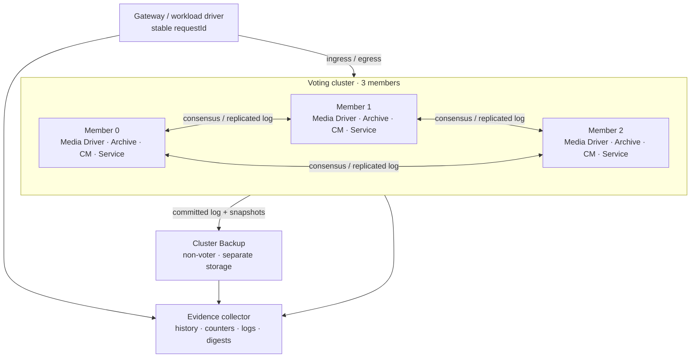
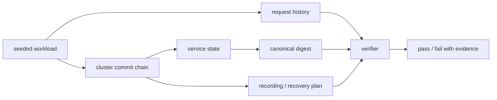
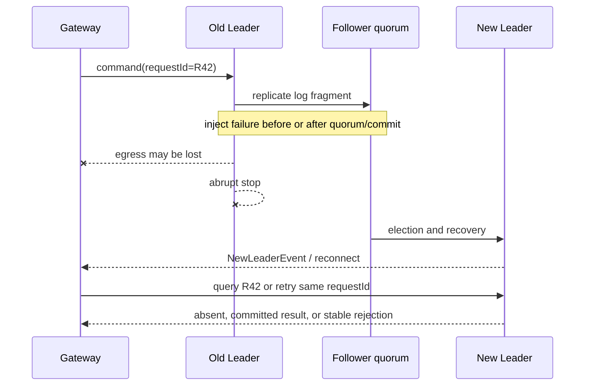
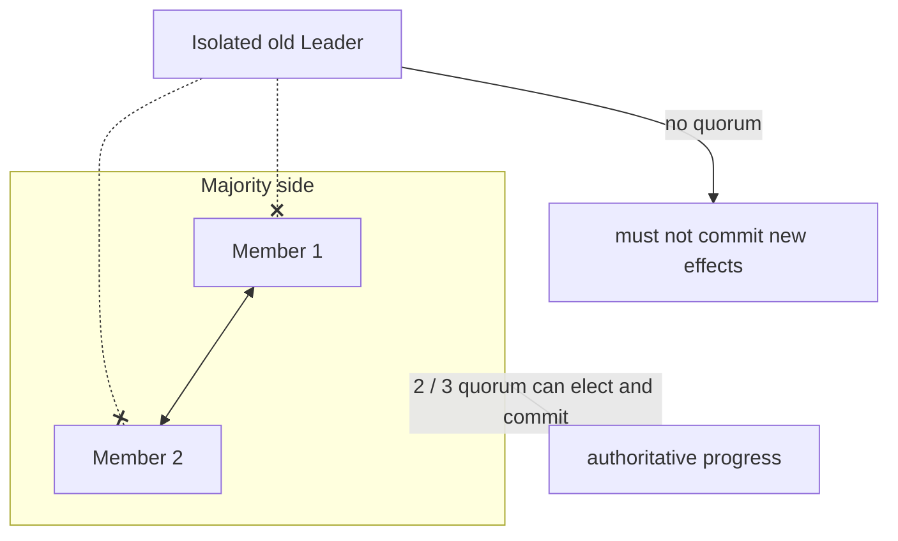
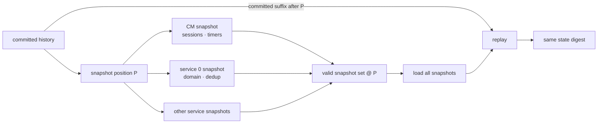
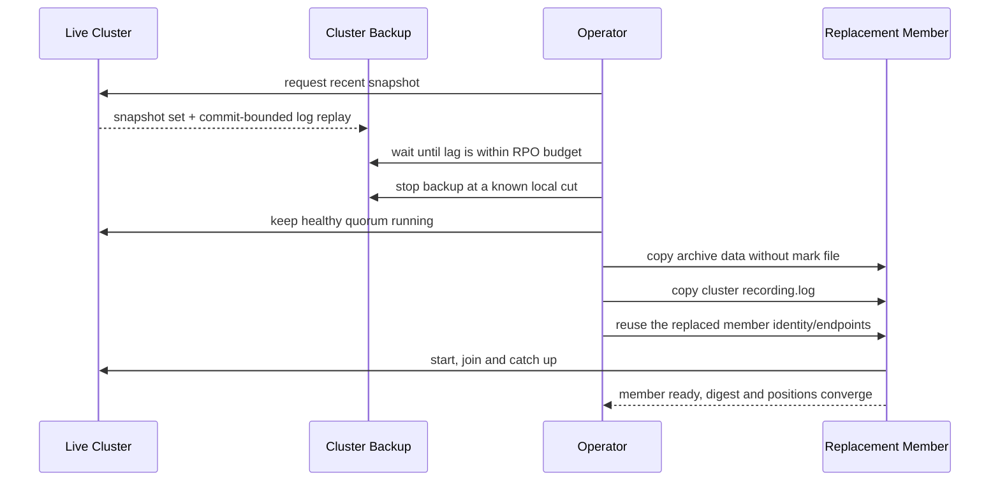

把三个进程启动起来，杀掉 Leader，再看到另一个节点打印 `LEADER`，只能证明**某次选举发生了**。它没有证明已经收到成功响应的请求仍然存在，没有证明超时请求没有执行两次，没有证明 Snapshot 可以加载，也没有证明远端 Backup 真能在灾难后恢复业务。

故障实验必须验证一份可判定的恢复合同：哪些请求一定存在，哪些一定不存在，哪些结果仍然未知；恢复后的状态是否等价于某个合法的已提交历史；旧 Leader 是否无法继续推进权威状态；RPO 与 RTO 是否落在预算内。

本文以 **Aeron 1.52.2** 为固定基线。官方 Cluster Quickstart 提供三节点、管理客户端和 Cluster Backup 的运行骨架；这里不重复 Docker 命令，而是补上从“演示故障切换”到“验证恢复协议”之间缺失的实验方法。选举状态、Snapshot 格式、Backup 内部机制与 counters 可先回看前面的 [选举与 Catch-up](/signal-grid-blog/posts/aeron-cluster-elections-catchup-and-consistency/)、[Timers 与 Snapshots](/signal-grid-blog/posts/aeron-cluster-timers-snapshots-and-recovery/)、[部署与 Cluster Backup](/signal-grid-blog/posts/aeron-cluster-deployment-security-and-backup/) 和 [Cluster 运维](/signal-grid-blog/posts/aeron-cluster-operations-performance-and-troubleshooting/)。

故障实验的方法论不归 Aeron 独占。如何从 invariant 推导 workload 与 fault schedule，怎样设置 Failpoint、接管不确定性、记录 History 并用 oracle 判定 safety/liveness，应以[恢复协议验证：Failpoint、确定性模拟与历史检查](/signal-grid-blog/posts/recovery-protocol-verification-failpoints-simulation-history-checking/)为通用框架；本章提供的是这套框架在 Aeron Cluster 上的产品化实验实例。

## 故障实验先定义判据，而不是先找一个进程杀掉

### 一套最小但不失真的拓扑

实验拓扑至少包含三个投票成员、一个集群客户端或 Gateway，以及位于不同故障域的 Cluster Backup。每个投票成员都有自己的 Media Driver、Archive、Consensus Module、Clustered Service Container、cluster directory 和 Archive directory。



同一台机器上的三个容器适合验证协议控制流，却不能证明跨主机网络、磁盘控制器、CPU 抢占和故障域隔离。实验应分两层：

1. **快速确定性层**：单机或 CI 中重复运行协议剧本，追求高覆盖、固定 seed 和可复现；
2. **部署同构层**：使用生产相同的 JDK、Aeron 构件、文件系统、挂载参数、网络和进程布局，测真实 RPO/RTO 与尾延迟。

第二层运行次数可以少，但不能被第一层代替。

### 先写出故障模型

下列故障不是同一件事：

| 故障 | 丢失的东西 | 仍可能保留的东西 | 实验重点 |
| --- | --- | --- | --- |
| Service/CM 进程崩溃 | 堆内状态、未发送响应 | Archive 文件、其他成员 | Snapshot + log replay |
| 单节点主机断电 | 该主机进程与 page cache | 另外两个成员 | 多数派提交与选举 |
| 少数派网络隔离 | 与多数派通信 | 隔离节点本地尾部 | 旧 Leader 不得提交 |
| 磁盘写满或 I/O 错误 | 后续录制能力 | 已验证的历史前缀 | fail closed，不带病确认 |
| 整个站点丢失 | 三个投票成员及本地介质 | 远端 Backup | 灾难恢复 RPO/RTO |
| 静默损坏 | 某段 log 或 Snapshot 内容 | 冗余副本、旧恢复点 | 校验、拒绝部分恢复 |

单节点故障时，三节点多数派仍可继续；再失去一个投票成员，就不再有 2/3 quorum，不能继续提交新命令。Cluster Backup 不投票，也不会在此时自动成为 Leader。

### 三类 oracle 共同决定成败

只看日志字符串不够。实验至少需要三个独立判据：

- **协议 oracle**：任期、角色、Election State、append/commit/service position 是否沿合法路径推进；
- **业务 oracle**：领域状态、请求去重表、业务 sequence 和余额等不变量是否正确；
- **外部历史 oracle**：客户端每个请求的 payload、尝试、响应、超时与最终查询结果是否能闭合。

三个 oracle 互相补足。位置相同不代表业务解码正确；业务总额正确也可能掩盖重复执行；客户端都收到响应则可能只是没有覆盖故障窗口。

## 用可重放工作负载建立恢复基线

### 请求必须带稳定身份

实验命令不要只包含“加一”。一个可诊断请求至少包含：

```text
clientIdentity
requestId
payloadHash
operation
expectedBusinessPrecondition
```

Gateway 对每次尝试记录：

```text
requestId
firstSendMonotonicTime
attemptNo
offerResult
leadershipTermObserved
responseCode
responsePayloadHash
responseReceiveTime
finalStatusQuery
```

同一个逻辑请求重试时必须保持相同 `requestId` 和 payload。若超时后换一个 id，实验无法区分“第一次未执行”与“两个 id 都执行”。服务端的去重结果表也必须进入业务 Snapshot；否则无故障时 exactly-once-looking 的演示，会在恢复后重新执行旧请求。

### 请求只有成功、失败和未知三种外部结论

客户端记录的状态不能只有布尔值：

| 观察结果 | 可以断言什么 | 恢复后要求 |
| --- | --- | --- |
| 收到成功 egress | 命令已经由服务处理；响应到达客户端 | 效果存在且仅一次 |
| 收到确定业务拒绝 | 命令已被处理并拒绝 | 不产生成功效果；重复查询结果稳定 |
| `offer` 失败且未进入发送 | 本次尝试未被接收 | 可按策略重试 |
| `offer > 0`，随后超时/断线 | 只知道 ingress 被 Publication 接受，不知道是否提交 | 查询或用同 id 重试；允许存在或不存在，但不得重复 |

官方 Cluster Tutorial 的 Leader 故障示例也会出现已经发送、却没有对应 `SessionMessage` 响应的 correlation id。这不是 Aeron 的 bug，而是分布式调用在“提交或响应丢失”窗口中的正常歧义。

### 状态摘要必须覆盖权威状态

为服务增加一个只读诊断命令，返回：

```text
digestVersion
lastAppliedBusinessSequence
canonicalStateHash
dedupTableHash
activeTimerSummaryHash
applicationVersion
```

`canonicalStateHash` 应按稳定顺序编码所有权威领域状态，不包含对象地址、HashMap 偶然遍历顺序、本机 endpoint、墙钟或统计缓存。去重表必须单独覆盖；Cluster 管理的 session/timer 还要结合恢复后的行为和 CM 证据验证，不能假装应用 digest 能读取全部内部状态。

建立基线时，先运行没有注入的固定 workload，保存完整请求历史、最终摘要、Snapshot 位置、commit position、Recording Log 与版本/config hash。之后每个故障剧本都从可复制的初始介质和相同 seed 开始，而不是在一个越跑越脏的环境上继续试。



## Leader 崩溃实验要覆盖响应丢失窗口

### 区分三种停止方式

一次实验至少分别覆盖：

- `ClusterTool shutdown`：Cluster 协调 Snapshot 后有序结束，验证计划内维护；
- 普通进程终止：是否运行 shutdown hook 取决于应用包装和信号处理，不能当作固定持久性协议；
- `SIGKILL`、容器强杀或电源故障：不运行 Java 清理逻辑，验证真正的崩溃恢复。

不能用一次优雅关闭替代 Leader 崩溃。也不要把 `SIGKILL` 等同整机断电：前者保留内核 page cache，后者还考验存储栈。

### 把故障点放在请求的不同阶段



故障控制器应在至少四个边界触发：

1. 请求尚未进入旧 Leader；
2. 已进入 Leader log，但尚未形成 quorum；
3. 已提交并执行，但 egress 尚未发送；
4. egress 已发送，客户端尚未观察。

黑盒环境很难精确钩住内部一行代码。可采用大量请求、随机故障时间与稳定 seed 扩大窗口，再用历史 oracle 分类；更严格的测试环境可以在应用 codec、Service callback、egress adapter 与故障控制通道增加测试专用 failpoint。failpoint 不得进入生产业务分支。

### 合格结果不是“新 Leader 出现”

三节点中杀死 Leader 后，必须同时看到：

- 剩余两个成员形成新 term 和唯一 Leader；
- Election 最终关闭，commit 与 service position 恢复推进；
- 旧 Leader 重启后以 Follower 身份 replay/catch-up，不形成第二权威写者；
- 所有已收到成功响应的 request 效果都存在一次；
- 所有结果未知请求最终被查询成“存在一次”或“未发生”，没有重复；
- 状态摘要与已解析请求历史一致。

这里要测两个 RTO：

```text
control-plane RTO = first new leader ready - fault injected
service RTO       = first new command committed and answered - fault injected
```

若选举结束后 Gateway 仍在旧 endpoint 重试，control-plane RTO 看起来很好，业务 RTO 仍可能超标。

## 慢 Follower 与网络分区验证的是安全性，不只是可用性

### 慢 Follower 不应立即拖停多数派

对一个 Follower 注入 CPU 限额、长暂停、磁盘延迟或网络带宽限制，观察：

- Leader 和另一个健康 Follower 是否仍能形成 quorum；
- 慢节点 append lag 如何增长；
- Leader commit position 与慢节点本地 commit/service position 的差值；
- 慢节点恢复资源后经过 replay/catch-up 回到 ready 的时间；
- 是否因 heartbeat、no-catchup-progress 或 duty-cycle 超时产生预期事件。

不要只在 Service callback 中 `sleep`。它同时改变确定性服务执行和 heartbeat 调度，难以区分网络、Archive 与业务慢。分别注入 CPU、磁盘、网络和业务延迟，才能知道哪个环节决定 catch-up。

### 分区矩阵要明确“谁能看见谁”



故障注入不能只阻断客户端端口。要按成员间 consensus、log、catch-up 与 ingress/egress 通道构造有方向的规则，并记录实际生效的规则集。至少覆盖：

- 旧 Leader 与两个 Follower 双向隔离；
- 一个 Follower 单向丢包；
- 成员间通信正常，但客户端到旧 Leader 的链路仍通；
- 分区恢复后，旧尾部被合法追平或覆盖。

少数派上的旧 Leader 可能在超时和角色转换前短暂仍认为自己是 Leader，但它无法在没有 quorum 时把新条目推进到权威 commit。实验的安全断言是“没有不具 quorum 的业务效果”，而不是“角色字符串在零毫秒内变化”。

分区愈合后，应检查 term 只向前、集群最终只有一个 Leader、所有成员的提交前缀和业务摘要收敛。任何只存在于旧 Leader 未提交尾部的请求，对客户端仍属于未知；它不能被当作已完成业务事实。

## Snapshot 实验要证明整组恢复点与日志后缀兼容

### Snapshot 不是一个孤立文件

一次 Cluster Snapshot 在同一 log position 上协调 Consensus Module 和每个 Clustered Service 的录制。恢复计划需要完整、有效的一组 Snapshot，再 replay 该位置之后的 Cluster Log。



实验要比较至少三条恢复路径：

1. 从完整日志恢复；
2. 从最新 Snapshot 加短后缀恢复；
3. 从前一个有效 Snapshot 加更长后缀恢复。

三条路径都应得到相同的领域摘要、去重状态和业务 watermark。Snapshot 越新通常减少 replay，却可能因文件更大、存储更慢或 codec 变化而加载更久，所以周期必须由实测 RTO 反推。

### 截断与损坏必须 fail closed

坏 Snapshot 实验应在**隔离副本**上进行：停止实验节点，复制 Archive/cluster directories 与证据，再分别注入“结构不完整”和“内容损坏”。截断 recording、缺失某个 service snapshot 或破坏 framing，必须让恢复计划拒绝不完整的 snapshot set，不能带半张表进入 ACTIVE。

任意 payload 翻位则是另一类实验。Aeron Archive 只有在录制时配置 `aeron.archive.record.checksum`、回放时配置相同算法的 `aeron.archive.replay.checksum`，才会验证持久 frame checksum；两项默认都没有配置。业务 Snapshot 若还要检测“结构合法但值已经变化”的损坏，也应自带长度、版本、完成标志和业务级 checksum。没有这些检测器时，某些翻位可能被正常解码；实验应把它判成**完整性检测缺口**，不能假定 Aeron 会自动拒绝。

若验证回退路径，可先用同版本 `ClusterTool <cluster-dir> recovery-plan [service-count]` 和 `ClusterTool <cluster-dir> recording-log` 保存计划，再在副本上执行高风险的 `ClusterTool <cluster-dir> invalidate-latest-snapshot`，确认恢复计划选择前一个有效集合。这个命令会改变恢复元数据，不能在在线生产目录上当作探测命令使用。

Snapshot codec 的错误还应单独覆盖：

- 不支持的 schema/appVersion 明确失败；
- 支持窗口内的旧 Snapshot 能迁移或读取；
- 完成标志、分块边界、长度和校验错误被拒绝；
- 从旧 Snapshot replay 新旧协议混合日志仍得到相同摘要。

“进程启动成功”并不表示 Snapshot 正确。只有 recovery plan、服务位置、状态摘要和请求查询全部闭合，恢复点才算通过。

## 磁盘压力实验必须观察系统如何停止确认

### 快满、写满和 I/O 错误是三类场景

Archive 保存 Cluster Log 与 Snapshot。磁盘接近满时，系统可能先表现为写入延迟和 position 停顿；真正耗尽空间或 Archive subscription 断开可触发终止性错误。Aeron 官方 Cluster Errors 将底层 Archive 存储空间耗尽列为 `ClusterTerminationException` 的典型边界。

实验介质应使用独立、可限额的文件系统或 loop device，不要直接填满开发机根目录。依次注入：

1. 剩余空间进入告警区，但尚能写入；
2. force/write latency 急剧上升；
3. `ENOSPC`、配额耗尽或明确 I/O 错误；
4. 清理后按受控恢复流程重启。

磁盘故障的预期取决于目标成员：

- 一个 Follower 的 Archive 失败时，该成员应停止参与可靠推进；另外两个健康投票成员仍可能形成 quorum，集群可以继续提交；
- Leader 的 Archive 失败时，应看到终止/失联与重新选举，只有新的健康多数派形成后才能继续确认；
- 第二条投票持久化链也失效、集群已经没有健康 quorum 时，必须停止推进新的权威 commit。

共同断言不是“任一磁盘报错都让全局停机”，而是：**只有仍被健康 quorum 证明的 committed prefix 才能对外确认**。失败可以降低冗余度或可用性，不能把单节点内存里执行过的状态伪装成可恢复提交。

### 证据要覆盖提交链的每一段

磁盘实验同时采集：

- Publication/Subscription、recording position 与 Archive error；
- Follower append、Leader commit、local service position；
- CM/Service error count 与进程退出原因；
- 磁盘空间、inode、I/O latency 和内核错误；
- 客户端成功、拒绝、超时和最终状态查询。

只看 Java exception 会漏掉“磁盘先变慢，quorum 已换到其他节点”的阶段；只看 commit position 又无法解释客户端是否在旧 Leader 上积压。

恢复时不能直接删除旧 segment 腾空间再启动。先封存现场并验证 Recording Log、Catalog、Snapshot set 与恢复计划，再决定扩容、恢复冗余副本或使用官方工具修复。Archive 文件的 verify、truncate、migrate 与 checksum 语义见 [Archive 运维篇](/signal-grid-blog/posts/aeron-archive-operations-and-repair/)。

## Cluster Backup 实验要从空机器重建既有成员

### Backup 不是第四个投票成员

开源 `ClusterBackup` 在独立 Archive 中复制 Cluster Snapshot 和以 Leader commit position 为移动上界的日志。它通常落后于在线 commit，既不参与选举，也不会自动接管流量。官方公开步骤明确覆盖的是：**在线集群仍然存在时，用 Backup 材料重建一个既有静态成员**。它没有给出“整个三节点站点丢失后，从一份 Backup 自动启动新 quorum”的通用步骤。



官方重建流程的关键约束是：

- 先让在线 Cluster 生成较新的 Snapshot；
- 等 Backup 已取得 Snapshot 并开始追随 live log；
- 停止 Backup，冻结一个一致的本地恢复材料集合；
- 复制 Backup Archive 目录内容时排除运行时 mark file；
- 复制 Backup cluster directory 中的 `recording.log`；
- 替换现有静态成员时复用该成员在 `clusterMembers` 中的 identity 与 endpoints。

开放源码流程没有“把任意新 id 在线加入投票集合”的步骤，也没有自动跨站点热切换。Premium Cluster Standby 是另一项能力，不能混入开源 Backup 的验收承诺。

因此 Backup 要做两类不同的演练：

1. **成员重建**：保留健康在线 quorum，严格按官方流程替换既有成员，直到它完成 catch-up 并重新达到 ready；
2. **冷灾备材料验收**：在隔离环境中证明 snapshot、recording log 与后缀能恢复到一个可校验的状态 cut，并量化数据年龄与损失集合。

若目标是“整个站点丢失后恢复业务服务”，第二类演练还不够。必须另有经过实际验证的方案来恢复足够的投票身份，或进行受控的离线成员配置/bootstrap；在新 quorum 形成、Gateway 重新连接且请求对账完成前，不能把一个成功加载 Snapshot 的单节点称为“集群已恢复”。

### RPO 不能只写成字节差

在 Backup 与在线集群仍可同时观察时，周期性保存带采样时间的证据：

```text
observedLeaderCommitPositionAtT
observedBackupRecordingPositionAtT
highestObservedSuccessRequestOrBusinessSequence
highestSubmittedRequestOrBusinessSequence
latestCompleteSnapshotPosition
```

同一 position 域、同一采样窗口内的位置差只能衡量当时的复制 lag：

```text
observed transport lag at T
  = max(0, observed leader commit position at T - observed backup position at T)
```

它不是灾前最终 commit cut：采样后仍可能提交新请求，Backup 也可能在下一次采样前继续前进。无计划站点故障后，不能把“最后一次采样值减恢复位置”伪装成精确 RPO，更不能允许它产生难以解释的负数。

业务 RPO 应由请求历史与恢复后的结果表直接对账：列出所有客户端已经观察到成功、但恢复结果中不存在的 request ID；再分别报告 `highestObservedSuccess` 下界、`highestSubmitted` 上界与 `highestRecovered`。结果未知且恢复后不存在的请求，无法区分“从未提交”和“已经提交但落在 Backup cut 之后”，所以不能由客户端历史反推出精确的灾前最高 commit。只有演练先 quiesce 并取得 authoritative cut，才能给出 `highestCommitted` 以及该 cut 到恢复点的精确位置差。`灾难观察时间 - 最新恢复事件时间` 更准确叫**恢复点数据年龄**；空闲期间它可以很大而实际一笔未丢。

数据年龄必须使用同一可信观察者记录的 gateway-ingest time，或把跨机时钟不确定度纳入区间；不能直接相减两个未校准节点的墙钟。若业务没有稳定 request ID、可查询结果或 watermark，就无法精确说明 Backup 对客户造成了什么影响。时钟边界见 [分布式系统里的时间](/signal-grid-blog/posts/distributed-systems-time-clocks-ordering-and-leases/)。

### RTO 要结束在业务可服务，而非 JVM 启动

成员重建 RTO 至少包含：介质复制、进程启动、Snapshot 加载、日志 replay、成员 catch-up 与 ready。整站 DR 的业务 RTO 还必须包含恢复足够投票成员、新 quorum 建立、Gateway 重连和业务校验。

```text
RTO = provision
    + copy/attach recovery media
    + snapshot load
    + committed log replay
    + catch-up/election
    + gateway reconnect
    + state and request reconciliation
```

若演练在复制完成时停止计时，会把最容易暴露 codec、appVersion、endpoint 和去重问题的后半段排除在外。

## 把每次故障变成可重复、可比较的实验记录

### 一个剧本是一条状态机

每个实验用同一形状描述，而不是散落的 shell 命令：

```text
Given:
  artifact/version/config hash
  initial recovery media id
  workload seed and rate
  expected leader/member set

When:
  fault type, target and exact trigger
  duration and healing action

Then:
  protocol-state assertions
  request-history assertions
  state-digest assertions
  RPO/RTO and latency budgets

Evidence:
  raw client history
  counters and error logs
  recording/recovery plan
  fault-controller trace
  recovered digests
```

故障控制器也必须可审计。`tc`、防火墙、容器暂停、CPU quota 和 loop device 都可能没有按预期作用到目标接口或进程；应在注入前后保存实际规则、目标 PID/network namespace、开始和结束的单调时间。

### 核心故障矩阵

| 剧本 | 关键不变量 | 主要测量 |
| --- | --- | --- |
| 空载杀 Leader | 最终唯一 Leader、term 前进 | control-plane RTO |
| 负载中杀 Leader | 已响应必存在；未知至多一次 | service RTO、unknown 数量 |
| 慢 Follower | 健康多数派可提交，慢节点可追上 | append lag、catch-up time |
| 少数派网络隔离 | 少数派不能提交权威效果 | term、commit、双写检测 |
| 两节点不可用 | 无 quorum 时拒绝推进 | 可用性边界 |
| 最新 Snapshot 截断 | 拒绝部分恢复 | fail-closed 证据 |
| 回退旧 Snapshot | 旧快照加长 replay 等价 | load/replay time、digest |
| 单 Follower Archive 写满/EIO | 隔离坏成员，健康 quorum 仍可推进 | 冗余度、catch-up time |
| Leader/多数派持久化链失效 | 无健康 quorum 时不继续确认 | 错误类别、最后安全 commit |
| Backup 重建既有成员 | 在线 quorum 保持，替换成员最终收敛 | catch-up time、digest |
| Backup 落后后站点丢失 | 只证明 Backup cut；恢复服务还需有效 quorum 方案 | 损失集合、数据年龄、完整 RTO |

这是实验矩阵，不是上线打勾表。每一行都应成为可自动重跑的 workload、fault schedule 和 oracle 组合。

### 最终恢复不变量

在线 quorum 故障、成员替换和无数据丢失演练共同验证：

```text
1. recovered state equals a legal committed history;
2. every observed-success request is reflected exactly once;
3. every deterministic rejection remains rejected;
4. every ambiguous request resolves to absent or one durable result;
5. no minority or stale leader creates an authoritative effect;
6. snapshot + suffix replay equals full replay at the same cut;
7. reported RPO/RTO is derived from recorded evidence, not expectation.
```

异步 Backup 的站点灾备合同必须单独写：**在可证明 Backup cut 以内**的成功请求恢复且仅出现一次；cut 之后已经观察成功但未恢复的请求，必须形成明确的损失集合，并落在声明的 RPO 预算内。不能一边允许 Backup 非零 RPO，一边继续宣称“所有成功请求都恢复”。

业务副作用若离开 Cluster，测试还必须验证最终资源上的幂等键或 fencing。Cluster 内部状态一致，并不能撤销已经发送两次的邮件、HTTP 请求或数据库写入。

## 结论：恢复能力是一组可证伪的断言

Aeron Cluster 已经提供多数派日志、选举、Snapshot、replay、catch-up 和 Cluster Backup，但应用仍要定义请求身份、结果未知处理、业务摘要、外部副作用边界和可接受的 RPO/RTO。

一个合格故障实验不会停在“新 Leader 出现”。它会把故障前后的请求历史、commit/service positions、Snapshot set、Recording Log、Backup cut 和恢复后摘要放在一起，证明系统恢复到了某个合法已提交历史，并准确说出没有被证明的部分。

做到这一点，Leader kill、坏 Snapshot 和远端恢复才不是舞台效果，而是可以在每次协议变更、JDK/Aeron 升级与部署调整后重复执行的回归测试。

至此，Transport、Archive、Cluster、升级与故障验收的主线闭环完成。下一篇进入可选的高级连接阶段，从 [Aeron Client 控制面](/signal-grid-blog/posts/aeron-client-control-plane-cnc-client-conductor-counters-resource-lifecycle/)解释 CnC 注册、ClientConductor、Counters 与资源生命周期怎样组成另一条不能被热路径 API 掩盖的协议。

## 一手资料

- [Aeron Cluster Quickstart](https://aeron.io/docs/cluster-quickstart/cluster-quickstart-overview/)
- [Aeron Cluster Tutorial](https://github.com/aeron-io/aeron/wiki/Cluster-Tutorial)
- [Aeron Cluster Overview](https://aeron.io/docs/aeron-cluster/overview/)
- [Understanding Cluster Counters](https://aeron.io/docs/aeron-cluster/understanding-cluster-counters/)
- [Cluster Errors](https://aeron.io/docs/aeron-cluster/cluster-errors/)
- [Cluster Troubleshooting](https://aeron.io/docs/aeron-cluster/cluster-troubleshooting/)
- [Cluster Backup](https://aeron.io/docs/aeron-cluster/cluster-backup/)
- [High Availability and Cluster Backup](https://aeron.io/docs/cluster-quickstart/high-availability/)
- [ClusterTool 1.52.2 源码](https://github.com/aeron-io/aeron/blob/1.52.2/aeron-cluster/src/main/java/io/aeron/cluster/ClusterTool.java)
- [ClusterBackupAgent 1.52.2 源码](https://github.com/aeron-io/aeron/blob/1.52.2/aeron-cluster/src/main/java/io/aeron/cluster/ClusterBackupAgent.java)
- [ConsensusModuleAgent 1.52.2 源码](https://github.com/aeron-io/aeron/blob/1.52.2/aeron-cluster/src/main/java/io/aeron/cluster/ConsensusModuleAgent.java)
