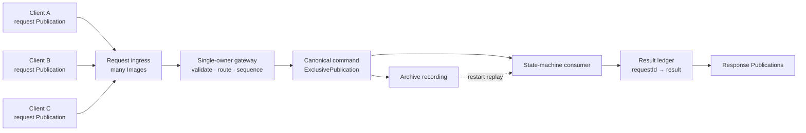
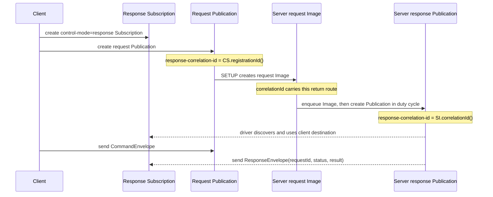
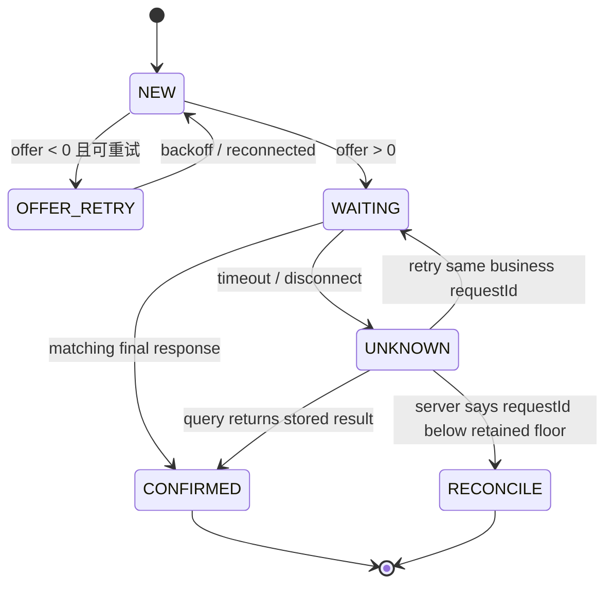
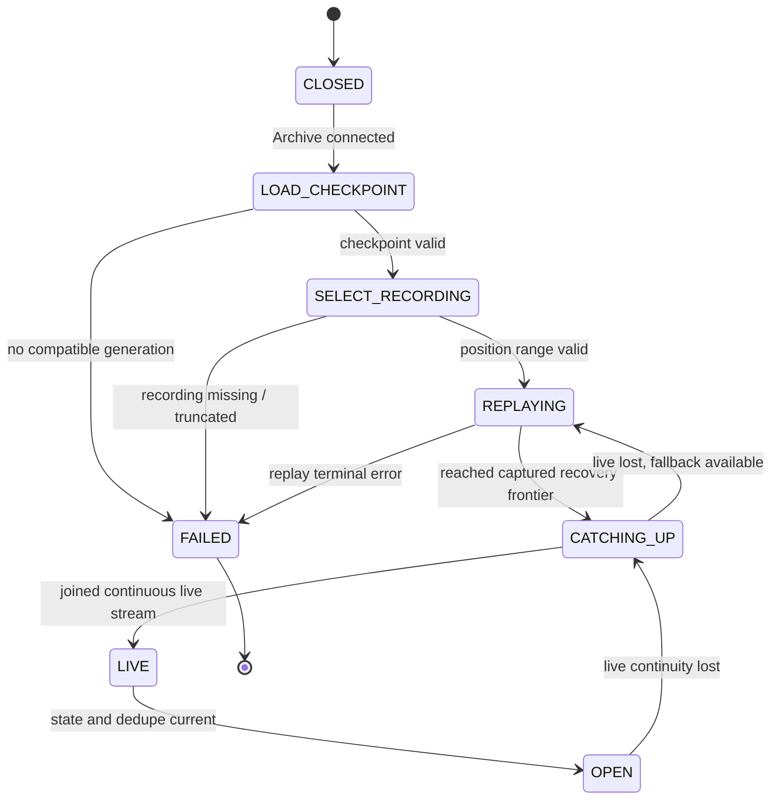
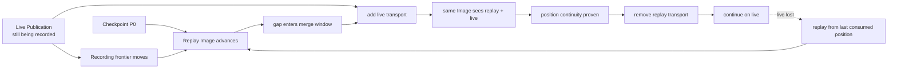
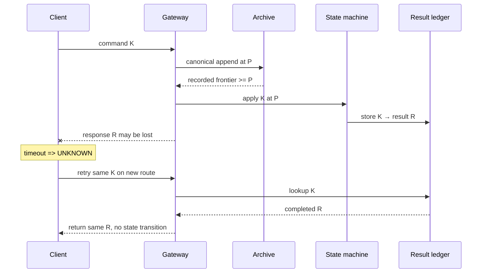

“给 request stream 开启 Archive 录制，服务就能在崩溃后恢复”听起来很合理，却漏掉了最难的几件事：多个客户端请求按什么顺序进入状态机？`Publication.offer` 成功究竟确认了哪一层？状态与消费位置怎样原子对应？响应已经生成但客户端没有收到时，重试会不会再执行一次？

Archive 能保存和重放 Aeron stream，但它不会替应用定义业务提交。要得到一个真正可恢复的服务，必须把以下链条连起来：

```text
稳定的业务请求身份
  → 单一权威命令序列
  → Archive 录制到可声明的耐久边界
  → 确定性状态转换与结果台账
  → 原子 Checkpoint
  → 从精确 position 重放
  → 追到仍在推进的 live stream
```

本文以 **Aeron 1.52.2** 为版本基线。目标不是再介绍一次 Archive API，而是构造一个明确的正确性协议：客户端可以在“结果未知”时重试同一请求；服务可以从 Checkpoint 与 recording 恢复；重复输入不会重复产生业务效果；追到 live 之后才重新开放服务。

## 可恢复服务先要一条权威命令序列

### 直接录制所有客户端 request stream 仍然缺少总顺序

一个 Aeron `Subscription` 可以同时拥有多幅 `Image`。每幅 Image 对应自己的 transport session，并在自己的 position 空间内保持顺序；Aeron 不替不同 Image 定义全局先后。

假设客户端 A 与 B 分别发送 `A-17`、`B-09`：

- A 的 Image 能证明 `A-16 < A-17`；
- B 的 Image 能证明 `B-08 < B-09`；
- 两个 Image 的到达时间、轮询顺序或各自 position，都不能构成可跨重启复现的 `A-17` 与 `B-09` 总顺序。

分别录制两条输入流只会得到两段可靠历史。重启时如果用不同的 poll 批次交错它们，余额、撮合、库存等顺序敏感状态就可能得到不同结果。系统需要先把“多个输入”收敛成“一条权威命令日志”。



这里的 gateway 必须由一个线程或一个明确的串行 agent 拥有。它把合法请求编码成 `CommandEnvelope`，再追加到一个 `ExclusivePublication`。该 Publication 的 stream position 才是服务的权威顺序。

“单线程”本身不是分布式 fencing。若冷备节点也可能启动，就必须用外部租约、人工切换或其他机制保证同一 epoch 只有一个 gateway 写入；需要自动选主和多数派提交时，后文会说明为什么应升级到 Aeron Cluster。

### 四种身份不能混成一个 correlation ID

实现中至少会同时出现四类 ID：

| 身份 | 生命周期 | 解决的问题 | 能否作为业务幂等键 |
| --- | --- | --- | --- |
| `clientId + requestId` | 跨连接、跨进程重启 | 这次业务意图是否已经执行 | **能，而且必须稳定持久** |
| response correlation | 当前 Media Driver 注册关系 | request Image 应把响应送回哪幅 response Subscription | 不能 |
| `sessionId` | 一次 Aeron Publication/Image session | 这条 transport stream 的顺序域 | 不能 |
| Archive control correlation | 一次 Archive 控制请求 | 控制响应属于哪个调用 | 不能 |

`Aeron.nextCorrelationId()` 只承诺在当前连接的 Media Driver 范围内产生唯一 correlation。它很适合关联一次进程生命周期内的异步操作，却不应被当作跨 driver 重启的业务请求号。业务 ID 应由持久客户端身份与单调序号、UUIDv7，或同等稳定方案生成，并写进 payload。

一个足够清晰的 wire envelope 可以是：

```text
CommandEnvelope {
  schemaVersion
  clientId
  requestId
  commandType
  payloadLength
  payload
}
```

服务端的核心不变量是：

> 对同一个 `(clientId, requestId)`，状态机最多产生一次业务状态转换；无论响应发送多少次，返回的完成结果都相同。

这不是 Transport 的 exactly-once，而是业务状态机利用权威日志与结果台账构造出的效果去重。

Aeron 只让这个窗口更容易定位，并没有改变跨系统副作用的通用结论。稳定意图身份、结果查询、去重生命周期、Outbox/Inbox 与不可补偿效果的完整归属在[结果未知与幂等协议](/signal-grid-blog/posts/cross-system-side-effects-idempotency-outbox-inbox-2pc-saga/)；本章把其中的同一正确性合同落实到 Aeron request/response 与 replay 上。

## Response Channels 建立回程，但业务协议仍要处理结果未知

### 两条单向流怎样完成握手

Response Channels 不是一条双工 channel。客户端先创建 response `Subscription`，再把它的 `registrationId` 放进 request Publication 的 `response-correlation-id`。服务器收到 request Image 后，从 `image.correlationId()` 派生对应 response Publication。



客户端建立关系的 Java 骨架如下。实际地址、stream ID 和 idle strategy 应来自部署配置：

```java
final String requestEndpoint = "server.example.com:10000";
final String responseControl = "server.example.com:10001";

final Subscription responses = aeron.addSubscription(
    new ChannelUriStringBuilder()
        .media(CommonContext.UDP_MEDIA)
        .controlMode(CommonContext.CONTROL_MODE_RESPONSE)
        .controlEndpoint(responseControl)
        .build(),
    RESPONSE_STREAM_ID);

final ExclusivePublication requests = aeron.addExclusivePublication(
    new ChannelUriStringBuilder()
        .media(CommonContext.UDP_MEDIA)
        .endpoint(requestEndpoint)
        .responseCorrelationId(responses.registrationId())
        .build(),
    REQUEST_STREAM_ID);
```

服务器的 request Subscription 还必须声明同一个 response control endpoint；收到 Image 后创建的 response Publication 则同时携带 response mode、control endpoint 与该 Image 的 correlation ID：

```java
final Subscription requestSubscription = aeron.addSubscription(
    new ChannelUriStringBuilder()
        .media(CommonContext.UDP_MEDIA)
        .endpoint(requestEndpoint)
        .responseEndpoint(responseControl)
        .build(),
    REQUEST_STREAM_ID);

// 在 owner 的 duty cycle 中执行，不要在 available-image callback 中重入 Aeron。
final Publication responsePublication = aeron.addPublication(
    new ChannelUriStringBuilder()
        .media(CommonContext.UDP_MEDIA)
        .controlMode(CommonContext.CONTROL_MODE_RESPONSE)
        .controlEndpoint(responseControl)
        .responseCorrelationId(requestImage.correlationId())
        .build(),
    RESPONSE_STREAM_ID);
```

服务器的 available-image handler **只应把 Image 放入待处理队列**。Aeron 明确禁止在 available/unavailable callback 中重入调用 `Aeron.addPublication`；真正创建 response Publication 的动作应在 agent 后续的 `doWork` 中完成。owner 随后建立 `Image.correlationId() → response Publication` 的临时映射，并在 Image unavailable 后关闭对应 Publication。只复制客户端 URI、却漏掉服务器 request Subscription 上的 `response-endpoint`，driver 无法建立完整的回程协商。

这个映射只表示“当前连接往哪里回”，不能写进 Checkpoint 后在重启时复用。客户端断线重连后会得到新的 registration、Image 和回程 Publication；它应以**相同业务 request ID**重试，服务器再把已有结果发送到这条新路由。

### `offer` 的返回值只回答“本次有没有追加到本地 Log Buffer”

`Publication.offer` 返回正数时，这个数是消息追加后新的 stream position。Media Driver 随后异步传输；这个返回值不证明：

- 服务器 Media Driver 已经收到；
- 服务器 Subscription 已经 poll；
- gateway 已经写入权威命令日志；
- Archive 已经录制；
- 状态机已经执行；
- response 已经被客户端处理。

1.52.2 的五个负值也要按语义处理：

| 返回值 | 语义 | 当前调用是否发布了消息 | 典型动作 |
| ---: | --- | --- | --- |
| `NOT_CONNECTED (-1)` | 当前没有活跃 subscriber | 否 | 等待连接或进入重连 |
| `BACK_PRESSURED (-2)` | 流控/容量阻止追加 | 否 | idle 后重试同一请求 |
| `ADMIN_ACTION (-3)` | rotation 等管理动作 | 否 | 短暂 idle 后重试 |
| `CLOSED (-4)` | Publication 已关闭 | 否 | 终止这条连接并重建 |
| `MAX_POSITION_EXCEEDED (-5)` | stream 达到最大 position | 否 | 新建 session/epoch，不能原地重试 |

`Publication.isConnected()` 也只表示近期看到活跃 subscriber，不是同步 ACK；“先检查 connected，再 offer”仍有竞态。最终业务事实只能来自匹配的 response 或状态查询。

客户端状态不应只有“成功/失败”两种：



`offer > 0` 之后发生超时，状态只能叫 **UNKNOWN**：请求可能没离开客户端，可能已录制未执行，也可能已执行而响应丢失。正确动作是查询，或用相同 `(clientId, requestId)` 重试；生成一个新 request ID 会把一次意图变成两次业务命令。

### gateway 的 route 与结果必须分开保存

gateway 可以维护两张逻辑表：

```text
routes[requestImage.correlationId] = currentResponsePublication   // 易失
results[clientId, requestId] = {status, result, appliedPosition} // 可恢复
```

第一张随 Image 生命周期创建和销毁；第二张属于业务状态，必须能由 command log 重建，并进入 Checkpoint。恢复期间重放旧请求时只更新 `results`，不向旧 route 发响应，也不执行外部副作用。

官方 ResponseServer echo sample 在 response `offer` 失败时用 controlled poll 的 `ABORT` 保留 request Image position，这对无副作用回显是安全的。真实写服务若先改业务状态、再因 response 背压返回 `ABORT`，同一 fragment 会再次投递，业务就可能重复；因此应先通过 result ledger 完成 apply-once，再允许重投时只重发已有结果。

## ACK 必须落在录制边界之后

### 一条请求实际经过不止一个 position

把所有箭头都叫“发送成功”，会让故障边界无法讨论。一个请求至少会经过以下平面：

```mermaid
flowchart LR
  O["client offer > 0"] --> T["request transport delivered"]
  T --> S["gateway sequences command"]
  S --> L["canonical offer = endPosition P"]
  L --> R["recordedPosition ≥ P"]
  R --> A["state applied at P"]
  A --> D["dedupe/result stored"]
  D --> X["final response offered"]
  X --> C["client confirms matching result"]

  O -. "not server ACK" .-> T
  L -. "not disk durability by itself" .-> R
  X -. "response may still be lost" .-> C
```



对外协议最好给不同阶段不同名字：

| 阶段 | 可以声明什么 | 不能声明什么 |
| --- | --- | --- |
| request accepted by gateway | 请求格式合法、获得临时路由 | 尚未必可恢复 |
| command sequenced at position P | 权威日志确定了顺序 | Archive 未必写到 P |
| recording frontier ≥ P | Archive writer 已处理到 P | 是否抗掉电取决于 sync 配置 |
| state applied + result recorded | 业务状态与去重台账包含该请求 | 客户端未必收到 |
| client confirms response | 本次调用得到确定结果 | 外部系统是否 exactly-once 仍由外部协议决定 |

若 API 只返回一次 final response，就应等到权威日志满足配置声明的耐久边界，而且状态机已应用并保存结果，再发送它。不要在 ingress request 的 `offer` 成功、canonical `offer` 成功或 `startRecording` 返回时就回复“已完成”。

### 怎样取得 recording ID 与实时录制位置

`AeronArchive.addRecordedExclusivePublication` 会创建 `ExclusivePublication`，并启动按 session 匹配的本地 recording。返回 Publication 后，Archive 仍需通过同一个 Media Driver 的 spy Image 建立 RecordingSession；因此应等待 `RecordingPos` counter 或 `RecordingSignal.START`，不能把控制调用返回当成“录制已激活”。

下面的骨架有一个重要拓扑前提：应用的 `Aeron`、`AeronArchive` 和 Archive 连接的是**同一个 Media Driver/CnC**。`aeron.countersReader()` 只能看到该 Driver 的 counters；如果 Archive 在远端，或同机却使用另一份 CnC，这段 `RecordingPos` 查找不会跨边界找到远端 counter。

在此前提下，单 owner duty cycle 可以写成：

```java
final ExclusivePublication commandLog =
    archive.addRecordedExclusivePublication(COMMAND_CHANNEL, COMMAND_STREAM_ID);

final CountersReader counters = aeron.countersReader();
final long deadlineNs = nanoClock.nanoTime() + START_TIMEOUT_NS;
int recordingCounterId;

while ((recordingCounterId = RecordingPos.findCounterIdBySession(
    counters, commandLog.sessionId(), archive.archiveId()))
    == CountersReader.NULL_COUNTER_ID)
{
    if (nanoClock.nanoTime() >= deadlineNs)
    {
        throw new IllegalStateException("recording did not become active");
    }
    idleStrategy.idle(archive.pollForRecordingSignals());
}

final long recordingId =
    RecordingPos.getRecordingId(counters, recordingCounterId);
```

`startRecording` 自身返回的是 **recording subscription ID**，不是 recording ID。两者混用会让后续 replay、stop 或监控指向错误对象。

远端 Archive 应采用另一条明确路径：应用创建普通 Publication；远端 Archive 对可达的 UDP channel 调用 `startRecording(..., SourceLocation.REMOTE, ...)`；客户端持续处理 Archive control response 与 `RecordingSignal.START`，从 signal/descriptor 获得 recording ID，之后通过 Archive 控制 API 查询 recording position。不要在远端拓扑里轮询本地 `CountersReader`，也不要把 recording subscription ID 当成 recording ID。

每次 gateway 向 canonical Publication 调用 `offer`：

```java
long appendCommand(final DirectBuffer encoded, final int offset, final int length)
{
    while (true)
    {
        final long result = commandLog.offer(encoded, offset, length);
        if (result > 0)
        {
            return result; // 这条消息之后的 stream position
        }
        onOfferFailure(result);
        dutyCycleIdle.idle();
    }
}
```

得到 `endPosition = P` 后，持续读取同一个 active `RecordingPos` counter，直到 `recordedPosition >= P`。读取时还要验证 counter 仍 active 且仍属于该 recording；Counters Manager 可能回收 counter ID，缓存一个裸整数后永久读取是不安全的。

active recording 可查 `getRecordingPosition`；inactive recording 的该值为 `NULL_POSITION`，应改查 `getStopPosition`，或统一使用 `getMaxRecordedPosition`。`stopRecording` 的控制响应也早于 recorder agent 最终更新 Catalog stop position；若接下来立即 replay，应等待 `RecordingSignal.STOP` 或观察到非空 stop position。

### `recordedPosition >= P` 的耐久强度由 `fileSyncLevel` 决定

1.52.2 的 recorder 顺序是：`RecordingWriter` 写 block；若配置要求则 `FileChannel.force`；随后 `RecordingSession` 才以 release 语义推进 recording-position counter。因此观察到 counter 越过 P，能证明 recorder 按该配置处理到了 P。

但 Archive 默认 `fileSyncLevel = 0`：

| `fileSyncLevel` | recording writer 的行为 | 可以声称的边界 |
| ---: | --- | --- |
| 0 | 普通文件写入，可能仍在 OS page cache | 进程级恢复边界，不应宣称抗掉电 |
| 1 | 每个 block 后 force data | 更强的数据落盘边界 |
| 2 | force data 与 metadata | 数据与元数据都纳入更强同步 |

`catalogFileSyncLevel` 也不能弱于系统对 recording 元数据的恢复要求。高 sync level 会显著改变吞吐和尾延迟，所以应把“ACK 代表进程崩溃可恢复”与“ACK 代表掉电后仍可恢复”写成两个明确的服务等级，并用断电/杀进程测试验证，而不是只看配置名。

Checkpoint 不需要每条请求都写。只要 ACK 对应的命令已在可恢复日志中，状态与结果就能在重启时由 replay 重建；Checkpoint 是缩短恢复时间的状态压缩点，不是替代 command log 的每请求事务。

### 状态机不能跑到可恢复日志前面

如果 state consumer 先执行到 P，而 Archive 只录到 P 之前，恰好此时生成一个包含 P 的 Checkpoint，重启后就会得到“状态说执行过，日志却无法证明”的断裂。

一种直接做法是让 consumer 在处理每条完整消息前读取 recording frontier；frontier 尚未覆盖 `header.position()` 时返回 `ABORT`，让 Image 不前进：

```java
ControlledFragmentHandler.Action onCanonicalMessage(
    final DirectBuffer buffer,
    final int offset,
    final int length,
    final Header header)
{
    final long nextPosition = header.position();
    if (trustedRecordedPosition() < nextPosition)
    {
        return ControlledFragmentHandler.Action.ABORT;
    }

    final Command command = codec.decode(buffer, offset, length);
    // applyOnce 在同一次状态转换中更新 domain state 与 result ledger。
    final StoredResult result = serviceState.applyOnce(command, nextPosition);
    maybeRespondOnCurrentRoute(command, result);
    return ControlledFragmentHandler.Action.COMMIT;
}
```

这里 handler 必须以完整消息为边界。若消息可能 fragment，应使用 `ControlledFragmentAssembler` 或让上层组件保证 assembly，再把最终 fragment 的 `Header.position()` 当作下一次 replay 起点。

外部数据库、支付接口或 HTTP 调用不能直接放进 `applyOnce`。它们不与 Archive 原子提交，而且 replay 会再次运行 handler。常见做法是把 outbox 记录作为状态转换的一部分，用稳定 `requestId/effectId` 交给独立 dispatcher；目标系统也必须接受幂等键。恢复 replay 只重建 outbox，不直接重放网络调用。

这里还隐含一个决定性前提：同一条命令在同一初始状态上必须导出同一状态与同一结果。若结果依赖当前时间、随机数、外部报价或数据库读值，就应由 single owner 先把选定值编码进 canonical event，或把最终结果作为另一条受录制记录持久化，再发送 ACK。否则 replay 即使逐字读回原命令，也可能重建出另一个答案。

## Checkpoint 必须同时冻结状态、位置与去重结果

### Checkpoint 是一项业务原子提交

Archive recording position 表示“录制摄取到了哪里”，不表示业务“应用到了哪里”。真正可用的 Checkpoint 至少包含：

而且这仍只是单条权威输入流的恢复边界。服务若同时消费多条输入、保存跨组件状态或提交外部 Sink，一个裸 position 不能构成 consistent cut；State、所有 Source Cursor、在途消息与输出决议如何进入同一代次，应回到[分布式快照与一致检查点](/signal-grid-blog/posts/distributed-snapshots-consistent-checkpoints-barriers-recovery-cursors/)的通用协议。

```text
Checkpoint {
  formatVersion
  applicationSchemaVersion
  recordingEpoch
  recordingId
  channel / streamId / sessionId identity
  nextReplayPosition
  lastAppliedMessagePosition
  stateBytes
  stateHash
  dedupeWatermarks
  completedResultsOrReferences
  pendingOutboxEffects
}
```

`nextReplayPosition` 表示这份状态已经安全覆盖的最高 transport position：通常取最后一条**已完整应用**消息的 `Header.position()`；若其后只有 Aeron PAD frame，也可以在状态不变时推进到越过 PAD 的 Image position。`lastAppliedMessagePosition` 单独保留最后一条成功业务消息的边界。两者都不是业务消息序号。

必须始终满足：

```text
checkpoint.nextReplayPosition
  >= checkpoint.lastAppliedMessagePosition
  <= trustedRecordedPosition

state 与 result ledger 覆盖到 lastAppliedMessagePosition；
两者之间只允许存在已验证、不会调用业务 handler 的 transport PAD。
```

如果先持久化 position、后持久化 state，崩溃可能导致重启跳过尚未进入状态的命令；如果先写 state、后写 position，重启会重复 replay。后者可由 apply-once 去重吸收，前者通常无法修复。因此两者最好作为一个 Checkpoint artifact 原子发布。

### 安全发布需要临时文件、校验与代际

发布顺序是一条不能倒置的链：

```text
到达安全位置 P
  → 冻结 state / ledger / outbox
  → 编码临时文件并写 checksum
  → force 文件
  → 原子发布 generation
  → 验证可重新读取
  → 最后才回收旧 Checkpoint 与历史
```

完整协议可以这样实现：

1. single owner 在完整消息边界 P 取得不可变 state view；并确认 `P <= trustedRecordedPosition`；
2. 把 state、result ledger、outbox 与 P 编码到 generation-N 临时文件；
3. 在文件内部写长度、版本与全量 checksum，调用 `force(true)`；
4. 用 `ATOMIC_MOVE` 替换 manifest，或采用 A/B 两槽与递增 generation；
5. 对要求抗掉电的平台同步父目录，并重新打开文件做一次解析与 checksum 验证；
6. 只有新 generation 已验证，才允许删除旧 Checkpoint 或移动 recording start position。

“先写一个 `checkpoint.position` 小文件，再慢慢写状态文件”不安全：两个文件没有共同提交点。若文件系统或对象存储不提供原子 rename，应使用不可变 generation 加一个带 checksum 的指针对象，并保留至少一个上一代。

### 去重保留期决定最早可删除的历史

result ledger 不可能无限增长，但压缩必须有协议：

- 若每个 client 严格单请求在途，可保存 `lastCompletedRequestId + lastResult`；
- 若允许并发或乱序，需要滑动窗口、gap 集合和每个完成请求的结果；
- 客户端确认已持久化结果后，可显式推进一个 `acknowledgedThrough`；
- 低于安全 floor 的 request ID 不能被当成“从未执行”，应返回 `TOO_OLD / RECONCILE`。

同理，Archive retention 必须覆盖**最老仍可能被选择的有效 Checkpoint**。设最老保留 Checkpoint 的 `nextReplayPosition = Pold`，就不能把 recording 的 start position 截断到 Pold 之后；否则新 Checkpoint 一旦损坏，上一代虽然还在，却无法继续 replay。

Checkpoint 加载时应从新到旧验证：

1. checksum、长度、format version；
2. 应用 schema 是否支持迁移；
3. recording/epoch 是否存在且与 manifest 一致；
4. `recording.startPosition <= P <= getMaxRecordedPosition(recordingId)`；
5. state hash、ledger 与 outbox 是否都在同一 generation。

最新一代失败时回退到上一代；所有候选都失败时 fail closed，而不是从一个“看起来差不多”的 position 启动。

## 重启必须从合法 Checkpoint 重建，而不是盲目从头 Replay

### 先封闭入口，再选择恢复边界

服务重启时最危险的动作，是一边 replay 旧日志，一边接受客户端用新 route 重试。若原请求尚未重放进 result ledger，新重试可能先被追加为另一条命令；状态机虽然最终仍可去重，但会增加不必要的日志、路由与时序复杂度。

恢复应有明确状态机：



在 `OPEN` 之前：

- 不发送“已恢复”健康信号；
- 不把重放请求的旧 response route 当成有效；
- 不执行 replay 中的外部副作用；
- 可以拒绝新请求，或返回带 retry-after 的恢复中状态；
- 客户端保留 UNKNOWN，并在服务开放后用相同 request ID 查询/重试。

### 有限恢复的控制骨架

对已经停止的 recording，或者希望先恢复到一个固定观察上界，可使用有限 replay：

```java
final Checkpoint cp = checkpointStore.loadNewestValid();
final long replayEndPosition = archive.getMaxRecordedPosition(cp.recordingId());
if (cp.nextReplayPosition() < recordingStartPosition ||
    cp.nextReplayPosition() > replayEndPosition)
{
    throw new IllegalStateException("checkpoint outside recording range");
}

final long replayLength = replayEndPosition - cp.nextReplayPosition();
if (replayLength == 0)
{
    verifyRecoveredStateAt(replayEndPosition);
    return;
}

final long replaySessionId = archive.startReplay(
    cp.recordingId(),
    cp.nextReplayPosition(),
    replayLength,
    REPLAY_CHANNEL,
    REPLAY_STREAM_ID);

final int replayImageSessionId = (int)replaySessionId;
final Image replayImage = awaitImage(replaySubscription, replayImageSessionId);
final AtomicReference<Throwable> recoveryFailure = new AtomicReference<>();
final ControlledFragmentHandler failClosedRecoveryHandler =
    (buffer, offset, length, header) ->
    {
        try
        {
            replayHandlerWithoutResponses.onFragment(buffer, offset, length, header);
            return ControlledFragmentHandler.Action.CONTINUE;
        }
        catch (final Throwable ex)
        {
            recoveryFailure.compareAndSet(null, ex);
            return ControlledFragmentHandler.Action.ABORT;
        }
    };

long lastTransportPosition = replayImage.position();
long lastProgressNs = nanoClock.nanoTime();

while (!replayImage.isEndOfStream())
{
    if (replayImage.isClosed())
    {
        throw new IllegalStateException("replay Image closed before EOS");
    }

    final int fragments = replayImage.controlledPoll(failClosedRecoveryHandler, 20);
    final Throwable failure = recoveryFailure.get();
    if (failure != null)
    {
        throw new IllegalStateException("recovery handler failed", failure);
    }

    final long transportPosition = replayImage.position();
    if (transportPosition != lastTransportPosition)
    {
        lastTransportPosition = transportPosition;
        lastProgressNs = nanoClock.nanoTime();
    }
    else if (nanoClock.nanoTime() - lastProgressNs >= REPLAY_PROGRESS_TIMEOUT_NS)
    {
        throw new IllegalStateException("replay made no progress");
    }
    recoveryIdle.idle(fragments);
}

if (replayImage.position() != replayEndPosition)
{
    throw new IllegalStateException("replay ended at an unexpected position");
}
```

若 `replayLength == 0`，直接验证并进入下一阶段，无需创建 replay。真实 owner 还要通过一条统一的 control-response drain 路径持续处理 Archive error；Image 关闭、无进展超时或 Archive error 都是恢复失败，不能继续等一个永远不会出现的 EOS。

这里故意用 `replayImage.position()` 判断 transport 进度和最终边界，而不是用 fragment 数或“最后一条业务消息的位置”。Aeron 可以在 term 尾写 PAD frame：poll 不把 PAD 交给 handler，fragment 数不会增加，但 Image position 会合法前进。业务 apply cursor 与 transport cursor 必须分开；恢复到只包含 PAD 的尾部后，可以在状态不变的前提下把下一次 replay cursor 推到该 transport position。

同样不能依赖 handler 抛异常来阻止普通 `poll()` 前进：Aeron 会把异常交给 subscriber error handler，默认处理器可能只记录后继续。恢复 handler 应在内部捕获失败、记录 terminal failure 并返回 `ABORT`，outer loop 随即 fail closed。`ABORT` 本身不会回滚已经发生的业务副作用，因此 decode/validate 必须先完成，业务状态与 result ledger 的转换也必须具备原子性。

`startReplay` 返回的 64-bit 值是 replay session ID；Image 使用其低 32 位 `sessionId`。若以后调用 `stopReplay`，必须保留完整 64 位 ID。

上面的代码先捕获明确的 `replayEndPosition`，再用正长度建立可核对的有限 replay。`REPLAY_ALL_AND_STOP (-2)` 也会在 Archive 处理请求时固定“当时已有内容”的上界，但如果业务需要事先知道并验证那个上界，就不要把此前读取的 position 与稍后由 Archive 捕获的隐式上界混为一谈。`REPLAY_ALL_AND_FOLLOW (-1)` 则会持续跟随，不会自然产生“恢复完成”事件。

Archive 控制调用完成只证明 replay session 已创建。应用仍需等待匹配 Image、持续 poll，确认 transport position 到达预期边界，并证明期间所有业务 handler 都成功；这些才构成业务恢复完成。

### gateway 本身重启时要显式延续 recording

如果 canonical writer 与 Archive 仍活着，只是 state processor 重启，原 recording 可以继续推进。若拥有 Publication 的 gateway 也退出，旧 session 的 recording 通常会停止。此时有两个合法选择：

1. **extend 原 recording**：读取 descriptor 的 term length、initial term ID、term offset 与 stop position，用 `ChannelUriStringBuilder.initialPosition(...)` 构造能从精确 stop position 继续的 Publication，再调用 `extendRecording`；
2. **开启新 recording epoch**：新 Publication/recording 获得新 recording ID，并在持久 manifest 中把 `epoch N → epoch N+1` 串起来。

不要新建一个默认起点的 Publication，却假定 Archive 会自动把它接到旧 recording。session 与初始 position 不匹配时，延续会失败；更糟的是应用把两条 recording 误当成一条连续历史。

多 epoch 恢复时，Checkpoint 应记录 epoch 与 recording ID。replay 到一段 stop position 后，根据已验证 manifest 切到下一段 start position；每段边界都要检查连续性和 schema。

## 追到 Live 是 position handoff，不是按墙上时间切换

### 为什么“先 replay 五分钟，再订阅 live”必然有缝

wall clock 不能告诉应用最后一条历史消息与第一条实时消息是否相邻。若先结束 replay 再创建 live Subscription，中间会漏；若先订阅 live 并缓存，再 replay，到切换点又要自己解决重复、乱序和无限缓存。

正确切换只看同一 recording/session position 空间：



Aeron 1.52.2 有两种主要实现。

### 长期服务优先评估 `PersistentSubscription`

`PersistentSubscription` 自 1.51.0 起提供“从指定 position replay、追上 live、live 丢失后再 fallback replay”的长期状态机，也支持 IPC/spy live channel。下面的 `archiveContextTemplate` 必须是**尚未 conclude、从未用于建立连接**的配置模板；`AeronArchive.Context.clone()` 是浅拷贝，不能从已经连接过的 `archive.context()` 克隆一个仍带 `isConcluded=true` 的 Context 再交给 PersistentSubscription：

```java
final PersistentSubscription.Context context =
    new PersistentSubscription.Context()
        .aeron(aeron)
        .aeronArchiveContext(archiveContextTemplate.clone())
        .recordingId(recordingId)
        .startPosition(checkpoint.nextReplayPosition())
        .liveChannel(LIVE_CHANNEL)
        .liveStreamId(COMMAND_STREAM_ID)
        .replayChannel(REPLAY_CHANNEL)
        .replayStreamId(REPLAY_STREAM_ID)
        .listener(recoveryListener);

try (PersistentSubscription input = PersistentSubscription.create(context))
{
    final AtomicReference<Throwable> applyFailure = new AtomicReference<>();
    final ControlledFragmentHandler failClosedApplyHandler =
        (buffer, offset, length, header) ->
        {
            try
            {
                return applyAfterRecordingBarrier.onFragment(buffer, offset, length, header);
            }
            catch (final Throwable ex)
            {
                applyFailure.compareAndSet(null, ex);
                return ControlledFragmentHandler.Action.ABORT;
            }
        };

    while (running)
    {
        final int work = input.controlledPoll(failClosedApplyHandler, 20);
        if (applyFailure.get() != null)
        {
            throw new IllegalStateException("state application failed", applyFailure.get());
        }
        if (input.hasFailed())
        {
            throw new IllegalStateException("persistent subscription failed");
        }
        idleStrategy.idle(work);
    }
}
```

它不是后台魔法：对象非线程安全，必须由一个 owner 持续 `poll` 或 `controlledPoll`，Archive 控制状态机才会推进。它内部已经把 fragments 重组成完整消息，不要再套 `FragmentAssembler`。

仅“到达启动时捕获的 recovery frontier”还不等于已经接入 live。服务开放需要同时证明：

- Checkpoint 已验证并加载；
- result ledger/outbox 已重建；
- 输入已处理到捕获的恢复边界；
- PersistentSubscription 已进入连续 live 路径，或至少有受控的 replay-follow 连续性；
- canonical recording 仍 active，且 gateway 写权限仍被当前 epoch 独占。

若 live 再次离开，业务 readiness 应回到恢复态，等待 PersistentSubscription 从最后连续 position 补齐。

### `ReplayMerge` 适合一次性的 UDP 追赶

已有系统也可以使用 `ReplayMerge`。它要求：

- live 是 UDP；
- Subscription 使用 `control-mode=manual` 的 MDS；
- replay 与 live 使用同一个 session-id/position 空间；
- owner 持续调用 `poll`，或者在调用 `doWork` 时另外消费 `replayMerge.image()`；
- 实例非线程安全，并使用独立的 `AeronArchive` client；
- 只有 `isMerged()` 才表示 replay destination 已安全移除，`hasFailed()` 必须作为终态处理。

| 需求 | `ReplayMerge` | `PersistentSubscription` |
| --- | --- | --- |
| 一次从历史追到 UDP live | 合适 | 可以 |
| live 丢失后长期自动 fallback | 需要应用重建 merge | 内建状态机 |
| IPC / spy live | 不支持 | 支持 |
| fragment assembly | 应用负责 | 内部完成 |
| 迁移已有成熟实现 | 改动较小 | 需要重新验证资源与状态 |

二者解决的是 transport position 连续性，不是业务提交。handler 仍要遵守 recording barrier、apply-once 与 Checkpoint 原子性。

`ReplayMerge.poll(handler, fragmentLimit)` 会同时推进 merge 状态机并消费当前 Image。若使用更底层的 `doWork()`，owner 必须在同一 duty cycle 中取得 `replayMerge.image()` 并持续 poll 它；只反复调用 `doWork()` 不会推进 Image position，追赶最终会因无进展超时。无论哪条路径，都必须把 `hasFailed()` 当成终态。

## 故障注入要证明同一请求只产生一次业务效果

### result ledger 是恢复协议的一部分

最小实现可以把结果台账建模为：

```text
ResultEntry {
  clientId
  requestId
  commandFingerprint
  status = PENDING | COMPLETED | REJECTED
  resultBytesOrReference
  appliedAtPosition
}
```

状态机处理命令时遵循：

```java
StoredResult applyOnce(final Command command, final long position)
{
    final Key key = new Key(command.clientId(), command.requestId());
    final Fingerprint fingerprint = fingerprintCanonicalCommand(command);
    final StoredResult existing = resultLedger.get(key);
    if (existing != null)
    {
        if (!existing.commandFingerprint().equals(fingerprint))
        {
            return StoredResult.requestIdConflict(key);
        }
        return existing;
    }

    if (dedupeFloor.rejectsAsTooOld(key))
    {
        return StoredResult.reconcileRequired(key);
    }

    final DomainResult result = domainState.apply(command);
    final StoredResult stored = StoredResult.completed(result, fingerprint, position);
    resultLedger.put(key, stored);
    return stored;
}
```

`commandFingerprint` 应覆盖 schema/version、命令类型和规范化 payload，不覆盖临时 response route；也可以直接持久化规范化命令字节。相同 `(clientId, requestId)` 却携带不同 fingerprint 时必须确定性拒绝，不能静默返回旧命令的结果。fingerprint、result ledger 与业务状态必须一起进入 Checkpoint。

真实实现不能让 `domainState.apply` 与 `resultLedger.put` 在两个可独立失败的持久事务中。这里二者都是内存状态机的一次转换，并由同一 command log + Checkpoint 恢复；若使用外部数据库，则需要它自己的事务、幂等键或 outbox/inbox 协议。

重复请求的处理取决于台账状态：

| 观察 | 动作 |
| --- | --- |
| `COMPLETED` | 不再执行，沿当前 route 返回同一结果 |
| `REJECTED` | 返回同一确定性拒绝 |
| `PENDING` | 绑定/更新当前 route，或返回 PROCESSING |
| 不存在且在有效窗口内 | 追加/执行为新命令 |
| 低于已证明安全的 dedupe floor | 返回 RECONCILE，不得当成新命令 |

gateway 可以先查台账以减少重复日志，但正确性的最后一道门必须在按权威日志执行的状态机里。否则 gateway 在“查不到”与“追加”之间崩溃，重试仍可能留下两条相同 request ID 的 log entry。

### 每个崩溃点都应有唯一可解释的恢复结果



下面的矩阵不是发布清单，而是协议的反例集合。每一行都应能通过 kill point、网络隔离或文件损坏注入复现：

| 故障点 | 日志/状态事实 | 重启或重试后的正确行为 |
| --- | --- | --- |
| canonical `offer` 前崩溃 | 权威日志没有请求 | 相同 ID 首次执行 |
| `offer > 0` 后、recording frontier 到 P 前崩溃 | 请求是否幸存未知，不能发 final ACK | 查日志；客户端相同 ID 重试 |
| 已录制、尚未 apply | 日志包含请求，台账没有 | replay 执行一次 |
| 已 apply、响应前崩溃 | replay/Checkpoint 可重建结果 | 相同 ID 返回缓存结果 |
| response 已发但丢失 | 客户端 UNKNOWN，服务 COMPLETED | 重试返回相同结果 |
| Checkpoint 写到一半 | checksum/manifest 无效 | 回退上一代并 replay |
| replay 期间 live 断开 | state 尚未连续追上 | 保持入口关闭，从最后 position fallback |
| dedupe 条目已安全压缩 | 无法证明原结果细节 | 返回 RECONCILE，不重新执行 |

还要验证外部效果：在 Archive replay 模式下不直接发送；dispatcher 恢复后可能重发同一 `effectId`，接收方只接受一次。若目标系统无法幂等且无法参与原子事务，就不能诚实地宣称端到端 exactly-once。

## 需要自动故障转移时，Archive 已经不够

### Archive-only 方案能保证什么

本文方案在这些前提下成立：

- 只有一个经过 fencing 的 canonical writer；
- 单条 command stream 定义全部顺序敏感状态转换；
- ACK 等待了已声明的 Archive 录制耐久边界；
- state、result ledger 与 outbox 可由 log + Checkpoint 完整恢复；
- 故障后由同一个权威 recording 或显式 epoch chain 恢复；
- 运维可以容忍服务重启、入口暂时关闭和人工/外部协调切主。

它能构造一个**单权威、可恢复**的服务，却没有构造共识。把 recording 复制到另一台 Archive 也只是复制历史：谁有资格继续写、哪个前缀已经提交、两个候选节点如何避免同时提供服务，仍然没有答案。

### 这些要求出现时应升级到 Aeron Cluster

| 需求 | 单机/主备 Archive 方案 | Aeron Cluster |
| --- | --- | --- |
| 单条日志录制与 replay | 提供 | 提供，并作为 Cluster Log 基础 |
| 多客户端故障容忍的总顺序 | 依赖单 gateway | Leader 把输入排序进复制日志 |
| 多数派提交位置 | 不提供 | Consensus Module 协调 |
| 自动选主与 term | 不提供 | 提供选举与角色管理 |
| 双写 fencing | 必须另建 | Cluster Log 内由 term/leader 协议管理；外部资源仍需单独 fencing |
| 节点故障后继续服务 | 通常要停机恢复/人工切换 | 多数派存活时可选举继续 |

因此，下列任一项成为硬要求时，就不应继续给 Archive-only 方案叠补丁：

- 单机丢失后必须自动切换，而且不能容忍两个 writer；
- ACK 必须代表多数节点持有同一已提交前缀；
- 多客户端命令顺序需要在 leader 故障后保持一致；
- 节点角色、term、membership 与日志截断需要由同一协议管理；
- 业务无法接受恢复窗口内关闭入口。

Aeron Cluster 仍不会消灭客户端的结果未知：leader 可能在提交命令后、响应到达客户端前故障。稳定 request ID、查询/重试、业务去重和外部副作用幂等仍然需要保留。Cluster 提升的是权威日志的复制与故障转移边界，不是把所有外部系统变成一个事务。

同理，Cluster 的 leader/term 只约束集群日志协议本身。数据库、支付接口、对象存储或任何独立 writer 若不验证当前授权代际，旧 leader 的迟到 I/O 仍可能产生副作用；这些边界仍要用下游可执行的 fencing token、事务或幂等协议保护。

## 结论：可恢复性来自一条可证明的提交链

Response Channels 解决的是当前 request Image 的回程发现；它不提供持久业务 correlation。Archive 解决的是 stream 的录制与 replay；它不定义业务应用位置、结果台账或总顺序。Checkpoint 缩短恢复时间；它不能超越可恢复日志，也不能只保存一个裸 position。

把这些组件组合成服务时，真正需要守住的是五个因果关系：

1. 多客户端请求先进入一条 single-owner canonical log，权威顺序才可重现；
2. `offer > 0` 只是本地追加，final ACK 要等录制边界、状态转换与结果台账；
3. `nextReplayPosition` 必须与 state、dedupe、outbox 在同一个 Checkpoint generation 中提交；
4. 重启先封闭入口，从合法 position replay，再按 position 连续性追到 live；
5. 客户端超时意味着 UNKNOWN，只能用相同业务 request ID 查询或重试。

只要其中一环无法给出证据，“可恢复”就仍是一个愿望。若系统还要求多数派提交、自动选主和无双写故障转移，应把这条链交给 Aeron Cluster，而不是把 Archive 的 recording position 解释成 consensus commit position。

## 官方资料与版本基线

- [Aeron Documentation](https://aeron.io/docs/)
- [Publications & Subscriptions：offer 语义](https://aeron.io/docs/aeron/publications-subscriptions/#offer-usage-notes)
- [Understanding Aeron Position](https://aeron.io/docs/aeron/aeron-understanding-position/)
- [Response Channels Wiki](https://github.com/aeron-io/aeron/wiki/Response-Channels)
- [Message Delivery Assurances](https://github.com/aeron-io/aeron/wiki/Message-Delivery-Assurances)
- [Aeron Archive Overview](https://aeron.io/docs/aeron-archive/overview/)
- [Working with Recordings](https://aeron.io/docs/aeron-archive/working-with-recordings/)
- [Persistent Subscriptions Wiki](https://github.com/aeron-io/aeron/wiki/Persistent-Subscriptions)
- [Aeron Cluster Overview](https://aeron.io/docs/aeron-cluster/overview/)
- [Aeron 1.52.2 Javadoc](https://javadoc.io/doc/io.aeron/aeron-all/1.52.2/index.html)
- [Aeron 1.52.2 `Publication.java`](https://github.com/aeron-io/aeron/blob/1.52.2/aeron-client/src/main/java/io/aeron/Publication.java)
- [Aeron 1.52.2 `Aeron.java`](https://github.com/aeron-io/aeron/blob/1.52.2/aeron-client/src/main/java/io/aeron/Aeron.java)
- [Aeron 1.52.2 `Header.java`](https://github.com/aeron-io/aeron/blob/1.52.2/aeron-client/src/main/java/io/aeron/logbuffer/Header.java)
- [Aeron 1.52.2 `AeronArchive.java`](https://github.com/aeron-io/aeron/blob/1.52.2/aeron-archive/src/main/java/io/aeron/archive/client/AeronArchive.java)
- [Aeron 1.52.2 `RecordingPos.java`](https://github.com/aeron-io/aeron/blob/1.52.2/aeron-archive/src/main/java/io/aeron/archive/status/RecordingPos.java)
- [Aeron 1.52.2 `RecordingSession.java`](https://github.com/aeron-io/aeron/blob/1.52.2/aeron-archive/src/main/java/io/aeron/archive/RecordingSession.java)
- [Aeron 1.52.2 `RecordingWriter.java`](https://github.com/aeron-io/aeron/blob/1.52.2/aeron-archive/src/main/java/io/aeron/archive/RecordingWriter.java)
- [Aeron 1.52.2 `Archive.java`](https://github.com/aeron-io/aeron/blob/1.52.2/aeron-archive/src/main/java/io/aeron/archive/Archive.java)
- [Aeron 1.52.2 `ReplayMerge.java`](https://github.com/aeron-io/aeron/blob/1.52.2/aeron-archive/src/main/java/io/aeron/archive/client/ReplayMerge.java)
- [Aeron 1.52.2 `PersistentSubscription.java`](https://github.com/aeron-io/aeron/blob/1.52.2/aeron-archive/src/main/java/io/aeron/archive/client/PersistentSubscription.java)
- [Aeron 1.52.2 `ResponseClient.java`](https://github.com/aeron-io/aeron/blob/1.52.2/aeron-samples/src/main/java/io/aeron/response/ResponseClient.java)
- [Aeron 1.52.2 `ResponseServer.java`](https://github.com/aeron-io/aeron/blob/1.52.2/aeron-samples/src/main/java/io/aeron/response/ResponseServer.java)
- [Aeron 1.52.2 Cluster package contract](https://github.com/aeron-io/aeron/blob/1.52.2/aeron-cluster/src/main/java/io/aeron/cluster/package-info.java)
- [Aeron Cookbook（场景参考）](https://aeron.io/docs/cookbook/aeron/)

本文只把 Cookbook 当作场景索引；涉及 API 返回值、position、recording counter、sync level、Response Channel 建链与 replay 状态时，均以 1.52.2 官方文档、Javadoc 和固定 tag 源码为准。进一步阅读可衔接 [双向通信与 Response Channels](/signal-grid-blog/posts/aeron-transport-mdc-mds-spy-response-channels/)、[Archive 录制生命周期](/signal-grid-blog/posts/aeron-archive-recording-lifecycle/)、[Replay 与 Live Merge](/signal-grid-blog/posts/aeron-archive-replay-and-live-merge/) 以及 [Cluster 日志与提交](/signal-grid-blog/posts/aeron-cluster-architecture-and-log-commit/)。
