Aeron 负责把一段字节可靠、低延迟地送到另一个位置；它并不知道第 16 个字节是价格、订单号，还是一个长度字段。**传输连续**与**业务消息可解释**是两份不同的合同。

Simple Binary Encoding（SBE）承担后一份合同：先用 XML Schema 定义固定布局、枚举、组合类型、重复组与变长数据，再生成直接读写 Agrona Buffer 的 codec。它不靠反射构造对象树，也不把每条消息先转换成中间表示，因此非常适合 Aeron 的直接 Buffer 和回调式热路径。

但“SBE 很快”只是起点。真正决定协议能否进入生产的是下面这些问题：

1. Aeron frame、应用消息头和 SBE body 分别负责什么？
2. Flyweight 为什么能少分配，它的生命周期又为什么危险？
3. 根 block、group 和 var-data 为什么必须按 Schema 顺序访问？
4. 新字段怎样加入，旧进程与新进程才能同时在线？
5. `schemaId`、`templateId`、`version`、`blockLength` 各自证明什么？
6. 怎样用新旧 codec 交叉测试，而不是上线后才发现“字节仍能解码，业务语义已经变了”？

本文以 **Aeron 1.52.2、SBE 1.39.0、Agrona 2.5.0 与 Java 17+** 为版本基线。阅读前建议先理解 [Aeron 的 Channel、Stream、Session 与 Image](/signal-grid-blog/posts/aeron-transport-channel-stream-session-image/)；本文结束后再进入 [Publication、Log Buffer 与发送热路径](/signal-grid-blog/posts/aeron-transport-publication-log-buffer-offer-try-claim/)。

## 第一阶段：从字节流建立可生成的协议合同

### 先把四层协议拆开

最常见的设计错误，是把所有字段都塞进“消息头”，或者反过来假设 Aeron 已经替应用解决了 framing、版本与业务幂等。

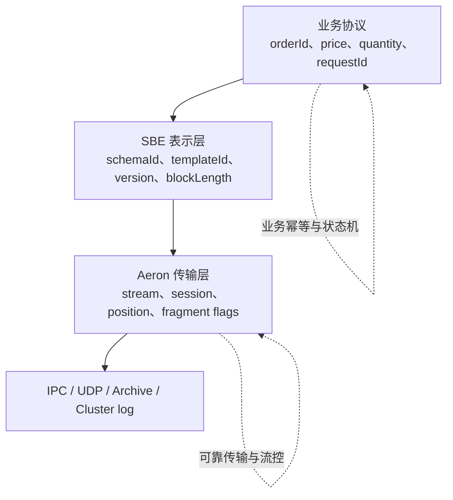

| 层 | 典型身份/边界 | 能保证什么 | 不能据此推断什么 |
| --- | --- | --- | --- |
| Aeron | channel、stream id、session id、position | 一条 Image 内的有序字节流、可靠 UDP 重传、背压 | 订单是否只执行一次、消息字段怎样解释 |
| 外层 frame | frame length、协议族、flags、校验/认证信息 | 在更大的 byte stream 中找出一条完整应用消息 | SBE 字段的业务含义 |
| SBE header | blockLength、templateId、schemaId、version | 选择生成 codec，并按发送方版本解释布局 | 发送者身份可信、消息有权限、业务有效 |
| 业务 envelope/body | requestId、tenant、instrument、command fields | 业务路由、幂等、状态转换输入 | 网络送达、持久化提交、外部副作用完成 |

Aeron 的 `FragmentHandler` 已经给出 fragment 的长度；若一条 Aeron message 被拆成多个 fragment，应先用 `FragmentAssembler` 重组，再把**完整应用消息**交给 SBE decoder。SBE 自身是表示层 codec，不是 transport framing protocol。把一段 TCP 文件或多个 SBE 消息连续写到同一缓冲区时，仍需要外层长度或等价边界。

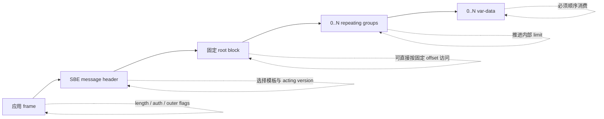

#### 三类编号不要混用

- `streamId` 是 Aeron 的逻辑流匹配键，不是 SBE template。
- `sessionId` 区分同一 stream 上的 Publication 来源，不是用户会话或业务 producer id。
- `templateId` 在一个 SBE schema 中选择消息类型，例如 NewOrder 或 CancelOrder。
- `schemaId` 选择协议族；它不是自动生成的内容 hash，组织必须治理其分配。
- `version` 是 SBE wire schema 的整数演进版本，不等于应用发布版本或 Maven artifact 版本。
- `semanticVersion` 是文档/治理信息，不能代替 header 中的 wire `version`。
- `requestId`、`orderId` 等业务字段才负责幂等和领域身份。

因此“同一个 Aeron session 收到相同 template 两次”完全可能是两个合法业务命令；“Aeron position 相同”也只在同一 Image/recording 语境内有意义。

这些编号必须由 Schema registry 显式分配并永久保留，不能从 Java enum ordinal、类加载顺序或构建时间派生。message、group 与 data 的字段 id 各自在 Schema 容器中保持稳定；即使允许跨 template 复用数字，也不能借复用悄悄改变同名字段的业务语义。

### SBE 为什么快，又为什么不是万能格式

SBE 的核心选择可以概括成三句话：

1. **Schema 在构建期展开。** 代码生成器把 offset、primitive type、byte order 和 null value 编译进方法，不在每条消息上解释 schema。
2. **Flyweight 直接覆盖 Buffer。** encoder/decoder 保存的是 buffer、offset、limit 等游标，不把整条消息复制成对象树。
3. **固定 block 优先、变长字段后置。** 常用标量可按已知 offset 直接访问；group/var-data 用单向流式游标换取紧凑布局。

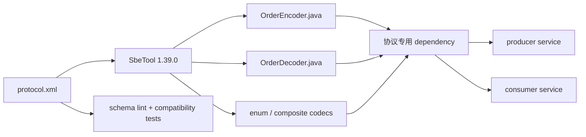

它特别适合：

- 字段集合明确、吞吐和尾延迟敏感的进程间消息；
- Aeron Transport、Archive replay 和 Cluster command；
- 跨 Java/C++/C#/Go/Rust 的稳定 wire contract；
- 固定点价格、数量、序列号等金融消息。

它不天然适合：

- 任意嵌套、频繁改变形状的文档；
- 需要按字段名临时查询的分析格式；
- 浏览器直接消费的公共 JSON API；
- 完全未知 schema 的自描述消息；
- 把安全认证、授权、压缩、加密或业务校验一并托付给 codec。

“没有中间对象”也不等于端到端零拷贝：`Publication.offer()` 仍会把应用 Buffer 内容复制进 Publication log；`tryClaim()` 才能省掉应用 Buffer 到 log 的那一次 copy。跨线程长期保存回调数据时，应用仍然必须复制到自己拥有的存储。

### 一份可以演进的订单 Schema

下面用简化订单协议讲清 wire layout。价格和数量用缩放后的整数；业务元数据负责说明 scale、tick 和 lot，不用 `double` 把十进制语义带入 wire。

```xml
<?xml version="1.0" encoding="UTF-8"?>
<sbe:messageSchema
    xmlns:sbe="http://fixprotocol.io/2016/sbe"
    package="io.signalgrid.protocol"
    id="7"
    version="1"
    semanticVersion="1.1.0"
    byteOrder="littleEndian">

  <types>
    <composite name="messageHeader">
      <type name="blockLength" primitiveType="uint16"/>
      <type name="templateId" primitiveType="uint16"/>
      <type name="schemaId" primitiveType="uint16"/>
      <type name="version" primitiveType="uint16"/>
    </composite>

    <type name="Price" primitiveType="int64"/>
    <type name="Quantity" primitiveType="int64" minValue="1"/>

    <enum name="Side" encodingType="uint8">
      <validValue name="BUY">1</validValue>
      <validValue name="SELL">2</validValue>
    </enum>

    <enum name="TimeInForce" encodingType="uint8">
      <validValue name="GTC">1</validValue>
      <validValue name="IOC">2</validValue>
      <validValue name="FOK">3</validValue>
    </enum>

    <composite name="varStringEncoding">
      <type name="length" primitiveType="uint16" maxValue="1024"/>
      <type name="varData" primitiveType="uint8" length="0"
            characterEncoding="UTF-8"/>
    </composite>
  </types>

  <sbe:message name="NewOrder" id="1">
    <field name="requestId" id="1" type="uint64"/>
    <field name="instrumentId" id="2" type="uint32"/>
    <field name="price" id="3" type="Price"/>
    <field name="quantity" id="4" type="Quantity"/>
    <field name="side" id="5" type="Side"/>
    <field name="timeInForce" id="6" type="TimeInForce"/>
    <field name="accountId" id="7" type="uint64"
           presence="optional" sinceVersion="1"/>
  </sbe:message>

  <sbe:message name="Reject" id="2">
    <field name="requestId" id="1" type="uint64"/>
    <field name="reasonCode" id="2" type="uint16"/>
    <data name="reasonText" id="3" type="varStringEncoding"/>
  </sbe:message>
</sbe:messageSchema>
```

这份 schema 的几个重要选择：

- `schema id=7` 与两个 `message id` 都必须在协议仓库中唯一、稳定；删除模板后也不要复用 id。
- `byteOrder=littleEndian` 是 wire contract，不能随部署机器改变。
- `NewOrder` 全是 root fixed fields，编码完成后长度固定，适合最热路径。
- `Reject.reasonText` 是 var-data，必须放在 fixed root block 和 repeating groups 之后。
- `accountId` 是 version 1 新增字段，放在原 root block 尾部，并声明 `sinceVersion=1`、`optional`。
- `maxValue=1024` 是 wire 上限的一部分，但解码入口仍应核对外层 frame length 和业务允许值。

#### root block、group 与 var-data 是三种布局

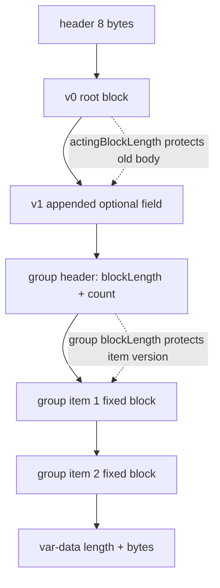

root fixed fields 可以按生成的 offset 访问。group 和 var-data 会改变 decoder 的内部 `limit`；它们不是任意顺序的 getter 集合。一个 template 若有两个变长字段，就必须先完整处理第一个，再访问第二个。

#### 对齐是 Schema 选择，不是自动赠品

SBE 允许用显式 `offset` 组织字段。常用做法是按 8、4、2、1 字节递减排列标量，减少空洞并让自然对齐更清晰。但仍要注意：

- 协议对齐不等于 CPU cache-line 隔离；
- 一个 message 在 frame 中的起点也影响实际地址对齐；
- 跨语言 codec 必须以 schema offset 为准，不能依赖 Java 对象布局；
- 为“看起来整齐”插入或移动已有字段，会破坏 wire compatibility。

### 把 Schema 生成纳入构建

官方 `sbe-tool` 不是运行时反射库，而是构建工具。生产仓库应把 schema、生成器版本和生成参数固定下来，生成代码要么作为构建产物，要么经过严格的可重复生成检查。

Maven 没有专用 SBE plugin；官方指南使用 `exec-maven-plugin` 在 `generate-sources` 阶段调用 `uk.co.real_logic.sbe.SbeTool`，再用 `build-helper-maven-plugin` 加入生成目录。核心配置可以收敛为：

```xml
<properties>
  <sbe.version>1.39.0</sbe.version>
  <agrona.version>2.5.0</agrona.version>
</properties>

<dependencies>
  <dependency>
    <groupId>org.agrona</groupId>
    <artifactId>agrona</artifactId>
    <version>${agrona.version}</version>
  </dependency>
</dependencies>

<plugin>
  <groupId>org.codehaus.mojo</groupId>
  <artifactId>exec-maven-plugin</artifactId>
  <version>3.6.3</version>
  <executions>
    <execution>
      <id>generate-sbe-codecs</id>
      <phase>generate-sources</phase>
      <goals><goal>java</goal></goals>
      <configuration>
        <mainClass>uk.co.real_logic.sbe.SbeTool</mainClass>
        <includeProjectDependencies>false</includeProjectDependencies>
        <includePluginDependencies>true</includePluginDependencies>
        <systemProperties>
          <systemProperty>
            <key>sbe.output.dir</key>
            <value>${project.build.directory}/generated-sources/sbe</value>
          </systemProperty>
          <systemProperty>
            <key>sbe.validation.warnings.fatal</key>
            <value>true</value>
          </systemProperty>
          <systemProperty>
            <key>sbe.generate.precedence.checks</key>
            <value>true</value>
          </systemProperty>
        </systemProperties>
        <arguments>
          <argument>${project.basedir}/src/main/resources/protocol.xml</argument>
        </arguments>
      </configuration>
    </execution>
  </executions>
  <dependencies>
    <dependency>
      <groupId>uk.co.real-logic</groupId>
      <artifactId>sbe-tool</artifactId>
      <version>${sbe.version}</version>
    </dependency>
  </dependencies>
</plugin>
```

完整 POM 还要把 `${project.build.directory}/generated-sources/sbe` 加入编译源目录。Gradle 也应建一个显式 generation task，并让 `compileJava` 依赖它；不要要求开发者在 IDE 中手工点一次生成。

SBE 1.39.0 与 Agrona 2.5.0 在现代 JDK 上访问底层 Unsafe API 时，还需要 JVM 打开内部包。`exec:java` 与 Maven 共用 JVM，因此生成阶段可以把参数写进构建环境；运行生成 codec 的应用 JVM 同样要带上它：

```bash
MAVEN_OPTS="--add-opens java.base/jdk.internal.misc=ALL-UNNAMED" \
  mvn generate-sources

java --add-opens java.base/jdk.internal.misc=ALL-UNNAMED \
  -jar matching-engine.jar
```

这也应进入容器、IDE 和 CI 模板，不能只存在于某位开发者的 shell history。

建议把 wire protocol 做成单独 dependency：

```text
protocol-schema/
  src/main/resources/protocol.xml
  src/test/resources/golden/
  generated Java codecs
  compatibility tests

matching-engine/
  depends on protocol-schema:1.1.0

gateway/
  depends on protocol-schema:1.0.0 or 1.1.0
```

这样 schema 变更会形成清晰的代码审查与发布边界，而不是藏在某个服务的内部模型里。

## 第二阶段：编码与解码首先是所有权协议

### 编码：先 header，再 body，最后才知道完整长度

生成后的 Java API 可以直接覆盖 `MutableDirectBuffer`：

```java
final MessageHeaderEncoder header = new MessageHeaderEncoder();
final NewOrderEncoder order = new NewOrderEncoder();

final int offset = 0;
order.wrapAndApplyHeader(buffer, offset, header)
    .requestId(requestId)
    .instrumentId(instrumentId)
    .price(priceTicks)
    .quantity(quantityLots)
    .side(Side.BUY)
    .timeInForce(TimeInForce.IOC)
    .accountId(accountId);

order.checkEncodingIsComplete();
final int encodedLength = MessageHeaderEncoder.ENCODED_LENGTH
    + order.encodedLength();
```

`wrapAndApplyHeader` 会写入当前生成 codec 的 `sbeBlockLength()`、`sbeTemplateId()`、`sbeSchemaId()` 和 `sbeSchemaVersion()`。不要在业务代码里复制这些魔法数字。

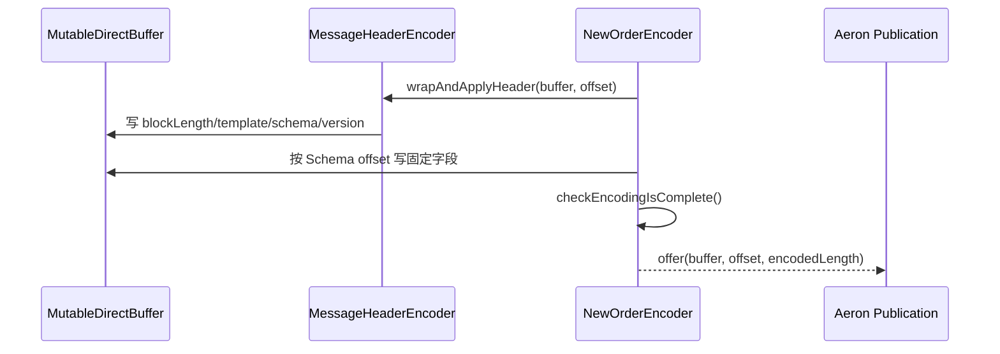

有 group 或 var-data 时，`encodedLength()` 取决于当前游标走到了哪里；只有完整编码后才是整条消息长度。提前读取并发送，会把未完成尾部当成合法消息。编码器也不是一个可跨线程共享的无状态 singleton：每次 `wrap` 都会改变其 buffer、offset 和 limit。

#### 与 `tryClaim` 集成

小消息可以直接在 Publication log 的 claimed 区域中编码：

```java
final BufferClaim claim = new BufferClaim();
final int expectedLength = MessageHeaderEncoder.ENCODED_LENGTH
    + NewOrderEncoder.BLOCK_LENGTH;

final long result = publication.tryClaim(expectedLength, claim);
if (result > 0)
{
    try
    {
        order.wrapAndApplyHeader(claim.buffer(), claim.offset(), header)
            .requestId(requestId)
            .instrumentId(instrumentId)
            .price(priceTicks)
            .quantity(quantityLots)
            .side(Side.BUY)
            .timeInForce(TimeInForce.IOC)
            .accountId(accountId);
        order.checkEncodingIsComplete();
        claim.commit();
    }
    catch (final RuntimeException | Error ex)
    {
        claim.abort();
        throw ex;
    }
}
```

这段代码成立的前提是：

- `expectedLength` 与实际完整编码长度一致；变长消息通常先编码到自有 Buffer 更简单；
- claim 后无论成功或失败都必须 `commit()` 或 `abort()`；
- claim 与 encoder 只由当前线程使用；
- `tryClaim` 的最大长度受 Aeron `maxPayloadLength` 限制，不能拿它发送任意大消息；
- `commit` 让 frame 对 Aeron transport 或 subscriber 可见；UDP 路径随后由 Sender 处理，IPC 路径没有 Sender 这一跳。无论哪种路径，它都不代表对端业务提交。

### 解码入口必须先做 envelope 校验

一个安全的 dispatcher 不应直接假设“这个 stream 上只有 NewOrder”：

```java
void onMessage(
    final DirectBuffer buffer,
    final int offset,
    final int length)
{
    final long frameEnd = (long)offset + length;
    if (offset < 0 ||
        length < MessageHeaderDecoder.ENCODED_LENGTH ||
        frameEnd > buffer.capacity())
    {
        rejectMalformed("header truncated");
        return;
    }

    headerDecoder.wrap(buffer, offset);

    final int schemaId = headerDecoder.schemaId();
    final int templateId = headerDecoder.templateId();
    final int actingVersion = headerDecoder.version();
    final int actingBlockLength = headerDecoder.blockLength();
    final int bodyOffset = offset + headerDecoder.encodedLength();

    if (schemaId != NewOrderDecoder.SCHEMA_ID)
    {
        rejectUnsupportedSchema(schemaId);
        return;
    }

    if (templateId == NewOrderDecoder.TEMPLATE_ID)
    {
        final int minimumKnownBlockLength = actingVersion >= 1
            ? NewOrderDecoder.BLOCK_LENGTH   // v1: 38
            : 30;                            // pinned v0 schema
        if (actingBlockLength < minimumKnownBlockLength ||
            (long)bodyOffset + actingBlockLength > frameEnd)
        {
            rejectMalformed("invalid NewOrder fixed block");
            return;
        }
        orderDecoder.wrap(
            buffer, bodyOffset, actingBlockLength, actingVersion);
        validateAndDispatch(orderDecoder, length);
    }
    else if (templateId == RejectDecoder.TEMPLATE_ID)
    {
        if (actingBlockLength < RejectDecoder.BLOCK_LENGTH ||
            (long)bodyOffset + actingBlockLength > frameEnd)
        {
            rejectMalformed("invalid Reject fixed block");
            return;
        }
        rejectDecoder.wrap(
            buffer, bodyOffset, actingBlockLength, actingVersion);
        consumeRejectInSchemaOrder(rejectDecoder, length);
    }
    else
    {
        rejectUnknownTemplate(templateId);
    }
}
```

这里的 `30` 不是凭经验猜的 magic number，而是被兼容性测试锁定的 v0 `NewOrder` root block length；生产实现应由 schema history 生成每个 `(templateId, actingVersion)` 的最小已知 fixed block，避免手工表漂移。关键是：**不能只证明 frame 覆盖消息自己声明的 blockLength**。攻击输入可把它声明为 0；必须先证明它足以覆盖该版本所有已知 fixed fields，再调用任何 fixed getter。

真正的实现还要在访问任何 fixed field、group 或 var-data 前证明：

- 外层 `length` 覆盖 header 与该版本最小 fixed block，且 declared block 没越过 frame end；
- group count、item block length、var-data length 不会越过 frame end；
- 加法没有整数溢出；
- count 和 text length 在应用资源上限内；
- enum 未知值采用已定义策略，而不是落入隐式 `null`；
- 数值符合业务 tick、lot、范围、账户和状态约束。

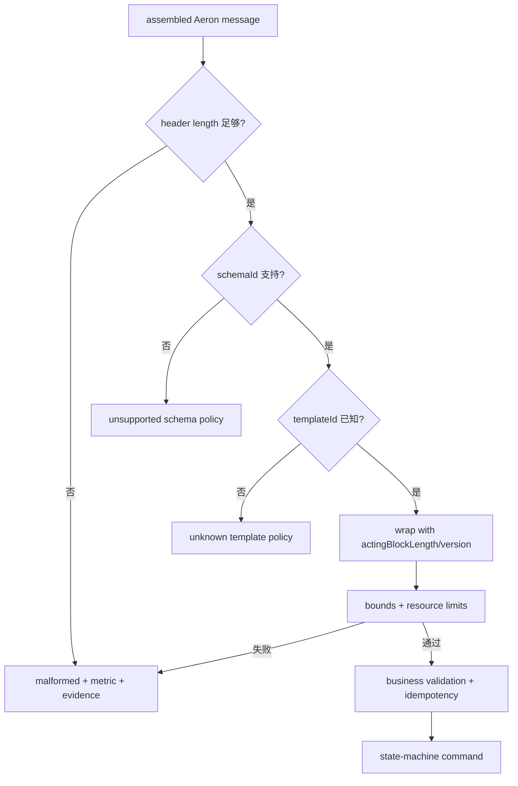

`schemaId` 正确不代表消息可信。SBE 没有签名或认证；恶意/损坏输入仍可能声明巨大 count 或 length。对不可信网络，认证与加密应在传输/外层 envelope 解决，codec 入口继续执行严格 bounds 和业务校验。

### Flyweight 的所有权：最快的对象往往最短命

decoder 的 getter 通常只是从当前 `DirectBuffer` 某个 offset 读取 primitive。它没有拥有消息字节，因此把 decoder 或 buffer 引用放进异步队列极其危险。

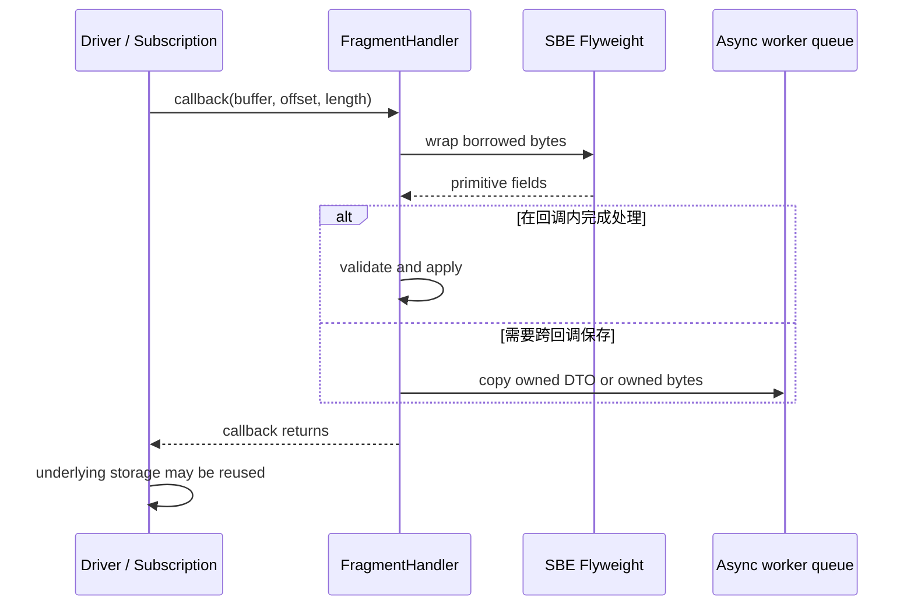

安全规则是：

- 在 handler 返回前完成同步读取；或者
- 把需要的 primitive 复制到领域命令；或者
- 复制完整 frame 到有明确生命周期的 owned buffer，并把 offset/length 一起保存。

不要保存：

- `NewOrderDecoder` 实例本身；
- 回调提供的 `DirectBuffer` 引用；
- 指向变长字段的 offset，期待稍后再读；
- `BufferClaim` 跨越 claim 所有者线程。

复制不是失败。正确的边界通常是“网络/codec 热路径零临时对象，进入长期状态或异步所有权时做一次明确、可计量的 copy”。

### 顺序访问不是建议，而是 codec 状态机

固定字段可以按生成的 getter 读取，但 repeating group 和 var-data 会推进同一个内部 `limit`。如果 Schema 的顺序是 `legs group -> attributes group -> memo data`，就不能先读 `memo`，再回来读 `legs`。

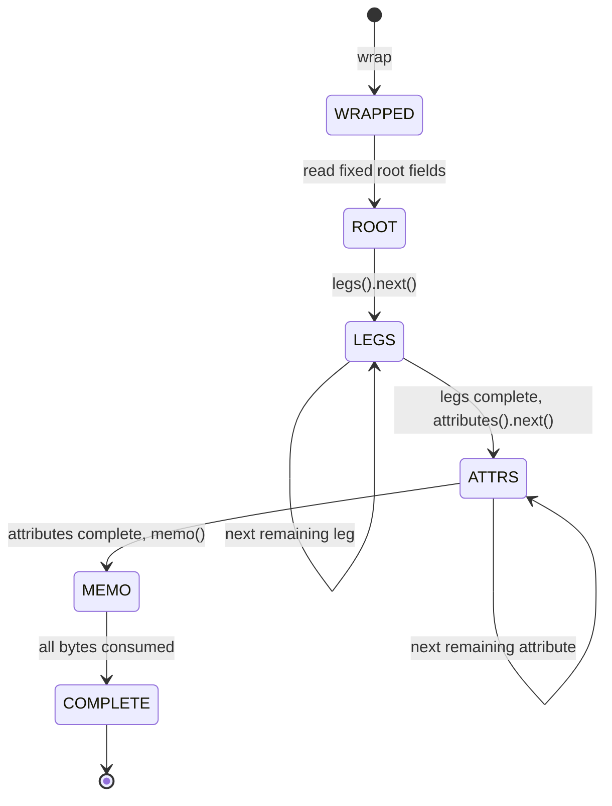

生成器可插入 precedence checks：

```text
-Dsbe.generate.precedence.checks=true
```

Java 运行时可用下面的属性**显式覆盖**这些检查：

```text
-Dsbe.enable.precedence.checks=true
```

编码结束再调用：

```java
encoder.checkEncodingIsComplete();
```

若没有显式设置，Java codec 的默认值会跟随 Agrona bounds checks，通常在 bounds checks 开启时也开启；因此不能把“没有配置该属性”简单解释成固定的开或关。启动日志和基准报告应同时记录 Agrona bounds-check 与 SBE precedence-check 的实际值。建议在单元测试、兼容性测试、回放环境和预发布环境开启；压测应同时记录开启与关闭的成本。它能捕获“漏掉 group”“跳过 var-data”“未调用 `next()`”等 API 协议错误，但不能验证价格、权限或幂等。

#### 一个 group 必须完整消费

```java
for (final LegsDecoder leg : orderDecoder.legs())
{
    final long instrumentId = leg.instrumentId();
    final long ratio = leg.ratio();
    consumeLeg(instrumentId, ratio);
}

final String memo = orderDecoder.memo();
```

若业务不关心 group 内容，也不能直接跳到 memo；应使用生成 codec 提供的 skip 方式，或仍按序迭代消费。因为下一个 block 的起点不是编译期固定 offset，而是由前面实际 count 和长度决定。

## 第三阶段：版本演进必须由交叉证据证明

### `blockLength` 与 `actingVersion` 怎样实现兼容

假设 version 0 的 NewOrder 到 `timeInForce` 结束；version 1 在 root block 尾部增加可选 `accountId`：

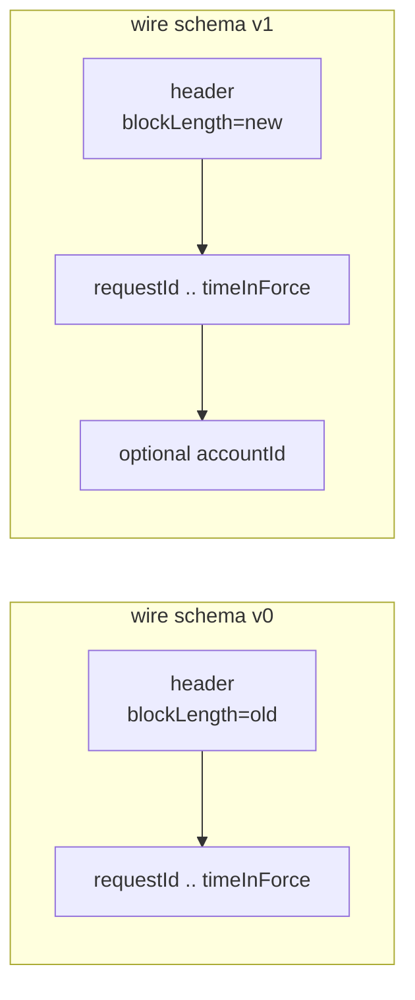

#### 新 decoder 读取旧消息

旧 sender header 携带较小的 `actingBlockLength` 和 `actingVersion=0`。新 decoder `wrap(buffer, offset, actingBlockLength, actingVersion)` 后：

- 旧字段照常读取；
- `accountId` 因 `actingVersion < sinceVersion` 返回生成 codec 定义的 null value；
- decoder 不会越过旧 root block 去误读下一段字节。

业务代码不能把 primitive null value 当合法账户。应使用生成的 `accountIdNullValue()` 比较，并明确“字段缺失”的业务策略。

#### 旧 decoder 读取新消息

旧 decoder知道旧字段 offset；它读取自己理解的前缀，并根据发送方 header 的较大 root block length 找到后续 group/var-data 起点。尾部新增 fixed field 会被忽略。

这就是“只在 block 尾部追加”的意义。若把新字段插到中间，旧 decoder 会把后面字段的字节当成旧 offset 的另一个字段，通常不会优雅报错，而是产生**看似合法的错误值**。

#### 兼容与不兼容变更表

| 变更 | wire 是否可兼容 | 要求/原因 |
| --- | --- | --- |
| root block 尾部新增 optional field | 可以 | schema version 增加、`sinceVersion` 设置、旧意义不变 |
| repeating group item block 尾部新增 optional field | 可以 | 同样依赖 group block length 与 version |
| 新增一个 message template | 通常可以 | 使用全新且不复用的 template id，旧端有 unknown-template 策略 |
| 修改已有字段类型/宽度/byte order | 不可以 | offset 与解释改变 |
| 在固定 block 中间插字段或重排字段 | 不可以 | 后续字段 offset 改变 |
| 删除字段并复用它的 id/offset | 不可以 | 历史数据与旧程序仍赋予旧含义 |
| 扩展 composite | 官方版本机制不支持兼容扩展 | 建新 composite/template 与 schema version |
| 把 required 改成“业务上可忽略” | 不自动兼容 | wire 可读不代表业务语义兼容 |
| 改枚举已有数值的含义 | 不可以 | 同一字节产生新语义 |
| 新增 enum value | 需要显式设计 | 旧 codec 未必接受未知值，必须测试生成选项和业务 fallback |

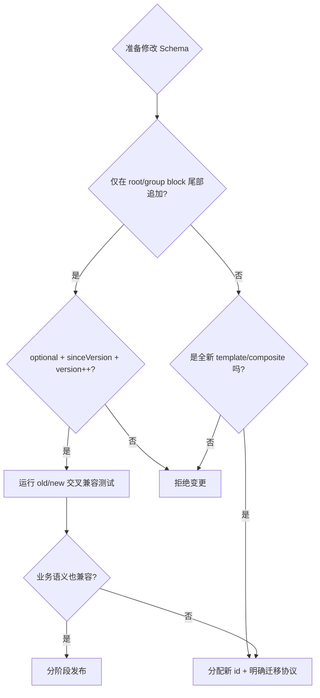

### wire compatibility 不等于 semantic compatibility

考虑给订单新增 `accountId`。在字节层它是尾部 optional field，可以兼容；但业务层还要回答：

- 旧 sender 缺失时，新 matcher 使用哪个账户？
- 默认值是否可能把订单路由到错误租户？
- 新 gateway 是否允许向旧 matcher 发送依赖 `accountId` 的订单？
- Archive replay 出来的旧消息如何确定历史账户？
- Cluster snapshot 与 log command 是否使用相同的缺失规则？

真正的兼容合同至少有三层：

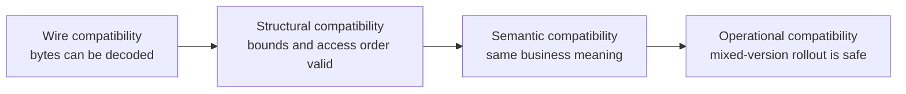

下面这些变更常常 wire 可读，却业务不兼容：

- 把 price scale 从 1e-2 改成 1e-4，却不版本化 instrument metadata；
- 把数量单位从 base asset 改成 contracts；
- 让枚举 `IOC=2` 从“立即成交剩余取消”变成“允许排队 100ms”；
- 将缺失字段的默认含义从“未知”改成“账户 0”；
- 复用 requestId 域，却改变其去重生命周期。

因此 SBE 的 `optional` 只声明“旧字节中允许缺少这个字段”，不声明领域规则也允许缺失。是否接受缺失值、采用什么默认语义、何时拒绝旧客户端，必须由业务 capability 和状态机规则决定。

因此 Schema review 必须和领域规则、元数据版本以及部署顺序一起审，不能只看 XML diff。

### 新旧 Codec 交叉矩阵才是兼容性证据

每次协议发布至少保留当前版与仍在生产的历史版 Schema/生成 codec。假设 v0 和 v1 同时存在，测试矩阵是：

| Encoder | Decoder | 应验证的结果 |
| --- | --- | --- |
| v0 | v0 | 基线字段完整一致 |
| v0 | v1 | 新 optional 字段返回 null/default，旧字段一致 |
| v1 | v0 | v0 忽略尾部扩展，仍正确定位后续 group/var-data |
| v1 | v1 | 新旧字段全部一致 |

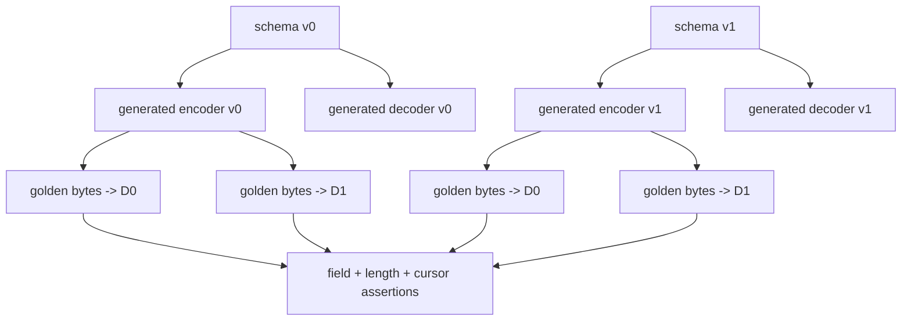

#### Golden vector 要保存什么

每个关键 template 至少保存：

- 固定输入值及其 canonical byte sequence；
- header 四字段；
- encoded length；
- 边界值：0、min/max、null sentinel、最大 group count、最大 var-data；
- 多 group、多 var-data 的顺序案例；
- 历史版本消息；
- 异常向量：截断 header、截断 body、超长 count、未知 template、未知 enum；
- 跨语言向量：Java encode → C++ decode，反向再做一次。

不要只做“encode 后立刻用同一版本 decode”。同一个 generator bug 可能在两边对称存在，round-trip 仍然绿色；固定 golden bytes 和异语言实现能提供独立证据。

#### 一个兼容性测试骨架

```java
@Test
void newDecoderReadsVersionZeroMessage()
{
    final UnsafeBuffer bytes = encodeWithV0(
        42L, 1001, 12_345L, 7L, V0Side.BUY);

    final V1MessageHeaderDecoder header = new V1MessageHeaderDecoder();
    header.wrap(bytes, 0);

    final V1NewOrderDecoder order = new V1NewOrderDecoder();
    order.wrap(
        bytes,
        header.encodedLength(),
        header.blockLength(),
        header.version());

    assertEquals(42L, order.requestId());
    assertEquals(12_345L, order.price());
    assertEquals(V1NewOrderDecoder.accountIdNullValue(), order.accountId());
}
```

现实工程中 v0、v1 生成类需要不同 package，避免类名冲突；CI 先从 Git tag/发布 artifact 取旧 schema，再分别生成 codec。不要通过复制当前生成代码冒充“旧版本”。

## 第四阶段：把协议接回 Aeron 的运行与恢复边界

### Aeron 接收路径：先重组、再解码、最后推进业务状态

超过 `maxPayloadLength` 的 Aeron message 会被分片。SBE 不应在第一个 fragment 上开始解码一个尚未完整的业务消息。

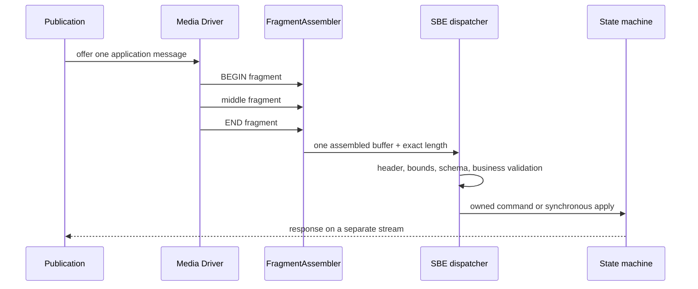

接收 handler 的提交语义必须另行定义：

- 普通 `poll` 的 callback 抛异常，不会自动变成可恢复事务；
- 普通 `FragmentAssembler` 要与 `poll`/`FragmentHandler` 配对，它的 delegate 不能返回 `Action`；
- 若希望完整重组后的消息能返回 `ABORT` 并重投，应使用 `ControlledFragmentAssembler + controlledPoll`。只要 controlled callback 因队列满、资源暂不可用或已处理的失败分支而明确返回 `ABORT`，当前 fragment position 就不会提交；
- 即使重新 poll，外部数据库副作用也可能已经发生；需要业务幂等键或同一事务边界；
- Archive 记录的是 Aeron stream，不会验证 SBE 业务消息是否有权限或语义正确。

若处理流程是 decode → 入队 → worker apply，应在入队前复制 owned data，并对队列满定义明确的 backpressure/reject 策略。静默丢一条 command 再继续处理下一条，会把可靠传输变成不可检测的业务 gap。

### Aeron Cluster 中的 SBE：确定性比省对象更重要

Aeron Cluster 常用 SBE 编码 ingress command、egress response 和 snapshot record，但 codec 不会自动提供确定性。

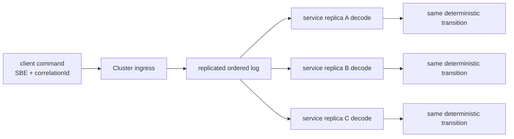

所有副本必须对同一字节得出相同状态转换：

- 金额使用 fixed-point integer，不使用依赖平台舍入的模糊路径；
- 缺失 optional field 的规则固定且版本化；
- 未知 enum/template 的处理是确定性的 fail/reject，而不是节点本地配置决定；
- codec 只读取日志字节，不调用本地墙钟、随机数或外部服务；
- 升级期间 app version、Schema version、snapshot version 与 rollout 顺序明确关联。

#### Snapshot 兼容是另一份合同

SBE 的 optional extension 对 snapshot 很有帮助，但 Cluster snapshot 不等同于在线 command：

- snapshot 是一组有 framing 的 records，不是一个无限大的 SBE message；
- 每个 record 仍要有 template/schema/version；
- snapshot 完成标志、校验与 manifest 在 SBE 外层；
- 新服务必须能加载受支持的旧 snapshot，再 replay 后续 log；
- 若状态模型发生不可兼容变化，应提供显式 migration，而不是靠 optional field 猜测。

发布前至少做 `old snapshot -> new service load -> old log suffix replay -> state hash` 测试。

### 发布新 Schema 的安全顺序

只要系统允许滚动升级，就必须假设一段时间内 old/new producer 和 consumer 同时存在。

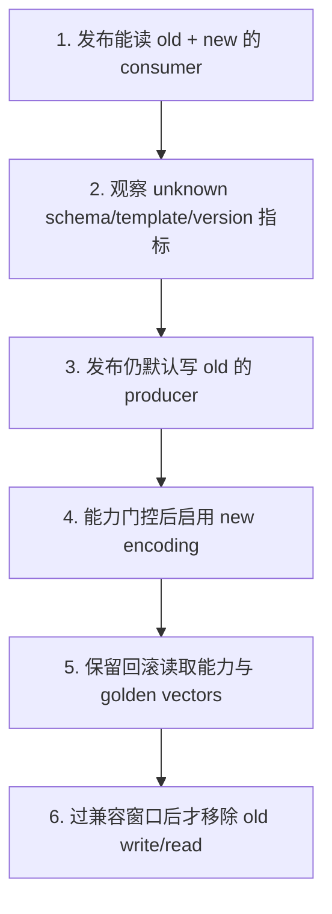

基本规律是 **reader first，writer later**：

1. 先让所有 consumer 能读旧版与新版；
2. 再部署包含新 encoder、但仍写旧版的 producer；
3. 用 capability registry、集群最低版本或明确 feature flag 判断何时开始写新字段；
4. 回滚窗口内不要删除旧 decoder；
5. Archive/备份保留期内存在旧消息，就要保留对应解码或迁移工具。

如果新业务“必须依赖 accountId”，那就不能仅靠字段 optional 宣称兼容。应在所有必要 reader 升级后才启用该业务能力，旧 sender 的缺失请求则明确拒绝或走可审计的旧路径。

#### 版本协商不要在每条消息上发明复杂握手

常见选择有：

- 单独的 connect/capability message；
- 控制面维护每个 client/service 支持的 schema range；
- stream/channel 按重大协议代际隔离；
- gateway 在边界做 old ↔ new translation；
- 对 Archive replay 使用记录当时的 schema/version，而不是当前默认值。

不要假设“收到过一条 v1 消息，所以对方以后永远支持 v1”：重连、故障切换和混合实例都会改变能力。能力必须绑定到会话/实例代际并可失效。

### 性能测试：测协议路径，不测一个 getter

SBE 的设计目标是低延迟，但最终结果取决于字段分布、Buffer、copy、Aeron offer/poll、业务校验和线程拓扑。可信实验至少拆成：

1. encode 到已有 heap/direct Agrona buffer；
2. decode 固定字段；
3. decode group 与 var-data 的真实分布；
4. encode + `Publication.offer`；
5. `tryClaim` encode + commit；
6. FragmentAssembler + decode；
7. 端到端 request/response 的开放负载延迟。

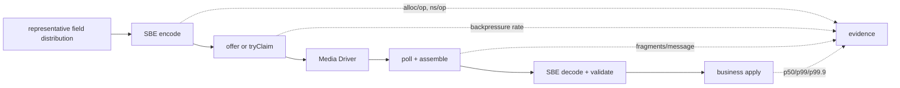

JMH 中应使用独立 fork、预热、消费结果，并避免把输入做成编译期常量。不要在 benchmark 每次 invocation 新建 `UnsafeBuffer`，除非你就是要测分配。生产回放还要保留：

- message size histogram；
- template/version 分布；
- group count 和 var-data length 分布；
- fragments per message；
- decode reject 原因；
- backpressure、queue depth 和 end-to-end tail latency。

更完整的测量方法见 [Java 低延迟到底应该怎么测](/signal-grid-blog/posts/java-low-latency-measurement/)。

### 运行时防线与故障策略

协议错误不能只写日志后继续猜。建议为每个接收边界定义以下状态：

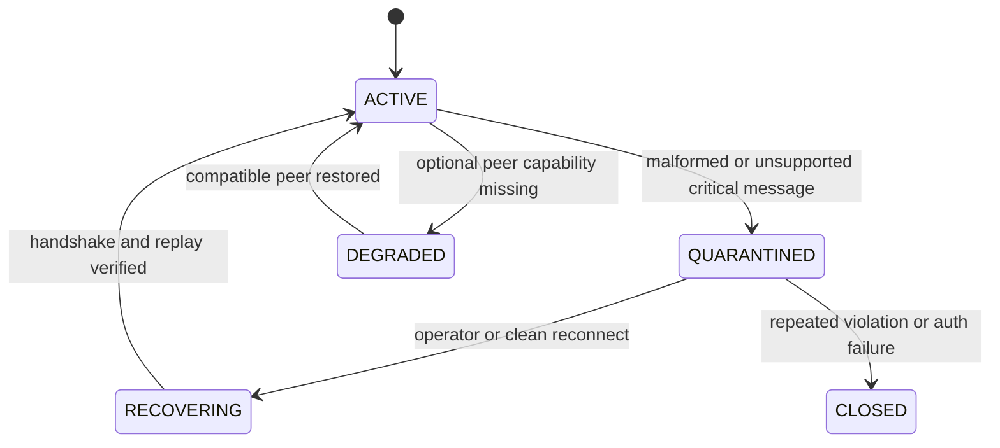

至少监控：

- `messages_total{schema,template,version}`；
- `unknown_schema_total`、`unknown_template_total`、`unknown_enum_total`；
- `malformed_length_total`、`bounds_failure_total`；
- `precedence_violation_total`（测试/预发布）；
- `decode_latency` 与 message size；
- `business_reject_total{reason}`；
- 每个 peer 的最小/最大支持版本；
- Archive replay 中遇到的最老 schema version。

策略要按消息性质区分：

- 未知的可选 telemetry template 可以跳过并计数；
- 未知的交易 command 不能静默丢弃，应拒绝、隔离会话并保存证据；
- malformed length 不能通过扫描下一个“像 header 的字节”继续解码同一 frame；
- Cluster log 中出现不可解码 command 属于恢复阻断，应 fail closed，而不是让各副本各自忽略。

## 结论：SBE 的性能建立在可演进的字节合同上

SBE 的价值不是“把 JSON 换成二进制”这么简单。它把消息布局从运行时猜测变成构建期合同，并让生成的 Flyweight 直接覆盖 Aeron/Agrona Buffer。代价是调用方必须尊重更严格的顺序、所有权和版本规则。

可以把整套协议浓缩成四条不变量：

1. **完整边界**：decoder 只接收已经 framing/重组完成并通过长度约束的一条消息。
2. **顺序访问**：root、group、var-data 按 Schema 状态机推进，不随机跳转。
3. **尾部演进**：兼容扩展只发生在 block 尾部，并由 blockLength、actingVersion 和明确 null 语义共同支撑。
4. **证据发布**：兼容性由 old/new 交叉矩阵、golden bytes、跨语言测试和混合版本演练证明，不由“XML 能生成代码”证明。

Aeron 让字节流快速、可靠地移动；SBE 让这些字节在多年演进和多语言系统中仍可解释；业务协议再负责幂等、权限与状态机。把三者混成一个“低延迟消息库”，迟早会在升级或恢复时付出代价。把边界拆开，才可能同时得到性能、可演进性和可证明的正确性。

## 参考资料

- [SBE 1.39.0 release](https://github.com/aeron-io/simple-binary-encoding/releases/tag/1.39.0)
- [SBE 官方 Overview](https://aeron.io/docs/simple-binary-encoding/overview/)
- [SBE Java Users Guide](https://github.com/aeron-io/simple-binary-encoding/wiki/Java-Users-Guide)
- [SBE Tool Guide](https://github.com/aeron-io/simple-binary-encoding/wiki/Sbe-Tool-Guide)
- [SBE Tool Maven](https://github.com/aeron-io/simple-binary-encoding/wiki/Sbe-Tool-Maven)
- [SBE Message Versioning](https://github.com/aeron-io/simple-binary-encoding/wiki/Message-Versioning)
- [Safe Flyweight Usage](https://github.com/aeron-io/simple-binary-encoding/wiki/Safe-Flyweight-Usage)
- [SBE Design Principles](https://github.com/aeron-io/simple-binary-encoding/wiki/Design-Principles)
- [SBE Basic Sample](https://aeron.io/docs/simple-binary-encoding/basic-sample/)
- [Repeating Groups and Nulls](https://aeron.io/docs/simple-binary-encoding/more-complex/)
- [Aeron FragmentAssembler Javadoc](https://javadoc.io/doc/io.aeron/aeron-client/1.52.2/io/aeron/FragmentAssembler.html)
- [Aeron ControlledFragmentHandler Javadoc](https://javadoc.io/doc/io.aeron/aeron-client/1.52.2/io/aeron/logbuffer/ControlledFragmentHandler.html)
- [FIX Simple Binary Encoding specification](https://www.fixtrading.org/standards/sbe-online/)
