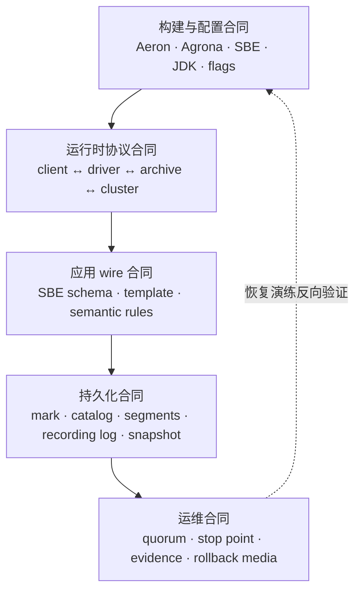
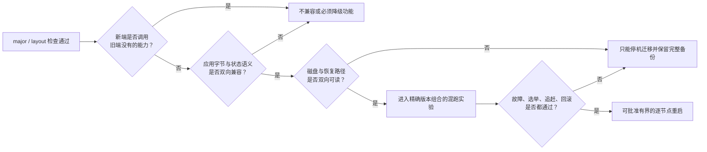
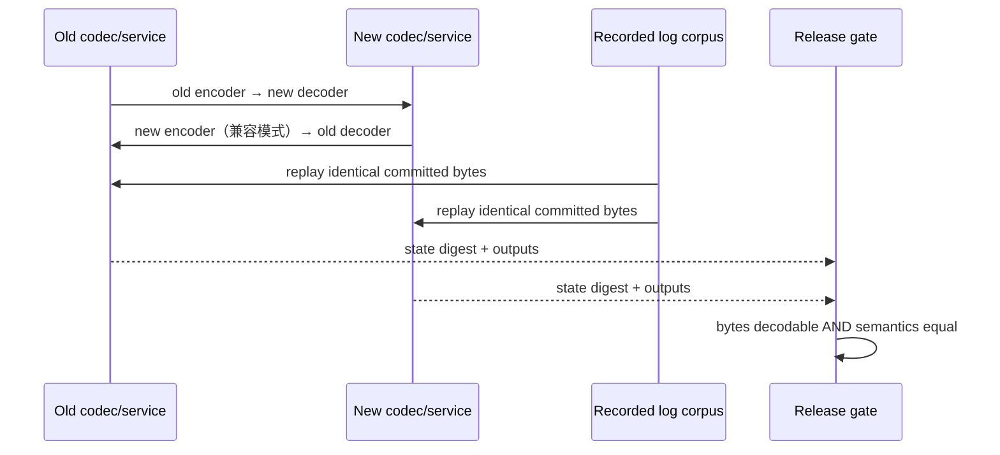
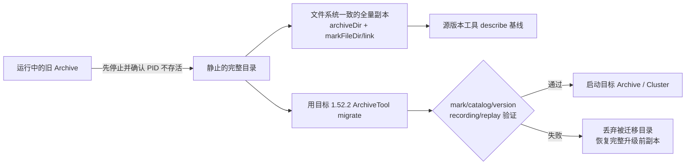
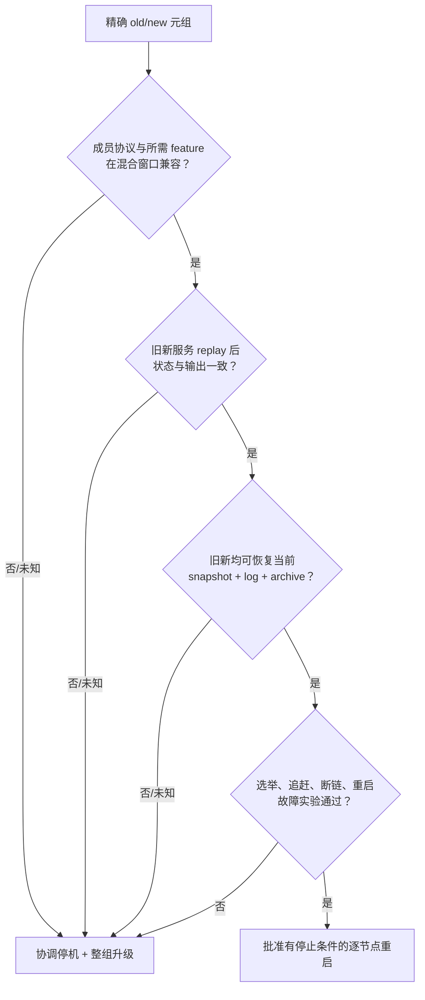
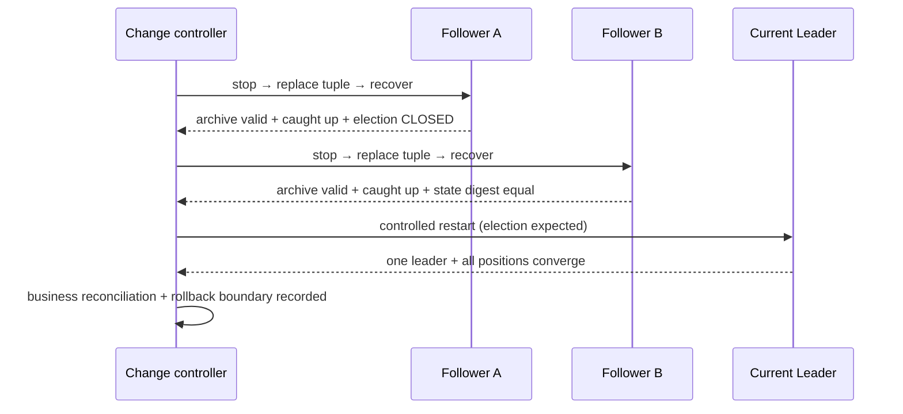

在上一篇 [Aeron Cluster 运行与性能工程](/signal-grid-blog/posts/aeron-cluster-operations-performance-and-troubleshooting/) 中，我们已经把 role、Election State、append/commit/service position、Archive 和错误 counters 还原成一条可观测的提交链。升级是在这条链仍承载真实状态时更换实现：它绝不是“替换几个 JAR，然后逐台重启”。

一个 Aeron 系统至少同时保存五种版本事实：client 与 Media Driver 如何交换命令，Archive 客户端如何控制服务端，Cluster 成员和客户端如何解释控制消息，应用 SBE 如何解释日志中的业务字节，以及 Archive、Recording Log、Snapshot 如何解释磁盘上的历史。它们的兼容规则不同，失败后的回滚成本也不同。

本文固定在 **Aeron 1.52.2** 源码与官方文档上讨论。文中的协议号、Archive format 和具体命令都是这个 tag 的事实，不是对未来版本的承诺。核心结论只有一句：

> 只有当精确的旧/新版本组合，已经证明能读取同一份历史、执行相同的确定性语义，并在故障注入后恢复到同一 committed prefix，逐节点重启才是一个可接受方案；否则默认方案应是协调停机、离线迁移和整组恢复。

## 升级的对象不是 JAR，而是五份版本合同

先区分三种经常被混用的“兼容”：

- **可连接**：握手或版本检查允许双方建立会话；
- **可解码**：接收方可以遍历字节而不越界，并识别字段；
- **可安全混跑**：旧、新进程对相同日志输入产生相同状态，故障后还能由保留的恢复介质重新启动。

前两项都不推出第三项。版本号的 major 相等，最多是某个组件入口采用的准入条件；它不证明新版本没有使用旧端缺少的 minor feature，也不证明业务状态机会得到同一结果。



### 先冻结精确的部署元组

升级计划的输入不应只写“从 Aeron 1.49 升到 1.52”。至少要冻结：

```text
old/new Aeron tag + commit
+ Agrona version
+ SBE tool/runtime/generated codec version
+ JDK vendor/version
+ application Git SHA and appVersion
+ SBE schema hash and generated-code hash
+ Media Driver / Archive / Cluster configuration hash
+ archive mark/catalog version
+ snapshot schema version and latest recovery positions
```

原因并不抽象。[1.52.2 tag 的 CHANGELOG](https://github.com/aeron-io/aeron/blob/1.52.2/CHANGELOG.adoc) 记录了跨版本的配置重命名、API 删除和行为修复。例如 1.52.0 移除了 `ConsensusModuleExtension#supportedSchemaId()`，并用 `VersionValidator` 接替应用版本验证接口；只看 Maven 中的 `aeron-all` 版本，无法知道配置、扩展或生成 codec 是否一起变化。

### 画出不可逆边界

升级过程中有三条性质不同的边界：

1. **进程边界**：只启动了新二进制，还没有写入新格式或新语义；通常仍可能退回旧二进制。
2. **存储格式边界**：`ArchiveTool migrate` 已改写 mark、Catalog 或 segment 文件名；旧二进制未必能再打开这份目录。
3. **应用历史边界**：新版本已向 Cluster log 提交旧版本无法正确解释的命令，或生成旧版本无法加载的 snapshot；此时“把 JAR 换回去”已不构成回滚。

后两条边界一旦越过，回滚依赖的是**完整且一致的升级前介质**，不是进程管理器的 restart 功能。

## 运行时协议暴露版本事实，但不替你证明混合版本安全

Aeron 有多条彼此独立的控制协议。1.52.2 中几个容易混淆的版本如下：

| 边界 | 1.52.2 中的版本事实 | 当前暴露的检查/声明机制 | 不能由此推出什么 |
| --- | --- | --- | --- |
| Java client ↔ Media Driver | CnC layout `0.2.0`；另有 control protocol counter `1.0.0` | `CncFileDescriptor.checkVersion` 比较 CnC major；1.52.2 Java client 对 `NEXT_AVAILABLE_SESSION_ID` 有显式版本门槛与旧 Driver fallback | 任意两个同 major 版本都经过集成验证，或其他新命令也会自动降级 |
| Archive client ↔ Archive | control protocol `1.12.0` | Archive 建立 control session 时比较 major；client 只在协议 `>= 1.11` 时请求 `archiveId` | Catalog/segment 的磁盘格式也兼容，或所有后加能力都有统一 gate |
| Cluster client ↔ Cluster | client protocol `0.3.0` | `SessionManager` 拒绝 major 不同的 client；源码注释明确 minor 不同时部分能力可能不可用 | Cluster 成员可以安全滚动混跑 |
| Consensus Module ↔ Consensus Module | consensus protocol `1.0.0` | `CanvassPosition` / `RequestVote` 携带该值，但 1.52.2 election handler 不据此拒绝成员 | 不能把它当作成员准入、自动 fencing 或公开的 rolling-upgrade 合同 |

这些数值可分别从 [CnC descriptor](https://github.com/aeron-io/aeron/blob/1.52.2/aeron-client/src/main/java/io/aeron/CncFileDescriptor.java)、[ControlProtocolEvents](https://github.com/aeron-io/aeron/blob/1.52.2/aeron-client/src/main/java/io/aeron/command/ControlProtocolEvents.java)、[AeronArchive.Configuration](https://github.com/aeron-io/aeron/blob/1.52.2/aeron-archive/src/main/java/io/aeron/archive/client/AeronArchive.java)、[AeronCluster.Configuration](https://github.com/aeron-io/aeron/blob/1.52.2/aeron-cluster/src/main/java/io/aeron/cluster/client/AeronCluster.java) 和 [ConsensusModule.Configuration](https://github.com/aeron-io/aeron/blob/1.52.2/aeron-cluster/src/main/java/io/aeron/cluster/ConsensusModule.java) 复核。

尤其要注意最后一行：consensus version 出现在报文里，不等于接收路径已经执行兼容性检查。1.52.2 的 `Election.onCanvassPosition` / `onRequestVote` 没有依据该字段拒绝对端；它至多是声明与诊断证据，不能单独承担混合版本安全。



### Client/Driver 的 CnC major 不是支持矩阵

`cnc.dat` 同时暴露共享内存布局、命令 ring buffer、broadcast buffer、counters 和 error log。1.52.2 的 `CNC_VERSION` 是 `0.2.0`，检查函数只比较 major；从 1.49 起，Driver 还通过 system counter 发布独立的 control protocol semantic version。当前 Java `ClientConductor` 明确用它保护的是 `NEXT_AVAILABLE_SESSION_ID`：旧 Driver 不支持该命令时回退到随机 session id。不能把这个具体 fallback 泛化成“所有未来命令都会自动协商”。

这套机制让协议可以演进，却不等于官方为所有跨版本排列提供支持。发布前仍要验证：

- 目标 API 是否在 CHANGELOG 中被删除或改义；
- Driver 配置项、默认值和目录布局是否变化；
- 新 client 是否真的禁用了旧 Driver 不认识的命令；
- 旧 client 是否能接受新 Driver 返回的新错误和事件；
- sidecar、监控工具和业务进程是否误连到不同的 Aeron directory。

对于同机嵌入式部署，最稳妥的边界通常是把应用 client 与 Media Driver 当作同一发布单元。若组织确实要跨版本连接，就把“旧 client→新 Driver”和“新 client→旧 Driver”作为两条独立测试路径，不能只测一种方向。

### 网络协议兼容与磁盘兼容必须分开

Archive control session 能建立，只证明 control protocol 通过准入。Archive 随后要读取的 `archive-mark.dat`、`archive.catalog` 和 `.rec` segment 是另一份格式合同。类似地，Cluster client 能连上 Leader，只证明 client protocol major 被接受，不证明该节点能加载旧 snapshot，更不证明 Cluster 中的新旧服务会执行相同逻辑。

所以版本实验必须分别记录四个结果：连接、功能、持久化恢复、故障后的重新加入。把它们压缩成一个“兼容/不兼容”布尔值，会直接丢掉回滚所需的信息。

## 应用 SBE 的兼容目标是相同语义，而不只是成功解码

Aeron 自身的控制协议采用 SBE，不会替应用管理业务 schema。订单、行情、幂等 envelope 或 Cluster command 的 schema，仍由应用负责。完整的 Schema/Flyweight 机制见 [Aeron 与 SBE：Schema、Flyweight 与兼容性测试](/signal-grid-blog/posts/aeron-sbe-schema-flyweight-and-compatibility-testing/)；升级阶段要再加一条更强的约束：**同一条已提交日志在所有在线版本上必须产生同一状态转换。**

### 兼容改动必须保持布局与含义

通常可向前演进的改动包括：

- 在 root fixed block 尾部追加字段，并设置正确的 `sinceVersion`；
- 按 schema 顺序在末尾追加 repeating group 或 var-data；
- 新 decoder 用 `actingVersion` 判断字段是否存在；
- 旧 decoder 依靠发送方的 `actingBlockLength` 跳过未知的 fixed tail；
- 永不复用 `templateId`、field id 或 enum value 表达另一种含义。

但以下改动即使“字节还能读”，也可能破坏状态机：

- 把缺失字段的默认值从“不开启”改成“自动开启”；
- 旧版本忽略一个新命令，新版本却把它计入余额或序列号；
- 调整舍入、时间边界、排序或重复请求处理；
- 同一 template 在同一 version 下改变业务不变量；
- 先让 producer 发出新字段，再升级所有需要消费该语义的节点。

根本性语义变化更适合使用新的 template/message type，或在日志中写入一个明确的协议切换事件，而不是静默改变旧字段含义。



### 交叉矩阵要同时覆盖 wire、历史和输出

最低限度应保留两套真正独立生成的 codec artifact：旧 schema/旧 generator 与新 schema/新 generator。测试矩阵至少包括：

| 生产者 | 消费者 | 要证明的内容 |
| --- | --- | --- |
| 旧 encoder | 新 decoder | 新版本能读取历史和仍未升级的 producer |
| 新 encoder 的兼容模式 | 旧 decoder | 混跑窗口内不会发送旧端无法跳过或无法正确默认的语义 |
| 生产日志语料 | 新、旧状态机 | replay 后状态摘要、egress、timer 和 dedup 结果一致 |
| 新版本完整能力 | 旧 decoder | 应明确失败或被发布闸门禁止，而不是“碰巧能读” |

这里的 golden corpus 应包含真实的 fragment 边界、未知 enum、可选字段缺失、最大 group、空 var-data、重复命令和跨 snapshot/replay 的历史，不应只编码一个 happy-path POJO。

### 发布顺序由“谁先理解”决定

兼容扩展通常遵循 **reader first，writer last**：先部署能理解新旧格式但仍发旧语义的 reader，确认所有必要消费者已经就绪，再打开 producer 的新能力。回退则反过来：先关闭新语义的 writer，确认日志尾部不再含旧版本不能处理的消息，再讨论 reader 的二进制回退。

若新消息已经 committed，旧 reader 就算尚未看到它，也不能被视为可回滚版本。历史不会因为进程被停止而消失。

## Archive 迁移是离线存储事务，不是启动时顺手执行的脚本

Archive 的持久化状态至少包括：

- `archive-mark.dat`：组件身份、配置和 storage semantic version；它可由 `aeron.archive.mark.file.dir` 放在 Archive 数据目录之外；
- `archive-mark.lnk`：mark file 外置时由 Archive 数据目录指向真实 mark 目录的链接文件；
- `archive.catalog`：recording descriptor、recording id、start/stop position、term/segment/MTU 等元数据；
- `<recordingId>-<segmentBasePosition>.rec`：带 Aeron frame 的录制 segment；
- 对 Cluster 而言，Catalog 中的 recording 与 cluster directory 的 `recording.log`、snapshot 条目共同组成恢复计划。

1.52.2 的 [ArchiveMarkFile](https://github.com/aeron-io/aeron/blob/1.52.2/aeron-archive/src/main/java/io/aeron/archive/ArchiveMarkFile.java) 定义 storage semantic version 为 **3.1.0**：major 变化表示需要迁移的磁盘格式变化，minor 表示新增能力，patch 表示保持能力集合的修复。Catalog 打开时也会校验相应 major。

### `ArchiveTool migrate` 实际会改什么

[ArchiveMigrationPlanner 1.52.2](https://github.com/aeron-io/aeron/blob/1.52.2/aeron-archive/src/main/java/io/aeron/archive/ArchiveMigrationPlanner.java) 会从旧 mark version 规划有序步骤。历史步骤并非只改一个版本字段：0→1、1→2 包含 segment 重命名，2→3 会生成更新后的 Catalog、替换原 `archive.catalog`，再更新 mark version。每个步骤还会创建 `migration-<from>-to-<to>.dat` 标记文件。

因此迁移不是幂等复制，也没有通用的“反向 migrate”。进程在重命名 segment、替换 Catalog 和更新 mark 之间崩溃时，目录可能处于中间状态；仅仅再次运行命令或换回旧 JAR，都不是被证明的回滚。



### 一次有证据的离线迁移

下面是过程骨架，不是可原样复制的路径约定。必须先停止所有会访问该目录的 Archive、Cluster 和工具进程，再由文件系统快照或全量复制生成一致副本。若 mark file 外置，还要把 `markFileDir` 一起冻结，并让工作副本中的 `archive-mark.lnk` 指向**复制后的 mark**；否则对复制的 archiveDir 运行工具，仍可能沿 link 改到原环境的 mark file。

```bash
# 已停机后，用源版本当时支持的只读 inventory 记录旧 major 基线
# 1.43.0+ 可用 describe-all；更老版本使用该版本的 describe 形式
java --add-opens java.base/jdk.internal.misc=ALL-UNNAMED \
  --add-opens java.base/java.util.zip=ALL-UNNAMED \
  -cp aeron-all-SOURCE_VERSION.jar \
  io.aeron.archive.ArchiveTool /srv/aeron/archive-pre-upgrade SOURCE_INVENTORY_COMMAND

# 只对准备被迁移的工作副本执行；命令会交互确认
java --add-opens java.base/jdk.internal.misc=ALL-UNNAMED \
  --add-opens java.base/java.util.zip=ALL-UNNAMED \
  -cp aeron-all-1.52.2.jar \
  io.aeron.archive.ArchiveTool /srv/aeron/archive-next migrate
```

目标 1.52.2 的 `describe-all` 不能充当迁移前的通用旧格式读取器：它以只读方式打开 Catalog 时仍要求 major 为当前 `3`。因此源版本工具负责记录迁移前基线；源版本在 1.43.0 及以后可用 `describe-all`，更老版本要用当时已有的 `describe`/inventory 形式。目标工具只负责在工作副本上执行 `migrate`，并在迁移完成后描述和验证目标格式。

1.52.2 的 [`ArchiveTool.migrate`](https://github.com/aeron-io/aeron/blob/1.52.2/aeron-archive/src/main/java/io/aeron/archive/ArchiveTool.java) 会捕获异常并把 stack trace 打到输出；CLI 的该分支没有据此显式设置非零退出码。自动化不能只检查 `$?`，还要检查完整输出，并以迁移后的 `describe-all`、版本、Catalog/segment 对应关系和真实 replay 为成功条件。

还有一个更隐蔽的边界：同一工具的 `verify` 会以**读写**方式打开 Catalog。发现错误时它会把 recording 标为 `INVALID`，可能修正 stop position；验证通过且存在 segment 时，也可能把既有 `INVALID` 条目重新标为 `VALID`；遇到最后一个 fragment 跨 page 边界时还会询问是否截断文件。`verify -a` 因而应运行在另一个脱机副本上，而不是当作线上只读探针：

```bash
java --add-opens java.base/jdk.internal.misc=ALL-UNNAMED \
  --add-opens java.base/java.util.zip=ALL-UNNAMED \
  -cp aeron-all-1.52.2.jar \
  io.aeron.archive.ArchiveTool /srv/aeron/archive-verify-copy verify -a
```

验证通过至少意味着：所有预期 recording 仍在，start/stop position 合理，Catalog 描述与 segment 集合匹配，关键 recording 可以从指定 position replay，并且 Cluster 的 recovery plan 引用的 recording id/position 仍存在。只复制 `archive.catalog`，只保留 `.rec` 文件，或漏掉外置 mark/link，都不是完整备份。

### Cluster 使用的 Archive 必须与 cluster directory 一起冻结

Cluster log 和 service snapshots 是 Archive recordings；`recording.log` 则位于 cluster directory，记录 log term 与 snapshot 对这些 recordings 的引用。Consensus Module 与 service mark 也可由 `aeron.cluster.mark.file.dir` 放到 cluster directory 之外：前者由原目录中的 `cluster-mark.lnk` 指向真实位置，每个 service 则使用 `cluster-mark-service-<serviceId>.lnk`。要迁移 Cluster 的 Archive，必须在整个 Cluster 处于受控停止状态时，保存同一时点的：

```text
每个成员的 cluster directory / node state
+ 每个成员的 external cluster markFileDir / cluster-mark.lnk / cluster-mark-service-<serviceId>.lnk
+ 每个成员对应的 Archive directory
+ 每个成员的 external archive markFileDir / archive-mark.lnk
+ RecordingLog 与它引用的 recording ids / positions
+ 目标恢复计划和应用版本
```

不要在运行中分别复制这些目录，也不要把 `ArchiveTool migrate` 指向 cluster directory。复制到演练/迁移环境后，必须把 `archive-mark.lnk`、`cluster-mark.lnk` 与全部 `cluster-mark-service-<serviceId>.lnk` 都重定向到各自副本，再运行 ArchiveTool、ClusterTool 或启动组件；否则工具可能沿 link 打开原环境的 mark。

这也不是纯粹的监控文件问题。1.52.2 在 `NodeStateFile` 尚无 candidate term 时，会从旧 `ClusterMarkFile` 迁移持久 election term；漏掉外置 cluster mark 可能让跨版本恢复丢失必要的选举代际证据。`ClusterMarkFile` 声明 semantic version 为 `0.3.0`，但构造时只比较 major `0`，不是精确 `0.3.0` 相等检查；开源工具中也不存在一个等价于 Archive migration planner、能把任意 Cluster 状态自动转换到新应用 schema 的通用命令。

## Cluster 的 `appVersion` 是恢复与任期检查，不是 Snapshot 转换器

1.52.2 在 `ConsensusModule.Context` 和 `ClusteredServiceContainer.Context` 都提供 `appVersion(int)` 与 `appVersionValidator(VersionValidator)`。默认 `appVersion` 是 `0.0.1`，默认 [`AppVersionValidator`](https://github.com/aeron-io/aeron/blob/1.52.2/aeron-cluster/src/main/java/io/aeron/cluster/AppVersionValidator.java) **只比较 semantic version 的 major**。

应用应显式设置同一发布定义的版本，而不是长期依赖默认值：

```java
final int appVersion = SemanticVersion.compose(2, 1, 0);

final ConsensusModule.Context consensusContext = new ConsensusModule.Context()
    .appVersion(appVersion);

final ClusteredServiceContainer.Context serviceContext =
    new ClusteredServiceContainer.Context()
        .appVersion(appVersion);
```

该值会进入 new leadership event 和 snapshot marker。Consensus Module 与 Clustered Service 在加载 snapshot、处理 new leadership term、replay leadership event 等路径上调用 validator；不兼容会让相关恢复/运行路径 fail fast。它**不是 membership 或 election admission**：节点仍可能先参与 canvass/vote，直到后续验证路径才因版本不兼容退出。因此不能依靠 `appVersion` 阻止不兼容 voter 影响一次混合版本选举。它也不会：

- 修改 snapshot 中的业务字节；
- 把旧 log command 转换成新 command；
- 在节点参与选举前完成版本 fencing；
- 证明相同 major 下的 minor/patch 行为确定性相同；
- 证明旧二进制可以读取新版本刚生成的 snapshot；
- 替代应用自己的 snapshot schema version 与迁移逻辑。

如果 `2.1.0` 仍能读取 `2.0.0` snapshot，只是新增一个带默认值的派生字段，保留 major 可能合理；如果新版本改变余额计算、timer 语义或 snapshot 根布局，使旧版本无法得到同一状态，就应视为不兼容代际，不能因为默认 validator 仍放行而继续混跑。自定义 validator 可以收紧**被调用路径上的版本检查**，但放宽 validator 也不会让不兼容字节自动兼容，更不会把它变成 election 前置准入。

### Snapshot 与 log 要分别验证

Cluster 恢复不是“加载最近 snapshot”就结束：

```text
load Consensus Module snapshot
+ load every service snapshot at a coherent snapshot position
+ replay committed log tail after snapshot
+ establish new leadership term
+ resume deterministic service execution
```

因此至少需要四组实验：

1. 新版本加载升级前 snapshot，并 replay 升级前 log tail；
2. 新旧版本分别 replay 同一录制语料，比较状态 digest 与 egress；
3. 混合版本窗口中触发 follower catch-up、leader election 和 snapshot；
4. 新版本写入一段历史、生成 snapshot 后，尝试旧版本恢复，以明确真正的回滚边界。

第 4 项失败并不一定说明升级不能做；它说明一旦越过该点，回退只能恢复升级前的完整状态，且必须接受/处理此后的 RPO 与客户端未知结果。不能把这个结果隐瞒成“回滚脚本待补”。

### 开源 Cluster 的多数派不是 rolling-upgrade 证明

三节点集群一次停止一个 follower，表面上仍保留多数派；但 Raft 可用性只说明其余节点可能提交，不说明新旧实现会：

- 对选举、leadership term 和 catch-up 使用兼容协议；
- 读取同一 Archive 与 Snapshot；
- 对相同 command 做确定性一致的状态转换；
- 在新节点成为 Leader 后继续让旧节点追赶；
- 在跨越新日志/快照边界后仍允许二进制回退。

公开的 1.52.2 文档和 tag 源码没有给出“任意受支持版本都可对开源 Cluster 热升级”的一般保证；CHANGELOG 甚至对特定修复明确要求 **clean shutdown、取得 snapshot、整组 Cluster 重启**。所以逐节点重启必须是某个精确版本元组的实验结论，不能从“protocol major 相同”或“始终有多数派”推导出来。



## 把升级组织成有入口、有闸门、有退出证据的过程

先做方案选择，再写命令。存在 Archive format major 迁移、snapshot 不兼容、业务语义不兼容，或精确混跑组合未经证明时，应选择**协调停机升级**。只有上一节每个闸门都有证据，才考虑**逐节点重启**。

### 路径 A：协调停机与整组恢复

有界过程如下：

1. 停止接收新业务请求，等待已受理请求到达可说明的 committed/application position；保存未决 request id。
2. 通过 Cluster 的受控终止/快照机制取得恢复点；记录 `list-members`、`recording-log`、`recovery-plan`、每个服务 position 和状态 digest。
3. 停止全部 Cluster、Archive、Media Driver，确认没有进程再映射或写入目录。
4. 冻结每个节点的 cluster + archive 完整目录、两类外置 markFileDir，以及 `archive-mark.lnk`、`cluster-mark.lnk` 和全部 service mark links，并保存旧二进制、配置、schema 与生成 codec。
5. 若 storage major 要求迁移，在工作副本上用目标版本 `ArchiveTool migrate`；保留原副本不动。
6. 用目标二进制在隔离环境先恢复、replay 和对账，再启动生产成员。
7. 重新开放流量前，确认唯一 Leader、Election `CLOSED`、positions 收敛、状态 digest/业务对账一致，客户端未决请求按幂等协议解决。

这条路径牺牲一段计划内可用性，换来单一版本和清晰的恢复边界。对于涉及磁盘 major 或状态机语义改变的升级，这通常是更低风险的选择。

### 路径 B：经过资格验证的逐节点重启

若精确版本组合已证明安全，通常先处理 follower，最后处理当前 Leader；但这只是运行策略，不是协议保证。每个节点只能在上一个节点完全重新加入后推进：



推进条件不是“进程端口已打开”，而是该节点已经：

- 从预期 snapshot/log term 恢复；
- 完成 replay/catch-up，append lag 回到事先预算；
- Election 回到 `CLOSED`，角色稳定；
- Archive recording 与 recovery plan 没有新增错误；
- service position 追到 commit position；
- 与集群权威状态的 digest/业务不变量一致。

任何一步出现持续 election、未知 schema、snapshot load 失败、recording invalid、error counter 增长或状态摘要不一致，都应停止在当前仍健康的多数派，不能为了“完成发布”继续换下一台。

### Aeron Premium / Cluster Standby 是另一套能力边界

[Aeron Premium Cluster Standby](https://aeron.io/premium-docs/aeron-cluster-standby/standby-overview.html) 是单独授权和部署的模块。官方 Premium 文档描述了 standby 获取 Cluster log/snapshots、可转换节点承担成员角色，以及通过 `PremiumClusterTool` 触发/复制 standby snapshot 的能力。这些能力可以改变迁移拓扑和维护窗口设计，但不能反向视为开源 `ClusterTool` 或 Cluster Backup 自带的通用热升级保证。

使用 Premium 时应按所购买版本的 Standby 文档重新建立版本矩阵、snapshot 接受策略、通知和切换过程；不要把 Premium 命令混进开源 runbook，也不要因为存在 standby 就省略应用 SBE、Archive format 和确定性状态验证。

## 观测与回滚必须围绕同一个 committed prefix

升级时最重要的观测不是 CPU 平均值，而是“各层是否仍指向同一份权威历史”。可以把证据分成下面几组：

| 证据层 | 升级前基线 | 每步推进证据 | 必须停止的信号 |
| --- | --- | --- | --- |
| 构建/配置 | Aeron/Agrona/SBE/JDK/app SHA、配置 hash | 实际进程与清单一致 | 混入第三种版本、配置漂移 |
| Driver/client | CnC/control protocol、client count、errors | client 正常注册，所需命令可用 | incompatible version、driver timeout、error count 增长 |
| Archive | mark/catalog version、recording ids、positions、errors | recording 继续，关键 replay 成功 | Catalog/segment 不匹配、recording invalid、stop position 异常 |
| Cluster | members、role、Election、append/commit/service positions | 唯一 Leader、Election `CLOSED`、lag 收敛 | election churn、commit 停止、service lag 扩大 |
| 应用状态 | snapshot version、state digest、余额/序列/幂等不变量 | 新旧节点摘要和输出一致 | 相同 committed position 得到不同状态 |
| 客户端 | session、request id、未决请求集合 | 重连成功，未知结果可查询/去重 | 重试产生重复副作用或无法对账 |

具体 counters 与 `ClusterTool` 读取方式见上一篇 [运行与性能工程](/signal-grid-blog/posts/aeron-cluster-operations-performance-and-troubleshooting/)。自动化读取 Aeron counters 时优先按稳定的 type id/registration metadata 关联，不要只依赖可能随版本细化的显示标签。

### 回滚先判断已经越过哪条边界

```mermaid
flowchart TB
  I["升级步骤失败"] --> A{"Archive format 是否已迁移？"}
  A -- "是" --> AR["停止全部写者<br/>恢复完整升级前 Archive + cluster tuple"]
  A -- "否" --> H{"新版本是否已提交<br/>旧端不理解的 log/snapshot？"}
  H -- "是" --> HR{"优先修复前滚；或恢复升级前完整 committed point<br/>声明 RPO 并处理客户端未知结果"]
  H -- "否" --> P{"是否只有进程/配置变化？"}
  P -- "是" --> BR["停止新进程，恢复旧 binary/config<br/>再验证 replay 与状态摘要"]
  P -- "否" --> X["保持当前多数派，保存证据<br/>不要猜测性截断或删除历史"]
```

回滚介质必须是一整个一致元组：

```text
old binary + old config + old generated codecs
+ cluster directory / node state / recording.log
+ external cluster markFileDir / cluster-mark.lnk / cluster-mark-service-<serviceId>.lnk
+ archiveDir + external archive markFileDir / archive-mark.lnk
+ archive.catalog + every referenced segment
+ compatible service and CM snapshots
+ exact log/snapshot positions
+ gateway/client protocol and unresolved request ledger
```

#### 只改了进程，不代表可以盲退

若新版本尚未改变持久化格式，也没有提交新语义，通常可以停止新进程、恢复旧二进制和配置。但旧版本重新启动后仍要用同一 recovery plan 完成 replay，并比较状态摘要；“文件时间戳没变”不是充分证据。

#### Archive 已迁移，就恢复整份目录

不要尝试只换回旧 `archive.catalog`，也不要按文件名猜测性地把 segment 改回去。停止所有访问者，隔离失败的工作目录，恢复完整的升级前 Archive；若 mark file 外置，同时恢复 archive markFileDir 并校验 link 只指向恢复副本。对于 Cluster，还要恢复与该 Archive 同一时点的 cluster directory/RecordingLog、external cluster markFileDir，以及 Consensus Module 与全部 service 的 links。然后用旧工具先描述恢复介质，再启动旧组件。

#### 新语义已经 committed，二进制回退可能已失效

如果旧版本无法解释新日志或新 snapshot，优先方案往往是修复并前滚。若业务必须恢复升级前 committed point，就需要完整恢复该点的 Cluster/Archive 状态，并明确之后已确认请求的 RPO；客户端超时请求还可能处于“已提交但响应丢失”的未知结果，必须用 request id、去重表和业务对账解决。

绝不能为了让旧进程启动而随意删除最新 snapshot、截断 Cluster log 或修改 RecordingLog。那会把一次已知的版本失败变成未经证明的共识历史重写。任何修复都应先复制原始介质，并遵循 [Archive 修复边界](/signal-grid-blog/posts/aeron-archive-operations-and-repair/) 中“先证据、后动作、可重放验证”的原则。

## 结论：滚动重启是一项实验结论，不是版本号福利

Aeron 的低延迟路径把很多机制做得显式，升级也因此必须显式。CnC major、Archive control protocol major、Cluster client protocol major 是局部兼容检查，consensus protocol version 是未被 1.52.2 election 强制验证的声明元数据，`appVersion` 则在恢复/任期路径上 fail fast；它们没有任何一个能单独证明应用 SBE 语义、Archive 磁盘格式、Cluster snapshot 和确定性状态机可以安全混跑。

真正可执行的升级论证是：先固定旧/新部署元组，分别验证运行时协议和应用 wire contract；再离线处理 Archive format，证明 snapshot + log replay；只有精确组合通过选举、追赶、故障和旧版恢复实验，才批准有停止条件的逐节点重启。越过 Archive migration 或新历史提交边界后，回滚对象也必须从“JAR”升级为“完整 committed-state tuple”。

至此，Aeron 专题从 Transport、Archive、Cluster 走到了版本演进边界。下一篇 [Cluster 故障实验室](/signal-grid-blog/posts/aeron-cluster-failure-lab-snapshot-election-backup-recovery/) 不再靠“应该能恢复”的推断，而会用 snapshot、election、backup、状态摘要、RPO 与 RTO，把本篇的升级和回滚条件真正跑成验收证据。

## 一手资料

- [Aeron 1.52.2 CHANGELOG](https://github.com/aeron-io/aeron/blob/1.52.2/CHANGELOG.adoc)
- [Aeron Versioning FAQ](https://github.com/aeron-io/aeron/wiki/FAQ#what-is-the-aeron-versioning-strategy)
- [CnCFileDescriptor 1.52.2](https://github.com/aeron-io/aeron/blob/1.52.2/aeron-client/src/main/java/io/aeron/CncFileDescriptor.java)
- [ControlProtocolEvents 1.52.2](https://github.com/aeron-io/aeron/blob/1.52.2/aeron-client/src/main/java/io/aeron/command/ControlProtocolEvents.java)
- [ClientConductor 1.52.2](https://github.com/aeron-io/aeron/blob/1.52.2/aeron-client/src/main/java/io/aeron/ClientConductor.java)
- [AeronArchive.Configuration 1.52.2](https://github.com/aeron-io/aeron/blob/1.52.2/aeron-archive/src/main/java/io/aeron/archive/client/AeronArchive.java)
- [ArchiveConductor 1.52.2](https://github.com/aeron-io/aeron/blob/1.52.2/aeron-archive/src/main/java/io/aeron/archive/ArchiveConductor.java)
- [Archive Tooling](https://aeron.io/docs/aeron-archive/aeron-archive-tooling/)
- [ArchiveTool 1.52.2](https://github.com/aeron-io/aeron/blob/1.52.2/aeron-archive/src/main/java/io/aeron/archive/ArchiveTool.java)
- [ArchiveMarkFile 1.52.2](https://github.com/aeron-io/aeron/blob/1.52.2/aeron-archive/src/main/java/io/aeron/archive/ArchiveMarkFile.java)
- [ArchiveMigrationPlanner 1.52.2](https://github.com/aeron-io/aeron/blob/1.52.2/aeron-archive/src/main/java/io/aeron/archive/ArchiveMigrationPlanner.java)
- [SBE Design Principles](https://github.com/aeron-io/simple-binary-encoding/wiki/Design-Principles)
- [AeronCluster.Configuration 1.52.2](https://github.com/aeron-io/aeron/blob/1.52.2/aeron-cluster/src/main/java/io/aeron/cluster/client/AeronCluster.java)
- [SessionManager 1.52.2](https://github.com/aeron-io/aeron/blob/1.52.2/aeron-cluster/src/main/java/io/aeron/cluster/SessionManager.java)
- [ConsensusModule 1.52.2](https://github.com/aeron-io/aeron/blob/1.52.2/aeron-cluster/src/main/java/io/aeron/cluster/ConsensusModule.java)
- [VersionValidator 1.52.2](https://github.com/aeron-io/aeron/blob/1.52.2/aeron-cluster/src/main/java/io/aeron/cluster/VersionValidator.java)
- [AppVersionValidator 1.52.2](https://github.com/aeron-io/aeron/blob/1.52.2/aeron-cluster/src/main/java/io/aeron/cluster/AppVersionValidator.java)
- [ClusteredServiceAgent 1.52.2](https://github.com/aeron-io/aeron/blob/1.52.2/aeron-cluster/src/main/java/io/aeron/cluster/service/ClusteredServiceAgent.java)
- [Cluster Standby Overview（Aeron Premium）](https://aeron.io/premium-docs/aeron-cluster-standby/standby-overview.html)
- [Cluster Standby Changelog（Aeron Premium）](https://aeron.io/premium-docs/aeron-cluster-standby/changelog.html)
